# A 前言

## 关于本规范

本规范描述了 AMBA® 一致性枢纽接口（Coherent Hub Interface，CHI）架构。

### 目标读者

本规范面向希望熟悉 CHI 架构，并设计与 CHI 架构兼容的系统和模块的硬件与软件工程师编写。

## 本规范的使用方法

本规范中的信息按部分组织，如本节所述：

第 B1 章 引言

阅读本章可了解 CHI 架构以及本规范中的术语。

第 B2 章 事务

阅读本章可了解节点之间通信通道的概述、相关的数据包字段、事务结构、事务 ID 流以及所支持的事务排序。

第 B3 章 网络层

阅读本章可了解 Network 层说明，该层是确定目的节点的节点 ID 所必需的。

第 B4 章 一致性协议

阅读本章可了解一致性协议的介绍。

第 B5 章 互连协议流程

阅读本章可了解不同事务类型的协议流程示例。

第 B6 章 独占访问

阅读本章可了解架构为支持独占访问而包含的机制说明。

第 B7 章 缓存暂存

阅读本章可了解缓存暂存机制，通过该机制可以将数据安装到缓存中。

第 B8 章 DVM 操作

阅读本章可了解协议用于管理虚拟内存的 DVM 操作说明。

第 B9 章 错误处理

阅读本章可了解错误响应要求的说明。

第 B10 章 领域管理扩展

阅读本章可了解领域管理扩展（RME）的说明。

第 B11 章 系统控制、调试、追踪与监控

阅读本章可了解为系统的控制、调试、追踪和性能测量提供额外支持的机制说明。

第 B12 章 内存标记

阅读本章可了解内存标记扩展（MTE）的说明，该扩展提供了一种用于检查内存中所保存数据是否被正确使用的机制。

第 B13 章 链路层

阅读本章可了解 Link 层的说明，该层提供了协议节点与互连之间基于数据包的通信机制。

第 B14 章 链路握手

阅读本章可了解链路层握手要求的说明。

第 B15 章 系统一致性接口

阅读本章可了解用于支持组件接入和断开 Coherency 域与 DVM 域两者的接口信号说明。

第 B16 章 属性、参数与广播信号

阅读本章可了解用于灵活配置可选接口属性的可选信号说明。

第 C1 章 消息字段映射

阅读本章可了解消息的字段映射。

第 C2 章 通信节点

阅读本章可了解协议内可以合法通信的节点对。

第 C3 章 节点事务子集

阅读本章可了解请求方和从属方的节点事务子集。

第 C4 章 事务汇总

阅读本章可了解事务汇总。

第 C5 章 修订

阅读本章可了解本规范各发布版本之间技术变更的说明。

第 D1 章 术语表

阅读本章可了解本规范中所用术语的定义。

### 约定

#### 排版约定

排版约定如下：

斜体 用于突出显示重要说明、引入特殊术语，并表示内部交叉引用与引用。

粗体 表示信号名，并在适当情况下用于描述性列表中的术语。

等宽字体 用于汇编语法描述、伪代码和源代码示例。在正文中，也用于指令助记符，以及对汇编语法描述、伪代码和源代码示例中出现的其他条目的引用。

小型大写字母 用于少数具有特定技术含义的术语。

#### 时序图

时序图中使用的各组件在图 1 中说明。出现变体时会有明确的标注。不要假设图中未明确给出的任何时序信息。

阴影表示的总线与信号区域是未定义的，因此在该时刻总线或信号可以取阴影区域内的任意值。实际电平并不重要，也不影响正常工作。

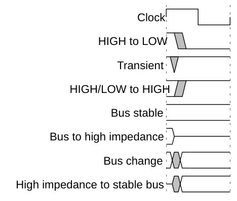

图 1：时序图约定图例

时序图有时会把单比特信号同时表示为 HIGH 和 LOW，其外观与图 1 图例中所示的总线变化相似。如果时序图以这种方式表示单比特信号，则其值不影响随附的说明。

#### 时空图

图 2 说明了用于描述协议流程的格式。

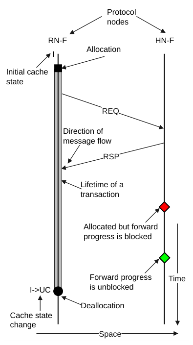

图 2：时空图约定图例

在图 2 中：

- 协议节点沿水平轴排列，时间沿垂直方向自上而下表示。
- 事务在某个协议节点上的生存期由沿时间轴的一个细长阴影矩形表示，覆盖从分配到解除分配的时段。
- 节点处的初始缓存状态显示在顶部。
- 时间线上的菱形表示请求的到达，以及其处理是否因等待另一事件完成而被阻塞。
- 事件发生时缓存状态的转换由 I->UC 表示。

#### 事务流程图

图 3 说明了用于描述事务流程图的格式。

节点 1 节点 2

请求消息（REQ 通道）

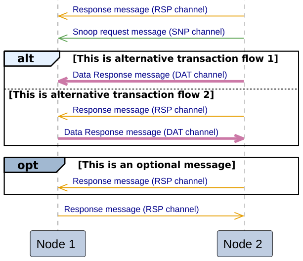

图 3：事务流程图约定图例

在图 3 中：

- 备选事务流程归为一组，并用虚线分隔不同的备选流程。
- 可选事务流程归为一组。
- 使用不同颜色的箭头表示不同的通道。
- 粗体箭头表示可能需要多个数据包传输的消息。

#### 信号

信号约定如下：

信号电平 有效信号的电平取决于该信号是高电平有效还是低电平有效。有效（Asserted）指：

- 高电平有效信号为 HIGH。
- 低电平有效信号为 LOW。

小写 n 位于信号名的开头或结尾，表示该信号为低电平有效信号。

#### 数字

数字通常以十进制书写。二进制数前缀为 0b，十六进制数前缀为 0x。两者均使用等宽字体书写。

### 延伸阅读

本节列出 Arm 及第三方发布的出版物。

访问 Arm 文档请参见 Arm Developer，http://developer.arm.com。

#### Arm 出版物

- AMBA® AXI 协议规范（ARM IHI 0022）。
- AMBA® CHI 芯片到芯片（C2C）架构规范（ARM IHI 0098）。
- Arm® A-profile 架构参考手册（ARM DDI 0487）。
- Arm® 领域管理扩展（RME）系统架构（ARM DEN 0129）。

### 反馈

Arm 欢迎对其文档提出反馈。

#### 关于本规范的反馈

如果您对我们的文档有任何意见或疑问，请在 https://support.developer.arm.com 创建工单。

在工单中，请包含以下内容：

- 标题（AMBA® CHI 架构规范）。
- 编号（ARM IHI 0050 Issue H）。
- 您的意见所涉及的章节名称。
- 您的意见所涉及的页码。
- 对您的意见的简要说明。

Arm 同样欢迎有关增补与改进的一般性建议。

#### 包容性术语承诺

Arm 重视包容性社区。Arm 认识到我们以及我们的行业曾使用过可能具有冒犯性的术语。

Arm 致力于引领行业并推动变革。

本文档的早期版本包含可能具有冒犯性的术语。我们已替换这些术语。如果您在本文档中发现具有冒犯性的术语，请联系 terms@arm.com。

# B 规范

第 B1 章

## B1 引言

本章介绍 CHI 架构以及本规范通篇使用的术语。本章包含以下各节：

- B1.1 架构概述
- B1.2 拓扑
- B1.3 术语
- B1.4 事务分类
- B1.5 一致性概述
- B1.6 组件命名
- B1.7 读数据源

### B1.1 架构概述

CHI 架构是一种可扩展的一致性集线器接口（hub interface）和片上互连，供多个组件使用。CHI 架构支持灵活的组件连接拓扑，由系统在性能、功耗和面积方面的需求驱动。

#### B1.1.1 组件

基于 CHI 的系统的组件可以包括：

- 独立处理器
- 处理器簇
- 图形处理器
- 内存控制器
- IO 桥
- PCIe 子系统
- 互连

#### B1.1.2 主要特性

该架构的主要特性包括：

- 可扩展架构，支持从小型系统到大型系统的模块化设计。
- 独立的层次化方法，由协议层、网络层和链路层组成，各层具有不同的功能。
- 基于数据包的通信。
- 所有事务由基于互连的归属节点（Home Node）处理，该节点协调所需的侦听、缓存和

内存访问。

- CHI 一致性协议支持：
- 64 字节缓存行的一致性粒度。
- 用于侦听扩展的侦听过滤器和基于目录的系统。
- 同时支持 MESI 和 MOESI 缓存模型，并可从任意缓存状态转发数据。
- 额外的部分和空缓存行状态。
- CHI 事务集包括：
- 经过增强的事务类型，可实现性能、面积和功耗高效的系统缓存

实现。

- 支持互连内的原子操作和同步。
- 支持高效执行独占访问（Exclusive access）。
- 用于高效移动和放置数据的事务，以便及时将数据移动到更接近

预期使用点的位置。

- 通过分布式虚拟内存（DVM）操作实现虚拟内存管理。
- 通过 Request Retry 和 Resource Planes 进行协议资源管理。
- 支持端到端服务质量（QoS）。
- 支持 Arm 内存标记扩展（MTE）。
- 支持 Arm 领域管理扩展（RME）。
- 可配置的数据宽度，以满足系统需求。
- 逐个事务提供 ARM TrustZone™ 支持。
- 采用生产者-消费者排序模型，为一致性写提供优化的事务流。
- 跨组件和互连的错误报告与传播，以实现系统的可靠性和完整性。
- 使用数据毒化（Data Poisoning）和按字节错误指示来处理子缓存行数据错误。
- 组件接口上的功耗感知信号：
- 支持 flit 级时钟门控。
- 用于时钟门控和电源门控控制的组件激活与去激活序列。
- 用于功耗和时钟控制的协议活动指示。

#### B1.1.3 架构层次

功能按以下各层进行分组：

- 协议
- 网络
- 链路

表 B1.1 描述了每一层的主要功能。

表 B1.1：CHI 架构的层次

层次 通信粒度 主要功能

协议 事务 协议层是 CHI 架构中最顶层的层。协议层的功能是：

- 在协议节点处生成和处理请求与响应。
- 定义包含缓存的协议节点处所允许的缓存状态转换。
- 定义每种请求类型的事务流。
- 管理协议级流控。

网络 数据包 网络层的功能是：

- 将协议消息打包（packetize）。
- 确定为将数据包经由互连路由到所需目的地所需的源和目标节点 ID，并将其添加到数据包中。

链路 flit 链路层的功能是：

- 在网络设备之间提供流控。
- 管理链路通道，以在网络中提供无死锁交换。

### B1.2 拓扑

CHI 架构基本上与拓扑无关。但是，本规范中包含了某些依赖拓扑的优化，以使实现更加高效。图 B1.1 给出了三个拓扑示例，用于展示可用的互连带宽与可扩展性选项的范围。

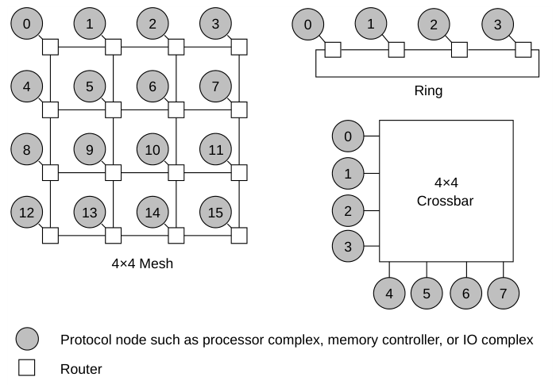

图 B1.1：互连拓扑示例

Crossbar Crossbar 拓扑易于构建，并天然提供一个有序且低时延的网络。Crossbar 拓扑适用于连线数量仍相对较少的情况。Crossbar 拓扑适用于节点数量较少的互连。

Ring Ring 拓扑在互连的布线效率与时延之间提供了折中。时延随环上节点数量的增加而线性增长。Ring 拓扑适用于中等规模的互连。

Mesh Mesh 拓扑以更多连线为代价提供更大的带宽。Mesh 拓扑模块化程度很高，通过增加更多的交换器行和列可以轻松扩展到更大的系统。Mesh 拓扑适用于较大规模的互连。

### B1.3 术语

以下术语在本规范中具有特定含义：

事务（Transaction）

一个事务执行单个操作。通常，一个事务要么从内存读取，要么向内存写入。

消息（Message）

消息是协议层术语，定义两个组件之间的交换粒度。例如：

- 请求
- 数据响应
- 侦听请求

单个数据响应消息可以由多个数据包组成。

数据包（Packet）

数据包是端点之间在互连上传输的粒度。一个消息可以由一个或多个数据包组成。例如，单个数据响应消息可以由 1 到 4 个数据包组成。每个数据包都包含路由信息，例如目的 ID 和源 ID，从而允许在互连上独立路由。

Flit

FLow control unIT（Flit）是最小的流控单元。一个数据包可以由一个或多个 flit 组成。给定数据包的所有 flit 在互连中都沿同一路径传输。

> **注意**
>
> 对于 CHI，所有数据包都由单个 flit 组成。

Phit

PHysical layer transfer unIT（Phit）是两个相邻网络设备之间的一次传输。一个 flit 可以由一个或多个 phit 组成。

> **注意**
>
> 对于 CHI，所有 flit 都由单个 phit 组成。

PoS

串行化点（Point of Serialization，PoS）是互连内的一个点，在该点确定来自不同代理的请求之间的顺序。

PoC

一致性点（Point of Coherence，PoC）是这样一个点：在该点上，所有能够访问内存的代理都保证能看到存储器位置的同一副本。在典型的基于 CHI 的系统中，PoC 是互连中的 HN-F。

PoE

加密点（Point of Encryption，PoE）是内存系统中的一个点，任何到达该点的写操作都已被加密。

PoP

持久化点（Point of Persistence，PoP）是内存系统中位于一致性点上或之后的一个潜在点，在该点上，对内存的写在系统断电时仍得以保持，并在受影响的内存位置恢复供电时被可靠地恢复。

PoDP

深度持久化点（Point of Deep Persistence，PoDP）是内存系统中的一个点，在该点即使电源与备用电池同时失效，数据仍得以保全。

PoPA

物理别名点（Point of Physical Aliasing，PoPA）是这样一个点：在该点上，对一个物理地址空间（PAS）中某个位置的更新对所有其他物理地址空间都可见。

PoPS

物理存储点（Point of Physical Storage，PoPS）是内存层次结构中距离 PE 或其他观察者最远的、写事务能够传播到的一个点，即内存。

下游缓存（Downstream cache）

下游缓存是从请求节点的视角定义的。某个请求的下游缓存是该请求使用 CHI 请求事务访问的缓存。请求节点可以发送带数据的请求，以将数据分配到下游缓存中。

请求方（Requester）

通过发出请求消息来启动事务的组件。术语请求方可用于独立发起事务的组件。术语请求方也可用于以下互连组件：该组件独立发出下游请求消息，或作为系统中正在发生的其他事务的副作用而发出下游请求消息。

完成方（Completer）

对从另一组件接收的事务作出响应的任何组件。完成方既可以是互连组件，例如归属节点或杂项节点，也可以是互连之外的组件，例如从属节点。

从属节点（Subordinate）

接收事务并适当地完成这些事务的代理。通常，从属节点是系统中最下游的代理。从属节点也可称为完成方或端点。

端点（Endpoint）

从属节点组件的另一个名称。端点是事务的最终目的地。

协议信用（Protocol Credit）

来自完成方的一种信用（credit）或保证，即其将接受某个事务。

链路层信用，L-Credit

一种信用（credit）或保证，即某个 flit 将在链路另一端被接受。L-Credit 是链路层上单跳的信用。

ICN

互连（Interconnect，ICN）是用于协议节点之间通信的 CHI 传输机制。互连可以包含一个特定于实现的（IMPLEMENTATION SPECIFIC）交换结构，其中的交换器以环、网、交叉开关或其他拓扑相连。互连还可以包含协议节点，例如归属节点和杂项节点。

IPA

中间物理地址（Intermediate Physical Address，IPA）。在两阶段地址转换中：

- 阶段 1 提供中间物理地址（IPA）。
- 阶段 2 提供物理地址（PA）。

RN

请求节点（Request Node，RN）向互连生成协议事务，包括读和写。

HN

归属节点（Home Node，HN）是互连内的一个节点，它接收来自请求节点的协议事务，完成所需的一致性操作，并返回响应。

SN

从属节点（Subordinate Node，SN）是接收来自归属节点的请求、完成所需操作并返回响应的节点。

MN

杂项节点（Miscellaneous 或 Misc Node，MN）是位于互连内的一个节点，它接收来自请求节点的 DVM 消息，完成所需操作，并返回响应。

IO 一致性节点（IO Coherent node）

除 Non-snoopable 请求之外还生成一部分 Snoopable 请求的请求节点。IO 一致性节点所生成的 Snoopable 请求不会使接收到的数据以一致性状态被缓存。因此，IO 一致性节点不接收任何侦听请求。

Snoopee

正在接收侦听的请求节点。

写无效协议（Write-Invalidate protocol）

一种协议，其中请求节点在写入系统中的共享缓存行时必须先使所有副本无效，然后才能继续执行该写操作。CHI 协议是一种写无效协议。

及时（In a timely manner）

协议无法定义某事件必须发生的绝对时间。一个足够空闲的系统无需显式动作即可推进并完成。

不适用（Inapplicable）

一种字段取值，表示该字段在消息处理中未被使用。

### B1.4 事务分类

本规范支持的协议事务及其主要分类见表 B1.2。

表 B1.2：事务分类

| 分类 | 支持的事务 |
| --- | --- |
| 读 | ReadNoSnp |
|  | ReadNoSnpSep |
|  | ReadOnce |
|  | ReadOnceCleanInvalid |
|  | ReadOnceMakeInvalid |
|  | ReadClean |
|  | ReadNotSharedDirty |
|  | ReadShared |
|  | ReadUnique |
|  | ReadPreferUnique |
|  | MakeReadUnique |
| Dataless | CleanUnique |
|  | MakeUnique |
|  | Evict |
|  | StashOnceUnique |
|  | StashOnceSepUnique |
|  | StashOnceShared |
|  | StashOnceSepShared |
|  | CleanShared |
|  | CleanSharedPersist |
|  | CleanSharedPersistSep |
|  | CleanInvalid |
|  | CleanInvalidPoPA |
|  | CleanInvalidStorage |
|  | MakeInvalid |
| 写 | WriteNoSnpPtl |
|  | WriteNoSnpFull |
|  | WriteNoSnpZero |
|  | WriteNoSnpDef |
|  | WriteUniquePtl |
|  | 下页续 |

表 B1.2 – 续上页

| 分类 | 支持的事务 |
| --- | --- |
|  | WriteUniqueFull |
|  | WriteUniqueZero |
|  | WriteUniquePtlStash |
|  | WriteUniqueFullStash |
|  | WriteBackPtl |
|  | WriteBackFull |
|  | WriteCleanFull |
|  | WriteEvictFull |
|  | WriteEvictOrEvict |
| 组合写 | WriteNoSnpPtlCleanInv |
|  | WriteNoSnpPtlCleanSh |
|  | WriteNoSnpPtlCleanShPerSep |
|  | WriteNoSnpPtlCleanInvPoPA |
|  | WriteNoSnpFullCleanInv |
|  | WriteNoSnpFullCleanSh |
|  | WriteNoSnpFullCleanShPerSep |
|  | WriteNoSnpFullCleanInvPoPA |
|  | WriteNoSnpFullCleanInvStrg |
|  | WriteUniquePtlCleanSh |
|  | WriteUniquePtlCleanShPerSep |
|  | WriteUniqueFullCleanSh |
|  | WriteUniqueFullCleanShPerSep |
|  | WriteUniqueFullCleanInvStrg |
|  | WriteBackFullCleanInv |
|  | WriteBackFullCleanSh |
|  | WriteBackFullCleanShPerSep |
|  | WriteBackFullCleanInvPoPA |
|  | WriteBackFullCleanInvStrg |
|  | WriteCleanFullCleanSh |
|  | WriteCleanFullCleanShPerSep |
| 原子操作 | AtomicStore |
|  | AtomicLoad |
|  | AtomicSwap |
|  | 下页续 |

表 B1.2 – 续上页

| 分类 | 支持的事务 |
| --- | --- |
|  | AtomicCompare |
| 其他 | DVMOp |
|  | PrefetchTgt |
|  | PCrdReturn |
| 侦听 | SnpOnceFwd |
|  | SnpOnce |
|  | SnpStashUnique |
|  | SnpStashShared |
|  | SnpCleanFwd |
|  | SnpClean |
|  | SnpNotSharedDirtyFwd |
|  | SnpNotSharedDirty |
|  | SnpSharedFwd |
|  | SnpShared |
|  | SnpUniqueFwd |
|  | SnpUnique |
|  | SnpPreferUniqueFwd |
|  | SnpPreferUnique |
|  | SnpUniqueStash |
|  | SnpCleanShared |
|  | SnpCleanInvalid |
|  | SnpMakeInvalid |
|  | SnpMakeInvalidStash |
|  | SnpQuery |
|  | SnpDVMOp |

表 B1.3 给出了事务的表示形式。

表 B1.3：事务的表示形式

| 规范中的用法 | 统指 |
| --- | --- |
| ReadOnce* | ReadOnce、ReadOnceCleanInvalid 和 ReadOnceMakeInvalid |
| WriteNoSnp | WriteNoSnpPtl 和 WriteNoSnpFull |
| WriteUnique | WriteUniquePtl、WriteUniqueFull、WriteUniquePtlStash 和 WriteUniqueFullStash |
| WriteNoSnpPtl* | WriteNoSnpPtl、WriteNoSnpPtlCleanInv、WriteNoSnpPtlCleanInvPoPA、WriteNoSnpPtlCleanSh 和 WriteNoSnpPtlCleanShPerSep |
| WriteNoSnp*CMO | WriteNoSnpPtlCleanInv、WriteNoSnpPtlCleanInvPoPA、WriteNoSnpPtlCleanSh、WriteNoSnpPtlCleanShPerSep、WriteNoSnpFullCleanInv、WriteNoSnpFullCleanInvPoPA、WriteNoSnpFullCleanInvStrg、WriteNoSnpFullCleanSh 和 WriteNoSnpFullCleanShPerSep |
| WriteUnique*CMO | WriteUniquePtlCleanSh、WriteUniquePtlCleanShPerSep、WriteUniqueFullCleanSh、WriteUniqueFullCleanShPerSep 和 WriteUniqueFullCleanInvStrg |
| WriteBack*CMO | WriteBackFullCleanInv、WriteBackFullCleanSh、WriteBackFullCleanShPerSep、WriteBackFullCleanInvPoPA 和 WriteBackFullCleanInvStrg |
| WriteBack | WriteBackPtl 和 WriteBackFull |
| StashOnce | StashOnceUnique 和 StashOnceShared |
| StashOnceSep | StashOnceSepUnique 和 StashOnceSepShared |
| StashOnce* | StashOnce 和 StashOnceSep |
| StashOnce*Shared | StashOnceShared 和 StashOnceSepShared |
| StashOnce*Unique | StashOnceUnique 和 StashOnceSepUnique |
| CleanSharedPersist* | CleanSharedPersist 和 CleanSharedPersistSep |
| Atomic* | AtomicStore、AtomicLoad、AtomicSwap、AtomicCompare |
| SnpStash* | SnpStashUnique 和 SnpStashShared |
| DBIDResp* | DBIDResp 和 DBIDRespOrd |

### B1.5 一致性概述

硬件一致性使系统组件能够共享内存，而无需软件执行缓存维护来维持一致性。

如果两个组件对同一内存位置的写入能被所有组件以相同顺序观察到，则这些内存区域是一致的。

#### B1.5.1 一致性模型

图 B1.2 展示了一个示例一致性系统，其中包含三个请求方（Requester）组件，每个组件都带有本地缓存和一致性协议节点。该协议允许同一内存位置的缓存副本驻留在一个或多个请求方组件的本地缓存中。

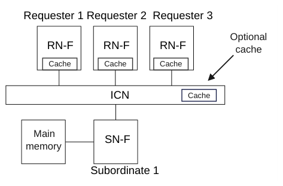

图 B1.2：一致性模型示例

一致性协议强制要求：当某个地址位置发生存储时，同一数据值的副本不得超过一份。一致性协议确保所有请求方在任何给定地址位置都能观察到正确的数据值。每次对某个位置进行存储后，其他请求方可以为自己的本地缓存获取该数据的新副本，从而允许多个缓存副本存在。

缓存行（cache line）定义为 64 字节对齐的内存区域。所有一致性均在缓存行粒度上维护。

仅当一个内存位置的副本不再被任何缓存持有时，才要求更新主存。一致性协议并不要求主存始终是最新的。

> **注意**
>
> 尽管并非强制要求，但也允许在缓存副本仍然存在时更新主存。

一致性协议使请求方组件能够确定某个缓存行是特定内存位置的唯一副本，还是存在同一位置的其他副本。一致性协议确保：

- 如果某个缓存行是唯一副本，则请求方组件可以修改该缓存行的值，而无需通知系统中的任何其他请求方组件。
- 如果某个缓存行也可能存在于另一个缓存中，则请求方组件必须使用适当的事务通知其他缓存。

#### B1.5.2 缓存状态模型

当组件访问某个缓存行时，协议通过定义缓存状态来确定是否需要执行某项操作。每个缓存状态基于以下缓存行特征：

有效（Valid）、无效（Invalid） 当为 Valid 时，缓存行存在于缓存中。当为 Invalid 时，缓存行不存在于缓存中。

唯一（Unique）、共享（Shared） 当为 Unique 时，缓存行仅存在于该 Unique 缓存中。当为 Shared 时，缓存行可以存在于多个缓存中。并不保证该缓存行存在于多个缓存中。

干净（Clean）、脏（Dirty） 当为 Clean 时，缓存没有更新主存的责任。当为 Dirty 时，缓存行相对于主存已被修改。Dirty 缓存必须确保主存最终得到更新。

满（Full）、部分（Partial）、空（Empty） 满缓存行（Full cache line）的所有字节均有效。部分缓存行（Partial cache line）可以有一部分字节有效，其中"一部分"包括零个或全部字节。空缓存行（Empty cache line）没有任何字节有效。

图 B1.3 展示了七状态缓存模型。B4.1 缓存行状态给出了每个缓存状态的更多信息。

除 Partial 或 Empty 之外的有效缓存状态名均视为 Full。在图 B1.3 中，UC、UD、SC 和 SD 均为 Full 缓存行状态。

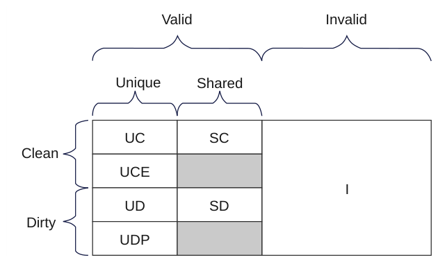

图 B1.3：缓存状态模型

### B1.6 组件命名

CHI 协议中的组件按节点类型进行分类：

RN 请求节点（Request Node）。生成发往互连的协议事务，包括读和写。请求节点进一步分类为：

RN-F 完全一致性请求节点（Fully Coherent Request Node）：

- 包含硬件一致性缓存。
- 允许生成协议定义的所有事务，但 ReadNoSnpSep 除外。
- 支持所有 Snoop 事务。

RN-D 支持 DVM 的 IO 一致性请求节点（IO Coherent Request Node with DVM support）：

- 不包含硬件一致性缓存。
- 接收 DVM 事务。
- 生成协议定义的事务的一个子集。更多详细信息见 C3.1 请求节点子集。

RN-I IO 一致性请求节点（IO Coherent Request Node）：

- 不包含硬件一致性缓存。
- 不接收 DVM 事务。
- 生成协议定义的事务的一个子集。更多详细信息见 C3.1 请求节点子集。
- 不需要侦听功能。

HN 归属节点（Home Node）。位于互连内部的节点，从请求节点接收协议事务。归属节点进一步分类为：

HN-F 完全一致性归属节点（Fully Coherent Home Node）：

- 预期接收除 DVMOp 外的所有请求类型。
- 包含一致性点（Point of Coherence，PoC），它通过对所需的 RN-F 节点进行侦听来管理一致性，针对一个事务汇总 Snoop 响应，并向发起请求的请求节点发送单个响应。
- 预期作为串行化点（Point of Serialization，PoS），管理内存请求之间的顺序。
- 可以包含目录或侦听过滤器，以减少冗余侦听。

> **注意**
>
> 与实现相关（IMPLEMENTATION SPECIFIC），可以包含集成的互连缓存。

HN-I 非一致性归属节点（Non-coherent Home Node）：

- 处理协议定义的请求类型的一个有限子集。
- 不包含 PoC，且无法处理可侦听（Snoopable）请求。在收到可侦听请求时，HN-I 必须回复符合协议的消息。
- 预期作为 PoS，管理针对 IO 子系统的 IO 请求之间的顺序。

MN 杂项节点（Miscellaneous Node）。从请求节点接收 DVM 事务，完成所需操作，并返回响应。

SN 从属节点（Subordinate Node）。从归属节点接收请求，完成所需操作，并返回响应。从属节点进一步分类为：

SN-F 从属节点。

- 用于 Normal 内存。
- 可以处理不可侦听（Non-snoopable）的 Read、Write 和 Atomic 请求（包括它们的独占变体）以及缓存维护操作（Cache Maintenance Operation，CMO）请求。更多详细信息见 C3.2 从属节点子集。

SN-I 从属节点。

- 用于外设或 Normal 内存。
- 可以处理不可侦听的 Read、Write 和 Atomic 请求（包括它们的独占变体）以及 CMO 请求。更多详细信息见 C3.2 从属节点子集。

图 B1.4 展示了通过互连连接的各种协议节点类型。

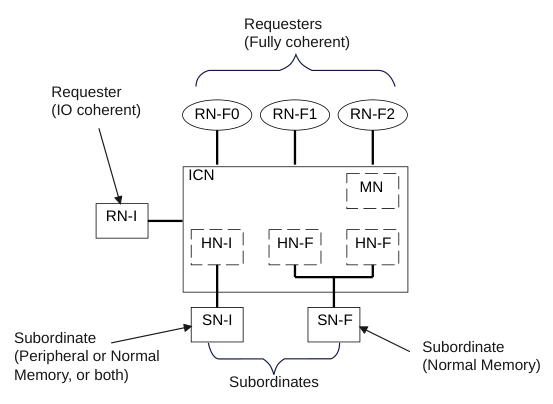

图 B1.4：协议节点示例

### B1.7 读数据源

在基于 CHI 的系统中，读请求可以从不同的数据源获取数据。图 B1.5 显示了这些数据源：

- 互连内部的高速缓存
- 从属节点
- 对等 RN-F

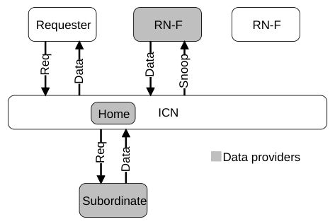

图 B1.5：读请求可能的数据提供者

归属节点的一个选项是要求 RN-F 或从属节点仅将数据返回给归属节点。归属节点接着将接收到的数据副本转发给请求方。如果数据提供者能够将数据响应直接转发给请求方，而不是经由归属节点转发，则可以去除读事务流程中获取数据的一个跳数。

可以使用若干技术来减少完成一个事务所需要的跳数。跳数的减少可带来读写延迟的降低以及互连带宽利用率的提升。这些技术分类如下：

Direct Memory Transfer (DMT) 定义允许从属节点将数据直接发送给请求方的特性。

Direct Cache Transfer (DCT) 定义允许对等 RN-F 将数据直接发送给请求方的特性。在 DCT 读事务流程中，数据提供者必须通知归属节点数据已发送给请求方。在某些情况下，数据提供者还必须向归属节点发送一份数据副本。

Direct Write-data Transfer (DWT) 定义允许发起请求的请求节点将写数据直接发送给从属节点的特性。

第 B2 章

## B2 事务

本章概述节点之间的通信通道、相关的数据包字段以及事务结构。本章包含以下各节：

- B2.1 通道概述
- B2.2 通道字段
- B2.3 事务结构
- B2.4 事务标识符字段
- B2.6 多请求
- B2.5 事务标识符字段流程
- B2.7 排序
- B2.8 地址、控制与数据
- B2.9 数据传输
- B2.10 请求重试

### B2.1 通道概述

本节使用通道的简写命名来描述事务结构。表 B2.1 给出了简写名称以及在请求节点或从属节点组件上存在的物理通道名称。

节点之间的通信基于通道。表 B2.1 给出了通道命名以及请求节点和从属节点处的通道指定。

关于请求节点和从属节点组件上物理通道的映射，参见 B13.4 Channel。

表 B2.1：请求节点和从属节点处的通道命名与指定

| 通道 | 请求节点通道指定 | 从属节点通道指定 |
| --- | --- | --- |
| REQ | TXREQ。出站请求。 | RXREQ。入站请求。 |
| WDAT | TXDAT。出站数据。用于写数据、原子数据、侦听数据、前转数据。 | RXDAT。入站数据。用于写数据、原子数据。 |
| SRSP | TXRSP。出站响应。用于侦听响应和完成确认。 | - |
| CRSP | RXRSP。入站响应。用于来自完成方的响应。 | TXRSP。出站响应。用于来自完成方的响应。 |
| RDAT | RXDAT。入站数据。用于读数据、原子数据。 | TXDAT。出站数据。用于读数据、原子数据。 |
| SNP | RXSNP。入站侦听请求。 | - |

### B2.2 通道字段

本节简要概述通道字段，并指出哪些字段会影响事务结构。各通道相关的字段将在以下各节中描述：

- B2.2.1 事务请求字段
- B2.2.2 响应字段
- B2.2.3 侦听请求字段
- B2.2.4 数据字段

“事务结构”（Transaction Structure）一词用于描述构成一个事务的不同数据包。事务结构可能因若干因素而有所不同。

#### B2.2.1 Transaction request fields

表 B2.2 列出了与 Request 数据包相关联的 Request 字段。

有关不同事务结构的更多信息，可参见 B2.3 Transaction structure 和 B13.9 Flit packet definitions。

表 B2.2：Request 通道字段

| Field | Affects structure | Description |
| --- | --- | --- |
| QoS | No | 服务质量优先级。为事务指定 16 个可能优先级中的一个，QoS 值越大表示优先级越高。参见 B13.10.1 Quality of Service, QoS。 |
| TgtID | No | 目标标识符。数据包所指向的组件上该端口对应的节点标识符。参见 B2.4.1 Target Identifier, TgtID, and Source Identifier, SrcID 以及 B3.1 System Address Map, SAM。 |
| SrcID | No | 源标识符。发送该数据包的组件上该端口对应的节点标识符。参见 B2.4.1 Target Identifier, TgtID, and Source Identifier, SrcID。 |
| TxnID | No | 事务标识符。每个源节点为事务分配唯一的事务标识符。参见 B2.4.2 Transaction Identifier, TxnID。 |
| ReturnNID | No | 返回节点标识符。Data 响应、Persist 响应或 TagMatch 响应的接收方节点标识符。参见 B2.4.10 Return Node Identifier, ReturnNID。 |
| StashNID | No | Stash 节点标识符。暂存目标的节点标识符。参见 B2.4.9 Stash Node Identifier, StashNID 和 B13.10.9 Stash Node Identifier, StashNID。 |
| DataTarget | No | 数据目标。将来自请求方的放置与使用提示转发到互连中的缓存。参见 B11.3 Data Target。 |
| StashNIDValid | Yes | Stash 节点标识符有效。指示 StashNID 字段包含有效的暂存目标值。参见 B13.10.10 Stash Node Identifier Valid, StashNIDValid。 |
| Endian | No | 字节序。指示 Atomic 事务的数据包中数据的字节序。参见 B2.9.6.3 Endianness。 |
|  |  | 下页续 |

表 B2.2 —— 续上页

| Field | Affects structure | Description |
| --- | --- | --- |
| Deep | No | 深度持久化。指示在所有更早的写操作写入最终目的地之前，不得发送 Persist 响应。参见 B4.2.2.2.3 Deep Persistent CMO。 |
| PrefetchTgtHint | No | PrefetchTgt 提示。指示原始请求带有关联的 PrefetchTgt 请求。Chip-to-Chip 链路的接收方可以利用该字段重建 PrefetchTgt 请求，前提是已知原始 PrefetchTgt 在 Chip-to-Chip 链路的发送方被丢弃。参见 B13.10.57 PrefetchTgt Hint, PrefetchTgtHint。 |
| ReturnTxnID | No | 返回事务标识符。唯一的事务标识符，用于传递从属节点发出数据响应中 TxnID 的值。参见 B2.4.4 Return Transaction Identifier, ReturnTxnID。 |
| StashLPIDValid | No | Stash 逻辑处理器标识符有效。指示 StashLPID 字段的值即为暂存目标。参见 B13.10.12 Stash Logical Processor Identifier Valid, StashLPIDValid。 |
| StashLPID | No | Stash 逻辑处理器标识符。暂存目标处逻辑处理器（LP）的标识符。参见 B13.10.11 Stash Logical Processor Identifier, StashLPID。 |
| Opcode | Yes | 请求操作码。指定事务类型，是决定事务结构的主要字段。参见 B4.2 Request types 和 B13.10.18.1 REQ channel opcodes。 |
| MultiReq | Yes | 多请求事务。与 NumReq 配合使用，指示与该事务关联的数据总量。参见 B13.10.64 MultiReq。 |
| NumReq | Yes | 请求数量。与 MultiReq 配合使用，指示与该事务关联的数据总量。参见 B13.10.65 NumReq。 |
| Size | Yes | 数据大小。指定与该事务关联的数据大小，并决定该事务内数据包的数量。参见 B2.9 Data transfer。 |
| Addr | No | 地址。Read 和 Write 请求所要访问的存储位置的地址。参见 B2.8.1 Address 和 B13.10.20 Address, Addr。 |
| PAS | No | 物理地址空间。指示该事务所针对的 PAS。参见 B13.10.68 PAS。 |
| LikelyShared | No | 可能共享。为下游缓存提供分配提示。参见 B2.8.5 Likely Shared。 |
| AllowRetry | Yes | 允许重试。确定支持 Request Retry 的目标是否被允许给出 RetryAck 响应。参见 B2.10 Request Retry and Retry_Support。 |
| Order | Yes | 顺序要求。确定某个请求相对于来自同一代理的其他请求的顺序要求。参见 B2.7 Ordering。 |
| PCrdType | No | 协议信用类型。当 B13.10.31 Allow Retry, AllowRetry 字段为 0 时，指示请求所使用的协议信用类型。参见 B2.10 Request Retry。 |
|  |  | 下页续 |

表 B2.2 —— 续上页

| 字段 | 影响结构 | 描述 |
| --- | --- | --- |
| MemAttr | No | 内存属性。决定与该事务相关联的内存属性。参见 B2.8.3 Memory Attributes。 |
| SnpAttr | No | 侦听属性。指定与该事务相关联的侦听属性。参见 B2.8.6 Snoop attribute。 |
| DoDWT | Yes | Do Direct Write Transfer。支持 Direct Write-data Transfer 以及 Combined Write 的处理。参见 B13.10.24 Do Direct Write Transfer, DoDWT。 |
| PGroupID | No | 持久化组标识符（Persistence Group Identifier）。指示该请求所适用的 CleanSharedPersistSep 事务集合。参见 B13.10.8 Persistence Group Identifier, PGroupID。 |
| StashGroupID | No | 暂存组标识符（Stash Group Identifier）。指示该请求所适用的 StashOnceSep 事务集合。参见 B13.10.13 Stash Group Identifier, StashGroupID。 |
| TagGroupID | No | 标签组标识符（Tag Group Identifier）。其具体内容由实现定义（IMPLEMENTATION SPECIFIC）。通常预期包含异常级别（Exception Level）、转换表基址寄存器（TTBR）值以及 CPU 标识符。参见 B13.10.41 Tag Group Identifier, TagGroupID。 |
| LPID | No | 逻辑处理器标识符（Logical Processor Identifier）。与 SrcID 字段一起用于唯一标识生成该请求的 LP。参见 B2.4.7 Logical Processor Identifier, LPID。 |
| Excl | No | 独占访问（Exclusive access）。指示相应事务为独占访问事务。参见第 B6 章 Exclusive accesses。 |
| SnoopMe | No | Snoop Me。指示在 Atomic 事务期间 Home 必须确定是否向 Requester 发送侦听。参见 B2.3.3 Atomic transactions。 |
| CAH | Yes | CopyAtHome。在 CopyBack 请求中，CAH 向 Home 指示：自 Home 表明保留该缓存行的一份副本以来，Requester 是否修改了该缓存行或 MTE 标签。参见 B13.10.28 CopyAtHome, CAH。 |
| ExpCompAck | Yes | Expect CompAck。指示该事务包含完成确认消息。参见 B2.3 Transaction structure 和 B2.7 Ordering。 |
| TagOp | Yes | 标签操作（Tag Operation）。指示要执行的操作以及要作用于相应 DAT 通道中所携带标签的操作。参见 B13.10.38 Tag Operation, TagOp。 |
| TraceTag | No | 跟踪标签（Trace Tag）。为系统的调试、跟踪和性能测量提供额外支持。参见第 B11 章 System Control, Debug, Trace, and Monitoring。 |
| MPAM | No | 内存系统资源分区与监控（Memory System Resource Partitioning and Monitoring）。在用户之间高效利用内存资源并监控其使用情况。参见 B11.4 MPAM。 |
|  |  | 下页续 |

表 B2.2 – 续上页

| 字段 | 影响结构 | 描述 |
| --- | --- | --- |
| PBHA | No | 基于页面的硬件属性（Page-based Hardware Attributes）。来自转换表的 4 位，可用于由实现定义的硬件控制。参见 B11.5 Page-based Hardware Attributes。 |
| MECID | No | 内存加密上下文标识符（Memory Encryption Context Identifier）。由内存加密引擎用作加密上下文（密钥或调整值）表的索引，这些上下文参与外部内存加密。参见 B10.6 Memory Encryption Contexts, MEC。 |
| StreamID | No | 流标识符（Stream Identifier）。用作源自与同一 System MMU 上下文相关联的一个或一组 Requester 的请求流的唯一标识符。参见 B13.10.62 Stream Identifier, StreamID。 |
| SecSID1 | No | 安全状态（Security State）。限定 StreamID 的安全状态。参见 B13.10.63 Stream Identifier Security State, SecSID1 |
| RSVDC | No | 用户自定义（User-defined）。参见 B13.10.60 Reserved for Customer Use, RSVDC。 |

#### B2.2.2 Response 字段

表 B2.3 描述了与 Response 数据包相关联的字段。

表 B2.3：Response 数据包字段

| 字段 | 描述 |
| --- | --- |
| QoS | 服务质量优先级。如表 B2.2 中所定义。参见 B11.1 Quality of Service (QoS) mechanism。 |
| TgtID | 目标标识符。如表 B2.2 中所定义。参见 B2.4.1 Target Identifier, TgtID, and Source Identifier, SrcID。 |
| SrcID | 源标识符。如表 B2.2 中所定义。参见 B2.4.1 Target Identifier, TgtID, and Source Identifier, SrcID。 |
| TxnID | 事务标识符。如表 B2.2 中所定义。参见 B2.4.2 Transaction Identifier, TxnID。 |
| Opcode | 响应操作码。指定响应类型。参见 B13.10.18.2 RSP channel opcodes。 |
| RespErr | 响应错误状态。如表 B2.5 中所定义。参见第 B6 章 Exclusive accesses 和 B9.1.2 Error response fields。 |
| Resp | 响应状态。如表 B2.5 中所定义。参见 B4.5 Response types。 |
| FwdState | 转发状态（Forward State）。如表 B2.5 中所定义。参见 B13.10.47 Forward State, FwdState。 |
| DataPull | 数据拉取（Data Pull）。如表 B2.5 中所定义。参见 B7.1.1 Snoop requests and Data Pull。 |
| CBusy | 完成方忙（Completer Busy）。如表 B2.5 中所定义。参见 B11.6 Completer Busy。 |
| DBID | 数据缓冲区标识符（Data Buffer Identifier）。如表 B2.5 中所定义。参见 B2.4.3 Data Buffer Identifier, DBID 和 B2.7 Ordering。 |
|  | 下页续 |

表 B2.3 – 续上页

| 字段 | 描述 |
| --- | --- |
| PGroupID | 持久化组标识符（Persistence Group Identifier）。如表 B2.2 中所定义。参见 B13.10.8 Persistence Group Identifier, PGroupID。 |
| StashGroupID | 暂存组标识符（Stash Group Identifier）。如表 B2.2 中所定义。参见 B13.10.13 Stash Group Identifier, StashGroupID。 |
| TagGroupID | 标签组标识符（Tag Group Identifier）。如表 B2.2 中所定义。参见 B13.10.41 Tag Group Identifier, TagGroupID。 |
| PCrdType | 协议信用类型（Protocol Credit Type）。参见 B2.10.2.2 PCrdType。 |
| TagOp | 标签操作（Tag Operation）。如表 B2.2 中所定义。参见 B13.10.38 Tag Operation, TagOp。 |
| TraceTag | 追踪标签（Trace Tag）。如表 B2.2 中所定义。参见第 B11 章 System Control, Debug, Trace, and Monitoring。 |
| CacheLineID | 缓存行标识符。参见 B13.10.66 CacheLineID。 |

#### B2.2.3 侦听请求字段

表 B2.4 列出了侦听请求字段。许多侦听请求字段与为 Request 通道定义的字段相同。

表 B2.4：侦听请求字段

| 字段 | 影响结构 | 描述 |
| --- | --- | --- |
| QoS | No | 服务质量优先级。如表 B2.2 中所定义。参见 B11.1 Quality of Service (QoS) mechanism。 |
| SrcID | No | 源标识符。如表 B2.2 中所定义。参见 B2.4.1 Target Identifier, TgtID, and Source Identifier, SrcID。 |
| TxnID | No | 事务标识符。如表 B2.2 中所定义。参见 B2.4.2 Transaction Identifier, TxnID。 |
| FwdNID | No | 转发节点标识符（Forward Node Identifier）。原始请求方的节点标识符。参见 B2.4.12 Forward Node Identifier, FwdNID。 |
| PBHA | No | 基于页面的硬件属性（Page-based Hardware Attributes）。来自转换表的 4 位，可用于由实现定义的硬件控制。参见 B11.5 Page-based Hardware Attributes。 |
| FwdTxnID | No | 转发事务标识符（Forward Transaction Identifier）。原始请求方在 Request 中所使用的事务标识符。参见 B2.4.5 Forward Transaction Identifier, FwdTxnID。 |
| StashLPIDValid | No | Stash 逻辑处理器标识符有效（Stash Logical Processor Identifier Valid）。如表 B2.2 中所定义。参见 B7.5 Stash messages。 |
| StashLPID | No | Stash 逻辑处理器标识符（Stash Logical Processor Identifier）。如表 B2.2 中所定义。参见 B7.5 Stash messages。 |
| VMIDExt | No | 虚拟机标识符扩展（Virtual Machine Identifier Extension）。参见 B8.3.3 Snoop DVMOp field value restrictions。 |
|  |  | 下页续 |

表 B2.4 – 续上页

| 字段 | 影响结构 | 描述 |
| --- | --- | --- |
| Opcode | Yes | 侦听操作码。参见 B13.10.18.3 SNP channel opcodes。 |
| Addr | No | 地址。侦听请求所访问的存储位置的地址。参见 B2.8.1 Address 和 B13.10.20 Address, Addr。 |
| PAS | No | 物理地址空间。参见 B13.10.68 PAS。 |
| DoNotGoToSD | No | 不进入 SD 状态（Do Not Go To SD state）。控制 Snoopee 对 SD 状态的使用。参见 B4.10 Do not transition to SD。 |
| RetToSrc | Yes | 返回给源（Return to Source）。指示侦听的接收方随 Snoop 响应一起返回数据。参见 B4.9 Returning Data with Snoop response。 |
| TraceTag | No | 追踪标签（Trace Tag）。如表 B2.2 中所定义。参见第 B11 章 System Control, Debug, Trace, and Monitoring。 |

MPAM No 内存系统资源分区与监控（Memory System Resource Partitioning and Monitoring）。如表 B2.2 中所定义。参见 B11.4 MPAM。

MECID No 内存加密上下文标识符（Memory Encryption Context Identifier）。由内存加密引擎用作加密上下文（密钥或调整值）表的索引，这些加密上下文参与外部内存加密。参见 B10.6 Memory Encryption Contexts, MEC。

> **注意**
>
> 本规范未为侦听请求定义 TgtID 字段。参见 B3.3 TgtID determination。

#### B2.2.4 Data 字段

表 B2.5 描述了与 Data 数据包相关联的字段。Data 数据包可以在 RDAT 或 WDAT 通道上发送。Data 数据包中的字段不影响事务结构。

表 B2.5：Data 数据包字段

| 字段 | 描述 |
| --- | --- |
| QoS | 服务质量优先级。如表 B2.2 中所定义。参见 B11.1 Quality of Service (QoS) mechanism。 |
| TgtID | 目标标识符。如表 B2.2 中所定义。参见 B2.4.1 Target Identifier, TgtID, and Source Identifier, SrcID。 |
| SrcID | 源标识符。如表 B2.2 中所定义。参见 B2.4.1 Target Identifier, TgtID, and Source Identifier, SrcID。 |
| TxnID | 事务标识符。如表 B2.2 中所定义。参见 B2.4.2 Transaction Identifier, TxnID。 |
| HomeNID | 归属节点标识符。由请求方发送的 CompAck 响应的目标的节点标识符。参见 B2.4.11 Home Node Identifier, HomeNID。 |
|  | 下页续 |

表 B2.5 – 续上页

| 字段 | 描述 |
| --- | --- |
| MismatchedMECID | 不匹配的内存加密上下文 ID（Mismatched Memory Encryption Context ID）。参见 B13.10.67 MismatchedMECID。 |
| PBHA | 基于页的硬件属性（Page-based Hardware Attributes）。来自转换表的 4 位，可用于 IMPLEMENTATION DEFINED 的硬件控制。参见 B11.5 Page-based Hardware Attributes。 |
| Opcode | 数据操作码。例如，指示该数据包是与 Read 事务、Write 事务还是 Snoop 事务相关。参见 B13.10.18.4 DAT channel opcodes。 |
| RespErr | 响应错误状态。指示与数据传输相关联的错误状态。参见第 B6 章 Exclusive accesses 和 B9.1.2 Error response fields。 |
| Resp | 响应状态。指示与数据传输相关联的缓存行状态。参见 B4.5 Response types。 |
| DataSource | 数据源。其值指示 Read Data 响应中数据的来源，并可提供关于系统中数据状态的附加信息。参见 B11.2 Data Source。 |
| FwdState | 转发状态。指示与从侦听接收方到请求方的数据传输相关联的缓存行状态。参见 B13.10.47 Forward State, FwdState。 |
| DataPull | 数据拉取。指示 Data 响应中包含一个隐含的 Read 请求。参见 B7.1.1 Snoop requests and Data Pull。 |
| CBusy | 完成方忙（Completer Busy）。指示完成方当前的活动水平。参见 B11.6 Completer Busy。 |
| MECID | 内存加密上下文标识符（Memory Encryption Context Identifier）。由内存加密引擎用作加密上下文表（密钥或 tweak）的索引，这些加密上下文参与外部内存加密。参见 B10.6 Memory Encryption Contexts, MEC。 |
| DBID | 数据缓冲区标识符（Data Buffer Identifier）。在 Data 消息的响应中用作 TxnID 的标识符。参见 B2.4.3 Data Buffer Identifier, DBID 和 B2.7 Ordering。 |
| CCID | 关键块标识符（Critical Chunk Identifier）。复制原始事务请求的地址偏移。参见 B2.9 Data transfer。 |
| DataID | 数据标识符。提供数据包中所提供数据的地址偏移。参见 B2.9 Data transfer。 |
| CacheLineID | 缓存行标识符。参见 B13.10.66 CacheLineID。 |
| TagOp | 标签操作。如表 B2.2 中所定义。参见 B13.10.38 Tag Operation, TagOp。 |
| Tag | 内存标签。提供 4 位标签的集合。每个标签与一个对齐的 16 字节数据相关联。参见 B13.10.39 Tag。 |
| TU | 标签更新（Tag Update）。指示必须更新哪些分配标签（Allocation Tags）。参见 B13.10.40 Tag Update, TU。 |
|  | 下页续 |

表 B2.5 – 续上页

| 字段 | 描述 |
| --- | --- |
| TraceTag | 追踪标签。如表 B2.2 中所定义。参见第 B11 章 System Control, Debug, Trace, and Monitoring。 |
| CAH | CopyAtHome。在来自 Home 或某个 Snoopee 的响应中，指示 Home 是否保留提供给请求方的缓存行副本。也定义于表 B2.2 中。更多信息参见 B13.10.28 CopyAtHome, CAH。 |
| NumDat | 指示使用 Limited Data Elision 时，所传输的数据包代表多少个额外的 DAT 数据包。参见 B13.10.58 Number of DAT packets elided, NumDat。 |
| Replicate | 与 NumDat 结合使用，以确定任何被省略的 DAT 数据包的字段值。参见 B13.10.59 Replicate。 |
| RSVDC | 用户自定义。参见 B13.10.60 Reserved for Customer Use, RSVDC。 |
| BE | 字节使能（Byte Enable）。对于数据写，或响应侦听而提供的数据，指示哪些字节有效。参见 B2.9 Data transfer。 |
| Data | 数据净荷。参见 B2.9 Data transfer。 |
| DataCheck | 数据校验。检测 DAT 数据包中的数据错误。参见 B9.2.2 Data Check。 |
| Poison | 毒化。指示一组数据字节此前已被破坏。参见 B9.2.1 Poison。 |

### B2.3 事务结构

本节描述事务可以完成的各种方式。本节描述参与事务的各个组件可以使用的所有允许选项。

除 PCrdReturn 和 PrefetchTgt 外，所有事务类型都可以在事务开始时具有 Retry 序列。为便于表述，Retry 序列单独描述，见 B2.3.8 Retry。

为了完成某些事务，可能需要执行其他独立事务，例如侦听或内存事务。这些事务在后面的 B2.3.9 Home Initiated transactions 一节中单独描述。

某些从归属节点到从属节点的事务支持使用单独的 ReturnNID 和 ReturnTxnID 字段，这些字段允许将某些响应返回给原始请求方，而不是归属节点。允许（但不要求）将 ReturnNID 和 ReturnTxnID 字段设置为与 SrcID 和 TxnID 相等。这意味着所有响应都返回给归属节点。在这种情况下，从归属节点到从属节点的事务被视为一个独立事务。更多详细信息见 B2.3.9 Home Initiated transactions。

通常，请求中的某个字段或操作码决定特定消息是否可以包含在事务流中，这被描述为 Optional。Optional 消息并不表示发送方是否选择发送该消息。

在本节中，术语 Requester 始终指事务的原始请求方。Requester 不指为完成原始事务而发出次级请求的中间代理。术语 Requester 始终指请求节点，即 RN-F、RN-I 或 RN-D。

在本节中，带有包含多个消息标签的箭头的图表示在某个流程中可以发送其中任意一个消息。关于特定消息何时可以在事务流中使用的要求，可以从本规范的其他部分推导得出。

本节所描述的流程旨在完整描述可以包含在事务流中的消息。以下内容不包含在内：

- 特定事务所使用的通道。
- 关于事务何时可以发起、或使用特定事务的原因的描述。
- 关于请求中可以使用哪些字段组合的描述。请求字段仅在

影响事务完成选项时才会被特别指出。

本节所描述的依赖关系采用以下方式：

- 对于每个组件，在首次参与某个事务序列时存在隐式依赖。除

原始请求方外，任何其他组件都必须先接收到与该事务关联的第一个消息，然后才能为该事务发送任何后续消息。

- 当某个组件发送与同一事务关联的多个消息时，假定这些消息

以任意顺序发送。除非描述了显式依赖，否则也假定这些消息以任意顺序被接收。

- 在图中，数据传输显示为单个消息。该消息可以由多个数据传输

组成，更多详细信息见 B2.9 Data transfer。在描述依赖关系时，该依赖来自接收到的第一个数据传输，除非明确说明该依赖有所不同。

- 当两个组件之间在某个方向上存在要求的或允许的依赖时，不允许

在相反方向上存在依赖。本节文本仅描述一个方向上的依赖。

- 依赖规则中的详细程度取决于上下文。当依赖的来源以及

依赖的对象显而易见时，不列出相关代理。

- 对于任何具有一个或多个输出的代理：
- 如果该代理是事务的原始请求方，则针对该代理的每个输入

描述依赖关系。

- 如果该代理不是事务的原始请求方，则针对该代理在接收到第一个输入之后接收的每个输入

描述依赖关系。每个输出都被视为依赖于第一个输入。

- 本节不描述不同事务之间的所有依赖关系，即使它们都指向

同一地址。见 B2.7 Ordering 和 B4.11 Hazard conditions。

本节用于描述动作的约定如下：

Issues 仅用于事务中的第一个消息，例如：请求方发出 WriteNoSnp 请求……

Sends 由代理沿远离请求方的方向发送的消息。

Sends a downstream 由中间代理沿远离请求方的方向转发的消息，例如：归属节点向从属节点发送下游读请求。

Returns 由代理沿朝向请求方的方向发送的消息。

Provides 由代理响应侦听而发送的消息，例如：……提供侦听响应。

Permitted, but not required 该动作既不被鼓励也不被反对，在两种情况下都符合规范。

Not permitted 所描述的动作将导致不符合规范。例如：归属节点不允许在发送……之前等待……

#### B2.3.1 读事务

读事务分为以下几种类型：

- B2.3.1.1 Allocating Read
- B2.3.1.2 Non-allocating Read

##### B2.3.1.1 Allocating Read

图 B2.1 展示了 Allocating Read 事务可能的事务流程。

Requester Home Subordinate Snoopee

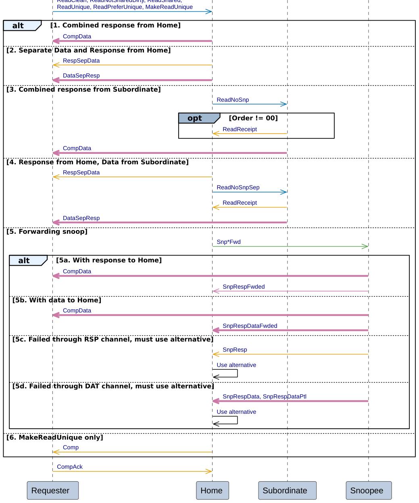

图 B2.1：Allocating Read

Allocating Read 事务的流程为：

- 事务以请求方向归属节点发出 Allocating Read 请求开始。初始请求

为以下之一：

- ReadClean
- ReadNotSharedDirty
- ReadShared
- ReadUnique
- ReadPreferUnique
- MakeReadUnique
- 备选方案 1-6 展示了归属节点处理该事务的不同方式：
1. 来自归属节点的合并响应

归属节点向请求方返回合并响应和读数据 CompData。通常，当数据与响应可以同时返回时，归属节点会使用此选项。一个示例是数据在本地被缓存。

2. 来自归属节点的独立数据与响应

归属节点向请求方返回独立响应 RespSepData 和读数据 DataSepResp。通常，当响应能够比归属节点提供数据更快地返回时，归属节点会使用此选项。

3. 来自从属节点的合并响应
- 归属节点向从属节点发送下行读请求 ReadNoSnp。
- 可选地，当归属节点请求 ReadReceipt 响应时，从属节点向归属节点返回读回执

ReadReceipt。

- 从属节点向请求方返回合并响应和读数据 CompData。

通常，归属节点使用此选项是为了减少消息数量或降低设计复杂度。

4. 响应来自归属节点，数据来自从属节点
- 归属节点向请求方返回独立响应 RespSepData。
- 归属节点向从属节点发送仅读数据的下行请求 ReadNoSnpSep。
- 从属节点向归属节点返回读回执 ReadReceipt。归属节点可以（但不要求）

在向请求方发送 RespSepData 之前等待来自从属节点的 ReadReceipt。

- 从属节点向请求方返回读数据 DataSepResp。通常，当响应可以快速返回，但归属节点

没有可用数据并需要从属节点返回数据时，归属节点会使用此选项。

> **注意**
>
> 在许多情况下，请求方收到 RespSepData 的时间远早于 DataSepResp。请求方可以（但不要求）在收到 RespSepData 之后、不等 DataSepResp 即发送 CompAck 响应。请求方的及时响应，以及可能在同一时间收到 ReadReceipt，使归属节点能够比使用来自从属节点的合并完成响应和数据响应更快地完成该事务。

5. 转发侦听
- 归属节点请求 Snoopee 将读数据 Snp*Fwd 转发给请求方。关于可以使用哪些 Snp*Fwd

事务，参见 B4.4 Request transactions and corresponding Snoop requests。通常，当数据未在本地缓存且归属节点判定某个 Snoopee 很可能持有副本时，归属节点会使用此选项。

- 备选方案 5a-5d 展示了 Snoopee 处理该事务的方式：

备选方案 5a. 向归属节点返回响应

- Snoopee 向请求方返回合并响应和读数据 CompData。
- Snoopee 向归属节点提供侦听响应 SnpRespFwded。通常，当数据可以转发给请求方且

无需向归属节点提供数据副本时，Snoopee 会使用此选项。

备选方案 5b. 向归属节点提供数据

- Snoopee 向请求方返回合并响应和读数据 CompData。
- Snoopee 向归属节点提供带数据的侦听响应 SnpRespDataFwded。

> **注意**
>
> 通常，当数据可以转发给请求方、同时还需要向归属节点提供数据副本时，Snoopee 会使用此选项。例如，当 Snoopee 持有该缓存行的 Dirty 副本，但返回给请求方的数据必须为 Clean 时。当归属节点请求了数据副本时，也可能出现此选项。

备选方案 5c. 经 RSP 通道失败，必须使用其他备选方案 Snoopee 向归属节点提供侦听响应 SnpResp。归属节点必须使用本节所述的其他备选方案来完成向请求方的事务。

备选方案 5d. 经 DAT 通道失败，必须使用其他备选方案 Snoopee 向归属节点提供带数据的侦听响应 SnpRespData 或 SnpRespDataPtl。归属节点必须使用本节所述的其他备选方案来完成向请求方的事务。

6. 仅限 MakeReadUnique

归属节点向请求方返回完成响应 Comp。此选项仅适用于不需要读数据消息的 MakeReadUnique 事务。

- 当请求方向归属节点发送完成确认 CompAck 时，事务结束。

CompAck 必须仅在收到 CompData、Comp 或 RespSepData 之后发送。如果已收到 RespSepData，则请求方可以（但不要求）在发送 CompAck 之前等待 DataSepResp。

##### B2.3.1.2 非分配读

图 B2.2 展示了非分配读事务可能的事务流程。

请求方 归属节点 从属节点 Snoopee

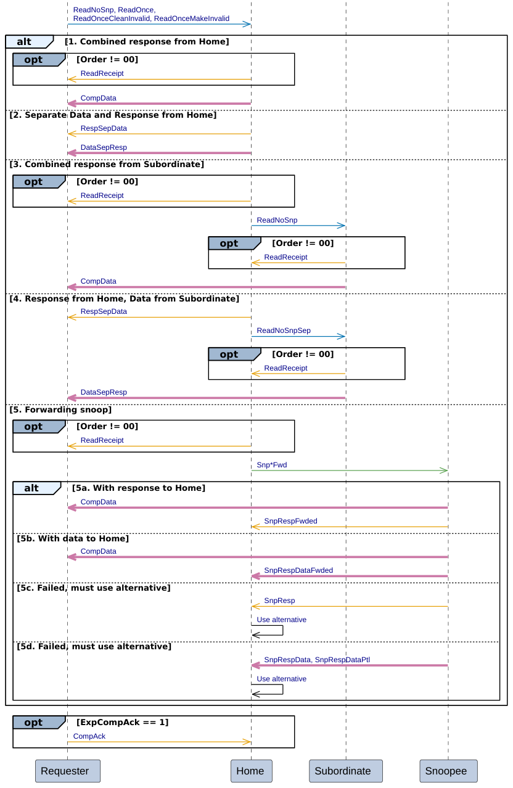

图 B2.2：非分配读

非分配读事务的时序如下：

- 事务始于请求方向归属节点发出读请求。非分配读

事务包括：

- ReadNoSnp
- ReadOnce
- ReadOnceCleanInvalid
- ReadOnceMakeInvalid

请求包含以下影响事务流程的字段：

- Order
- ExpCompAck
- 备选方案 1-6 展示了归属节点处理该事务的方式。关于各

不同备选方案的典型用法说明，参见 B2.3.1.1 分配读。

1. 来自归属节点的合并响应
- 可选地，当原始请求具有排序要求时，归属节点向请求方返回读回执

ReadReceipt。

- 归属节点向请求方返回合并响应和读数据 CompData。
2. 来自归属节点的分离数据与响应

归属节点向请求方返回分离响应 RespSepData 和读数据 DataSepResp。如果请求具有排序要求且不需要完成确认，则不能使用该备选方案。

3. 来自从属节点的合并响应
- 可选地，当原始请求具有排序要求时，归属节点向请求方返回读回执

ReadReceipt。

- 归属节点向从属节点发送下行读请求 ReadNoSnp。
- 可选地，当归属节点请求 ReadReceipt 响应时，从属节点向归属节点返回 ReadReceipt。当不需要完成确认时，归属节点必须这样做。归属节点可以（但并非必须）在向请求方返回 ReadReceipt 之前等待来自从属节点的 ReadReceipt。
- 从属节点向请求方返回合并响应和读数据 CompData。

如果请求具有排序要求且不需要完成确认，则不能使用该备选方案。

4. 响应来自归属节点，数据来自从属节点
- 归属节点向请求方返回分离响应 RespSepData，并向从属节点发送仅读数据的下行请求 ReadNoSnpSep。
- 可选地，当归属节点请求 ReadReceipt 响应时，从属节点向归属节点返回读回执

ReadReceipt。除非原始请求表明同时需要排序和完成确认，否则归属节点必须请求 ReadReceipt。归属节点可以（但并非必须）在向请求方返回 RespSepData 之前等待来自从属节点的 ReadReceipt。

- 从属节点向请求方返回读数据 DataSepResp。

如果请求具有排序要求且不需要完成确认，则不能使用该备选方案。

5. 转发侦听
- 可选地，当原始请求具有排序要求时，归属节点向请求方返回读回执

ReadReceipt。

- 归属节点请求 Snoopee 将读数据 Snp*Fwd 转发给请求方。关于可使用哪些 Snp*Fwd 事务，参见 B4.4 请求事务及对应的侦听请求。
- 备选方案 5a-5d 展示了 Snoopee 处理该事务的方式：

备选 5a. 向归属节点返回响应

- Snoopee 向请求方提供合并响应和读数据 CompData。
- Snoopee 向归属节点提供侦听响应 SnpRespFwded。

备选 5b. 向归属节点返回数据

- Snoopee 向请求方提供合并响应和读数据 CompData。
- Snoopee 向归属节点提供带数据的侦听响应 SnpRespDataFwded。

备选 5c. 失败，必须使用其他备选方案

- Snoopee 向归属节点提供侦听响应 SnpResp。
- 归属节点必须使用本节所述的另一种备选方案来完成向

请求方的该事务。

备选 5d. 失败，必须使用其他备选方案

- Snoopee 向

归属节点提供带数据的侦听响应 SnpRespData 或 SnpRespDataPtl。

- 归属节点必须使用本节所述的另一种备选方案来完成向

请求方的该事务。

- 如果原始请求的 ExpCompAck = 1，则请求方只能在以下情形之一之后提供

CompAck 响应：

* 至少收到一个 CompData 数据包。* 收到 RespSepData，前提是该请求不具有排序要求。该请求可以（但并非必须）等待 DataSepResp。
* 收到 RespSepData 和至少一个 DataSepResp 数据包，前提是该请求具有排序要求。如果原始请求具有排序要求，则请求方可以（但并非必须）在发送 CompAck 之前等待 ReadReceipt。

表 B2.6 列出了来自请求节点的 ReadNoSnp 和 ReadOnce* 所允许的 DMT 与 DCT 事务。使用以下键值：

Y 是，允许

N 否，不允许

- 该事务中未使用此流程

表 B2.6：来自请求节点的 ReadNoSnp 和 ReadOnce* 所允许的 DMT 与 DCT

| Order[1:0] | ExpCompAck | DMT | DCT | Notes |
| --- | --- | --- | --- | --- |
| 00 | 0 | Y | Y | 归属节点无需获知事务完成。对于 DMT，归属节点必须向从属节点请求 ReadReceipt。来自从属节点的 ReadReceipt 确认该从属节点不会针对该事务发送未来的 RetryAck 响应。 |

1 Y Y 当不使用 DMT 时，归属节点无需获知事务完成。对于 DMT，为确认从归属节点发往从属节点的请求不会遭遇未来的 RetryAck 响应：

- 当向从属节点使用 ReadNoSnp 时，

归属节点必须向从属节点请求并接收 ReadReceipt，或者等待来自请求节点的 CompAck 响应。

- 当向从属节点使用 ReadNoSnpSep 时，

归属节点必须向从属节点请求并接收 ReadReceipt。

| 01 | - | - | - | 不允许。 |
| --- | --- | --- | --- | --- |
| 10 11 | 0 | N | Y | 对于 DCT，归属节点使用 SnpRespFwded 或 SnpRespDataFwded 侦听响应来确定事务完成。 |
|  | 1 | Y | Y | 对于 DMT，归属节点使用 CompAck 响应来确定事务完成。对于 DCT，归属节点使用 SnpRespFwd 或 SnpRespDataFwded 侦听响应来确定事务完成。

对于部分 ReadNoSnp 或 ReadOnce* 事务，即大小小于 64B 的情况：

- 归属节点不能使用 DCT 流。
- 如果使用 DMT 流将数据直接从从属节点转发到请求方，则归属节点必须向从属节点发送部分 ReadNoSnp 请求。
- 如果归属节点不请求 DMT 流，则可以使用完整缓存行或部分缓存行的 ReadNoSnp。

归属节点必须只向请求方返回所请求数量的 DAT 数据包，无论它从从属节点接收到多少个 DAT 数据包。有关更多信息，请参见 B2.9.4 Data packetization。

#### B2.3.2 写事务

写事务分为以下类型：

- B2.3.2.1 立即写
- B2.3.2.2 写零
- B2.3.2.3 CopyBack 写
- B2.3.2.4 立即写与 CMO 组合
- B2.3.2.5 立即写与 Persist CMO 组合
- B2.3.2.6 CopyBack 写与 CMO 组合

##### B2.3.2.1 立即写

图 B2.3 展示了立即写事务可能的事务流程。

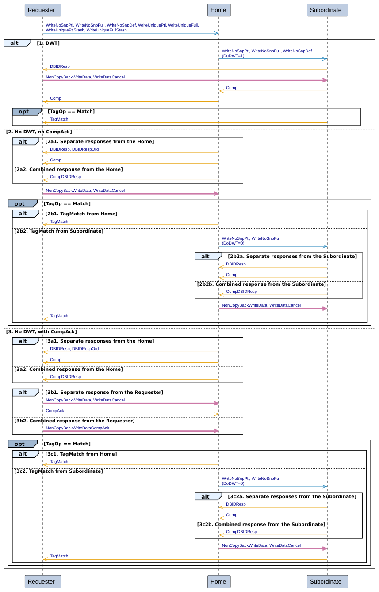

图 B2.3：立即写

立即写事务的流程为：

- 事务始于请求方向归属节点发出立即写请求。立即写事务包括：
- WriteNoSnpPtl
- WriteNoSnpFull
- WriteNoSnpDef
- WriteUniquePtl
- WriteUniqueFull
- WriteUniquePtlStash
- WriteUniqueFullStash

为完成这些事务而生成的侦听请求被视为来自归属节点的独立事务，未在此流程中示出。为下游从属节点生成的写请求不属于 DWT 流程的一部分，被视为独立事务，也未在此流程中示出。有关来自归属节点的独立事务的更多详细信息，请参见 B2.3.9 Home Initiated transactions。为完成 WriteUniquePtlStash 或 WriteUniqueFullStash 事务而生成的 Stash 侦听在后续关于 Stash 事务的章节中描述，请参见 B2.3.4 Stash transactions。

该请求包含以下影响事务流程的字段：

- ExpCompAck
- TagOp
- 归属节点可以选择使用 DWT 或不使用 DWT 来完成事务。事务流程的其余部分取决于原始请求是否需要完成确认响应，这由 ExpCompAck 字段决定。这些组合在备选方案 1-3 中描述：
1. DWT

归属节点使用 DWT。

- 归属节点向从属节点发送下游写请求 WriteNoSnpPtl、WriteNoSnpFull 或 WriteNoSnpDef，且 DoDWT = 1。
- 从属节点向请求方返回数据请求 DBIDResp。
- 请求方向从属节点发送写数据 NonCopyBackWriteData 或取消 WriteDataCancel。请求方必须仅在收到 DBIDResp 之后发送该消息。
- 从属节点向归属节点返回完成响应 Comp。允许但不要求从属节点在向归属节点返回 Comp 之前等待来自请求方的写数据 NonCopyBackWriteData 或取消 WriteDataCancel。
- 归属节点向请求方返回完成响应 Comp。允许但不要求归属节点在向请求方返回 Comp 之前等待来自从属节点的 Comp。
- 可选地，当请求需要 TagMatch 响应时，从属节点向请求方返回标签匹配响应 TagMatch。允许但不要求在返回 TagMatch 之前等待写数据。
2. 无 DWT，无 CompAck

对于不需要完成确认 CompAck 的请求，归属节点不使用 DWT。

- 归属节点有两种备选方式向请求方发送完成响应和数据请求响应。

Alt 2a1. 来自归属节点的分离响应 归属节点执行以下两项操作：

- 向请求方返回数据请求 DBIDResp 或 DBIDRespOrd。
- 向请求方返回完成响应 Comp。允许但不要求在返回 Comp 之前等待写数据 NonCopyBackWriteData 或取消 WriteDataCancel。

Alt 2a2. 来自归属节点的合并响应 归属节点向请求方返回合并的数据请求与完成响应 CompDBIDResp。

- 请求方向归属节点发送写数据 NonCopyBackWriteData 或取消 WriteDataCancel。请求方必须仅在收到 DBIDResp、DBIDRespOrd 或 CompDBIDResp 之后发送该消息。
- 可选地，当请求需要 TagMatch 响应时，归属节点有两种备选方式。

Alt 2b1. 来自归属节点的 TagMatch 归属节点向请求方返回标签匹配响应 TagMatch。允许但不要求在返回 TagMatch 之前等待写数据。

Alt 2b2. 来自从属节点的 TagMatch

- 归属节点向从属节点发送下游写请求 WriteNoSnpPtl 或 WriteNoSnpFull，且 DoDWT = 0。从属节点有两种备选方式向归属节点发送返回数据请求和完成响应。

Alt 2b2a. 来自从属节点的分离响应 从属节点执行以下两项操作：

- 向归属节点返回数据请求 DBIDResp。
- 向归属节点返回完成响应 Comp。

允许但不要求从属节点在向归属节点返回 Comp 之前等待来自归属节点的写数据。

Alt 2b2b. 来自从属节点的合并响应 从属节点向归属节点返回合并的数据请求与完成响应 CompDBIDResp。

- 归属节点向从属节点发送写数据 NonCopyBackWriteData 或取消 WriteDataCancel。归属节点必须仅在收到 DBIDResp 或 CompDBIDResp 之后发送该消息。
- 从属节点向请求方返回标签匹配响应 TagMatch。允许但不要求在返回 TagMatch 之前等待写数据。
3. 无 DWT，带 CompAck

对于确实需要完成确认 CompAck 的请求，归属节点不使用 DWT。

- 归属节点有两种备选方式向请求方返回完成响应和数据请求响应。

Alt 3a1. 来自归属节点的分离响应 归属节点执行以下两项操作：

- 向请求方返回数据请求 DBIDResp 或 DBIDRespOrd。
- 向请求方返回完成响应 Comp。

允许但不要求在返回 Comp 之前等待写数据 NonCopyBackWriteData 或取消 WriteDataCancel。

Alt 3a2. 来自归属节点的合并响应 归属节点向请求方返回合并的数据请求与完成响应 CompDBIDResp。

- 请求方有两种备选方式向归属节点发送写数据和完成确认。

Alt 3b1. 来自请求方的分离响应 请求方执行以下两项操作：

- 向归属节点发送写数据 NonCopyBackWriteData 或写取消 WriteDataCancel。请求方必须仅在收到 DBIDResp、DBIDRespOrd 或 CompDBIDResp 之后发送该消息。
- 向归属节点发送完成确认 CompAck。请求方必须仅在

在收到 DBIDResp、DBIDRespOrd、CompDBIDResp 或 Comp 之后。允许（但非必须）在发送 CompAck 之前等待 DBIDResp 或 DBIDRespOrd。不允许在发送 CompAck 之前等待 Comp。允许（但不期望）在返回 CompAck 之前等待 TagMatch。

Alt 3b2. 来自请求方的合并响应 请求方向归属节点发送合并的写数据与完成确认，即 NonCopyBackWriteDataCompAck。请求方只能在收到 DBIDResp、DBIDRespOrd 或 CompDBIDResp 之后才发送该消息。如果已收到 DBIDResp 或 DBIDRespOrd，则不允许在发送 NCBWRrDataCompAck 之前等待 Comp。

- 可选地，当该请求要求 TagMatch 响应时，归属节点有两种方式返回该响应。

Alt 3c1. 来自归属节点的 TagMatch 归属节点向请求方返回标签匹配响应，即 TagMatch。允许（但非必须）在返回 TagMatch 之前等待写数据。

Alt 3c2. 来自从属节点的 TagMatch

- 归属节点向从属节点发送下游写请求 WriteNoSnpPtl 或 WriteNoSnpFull，其中 DoDWT = 0。从属节点有两种方式向归属节点返回数据请求与完成响应。

Alt 3c2a. 来自从属节点的分离响应 从属节点执行以下两项：

- 向归属节点返回数据请求，即 DBIDResp。
- 向归属节点返回完成响应，即 Comp。

允许（但非必须）从属节点在向归属节点发送 Comp 之前等待写数据。

Alt 3c2b. 来自从属节点的合并响应 从属节点向归属节点返回合并的数据请求与完成响应，即 CompDBIDResp。

- 归属节点向从属节点发送写数据 NonCopyBackWriteData，或取消消息 WriteDataCancel。归属节点只能在收到 DBIDResp 或 CompDBIDResp 之后才发送该消息。
- 从属节点向请求方返回标签匹配响应，即 TagMatch。允许（但非必须）在返回 TagMatch 之前等待写数据。

当收到 WriteDataCancel 响应时，允许写事务的完成方返回 Comp 响应，而不依赖于写请求的处理，也不依赖于因该写而发出的任何侦听的完成。

##### B2.3.2.2 Write Zero

图 B2.4 展示了 Write Zero 事务可能的事务流程。

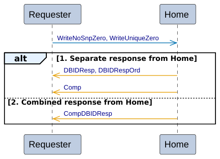

图 B2.4：Write Zero

- 该事务以请求方向归属节点发出 Write Zero 请求开始。Write Zero 事务包括：
- WriteUniqueZero
- WriteNoSnpZero
- 归属节点有两种方式向请求方发送完成响应与数据请求响应。
1. 来自归属节点的分离响应
- 归属节点向请求方返回数据请求响应，即 DBIDResp 或 DBIDRespOrd。
- 归属节点向请求方返回完成响应，即 Comp。
2. 来自归属节点的合并响应

归属节点向请求方返回合并的数据请求与完成响应，即 CompDBIDResp。

##### B2.3.2.3 CopyBack Write

图 B2.5 展示了 CopyBack Write 事务可能的事务流程。

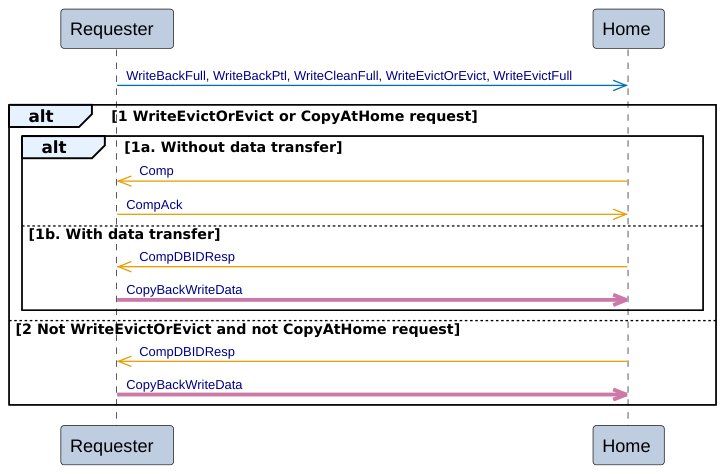

图 B2.5：CopyBack Write

CopyBack Write 的时序为：

- 该事务以请求方向归属节点发出 CopyBack Write 请求开始。CopyBack Write 事务包括：
- WriteBackPtl
- WriteBackFull
- WriteCleanFull
- WriteEvictFull
- WriteEvictOrEvict

该请求包含以下影响事务流程的字段：

- CAH
- Opcode
- 归属节点可以选择以 Comp 或 CompDBIDResp 响应完成该事务。归属节点所返回响应的选择由请求类型和 CAH 值决定。各种组合在备选方案 1-2 中描述：
1. WriteEvictOrEvict 或 CopyAtHome 请求

该请求为 WriteEvictOrEvict，或者该请求中的 CAH 位值被置为 1。

归属节点有两种可选响应返回给请求方：

Alt 1a. 无数据传输

- 归属节点向请求方返回完成响应，即 Comp，以避免数据传输。
- 请求方发送完成确认，即 CompAck。

请求方必须发送该消息，无论原请求中的 ExpCompAck 值为何，且只能在收到 Comp 响应之后发送。

Alt 1b. 有数据传输

- 归属节点向请求方返回合并的数据请求与完成响应，即 CompDBIDResp。
- 请求方向归属节点发送写数据，即 CopyBackWriteData。

请求方只能在收到 CompDBIDResp 响应之后才发送该消息。

2. 不是 WriteEvictOrEvict 且不是 CopyAtHome 请求

该请求不是 WriteEvictOrEvict，且该请求中的 CAH 位值被置为 0。

- 归属节点向请求方发送合并的数据请求与完成响应，即 CompDBIDResp。
- 请求方向归属节点发送写数据，即 CopyBackWriteData。请求方只能在收到 CompDBIDResp 响应之后才发送该消息。

##### B2.3.2.4 组合的立即写与 CMO

图 B2.6 展示了组合写与 CMO 事务可能的流程。此处仅涵盖非持久（Non-persist）缓存维护操作，关于组合的立即写与持久 CMO 事务的流程，请参见 B2.3.2.5 Combined Immediate Write and Persist CMO。

请求方 归属节点 从属节点

WriteNoSnpPtlCleanInv, WriteNoSnpFullCleanInv,

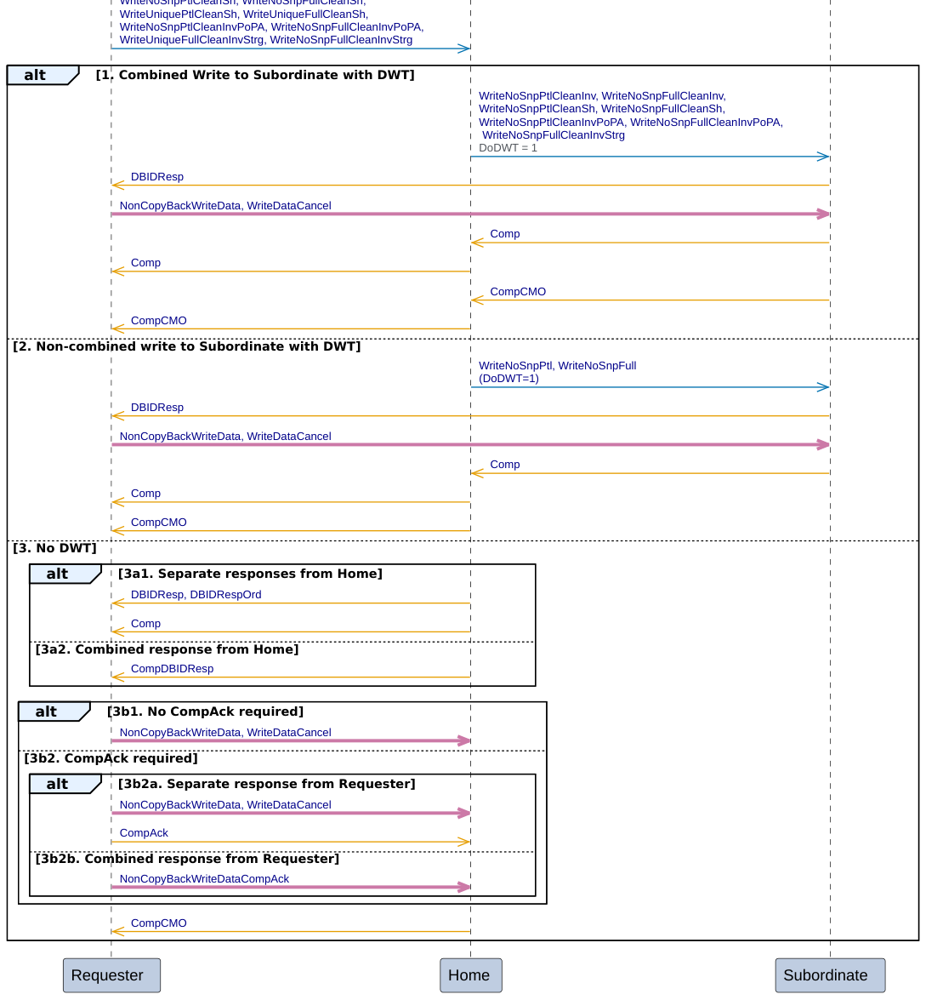

图 B2.6：组合的立即写与 CMO

组合的立即写与 CMO 事务的时序如下：

- 事务从请求方向归属节点发出组合写与 CMO 请求开始。该

组合的立即写与 CMO 事务包括：

- WriteNoSnpPtlCleanInv
- WriteNoSnpFullCleanInv
- WriteNoSnpPtlCleanSh
- WriteNoSnpFullCleanSh
- WriteUniquePtlCleanSh
- WriteUniqueFullCleanSh
- WriteNoSnpPtlCleanInvPoPA
- WriteNoSnpFullCleanInvPoPA
- WriteUniqueFullCleanInvStrg
- WriteNoSnpFullCleanInvStrg

为完成这些事务而产生的侦听请求被视为来自归属节点的独立事务，不在本流程中展示。向下游从属节点发出、且不属于 DWT 流程的写请求被视为独立事务，不在本流程中展示。此外，仅向归属节点返回响应并向下游从属节点发出的 CMO 请求也被视为独立事务。有关来自归属节点的独立事务的更多详细信息，请参见 B2.3.9 Home Initiated transactions。有关来自归属节点的独立组合写与 CMO 事务的更多详细信息，请参见 B2.3.9.2 Home to Subordinate Write transactions。

请求包含以下会影响事务流程的字段：

- Opcode
- ExpCompAck

> **注意**
>
> 在组合的立即写与 CMO 事务中不允许 TagOp 取值为 Match，因此不允许出现 TagMatch 响应，并且 TagOp 字段不影响事务流程。

- 归属节点有三种备选方案可供选择以完成该事务：
- 向从属节点发起带 DWT 的组合写。
- 向从属节点发起带 DWT 的非组合写。
- 不使用 DWT。

这三种方法在备选方案 1-3 中描述。

- 事务流程的其余部分取决于原始请求是否需要完成

确认，这由 ExpCompAck 决定。

1. 向从属节点发起带 DWT 的组合写

归属节点使用带 DWT 的组合写。

- 归属节点向从属节点发送 DoDWT = 1 的下游组合写请求。
- 从属节点向请求方返回数据请求 DBIDResp。
- 请求方向

从属节点发送写数据 NonCopyBackWriteData，或取消 WriteDataCancel。请求方必须仅在收到 DBIDResp 之后才发送。

- 从属节点向归属节点返回完成响应 Comp。从属节点可以在向归属节点返回 Comp 之前等待来自请求方的写数据 NonCopyBackWriteData 或取消 WriteDataCancel，但这不是必需的。
- 归属节点向请求方返回完成响应 Comp。归属节点可以在向请求方返回 Comp 之前等待来自从属节点的 Comp，但这不是必需的。
- 从属节点向归属节点返回 CMO 完成响应 CompCMO。从属节点可以在向归属节点返回 CompCMO 之前等待来自请求方的写数据，但这不是必需的。
- 归属节点向请求方返回 CMO 完成响应 CompCMO。归属节点可以在向请求方返回 CompCMO 之前等待来自从属节点的 Comp 或 CompCMO，但这不是必需的。如果归属节点的下游存在观察者，则归属节点必须先等待来自从属节点的 CompCMO 响应，然后才能向请求方返回 CompCMO。
2. 向从属节点发起带 DWT 的非组合写

归属节点使用带 DWT 的非组合写。

- 归属节点向

从属节点发送下游的 WriteNoSnpPtl 或 WriteNoSnpFull，其中 DoDWT = 1。

- 从属节点向请求方返回数据请求 DBIDResp。
- 请求方向

从属节点发送写数据 NonCopyBackWriteData，或取消 WriteDataCancel。请求方必须仅在收到 DBIDResp 之后才发送。

- 从属节点向归属节点返回完成响应 Comp。从属节点可以在向归属节点返回 Comp 之前等待来自请求方的写数据 NonCopyBackWriteData 或取消 WriteDataCancel，但这不是必需的。
- 归属节点向请求方返回完成响应 Comp。归属节点可以在向请求方返回 Comp 之前等待来自从属节点的 Comp，但这不是必需的。
- 归属节点向请求方返回 CMO 完成响应 CompCMO。归属节点可以在向请求方返回 CompCMO 之前等待来自从属节点的 Comp，但这不是必需的。
3. 不使用 DWT
- 归属节点不使用 DWT。
- 归属节点有两种请求写数据的备选方案。

备选方案 3a1. 来自归属节点的分离响应。归属节点执行以下两项操作：

- 向请求方返回数据请求 DBIDResp 或 DBIDRespOrd。
- 向请求方返回完成响应 Comp。

可以在返回 Comp 之前等待写数据 NonCopyBackWriteData 或取消 WriteDataCancel，但这不是必需的。

备选方案 3a2. 来自归属节点的组合响应。归属节点向请求方返回组合的数据请求与完成响应 CompDBIDResp。

- 请求方有多种发送写数据的备选方案，具体取决于事务

是否需要完成确认。

备选方案 3b1. 不需要 CompAck。不需要完成确认 CompAck，请求方向归属节点发送写数据 NonCopyBackWriteData，或写取消 WriteDataCancel。请求方必须仅在收到 DBIDResp、DBIDRespOrd 或 CompDBIDResp 之后才发送。

Alt 3b2. 需要 CompAck 需要完成确认。请求方有两种方式向归属节点发送写数据和完成确认。

Alt 3b2a. 来自请求方的分离响应 请求方执行以下两项操作：

- 向归属节点发送写数据 NonCopyBackWriteData，或写取消 WriteDataCancel。请求方只能在收到 DBIDResp、DBIDRespOrd 或 CompDBIDResp 之后发送。
- 向归属节点发送 CompAck。请求方只能在收到 DBIDResp、DBIDRespOrd、CompDBIDResp 或 Comp 之后发送。允许但不要求在发送 CompAck 之前等待 DBIDResp 或 DBIDRespOrd。不允许在发送 CompAck 之前等待 Comp 或 CompCMO。

Alt 3b2b. 来自请求方的合并响应 请求方向归属节点发送合并的写数据与完成确认 NonCopyBackWriteDataCompAck。请求方只能在收到 DBIDResp、DBIDRespOrd 或 CompDBIDResp 之后发送。如果已收到 DBIDResp 或 DBIDRespOrd，则不允许在发送 NonCopyBackWriteDataCompAck 之前等待 Comp。不允许在发送 NonCopyBackWriteDataCompAck 之前等待 CompCMO。

- 归属节点向请求方返回 CMO 完成响应 CompCMO。允许但不要求归属节点在返回 CompCMO 之前等待来自请求方的写数据。

##### B2.3.2.5 合并即时写与 Persist CMO

图 B2.7 展示了合并即时写与 Persist CMO 事务可能的事务流程。

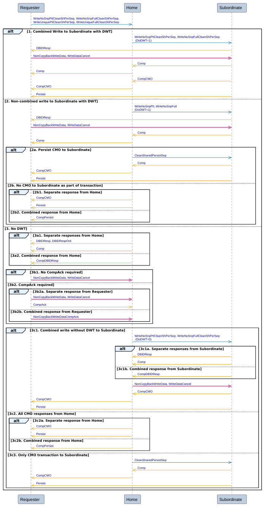

图 B2.7：合并即时写与 Persist CMO

合并即时写与 Persist CMO 的流程顺序为：

- 事务以请求方向归属节点发出合并即时写与 Persist CMO 请求开始。

合并即时写与 Persist CMO 事务包括：

- WriteNoSnpPtlCleanShPerSep
- WriteNoSnpFullCleanShPerSep
- WriteUniquePtlCleanShPerSep
- WriteUniqueFullCleanShPerSep

为完成这些事务而生成的侦听请求，被视为来自归属节点的独立事务，本流程中不予展示。为发往下游从属节点而生成的写请求（不属于 DWT 流程的一部分）被视为独立事务，本流程中不予展示。此外，仅为向归属节点返回响应而生成并发送至下游从属节点的 CMO 请求，也被视为独立事务。关于来自归属节点的独立事务的更多细节，请参见 B2.3.9 Home Initiated transactions。关于来自归属节点的独立合并写与 CMO 事务的更多细节，请参见 B2.3.9.2 Home to Subordinate Write transactions。

请求包含以下影响事务流程的字段：

- Opcode
- ExpCompAck

> **注意**
>
> 在合并即时写与 Persist CMO 事务中不允许使用 TagOp 值 Match。因此，不允许任何 TagMatch 响应，且 TagOp 字段不影响事务流程。

- 归属节点可选择使用以下方式完成事务：
- 向从属节点进行带 DWT 的合并写。
- 向从属节点进行带 DWT 的非合并写。
- 不使用 DWT。

这三种方式在备选方案 1-3 中描述。

事务流程的其余部分取决于原始请求是否要求完成确认，这由 ExpCompAck 字段决定。

1. 向从属节点进行带 DWT 的合并写
- 归属节点向从属节点发送 DoDWT = 1 的下游合并写请求。
- 从属节点向请求方返回数据请求 DBIDResp。
- 请求方向从属节点发送写数据 NonCopyBackWriteData，或取消 WriteDataCancel。请求方只能在收到 DBIDResp 之后发送。
- 从属节点向归属节点返回完成响应 Comp。允许但不要求从属节点在向归属节点返回 Comp 之前等待来自请求方的写数据 NonCopyBackWriteData 或取消 WriteDataCancel。
- 归属节点向请求方返回完成响应 Comp。允许但不要求归属节点在向请求方返回 Comp 之前等待来自从属节点的 Comp。
- 从属节点向归属节点返回 CMO 完成响应 CompCMO。允许但不要求从属节点在向归属节点返回 CompCMO 之前等待来自请求方的写数据。
- 归属节点向请求方返回 CMO 完成响应 CompCMO。允许但不要求归属节点在向请求方返回 CompCMO 之前等待来自从属节点的 Comp 或 CompCMO。如果归属节点下游存在观察者，则归属节点必须在向请求方返回 CompCMO 之前等待来自从属节点的 CompCMO 响应。
- 从属节点向请求方返回 persist 响应 Persist。允许但不要求在返回 Persist 之前等待写数据。
2. 向从属节点进行带 DWT 的非合并写
- 归属节点向从属节点发送 DoDWT = 1 的下游非合并写请求 WriteNoSnpPtl 或 WriteNoSnpFull。
- 从属节点向请求方返回数据请求 DBIDResp。
- 请求方向从属节点发送写数据 NonCopyBackWriteData，或取消 WriteDataCancel。请求方只能在收到 DBIDResp 之后发送。
- 从属节点向归属节点返回完成响应 Comp。允许但不要求从属节点在向归属节点返回 Comp 之前等待来自请求方的写数据 NonCopyBackWriteData 或取消 WriteDataCancel。
- 归属节点向请求方返回完成响应 Comp。允许但不要求归属节点在向请求方返回 Comp 之前等待来自从属节点的 Comp。
- 归属节点有两种方式向请求方发送 CMO 响应。

Alt 2a. 向从属节点发送 Persist CMO

- 归属节点向从属节点发送下游请求 CleanSharedPersistSep。
- 从属节点向归属节点返回完成响应 Comp。
- 归属节点向请求方返回 CMO 完成响应 CompCMO。

如果归属节点下游存在观察者，则归属节点必须在向请求方返回 CompCMO 之前等待来自从属节点的 Comp 响应。

- 从属节点向请求方返回 persist 响应 Persist。

Alt 2b. 作为事务一部分不向从属节点发送 CMO 归属节点向请求方发送所有 CMO 响应。归属节点可以采用以下两种方式发送所有 CMO 响应。

Alt 2b1. 来自归属节点的分离响应 归属节点执行以下两项操作：

- 向请求方返回 CMO 完成响应 CompCMO。
- 向请求方返回 persist 响应 Persist。

Alt 2b2. 来自归属节点的合并响应 归属节点向请求方返回合并的完成与 persist 响应 CompPersist。

3. 不使用 DWT

归属节点不使用 DWT。

- 归属节点有两种方式请求写数据。

Alt 3a1. 来自归属节点的分离响应 归属节点执行以下两项操作：

- 向请求方返回数据请求 DBIDResp 或 DBIDRespOrd。
- 向请求方返回完成响应 Comp。允许但不要求在返回 Comp 之前等待写数据 NonCopyBackWriteData 或取消 WriteDataCancel。

Alt 3a2. 来自归属节点的组合响应 归属节点向请求方返回组合的数据请求与完成响应 CompDBIDResp。

- 根据事务是否需要完成确认，请求方有多种发送写数据的选择方案。

Alt 3b1. 不需要 CompAck 请求方向归属节点发送写数据 NonCopyBackWriteData，或写取消 WriteDataCancel。请求方必须仅在收到 DBIDResp、DBIDRespOrd 或 CompDBIDResp 之后才发送该数据。

Alt 3b2. 需要 CompAck 需要完成确认响应 CompAck。请求方有两种向归属节点发送写数据与 CompAck 的选择方案。

Alt 3b2a. 来自请求方的分离响应 请求方执行以下两项操作：

- 向归属节点发送写数据 NonCopyBackWriteData，或写取消 WriteDataCancel。请求方必须仅在收到 DBIDResp、DBIDRespOrd 或 CompDBIDResp 之后才发送该数据。
- 向归属节点发送完成确认 CompAck。请求方必须仅在收到 DBIDResp、DBIDRespOrd、CompDBIDResp 或 Comp 之后才发送该确认。允许（但并非必须）在发送 CompAck 之前等待 DBIDResp 或 DBIDRespOrd。不允许在发送 CompAck 之前等待 Comp、CompCMO 或 Persist。

Alt 3b2b. 来自请求方的组合响应 请求方向归属节点发送组合的写数据与完成确认 NonCopyBackWriteDataCompAck。请求方必须仅在收到 DBIDResp、DBIDRespOrd 或 CompDBIDResp 之后才发送该消息。如果已收到 DBIDResp 或 DBIDRespOrd，则不允许在发送 NonCopyBackWriteDataCompAck 之前等待 Comp。不允许在发送 NonCopyBackWriteDataCompAck 之前等待 CompCMO 或 Persist。

- 归属节点有多种完成该事务其余部分的选择方案。

Alt 3c1. 向从属节点发送不带 DWT 的组合写

- 归属节点向从属节点发送不带 DWT 的组合写。
- 从属节点有两种请求写数据的选择方案。

Alt 3c1a. 来自从属节点的分离响应 从属节点执行以下两项操作：

- 向归属节点返回数据请求 DBIDResp。
- 向归属节点返回完成响应 Comp。

允许（但并非必须）在返回 Comp 之前等待写数据 NonCopyBackWriteData 或取消 WriteDataCancel。

Alt 3c1b. 来自从属节点的组合响应 从属节点向归属节点返回组合的数据请求与完成响应 CompDBIDResp。

- 归属节点向从属节点发送写数据 NonCopyBackWriteData，或取消 WriteDataCancel。归属节点必须仅在收到 DBIDResp 或 CompDBIDResp 之后才发送该数据。
- 从属节点向归属节点返回 CMO 完成响应 CompCMO。允许（但并非必须）在返回 CompCMO 之前等待写数据。
- 归属节点向请求方返回 CMO 完成响应 CompCMO。允许（但并非必须）归属节点在向请求方返回 CompCMO 之前等待来自从属节点的 CompCMO。
- 从属节点向请求方返回持久化响应 Persist。允许（但并非必须）在返回 Persist 之前等待写数据。

Alt 3c2. 所有 CMO 事务均来自归属节点 归属节点有两种向请求方发送所有 CMO 响应的选择方案。

Alt 3c2a. 来自归属节点的分离响应 归属节点执行以下两项操作：

- 向请求方返回 CMO 完成响应 CompCMO。
- 向请求方返回持久化响应 Persist。

Alt 3c2b. 来自归属节点的组合响应 归属节点向请求方返回组合的完成与持久化响应 CompPersist。

Alt 3c3. 仅向从属节点发送 CMO 事务

- 归属节点向从属节点发送下游请求 CleanSharedPersistSep。

通常，仅当先前已将对从属节点的写作为独立事务发送时，才会使用该方案。

- 从属节点向归属节点返回完成响应 Comp。
- 归属节点向请求方返回 CMO 完成响应 CompCMO。

如果归属节点下游存在观察者，则归属节点必须在向请求方返回 CompCMO 之前等待来自从属节点的 Comp 响应。

- 从属节点向请求方返回持久化响应 Persist。

##### B2.3.2.6 组合 CopyBack 写与 CMO

图 B2.8 展示了组合 CopyBack 写与 CMO 事务可能的事务流程。

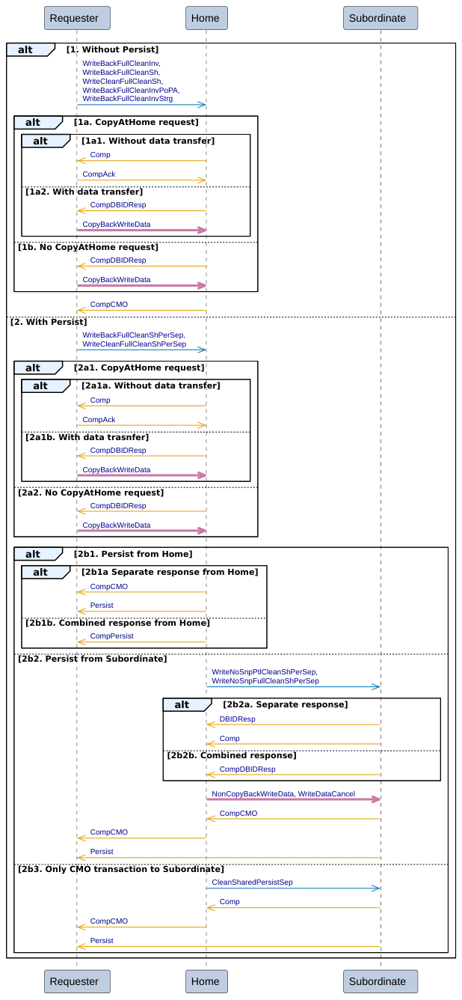

图 B2.8：组合 CopyBack 写与 CMO

组合 CopyBack 与 CMO 事务有两种可能的顺序。

发送到下游从属节点、且不属于 DWT 或 Persist 流程的写请求。这些写请求被视为独立事务，本流程中不予展示。发送到下游从属节点、且仅向归属节点返回响应的 CMO 请求，被视为独立事务，本流程中不予展示。有关来自归属节点的独立事务的更多详细信息，请参见 B2.3.9 归属节点发起的事务。有关来自归属节点的独立组合写与 CMO 事务的更多详细信息，请参见 B2.3.9.4 归属节点到从属节点的组合写与 CMO 事务。

该请求包含以下影响事务流程的字段：

- Opcode
- CAH
1. 不带 Persist

不带 Persist 的组合 CopyBack 写与 CMO 事务包括：

- WriteBackFullCleanInv
- WriteBackFullCleanSh
- WriteCleanFullCleanSh
- WriteBackFullCleanInvPoPA
- WriteBackFullCleanInvStrg

请求方发出不带 Persist 响应的组合 CopyBack 写与 CMO 请求。

- 请求方向归属节点发出请求。

Alt 1a. CopyAtHome 请求 请求中的 CAH 位值设置为 1。归属节点有两种可选响应返回给请求方。

Alt 1a1. 不带数据传输

- 为避免数据传输，归属节点向请求方返回完成响应 Comp。
- 请求方发送完成确认 CompAck。

无论原始请求中的 ExpCompAck 取何值，请求方都必须发送该确认，且只能在收到 Comp 响应之后发送。

Alt 1a2. 带数据传输

- 归属节点向请求方返回数据请求与完成响应的组合响应 CompDBIDResp。
- 请求方向归属节点发送写数据 CopyBackWriteData。

请求方只能在收到 CompDBIDResp 之后发送该数据。

Alt 1b. 无 CopyAtHome 请求 请求中的 CAH 位值设置为 0。

- 归属节点向请求方发送数据请求与完成响应的组合响应 CompDBIDResp。
- 请求方向归属节点发送写数据 CopyBackWriteData。请求方只能在收到 CompDBIDResp 之后发送该数据。
- 归属节点向请求方返回 CMO 完成响应 CompCMO。允许（但并非必须）在返回 CompCMO 之前等待 CopyBackWriteData 或 CompAck。
2. 带 Persist

组合 CopyBack 写与 CMO 事务包括：

- WriteBackFullCleanShPerSep
- WriteCleanFullCleanShPerSep

请求方发出带 Persist 响应的组合 CopyBack 写与 CMO 请求。

- 请求方向归属节点发出请求。

Alt 2a1. CopyAtHome 请求 请求中的 CAH 位值设置为 1。归属节点有两种可选响应返回给请求方。

Alt 2a1a. 不带数据传输

- 为避免数据传输，归属节点向请求方返回完成响应 Comp。
- 请求方发送完成确认 CompAck。无论原始请求中的 ExpCompAck 取何值，请求方都必须发送该确认，且只能在收到 Comp 响应之后发送。

Alt 2a1b. 带数据传输

- 归属节点向请求方返回数据请求与完成响应的组合响应 CompDBIDResp。
- 请求方向归属节点发送写数据 CopyBackWriteData。请求方只能在收到 CompDBIDResp 之后发送该数据。

Alt 2a2. 无 CopyAtHome 请求 请求中的 CAH 位值设置为 0。

- 归属节点向请求方发送数据请求与完成响应的组合响应 CompDBIDResp。
- 请求方向归属节点发送写数据 CopyBackWriteData。请求方只能在收到 CompDBIDResp 之后发送该数据。

归属节点有三种完成该事务的可选方式，Persist 响应既可以来自归属节点，也可以来自从属节点。

Alt 2b1. 来自归属节点的 Persist 归属节点有两种可选方式发送 CMO 完成响应与 Persist 响应。归属节点可以（但并非必须）在返回 CompCMO、Persist 或 CompPersist 之前等待 CopyBackWriteData 或 CompAck。

Alt 2b1a. 来自归属节点的分离响应

- 向请求方返回 CMO 完成响应 CompCMO。
- 向请求方返回 Persist 响应 Persist。

Alt 2b2b. 来自归属节点的组合响应 归属节点向请求方返回 CMO 完成响应与 Persist 响应的组合响应 CompPersist。

Alt 2b2. 来自从属节点的 Persist 当组合写被发送到从属节点并且 Persist 响应返回给请求方时，发生以下情况：

- 归属节点向从属节点发送下游写请求 WriteNoSnpPtlCleanShPerSep 或 WriteNoSnpFullCleanShPerSep。归属节点可以（但并非必须）在发送该下游写请求之前等待 CopyBackWriteData 或 CompAck。
- 从属节点有两种可选方式向归属节点返回完成响应和数据请求响应。

Alt 2b2a. 分离响应 从属节点执行以下两项操作：

- 向归属节点返回数据请求 DBIDResp。
- 向归属节点返回完成响应 Comp。允许（但并非必须）在返回 Comp 之前等待写数据 NonCopyBackWriteData 或取消 WriteDataCancel。

Alt 2b2b. 组合响应 从属节点向归属节点返回数据请求与完成响应的组合响应 CompDBIDResp。

- 归属节点向从属节点发送写数据 NonCopyBackWriteData，或发送取消 WriteDataCancel。归属节点只能在收到 DBIDResp 或 CompDBIDResp 之后发送。
- 从属节点向归属节点返回 CMO 完成响应 CompCMO。

允许（但并非必须）在返回 CompCMO 之前等待写数据。

- 归属节点向请求方返回 CMO 完成响应 CompCMO。

归属节点可以（但并非必须）在向请求方返回 CompCMO 之前等待来自从属节点的 CompCMO。

- 从属节点向请求方返回持久化响应 Persist。

允许（但非必须）在返回 Persist 之前等待写数据。

Alt 2b3. 仅向从属节点发送 CMO 事务 当持久化 CMO 被发送至从属节点，且 Persist 响应被返回给请求方时，发生以下情况：

- 归属节点向从属节点发送下游请求 CleanSharedPersistSep。

通常，仅当此前已作为独立事务向从属节点发送了写操作，或该写操作已被取消时，才会采用此替代方案。

- 从属节点向归属节点返回完成响应 Comp。
- 归属节点向请求方返回完成响应 CompCMO。

如果归属节点下游存在观察者，则归属节点必须先等待来自从属节点的 Comp 响应，然后才能向请求方返回 CompCMO。

- 从属节点向请求方返回持久化响应 Persist。

#### B2.3.3 原子事务

图 B2.9 展示了原子事务可能的事务流。

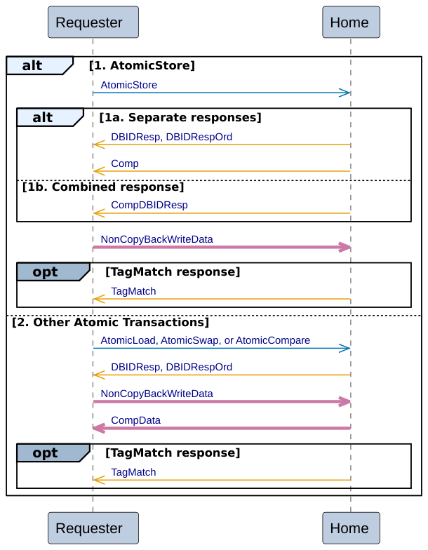

图 B2.9：原子事务

原子事务有两种可能的序列。

请求方的替代方案包括：

1. AtomicStore

对于 AtomicStore 事务：

- 请求方向归属节点发送 AtomicStore 请求。
- 归属节点有两种替代方案来向请求方发送完成响应和数据请求响应。

Alt 1a. 独立响应 归属节点执行以下两项操作：

- 向请求方返回数据请求 DBIDResp 或 DBIDRespOrd。
- 向请求方返回完成响应 Comp。允许（但非必须）在返回 Comp 之前等待写数据。

Alt 1b. 合并响应 归属节点向请求方返回合并的数据请求与完成响应 CompDBIDResp。

- 请求方向归属节点发送写数据 NonCopyBackWriteData。请求方必须仅在收到 DBIDResp、DBIDRespOrd 或 CompDBIDResp 之后才能发送该数据。
- 可选地，当请求需要 TagMatch 响应时，归属节点向请求方返回标签匹配响应 TagMatch。允许（但非必须）在返回 TagMatch 之前等待写数据。
2. 其他原子事务

对于 AtomicLoad、AtomicSwap 或 AtomicCompare 事务：

- 请求方向归属节点发送 AtomicLoad、AtomicSwap 或 AtomicCompare 请求。
- 归属节点向请求方发送数据请求响应 DBIDResp 或 DBIDRespOrd。
- 请求方向归属节点发送写数据 NonCopyBackWriteData。请求方必须仅在收到 DBIDResp 或 DBIDRespOrd 之后才能发送该数据。请求方不得等待收到 CompData 之后才发送写数据。
- 归属节点向请求方返回合并的数据与完成响应 CompData。允许（但非必须）在返回 CompData 之前等待写数据。
- 可选地，当请求需要 TagMatch 响应时，归属节点向请求方返回标签匹配响应 TagMatch。允许（但非必须）在返回 TagMatch 之前等待写数据。

#### B2.3.4 Stash 事务

图 B2.10 展示了 stash 事务可能的事务流。

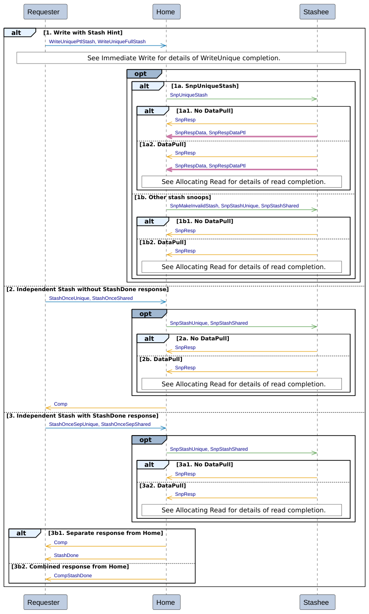

图 B2.10：Stash 事务

Stash 事务有三种可能的序列。

以下情况可能影响事务流：

- 允许归属节点忽略 Stash 请求，不执行任何 stash 侦听。
- 允许 Stashee 忽略 Stash 请求，不请求数据拉取来完成该事务。
- StashOnceSepUnique 和 StashOnceSepShared 可以有独立的 StashDone 响应，或合并的 CompStashDone 响应。
1. 带 Stash 提示的写操作

带 Stash 提示的写操作启动该事务。带 Stash 提示的写请求包括：

- WriteUniquePtlStash
- WriteUniqueFullStash

WriteUnique 使用与立即写（Immediate Write）相同的事务流，详见 B2.3.2.1 Immediate Write。

归属节点可以选择性地发送 stash 侦听请求。

Alt 1a. SnpUniqueStash

- 归属节点向 Stashee 发送 SnpUniqueStash。

通常，归属节点针对部分缓存行写发送 SnpUniqueStash。允许使用其他侦听，包括其他 stash 侦听。

- Stashee 有两种替代方式来响应 stash 侦听请求。

Alt 1a1. No DataPull 不请求数据拉取。

Alt 1a2. DataPull 请求数据拉取。带数据拉取的请求的完成过程与分配读（Allocating Read）事务的完成过程相同，详见 B2.3.1.1 Allocating Read。

Alt 1b. 其他 stash 侦听

- 向 Stashee 发送 SnpMakeInvalidStash、SnpStashShared 或 SnpStashUnique。

通常，归属节点针对整缓存行写发送 SnpMakeInvalidStash。允许使用其他侦听，包括其他 stash 侦听。

- Stashee 有两种替代方式来响应 stash 侦听请求。

Alt 1b1. No DataPull 不请求数据拉取

Alt 1b2. DataPull 请求数据拉取。带数据拉取的请求的完成过程与分配读事务的完成过程相同，详见 B2.3.1.1 Allocating Read。

2. 不带 StashDone 响应的独立 Stash

不带 StashDone 响应的独立 Stash 启动该事务。不带 StashDone 响应的独立 Stash 请求包括：

- StashOnceUnique
- StashOnceShared

归属节点可以选择性地向 Stashee 发送 stash 侦听请求 SnpStashUnique 或 SnpStashShared。通常，当原始请求为 StashOnceUnique 时，归属节点发送 SnpStashUnique；当原始请求为 StashOnceShared 时，发送 SnpStashShared。

- Stashee 有两种替代方式来响应 stash 侦听请求。

Alt 2a. No DataPull 不请求数据拉取。

Alt 2b. DataPull 请求数据拉取。带数据拉取的请求的完成过程与分配读事务的完成过程相同，详见 B2.3.1.1 Allocating Read。

该事务以归属节点向原始请求方返回完成响应 Comp 而完成。

允许（但非必须）在返回 Comp 响应之前等待 stash 事务完成。

3. 带 StashDone 响应的独立 Stash

带 StashDone 响应的独立 Stash 启动该事务。带 StashDone 响应的独立 Stash 请求包括：

- StashOnceSepUnique
- StashOnceSepShared

归属节点可以选择性地向 Stashee 发送 stash 侦听请求 SnpStashUnique 或 SnpStashShared。通常，当原始请求为 StashOnceSepUnique 时，归属节点发送 SnpStashUnique；当原始请求为 StashOnceSepShared 时，发送 SnpStashShared。

- Stashee 有两种替代方式来响应 stash 侦听请求。

Alt 3a1. No DataPull 不请求数据拉取。

Alt 3a2. DataPull 请求数据拉取。带数据拉取的请求的完成过程与分配读事务的完成过程相同，详见 B2.3.1.1 Allocating Read。

归属节点有两种替代方案来完成该事务。

Alt 3b1. 来自归属节点的独立响应 归属节点执行以下两项操作：

- 向请求方返回完成响应 Comp。
- 向请求方返回 stash 完成响应 StashDone。

Alt 3b2. 来自归属节点的合并响应 归属节点向请求方返回合并的完成与 stash 完成响应 CompStashDone。

#### B2.3.5 Dataless transactions

图 B2.11 展示了无数据事务的事务流程。

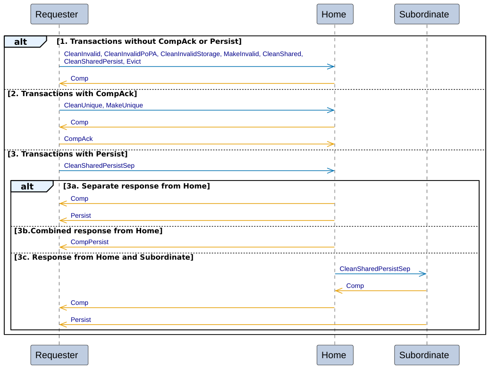

图 B2.11：无数据事务

无数据事务有三种可能的流程。

1. 不带 CompAck 或 Persist 的事务

不带 CompAck 或 Persist 的无数据事务包括：

- CleanInvalid
- CleanInvalidPoPA
- CleanInvalidStorage
- MakeInvalid
- CleanShared
- CleanSharedPersist
- Evict

请求方向归属节点发送请求。

归属节点向请求方返回完成响应 Comp。

2. 带 CompAck 的事务

带 CompAck 的无数据事务包括：

- CleanUnique
- MakeUnique

请求方向归属节点发送请求。

归属节点向请求方返回完成响应 Comp。

请求方向归属节点发送完成确认 CompAck。

请求方必须在收到 Comp 之后才能发送该确认。

3. 带 Persist 的事务

带 Persist 的无数据事务为：

- CleanSharedPersistSep

请求方向归属节点发送请求。

归属节点有三种完成该事务的方式。

Alt 3a. 归属节点分别返回响应 归属节点执行以下两项操作：

- 向请求方返回完成响应 Comp。
- 向请求方返回持久化响应 Persist。

Alt 3b. 归属节点返回合并响应 归属节点向请求方返回完成与持久化合并的响应 CompPersist。

Alt 3c. 来自归属节点和从属节点的响应 在从属节点返回 Persist 响应的情况下，将发生以下情况：

- 归属节点向从属节点发送下游请求 CleanSharedPersistSep。
- 从属节点向归属节点返回完成响应 Comp。
- 归属节点向请求方返回完成响应 Comp。如果归属节点下游存在观察者，则归属节点必须先等待来自从属节点的 Comp 响应，然后才能向请求方返回 Comp 响应。
- 从属节点向请求方返回持久化响应 Persist。

#### B2.3.6 Prefetch transactions

图 B2.12 展示了预取事务的事务流程。

请求方 从属节点

PrefetchTgt

请求方 从属节点

图 B2.12：预取事务

预取事务的流程如下：

- 请求方直接向从属节点发送 PrefetchTgt 请求。

> **注意**
>
> 不返回任何响应。

#### B2.3.7 DVM transactions

图 B2.13 展示了 DVM 事务的事务流程。

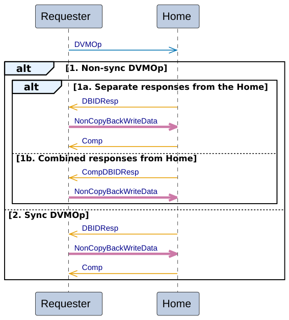

图 B2.13：DVM 事务

为完成 DVM 事务而生成的侦听请求被视为来自归属节点的独立事务，未在此流程中示出。更多详细信息，请参见 B2.3.9.8 归属节点到 Snoopee 的 DVM 事务。

DVM 事务的流程如下：

- 该事务以请求方向归属节点发出 DVMOp 请求开始。
- 归属节点有两种方式向请求方发送完成响应和数据请求响应：
1. 非同步 DVMOp

Alt 1a. 归属节点分别返回响应 归属节点执行以下两项操作：

- 向请求方返回数据请求 DBIDResp。
- 请求方向归属节点发送写数据 NonCopyBackWriteData。

请求方必须在收到 DBIDResp 之后才能发送该数据。

- 向请求方返回完成响应 Comp。允许（但非必需）在返回 Comp 之前等待写数据。

Alt 1b. 归属节点返回合并响应

- 归属节点向请求方返回数据请求与完成合并的响应 CompDBIDResp。
- 请求方向归属节点发送写数据 NonCopyBackWriteData。

请求方必须在收到 CompDBIDResp 之后才能发送该数据。

2. 同步 DVMOp

归属节点必须分别返回响应。

- 归属节点向请求方返回数据请求 DBIDResp。
- 请求方向归属节点发送写数据 NonCopyBackWriteData。请求方必须在收到 DBIDResp 之后才能发送该数据。
- 归属节点向请求方返回完成响应 Comp。归属节点必须在收到写数据之后才能返回该响应。

#### B2.3.8 重试

图 B2.14 展示了重试（Retry）序列可能的事务流程。

请求方 完成方

不带信用的请求

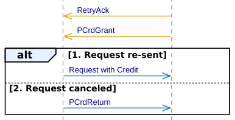

请求方 完成方

图 B2.14：重试事务

请求事务首次发送时不携带协议信用（P-Credit）。如果在完成方处无法接受该事务，则返回 RetryAck 响应，表示该事务未被接受，并可在提供适当信用时重新发送。该事务第二次发送时携带信用，并且保证会被接受。

重试事务的序列为：

- 请求方发出不带信用的请求。
- 完成方向请求方返回重试响应 RetryAck。
- 完成方向请求方返回协议信用授予 PCrdGrant。通常，协议信用

授予在重试响应之后相当长时间才返回。不过，在非典型情况下，PCrdGrant 响应可以在重试响应之前返回。

- 请求方有两种方式结束重试序列。此步骤必须仅在

请求方已同时收到 RetryAck 和 PCrdGrant 之后发生。

1. 重新发送原请求

请求方发出带信用的请求。

2. 取消该请求并归还信用

请求方向完成方发送协议信用归还 PCrdReturn。

#### B2.3.9 归属节点发起的事务

归属节点发起的事务有：

- B2.3.9.1 归属节点到从属节点读事务
- B2.3.9.2 归属节点到从属节点写事务
- B2.3.9.3 归属节点到从属节点 Write Zero 事务
- B2.3.9.4 归属节点到从属节点合并写与 CMO 事务
- B2.3.9.5 归属节点到从属节点无数据事务
- B2.3.9.6 归属节点到从属节点原子事务
- B2.3.9.7 归属节点到 Snoopee 事务
- B2.3.9.8 归属节点到 Snoopee DVM 事务

##### B2.3.9.1 归属节点到从属节点读事务

图 B2.15 展示了归属节点到从属节点读事务可能的事务流程。

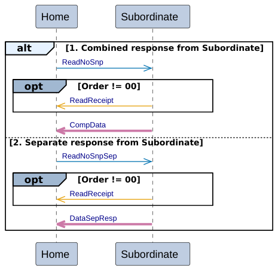

图 B2.15：归属节点到从属节点读事务

归属节点读事务有两种可能的序列。

1. 来自从属节点的合并响应
- 对于 ReadNoSnp 事务，归属节点向从属节点发出请求。
- 可选地，当请求的 Order 设置为非零时，从属节点返回 ReadReceipt 响应。
- 从属节点向归属节点返回合并的完成响应与读数据 CompData。
2. 来自从属节点的分离响应
- 对于 ReadNoSnpSep 事务，归属节点向从属节点发出请求。
- 可选地，当请求的 Order 设置为非零时，从属节点返回 ReadReceipt 响应。
- 从属节点向归属节点返回读数据 DataSepResp。

##### B2.3.9.2 归属节点到从属节点写事务

图 B2.16 展示了归属节点到从属节点写事务可能的事务流程。

归属节点 从属节点

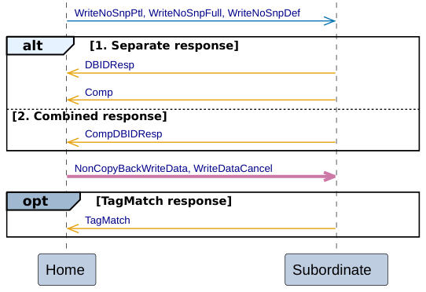

图 B2.16：归属节点到从属节点写事务

归属节点到从属节点写事务的序列为：

- 该事务始于归属节点向从属节点发出 WriteNoSnpPtl、WriteNoSnpFull 或 WriteNoSnpDef 请求。
- 从属节点有两种方式向归属节点返回完成响应和数据请求响应。
1. 分离响应

从属节点执行以下两项操作：

- 向归属节点返回数据请求响应 DBIDResp。
- 向归属节点返回完成响应 Comp。允许但不要求在返回 Comp 之前等待

写数据 NonCopyBackWriteData 或取消 WriteDataCancel。

2. 合并响应

从属节点向归属节点返回合并的数据请求与完成响应 CompDBIDResp。

- 归属节点向从属节点发送写数据 NonCopyBackWriteData 或取消 WriteDataCancel。

归属节点必须仅在收到 DBIDResp 或 CompDBIDResp 之后发送该消息。

- 可选地，当请求需要 TagMatch 响应时，从属节点向归属节点返回 Tag 匹配响应

TagMatch。允许但不要求在返回 TagMatch 之前等待写数据。

##### B2.3.9.3 归属节点到从属节点的 Write Zero 事务

图 B2.17 展示了归属节点到从属节点的 Write Zero 事务可能的事务流。

归属节点 从属节点

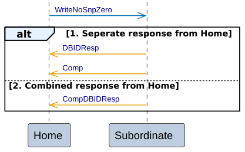

图 B2.17：归属节点到从属节点的 Write Zero 事务

Write Zero 的时序为：

- 事务以归属节点向从属节点发出 Write Zero 请求开始。Write Zero 事务为：
- WriteNoSnpZero
- 从属节点有两种可选方式向归属节点返回完成响应和数据请求响应。
1. 来自归属节点的分离响应

从属节点执行以下两项操作：

- 向归属节点返回数据请求响应 DBIDResp。
- 向归属节点返回完成响应 Comp。
2. 来自归属节点的合并响应

从属节点向归属节点返回合并的数据请求与完成响应 CompDBIDResp。

##### B2.3.9.4 归属节点到从属节点的组合写与 CMO 事务

图 B2.18 展示了归属节点到从属节点的组合写与 CMO 事务可能的事务流。

归属节点 从属节点

WriteNoSnpPtlCleanInv、WriteNoSnpFullCleanInv、

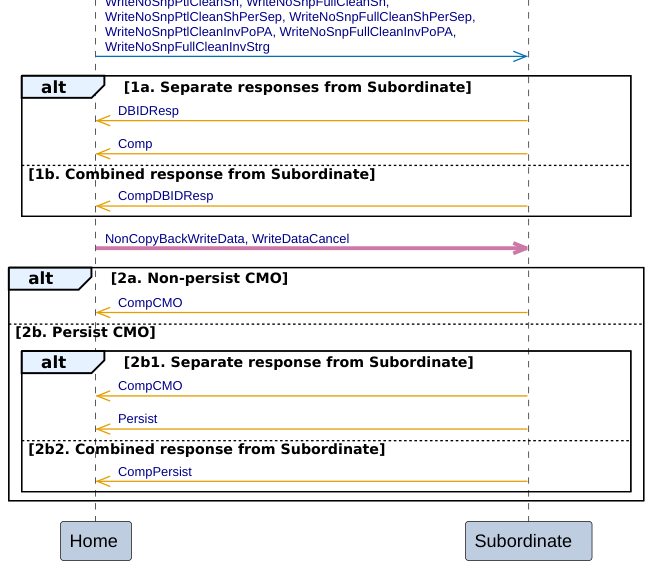

图 B2.18：归属节点到从属节点的组合写与 CMO 事务

归属节点到从属节点的带 CMO 的组合写事务的时序为：

- 事务以归属节点向从属节点发出组合写与 CMO 请求开始。归属节点的组合写与 CMO 事务为：
- WriteNoSnpPtlCleanInv
- WriteNoSnpFullCleanInv
- WriteNoSnpPtlCleanSh
- WriteNoSnpFullCleanSh
- WriteNoSnpPtlCleanShPerSep
- WriteNoSnpFullCleanShPerSep
- WriteNoSnpPtlCleanInvPoPA
- WriteNoSnpFullCleanInvPoPA
- WriteNoSnpFullCleanInvStrg
- 从属节点有两种可选方式向归属节点发送完成响应和数据请求响应。

Alt 1a. 来自从属节点的分离响应 从属节点执行以下两项操作：

- 向归属节点返回数据请求 DBIDResp。
- 向归属节点返回完成响应 Comp。

允许但不要求在返回 Comp 之前等待写数据 NonCopyBackWriteData 或取消 WriteDataCancel。

Alt 1b. 来自从属节点的合并响应 从属节点向归属节点返回合并的数据请求与完成响应 CompDBIDResp。

- 归属节点向从属节点发送写数据 NonCopyBackWriteData 或取消 WriteDataCancel。归属节点必须仅在收到 DBIDResp 或 CompDBIDResp 之后才发送该消息。
- 从属节点返回 CMO 响应有两种可选方式，具体取决于是否需要持久化响应 Persist。允许但不要求从属节点在返回 CompCMO、Persist 或 CompPersist 之前等待写数据。

Alt 2a. 非持久化 CMO 当不需要持久化响应时，从属节点向归属节点返回 CMO 完成响应 CompCMO。

Alt 2b. 持久化 CMO 当需要持久化响应时，从属节点有两种可选方式发送 CMO 完成响应和持久化响应。

Alt 2b1. 来自从属节点的分离响应 从属节点执行以下两项操作：

- 向归属节点返回 CMO 完成响应 CompCMO。
- 向归属节点返回持久化响应 Persist。

Alt 2b2. 来自从属节点的合并响应 从属节点向归属节点返回合并的 CMO 完成响应与持久化响应 CompPersist。

##### B2.3.9.5 归属节点到从属节点的 Dataless 事务

图 B2.19 展示了归属节点到从属节点的 Dataless 事务的事务流。

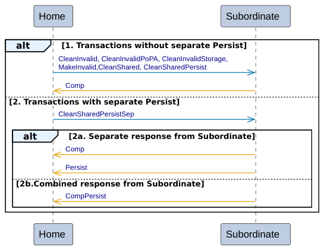

图 B2.19：归属节点到从属节点的 Dataless 事务

归属节点到从属节点的 Dataless 事务有两种可能的时序。

1. 不带独立 Persist 的事务

不带独立 Persist 的归属节点到从属节点的 Dataless 事务为：

- CleanInvalid
- CleanInvalidPoPA
- CleanInvalidStorage
- MakeInvalid
- CleanShared
- CleanSharedPersist

归属节点向从属节点发送请求。

从属节点向请求方返回完成响应 Comp。

2. 带独立 Persist 的事务

带独立 Persist 的归属节点到从属节点的 Dataless 事务为：

- CleanSharedPersistSep

归属节点向从属节点发送请求。

从属节点有两种可选方式完成该事务。

Alt 2a. 来自从属节点的分离响应 从属节点执行以下两项操作：

- 向归属节点返回完成响应 Comp。
- 向归属节点返回持久化响应 Persist。

使用分离的完成响应 Comp 和持久化响应 Persist，允许完成方在不等待 Persist 的情况下提前发送 Comp。通常 Persist 的耗时要长得多。

Alt 2b. 来自从属节点的合并响应 从属节点向归属节点返回合并的完成响应与持久化响应 CompPersist。

##### B2.3.9.6 归属节点到从属节点的 Atomic 事务

图 B2.20 展示了归属节点到从属节点的 Atomic 事务可能的事务流。

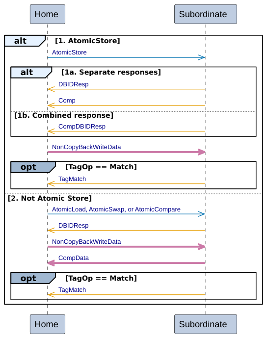

图 B2.20：归属节点到从属节点的 Atomic 事务

归属节点 Atomic 事务有两种可选方式。

当从属节点支持执行原子操作时，归属节点被允许（但非必须）将 Atomic 事务转发给从属节点。

1. AtomicStore
- 归属节点向从属节点发送 AtomicStore 请求。
- 从属节点有两种可选方式向归属节点发送完成响应和数据请求响应。

Alt 1a. 分离响应（Separate responses）：从属节点执行以下两项操作：

- 向归属节点返回数据请求，DBIDResp。
- 向归属节点返回完成响应，Comp。

允许（但非必须）在返回 Comp 之前等待写数据。

Alt 1b. 合并响应（Combined response）：从属节点向归属节点返回合并的数据请求与完成响应，CompDBIDResp。

- 归属节点向从属节点发送写数据，NonCopyBackWriteData。归属节点只能在收到 DBIDResp 或 CompDBIDResp 之后发送该数据。归属节点不得在发送写数据之前等待 Comp。
- 可选地，当请求需要 tag 匹配响应时，从属节点向归属节点返回 TagMatch 响应。允许（但非必须）在返回 TagMatch 之前等待写数据。
2. 非 AtomicStore（Not AtomicStore）
- 归属节点向从属节点发送 AtomicLoad、AtomicSwap 或 AtomicCompare 请求。
- 从属节点向归属节点发送数据请求响应，DBIDResp。
- 归属节点向从属节点发送写数据，NonCopyBackWriteData。归属节点只能在收到 DBIDResp 之后发送该数据。归属节点不得在写数据发送之前等待收到 CompData。
- 从属节点向归属节点返回合并的数据与完成响应，CompData。允许（但非必须）在返回 CompData 之前等待写数据。
- 可选地，当请求需要 TagMatch 响应时，从属节点向归属节点返回标签匹配响应，TagMatch。允许（但非必须）在返回 TagMatch 之前等待写数据。

##### B2.3.9.7 归属节点到 Snoopee 的事务

图 B2.21 展示了归属节点到 Snoopee 事务可能的事务流。

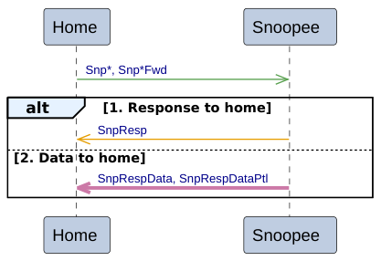

图 B2.21：归属节点到 Snoopee 的事务

以下事务必须使用此事务流。

- SnpOnce
- SnpClean
- SnpNotSharedDirty
- SnpShared
- SnpUnique
- SnpPreferUnique
- SnpCleanShared
- SnpCleanInvalid
- SnpMakeInvalid
- SnpQuery

以下事务也被允许（但非必须）使用此事务流。

- SnpOnceFwd
- SnpCleanFwd
- SnpNotSharedDirtyFwd
- SnpSharedFwd
- SnpUniqueFwd
- SnpPreferUniqueFwd

归属节点到 Snoopee 事务的序列为：

- 事务以归属节点向 Snoopee 发出 Snoop 请求开始。
- Snoopee 有两种可选方式完成该事务：
1. Snoopee 向归属节点提供侦听响应，SnpResp。对于 SnpMakeInvalid 事务，这是唯一被允许的可选方式。
2. Snoopee 提供带数据的侦听响应，SnpRespData 或 SnpRespDataPtl。

##### B2.3.9.8 归属节点到 Snoopee 的 DVM 事务

图 B2.22 展示了归属节点到 Snoopee 的 DVM 事务 SnpDVMOp 的事务流。

归属节点 Snoopee

SnpDVMOp

SnpDVMOp

SnpResp

归属节点 Snoopee

图 B2.22：归属节点到 Snoopee 的 DVM 事务

归属节点到 Snoopee 的 DVM 事务的序列为：

- 归属节点向 Snoopee 发出两个 Snoop DVM 请求，SnpDVMOp。
- Snoopee 提供单个侦听响应，SnpResp。Snoopee 只能在收到两个 Snoop DVM 请求之后提供该侦听响应。

### B2.4 事务标识符字段

每个事务由若干在互连中传输的不同数据包组成。数据包内的一组标识符字段用于提供该数据包的附加信息。

用于在互连中路由数据包的字段：

- B2.4.1 目标标识符 TgtID 与源标识符 SrcID

用于关联与单个事务相关的所有数据包的字段：

- B2.4.2 事务标识符 TxnID
- B2.4.3 数据缓冲区标识符 DBID
- B2.4.4 返回事务标识符 ReturnTxnID
- B2.4.5 前向事务标识符 FwdTxnID

用于标识事务内各个数据包的字段：

- B2.4.6 数据标识符 DataID 与关键块标识符 CCID

用于标识单个请求方内各个处理代理的字段：

- B2.4.7 逻辑处理器标识符 LPID
- B2.4.8 Stash 逻辑处理器标识符 StashLPID

用于标识 Stash 事务目标节点的字段：

- B2.4.9 Stash 节点标识符 StashNID

用于标识 Data 响应、Persist 响应或 TagMatch 响应接收节点的字段：

- B2.4.10 返回节点标识符 ReturnNID

用于标识 Data 响应接收节点的字段：

- B2.4.12 前向节点标识符 FwdNID

用于标识 CompAck 响应接收节点的字段：

- B2.4.11 归属节点标识符 HomeNID

用于标识不同事务集合的字段：

- B2.4.13 持久化组标识符 PGroupID
- B2.4.14 Stash 组标识符 StashGroupID
- B2.4.15 标签组标识符 TagGroupID

用于标识在多请求事务中某条 Response 或 Data 消息与哪条缓存行相关的字段：

- B2.4.16 缓存行标识符 CacheLineID

在某一接口上由某一 RP 上的数据包使用的标识符值，不得被另一 RP 上的数据包重复使用，除非本规范明确允许来自同一接口、同一 RP 的数据包这样做。有关资源平面的更多信息，参见 B14.2.1.2 Flow control with Resource Planes。

#### B2.4.1 目标标识符 TgtID 与源标识符 SrcID

事务请求包含用于标识目标节点的 TgtID 和用于标识源节点的 SrcID。这些标识符用于在互连中路由数据包。

#### B2.4.2 事务标识符 TxnID

事务请求包含一个 TxnID，用于标识来自给定请求方的事务。要求 TxnID（PrefetchTgt 除外）对于给定请求方必须唯一。请求方由 SrcID 标识。这确保任何返回的读数据或响应信息都能与正确的事务关联起来。

TxnID 定义为一个 12 位字段，未完成事务的数量上限为 1024。请求方在收到以下任一项之后，可以复用某个 TxnID 值：

- 与先前使用该请求中的 TxnID 值的事务相关的所有响应，且该请求不受请求重试影响。

> **注意**
>
> 当仍存在未完成的 TagMatch、StashDone 或 Persist 响应时，请求方可以复用 TxnID。

TagMatch、StashDone 和 Persist 响应中的 TxnID 不适用，必须设置为 0。这些响应到其原始事务的映射通过 TagGroupID、StashGroupID 和 PGroupID 字段实现。

- 先前使用该请求中的 TxnID 值的事务的 RetryAck 响应。

B2.5 Transaction identifier field flows 给出了不同事务类型的更详细规则。TxnID 字段不适用于 PrefetchTgt 请求，必须为 0。

Home 发往 Subordinate 的请求中 TxnID 字段所使用的值，在 Home 收到释放该请求所需的所有响应或收到 RetryAck 响应后，即可被 Home 复用。

被重试的事务不要求使用相同的 TxnID。参见 B2.10 Request Retry。

#### B2.4.3 数据缓冲区标识符，DBID

DBID 字段允许事务的完成方（Completer）为该事务提供其自己的标识符。完成方发送的响应中包含 DBID。DBID 值被用作以下各项中 TxnID 字段的取值：

- Immediate Write、CopyBack Write、Combined Write、Atomic 和 DVMOp 的 WriteData 响应

事务。

- 用于 Data Pull 目的的 Stash 事务的 CompData 响应。
- 以下事务的 CompAck 响应：
- 包含 CompAck 响应的 Read、Dataless、WriteNoSnp、WriteUnique 和 Immediate Combined Write 事务。
- 无数据传输即完成的 CopyBack 事务。

在以下情况下，完成方在给定事务的响应中所使用的 DBID 值对于给定的请求方必须是唯一的：

- 所有 Write 事务的 DBIDResp 或 DBIDRespOrd 或 CompDBIDResp，WriteNoSnpZero 和

WriteUniqueZero 除外。

- 所有 Combined Write 事务的 DBIDResp 或 DBIDRespOrd 或 CompDBIDResp。
- Atomic* 事务的 DBIDResp 或 DBIDRespOrd 或 CompDBIDResp。
- DVMOp 事务的 DBIDResp 或 DBIDRespOrd 或 CompDBIDResp。
- 包含 CompAck 的 Read 事务的 CompData 或 RespSepData，ReadOnce* 和 ReadNoSnp 不将由此

产生的 CompAck 用于在 Home 处释放请求的情况除外。

- 以下事务的 Comp：
- 包含 CompAck 的 Dataless 事务。
- 无数据传输即完成的 CopyBack 事务。

对于包含 CompAck 的 Read 请求，DBID 值在 DataSepResp 响应中适用，并且它必须与关联的 RespSepData 响应中的 DBID 值相同。

对于 Write 或 Combined Write 事务，与 DBIDResp 或 DBIDRespOrd 消息分开发送的 Comp 响应消息，当这两条消息来自同一源时，在 Comp 与 DBIDResp 或 DBIDRespOrd 消息中必须包含相同的 DBID 字段值。

对于 Atomic 事务，与 DBIDResp 或 DBIDRespOrd 消息分开发送的 Comp 响应消息，允许（但并非必须）在 Comp 与 DBIDResp 或 DBIDRespOrd 消息中包含相同的 DBID 字段值。

完成方允许（但并非必须）为两个具有不同请求方的事务使用相同的 DBID 值。在收到释放先前使用同一 DBID 值的那个事务所需的全部数据包之后，完成方可以复用该 DBID 值。B2.5 事务标识符字段流程针对不同的事务类型给出了更详细的规则。

侦听完成方（Snoop Completer）在响应包含 Data Pull 的 Stash 侦听时所使用的 DBID 值，必须相对于以下各项唯一：

- 对使用 Data Pull 的 Stash 侦听的其他 Snoop 响应中的 DBID 值。
- 该侦听完成方发出的任何未完成请求的 TxnID。

完成方无需使用 DBID 字段，并且可以在以下各项中将 DBID 设置为任意值：

- WriteNoSnpZero 和 WriteUniqueZero 事务。
- 不带 CompAck 的 Read 事务。
- 不带 CompAck 的 Dataless 事务。
- 以下任一情况的 SnpResp 响应：
- 不包含 Data Pull 的 Stash 侦听。
- 非 Stash 侦听。

> **注意**
>
> 使用由完成方分配的 DBID（而不是由请求方分配的 TxnID）的优点是：完成方可以使用 DBID 直接索引其请求结构，而无需使用 TxnID 和 SrcID 进行查找，以确定某个事务的写数据或完成确认与哪个请求相关联。

如果完成方对不同请求方使用了相同的 DBID 值——当完成方的操作要求同时有超过 1024 个 DBID 响应处于活动状态时，它必须这样做——则必须使用 SrcID 与 DBID 的组合来确定某个写数据或响应消息应与哪个请求相关联。

对于以下响应，DBID 字段不适用且必须为零：

- DataPull 为 0 时的 SnpRespData 和 SnpRespDataPtl。
- SnpRespDataFwded。

DBIDResp 响应还用于提供与该事务相关的某些顺序保证。参见 B2.7.5 事务排序。

#### B2.4.4 返回事务标识符，ReturnTxnID

从 Home 发往 Subordinate 的事务请求还包含一个 ReturnTxnID 字段，用于传达来自 Subordinate 的数据响应和 DBIDResp 响应中 TxnID 的取值。

在适用时，其取值必须是以下之一：

- 当 ReturnNID 为 Home 的节点 ID 时，为 Home 生成的 TxnID。
- 当 ReturnNID 为原始 Requester 的节点 ID 时，为原始 Requester 的 TxnID。

ReturnTxnID 仅适用于从 Home 发往 Subordinate 的 ReadNoSnp、ReadNoSnpSep、WriteNoSnp、Combined Write 和 Atomic* 请求。在所有其他从 Home 发往 Subordinate 的请求中，该字段不适用，且必须为零。

在从 Requester 发往 Home 以及从 Requester 发往 Subordinate 的所有请求中，ReturnTxnID 均不适用，且必须为零。

以下是从 Home Node 发往 Subordinate Node 的请求中 ReturnTxnID 的预期值和允许值。

在 ReadNoSnp 和 ReadNoSnpSep 中：

- 预期值为原始 Requester 的 TxnID，但允许为 Home 的 TxnID。
- 用作 CompData 和 DataSepResp 响应中的 TxnID。

在 TagOp 为 Invalid 或 Match 的 Atomic 中：

- 对于 AtomicStore，ReturnTxnID 可以取任意值，且该值不会在任何响应中使用。
- 对于 Non-store Atomics，ReturnTxnID 必须是 Home 的 TxnID。该值用作 CompData 响应中的 TxnID。

在 TagOp 取任意值的 WriteNoSnp 中：

- 当 DoDWT = 0 时，ReturnTxnID 可以取任意值，且该值不会在任何响应中使用。
- 当 DoDWT = 1 时，ReturnTxnID 的预期值为原始 Requester 的 TxnID，但允许为 Home 的 TxnID。用作 DBIDResp 响应中的 TxnID。

在 WriteNoSnpDef 中：

- 当 DoDWT = 0 时，ReturnTxnID 可以取任意值，且该值不会在任何响应中使用。
- 当 DoDWT = 1 时，ReturnTxnID 的预期值为原始 Requester 的 TxnID，但允许为 Home 的 TxnID。用作 DBIDResp 响应中的 TxnID。

在 Combined Write 中：

- 当 DoDWT = 0 时，ReturnTxnID 可以取任意值，且该值不会在任何响应中使用。
- 当 DoDWT = 1 时，ReturnTxnID 的预期值为原始 Requester 的 TxnID，但允许为 Home 的 TxnID。用作 DBIDResp 响应中的 TxnID。

#### B2.4.5 转发事务标识符，FwdTxnID

从 Home 发往 RN-F 的 Snoop request 还包含一个 FwdTxnID 字段，用于传达来自 Snoopee 的 Data 响应中 TxnID 的取值。其值必须是原始 Request 的 TxnID。

FwdTxnID 字段仅适用于：

- SnpSharedFwd
- SnpCleanFwd
- SnpOnceFwd
- SnpNotSharedDirtyFwd
- SnpUniqueFwd
- SnpPreferUniqueFwd

在所有其他 snoop 中，FwdTxnID 字段不适用，且必须为零。

#### B2.4.6 数据标识符 DataID 与关键数据块标识符 CCID

这些字段标识事务中的各个数据包。

参见 B2.9.4 数据分包和 B2.9.7 关键数据块标识符。

#### B2.4.7 逻辑处理器标识符，LPID

当单个 Requester 包含多个逻辑上独立的处理代理时，使用该字段。SrcID 与 LPID 一起用于唯一标识发起该请求的 LP。

对于以下事务，LPID 必须设置为正确的值：

- 对于任何不可侦听的非缓存访问或 Device 访问：
- ReadNoSnp
- WriteNoSnp
- WriteNoSnpDef
- 对于 Exclusive 访问，可以是以下事务类型之一：
- ReadClean
- ReadShared
- ReadNotSharedDirty
- ReadPreferUnique
- MakeReadUnique
- CleanUnique
- ReadNoSnp
- WriteNoSnp

更多详细信息请参见第 B6 章 Exclusive 访问。

对于其他事务，LPID 值可以（但非必须）用于指示导致该事务被发出的原始 LP。

在请求中，当适用时，数据包中的相同位用于 TagGroupID、PGroupID 和 StashGroupID。

#### B2.4.8 Stash Logical Processor Identifier, StashLPID

当对应的 StashLPIDValid 位为 1 时，StashLPID 字段可用于指定由 StashNID 所指定请求节点中的特定 LP。参见 B13.10.11 Stash Logical Processor Identifier, StashLPID。

关于 StashLPIDValid 与 StashNIDValid 的允许组合，参见 B7.5.1 Supporting REQ packet fields。

#### B2.4.9 Stash Node Identifier, StashNID

当对应的 StashNIDValid 位为 1 时，StashNID 字段提供作为 Stash 事务目标的请求节点。参见 B13.10.9 Stash Node Identifier, StashNID。

#### B2.4.10 Return Node Identifier, ReturnNID

从归属节点发往从属节点的事务请求中包含一个 ReturnNID，它用于确定来自从属节点的以下响应的 TgtID：

- 数据响应
- DBIDResp 响应
- Persist 响应
- TagMatch 响应

其值必须是归属节点的节点 ID 或原始请求方的节点 ID。

ReturnNID 仅适用于从归属节点发往从属节点的 ReadNoSnp、ReadNoSnpSep、CleanSharedPersistSep、WriteNoSnp、Combined Write 和 Atomic 请求。在从归属节点发往从属节点的所有其他请求中，该字段不适用且必须为零。

在从请求方发往归属节点以及从请求方发往从属节点的所有请求中，ReturnNID 不适用且必须为零。

以下是归属节点发往从属节点的请求中 ReturnNID 的预期取值和允许取值。

在 ReadNoSnp、ReadNoSnpSep 和 CleanSharedPersistSep 中：

- 预期值为原始请求方节点 ID，但允许为归属节点 ID。
- 用作 CompData、DataSepResp 和 Persist 响应中的 TgtID。

在 TagOp 为 Invalid 的 Atomic 中：

- 对于 AtomicStore，ReturnNID 可取任意值，且该值不用于任何响应。
- 对于非存储类 Atomic，ReturnNID 必须是归属节点 ID。该值用作

CompData 中的 TgtID。

在 TagOp 为 Match 的 Atomic 中：

- ReturnNID 必须是归属节点 ID。
- 该值用作 CompData 和 TagMatch 响应中的 TgtID。

在 TagOp 不为 Match 的 WriteNoSnp 中：

- 当 DoDWT = 0 时，ReturnNID 可取任意值，且该值不用于任何响应。
- 当 DoDWT = 1 时，ReturnNID 的预期值为原始请求方节点 ID，但允许

为归属节点 ID。用作 DBIDResp 响应中的 TgtID。

在 TagOp 为 Match 的 WriteNoSnp 中：

- 无论 DoDWT 取何值，ReturnNID 的预期值均为原始请求方节点 ID，

但允许为归属节点 ID。

- 当 DoDWT = 0 时，ReturnNID 的值仅用作 TagMatch 响应中的 TgtID。
- 当 DoDWT = 1 时，ReturnNID 的值用作 DBIDResp 和 TagMatch 响应中的 TgtID。

在 WriteNoSnpDef 中：

- 当 DoDWT = 0 时，ReturnNID 可取任意值，且该值不用于任何响应。
- 当 DoDWT = 1 时，ReturnNID 的预期值为原始请求方节点 ID，但允许

为归属节点 ID。用作 DBIDResp 响应中的 TgtID。

在非 PCMO 的 Combined Write 中：

- 当 DoDWT = 0 时，ReturnNID 可取任意值，且该值不用于任何响应。
- 当 DoDWT = 1 时，ReturnNID 的预期值为原始请求方节点 ID，但允许

为归属节点 ID。用作 DBIDResp 响应中的 TgtID。

在 WriteNoSnpFullClnShPer 和 WriteNoSnpPtlClnShPer 中：

- 无论 DoDWT 取何值，ReturnNID 的预期值均为原始请求方节点 ID，

但允许为归属节点 ID。

- 当 DoDWT = 0 时，ReturnNID 的值仅用作 Persist 响应中的 TgtID。
- 当 DoDWT = 1 时，ReturnNID 的值用作 DBIDResp 和 Persist 响应中的 TgtID。

#### B2.4.11 Home Node Identifier, HomeNID

CompData 包含 HomeNID 字段，请求方使用该字段来标识 CompAck 的目标，即请求方为响应 CompData 而可能需要发送的 CompAck 的目标。HomeNID 适用于 CompData 和 DataSepResp，对于所有其他 Data 消息均不适用且必须为零。

> **注意**
>
> DataSepResp 响应中的 HomeNID 和 DBID 字段没有功能上的要求，因为 RespSepData 响应中提供的值与之相同，并且始终可以使用。但是，为了便于调试和协议检查，要求包含这些值。

#### B2.4.12 Forward Node Identifier, FwdNID

从 Home 发往 RN-F 的 Snoop 请求包含一个 FwdNID，用于确定来自 Snoopee 的 Data 响应的 TgtID。其值必须是原始请求方的节点 ID。

FwdNID 字段仅适用于：

- SnpSharedFwd
- SnpCleanFwd
- SnpOnceFwd
- SnpNotSharedDirtyFwd
- SnpUniqueFwd
- SnpPreferUniqueFwd

FwdNID 字段在其他所有 snoop 中均不适用且必须为零，但基于范围的 Translation Lookaside Buffer Invalidate（TLBI）DVM 操作除外。对于基于范围的 TLBI 操作，该字段中的位用于 DVM 载荷。

#### B2.4.13 Persistence Group Identifier, PGroupID

CleanSharedPersistSep 以及带 Persistent CMO（PCMO）的 Combined Write 请求包含一个 PGroupID，用于标识该请求所属的 Persistence Group。如果某个请求方拥有来自不同功能代理的持久化 CMO 请求，并且希望对这些请求加以标识以实现高效的持久化 CMO 处理，则它可以为每一组 Persist 请求分配不同的 PGroupID 值。这个 8 位字段的用途适用于 CleanSharedPersistSep 以及带 PCMO 的 Combined Write 事务。它也适用于 Persist 和 CompPersist 响应。它在其他所有请求和响应中均不适用且必须为零。参见 B13.10.8 Persistence Group Identifier, PGroupID：

- PGroupID 必须在 CleanSharedPersistSep 请求以及包含
- PCMO 的 Combined Write 请求中发送。
- 请求方可以使用 Persist 响应中返回的 PGroupID 值，来分别跟踪来自每一组的
- Persist 响应的完成情况。
- 预期不支持多个持久化组的请求方将 PGroupID 值设置为 0。
- 通常，使用 PGroupID 传递屏障的请求方不会复用某个 PGroupID 值，直到该组先前发送的所有
- CleanSharedPersistSep 请求都已收到 Persist 响应为止。
- 完成方需要在 Persist 和 CompPersist 响应以及包含 PCMO 的 Combined Write 请求的响应中
- 回传 PGroupID。
- 来自 Home 和 Subordinate 的 Comp 与 CompCMO 响应中的 PGroupID 字段
- 不适用且必须为零。

#### B2.4.14 Stash Group Identifier, StashGroupID

为了标识请求所属的 Stash Group，StashOnceSep 请求包含一个 StashGroupID。请求中相同的 StashGroupID 值随后会在事务流中被 StashDone 响应使用。如果某个请求方拥有来自不同功能代理的、可以为实现高效的 stash 处理而加以标识的 StashOnceSep 请求，则可以为每一组 Stash 请求分配不同的 StashGroupID 值。

这个 8 位字段的用途适用于 StashOnceSep 请求和 StashDone 响应。StashGroupID 在其他所有请求和响应中均不适用且必须为零。

- StashGroupID 必须在 StashOnceSep 请求中发送。
- 请求方可以使用 StashDone 响应中返回的 StashGroupID 值，来分别跟踪来自每一组的
- Stash 事务的完成情况。
- 预期不支持多个 stash 组的请求方将 StashGroupID 值设置为 0。
- 完成方需要在 StashDone 响应中回传 StashGroupID。

参见 B13.10.13 Stash Group Identifier, StashGroupID。

#### B2.4.15 标签组标识符，TagGroupID

为了标识请求所属的 Tag 组，TagOp 设置为 Match 的 Write 请求会包含一个 TagGroupID。请求中相同的 TagGroupID 值随后会由事务流中的 TagMatch 响应使用，以通知请求方 TagMatch 操作是通过还是失败。

该 8 位字段适用于 TagOp 设置为 Match 的 Write 请求以及 TagMatch 响应。在所有其他请求和响应中，TagGroupID 均不适用，并且必须为零。

- 在 TagOp 设置为 Match 的 Write 请求中必须发送 TagGroupID。
- TagGroupID 的确切内容由具体实现决定。通常，TagGroupID 预期包含 Exception Level、TTBR 值和 PE 标识符。

参见 B13.10.41 标签组标识符，TagGroupID。

#### B2.4.16 缓存行标识符，CacheLineID

CacheLineID 字段用于 RSP 和 DAT 通道，以标识 Response 或 Data 消息对应哪条缓存行。

对于多请求事务和单请求事务，当 MultiReq_Support 属性为 True 或 CacheLineID_Accurate 时，CacheLineID 字段（在适用的情况下）必须与相关联的请求或侦听地址的相关位相匹配。这样便可以区分共享同一事务标识符的多个缓存行响应，尤其是在多请求事务流中。

更多信息请参见 B13.10.66 CacheLineID 和 B2.6 多请求。

### B2.5 事务标识符字段流转

本节展示不同事务类型的事务标识符字段流转：

- B2.5.1 读事务
- B2.5.2 无数据事务
- B2.5.3 写事务
- B2.5.4 DVMOp 事务
- B2.5.5 带 Retry 的事务请求
- B2.5.6 协议信用返回事务

在相关图中：

- 每个数据包中包含的字段为：
- 对于 Request 数据包：TgtID、SrcID、TxnID、StashNID、StashLPID、ReturnNID、ReturnTxnID、PGroupID、StashGroupID 和 TagGroupID。
- 对于 Response 数据包：TgtID、SrcID、TxnID、DBID、PGroupID、StashGroupID 和 TagGroupID。
- 对于 Data 数据包：TgtID、SrcID、TxnID、HomeNID 和 DBID。
- 对于 Snoop 数据包：SrcID、TxnID、FwdNID、FwdTxnID 和 StashLPID。
- 颜色相同的所有字段具有相同的值。
- 弯曲的回环箭头表示请求方和完成方如何使用更早数据包中的字段来生成后续数据包的字段。
- 包含星号 [*] 的方框表示字段首次生成的位置，即指出确定该字段原始值的代理。
- 用括号括起来的字段表示该值实际上是一个固定值。通常，数据包发送时的 SrcID 字段，以及数据包到达目的地时的 TgtID 字段，就属于这种情况。
- 被划掉的字段表示该字段无效。
- 允许互连将原始事务的 TgtID 重映射为新值。这通过包含字母 R 的方框来表示。第 B3 章 网络层对此有更详细的说明。

> **注意**
>
> 在发送的每个数据包中，标识符字段都属于以下类别之一：

- 新值。星号表示生成了新值。
- 由更早的数据包生成。回环箭头指示其来源。
- 固定值。该值用方括号括起来。
- 无效。该字段被划掉。

在以下示例中，为清晰起见，有时会省略与示例无关的事务标识符。

#### B2.5.1 读事务

本节展示在带和不带 Direct Data Transfer 的读事务中标识符字段的流动：

- B2.5.1.1 带 DMT 的 ID 值传递
- B2.5.1.2 带 DMT 且 Comp 与 Data 分离的 ID 值传递
- B2.5.1.3 带 DCT 的 ID 值传递
- B2.5.1.4 不带 Direct Data Transfer 的 ID 值传递

##### B2.5.1.1 带 DMT 的 ID 值传递

图 B2.23 展示了 DMT 事务消息中的 Target ID 和 Transaction ID 值是如何推导出来的。例如，来自互连的 ReadNoSnp 请求中的 SrcID 值由互连分配。而在 Data 响应中用作 TgtID 的 ReturnNID，则被设置为所收到的 Read 请求的 SrcID 值。

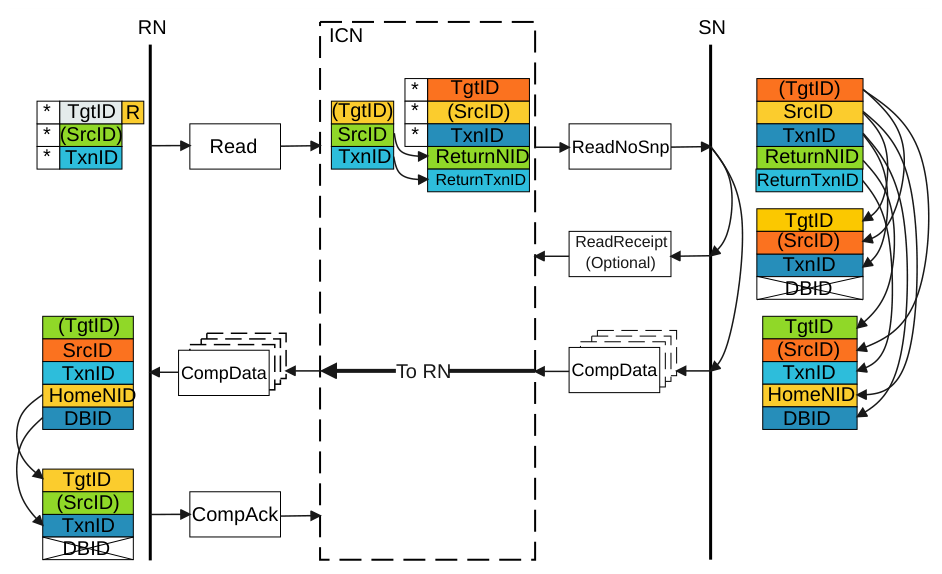

图 B2.23：DMT 事务中的 ID 值传递

图 B2.23 所示流程中的必需步骤如下：

1. 请求方通过发送 Request 数据包启动事务。该请求的标识符字段按如下方式生成：
- TgtID 由 Request 的目的地决定。

> **注意**
>
> 互连可以将 TgtID 字段重新映射为其他值。

- SrcID 对请求方而言是固定值。
- 请求方生成一个对该请求方唯一的 TxnID 字段。
2. 互连中接收该请求的归属节点生成发往从属节点的 Request。该请求的标识符字段按如下方式生成：
- TgtID 被设置为从属节点所需的值。
- SrcID 对归属节点而言是固定值。
- TxnID 是由归属节点生成的唯一值。
- ReturnNID 被设置为与原始请求的 SrcID 相同的值。
- ReturnTxnID 被设置为与原始请求的 TxnID 相同的值。
3. 如果发往从属节点的请求需要 ReadReceipt，则由从属节点提供读回执。ReadReceipt 响应的标识符字段按如下方式生成：
- TgtID 被设置为与该请求的 SrcID 相同的值。
- SrcID 对从属节点而言是固定值。这也与所收到的 TgtID 相匹配。
- TxnID 被设置为与该请求的 TxnID 相同的值。
- DBID 字段无效。
4. 从属节点提供读数据。读数据响应的标识符字段按如下方式生成：
- TgtID 被设置为与该请求的 ReturnNID 相同的值。
- SrcID 对从属节点而言是固定值。这也与所收到的 TgtID 相匹配。
- TxnID 被设置为与该请求的 ReturnTxnID 相同的值。
- HomeNID 被设置为与该请求的 SrcID 相同的值。
- DBID 被设置为与该请求的 TxnID 相同的值。
5. 请求方接收读数据，并发送完成确认响应 CompAck。CompAck 的标识符字段按如下方式生成：
- TgtID 被设置为与读数据的 HomeNID 相同的值。
- SrcID 对请求方而言是固定值。这也与所收到的 TgtID 相匹配。
- TxnID 被设置为与读数据的 DBID 相同的值。
- DBID 字段无效。

并非所有请求都需要请求方发送给归属节点的 CompAck 响应。

如果原始请求需要 ReadReceipt，则还包含以下附加步骤：

- 归属节点接收 Request 数据包并提供读回执。ReadReceipt 响应的标识符字段按如下方式生成：
- TgtID 被设置为与该请求的 SrcID 相同的值。
- SrcID 对完成方而言是固定值。这也与所收到的 TgtID 相匹配。
- TxnID 被设置为与该请求的 TxnID 相同的值。
- DBID 字段无效。

B2.4 事务标识符字段详解：TxnID 值和 DBID 值何时可以复用。

##### B2.5.1.2 采用 DMT 且 Comp 与 Data 分离时的 ID 值传递

图 B2.24 展示了在使用分离的 Comp 和 Data 的 DMT 事务消息中，标识符字段值是如何推导出来的。

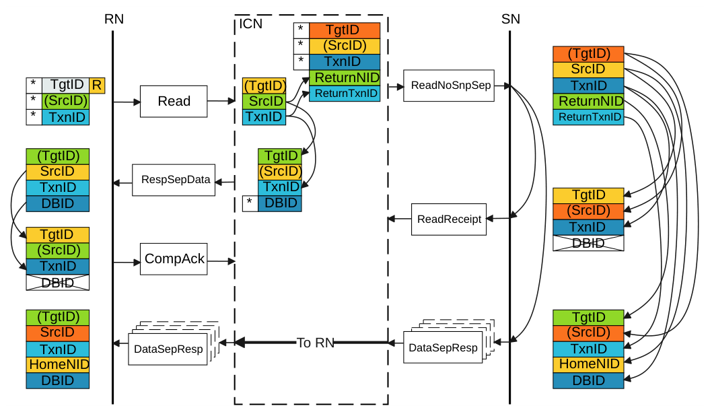

图 B2.24：采用 DMT 且 Comp 与 Data 分离的事务中的 ID 值传递

图 B2.24 所示流程中所需步骤如下：

1. Requester 通过发送 Request 数据包启动事务。该请求的标识符字段按如下方式生成：
- TgtID 由 Request 的目的地决定。

> **注意**
>
> TgtID 字段可以由互连重映射为其他值。

- SrcID 对于 Requester 是固定值。
- Requester 生成一个对该 Requester 而言唯一的 TxnID 字段。
2. 互连中接收该请求的 Home Node 向 Subordinate Node 生成一个请求。该请求的标识符字段按如下方式生成：
- TgtID 设置为该 Subordinate 所需的值。
- SrcID 对于 Home 是固定值。
- TxnID 是由 Home 生成的唯一值。
- ReturnNID 设置为与原始请求的 SrcID 相同的值。
- ReturnTxnID 设置为与原始请求的 TxnID 相同的值。
3. 互连中接收该请求的 Home Node 提供单独的 Read 响应。该 Read 响应的标识符字段按如下方式生成：
- TgtID 设置为与该请求的 SrcID 相同的值。
- SrcID 对于 Home 是固定值。
- TxnID 设置为与原始请求的 TxnID 相同的值。
- DBID 值是由 Home 生成的唯一值，且与向 Subordinate 发送的请求中的 TxnID 值相同。
4. Requester 接收该 Read 响应，并发送完成确认（即 CompAck）响应。CompAck 的标识符字段按如下方式生成：
- TgtID 设置为与该 Read 响应的 SrcID 相同的值。
- SrcID 对于 Requester 是固定值。
- TxnID 设置为由 Home 生成的唯一 DBID 值。
- DBID 值无效。
5. 向 Subordinate 发送的请求需要 ReadReceipt。Subordinate 提供该读回执。ReadReceipt 响应的标识符字段按如下方式生成：
- TgtID 设置为与该请求的 SrcID 相同的值。
- SrcID 对于 Subordinate 是固定值。这也与收到的 TgtID 一致。
- TxnID 设置为与该请求的 TxnID 相同的值。
6. Subordinate 提供单独的读数据。读数据的标识符字段按如下方式生成：
- TgtID 设置为与该请求的 ReturnNID 相同的值。
- SrcID 对于 Subordinate 是固定值。这也与收到的 TgtID 一致。
- TxnID 设置为与该请求的 ReturnTxnID 相同的值。
- HomeNID 设置为与该请求的 SrcID 相同的值。
- DBID 设置为与该请求的 TxnID 相同的值。

##### B2.5.1.3 采用 DCT 时的 ID 值传递

图 B2.25 展示了在 DCT 事务消息中标识符字段值是如何推导出来的。在本示例中，数据被转发到一个 Request Node，并且向 HN-F 发送带数据或不带数据的 Snoop 响应。

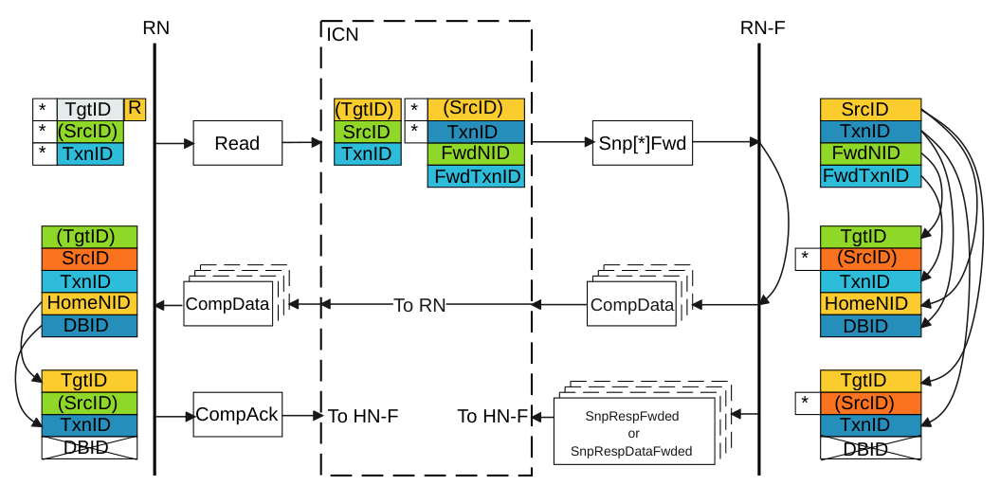

图 B2.25：DCT 事务中的 ID 值传递

图 B2.25 所示流程中所需步骤如下：

1. Requester 通过发送 Request 数据包启动事务。该请求的标识符字段按如下方式生成：
- TgtID 由 Request 的目的地决定。

> **注意**
>
> TgtID 字段可以由互连重映射为其他值。

- SrcID 对于 Requester 是固定值。
- Requester 生成一个对该 Requester 而言唯一的 TxnID 字段。
2. 互连中接收该请求的 Home Node 向 RN-F 节点生成一个 Forwarding snoop。该侦听的标识符字段按如下方式生成：
- SrcID 对于 Home 是固定值。
- TxnID 是由 Home 生成的唯一值。
- FwdNID 设置为与原始请求的 SrcID 相同的值。
- FwdTxnID 设置为与原始请求的 TxnID 相同的值。
3. RN-F 提供读数据。Read 数据响应的标识符字段按如下方式生成：
- TgtID 设置为与该侦听的 FwdNID 相同的值。
- SrcID 对于 RN-F 是固定值。
- TxnID 设置为与该侦听的 FwdTxnID 相同的值。
- HomeNID 设置为与该侦听的 SrcID 相同的值。
- DBID 设置为与该侦听的 TxnID 相同的值。
4. RN-F 还向 Home 提供响应，可以带读数据，也可以不带读数据。该响应的标识符字段按如下方式生成：
- TgtID 设置为与该侦听的 SrcID 相同的值。
- SrcID 对于 RN-F 是固定值。
- TxnID 设置为与该侦听的 TxnID 相同的值。
- DBID 字段无效。
5. Requester 接收读数据，并发送完成确认（即 CompAck）响应。CompAck 的标识符字段按如下方式生成：
- TgtID 设置为与该读数据的 HomeNID 相同的值。
- SrcID 对于 Requester 是固定值。这也与收到的 TgtID 一致。
- TxnID 设置为与该读数据的 DBID 相同的值。
- DBID 字段无效。

> **注意**
>
> 还可以包含从互连发往 Requester 的可选 ReadReceipt。

##### B2.5.1.4 无直接数据传送时的 ID 值传递

本节给出一个不使用 DMT 或 DCT 的读标识字段流程示例，并描述读事务中 TxnID 与 DBID 字段的使用。

本示例中的请求方和完成方分别是 Request Node 和 HN-F。

该标识字段流程包含一个来自完成方的可选 ReadReceipt 响应，以及一个来自请求方的可选 CompAck 响应。

对于包含 CompAck 响应的读事务，完成方使用 DBID 将 CompAck 与原始事务关联起来。

不包含 CompAck 响应的读事务，其数据响应中不需要有效的 DBID 字段。

图 B2.26 展示了 ID 值传递。

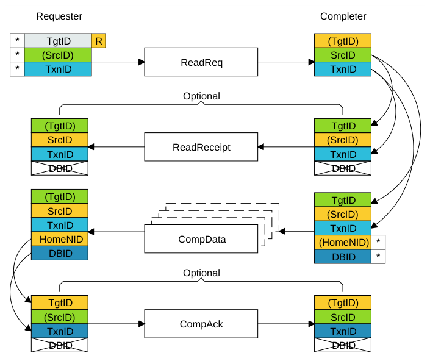

图 B2.26：带 ReadReceipt 和 CompAck 的读请求中的 ID 值传递

图 2-26 所示流程中的必需步骤如下：

1. 请求方通过发送 Request 数据包启动该事务。请求的标识字段生成如下：
- TgtID 由 Request 的目的地决定。

> **注意**
>
> TgtID 字段可以由互连重映射为不同的值。

- SrcID 对请求方而言是一个固定值。
- 请求方生成一个对该请求方唯一的 TxnID 字段。
2. 如果该事务包含 ReadReceipt，则完成方接收 Request 数据包并提供读回执。ReadReceipt 响应的标识字段生成如下：
- TgtID 设置为与请求的 SrcID 相同的值。
- SrcID 对完成方而言是一个固定值。该值也与收到的 TgtID 相匹配。
- TxnID 设置为与请求的 TxnID 相同的值。
- DBID 字段无效。
3. 完成方接收 Request 数据包并提供读数据。读数据响应的标识字段生成如下：
- TgtID 设置为与请求的 SrcID 相同的值。
- SrcID 对完成方而言是一个固定值。该值也与收到的 TgtID 相匹配。
- TxnID 设置为与请求的 TxnID 相同的值。
- HomeNID 对完成方而言是一个固定值。该值也与收到的 TgtID 相匹配。
- 如果请求中的 ExpCompAck 为 1，则完成方生成一个唯一的 DBID 值。
4. 请求方接收读数据并发送完成确认 CompAck 响应。CompAck 的标识字段生成如下：
- TgtID 设置为与读数据的 HomeNID 相同的值。
- SrcID 对请求方而言是一个固定值。该值也与收到的 TgtID 相匹配。
- TxnID 设置为与读数据的 DBID 相同的值。
- DBID 字段无效。

#### B2.5.2 无数据事务

对于无数据事务，除 CleanSharedPersistSep 和 StashOnceSep 之外，标识字段的使用方式与 B2.5.1.4 无直接数据传送时的 ID 值传递类似。唯一的区别在于：完成方发往请求方的响应是以单个数据包的形式在 CRSP 通道上发送，而不是以多个数据包的形式在 RDAT 通道上发送。

对于 StashOnceSep 事务，StashGroupID 值在由 Request Node 发往互连的请求中发送，并在 StashDone 和 CompStashDone 响应中返回。StashDone 响应中的 TxnID 值不适用，且必须为零。

CleanSharedPersistSep 事务中 ID 值传递的描述如下。

##### B2.5.2.1 CleanSharedPersistSep 事务中的 ID 值传递

图 B2.27 展示了在使用分离的 Comp 和 Persist 响应的 CleanSharedPersistSep 事务消息中，标识字段值是如何推导出来的。在图 B2.27 中，PCMOSep 表示 CleanSharedPersistSep。

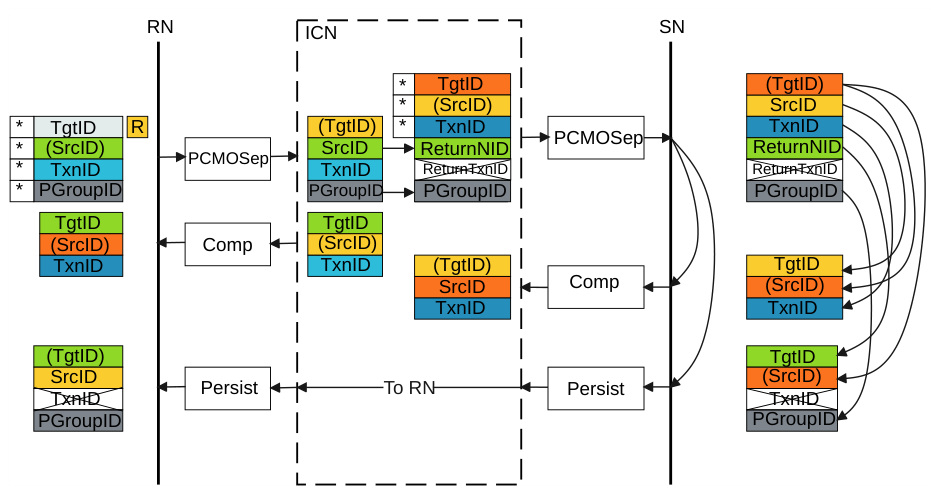

图 B2.27：CleanSharedPersistSep 事务中的 ID 值传递

图 B2.27 所示流程中的必需步骤如下：

1. 请求方通过发送 Request 数据包启动该事务。Request 的标识字段生成如下：
- TgtID 由 Request 的目的地决定。

> **注意**
>
> TgtID 字段可以由互连重映射为不同的值。

- SrcID 对请求方而言是一个固定值。
- 请求方生成一个对该请求方唯一的 TxnID 值。

该 TxnID 值可以在请求方收到 Comp 响应后被复用。

- 请求方生成一个新的 PGroupID 值，或复用一个当前正在使用的 PGroupID 值。
2. 互连中作为接收方的归属节点向从属节点生成一个请求。发往 Subordinate Node 的请求的标识字段生成如下：
- TgtID 设置为从属节点所需的值。
- SrcID 对归属节点而言是一个固定值。
- TxnID 是归属节点生成的唯一值。

该 TxnID 值可以在归属节点收到 Comp 响应后被复用。

- ReturnNID 设置为与原始请求的 SrcID 相同的值。
- ReturnTxnID 不适用，且必须为零。
- PGroupID 设置为与原始请求的 PGroupID 相同的值。
3. 互连中作为接收方的归属节点向请求方发送一个 Comp 响应。发往请求方的 Comp 响应的标识字段生成如下：
- TgtID 设置为与原始请求的 SrcID 相同的值。
- SrcID 对归属节点而言是一个固定值。
- TxnID 设置为与原始请求的 TxnID 相同的值。
4. 作为接收方的归属节点可以选择性地向请求方发送一个 Persist 响应。归属节点发往请求方的可选 Persist 响应（图 B2.27 中未示出）的标识字段生成如下：
- TgtID 设置为与请求的 SrcID 相同的值。
- SrcID 对归属节点而言是一个固定值。
- TxnID 不适用，且必须为零。
- PGroupID 设置为与请求的 PGroupID 相同的值。

作为接收方的归属节点可以选择性地向请求方发送一个合并的 CompPersist 响应，以替代分离的 Comp 和 Persist 响应。CompPersist 响应中的标识字段生成如下：

- TgtID 设置为与原始请求的 SrcID 相同的值。
- SrcID 对归属节点而言是一个固定值。
- TxnID 设置为与原始请求的 TxnID 相同的值。
- PGroupID 设置为与原始请求的 PGroupID 相同的值。
5. 从属节点向归属节点生成一个 Comp。来自 Subordinate Node 的 Comp 响应的标识字段生成如下：
- TgtID 设置为与请求的 SrcID 相同的值。
- SrcID 对从属节点而言是一个固定值。
- TxnID 设置为与请求的 TxnID 相同的值。
6. 从属节点还向请求方或归属节点生成一个 Persist 响应。来自 Subordinate Node 的 Persist 响应的标识字段生成如下：
- TgtID 设置为与请求的 ReturnNID 相同的值。
- SrcID 对从属节点而言是一个固定值。
- TxnID 不适用，且必须为零。
- PGroupID 设置为与请求的 PGroupID 相同的值。
7. 如果请求的 ReturnNID 与 SrcID 取值相同，则从属节点可以选择性地向归属节点发送一个合并的 CompPersist 响应，以替代分离的 Comp 和 Persist 响应。来自从属节点的 CompPersist 响应的标识字段生成如下：
- TgtID 设置为与请求的 SrcID 相同的值。
- SrcID 对从属节点而言是一个固定值。
- TxnID 设置为与请求的 TxnID 相同的值。
- PGroupID 设置为与请求的 PGroupID 相同的值。

#### B2.5.3 写事务

本节描述 TxnID 与 DBID 字段在写事务中的使用：

- B2.5.3.1 CopyBack
- B2.5.3.2 WriteNoSnp 事务
- B2.5.3.3 WriteUnique 事务
- B2.5.3.4 StashOnce 或 StashOnceSep 事务

##### B2.5.3.1 CopyBack

本节描述标识符字段在 CopyBack 事务中的使用。

图 B2.28 展示了标识符值的传递。

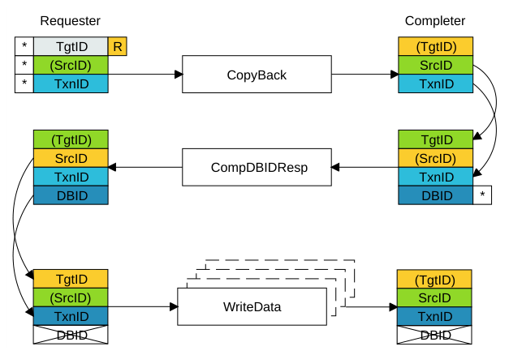

图 B2.28：CopyBack 中的 ID 值传递

图 B2.28 所示流程中所需的步骤如下：

1. 请求方发送 Request 数据包来启动该事务。该请求的标识符字段生成规则如下：
- TgtID 由 Request 的目的地决定。

> **注意**
>
> TgtID 字段可以被互连重映射为其他值。

- SrcID 对请求方而言是一个固定值。
- 请求方生成一个唯一的 TxnID 字段。
2. 完成方收到 Request 数据包后生成 CompDBIDResp 响应。该响应的标识符字段生成规则如下：
- TgtID 被设置为与该请求的 SrcID 相同的值。
- SrcID 对完成方而言是一个固定值。它与收到的 TgtID 也一致。
- TxnID 被设置为与该请求的 TxnID 相同的值。
- 完成方生成一个唯一的 DBID 值。
3. 请求方收到 CompDBIDResp 响应后发送写数据。该写数据的标识符字段生成规则如下：
- TgtID 被设置为与 CompDBIDResp 响应的 SrcID 相同的值。如果该值被互连重映射过，则它可能

与该请求原始的 TgtID 不同。

- SrcID 对请求方而言是一个固定值。
- TxnID 被设置为与 CompDBIDResp 响应中提供的 DBID 值相同的值。
- 写数据中的 DBID 字段不使用。
- 所有写数据包的 TgtID、SrcID 与 TxnID 字段都必须相同。

收到 CompDBIDResp 响应后，请求方可以将该请求包中使用过的同一 TxnID 值复用于另一个事务。

4. 完成方收到写数据，并使用其中的 TxnID 字段（该字段现在包含完成方所生成的 DBID 值）。这有助于确定应将写数据关联到哪个事务。

收到全部写数据包后，完成方可以将该 DBID 值复用于另一个事务。

##### B2.5.3.2 WriteNoSnp 事务

本节描述标识符字段在 WriteNoSnp 事务中的使用。

图 B2.29 未展示支持内存标记的 TagGroupID 流程。有关 TagGroupID 传递的详细信息，参见 B12.5 写事务。

图 B2.29 展示了 Comp 与 DBIDResp 分离时的标识符值传递。完成方可以视情况将 Comp 与 DBIDResp 合并为单个 CompDBIDResp 响应。请求方可以视情况将 NonCopyBackWriteData 与 CompAck 合并。

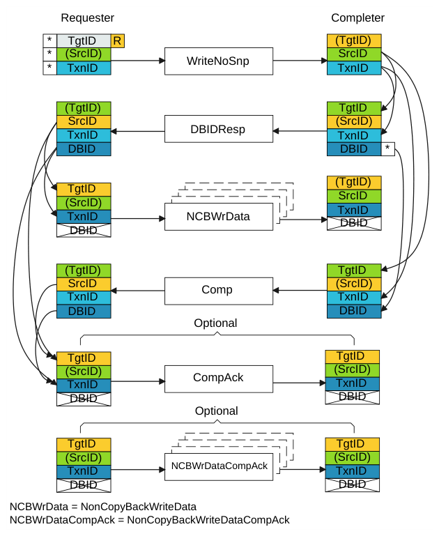

图 B2.29：WriteNoSnp 中的 ID 值传递

标识符字段的用法与使用合并响应的事务相同，并有以下附加要求：

- 分离的 DBIDResp 与 Comp 响应所使用的标识符字段必须完全相同。
- 只有当 DBIDResp 与 Comp 两个响应都

已收到时，请求方才能复用该 TxnID 值。

图 B2.29 所示流程中所需的步骤如下：

1. 请求方发送 Request 数据包来启动该事务。该请求的标识符字段生成规则如下：
- TgtID 由 Request 的目的地决定。

> **注意**
>
> TgtID 字段可以被互连重映射为其他值。

- SrcID 对请求方而言是一个固定值。
- 请求方生成一个唯一的 TxnID 字段。
2. 完成方收到 Request 数据包后生成 DBIDResp 响应。该响应的标识符字段生成规则如下：
- TgtID 被设置为与该请求的 SrcID 相同的值。
- SrcID 对完成方而言是一个固定值。它与收到的 TgtID 也一致。
- TxnID 被设置为与该请求的 TxnID 相同的值。
- 完成方生成一个唯一的 DBID 值。
3. 请求方收到 DBIDResp 响应后发送写数据。该写数据的标识符字段生成规则如下：
- TgtID 被设置为与 DBIDResp 响应的 SrcID 相同的值。如果该值被互连重映射过，则它可能

与该请求原始的 TgtID 不同。

- SrcID 对请求方而言是一个固定值。
- TxnID 被设置为与 DBIDResp 响应中提供的 DBID 值相同的值。
- 写数据中的 DBID 字段不使用。
- 所有写数据包的 TgtID、SrcID 与 TxnID 字段都必须相同。
4. 完成方收到写数据，并使用其中的 TxnID 字段（该字段现在包含完成方所生成的 DBID 值）来确定该写数据关联的是哪个事务。
5. 完成方在事务完成时生成 Comp 响应。Comp 响应的标识符字段必须与 DBIDResp 响应相同，其生成规则如下：
- TgtID 被设置为与该请求的 SrcID 相同的值。
- SrcID 对完成方而言是一个固定值。它与收到的 TgtID 也一致。
- TxnID 被设置为与该请求的 TxnID 相同的值。
- 完成方使用与 DBIDResp 响应中所用的相同的 DBID 值。
6. 若事务要求，请求方在收到 DBIDResp 或 Comp 后发送 CompAck 消息。CompAck 的标识符字段生成规则如下：
- TgtID 被设置为与 DBIDResp 或 Comp 响应的 SrcID 相同的值。
- SrcID 对请求方而言是一个固定值。它与收到的 TgtID 也一致。
- TxnID 被设置为与 DBIDResp 或 Comp 响应的 DBID 相同的值。
- DBID 字段无效。

收到 Comp 与 DBIDResp 两个响应后，请求方可以将同一 TxnID 值复用于另一个事务。

收到全部写数据包后，完成方可以将同一 DBID 值复用于另一个事务。

> **注意**
>
> 分离的 DBIDResp 与 Comp 响应之间没有顺序要求。当这两条消息来自同一源时，要求所使用的值完全相同。

##### B2.5.3.3 WriteUnique 事务

本节描述 WriteUnique 事务对标识符字段的使用。

图 B2.30 未展示支持 Memory Tagging 的 TagGroupID 流程。关于 TagGroupID 传输的详细信息，参见 B12.5 写事务。

在某些情况下，WriteUnique 事务还可以包含由请求方发往完成方的 CompAck 响应。此时，标识符字段使用的附加规则为：

- 由请求方发往完成方的 CompAck 响应中的 TgtID、SrcID 和 TxnID 标识符字段

必须与写数据所使用的字段相同，即：

- TgtID 被设置为与 CompDBIDResp 响应的 SrcID 相同的值。如果分别给出 Comp 和

DBIDResp 响应，则 TgtID 被设置为与 Comp 或 DBIDResp 响应的 SrcID 相同的值，因为两者中的 SrcID 值必须相同。但是，如果该值已被互连重新映射，则它可能与请求的原始 TgtID 不同。

- SrcID 是请求方的固定值。
- TxnID 被设置为与 CompDBIDResp 响应中提供的 DBID 值相同的值。如果

分别给出 Comp 和 DBIDResp 响应，则 TxnID 被设置为与 Comp 或 DBIDResp 响应的 DBID 相同的值，因为两者中的 DBID 值必须相同。

- WriteData 中和 CompAck 中的 DBID 字段不使用。
- 如果发送合并的 WriteData 和 CompAck 响应，则 TgtID 被设置为与 Comp、DBIDResp 或

CompDBIDResp 中的 SrcID 相同的值，并且该合并响应中的 TxnID 被设置为与 Comp、DBIDResp 或 CompDBIDResp 中的 DBID 相同的值。

- 完成方必须收到所有写数据项以及 CompAck 响应之后，才能将同一

DBID 值复用于另一个事务。

图 B2.30 展示了使用合并的 CompDBIDResp 响应时的标识符值传输。

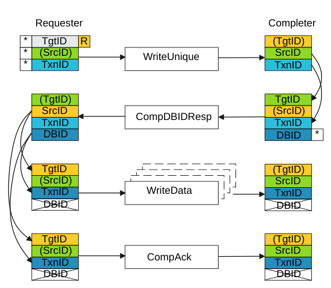

图 B2.30：使用合并的 CompDBIDResp 响应时的 ID 值传输

图 B2.31 展示了使用合并的 WriteData 和 CompAck 响应时的标识符值传输。

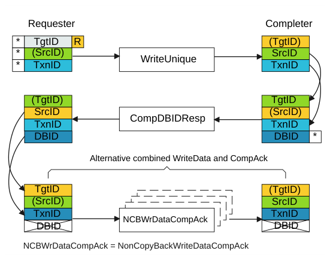

图 B2.31：使用合并的 WriteData 和 CompAck 响应时的 ID 值传输

##### B2.5.3.4 StashOnce 或 StashOnceSep 事务

本节描述带 DataPull 的 StashOnce 或 StashOnceSep 事务对标识符字段的使用。

图 B2.32 展示了标识符值传输。

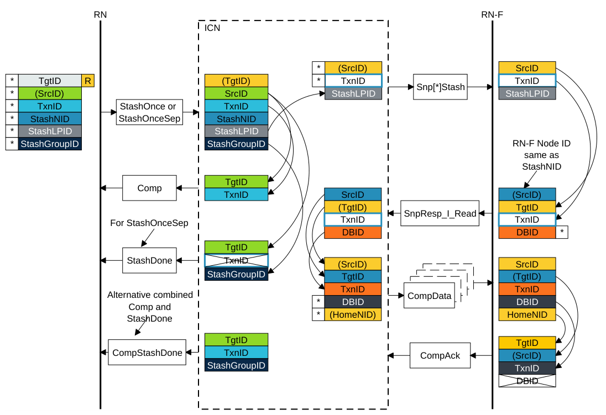

图 B2.32：Stash 事务中的 ID 值传输

图 B2.32 所示流程中必需的步骤如下：

1. 请求方通过发送 Stash 请求数据包来启动该事务。该请求的标识符字段按如下方式生成：
- TgtID 由请求的目的地决定。

> **注意**
>
> TgtID 字段可以由互连重新映射为不同的值。

- SrcID 是请求方的固定值。
- 请求方生成一个对于该请求方而言唯一的 TxnID 字段。
- 请求方包含 StashNID 字段，以指示将 Stash 发送到哪个 RN-F。
- 请求方包含 StashLPID 字段，以指示该 RN-F 内的 LP。
2. 互连中的归属节点接收 Stash 请求数据包，并向请求节点发送 Comp 响应。Comp 响应的标识符字段按如下方式生成：
- TgtID 被设置为与请求的 SrcID 相同的值。
- TxnID 被设置为与请求的 TxnID 相同的值。
3. 互连中的归属节点针对 StashOnceSep 请求向请求节点发送 StashDone 响应。StashDone 响应的标识符字段按如下方式生成：
- TgtID 被设置为与请求的 SrcID 相同的值。
- TxnID 无效。
- StashGroupID 被设置为与请求的 StashGroupID 相同的值。

或者，针对 StashOnceSep 请求，互连中的归属节点向请求节点发送合并的 CompStashDone 响应，而不是分别发送 Comp 和 StashDone 响应。

CompStashDone 响应的标识符字段按如下方式生成：

- TgtID 被设置为与请求的 SrcID 相同的值。
- TxnID 被设置为与请求的 TxnID 相同的值。
- StashGroupID 被设置为与请求的 StashGroupID 相同的值。
4. 互连中的归属节点向相应的 RN-F 生成带 Stash 的侦听。该请求的标识符字段按如下方式生成：
- SrcID 是归属节点的固定值。
- TxnID 是由归属节点生成的唯一值。
- StashLPID 被设置为与原始请求的 StashLPID 相同的值。

> **注意**
>
> Snoop 请求不包含 TgtID 字段。

5. 被侦听的 RN-F 生成 Snoop 响应。在本示例中，包含 Data Pull 指示。Snoop 响应的标识符字段按如下方式生成：
- TgtID 被设置为与请求的 SrcID 相同的值。
- SrcID 是 RN-F 的固定值。
- TxnID 被设置为与请求的 TxnID 相同的值。
- DBID 字段是由 RN-F 生成的唯一值。
6. 归属节点提供读数据。读数据响应的标识符字段按如下方式生成：
- TgtID 被设置为与 Snoop 响应的 SrcID 相同的值。
- SrcID 是归属节点的固定值。

> **注意**
>
> 在本示例中，读数据由归属节点提供。

- TxnID 被设置为与 Snoop 响应的 DBID 相同的值。
- DBID 字段是由归属节点生成的唯一值。
- HomeNID 是归属节点的固定值。
7. RN-F 接收读数据并发送完成确认 CompAck 响应。CompAck 的标识符字段按如下方式生成：
- TgtID 被设置为与读数据的 HomeNID 相同的值。
- SrcID 是 RN-F 的固定值。这也与接收到的 TgtID 相匹配。
- TxnID 被设置为与读数据的 DBID 相同的值。
- DBID 字段无效。

#### B2.5.4 DVMOp 事务

DVMOp 事务中 TgtID、SrcID、TxnID 和 DBID 标识字段的使用与 B2.5.3.2 WriteNoSnp 事务中的完全相同。

#### B2.5.5 带 Retry 的事务请求

对于收到 RetryAck 响应的事务，标识字段的使用有特定规则。

关于 Retry 机制的更多细节，参见 B2.10 Request Retry；关于未使用信用返还的规则，参见 B2.5.6 Protocol Credit Return 事务。

图 B2.33 展示了标识符值的传递。

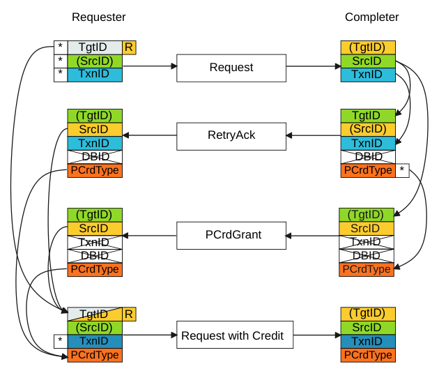

图 B2.33：带 retry 的事务请求中的 ID 值传递

图 B2.33 所示流程中必需的步骤如下：

1. 请求方通过发送 Request 数据包启动事务。该请求的标识字段按如下方式生成：
- TgtID 由该 Request 的目的地决定。

> **注意**
>
> TgtID 字段可由互连重映射为其他值。

- SrcID 对于该请求方是一个固定值。
- 请求方生成一个唯一的 TxnID 字段。
2. 完成方收到 Request 数据包，并确定将发送 RetryAck 响应。该 RetryAck 响应的标识字段按如下方式生成：
- TgtID 设置为与该请求的 SrcID 相同的值。
- SrcID 对于该完成方是一个固定值。它也与其收到的 TgtID 相同。
- TxnID 设置为与该请求的 TxnID 相同的值。
- DBID 字段无效。
- 完成方使用一个 PCrdType 值，用于指示重试该事务所需的信用类型。
3. 当完成方能够接受给定 PCrdType 的重试事务时，会通过 PCrdGrant 响应向请求方发送一个信用。该 PCrdGrant 响应的标识字段按如下方式生成：
- TgtID 设置为与该请求的 SrcID 相同的值。
- SrcID 对于该完成方是一个固定值。它也与该请求的 TgtID 相同。
- TxnID 字段不使用，必须为零。
- DBID 字段不使用，必须为零。
- PCrdType 值设置为再次发起原事务所需要的类型。
4. 请求方收到信用授予，并通过发送 Request 数据包重新发起原事务。该请求的标识字段按如下方式生成：
- TgtID 要么设置为与 RetryAck 响应的 SrcID 相同的值，该值也与

PCrdGrant 响应的 SrcID 相同，要么设置为原请求中使用的值。

- SrcID 对于该请求方是一个固定值。
- 请求方生成一个唯一的 TxnID 字段。允许其与收到 RetryAck 响应的

原请求不同，但不作要求。

- PCrdType 值设置为原请求的 RetryAck 响应中的 PCrdType 值，

该值也与 PCrdGrant 响应的 PCrdType 相同。

#### B2.5.6 Protocol Credit Return 事务

P-Credit Return 事务使用 PCrdReturn Request 来返还已授予但不再需要的信用。TgtID、SrcID 和 TxnID 的要求如下：

- 请求方通过发送 PCrdReturn Request 数据包来发送 Protocol Credit Return 事务。该请求的

标识字段按如下方式生成：

- TgtID 必须与所获得信用的 SrcID 相匹配。
- SrcID 对于该请求方是一个固定值。
- TxnID 字段不使用，必须为零。

PCrdType 必须与再次发起原事务所需要的那个原始 PCrdGrant 中的 PCrdType 值相匹配。

Protocol Credit Return 事务没有响应，也不使用 DBID 字段。

### B2.6 多请求

多请求特性通过允许单个请求以多达 64 个缓存行为目标，实现了请求通道带宽的优化。支持具有更大突发长度的新型内存技术的从属节点，可以从得知正在请求超过 64 字节的连续数据中获益。

请求通道带宽的减少提高了 CHI C2C 链路效率，因为额外的 container granule 可供数据消息使用。更多信息请参见 AMBA® CHI Chip-to-Chip (C2C) Architecture Specification。

多个具有相同属性、指向连续地址区域的 64 字节请求，可以合并为单个多请求。多请求可视为请求方发出一系列地址递增的请求。

对多请求事务的响应仍受限于单个缓存行。例如，一个以 256 字节（即 4 个缓存行）为目标的读请求，将看到四个单独的 CompData，以及 RespSepData 或 DataSepResp 消息。

多请求特性对一致性粒度没有影响，其仍为 64 字节。

允许在中间节点将多请求事务拆分为更小尺寸的多请求与单请求的任意组合。

不期望但允许归属节点将若干较小的请求合并为一个更大的多请求，然后再将其发送给从属节点。在这种情况下，不能使用 DMT 或 DWT 流程，因为原始请求方会为这些较小的请求使用不同的 TxnID 字段值。

对多请求特性的支持由 MultiReq_Support 属性确定。当支持多请求时，使用 MultiReq、NumReq 和 Size 字段指示与该事务关联的数据总量。CacheLineID 字段用于指示在多请求事务流程中，某个 Response 或 Data 消息与哪个缓存行相关。

以下 CHI 事务允许使用多请求特性：

- 非一致性事务：
- ReadNoSnp
- ReadNoSnpSep
- WriteNoSnpFull
- WriteNoSnpPtl
- WriteNoSnpZero
- IO 一致性事务：
- ReadOnce
- ReadOnceCleanInvalid
- ReadOnceMakeInvalid
- WriteUniqueFull
- WriteUniquePtl
- WriteUniqueZero

多请求事务的起始地址需要对齐到缓存行边界。该事务不得跨越 4KB 边界。

根据 BROADCASTMULTIREQ 或替代控制寄存器的值，可能适用额外的总大小与边界约束。

独占事务不允许使用多请求特性。

#### B2.6.1 多请求示例

本节提供一些非详尽的示例，以展示多请求特性在 DMT、DCT 和 DWT 流程中的潜在用法。

##### B2.6.1.1 DMT

图 B2.34 展示了多请求特性如何作为 DMT 事务流程的一部分使用。

请求方 Snoopee 归属节点 从属节点

ReadOnce NumReq = 0x3（4 个缓存行）Addr = 0x0 TxnID=0x0

ReadNoSnp NumReq = 0x3（4 个缓存行）Addr = 0x0 ReturnTxnID=0x0 TxnID=0x8

ReadReceipt CacheLineID=0x0 TxnID = 0x8

CompData_UC CacheLineID=0x0 TxnID = 0x0

ReadReceipt CacheLineID=0x1 TxnID = 0x8

CompData_UC CacheLineID=0x1 TxnID = 0x0

ReadReceipt CacheLineID=0x2 TxnID = 0x8

CompData_UC CacheLineID=0x2 TxnID = 0x0

ReadReceipt CacheLineID=0x3 TxnID = 0x8

CompData_UC CacheLineID=0x3 TxnID = 0x0

请求方 Snoopee 归属节点 从属节点

图 B2.34：使用 DMT 流程、以 4 个缓存行为目标的 ReadOnce

##### B2.6.1.2 DCT

图 B2.35 展示了如何在 DCT 事务流中使用 Multi-request 特性。

Snoop 通道不支持 Multi-request 特性。不过，当 Snoopee 的 MultiReq_Support 属性被设置为 True 或 CacheLineID_Accurate 时，DCT 流仍可用于多请求场景。MultiReq_Support 属性取值为 True 或 CacheLineID_Accurate 的 Snoopee，必须为其生成的响应给出正确的 CacheLineID 值。这样才能确保归属节点和请求方能够正确识别多请求事务中的每一条缓存行。

请求方 Snoopee 归属节点 从属节点

ReadOnce NumReq = 0x3 (4 cache lines) Addr = 0x0 TxnID=0x0

SnpOnceFwd Addr = 0x00 FwdTxnID = 0x0 TxnID = 0x8

CompData_I CacheLineID = 0x0 TxnID = 0x0

SnpResp_SC_Fwded_I TxnID = 0x8

SnpOnceFwd Addr = 0x40 FwdTxnID = 0x0 TxnID = 0xA

CompData_I CacheLineID = 0x1 TxnID = 0x0

SnpResp_SC_Fwded_I TxnID = 0xA

SnpOnceFwd Addr = 0x80 FwdTxnID = 0x0 TxnID = 0xD

CompData_I CacheLineID = 0x2 TxnID = 0x0

SnpResp_SC_Fwded_I TxnID = 0xD

SnpOnceFwd Addr = 0xC0 FwdTxnID = 0x0 TxnID = 0x7

CompData_I CacheLineID = 0x3 TxnID = 0x0

SnpResp_SC_Fwded_I TxnID = 0x7

请求方 Snoopee 归属节点 从属节点

图 B2.35：使用 DCT 流、以 4 条缓存行为目标的 ReadOnce

##### B2.6.1.3 DMT and DCT

图 B2.36 展示了如何将 Multi-request 特性与 DMT 和 DCT 事务流的组合一起使用。

请求方 Snoopee 归属节点 从属节点

ReadOnce NumReq = 0x3 (4 cache lines) Addr = 0x0 TxnID=0x0

ReadNoSnp NumReq = 0x1 (2 cache lines) Addr = 0x0 ReturnTxnID=0x0 TxnID=0x8

ReadReceipt TxnID = 0x8 CacheLineID=0x0

CompData_UC TxnID = 0x0 CacheLineID=0x0

ReadReceipt TxnID = 0x8 CacheLineID=0x1

CompData_UC TxnID = 0x0 CacheLineID=0x1

SnpOnceFwd Addr = 0x80 FwdTxnID = 0x0 TxnID = 0xD

CompData_I TxnID = 0x0 CacheLineID = 0x2

SnpResp_SC_Fwded_I TxnID = 0xD

SnpOnceFwd Addr = 0xC0 FwdTxnID = 0x0 TxnID = 0x7

CompData_I TxnID = 0x0 CacheLineID = 0x3

SnpResp_SC_Fwded_I TxnID = 0x7

请求方 Snoopee 归属节点 从属节点

图 B2.36：使用 DMT 和 DCT 流、以 4 条缓存行为目标的 ReadOnce

##### B2.6.1.4 DWT

图 B2.37 展示了如何在 DWT 事务流中使用 Multi-request 特性。

请求方 Snoopee 归属节点 从属节点

WriteNoSnpFull NumReq = 0x3 (4 cache lines) Addr = 0x0 TxnID=0x0

WriteNoSnpFull NumReq = 0x3 (4 cache lines) Addr = 0x0 ReturnTxnID=0x0 TxnID=0x8

DBIDResp CacheLineID=0 TxnID = 0x0 DBID = 0xAA

NonCopyBackWriteData TxnID = 0xAA

Comp CacheLineID=0 TxnID = 0x8

Comp CacheLineID=0 TxnID = 0x0

DBIDResp CacheLineID=1 TxnID = 0x0 DBID = 0xBB

NonCopyBackWriteData TxnID = 0xBB

Comp CacheLineID=1 TxnID = 0x8

Comp CacheLineID=1 TxnID = 0x0

DBIDResp CacheLineID=2 TxnID = 0x0 DBID = 0xCC

NonCopyBackWriteData TxnID = 0xCC

Comp CacheLineID=2 TxnID = 0x8

Comp CacheLineID=2 TxnID = 0x0

DBIDResp CacheLineID=3 TxnID = 0x0 DBID = 0xDD

NonCopyBackWriteData TxnID = 0xDD

Comp CacheLineID=3 TxnID = 0x8

Comp CacheLineID=3 TxnID = 0x0

请求方 Snoopee 归属节点 从属节点

图 B2.37：使用 DWT 流、以 4 条缓存行为目标的 WriteNoSnpFull

### B2.7 顺序

本节介绍协议为支持系统顺序要求而包含的机制。它包含以下几节：

- B2.7.1 多副本原子性
- B2.7.2 完成响应与顺序
- B2.7.3 完成确认
- B2.7.4 RespSepData 和 DataSepResp 的顺序语义
- B2.7.5 事务顺序

关于 EWA、Device 和 Cacheable 这些术语的含义，参见 B2.8.3 Memory Attributes。

#### B2.7.1 多副本原子性

本规范所使用的内存模型要求多副本原子性。所有符合规范的组件必须确保所有写请求都是多副本原子的。如果以下两个条件都成立，则写操作被定义为多副本原子的：

- 对同一位置的所有写操作都被串行化，因此被所有请求方以相同的顺序观察到。某些

请求方可能无法观察到所有写操作。

- 在所有权请求方都观察到某个写操作之前，对某个位置的读操作不会返回该写操作的值。

在本规范中，如果两个地址的缓存行地址和物理地址空间（PAS）属性相同，则认为这两个地址在一致性、可观察性和冒险方面是相同的地址。

#### B2.7.2 完成响应与排序

表 B2.7 列出了各种事务响应，以及它们针对后续事务（无论来自同一代理还是来自另一个代理）所提供的任何排序保证。

表 B2.7：完成响应与排序

事务 位置 响应 结果

读 可缓存 CompData 该事务对来自任一代理的、针对同一位置的后续事务 DataSepResp 可见。 RespSepData_UC RespSepData_SC RespSepData_UD_PD RespSepData_SD_PD

可缓存 RespSepData_I 不会有更早的事务向该请求方发送侦听。所有后续事务仅在此事务的 CompAck 响应被归属节点接收之后，才在需要时发送侦听。

不可缓存或 RespSepData 该事务对来自任一代理的、针对同一端点地址范围的 Device CompData 后续事务可见。

写或原子 可缓存 Comp 该事务对来自任一代理的、针对同一位置的后续事务 CompData 可见。

不可缓存或 Comp 该事务对来自任一代理的、针对同一端点范围的 Device CompData 后续事务可见。

下页续

表 B2.7 – 续上页

| 事务 | 位置 | 响应 | 结果 |
| --- | --- | --- | --- |
| 除 StashOnceSep、CleanInvalidPoPA 和 CleanInvalidStorage 之外的无数据事务 |  | Comp | 该事务对来自任一代理的、针对同一内存位置的后续事务可见。 |
| CleanSharedPersist |  | Comp | 早些时候写入同一内存位置的任何数据都被置为持久。 |

CleanInvalidPoPA Comp 该事务对来自任一代理的、针对任一 PAS 中同一内存位置的后续事务可见。其他物理地址空间中可能需要额外的缓存维护操作，以确保早些时候写入的任何数据对那些物理地址空间完全可见。

CleanInvalidStorage Comp 早些时候写入的数据此时位于内存层次结构中距离 PE 或其他观察者最远的点，即内存；写事务最多可传播到该点。

组合写 CompCMO CMO、PCMO 和写操作对来自任一代理的、针对同一内存位置（非 PoPA 和非存储 CMO）的后续事务可见。

CompCMO（PoPA CMO 和写操作对来自任一代理的、针对任一 PAS 中同一内存位置的 CMO）后续事务可见。其他物理地址空间中可能需要额外的缓存维护操作，以确保早些时候写入的任何数据对那些物理地址空间完全可见。

CompCMO（存储 CMO 和写操作此时位于内存层次结构中距离 PE 或其他观察者最远的 CMO）点，即内存；写事务最多可传播到该点。

Comp 参见本表中写事务的 Comp 结果。

CleanSharedPersistSep Persist 早些时候写入同一内存位置的数据被置为持久。

带 Persist 的组合写 组合写中的数据写被置为 PCMO 持久。同一缓存行上的所有较早写入也被置为持久。

StashOnceSep Comp 完成方接受该请求，不发送 RetryAck 响应。

StashDone 该事务对来自任一代理的、针对同一内存位置的后续事务可见。

> **注意**
>
> 端点地址范围的大小是 IMPLEMENTATION DEFINED 的。通常为：

- 对于用于外设的区域，为一个外设设备的大小。
- 对于用于内存的区域，为一个缓存行的大小。

可缓存位置可以通过请求中 MemAttr[2] Cacheable 位 = 1 来判定。不可缓存或 Device 位置可以通过请求中 MemAttr[2] Cacheable 位 = 0 来判定。

在合并的 Ordered Write Observation（OWO）写请求中，如果写被取消且请求方发送 WriteDataCancel，则不会对写数据执行所需的缓存维护。请求方必须重新发送写请求和 CMO 两者：

- 如果带 PCMO 的写操作其写被取消：
- 该组合请求的 Persist 响应不表明写数据已被置为持久。
- 请求方必须重新发送 PCMO，可将其与重新发送的写请求合并，或者在重新发送的

写请求成功之后发送。

- 如果带 CMO 的写操作其写被取消：
- 请求方必须重新发送 CMO，可将其与重新发送的写请求合并，或者在重新发送的

写请求成功之后发送。

仅当保证所有观察者都能看到原子操作的结果时，组件才可给出 Comp 或 CompDBIDResp 响应。

在已取消的写中，Comp 响应仅表示事务循环已完成，并不对由该写发起的一致性动作的完成情况作任何声明。因此，允许完成方在收到 WriteDataCancel 响应后立即发送 Comp，而无需依赖写请求的处理或由于该写而发送的任何侦听是否完成。

#### B2.7.3 完成确认

由请求方发出的事务之间，以及由来自不同请求方的事务所引发的侦听事务之间的相对顺序，是通过使用完成确认响应 CompAck 来控制的。这确保了排在请求方事务之后的侦听事务，一定会在该事务响应之后被接收到。

读事务的完成与 CompAck 的发送之间的时序如下：

1. RN-F 在收到 Comp、RespSepData 或 CompData，或者同时收到 RespSepData 和 DataSepResp 之后，发送 CompAck。 2. 除 ReadNoSnp 和 ReadOnce* 的情况外，HN-F 在向同一地址发送后续侦听之前，会等待 CompAck。对于 CopyBack 事务，WriteData 充当隐式 CompAck，HN-F 在向同一地址发送侦听之前必须等待 WriteData。

该时序保证了 RN-F 接收某事务的完成以及针对同一缓存行的侦听时，其顺序与 HN-F 发送它们的顺序相同。这确保了针对同一缓存行的事务以正确的顺序被观察到。

当 RN-F 有使用 CompAck 的事务正在进行时（ReadNoSnp 和 ReadOnce* 除外），可以保证在收到 Comp 的时间点与发送 CompAck 的时间点之间，不会收到针对同一地址的侦听请求。

对于需要 CompAck 消息的 WriteNoSnp、WriteUnique 及其 Combined Write 变体，请求节点在收到 Comp、DBIDResp 或 CompDBIDResp 响应之后发送 CompAck。

事务是否使用 CompAck，由请求方在原始请求中设置 ExpCompAck 字段来决定。请求节点设置 ExpCompAck 字段并生成 CompAck 响应的规则如下：

- 除 ReadNoSnp 和 ReadOnce* 外，RN-F 必须在所有读事务中包含 CompAck 响应。
- 对于 ReadNoSnp 和 ReadOnce*，RN-F 可以包含 CompAck 响应，但不要求必须包含。

- RN-F 不得在 StashOnce*、CMO、Atomic 或 Evict 事务中包含 CompAck 响应。
- RN-I 或 RN-D 可以在读事务中包含 CompAck 响应，但不要求必须包含。
- RN-I 或 RN-D 不得在 Dataless 或 Atomic 事务中包含 CompAck 响应。
- 希望使用 DMT 的请求节点必须在有序的 ReadNoSnp

和 ReadOnce* 事务中包含 CompAck 响应。

- 对于写事务，CompAck 只能用于：
- WriteUnique、WriteNoSnp 及其 Combined Write 变体，且当它们需要 OWO 保证时。

参见 B2.7.5.3 Streaming Ordered Write transactions。

- CopyBack 写事务，其中归属节点已提供 Comp 响应，表明请求方

不得发送 CopyBackWriteData。当归属节点提供 Comp 响应时，无论原始 ExpCompAck 值如何，请求方都必须发送 CompAck。参见 B2.3.2.3 CopyBack Write。

对于请求节点与归属节点之间的事务，当归属节点为完成方时，归属节点必须对所有要求或允许使用 CompAck 的事务支持使用 CompAck。

从属节点不要求支持使用 CompAck。

请求方（例如分别与 SN-F 或 SN-I 通信的 HN-F 或 HN-I）不得发送 CompAck 响应。

表 B2.8 列出了需要 CompAck 响应的请求类型，以及相应需要提供该响应的请求方类型。使用如下关键字：

Y 是，必需

N 否，不需要

H 取决于归属节点针对 CopyBack 写请求所选择的事务流

O 可选

- 不适用

表 B2.8：请求方 CompAck 要求

| 请求类型 | CompAck 要求 RN-F RN-D、RN-I |
| --- | --- |
| ReadNoSnp | O O |
| ReadOnce* | O O |
| ReadClean | Y - |
| ReadNotSharedDirty | Y - |
| ReadShared | Y - |
| ReadUnique | Y - |
| ReadPreferUnique | Y - |
| MakeReadUnique | Y - |
|  | 下页续 |

表 B2.8 — 续上页

| 请求类型 | CompAck 要求 RN-F RN-D、RN-I |
| --- | --- |
| CleanUnique | Y - |
| MakeUnique | Y - |
| CleanShared | N N |
| CleanSharedPersist* | N N |
| CleanInvalid | N N |
| CleanInvalidPoPA | N N |
| CleanInvalidStorage | N N |
| MakeInvalid | N N |
| WriteBack | H - |
| WriteCleanFull | H - |
| WriteUnique | O O |
| WriteUniqueZero | N N |
| Evict | N - |
| WriteEvictFull | H - |
| WriteEvictOrEvict | H - |
| WriteNoSnp | O O |
| WriteNoSnpDef | N N |
| WriteNoSnpZero | N N |
| Atomic* | N N |
| StashOnce* | N N |

在 Combined Write 事务中，其 CompAck 要求与该 Combined Write 事务中写类型的 CompAck 要求相同。

#### B2.7.4 RespSepData 与 DataSepResp 的顺序语义

当请求方收到第一个 DataSepResp 时，该读事务即可被视为已全局观察。这是因为不存在任何能够修改所收到的读数据的动作。

当请求方收到来自归属节点的 RespSepData 响应时，相关请求已在归属节点处完成排序。对于在 RespSepData 响应之前被调度的事务，请求方不会收到针对同一位置的任何侦听。在向请求方发送 RespSepData 响应之前，归属节点必须确保没有针对该请求方、发往同一地址的未完成侦听事务。

当请求方收到以下情况时：

- RespSepData 的 Resp 字段值为 Invalid，则该读事务不能被视为已全局观察。也就是说，RespSepData_I 并不保证归属节点已完成对系统中其他代理的侦听。
- RespSepData 的 Resp 字段值为除 Invalid 之外的任何合法值，则该读事务可被视为已全局观察。

当请求方给出完成确认响应 CompAck 时，需要对排在 CompAck 响应之后被调度的任何事务进行侦听冒险。适用以下规则：

- 对于所有事务（除紧接下文所述情况外），CompAck 必须在收到 RespSepData 响应之后发送。在给出 CompAck 之前等待 DataSepResp 响应是允许的，但不是必须的。
- 对于带排序要求的 ReadOnce 和 ReadNoSnp 事务，即 Order 字段设置为 0b10 或 0b11 且 ExpCompAck 字段为 1，要求只有在同时收到 DataSepResp 和 RespSepData 响应之后才能给出 CompAck。

> **注意**
>
> 要求仅收到 DataSepResp 时不得给出 CompAck。

#### B2.7.5 事务排序

除了使用 Comp 响应来对来自请求方的一系列请求进行排序之外，本规范还定义了用于在请求节点、归属节点对之间以及 HN-I、SN-I 对之间对请求进行排序的机制。在 HN-F、SN-F 对与 HN-I、SN-I 对之间，order 字段用于获得 Request Accepted 确认。

RN、HN 对与 HN-I、SN-I 对之间的请求方顺序由请求中的 Order 字段支持。Order 字段指示该事务要求以下顺序形式之一：

Request Order 保证来自同一代理、发往同一地址位置的多个事务之间的顺序。

Endpoint Order 保证来自同一代理、发往同一端点地址范围的多个事务之间的顺序。

Ordered Write Observation，OWO 保证来自单个代理的一系列写事务在系统中其他代理处的观察顺序。

Request Accepted 保证完成方仅在接受该读请求时才发送肯定确认。

表 B2.9 给出了 Order 字段的编码。

使用如下关键字：

- 不适用。

表 B2.9：Order 取值编码

| Order[1:0] | 描述 | 允许的节点对 | 多请求是否允许 |
| --- | --- | --- | --- |
| 0b00 | 不要求排序 | 全部 | 是 |
| 0b01 | 请求已接受 | HN-F 到 SN-F，以及 HN-I 到 SN-I | 是 |
|  | 保留 | RN 到 HN | - |
| 0b10 | Request Order 或 OWO | RN 到 HNa | 是 |
|  | Request Order | HN-I 到 SN-I | 是 |
|  | 保留 | HN-F 到 SN-F | - |
|  |  |  | 下页续 |

表 B2.9 – 续上页

| Order[1:0] | 描述 | 允许的节点对 | 多请求是否允许 |
| --- | --- | --- | --- |
| 0b11 | Endpoint Order | RN 到 HN，以及 HN-I 到 SN-I | - |
|  | 保留 | HN-F 到 SN-F | - |

a 当 ExpCompAck = 0 时为 Request Order。当 ExpCompAck = 1 时为 OWO。

对于任何使用非零 Order 值的多请求，其冒险保证与将该多请求事务拆分为独立的 64 字节缓存行对齐请求发出时相同。

> **注意**
>
> 为了帮助应对逻辑复杂度，允许对地址进行过度冒险（over-address hazard）。以下非穷尽列表列出了可以实现该做法的几种方式：

- 按整体事务大小的两倍进行冒险，以应对与自然多请求边界相比可能存在的地址未对齐。
- 在某一多请求大小以内按 64 字节粒度冒险，在此之后按完整的 4-KB 范围冒险。
- 对任何多请求都按完整的 4-KB 范围冒险。

依赖 Order 字段实现同一代理排序的一系列事务必须使用相同的 REQ 通道 RP。关于 Resource Planes 的更多信息，参见 B14.2.1.2 Flow control with Resource Planes。

##### B2.7.5.1 Ordering requirements

若请求方将某事务的排序要求改为更强的排序要求，则在其所有事务上都必须一致地把 Request Order 的排序要求改为 Endpoint Order。

Order 字段只能对以下事务设置为非 0 值：

- ReadNoSnp
- ReadNoSnpSep
- ReadOnce*
- WriteNoSnp
- WriteNoSnpDef
- WriteNoSnp*CMO
- WriteNoSnpZero
- WriteUnique
- WriteUnique*CMO
- WriteUniqueZero
- Atomic*

当 ReadNoSnp 或 ReadOnce* 事务需要 Request Order 或 Endpoint Order 时：

- 请求方需要 ReadReceipt 来确定何时可以发送下一个有序请求。
- 在完成方处，ReadReceipt 表示该请求已到达下一个排序点，该排序点按请求的接收顺序维持这些请求：
- 需要 Request Order 的请求，在同一来源发往同一地址的请求之间维持顺序。
- 需要 Endpoint Order 的请求，在同一来源发往同一端点地址范围的请求之间维持顺序。
- 能够分别发送 Non-data 响应与 Data-only 响应的完成方，可以发送 RespSepData 响应来替代 ReadReceipt，并获得相同的功能行为。

当 WriteNoSnp、WriteNoSnpDef、WriteNoSnpZero 或不可侦听的 Atomic 事务需要 Request Order 或 Endpoint Order 时：

- 请求方需要 DBIDResp 或 DBIDRespOrd 来确定何时发送下一个有序请求。
- 完成方发送 DBIDResp 或 DBIDRespOrd 响应，表示数据缓冲区已可用，且该写请求已到达一个 PoS，该 PoS 按请求的接收顺序维持这些请求：
- 对于需要 Request Order 的请求，完成方在同一来源发往同一地址的请求之间维持顺序。
- 对于需要 Endpoint Order 的请求，完成方在同一来源发往同一端点地址范围的请求之间维持顺序。

当未设置 ExpCompAck = 1 的 WriteUnique 事务，或 WriteUniqueZero 或可侦听的 Atomic 事务需要 Request Order 时：

- 请求方需要 DBIDResp 或 DBIDRespOrd 来确定何时发送下一个有序请求。
- 完成方发送 DBIDResp 或 DBIDRespOrd 响应，表示在同一来源发往同一地址的请求之间维持顺序。

此外，当完成方为一个具有无排序或 Request Order 要求的请求发送 DBIDRespOrd 时，完成方保证将该请求之后收到的、来自同一来源发往同一地址的所有无排序或 Request Order 请求，相对于该请求进行排序，其中这些后收到的请求可为任意事务类型，不必是写事务。当该写操作包含 CMO 时，排序保证同时针对该写操作和该 CMO。

当 WriteUnique、WriteNoSnp 或它们的某个 Combined Write 变体需要 OWO 时：

- 需要 CompAck。请求节点的 ExpCompAck = 1。
- 请求节点需要 DBIDResp 或 DBIDRespOrd。
- 完成方是一个 PoS。PoS 发送 DBIDResp 或 DBIDRespOrd 表示：
- 数据缓冲区已可用。
- PoS 保证本次写操作的一致性动作的完成，不依赖于需要 OWO 的后续写操作的一致性动作的完成。
- 在收到 CompAck 之前，该写操作不会被置为可见。

所有适用于提高流式效率的架构机制及相应约束，定义在 B2.7.5.3 Streaming Ordered Write transactions 中。

当 ReadNoSnp 或 ReadNoSnpSep 的 Order 字段被设置为 0b01 时，来自完成方的 ReadReceipt 响应保证完成方已接受该请求，且不会发送 RetryAck 响应。

###### B2.7.5.1.1 读请求顺序示例

图 B2.38 展示了三个读请求的请求排序。

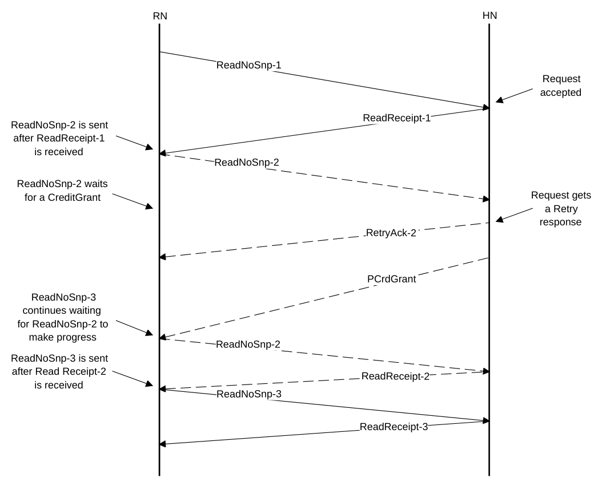

图 B2.38：一系列有序读请求

在图 B2.38 中，三个有序请求从 Request Node 发送到 Home Node，具体如下：

1. Request Node 向 Home Node 发送 ReadNoSnp-1 请求。
2. Home Node 接受该请求，并向 Request Node 返回 ReadReceipt-1 响应。
3. 在收到 ReadReceipt-1 响应之后，Request Node 向 Home Node 发送 ReadNoSnp-2 请求。
4. Home Node 无法立即接受 ReadNoSnp-2 请求，于是向 Request Node 返回 RetryAck-2 响应。
5. 此时 Request Node 必须等到 Home Node 发送 PCrdGrant 之后，才能重新发送 ReadNoSnp-2 请求。Request Node 此时不发送 ReadNoSnp-3，以便将 ReadNoSnp-3 排在 ReadNoSnp-2 之后。这种排序要求 ReadNoSnp-2 必须先被 Home Node 接受，之后才能向 Home Node 发送 ReadNoSnp-3。
6. 在收到相应的 PCrdGrant 之后，Request Node 重新发送 ReadNoSnp-2 请求。
7. Home Node 接受该请求，并向 Request Node 返回 ReadReceipt-2 响应。
8. 在收到 ReadReceipt-2 响应之后，Request Node 向 Home Node 发送 ReadNoSnp-3 请求。
9. Home Node 接受该请求，并向 Request Node 返回 ReadReceipt-3 响应。
10. 每个读事务都通过请求方收到完成响应和数据而完成。图 B2.38 中未示出这一点。

> **注意**
>
> 图 B2.38 展示了来自 Request Node 的三个读请求构成的单个有序流。然而，一个 Request Node 可以具有多个读请求流，因此请求必须在流内保持有序。但是，流与流之间不存在排序依赖。例如，当这些流来自 Request Node 内的不同线程时。在这种情况下，Request Node 在发出该流的下一有序请求之前，只需等待来自同一线程的前一请求的 ReadReceipt。

##### B2.7.5.2 CopyBack 请求顺序

RN-F 必须等到收到未完成的 CopyBack 事务的 CompDBIDResp 或 Comp 响应之后，才能向同一缓存行发出另一个请求。

- 允许在收到针对同一缓存行的未完成 CopyBack 的 CompDBIDResp 或 Comp 响应之前，发出 SnoopMe = 1 的 Atomic 事务。
- 允许在收到针对同一缓存行的、SnoopMe = 1 的未完成 Atomic 事务的 CompDBIDResp 或 Comp 响应之前，发出 CopyBack 事务。

##### B2.7.5.3 流式有序写事务

用于提升 Ordered Write Observation（OWO）写流效率的架构机制及其相应约束，仅适用于 WriteUnique 和 WriteNoSnp 事务。

如果请求方要求一系列写事务按其发出的相同顺序被观察到，则请求方可以在发出序列中的下一个写之前，先等待该写的完成。这种观察排序通常称为 OWO。本规范提供了一种称为 Streaming Ordered Writes 的机制，以更高效地流式处理此类有序写事务。

Streaming Ordered Write 机制依赖于使用 OWO 排序要求和 CompAck。当采用 Streaming Ordered Write 方案时，以下要求适用于请求方和 HN-F：

- 请求方必须将 Order 字段设置为 0b10，并在写请求上设置 ExpCompAck。
- 写请求中的 OWO 要求向 HN-F 表明，该写的一致性动作的完成不得依赖于后续写的一致性动作的完成。
- 请求方在发送下一个写请求之前，必须等待某写事务的 DBIDResp、DBIDRespOrd、CompDBIDResp 或 Comp。
- 请求方必须在收到相应写的 DBIDResp、DBIDRespOrd、CompDBIDResp 或 Comp 响应，以及所有更早的相关有序写的 Comp 或 CompDBIDResp 响应之后，发送 CompAck 响应。如果要发送写数据，请求方可以（但不必须）将 CompAck 响应与 WriteData 响应合并为一个 NonCopyBackWriteDataCompAck 响应。当请求方对某事务使用合并的 CompAck 和 WriteData 响应时，必须对该事务中的所有 WriteData 传输发送合并响应。请求方判断一组有序写是否相关的方法是 IMPLEMENTATION SPECIFIC 的。

> **注意**
>
> 一直等到所有在先的相关有序写都收到其 Comp 响应之后才发送 CompAck 响应，可确保其在各自 HN-F 节点上的操作已经完成。任何观察到与 CompAck 响应相关联的写的请求方，也都会观察到所有在先的相关有序写。

- 收到 DBIDResp* 且已准备好发送 CompAck 的请求方，不得为了发送 CompAck 而等待 Comp。
- HN-F 在释放某写事务并使其对其他观察者可见之前，必须等待来自 Request Node 的 CompAck 响应。

###### B2.7.5.3.1 优化的流式有序写事务

本节所述的写仅指 WriteUnique 或 WriteNoSnp。流式有序写机制可以进一步优化。如果此前发送的写指向不同的目标，则请求方无需在发送下一个有序写之前等待该请求的 DBIDResp*。但是，如果互连能够重映射 TgtID，则请求方必须假定所有写事务都以同一个 HN-F 为目标，并且不得使用流式有序写流程的优化版本。

采用优化或非优化流式有序写方案的实现必须避免死锁和活锁情况。

> **注意**
>
> 一种避免与资源相关的死锁或活锁问题的做法是，将流式有序写优化限制为系统中的某一个请求方。系统中所有其他请求方都可以使用不带该优化的流式有序写方案。

在典型系统中，优化的流式有序写方案对作为 PCIe 风格、非宽松序、可侦听写的承载通道的 RN-I 最为有利。在大多数系统中，一个承载此类 PCIe 流量的 RN-I 就足够了。

通过使用 WriteDataCancel 消息，OWO 写可以由多个请求方使用，以避免与资源相关的死锁和活锁。

图 B2.39 展示了一个典型的事务流程，其中 RN-I 使用流式有序 WriteUnique 事务。该流程可防止读在 Write-A 完成之前获取 Write-B 的新值。

> **注意**
>
> 为清晰起见，图 B2.39 中省略了 Write-B 的 DBIDResp* 以及 NonCopyBackWriteData 流程。

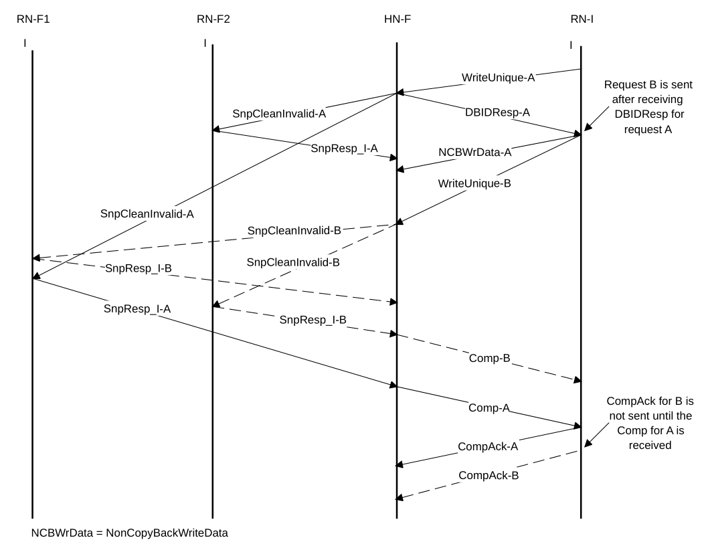

图 B2.39：流式有序 WriteUnique 事务流程

流式有序 WriteUnique 事务流程如下：

1. RN-I 向归属节点发出 WriteUnique-A。
2. 归属节点以 DBIDResp 响应，并向 RN-F1 和 RN-F2 发出 SnpCleanInvalid-A。
3. RN-I 发送与 WriteUnique-A 关联的写数据，并向归属节点发出下一个有序 WriteUnique 请求，在图 B2.39 中表示为 WriteUnique-B。
4. WriteUnique-A 与 WriteUnique-B 指向不同的地址。归属节点为 WriteUnique-B 向 RN-F1 和 RN-F2 发出 SnpCleanInvalid-B 侦听，而无需等待 WriteUnique-A 事务侦听的响应。
5. 归属节点在收到 WriteUnique-A 事务的侦听响应之前，先收到了 WriteUnique-B 事务的侦听响应。归属节点向 RN-I 发送针对 WriteUnique-B 事务的 Comp。
6. 归属节点等待收到 WriteUnique-A 事务的侦听响应。一旦收到，归属节点即可向 RN-I 发送针对 WriteUnique-A 事务的 Comp。
7. 请求方 RN-I 收到 Comp-B，并等待收到 Comp-A 后再继续下一个响应。
8. 当 RN-I 准备好使该写可被观察到时，它发送针对 WriteUnique-A 事务的 CompAck 响应。
9. 当 RN-I 准备好使该写可被观察到时，它发送针对 WriteUnique-B 事务的 CompAck 响应。

### B2.8 地址、控制与数据

事务包含一些属性，这些属性定义了互连处理该事务的方式。这些属性包括地址、内存属性、侦听属性和数据格式。本节将定义每个属性。

在本节中，除非另有明确说明，对写事务的引用同时包含单个写事务和相应的 Combined Write 事务。

#### B2.8.1 Address

CHI 协议支持：

- 44 位至 52 位的物理地址（Physical Address，PA），以 1 位为增量。
- 49 位至 53 位的虚拟地址（Virtual Address，VA）。

REQ 和 SNP 数据包的 Addr 字段规定如下：

- REQ 通道：Address[(MPA-1):0]
- SNP 通道：Address[(MPA-1):3]

MPA 为支持的最大 PA。

表 B2.10 给出了物理地址字段宽度与所支持虚拟地址之间的关系。

表 B2.10：Addr 字段宽度与支持的 Physical Address 和 Virtual Address 大小

| REQ Addr 字段宽度（位） | 支持的最大（位）Physical Address Virtual Address |
| --- | --- |
| 44 | 44 49 |
| 45 | 45 51 |
| 46 至 52 | 46 至 52 53 |

关于在具有不同 Addr 字段宽度的 REQ 和 SNP 字段中的 DVM 载荷映射，参见 B8.3 DVMOp field value restrictions。

Req_Addr_Width 参数用于指定组件所支持的最大 PA 位数。该参数的有效值为 44 至 52，未指定时，该参数取默认值 44。

#### B2.8.2 Physical Address Space, PAS

一次访问的物理地址空间（Physical Address Space，PAS）由 PAS 字段值确定。

更多信息参见 B13.10.68 PAS。

对于可侦听事务，PAS 可被视为定义了多个地址空间的附加地址信息。不同物理地址空间之间的任何混叠都必须被正确处理。

> **注意**
>
> 硬件一致性不管理各地址空间之间的一致性。参见 B2.7.1 Multi-copy atomicity。

#### B2.8.3 Memory Attributes

内存属性（Memory Attributes，MemAttr）由 Early Write Acknowledgment（EWA）、Device、Cacheable 和 Allocate 组成。

##### B2.8.3.1 EWA

EWA 指示某个事务的写完成响应：

- 可以来自互连中的中间点，例如归属节点。
- 必须来自目标目的地的最终端点。

当 EWA 为 1 时，该事务的写完成响应可以来自中间点或来自端点。来自中间点的完成必须提供与 B2.7.2 Completion response and ordering 中所述的 Comp 所要求相同的保证。

当 EWA 为 0 时，该事务的写完成响应必须来自端点。

> **注意**
>
> 允许但不要求实现不使用 EWA 属性。在这种情况下，完成必须由端点给出。

EWA 的要求为：

- 在以下事务中可以取任意值：
- WriteNoSnpDef。

> **注意**
>
> 对于 WriteNoSnpDef 事务，无论 EWA 取值如何，预期响应均来自最终目标端点。

来自中间组件的提前响应可能使原始请求方无法观察到来自最终端点的有效 Defer 响应，从而降低可延迟写事务的有效性。

- WriteNoSnp。
- ReadNoSnp。
- ReadNoSnpSep。
- Atomic* 事务。
- 在以下任一事务中必须为 1：
- 不是 ReadNoSnp 或 ReadNoSnpSep 的读事务。
- 无数据事务。
- 不是 WriteNoSnp 或 WriteNoSnpDef 的写事务。
- 在以下任一事务中不适用且必须为 0：
- DVMOp。
- PCrdReturn。
- PrefetchTgt。

##### B2.8.3.2 Device

Device 属性指示内存类型是 Device 还是 Normal。

###### B2.8.3.2.1 Device memory type

Device 内存类型必须用于具有副作用的存储位置。对于不具有副作用的存储位置，允许使用 Device 内存类型。

对 Device 类型内存位置的事务要求为：

- 读事务不得读取比所请求更多的数据。
- 不允许从 Device 内存位置预取。
- 读操作必须从端点获取其数据。读操作不得转发来自对同一

地址位置且在中间点完成的写操作的数据。

- 不允许把对不同位置的请求合并为一个请求，也不允许把对同一

位置的不同请求合并为一个请求。

- 写操作不得合并。
- 从中间点获得完成的、对 Device 内存的写操作，必须使写数据及时

对端点可见。

对 Device 内存的访问必须使用以下类型，允许使用其独占变体：

- 对 Device 内存位置的读访问必须使用 ReadNoSnp。
- 对 Device 内存位置的写访问必须使用 WriteNoSnpPtl、WriteNoSnpFull、WriteNoSnpZero，

或 WriteNoSnpDef。

- 允许对 Device 内存位置执行 Atomic* 事务。
- 不允许对 Device 内存位置执行 PrefetchTgt 事务。在 PrefetchTgt 事务中 MemAttr 字段不适用

且必须为 0。

不允许对 Device 内存执行 CMO 事务。

###### B2.8.3.2.2 Normal 内存类型

Normal 内存类型适用于不表现出副作用的内存位置。

对 Normal 内存的访问在预取或转发方面没有与 Device 类型内存相同的限制：

- EWA = 1 的读事务可以从一个已从中间点发出其完成、且指向同一地址位置的写事务获取读数据。
- 写可以合并。

任何 Read、Dataless、Write、PrefetchTgt 或 Atomic 事务类型都可用于访问 Normal 内存位置。所使用的事务类型由要完成的内存操作以及 Snoopable 属性决定。

##### B2.8.3.3 Cacheable

Cacheable 属性指示事务是否必须执行缓存查找：

- 当 Cacheable 为 1 时，事务必须执行缓存查找。
- 当 Cacheable 为 0 时，事务必须访问最终目的地。

Cacheable 属性取值要求为：

- 对于以下任何情况，必须为 1：
- 除 ReadNoSnp 和 ReadNoSnpSep 之外的读事务。
- Dataless 事务。
- 除 WriteNoSnpFull、WriteNoSnpPtl、WriteNoSnpZero 和 WriteNoSnpDef 之外的写事务。
- 对于以下任何情况，必须为 0：
- Device 内存事务。
- WriteNoSnpDef。
- PrefetchTgt。
- 对于以下情况，可以取任意值：
- 访问 Normal 内存位置的 ReadNoSnp 或 ReadNoSnpSep 事务。
- 访问 Normal 内存位置的 WriteNoSnpFull 和 WriteNoSnpPtl 事务。

> **注意**
>
> 在可以取任意 Cacheable 值的事务中，该值通常由页表属性确定。

##### B2.8.3.4 Allocate

Allocate 属性是一种分配提示，指示事务推荐的分配策略：

- 当 Allocate 为 1 时，出于性能原因，建议将该事务分配到缓存中。但是，缓存可以不为该事务进行分配。
- 当 Allocate 为 0 时，出于性能原因，建议不将该事务分配到缓存中。但是，缓存可以为该事务进行分配。

Allocate 属性取值要求为：

- 对于 Cacheable = 1 的事务可以为 1，但 ReadOnceMakeInvalid 除外。
- 对于 WriteEvictFull 事务必须为 1。

> **注意**
>
> 请求方可以将 Allocate 位未置位的 WriteEvictFull 转换为 Evict 事务。

- 对于以下情况必须为 0：
- Device 内存事务。
- Normal 不可缓存内存事务。
- 在以下事务中不适用且必须为 0：
- DVMOp。
- PCrdReturn。
- Evict。
- PrefetchTgt。

##### B2.8.3.5 Attr 的传播

为响应发往归属节点的请求而由归属节点发往从属节点的请求，必须保留 MemAttr 的 EWA、Device、Cacheable 和 Allocate 位。该规则的例外情况是：当下游内存已知为 Normal 时，Device 字段值可以设为 0b0 以指示 Normal。

在 Combined Write 事务中，当写事务和 CMO 事务被分离时，写事务继承原始组合请求的 MemAttr 和 SnpAttr 值。分离出的 CMO 事务的 SnpAttr 和 Cacheable 位必须设置为最具普遍性的值，以影响 RN-F 节点处的所有缓存以及下游缓存。

对于因归属节点的预取或系统缓存的驱逐而在互连内生成的 ReadNoSnp 或 WriteNoSnp：

- MemAttr 的 EWA、Cacheable 和 Allocate 位必须全部为 1。
- Device 字段值必须为 0 以指示 Normal。
- SnpAttr 字段值必须为 0 以指示不可侦听。

#### B2.8.4 事务属性组合

表 B2.11 列出了 MemAttr、SnpAttr 和 Order 字段取值的合法组合及与之等效的 ARM 内存类型。Order 字段在 B2.7 Ordering 中描述。

表 B2.11：MemAttr、SnpAttr 和 Order 字段取值的合法组合

Order[1:0]a MemAttr[3:0]

ARM 内存类型 [1] [3] [2] [0] [1] [0] LikelyShared Cacheable Allocate SnpAttr Device EWA

| 1 | 0 0 0 | 0 | 0 | 1 | 1 | Device nRnE |
| --- | --- | --- | --- | --- | --- | --- |
|  | 0 0 1 | 0 | 0 | 1 | 1 | Device nRE |
|  | 0 0 1 | 0 | 0 | 0/1a | 0 | Device RE |
|  | 所有其他取值b |  |  |  |  | 无效 |
| 0 | 0 0 0 | 0 | 0 | 0/1a | 0 | 不可缓存 不可缓冲c |
|  | 0 0 1 | 0 | 0 | 0/1a | 0 | 不可缓存 可缓冲 |
|  | 0 1 1 | 0 | 0 | 0/1a | 0 | 不可侦听 WriteBack No-allocate |
|  | 1 1 1 | 0 | 0 | 0/1a | 0 | 不可侦听 WriteBack Allocate |
|  | 0 1 1 | 1 | 0/1d | 0/1a | 0 | 可侦听 WriteBack No-allocate |
|  | 1 1 1 | 1 | 0/1d | 0/1a | 0 | 可侦听 WriteBack Allocate |
|  | 所有其他取值b |  |  |  |  | 无效 |

a Order = 0b10 仅允许用于 ReadOnce*、WriteUnique、ReadNoSnp、WriteNoSnp、WriteNoSnpDef 和 Atomic 事务。

b Order = 0b01 不用于事务的排序。参见 B2.7.5 Transaction ordering。 c 不可缓存 不可缓冲是一种 AXI 内存类型，而不是 ARM 内存类型。

d 参见 B2.8.5 Likely Shared。

##### B2.8.4.1 内存类型

本节规定表 B2.11 中所示每种内存类型所要求的行为。

###### B2.8.4.1.1 Device nRnE

Device nRnE 内存类型所要求的行为是：

- 写响应必须从最终目的地获得。
- 读数据必须从最终目的地获得。
- 读操作不得获取超出所需的数据。
- 读操作不得被预取。
- 写不得被合并。
- 写操作不得写入比原始事务更大的地址范围。
- 来自同一源、发往同一端点的所有读事务和写事务必须保持有序。

###### B2.8.4.1.2 Device nRE

Device nRE 内存类型所要求的行为与 Device nRnE 内存类型相同，只是写响应可以从中间点获得。

###### B2.8.4.1.3 Device RE

Device RE 内存类型所要求的行为与 Device nRE 内存类型相同，但以下情况除外：

- 来自同一源、发往同一端点的读事务和写事务无需保持有序。
- 来自同一源、发往重叠地址的读事务和写事务必须保持有序。

###### B2.8.4.1.4 Normal 不可缓存 不可缓冲

Normal 不可缓存 不可缓冲内存类型所要求的行为是：

- 写响应必须从最终目的地获得。
- 读数据必须从最终目的地获得。
- 写可以被合并。
- 来自同一源、发往重叠地址的读事务和写事务必须保持有序。

###### B2.8.4.1.5 Normal 不可缓存 可缓冲

Normal 不可缓存 可缓冲内存类型所要求的行为是：

- 写响应可以从中间点获得。
- 写事务必须及时地在其最终目的地变为可见。

> **注意**
>
> 没有机制可以确定写事务何时在其最终目的地可见。

- 读数据必须从以下之一获得：
- 最终目的地。
- 一个正在向其最终目的地推进的写事务。

如果读数据是从某个写事务获得的：

* 数据必须从该写的最新版本获得。 * 数据不得被缓存以用于后续的读操作。
- 写可以被合并。
- 来自同一源、发往重叠地址的读事务和写事务必须保持有序。

> **注意**
>
> 对于 Normal 不可缓存 可缓冲读操作，数据可以从一个仍在向其最终目的地推进的写事务获得。这与读事务和写事务在传播过程中同时到达最终目的地是无法区分的。以此方式返回的读数据并不表示该写事务在最终目的地已可见。

###### B2.8.4.1.6 Write-Back No-allocate

Write-Back No-allocate 内存类型所要求的行为是：

- 写响应可以从中间点获得。
- 写事务不要求在其最终目的地变为可见。
- 读数据可以从中间缓存的副本获得。
- 读可以被预取。
- 写可以被合并。
- 对读事务和写事务都要求进行缓存查找。
- 来自同一源、发往重叠地址的读事务与写事务必须保持有序。
- No-allocate 属性是一种分配提示，仅出于性能原因向内存系统建议该

事务不被分配。然而，并不禁止对该事务进行分配。

###### B2.8.4.1.7 Write-Back Allocate

Write-Back Allocate 内存类型所要求的行为与 Write-Back No-allocate 内存类型相同。但是，在这种情况下，分配提示是出于性能原因向内存系统建议该事务被分配。

#### B2.8.5 Likely Shared

LikelyShared 属性是一种缓存分配提示。当 LikelyShared 为 1 时，所请求的数据可能被系统中的其他请求节点共享。这对于共享的系统级缓存来说是一种提示，表明出于性能原因建议分配该缓存行。

没有与该事务属性相关联的必需行为。

LikelyShared 的要求是：

- 在以下事务中可以为 1：
- ReadClean
- ReadNotSharedDirty
- ReadShared
- StashOnceUnique、StashOnceSepUnique
- StashOnceShared、StashOnceSepShared
- WriteUniquePtl
- WriteUniqueFull
- WriteUniqueZero
- WriteUniquePtlStash
- WriteUniqueFullStash
- WriteBackFull
- WriteCleanFull
- WriteEvictFull
- WriteEvictOrEvict
- 在以下任何事务中必须为 0：
- Combined Write 事务。
- Dataless 或 Atomic 事务。
- 其他读事务或写事务。
- 在以下事务中不适用，且必须为 0：
- DVMOp
- PCrdReturn
- PrefetchTgt

#### B2.8.6 侦听属性

SnpAttr 字段指示事务是否可能需要侦听。

关于 SnpAttr 字段的编码，见表 B13.19。

表 B2.12 显示了不同事务类型的侦听属性。使用以下键：

Y 是，允许

- 否，不允许

n/a 不适用

表 B2.12：不同事务类型的侦听属性

| 事务 | 不可侦听 | 可侦听 |
| --- | --- | --- |
| ReadNoSnp ReadNoSnpSep | Y | - |

ReadOnce* - Y

ReadClean

ReadShared

ReadNotSharedDirty

ReadUnique

ReadPreferUnique

MakeReadUnique

CleanUnique - Y

MakeUnique

StashOnce

CleanShared Y Y

CleanSharedPersist*

CleanInvalid

CleanInvalidPoPA

CleanInvalidStorage

MakeInvalid

Evict - Y

WriteNoSnp Y -

WriteNoSnpDef Y -

下页续

表 B2.12 – 续上页

事务 不可侦听 可侦听

WriteBack - Y

WriteCleanFull

WriteEvictFull

WriteEvictOrEvict

WriteUnique - Y

Atomic* Y Y

n/aa n/aa DVMOp

n/ab n/ab PrefetchTgt

a 不适用，SnpAttr 位在 DVM 事务中用作 Domain Identifier，见 B8.4.1 DVM domain。b 不适用，可以取任意值。

CMO 中、Atomic 中，以及从归属节点到从属节点的 ReadNoSnp 和 ReadNoSnpSep 中，SnpAttr 字段值必须为零，无论从原始 Requester 发往归属节点的 Request 中该字段的值是什么。在从归属节点到从属节点的 Write 和 Combined Write 事务中，SnpAttr 字段的位位置用于 DoDWT 字段。见 B2.3.9.2 从归属节点到从属节点的写事务 和 B2.3.9.4 从归属节点到从属节点的 Combined Write 和 CMO 事务。

> **注意**
>
> 对于可以取多个 SnpAttr 值的事务，该值通常由页表属性确定。

#### B2.8.7 不匹配的内存属性

允许使用不匹配的 MemAttr 或 SnpAttr 值对同一位置发起两个不同的访问。不匹配的 MemAttr 或 SnpAttr 值可能是预期的，也可能是非预期的。要求系统在任一情况下都不会死锁，并且事务始终能向前推进。

为应对预期的内存属性不匹配，互连：

- 必须确保完全一致性缓存中的 Clean 行（UC 或 SC）：
- 若在缓存行被分配到该完全一致性缓存之后，该位置已被另一个 SnpAttr = 0 的事务更新，则不得使其对使用 SnpAttr = 0 的事务访问该位置的请求方可见。
- 不被写入主存。
- 不被用于覆盖下游缓存中的 Dirty 副本。
- 允许（但不要求）使由使用 SnpAttr = 0 的事务的请求方所写入的缓存行的 Dirty 副本对完全一致性请求方可见。不得将该 Dirty 行的可见性从使用 SnpAttr = 0 的事务访问该位置的请求方处移除。
- 允许（但不要求）使完全一致性缓存中的 Dirty 行（UD 或 SD）对使用 SnpAttr = 0 的事务访问该位置的另一个请求方可见。

一旦完全一致性缓存中的 Dirty 行对使用 SnpAttr = 0 的请求访问该位置的请求方可见，就不得将该缓存行从该请求方的可见范围内移除。

> **注意**
>
> 可以采用多种实现方式来确保不会发生这种可见性移除。这些方式包括但不限于：

- 将该行的 dirty 副本写回主存。
- 将该行的副本保留在系统缓存中，以便由具有 SnpAttr = 0 的请求观察到。
- 侦听完全一致性缓存，以完成具有 SnpAttr = 0 的请求。
- 在命中某行的 Unique 副本时，不得终止 CMO。要求 CMO 继续执行，因为该 Unique 副本可能是过期的，且同一位置的其他 dirty 副本可能存在于系统缓存层次结构的其他位置。

##### B2.8.7.1 属性不匹配的原因

属性不匹配可能由多种原因导致：

- B2.8.7.1.1 不可共享的 Cacheable 访问的升级
- B2.8.7.1.2 软件协议错误

###### B2.8.7.1.1 不可共享的 Cacheable 访问的升级

当 RN-F 的 Nonshareable_Cache_Maint 属性设置为 True 时，它必须通过将 SnpAttr 设置为 1，来升级所有 MemAttr.Cacheable 设置为 1 的访问。此修改可能需要更新请求 Opcode。例如：

- ReadNoSnp 必须更新为 Allocating Read。
- WriteNoSnp 必须变为 WriteUnique 或 CopyBack，具体取决于初始的 RN-F 缓存状态。

在基于 MemAttr.Cacheable 进行升级的情况下：

- 当 MemAttr.Cacheable 为 1 时，RN-F 必须将 SnpAttr 设置为 1。
- 允许 RN-F 为读操作分配 CompData 响应。
- 对这些位置接收到的所有侦听都必须作用于已分配的行。
- 系统中任何请求方发出的可侦听 CMO 随后都作用于由完全一致性请求方或互连所缓存的副本。这是支持诸如领域管理扩展（Realm Management Extensions）等功能所必需的，参见第 B10 章 Realm Management Extension。

当 RN-F 的 Nonshareable_Cache_Maint 属性设置为 False 时，它可以继续发出 MemAttr.Cacheable 设置为 1 的事务，而不修改 SnpAttr。更多详细信息参见 B16.1.17 Nonshareable_Cache_Maint。

RN-I 可以访问任何 MemAttr.Cacheable 设置为 1 的位置，而不修改 SnpAttr。对于高带宽、IO 一致性请求方，建议采用此方法来避免侦听过滤器查找。

当 RN-I 一直使用 WriteNoSnp 对该位置执行存储时，该行在 RN-F 或互连中的升级版本可能会变为过期。

互连必须确保缓存行的过时副本对不应观察到它们的代理不可见。互连还必须确保最新的副本对必须观察到它们的代理保持可见。

###### B2.8.7.1.2 软件协议错误

来自不同代理的内存访问，若使用了不相匹配、不符合预期的可侦听性或可缓存性属性，则可被视为软件协议错误。软件协议错误可能导致一致性丢失，并造成数据值损坏。参见 B9.4.1 基于软件的错误。

针对某个 4KB 内存区域中访问的软件协议错误，不得导致另一个 4KB 内存区域中的数据损坏。

对于存放在 Normal 内存中的位置，可以使用适当的软件缓存维护操作，将内存位置恢复到已定义状态。

使用不匹配的内存属性可能导致 RN-F 观察到针对同一地址的侦听事务，而该 RN-F 会使用、或此前曾使用不可侦听事务来访问该地址。如果 RN-F 收到针对被认为是不可侦听的位置的侦听，则 RN-F 不得以数据响应，而应改为发送 SnpResp_I。当使用不匹配的属性时，侦听事务与该 RN-F 已发出的事务之间不存在已定义的关系。

#### B2.8.8 CopyAtHome 属性

CopyAtHome（即 CAH）是一种缓存行属性，归属节点可用它来优化掉冗余的数据传输。在系统缓存既非完全包含、也非完全独占，而是根据系统行为调整其包含策略的拓扑中，该属性很有用。

在向请求方返回的 CompData 和 DataSepResp 响应中，CAH 值指示归属节点是否保留该行的副本。CAH 值在请求方处随该行一同缓存。如果该行在本地被更新，则必须复位所缓存的 CAH 属性。

当请求方针对该行执行 CopyBack 写或组合 CopyBack 写时，CAH 值随请求一同发送。归属节点可以使用请求中的 CAH 值来确定是否应检查该行的本地副本。如果归属节点仍保留该行的副本，则归属节点请求该 CopyBack 写事务在不进行 CopyBackWriteData 传输的情况下完成。

##### B2.8.8.1 CAH 在归属节点处的使用

在来自归属节点的 CompData 或 DataSepResp 响应中，CAH 属性设置为：

1 如果归属节点指示保留了该行的副本。如果归属节点已向请求方提供该行的 Unique 副本，则归属节点处的副本是隐藏副本，对系统中的任何代理均不可观测。如果该隐藏副本是 Clean 的，则归属节点可以随时移除该缓存行的副本，但在已发出 Comp 且相关联的 CompAck 仍处于未完成状态的窗口期间除外。如果该行是 Dirty 的，且已向请求方提供了 Clean 副本，则归属节点不得移除该行的隐藏副本。

0 如果归属节点不打算保留该行的副本，也不支持优化的 CopyBack 写流程。

当归属节点稍后收到 CopyBack 写请求时，它可以检查 CAH 属性，以确定用于完成该事务的事务流变体。表 B2.13 显示了归属节点处针对 CopyBack 写事务的 CAH 属性用法。

表 B2.13：归属节点处针对 CopyBack 写事务的 CAH 用法

请求 CopyBack 写事务 描述 CAH 值

1 WriteBack 或 WriteCleanFull 归属节点可以执行以下操作之一：

- 以 CompDBIDResp 响应，以请求该事务的写数据。
- 检查归属节点是否仍拥有该行的副本：

如果归属节点拥有该行的副本，则期望（但不要求）归属节点以 Comp 响应，以请求该事务在不进行数据传输的情况下完成。如果归属节点不发送 Comp，则它必须发送 CompDBIDResp，以请求该事务的写数据。

如果归属节点不拥有该行的副本，则归属节点必须以 CompDBIDResp 响应，以请求该事务的写数据。

WriteEvictOrEvict 或 WriteEvictFull 归属节点可以执行以下操作之一：

- 以 CompDBIDResp 响应，以请求该事务的写数据。
- 以 Comp 响应，以请求该事务在不进行数据传输的情况下完成。
- 检查归属节点是否仍拥有该行的副本：

如果归属节点拥有该行的副本，则期望（但不要求）归属节点以 Comp 响应，以请求该事务在不进行数据传输的情况下完成。如果归属节点不发送 Comp，则它必须发送 CompDBIDResp，以请求该事务的写数据。

如果归属节点不拥有该行的副本，则归属节点必须以 CompDBIDResp 响应，以请求该事务的写数据。

0 或未检查 WriteBack、WriteCleanFull 或 WriteEvictFull 归属节点必须响应 CompDBIDResp，以请求该事务的写数据。

下页续

表 B2.13 – 续上页

请求 CopyBack 写事务 描述 CAH 值

WriteEvictOrEvict 归属节点可以执行以下操作之一：

- 以 CompDBIDResp 响应，以请求该事务的写数据。
- 以 Comp 响应，以请求该事务在不进行数据传输的情况下完成。

如果归属节点发出 Comp 而非 CompDBIDResp，则必须观察到来自请求方的后续 CompAck 响应，才能完成该 CopyBack 写事务。有关归属节点如何解读可能的 CompAck 响应，请参见 B4.5.4 杂项响应。

##### B2.8.8.2 请求节点处的 CAH 用法

请求方或 Snoopee 按以下方式处理 CAH 属性：

- 如果在 CompData 或 DataSepResp 响应中 CAH 属性的值为 1，则请求方被允许（但不要求）为 CAH 缓存值 1。
- 如果在 CompData 或 DataSepResp 响应中 CAH 属性的值为 0，则请求方不得为 CAH 缓存值 1。
- 请求方不要求缓存传入的 CAH 值。如果未缓存 CAH 值，则必须假定该值为 0。
- 当缓存行或 MTE 标记被更新时，缓存必须将 CAH 属性清为 0。
- 缓存中的 CAH 属性可以在任意时刻被清为 0。

> **注意**
>
> 然而，如果不必要地清除了已缓存的 CAH 属性，就会丧失为 CopyBack Write 事务降低写数据带宽的能力。

- 当发送 WriteCleanFull 请求时，请求方不要求将 CAH 属性清为 0。
- 当请求方拥有一个 CAH 值为 0 的缓存行时，不得发送请求中 CAH 属性被置为 1 的 CopyBack 事务。
- 当请求方拥有一个 CAH 值为 1 的缓存行时，期望（但不要求）其发送 CAH 属性为 1 的 CopyBack 事务。
- 一旦发送了 CAH 属性被置为 1 的 CopyBack 请求，在该事务完成之前，请求方不得进一步修改该缓存行。
- 一旦从 UD 状态发送了 CAH 属性被置为 1 的 WriteCleanFull 请求，如果 Home 在未请求数据传输的情况下完成了该事务，则请求方必须确保对该行的任何后续更新不会丢失。
- 当为响应转发侦听而提供 CompData 时，期望（但不要求）Snoopee 将 CAH 值转发给请求方。如果 Snoopee 不转发 CAH 值，则该值在 CompData 响应中必须为零。
- 当为响应侦听而向 Home 提供 SnpRespData 或 SnpRespDataFwded 时，期望（但不要求）Snoopee 发送 CAH 值。如果 Snoopee 不在数据响应中发送 CAH 值，则该值必须为零。

对于 CopyBack Write 事务，CompAck 响应中的 Resp 字段值适用，并且必须指示 CompAck 响应发送时刻的缓存状态。如果在 CopyBack Write 未完成期间收到侦听请求，则缓存行状态可能不同于原始事务发送时的缓存行状态。更多信息参见 B4.7.3 Write request transactions。

Home 必须使用 CompAck 响应中的缓存行状态信息来确定其持有的该行的任何隐藏副本是否可以暴露。关于每种 CompAck 响应下 Home 可以采取的操作，参见表 B2.14。

表 B2.14：CopyBack Write 事务允许的 CompAck 响应

| Response | Resp[2:0] | 响应发送时的缓存行状态 | 当 Home 处存在该缓存行的隐藏副本时可采取的操作 | Notes |
| --- | --- | --- | --- | --- |
| CompAck_I | 0b000 | 不精确，必须被忽略 | 尚不得暴露 | 表示 CopyBack 请求已被取消 |
| CompAck_UC | 0b010 | UC | 暴露，除非在别处存在 Unique 副本a。这是期望的，但不是必需的。 |  |
| CompAck_SC | 0b001 | SC | 暴露。这是期望的，但不是必需的。 |  |
| CompAck_UD_PD | 0b110 | UD | 暴露，除非在别处存在 Unique 副本a。这是期望的，但不是必需的。 | 更新内存的责任被传递给 Home |
| CompAck_SD_PD | 0b111 | SD | 暴露。这是期望的，但不是必需的。 | 更新内存的责任被传递给 Home |

a 当 CopyBack Write 事务为 WriteCleanFull 时，请求方处仍可能存在一个 Unique 副本。

如果 Home 保留了某个缓存行的隐藏副本，并且之后确定不存在该行的其他副本：

- 如果该隐藏副本为 Clean，则期望（但不要求）Home 暴露该副本。
- 如果该隐藏副本为 Dirty，则 Home 必须暴露该副本。

### B2.9 数据传输

读事务、写事务、组合写事务、原子事务以及带数据的侦听响应中都包含数据载荷。本节定义了数据对齐规则，以及在不同地址、事务大小和内存类型组合下所访问的数据字节。

在本节中，除非另有明确说明，凡提到写事务，均同时指单个写事务及相应的组合写事务。

#### B2.9.1 数据大小

数据包中的 Size 字段与其他字段结合使用，用于确定一条消息中传输的字节数。

表 B2.15 给出了 Size 字段的取值编码。侦听事务不包含 Size 字段。所有侦听数据传输均为 64 字节。

表 B2.15：Size 字段取值编码

| Size[2:0] | 字节数 |
| --- | --- |
| 0b000 | 1 |
| 0b001 | 2 |
| 0b010 | 4 |
| 0b011 | 8 |
| 0b100 | 16 |
| 0b101 | 32 |
| 0b110 | 64 |
| 0b111 | 保留 |

多请求事务中的每条数据消息的有效 Size 均为 64 字节。

#### B2.9.2 内存中被访问的字节

MemAttr[1] 位字段决定内存类型是 Device 还是 Normal。参见 B2.8.3 Memory Attributes。所访问的字节由内存类型按如下方式确定：

Normal 内存 具有 Normal 内存类型的事务访问由 Size 字段定义的字节数。数据访问从 Aligned_Address 开始，即事务地址向下取整到最近的 Size 边界，并结束于下一个 Size 边界之前的那个字节。其计算方式为：Start_Address = Addr 字段值。Number_Bytes = 2^(Size 字段值)。INT(x) = x 向下取整后的整数值。Aligned_Address = (INT(Start_Address / Number_Bytes)) x Number_Bytes。访问的字节范围是从 (Aligned_Address) 到 (Aligned_Address + Number_Bytes) - 1。

Device 内存 具有 Device 内存类型的事务访问从事务地址开始、到下一个 Size 边界之前的那个字节为止的字节数。访问的字节范围是从 (Start_Address) 到 (Aligned_Address +

Number_Bytes) - 1。对于写往 Device 位置的事务，BE 位只能对被访问的字节置 1。参见 B2.9.3 Byte Enables。

#### B2.9.3 字节使能

字节使能（BE）与写事务以及带数据的侦听响应配合使用。

在下面一节中，除非另有明确说明，凡提到写事务，均同时指单个写事务及相应的组合写事务。

在 WriteData 和侦听响应中，数据 BE 值为 0 时必须将关联的数据字节值置为 0。

在 CompData 和 DataSepResp 消息中，BE 位不适用，可以取任意值。

##### B2.9.3.1 写事务

对于所有写事务，不在由 Addr 和 Size 指定的数据窗口内的 BE 位必须为 0。

在写事务中，当 BE 为 1 时，表示关联的数据字节有效，必须在内存或缓存中更新。

当 BE 为 0 时，表示关联的数据字节无效，不得在内存或缓存中更新。

请求方必须将 CopyBackWriteData_I 和 WriteDataCancel 数据包中的所有 BE 值置为 0。

在下列写事务的数据传输期间：

- 所有 BE 位必须为 1，但写数据为 CopyBackWriteData_I 或 WriteDataCancel 数据包时除外：
- WriteNoSnpFull
- WriteNoSnpDef
- WriteBackFull
- WriteCleanFull
- WriteEvictFull
- WriteUniqueFull
- WriteUniqueFullStash
- 允许 BE 位的任意组合，包括全 1 和全 0：
- WriteBackPtl
- WriteUniquePtl
- WriteUniquePtlStash

对于 WriteNoSnpPtl 事务，适用以下规则：

- 对于发往 Normal 内存的事务，在数据传输期间 BE 位可以任意组合为 1。这包括全 1 和全 0。
- 对于发往 Device 内存的事务，BE 位只能对处于或高于事务中所指定地址的字节置 1。任何满足该要求的 BE 位组合都可以为 1。这包括全 1 和全 0。

##### B2.9.3.2 Atomic 事务

对于 Atomic 事务，数据窗口内的所有 BE 位都必须为 1。

对于 Atomic 事务，不在数据窗口内的 BE 位（如下文由 Addr 和 Size 指定）必须为 0：

- 如果 Addr 与 Size 对齐，则数据窗口为 [Addr:(Addr+Size-1)]。
- 如果 Addr 未与 Size 对齐，则数据窗口为 [(Addr-Size/2):(Addr+Size/2-1)]。

##### B2.9.3.3 Snoop 事务

对于使用 SnpRespData 或 SnpRespDataFwded 操作码的带数据 Snoop 响应，所有 BE 位都必须为 1。

对于使用 SnpRespDataPtl 操作码的带数据 Snoop 响应，在数据传输期间，BE 位可以为任意组合。这包括全 1 和全 0。

#### B2.9.4 数据分包

对于每个涉及数据的事务，数据字节可以分多个数据包传输。

所需的数据包数量由以下因素决定：

- 事务 Size
- Data_Width

使用 Limited Data Elision 可以减少需要传输的数据包数量。参见 B2.9.5 Limited Data Elision。

每个数据包中传输的最大字节数由以下因素决定：

- Data_Width

CHI 协议支持以下数据总线宽度：

- 128-bit
- 256-bit
- 512-bit

Data Identifier (DataID) 和 Critical Chunk Identifier (CCID) 字段用于标识事务内的数据包。

大小至多 16 字节的事务始终包含在单个数据包中。可以基于数据总线宽度为每个数据包计算 DataID：

- 128-bit：数据包中任一字节的有效内存地址的位 [5:4]
- 256-bit：数据包中任一字节的有效内存地址的位 [5]，与 0b0 拼接
- 512-bit：始终为 0b00

对于不同的数据总线宽度，表 B2.16 给出了 DataID 字段与数据包内所含字节之间的关系。

表 B2.16：不同数据宽度下 DataID 与数据包内的字节

数据宽度 DataID 128-bit 256-bit 512-bit

0b00 Data[127:0] Data[255:0] Data[511:0]

0b01 Data[255:128] Reserved Reserved

0b10 Data[383:256] Data[511:256] Reserved

0b11 Data[511:384] Reserved Reserved

在数据包内，所有字节都位于其自然字节位置。即使传输的数据字节数少于数据总线的宽度，这一点同样成立。

发往 Device memory 的事务所使用的数据包数量与事务的地址无关。所需的数据包数量仅由 Size 字段和数据总线宽度决定。

当一条 DAT 消息被拆分为多个数据包时：

- 必须保持一致的字段有：
- TgtID
- SrcID
- TxnID
- HomeNID
- PBHA
- Opcode
- Resp
- FwdState
- DataPull
- DataSource
- DBID，当该字段适用时，或者当该字段不适用而取固定值时
- CCID
- TagOp
- CAH
- MECID
- MismatchedMECID
- CacheLineID
- 预期保持一致但可以变化的字段有：
- QoS
- RespErr
- DBID，当该字段不适用且可以取任意值时
- TraceTag
- CBusy
- 预期会变化的字段有：
- Data
- DataID
- Tag
- RSVDC
- BE
- DataCheck
- Poison
- NumDat
- Replicate

#### B2.9.5 Limited Data Elision

Limited Data Elision 使得在以下任一情况下可以选择性地减少 DAT 通道上传输的数据包数量：

- Data 字段的部分或全部值为 0
- 后续数据包包含重复的 Data 字段值

所传输的每个数据包都带有一项指示，表示从该数据消息中省略的数据包数量。

使用 Limited Data Elision 不影响事务结构。

##### B2.9.5.1 方法

NumDat 字段用于在 DAT 数据包中指示有多少个按顺序编号的 DAT 数据包被省略。对于任何被省略的数据包，其字段值由 Replicate 字段指示。

如果某个数据包被省略，则其 Data 字段既可以取与所发送数据包相同的值（Replicate = 0b1），也可以取零（Replicate = 0b0）。关于使用 Limited Data Elision 时消息如何传输的示例，参见图 B2.40、图 B2.41 和图 B2.42。

可省略的数据包最大数量，比传输一个完整缓存行数据所需的最大数据包数量少一。根据请求数据大小，可省略的数据包数量可能更少。

针对不同数据总线宽度和请求数据大小，NumDat 与 Replicate 的可能取值如表 B2.17 所示。

表 B2.17：NumDat 与 Replicate 的可能取值

| 数据宽度 | 请求大小 | NumDat[1:0] | Replicate |
| --- | --- | --- | --- |
| 512 | 任意 | 0b00 | 0b0a |
| 256 | 512 | 0b00 | 0b0a |
|  |  | 0b01 | 0b0 或 0b1 |
|  | <=256 | 0b00 | 0b0a |
| 128 | 512 | 0b00 | 0b0a |
|  |  | 0b01 | 0b0 或 0b1 |
|  |  | 0b10 | 0b0 或 0b1 |
|  |  | 0b11 | 0b0 或 0b1 |
|  | 256 | 0b00 | 0b0a |
|  |  | 0b01 | 0b0 或 0b1 |
|  | <=128 | 0b00 | 0b0a |

a 不适用，且必须为零。

当事务大小小于 64B 时：

- 允许 DataID 为 0b00 和 0b10 的数据包具有非零的 NumDat 值。
- DataID 为 0b01 和 0b11 的数据包必须满足 NumDat = 0b00。

从接口发出省略数据的行为，可以通过 BROADCASTLIMELISION 信号控制。

##### B2.9.5.2 示例

图 B2.40 详细展示了 128 位数据总线在引入 Limited Data Elision 之前和之后，若干 DAT 通道消息在数据包层面的示例。

> **注意**
>
> 图 B2.40 中也包含了一些无法从数据消息中省略任何数据包的示例。

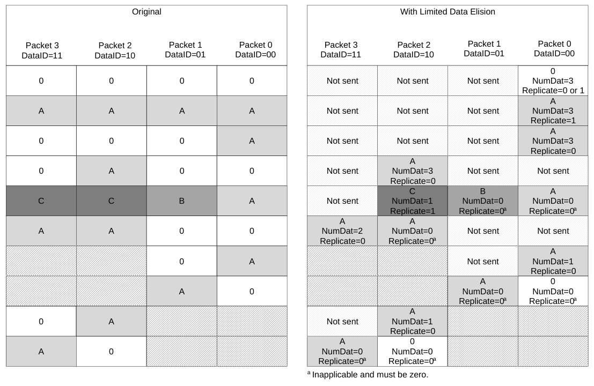

图 B2.40：128 位数据总线宽度示例

图 B2.41 详细展示了 256 位数据总线在引入 Limited Data Elision 之前和之后，若干 DAT 通道消息在数据包层面的示例。

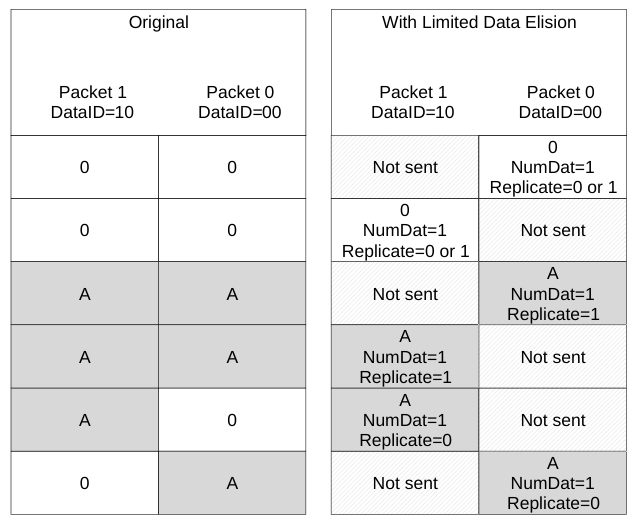

图 B2.41：256 位数据总线宽度示例

##### B2.9.5.3 适用范围与限制

使用 Limited Data Elision 时有多种需要了解的情形，本节对此进行概述：

- B2.9.5.3.1 MTE
- B2.9.5.3.2 BE
- B2.9.5.3.3 CopyBackWriteData_I、WriteDataCancel 或 NDERR 的 NumDat 与 Replicate 取值

###### B2.9.5.3.1 MTE

使用 MTE 时，若某个 DAT 数据包的 TagOp、TU 和 Tag 值与所发送的数据包相同，则该 DAT 数据包可以被省略。

###### B2.9.5.3.2 BE

为支持 Limited Data Elision，所发送数据包的 BE 位必须全为 1 或全为 0。

###### B2.9.5.3.3 CopyBackWriteData_I、WriteDataCancel 或 NDERR 的 NumDat 与 Replicate 取值

当使用 Limited Data Elision 从 CopyBackWriteData_I 或 WriteDataCancel 消息、或从 RespErr = NDERR 的数据消息中省略数据包时，必须始终省略该消息的最大数据包数量。

当使用 Limited Data Elision 从 CopyBackWriteData_I 和 WriteDataCancel 消息中省略数据包时，Replicate 必须为零。

图 B2.42 详细展示了 128 位数据总线在引入 Limited Data Elision 之前和之后，一些 CopyBackWriteData_I、WriteDataCancel 和 RespErr = NDERR 消息的示例。

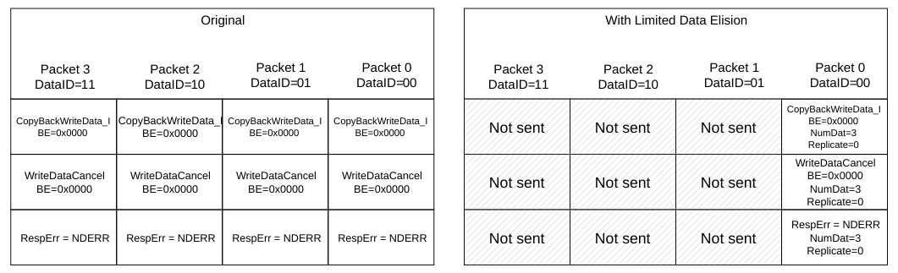

图 B2.42：CopyBackWriteData_I、WriteDataCancel 或 NDERR 数据总线宽度示例

#### B2.9.6 Atomic 事务中的 Size、地址与数据对齐

本节描述 Atomic 事务的数据大小与对齐要求。本节包含以下小节：

- B2.9.6.1 Size
- B2.9.6.2 地址与数据对齐
- B2.9.6.3 端序

##### B2.9.6.1 Size

数据包的 Size 字段指定 Atomic 事务的数据总大小。

对于 AtomicCompare 事务，数据大小是 Compare 和 Swap 数据值之和。

表 B2.18 给出了允许的数据大小，以及每种 Atomic 事务类型的出站与入站有效数据大小之间的关系。响应 AtomicCompare 事务而返回的数据值的大小，是相关 Request 数据包中 Size 字段所指定字节数的一半。

表 B2.18：Atomic 事务的出站与入站数据大小

| Atomic 事务 | 出站（字节） | 入站 |
| --- | --- | --- |
| AtomicStore | 1、2、4 或 8 | - |
| AtomicLoad | 1、2、4 或 8 | 与出站相同 |
| AtomicSwap | 1、2、4 或 8 | 与出站相同 |
| AtomicCompare | 2、4、8、16 或 32 | 出站大小的一半 |

##### B2.9.6.2 地址与数据对齐

在 AtomicStore、AtomicLoad 和 AtomicSwap 事务中：

- 字节地址与出站数据大小对齐。
- 数据字节在 NonCopyBackWriteData 或任意 CompData 数据包中的位置与该操作的端序一致，端序由请求的 Endian 字段指定。
- 大端数据是字节不变的。

与 AtomicCompare 事务相关联的写数据，其提供方式与对齐到出站数据大小的事务相同。

在 AtomicCompare 事务中：

- 数据包中的字节地址必须对齐到入站数据大小，入站数据大小等于出站数据大小的一半。

AtomicCompare 事务中的两个数据值按以下方式放置在数据字段中：

- Compare 和 Swap 数据值被拼接在一起，所得的数据载荷在 Data 数据包中对齐到出站数据大小。
- Compare 数据始终位于被寻址的字节位置。
- Swap 数据始终位于有效数据的另一半中。

对于任意给定的 Compare 数据地址，Swap 数据地址可以通过反转 Compare 数据地址中的 bit[n] 来确定，其中：

n = log2(Compare 数据的大小，以字节为单位)

###### B2.9.6.2.1 对齐示例

图 B2.43 给出了不同地址与不同 Data 大小时的数据放置示例。

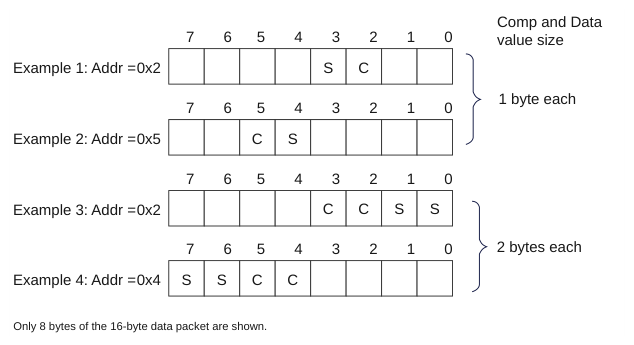

图 B2.43：AtomicCompare 事务的数据值打包

在图 B2.43 中，示例 1 显示被寻址的字节位置为 0x2，数据的总大小为 2 字节。在这种情况下，Compare 和 Swap 数据必须放置在包含该被寻址位置、且对齐到 2 字节边界的地址位置中，即地址 0x2 至 0x3。Compare 数据放置在位置 0x2，Swap 数据放置在位置 0x3。

> **注意**
>
> Swap 数据的地址可以通过反转 Compare 数据地址的 bit[0] 来确定。之所以反转 bit[0]，是因为 Compare 数据和 Swap 数据的大小均为 1 字节。

在图 B2.43 中，示例 3 显示被寻址位置为 0x2，数据的总大小为 4 字节。在这种情况下，Compare 和 Swap 数据必须放置在包含该被寻址位置、且对齐到 4 字节边界的地址位置中，即地址 0x0 至 0x3。Compare 数据放置在位置 0x2，Swap 数据放置在位置 0x0。

> **注意**
>
> Swap 数据的地址可以通过反转 Compare 数据地址的 bit[1] 来确定。之所以反转 bit[1]，是因为 Compare 数据和 Swap 数据的大小均为 2 字节。

##### B2.9.6.3 字节序

原子操作所作用的数据可以采用小端或大端格式。对于 ADD、MAX 和 MIN 等算术操作，执行该操作的组件需要知道数据的格式。

数据的字节序格式由 Atomic 事务 Request 数据包中的 Endian 位定义。参见 B13.10.30 Endian。

#### B2.9.7 关键数据块标识符

CCID 字段用于标识事务请求中最关键的数据字节。

CCID 字段必须与原始请求的 Addr[5:4] 值匹配。包含多个数据包的事务必须对所有数据包使用相同的 CCID 值。

当读数据或写数据被互连重排序时，通过将 CCID 值与 DataID 值进行比较，CCID 字段可以快速标识事务中最关键的字节。当两个值匹配时，正在传输的数据字节即为关键字节。

需要匹配的位取决于数据总线宽度：

- 对于 128 位数据总线宽度，关键数据块的 CCID 与 DataID 位必须匹配。
- 对于 256 位数据总线宽度，仅最高有效的 CCID 与 DataID 位必须匹配，以识别关键

数据块。

#### B2.9.8 关键数据块优先回绕顺序

允许但不要求数据发送方（Sender of Data）按关键数据块优先回绕顺序发送事务的各个数据包。

接口属性 CCF_Wrap_Order 定义了发送方的能力，以及接收方所提供的保证：

- 发送方的 CCF_Wrap_Order：

True 发送方指示数据包可以按关键数据块优先回绕顺序发送。

False 发送方指示数据包不能按关键数据块优先回绕顺序发送。

- 互连处的 CCF_Wrap_Order：

True 互连指示数据包保证维持事务被接收时的顺序。

False 互连指示不保证数据包维持事务被接收时的顺序。

- 非互连的接收方处的 CCF_Wrap_Order：

True 接收方要求数据包按关键数据块优先回绕顺序接收。

False 接收方不要求数据包按关键数据块优先回绕顺序接收。

如果系统中某些组件不支持按关键数据块优先回绕顺序发送数据包，则数据接收方不得依赖数据按关键数据块优先回绕顺序接收。

> **注意**
>
> 在设计阶段，CCF_Wrap_Order 参数可以帮助组件判断是否需要按关键数据块优先回绕顺序发送数据包。例如，如果组件知道自己连接到一个乱序互连，则可以通过不按关键数据块优先回绕顺序返回数据包来简化其数据包通路。

如果互连的 CCF_Wrap_Order 属性设置为 True，则与该互连对接的组件在具备相应能力时可以按关键数据块优先回绕顺序发送数据包。由于先接收到关键数据块，接收方随后可以利用可能的延迟优化。

#### B2.9.9 Data Beat 排序

当跨越互连传输时，允许对事务内的数据包进行重排序。但是，数据包的原始源端允许但不要求以关键数据块优先的回绕顺序提供数据包。参见 B2.9.8 关键数据块优先回绕顺序。

> **注意**
>
> 关键数据块优先回绕顺序可确保在使用有序互连时，能够以最高效的方式与不支持数据重排序的协议（如 AXI）对接。

回绕顺序定义如下：

Start_Address = Addr

Number_Bytes = 2Size

INT(x) = x 向下取整的整数值

Aligned_Address = (INT(Start_Address / Number_Bytes)) x Number_Bytes

Lower_Wrap_Boundary = Aligned_Address

Upper_Wrap_Boundary = Aligned_Address + Number_Bytes - 1

为维持回绕顺序，顺序必须为：

1. 第一个数据包必须对应于事务的 Start_Address 所指定的数据字节。2. 后续数据包必须对应于递增的字节地址，直至 Upper_Wrap_Boundary。3. 后续数据包必须对应于 Lower_Wrap_Boundary。4. 后续数据包必须对应于递增的字节地址，直至 Start_Address。

> **注意**
>
> 若所需的字节已包含在前一步骤中，则维持回绕顺序的某些步骤可能重叠，因而并非必需。

#### B2.9.10 数据传输示例

本节给出若干数据传输要求的示例。

在大多数示例中，事务的大小为 64 字节，数据总线宽度为 128 位。每个事务需要 4 个数据包。

在以下示例中，随附的文字重点说明了若干值得关注的方面。这些示例并不旨在描述所有方面。

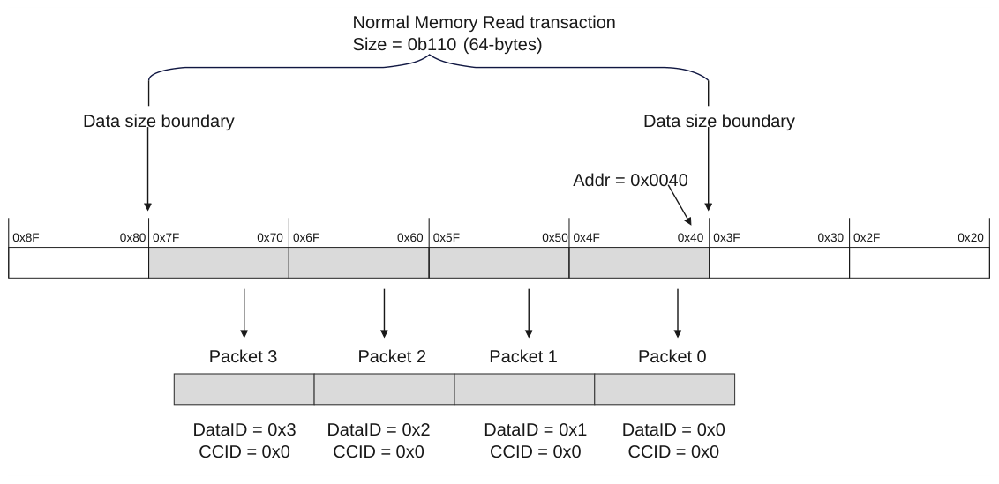

图 B2.44：来自对齐地址的 Normal 内存 64 字节读事务

在图 B2.44 中：

- 如 Packet 0、Packet 1、Packet 2 和 Packet 3 所示，数据包的顺序为

遵循回绕顺序。

- 每个数据包的 DataID 都会变化，而 CCID 字段保持不变。
- 包含由事务地址所指定的数据字节的那个数据包，其 CCID 与 DataID 字段取值相同。

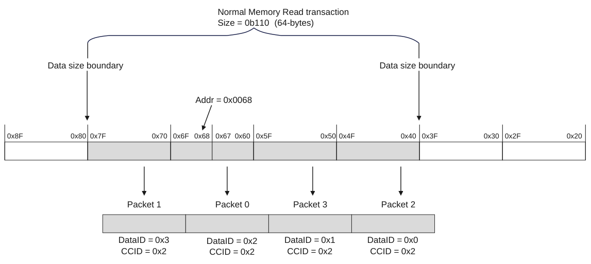

图 B2.45：来自非对齐地址的 Normal 内存 64 字节读事务

在图 B2.45 中：

- 如 Packet 0、Packet 1、Packet 2 和 Packet 3 所示，数据包的顺序为

遵循回绕顺序。

- 每个数据包的 DataID 都会变化，而 CCID 字段保持不变。
- 包含由事务地址所指定的数据字节的那个数据包，其 CCID 与 DataID 字段取值相同。

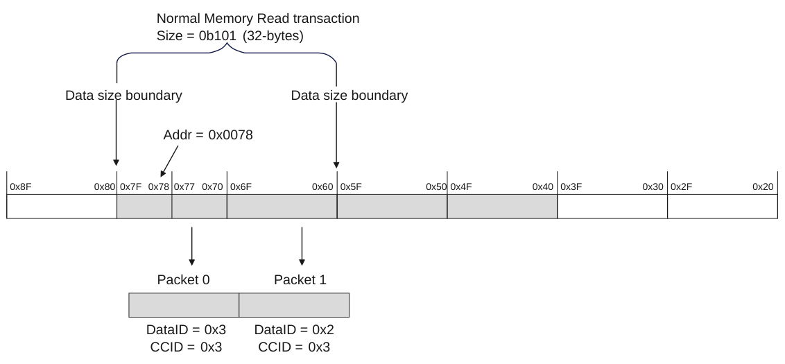

图 B2.46：来自非对齐地址的 Normal 内存 32 字节读事务

在图 B2.46 中：

- 事务的大小为 32 字节，数据总线宽度为 128 位，因此得到 2 个数据包。
- 如 Packet 0 和 Packet 1 所示，数据包的顺序遵循回绕顺序。

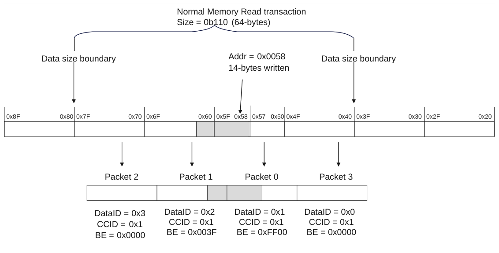

图 B2.47：来自非对齐地址的 Normal 内存 14 字节读事务

在图 B2.47 中：

- 如 Packet 0、Packet 1、Packet 2 和 Packet 3 所示，数据包的顺序为

遵循回绕顺序。

- 每个数据包的 DataID 都会变化，而 CCID 字段保持不变。
- 包含由事务地址所指定的数据字节的那个数据包，其 CCID 与 DataID 字段取值相同。
- 如 BE 位所示，内存中写入了十四个连续字节。不过，其他 BE 位组合也是允许的。参见 B2.9.3 字节使能。

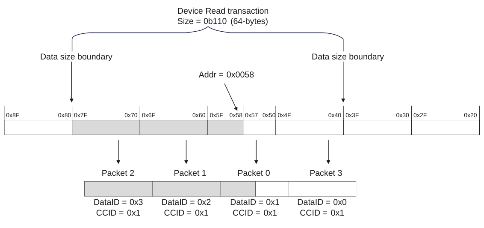

图 B2.48：来自非对齐地址的 Device 读事务

在图 B2.48 中：

- 阴影区域表示事务中的有效字节。有效字节从事务地址一直延伸到下一个 Size 边界。
- 该事务包含一个不含有效数据的数据包的传输。

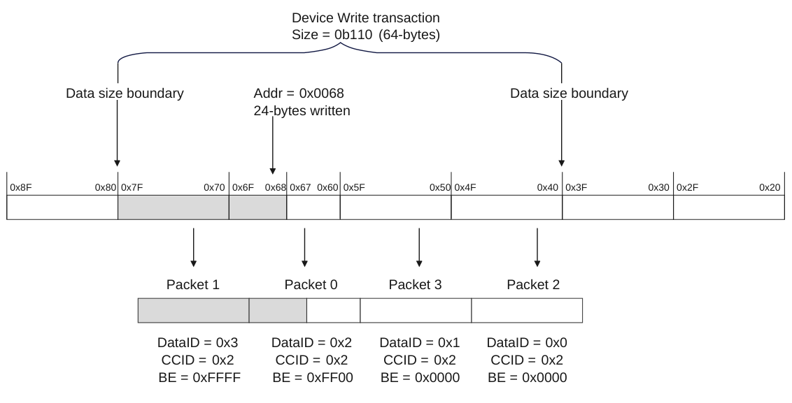

图 B2.49：发往非对齐地址的 Device 写事务

在图 B2.49 中：

- 对于从事务地址到下一个 Size 边界的字节，BE 位允许为 1。并不要求满足该条件的全部 BE 位都为 1。
- 起始地址以下的字节，其 BE 位必须为 0。

### B2.10 Request Retry

可选的 Request Retry 机制确保当请求到达完成方时，该请求可以被接受，也可以被给出 RetryAck 响应。

请求方或完成方是否支持 Request Retry 机制，由组件的 Retry_Support 属性决定。

Request Retry 可防止阻塞 REQ 通道。DAT、RSP 或 SNP 通道上的消息没有重试机制。例如，对 Stash 侦听作出的 DataPull 响应不能被重试。

> **注意**
>
> Request Retry 特性为 REQ 通道上的流量分离提供原生支持，但需要额外的存储和跟踪逻辑。在某些特定用例中，不支持 Retry 而改用 Resource Planes 可能更为有利。

Request Retry 与 Resource Planes 是正交的特性，可以独立使用，也可以组合使用。

更多信息，请参见 B14.2.1.2 Flow control with Resource Planes。

Request Retry 不适用于 PrefetchTgt 事务。PrefetchTgt 事务不能被重试，因为该请求没有相关联的响应。

无论 Retry_Support 属性如何，请求方在初次发送请求时必须将 AllowRetry 字段设置为 1。支持 Request Retry 的请求方必须保留该请求的详细信息，直到收到表明该请求已被接受的响应，或收到 RetryAck 为止。

支持 Request Retry 的完成方可以向无法接受的请求给出 RetryAck 响应。通常，当资源有限且存储不足的完成方在较早的事务完成之前无法接受当前请求时，会给出 RetryAck 响应。

当完成方发出 RetryAck 响应时，它必须：

- 记录原始请求的 SrcID。
- 确定并记录处理该请求所需的协议信用（P-Credit）类型。该类型编码

在 RetryAck 响应的 PCrdType 字段中。

- 当所需资源变为可用时，向请求方发出 PCrdGrant 响应。PCrdGrant

响应必须授予 PCrdType 字段所指示的 P-Credit，以向请求方表明该事务可以被重试。

> **注意**
>
> 不存在请求信用的显式机制。被给出 RetryAck 响应的事务会隐式地请求一个信用。

响应可能被重排序，使得请求方在收到该事务的 RetryAck 响应之前先收到 PCrdGrant。在这种情况下，请求方必须记录所收到的信用，包括信用类型。当收到 RetryAck 响应时，请求方可以恰当地分配该信用。

> **注意**
>
> 通常，RetryAck 与 PCrdGrant 响应之间的延迟远长于互连重排序所造成的任何延迟。预计 PCrdGrant 很少相对于 RetryAck 发生重排序。

当请求方收到 PCrdGrant 时，可以在第二次尝试中带着信用分配指示重新发送该请求。当 AllowRetry 字段为 0 时执行信用分配指示。执行该事务的第二次尝试保证会被接受。

重新发送的事务必须具有与原始请求相同的字段值，除非该字段不适用或属于以下之一：

- QoS
- TgtID，参见 B3.3.1 TgtID determination for Request messages。
- TxnID
- ReturnTxnID，用于：
- 从归属节点到从属节点的 ReadNoSnp 和 ReadNoSnpSep，且未使用 DMT 流。
- 从归属节点到从属节点的 WriteNoSnp 或 Combined Write，且未使用 DWT 流。
- DataTarget
- AllowRetry，其必须为 0。
- PCrdType，其必须设置为原始事务的 Retry 响应中的值。
- TraceTag
- RSVDC
- CAH
- PrefetchTgtHint

重新发送的事务：

- 必须使用相同的 REQ 通道 RP。
- 允许（但不要求）使用与专用或共享类别不同的信用类型。

有关 Resource Planes 的更多信息，请参见 B14.2.1.2 Flow control with Resource Planes。

如果 CopyBack 写收到了 RetryAck，且数据随后被侦听置为无效，则在收到 PCrdGrant 时，请求方可以：

- 丢弃该写请求，并用 PCrdReturn 消息归还所收到的信用。
- 在知道后续数据响应为 CopyBackWriteData_I 的情况下，将 AllowRetry 设置为 0 发送该写请求。

信用与特定事务之间没有固定关系。如果请求方针对不同事务收到了多个 RetryAck 响应，随后又收到一个信用，则不存在固定的信用分配。请求方可以从收到具有该特定协议信用类型的 RetryAck 响应的事务列表中，自由选择最合适的事务。

Retry 机制最多支持 16 种不同的信用类型。这使完成方可以为不同的资源使用不同的信用类型。例如，完成方可以为与读事务相关联的资源使用一种信用类型，为写事务使用另一种信用类型。使用不同的信用类型使完成方能够通过控制哪些被重试的请求可以再次发送，来高效地管理其资源。

支持 Request Retry 的完成方必须能够记录所有 RetryAck 响应，以确保信用被正确分发。如果完成方使用多于一种信用类型，则必须记录针对每种信用类型已给出的 RetryAck 响应。对于每个 RP，完成方必须提供一种不依赖于任何其他 RP 进展的信用类型，或者允许该 RP 与其他 Resource Planes 共享一种信用类型，同时保证该 RP 的前向进展。

仅当请求方收到带有正确 PCrdType 的 PCrdGrant 时，才可重试该事务。

> **注意**
>
> 如果支持 Request Retry 的完成方只使用一种信用类型，建议使用 PCrdType 值 0b0000。参见 B2.10.2.2 PCrdType。

支持 Request Retry 的请求方必须限制所发出事务的数量，使完成方永远不需要跟踪超过 1024 个需要 PCrdGrant 响应的事务。这通过将每个请求方的最大未完成事务数限制为 1024 来实现。

就事务 Retry 流程而言，多请求被视为单一实体。也就是说，如果多请求事务必须重试，则单个 RetryAck 消息和 PCrdGrant 消息即可覆盖整个事务。

从事务请求首次发出的那个时钟周期起，直到发生以下任一情况为止，该事务一直处于未完成状态：

- 事务完全完成，其判定依据是该事务预期的以下所有响应均已返回：
- ReadReceipt
- CompData
- RespSepData
- DataSepResp
- DBIDResp*
- Comp、CompCMO、CompPersist 和 CompStashDone
- CompDBIDResp
- 收到 RetryAck 和 PCrdGrant，并且满足以下任一条件：
- 使用相应 PCrdType 的信用额度进行重试，并随后按所有响应均已返回的判定条件完全完成。
- 被取消，并使用 PCrdReturn 消息归还所收到的信用额度。

请求方可以在以下任一时刻重用某个请求所使用的 TxnID 值：

- 一旦收到该请求的 RetryAck 响应。
- 一旦收到该请求的所有必需响应，前提是所收到的响应为非 RetryAck 响应。

每个事务请求都包含一个 QoS 值，完成方可以使用该值在资源可用时影响信用额度的分配。更多细节参见 B11.1 服务质量（QoS）机制。

#### B2.10.1 信用额度归还

请求方有可能被分配到多于所需的 P-Credit。

本规范未定义这种情况何时会发生，但有两种典型场景：

- 事务在首次尝试与可使用 P-Credit 重新发送请求的时刻之间被取消。
- 事务被以递增的 QoS 值多次请求，但该事务只需完成一次。

> **注意**
>
> 如果请求方在第一个请求收到 RetryAck 响应之前发出第二个请求，则这两个事务的发生都必须是可接受的。然而，举例来说，对于外设的访问，此行为通常是不可接受的。

请求方通过使用 PCrdReturn 事务归还信用额度。这实际上是一个 No Operation 事务，它使用不再需要的信用额度。该事务用于通知完成方：对于给定的 PCrdType，所分配的资源已不再需要。

任何不需要的信用额度都必须及时归还。

> **注意**
>
> 任何未使用的预分配信用额度都必须归还，以避免组件抱着日后可能使用的期望而一直占用信用额度。此类行为很可能导致资源使用效率低下，并使系统性能分析变得困难。

#### B2.10.2 事务 Retry 机制

以下各节描述 Retry 机制所用的请求事务字段。

##### B2.10.2.1 AllowRetry

AllowRetry 字段指示该请求事务是否可以被给予 RetryAck 响应。请求方或完成方对 Retry Request 机制的支持由组件属性 Retry_Support 决定。AllowRetry 的取值编码见表 B13.25。事务首次发送时，AllowRetry 字段必须为 1。

当事务使用预分配的 P-Credit 时，AllowRetry 字段必须为 0。

使用 PrefetchTgt 事务时，AllowRetry 字段必须为 1。从属节点不得对 PrefetchTgt 事务以 RetryAck 响应进行响应。

##### B2.10.2.2 PCrdType

PCrdType 字段表示与该请求相关联的信用类型，其确定方式如下：

- 对于 Request 事务：
- 如果 AllowRetry 字段为 1，则 PCrdType 字段必须为 0b0000。
- 如果 AllowRetry 字段为 0，则 PCrdType 字段必须设置为事务首次尝试时 Completer 在

RetryAck 响应中返回的值。

- PCrdReturn 事务必须将信用类型设置为正在被归还的信用类型的值。

PCrdType 的取值编码参见 B13.10.37 Protocol Credit Type, PCrdType。

- 对于只有单一信用类别、或未实现信用类型分类的目的地，

建议将 PCrdType 字段设置为 0b0000。

> **注意**
>
> Completer 为 PCrdType 分配的值是 IMPLEMENTATION SPECIFIC 的。

Completer 必须实现一种饥饿预防机制，以确保所有事务，无论其 QoS 值或所需信用类型如何，最终都能向前推进，即使是在相当长的时间跨度内。这一点是通过确保最终为每个已收到 RetryAck 响应的事务授予信用来实现的。关于为 QoS 目的而进行信用分配的更多细节，参见 B11.1 Quality of Service (QoS) mechanism。

#### B2.10.3 Transaction Retry flow

图 B2.50 展示了一个典型的 Transaction Retry 流程。

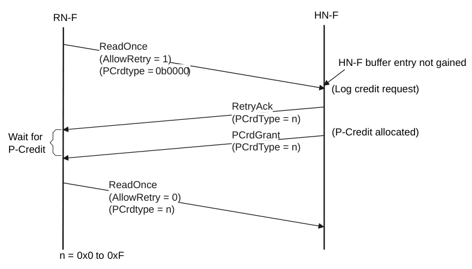

图 B2.50：Transaction Retry 流程

图 B2.50 所展示的步骤如下：

1. RN-F 向 HN-F 发送一个 ReadOnce 请求。
- 该请求是在没有信用的情况下发出的，因此 AllowRetry 为 1。这意味着 PCrdType 必须为 0b0000。
2. HN-F 收到该请求，并由于该请求未能在 HN-F 处获得缓冲条目而发送 RetryAck 响应。
- 该请求被记录，并在 HN-F 处确定一个 PCrdType。
3. 当为该事务分配了资源后，HN-F 使用 PCrdGrant 响应发送一个 P-Credit。
- PCrdGrant 中包含为原始请求分配的 PCrdType。
4. RN-F 以 AllowRetry = 0 重新发送该 ReadOnce 事务。
- 该请求使用 P-Credit，并将 PCrdType 字段设置为为原始请求分配的值。

允许 Completer 在发送相关联的 RetryAck 响应之前先发送 PCrdGrant，但通常不期望如此。

> **注意**
>
> Requester 可能会在 RetryAck 之前先收到 PCrdGrant。

在该事务同时收到 RetryAck 响应和合适的 P-Credit 之前，该事务不得被重新发送。

Chapter B3

## B3 Network Layer

本章描述用于确定目的节点的节点 ID 所需的网络层。它包含以下各节：

- B3.1 System Address Map, SAM
- B3.2 Node ID
- B3.3 TgtID determination
- B3.4 Network layer flow examples

### B3.1 System Address Map, SAM

Requester 必须具有一个 System Address Map（SAM），以确定请求的 TgtID。Requester 可以是 Request Node 或 Home Node。SAM 的作用范围可以简单到为所有发出的请求提供一个固定的节点 ID 值。

SAM 的确切格式与结构是 IMPLEMENTATION DEFINED 的，不属于本规范的范围。

SAM 必须提供对整个地址空间的完整译码。建议将任何不对应于物理组件的地址发送给能够提供适当错误响应的代理。

### B3.2 Node ID

连接到互连上的某个 Port 的每个组件都被分配一个节点 ID，用于标识通过互连通信的数据包的源和目的地。一个 Port 可以被分配多个节点 ID。一个节点 ID 值只能分配给单个 Port。

NodeID 字段的宽度可在 7 到 16 位之间配置，其值由 NodeID_Width 属性确定。

对于给定的实现，该宽度可以配置为该范围内的任意固定值，并且该值必须在所有 NodeID 字段中保持一致。

为系统中的每个节点定义并分配节点 ID 是 IMPLEMENTATION DEFINED 的，不属于本规范的范围。

### B3.3 TgtID 的确定

本节描述不同消息类型的 TgtID 是如何确定的。本节包含以下小节：

- B3.3.1 请求消息的 TgtID 确定
- B3.3.2 响应消息的 TgtID 确定
- B3.3.3 侦听请求消息的 TgtID 确定

#### B3.3.1 请求消息的 TgtID 确定

对于来自 Request Node 的请求中的 TgtID 映射，要求 SAM 逻辑存在于 Request Node 或互连中。在互连中实现的情况下，TgtID 可以在由 Request Node 提供的请求包中被重新映射。

Request 消息的 TgtID 使用 SAM 逻辑按以下方式确定。

除 PCrdReturn 之外：

- 如果请求未使用预分配信用（pre-allocated credit），则 TgtID 由以下方式确定：
- 对于 DVMOp，由 Opcode 确定。
- 对于所有其他请求，由地址到节点 ID 的映射确定。

PrefetchTgt 使用的地址到节点 ID 映射器与其他请求不同。来自同一 Request Node、指向同一地址的两个请求，若其中一个是 PrefetchTgt，则它们的目标节点不同。PrefetchTgt 始终以 Subordinate Node 为目标。来自 Request Node 的使用地址到节点 ID 映射器的所有其他请求均以 Home Node 为目标。

- 如果请求使用预分配信用，则 Request 的 TgtID 必须取自以下任一者：作为对原始 Request 消息的响应而提供的

RetryAck 的 SrcID，或原始请求的 TgtID。

对于 PCrdReturn：

- 由 Request Node 提供的 TgtID 必须与先前的 PCrdGrant 中所包含的 SrcID 匹配，该 PCrdGrant

提供了正在被归还的信用。

Request Node 必须预期互连会重新映射请求的 TgtID。

对于来自 Request Node 的事务，除目标为 SN-F 的 PrefetchTgt 之外，可侦听事务预期以 HN-F 为目标，不可侦听事务以 HN-I 或 HN-F 为目标。可侦听事务以 HN-I 为目标也是合法的，例如由于软件编程错误所致。在这种情况下，HN-I 需要以符合协议的方式响应该事务，但不保证一致性。

Home Node 也可以使用地址映射逻辑来确定每个请求的目标 Subordinate Node ID。

#### B3.3.2 响应消息的 TgtID 确定

响应包是作为所接收消息的结果而发出的。响应包中的 TgtID 必须与导致该响应被发送的所接收消息中的 SrcID、HomeNID、ReturnNID 或 FwdNID 之一匹配。

表 B3.1 列出了每种 Response 消息类型其响应包 TgtID 的来源，以及所接收消息中决定该 TgtID 的字段。

表 B3.1：响应包 TgtID 的来源

| Response message | 从 Home Node 获取的 TgtID | Subordinate Node | Request Node |
| --- | --- | --- | --- |
| RetryAck | Request.SrcID | Request.SrcID | - |
| PCrdGrant | Request.SrcID | Request.SrcID | - |
| ReadReceipt | Request.SrcID | Request.SrcID | - |
| RespSepData | Request.SrcID 或 SnpResp*.SrcIDa | - | - |
| Comp | Request.SrcID | Request.SrcID | - |
| CompCMO | Request.SrcID | Request.SrcID | - |
| DataSepResp | Request.SrcID 或 SnpResp*.SrcIDa | Request.ReturnNID | - |
| CompData | Request.SrcID 或 SnpResp*.SrcIDa | Request.ReturnNID | Snoop.FwdNID |
| CompAck（读） | - | - | Comp.SrcID 或 RespSepData.SrcID 或 CompData.HomeNID |
| CompAck（写） | - | - | Comp.SrcID 或 DBIDResp*.SrcID 或 CompDBIDResp.SrcID |
| CompDBIDResp | Request.SrcID | Request.SrcIDb |  |
| DBIDResp | Request.SrcID | 若 Request.DoDWT == 0 则：Request.SrcID，或若 Request.DoDWT == 1 则：Request.ReturnNID | - |
| DBIDRespOrd | Request.SrcID | - | - |
| WriteData | - | - | DBIDResp*.SrcID 或 CompDBIDResp.SrcID |
| NonCopyBackWriteDataCompAck | - | - | Comp.SrcID 或 DBIDResp*.SrcID 或 CompDBIDResp.SrcID |
| Persist | Request.SrcID | Request.ReturnNID | - |
| CompPersist | Request.SrcID | Request.SrcIDb | - |
| StashDone | Request.SrcID | - | - |
| CompStashDone | Request.SrcID | - | - |
| TagMatch | Request.SrcID | Request.ReturnNID | - |
| SnpResp*c | - | - | Snoop.SrcID |

a 对于 Data Pull 请求，Snoop 响应可以是 SnpResp 或 SnpRespData 或 SnpRespDataPtl。 b 仅当 Request.SrcID = Request.ReturnNID 时才允许此响应，包括 Request.DoDWT = 1 的情况。 c SnpResp、SnpRespData、SnpRespDataPtl、SnpRespFwded 和 SnpRespDataFwded。

#### B3.3.3 侦听请求消息的 TgtID 确定

侦听请求不包含 TgtID。协议未定义用于寻址并向目标发送 Snoop request 的架构机制。该机制预期为实现特定（IMPLEMENTATION SPECIFIC）的，因此不在本规范的范围之内。

### B3.4 网络层流示例

本节展示网络层的各种事务流。它包含以下小节：

- B3.4.1 简单流
- B3.4.2 基于互连的 SAM 的流
- B3.4.3 基于互连的 SAM 且带 Retry 请求的流

以下各图中包含术语“Dec”，它表示 Decode。

#### B3.4.1 简单流

图 B3.1 是一个简单事务流的示例，展示了如何为请求和响应确定 TgtID。

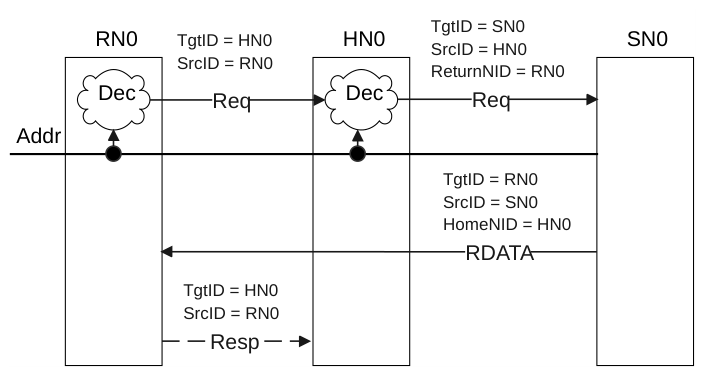

图 B3.1：不进行重映射时的 TgtID 分配

图 B3.1 中不进行重映射时的 TgtID 分配步骤如下：

1. RN0 使用 RN0 内部的 SAM 发送一个 TgtID 为 HN0 的请求。
- 互连不对节点 ID 进行重映射。
2. HN0 查询内部 SAM 以确定目标 Subordinate Node。
3. SN0 接收该请求并发送数据响应。
- 数据响应数据包的 TgtID 由请求中的 ReturnNID 推导得出。
4. RN0 接收来自 SN0 的数据响应。
5. 如有必要，RN0 发送 TgtID 为 HN0 的 CompAck 响应，该 TgtID 由数据响应数据包中的 HomeNID 推导得出，以完成事务。

#### B3.4.2 基于互连的 SAM 的流

图 B3.2 展示了在互连中对 TgtID 进行重映射的情况。

> **注意**
>
> 仅对来自 Request Node 的请求的 TgtID 进行重映射。事务流中所有其他数据包中的 TgtID 均以与 B3.4.1 简单流类似的方式确定。

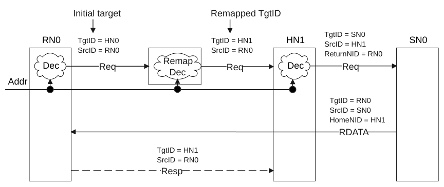

图 B3.2：带重映射逻辑的 TgtID 分配

图 B3.2 中带重映射逻辑的 TgtID 分配步骤如下：

1. RN0 使用 RN0 内部的 SAM 发送一个 TgtID 为 HN0 的请求。
2. 互连将请求的 TgtID 从 HN0 重映射为 HN1。SrcID 保持设置为原始请求方 RN0。
3. HN1 查询内部 SAM 以确定目标 Subordinate Node。ReturnNID 被设置为与原始 Requester（RN0）匹配。
4. SN0 接收该请求并发送数据响应。
- 数据响应数据包的 TgtID 由请求中的 ReturnNID 推导得出，其中 HomeNID 被设置为与

重映射后的归属节点匹配。

5. RN0 接收来自 SN0 的数据响应。
6. 如有必要，RN0 发送 TgtID 为 HN1 的 CompAck 响应，该 TgtID 由数据响应数据包中的 HomeNID 推导得出，以完成事务。

#### B3.4.3 基于互连的 SAM 且带 Retry 请求的流

图 B3.3 展示了请求被重试的情况。

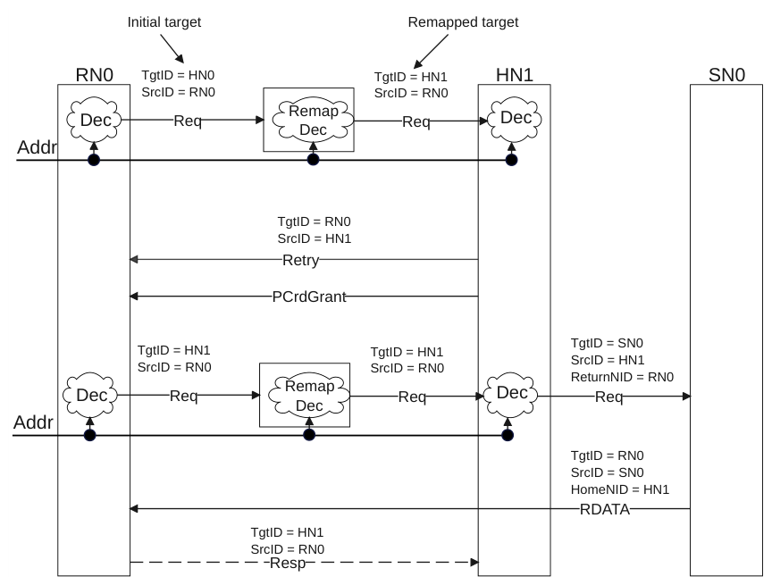

图 B3.3：TgtID 的重映射与被重试的请求

图 B3.3 中对 TgtID 进行重映射并重试请求的步骤如下：

1. 互连将 RN0 提供的 TgtID 重映射为 HN1。
2. 该请求收到 RetryAck 响应。
- RetryAck 与 PCrdGrant 响应的 TgtID 信息取自所接收请求中的 SrcID。
3. 一旦收到 RetryAck 和 PCrdGrant 两个响应，RN0 就重新发送该请求。
- 重试请求中的 TgtID 与所收到 RetryAck 中的 SrcID 或原始请求中的 TgtID

相同。该 TgtID 必须再次经过重映射逻辑。

4. 事务流中其余数据包获取 TgtID 的方式与 B3.4.2 基于互连的 SAM 的流类似。

第 B4 章

## B4 一致性协议

本章描述一致性协议，包含以下小节：

- B4.1 缓存行状态
- B4.2 请求类型
- B4.3 侦听请求类型
- B4.4 请求事务及对应的侦听请求
- B4.5 响应类型
- B4.6 静默缓存状态转换
- B4.7 请求方处的缓存状态转换
- B4.8 Snoopee 处的缓存状态转换
- B4.9 随侦听响应返回数据
- B4.10 不转换到 SD
- B4.11 冒险条件

### B4.1 缓存行状态

协议节点访问缓存行时所需的操作由缓存行状态决定。协议定义了以下缓存行状态：

I 无效：该缓存行不存在于缓存中。

UC 独占干净：

- 该缓存行仅存在于本缓存中。
- 该缓存行相对于内存未被修改。
- 该缓存行可以在不通知其他缓存的情况下被修改。
- 在响应请求数据的侦听时，允许（但并非必须）对该缓存行执行以下操作：
- 在被请求时返回归属节点。
- 在侦听指示时直接转发给请求方。

UCE 独占干净空：

- 该缓存行仅存在于本缓存中。
- 该缓存行处于独占状态，但没有任何数据字节有效。
- 该缓存行可以在不通知其他缓存的情况下被修改。
- 在响应请求数据的侦听时，该缓存行不得：
- 即使被请求也返回归属节点。
- 即使侦听指示也直接转发给请求方。

UD 独占脏：

- 该缓存行仅存在于本缓存中。
- 该缓存行相对于内存已被修改。
- 该缓存行在驱逐时必须写回下一级缓存或内存。
- 该缓存行可以在不通知其他缓存的情况下被修改。
- 在响应请求数据的侦听时，该缓存行：
- 必须在被请求时返回归属节点。
- 预期（但并非必须）在侦听指示时直接转发给请求方。

UDP 独占脏部分：

- 该缓存行仅存在于本缓存中。
- 该缓存行是独占的。该缓存行可以有一些字节有效，其中“一些”包括没有字节或全部字节。
- 该缓存行相对于内存已被修改。
- 当该缓存行被驱逐时，来自下一级缓存或内存的数据必须与被驱逐的缓存行合并，以构成完整的有效缓存行。
- 该缓存行可以在不通知其他缓存的情况下被修改。
- 在响应请求数据的侦听时，该缓存行必须：
- 返回归属节点。
- 即使侦听指示也不直接转发给请求方。

SC 共享干净：

- 其他缓存可能持有该缓存行的共享副本。
- 该缓存行相对于内存可能已被修改。
- 在驱逐时，该缓存不负责将该缓存行写回内存。
- 只有使任何共享副本失效并获得该缓存行的独占所有权后，才能修改该缓存行。
- 在响应请求数据的侦听时，该缓存行：
- 如果未置位 RetToSrc 位，则不得返回数据。
- 对于非转发（Non-forwarding）侦听，建议（但并非必须）返回数据。
- 对于 RetToSrc 置为 1 且数据正在被转发的转发（Forwarding）侦听，必须返回数据。
- 预期（但并非必须）在侦听指示时直接转发给请求方。

SD 共享脏：

- 其他缓存可能持有该缓存行的共享副本。
- 该缓存行相对于内存已被修改。
- 该缓存行在驱逐时必须写回下一级缓存或内存。
- 只有使任何共享副本失效并获得该缓存行的独占所有权后，才能修改该缓存行。
- 在响应请求数据的侦听时，该缓存行：
- 必须在被请求时返回归属节点。
- 预期（但并非必须）在侦听指示时直接转发给请求方。

允许缓存只实现这些状态的一个子集。

#### B4.1.1 空缓存行所有权

空缓存行是指以 Unique 状态持有的缓存行，用于阻止该缓存行的其他副本存在。空缓存行中没有任何数据字节是有效的。该缓存行状态为 UCE 或 UDP。

以下是可能出现空缓存行所有权的示例：

- 请求方可以在开始写之前有意获取一个空缓存行，以节省系统带宽。预期要写入某个缓存行的请求方可以获取一个具有存储许可的空缓存行，而不是获取该缓存行的一个有效副本。
- 如果请求方在请求存储许可时持有该缓存行的副本，则请求方可以转换到空状态。在请求方获得存储许可之前，该缓存行的副本被无效化。在该请求完成时，这导致请求方拥有一个具有存储许可的空缓存行。

#### B4.1.2 具有部分 Dirty 数据的缓存行所有权

一旦获得无数据缓存行的所有权，请求方被允许（但非必须）写入该缓存行。如果请求方修改了该缓存行的一部分，则该缓存行保持部分独占脏。该缓存行状态为 UDP。

### B4.2 请求类型

协议请求分类如下：

- 对于读请求事务，向请求方提供数据响应。
- 对于无数据请求事务，不向请求方提供数据响应。
- 对于写请求事务，数据从请求方移出。
- 对于 Combined Write 请求事务，数据从请求方移出，并执行缓存维护操作。
- 对于 Atomic 请求事务，数据从请求方移出，并且在某些请求类型中向请求方提供数据响应。
- 对于 Stash 请求事务，数据可以在系统内移动以提高性能。
- 其他请求事务：
- 不涉及系统中的任何数据移动。
- 可用于协助 DVM 维护。
- 可用于为后续的读请求预热内存控制器。

以下各小节列举了所产生的各事务及其特性。有关内存标记机制的描述，请参见第 B12 章 Memory Tagging。有关每个请求所允许的 MTE TagOp 取值的信息，请参见表 B16.24。有关请求通信节点的信息，请参见第 C2 章 Communicating Nodes。

> **注意**
>
> 任何预期以 HN-F（而非 HN-I）为目标的事务，以 HN-I 为目标都是合法的。这可能因事务的内存类型被错误分配而发生。要求 HN-I 以符合协议的方式响应该类事务。

#### B4.2.1 读事务

读事务具有以下共同特性：

- 除 MakeReadUnique 请求外，完成响应中必须包含数据。对于 MakeReadUnique，数据响应是可选的。
- 当提供数据响应时，所传输的数据可以来自归属节点、另一请求节点或从属节点。
- 在 Allocating Read 事务中，接收到的数据如果被缓存，则必须以系统一致的方式缓存。
- 在 Non-allocating Read 事务中，即 ReadNoSnp 和 ReadOnce*，接收到的数据预期不被缓存。如果被缓存，则数据不是以系统一致的方式缓存。
- 该请求可以导致请求方处的缓存状态变化。关于各读事务在请求方处的预期和允许的初始缓存状态，请参见表 B4.4；关于请求方处的最终缓存状态，请参见表 B4.5。
- 该请求可以导致系统中其他请求节点处的缓存状态变化。关于各读事务在对等请求节点处的预期和允许的缓存状态，请参见表 B4.6。

关于读事务中 Exclusive 属性的详细信息，请参见第 B6 章 Exclusive accesses。

ReadNoSnp 由请求节点向不可侦听地址区域发出的读请求。或者，由归属节点向任何地址区域发出，以获取所寻址数据的副本。有关所用的 DMT、Order 字段和 ExpCompAck 取值，请参见表 B2.6。

ReadNoSnpSep 由归属节点向从属节点发出的读请求，请求完成方仅发送数据响应。当使用分离的完成响应和数据响应来完成读事务时使用。

ReadOnce 向可侦听地址区域发出的读请求，以获取一致数据的快照。

ReadOnceCleanInvalid 向可侦听地址区域发出的读请求，以获取一致数据的快照。建议（但非要求）对该缓存行的其他缓存副本进行清理和无效化。如果 Dirty 副本被无效化，则必须写回内存。

> **注意**
>
> 当应用判定数据仍然 Valid、但在近期不会被使用时，使用 ReadOnceCleanInvalid 来代替 ReadOnce 或 ReadOnceMakeInvalid。

应用使用 ReadOnceCleanInvalid 可通过减少缓存污染来提高缓存效率。

使用 ReadOnceCleanInvalid 时应考虑以下事项：

- ReadOnceCleanInvalid 事务中的清理和无效化是一种提示。事务完成并不保证清理或移除所有缓存副本，因此它不能用作 CMO 的替代。
- 使用该事务可能导致缓存行被解除分配，因此如果该事务可能以系统中其他代理用于 Exclusive 访问的同一缓存行为目标，则需要谨慎。

ReadOnceMakeInvalid 向可侦听地址区域发出的读请求，以获取一致数据的快照。建议（但非要求）对该缓存行的其他缓存副本进行无效化。如果 Dirty 副本被无效化，则该缓存行无需写回内存。如果无效化提示被接受且 Dirty 副本未写回内存，则所有缓存副本都必须被无效化。

> **注意**
>
> 当应用判定缓存数据不会再被使用时，优先使用 ReadOnceMakeInvalid 而不是 ReadOnce 或 ReadOnceCleanInvalid 来获取数据值的快照。应用可以释放缓存，并且通过丢弃 Dirty 数据，避免不必要的写回内存。

使用 ReadOnceMakeInvalid 时应考虑以下事项：

- ReadOnceMakeInvalid 事务中的无效化是一种提示。事务完成并不保证移除所有缓存副本。该无效化提示不能用作 CMO 的替代。
- 使用该事务可能导致缓存行被解除分配，因此如果这些事务可能以系统中其他代理用于 Exclusive 访问的同一缓存行为目标，则需要谨慎。
- 使用 ReadOnceMakeInvalid 事务可能导致 Dirty 缓存行丢失。该事务的使用必须严格限制在已知 Dirty 缓存行丢失且无害的场景中。
- 对于 ReadOnceMakeInvalid 事务，要求缓存行的无效化在该事务的读数据响应之前提交。此时并不要求缓存行的无效化已经完成，但在此之后由任何代理发起的任何后续写事务，保证不会被该事务无效化。
- 必须以 I、UC 或 UD 状态向请求方提供数据。
- 请求方必须忽略响应中的缓存状态。

ReadClean 向可侦听地址区域发出的读请求，以获取缓存行的干净副本。如果请求方将该行分配到不支持脏缓存行的缓存（例如指令缓存）中，则可以使用该请求。必须仅以 UC 或 SC 状态向请求方提供数据。

ReadNotSharedDirty 向可侦听地址区域发出的读请求，以从该缓存行执行加载。必须仅以 UC、UD 或 SC 状态向请求方提供数据。不允许 SD 状态。

> **注意**
>
> 当请求方无法接受 SD 状态的数据时，使用 ReadNotSharedDirty 来代替 ReadShared。

ReadShared 向可侦听地址区域发出的读请求，以从该缓存行执行加载。必须以 UC、UD、SC 或 SD 状态向请求方提供数据。

> **注意**
>
> 当请求方能够接受 SD 状态的数据时，使用 ReadShared 来代替 ReadNotSharedDirty。

ReadUnique 向可侦听地址区域发出的读请求，以对该缓存行执行存储。必须仅以 UC 或 UD 状态向请求方提供数据。

ReadPreferUnique 向可侦听地址区域发出的读请求，请求该缓存行的独占副本。当请求方希望（但非要求）数据以 Unique 状态返回时，使用 ReadPreferUnique：

- 除非另一个 Request Node 当前正在使用同一地址执行独占序列，否则数据以 Unique 状态提供。在这种情况下，数据以 Shared 状态提供。
- 允许始终以 Shared 状态向 Requester 提供数据。

> **注意**
>
> 本规范纳入该请求，是为了提高独占序列的执行效率。

MakeReadUnique 对可侦听地址区域发起的读请求，用于请求缓存行的唯一副本。典型用法是：Requester 已持有该缓存行的共享副本，并希望获得对该缓存行进行存储的许可。

> **注意**
>
> 因为如果 Requester 收到使无效的侦听（Invalidating snoop），则保证会返回数据；否则要求保留数据，所以永远不需要重新发送请求来获取该缓存行的 Unique 副本。

##### B4.2.1.1 读请求的属性值

本节讨论跨节点接口的读请求的属性值。

完整列表请参见第 C1 章 Message Field Mappings。

表 B4.1 列出了 Request Node 到 Home Node 的读请求中关键属性的允许取值。

表 B4.1：Request Node 到 Home Node 的读请求允许的属性取值

Request Size Excl SnpAttr MemAttr Order LikelyShared ExpCompAck (bytes) A C D E

| ReadNoSnp | <=64 | 0,1 | 0 | 0010 | 11 | 0 | 0,1 |
| --- | --- | --- | --- | --- | --- | --- | --- |
|  |  |  |  | 0011 | 00,10,11 | 0 | 0,1 |
|  |  |  |  | 0000 0001 0101 1101 | 00,10 | 0 | 0,1 |
| ReadOnce ReadOnceCleanInvalid | <=64 | 0 | 1 | 0101 1101 | 00,10 | 0 | 0,1 |
| ReadOnceMakeInvalid | <=64 | 0 | 1 | 0101 | 00,10 | 0 | 0,1 |
| ReadClean ReadNotSharedDirty ReadShared | 64 | 0,1 | 1 | 0101 1101 | 00 | 0,1 | 1 |
| ReadUnique | 64 | 0 | 1 | 0101 1101 | 00 | 0 | 1 |
| ReadPreferUnique MakeReadUnique | 64 | 0,1 | 1 | 0101 1101 | 00 | 0 | 1 |

表 B4.2 列出了 HN-F 到 SN-F 的读请求中关键属性的允许取值。

表 B4.2：HN-F 到 SN-F 的读请求允许的属性取值

Request Size Excl SnpAttr MemAttr Order LikelyShared ExpCompAck (bytes) A C D E

| ReadNoSnp | <=64 | 0,1 | 0 | 0000 0001 0101 1101 | 00,01 | 0 | 0 |
| --- | --- | --- | --- | --- | --- | --- | --- |
| ReadNoSnpSep | <=64 | 0 | 0 | 0000 0001 0101 1101 | 00,01 | 0 | 0 |

表 B4.3 列出了 HN-I 到 SN-I 的读请求中关键属性的允许取值。

表 B4.3：HN-I 到 SN-I 的读请求允许的属性取值

Request Size Excl SnpAttr MemAttr Order LikelyShared ExpCompAck (bytes) A C D E

| ReadNoSnp | <=64 | 0,1 | 0 | 0010 | 11 | 0 | 0 |
| --- | --- | --- | --- | --- | --- | --- | --- |
|  |  |  |  | 0011 | 00,01,10,11 | 0 | 0 |
|  |  |  |  | 0000 0001 0101 1101 | 00,01,10 | 0 | 0 |
| ReadNoSnpSep | <=64 | 0 | 0 | 0010 | 11 | 0 | 0 |
|  |  |  |  | 0011 | 00,01,10,11 | 0 | 0 |
|  |  |  |  | 0000 0001 0101 1101 | 00,01,10 | 0 | 0 |

##### B4.2.1.2 Requester 处的初始缓存状态

表 B4.4 列出了发送 Request 时允许的 Requester 缓存状态。表 B4.4、表 B4.5 和表 B4.6 使用以下键：

Y 是，允许

- 不允许

n/a 不适用

表 B4.4：发送读请求时允许的 Requester 缓存状态

| Request | 初始状态 UD UC | SD | SC | I | UDP | UCE |
| --- | --- | --- | --- | --- | --- | --- |
| ReadNoSnp | - - | - | - | Y | - | - |
| ReadOnce | - - | - | - | Y | - | - |
| ReadOnceCleanInvalid | - - | - | - | Y | - | - |
| ReadOnceMakeInvalid | - - | - | - | Y | - | - |
| ReadClean TagOp = Transfer | Y Y | Y | Y | Y | Y | Y |
| ReadClean TagOp != Transfer | - - | - | - | Y | - | Y |
| ReadNotSharedDirty | - - | - | - | Y | - | Y |
| ReadShared | - - | - | - | Y | - | Y |
| ReadUnique | Y Y | Y | Y | Y | Y | Y |
| ReadPreferUnique TagOp = Transfer | Y Y | Y | Y | Y | Y | Y |
| ReadPreferUnique TagOp != Transfer | - - | Y | Y | Y | - | Y |
| MakeReadUnique | - - | Y | Y | - | - | - |

##### B4.2.1.3 请求方的最终缓存状态

表 B4.5 列出了事务完成时请求方允许的缓存状态。

表 B4.5：请求方允许的最终缓存状态

| 请求 | 最终状态 UD UC | SD | SC | I | UDP UCE |
| --- | --- | --- | --- | --- | --- |
| ReadNoSnp | - - | - | - | Y | - - |
| ReadOnce | - - | - | - | Y | - - |
| ReadOnceCleanInvalid | - - | - | - | Y | - - |
| ReadOnceMakeInvalid | - - | - | - | Y | - - |
| ReadClean TagOp = Transfer | Y Y | Y | Y | - | - - |
| ReadClean TagOp != Transfer | - Y | - | Y | - | - - |
|  |  |  |  |  | 下页续 |

表 B4.5 – 续上页

| 请求 | 最终状态 UD UC | SD | SC | I | UDP | UCE |
| --- | --- | --- | --- | --- | --- | --- |
| ReadNotSharedDirty | Y Y | - | Y | - | - | - |
| ReadShared | Y Y | Y | Y | - | - | - |
| ReadUnique | Y Y | - | - | - | - | - |
| ReadPreferUnique | Y Y | Y | Y | - | - | - |
| MakeReadUnique(non-Excl) | Y Y | - | - | - | - | - |
| MakeReadUnique(Excl) | Y Y | Y | Y | - | - | - |

##### B4.2.1.4 对等缓存状态

表 B4.6 列出了事务完成时对等请求节点允许的缓存状态。

作为对请求的响应，Home 必须发送适当的 Snoop，以确保对等缓存中的已缓存行处于预期的或允许的最终状态。

表 B4.6：读请求完成时对等缓存允许的缓存状态

| 请求 | 对等最终状态 UD UC | SD | SC | I | UDP | UCE | 无变化 |
| --- | --- | --- | --- | --- | --- | --- | --- |
| ReadNoSnp | n/a n/a | n/a | n/a | n/a | n/a | n/a | n/a |
| ReadOnce | Y Y | Y | Y | Y | Y | Y | Y |
| ReadOnceCleanInvalid | Y Y | Y | Y | Y | Y | Y | Y |
| ReadOnceMakeInvalid | Y Y | Y | Y | Y | Y | Y | Y |
| ReadClean | - - | Y | Y | Y | - | - | - |
| ReadNotSharedDirty | - - | Y | Y | Y | - | - | - |
| ReadShared | - - | Y | Y | Y | - | - | - |
| ReadUnique | - - | - | - | Y | - | - | - |
| ReadPreferUnique | - - | Y | Y | Y | - | - | - |
| MakeReadUniquea | - - | - | - | Y | - | - | - |

a 对于 MakeReadUnique(Excl)，对等缓存可以不被要求更改状态。

#### B4.2.2 无数据事务

请求节点使用无数据事务执行一致性操作，而无需将数据从请求方传出或传入请求方。按共同功能分组，无数据事务包括：

- CleanUnique、MakeUnique
- Evict
- 独立 Stash 事务
- StashOnceUnique、StashOnceSepUnique、StashOnceShared、StashOnceSepShared
- 缓存维护事务
- CleanShared、CleanSharedPersist、CleanSharedPersistSep、CleanInvalid、CleanInvalidPoPA、

CleanInvalidStorage、MakeInvalid

无数据事务具有以下共同特征：

- 完成响应中不得包含数据。
- 该请求可能导致系统中其他代理之间发生数据移动。
- 该请求可能导致请求方的缓存状态发生变化。关于每种无数据事务在请求方预期和允许的初始缓存状态，

请参见表 B4.11；关于请求方的最终缓存状态，请参见表 B4.12。

- 该请求可能导致系统中其他请求节点的缓存状态发生变化。关于每种无数据事务在对等请求节点预期和

允许的缓存状态，请参见表 B4.13。

关于无数据事务中 Exclusive 属性的详细信息，请参见第 B6 章 Exclusive accesses。

CleanUnique 发往可侦听地址区域的请求，用于将请求方的缓存状态更改为 Unique，以便对缓存行执行存储。典型用法是请求方持有该缓存行的共享副本，并希望获得对该缓存行执行存储的许可。被侦听缓存中该缓存行的任何脏副本都必须写回内存。

MakeUnique 发往可侦听地址区域的请求，用于在不产生数据响应的情况下获得缓存行的所有权。仅当请求方保证对该缓存行的所有字节执行存储时，才使用 MakeUnique。被侦听缓存中该缓存行的任何脏副本都必须失效，且不进行数据传输。

Evict 用于指示某条 Clean 缓存行已不再被请求节点缓存。

StashOnceUnique、StashOnceSepUnique 发往可侦听地址区域的请求，尝试将被寻址的缓存行移动到目标缓存，以使目标能够存储该行。该请求包括：

- 另一个请求节点的有效节点 ID，作为暂存目标（Stash target），以及该节点内可选的 LPID。未指定

有效目标时，可以将被寻址的缓存行取回并缓存在请求完成方。

- 建议（但不要求）对该其他代理进行侦听，以指示其获得被寻址的缓存行，并确保其处于适合对该缓存行

进行写入的缓存状态。

- 来自目标请求节点的 DataPull 请求被视为 ReadUnique 请求。

参见第 7 章 Cache Stashing。

StashOnceShared、StashOnceSepShared 发往可侦听地址区域的请求，尝试将被寻址的缓存行移动到目标缓存。该请求包括：

- 另一个请求节点的节点 ID。可选地，该请求可以包含该节点内的 LPID。

未指定有效目标时，可以将被寻址的缓存行取回并缓存在请求完成方。

- 建议（但不要求）对该其他代理进行侦听，以指示该其他代理获得被寻址的缓存行。
- 来自目标请求节点的 DataPull 请求被视为 ReadNotSharedDirty 请求。

参见第 7 章 Cache Stashing。

##### B4.2.2.1 缓存维护事务

缓存维护操作（CMO）用于协助软件进行缓存管理。协议包含以下事务以支持缓存维护操作：

CleanShared 对 CleanShared 请求的完成响应确保所有缓存副本变为 Non-dirty 状态，且任何 Dirty 副本被写回内存。

CleanSharedPersist 对 CleanSharedPersist 请求的完成响应确保所有缓存副本变为 Non-dirty 状态，且任何 Dirty 缓存副本被写回持久化点（PoP）。

CleanSharedPersistSep 对 CleanSharedPersistSep 请求的 Persist 或合并的 CompPersist 完成响应确保所有缓存副本变为 Non-dirty 状态，且任何 Dirty 缓存副本被写回 PoP。CleanSharedPersistSep 的功能与 CleanSharedPersist 类似，但允许向请求方返回两个独立的响应。在发送 PCMO 时，期望（但不要求）请求方使用 CleanSharedPersistSep 事务而不是 CleanSharedPersist。此类请求方必须支持接收独立的 Comp 和 Persist 响应以及合并的 CompPersist 响应。

CleanInvalid 对 CleanInvalid 请求的完成响应确保所有缓存副本被无效化。该请求要求任何已缓存的 Dirty 副本必须写入内存。

CleanInvalidPoPA 对 CleanInvalidPoPA 请求的完成响应确保 PoPA 之前的所有缓存副本被无效化。该请求要求任何已缓存的 Dirty 副本必须写越过 PoPA。这使得对一个 PAS 中某位置的写入对其他物理地址空间可见。可能需要在其他物理地址空间中执行额外的缓存维护操作，以确保任何更新可见。

对 CleanInvalidStorage 请求的完成响应确保所有缓存副本被无效化，且任何 Dirty 缓存副本被写回 PoPS。

MakeInvalid 对 MakeInvalid 请求的完成响应确保所有缓存副本被无效化。该请求允许任何已缓存的 Dirty 副本被丢弃。

以下特性是所有 CMO 事务共有的：

- Comp 中表示缓存状态的 Resp 字段值，请求方和归属节点都必须忽略。
- 从请求节点向互连发送 CMO 事务，以及从互连向从属节点发送 CMO 事务，由 BROADCASTPERSIST、BROADCASTCACHEMAINT、BROADCASTCMOPOPA 和 BROADCASTSTORAGE 接口信号控制。

> **注意**
>
> 允许将缓存维护操作转发到归属节点下游，可涵盖以下系统拓扑：其中某些观察者可以直接访问归属节点下游的位置，并且需要软件缓存维护才能使缓存数据对这些观察者可见。

- 必须遵守 SnpAttr 字段值。
- 当请求被传播到从属节点时，归属节点收到的请求上的 MemAttr 值必须予以保留，除非已知该从属节点仅具有 Normal 内存。在这种情况下，MemAttr 的 Device 位可以设置为 Normal。
- 处理 CMO 请求时必须访问的缓存取决于 SnpAttr 和 MemAttr，详见表 B4.7。

表 B4.7：CMO 适用性

| MemAttr.Device | MemAttr.Cacheable | SnpAttr | CMO 适用对象 |
| --- | --- | --- | --- |
| 1 | 0 | 0 | 不适用。这是非法的。 |
| 0 | 0 | 0 | 不适用。这是非法的。 |
|  | 1 | 0 | 内联缓存。 |
|  |  | 1 | 对等缓存和内联缓存。 |

- 对于以下情况，Order 字段必须为 0b00：
- 针对特定地址的 CMO，在所有先前发送到同一地址、且能在请求方缓存中分配该数据的事务完成之前，不得发送到互连。
- 针对特定地址、且能在请求方缓存中分配数据的事务，在先前发送到同一地址的 CMO 完成之前，不得发送到互连。
- 允许（但不要求）完成方等待 WriteData 后再发送 Persist 响应。完成方可以提前发送 Persist 的示例包括：完成方不支持该内存位置上的持久化，或者请求遇到非数据错误（NDERR）。
- 当写操作先于 CMO 时，允许（但不要求）将 CMO 与针对同一地址的写事务合并。参见 B4.2.4 Combined Write requests。
- 当 Nonshareable_Cache_Maint 属性为 True 时，CMO 必须作用于页表中标记为 Cacheable 的位置，无论其被标记为 Non-shareable 还是 Shareable。CMO 必须传播到任何根据 Shareability 区分其条目的缓存。
- CMO 必须：
- 传播到所有根据 Cacheability 区分的缓存。
- 作用于已按相同地址和相同 PAS 缓存的任何缓存行。允许（但不要求）CMO 作用于不同 PAS 中的缓存行。必须确保对不同 PAS 中 Dirty 缓存行的无效化是无害的。
- 如果某行被以下事务处理：
- CleanInvalid、CleanShared 或 CleanSharedPersist：该行必须传播到与 CMO 使用相同 PAS 的所有代理的可观测点。
- CleanInvalidPoPA：该行必须传播到任意 PAS 中所有代理可观测的 PoPA。
- CleanInvalidStorage：该行必须传播到 PoPS。
- CleanSharedPersist：该行必须传播到 PoP。
- 设置了 Deep 属性的 CleanSharedPersist：该行必须传播到深度持久化点（PoDP）。

##### B4.2.2.2 归属节点处的 Persistent CMO 处理

本节讨论归属节点处以及归属节点下游的 PoP。本节还介绍 Persistent CMO 中的 Deep 属性。

###### B4.2.2.2.1 归属节点处的持久化点

如果归属节点是 PoP，则对于 CleanSharedPersistSep：

- 归属节点可以不将 CleanSharedPersistSep 请求转发给从属节点。当

归属节点决定不转发 CleanSharedPersistSep 请求时，必须向请求方返回 Persist 响应。

- 当归属节点发送 Persist 响应时，它可以将该响应与

Comp 合并，并向请求方返回单个 CompPersist 响应，但并非必须如此。

###### B4.2.2.2.2 归属节点下游的持久化点

如果 PoP 位于归属节点下游，则对于 CleanSharedPersistSep：

- 归属节点必须将该请求发送到下游。
- 从属节点必须仅在保证该请求被接受之后才返回 Comp 响应。不会

返回 RetryAck 响应。

- 当从属节点能够保证对非易失性存储器中同一地址的所有先前写入

都已持久化时，必须向请求方或归属节点返回 Persist 响应。即使在断电之后，该地址位置也仍然包含更新后的值。

- 归属节点从下游接收 Persist 响应。该 Persist 响应被转发给请求方：
- 从属节点可以向归属节点返回合并的 CompPersist 响应，但并非必须如此。
- 归属节点可以等待来自从属节点的 Persist 响应，但并非必须如此。

允许归属节点等待 Persist 响应，使归属节点能够向请求方发送合并的 CompPersist 响应，而不是返回单独的 Comp 和 Persist 响应。

- 如果目标是易失性存储器，则可以立即给出 Persist 响应。此类情况不得

返回错误。

###### B4.2.2.2.3 Deep Persistent CMO

出于高可用性预期，具有非易失性存储器的系统需要保证对运行至关重要的数据得到保留，即使电源和备用电池同时失效也是如此。系统可以通过增加一种将先前写入推送到 PoDP 的机制来提供这种保证。PCMO 事务上有一个名为 Deep 的属性，用于支持 Deep Persistent CMO。

如果 Deep = 1 的请求的完成方不支持 Deep 属性，则完成方可以忽略该属性值，并将该请求视为 Deep = 0。不得通过返回错误响应来表示不支持 Deep 持久化。参见 B13.10.19 Deep persistence, Deep。

##### B4.2.2.3 Dataless 请求的属性值

本节讨论跨节点接口的 Dataless 请求的属性值。

完整列表参见第 C1 章消息字段映射。

表 B4.8 列出了从请求节点发往归属节点的 Dataless 请求中各关键属性允许的取值。

表 B4.8：请求节点到归属节点的 Dataless 请求允许的属性值

请求 Size Excl SnpAttr MemAttr Order LikelyShared ExpCompAck （字节） A C D E

| CleanUnique | 64 | 0,1 | 1 | 0101 1101 | 00 | 0 | 1 |
| --- | --- | --- | --- | --- | --- | --- | --- |
| MakeUnique | 64 | 0 | 1 | 0101 1101 | 00 | 0 | 1 |
| Evict | 64 | 0 | 1 | 0101 | 00 | 0 | 0 |
| StashOnceUnique StashOnceSepUnique StashOnceShared StashOnceSepShared | 64 | 0 | 1 | 0101 1101 | 00 | 0,1 | 1 |

00a 0 1 0101 0 0 CleanShared 64 1101 CleanSharedPersist CleanSharedPersistSep CleanInvalid CleanInvalidPoPA CleanInvalidStorage MakeInvalid

00a 0 0101 0 0 1101

a 该字段不适用，必须为零。

表 B4.9 列出了从 HN-F 发往 SN-F 的 Dataless 请求中各关键属性允许的取值。

表 B4.9：HN-F 到 SN-F 的 Dataless 请求允许的属性值

请求 Size Excl SnpAttr MemAttr Order LikelyShared ExpCompAck （字节） A C D E

00a 0 0 0101 0 0 CleanShared 64 1101 CleanSharedPersist CleanSharedPersistSep CleanInvalid CleanInvalidPoPA CleanInvalidStorage MakeInvalid

a 该字段不适用，必须为零。

表 B4.10 列出了从 HN-I 发往 SN-I 的 Dataless 请求中各关键属性允许的取值。

表 B4.10：HN-I 到 SN-I 的 Dataless 请求允许的属性值

请求 Size Excl SnpAttr MemAttr Order LikelyShared ExpCompAck （字节） A C D E

00a 0 0 0101 0 0 CleanShared 64 1101 CleanSharedPersist CleanSharedPersistSep CleanInvalid CleanInvalidPoPA CleanInvalidStorage MakeInvalid

a 该字段不适用，必须为零。

##### B4.2.2.4 请求方的初始缓存状态

表 B4.11 列出了发送请求时允许的请求方缓存状态。表 B4.11、表 B4.12 和表 B4.13 使用以下键值：

Y 是，允许

- 不允许

表 B4.11：发送无数据请求时允许的请求方缓存状态

| Request | 初始状态 UD UC | SD | SC | I | UDP | UCE |
| --- | --- | --- | --- | --- | --- | --- |
| CleanUnique | Y Y | Y | Y | Y | - | Y |
| MakeUnique | - Y | Y | Y | Y | - | Y |
| Evict | - - | - | - | Y | - | - |
| StashOnceUnique | - - | - | - | Y | - | - |
| StashOnceSepUnique | - - | - | - | Y | - | - |
| StashOnceShared | - - | - | - | Y | - | - |
| StashOnceSepShared | - - | - | - | Y | - | - |
| CleanShared | - Y | - | Y | Y | - | - |
| CleanSharedPersist | - Y | - | Y | Y | - | - |
| CleanSharedPersistSep | - Y | - | Y | Y | - | - |
| CleanInvalid | - - | - | - | Y | - | - |
| CleanInvalidPoPA | - - | - | - | Y | - | - |
| CleanInvalidStorage | - - | - | - | Y | - | - |
| MakeInvalid | - - | - | - | Y | - | - |

##### B4.2.2.5 请求方的最终缓存状态

表 B4.12 列出了事务完成时允许的请求方缓存状态。

表 B4.12：允许的请求方最终缓存状态

| Request | 最终状态 UD UC | SD | SC | I | UDP UCE |
| --- | --- | --- | --- | --- | --- |
| CleanUnique | Y Y | - | - | - | - Y |
| MakeUnique | Y - | - | - | - | - - |
| Evict | - - | - | - | Y | - - |
| StashOnceUnique | - - | - | - | Y | - - |
| StashOnceSepUnique | - - | - | - | Y | - - |
| StashOnceShared | - - | - | - | Y | - - |
| StashOnceSepShared | - - | - | - | Y | - - |
| CleanShared | - Y | - | Y | Y | - - |
| CleanSharedPersist | - Y | - | Y | Y | - - |
| CleanSharedPersistSep | - Y | - | Y | Y | - - |
|  |  |  |  |  | 下页续 |

表 B4.12 – 续上页

| Request | 最终状态 UD UC | SD | SC | I | UDP | UCE |
| --- | --- | --- | --- | --- | --- | --- |
| CleanInvalid | - - | - | - | Y | - | - |
| CleanInvalidPoPA | - - | - | - | Y | - | - |
| CleanInvalidStorage | - - | - | - | Y | - | - |
| MakeInvalid | - - | - | - | Y | - | - |

##### B4.2.2.6 对端缓存状态

表 B4.13 列出了无数据事务完成时对端请求节点上期望的与允许的缓存状态。作为对请求的响应，归属节点必须发送适当的侦听，以将对端缓存中已缓存的行转换为期望的或允许的最终状态。

表 B4.13：无数据请求完成时允许的对端缓存状态

| Request | 对端最终状态 UD UC | SD | SC | I | UDP | UCE | 无变化 |
| --- | --- | --- | --- | --- | --- | --- | --- |
| CleanUnique | - - | - | - | Y | - | - | - |
| MakeUnique | - - | - | - | Y | - | - | - |
| CleanShared | - Y | - | Y | Y | - | - | - |
| CleanSharedPersist | - Y | - | Y | Y | - | - | - |
| CleanSharedPersistSep | - Y | - | Y | Y | - | - | - |
| CleanInvalid | - - | - | - | Y | - | - | - |
| CleanInvalidPoPA | - - | - | - | Y | - | - | - |
| CleanInvalidStorage | - - | - | - | Y | - | - | - |
| MakeInvalid | - - | - | - | Y | - | - | - |

Evict、StashOnceUnique、StashOnceSepUnique、StashOnceShared、StashOnceSepShared 完成时的对端请求节点缓存状态不适用。

#### B4.2.3 写事务

写事务将数据从请求方移动到完成方，完成方可以是下一级缓存、内存或外设。所传输的数据取决于事务类型，可以是一致性的或非一致性的。每个写事务必须随数据一起置起适当的 BE 位。

##### B4.2.3.1 立即事务

立即事务（Immediate transactions），也称为非 CopyBack 写事务，是写事务的一个子类。立即写事务把数据从请求节点传送到归属节点，且一开始并不获取该数据的一致性所有权。立即写事务也用于把数据从归属节点传送到从属节点。

每个立即写事务必须在传送数据时置起相应的 BE 位。立即写事务可能需要对系统中的其他代理进行侦听。

在立即写请求中，除 WriteNoSnpZero 和 WriteUniqueZero 外，仅当来自请求节点的原始请求不使用 OWO 时，才允许在请求节点与从属节点之间进行 DWT 流。

在 WriteNoSnpZero 和 WriteUniqueZero 中，永远不允许在请求节点与从属节点之间进行 DWT 流。

WriteNoSnpFull 从请求节点向不可侦听地址区域写入整条缓存行的数据，或者从归属节点向从属节点向任意地址区域写入整条缓存行的数据。所有 BE 位必须为 1。

WriteNoSnpPtl 从请求节点向不可侦听地址区域写入最多一条缓存行的数据，或者从归属节点向从属节点向任意地址区域写入最多一条缓存行的数据。在指定的数据大小内，相应字节通道（byte lane）的 BE 位必须为 1，包括全 1 或全 0；在数据传送的其余部分 BE 位必须为 0。

WriteNoSnpDef 从请求节点向不可侦听地址区域可延迟地写入整条缓存行的数据，或者从归属节点向从属节点向任意地址区域写入整条缓存行的数据。所有 BE 位必须为 1。

> **注意**
>
> 允许同一个请求方同时有多个可延迟写事务处于未完成状态。

WriteNoSnpZero 从请求节点向不可侦听地址区域写入数据值 0 而不传送数据字节，或者从归属节点向从属节点向任意地址区域写入数据值 0 而不传送数据字节。

WriteUniqueFull 写入可侦听地址区域。当缓存行在请求方处为 Invalid 时，向下一级缓存或内存写入整条缓存行的数据。所有 BE 位必须为 1。

WriteUniquePtl 写入可侦听地址区域。当缓存行在请求方处为 Invalid 时，向下一级缓存或内存写入最多一条缓存行的数据。在指定的数据大小内，相应字节通道的 BE 位必须为 1；在数据传送的其余部分 BE 位必须为 0。

WriteUniqueZero 写入可侦听地址区域。当数据值为 0 时，不携带数据字节进行写入。

WriteUniqueFullStash 写入可侦听地址区域。当缓存行在请求方处为 Invalid 时，向下一级缓存或内存写入整条缓存行的数据。同时包含一个向暂存目标节点发出的、用于获取所寻址缓存行的请求。所有 BE 位必须为 1。

WriteUniquePtlStash 写入可侦听地址区域。当缓存行在请求方处为 Invalid 时，向下一级缓存或内存写入最多一条缓存行的数据。同时包含一个向暂存目标节点发出的、用于获取所寻址缓存行的请求。在指定的数据大小内，相应字节通道的 BE 位必须为 1；在数据传送的其余部分 BE 位必须为 0。

##### B4.2.3.2 CopyBack 事务

CopyBack 事务是写事务的一个子类。CopyBack 事务把一致性数据从缓存移动到下一级缓存或内存。每个 CopyBack 事务必须在传送数据时置起相应的 BE 位。CopyBack 事务不需要对系统中的其他代理进行侦听。

WriteBackFull 向下一级缓存或内存写回整条缓存行的脏数据。除写数据为 CopyBackWriteData_I 的情况外，所有 BE 位必须为 1。

WriteBackPtl 向下一级缓存或内存写回最多一条缓存行的脏数据。所有相应的 BE 位（最多全部 64 位，包括全 1 或全 0）必须为 1。

WriteCleanFull 向下一级缓存或内存写回整条缓存行的脏数据，并在缓存中保留一份干净副本。除写数据为 CopyBackWriteData_I 的情况外，所有 BE 位必须为 1。

WriteEvictFull 向下一级缓存写回独占干净（UniqueClean）数据。

- 除写数据为 CopyBackWriteData_I 的情况外，所有 BE 位必须为 1。
- 该缓存行不得传播到其侦听域之外。

WriteEvictOrEvict 向下一级缓存写回干净数据。该请求类型是将 WriteEvictFull 与 Evict 合并为一个请求。允许归属节点决定是否发送数据。

- 如果完成方不接受数据，则可以不发送数据。
- 如果发送数据，则 Data 大小为一条缓存行的长度。
- 表 B4.14 给出了请求发送时根据缓存行状态推荐的 LikelyShared 字段取值。

> **注意**
>
> 在决定是以带数据传送的方式还是不带数据传送的方式完成事务时，所推荐的 LikelyShared 值作为一个提示提供，用于优化归属节点的决策过程。在某些实现中，该提示可以使归属节点无需在任何侦听过滤器中查找。

表 B4.14：基于初始状态推荐的 LikelyShared 取值

| Initial state | Recommended LikelyShared value |
| --- | --- |
| UC | 0 |
| SC | 1 |

##### B4.2.3.3 写请求属性取值

本节讨论跨各节点接口的写请求的属性取值。

表 B4.15 列出了从请求节点发往归属节点的写请求中，关键属性所允许的取值。

表 B4.15：请求节点到归属节点写请求属性取值

Request Size Excl SnpAttr MemAttr Order LikelyShared ExpCompAck (bytes) A C D E

| WriteNoSnpFull | 64 | 0,1 | 0 | 0010a | 11 | 0 0 |
| --- | --- | --- | --- | --- | --- | --- |
|  |  |  |  | 0011a | 00,11 | 0 0 |
|  |  |  |  |  | 10 | 0 0,1 |
|  |  |  |  | 0000 0001 0101 1101 | 00 | 0 0 |
|  |  |  |  |  | 10 | 0 0,1 |
|  |  |  |  |  |  | 下页续 |

表 B4.15 – 续上页

Request Size Excl SnpAttr MemAttr Order LikelyShared ExpCompAck (bytes) A C D E

| WriteNoSnpPtl | <=64 | 0,1 | 0 | 0010 | 11 | 0 | 0 |
| --- | --- | --- | --- | --- | --- | --- | --- |
|  |  |  |  | 0011 | 00,11 | 0 | 0 |
|  |  |  |  |  | 10 | 0 | 0,1 |
|  |  |  |  | 0000 0001 0101 1101 | 00 | 0 | 0 |
|  |  |  |  |  | 10 | 0 | 0,1 |
| WriteNoSnpDef | 64 | 0 | 0 | 0010a | 11 | 0 | 0 |
|  |  |  |  | 0011a | 00,10,11 | 0 | 0 |
|  |  |  |  | 0000 0001 | 00,10 | 0 | 0 |
| WriteNoSnpZero | 64 | 0 | 0 | 0010a | 11 | 0 | 0 |
|  |  |  |  | 0011a | 00,10,11 | 0 | 0 |
|  |  |  |  | 0000 0001 0101 1101 | 00,10 | 0 | 0 |
| WriteUniqueFull WriteUniqueFullStash | 64 | 0 | 1 | 0101 1101 | 00 | 0,1 | 0 |
|  |  |  |  |  | 10 | 0,1 | 0,1 |
| WriteUniquePtl WriteUniquePtlStash | <=64 | 0 | 1 | 0101 1101 | 00 | 0,1 | 0 |
|  |  |  |  |  | 10 | 0,1 | 0,1 |
| WriteUniqueZero | 64 | 0 | 1 | 0101 1101 | 00,10 | 0,1 | 0 |
| WriteBackFull WriteCleanFull | 64 | 0 | 1 | 0101 1101 | 00 | 0,1 | 0 |

0 1 0101 00 0 0 WriteBackPtl 64 1101

下页续

表 B4.15 – 续上页

Request Size Excl SnpAttr MemAttr Order LikelyShared ExpCompAck (bytes) A C D E

| WriteEvictFull | 64 | 0 | 1 | 1101 | 00 | 0,1 | 0 |
| --- | --- | --- | --- | --- | --- | --- | --- |
| WriteEvictOrEvict | 64 | 0 | 1 | 1101 | 00 | 0,1 | 1 |

a 当该位置被标记为 Device memory 时，Addr 字段必须按 64 字节对齐。

表 B4.16 列出了从 HN-F 发往 SN-F 的写请求中，关键属性所允许的取值。

表 B4.16：HN-F 到 SN-F 写请求允许的属性取值

Request Size Excl DoDWT MemAttr Order LikelyShared ExpCompAck (bytes) A C D E

| WriteNoSnpFull | 64 | 0,1 | 0,1 | 0000 0001 0101 1101 | 00 | 0a | 0a |
| --- | --- | --- | --- | --- | --- | --- | --- |
| WriteNoSnpPtl | <=64 | 0,1 | 0,1 | 0000 0001 0101 1101 | 00 | 0a | 0a |
| WriteNoSnpZero | 64 | 0 | 0a | 0000 0001 0101 1101 | 00 | 0a | 0a |

a 该字段不适用，必须为 0。

表 B4.17 列出了从 HN-I 发往 SN-I 的写请求中，关键属性所允许的取值。

表 B4.17：HN-I 到 SN-I 写请求允许的属性取值

Request Size Excl DoDWT MemAttr Order LikelyShared ExpCompAck A C D E (bytes)

| WriteNoSnpFull | 64 | 0,1 | 0,1 | 0010b | 11 | 0a | 0a |
| --- | --- | --- | --- | --- | --- | --- | --- |
|  |  |  |  | 0011b | 00, 10, 11 | 0a | 0a |
|  |  |  |  | 0000 0001 0101 1101 | 00, 10 | 0a | 0a |
| WriteNoSnpPtl | <=64 | 0,1 | 0,1 | 0010 | 11 | 0a | 0a |
|  |  |  |  | 0011 | 00, 10, 11 | 0a | 0a |
|  |  |  |  | 0000 0001 0101 1101 | 00, 10 | 0a | 0a |
| WriteNoSnpDef | 64 | 0 | 0,1 | 0010b | 11 | 0a | 0a |
|  |  |  |  | 0011b | 00, 10, 11 | 0a | 0a |
|  |  |  |  | 0000 0001 | 00, 10 | 0a | 0a |
| WriteNoSnpZero | 64 | 0 | 0a | 0010b | 11 | 0a | 0a |
|  |  |  |  | 0011b | 00, 10, 11 | 0a | 0a |
|  |  |  |  | 0000 0001 0101 1101 | 00, 10 | 0a | 0a |

a 该字段不适用，必须为 0。

b 当该位置被标记为 Device memory 时，Addr 字段必须按 64 字节对齐。

##### B4.2.3.4 请求方处的初始缓存状态

表 B4.18 列出了发送请求时允许的请求方缓存状态。使用如下键值：

Y 是，允许

- 不允许

表 B4.18：发送写请求时允许的请求方缓存状态

| Request | Initial state UD UC | SD | SC | I | UDP | UCE |
| --- | --- | --- | --- | --- | --- | --- |
| WriteNoSnpPtl | - - | - | - | Y | - | - |
| WriteNoSnpFull | - - | - | - | Y | - | - |
| WriteNoSnpDef | - - | - | - | Y | - | - |
| WriteNoSnpZero | - - | - | - | Y | - | - |
| WriteUniquePtl | - - | - | - | Y | - | - |
| WriteUniqueFull | - - | - | - | Y | - | - |
| WriteUniqueZero | - - | - | - | Y | - | - |
| WriteUniquePtlStash | - - | - | - | Y | - | - |
| WriteUniqueFullStash | - - | - | - | Y | - | - |
| WriteBackPtl | - - | - | - | - | Y | - |
| WriteBackFull | Y - | Y | - | - | - | - |
| WriteCleanFull | Y - | Y | - | - | - | - |
| WriteEvictFull | - Y | - | - | - | - | - |
| WriteEvictOrEvict | - Y | - | Y | - | - | - |

##### B4.2.3.5 请求方处的最终缓存状态

除 WriteCleanFull 外，写事务完成时允许的请求方缓存状态为 Invalid。

WriteCleanFull 事务完成时允许的请求方缓存状态为 UC 或 SC。

##### B4.2.3.6 对等方缓存状态

在 WriteNoSnpPtl、WriteNoSnpFull、WriteNoSnpDef 和 WriteNoSnpZero 完成时，对等请求节点缓存状态不适用。

在 WriteUniquePtl、WriteUniqueFull、WriteUniqueZero、WriteUniquePtlStash 和 WriteUniqueFullStash 完成时，对等请求节点缓存状态必须为 Invalid。

在 CopyBack 请求完成时，对等请求节点缓存状态不发生改变。归属节点无需对等请求节点进行监听以改变其缓存状态。

#### B4.2.4 Combined Write 请求

当写事务与缓存维护事务指向同一地址时，可以将二者合并。当 CMO 或 PCMO 事务到达系统中的某个位置、而必须先完成写操作才能发起该 CMO 或 PCMO 事务时，将这两个指向同一地址的请求合并的能力非常有用。使用单个 Combined Write 事务可避免对写事务与 CMO 或 PCMO 事务进行串行化处理。这两个请求合并的位置可以是请求节点或归属节点。

表 B4.19 和表 B4.20 列出了允许合并的写、CMO 和 PCMO 组合。表格中为空的单元格表示不允许或不适用该组合。

> **注意**
>
> Deep 是持久 CMO 请求上的一个属性。在表 B4.19 和表 B4.20 中，Deep 未被显式列为一种 CMO 类型。

当 PCMO 与写合并时，该 PCMO 被视为 CleanSharedPersistSep，即除完成响应外，请求的 CMO 部分还需要单独的 Persist 响应。

表 B4.19 列出了从请求节点到归属节点的请求中，写与 CMO 允许的组合。

表 B4.19 和表 B4.20 使用如下键值：

Y 是，允许

- 不允许

表 B4.19：请求节点到归属节点请求中写与 CMO 允许的组合

| Write type | PCMO With separate Persist response | Non-persistent CMO CleanShared CleanInvalid or CleanInvalidPoPA | CleanInvalidStorage | MakeInvalid |
| --- | --- | --- | --- | --- |
| WriteNoSnpFull | Y | Y Y | Y | - |
| WriteNoSnpPtl | Y | Y Y | - | - |
| WriteNoSnpDef | - | - - | - | - |
| WriteUniqueFull | Y | Y - | Y | - |
| WriteUniquePtl | Y | Y - | - | - |
| WriteUniqueFullStash | - | - - | - | - |
| WriteUniquePtlStash | - | - - | - | - |
| WriteBackFull | Y | Y Y | Y | - |
| WriteBackPtl | - | - - | - | - |
| WriteCleanFull | Y | Y - | - | - |
| WriteEvictFull | - | - - | - | - |

表 B4.20 列出了从归属节点到从属节点的请求中，写与 CMO 允许的组合。

表 B4.20：归属节点到从属节点请求中写与 CMO 允许的组合

| Write type | PCMO With separate Persist response | Non-persistent CMO CleanShared CleanInvalid or CleanInvalidPoPA | CleanInvalidStorage | MakeInvalid |
| --- | --- | --- | --- | --- |
| WriteNoSnpFull | Y | Y Y | Y | - |
| WriteNoSnpPtl | Y | Y Y | - | - |
| WriteNoSnpDef | - | - - | - | - |

将写请求与缓存维护合并的用途示例如下：

- 将 WriteBack 与 CleanShared 和 CleanSharedPersist 合并，可支持这类请求节点：当缓存行被 CMO 清理时，无论 CMO 类型如何，都将该缓存行转换为 Invalid。
- 将 WriteUnique 与 CleanShared 合并，可支持如下情形：已知 CleanSharedPersist 的目标不支持持久事务，因此请求方需要将 CleanSharedPersist 请求转换为 CleanShared。

对于每个写请求，其 Combined Write 请求为：

- WriteNoSnpFull：
- WriteNoSnpFullCleanInv
- WriteNoSnpFullCleanSh
- WriteNoSnpFullCleanShPerSep
- WriteNoSnpFullCleanInvPoPA
- WriteNoSnpFullCleanInvStrg
- WriteNoSnpPtl：
- WriteNoSnpPtlCleanInv
- WriteNoSnpPtlCleanSh
- WriteNoSnpPtlCleanShPerSep
- WriteNoSnpPtlCleanInvPoPA
- WriteUniqueFull：
- WriteUniqueFullCleanSh
- WriteUniqueFullCleanShPerSep
- WriteUniqueFullCleanInvStrg
- WriteUniquePtl：
- WriteUniquePtlCleanSh
- WriteUniquePtlCleanShPerSep
- WriteBackFull：
- WriteBackFullCleanInv
- WriteBackFullCleanSh
- WriteBackFullCleanShPerSep
- WriteBackFullCleanInvPoPA
- WriteBackFullCleanInvStrg
- WriteCleanFull：
- WriteCleanFullCleanSh
- WriteCleanFullCleanShPerSep

##### B4.2.4.1 特性

Combined Write 请求既允许用于 CopyBack 写，也允许用于 Immediate 写。

除以下情况外，Combined Write 请求的所有允许行为与将写和 CMO 分开发送时相同：

- 不允许将 WriteNoSnp(Excl) 与 CMO 组合。
- 在 WriteNoSnp*CMO 和 WriteUnique*CMO 事务中，不允许将 TagOp 设置为 Match。

归属节点从请求节点接收到 Combined Write 请求后，如果该请求中的写和 CMO 或 PCMO 都需要向下游发送，则允许将该 Combined Write 转发给从属节点。如果来自请求节点的写是 Immediate 写且 ExpCompAck 设置为 0，则归属节点对此类写请求也可以使用 DWT。

当来自请求节点的未组合 CMO 导致缓存行从归属节点处的缓存中被逐出，或在侦听响应中传递了 Dirty 副本时，传播到从属节点的 CMO 可以与回写到从属节点的操作组合。

Combined Write 请求中的 MemAttr 和 SnpAttr 字段值对应于该写请求的内存属性。无论 MemAttr 和 SnpAttr 字段值如何，Combined Write 中的 CMO 始终被视为最具传播性的。

在 Combined Write 请求中，接收方允许将写和 CMO 请求分开。接收方需要：

- 对于 Write 事务，保留原始组合请求的 MemAttr 和 SnpAttr 值。
- 对于 CMO 事务，将 MemAttr 和 SnpAttr 值设置为最具传播性的。
- 将 CMO 排在 Write 事务之后。

请求分开后，完成方允许在写事务和 CMO 事务之间插入对同一地址的请求。

组合请求中的 Size 字段值对应于 Write 请求中 Data 的大小。CMO 始终以 64 字节为粒度。

#### B4.2.5 Atomic 事务

Atomic 事务允许请求方向互连发起一个包含内存地址以及要在该内存地址上执行的操作的事务。此类事务将操作移近数据所在的位置，有助于以性能高效的方式原子地执行操作并更新内存位置。

如果不使用 Atomic 事务，则原子操作必须使用一系列内存访问来执行。这些访问可能依赖 Exclusive 读和写。

通过使用 Atomic 事务：

- 可以为原子操作估算出更确定的延迟。
- 对被修改的内存位置的访问阻塞时间缩短，从而

减少了对其他代理的内存访问向前推进的影响。

- 在不同请求方之间对访问某内存位置提供公平性变得更简单，因为

对该内存位置的原子操作访问是在串行化点（PoS）或一致性点（PoC）处仲裁的。

本规范定义了以下与原子操作和 Atomic 事务相关的术语：

Atomic operation 涉及多个数据值的函数的执行，其中原始值的加载、函数的执行以及更新值的存储均以原子方式发生。这意味着在整个操作期间，其他任何代理都无法访问该位置。

Atomic transaction 一种事务，用于将原子操作以及执行该原子操作所需的数据值从系统中的一个代理传递到另一个代理，使得该原子操作可由系统中与提出该操作执行需求的组件不同的组件来执行。

##### B4.2.5.1 Atomic 事务类型

CHI 协议定义了四种 Atomic 事务类型：

- AtomicStore
- AtomicLoad
- AtomicSwap
- AtomicCompare

关于内存标记机制的描述，请参见第 B12 章 内存标记。

关于每个 Atomic 请求所允许的 MTE TagOp 取值的信息，请参见表 B16.24。

以下术语用于指代原子操作执行过程中的不同数据元素：

TxnData 在 AtomicLoad 和 AtomicStore 事务中的写数据。

CompareData 在 AtomicCompare 事务中的比较值。

SwapData 在 AtomicCompare 和 AtomicSwap 事务中的交换值。

InitialData 原子操作前被寻址位置的内容。

四种 Atomic 事务类型的列举如下：

AtomicStore

- 发送单个数据值，并附带地址和要执行的原子操作。
- 目标（归属节点或从属节点）使用 Atomic 事务中提供的数据，对指定的地址位置执行所需操作。
- 目标返回不带数据的完成响应。
- 与 AtomicLoad 事务不同，AtomicStore 事务不会将被寻址位置的原始值返回给请求方。
- 支持的操作数量为 8。

表 B4.21 列出了 AtomicStore 事务支持的八种操作。

每种 AtomicStore 操作都适用于 1 字节、2 字节、4 字节或 8 字节的数据大小。

表 B4.21：AtomicStore 操作

| Operation | Action |
| --- | --- |
| STADD | 用以下值更新位置：(TxnData + InitialData) |
| STCLR | 用以下按位运算更新位置：(InitialData AND (NOT TxnData)) |
| STEOR | 用以下按位运算更新位置：(InitialData XOR TxnData) |
| STSET | 用以下按位运算更新位置：(InitialData OR TxnData) |
|  | 下页续 |

表 B4.21 — 续上页

| Operation | Action |
| --- | --- |
| STSMAX | 若 (((Signed INT) TxnData - (Signed INT) InitialData) > 0)，则用 TxnData 更新位置 |
| STSMIN | 若 (((Signed INT) TxnData - (Signed INT) InitialData) < 0)，则用 TxnData 更新位置 |
| STUMAX | 若 (((Unsigned INT) TxnData - (Unsigned INT) InitialData) > 0)，则用 TxnData 更新位置 |
| STUMIN | 若 (((Unsigned INT) TxnData - (Unsigned INT) InitialData) < 0)，则用 TxnData 更新位置 |

AtomicLoad

- 发送单个数据值，并附带地址和要执行的原子操作。
- 目标（归属节点或从属节点）使用 Atomic 事务中提供的数据值，对指定的地址位置执行所需操作。
- 目标返回带数据的完成响应。该数据值为被寻址位置的原始值。
- 支持的操作数量为 8。

表 B4.22 列出了 AtomicLoad 事务支持的 8 种操作。

每种 AtomicLoad 操作都适用于 1 字节、2 字节、4 字节或 8 字节的数据大小。

表 B4.22：AtomicStore 操作

| Operation | Action |
| --- | --- |
| LDADD | 用以下值更新位置：(TxnData + InitialData) |
| LDCLR | 用以下按位运算更新位置：(InitialData AND (NOT TxnData)) |
| LDEOR | 用以下按位运算更新位置：(InitialData XOR TxnData) |
| LDSET | 用以下按位运算更新位置：(InitialData OR TxnData) |
| LDSMAX | 若 (((Signed INT) TxnData - (Signed INT) InitialData) > 0)，则用 TxnData 更新位置 |
| LDSMIN | 若 (((Signed INT) TxnData - (Signed INT) InitialData) < 0)，则用 TxnData 更新位置 |
|  | 下页续 |

表 B4.22 — 续上页

| Operation | Action |
| --- | --- |
| LDUMAX | 若 (((Unsigned INT) TxnData - (Unsigned INT) InitialData) > 0)，则用 TxnData 更新位置 |
| LDUMIN | 若 (((Unsigned INT) TxnData - (Unsigned INT) InitialData) < 0)，则用 TxnData 更新位置 |

AtomicSwap

- 发送单个数据值（即交换值），并附带要操作位置的地址。
- 目标（归属节点或从属节点）将该地址位置的值与事务中提供的数据值进行交换。
- 目标返回带数据的完成响应。该数据值为被寻址位置的原始值。
- 支持的操作数量为 1。

AtomicCompare

- 发送两个数据值（比较值和交换值），并附带要操作位置的地址。
- 目标（归属节点或从属节点）将被寻址位置的值与比较值进行比较：
- 若两者匹配，目标将交换值写入被寻址位置。
- 若两者不匹配，目标不将交换值写入被寻址位置。
- 目标返回带数据的完成响应。该数据值为被寻址位置的原始值。
- 支持的操作数量为 1。

Atomic 事务的其他共同特性包括：

- 除 AtomicStore 事务外，完成响应中必须包含返回给请求方的数据。对于 AtomicStore，完成响应中不包含数据响应。
- 返回数据时，除 AtomicCompare 事务外，入站数据大小必须与出站数据大小相同。在 AtomicCompare 中，入站数据大小必须是出站数据大小的一半。
- 响应数据中的数据值必须是被寻址位置的原始值。
- 接收到的数据不得在请求方缓存。
- 对于出站数据消息中的所有有效数据，BE 位必须为 1。入站数据的 BE 位不适用，可以取任意值。
- 该请求可能导致系统中其他请求节点的缓存状态发生变化。在请求完成时，对等请求节点的缓存状态必须为 Invalid。
- Atomic 事务不能使用 DMT 流程，也不能使用 DWT 流程。

如果请求方必须对缓存行的缓存副本执行原子操作，当该缓存行处于以下状态时，可以执行以下操作：

- 唯一。该原子操作可以在本地执行，而无需生成 Atomic 事务。
- 共享但非脏。请求方可以采取以下任一方式：
- 生成 ReadUnique、CleanUnique 或 MakeReadUnique 以获得该缓存行的所有权，并在本地执行该原子操作。
- 使本地副本失效，并将 Atomic 事务发送到互连。
- 共享脏。请求方可以采取以下任一方式：
- 生成 ReadUnique、CleanUnique 或 MakeReadUnique，获得该缓存行的所有权，并在本地执行该操作。
- 对本地副本执行 WriteBack 和 Invalidate，随后将 Atomic 事务发送到互连。
- 可选地，在上述所有情况下，请求方被允许（但非必须）发送 Atomic 事务，并将 SnoopMe 位置位，以指示互连向请求方发送侦听请求，使其失效，并在必要时提取缓存副本。参见 B13.10.33 SnoopMe。

##### B4.2.5.2 Atomic 请求属性值

本节讨论跨节点接口的 Atomic 请求的属性值。

表 B4.23 列出了从请求节点到归属节点的 Atomic 请求所允许的属性值。

表 B4.23：请求节点到归属节点的 Atomic 请求允许的属性值

请求 Size SnoopMe SnpAttr MemAttr Order LikelyShared ExpCompAck （字节） A C D E

| AtomicStore AtomicLoad AtomicSwap | 1,2,4,8 | 0 | 0 | 0010 | 11 | 0 | 0 |
| --- | --- | --- | --- | --- | --- | --- | --- |
|  |  |  |  | 0011 | 00,10,11 | 0 | 0 |

0000 00,10 0 0

0001

0101

1101

0,1a 1 0101 00,10 0 0

1101

下页续

表 B4.23 – 续上页

请求 Size SnoopMe SnpAttr MemAttr Order LikelyShared ExpCompAck （字节） A C D E

| AtomicCompare | 2,4,8,16,32 | 0 | 0 | 0010 | 11 | 0 | 0 |
| --- | --- | --- | --- | --- | --- | --- | --- |
|  |  |  |  | 0011 | 00,10,11 | 0 | 0 |
|  |  |  |  | 0000 0001 0101 1101 | 00,10 | 0 | 0 |
|  |  | 0,1a | 1 | 0101 1101 | 00,10 | 0 | 0 |

a SnoopMe 字段不适用，并且在来自 RN-D 或 RN-I 的 Atomic 请求中必须为 0。

表 B4.24 列出了从 HN-F 到 SN-F 的 Atomic 请求所允许的属性值。

表 B4.24：HN-F 到 SN-F 的 Atomic 请求允许的属性值

请求 Size SnoopMe DoDWT MemAttr Order LikelyShared ExpCompAck （字节） A C D E

0a 0a 0a 0 0000 00 AtomicStore 1,2,4,8

0001 AtomicLoad

0101 AtomicSwap

1101

0a 0a 0a 0 0000 00 AtomicCompare 2,4,8,16,32

0001

0101

1101

a 该字段不适用，并且必须为零。

表 B4.25 列出了从 HN-I 到 SN-I 的 Atomic 请求所允许的属性值。

表 B4.25：HN-I 到 SN-I 的 Atomic 请求允许的属性值

请求 Size SnoopMe DoDWT MemAttr Order LikelyShared ExpCompAck （字节） A C D E

| AtomicStore AtomicLoad AtomicSwap | 1,2,4,8 | 0a | 0 | 0010 | 11 | 0a | 0a |
| --- | --- | --- | --- | --- | --- | --- | --- |
|  |  |  |  | 0011 | 00,10,11 | 0a | 0a |

0a 0a 0000 00,10

0001

0101

1101

下页续

表 B4.25 – 续上页

请求 Size SnoopMe DoDWT MemAttr Order LikelyShared ExpCompAck （字节） A C D E

| AtomicCompare | 2,4,8,16,32 | 0a | 0 | 0010 | 11 | 0a | 0a |
| --- | --- | --- | --- | --- | --- | --- | --- |
|  |  |  |  | 0011 | 00,10,11 | 0a | 0a |

0a 0a 0000 00,10

0001

0101

1101

a 该字段不适用，并且必须为零。

###### B4.2.5.2.1 通信节点对

关于每种 Atomic 事务的预期节点对和允许的节点对，参见第 C2 章 Communicating Nodes。

##### B4.2.5.3 请求方的初始缓存状态

在发出 Atomic 事务时，允许的请求方缓存状态为任意状态。

在发出 Atomic 事务时，如果请求方确定缓存状态不是 Invalid，或者无法确定缓存状态是 Invalid，则 Atomic 请求中 SnoopMe 的值必须为 1。

##### B4.2.5.4 请求方处的最终缓存状态

在 Atomic 事务完成时，允许的请求方缓存状态为 Invalid。

##### B4.2.5.5 对端缓存状态

在 Atomic 事务完成时，对端请求节点的缓存状态为 Invalid。

#### B4.2.6 其他事务

本节描述执行各类杂项操作的协议事务。

关于内存标记机制的描述，参见第 B12 章 内存标记。

关于每种杂项请求允许的 MTE TagOp 取值，参见表 B16.24。

关于其他事务的预期节点对和允许节点对，参见第 C2 章 通信节点。

##### B4.2.6.1 DVM 事务

DVM 事务用于虚拟内存系统维护。

DVMOp DVM Operation。其操作包括在分布式虚拟内存系统中的各组件之间传递消息。详情参见第 8 章 DVM 操作。

##### B4.2.6.2 Prefetch 事务

Prefetch 目标事务用于从主存中推测性地取数据。

PrefetchTgt Prefetch Target。一种发往内存地址的 Request，由请求节点直接发送到从属节点：

- PrefetchTgt 事务不包含响应。
- 从属节点可以使用该请求从片外内存中取数据。该数据随后可以被缓存，以备后续对同一位置的 Read 请求使用。

> **注意**
>
> 在按照表 B2.7 为同一位置的另一事务给出 Completion 响应的过程中，必须一并完成从属节点内的任何本地缓存。

- 该请求既不包括响应，也不包括 RetryAck。请求方一旦发出该请求，即可将其释放。
- 接收方必须接受该请求，而不依赖于是否收到对同一地址的后续 Read 请求。
- 允许接收方发起内部操作，或在没有任何进一步动作的情况下丢弃该请求。
- 使用 PrefetchTgt 从片外内存读取的数据不得占用从属节点资源以无限期等待对同一地址的未来 Read 请求。
- 以下字段不适用，必须为 0：
- TxnID
- Order
- Endian
- MemAttr
- SnpAttr
- Excl
- LikelyShared
- PCrdType
- DoDWT
- PrefetchTgtHint
- MultiReq
- ExpCompAck
- ReturnNID
- StashNIDValid
- StashNID
- DataTarget
- Deep
- ReturnTxnID
- StashLPIDValid
- StashLPID
- Size 字段必须为 64 字节。
- AllowRetry 字段必须为 1。

### B4.3 侦听请求类型

互连生成侦听请求，既可能是响应来自请求节点的请求，也可能是由于内部触发（例如缓存或侦听过滤器维护操作）。除 SnpDVMOp 外，侦听事务作用于 RN-F 上缓存的数据。SnpDVMOp 事务在目标节点处执行 DVM 维护操作。

Home 对要发送的侦听的选择基于若干准则：

- 由引发该侦听的请求所要求的、在请求方与被侦听节点处预期或允许的最终缓存状态。
- 避免丢失被侦听缓存中存在的任何 Dirty 标签。
- 用等价的 Forwarding 侦听替换 Non-forwarding 侦听（如果存在）。
- 仅允许向一个 RN-F 发送 Forwarding 侦听。
- 仅允许向一个 RN-F 发送暂存侦听。
- 允许（但并非必须）向不可侦听地址位置发送侦听。

参见 B4.4 请求事务及相应的侦听请求。

关于特定侦听类型允许的响应，参见 B4.8 Snoopee 处的缓存状态转换。

关于侦听事务与内存标记扩展（MTE）交互的详情，参见第 B12 章 内存标记。

SnpOnceFwd、SnpOnce 侦听请求，用于获取缓存行的最新副本，最好不改变 Snoopee 处的缓存行状态。

SnpStashUnique 侦听请求，建议 Snoopee 以 Unique 状态获取缓存行的副本：

- 对于 StashOnceUnique 请求，如果缓存行在暂存目标处已以 Unique 状态缓存，则预期不发送该侦听。
- 对于 WriteUniqueFullStash 和 WriteUniquePtlStash，仅当 Snoopee 没有该缓存行的缓存副本时，才允许（但并非必须）向暂存目标发送该侦听。
- Snoopee 不得在侦听响应中返回数据。
- 允许侦听响应中包含 Data Pull。
- 侦听响应中的 Data Pull 请求被视为 ReadUnique。
- 不得改变 Snoopee 处的缓存行状态。

SnpStashShared 侦听请求，建议 Snoopee 以 Shared 状态获取缓存行的副本：

- 如果缓存行已缓存在目标处，则预期不发送该侦听。
- Snoopee 不得在侦听响应中返回数据。
- 允许侦听响应中包含 Data Pull。
- 侦听响应中的 Data Pull 请求被视为 ReadNotSharedDirty。
- 不得改变 Snoopee 处的缓存行状态。

SnpCleanFwd、SnpClean 侦听请求，用于获取 Clean 状态的缓存行副本，同时使任何缓存副本保持 Shared 状态。不得使缓存行处于 Unique 状态。

SnpNotSharedDirtyFwd、SnpNotSharedDirty 侦听请求，用于获取 SharedClean 状态的缓存行副本，同时使任何缓存副本保持 Shared 状态。不得使缓存行处于 Unique 状态。

SnpSharedFwd、SnpShared 侦听请求，用于获取 Shared 状态的缓存行副本，同时使任何缓存副本保持 Shared 状态。不得使缓存行处于 Unique 状态。

SnpUniqueFwd、SnpUnique 侦听请求，用于获取 Unique 状态的缓存行副本，同时使任何缓存副本失效。必须将缓存行改为 Invalid 状态。

SnpPreferUniqueFwd、SnpPreferUnique 侦听请求，用于获取 Unique 状态的缓存行副本，同时使任何缓存副本失效：

- 对于 ReadPreferUnique，预期 Home 使用 SnpPreferUniqueFwd 或 SnpPreferUnique 进行响应。
- Snoopee 的行为取决于是否正在执行独占序列。

SnpUniqueStash 侦听请求，用于使 Snoopee 处的缓存副本失效，并建议 Snoopee 以 Unique 状态获取缓存行的副本：

- 允许侦听响应中包含 DataPull。
- 侦听响应中的 Data Pull 请求被视为 ReadUnique。

SnpCleanShared 侦听请求，用于移除 Snoopee 处缓存行的任何 Dirty 副本。不得使缓存行处于 Dirty 状态。

SnpCleanInvalid 侦听请求，用于使 Snoopee 处的缓存行失效，并获取任何 Dirty 副本。互连也可以在没有相应请求的情况下生成该侦听。必须将缓存行改为 Invalid 状态。

SnpMakeInvalid 侦听请求，用于使 Snoopee 处的缓存行失效，并丢弃任何 Dirty 副本：

- 不在侦听响应中返回数据，Dirty 数据被丢弃。
- 必须将缓存行改为 Invalid 状态。

SnpMakeInvalidStash 侦听请求，用于使缓存行的副本失效，并建议 Snoopee 以 Unique 状态获取缓存行的副本：

- Snoopee 不得在侦听响应中返回数据，必须丢弃 Dirty 数据。
- 允许侦听响应中包含 DataPull。
- 侦听响应中的 Data Pull 请求被视为 ReadUnique。

SnpQuery 探测请求节点处缓存行的状态：

- Home 可以在没有来自请求方的任何相应请求的情况下发送 SnpQuery 侦听。
- 侦听响应必须包含目标 Snoopee 处缓存行的精确状态。
- Snoopee 不得在侦听响应中返回数据。
- SnpQuery 侦听不得改变 Snoopee 处缓存行的状态。

参见 B4.7.1.1 MakeReadUnique 事务和 B6.3.1.1 MakeReadUnique(Excl)，了解如何将 SnpQuery 用于独占请求流的高效处理。

SnpDVMOp 在互连处生成，由 DVMOp 请求发起：

- 单个 DVMOp 请求生成两个侦听请求。
- 针对这两个侦听请求返回单个侦听响应。

参见 B8.2.1 非同步类型 DVM 事务流。

### B4.4 请求事务与对应的 Snoop 请求

对于所需的一致性操作，归属节点可以从多个允许的 snoop 类型中进行选择。本节描述了归属节点如何选择要发送的 snoop 以及要发送的 snoop 数量的示例。

在响应请求时，使用哪个 snoop 取决于预期结果，即请求方处缓存行的期望最终状态，以及 Snoopee 处所需或期望的缓存状态。

关于对端请求节点所需的缓存状态，见 B4.2 Request types。关于 Snoopee 缓存状态转换的详细信息，见 B4.8 Cache state transitions at a Snoopee。

#### B4.4.1 要发送的 snoop 数量

归属节点可以向多个 RN-F 发送 Non-forwarding Snoop，包括向所有 RN-F 节点发送。

归属节点只允许向一个 RN-F 发送 Forwarding Snoop。

在失效的情况下，失效 snoop 必须至少发送给所有其他缓存副本。而对于 Non-invalidating snoop，归属节点：

- 允许（但并非必须）将该 snoop 发送给所有持有缓存副本的 RN-F 节点。
- 必须能够获得 Dirty 行的副本。在 Unique Dirty 缓存行状态的情况下，归属节点必须向持有 Unique Dirty 缓存副本的 RN-F 发送 snoop。

对于带有 stash hint 的 Write 事务，归属节点还必须向所有持有该缓存行副本的 Non-stash 目标 RN-F 节点发送失效 snoop：

- 对于 WriteUniqueFullStash，向 Non-stash 目标节点期望的 snoop 为 SnpMakeInvalid。
- 对于 WriteUniquePtlStash，向 Non-stash 目标节点期望的 snoop 为 SnpCleanInvalid。

互连中可以包含 snoop filter 或 directory，以支持对 snoop 的过滤。

#### B4.4.2 要发送的 snoop 的选择

归属节点基于内部偏好和实现约束，可能会优先选择某个期望的 snoop，或者用其他 snoop 替换某个期望的 snoop。关于每种请求类型所期望的 snoop，见表 B4.26。

表 B4.26 显示了对于给定请求，归属节点预期使用的 snoop。允许归属节点用另一个能够完成所需 Snoopee 状态转换的 snoop 来替换期望的 snoop。

表 B4.26：来自请求节点的每个请求所期望的 Snoop 请求

| 请求类别 | 请求 | 期望的 Snoop |
| --- | --- | --- |
| Read | ReadNoSnp | 无或 SnpOnceFwda |
|  | ReadNoSnpSep | 不适用。 |
|  | ReadOnce | SnpOnceFwda |
|  | ReadOnceCleanInvalid | SnpUnique 或 SnpOnceFwda |
|  | ReadOnceMakeInvalid | SnpUnique、SnpUniqueFwda 或 SnpOnceFwda |
|  | ReadClean | SnpCleanFwd |
|  | ReadNotSharedDirty | SnpNotSharedDirtyFwd |
|  | ReadShared | SnpSharedFwd |
|  |  | 下页续 |

表 B4.26 – 续上页

| 请求类别 | 请求 | 期望的 Snoop |
| --- | --- | --- |
|  | ReadUnique | SnpUniqueFwd |
|  | ReadPreferUnique | SnpPreferUniqueFwd |
|  | MakeReadUnique | SnpCleanInvalid 或 SnpUniqueFwdb |
| Dataless | CleanUnique | SnpCleanInvalid |
|  | MakeUnique | SnpMakeInvalid |
|  | Evict | 无 |
|  | CleanShared | SnpCleanShared |
|  | CleanSharedPersist CleanSharedPersistSep | SnpCleanShared |
|  | CleanInvalid CleanInvalidPoPA CleanInvalidStorage | SnpCleanInvalid |
|  | MakeInvalid | SnpMakeInvalid |
| Dataless-stash | StashOnceUnique StashOnceSepUnique | SnpStashUnique |
|  | StashOnceShared StashOnceSepShared | SnpStashShared |
| Write | WriteNoSnp | 无 |
|  | WriteNoSnpDef | 无 |
|  | WriteUniqueFull | SnpMakeInvalid |
|  | WriteUniquePtl | SnpCleanInvalid 或 SnpUnique |
|  | WriteUniqueZero | SnpMakeInvalid |
| Write-stash | WriteUniqueFullStash | SnpMakeInvalidStash |
|  | WriteUniquePtlStash | SnpUniqueStash 或 SnpMakeInvalidStashc |

Write-CopyBack WriteBack 无

WriteCleanFull

WriteEvictFull

WriteEvictOrEvict

Atomic AtomicStore SnpUnique

AtomicLoad SnpUnique

AtomicSwap SnpUnique

AtomicCompare SnpUnique

下页续

表 B4.26 – 续上页

| 请求类别 | 请求 | 期望的 Snoop |
| --- | --- | --- |
| Others | DVMOp | SnpDVMOp |

PCrdReturn 不适用。

PrefetchTgt

a 对于小于 64B 的请求，不能使用 Forwarding snoop。

b 如果确定请求方已丢失其缓存行副本，则归属节点应使用 SnpUniqueFwd。c 如果归属节点已拥有该行的最新副本，则可能。

互连在收到来自请求节点的请求而生成 snoop 请求时，具有以下行为：

- 本规范支持在互连内使用 snoop filter 或 directory 来跟踪 RN-F 缓存中存在的缓存行状态。该跟踪可以详细到知道每个持有该缓存行副本的 RN-F，也可以笼统到只知道该缓存行存在于某个 RN-F 缓存中。此类跟踪允许互连过滤对 RN-F 不必要的 snoop，例如：
- 如果 snoop filter 指示该缓存行不存在于任何 RN-F 缓存中，则互连不会发送 snoop 请求。
- 如果 RN-F 缓存中的缓存行已处于所需状态，例如收到的请求是 ReadShared 且该缓存行的所有缓存副本都处于 SC 状态，则互连不会发送 snoop 请求。
- 互连在响应 WriteUniqueFull、WriteUniqueFullStash、MakeUnique 和 MakeInvalid 时，不得使用 SnpMakeInvalid snoop 请求，除非满足以下任一条件：
- 事务的 TagOp 值为 Update。
- 互连可以确定 Snoopee 不持有 Dirty 标签。
- 互连在响应 MakeReadUnique 时，不得使用 SnpMakeInvalid Snoop 请求，除非互连可以确定以下任一情况：
- 请求方仍持有该缓存行的缓存副本，且 Snoopee 没有 Dirty 标签。
- 请求方已丢失其缓存副本，且 Snoopee 没有该缓存行的 Dirty 副本。
- 允许互连在没有来自请求节点的对应请求的情况下自发地生成 snoop 请求。例如，互连可以由于来自 snoop filter 或互连缓存的后向失效而发送 SnpUnique 或 SnpCleanInvalid 请求。
- 允许互连选择要发送哪个 snoop 请求。例如：
- 对于 WriteUniquePtl 请求，可以发送 SnpCleanInvalid 或 SnpUnique snoop 请求。这两种 snoop 事务都会使该缓存行失效。如果该缓存行是 dirty 的，则数据会随响应一起返回。一旦收到所有 Snoop 响应，并且将部分数据与随 Snoop 响应收到的任何 dirty 数据合并后，写数据就会被写入内存。SnpCleanInvalid 与 SnpUnique snoop 请求在行为上的唯一区别是：SnpUnique 可以从 UniqueClean (UC) 状态返回数据，而 SnpCleanInvalid 不能。因此，使用 SnpUnique 可能会导致不必要的数据传输。该示例说明了在某些情况下使用 SnpUnique 而非 SnpCleanInvalid 的缺点。
- 互连允许：
- 对于 ReadNotSharedDirty、ReadShared 和 ReadClean 事务，使用 SnpNotSharedDirty 或 SnpShared 或 SnpClean。
- 对于 ReadShared 事务，使用 SnpNotSharedDirtyFwd 或 SnpSharedFwd 或 SnpCleanFwd。
- 对于 ReadNotSharedDirty 和 ReadClean 事务，使用 SnpNotSharedDirtyFwd 或 SnpCleanFwd。
- 对于 ReadOnce 事务，使用任何 Non-forwarding、Non-invalidating 的 snoop 类型。
- 对于 ReadOnceCleanInvalid 和 ReadOnceMakeInvalid 事务，使用除 SnpMakeInvalid 之外的任何 Non-forwarding snoop 类型。

- 对于 ReadOnce 和 ReadOnceCleanInvalid 事务，使用 Forwarding snoop 类型 SnpOnceFwd。
- 对于 ReadOnceMakeInvalid 事务，使用 Forwarding snoop 类型 SnpUniqueFwd 或 SnpOnceFwd。
- 对于 WriteUniqueFullStash 和 WriteUniquePtlStash 事务，如果目标请求节点没有该缓存行，则向目标请求节点发送 SnpStashUnique 或

SnpMakeInvalidStash。

- 将任何 Invalidating snoop 请求替换为 SnpUnique 或 SnpCleanInvalid 请求。
- 将任何 Forwarding snoop 替换为对应的非 Forwarding 类型。允许接收方

将 forward 指示视为提示，并以符合协议的方式用对应的非 Forwarding 版本响应该 snoop。无论是否使用 MTE，均允许这样做。不得对小于 64B 的请求使用 Forwarding snoop。

- 仅当归属节点知道 Snoopee 没有 Dirty 标签时，才允许对 MakeInvalid 和 WriteUniqueZero 使用 SnpMakeInvalid。

### B4.5 响应类型

每个请求可以生成一个或多个响应。某些响应也可以包含数据。响应的分类如下：

- B4.5.1 完成响应
- B4.5.2 WriteData 响应
- B4.5.3 Snoop 响应
- B4.5.4 其他响应

#### B4.5.1 完成响应

除 PCrdReturn 和 PrefetchTgt 外，所有事务都需要完成响应。它通常是完成方发送的最后一条消息，用于结束请求事务。然而，请求方仍可以发送 CompAck 响应来结束该事务。完成保证请求已到达 PoS 或 PoC，在那里它将与系统中任何请求方对同一地址的请求进行排序。关于排序保证的详细信息，参见 B2.7 Ordering。

##### B4.5.1.1 读事务与 Atomic 事务的完成

读完成的形式可以是：在 RDAT 通道上使用 CompData opcode 的单个响应，或者是两个分开的响应——一个在 RSP 通道上使用 RespSepData opcode，第二个在 RDAT 通道上使用 DataSepResp opcode。关于 MakeReadUnique 事务无数据的完成，参见 B4.5.1.2 无数据事务完成。

AtomicLoad、AtomicSwap 和 AtomicCompare 的完成在 RDAT 通道上发送，并使用 CompData opcode。

CompData 和 DataSepResp 完成响应包含 Resp 字段，该字段指示以下内容：

缓存状态 对于除 ReadNoSnp 和 ReadOnce* 之外的所有读操作，表示请求方处缓存行的最终允许状态。

Pass Dirty 指示更新内存的责任是否传递给请求方。Pass Dirty 位为 1，并在响应名称中由 _PD 表示。

当使用分开的 Comp 和 Data 响应时，RespSepData 也包含带有缓存状态和 Pass Dirty 指示的 Resp 字段。RespSepData 中的 Resp 字段值必须要么不适用并设置为 0，要么与对应的 DataSepResp 中的值相同。

表 B4.27 展示了允许的读事务完成、Resp 字段的编码以及响应的含义。从属节点只能针对 ReadNoSnpSep 发送 DataSepResp，并且只能针对 ReadNoSnp 发送 CompData。

表 B4.27：允许的读事务完成与 Resp 字段编码

| 响应 | Resp[2:0] | 最终预期的缓存行状态a | 说明 |
| --- | --- | --- | --- |
| CompData_I | 0b000 | I | 表示不能保留该缓存行的一致性副本。 |
| RespSepData_I | 0b000 | 不适用 | 缓存状态必须根据 DataSepResp 响应确定。 |

下页续

表 B4.27 — 续上页

响应 Resp[2:0] 最终预期的缓存行 说明 状态a

0b010 CompData_UC UC、UCE、SC 或 I，当 DataSepResp_UC 该响应也允许用于 RespSepData_UC 响应中的缓存状态适用于 ReadNoSnp 和 ReadOnce* 事务时，但缓存行不是一致的。不传递 Dirty 缓存行的责任。

0b001 CompData_SC SC 或 I 不传递 Dirty 缓存行的责任。 DataSepResp_SC RespSepData_SC

0b110 CompData_UD_PD UD 或 SD 传递 Dirty 缓存行的责任。 DataSepResp_UD_PD RespSepData_UD_PD

0b111 CompData_SD_PD SD 传递 Dirty 缓存行的责任。

a 当起始状态不是 Invalid 时，最终缓存行状态可以与所列出的不同。更多信息参见表 B4.38。

在带有 NDERR 指示的响应中，Resp 中编码的缓存状态可以是任意值，包括保留值。参见 B9.1.2 错误响应字段。

##### B4.5.1.2 无数据事务完成

无数据事务以及不带数据的 MakeReadUnique 事务的完成消息在 CRSP 通道上发送，并使用 Comp、CompPersist、CompCMO 或 CompStashDone 操作码。

CompCMO 是 Combined Write 事务中 CMO 和 PCMO 的完成消息。CompCMO 只能用于 Combined Write 事务。CompCMO 可以与 Persist 响应组合为 CompPersist 操作码。

Comp 响应包含 Resp 字段，该字段指示以下内容：

缓存状态 除 CMO 事务和 StashOnce* 事务之外，缓存行在请求方被允许处于的最终状态。

- 对于 Comp、CompCMO 和 CompPersist 响应中的 CMO 事务，完成消息中的缓存状态字段

值被忽略，缓存状态保持不变。

- 对于 Comp 和 CompStashDone 响应中的 StashOnce* 事务，缓存状态字段值

允许（但非必须）用于指示缓存行在下一级的存在情况。更多信息参见 B7.3 Independent Stash request。

表 B4.28 给出了允许的无数据事务完成、Resp 字段的编码以及响应的含义。

表 B4.28：允许的无数据事务完成及 Resp 字段编码

| 响应 | Resp[2:0] | 最终缓存行状态 | 备注 |
| --- | --- | --- | --- |
| Comp_I | 0b000 | I |  |
| Comp_UC | 0b010 | UD、UC、UCE、SC 或 I |  |
| Comp_SC | 0b001 | SC 或 I |  |
| Comp_SD | 0b011 | 不适用 | 仅用于 StashOnce* 事务的 Comp 或 CompStashDone。 |
| Comp_UD_PD | 0b110 | UD 或 SD | 正在传递对 Dirty 缓存行的责任。 |

在带有 NDERR 指示的响应中，Resp 中编码的缓存状态可以是任意值，包括保留值。参见 B9.1.3 错误与事务结构。关于 CompCMO 和 CompPersist，参见 B2.3.2.4 Combined Immediate Write and CMO。关于 CompStashDone，参见 B7.3 Independent Stash request。

##### B4.5.1.3 写事务与 Atomic 事务完成

写事务和 AtomicStore 的完成消息在 CRSP 通道上发送，并使用 Comp 或 CompDBIDResp 操作码。

写事务完成不传递任何缓存状态信息，也不传递对 Dirty 缓存行的责任。对于任何写事务完成，Comp 或 CompDBIDResp 响应的 Resp 字段必须为零，WriteNoSnpDef 事务除外。更多信息参见 B4.5.1.3.1 WriteNoSnpDef。所有缓存状态信息以及对 Dirty 缓存行的责任都随 WriteData 传递。参见 B4.5.2 WriteData response。

允许的写事务完成响应为：

Comp 用于以下情况：

- 完成响应与 DBIDResp 或 DBIDRespOrd 响应分开。
- HN-F 要求 CopyBack 事务在不进行数据传输的情况下完成。

CompDBIDResp 用于以下情况：

- 完成响应与 DBIDResp 或 DBIDRespOrd 响应合并。
- HN-F 要求 CopyBack 事务在带数据传输的情况下完成。

立即写和 AtomicStore 既可以分别发送 Comp 与 DBIDResp 或 DBIDRespOrd 响应，也可以在两个响应都已准备好发往请求方时，择机将两个响应合并并发送 CompDBIDResp。

###### B4.5.1.3.1 WriteNoSnpDef

对于 WriteNoSnpDef 事务，Comp 或 CompDBIDResp 响应中允许的 Resp 字段与 RespErr 字段取值组合如表 B4.29 所示。

表 B4.29：Comp 和 CompDBIDResp 中 WriteNoSnpDef 允许的 Resp 与 RespErr 字段取值组合

| RespErr[1:0] | Resp[2:0] | 响应 | 描述 |
| --- | --- | --- | --- |
| 00 | 000 | OK/Successful | 完成方支持 WriteNoSnpDef 事务，且可延迟写成功。 |
|  | 001 | OK/Unsupported | 完成方不支持 WriteNoSnpDef 事务。请求方必须完成事务流程。完成方不得更新内存。 |

010 OK/Defer 完成方支持 WriteNoSnpDef 事务。该事务此时无法被服务，且未成功。

内存位置不更新。

注： 对 Defer 响应的处理以及请求的重发，预期由运行在请求节点上的软件完成。请求节点上的硬件预期不处理 Defer 响应并重发请求。对一个请求做出的 OK/Defer 决定不会影响对下一个有序请求的决定。

| 10 | 000 | DERR | 数据错误 |
| --- | --- | --- | --- |
| 11 | 000 | NDERR | 非数据错误 |
| 其他 |  | 保留 | 保留 |

HN-F 可以（但不预期）作为 WriteNoSnpDef 请求的目标归属节点。接收到非预期 WriteNoSnpDef 请求的 HN-F 不得将该 WriteNoSnpDef 请求转发给 SN-F。该 HN-F 必须返回 OK/Unsupported 响应。

如果归属节点检测到某个可延迟写指向不支持可延迟写的从属节点，则不得传播该事务。建议归属节点发送 OK/Unsupported 响应。归属节点可以（但不建议）发送 NDERR 响应来代替 OK/Unsupported 响应。

##### B4.5.1.4 杂项事务完成

DVM 事务的完成始终使用 Resp 字段置为 0 的 Comp 响应。

#### B4.5.2 WriteData 响应

WriteData 响应是 Write 请求和 DVMOp 事务的一部分。请求方在收到可接收数据的缓冲区可用的保证之后，向完成方发送 WriteData。缓冲区可用性通过完成方发送的 DBIDResp 或 DBIDRespOrd 响应来指示。

WriteData 响应在 WDAT 通道上发送，并使用以下 opcode。

CopyBackWriteData, CBWrData 用于 WriteBack、WriteCleanFull、WriteEvictFull 和 WriteEvictOrEvict，以及 CopyBack Combined Write 事务。将一致性数据从请求方的缓存传输到互连。包含发送 WriteData 响应之前缓存行状态的指示。

NonCopyBackWriteData, NCBWrData 用于 WriteUnique 和 WriteNoSnp、WriteNoSnpDef，以及 Combined Immediate Write 事务。也用于 DVMOp 事务。响应中的缓存状态必须为 I。

NonCopyBackWriteDataCompAck, NCBWrDataCompAck 用于 Immediate Write 和 Combined Write 事务。是 NonCopyBackWriteData 与 CompAck 的组合。响应中的缓存状态必须为 I。

WriteDataCancel 用于在发送写数据之前通知完成方某个写请求已取消。

- 请求节点可以在 WriteNoSnpPtl、WriteUniquePtl、WriteUniquePtlStash 以及相应的 Combined Write 事务中发送 WriteDataCancel 来代替 NonCopyBackWriteData。
- 归属节点可以在发往从属节点的 WriteNoSnpFull、WriteNoSnpPtl 以及相应的 Combined Write 事务中发送 WriteDataCancel 来代替 NonCopyBackWriteData。
- 如果在以下响应中看到 NDERR、OK/Defer 或 OK/Unsupported，则请求节点或归属节点可以在 WriteNoSnpDef 事务中发送 WriteDataCancel 来代替 NonCopyBackWriteData：
- 在发送 NonCopyBackWriteData 之前到达的 Comp 响应
- CompDBIDResp 响应
- 不得用于发往 Device 内存的 Write 请求，WriteNoSnpDef 事务期间除外。
- 原本打算传输的所有数据包都必须发送。WriteDataCancel 消息中的 BE 字段值必须全为零。
- 响应中的缓存状态必须为 I。

该响应包含 Resp 字段，其含义如下：

缓存状态 指示发送 WriteData 响应之前的缓存行状态。如果请求方在发送原始事务请求之后、但在发送相应的 WriteData 响应之前，收到了发往同一地址的侦听请求，则该状态可能与发送原始事务请求时的缓存行状态不同。

Pass Dirty 指示更新内存的责任是否由请求方传递。响应名称中的 _PD 表示 Pass Dirty 位为 1。

表 B4.30 列出了允许的 WriteData 响应、Opcode 和 Resp 字段的编码，以及响应的含义。

表 B4.30：允许的 WriteData 响应，以及 Opcode 和 Resp 字段编码

| 响应 | DAT Opcode | Resp[2:0] | 发送数据时的缓存行状态 | 说明 |
| --- | --- | --- | --- | --- |
| CopyBackWriteData_I | 0x2 | 0b000 | 不精确，必须忽略。 | 表示 CopyBack 请求已被取消。响应中的数据必须为零，且所有 BE 必须为 0。 |
| CopyBackWriteData_UC | 0x2 | 0b010 | UC | 与 CopyBack 请求对应的数据。 |
|  |  |  |  | 下页续 |

表 B4.30 —— 续上页

| 响应 | DAT Opcode | Resp[2:0] | 发送数据时的缓存行状态 | 说明 |
| --- | --- | --- | --- | --- |
| CopyBackWriteData_SC | 0x2 | 0b001 | SC | 与 CopyBack 请求对应的数据。 |
| CopyBackWriteData_UD_PD | 0x2 | 0b110 | UD 或 UDP | 与 CopyBack 请求对应的数据。更新内存的责任被传递。 |
| CopyBackWriteData_SD_PD | 0x2 | 0b111 | SD | 与 CopyBack 请求对应的数据。更新内存的责任被传递。 |
| NonCopyBackWriteData | 0x3 | 0b000 | I | 与 Immediate Write 请求对应的数据。 |
| NonCopyBackWriteDataCompAck | 0xC | 0b000 | I | 与 Immediate Write 请求对应的数据，并组合 CompAck 以表示事务已完成。 |
| WriteDataCancel | 0x7 | 0b000 | I | 表示某个 Immediate Write 请求已被取消。响应中的数据必须为零，且所有 BE 必须为 0。 |

> **注意**
>
> 写事务完成后请求方的缓存行状态并不由 WriteData 响应中的缓存状态信息确定。可以通过事务的 opcode 判断缓存行在事务之后是否仍保持 Valid：

- WriteBack 或 WriteEvictFull 事务必须处于 I 状态。
- WriteCleanFull 事务可以保持已分配并处于 Clean 状态。

#### B4.5.3 侦听响应

侦听事务包含侦听响应。侦听响应可以带数据，也可以不带数据。侦听响应的形式有：

不带数据的侦听响应

- 当不需要传输数据时，使用该侦听响应。
- 它通过 SRSP 通道发送，并使用 SnpResp 操作码。
- 对于 Stash 侦听，其中可以包含 DataPull 请求。
- 对 SnpDVMOp 事务的响应始终使用不带数据的侦听响应。

向归属节点和 DCT 发送的不带数据的侦听响应

- 当 Snoopee 向请求方发送数据、且不需要向归属节点传输数据时，使用该侦听响应。
- 它通过 SRSP 通道发送，并使用 SnpRespFwded 操作码。

带数据的侦听响应

- 当向归属节点传输完整缓存行的数据时，使用该侦听响应。
- 它通过 WDAT 通道发送，并使用 SnpRespData 操作码。
- 对于 Stash 侦听，其中可以包含 DataPull 请求。

带部分数据的侦听响应

- 当向归属节点传输部分缓存行的数据时，使用该侦听响应。
- 它通过 WDAT 通道发送，并使用 SnpRespDataPtl 操作码。
- 对于 Stash 侦听，其中可以包含 DataPull 请求。
- 当侦听请求与缓存行状态的组合为以下情况时，发送该响应：
- 除 SnpMakeInvalid 以外的任何侦听请求，且缓存行状态为 UDP。

向归属节点和 DCT 发送的带数据的侦听响应

- 当 Snoopee 向请求方发送数据、且还需要向归属节点传输数据时，使用该侦听响应。
- 它通过 DAT 通道发送，并使用 SnpRespDataFwded 操作码。

侦听响应包含 Resp 字段，该字段指示以下内容：

缓存状态 发送侦听响应后，被侦听节点上缓存行的最终状态。

Pass Dirty 指示更新内存的责任被传递给请求方或互连。只有带数据的侦听响应，Pass Dirty 才能为 1。响应名称中的 _PD 表示 Pass Dirty 位为 1。

侦听响应还包含 FwdState 字段，该字段适用于带 DCT 的侦听响应，用于指示发送给请求方的 CompData 响应中的缓存状态和 pass dirty 值。

侦听响应属性所传达的信息，足以让互连确定以下两点：

- 对初始请求方的适当响应
- 是否必须将数据写回内存。

侦听响应属性还足以支持互连中的侦听过滤器或目录维护。

有关侦听响应与 MTE 交互的详细信息，参见 B12.9 侦听请求。

> **注意**
>
> 侦听响应的缓存状态信息给出的是发送侦听响应之后缓存行的状态。这与以下情况不同：

- WriteData 响应，其中缓存状态信息给出的是发送写数据那一刻缓存行的状态。
- 读数据响应，其中缓存状态信息指示事务完成后缓存行允许处于的状态。

表 B4.31 列出了允许的不带数据的非转发类型侦听响应、RSP 操作码与 Resp 字段的编码，以及该响应的含义。

表 B4.31：允许的不带数据的非转发类型侦听响应

| Response | RSP Opcode | Resp[2:0] | Cache line state |
| --- | --- | --- | --- |
| SnpResp_I | 0x1 | 0b000 | I |
| SnpResp_SC | 0x1 | 0b001 | SC or I |
| SnpResp_UC | 0x1 | 0b010 | UC, UCE, SC, or I |
| SnpResp_UD | 0x1 | 0b010 | UD |
| SnpResp_SD | 0x1 | 0b011 | SD |

表 B4.32 列出了允许的不带数据的转发类型侦听响应、RSP 操作码、Resp 与 FwdState 字段的编码，以及该响应的含义。表 B4.32 中列出的允许的转发类型侦听响应会将数据副本转发给请求方。

表 B4.32：允许的不带数据的转发类型侦听响应

| Response | RSP Opcode | Resp[2:0] | FwdState[2:0] | Cache line state at Snoopee | Forwarded state | Notes |
| --- | --- | --- | --- | --- | --- | --- |
| SnpResp_I_Fwded_I | 0x9 | 0b000 | 0b000 | I | I |  |
| SnpResp_I_Fwded_SC | 0x9 | 0b000 | 0b001 | I | SC |  |
| SnpResp_I_Fwded_UC | 0x9 | 0b000 | 0b010 | I | UC |  |
| SnpResp_I_Fwded_UD_PD | 0x9 | 0b000 | 0b110 | I | UD | Responsibility for updating the memory is passed |
| SnpResp_I_Fwded_SD_PD | 0x9 | 0b000 | 0b111 | I | SD | Responsibility for updating the memory is passed |
| SnpResp_SC_Fwded_I | 0x9 | 0b001 | 0b000 | SC | I |  |
| SnpResp_SC_Fwded_SC | 0x9 | 0b001 | 0b001 | SC | SC |  |

下页续

表 B4.32 — 续上页

| Response | RSP Opcode | Resp[2:0] | FwdState[2:0] | Cache line state at Snoopee | Forwarded state | Notes |
| --- | --- | --- | --- | --- | --- | --- |
| SnpResp_SC_Fwded_SD_PD | 0x9 | 0b001 | 0b111 | SC | SD | Responsibility for updating the memory is passed |

0x9 0b010 0b000 SnpResp_UC_Fwded_I UC or UD I Note SnpResp_UD_Fwded_I A single encoding is used to indicate that the cache line is Unique. This encoding is used for UC and UD.

| SnpResp_SD_Fwded_I | 0x9 | 0b011 | 0b000 | SD | I |
| --- | --- | --- | --- | --- | --- |
| SnpResp_SD_Fwded_SC | 0x9 | 0b011 | 0b001 | SD | SC |

表 B4.33 列出了允许的带数据的非转发类型侦听响应、DAT 操作码与 Resp 字段的编码，以及该响应的含义。

表 B4.33：允许的带数据的非转发类型侦听响应

| Response | DAT Opcode | Resp[2:0] | Cache line state | Notes |
| --- | --- | --- | --- | --- |
| SnpRespData_I | 0x1 | 0b000 | I |  |

0x1 0b010 SnpRespData_UC UC or UD Note SnpRespData_UD A single encoding is used to indicate that the cache line is Unique. This encoding is used for UC and UD.

| SnpRespData_SC | 0x1 | 0b001 | SC |  |
| --- | --- | --- | --- | --- |
| SnpRespData_SD | 0x1 | 0b011 | SD |  |
| SnpRespData_I_PD | 0x1 | 0b100 | I | Responsibility for updating the memory is passed to the Home |
| SnpRespData_UC_PD | 0x1 | 0b110 | UC | Responsibility for updating the memory is passed to the Home |
|  |  |  |  | 下页续 |

表 B4.33 — 续上页

| Response | DAT Opcode | Resp[2:0] | 缓存行状态 | 备注 |
| --- | --- | --- | --- | --- |
| SnpRespData_SC_PD | 0x1 | 0b101 | SC | 更新内存的责任被传递给归属节点 |
| SnpRespDataPtl_I_PD | 0x5 | 0b100 | I | 部分数据。更新内存的责任被传递给归属节点。 |
| SnpRespDataPtl_UD | 0x5 | 0b010 | UDP | 部分数据 |

表 B4.34 列出了允许的带数据的 Forward 类型 snoop 响应、DAT Opcode、Resp 和 FwdState 字段编码，以及该响应的含义。

表 B4.34：允许的带数据的 Forward 类型 snoop 响应

| Response | RSP Opcode | Resp[2:0] | FwdState[2:0] | 缓存行状态 | 转发状态 | 备注 |
| --- | --- | --- | --- | --- | --- | --- |
| SnpRespData_I_Fwded_SC | 0x6 | 0b000 | 0b001 | I | SC |  |
| SnpRespData_I_Fwded_SD_PD | 0x6 | 0b000 | 0b111 | I | SD | 更新内存的责任被传递给请求方 |
| SnpRespData_SC_Fwded_SC | 0x6 | 0b001 | 0b001 | SC | SC |  |
| SnpRespData_SC_Fwded_SD_PD | 0x6 | 0b001 | 0b111 | SC | SD | 更新内存的责任被传递给请求方 |
| SnpRespData_SD_Fwded_SC | 0x6 | 0b011 | 0b001 | SD | SC |  |
| SnpRespData_I_PD_Fwded_I | 0x6 | 0b100 | 0b000 | I | I | 更新内存的责任被传递给归属节点 |
| SnpRespData_I_PD_Fwded_SC | 0x6 | 0b100 | 0b001 | I | SC | 更新内存的责任被传递给归属节点 |
| SnpRespData_SC_PD_Fwded_I | 0x6 | 0b101 | 0b000 | SC | I | 更新内存的责任被传递给归属节点 |
| SnpRespData_SC_PD_Fwded_SC | 0x6 | 0b101 | 0b001 | SC | SC | 更新内存的责任被传递给归属节点 |

带数据的 Snoop 响应所关联的缓存行状态必须是合法值，即使 RespErr 字段指示存在数据错误（Data Error，DERR）。带数据的 Snoop 响应不允许出现 NDERR。参见 B9.1.4.7 Snoop 事务。

在对 stash snoop 的响应中，Snoopee 可以通过置位 DataPull 位，将 Read 请求与 Snoop 响应合并发送（SnpResp_X_Read）。允许的带 Data Pull 的 Snoop 响应为：

- 对于 SnpUniqueStash：
- SnpResp_I_Read
- SnpRespData_I_Read
- SnpRespData_I_PD_Read
- SnpRespDataPtl_I_PD_Read
- 对于 SnpMakeInvalidStash：
- SnpResp_I_Read
- 对于 SnpStashUnique：
- SnpResp_I_Read
- SnpResp_UC_Read
- SnpResp_SC_Read
- SnpResp_SD_Read
- 对于 SnpStashShared：
- SnpResp_I_Read
- SnpResp_UC_Read

#### B4.5.4 其他响应

本节介绍无法归类为完成响应、WriteData 响应或 Snoop 响应的响应。

其他响应包括：

CompAck

- 由请求方在收到完成响应时发送。
- 用于 Read、Dataless、WriteNoSnp、WriteUnique 和 CopyBack Write 事务。
- RespErr 字段适用，且必须为零。
- 对于 Immediate Write 事务，CompAck 响应中的 Resp 值不适用，且必须为零。
- 对于 CopyBack Write 事务，CompAck 响应中的 Resp 值适用。CompAck 中 Resp 的允许取值如表 B4.35 所示。

参见 B2.3 事务结构。

表 B4.35：CopyBack Write 事务允许的 CompAck 响应

| Response | RSP Opcode | Resp[2:0] | 发送响应时的缓存行状态 | 当归属节点处存在该缓存行的隐藏副本时的操作 | 备注 |
| --- | --- | --- | --- | --- | --- |
| CompAck_I | 0x2 | 0b000 | 不精确，必须被忽略 | 尚不得暴露 | 表示 CopyBack 请求已被取消 |
|  |  |  |  |  | 下页续 |

表 B4.35 – 续上页

| Response | RSP Opcode | Resp[2:0] | 发送响应时的缓存行状态 | 当归属节点处存在该缓存行的隐藏副本时的操作 | 备注 |
| --- | --- | --- | --- | --- | --- |
| CompAck_UC | 0x2 | 0b010 | UC | 预期会暴露，但不要求暴露，除非在别处仍存在 Unique 副本a |  |
| CompAck_SC | 0x2 | 0b001 | SC | 预期会暴露，但不要求暴露 |  |
| CompAck_UD_PD | 0x2 | 0b110 | UD | 预期会暴露，但不要求暴露，除非在别处仍存在 Unique 副本a | 更新内存的责任被传递 |
| CompAck_SD_PD | 0x2 | 0b111 | SD | 预期会暴露，但不要求暴露 | 更新内存的责任被传递 |

a 当 CopyBack Write 事务为 WriteCleanFull 时，请求方处仍可能存在 Unique 副本。

RetryAck

- 如果请求因完成方缺少适当的资源而未被完成方接受，则由完成方向请求方发送。
- 除 PCrdReturn 或 PrefetchTgt 外，任何请求事务都允许该响应。
- RespErr 字段适用，且必须为零。
- Resp 字段不适用，且必须为零。

参见 B2.3.8 Retry。

PCrdGrant

- 授予一个协议信用。使用该协议信用随后发送的请求，保证会被目标接受。
- RespErr 字段适用，且必须为零。
- Resp 字段不适用，且必须为零。参见 B2.3.8 Retry。

ReadReceipt

- 针对与来自同一请求方的其他有序请求之间存在排序要求的请求而发送。
- 由从属节点发送，以表明它已接受一个 Read 请求，并且不会发送 RetryAck 响应。
- 关于 ReadReceipt 在有序请求中如何使用，参见 B2.7.5.1 Ordering requirements。
- 适用于 ReadNoSnp、ReadNoSnpSep 和 ReadOnce* 请求事务。
- RespErr 字段适用，且必须为零。
- Resp 字段不适用，且必须为零。

参见 B2.3.1 Read 事务。

DBIDResp

- 该响应用于向请求方表明已有可用资源来接收 WriteData 响应。
- DBIDResp 响应还表明完成方提供特定的事务排序保证。参见 B2.7.5 事务排序。
- 适用于 Write、Combined Write、DVMOp 和 Atomic 请求事务。
- 该响应允许从归属节点发送到请求节点，以及从从属节点发送到归属节点和请求节点。
- RespErr 字段适用，且必须为零。
- Resp 字段不适用，且必须为零。

参见 B2.3 事务结构。

DBIDRespOrd

- 该响应用于向请求方表明已有可用资源来接收 WriteData 响应。
- DBIDRespOrd 响应还表明完成方提供特定的事务排序保证。参见 B2.7.5 事务排序。
- 适用于 Write、Combined Write 和 Atomic 请求事务。
- DBIDRespOrd 不允许用于 DVM 事务。
- 该响应仅允许从归属节点发送到请求节点。
- RespErr 字段适用，且必须为零。
- Resp 字段不适用，且必须为零。

参见 B2.7.5 事务排序。

Persist

- 由完成方针对 CleanSharedPersistSep 事务发送，以表明先前写入同一内存位置的任何数据均已持久化。
- RespErr 字段适用。参见表 B9.5。
- Resp 字段不适用，且必须为零。

参见 B2.3.2.5 合并即时写与 Persist CMO 和 B2.3.2.6 合并 CopyBack 写与 CMO。

StashDone

- 由完成方针对 StashOnceSep 发送，以表明该请求在完成方处的排序。
- RespErr 字段适用。参见表 B9.6。
- Resp 字段不适用，且必须为零。

参见 B7.3 Independent Stash 请求。

TagMatch

- 由完成方针对 TagOp 为 Match 的 Write 事务发送，以表明 Tag Match 操作完成。
- RespErr 字段适用。参见表 B9.9。
- Resp 字段适用。参见表 B13.35。

参见 B12.11.1 Tag Match。

### B4.6 静默缓存状态转换

缓存可以因内部事件而改变状态，而无需通知系统中的其他部分。

合法的静默缓存状态转换如表 B4.36 和表 B4.37 所示。在某些情况下，可以（但并非必须）发起一个事务来表明该转换已发生。如果发起了此类事务，则该缓存状态转换对互连可见，不再归类为静默转换。

表 B4.36 中描述为 Local sharing 的 RN-F 动作，描述的是 RN-F 将一个 Unique 缓存行指定为 Shared 的情况，实际上忽略了一个事实，即该缓存行对该 RN-F 仍然保持 Unique。例如，当 RN-F 包含多个内部代理且该缓存行在它们之间变为共享时，就会发生这种情况。

对于静默缓存状态转换：

- 缓存驱逐（Cache eviction）和 Local sharing 转换可以发生在任意时刻，且由具体实现决定（IMPLEMENTATION SPECIFIC）。
- Store 和 Cache Invalidate 转换只能作为有意操作的结果发生，对于核心而言，这是由执行特定程序指令引起的。
- 不允许缓存状态从 UC 变为 UCE。

表 B4.36 说明了如何在接口处使静默缓存状态转换变为非静默。

表 B4.36：合法的静默缓存状态转换及其变为非静默的方式

| RN-F 动作 | 当前 RN-F 状态 | 下一个 RN-F 状态 | 可用于使该动作非静默的事务 |
| --- | --- | --- | --- |
| 缓存驱逐 | UC | I | Evict、WriteEvictFull 或 WriteEvictOrEvict |
|  | UCE | I | Evict |
|  | SC | I | Evict 或 WriteEvictOrEvict |
| 本地共享 | UC | SC | - |
|  | UD | SD | - |
| 缓存无效化 | UD | I | Evict |
|  | UDP | I | Evict |

表 B4.37 说明了根据不同类型的存储，静默缓存状态转换可以在 RN-F 内如何发生。

表 B4.37：由 RN-F 内部存储引起的合法静默缓存状态转换

| RN-F 动作 | 当前 RN-F 状态 | 下一个 RN-F 状态 | 由以下操作引起 |
| --- | --- | --- | --- |
| 存储 | UC | UD | 全缓存行或部分缓存行存储 |
|  | UCE | UDP | 部分缓存行存储 |
|  |  | UD | 全缓存行存储 |
|  | UDP | UD | 填满该缓存行的存储 |

> **注意**
>
> 静默转换的序列也可能发生。任何使缓存行处于 UD、UDP 或 SC 状态的静默转换都可以进一步发生静默转换。

### B4.7 请求方的缓存状态转换

本节规定了以下请求事务的缓存状态转换和完成响应：

- B4.7.1 读请求事务
- B4.7.2 无数据请求事务
- B4.7.3 写请求事务
- B4.7.4 Atomic 事务
- B4.7.5 其他请求事务

#### B4.7.1 读请求事务

表 B4.38 显示了除 MakeReadUnique 事务之外的读请求事务在请求方的缓存状态转换及完成响应。

关于 MakeReadUnique 事务（包括 Non-exclusive 和 Exclusive）在请求方所允许的完成响应和缓存状态转换的详细信息，参见 B4.7.1.1 MakeReadUnique transaction。

从属节点发送给请求方的 Data 响应中的缓存状态为 UC，即无论原始请求类型如何，都是 CompData_UC 或 DataSepResp_UC。

如果 Home 针对 ReadNoSnp、ReadOnce、ReadOnceCleanInvalid 或 ReadOnceMakeInvalid 发送 DataSepResp，则应使用 DataSepResp_UC。

对于 ReadNoSnp、ReadOnce、ReadOnceCleanInvalid 和 ReadOnceMakeInvalid 的 CompData 或 DataSepResp 响应，请求方必须忽略其中的缓存状态，并隐式假定缓存状态值为 I。

> **注意**
>
> 在非 DMT 数据传输中，CompData 响应由从属节点发送给 Home，该响应中的缓存状态可以是 I 或 UC。通常认为，通过始终使用 UC 可以简化从属节点的设计。随后 Home 将带有相应缓存状态值的 CompData 发送给请求方。

表 B4.38：读请求事务在请求方的缓存状态转换

| 请求类型 | 初始预期状态 | 初始允许状态 | 最终状态 | Comp 响应 | 分离响应 |
| --- | --- | --- | --- | --- | --- |
| ReadNoSnp | I | - | I | CompData_UC、CompData_I | RespSepData + DataSepResp_UC |
| ReadOnce | I | - | I | CompData_UC、CompData_I | RespSepData + DataSepResp_UC |
| ReadOnceCleanInvalid | I | - | I | CompData_UC、CompData_I | RespSepData + DataSepResp_UC |

ReadOnceMakeInvalid I - I CompData_UD_PD, RespSepData + CompData_UC, DataSepResp_UC CompData_I

下页续

表 B4.38 – 续上页

| 请求类型 | 初始预期状态 | 初始允许状态 | 最终状态 | Comp 响应 | 分离响应 |
| --- | --- | --- | --- | --- | --- |
| ReadClean TagOp = Transfer | I | - | SC | CompData_SC | RespSepData + DataSepResp_SC |
|  |  |  | UC | CompData_UC | RespSepData + DataSepResp_UC |
|  | UC, UCEbe | - | UC | CompData_SC | RespSepData + DataSepResp_SC |
|  |  |  | UC | CompData_UC | RespSepData + DataSepResp_UC |
|  | UD, UDPce | - | UD | CompData_SC | RespSepData + DataSepResp_SC |
|  |  |  | UD | CompData_UC | RespSepData + DataSepResp_UC |
|  | SC | - | SC | CompData_SC | RespSepData + DataSepResp_SC |
|  |  |  | UC | CompData_UC | RespSepData + DataSepResp_UC |
|  | SDde | - | SD | CompData_SC | RespSepData + DataSepResp_SC |
|  |  |  | UD | CompData_UC | RespSepData + DataSepResp_UC |
| ReadClean TagOp != Transfer | I | - | SC | CompData_SC | RespSepData + DataSepResp_SC |
|  |  |  | UC | CompData_UC | RespSepData + DataSepResp_UC |
|  | UCE | - | UC | CompData_SC | RespSepData + DataSepResp_SC |
|  |  |  | UC | CompData_UC | RespSepData + DataSepResp_UC |
| ReadNotSharedDirty | I, UCEa | - | SC | CompData_SC | RespSepData + DataSepResp_SC |
|  |  |  | UC | CompData_UC | RespSepData + DataSepResp_UC |

UD CompData_UD_PD RespSepData + DataSepResp_UD_PD

下页续

表 B4.38 – 续上页

| 请求类型 | 初始预期状态 | 初始允许状态 | 最终状态 | Comp 响应 | 分离响应 |
| --- | --- | --- | --- | --- | --- |
| ReadShared | I, UCEa | - | SC | CompData_SC | RespSepData + DataSepResp_SC |
|  |  |  | UC | CompData_UC | RespSepData + DataSepResp_UC |
|  |  |  | SD | CompData_SD_PD | - |
|  |  |  | UD | CompData_UD_PD | RespSepData + DataSepResp_UD_PD |
| ReadUnique TagOp = Fetch | I, SC | UC, UCE | UD | CompData_UC | RespSepData + DataSepResp_UC |
|  |  |  | UD | CompData_UD_PD | RespSepData + DataSepResp_UD_PD |
|  | SD | UD, UDP | UD | CompData_UC | RespSepData + DataSepResp_UC |
|  |  |  | UD | CompData_UD_PD | RespSepData + DataSepResp_UD_PD |
| ReadUnique TagOp != Fetch | I, SC | UC, UCE | UC | CompData_UC | RespSepData + DataSepResp_UC |
|  |  |  | UD | CompData_UD_PD | RespSepData + DataSepResp_UD_PD |
|  | SDe | UD, UDPe | UD | CompData_UC | RespSepData + DataSepResp_UC |
|  |  |  | UD | CompData_UD_PD | RespSepData + DataSepResp_UD_PD |
| ReadPreferUnique TagOp = Transfer | I | - | SC | CompData_SC | RespSepData + DataSepResp_SC |
|  |  |  | UC | CompData_UC | RespSepData + DataSepResp_UC |
|  |  |  | UD | CompData_UD_PD | RespSepData + DataSepResp_UD_PD |
|  | UC, UCEbe | - | UC | CompData_SC | RespSepData + DataSepResp_SC |
|  |  |  | UC | CompData_UC | RespSepData + DataSepResp_UC |
|  | UD, UDPce | - | UD | CompData_SC | RespSepData + DataSepResp_SC |
|  |  |  | UD | CompData_UC | RespSepData + DataSepResp_UC |
|  | SC | - | SC | CompData_SC | RespSepData + DataSepResp_SC 下页续 |

表 B4.38 – 续上页

| 请求类型 | 初始预期状态 初始允许状态 最终状态 | Comp 响应 | 分离响应 |
| --- | --- | --- | --- |
|  | UC | CompData_UC | RespSepData + DataSepResp_UC |
|  | UD | CompData_UD_PD | RespSepData + DataSepResp_UD_PD |
|  | SDde - SD | CompData_SC | RespSepData + DataSepResp_SC |
|  | UD | CompData_UC | RespSepData + DataSepResp_UC |
| ReadPreferUnique TagOp != Transfer | I - SC | CompData_SC | RespSepData + DataSepResp_SC |
|  | UC | CompData_UC | RespSepData + DataSepResp_UC |
|  | UD | CompData_UD_PD | RespSepData + DataSepResp_UD_PD |
|  | UCE - UC | CompData_SC | RespSepData + DataSepResp_SC |
|  | UC | CompData_UC | RespSepData + DataSepResp_UC |
|  | SC - SC | CompData_SC | RespSepData + DataSepResp_SC |
|  | UC | CompData_UC | RespSepData + DataSepResp_UC |
|  | UD | CompData_UD_PD | RespSepData + DataSepResp_UD_PD |
|  | SDde - SD | CompData_SC | RespSepData + DataSepResp_SC |
|  | UD | CompData_UC | RespSepData + DataSepResp_UC |
| MakeReadUnique | 参见表 B4.41 和表 B4.42 |  |  |

下页续

表 B4.38 – 续上页

请求类型 初始 初始 最终 Comp 响应 分离响应 预期 允许 状态 状态 状态

a 对于 ReadNotSharedDirty 和 ReadShared 事务，初始状态为 UCE 的请求方在该请求未完成期间不得将缓存行升级为 UDP 或 UD。

b 初始状态为 UC 的请求方在收到 CompData_SC 或 DataSepResp_SC 响应后必须保持 UC 状态。类似地，使用侦听过滤器跟踪请求方处缓存状态的归属节点，不得根据发给请求方的响应中的状态来降低侦听过滤器中该缓存行的状态。 c 初始状态为 UD 的请求方在收到 CompData_SC 或 DataSepResp_SC 响应后必须保持 UD 状态。类似地，使用侦听过滤器跟踪请求方处缓存状态的归属节点，不得根据发给请求方的响应中的状态来降低侦听过滤器中该缓存行的状态。

d 初始状态为 SD 的请求方在收到 CompData_SC 或 DataSepResp_SC 响应后必须保持 SD 状态。类似地，使用侦听过滤器跟踪请求方处缓存状态的归属节点，不得根据发给请求方的响应中的状态来降低侦听过滤器中该缓存行的状态。 e 如果缓存状态为 UD 或 SD，则从内存接收的数据必须丢弃；如果缓存状态为 UDP，则必须合并。当缓存状态为 SC 或 UC 时，从内存接收的数据必须与缓存数据相同。

##### B4.7.1.1 MakeReadUnique transaction

本节描述 MakeReadUnique 和 MakeReadUnique(Excl) 事务在请求方处允许的响应以及缓存状态转换。MakeReadUnique(Excl) 的附加行为要求见 B6.3.1.1 MakeReadUnique(Excl)。

###### B4.7.1.1.1 Permitted responses

表 B4.39 给出了 MakeReadUnique 事务中允许的响应。表 B4.40 给出了仅当请求中的 Exclusive 位设置为 1 时才允许的附加响应。该属性通过给请求添加后缀 (Excl) 来表示。

允许的响应的一些关键特性如下：

- 无数据的响应 Comp_UD_PD 表示正在把 Dirty 缓存行的责任传递给请求方。当请求方持有该缓存行的 SharedClean 副本而另一个代理持有 SharedDirty 副本时，会出现这种情况。归属节点使该 SharedDirty 副本失效（例如使用 SnpMakeInvalid 事务），随后把该 Dirty 缓存行的责任传递给发起 MakeReadUnique 事务的请求方。
- 仅当响应独占版本的 MakeReadUnique 时，才允许缓存状态为 SC 的响应。Comp_SC 是缓存状态为 SC 的响应的一个例子：当归属节点判定独占存储失败，但侦听过滤器、或对请求方的 SnpQuery 侦听所返回的响应表明请求方仍持有该缓存行的副本，同时系统中还存在另一个共享副本时，会发送 Comp_SC。

> **注意**
>
> 上述情况可能出现在非全地址 PoC 独占监视器中。某个 LP 的监视位可能被另一个 LP 对不同地址位置执行独占存储时复位。该对不同地址的存储不会使第一个请求方用于独占访问的地址位置的缓存副本失效。

表 B4.39 给出了非独占和独占 MakeReadUnique 事务中允许的响应。

表 B4.39：MakeReadUnique 事务中允许的响应

| 收到的响应 | 缓存行状态 | 操作 |
| --- | --- | --- |
| Comp_UC | 在请求方处可以是 Clean 或 Dirty | 请求方保留其缓存行副本。所有其他缓存副本均已失效。 |
| Comp_UD_PD | 在请求方处必须变为 Dirty | 请求方保留其缓存行副本。其他地方持有的该缓存行的 Dirty 副本已失效。 |
| CompData_UC | 向请求方给出 Clean 副本 | 请求方在事务进行期间丢失了该缓存行。给出合并的数据与完成响应。 |
| CompData_UD_PD | 向请求方给出 Dirty 副本 | 请求方在事务进行期间丢失了该缓存行。给出合并的数据与完成响应。 |
| RespSepData, DataSepResp_UC | 向请求方给出 Clean 副本 | 请求方在事务进行期间丢失了该缓存行。给出分离的数据与完成响应。 |
| RespSepData, DataSepResp_UD_PD | 向请求方给出 Dirty 副本 | 请求方在事务进行期间丢失了该缓存行。由归属节点给出分离的数据与完成响应。 |

表 B4.40 给出了独占 MakeReadUnique 事务中附加的允许响应。

表 B4.40：MakeReadUnique(Excl) 事务中附加的允许响应

| 收到的响应 | 全局独占检查 | 共享缓存副本 | 缓存行副本 |
| --- | --- | --- | --- |
| Comp_SC | 失败 | 存在于另一个缓存中 | 由请求方保留 |
| CompData_SC | 失败 | 存在于另一个缓存中 | 可能被请求方丢失 |
| RespSepData, DataSepResp_SC | 失败 | 存在于另一个缓存中 | 可能被请求方丢失 |

###### B4.7.1.1.2 预期的侦听

归属节点为响应非 Exclusive 的 MakeReadUnique，或响应通过 Exclusive 检查的 Exclusive MakeReadUnique，而在 Snoopee 处使缓存行失效时所用的侦听如下：

- 归属节点预期使用 SnpCleanInvalid 侦听：
- 允许归属节点使用 SnpUnique 替代 SnpCleanInvalid。
- 如果确定请求方已丢失该缓存行的缓存副本，则允许归属节点使用 SnpUniqueFwd。
- 如果归属节点尚未使发送该 MakeReadUnique 的请求方失效，则也允许使用 SnpMakeInvalid。来自 SD 副本的 SnpResp_I 响应可用于隐式转移 Dirty 责任。

当 Exclusive MakeReadUnique 请求未通过 Exclusive 检查时，关于归属节点预期使用和允许使用的侦听类型，参见 B6.3.1.1.2 归属节点行为。

###### B4.7.1.1.3 缓存行状态转换

MakeReadUnique 事务之后缓存行的最终状态，取决于收到事务响应之前那一刻缓存行的状态。这可能不同于事务发出时缓存行的状态。

对于 MakeReadUnique，除非收到使无效侦听，否则请求方必须保留该缓存行的副本。

- 使无效侦听包括 SnpUnique、SnpUniqueFwd、SnpCleanInvalid、SnpMakeInvalid、SnpUniqueStash 和 SnpMakeInvalidStash。
- 允许请求方将 SnpPreferUnique 和 SnpPreferUniqueFwd 视为使无效或非使无效。归属节点可通过检查 Snoop 响应来确定 Snoopee 是如何处理这些侦听的。
- 所有其他侦听都是非使无效的，请求方需要保留该缓存行的副本。

如果归属节点没有 SF，或者 SF 不精确，并且归属节点无法确定在事务完成时请求方是否仍持有该缓存行的副本，则归属节点必须假定该缓存行在请求方处已丢失，并在响应中提供数据。

若请求方在仍以 SD 状态持有该缓存行时收到带数据的响应，则必须使用自己的缓存行副本，而不是随响应返回的副本。

> **注意**
>
> 请求方在仍以 SD 状态持有该缓存行时收到带数据的响应，意味着不存在侦听过滤器，或者侦听过滤器不精确。在这种情况下，随响应返回的数据可能是陈旧的（Stale）。

如果请求方知道不存在侦听过滤器，则可以使用 CleanUnique 事务代替 MakeReadUnique，以避免在该缓存行未缓存在任何其他代理处时进行不必要的内存读取。

> **注意**
>
> 在缺少侦听过滤器的情况下，使用 CleanUnique 事务可以避免不必要的内存读取。当缓存行仍缓存在请求方处，但系统中不存在侦听过滤器，或者未使用 SnpQuery 侦听且系统中其他代理无法提供缓存副本时，就会发生这种不必要的内存读取。然而，使用 CleanUnique 事务会导致：在事务进行期间缓存行因侦听而丢失的情况下，请求方需要再发起另一个事务。

表 B4.39 给出适用于非 Exclusive 和 Exclusive 两种 MakeReadUnique 的状态转换与响应。表 B4.42 给出仅适用于该请求 Exclusive 版本的额外状态转换与响应。

响应规则为：

- 对非 Exclusive MakeReadUnique 的响应中的缓存状态必须为独占（Unique）。
- 对 Exclusive MakeReadUnique 的响应中的缓存状态允许为独占（Unique）或共享（Shared）。
- 对 Exclusive 和对 Non-exclusive MakeReadUnique 的响应中的缓存状态都不得包含共享脏。
- 对于每种允许的完成与数据合并响应，都允许有与之对应的、完成与数据分离的响应。

表 B4.41 和表 B4.42 包含以下列：

- 初始缓存状态。
- 收到事务响应之前那一刻的缓存状态。
- 指示归属节点在请求方发出 MakeReadUnique 请求之后，是否向原请求方发送了使无效侦听。
- 每种可能响应组合的最终状态。

归属节点对 MakeReadUnique 事务的处理取决于是否存在精确的侦听过滤器。表 B4.41 和表 B4.42 还列出了在有和没有精确侦听过滤器时允许的响应：

- 标记为 “Snoop Filter - Precise” 的表列，涵盖在响应时刻请求方处缓存行的精确状态已知的情况。归属节点从侦听过滤器、或通过发送 SnpQuery 侦听、或以其他 IMPLEMENTATION SPECIFIC 的方式获知精确状态。
- 标记为 “Snoop Filter - Imprecise or Absent” 的列，涵盖在响应时刻请求方处缓存行的精确状态未知的情况。这还包括以下情况：不存在侦听过滤器，或者归属节点可能决定忽略可用的精确信息，或不去尝试获取该信息。

表 B4.41 和表 B4.42 使用以下图例：

Y 是，允许

- 不允许

表 B4.41：MakeReadUnique 请求（non-Excl 和 Excl）在请求方处的缓存状态转换

| 初始状态 | 响应时刻的状态 | 归属节点是否发送了使无效侦听 | 最终状态 | Comp 响应 | 精确侦听过滤器 | 不精确或缺失的侦听过滤器 | 说明 |
| --- | --- | --- | --- | --- | --- | --- | --- |
| SD | SD | 否 | UD | Comp_UC | Y | - |  |
|  |  |  |  | CompData_UC | - | Y | 返回的数据可能已过期 |
|  |  |  |  | RespSepData, DataSepResp_UC | - | Y |  |
| SC, SD | SC | 否 | UC | Comp_UC | Y | - |  |
|  |  |  |  | CompData_UC | - | Y | 响应中的数据与请求方副本相同 |
|  |  |  |  | RespSepData, DataSepResp_UC | - | Y |  |
|  |  |  | UD | Comp_UD_PD | Y | - |  |
|  |  |  |  | CompData_UD_PD | - | Y | 响应中的数据与请求方副本相同 |
|  |  |  |  | RespSepData, DataSepResp_UD_PD | - | Y |  |
| SC, SD | I | 是 | UC | CompData_UC | Y | Y | 该行因使无效侦听而丢失 |
|  |  |  |  | RespSepData, DataSepResp_UC | Y | Y |  |
|  |  |  | UD | CompData_UD_PD | Y | Y |  |
|  |  |  |  | RespSepData, DataSepResp_UD_PD | Y | Y |  |
| I, UC, UD |  |  |  | 不允许 |  |  |  |

表 B4.42：MakeReadUnique 请求（Excl）在请求方处的额外缓存状态转换

| 初始状态 | 响应时刻的状态 | 归属节点是否发送了使无效侦听 | 最终状态 | Comp 响应 | 精确侦听过滤器 | 不精确或缺失的侦听过滤器 |
| --- | --- | --- | --- | --- | --- | --- |
| SC, SD | SC | 否 | SC | Comp_SC | Y | - |
|  |  |  |  | CompData_SC | - | Y |
|  |  |  |  | RespSepData DataSepResp_SC | - | Y |
|  | I | 是 | SC | CompData_SC | Y | Y |
|  |  |  |  | RespSepData DataSepResp_SC | Y | Y |
| SD | SD | 否 | SD | Comp_SC | Y | - |
|  |  |  |  | CompData_SC | - | Y |
|  |  |  |  | RespSepData DataSepResp_SC | - | Y |

有关 MakeReadUnique(Excl) 的附加行为要求，见 B6.3.1.1 MakeReadUnique(Excl)。

#### B4.7.2 无数据请求事务

表 B4.43 显示了无数据请求事务在请求方处的缓存状态转换以及完成响应。

表 B4.43：无数据请求事务在请求方处的缓存状态转换

| 请求类型 | 初始期望状态 | 初始允许状态 | 最终状态 | Comp 响应 |
| --- | --- | --- | --- | --- |
| CleanUnique | I | UC, UCE | UCE | Comp_UC |
|  | SC | UC | UC | Comp_UC |
|  | SD | UD | UD | Comp_UC |
| MakeUnique | I, SC, SD | UC, UCE | UD | Comp_UC |
| Evict | I | - | I | Comp_I |
| StashOnceUnique | I | - | I | Comp |
| StashOnceSepUnique | I | - | I | Comp + StashDone 或 CompStashDone |
| StashOnceShared | I | - | I | Comp |
| StashOnceSepShared | I | - | I | Comp + StashDone 或 CompStashDone |
|  |  |  |  | 下页续 |

表 B4.43 – 续上页

| 请求类型 | 初始期望状态 | 初始允许状态 | 最终状态 | Comp 响应 |
| --- | --- | --- | --- | --- |
| CleanShared, CleanSharedPersist | I, SC, UC | - | 无变化 | Comp_UC |
|  |  |  |  | Comp_SC |
|  |  |  |  | Comp_I |
| CleanSharedPersistSep | I, SC, UC | - | 无变化 | Comp_UC + Persist 或 CompPersist_UC |
|  |  |  |  | Comp_SC + Persist 或 CompPersist_SC |
|  |  |  |  | Comp_I + Persist 或 CompPersist_I |
| CleanInvalid CleanInvalidPoPA CleanInvalidStorage | I | - | I | Comp_I |
| MakeInvalid | I | - | I | Comp_I |

在以下事务之前：

- CleanInvalid、CleanInvalidPoPA、CleanInvalidStorage 或 Evict 事务，缓存状态允许为 UC、UCE 或 SC。
- MakeInvalid 事务，缓存状态允许为任意状态。

但是，要求在发出 CleanInvalid、CleanInvalidPoPA、CleanInvalidStorage、MakeInvalid 或 Evict 事务之前，缓存状态已转换为 I 状态。因此，表 B4.43 将 I 状态列为唯一的初始状态。

#### B4.7.3 写请求事务

表 B4.44 显示了写请求事务以及相应 Combined Write 请求事务在请求方处的缓存状态转换、WriteData 响应，以及合并或分离的完成响应与 DBIDResp 响应。Combined Write 请求事务未列在表 B4.44 中。见 B4.2.4 Combined Write 请求。

表 B4.44：写请求事务在请求方处的缓存状态转换

| 请求类型 | 请求方处的初始状态 | WriteData 或 CompAck 响应之前的状态a | 最终状态 | Comp 响应 | WriteData 或 CompAck 响应 |
| --- | --- | --- | --- | --- | --- |
| WriteNoSnpPtl | I | - | I | DBIDResp* + Comp 或 CompDBIDResp | NonCopyBackWriteData 或 NonCopyBackWriteDataCompAck 或 WriteDataCancel |

下页续

表 B4.44 – 续上页

| 请求类型 | 请求方处的初始状态 | WriteData 或 CompAck 响应之前的状态a | 最终状态 | Comp 响应 | WriteData 或 CompAck 响应 |
| --- | --- | --- | --- | --- | --- |
| WriteNoSnpFull | I | - | I | DBIDResp* + Comp 或 CompDBIDResp | NonCopyBackWriteData 或 NonCopyBackWriteDataCompAck |
| WriteNoSnpDef | I | - | I | DBIDResp* + Comp 或 CompDBIDResp | NonCopyBackWriteData 或 WriteDataCancel |
| WriteNoSnpZero | I | - | I | DBIDResp* + Comp 或 CompDBIDResp | 无 |
| WriteUniquePtl WriteUniquePtlStash | I | I | I | DBIDResp* + Comp 或 CompDBIDResp | NonCopyBackWriteData 或 NonCopyBackWriteDataCompAck 或 WriteDataCancel |
| WriteUniqueZero | I | I | I | DBIDResp* + Comp 或 CompDBIDResp | 无 |
| WriteUniqueFull WriteUniqueFullStash | I | - | I | DBIDResp* + Comp 或 CompDBIDResp | NonCopyBackWriteData 或 NonCopyBackWriteDataCompAck |
| WriteBackFull | UD | UD | I | CompDBIDResp | CopyBackWriteData_UD_PD |
|  |  |  |  | Compb | CompAck_UD_PD |
|  |  | UC | I | CompDBIDResp | CopyBackWriteData_UC |
|  |  |  |  | Compb | CompAck_UC |
|  | UD, SD | SD | I | CompDBIDResp | CopyBackWriteData_SD_PD |
|  |  |  |  | Compb | CompAck_SD_PD |
|  |  | SC | I | CompDBIDResp | CopyBackWriteData_SC |
|  |  |  |  | Compb | CompAck_SC |
|  |  | I | I | CompDBIDResp | CopyBackWriteData_I |
|  |  |  |  | Compb | CompAck_I |
| WriteBackPtl | UDP | UDP | I | CompDBIDResp | CopyBackWriteData_UD_PD |
|  |  | I | I | CompDBIDResp | CopyBackWriteData_I |
| WriteCleanFull | UD | UD | UC | CompDBIDResp | CopyBackWriteData_UD_PD |
|  |  |  |  | Compb | CompAck_UD_PD |
|  |  | UC | UC | CompDBIDResp | CopyBackWriteData_UC |
|  |  |  |  | CompDBIDResp | CopyBackWriteData_I |
|  |  |  |  | Compb | CompAck_UC |

Compb CompAck_I

下页续

表 B4.44 – 续上页

| 请求类型 | 请求方处的初始状态 | WriteData 或 CompAck 响应之前的状态a | 最终状态 | Comp 响应 | WriteData 或 CompAck 响应 |
| --- | --- | --- | --- | --- | --- |
|  | UD, SD | SD | SC | CompDBIDResp | CopyBackWriteData_SD_PD |
|  |  |  |  | Compb | CompAck_SD_PD |
|  |  | SC | SC | CompDBIDResp | CopyBackWriteData_SC |
|  |  |  |  | CompDBIDResp | CopyBackWriteData_I |
|  |  |  |  | Compb | CompAck_SC |
|  |  |  |  | Compb | CompAck_I |
|  |  | I | I | CompDBIDResp | CopyBackWriteData_I |
|  |  |  |  | Compb | CompAck_I |
| WriteEvictFull | UC | UC | I | CompDBIDResp | CopyBackWriteData_UC |
|  |  |  |  | Compb | CompAck_UC |
|  |  | SC | I | CompDBIDResp | CopyBackWriteData_SC |
|  |  |  |  | Compb | CompAck_SC |
|  |  | I | I | CompDBIDResp | CopyBackWriteData_I |
|  |  |  |  | Compb | CompAck_I |
| WriteEvictOrEvict | UC | UCc | I | CompDBIDResp | CopyBackWriteData_UC |
|  |  |  |  | Compb | CompAck_UC |
|  | UC, SC | SC | I | CompDBIDResp | CopyBackWriteData_SC |
|  |  |  |  | Compb | CompAck_SC |
|  |  | I | I | CompDBIDResp | CopyBackWriteData_I |
|  |  |  |  | Compb | CompAck_I |

a 在写事务处于挂起状态期间可能收到侦听（snoop），并在 WriteData 或 CompAck 响应之前导致缓存行状态变化。

b 如果归属节点决定不请求数据，则发送 Comp。c 一旦请求已发出，请求方允许将缓存状态保持为 UC，但不得修改该缓存行。

> **注意**
>
> 在 WriteCleanFull 事务完成后，缓存行可能处于 Unique 状态，以便立即转换到 Dirty 状态。

#### B4.7.4 Atomic 事务

表 B4.45 显示了请求方处的缓存状态转换，以及 Atomic 事务的完成与响应。

表 B4.45：Atomic 请求事务在请求方处的缓存状态转换

| Atomic 请求 | 初始预期状态a | 初始允许状态a | 最终状态 | Comp 响应 | WriteData 响应 |
| --- | --- | --- | --- | --- | --- |
| AtomicStore | I, SC, UCE, SD | UC, UD, UDP | I | DBIDResp* + Comp_I 或 CompDBIDResp | NonCopyBackWriteData |
| AtomicLoad | I, SC, UCE, SD | UC, UD, UDP | I | DBIDResp* + CompData_I | NonCopyBackWriteData |
| AtomicSwap | I, SC, UCE, SD | UC, UD, UDP | I | DBIDResp* + CompData_I | NonCopyBackWriteData |
| AtomicCompare | I, SC, UCE, SD | UC, UD, UDP | I | DBIDResp* + CompData_I | NonCopyBackWriteData |

a 对于非 Invalid 初始状态，SnoopMe 必须设置为 1。

#### B4.7.5 其他请求事务

DVMOp 和 PrefetchTgt 请求没有与之关联的任何缓存状态转换。

### B4.8 Snoopee 处的缓存状态转换

本节规定了以下 Snoop 事务的缓存状态转换与完成响应：

- B4.8.1 非转发且非 Stash 的 Snoop 事务
- B4.8.2 Stash Snoop 事务
- B4.8.3 转发 Snoop 事务

Snoopee 即接收 snoop 的 RN-F，它执行两个动作。其中一个动作是缓存行的状态变化，第二个动作是向 Home 发送响应消息，或者同时向 Home 和请求方发送响应消息。

缓存状态的变化取决于 snoop 类型、缓存行的初始状态以及 snoop 中 DoNotGoToSD 的值。参见 B4.10 不转换到 SD。

Snoopee 必须向 Home 发送带 Data 或不带 Data 的响应。此外，对于转发 Snoop，Snoopee 还可以向请求方转发 Data 响应。

所发送响应的类型由 snoop 类型、初始缓存状态、缓存状态变化以及 RetToSrc 的值决定。参见 B4.9 随 Snoop 响应返回 Data。

#### B4.8.1 非转发且非 Stash 的 Snoop 事务

非转发且非 Stash 的 Snoop 事务包括：

- B4.8.1.1 SnpOnce
- B4.8.1.2 SnpClean、SnpShared、SnpNotSharedDirty 和 SnpPreferUnique
- B4.8.1.3 SnpUnique 和 SnpPreferUnique
- B4.8.1.4 SnpCleanShared、SnpCleanInvalid 和 SnpMakeInvalid
- B4.8.1.5 SnpQuery

##### B4.8.1.1 SnpOnce

表 B4.46 显示了对于 SnpOnce，在被侦听的请求方处的初始缓存状态、预期最终缓存状态及其他允许的最终缓存状态，RetToSrc 字段值，以及被侦听的 RN-F 对 SnpOnce 给出的有效完成响应。

表 B4.46：SnpOnce 缓存状态转换、RetToSrc 取值与有效完成响应

| 初始状态 | 预期最终状态 | 允许的最终状态 | RetToSrca | Snoop 响应 |
| --- | --- | --- | --- | --- |
| I | I | - | X | SnpResp_I |
| UC | UC | I, SC | X | SnpResp_UC |
|  |  |  |  | SnpRespData_UC |
|  | SC | I | X | SnpResp_SC |
|  |  |  |  | SnpRespData_SC |
|  | I | - | X | SnpResp_I |
|  |  |  |  | SnpRespData_I |
| UCE | UCE | I | X | SnpResp_UC |
|  | I | - | X | SnpResp_I |
| UD | UD | SD | X | SnpRespData_UD |
|  | SD | - | X | SnpRespData_SD |
|  | SC | I | X | SnpRespData_SC_PD 下页续 |

表 B4.46 – 续上页

| 初始状态 | 预期最终状态 | 允许的最终状态 | RetToSrca | Snoop 响应 |
| --- | --- | --- | --- | --- |
|  | I | - | X | SnpRespData_I_PD |
| UDP | I | - | X | SnpRespDataPtl_I_PD |
|  | UDP | - | X | SnpRespDataPtl_UD |
| SC | SC | I | 0 | SnpResp_SC |
|  |  |  | 1 | SnpRespData_SC |
|  |  |  |  | SnpResp_SC |
|  | I | - | 0 | SnpResp_I |
|  |  |  | 1 | SnpRespData_I |
| SD | SD | - | X | SnpRespData_SD |
|  | SC | I | X | SnpRespData_SC_PD |
|  | I | - | X | SnpRespData_I_PD |

a X 表示协议要求对 RetToSrc 的两种状态均适用。

##### B4.8.1.2 SnpClean、SnpShared、SnpNotSharedDirty 和 SnpPreferUnique

表 B4.47 给出了对于 SnpClean、SnpShared、SnpNotSharedDirty 和 SnpPreferUnique，被侦听的 Requester 处的初始缓存状态、期望的最终缓存状态以及其他允许的最终缓存状态、RetToSrc 字段值，以及被侦听的 RN-F 给出的有效完成响应。

当 Snoopee 正在执行独占访问序列的过程中时，需要使用表 B4.47 来确定 SnpPreferUnique 的缓存状态转换。

为了确定 SnpPreferUnique 的缓存状态转换，对于未在执行独占访问过程中的 Snoopee：

- 建议使用表 B4.48。
- 允许（但并非预期）使用表 B4.47。

表 B4.47：SnpClean、SnpShared、SnpNotSharedDirty 和 SnpPreferUnique 缓存状态转换、RetToSrc 值及有效完成响应

| 初始状态 | 期望的最终状态 | 允许的最终状态 | RetToSrca | 侦听响应 |
| --- | --- | --- | --- | --- |
| I | I | - | X | SnpResp_I |
| UC | SC | I | X | SnpResp_SC |
|  |  |  |  | SnpRespData_SC |
|  | I | - | X | SnpResp_I |
|  |  |  |  | SnpRespData_I |
| UCE | I | - | X | SnpResp_I |
| UD | SDb | - | X | SnpRespData_SD |
|  | SC | I | X | SnpRespData_SC_PD |
|  | I | - | X | SnpRespData_I_PD |
| UDP | I | - | X | SnpRespDataPtl_I_PD |
| SC | SC | I | 0 | SnpResp_SC |
|  |  |  | 1 | SnpRespData_SC |
|  |  |  |  | SnpResp_SC |
|  | I | - | 0 | SnpResp_I |
|  |  |  | 1 | SnpRespData_I |
| SD | SDb | - | X | SnpRespData_SD |
|  | SC | I | X | SnpRespData_SC_PD |
|  | I | - | X | SnpRespData_I_PD |

a X 表示协议要求适用于 RetToSrc 的两种状态。

b 如果置位了 DoNotGoToSD，则不允许此状态转换。

##### B4.8.1.3 SnpUnique 和 SnpPreferUnique

表 B4.48 给出了对于 SnpUnique 和 SnpPreferUnique，被侦听的 Requester 处的初始缓存状态、期望的最终缓存状态以及其他允许的最终缓存状态、RetToSrc 字段值，以及被侦听的 RN-F 给出的有效完成响应。

为了确定 SnpPreferUnique 的缓存状态转换，对于未在执行独占访问过程中的 Snoopee：

- 建议使用表 B4.48。
- 允许（但并非预期）使用表 B4.47。

当 Snoopee 正在执行独占访问序列的过程中时，需要使用表 B4.47 来确定 SnpPreferUnique 的缓存状态转换。

表 B4.48：SnpUnique 和 SnpPreferUnique 缓存状态转换、RetToSrc 值及有效完成响应

| 初始状态 | 期望的最终状态 | 允许的最终状态 | RetToSrca | 侦听响应 |
| --- | --- | --- | --- | --- |
| I | I | - | X | SnpResp_I |
| UC | I | - | X | SnpResp_I |
|  |  |  |  | SnpRespData_I |
| UCE | I | - | X | SnpResp_I |
| UD | I | - | X | SnpRespData_I_PD |
| UDP | I | - | X | SnpRespDataPtl_I_PD |
| SC | I | - | 0 | SnpResp_I |
|  |  |  | 1 | SnpRespData_I |
| SD | I | - | X | SnpRespData_I_PD |

a X 表示协议要求适用于 RetToSrc 的两种状态。

##### B4.8.1.4 SnpCleanShared、SnpCleanInvalid 和 SnpMakeInvalid

表 B4.49 给出了对于 SnpCleanShared、SnpCleanInvalid 和 SnpMakeInvalid，被侦听的 Requester 处的初始缓存状态、期望的最终缓存状态以及其他允许的最终缓存状态、RetToSrc 字段值，以及被侦听的 RN-F 给出的有效完成响应。

表 B4.49：缓存状态转换、RetToSrc 值及有效完成响应

| 侦听请求类型 | 初始状态 | 期望的最终状态 | 允许的最终状态 | RetToSrc | 侦听响应 |
| --- | --- | --- | --- | --- | --- |
| SnpCleanShared | I | I | - | 0 | SnpResp_I |
|  | UC | UC | I, SC | 0 | SnpResp_UC |
|  |  | SC | I | 0 | SnpResp_SC |
|  |  | I | - | 0 | SnpResp_I |
|  | UCE | I | - | 0 | SnpResp_I |
|  | UD | UC | I, SC | 0 | SnpRespData_UC_PD |
|  |  | SC | I | 0 | SnpRespData_SC_PD |
|  |  | I | - | 0 | SnpRespData_I_PD |
|  | UDP | I | - | 0 | SnpRespDataPtl_I_PD |
|  | SC | SC | I | 0 | SnpResp_SC |

I - 0 SnpResp_I

下页续

表 B4.49 – 续上页

| 侦听请求类型 | 初始状态 | 期望的最终状态 | 允许的最终状态 | RetToSrc | 侦听响应 |
| --- | --- | --- | --- | --- | --- |
|  | SD | SC | I | 0 | SnpRespData_SC_PD |
|  |  | I | - | 0 | SnpRespData_I_PD |
| SnpCleanInvalid | I | I | - | 0 | SnpResp_I |
|  | UC | I | - | 0 | SnpResp_I |
|  | UCE | I | - | 0 | SnpResp_I |
|  | UD | I | - | 0 | SnpRespData_I_PD |
|  | UDP | I | - | 0 | SnpRespDataPtl_I_PD |
|  | SC | I | - | 0 | SnpResp_I |
|  | SD | I | - | 0 | SnpRespData_I_PD |
| SnpMakeInvalid | I | I | - | 0 | SnpResp_I |
|  | UC | I | - | 0 | SnpResp_I |
|  | UCE | I | - | 0 | SnpResp_I |
|  | UD | I | - | 0 | SnpResp_I |
|  | UDP | I | - | 0 | SnpResp_I |
|  | SC | I | - | 0 | SnpResp_I |
|  | SD | I | - | 0 | SnpResp_I |

##### B4.8.1.5 SnpQuery

表 B4.50 给出了对于 SnpQuery，被侦听的 Requester 处的初始缓存状态、期望的最终缓存状态以及其他允许的最终缓存状态、RetToSrc 字段值，以及被侦听的 RN-F 给出的有效完成响应。

表 B4.50：SnpQuery 缓存状态转换、RetToSrc 值及有效完成响应

| 初始状态 | 期望的最终状态 | 允许的最终状态 | RetToSrc | 侦听响应 |
| --- | --- | --- | --- | --- |
| I | I | - | 0 | SnpResp_I |
| UC | UC | - | 0 | SnpResp_UC |
| UCE | UCE | - | 0 | SnpResp_UC |
| UD | UD | - | 0 | SnpResp_UD |
| UDP | UDP | - | 0 | SnpResp_UD |
| SC | SC | - | 0 | SnpResp_SC |
| SD | SD | - | 0 | SnpResp_SD |

#### B4.8.2 Stash 侦听事务

以下各小节给出 Stash 类型侦听所允许的响应：

- B4.8.2.1 SnpUniqueStash 和 SnpMakeInvalidStash
- B4.8.2.2 SnpStashUnique 和 SnpStashShared

##### B4.8.2.1 SnpUniqueStash 和 SnpMakeInvalidStash

对 SnpUniqueStash 和 SnpMakeInvalidStash 所允许的响应，分别与对 SnpUnique 和 SnpMakeInvalid 的响应相同。

在 SnpMakeInvalidStash 中，RetToSrc 位值不得为 1。

对 SnpUniqueStash 和 SnpMakeInvalidStash 的任何侦听响应都可以包含 DataPull 请求。对 SnpUniqueStash 和 SnpMakeInvalidStash 的侦听响应中的 DataPull 请求必须被视为 ReadUnique 请求。

表 B4.51 显示了 SnpUniqueStash 和 SnpMakeInvalidStash 的 Snoopee 缓存状态转换和必需的侦听响应。这些侦听响应中不包含 DataPull 选项。任何侦听响应都允许包含 DataPull。

表 B4.51：对 SnpUniqueStash 和 SnpMakeInvalidStash 的侦听响应

| 侦听请求类型 | 初始状态 | 期望的最终状态 | 允许的最终状态 | RetToSrca | 侦听响应 |
| --- | --- | --- | --- | --- | --- |
| SnpUniqueStash | I | I | - | X | SnpResp_I |
|  | UC | I | - | X | SnpRespData_I |
|  |  |  |  |  | SnpResp_I |
|  | UCE | I | - | X | SnpResp_I |
|  | UD | I | - | X | SnpRespData_I_PD |
|  | UDP | I | - | X | SnpRespDataPtl_I_PD |
|  | SC | I | - | 0 | SnpResp_I |
|  |  |  |  | 1 | SnpRespData_I |
|  | SD | I | - | X | SnpRespData_I_PD |
| SnpMakeInvalidStash | Any | I | - | 0 | SnpResp_I |

a X 表示协议要求适用于 RetToSrc 的两种状态。

> **注意**
>
> 在 Issue G 之前，RetToSrc 不适用，且对于 SnpUniqueStash 必须被设置为 0。

##### B4.8.2.2 SnpStashUnique 和 SnpStashShared

对于 SnpStashUnique 和 SnpStashShared，Snoopee 不得改变缓存状态。

允许 Snoopee 在响应之前不执行缓存查找，此时侦听响应必须为 SnpResp_I。

允许 Snoopee 在响应中包含精确的缓存状态。

仅当响应中的缓存状态是精确的时，侦听响应才可以包含 DataPull。

仅当缓存数据不存在，或处于 Shared 状态时，Snoopee 才可以在对 SnpStashUnique 的响应中包含 DataPull。仅当缓存数据不存在时，Snoopee 才可以在对 SnpStashShared 的响应中包含 Data Pull。

对 SnpStashUnique 的侦听响应中的 DataPull 请求必须被视为 ReadUnique 请求。对 SnpStashShared 的侦听响应中的 DataPull 请求必须被视为 ReadNotSharedDirty 请求。

在侦听响应中包含 DataPull 时，必须确保初始状态不违反相应独立 Read 请求所允许的初始状态条件。参见 B4.2.1 Read transactions。

表 B4.52 显示了 SnpStashUnique 的 Snoopee 缓存状态转换、必需的侦听响应和 DataPull 选项。

表 B4.52：对 SnpStashUnique 的侦听响应

| 初始状态 | 期望的最终状态 | 允许的最终状态 | RetToSrc | 侦听响应 |
| --- | --- | --- | --- | --- |
| I | I | - | 0 | SnpResp_I |
|  |  |  |  | SnpResp_I_Read |
| UC | UC | - | 0 | SnpResp_UC |
|  |  |  |  | SnpResp_I |
| UCE | UCE | - | 0 | SnpResp_UC |
|  |  |  |  | SnpResp_UC_Read |
|  |  |  |  | SnpResp_I |
| UD | UD | - | 0 | SnpResp_UD |
|  |  |  |  | SnpResp_I |
| UDP | UDP | - | 0 | SnpResp_UD |
|  |  |  |  | SnpResp_I |
| SC | SC | - | 0 | SnpResp_SC |
|  |  |  |  | SnpResp_SC_Read |
|  |  |  |  | SnpResp_I |
| SD | SD | - | 0 | SnpResp_SD |
|  |  |  |  | SnpResp_SD_Read |
|  |  |  |  | SnpResp_I |

表 B4.53 显示了 SnpStashShared 的 Snoopee 缓存状态转换、必需的侦听响应和 Data Pull 选项。

表 B4.53：对 SnpStashShared 的侦听响应

| 初始状态 | 期望的最终状态 | 允许的最终状态 | RetToSrc 侦听响应 |
| --- | --- | --- | --- |
| I | I | - | 0 SnpResp_I_Read |
|  |  |  | 下页续 |

表 B4.53 – 续上页

| 初始状态 | 期望的最终状态 | 允许的最终状态 | RetToSrc | 侦听响应 |
| --- | --- | --- | --- | --- |
|  |  |  |  | SnpResp_I |
| UC | UC | - | 0 | SnpResp_UC |
|  |  |  |  | SnpResp_I |
| UCE | UCE | - | 0 | SnpResp_UC |
|  |  |  |  | SnpResp_UC_Read |
|  |  |  |  | SnpResp_I |
| UD | UD | - | 0 | SnpResp_UD |
|  |  |  |  | SnpResp_I |
| UDP | UDP | - | 0 | SnpResp_UD |
|  |  |  |  | SnpResp_I |
| SC | SC | - | 0 | SnpResp_SC |
|  |  |  |  | SnpResp_I |
| SD | SD | - | 0 | SnpResp_SD |
|  |  |  |  | SnpResp_I |

#### B4.8.3 Forwarding Snoop 事务

Forwarding（Fwd）类型的侦听由归属节点用于支持 DCT。Forwarding Snoop 事务包括：

- B4.8.3.1 SnpOnceFwd
- B4.8.3.2 SnpCleanFwd、SnpNotSharedDirtyFwd
- B4.8.3.3 SnpSharedFwd
- B4.8.3.4 SnpUniqueFwd
- B4.8.3.5 SnpPreferUnique 与 SnpPreferUniqueFwd

在 Snoopee 处适用于所有 Forwarding 侦听的公共规则如下：

- 若缓存行处于以下某一状态，则期望（但不要求）向请求方转发该缓存行的副本：
- UD
- UC
- SD
- SC
- 不允许将 FwdNID 设置为与 Snoopee 相同的节点 ID。也就是说，不能将数据从 Snoopee 转发给它自身。
- 允许（但不期望）Snoopee 将该侦听转换为对应的 Non-forwarding 类型。
- 在响应 Non-invalidating 类型的侦听时，不得转发处于 Unique 状态的数据。
- 当 Snoopee 收到 DoNotGoToSD 位被置位的侦听请求时（Snoop 为 SnpOnceFwd 的情形除外），即使一致性条件允许，也不得转换到 SD。
- 在某些情况下，根据 Snoop 的类型、Snoopee 处缓存行的状态以及侦听请求中的 RetToSrc 值，Snoopee 在向请求方转发一份副本的同时，也向归属节点转发一份副本。如果原始请求中请求了 tags，则不得使用 Forwarding 侦听。如果 tags 可用，则允许将 Clean tags 随数据一起转发给请求方。
- 归属节点不得针对以下情况发送 Forwarding 类型的侦听：
- Atomic 事务
- 传递 Exclusive 的读事务

> **注意**
>
> 由于所访问地址范围仅支持 Non-exclusive 而导致失败的 Exclusive 读事务，按对应的 Non-exclusive 读处理，因此在这些情况下归属节点可以使用 Forwarding 类型的侦听。

关于特定 Forwarding 侦听所特有的规则，请参见 B4.8.3 Forwarding Snoop 事务中的各子节。

以下各子节中的表格展示了 Snoopee 的状态转换以及向请求方和归属节点返回的相应响应。

表格中的第一列显示初始缓存状态，它是数据状态与 tag 状态的组合。表 B4.54 展示了所使用的组合状态以及对应的数据状态与可能的 tag 状态组合。

表 B4.54：组合状态及对应的数据状态与 tag 状态

| 组合状态 | 数据状态 | Tag 状态 |
| --- | --- | --- |
| I | I | I |
| UC | UC | I |
|  |  | Clean |
| UCE | UCE | I |
| UD | UD | I |
|  |  | Clean |
|  |  | Dirty |
| UDP | UDP | I |
| SC | SC | I |
|  |  | Clean |
| SD | SD | I |
|  |  | Clean |
|  |  | Dirty |

表格中的最后三列对应于发往归属节点的 Data 响应中的 TagOp 值。这些列根据 tag 的初始状态进行组织：

Dirty 两列：

- First column：指示该转换本身是否被允许。此列仅在 tag 初始状态为 Dirty 时才有意义。表 B4.55 展示了所使用的约定，P 和 NP 仅在数据初始状态为 UD 或 SD 且 tag 初始状态为 Dirty 时才相关。

表 B4.55：表格约定图例

| 符号 | 说明 |
| --- | --- |
| P | 该转换被允许 |
| NP | 该转换不被允许 |
| - | TagOp 不适用 |

- 第二列：当转换被允许时响应中的 TagOp 值。响应中的 TagOp 值：
- 如果响应状态包含 Pass Dirty，则必须为 Update。
- 如果响应不包含 Pass Dirty，则必须为 Transfer。

Invalid、Clean 一列：

- 响应中的 TagOp 可以为：
- 如果 tag 初始状态为 Invalid 或 Clean，则为 Invalid。
- 当 tag 初始状态为 Clean 时为 Transfer。

在不带数据的发往归属节点的 Snoop 响应中，TagOp 不适用。

##### B4.8.3.1 SnpOnceFwd

除通用规则外，接收到 SnpOnceFwd 的 Snoopee 还应遵循的规则如下：

- Snoopee 必须以 I 状态转发该缓存行。
- 因此，Snoopee 不得向请求方转发 Pass Dirty。
- 仅当 Dirty 状态变为 Clean 或 Invalid 时，Snoopee 才必须向归属节点返回数据。
- 侦听中的 RetToSrc 位必须为 0。
- Snoopee 可以忽略侦听中的 DoNotGoToSD 取值。

表 B4.56 给出了 Snoopee 的缓存状态转换以及所需的 Snoop 响应。

符号说明见表 B4.55。

表 B4.56：Clean 与 Dirty 标签下的 SnpOnceFwd Snoopee 状态转换

Snoopee 缓存状态 对归属节点的响应 对请求方的响应 响应归属节点的 TagOp 取值

初始起始状态 最终起始状态 Invalid 的最终状态 初始 RetToSrc Dirty 的初始预期起始状态 允许的 Dirty Dirty 或 Clean

| I | I | - | 0 | No Fwd | SnpResp_I | - | - - |
| --- | --- | --- | --- | --- | --- | --- | --- |
| UC | UC | - | 0 | CompData_I | SnpResp_UC_Fwded_I | - | - - |
|  | SC | I | 0 | CompData_I | SnpResp_SC_Fwded_I | - | - - |
|  | I | - | 0 | CompData_I | SnpResp_I_Fwded_I | - | - - |
| UCE | UCE | - | 0 | No Fwd | SnpResp_UC | - | - - |
|  | I | - | 0 | No Fwd | SnpResp_I | - | - - |
|  |  |  |  |  |  |  | 下页续 |

表 B4.56 – 续上页

Snoopee 缓存状态 对归属节点的响应 对请求方的响应 响应归属节点的 TagOp 取值

初始起始状态 最终起始状态 Invalid 的最终状态 初始 RetToSrc Dirty 的初始预期起始状态 允许的 Dirty Dirty 或 Clean

| UD | UD | - | 0 | CompData_I | SnpResp_UD_Fwded_I | Pb | - | - |
| --- | --- | --- | --- | --- | --- | --- | --- | --- |
|  | SD | - | 0 | CompData_I | SnpResp_SD_Fwded_I | Pb | - | - |
|  | SC | I | 0 | CompData_I | SnpRespData_SC_PD_Fwded_I | P | Updatec | I,Transferd |
|  | I | - | 0 | CompData_I | SnpRespData_I_PD_Fwded_I | P | Update | I,Transfer |
| UDP | UDP | - | 0 | No Fwd | SnpRespDataPtl_UD | - | - | I |
|  | I | - | 0 | No Fwd | SnpRespDataPtl_I_PD | - | - | I |
| SC | SC | I | 0 | CompData_I | SnpResp_SC_Fwded_I | - | - | - |
|  | I | - | 0 | CompData_I | SnpResp_I_Fwded_I | - | - | - |
| SD | SD | - | 0 | CompData_I | SnpResp_SD_Fwded_I | Pb | - | - |
|  | SC | I | 0 | CompData_I | SnpRespData_SC_PD_Fwded_I | P | Update | I,Transfer |
|  | I | - | 0 | CompData_I | SnpRespData_I_PD_Fwded_I | P | Update | I,Transfer |

a 指示该转换本身是否被允许。仅当标签的初始状态为 Dirty 时，该列才有意义。 b 该转换是被允许的，即使 Snoop 响应不包含数据且标签状态为 Dirty，因为 Dirty 标签由 Snoopee 保留。 c 从标签状态 Dirty 出发的该转换是被允许的，因为标签和数据的 Dirty 副本被传递给归属节点。 d 该转换的初始状态为 Dirty 数据以及 Invalid 或 Clean 标签，当可用时，其 Snoop 响应包含带 Clean 标签的数据。

##### B4.8.3.2 SnpCleanFwd, SnpNotSharedDirtyFwd

除通用规则外，接收到 SnpCleanFwd 或 SnpNotSharedDirtyFwd 的 Snoopee 还应遵循的规则如下：

- Snoopee 必须以 SC 状态转发该缓存行。
- Snoopee 必须转换为 SD、SC 或 I 状态。
- 关于 RetToSrc 位相关的行为，参见 B4.9 Returning Data with Snoop response。

表 B4.57 给出了 Snoopee 的缓存状态转换以及所需的 Snoop 响应。

符号说明见表 B4.55。

表 B4.57：Clean 与 Dirty 标签下的 SnpCleanFwd 与 SnpNotSharedDirtyFwd Snoopee 状态转换

Snoopee 缓存状态 对请求方的响应 对归属节点的响应 响应归属节点的 TagOp 取值

初始起始状态 最终起始状态 Invalid 的最终状态 初始 RetToSrc Dirty 的初始预期起始状态 允许的 Dirty Dirty 或 Clean

| I | I | - | Xb | No Fwd | SnpResp_I | - | - | - |
| --- | --- | --- | --- | --- | --- | --- | --- | --- |
| UC | SC | I | 0 | CompData_SC | SnpResp_SC_Fwded_SC | - | - | - |
|  |  |  | 1 | CompData_SC | SnpRespData_SC_Fwded_SC | - | - | I, Transfer |
|  | I | - | 0 | CompData_SC | SnpResp_I_Fwded_SC | - | - | - |
|  |  |  | 1 | CompData_SC | SnpRespData_I_Fwded_SC | - | - | I, Transfer |
| UCE | I | - | Xb | No Fwd | SnpResp_I | - | - | - |
| UD | SDc | - | 0 | CompData_SC | SnpResp_SD_Fwded_SC | P | - | - |
|  |  |  | 1 | CompData_SC | SnpRespData_SD_Fwded_SC | P | Transfer | I, Transfer |
|  | SC | I | Xb | CompData_SC | SnpRespData_SC_PD_Fwded_SC | P | Update | I, Transfer |
|  | I | - | Xb | CompData_SC | SnpRespData_I_PD_Fwded_SC | P | Update | I, Transfer |
| UDP | I | - | Xb | No Fwd | SnpRespDataPtl_I_PD | - | - | I |
| SC | SC | I | 0 | CompData_SC | SnpResp_SC_Fwded_SC | - | - | - |
|  |  |  | 1 | CompData_SC | SnpRespData_SC_Fwded_SC | - | - | I, Transfer |
|  | I | - | 0 | CompData_SC | SnpResp_I_Fwded_SC | - | - | - |
|  |  |  | 1 | CompData_SC | SnpRespData_I_Fwded_SC | - | - | I, Transfer |
| SD | SDc | - | 0 | CompData_SC | SnpResp_SD_Fwded_SC | P | - | - |
|  |  |  | 1 | CompData_SC | SnpRespData_SD_Fwded_SC | P | Transfer | I, Transfer |
|  | SC | I | Xb | CompData_SC | SnpRespData_SC_PD_Fwded_SC | P | Update | I, Transfer |
|  | I | - | Xb | CompData_SC | SnpRespData_I_PD_Fwded_SC | P | Update | I, Transfer |

a 指示该转换本身是否被允许。仅当标签的初始状态为 Dirty 时，该列才有意义。 b 协议要求对 RetToSrc 的两种取值均适用。 c 如果 DoNotGoToSD 为 1，则不允许该状态转换。

##### B4.8.3.3 SnpSharedFwd

除通用规则外，接收到 SnpSharedFwd 的 Snoopee 还应遵循的规则如下：

- 允许 Snoopee 以 SD 或 SC 状态转发该缓存行。
- Snoopee 必须转换为 SD、SC 或 I 状态。
- 关于 RetToSrc 位相关的行为，参见 B4.9 Returning Data with Snoop response。

表 B4.58 给出了 Snoopee 的缓存状态转换以及所需的 Snoop 响应。

符号说明见表 B4.55。

表 B4.58：Clean 与 Dirty 标签下的 SnpSharedFwd Snoopee 状态转换

Snoopee 缓存状态 对请求方的响应 对归属节点的响应 响应归属节点的 TagOp 取值

初始起始状态 最终起始状态 Invalid 的最终状态 初始 RetToSrc Dirty 的初始预期起始状态 允许的 Dirty Dirty 或 Clean

| I | I | - | Xb | No Fwd | SnpResp_I | - | - | - |
| --- | --- | --- | --- | --- | --- | --- | --- | --- |
| UC | SC | I | 0 | CompData_SC | SnpResp_SC_Fwded_SC | - | - | - |
|  |  |  | 1 | CompData_SC | SnpRespData_SC_Fwded_SC | - | - | I,Transfer |
|  | I | - | 0 | CompData_SC | SnpResp_I_Fwded_SC | - | - | - |
|  |  |  | 1 | CompData_SC | SnpRespData_I_Fwded_SC | - | - | I,Transfer |
| UCE | I | - | Xb | No Fwd | SnpResp_I | - | - | - |
| UD | SDc | - | 0 | CompData_SC | SnpResp_SD_Fwded_SC | P | - | - |
|  |  |  | 1 | CompData_SC | SnpRespData_SD_Fwded_SC | P | Transfer | I,Transfer |
|  | SC | I | 0 | CompData_SD_PD | SnpResp_SC_Fwded_SD_PD | NP | - | - |
|  |  |  | 1 | CompData_SD_PD | SnpRespData_SC_Fwded_SD_PD | NP | - | I,Transfer |
|  |  |  | Xb | CompData_SC | SnpRespData_SC_PD_Fwded_SC | P | Update | I,Transfer |
|  | I | - | 0 | CompData_SD_PD | SnpResp_I_Fwded_SD_PD | NP | - | - |
|  |  |  | 1 | CompData_SD_PD | SnpRespData_I_Fwded_SD_PD | NP | - | I,Transfer |
|  |  |  | Xb | CompData_SC | SnpRespData_I_PD_Fwded_SC | P | Update | I,Transfer |
| UDP | I | - | Xb | No Fwd | SnpRespDataPtl_I_PD | - | - | I |
| SC | SC | I | 0 | CompData_SC | SnpResp_SC_Fwded_SC | - | - | - |
|  |  |  | 1 | CompData_SC | SnpRespData_SC_Fwded_SC | - | - | I,Transfer |
|  | I | - | 0 | CompData_SC | SnpResp_I_Fwded_SC | - | - | - |
|  |  |  | 1 | CompData_SC | SnpRespData_I_Fwded_SC | - | - | I,Transfer |
| SD | SDb | - | 0 | CompData_SC | SnpResp_SD_Fwded_SC | P | - | - |
|  |  |  | 1 | CompData_SC | SnpRespData_SD_Fwded_SC | P | Transfer | I,Transfer |
|  | SC | I | 0 | CompData_SD_PD | SnpResp_SC_Fwded_SD_PD | NP | - | - |
|  |  |  | 1 | CompData_SD_PD | SnpRespData_SC_Fwded_SD_PD | NP | - | I,Transfer |
|  |  |  | Xb | CompData_SC | SnpRespData_SC_PD_Fwded_SC | P | Update | I,Transfer |
|  | I | - | 0 | CompData_SD_PD | SnpResp_I_Fwded_SD_PD | NP | - | - |
|  |  |  | 1 | CompData_SD_PD | SnpRespData_I_Fwded_SD_PD | NP | - | I,Transfer |
|  |  |  | Xb | CompData_SC | SnpRespData_I_PD_Fwded_SC | P | Update | I,Transfer |

a 指示该转换本身是否被允许。仅当标签的初始状态为 Dirty 时，该列才有意义。 b 协议要求对 RetToSrc 的两种取值均适用。 c 若 DoNotGoToSD 为 1，则不允许该状态转换。

##### B4.8.3.4 SnpUniqueFwd

仅当该缓存行仅缓存在单个 RN-F 中时，才允许使用 SnpUniqueFwd 侦听：

- 如果归属节点确定该 Invalidating snoop 只需发送到单个缓存，则允许归属节点向处于 Shared 状态的 RN-F 发送 SnpUniqueFwd 侦听。

除通用规则外，接收到 SnpUniqueFwd 的 Snoopee 还应遵循的规则如下：

- Snoopee 必须以 Unique 状态转发该缓存行。
- 缓存行处于 Dirty 状态的 Snoopee 必须将 Pass Dirty 传递给请求方，而不是归属节点。
- Snoopee 必须转换为 I 状态。
- Snoopee 不得向归属节点返回数据。

snoop 中的 RetToSrc 位必须为零。

表 B4.59 给出了 Snoopee 的缓存状态转换以及所需的 Snoop 响应。

符号说明见表 B4.55。

表 B4.59：Clean 与 Dirty 标签下的 SnpUniqueFwd Snoopee 状态转换

Snoopee 缓存状态 对请求方的响应 对归属节点的响应 响应归属节点的 TagOp 取值

初始起始状态 最终起始状态 Invalid 的最终状态 初始 RetToSrc Dirty 的初始预期起始状态 允许的 Dirty Dirty 或 Clean

| I | I | - | 0 | No Fwd | SnpResp_I | - | - | - |
| --- | --- | --- | --- | --- | --- | --- | --- | --- |
| UC | I | - | 0 | CompData_UC | SnpResp_I_Fwded_UC | - | - | - |
| UCE | I | - | 0 | No Fwd | SnpResp_I | - | - | - |
| UD | I | - | 0 | CompData_UD_PD | SnpResp_I_Fwded_UD_PD | NPb | - | - |
|  |  |  |  | No Fwd | SnpRespData_I_PD | P | Update | I, Transfer |
| UDP | I | - | 0 | No Fwd | SnpRespDataPtl_I_PD | - | - | I |
| SC | I | - | 0 | CompData_UC | SnpResp_I_Fwded_UC | - | - | - |
| SD | I | - | 0 | CompData_UD_PD | SnpResp_I_Fwded_UD_PD | NPb | - | - |
|  |  |  |  | No Fwd | SnpRespData_I_PD | P | Update | I, Transfer |

a 指示该转换本身是否被允许。仅当标签的初始状态为 Dirty 时，该列才有意义。 b 不允许该转换，因为会丢失 Dirty 标签。之所以丢失 Dirty 标签，是因为发往归属节点的 Snoop 响应中不包含用于将 Dirty 标签传递给归属节点的数据。

##### B4.8.3.5 SnpPreferUnique and SnpPreferUniqueFwd

仅当缓存行缓存在单个 RN-F 中时，才允许使用 SnpPreferUniqueFwd 侦听。

除通用规则外，接收到 SnpPreferUniqueFwd 且不将 SnpPreferUniqueFwd 视为非转发侦听的 Snoopee，还必须遵循以下规则：

- 当 Snoopee 正在使用同一地址执行独占访问序列时：
- Snoopee 必须以 SC 状态转发该缓存行。
- Snoopee 必须转换到 SD 或 SC 状态。
- Snoopee 不得转换到 I 状态，除非处于 UCE 或 UDP 状态。
- 有关 RetToSrc 位的行为，参见 B4.9 随侦听响应返回数据中与

SnpNotSharedDirtyFwd 相关的内容。

- 未在执行独占访问序列过程中的 Snoopee，允许但不期望将该侦听视为非无效化侦听。
- 当 Snoopee 未在使用同一地址执行独占访问序列的过程中，

且将该侦听视为无效化侦听时：

- Snoopee 必须以 Unique 状态转发该缓存行。
- 缓存行处于 Dirty 状态的 Snoopee 必须将 Pass Dirty 传递给请求方，而非归属节点。
- Snoopee 必须转换到 I 状态。
- Snoopee 不得向归属节点返回数据。
- 忽略侦听中的 RetToSrc 位值，并按 0 处理。

对于 SnpPreferUnique 和 SnpPreferUniqueFwd，代理何时处于执行独占序列的过程中是实现特定的。要确定 Snoopee 是将 SnpPreferUnique 视为无效化侦听还是非无效化侦听，必须检查侦听响应。Snoopee 始终将该侦听视为非无效化侦听是符合协议规范的。

表 B4.60 和表 B4.61 给出了 Snoopee 缓存状态转换以及所需的侦听响应。

符号含义参见表 B4.55。

表 B4.60：Snoopee 正在执行独占序列时 SnpPreferUniqueFwd 的状态转换

Snoopee 缓存状态 对请求方的响应 对归属节点的响应 响应归属节点时的 TagOp 值

初始 最终 最终 初始 初始 初始 期望 允许 起始 起始 起始 状态 RetToSrc Invalid Dirtya 的状态 Dirty 或 Clean 的状态

| I | I | - | X | No Fwd | SnpResp_I | - | - | - |
| --- | --- | --- | --- | --- | --- | --- | --- | --- |
| UC | SC | - | 0 | CompData_SC | SnpResp_SC_Fwded_SC | - | - | - |
|  |  |  | 1 | CompData_SC | SnpRespData_SC_Fwded_SC | - | - | I,Transfer |
| UCE | I | - | X | No Fwd | SnpResp_I | - | - | - |
| UD | SD* | - | 0 | CompData_SC | SnpResp_SD_Fwded_SC | P | - | - |
|  |  |  | 1 | CompData_SC | SnpRespData_SD_Fwded_SC | P | Transfer | I,Transfer |
|  | SC | - | X | CompData_SC | SnpRespData_SC_PD_Fwded_SC | P | Update | I,Transfer |
| UDP | I | - | X | No Fwd | SnpRespDataPtl_I_PD | - | - | I |
| SC | SC | - | 0 | CompData_SC | SnpResp_SC_Fwded_SC | - | - | - |
|  |  |  | 1 | CompData_SC | SnpRespData_SC_Fwded_SC | - | - | I,Transfer |
| SD | SD* | - | 0 | CompData_SC | SnpResp_SD_Fwded_SC | P | - | - |
|  |  |  | 1 | CompData_SC | SnpRespData_SD_Fwded_SC | P | Transfer | I,Transfer |
|  | SC | - | X | CompData_SC | SnpRespData_SC_PD_Fwded_SC | P | Update | I,Transfer |

a 表示该转换本身是否被允许。此列仅在 tag 初始状态为 Dirty 时相关。

表 B4.61 给出了当 Snoopee 未在执行独占序列时，针对 SnpPreferUniqueFwd 侦听请求的期望和允许的 Snoopee 缓存状态转换及响应。

符号含义参见表 B4.55。

表 B4.61：Snoopee 未在执行独占序列时 SnpPreferUniqueFwd 的状态转换

Snoopee 缓存状态 对请求方的响应 对归属节点的响应 响应归属节点时的 TagOp 值

初始 最终 最终 初始 初始 初始 期望 允许 起始 起始 起始 状态 RetToSrc Invalid Dirtya 的状态 Dirty 或 Clean 的状态

| I | I | - | X | No Fwd | SnpResp_I | - | - | - |
| --- | --- | --- | --- | --- | --- | --- | --- | --- |
| UC | I | - | X | CompData_UC | SnpResp_I_Fwded_UC | - | - | - |
| UCE | I | - | X | No Fwd | SnpResp_I | - | - | - |
| UD | I | - | X | CompData_UD_PD | SnpResp_I_Fwded_UD_PD | NP | - | - |
|  |  |  | X | No Fwd | SnpRespData_I_PD | P | Update | I,Transfer |
| UDP | I | - | X | No Fwd | SnpRespDataPtl_I_PD | - | - | I |
| SC | I | - | X | CompData_UC | SnpResp_I_Fwded_UC | - | - | - |
| SD | I | - | X | CompData_UD_PD | SnpResp_I_Fwded_UD_PD | NP | - | - |
|  |  |  | X | No Fwd | SnpRespData_I_PD | P | Update | I,Transfer |

a 表示该转换本身是否被允许。此列仅在 tag 初始状态为 Dirty 时相关。

### B4.9 使用侦听响应返回数据

下面详细说明了随 Snoop response 返回缓存行副本的规则。

对于非转发侦听（Non-forwarding snoops），除 SnpMakeInvalid 外，向归属节点返回缓存行副本的规则为：

- 无论 RetToSrc 取值如何：
- 如果缓存行为脏（Dirty），则必须返回副本。
- 如果缓存行为独占干净（Unique Clean），则可以选择性地返回副本。
- 如果 RetToSrc 值为 1 且缓存行为共享干净（Shared Clean），则建议（但不要求）返回副本。
- 如果 RetToSrc 值为 0 且缓存行为共享干净，则不得返回副本。

对于正在转发数据的转发侦听（Forwarding snoops），向归属节点返回缓存行副本的规则为：

- 无论 RetToSrc 取值如何，如果脏缓存行无法被转发或保留，则必须返回副本。
- 如果 RetToSrc 值为 1 且缓存行为脏或干净，则必须返回副本。
- 如果 RetToSrc 值为 0 且缓存行为干净，则不得返回副本。

RetToSrc 在以下情况中不适用，且必须为零：

- SnpCleanShared、SnpCleanInvalid 和 SnpMakeInvalid
- SnpOnceFwd 和 SnpUniqueFwd
- SnpMakeInvalidStash、SnpStashUnique 和 SnpStashShared
- SnpQuery

除 SnpDVMOp 外，RetToSrc 在所有其他侦听中均适用，可以取任意值。

在 SnpDVMOp 中，RetToSrc 不适用且必须为零。

归属节点只能在发往单个请求节点的侦听请求上设置 RetToSrc。

### B4.10 不转换到 SD

不转换到 SD（Do not transition to SD），即 DoNotGoToSD，是一个用于修饰非无效化侦听（Non-invalidating snoops）的字段。

DoNotGoToSD 规定了 Snoopee 因侦听请求而不应转换到 SD 状态的时机。

> **注意**
>
> 无论 DoNotGoToSD 取值如何，都允许从 UD 到 SD 的非强制转换或静默转换。

从独占到共享的任何强制转换都必须遵守 DoNotGoToSD。

有关字段适用性和字段取值编码，参见 B13.10.36 Do not transition to SD state, DoNotGoToSD。

### B4.11 冒险条件

本节列出了 RN-F 和 HN-F 处理可侦听事务（Snoopable transactions）之间的地址冒险和竞争条件的要求。不可侦听事务之间以及可侦听事务之间的排序在 B2.7 Ordering 中描述。

除多个请求方同时发出事务外，协议还允许每个请求方发出多个未完成请求，并接收多个未完成侦听请求。由 HN-F、HN-I 和杂项节点（Miscellaneous Node）组成的互连，确保所有组件对同一缓存行的事务具有确定且一致的排序。这种缓存行排序由 HN-F 和 HN-I 强制执行。

杂项节点处理 DVM 操作，并且可以负责 Non-sync 和 Sync DVM 操作之间的排序，但它不参与对一致性内存的事务排序。更多信息参见 B8.2.1.1 DVM early Comp for Non-sync DVMOps。

#### B4.11.1 在 RN-F 节点

RN-F 节点必须及时响应收到的侦听请求（SnpDVMOp(Sync) 除外），且不得对未完成请求的完成产生任何协议层依赖。

如果 RN-F 上存在对同一缓存行的未完成请求，且该未完成请求尚未收到任何响应数据包：

- 必须正常处理该侦听请求。
- 缓存状态必须按每种侦听请求类型的适用规则进行转换。
- 如果侦听请求类型、侦听请求属性和缓存状态有要求，则必须随侦听响应返回缓存数据或 CopyBack 请求数据，或者将其转发给请求方。

如果 RN-F 上存在对同一缓存行的未完成请求，且该未完成请求已收到至少一个 Data 响应数据包或一个 RespSepData 响应：

- 在响应侦听请求之前，RN-F 必须等待收到所有 Data 响应数据包。
- 一旦 RN-F 收到所有 Data 响应数据包：
- 必须正常处理该侦听请求。
- 缓存状态必须按每种侦听请求类型的适用规则进行转换。
- 如果侦听请求类型、侦听请求属性和缓存状态有要求，则必须随侦听响应返回缓存数据，或者将其转发给请求方。

如果未完成请求是 CopyBack 请求，则适用以下附加要求：

- 必须在收到 CompDBIDResp 或 Comp 响应后完成请求事务流。
- CopyBackWriteData 或 CompAck 响应中的缓存状态必须是处理完侦听请求之后缓存行的状态，而不是发送 CopyBack 请求时的状态。
- 如果发送侦听响应后缓存行状态为 I，则 CopyBackWriteData 或 CompAck 响应中的缓存状态必须为 I。此外，对于 CopyBackWriteData 响应，所有 BE 位必须为 0，且对应数据必须为 0。
- 如果发送侦听响应后缓存行状态为 UC 或 SC，则允许请求节点不发送有效的 CopyBack Data。如果请求节点决定不发送有效的 CopyBack Data，则 CopyBackWriteData 或 CompAck 响应中的缓存状态必须为 I。此外，对于 CopyBackWriteData 响应，所有 BE 位必须为 0，且对应数据必须置为 0。
- 如果 CopyBackWriteData 中携带数据，则可以是：
- 与随侦听响应发送的数据相同的数据。
- 比随侦听响应发送的数据更新的数据。仅当侦听为 SnpOnce、SnpOnceFwd 或 SnpCleanShared，且侦听响应指示该缓存行可以进一步修改时，才可能出现这种情况。
- 比随侦听响应发送的数据更旧的数据。仅当 CopyBack 写为 WriteCleanFull、侦听请求为 SnpOnce*，且响应指示该缓存行可以进一步修改时，才可能出现这种情况。

对于非有序事务，请求节点可以在不等待 DataSepResp 的情况下发送 CompAck。对于有序事务，请求节点可以在收到 DataSepResp 的第一个数据包后立即发送 CompAck。在这两种情况下，请求节点在收到所有数据包之前不得响应侦听请求。

在收到对同一缓存行的未完成 CopyBack 请求的响应之前，RN-F 可能会收到多个侦听请求。在这种情况下，数据响应携带的是完成对最后一个侦听请求的响应之后的缓存行状态。之所以会出现这种情况，是因为 CopyBack 请求可能在 HN-F 处排在多个 Read 和 Dataless 请求之后。

#### B4.11.2 在 ICN(HN-F) 节点处

HN-F 通过对发往请求方的事务响应和 Snoop 事务进行排序，来对访问同一缓存行的事务进行定序。由于互连不要求保序，在某些情况下，这些消息的到达顺序可能与其在 HN-F 处发出的顺序不同。

如果一条包含数据的 Response 消息需要通过互连进行多个数据包或 beat 的传输，则 Home 接收或发送该消息意味着发送或接收该消息对应的所有数据包。也就是说，当 Home 开始发送该消息时，必须在不依赖任何其他请求或响应消息完成的情况下发送该消息的所有数据包。

类似地，当 Home 接收 Data 消息的一部分时，必须在不依赖任何其他请求或响应消息向前推进的情况下接收该消息的其余数据包。

当后续的数据转发依赖于收到一条 Data 消息时，数据转发操作可以在收到第一个 Data 数据包之后发生。后续的非数据转发操作——即 Home 因发送或接收数据而处理后续请求的操作——必须等到所有数据发送或接收完毕。

HN-F 必须先收到来自 Snoopee 的侦听响应，之后才能对同一 Snoopee 的同一缓存行发起另一次侦听。

在 Snoop 事务响应处于挂起状态期间，允许发送到同一地址的事务响应只有：

- 针对 CopyBack 的 RetryAck
- 针对 WriteUnique 和 Atomic 的 RetryAck 和 DBIDResp
- 针对 Read 请求类型的 RetryAck，以及（如适用）ReadReceipt
- 针对无数据请求类型的 RetryAck

一旦为某个事务发送了完成响应，HN-F 在收到以下响应之前，不得向同一缓存行发送 Snoop 请求：

- 除 ReadOnce* 和 ReadNoSnp 之外的任何 Read 和无数据请求的 CompAck。
- 对于 HN-F 已请求不带数据传输完成的 CopyBack 请求，其 CompAck 响应。
- 对于 HN-F 已请求带数据传输完成的 CopyBack 请求，其 CopyBackWriteData 响应。
- Atomic 请求的 NonCopyBackWriteData 响应。
- 对于 HN-F 未使用 DWT 流程的 WriteUnique 请求，其 WriteData 响应，以及（如适用）CompAck。
- 对于 HN-F 使用了 DWT 流程的 WriteUnique 请求，来自从属节点的 Comp 响应。

第 B5 章

## B5 互连协议流程

本章介绍不同事务类型的互连协议流程以及互连冒险情况。协议流程使用时间-空间图（Time-Space diagram）进行说明。本章包含以下小节：

- B5.1 读事务流程
- B5.2 无数据事务流程
- B5.3 写事务流程
- B5.4 Atomic 事务流程
- B5.5 暂存事务流程
- B5.6 冒险处理示例

关于说明协议流程所用约定的详细信息，请参见图 2。

在以下事务流程图中：

- 存在多个一致性请求节点、一个 HN-F 和一个 SN-F。
- 如果 HN-F 收到多个数据响应，即一个来自被侦听的 RN-F，另一个来自 SN-F，则转发给请求方的数据以粗体突出显示。
- HN-F 处没有互连缓存。这导致发往 HN-F 的所有请求都会向 SN-F 发起请求。

### B5.1 读事务流程

本节给出读事务的互连协议流程示例。

#### B5.1.1 使用 DMT 且无侦听的读事务

对于无侦听的读事务，建议使用 DMT。

图 B5.1 展示了使用 ReadShared 事务的 DMT 事务流示例。

在图 B5.1 中，不需要 SN-F 向 HN-F 返回响应，因为请求方发出的 CompAck 用于在归属节点释放该请求。

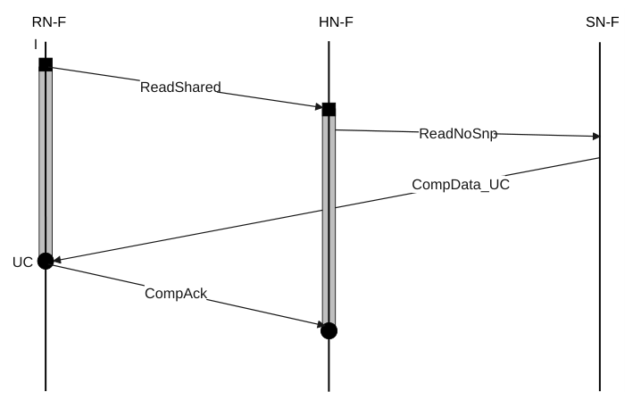

图 B5.1：无侦听的 DMT 读事务示例

图 B5.1 中 ReadShared 事务流的步骤如下：

1. RN-F 向 HN-F 发送 ReadShared 请求。
2. HN-F 向 SN-F 发送 ReadNoSnp 请求。
3. SN-F 使用 CompData_UC 直接向 RN-F 发送数据响应。
4. RN-F 向 HN-F 发送 CompAck，因为该请求是 ReadShared，需要 CompAck 才能完成事务。

#### B5.1.2 使用 DMT 且带侦听的读事务

对于带侦听且数据来自内存的读事务，建议使用 DMT。

图 B5.2 展示了使用 ReadShared 事务的 DMT 事务流示例。

不需要 SN-F 向 HN-F 返回响应，因为请求方发出的 CompAck 用于在归属节点释放该请求。

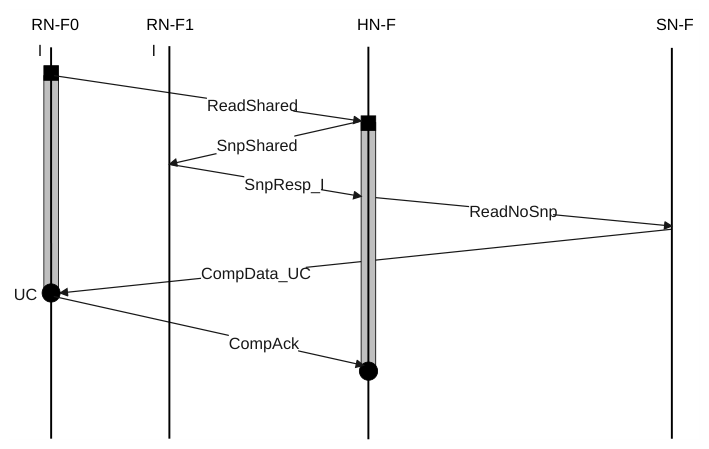

图 B5.2：带侦听且数据来自内存的 DMT 读事务示例

图 B5.2 中 ReadShared 事务流的步骤如下：

1. RN-F0 向 HN-F 发送 ReadShared 请求。
2. HN-F 向 RN-F1 发送 SnpShared 请求。RN-F1 向 HN-F 返回 SnpResp_I 响应。
3. HN-F 在收到来自 RN-F1 的侦听响应后，向 SN-F 发送 ReadNoSnp 请求。这保证 RN-F1 未以数据作出响应。
4. SN-F 使用 CompData_UC 直接向 RN-F0 发送数据响应。
5. RN-F0 向 HN-F 发送 CompAck，因为该请求是 ReadShared，需要 CompAck 才能完成事务。

#### B5.1.3 使用 DCT 的读事务

对于带侦听且数据来自其他请求节点缓存的读事务，建议使用 Direct Cache Transfer (DCT)。

##### B5.1.3.1 从 UC 状态缓存行进行的 DCT

图 B5.3 展示了一个 DCT 事务的示例流程。请求方为 RN-F0，转发缓存位于 RN-F1。

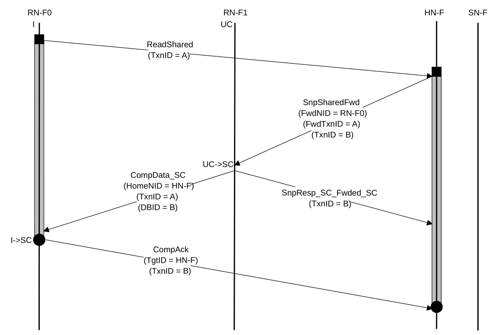

图 B5.3：从 UC 状态缓存行进行的 DCT

图 B5.3 中 DCT 事务流的步骤如下：

1. RN-F0 向 HN-F 发送 ReadShared 请求。
2. HN-F 向 RN-F1 发送 SnpSharedFwd，即 Forwarding snoop 请求。
3. RN-F1 向 RN-F0 转发 CompData_SC 响应。其 TxnID 与原始 ReadShared 请求相同。
4. RN-F1 还向 HN-F 发送 SnpResp_SC_Fwded_SC 侦听响应。RN-F1 的缓存行状态从 UC 转变为 SC。
5. 在收到 CompData_SC 响应后，RN-F0 的缓存行状态从 I 转变为 SC，并且 RN-F0 向 HN-F 发送 CompAck 响应。

> **注意**
>
> 由于 CompData 和 SnpResp 在不同通道上发送，DCT 事务流中的步骤 3 和步骤 4 可以以任意顺序发生。

##### B5.1.3.2 DCT 事务中的双数据返回

图 B5.4 展示了一个 DCT 事务流示例，该事务流将数据发送到 HN-F，并将数据转发给 RN-F0。

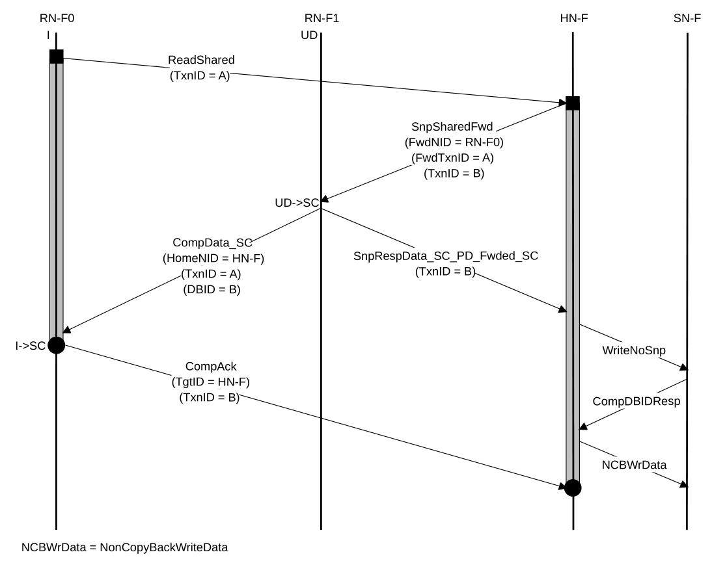

图 B5.4：DCT 事务中的双数据返回

图 B5.4 中 DCT 事务流的步骤如下：

1. RN-F0 向 HN-F 发送 ReadShared 请求。
2. HN-F 向 RN-F1 发送 SnpSharedFwd 侦听请求。
3. RN-F1 向 RN-F0 发送 CompData_SC 响应。其 TxnID 与原始 ReadShared 请求相同。RN-F0 的缓存行从 I 转变为 SC。
4. RN-F1 还向 HN-F 发送 SnpRespData_SC_PD_Fwded_SC 侦听响应，该响应包含缓存行的一份副本，并将 Dirty 缓存行的责任移交给 HN-F。RN-F1 的缓存行从 UD 转变为 SC。
5. HN-F 向 SN-F 发送 WriteNoSnp 请求。
6. SN-F 以 CompDBIDResp 响应 HN-F，以请求数据。
7. HN-F 向 SN-F 发送 NCBWrData。
8. RN-F0 在收到数据响应后发送 CompAck。

#### B5.1.4 不带 DMT 或 DCT 的 Read 事务

图 B5.5 给出了一个使用 ReadNoSnp 事务且不带 DMT 的流程示例。在图 B5.5 中，ReadNoSnp 在原始请求中置位了 ExpCompAck。

该请求不产生任何侦听，数据来自 HN-F 的一次内存读的响应。

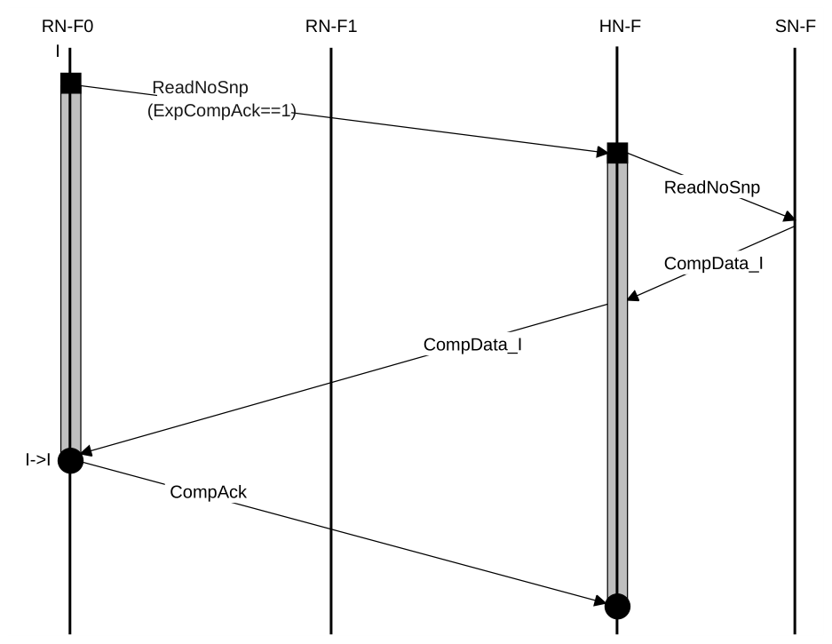

图 B5.5：ReadNoSnp 事务流程

图 B5.5 中 ReadNoSnp 事务流程的步骤如下：

1. RN-F0 发起一个 ReadNoSnp 事务，其中 ExpCompAck 置为 1。
2. HN-F 接收并分配该请求。

> **注意**
>
> 由于该请求被识别为不可侦听（Non-snoopable）请求类型，HN-F 不发送侦听。

3. HN-F 向 SN-F 发送一个 ReadNoSnp。
4. SN-F 向 HN-F 返回 CompData_I。
5. HN-F 随后把数据返回给 RN-F0。

> **注意**
>
> 如果原始 ReadNoSnp 请求中的 ExpCompAck 为 0，则 HN-F 此时本可以释放该请求。

6. RN-F0 释放该请求，并向 HN-F 发送 CompAck。
7. HN-F 接收 CompAck 响应并释放该请求。

#### B5.1.5 带部分数据的侦听响应且无内存更新的 Read 事务

这类流程的一个示例是 ReadUnique 事务。

图 B5.6 给出了该事务流程。

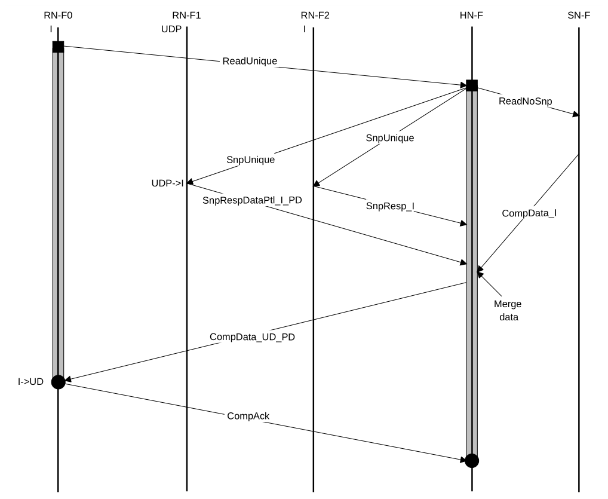

图 B5.6：带部分数据侦听响应的 ReadUnique

图 B5.6 中带部分数据侦听响应的 ReadUnique 事务流程的步骤如下：

1. RN-F0 向 HN-F 发送 ReadUnique 请求。
2. HN-F 向 SN-F 发送 ReadNoSnp 请求，并向 RN-F1 和 RN-F2 发送 SnpUnique 请求。
3. RN-F1 将该缓存行从 UDP 转换为 I，并向 HN-F 返回 SnpRespDataPtl_I_PD。RN-F2 向 HN-F 返回 SnpResp_I。与此同时，SN-F 向 HN-F 返回 CompData 响应。HN-F 把从 SN-F 返回的数据与从 RN-F1 收到的部分数据合并。
4. HN-F 向 RN-F0 发送 CompData_UD_PD。RN-F0 的缓存行状态从 I 转换为 UD。
5. RN-F0 向 HN-F 发出 CompAck 响应，以表明事务完成。

#### B5.1.6 带部分数据的侦听响应且带内存更新的 Read 事务

这类流程的一个示例是 ReadClean 事务。

图 B5.7 给出了该事务流程。

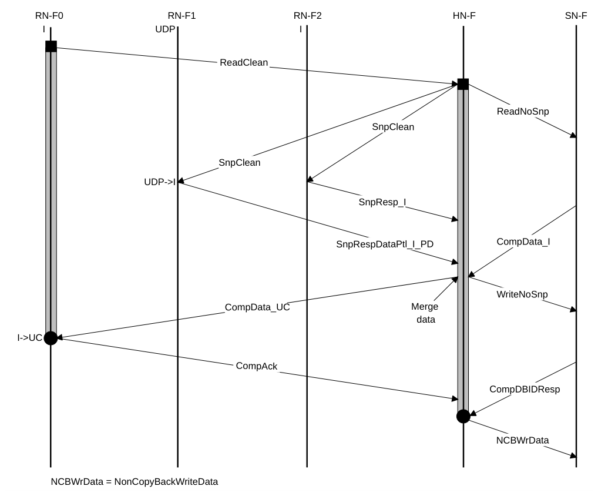

图 B5.7：带部分数据侦听响应的 ReadClean

图 B5.7 中带部分数据侦听响应的 ReadClean 事务流程的步骤如下：

1. RN-F0 向 HN-F 发送 ReadClean 请求。
2. HN-F 向 SN-F 发送 ReadNoSnp 请求，并向 RN-F1 和 RN-F2 发送 SnpClean 请求。RN-F1 的缓存行状态从 UDP 转换为 I。
3. RN-F1 返回 SnpRespDataPtl_I_PD，RN-F2 向 HN-F 返回 SnpResp_I。与此同时，SN-F 向 HN-F 返回 CompData_I 响应。这会合并数据。
4. HN-F 向 RN-F0 发送 CompData_UC，并向 SN-F 发送 WriteNoSnp。RN-F0 的缓存行状态从 I 转换为 UC。
5. RN-F0 向 HN-F 发出 CompAck 响应，以表明事务完成。
6. SN-F 向 HN-F 发出 CompDBIDResp。
7. HN-F 向 SN-F 发送 NCBWrData。

#### B5.1.7 带归属节点提前释放的 ReadOnce* 和 ReadNoSnp

图 B5.8 给出了一个无序 ReadOnce 请求的优化流程。

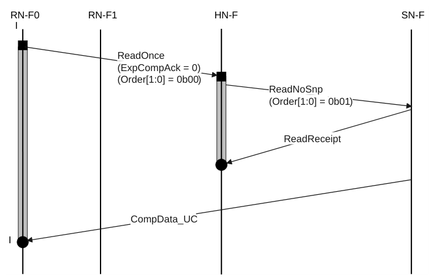

图 B5.8：针对无序 ReadOnce 的 DMT 优化

图 B5.8 中经优化的 ReadOnce 事务流程的步骤如下：

1. RN-F0 向 HN-F 发送一个无序 ReadOnce 请求，其中 Order[1:0] 置为 0b00。
2. HN-F 向 SN-F 发送一个 DMT ReadNoSnp 请求，其中 Order[1:0] 置为 0b01。
3. SN-F 向归属节点发送 ReadReceipt。
4. HN-F 在收到 ReadReceipt 响应后释放该请求。
5. SN-F 直接向 RN-F0 发送 CompData_UC。

> **注意**
>
> 在不需要 CompAck 的情况下，从归属节点向从属节点使用 ReadNoSnp 事务，可避免需要从归属节点向请求方发送 RespSepData 响应。

#### B5.1.8 带 DMT 且 Non-data 与 Data-only 响应分离的 ReadNoSnp 事务

图 B5.9 给出了一个带 Non-data 与 Data-only 响应分离的 DMT 事务流示例。

在本示例中，不存在顺序要求，HN-F 一旦收到 ReadReceipt 即可释放该请求，无需等待来自 RN-F 的 CompAck。

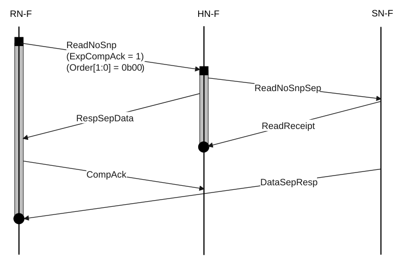

图 B5.9：带 Non-data 与 Data-only 分离的 DMT 读事务示例

图 B5.9 中 ReadNoSnp 事务的步骤如下：

1. RN-F 向 HN-F 发送一个无序的 ReadNoSnp 请求。
2. HN-F 向 SN-F 发送一个 ReadNoSnpSep 请求。
3. HN-F 向 RN-F 发送一个 RespSepData 响应。
4. SN-F 向 HN-F 发送一个 ReadReceipt。
5. RN-F 在收到 RespSepData 后发送 CompAck。
6. SN-F 向 RN-F 发送 DataSepResp，返回读数据。

#### B5.1.9 带顺序且 Non-data 与 Data-only 分离的 DMT ReadNoSnp 事务

图 B5.10 给出了一个带顺序且 Non-data 与 Data-only 分离的 DMT 事务流示例。

图 B5.10 中 Order 字段非零的 ReadNoSnp 要求：

- 只有在收到 RespSepData 之后，才能发送下一个有序请求。
- RN-F 在发送 CompAck 之前，必须等待 RespSepData 以及至少一个 DataSepResp 数据包。
- HN-F 在收到 CompAck 之前，不得向 SN-F 发送下一个有序请求。

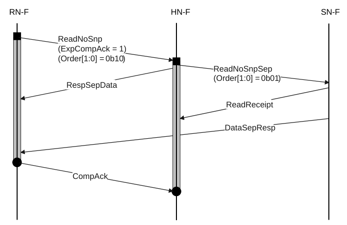

图 B5.10：带顺序且 Non-data 与 Data-only 分离的 DMT 读事务示例

图 B5.10 中带顺序且 Non-data 与 Data-only 分离的读事务步骤如下：

1. RN-F 向 HN-F 发送 ReadNoSnp，其中 ExpCompAck 置为 1。Order[1:0] 置为 0b10。
2. HN-F 向 SN-F 发送 ReadNoSnpSep，其中 Order[1:0] 置为 0b01。
3. HN-F 向 RN-F 返回 RespSepData。
4. SN-F 向 HN-F 返回 ReadReceipt。
5. SN-F 直接向 RN-F 发送 DataSepResp。
6. RN-F 向 HN-F 发出 CompAck。

### B5.2 无数据事务流

本节给出无数据事务的互连协议流示例。

#### B5.2.1 无内存更新的无数据事务

此类流的一个示例是 MakeUnique 事务。

图 B5.11 给出了该事务流。

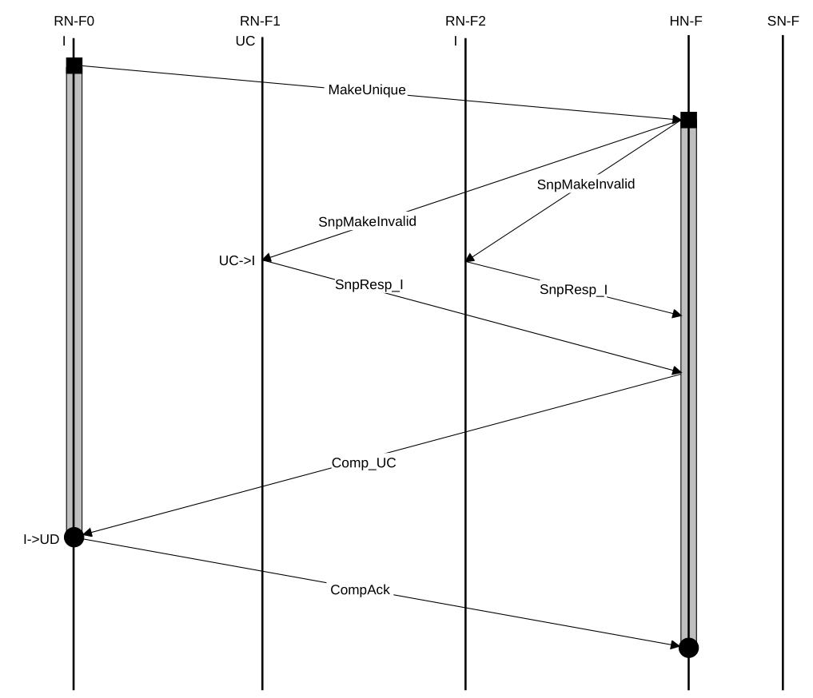

图 B5.11：无内存更新的 MakeUnique

图 B5.11 中无内存更新的 MakeUnique 事务流步骤如下：

1. RN-F0 向 HN-F 发送 MakeUnique 请求。
2. HN-F 向 RN-F1 和 RN-F2 发送 SnpMakeInvalid 请求。RN-F1 的缓存行状态由 UC 转换为 I。
3. RN-F1 和 RN-F2 向 HN-F 返回 SnpResp_I。
4. HN-F 向 RN-F0 发送 Comp_UC。RN-F0 的缓存行状态由 I 转换为 UD。
5. RN-F0 向 HN-F 发出 CompAck 响应，以指示事务完成。

#### B5.2.2 有内存更新的无数据事务

此类流的一个示例是 CleanUnique 事务。

图 B5.12 给出了该事务流。

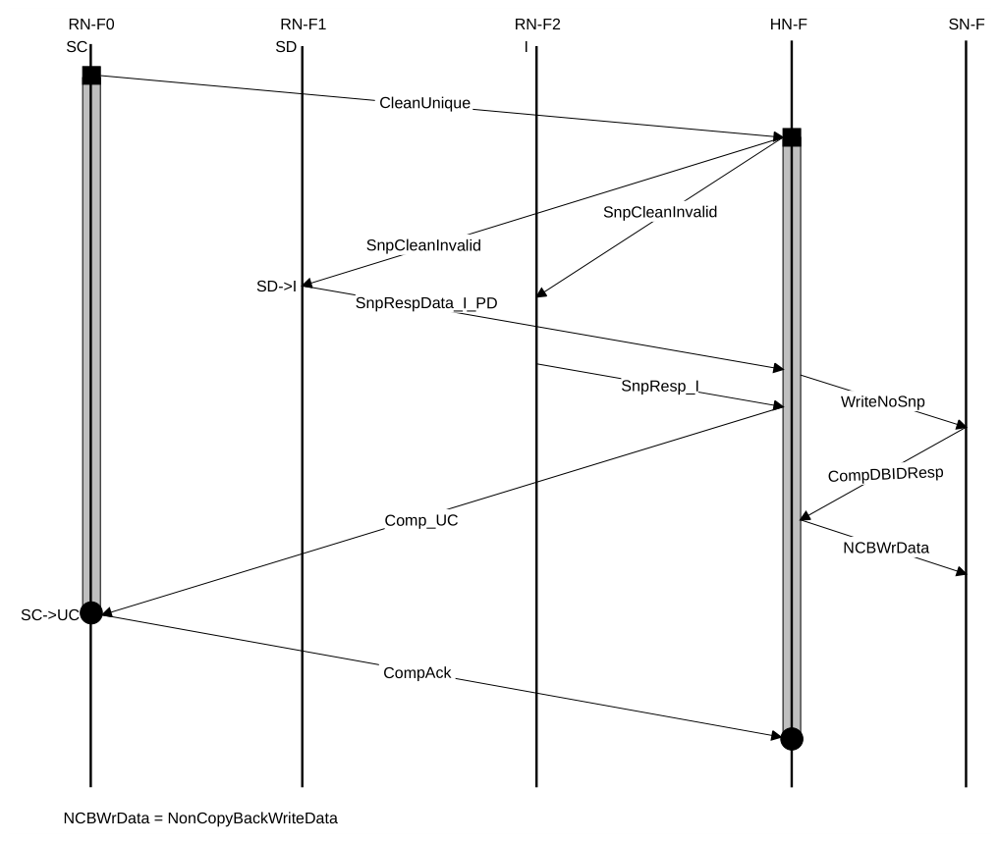

图 B5.12：有内存更新的 CleanUnique

图 B5.12 中有内存更新的 CleanUnique 事务流步骤如下：

1. RN-F0 向 HN-F 发送 CleanUnique 请求。
2. HN-F 向 RN-F1 和 RN-F2 发送 SnpCleanInvalid 请求。RN-F1 的缓存行状态由 SD 转换为 I。
3. RN-F1 向 HN-F 返回 SnpRespData_I_PD。HN-F 向 SN-F 发送 WriteNoSnp。
4. RN-F2 向 HN-F 返回 SnpResp_I。HN-F 现在可以向 RN-F0 发送 Comp_UC。RN-F0 的缓存行状态由 SC 转换为 UC。与此同时，SN-F 向 HN-F 返回 CompDBIDResp。HN-F 随后向 SN-F 发送 NCBWrData。
5. RN-F0 向 HN-F 发出 CompAck 响应，以指示事务完成。

#### B5.2.3 带侦听且 Comp 与 Persist 分离的持久化 CMO

在本 CleanSharedPersistSep 事务流示例中，持久化点（PoP）位于 SN-F。

图 B5.13 展示了该事务流。

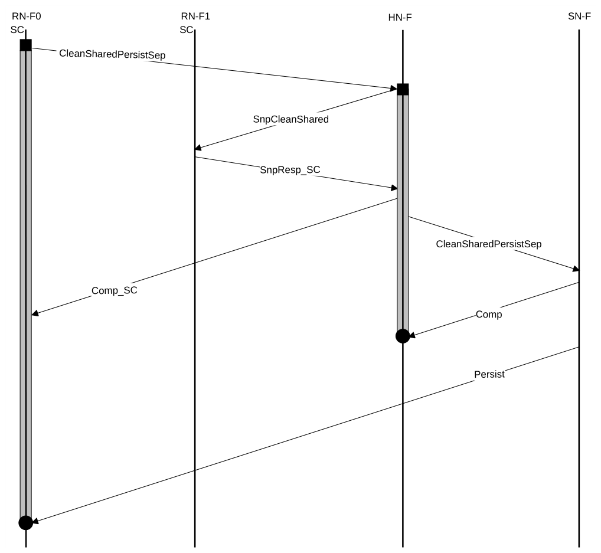

图 B5.13：CleanSharedPersistSep 事务流

图 B5.13 中 CleanSharedPersistSep 事务流的步骤如下：

1. RN-F0 向 HN-F 发送 CleanSharedPersistSep 请求。
2. HN-F 向 RN-F1 发送 SnpCleanShared 请求。
3. RN-F1 向 HN-F 发送 SnpResp_SC。
4. HN-F 向 RN-F0 发送 Comp_SC。
5. 在完成所有被侦听到的 Dirty 数据的写回（若有）之后，HN-F 向 SN-F 发送 CleanSharedPersistSep。
6. SN-F 向 HN-F 返回 Comp 响应。SN-F 直接向 RN-F0 发送 Persist 响应，以表明该请求已到达 PoP，并且对同一位置的任何先前写入的数据均已被推送至 PoP。

#### B5.2.4 Evict 事务

图 B5.14 展示了 Evict 事务流。

> **注意**
>
> Evict 请求是一种提示。HN-F 可以在不更新 Snoop Filter 或 Snoop Directory 的情况下给出 Comp 响应。

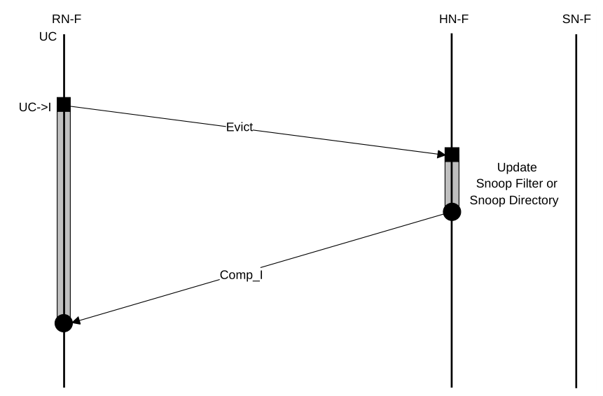

图 B5.14：Evict 事务流

图 B5.14 中 Evict 事务流的步骤如下：

1. RN-F0 的缓存行状态从 UC 转换为 I，并向 HN-F 发送 Evict 请求。HN-F 接收并分配该请求。
2. HN-F 返回 Comp_I 响应并释放该请求。RN-F0 释放该请求。

> **注意**
>
> 在发送 Evict 消息之前，请求方处的缓存状态必须变为 Invalid。

### B5.3 写事务流

本节给出写事务的互连协议流示例。

#### B5.3.1 无侦听且响应分离的写事务

图 B5.15 展示了一个 WriteNoSnp 事务流。

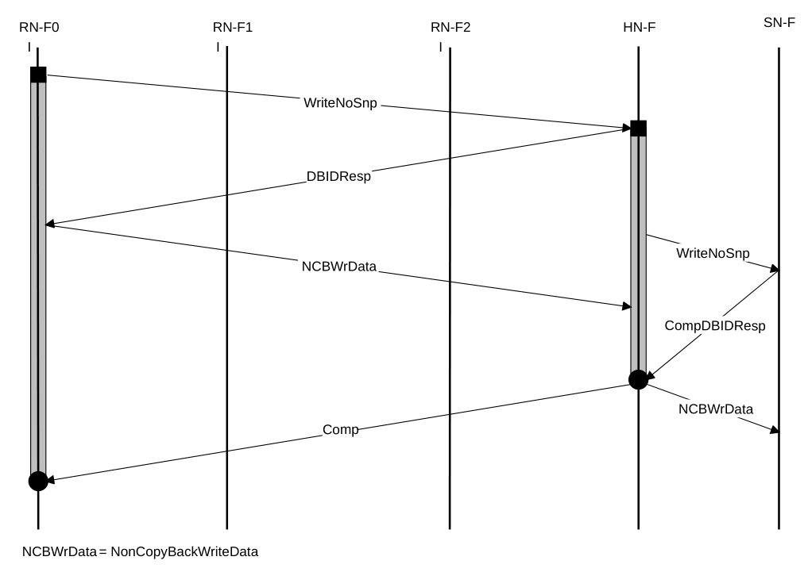

图 B5.15：从归属节点到请求节点的响应分离的 WriteNoSnp

图 B5.15 中 WriteNoSnp 事务流的步骤如下：

1. RN-F0 向 HN-F 发起一个 WriteNoSnp 事务。HN-F 接收并分配该请求。
2. HN-F 发送不带 Comp 的 DBIDResp。同时，HN-F 向 SN-F 发送 WriteNoSnp。
3. RN-F0 以数据（NCWrData）作为响应。SN-F 向 HN-F 返回 CompDBIDResp。
4. HN-F 在收到来自 SN-F 的 CompDBIDResp 后发送 Comp。HN-F 向 SN-F 发送 NCBWrData。

> **注意**
>
> 本流程示例展示的是在收到来自 SN-F 的 CompDBIDResp 之后发送 Comp。但是，HN-F 可以在收到来自 RN-F0 的 WriteNoSnp 请求之后的任意时刻发送 Comp。

5. RN-F0 等待来自 HN-F 的 Comp，并释放其请求。

图 B5.15 展示了该流程，其中被传输的数据副本以粗体标出。

#### B5.3.2 带侦听且响应分离的写事务

此类流程的一个示例是 WriteUniquePtl 事务。

图 B5.16 展示了该事务流。

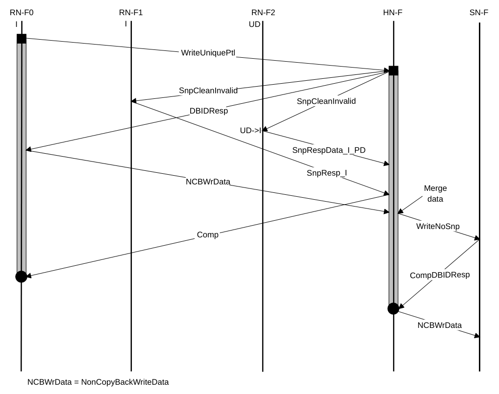

图 B5.16：带侦听的 WriteUniquePtl

图 B5.16 中带侦听的 WriteUniquePtl 事务流的步骤如下：

1. RN-F0 向 HN-F 发送 WriteUniquePtl 请求。
2. HN-F 向 RN-F1 和 RN-F2 发送 SnpCleanInvalid 请求。HN-F 还向 RN-F0 返回 DBIDResp。RN-F2 的缓存行状态从 UD 转换为 I。
3. RN-F1 发送 SnpResp_I，RN-F2 向 HN-F 发送 SnpRespData_I_PD。
4. RN-F0 向 HN-F 发出 NCBWrData。HN-F 将写数据与脏行合并，并向 SN-F 发送 WriteNoSnp。
5. HN-F 向 RN-F0 发送 Comp 响应。
6. SN-F 向 HN-F 返回 CompDBIDResp。
7. HN-F 向 SN-F 发送 NCBWrData。

#### B5.3.3 到内存的 CopyBack 写事务

此类流程的一个示例是 WriteBackFull 事务。

图 B5.17 展示了该事务流。

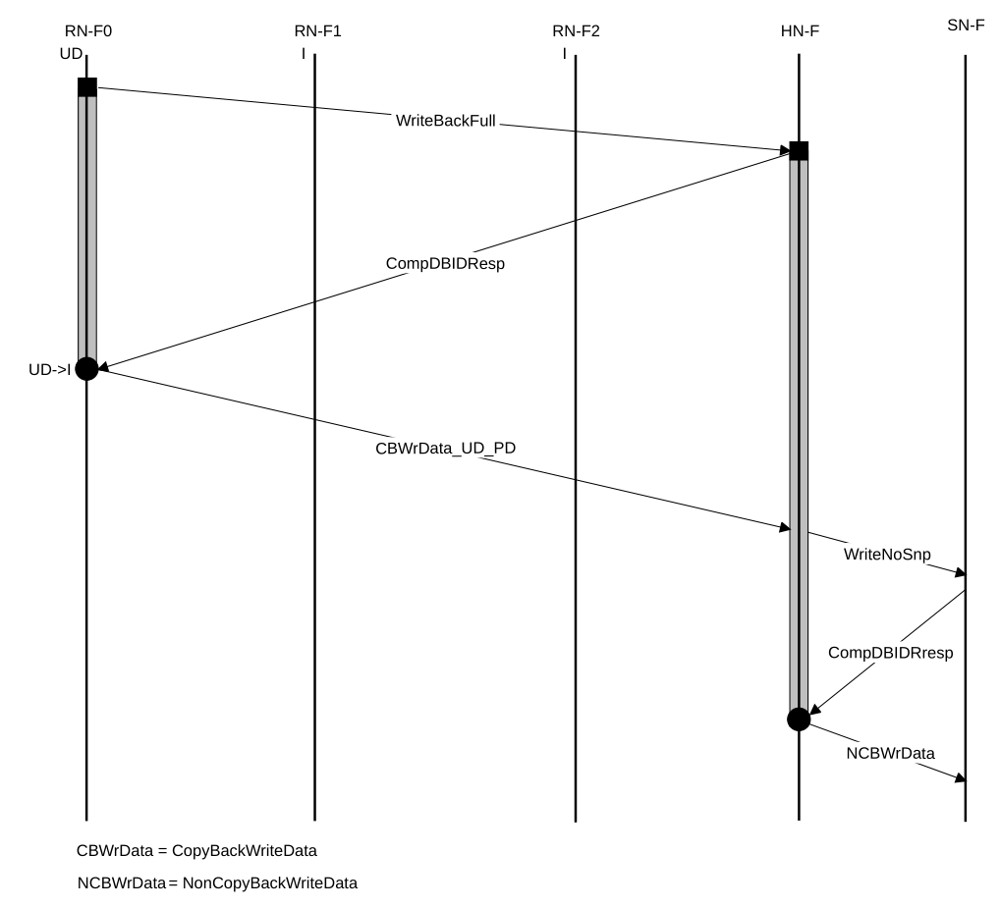

图 B5.17：WriteBackFull 事务流

图 B5.17 中 WriteBackFull 事务流的步骤如下：

1. RN-F0 向 HN-F 发送 WriteBackFull 请求。
2. HN-F 向 RN-F0 返回 CompDBIDResp。RN-F0 的缓存行状态从 UD 转换为 I。
3. RN-F0 向 HN-F 发送 CBWrData_UD_PD。HN-F 向 SN-F 发送 WriteNoSnp。
4. SN-F 向 HN-F 返回 CompDBIDResp。
5. HN-F 向 SN-F 发送 NCBWrData。

### B5.4 Atomic 事务流

本节展示不同类型的 Atomic 事务流。它包含以下小节：

- B5.4.1 带数据返回的 Atomic 事务
- B5.4.2 不带数据返回的 Atomic 事务
- B5.4.3 在从属节点执行的 Atomic 操作

#### B5.4.1 带数据返回的 Atomic 事务

该流程适用于：

- AtomicLoad
- AtomicCompare
- AtomicSwap

##### B5.4.1.1 带侦听且带数据返回的 Atomic 事务

图 B5.18 展示了在 HN-F 执行的 Atomic 操作。

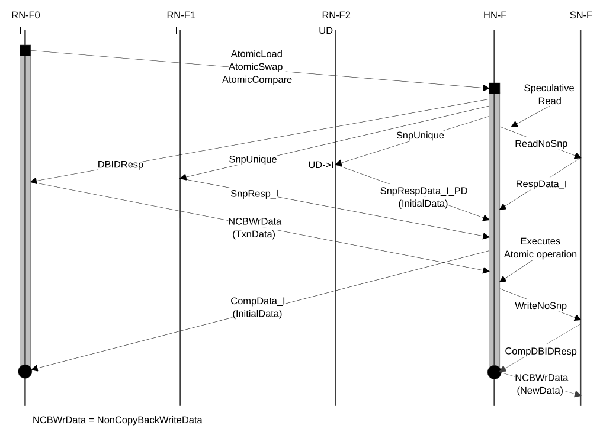

图 B5.18：在 HN-F 执行的 AtomicLoad、AtomicSwap 或 AtomicCompare

图 B5.18 中的步骤如下：

1. RN-F0 向 HN-F 发送 Atomic 事务。
2. 收到 Atomic 请求后，HN-F：
- 向 RN-F0 发送 DBIDResp，以获取 Atomic 事务数据。
- 在确定需要侦听之后，向其他 RN-F 节点发送 SnpUnique 侦听请求。
- HN-F 可以（但并非必须）向 SN-F 发送推测性 ReadNoSnp。
3. RN-F2 以 UD 状态持有该缓存行，并通过发送数据并使自身的缓存副本无效来作出响应。
- 响应为 SnpRespData_I_PD。
- 该数据在图 B5.18 中标记为 (InitialData)，以便与请求方发送的数据以及 Atomic 操作执行后写入 SN-F 的数据区分开。
- HN-F 还收到来自 RN-F1 的第二个侦听响应 SnpResp_I。
4. 在收到所有侦听响应之后，HN-F 向请求方发送 CompData_I。
- 随 Comp 发送的数据是该数据的初始副本。
- 该数据不得在 RN-F0 以一致性状态缓存。
5. 作为对先前发送的 DBIDResp 的响应，HN-F 收到来自请求方的 NonCopyBackWriteData_I 响应。
- 该数据在图 B5.18 中标记为 (TxnData)，以便与 RN-F2 响应 HN-F 的侦听请求而发送的数据区分开。
6. 一旦 HN-F 收到来自请求方的 NonCopyBackWriteData_I 响应，以及来自 RN-F2 的带数据侦听响应，就执行 Atomic 操作。
- Atomic 操作执行后得到的值在图 B5.18 中标记为 (NewData)，并被写入 SN-F。
7. 在本示例中，由于推测性读取而收到的读数据被 HN-F 丢弃。

> **注意**
>
> 在图 B5.18 中，来自 HN-F 的 CompData_I 响应可以在收到所有侦听响应时发送。

或者，为了便于错误报告，CompData_I 可以延迟到从请求方收到 NonCopyBackWriteData 且 Atomic 操作执行完毕后再发送。

##### B5.4.1.2 不带侦听且带数据返回的 Atomic 事务

图 B5.19 展示了在归属节点执行的 Atomic 操作。

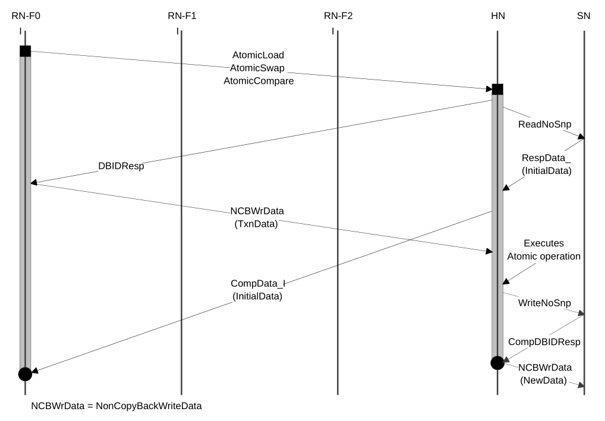

图 B5.19：在归属节点执行的 AtomicLoad、AtomicSwap 或 AtomicCompare

图 B5.19 中在归属节点执行的 Atomic 事务流中的步骤如下：

1. RN-F0 向 HN 发送 Atomic 事务请求。2. HN 向 RN-F0 返回 DBIDResp。3. HN 向 SN 发送 ReadNoSnp 请求。与此同时，RN 向 HN 发送 NCBWrData (TxnData)。4. SN 向 HN 返回 RespData_I (InitialData)。5. HN 返回 CompData_I (InitialData)。6. HN 执行 Atomic 操作并向 SN 发送 WriteNoSnp 请求。7. SN 向 HN 返回 CompDBIDResp。8. HN 向 SN 发送 Atomic 操作的结果，标记为 (NewData)。

#### B5.4.2 不带数据返回的 Atomic 事务

该流程适用于 AtomicStore 事务。

##### B5.4.2.1 带侦听且不带数据返回的 Atomic 事务

图 B5.20 展示了在 HN-F 执行的 Atomic 操作。该流程与带侦听且带数据返回的 Atomic 事务类似，不同之处在于对 RN-F0 的 Comp 响应不包含数据。

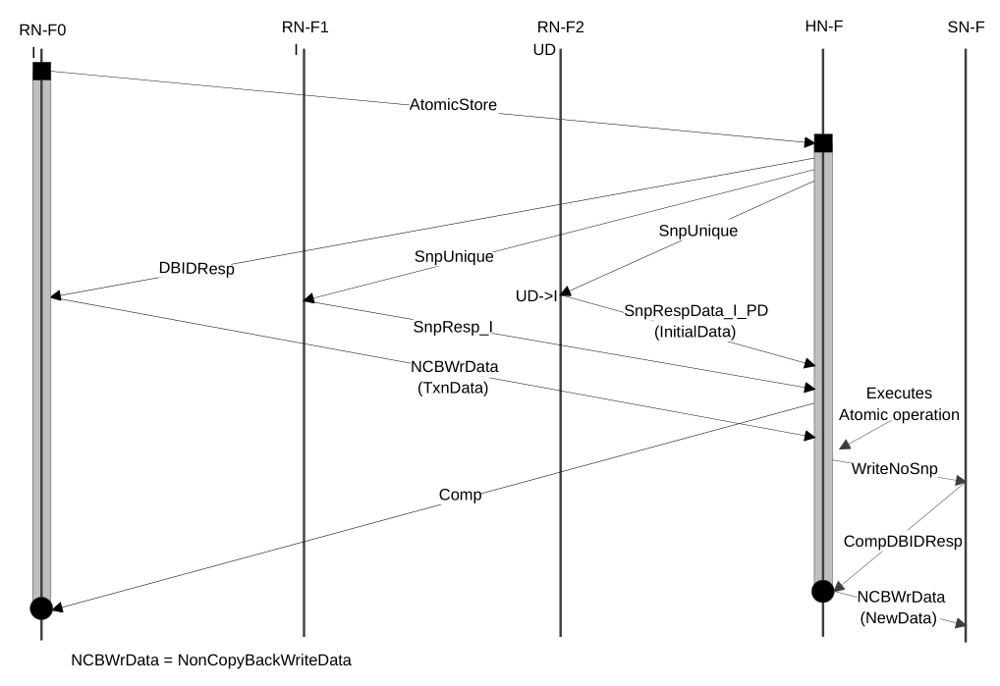

图 B5.20：在 HN-F 执行的 AtomicStore

图 B5.20 中在 HN 执行的 AtomicStore 事务的步骤如下：

1. RN-F0 向 HN-F 发送 AtomicStore 请求。
2. HN-F 向请求方 RN-F0 发出 DBIDResp，并向 RN-F1 和 RN-F2 发出 SnpUnique 请求。
3. RN-F1 向 HN-F 返回 SnpResp_I 响应。RN-F2 以 UD 状态持有该缓存行，并返回 SnpRespData_I_PD (InitialData) 响应。这使 RN-F2 中的缓存副本无效。
4. RN-F0 向 HN-F 发送写数据 (TxnData)。HN-F 在本地执行 AtomicStore 操作。
5. HN-F 向 SN-F 发出 WriteNoSnp 请求。
6. SN-F 向 Home 返回 CompDBIDResp。
7. HN-F 向 SN-F 发送 Atomic 操作的结果，标记为 (NewData)。

##### B5.4.2.2 无侦听且无数据返回的 Atomic 事务

图 B5.21 展示了在 Home Node 执行的原子操作。该流程与无侦听但有数据返回的 Atomic 事务类似，区别仅在于返回给 Request Node 的 Comp 响应不包含数据。

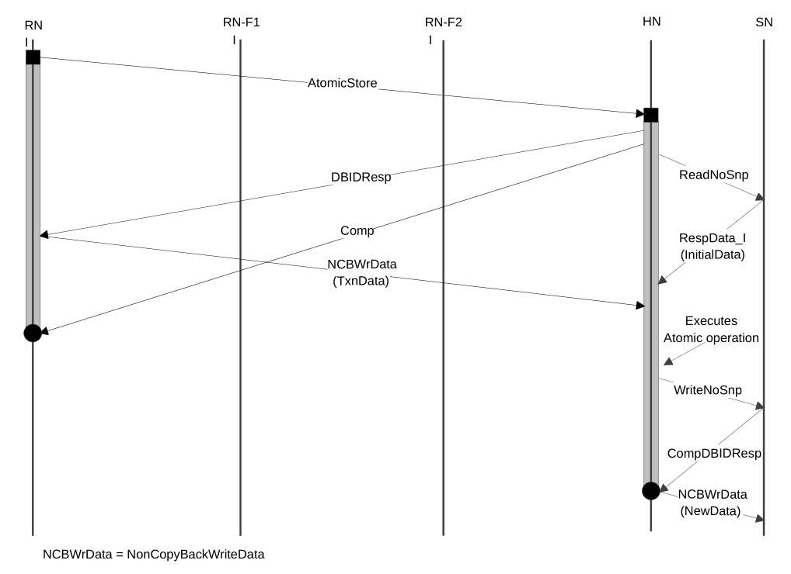

图 B5.21：在 Home Node 执行的 AtomicStore

> **注意**
>
> 在图 B5.21 中，对 Subordinate Node 的读是获取 InitialData 所必需的，不是推测性的。

来自 Home Node 的 Comp 响应可以与 DBIDResp 响应合并。

图 B5.21 中在 Home Node 执行的 AtomicStore 事务的步骤如下：

1. RN 向 HN 发送 AtomicStore 请求。2. HN 向 RN 返回 DBIDResp 响应，表明 RN 可以向 HN 发送写数据。3. HN 向 RN 发送 Comp 响应，并向 SN 发送 ReadNoSnp 请求。4. SN 向 HN 返回 RespData_I。5. 一旦 HN 收到来自 RN 的写数据，就执行原子操作，并向 SN 发送 WriteNoSnp。6. SN 向 HN 返回 CompDBIDResp。7. HN 将原子操作的结果发送给 SN，标记为 NewData。

#### B5.4.3 在 Subordinate Node 执行的原子操作

图 B5.22 展示了一个由 SN-F 执行原子操作的 Atomic 事务流程示例。

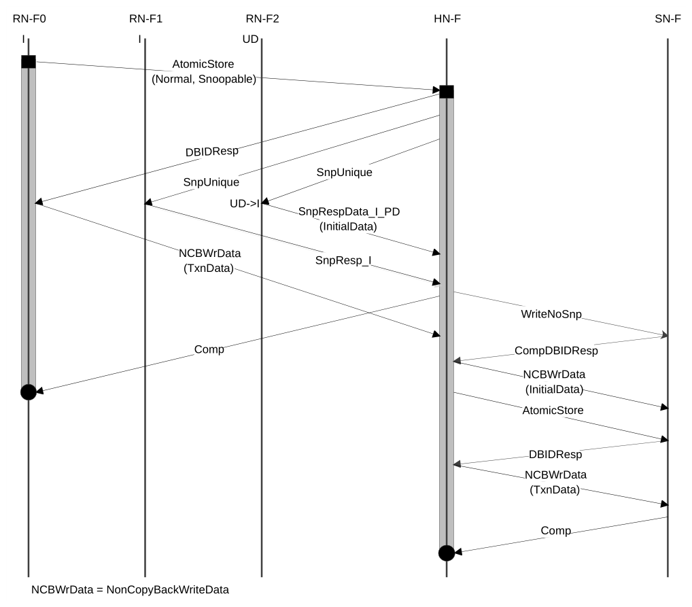

图 B5.22：在 SN-F 执行的 AtomicStore

图 B5.22 中在 SN-F 执行的 AtomicStore 事务的步骤如下：

1. RN-F0 向 HN-F 发送 AtomicStore 事务。
- 该 Atomic 请求指向一个可侦听（Snoopable）的地址位置。
2. 收到 Atomic 请求后，HN-F：
- 向 RN-F0 发送 DBIDResp，以获取 Atomic 事务数据。
- 在判定需要侦听之后，向其他 RN-F 节点发送 SnpUnique。
3. RN-F2 以 UD 状态持有该缓存行，通过发送数据并使自身缓存的副本无效来响应。
- 该响应为 SnpRespData_I_PD。
- 在图 B5.22 中该数据被标记为 (InitialData)，以便与请求方发送的数据

以及为执行原子操作而写入 SN-F 的数据相区分。

- HN-F 还会从另一个被侦听的 RN-F 收到第二个侦听响应 SnpResp_I。
4. HN-F 使用 WriteNoSnp 事务将收到的数据写入 SN-F。
5. 针对先前发送的 DBIDResp，HN-F 收到来自请求方的 NonCopyBackWriteData 响应。
6. HN-F 在将侦听响应数据发送给 SN-F 之后，向 SN-F 发送 AtomicStore 事务请求，并执行完成该 Atomic 事务所需的消息序列。
7. 一旦向请求方发送了 Comp 响应，并且从 SN-F 收到了该 Atomic 事务的 Comp 响应，HN-F 就释放该请求。
- 来自 HN-F 的 Comp 响应可以在收到所有侦听响应时发送。

### B5.5 Stash 事务流程

本节展示两类 Stash 事务的互连协议流程示例：

- B5.5.1 带 Stash 提示的写
- B5.5.2 独立的 Stash 请求

#### B5.5.1 带 Stash 提示的写

图 B5.23 展示了一个带 Data Pull 的 WriteUniqueFullStash 事务流程示例。

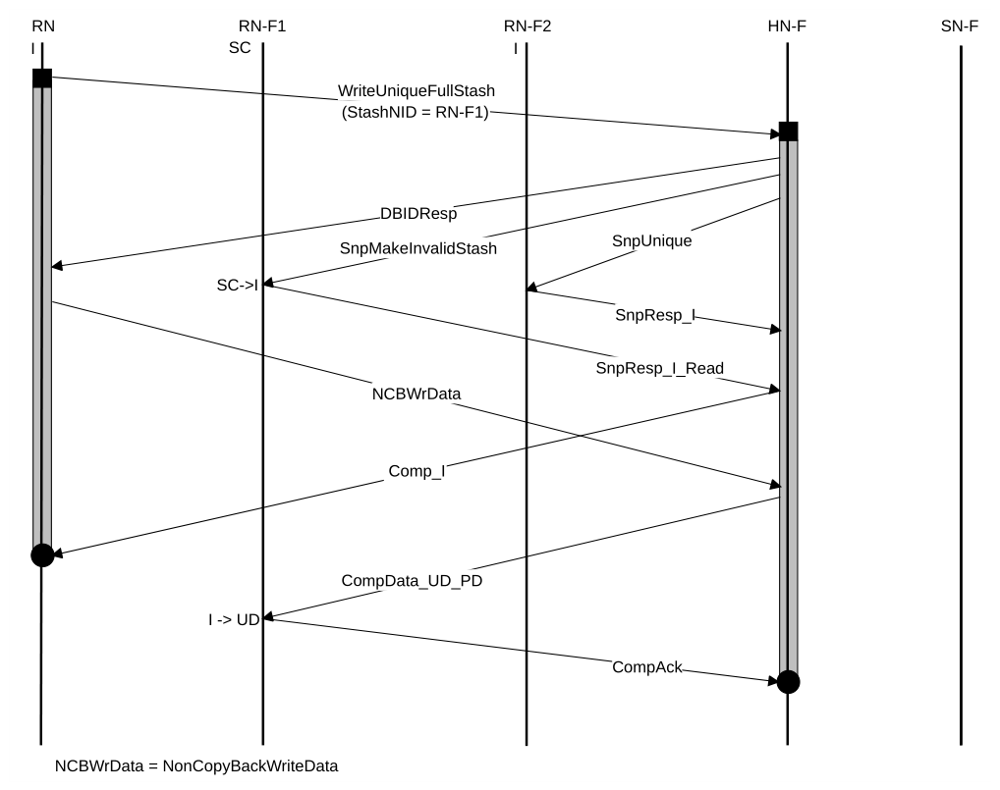

图 B5.23：带 Data Pull 的 WriteUniqueFullStash

图 B5.23 中的步骤如下：

1. Request Node 向 HN-F 发送 WriteUniqueFullStash 请求，其中 Stash target 标识为 RN-F1。通常，发起请求的 Request Node 是一个 RN-I。
2. HN-F 向 RN-F1 发送 SnpMakeInvalidStash，向 RN-F2 发送 SnpUnique。
3. RN-F1 和 RN-F2 向 HN-F 发送 SnpResp 响应。来自 RN-F1 的侦听响应还包含一个读请求，即 Data Pull。
4. HN-F 将来自 RN-F1 的读请求视为 ReadUnique，并向 RN-F1 发送合并的 CompData。CompData 响应包含请求方写入的数据。
5. RN-F1 向 HN-F 发送 CompAck，以完成该读事务。

#### B5.5.2 独立 Stash 请求

图 B5.24 展示了一个带 Data Pull 的 StashOnce 事务流程示例。

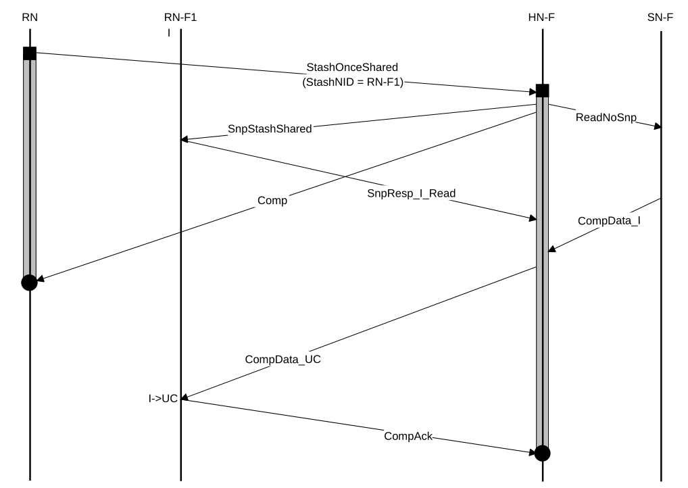

图 B5.24：带 Data Pull 的 StashOnceShared

图 B5.24 中的步骤如下：

1. 请求节点向 HN-F 发送一个 StashOnceShared 请求，其中暂存目标标识为 RN-F1。
2. HN-F 在为收到的请求建立处理顺序后发送 Comp 响应，该顺序保证该请求先于稍后从任意请求方收到的、发往同一地址的请求被处理。
3. HN-F 向 RN-F1 发送 SnpStashShared 侦听，并向 SN-F 发送 ReadNoSnp 请求以获取数据。
4. RN-F1 向 HN-F 发送 SnpResp_I_Read 响应。
5. HN-F 将来自 RN-F1 的读请求视为 ReadNotSharedDirty，并向 RN-F1 发送合并的 CompData。
6. RN-F1 向 HN-F 发送 CompAck 以完成该读事务。

### B5.6 冒险处理示例

本节展示 CopyBack-Snoop 请求冒险条件在请求方是如何处理的，以及各类 request to request 和 request to snoop request 冒险条件在 HN-F 是如何处理的。本节包含以下子节：

- B5.6.1 侦听请求
- B5.6.2 请求
- B5.6.3 读请求或无数据请求
- B5.6.4 竞态冒险

#### B5.6.1 侦听请求

图 B5.25 展示了在时刻 C 一个发往 RN-F 的侦听请求与一个待处理的 CopyBack 请求发生冒险。

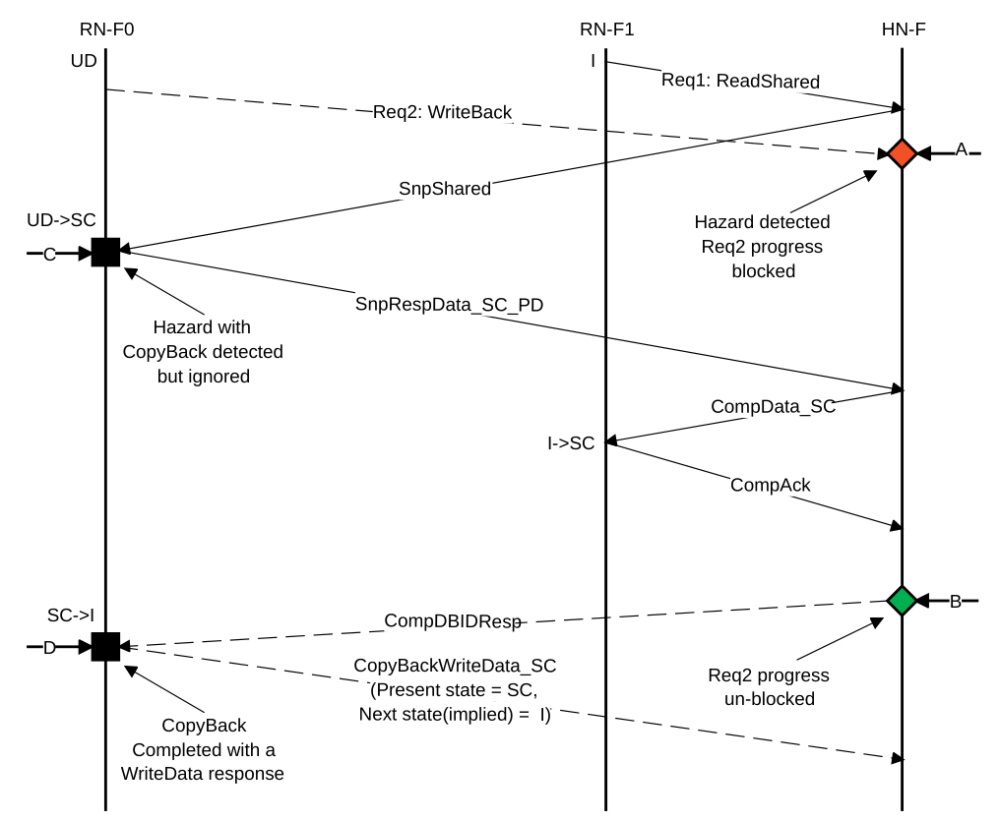

图 B5.25：RN-F 处 CopyBack-Snoop 冒险示例

解决此冒险所需的步骤如下：

1. 在时刻 C：
- SnpShared 事务忽略该冒险并读取缓存行数据。
- 缓存行状态从 UD 变为 SC。
2. 在时刻 D：
- 针对该 CopyBack 的 CompDBIDResp 发送给 RN-F0。
- RN-F0 回送一个 CopyBackWriteData_SC 响应。
- 缓存行状态从 SC 变为 I。

从一致性角度看，该数据是干净的，为实现正确功能并不要求将其发送到互连。然而，协议要求无论是否存在侦听冒险，CopyBack 流程都必须保持一致。WriteData 响应中的缓存行状态为 SC，因为那是发送 WriteData 响应时缓存行的状态。

> **注意**
>
> 与未完成的 Evict 发生冒险的侦听请求，其响应必须是 SnpResp_I。

当针对同一地址的侦听请求的侦听响应尚处于挂起状态时，CopyBack 请求唯一可能收到的响应是 RetryAck。如适用，这也包括数据。

图 B5.26 展示了侦听请求与未完成的 CopyBack 请求发生冒险的另一个示例。在此示例中，该侦听请求是由来自 RN-F1 的 ReadOnce 请求所生成的 SnpOnce 请求。SnpOnce 请求随侦听响应一起收到数据副本，但不改变缓存行状态。在这种情况下，来自 RN-F0 的最终数据响应表明该数据为 Dirty，且 HN-F 必须将该数据写回内存。

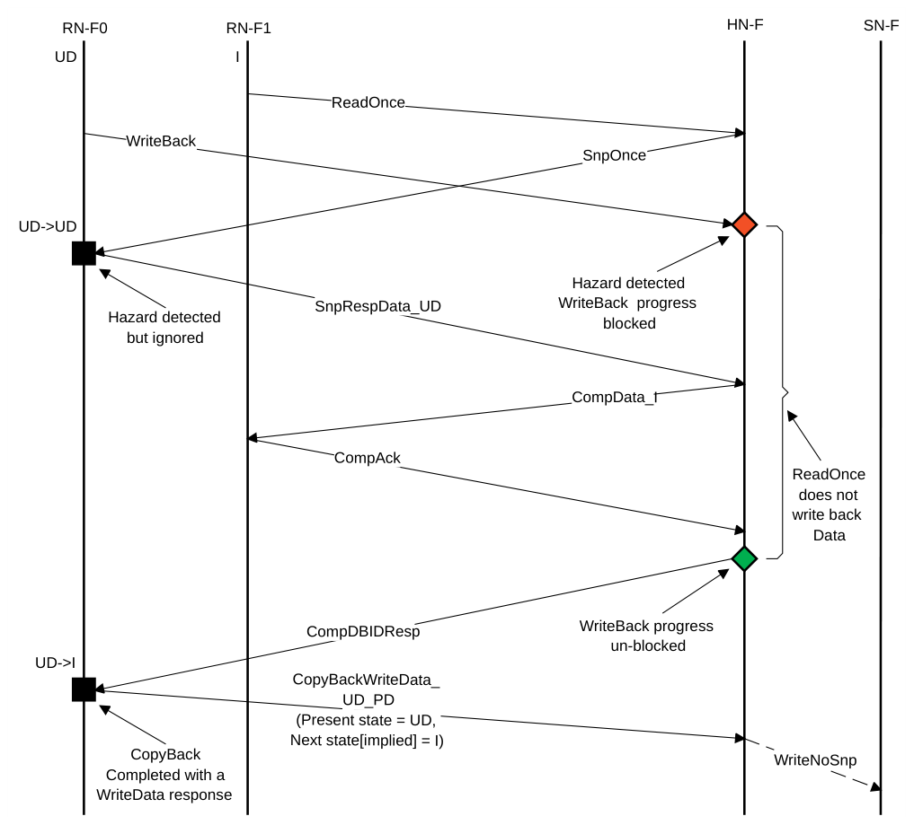

图 B5.26：无缓存状态变化的 CopyBack-Snoop 冒险示例

#### B5.6.2 请求

如果在 HN-F 处有多个发往同一缓存行的请求已准备好被处理，HN-F 可以按任意顺序选择下一个请求。例外情况是：当这两个请求具有顺序要求且来自同一源时，处理顺序必须与到达顺序一致。

图 B5.27 展示了一个示例，其中针对同一缓存行的 ReadShared 和 ReadUnique 大约在同一时刻到达 HN-F。

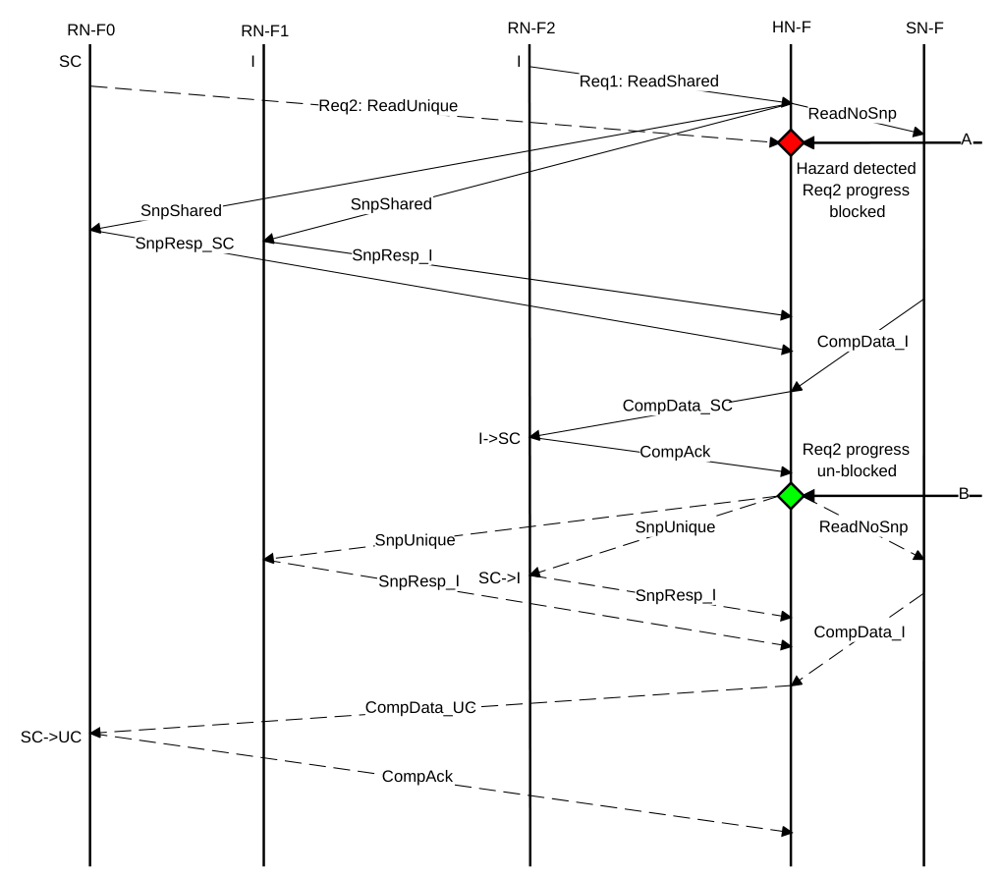

图 B5.27：读-读请求冒险示例

图 B5.27 中解决此冒险所需的步骤如下：

1. 在时刻 A：
- 来自 RN-F0 的 ReadUnique 到达，并与来自 RN-F2 的一个 ReadShared 请求发生冒险，HN-F 针对该请求已经

发送了侦听请求。

- ReadUnique 的推进在 HN-F 处被阻塞。
2. 在时刻 B：
- HN-F 已完成来自 RN-F2 的 ReadShared 事务请求。
- ReadShared 事务被视为已完成，HN-F 解除对来自 RN-F0 的 ReadUnique

事务请求的阻塞。

除 ReadNoSnp 外，如果将图 B5.27 所示的两个事务替换为任意读请求类型或无数据请求类型，流程是类似的：

- 不带 DMT 或 DCT、也没有独立 Comp 与数据响应的读事务请求，在以下两个条件均为真时于

HN-F 完成：

- 所有 CompData 均已发送，且如适用，已收到 CompAck。仅当原始请求消息中 ExpCompAck = 1 时，事务才

需要 CompAck。

- 如需要，完成内存更新。

#### B5.6.3 读请求或无数据请求

在 HN-F 上，读请求或无数据请求与 CopyBack 请求之间的冒险，其处理方式与 B5.6.2 请求中描述的读-读冒险类似。另请参见 B5.6.1 侦听请求。

图 B5.28 展示了针对同一缓存行的 ReadShared 和 WriteBack 几乎同时到达 HN-F 的情况。

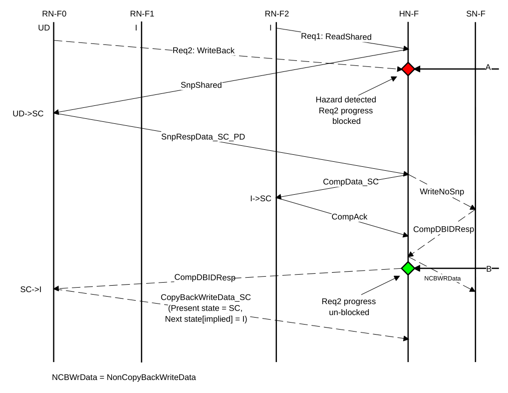

图 B5.28：读 - CopyBack 或无数据 - CopyBack 冒险示例

解决图 B5.28 中该冒险所需的步骤如下：

1. 时刻 A：
- WriteBack 在 HN-F 上遇到冒险条件。产生该冒险的原因是一个已在处理中的 ReadShared

事务。

- 冒险检测的结果是 WriteBack 被阻塞。
- ReadShared 事务随侦听响应接收数据，并且除将数据发送给请求方之外，还必须更新内存。
2. 时刻 B：
- 因为 HN-F 已针对 ReadShared 事务向请求方发送了数据响应，并向内存发送了 WriteData

响应，所以 WriteBack 被解除阻塞。

如果 ReadShared 请求是在 HN-F 已开始处理 WriteBack 请求之后到达 HN-F，则该 ReadShared 请求会被阻塞，直到该 WriteBack 请求完成。

当以下两个条件同时成立时，CopyBack 请求在 HN-F 上完成：

- 收到对应该 CopyBack 请求的数据消息。
- 如有必要，完成内存更新。

#### B5.6.4 竞争冒险

请求完成后，缓存可能会静默地将该缓存行从缓存中逐出，并针对同一地址生成另一个请求。例如：

1. 重新生成的请求在与较早请求相关联的 CompAck 响应之前到达 HN-F。
2. HN-F 检测到地址冒险，并阻塞对新请求的处理，直到收到 CompAck 响应。

在此类情形下，CompAck 响应到达 HN-F 时，会从 HN-F 中释放先前的请求，并解除对新请求处理的阻塞。

第 B6 章

## B6 独占访问

本章介绍该架构为支持独占访问而包含的机制。本章包含以下各节：

- B6.1 概述
- B6.2 独占监视器
- B6.3 独占事务

### B6.1 概述

独占访问的原则是：执行独占序列的逻辑处理器（LP）会执行以下操作：

- 从某个位置执行 Exclusive Load。
- 计算要存储到该位置的值。
- 对该位置执行 Exclusive Store。

独占访问支持可侦听和不可侦听的存储位置。

如果自该 Exclusive Load 以来该位置被其他 LP 更新，则该 Exclusive Store 必须失败。在这种情况下，存储不会发生，且该 LP 不会更新该位置所保存的值。

表 B6.1 给出了独占术语的说明。

表 B6.1：独占术语说明

术语 独占术语的说明

Exclusive Load LP 执行适当的程序指令（例如 LDREX）的操作需要：

- 从该 LP 想要

执行独占序列的位置获取数据。

- 指示该 LP 正在启动一个独占序列。

Exclusive Load transaction 当数据在 LP 的缓存中不可用时，为获取 Exclusive Load 的数据而在接口上发出的事务。并非每个 Exclusive Load 都需要 Exclusive Load transaction。

Exclusive Store LP 执行适当的程序指令（例如 STREX）的操作需要：

- 确定该独占序列已通过还是失败。
- 如适当，更新该位置的数据。

可能通过或失败，并且该结果对正在执行的处理器是已知的。当 Exclusive Store 通过时，该地址位置处的数据值会被更新。当 Exclusive Store 失败时，这表示该地址位置处的数据值未被更新，且必须重新启动该独占序列。

Exclusive Store transaction 为完成 Exclusive Store 而可能在接口上发出的事务。并非每个 Exclusive Store 都需要 Exclusive Store transaction。Exclusive Store transaction 可能通过或失败，并且该结果通过事务响应告知 LP。

### B6.2 独占监视器

独占序列的进展由独占监视器（exclusive monitor）跟踪。监视器的位置以及为支持 Exclusive 访问而生成的请求类型，取决于该地址的内存属性。

Exclusive 访问的属性必须保证其能被独占监视器观察到。例如，如果请求方与监视器之间存在缓存，则 Exclusive 访问应为 Non-cacheable。

#### B6.2.1 可侦听内存位置

对于可侦听（Snoopable）内存位置，定义了两个监视器：

LP monitor 在一个 RN-F 中的每个 LP 都必须实现一个独占监视器，用于观察独占序列所使用的该位置。当 LP 执行 Exclusive Load 时，LP monitor 被置位。LP monitor 在以下任一情况下被复位：

- 该位置被另一个 LP 更新，表现为向同一

地址发出的 Invalidating 侦听请求。

- 同一 LP 对该位置进行了存储。如果来自同一 LP 的存储是非独占的（Non-exclusive），

则复位监视器是 IMPLEMENTATION SPECIFIC 的。

PoC monitor 一个 HN-F 必须实现一个 PoC monitor，它可以判定某个 Exclusive Store 事务通过或失败。通过表示该事务已传播到其他一致性的 RN-F 节点。失败表示该事务尚未传播到其他一致性的 RN-F 节点，因此该 Exclusive Store 不能通过。该监视器用于确保：只有在某个 LP 发出自己的 Exclusive Store 事务之后，不可能收到来自另一个 LP 的、与发往同一地址的 Exclusive Store 相关的侦听事务时，该 LP 的 Exclusive Store 事务才会成功。PoC monitor 的最低要求是记录任何 LP 何时执行了与独占序列相关的可侦听事务。如果某个 LP 执行了与独占序列相关的事务，并且在另一个 LP 的成功 Exclusive Store 事务被调度之前随后执行了 Exclusive Store 事务，则该 Exclusive Store 事务必须成功。该监视器必须支持对系统中所有具备独占能力的 Logical Processor 进行并行监视。当 HN-F 收到与 Exclusive Load 或 Exclusive Store 相关联的事务时，监视器登记该 LP 正在尝试一个独占序列。当 HN-F 收到 Exclusive Store 事务时：

- 如果 PoC monitor 已登记该 LP 正在执行独占序列，即该

LP 尚未被来自另一个 LP 的 Exclusive Store 事务复位，则该 Exclusive Store 事务成功，并被允许继续。在这种情况下，必须复位所有其他 LP 已登记的各种尝试。建议（但并非要求）将成功 LP 的 PoC monitor 保持为已登记状态。

- 如果 PoC monitor 未登记该 LP 正在执行独占序列，即该

LP 已被来自另一个 LP 的 Exclusive Store 复位，则该 Exclusive Store 事务失败，且不被允许继续。该监视器必须登记该 LP 正在尝试一个 Exclusive 序列。

> **注意**
>
> 来自某个 LP 的成功 Exclusive Store 事务不必复位该 LP 正在执行独占序列这一状态。该 LP 可以继续执行一系列 Exclusive Store 事务，这些事务全部成功，直到另一个 LP 执行了成功的 Exclusive Store 事务为止。对于无法识别 LP 的存储事务，必须将该存储视为来自与该监视器的置位 LP 不同的 LP。

从系统初始复位开始，第一个执行 Exclusive Store 事务的 LP 可以

成功，但并非必须成功。此时，所有其他 LP 必须随后登记其独占序列的开始，其 Exclusive Store 事务才能成功。

当一个 LP 的 Exclusive Store 事务通过并且所有其他 LP 已登记的尝试被复位时，其他 LP 只有在该通过的 Exclusive Store 事务的 CompAck 响应被观察到之后，才能登记新的独占序列。

> **注意**
>
> 要支持对可侦听内存位置的 Exclusive 访问，一个 LP 与 PoC monitor 的组合是必需的。

#### B6.2.2 附加地址比较

PoC 监视器可以增强，以包含部分地址比较。不要求进行完整的地址比较，允许只记录地址位的一个子集。这种做法降低了因另一个 LP 对不同的地址位置发起 Exclusive Store 事务而导致 Exclusive Store 事务失败的可能性。所使用的地址比较位数是 IMPLEMENTATION SPECIFIC（实现特定的）。

在使用附加地址比较监视器的情况下，被监视的地址位在独占序列开始时被记录，该序列由 Load Exclusive 或 Store Exclusive 事务发起。该监视器会被来自另一个 LP 的、对匹配地址成功发起的 Exclusive Store 事务复位。

包含附加地址比较的监视器仍必须为每个具备独占能力的 LP 包含一个最小单比特监视器，以确保前向进展。

在发生以下情况之一时，允许 Exclusive Store 事务继续进展：

- 地址监视器已为来自同一 LP 的匹配地址登记了一个独占序列，且未被来自另一个 LP 的、带匹配地址的 Exclusive Store 事务复位。
- 最小单比特监视器已由来自同一 LP 的独占序列置位，且未被来自另一个 LP 的、发往任意地址的 Exclusive Store 事务复位。

> **注意**
>
> 术语匹配地址（matching address）用于描述监视器只记录地址位的一个子集的情形。被记录的地址位是相同的，但未被记录的地址位可以不同。

实现并不要求为每个具备独占能力的 LP 都提供一个地址监视器。由于地址监视器提供的是性能增强，因此可以拥有更少的地址监视器，且这些监视器的使用是 IMPLEMENTATION SPECIFIC（实现特定的）。例如，地址监视器可以按先到先服务的方式使用，或者按分配给特定逻辑处理器的方式使用。或者，也可以实现更复杂的算法。

可以额外地提供 PoC 独占监视器功能，以防止系统中某一个代理发出大量 Exclusive 访问事务而造成的干扰或拒绝服务。建议确保一个 PAS 上的 Exclusive 请求的进展独立于任何其他 PAS 上的 Exclusive 请求的进展。

#### B6.2.3 PoC 监视器的替代方案

允许 HN-F 使用以下机制代替 PoC 监视器来确定 Exclusive 访问的结果：

- 一个精确的侦听过滤器（Snoop Filter），用于跟踪请求方在 Exclusive Store 处理时是否保留该缓存行的一个副本。
- 由归属节点进行侦听，以确定请求方是否仍持有该缓存行的一个副本。

#### B6.2.4 不可侦听内存位置

对于不可侦听内存位置，使用单个监视器：

System monitor（系统监视器）系统监视器跟踪对不可侦听区域的 Exclusive 访问。该监视器类型由 ReadNoSnp(Excl) 事务置位，并由另一个 LP 对该位置的更新复位。系统监视器可以放置在 PoS 处，也可以放置在端点设备处。系统中设备的数量可能远大于 PoS 的数量，将系统监视器放置在 PoS 处可以：

- 减少系统监视器的重复。
- 减少系统检测 Exclusive 访问失败所需的时间。

系统监视器必须放置在能够观察到对被监视位置的所有事务的位置。

### B6.3 独占事务

以下事务类型通过 Excl 位支持独占访问：

- 对可侦听位置的独占加载事务：
- ReadClean
- ReadNotSharedDirty
- ReadShared
- ReadPreferUnique
- 对可侦听位置的独占存储事务：
- CleanUnique
- MakeReadUnique
- 对不可侦听位置的独占加载事务：
- ReadNoSnp
- 对不可侦听位置的独占存储事务：
- WriteNoSnp

通信节点对为：

- 对可侦听位置的独占访问：
- RN-F 到 ICN(HN-F)
- 对不可侦听位置的独占访问：
- RN-F、RN-D、RN-I 到 ICN(HN-F, HN-I)
- ICN(HN-F) 到 SN-F
- ICN(HN-I) 到 SN-I

独占事务必须使用正确的 LPID 值，参见 B2.4.7 Logical Processor Identifier, LPID。

#### B6.3.1 对独占请求的响应

对独占请求的事务响应与读和写的正常响应类似，只有以下例外：

- ReadClean、ReadNotSharedDirty、ReadShared 和 ReadNoSnp 独占事务：
- 不得使用分离的 Comp 和数据响应。
- 未失败的请求不得使用 DMT 或 DCT。
- WriteNoSnpFull 和 WriteNoSnpPtl 事务，如果独占监视器位于 Home 且独占检查失败，则不得使用 DWT。

但是，以下独占事务的响应还必须指明独占请求是通过还是失败：

- ReadClean
- ReadNotSharedDirty
- ReadShared
- ReadNoSnp
- CleanUnique
- WriteNoSnpFull
- WriteNoSnpPtl

响应中的 RespErr 字段用于此目的。参见 B13.10.45 Response Error, RespErr。RespErr 字段值为 0b01（Exclusive Okay）表示通过，RespErr 字段值为 0b00（Normal Okay）表示独占访问失败。

只能对设置了 Excl 属性的事务给出 Exclusive Okay 响应。

并非所有内存位置都需要支持独占访问。对不支持独占访问的位置的独占加载事务，不得给出 Exclusive Okay 响应。

对不支持独占访问的位置的独占存储事务是否更新该位置，由实现定义。

建议不要对不支持独占访问的位置执行独占存储事务。

ReadPreferUnique 和 MakeReadUnique 不使用 RespErr 来确定独占操作是通过还是失败。缓存状态为 Shared 的独占 MakeReadUnique 响应表示独占访问失败。当响应缓存状态为 Unique 时，请求方必须使用其本地监视器状态来确定独占访问是否通过。

表 B6.2 给出了请求的可侦听属性、相关的监视器类型，以及失败条件的可能原因和响应要求。

表 B6.2：对独占访问请求的响应

| 请求类型 | 可侦听 | 监视器类型 | 失败条件 | 响应 |
| --- | --- | --- | --- | --- |
| ReadNoSnp(Excl) | No | System | 目标不支持独占访问 | 目标必须返回数据响应 |

WriteNoSnp(Excl) No System 地址内容被修改 请求方仍必须通过发送 Data 消息来完成写流程

由于监视器溢出导致地址不存在

目标不支持独占访问

ReadClean(Excl) Yes LP, PoC 目标不支持 目标必须返回数据 独占访问 响应 ReadNotSharedDirty(Excl) ReadShared(Excl)

ReadPreferUnique Yes LP, optional PoC 无 如果存在 PoC 监视器，则必须置位相应的监视器位

CleanUnique(Excl) Yes LP, PoC 地址内容被修改 目标必须返回 Comp 响应

由于监视器溢出导致地址不存在

目标不支持独占访问

下页续

表 B6.2 — 续上页

| 请求类型 | 可侦听 | 监视器类型 | 失败条件 | 响应 |
| --- | --- | --- | --- | --- |
| MakeReadUnique(Excl) | Yes | LP, optional PoC | 地址内容被修改 | 目标使用 PoC 监视器、精确侦听过滤器或 SnpQuery 来确定响应 |

##### B6.3.1.1 MakeReadUnique(Excl)

在执行独占存储操作时，MakeReadUnique(Excl) 是优于 CleanUnique(Excl) 请求的首选方案。

对 MakeReadUnique(Excl) 请求所允许的响应列于表 B4.39 和表 B4.40。

###### B6.3.1.1.1 独占访问的结果

独占访问的结果按以下方式确定：

- 不允许以 RespErr 值为 Exclusive Okay 来响应 MakeReadUnique(Excl)。
- 请求方必须结合其本地独占监视器与响应中的缓存状态，来确定

独占存储是否成功。

- 当响应中的缓存状态为 Shared 时，请求方必须认定该独占访问

已失败。

- 当响应中的缓存状态为 Unique 时，请求方必须使用其自身的本地监视器来

确定该独占访问的结果。

###### B6.3.1.1.2 归属节点行为

在检查 PoC 监视器之后，如果归属节点判定该独占存储通过，则必须使该缓存行的所有其他缓存副本无效。随后，归属节点向请求方发送缓存状态为 Unique 的 Comp 响应。如果 SD 状态下的某个缓存副本已被无效、且脏数据写回的职责正被转交给请求方，则该缓存状态可以包含 [_PD]。

为避免独占访问出现活锁，监视器必须能够同时跟踪系统中每个独立的 LP 独占线程。

归属节点可以使用精确的侦听过滤器来判定独占访问的成功或失败。如果该侦听过滤器指示请求方已失去该缓存行，则认定该独占访问已失败。

在侦听过滤器无法提供精确缓存信息的情况下，归属节点可以使用 SnpQuery 侦听来确定请求方处该缓存行的存在性与状态。

当归属节点判定某个独占存储事务已失败时，必须遵循以下规则：

- 如果请求方已失去该缓存行，则归属节点应发送 SnpPreferUniqueFwd 或

SnpPreferUnique 以获取该缓存行的一份副本。归属节点也可以发送 SnpNotSharedDirty(Fwd)、或 SnpClean(Fwd)、或 SnpShared。该侦听不得为 SnpSharedFwd，也不得为任何使无效的侦听。

- 数据发送方可以视情况在给请求方的响应中返回

UC 或 UD 状态，前提是不存在其他缓存副本。如果存在其他副本，完成方必须返回处于 SC 状态的数据。响应请求方时不允许使用 SD 状态。这是因为归属节点无法从 MakeReadUnique(Excl) 请求判断请求方是否接受处于 SD 状态的数据。

当缓存行在 MakeReadUnique(Excl) 事务发出之后、归属节点处理该事务之前因侦听而丢失，或者归属节点无法确定数据已被保留时，会针对 MakeReadUnique(Excl) 事务提供数据。

#### B6.3.2 系统要求

实现 CHI 协议的系统：

- 必须为所有独占请求具备防饥饿机制，无论其使用的是监视器

机制还是某些其他手段。

- 建议为每个 LP 配备一个监视器，以便高效处理独占访问。
- 建议确保来自某一个 PAS 的独占请求的进展，独立于

来自任何其他 PAS 的独占请求的进展。

#### B6.3.3 对可侦听位置的独占访问

本节描述 LP 对可侦听地址位置执行独占访问时的行为。

##### B6.3.3.1 可侦听位置的 Exclusive Load

LP 通过一次 Exclusive Load 启动独占序列。独占序列的启动必须置位 LP 独占监视器。

想要对可侦听位置执行独占访问的 LP，可能已在其本地缓存中持有该缓存行：

- 如果 LP 以 Unique 状态持有该缓存行，则允许但不建议执行 Exclusive Load

事务。

- 如果 LP 以 Shared 状态持有该缓存行，则允许但不要求执行 Exclusive Load

事务。

- 如果 LP 未持有该缓存行的副本，建议 LP 使用 Exclusive Load

事务来获取该缓存行。允许使用不带 Excl = 1 的 ReadClean、ReadShared、ReadNotSharedDirty 或 ReadPreferUnique。

##### B6.3.3.2 可侦听位置的 Exclusive Load 到可侦听位置的 Exclusive Store

通常，在执行 Exclusive Load 之后，LP 会先计算要存储到该位置的新值，然后再尝试 Exclusive Store。

并不要求 LP 总是完成独占序列。例如，Exclusive Load 所获得的值可能表明信号量由另一个 LP 持有，并且在该信号量被另一个 LP 释放之前该值不能被更改。因此，可以在不尝试完成当前独占序列的情况下启动新的独占序列。

在 Exclusive Load 与 Exclusive Store 之间的这段时间内，LP 独占监视器必须监视该位置，以确定是否有另一个 LP 可能已更新该位置。

##### B6.3.3.3 可侦听位置的 Exclusive Store

LP 不得允许 Exclusive Store 事务与任何登记其正在执行独占序列的事务同时进行。LP 必须先等待任何此类事务的所有消息完成交换，或收到 RetryAck 响应，然后才能发出 Exclusive Store 事务。登记 LP 正在执行独占序列的事务包括：

- 对任意位置的 Exclusive Load 事务。
- 对任意位置的 Exclusive Store 事务。

当 LP 执行 Exclusive Store 时，要求具有以下行为：

- 如果 LP 独占监视器已被复位，则 Exclusive Store 必须失败，并且 LP 不得发出

Exclusive Store 事务。LP 必须重新启动独占序列。

> **注意**
>
> 当 LP 监视器已被复位时，对于最终必然失败的 Exclusive Store 不发出事务，可避免不必要地使该缓存行的其他副本失效。

- 如果缓存行以 Unique 状态持有且 LP 独占监视器已置位，则 Exclusive Store 已通过，

LP 可以在不发出事务的情况下更新该位置。

- 如果缓存行以 Shared 状态持有且 LP 独占监视器已置位，则 LP 必须发出 Exclusive

Store 事务。CleanUnique 或 MakeReadUnique 事务必须使用 Excl attribute = 1。在 CleanUnique 或 MakeReadUnique 事务进行期间，LP 独占监视器必须持续工作并检查该缓存行未被更新。Exclusive CleanUnique 事务的响应按以下方式处理。该事务会收到 Normal Okay 或 Exclusive Okay 响应。如果该事务收到 Exclusive Okay 响应，则表明该事务已通过，并且已完成使该缓存行的所有其他副本失效。在独占事务以 Exclusive Okay 响应完成后，LP 必须再次检查 LP 独占监视器：

- 如果 LP 独占监视器已置位，则 Exclusive Store 已通过，并执行该更新。
- 如果 LP 独占监视器未置位，则表明在发出 Exclusive Store 事务的时间点与完成时间点之间，

该缓存行发生了更新。Exclusive Store 必须失败，并且必须重新启动独占序列。

- 如果 LP 由于缓存行已被逐出而无法跟踪该缓存行的独占性质，

则 Exclusive Store 必须失败，并且必须重新启动独占序列。

如果 Exclusive Store 事务收到 Normal Okay 响应，则表明另一个 LP 已被允许推进与 Exclusive Store 关联的事务。来自该 LP 的、与 Exclusive Store 关联的事务已失败，并且尚未传播到系统中的其他逻辑处理器。当 Exclusive Store 事务以 Normal Okay 响应完成时，可选项有：

- LP 可以使 Exclusive Store 失败并重新启动独占序列，同时检查或不检查访问完成时

缓存行的状态。

- LP 可以检查 LP 独占监视器，如果 LP 独占监视器已被复位，则 LP 必须使

Exclusive Store 失败并重新启动独占序列。

- LP 可以检查 LP 独占监视器，如果 LP 独占监视器已置位，则 LP 可以重复

Exclusive Store 事务。

关于在归属节点处理 Exclusive MakeReadUnique，请参见 B6.3.1.1.2 归属节点行为。

#### B6.3.4 对不可侦听位置的独占访问

以下限制适用于对不可侦听位置的独占访问：

- 独占访问的地址必须与事务中的总字节数对齐。
- 独占访问中要传输的字节数必须是合法的数据传输大小。即 1 字节、2 字节、4 字节、8 字节、16 字节、32 字节或 64 字节。

未遵守这些限制将导致行为 UNPREDICTABLE。

如果独占读与独占写之间以下任一字段不同，则独占写可能失败，即使该位置未被其他代理更新：

- Addr
- MemAttr
- SnpAttr
- Size
- LPID

独占操作期间要监视的最小字节数由事务大小决定。系统监视器可以监视更多的字节数，最多 64 字节，即独占访问的最大大小。但是，这可能导致一次成功的独占访问被指示为失败，因为在该独占访问进行期间，相邻的一个字节被更新了。

来自同一 LP 的、针对相同或不同地址的多个对不可侦听内存位置的独占事务（无论是读还是写），不得同时处于未完成状态。

如果从属节点不支持独占访问（由对独占 ReadNoSnp 的 Exclusive Fail 指示），则当该写被给予 Exclusive Fail 响应时，该写会更新该位置。

如果从属节点确实支持独占访问（由对独占 ReadNoSnp 的 Exclusive Pass 指示），则当该写被给予 Exclusive Fail 响应时，该写不会更新该位置。

第 B7 章

## B7 缓存暂存

本章描述缓存暂存机制，通过该机制，从请求节点写入的数据可以被安装到对等缓存中。本章包含以下节：

- B7.1 概述
- B7.2 带 Stash 提示的写
- B7.3 独立 Stash 请求
- B7.4 Stash 目标标识符
- B7.5 Stash 消息

### B7.1 概述

缓存暂存是一种将数据安装到系统中特定缓存内的机制。缓存暂存确保数据位于靠近其使用点的位置，从而提高系统性能。

缓存暂存仅允许用于可侦听内存。

CHI 协议支持两种主要形式的缓存暂存事务：

带 stash 提示的写 当写入数据时数据应分配到的缓存已知，则使用这种形式。带 stash 提示的写可以是 WriteUniqueFullStash 或 WriteUniquePtlStash，所选择的事务会影响所使用的 Snoop 事务。参见 B7.2 带 Stash 提示的写。

独立 stash 请求 当将数据暂存到特定缓存的请求与数据的写入相分离时，使用这种形式。独立的 Stash 事务可以通过分别使用 StashOnceUnique 或 StashOnceSepUnique，或者 StashOnceShared 或 StashOnceSepShared 事务，来指示该缓存行应保持在 Unique 状态还是 Shared 状态，这对应于该缓存行下一次预期使用是用于存储还是用于读取。参见 B7.3 独立 Stash 请求。

两种形式的缓存暂存都可以将数据安装到不同的缓存层级。Stash 目标缓存可以是对等缓存（通过对等缓存目标 NodeID 指定），也可以是对等节点内的 LP 缓存（如果该对等节点具有多个逻辑处理器）。LP 由目标缓存字段中的 LPID 标识。参见 B7.4 Stash 目标标识符。

缓存暂存请求也可以以缓存层次结构中位于对等缓存之下的缓存为目标，这可以是一个互连缓存或系统缓存。这是通过不指定对等缓存 NodeID 来实现的。参见 B7.4.2 未指定 Stash 目标。

在所有缓存暂存的情况下，暂存都只是一种性能提示，允许 Stash 请求的接收方不执行暂存行为。

#### B7.1.1 侦听请求与 Data Pull

以下侦听请求用于通知暂存目标：

- SnpUniqueStash
- SnpMakeInvalidStash
- SnpStashUnique
- SnpStashShared

表 B7.1 给出了与每个 Stash 请求相关联的侦听请求。

表 B7.1：Stash 请求及对应的侦听请求

| Stash 请求 | 侦听请求 |
| --- | --- |
| WriteUniquePtlStash | SnpUniqueStash 或 SnpMakeInvalidStasha |
| WriteUniqueFullStash | SnpMakeInvalidStash |
| StashOnceUnique StashOnceSepUnique | SnpStashUnique |
| StashOnceShared StashOnceSepShared | SnpStashShared |
|  | 下页续 |

表 B7.1 – 续上页

Stash 请求 侦听请求

a 当归属节点已持有该缓存行的最新副本时可能。

收到 Stash 侦听请求的 Snoopee 执行以下操作之一：

- 提供一个侦听响应，该响应同时充当对关联缓存行的读请求。在侦听响应中附带读请求称为 DataPull。表 B7.2 给出了在响应各 Stash 侦听请求时，DataPull 所隐含的读请求类型。

表 B7.2：带 Data Pull 的侦听响应与隐含的读请求

| 侦听请求 | 隐含的读请求 |
| --- | --- |
| SnpUniqueStash | ReadUnique |
| SnpMakeInvalidStash | ReadUnique |
| SnpStashUnique | ReadUnique |
| SnpStashShared | ReadNotSharedDirty |

- 提供不带 DataPull 的侦听响应，从而忽略缓存暂存提示。

SnpResp 和 SnpRespData 响应中 DataPull 字段的值指示是否请求了 DataPull。DataPull 的合法取值见 B13.10.35 Data Pull, DataPull。

使用 DataPull 来完成带 Stash 的侦听请求是可选的。

如果 Snoopee 无法支持 DataPull 事务流，则允许忽略暂存操作。

### B7.2 带 Stash 提示的写

在 Stash 请求方、归属节点和暂存目标节点处发送和处理 WriteUniqueFullStash 与 WriteUniquePtlStash 请求的规则如下：

请求方的要求为：

- 根据要写入的是完整缓存行还是部分缓存行，发送 WriteUniqueFullStash 或 WriteUniquePtlStash 请求。
- 该请求预期包含一个暂存目标。

归属节点的要求为：

- 允许对 WriteUniqueFullStash 或 WriteUniquePtlStash 请求发送 RetryAck 响应，并遵循 Retry 事务流。
- 向所标识的暂存目标发送 SnpUniqueStash。
- 向共享该缓存行的所有其他请求方发送 SnpUnique。
- 对于 WriteUniqueFullStash，允许分别用 SnpMakeInvalidStash 和 SnpMakeInvalid 代替 SnpUniqueStash 和 SnpUnique。
- 在一致性操作完成后向请求方发送 Comp。
- 允许忽略写请求中的暂存提示，并将该请求作为常规 WriteUnique 处理。
- 按 B7.4.2 Stash target not specified 中所述的方式处理不带暂存目标的请求。
- 允许使用 DMT 响应 DataPull 请求，将数据从 SN-F 取到暂存目标，前提是该数据既不在归属节点处可用，也无法从任何缓存获得。
- 允许响应 DataPull 请求，向暂存目标分别发送 Non-data 响应和 Data-only 响应。

暂存目标的要求为：

- 包含 Data Pull 的响应为：
- SnpResp_I_Read
- SnpRespData_I_Read
- SnpRespData_I_PD_Read
- SnpRespDataPtl_I_PD_Read
- 在以下情况下不得请求 Data Pull：
- 侦听与某个未完成请求之间存在地址冒险。
- 暂存目标对同一地址存在未完成请求，该请求已收到 DBIDRespOrd 但尚未完成。
- 请求 Data Pull 时：
- 暂存目标必须保证读数据被接受，且不存在可能导致死锁的结构性依赖或协议依赖。
- 该读请求被归属节点视为 ReadUnique。
- 暂存目标必须用归属节点将用于该读事务的 TxnID 填充响应中的 DBID 字段。如果带 DataPull 的侦听响应包含数据，则所有数据包中的 DBID 字段值必须相同。
- 允许忽略暂存提示，并将该侦听按 SnpUnique 处理。

### B7.3 独立 Stash 请求

实现缓存暂存的第二种机制是允许 Stash 请求与 Stash 数据的写入在时间上分离。这种机制有用的示例包括：

- 当正在写入的数据不是目标立即需要的时候。这种延迟的 Stash 可避免

用不是立即使用的数据污染缓存。

- 当数据已在系统中，且该数据必须预取到缓存中时。
- 当使用正在写入的数据的进程在数据写入时未被调度，因此

Stash 数据的精确目标直到稍后才已知。

在这些情况下，请求方可以使用 StashOnce 或 StashOnceSep 请求，来请求归属节点或对等节点获取一个缓存行。

在 Stash 请求方、归属节点和暂存目标处发送和处理独立 Stash 请求的规则如下：

请求节点的要求为：

- 如果要修改被暂存的缓存行，则向归属节点发送 StashOnceUnique 或 StashOnceSepUnique。
- 如果不修改被暂存的缓存行，则向归属节点发送 StashOnceShared 或 StashOnceSepShared。
- 仅当请求方能够处理 StashDone 响应时，才发送 StashOnceSep。
- 当数据要暂存到对等缓存中时，StashOnce 和 StashOnceSep 请求会提供一个暂存目标。
- 当数据要分配到下一级缓存中时，StashOnce 和 StashOnceSep 请求不提供暂存目标。
- 请求方在收到 Comp 响应后，可以释放部分请求资源，同时

跟踪未完成的 StashDone 响应的数量。这个未完成的 StashDone 响应数量的计数可以按 Stash Group 进行，使用由 StashGroupID 字段值指定的、由请求方定义的 Stash Group ID。

归属节点的要求为：

- 可以向 Stash 请求发送 RetryAck 响应，并遵循 Retry 事务流程。
- 对于 StashOnceUnique 和 StashOnceSepUnique，向目标 RN-F 发送 SnpStashUnique。
- 对于 StashOnceShared 和 StashOnceSepShared，向目标 RN-F 发送 SnpStashShared。
- 可以不对 Stash 请求发送侦听请求作为响应。
- 必须发送 Comp 响应，即使该 Stash 请求被放弃。
- 对于 StashOnce，归属节点只有在对所收到的请求确立处理顺序、从而

保证之后从任何请求方收到的对同一地址的任何请求都排在该请求之后时，才可以发送 Comp。Comp 响应必须来自一致性点（PoC）。

- 对于 StashOnceSep 请求，归属节点只有在确立不会发送 RetryAck 响应的保证之后，才可以发送 Comp。StashDone 响应只有在确立该请求在归属节点处已排序的保证之后才可以发送。
- 当收到不带暂存目标的 Stash 请求时，

从内存中取出所寻址的缓存行并放入共享系统缓存。

- 可以在收到 Stash 请求之后、发送任何 SnpStash* 之前或收到

侦听响应之前发送 Comp。

- 如果该缓存行已缓存在下一级缓存中，则发送带有非无效（Non-Invalid）状态的 Comp。
- 如果该缓存行未缓存在下一级缓存中，或者不知道该缓存行是否缓存在下一级

缓存中，则发送 Comp_I。

- 如果归属节点处的缓存查找未命中，或者归属节点在响应之前没有查找缓存，

则发送 Comp_I 响应。

- 可以针对 Data Pull 请求，使用 DMT 将数据从 SN-F 取到暂存目标。
- 可以针对 Data Pull 请求，向暂存目标使用单独的“非数据”和“仅数据”响应。

暂存目标的要求为：

- 该侦听必须不改变暂存目标处缓存行的状态。
- 该侦听在暂存目标处被视为获取缓存行副本的提示。
- 在以下情况下，必须不请求 DataPull：
- 侦听与一个未完成的请求存在地址冒险。
- 在执行本地缓存查找之前就发送了响应。
- 该侦听为 SnpStashShared 且缓存中已有该缓存行的副本。
- 暂存目标有一个对同一地址的未完成请求，该请求已收到 DBIDRespOrd 但

尚未完成。

- 当请求 DataPull 时：
- 暂存目标必须保证读数据会被接受，且不存在任何可能导致死锁的结构或协议

依赖关系。

- 对于 SnpOnceShared，归属节点将该 DataPull 请求视为 ReadNotSharedDirty。
- 对于 SnpOnceUnique，归属节点将该 DataPull 请求视为 ReadUnique。
- 归属节点必须将该 Stash 请求和该 DataPull 请求原子地作为单个请求处理。也就是说，

归属节点不得在该 Stash 请求与相应的 DataPull 请求之间对同一地址的任何其他请求进行排序。

- 暂存目标必须在响应中填充 DBID 字段，其值为归属节点

将用于该读事务的 TxnID。

- 当该侦听为 SnpStashUnique 且存在共享副本时，可以发送 DataPull 请求，但不要求

发送。

- 暂存目标可以（但不要求）等到本地缓存查找完成之后再

发送侦听响应。

- 侦听响应中的缓存状态不要求是精确的：
- 不精确的响应必须是 SnpResp_I。
- 响应中除 I 以外的任何状态都必须是精确的。

> **注意**
>
> 对于 StashOnce*，需要注意避免任何可能导致缓存行从其预期被使用的缓存中被解除分配的操作。

一个 StashOnce*Unique 事务可能导致缓存行某个副本的无效化，必须注意确保此类事务不会干扰独占访问序列。

关于从归属节点发送 Stash 类型侦听的要求，以及目标允许的响应，与 StashOnceSep 事务的请求/响应规则相同。参见 B2.3.4 Stash transactions。

### B7.4 暂存目标标识符

对于所有 Stash 请求，均支持指定暂存目标与非指定暂存目标两种选项。

#### B7.4.1 指定暂存目标

如果 Stash 请求中提供了暂存目标，Home 会向指定目标发送带 stash 提示的侦听。指定目标可以是某个 Request Node，也可以是某个 Request Node 内的一个 LP。

#### B7.4.2 未指定暂存目标

接收到不带暂存目标的 WriteUniquePtlStash 或 WriteUniqueFullStash 请求的 Home Node 执行以下操作：

- 如果该缓存行在某个 Request Node 中以 Unique 状态缓存，则 Home 可以将该 Request Node 视为

暂存目标。

- 如果该缓存行未以 Unique 状态缓存，则 Home 必须仅按需发送 SnpUnique，并且必须

不向任何 Request Node 发送 SnpUniqueStash。

- 对于 WriteUniquePtlStash，如果该缓存行不在任何缓存中，建议 Home 预取

并在系统缓存中分配该缓存行。允许对主存执行部分写，但不推荐这样做。

- 对于 WriteUniqueFullStash，如果该缓存行不在任何缓存中，则允许 Home 在

共享系统缓存中分配该缓存行。

接收到不带暂存目标的 StashOnce 或 StashOnceSep 请求的 Home Node 执行以下操作：

- 如果该缓存行未缓存在任何对等缓存中，建议在

共享系统缓存中分配该缓存行。

- 如果该缓存行缓存在对等缓存中，则是否发送侦听以传输该缓存行的副本并在共享系统缓存中分配该缓存行是 IMPLEMENTATION SPECIFIC 的。对于 StashOnceUnique 和 StashOnceSepUnique，在共享系统缓存中分配该缓存行之前是否使所有缓存副本无效是 IMPLEMENTATION SPECIFIC 的。

### B7.5 Stash 消息

Stash 消息分类如下：

- 写请求：
- WriteUniqueFullStash
- WriteUniquePtlStash

参见 B4.2.3 写事务。

- 无数据请求：
- StashOnceUnique
- StashOnceSepUnique
- StashOnceShared
- StashOnceSepShared

参见 B4.2.2 无数据事务。

- 侦听请求：
- SnpUniqueStash
- SnpMakeInvalidStash
- SnpStashUnique
- SnpStashShared

参见 B4.3 侦听请求类型。

- Stash 响应：
- Comp
- StashDone
- CompStashDone

参见 B2.3.4 Stash 事务。

#### B7.5.1 支持 Stash 请求的 REQ 数据包字段

为支持 Stash 请求而在 REQ 数据包中定义的字段为：

- StashNID、StashLPID
- StashNIDValid、StashLPIDValid

表 B7.3 给出了有效的 StashNIDValid 和 StashLPIDValid 编码。

表 B7.3：有效的 StashNIDValid 和 StashLPIDValid 编码

| StashNIDValid | StashLPIDValid | 说明 |
| --- | --- | --- |
| 0 | 0 | 未指定暂存目标 |
| 0 | 1 | 保留 |
| 1 | 0 | 仅指定了目标 Request Node |
| 1 | 1 | 同时指定了目标 Request Node 和 LPID |

参见 B13.10 协议 flit 字段。

#### B7.5.2 支持 Stash 请求的 SNP 数据包字段

为支持 Stash 请求而在 SNP 数据包中定义的字段为：

- StashLPID
- StashLPIDValid

参见 B13.10 协议 flit 字段。

#### B7.5.3 支持 Stash 请求的 RSP 数据包字段

为支持 Stash 请求而在 RSP 数据包中定义的字段是 DataPull。

参见 B13.10 协议 flit 字段。

#### B7.5.4 支持 Stash 请求的 DAT 数据包字段

为支持 Stash 请求而在 DAT 数据包中定义的字段是 DataPull。

参见 B13.10 协议 flit 字段。

第 B8 章

## B8 DVM 操作

本章描述协议用于管理虚拟内存的分布式虚拟内存（DVM）操作。本章包含以下各节：

- B8.1 DVM 事务简介
- B8.2 DVM 事务流程
- B8.3 DVMOp 字段取值限制
- B8.4 DVM 消息

### B8.1 DVM 事务简介

DVM 事务是一种可选特性，用于传递支持虚拟内存系统维护的消息。

DVM 事务支持以下操作：

- Non-sync 事务流程，包括：
- TLB Invalidate
- Branch Predictor Invalidate
- Physical Instruction Cache Invalidate
- Virtual Instruction Cache Invalidate
- Sync 事务流程，包括：
- Synchronization

DVM 事务仅对只读结构（如指令缓存、分支预测器和 TLB）进行操作，因此只需要失效操作。清理的概念不适用于只读结构。这意味着，失效的条目多于 DVM 消息所要求的条目在功能上是正确的，尽管额外的失效可能影响性能。

接口上对 DVM 操作的支持由 DVM_Support 属性定义。有关更多信息，参见 B16.1.22 DVM_Support。

### B8.2 DVM 事务流程

以下各节描述 Non-sync 与 Sync DVM 事务流程以及流控：

- B8.2.1 Non-sync 类型 DVM 事务流程
- B8.2.2 Sync 类型 DVM 事务流程
- B8.2.3 流控

#### B8.2.1 Non-sync 类型 DVM 事务流程

图 B8.1 展示了 Non-sync 类型 DVM 事务中的各个步骤。

请求方 0 ICN

RN-F0 MN

DVMOp(Non-sync)

DBIDResp

NonCopyBackWriteData

SnpDVMOp_P1

SnpDVMOp_P2

SnpResp_I

Comp

只有在所有先前的 DVMOp 事务都收到 Comp 响应之后，才能发送 DVMOp(Sync)。

RN-F0 MN

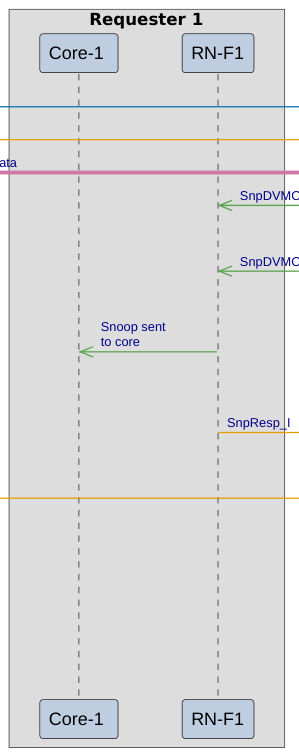

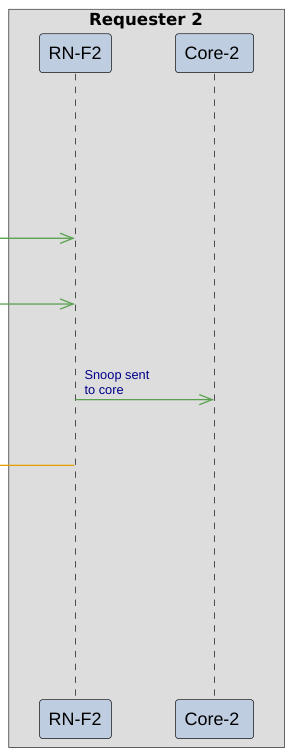

图 B8.1：Non-sync 类型 DVM 事务流程

图 B8.1 所示的必需步骤如下：

1. RN-F0 使用与 DVMType 相应的写语义，向杂项节点发送 DVMOp(Non-sync)。
2. 杂项节点接受 DVMOp(Non-sync) 请求，并提供 DBIDResp 响应。
3. RN-F0 在数据通道上发送一个 8 字节数据包。
4. 杂项节点向系统中其余的 RN-F 和 RN-D 节点广播 SnpDVMOp 侦听请求。杂项节点允许（但非必需）向发出原始 DVMOp 的 RN 发送 SnpDVMOp。SnpDVMOp 在侦听通道上发送，并且需要两个侦听请求。SnpDVMOp 的两个部分通过后缀 _P1 和 _P2 来标记。

> **注意**
>
> 消息的两个部分必须携带相同的 TxnID。请求节点必须有可用资源来接受 SnpDVMOp。参见 B8.2.3 流控。

5. 完成所需操作后，SnpDVMOp 的每个接收方都向杂项节点发送单个 SnpResp 响应。

> **注意**
>
> 发送 SnpResp 意味着目标请求节点已将 SnpDVMOp 转发到所需的请求节点结构，并且已释放接受另一个 DVM 操作所需的资源。发送 SnpResp 并不意味着所请求的 DVM 操作已经完成。参见 B8.2.2 Sync 类型 DVM 事务流程。

6. 收到所有 SnpResp 响应之后，杂项节点向请求节点发送 Comp 响应。

##### B8.2.1.1 Non-sync DVMOp 的 DVM 提前 Comp

互连中的杂项节点允许在无需等待完成对请求节点所需的侦听的情况下，为 Non-sync DVMOp 发送 Comp。杂项节点必须将 Non-sync DVMOp 相对于稍后从同一源收到的任何 Sync DVMOp 进行排序。如果杂项节点无法提供这种排序保证，则在为 Non-sync DVMOp 发送 Comp 响应之前，侦听必须已完成。

对于被允许为 Non-sync DVMOp 发送提前 Comp 的杂项节点，允许其择机将 Comp 和 DBIDResp 响应合并为单个 CompDBIDResp 响应。

> **注意**
>
> 提前为 Non-sync DVMOp 发送 Comp 响应可减少 DVMOp 完成的往返时延。这使单个源可以流水化更多 DVMOp 事务。

这种提前完成也能使 Sync DVMOp 得以继续，该 Sync DVMOp 正在等待同一请求节点此前发送的所有相关 DVMOp 事务的完成。

对于 Sync DVMOp，杂项节点仍必须等待收到该 Sync DVMOp 的侦听响应，之后才能向请求方发送该 Sync DVMOp 的 Comp。

#### B8.2.2 Sync 类型 DVM 事务流程

图 B8.2 展示了 Sync DVM 事务中的流程。

请求方 0  ICN

RN-F0 MN

DVMOp(Sync)

DBIDResp

NonCopyBackWriteData

Comp

RN-F0 MN

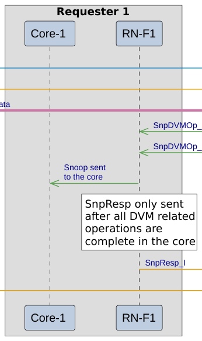

图 B8.2：Sync DVM 事务流程

图 B8.2 所示的必需步骤如下：

1. RN-F0 向杂项节点发送 DVMOp(Sync)。

> **注意**
>
> 所有需要由 DVMOp(Sync) 保证其完成的先前 DVMOp 请求，必须在请求节点可以发送 DVMOp(Sync) 之前已收到 Comp 响应。

2. 杂项节点接受 DVMOp(Sync) 请求，并向请求方发送 DBIDResp 响应。
3. RN-F0 在数据通道上发送一个数据包，数据大小为 8 字节。
4. 杂项节点向 RN-F1 发送 SnpDVMOp。杂项节点允许（但非必需）向发起原始 DVMOp 的 RN 发送 SnpDVMOp。SnpDVMOp 在侦听通道上发送，并且需要两个 Snoop 请求。SnpDVMOp 的两个部分通过后缀 _P1 和 _P2 来标记。
5. 完成 DVM Sync 操作后，RN-F1 向杂项节点发送 SnpResp 响应。

> **注意**
>
> 发送 SnpResp 意味着所有与 DVM 相关的操作都已在请求节点的结构中完成，并且目标请求节点已释放接受另一个 SnpDVMOp 所需的资源。

6. 收到 SnpResp 后，杂项节点向 RN-F0 发送 Comp 响应。

#### B8.2.3 流控

本节描述 DVMOp 和 SnpDVMOp 的流控要求。

##### B8.2.3.1 DVMOp

DVMOp 的流控要求包括：

- DVMOp 可以收到来自杂项节点的 RetryAck 响应。
- 收到 RetryAck 响应的 DVMOp 必须等待来自具有相应 PCrdType 的杂项节点的 PCrdGrant 响应。
- 所有需要由 DVMOp(Sync) 保证其完成的先前 DVMOp 请求，必须在请求节点可以发送 DVMOp(Sync) 之前已收到 Comp 响应。
- 对于 DVMOp(Non-sync) 操作，互连必须保证前向进展。这要求杂项节点中至少有一个 tracker 条目保留给 DVMOp(Non-Sync)。
- 如果并不要求 DVMOp(Sync) 保证 DMVOp(Non-sync) 的完成，则允许来自同一请求节点的 DVMOp(Non-sync) 与 DVMOp(Sync) 重叠。

##### B8.2.3.2 SnpDVMOp

SnpDVMOp 的流控要求包括：

- 每个 SnpDVMOp 事务需要两个 SnpDVMOp 请求包。
- 对应于单个事务的两个 SnpDVMOp 请求包：
* 必须使用相同的 TxnID。* 必须使用相同的 SNP 通道 RP。有关更多信息，参见 B14.2.1.2 Flow control with Resource Planes。
* 可以按任意顺序发送或接收。
- 为了防止因使用侦听通道的两部分 SnpDVMOp 请求而产生死锁，只有当接收方请求节点已预分配资源以接受 SnpDVMOp 事务的两个部分时，才可以发送 SnpDVMOp 事务。
- 只有当对应于某个 SnpDVMOp 事务的两个 SnpDVMOp 请求包都已收到后，请求节点才必须为该事务提供响应。
- 只有当能够接受来自杂项节点的下一个 SnpDVMOp 时，请求节点才必须为某个 SnpDVMOp 提供响应。
- 系统中的每个 RN-F 和 RN-D 都会指定其可以并发接受的 SnpDVMOp 事务数量。
- 系统中的每个 RN-F 和 RN-D，除能接受 SnpDVMOp(Sync) 事务外，必须至少还能接受一个 SnpDVMOp(Non-Sync) 事务。
- 必须并发接受的 SnpDVMOp 事务的最小数量为两个。对于未指定数量的请求节点，这是默认数量。
- 对于已发出 StashOnceSep 请求的请求节点，其 SnpDVMOp(Sync) 操作必须等待，直到收到所有使用已失效页表项的 StashOnceSep 请求的未完成 StashDone 响应。

对于 SnpDVMOp(Non-sync)：

- 从杂项节点可以有多个 SnpDVMOp(Non-sync) 事务处于未完成状态。
- 请求节点在响应 SnpDVMOp(Non-Sync) 时，不得依赖任何事务的前向进展。

对于 SnpDVMOp(Sync)：

- 从杂项节点发往请求节点的 SnpDVMOp(Sync) 只能有一个处于未完成状态。
- 在响应 SnpDVMOp(Sync) 时，请求节点可以依赖任何事务的前向进展，但未完成的 DVMOp(Sync) 请求的完成除外。
- 即使请求节点持续收到更多 DVM 失效操作，它也必须及时完成 SnpDVMOp(Sync)。

### B8.3 DVMOp 字段取值限制

DVMOp 事务期间的字段取值限制如下所示：

- 表 B8.1 中的 Request 消息
- 表 B8.2 中的 Response 消息、DBIDResp、Comp 和 SnpResp
- 表 B8.3 中的 Snoop 消息
- 表 B8.4 中的 Data 消息

#### B8.3.1 Request DVMOp 字段取值限制

表 B8.1 给出了 DVMOp 事务的 Request 消息字段取值限制。

表 B8.1：DVMOp 的 Request 消息字段取值限制

| 字段名 | 限制 |
| --- | --- |
| QoS | 无限制。可以取任意值。 |
| TgtID | 预期为杂项节点的节点 ID。互连可以将其重新映射为正确的 TgtID。 |
| SrcID | 发起该 DVM 消息的请求方的源 ID。 |
| TxnID | 由请求方生成的 ID。必须遵循与任何其他事务相同的规则。 |
| ReturnNID StashNID DataTarget | 必须全为零。 |

StashNIDValid 必须为零。

Endian

Deep

PrefetchTgtHint

ReturnTxnID 必须全为零。

StashLPIDValid

StashLPID

Opcode 必须为 DVMOp。

MultiReq 必须为零。

NumReq 必须指示事务 Size 为 8 字节。

Size

Req_Addr_Width。参见 B8.4 DVM messages。Addr

PAS 必须全为零。

LikelyShared 必须为零。

下页续

表 B8.1 – 续上页

| 字段名 | 限制 |
| --- | --- |
| AllowRetry | 可以取任意值，因为 DVMOp 可能被给予 Retry。 |
| Order | 必须全为零。 |
| PCrdType | 如果 AllowRetry 为 1，则必须全为零，否则为 Credit 类型值。 |
| MemAttr | 必须全为零。 |
| SnpAttr DoDWT | 无限制。可以取任意值。参见 DVM domain。 |
| PGroupID StashGroupID TagGroupID | 不适用。必须全为零。 |
| LPID | 无限制。可以取任意值。 |
| Excl SnoopMe CAH | 必须为零。 |
| ExpCompAck | 必须为零。 |
| TagOp | 必须为零。 |
| TraceTag | 无限制。 |
| MPAM | 必须全为零。 |
| PBHA | 必须全为零。 |
| MECID StreamID | 必须全为零。 |
| SecSID1 | 必须为零。 |
| RSVDC | 无限制。可以取任意值。 |

#### B8.3.2 Response DVMOp 字段取值限制

表 B8.2 给出了 DVMOp 事务期间 Response 的 DBIDResp、SnpResp 以及 Comp 和 CompDBIDResp 消息字段取值限制。

表 B8.2：DVMOp 期间响应消息字段取值的限制

| 字段 | DBIDResp 消息 | Comp 和 CompDBIDResp 消息 | SnpResp 消息 |
| --- | --- | --- | --- |
| QoS | 无限制。可以取任意值。 | 无限制。可以取任意值。 | 无限制。可以取任意值。 |
|  |  |  | 下页续 |

表 B8.2 – 续上页

| 字段 | DBIDResp 消息 | Comp 和 CompDBIDResp 消息 | SnpResp 消息 |
| --- | --- | --- | --- |
| TgtID | 必须为原始请求方的 ID | 必须为原始请求方的 ID | 必须为正在处理 DVMOps 的杂项节点的 ID |
| SrcID | 必须为正在处理 DVMOps 的杂项节点的 ID。 | 必须为正在处理 DVMOps 的杂项节点的 ID。 | 必须为响应 snoop 的节点 ID |
| TxnID | 必须与原始请求的 TxnID 匹配 | 必须与原始请求的 TxnID 匹配 | 必须与 SnpDVMOp snoop 请求的 TxnID 匹配 |
| Opcode | 必须为 DBIDResp | 必须为 Comp 或 CompDBIDResp | 必须为 SnpResp |
| RespErr | 必须全为零 | 必须为 0b00、0b10 或 0b11 | 必须为 0b00 或 0b11 |
| Resp | 必须全为零 | 必须全为零 | 必须全为零 |
| FwdState DataPull | 必须全为零 | 必须全为零 | 必须全为零 |
| CBusy | 预期由完成方填充 | 预期由完成方填充 | 预期由完成方填充 |
| DBID PGroupID StashGroupID TagGroupID | 由正在处理 DVMOps 的杂项节点生成 | 由正在处理 DVMOps 的杂项节点生成 | 无限制。可以取任意值。 |
| PCrdType | 必须全为零 | 必须全为零 | 必须全为零 |
| TagOp | 必须全为零 | 必须全为零 | 必须全为零 |
| TraceTag | 无限制 | 无限制 | 无限制 |
| CacheLineID | 必须全为零 | 必须全为零 | 必须全为零 |

#### B8.3.3 Snoop DVMOp 字段取值限制

表 B8.3 给出了 DVMOp 事务期间 Snoop 消息字段（SnpDVMOp）的取值限制。

表 B8.3：DVMOp 的 Snoop 消息字段取值限制

| 字段名 | 限制 |
| --- | --- |
| QoS | 无限制。可以取任意值。 |
| SrcID | 必须为 Miscellaneous Node 的节点 ID。 |
| TxnID | 由 Miscellaneous Node 生成的 ID。 |

FwdNID 无限制。用作 Range 和 Num[4:0] 字段。参见表 B8.14。

下页续

表 B8.3 – 续上页

| 字段名 | 限制 |
| --- | --- |
| PBHA |  |
| FwdTxnID StashLPIDValid StashLPID | 不适用。必须为零。 |
| VMIDExt | 在 SnpDVMOp 请求的 Part 1 中必须用于 VMID[15:8]。在 SnpDVMOp 请求的 Part 2 中无限制，可以取任意值。 |
| Opcode | 必须为 SnpDVMOp。 |
| Addr | (Req_Addr_Width) - 3。参见 B8.4 DVM messages。 |
| PAS | 必须全为零。 |
| DoNotGoToSD | 必须为零。 |
| RetToSrc | 必须为零。 |
| TraceTag | 无限制。 |
| MPAM | 必须全为零。 |
| MECID | 必须全为零。 |

对应于单个 DVMOp 的两个 SnpDVMOp 请求数据包，在以下字段中必须具有相同的值：

- TxnID
- Opcode
- SrcID

#### B8.3.4 Data DVMOp 字段取值限制

表 B8.4 给出了 DVMOp 事务的 Data 消息字段取值限制。

表 B8.4：DVMOp 的 Data 消息字段取值限制

| 字段名 | 限制 |
| --- | --- |
| QoS | 无限制。可以取任意值。 |
| TgtID | 必须与 DBIDResp 响应中返回的 SrcID 相同。 |
| SrcID | 必须为原始 Requester 的 ID。 |
| TxnID | 必须与 DBIDResp 响应的 DBID 相同。 |
|  | 下页续 |

表 B8.4 – 续上页

| 字段名 | 限制 |
| --- | --- |
| HomeNID MismatchedMECID PBHA | 必须全为零。 |
| Opcode | 必须为 NonCopyBackWriteData。 |
| RespErr | 必须为 0b00 或 0b10。 |
| Resp | 必须全为零。 |
| FwdState DataSource | 必须全为零。 |
| DataPull | 必须为零。 |
| CBusy | 必须全为零。 |
| MECID DBID | 公共字段的最高有效 4 位必须全为零。无限制。可以取任意值。 |
| CCID | 必须全为零。 |
| DataID | 必须全为零。 |
| CacheLineID | 必须全为零。 |
| TagOp | 必须全为零。 |
| Tag | 必须为零。 |
| TU | 必须为零。 |
| TraceTag | 无限制。 |
| CAH | 必须为零。 |
| NumDat | 必须全为零。 |
| Replicate | 必须为零。 |
| RSVDC | 无限制。 |
| BE | 仅 BE[7:0] 必须为 1。 |
| Data | 对于 Data[63:0]，未使用的位必须为零；Data [n:64] = 可以取任意值。 |
| DataCheck | 必须为 Data 字段的相应值。 |
| Poison | 无限制。可以取任意值。 |

### B8.4 DVM messages

本节提供有关各种 DVM 消息、其关联字段以及 flit 打包的补充信息。它包含以下小节：

- B8.4.1 DVM message payload
- B8.4.2 DVM message packing
- B8.4.3 TLB Invalidate
- B8.4.4 Branch Predictor Invalidate
- B8.4.5 Instruction Cache Invalidate
- B8.4.6 Synchronization

#### B8.4.1 DVM message payload

从 Request Node 到 Miscellaneous Node 的 DVM 操作的 payload 分配在以下位置：

- Request Node 发出的 DVM 请求中的 Addr 字段。
- NonCopyBackWriteData 数据包中 Data 的低 8 字节。

从 Miscellaneous Node 到 Request Node 的 DVM 操作的 payload 使用 Addr 字段分布在两个 SnpDVMOp 请求数据包中。

建议（但并非必需）SnpDVMOp 消息的 payload 与其所源自的 DVMOp 消息的 payload 相匹配。

表 B8.5 给出了 payload 中的各种字段及其编码。

表 B8.5：DVMOp 字段与编码

| 字段 | 位 | 功能 |
| --- | --- | --- |
| AddrV | 1 | 指示消息是否包含地址。0b0 不包含地址 0b1 包含地址 |

Virtual Index（VI）有效。VIV 2 0b00 VI 无效

0b01 保留

0b10 保留

0b11 VI 有效

0b1 指示 Virtual Machine Identifier（VMID）有效。VMIDV 1

0b1 指示 Address Space Identifier（ASID）有效。ASIDV 1

Security 2 指示该无效操作适用于哪个安全状态。

各 DVMType 的编码参见表 B8.8。

Exception 2 指示该事务适用于：0b00 Hypervisor 和所有 Guest OS

EL3a 0b01

0b10 Guest OS

0b11 Hypervisor

下页续

表 B8.5 – 续上页

字段 位 功能

DVMType 3 指示 DVM 操作类型，如下：0b000 TLB Invalidate（TLBI）

0b001 Branch Predictor Invalidate（BPI）

0b010 Physical Instruction Cache Invalidate（PICI）

0b011 Virtual Instruction Cache Invalidate（VICI）

0b100 Synchronization

0b101-0b111 保留

VMID 8 Virtual Machine Identifier VMID[7:0]

ASID 16 Address Space Identifier

Stage 2 指示 Stage 1 或 Stage 1 无效：0b00 DVMv7：任意事务 DVMv8：Stage 1 和 Stage 2 均无效

0b01 仅 Stage 1 无效

0b10 仅 Stage 2 无效

0b11 Granule Protection Table（GPT）

Leaf 1 指示是否仅无效叶子条目：0b0 无效所有关联的转换。

0b1 仅无效叶子条目。

Rangeb 1 Range 可以取任意值。当 Range = 0 时，该事务为基于非范围的 TLBI 操作。对于非 TLBI 的 DVM 事务，Range 不适用且必须为零。

当 Range = 1 时，该事务为基于范围的 TLBI 操作。

Numb 5 在范围计算中用作常量乘数。所有二进制值均有效。

Scaleb 2 在地址范围指数计算中用作常量。所有二进制值均有效。

TTLb 包含待无效地址的 Translation Table Level（TTL）提示。2 详见 表 B8.6 和 表 B8.7。

下页续

表 B8.5 – 续上页

字段 位 功能

TGb Translation Granule（TG） 2 对于非范围的 TLB Invalidations，TG 和 TTL 指示表层级提示，参见表 B8.7。对于按范围的 TLB Invalidations，TG 指示颗粒大小：0b00 保留

0b01 4K

0b10 16K

0b11 64K

BaseAddr 37-41 范围的移位后基地址，根据 TG 进行移位：4K 时 BaseAddr 为 VA[MaxVA:12]

16K 时 BaseAddr 为 VA[MaxVA:14]，VA[13:12] 必须为零

64K 时 BaseAddr 为 VA[MaxVA:16]，VA[15:12] 必须为零

VA 或 49-53 Virtual Address。此字段还用于为任何 TLBI by IPA 操作传输 Intermediate Physical Address（IPA）。

PA 44-52 Physical Address。此字段用于为 GPT TLBI by PA 和 PICI by PA 操作传输 Physical Address。

VI 16 Virtual Index

VMIDExt 8 Virtual Machine Identifier VMID[15:8]

下页续

表 B8.5 – 续上页

字段 位 功能

ISc 用于 GPT TLBI by PA 操作的 Invalidation Size（IS）编码，4 包括仅 Leaf：0b0000 4K

0b0001 16K

0b0010 64K

0b0011 2MB

0b0100 32MB

0b0101 512MB

0b0110 1GB

0b0111 16GB

0b1000 64GB

0b1001 512GB

0b1010-0b1111 保留

a 仅 DVMv8。b 在非 TLBI 的 DVM 操作中不适用且必须为零。关于这些字段在 TLBI 操作中如何使用，参见 B8.4.3.1 TLB Invalidate by Range 和 B8.4.3.2 Level Hint in TLBI operations。c 在非 GPT TLBI by PA 或 GPT TLBI by PA, Leaf only 的 DVM 操作中不适用且必须为零。参见 B8.4.3.3 Invalidation Size in GPT TLBI by PA operations。

##### TTL 与 TG 字段

对于按地址范围执行的 TLB 无效（TLB Invalidation），TTL 字段可以指示翻译表遍历（translation table walk）的哪一级持有被无效地址的叶条目（leaf entry）。其编码如表 B8.6 所示。

表 B8.6：基于范围的 TLB 无效的叶条目提示

| TTL | 含义 |
| --- | --- |
| 0b00 | 无层级提示信息。 |
| 0b01 | 叶条目位于翻译表遍历的第 1 级。 |
| 0b10 | 叶条目位于翻译表遍历的第 2 级。 |
| 0b11 | 叶条目位于翻译表遍历的第 3 级。 |

对于按非范围地址执行的 TLB 无效，TTL 和 TG 字段指示翻译表遍历的哪一级持有被无效地址的叶条目。

其编码如表 B8.7 所示。

表 B8.7：非范围 TLB 无效的叶条目提示

| TG | TTL | 含义 |
| --- | --- | --- |
| 0b00 | 0b00 | 无层级提示 |
|  | 0b01 | 保留 |
|  | 0b10 | 保留 |
|  | 0b11 | 保留 |
| 0b01 | 0b00 | 叶条目位于翻译表遍历的第 0 级。 |
|  | 0b01 | 叶条目位于翻译表遍历的第 1 级。 |
|  | 0b10 | 叶条目位于翻译表遍历的第 2 级。 |
|  | 0b11 | 叶条目位于翻译表遍历的第 3 级。 |
| 0b10 | 0b00 | 保留 |
|  | 0b01 | 叶条目位于翻译表遍历的第 1 级。 |
|  | 0b10 | 叶条目位于翻译表遍历的第 2 级。 |
|  | 0b11 | 叶条目位于翻译表遍历的第 3 级。 |
| 0b11 | 0b00 | 保留 |
|  | 0b01 | 叶条目位于翻译表遍历的第 1 级。 |
|  | 0b10 | 叶条目位于翻译表遍历的第 2 级。 |
|  | 0b11 | 叶条目位于翻译表遍历的第 3 级。 |

##### Security 字段

Security 字段的含义随 DVMType 的不同而不同，如表 B8.8 所示。

表 B8.8：各 DVMType 的 Security 字段编码

| Security TLBI BPI PICI Invalidation All | Invalidation by PA | VICI |
| --- | --- | --- |
| 00 Realm Secure 和 Non-secure Root、Realm、Secure 和 Non-secure | Root | Secure 和 Non-secure |
| 01 来自 Secure 上下文的 Non-secure 地址 Reserved Realm 和 Non-secure | Realm | Reserved |
| 10 Secure Reserved Secure 和 Non-secure | Secure | Secure |
| 11 Non-secure Reserved Non-secure | Non-secure | Non-secure |
| ASID 字段 ASID 字段包含 8 位或 16 位地址空间标识符（Address Space Identifier）。 |  |  |

- Armv7 支持 8 位 ASID。
- 从 Armv8 起，支持 8 位和 16 位 ASID。

无法从一条 DVM 消息判断该消息使用的是 8 位 ASID 还是 16 位 ASID。

所有 8 位 ASID 消息都必须将 ASID[15:8] 位设置为零。

预计大多数系统会在整个系统中使用单一的 ASID 宽度，即 8 位 ASID 或 16 位 ASID。

在同时包含 8 位 ASID 和 16 位 ASID 组件的系统中，预计所有维护操作都由使用 16 位 ASID 的代理完成。这样可确保该代理能够对 8 位 ASID 和 16 位 ASID 组件都执行维护。

互操作性要求包括：

- 对于由 8 位 ASID 代理向 16 位 ASID 代理发送消息的情况，消息表现为 16 位 ASID，

其高 8 位被设置为零。

- 对于由 16 位 ASID 代理向 8 位 VMID 代理发送消息的情况：
- 如果高 8 位为零，则该消息被正确接收。
- 如果高 8 位非零，则会发生过度无效（over-invalidation），因为 8 位 ASID 代理会忽略高 8

位。

##### VMID 字段

VMID 字段包含 8 位或 16 位的虚拟机标识符（Virtual Machine Identifier）。

- Armv7 和 Armv8 支持 8 位 VMID。
- 从 Armv8.1 起，支持 8 位和 16 位 VMID。

无法从 DVM 消息判断该消息使用的是 8 位还是 16 位 VMID。

所有 8 位 VMID 消息都必须将 VMID[15:8] 字段置零。

预期大多数系统在整个系统中使用单一的 VMID 大小，即 8 位 VMID 或 16 位 VMID。

在同时包含 8 位 VMID 和 16 位 VMID 组件的系统中，预期所有维护都由使用 16 位 VMID 的代理完成。这确保该代理能够对 8 位 VMID 和 16 位 VMID 组件都执行维护。

互操作性要求包括：

- 对于 8 位 VMID 代理向 16 位 VMID 代理发送消息的情况，该消息表现为 16 位 VMID，其高 8 位被置零。
- 对于 16 位 VMID 代理向 8 位 VMID 代理发送消息的情况：
- 如果高 8 位为零，则该消息被正确接收。
- 如果高 8 位非零，则由于 8 位 VMID 代理忽略高 8 位，会发生过度无效化（over-invalidation）。

从 Armv8.1 起，使用 VMIDExt 传输 16 位 VMID 的高字节。

##### DVM 域

DVM 请求中的 SnpAttr 位用于区分 Inner 域和 Outer 域。

表 B8.9 给出了 DVM 事务中 SnpAttr 的取值编码。

表 B8.9：DVM 事务中 SnpAttr 取值编码

| SnpAttr | 域取值 |
| --- | --- |
| 0 | Inner 域 |
| 1 | Outer 域 |

还定义了两个额外的可选接口广播引脚：BROADCASTTLBIINNER 和 BROADCASTTLBIOUTER。它们决定互连中 TLBI 操作的广播。

#### B8.4.2 DVM 消息打包

表 B8.10 给出了来自请求节点的 DVMOp 请求中载荷的分布（采用 8 字节写语义），以及来自杂项节点的 SnpDVMOp 请求中载荷的分布。

在 DVMOp 中，请求中的地址字段与 8 字节写数据的组合承载完整载荷。请求中不使用 REQ.Addr[3]，其必须为零。

在两个 SnpDVMOp 请求中，两个地址字段的组合承载完整载荷。在 SnpDVMOp 请求中使用 SNP.Addr[0] 来指示正在传输的是载荷的哪一部分。

Maximum PA（MPA）与 Maximum VA（MVA）地址位的合法组合为：

- MPA = 44 : MVA = 49
- MPA = 45 : MVA = 51
- MPA = 46 至 52 : MVA = 53

参见 B8.4.3.1 TLB Invalidate by Range 和 B8.4.3.2 Level Hint in TLBI operations。

表 B8.10：DVMOp 与 SnpDVMOp 请求载荷

DVMOp REQ 中的 X DVMOp DAT SnpDVMOp 中的 X SnpDVMOp REQ.Addr[x] SNP.Addr[x] 请求第 1 部分 请求第 2 部分 位数 位数 DAT.Data[x]

Num[2:0]a 2:0 3 - 0 1 0 1 Num[3]a 3 1 0

4 1 AddrV Scale[0] 1 1 AddrV Scale[0] PA[6] PA[6] VA[6] VA[6]

5 1 VMIDV Scale[1] 2 1 VMIDV Scale[1] VIV[0] PA[7] VIV[0] PA[7] VA[7] VA[7]

6 1 ASIDV IS[0] 3 1 ASIDV IS[0] VIV[1] TTL[0] VIV[1] TTL[0] PA[8] PA[8] VA[8] VA[8]

7 1 Security[0] IS[1] 4 1 Security[0] IS[1] TTL[1] TTL[1] PA[9] PA[9] VA[9] VA[9]

8 1 Security[1] IS[2] 5 1 Security[1] IS[2] TG[0] TG[0] PA[10] PA[10] VA[10] VA[10]

下页续

表 B8.10 – 续上页

DVMOp REQ 中的 X DVMOp DAT SnpDVMOp 中的 X SnpDVMOp REQ.Addr[x] SNP.Addr[x] 请求第 1 部分 请求第 2 部分 位数 位数 DAT.Data[x]

9 1 Exception[0] IS[3] 6 1 Exception[0] IS[3] TG[1] TG[1] PA[11] PA[11] VA[11] VA[11]

10 1 Exception[1] VA[12] 7 1 Exception[1] VA[12] PA[12] PA[12]

13:11 3 DVMType[2:0] VA[15:13] 10:8 3 DVMType[2:0] VA[15:13] PA[15:13] PA[15:13]

21:14 8 VMID[7:0] VA[23:16] 18:11 8 VMID[7:0] VA[23:16] VI[27:20] PA[23:16] VI[27:20] PA[23:16]

37:22 16 ASID[15:0] VA[39:24] 34:19 16 ASID[15:0] VA[39:24] VI[19:12]b VI[19:12]b PA[39:24] PA[39:24]

39:38 2 Stage VA[41:40] 36:35 2 Stage VA[41:40] PA[41:40] PA[41:40]

40 1 Leaf VA[42] 37 1 Leaf VA[42] PA[42] PA[42] Rangec 41 1 VA[43] 38 1 VA[46] VA[43] PA[43] PA[43] Num[4]a 42 1 VA[44] 39 1 VA[47] VA[44] PA[44] PA[44]

43 1 - VA[45] 40 1 VA[48] VA[45] PA[45] PA[45]

44 1 - VA[46] 41 1 VA[50] VA[49] PA[46] PA[46]

45 1 - VA[47] 42 1 VA[52] VA[51] PA[47] PA[47]

48:46 3 - VA[50:48] 45:43 3 - PA[50:48] PA[50:48]

49 1 - VA[51] 46 1 - PA[51] PA[51]

50 1 - VA[52] 47 1 - -

55:51 5 - - 48 1 - - VMID[15:8]d 63:56 8 -

a 对于 SnpDVMOp 请求的第 2 部分，来自相应 DVMOp 请求的 Num[4:0] 随 Addr 字段一起承载在侦听 flit 的 FwdNID 字段上。参见表 B8.14。 b 当用作虚拟索引 VA（VI VA）时，REQ.Addr[37:30]、DAT.Data[37:30] 和 SNP.Addr[34:27] 可以取任意值。 c 对于 SnpDVMOp 请求的第 1 部分，来自相应 DVMOp 请求的 Range 随 Addr 字段一起承载在侦听 flit 的 FwdNID 字段上。参见表 B8.14。 d 对于 SnpDVMOp 请求的第 1 部分，来自相应 DVMOp 请求的 VMID[15:8] 随 Addr 字段一起承载在侦听 flit 的 VMIDExt 字段上。参见表 B13.8。

#### B8.4.3 TLB Invalidate

本节详细介绍 TLB Invalidate（TLBI）消息。

对于 TLBI 消息，部分字段具有固定取值，如表 B8.11 所示

表 B8.11：TLBI 消息的固定字段取值

| 字段 | 取值 | 状态 |
| --- | --- | --- |
| DVMType | 0b000 | TLBI |

TLBI 必须作用于哪些条目取决于消息中的字段。

表 B8.12 列出了所有支持的 TLBI 操作。

Arm 列指示支持该消息所需的最低 Arm 架构版本。

表 B8.12：TLBI 消息

| 操作 | Arm | Exception | Security | VMIDV | ASIDV | Leaf | Stage | AddrV |
| --- | --- | --- | --- | --- | --- | --- | --- | --- |
| EL3 TLBI all | v8 | 0b01 | 0b10 | 0b0 | 0b0 | 0b0 | 0b00 | 0b0 |
| EL3 TLBI by VA | v8 | 0b01 | 0b10 | 0b0 | 0b0 | 0b0 | 0b00 | 0b1 |
| EL3 TLBI by VA, Leaf only | v8 | 0b01 | 0b10 | 0b0 | 0b0 | 0b1 | 0b00 | 0b1 |
| Secure Guest OS TLBI by Non-secure IPA | v8.4 | 0b10 | 0b01 | 0b1 | 0b0 | 0b0 | 0b10 | 0b1 |
| Secure Guest OS TLBI by Non-secure IPA, Leaf only | v8.4 | 0b10 | 0b01 | 0b1 | 0b0 | 0b1 | 0b10 | 0b1 |
| Secure TLBI all | v7 | 0b10 | 0b10 | 0b0 | 0b0 | 0b0 | 0b00 | 0b0 |
| Secure TLBI by VA | v7 | 0b10 | 0b10 | 0b0 | 0b0 | 0b0 | 0b00 | 0b1 |
| Secure TLBI by VA, Leaf only | v8 | 0b10 | 0b10 | 0b0 | 0b0 | 0b1 | 0b00 | 0b1 |
| Secure TLBI by ASID | v7 | 0b10 | 0b10 | 0b0 | 0b1 | 0b0 | 0b00 | 0b0 |
| Secure TLBI by ASID and VA | v7 | 0b10 | 0b10 | 0b0 | 0b1 | 0b0 | 0b00 | 0b1 |
| Secure TLBI by ASID and VA, Leaf only | v8 | 0b10 | 0b10 | 0b0 | 0b1 | 0b1 | 0b00 | 0b1 |
| Secure Guest OS TLBI all | v8.4 | 0b10 | 0b10 | 0b1 | 0b0 | 0b0 | 0b00 | 0b0 |
| Secure Guest OS TLBI by VA | v8.4 | 0b10 | 0b10 | 0b1 | 0b0 | 0b0 | 0b00 | 0b1 |
| Secure Guest OS TLBI all, Stage 1 only | v8.4 | 0b10 | 0b10 | 0b1 | 0b0 | 0b0 | 0b01 | 0b0 |
| Secure Guest OS TLBI by Secure IPA | v8.4 | 0b10 | 0b10 | 0b1 | 0b0 | 0b0 | 0b10 | 0b1 |
| Secure Guest OS TLBI by VA, Leaf only | v8.4 | 0b10 | 0b10 | 0b1 | 0b0 | 0b1 | 0b00 | 0b1 |
| Secure Guest OS TLBI by Secure IPA, Leaf only | v8.4 | 0b10 | 0b10 | 0b1 | 0b0 | 0b1 | 0b10 | 0b1 |
| Secure Guest OS TLBI by ASID | v8.4 | 0b10 | 0b10 | 0b1 | 0b1 | 0b0 | 0b00 | 0b0 |
| Secure Guest OS TLBI by ASID and VA | v8.4 | 0b10 | 0b10 | 0b1 | 0b1 | 0b0 | 0b00 | 0b1 |
| Secure Guest OS TLBI by ASID and VA, Leaf only | v8.4 | 0b10 | 0b10 | 0b1 | 0b1 | 0b1 | 0b00 | 0b1 |
| All OS TLBI all | v7 | 0b10 | 0b11 | 0b0 | 0b0 | 0b0 | 0b00 | 0b0 |
| Guest OS TLBI all, Stage 1 and 2 | v7 | 0b10 | 0b11 | 0b1 | 0b0 | 0b0 | 0b00 | 0b0 |

下页续

表 B8.12 – 续上页

| 操作 | Arm | Exception | Security | VMIDV | ASIDV | Leaf | Stage | AddrV |
| --- | --- | --- | --- | --- | --- | --- | --- | --- |
| Guest OS TLBI by VA | v7 | 0b10 | 0b11 | 0b1 | 0b0 | 0b0 | 0b00 | 0b1 |
| Guest OS TLBI all, Stage 1 only | v8 | 0b10 | 0b11 | 0b1 | 0b0 | 0b0 | 0b01 | 0b0 |
| Guest OS TLBI by IPA | v8 | 0b10 | 0b11 | 0b1 | 0b0 | 0b0 | 0b10 | 0b1 |
| Guest OS TLBI by VA, Leaf only | v8 | 0b10 | 0b11 | 0b1 | 0b0 | 0b1 | 0b00 | 0b1 |
| Guest OS TLBI by IPA, Leaf only | v8 | 0b10 | 0b11 | 0b1 | 0b0 | 0b1 | 0b10 | 0b1 |
| Guest OS TLBI by ASID | v7 | 0b10 | 0b11 | 0b1 | 0b1 | 0b0 | 0b00 | 0b0 |
| Guest OS TLBI by ASID and VA | v7 | 0b10 | 0b11 | 0b1 | 0b1 | 0b0 | 0b00 | 0b1 |
| Guest OS TLBI by ASID and VA, Leaf only | v8 | 0b10 | 0b11 | 0b1 | 0b1 | 0b1 | 0b00 | 0b1 |
| Secure Hypervisor TLBI all | v8.4 | 0b11 | 0b10 | 0b0 | 0b0 | 0b0 | 0b00 | 0b0 |
| Secure Hypervisor TLBI by VA | v8.4 | 0b11 | 0b10 | 0b0 | 0b0 | 0b0 | 0b00 | 0b1 |
| Secure Hypervisor TLBI by VA, Leaf only | v8.4 | 0b11 | 0b10 | 0b0 | 0b0 | 0b1 | 0b00 | 0b1 |
| Secure Hypervisor TLBI by ASID | v8.4 | 0b11 | 0b10 | 0b0 | 0b1 | 0b0 | 0b00 | 0b0 |
| Secure Hypervisor TLBI by ASID and VA | v8.4 | 0b11 | 0b10 | 0b0 | 0b1 | 0b0 | 0b00 | 0b1 |
| Secure Hypervisor TLBI by ASID and VA, Leaf only | v8.4 | 0b11 | 0b10 | 0b0 | 0b1 | 0b1 | 0b00 | 0b1 |
| Hypervisor TLBI all | v7 | 0b11 | 0b11 | 0b0 | 0b0 | 0b0 | 0b00 | 0b0 |
| Hypervisor TLBI by VA | v7 | 0b11 | 0b11 | 0b0 | 0b0 | 0b0 | 0b00 | 0b1 |
| Hypervisor TLBI by VA, Leaf only | v8 | 0b11 | 0b11 | 0b0 | 0b0 | 0b1 | 0b00 | 0b1 |
| Hypervisor TLBI by ASID | v8.1 | 0b11 | 0b11 | 0b0 | 0b1 | 0b0 | 0b00 | 0b0 |
| Hypervisor TLBI by ASID and VA | v8.1 | 0b11 | 0b11 | 0b0 | 0b1 | 0b0 | 0b00 | 0b1 |
| Hypervisor TLBI by ASID and VA, Leaf only | v8.1 | 0b11 | 0b11 | 0b0 | 0b1 | 0b1 | 0b00 | 0b1 |
| Realm TLBI all | v9.2 | 0b10 | 0b00 | 0b0 | 0b0 | 0b0 | 0b00 | 0b0 |
| Realm Guest OS TLBI all, Stage 1 only | v9.2 | 0b10 | 0b00 | 0b1 | 0b0 | 0b0 | 0b01 | 0b0 |
| Realm Guest OS TLBI all, Stage 1 and 2 | v9.2 | 0b10 | 0b00 | 0b1 | 0b0 | 0b0 | 0b00 | 0b0 |
| Realm Guest OS TLBI by VA | v9.2 | 0b10 | 0b00 | 0b1 | 0b0 | 0b0 | 0b00 | 0b1 |
| Realm Guest OS TLBI by VA, Leaf only | v9.2 | 0b10 | 0b00 | 0b1 | 0b0 | 0b1 | 0b00 | 0b1 |
| Realm Guest OS TLBI by ASID | v9.2 | 0b10 | 0b00 | 0b1 | 0b1 | 0b0 | 0b00 | 0b0 |
| Realm Guest OS TLBI by ASID and VA | v9.2 | 0b10 | 0b00 | 0b1 | 0b1 | 0b0 | 0b00 | 0b1 |
| Realm Guest OS TLBI by ASID and VA, Leaf only | v9.2 | 0b10 | 0b00 | 0b1 | 0b1 | 0b1 | 0b00 | 0b1 |
| Realm Guest OS TLBI by IPA | v9.2 | 0b10 | 0b00 | 0b1 | 0b0 | 0b0 | 0b10 | 0b1 |
| Realm Guest OS TLBI by IPA, Leaf only | v9.2 | 0b10 | 0b00 | 0b1 | 0b0 | 0b1 | 0b10 | 0b1 |

下页续

表 B8.12 – 续上页

| 操作 | Arm | Exception | Security | VMIDV | ASIDV | Leaf | Stage | AddrV |
| --- | --- | --- | --- | --- | --- | --- | --- | --- |
| Realm Hypervisor TLBI 全部 | v9.2 | 0b11 | 0b00 | 0b0 | 0b0 | 0b0 | 0b00 | 0b0 |
| Realm Hypervisor 按 VA 的 TLBI | v9.2 | 0b11 | 0b00 | 0b0 | 0b0 | 0b0 | 0b00 | 0b1 |
| Realm Hypervisor 按 VA 的 TLBI，仅叶条目 | v9.2 | 0b11 | 0b00 | 0b0 | 0b0 | 0b1 | 0b00 | 0b1 |
| Realm Hypervisor 按 ASID 的 TLBI | v9.2 | 0b11 | 0b00 | 0b0 | 0b1 | 0b0 | 0b00 | 0b0 |
| Realm Hypervisor 按 ASID 和 VA 的 TLBI | v9.2 | 0b11 | 0b00 | 0b0 | 0b1 | 0b0 | 0b00 | 0b1 |
| Realm Hypervisor 按 ASID 和 VA 的 TLBI，仅叶条目 | v9.2 | 0b11 | 0b00 | 0b0 | 0b1 | 0b1 | 0b00 | 0b1 |
| 按 PA 的 GPT TLBI | v9.2 | 0b01 | 0b10 | 0b0 | 0b0 | 0b0 | 0b11 | 0b1 |
| 按 PA 的 GPT TLBI，仅叶条目 | v9.2 | 0b01 | 0b10 | 0b0 | 0b0 | 0b1 | 0b11 | 0b1 |
| GPT TLBI 全部 | v9.2 | 0b01 | 0b10 | 0b0 | 0b0 | 0b0 | 0b11 | 0b0 |

##### B8.4.3.1 按范围的 TLB 无效操作

当 DVM_Support 为 DVM_v8.4 或更高版本时，按 IPA 或 VA 执行的 TLBI 操作可以选择对某个地址范围进行操作，条件是 Range 字段为 0b1。

基于范围的 TLBI 操作除了包含非基于范围的 TLBI 操作中的载荷字段外，还包含范围专用的载荷。

###### B8.4.3.1.1 按 VA 和 IPA 的 TLBI 操作的基于范围的载荷打包

按 VA 和 IPA 的 TLBI 操作的基于范围的字段包括：

- Range
- BaseAddr
- TG
- TTL
- Scale
- Num

> **注意**
>
> 对于按 VA 或 IPA 的非基于范围的 TLBI 操作，TG 和 TTL 字段可用作 Level 提示。参见 B8.4.3.2 Level Hint in TLBI operations。

对于按 VA 或 IPA 的 TLBI 操作，当 Range 字段置为 1 时，需要无效的地址范围使用以下公式计算，其中以字节为单位的 Translation_Granule_Size 由 TG 值确定，如表 B8.13 所示：

(Num + 1) × 2(5×Scale+1) × Translation_Granule_Size   BaseAddr ≤AddressRange < BaseAddr+

表 B8.13：适用于地址范围的 TLB 指令中的 TG 字段编码

| TG | 翻译粒度大小 | Translation_Granule_Size |
| --- | --- | --- |
| 00 | 保留 | 不适用 |
| 01 | 4KB 翻译粒度 | 4096 |
| 10 | 16KB 翻译粒度 | 16384 |
| 11 | 64KB 翻译粒度 | 65536 |

这些范围参数按表 B8.10 所示放置在请求数据包中。

Range 和 Num 值与相应 Snoop 事务的 Addr 字段一起，承载在 Snoop flit 中的 FwdNID 字段上。SnpDVMOp 中 FwdNID 的未使用位必须为零。

表 B8.14 示出了 Range 和 Num 值在 SnpDVMOp 载荷中的放置位置。

表 B8.14：SnpDVMOp 载荷中 Num 值的放置位置

FwdNID 位 SnpDVMOp 请求

第 1 部分 第 2 部分

0 Range Num[0]

1 0 Num[1]

2 0 Num[2]

3 0 Num[3]

4 0 Num[4]

5 0 0

6 0 0

##### B8.4.3.2 TLBI 操作中的 Level 提示

按 VA 或 IPA 的非基于范围的 TLBI 操作允许使用 TG 和 TTL 字段。这些操作使用 TG 和 TTL 来指示页表遍历的层级，该层级的叶条目标识了正在无效的地址。对于此类操作，适用以下条件：

- Range 字段必须为零。
- Num 和 Scale 字段不适用，并且必须为零。

##### B8.4.3.3 按 PA 的 GPT TLBI 操作中的无效大小

按 PA 的 GPT TLBI 操作执行基于范围的无效操作：从 PA 开始，在 IS 字段所指定的范围内无效 TLB 条目。

按 PA 的 GPT TLBI 操作的基于范围的字段为 IS 和 PA。如果 PA 未按 IS 值对齐，则不要求无效任何 TLB 条目。

IS 字段仅适用于按 PA 的 GPT TLBI 操作。

对于按 PA 的 GPT TLBI 操作，Range 字段适用，并且必须为 1。

对于 GPT TLBI 全部操作，Range 字段适用，并且必须为 0。

对于 GPT TLBI 操作，Num 和 Scale 字段不适用，并且必须为 0。

#### B8.4.4 Branch Predictor Invalidate

本节介绍 Branch Predictor Invalidate（BPI，分支预测器无效化）操作。

BPI 消息用于从分支预测器中无效化虚拟地址。

BPI 消息的固定字段取值如表 B8.15 所示。

表 B8.15：Branch Predictor Invalidate 消息的固定字段取值

| Field | Value | Status |
| --- | --- | --- |
| DVMType | 0b001 | Branch Predictor Invalidate |
| Part Num | - | 见表 B8.10 |
| VMIDV | 0b0 | VMID 字段无效 |
| ASIDV | 0b0 | ASID 字段无效 |
| Security | 0b00 | 同时适用于 Secure 和 Non-secure |
| Exception | 0b00 | 适用于所有 Guest OS 和 Hypervisor |
| VMID VMIDExt | 0xXX | 未指定 VMID |
| ASID | 0xXXXX | 未指定 ASID |
| Stage | 0b00 | 保留，置为 0 |
| Leaf | 0b0 | 保留，置为 0 |
| 注 不支持 BPI 与 16 位 ASID 一起使用。 |  |  |

表 B8.16 列出了 BPI 支持的操作。

表 B8.16：Branch Predictor Invalidate 操作

| Operation | Arm | AddrV |
| --- | --- | --- |
| Branch Predictor Invalidate all | v7 | 0b0 |
| Branch Predictor Invalidate by VA | v7 | 0b1 |

#### B8.4.5 Instruction Cache Invalidate

指令缓存可以使用 PA 或 VA 来标记其包含的数据。一个系统中可能同时包含这两种形式的缓存。

DVM 协议既包含使用物理地址（Physical Address）的指令缓存无效化操作，也包含使用虚拟地址（Virtual Address）的指令缓存无效化操作。

接收 DVM 消息的组件必须同时支持这两种形式的报文，与所实现的指令缓存类型无关。当收到的某条消息格式不是该缓存类型的原生格式时，可能需要进行过度无效化（over-invalidation）。

##### B8.4.5.1 Physical Instruction Cache Invalidate

本节介绍 DVM 消息所支持的 Physical Instruction Cache Invalidate（PICI，物理指令缓存无效化）操作。该消息类型也用于虚拟索引物理标记（Virtually Indexed Physically Tagged，VIPT）的指令缓存。

PICI 消息的固定字段取值如表 B8.17 所示。

表 B8.17：Physical Instruction Cache Invalidate 消息的固定字段取值

| Field | Value | Status |
| --- | --- | --- |
| DVMType | 0b010 | Physical Instruction Cache Invalidate |
| Part Num | - | 见表 B8.10 |
| Exception | 0b00 | 适用于所有 Guest OS 和 Hypervisor |
| Stage | 0b00 | 保留，置为 0 |
| Leaf | 0b0 | 保留，置为 0 |

所有支持的 PICI 操作如表 B8.18 所示。

表 B8.18：Physical Instruction Cache Invalidate 操作

| Operation | Arm | Security | VIV | AddrV |
| --- | --- | --- | --- | --- |
| PICI all Root, Realm, Secure, and Non-secure | v9.2 | 0b00 | 0b00 | 0b0 |
| PICI by PA without Virtual Index, Root only | v9.2 | 0b00 | 0b00 | 0b1 |
| PICI by PA with Virtual Index, Root only | v9.2 | 0b00 | 0b11 | 0b1 |
| PICI all Realm and Non-secure | v9.2 | 0b01 | 0b00 | 0b0 |
| PICI by PA without Virtual Index, Realm only | v9.2 | 0b01 | 0b00 | 0b1 |
| PICI by PA with Virtual Index, Realm only | v9.2 | 0b01 | 0b11 | 0b1 |
| PICI all Secure and Non-secure | v7 | 0b10 | 0b00 | 0b0 |
| PICI by PA without Virtual Index, Secure only | v7 | 0b10 | 0b00 | 0b1 |
| PICI by PA with Virtual Index, Secure only | v7 | 0b10 | 0b11 | 0b1 |
| PICI all, Non-secure only | v7 | 0b11 | 0b00 | 0b0 |
| PICI by PA without Virtual Index, Non-secure only | v7 | 0b11 | 0b00 | 0b1 |
| PICI by PA with Virtual Index, Non-secure only | v7 | 0b11 | 0b11 | 0b1 |
| 注 当 VIV 为 0b11 时，VI[19:12] 被用作 PA 的一部分。 |  |  |  |  |

##### B8.4.5.2 Virtual Instruction Cache Invalidate

本节介绍 Virtual Instruction Cache Invalidate（VICI）操作。

VICI 消息的固定字段取值如表 B8.19 所示。

表 B8.19：Virtual Instruction Cache Invalidate 消息的固定字段取值

| 字段 | 取值 | 状态 |
| --- | --- | --- |
| DVMType | 0b011 | Virtual Instruction Cache Invalidate |
| Part Num | - | 见 Table B8.10 |
| Stage | 0b00 | 保留，置为 0 |
| Leaf | 0b0 | 保留，置为 0 |

表 B8.20 给出了 VICI 支持的操作。

表 B8.20：Virtual Instruction Cache Invalidate 操作

| Operation | Arm | Exception | Security | VMIDV | ASIDV | AddV |
| --- | --- | --- | --- | --- | --- | --- |
| Hypervisor and all Guest OS VICI all, Secure and Non-secure | v7 | 0b00 | 0b00 | 0b0 | 0b0 | 0b0 |
| Hypervisor and all Guest OS VICI all, Non-secure only | v7 | 0b00 | 0b11 | 0b0 | 0b0 | 0b0 |
| All Guest OS VICI by ASID and VA, Secure only | v7 | 0b10 | 0b10 | 0b0 | 0b1 | 0b1 |
| All Guest OS VICI by VMID, Secure only | v8.4 | 0b10 | 0b10 | 0b1 | 0b0 | 0b0 |
| All Guest OS VICI by ASID, VA and VMID, Secure only | v8.4 | 0b10 | 0b10 | 0b1 | 0b1 | 0b1 |
| All Guest OS VICI by VMID, Non-secure only | v7 | 0b10 | 0b11 | 0b1 | 0b0 | 0b0 |
| All Guest OS VICI by ASID, VA and VMID, Non-secure only | v7 | 0b10 | 0b11 | 0b1 | 0b1 | 0b1 |
| Hypervisor VICI by VA, Non-secure only | v7 | 0b11 | 0b11 | 0b0 | 0b0 | 0b1 |
| Hypervisor VICI by ASID and VA, Non-secure only | v8.1 | 0b11 | 0b11 | 0b0 | 0b1 | 0b1 |

#### B8.4.6 Synchronization

本节介绍 DVMSync 操作。

当请求方需要知道此前所有失效操作何时完成时，会使用 Synchronization（Sync）消息。

Sync 消息的固定字段取值如表 B8.21 所示。

表 B8.21：Sync 操作固定取值

| 字段 | 取值 | 状态 |
| --- | --- | --- |
| DVMType | 0b100 | Synchronization 消息。 |
| Part Num | - | 见 Table B8.10。 |
| AddrV | 0b0 | 无地址信息可用。 |
| VMIDV | 0b0 | 无 VMID 信息可用。 |
|  |  | 下页续 |

表 B8.21 – 续上页

| 字段 | 取值 | 状态 |
| --- | --- | --- |
| ASIDV | 0b0 | 无 ASID 信息可用。 |
| Security | 0b00 | 安全信息不适用。 |
| Exception | 0b00 | 异常信息不适用。 |
| VMID VMIDExt | 0xXX | 未指定 VMID。 |
| ASID | 0xXXXX | 未指定 ASID。 |
| Stage | 0b00 | Stage 信息不适用。 |
| Leaf | 0b0 | Leaf 信息不适用。 |

Chapter B9

## B9 Error Handling

本章介绍错误处理相关要求。本章包含以下小节：

- B9.1 Packet level
- B9.2 Sub-packet level
- B9.3 Use of interface parity
- B9.4 Hardware and software error categories

### B9.1 Packet level

本节介绍数据包层面的错误。本节包含以下小节：

- B9.1.1 Error types
- B9.1.2 Error response fields

#### B9.1.1 Error types

数据包层面有两种错误报告类型。

数据包层面的错误报告类型包括：

Data Error，DERR：当访问的地址位置正确，但在数据内部检测到错误时使用。通常，在由纠错码（ECC）或奇偶校验检测到数据损坏时使用该类型。Data Error 报告由以下方式支持：

- DAT 数据包中的 RespErr、Poison 和 DataCheck 字段
- RSP 数据包中的 RespErr 字段

当 Home 收到的一个请求需要传播到从属节点，而该请求的处理产生 DERR 时，Home 必须不停止将该请求传播到从属节点。

> **注意**
>
> 从 Home 中逐出的数据出现错误，或作为该请求的结果在侦听响应中收到的数据出现错误，都是该请求产生 DERR 的示例。

Non-data Error，NDERR：当检测到与数据损坏无关的错误时使用。本规范未定义报告该错误类型的所有情形。通常，该错误类型在以下情况下报告：

- 试图访问不存在的位置。
- 非法访问，例如写入只读位置。
- 试图使用不支持的事务类型。

Non-data Error 报告由 RSP 和 DAT 数据包中的 RespErr 字段支持。当 Home 收到的一个请求的处理产生 NDERR 时，允许（但不要求）将该请求传播到从属节点。Home 必须在返回给请求方的响应中传回 NDERR。

#### B9.1.2 错误响应字段

RespErr 字段用于指示错误状况。RespErr 字段同时包含在 Response 数据包和 Data 数据包中。

表 B9.1 展示了 RespErr 字段的编码。有关 Exclusive Okay 响应的更多详细信息，请参见 B6.3.1 Responses to Exclusive requests。

表 B9.1：错误响应字段编码

RespErr[1:0] 名称 描述

0b00 OK Normal Okay。表示以下任一情况：

- 普通访问成功。对于 WriteNoSnpDef，

RespErr 必须与 Resp 结合使用，以确定确切的响应。参见表 B4.29。

- 独占访问失败。

| 0b01 | EXOK | Exclusive Okay。表示独占访问的读部分或写部分已成功。 |
| --- | --- | --- |
| 0b10 | DERR | 数据错误 |
| 0b11 | NDERR | 非数据错误 |

单个事务不允许混合使用 OK 和 EXOK 响应。

带有 Data 响应的事务，必须要么在所有 Data 数据包中都不包含 NDERR，要么在所有 Data 数据包中都包含 NDERR。

允许在单个事务内混合使用 OK 和 DERR 响应。

允许在单个事务内混合使用 EXOK 和 DERR 响应。

允许在单个事务内混合使用 OK 和 NDERR 响应，这种情况只能出现在同时具有 Data 响应和非数据响应的事务中。

不允许混合使用 EXOK 和 NDERR。

#### B9.1.3 错误与事务结构

所有事务都必须以符合协议的方式完成，即使其中包含错误响应。

使用 DMT 的事务的错误处理，与不使用 DMT 的同一请求的错误处理相同。

由于请求或侦听上不存在传播错误的机制，如果在互连处检测到错误，则请求必须不使用 DMT 或 DCT。

如果事务包含数据包，则数据包的源必须发送正确数量的数据包，但数据值不要求有效。

Resp 字段给出与事务关联的缓存状态，并且可能受错误状况影响。有关合法 Resp 字段取值的更多详细信息，请参见 B4.5 Response types。在带有 NDERR 指示的响应中，Resp 中编码的缓存状态可以是任何值，包括保留值。

无论是否存在错误状况，响应中的 Resp 字段对于 Data 消息的每个数据包都必须具有相同的值。

对于 Snoopable 请求，收到带有 NDERR 的响应的请求方必须：

- 对于 Allocating 事务：
- 当起始状态为 I 时，请求方必须不分配接收到的数据。
- 如果请求是从 Non-Invalid 状态发出的，则请求方必须保持缓存副本不变。

在两种情况下，缓存状态都必须不发生改变。

- Allocating 事务包括：
* ReadClean
* ReadNotSharedDirty * ReadShared * ReadUnique * ReadPreferUnique * MakeReadUnique * CleanUnique * MakeUnique
- 对于 deallocating 事务：
- 请求方必须继续正常执行，并以符合协议的方式进行。
- deallocating 事务包括：
* WriteBack * WriteEvictFull * Evict * WriteEvictOrEvict
- 对于不改变分配的 Other 事务：
- 请求方必须不上调缓存状态。
- 允许请求方下调缓存状态。

带有 NDERR 的 SnpResp 消息中的缓存状态必须为 I。完成方必须使该缓存行的本地缓存副本无效。此外，当对 Forwarding snoop 的响应导致 NDERR 时，Snoopee 必须不向请求方转发数据。因此，如果 CompData 消息已经发送给请求方，则发往归属节点的侦听响应必须不包含 NDERR。

#### B9.1.4 按事务类型使用错误响应

本节定义了每种事务类型对错误字段的允许使用方式（但并非必需）。

以下各表列出了与下列事务类型关联的 Data 和 Response 数据包：

- B9.1.4.1 读事务
- B9.1.4.2 无数据事务
- B9.1.4.3 写事务
- B9.1.4.4 Atomic 事务
- B9.1.4.5 其他事务
- B9.1.4.6 缓存暂存事务
- B9.1.4.7 侦听事务

各表使用以下键：

OK RespErr 字段必须包含取值为 0b00 的 OK RespErr。

Y 允许使用该 RespErr 值。

N 不允许使用该 RespErr 值。

- 该事务类型不使用 Data 或 Response 数据包。

##### B9.1.4.1 读事务

读事务可以包含多个 CompData 数据包。

已知损坏的读数据必须具有适当的错误指示，该错误可以是 Poison、DERR 或 NDERR。

当 RespSepData 包含 NDERR 时，所有对应的 DataSepResp 数据包都必须标记为 NDERR。

在对 Read 请求的 Data 响应中，NDERR 响应只允许出现在零个或全部数据响应数据包中。

表 B9.2 列出了读事务中与 Data 和 Response 数据包关联的合法 RespErr 字段值。

表 B9.2：读事务中与 Data 和 Response 数据包关联的合法 RespErr 字段值

| Read transaction | Associated Data and Response packets Read Receipt CompData OK EXOK DERR | NDERR | CompAck |
| --- | --- | --- | --- |
| ReadNoSnp | OK Y Y Y | Y | OK |
| ReadNoSnpSep | OK - - - | - | - |
| ReadOnce ReadOnceCleanInvalid ReadOnceMakeInvalid | OK Y N Y | Y | OK |
| ReadClean ReadNotSharedDirty ReadShared | - Y Y Y | Y | OK |
| ReadUnique ReadPreferUniquea MakeReadUniqueb | - Y N Y | Y | OK |

a 即使请求中的 Excl 位被置为 1，也不允许 EXOK 响应。返回的 data 响应中的 OK 响应不得被视为 ReadPreferUnique 的失败。独占序列的失败仅根据相应的 MakeReadUnique Excl 或 CleanUnique Excl 事务完成来确定。

b 仅当数据返回给请求方时适用。当数据未返回给请求方时，允许的错误参见表 B9.5。

表 B9.3 列出了读事务中与 Data-only 和 Non-data 数据包关联的合法 RespErr 字段值。

表 B9.3：读事务中与 Data-only 和 Non-data 数据包关联的合法 RespErr 字段值

| Read transaction | Associated Data-only and Non-data packets DataSepResp RespSepData OK EXOK DERR NDERR OK EXOK | DERR NDERR |
| --- | --- | --- |
| ReadNoSnp | Y N Y Y Y N | N Y |
| ReadNoSnpSep | Y N Y Y - - | - - |
| ReadOnce ReadOnceCleanInvalid ReadOnceMakeInvalid | Y N Y Y Y N | N Y |
|  |  | 下页续 |

表 B9.3 – 续上页

| Read transaction | Associated Data-only and Non-data packets DataSepResp RespSepData OK EXOK DERR NDERR OK EXOK | DERR | NDERR |
| --- | --- | --- | --- |
| ReadClean ReadNotSharedDirty ReadShared | Y N Y Y Y N | N | Y |
| ReadUnique ReadPreferUniquea MakeReadUniqueb | Y N Y Y Y N | N | Y |

a 返回的 data 响应中的 OK 响应不得被视为 ReadPreferUnique 的失败。独占序列的失败仅根据相应的 MakeReadUnique Excl 或 CleanUnique Excl 事务完成来确定。

b 仅当数据返回给请求方时适用。当数据未返回给请求方时，允许的错误参见表 B9.4。

表 B9.4 列出了 RespSepData 与 DataSepResp 相对其消息来源的合法组合。

表 B9.4：根据消息来源的 RespSepData 与 DataSepResp 合法组合

| RespSepData | DataSepResp | 当 DataSepResp 来自归属节点 / 来自从属节点时的合法组合 |
| --- | --- | --- |
| OK | OK | Y Y |
|  | NDERR | Y Y |
|  | DERR | Y Y |
| NDERR | NDERR | Y - |

##### B9.1.4.2 无数据事务

当另一个组件对该事务的处理遇到数据损坏错误时，可以为无数据事务报告 DERR。即使不发生数据传输，也可以将该 DERR 指示回发起方组件。

表 B9.5 显示了无数据事务数据包合法的 RespErr 字段取值。

表 B9.5：无数据事务合法的 RespErr 字段取值

无数据事务 关联响应数据包 CompAck

Comp Persist CompPersist NDERR NDERR NDERR EXOK EXOK EXOK DERR DERR DERR OK OK OK

CleanUnique Y Y Y Y - - - - - - - - OK

MakeReadUniquea Y N Y Y - - - - - - - - OK

MakeUnique Y N Y Y - - - - - - - - OK

CleanShared Y N Y Y - - - - - - - - -

CleanSharedPersist Y N Y Y - - - - - - - - -

CleanSharedPersistSep Y N Y Y Y N Y Y Y N Y Y -

CleanInvalid Y N Y Y - - - - - - - - -

CleanInvalidPoPA

CleanInvalidStorage

MakeInvalid

Evict Y N N Y - - - - - - - - -

a 仅当数据不返回给请求方时适用。有关数据返回给请求方时允许的错误，请参见表 B9.2 和表 B9.3。

表 B9.6 显示了对 StashOnce 事务的响应中允许的 RespErr 取值。

表 B9.6：无数据 Stash 事务合法的 RespErr 字段取值

无数据 Stash 事务 关联响应数据包

Comp StashDone CompStashDone NDERR NDERR NDERR EXOK EXOK EXOK DERR DERR DERR OK OK OK

StashOnceUnique Y N Y Y - - - - - - - -

StashOnceShared

StashOnceSepUnique Y N Y Y Y N Y Y Y N Y Y

StashOnceSepShared

##### B9.1.4.3 写事务

写事务可以包含 NDERR 或 DERR。错误可以在两个方向上发出信号：从请求方到完成方，以及从完成方返回请求方。

已知损坏的写数据必须带有适当的错误指示，该错误可以是 Poison 或 DERR。

对于写事务，完成方可以使用合并的 CompDBIDResp 或使用 Comp 响应，将错误发回给请求方。完成方甚至可以在观察到该事务的 WriteData 之前就发出错误信号，这是允许的，但不是必需的。当对事务的处理（例如缓存查找）遇到数据损坏错误时，就可能发生这种情况。

表 B9.7 显示了写事务响应数据包合法的 RespErr 字段取值。

表 B9.7：写事务合法的 RespErr 字段取值

写事务 关联响应数据包 CompAck

DBIDResp* Comp CompDBIDResp NDERR NDERR EXOK EXOK DERR DERR OK OK

| WriteNoSnp | OK | Y | Y | Y | Y | Y | Y | Y | Y | OK |
| --- | --- | --- | --- | --- | --- | --- | --- | --- | --- | --- |
| WriteNoSnpDef | OK | Ya | N | Y | Y | Ya | N | Y | Y | - |
| WriteUnique | OK | Y | N | Y | Y | Y | N | Y | Y | OK |
| WriteNoSnpZero WriteUniqueZero | OK | Y | N | Y | Y | Y | N | Y | Y | - |
| WriteBack WriteCleanFull WriteEvictFull | - | Y | N | N | Y | Y | N | Y | Y | OK |
| WriteEvictOrEvict | - | Y | N | N | Y | Y | N | Y | Y | OK |

a 在 WriteNoSnpDef 事务中，与 Resp[2:0] 组合使用，以传达 Successful、Unsupported 和 Defer 响应。参见表 B4.29。

检测到待发送写数据中存在错误的请求方，可以在写数据包中附带错误指示。这表明该数据值已知是损坏的。

表 B9.8 显示了写事务数据包合法的 RespErr 字段取值。

表 B9.8：写事务数据包中合法的 RespErr 字段取值

写事务 关联数据包

WriteData WriteDataCancel NonCopyBackWriteDataCompAck NDERR NDERR NDERR EXOK EXOK EXOK DERR DERR DERR OK OK OK

| WriteNoSnp | Y | N | Y | N | Y | N | Y | N | Y | N | Y N |
| --- | --- | --- | --- | --- | --- | --- | --- | --- | --- | --- | --- |
| WriteNoSnpDef | Y | N | Y | N | Y | N | Y | N | Y | N | Y N |
| WriteUnique | Y | N | Y | N | Y | N | Y | N | Y | N | Y N |
|  |  |  |  |  |  |  |  |  |  |  | 下页续 |

表 B9.8 – 续上页

写事务 关联数据包

WriteData WriteDataCancel NonCopyBackWriteDataCompAck NDERR NDERR NDERR EXOK EXOK EXOK DERR DERR DERR OK OK OK

WriteBack Y N Y N - - - - - - - - WriteCleanFull WriteEvictFull WriteEvictOrEvict

表 B9.9 显示了当请求方接口上支持 MTE 时，写事务 TagMatch 数据包合法的 RespErr 字段取值。

表 B9.9：写事务 TagMatch 数据包中合法的 RespErr 字段取值

| 写事务 | 关联响应数据包 TagMatch OK EXOK DERR | NDERR |
| --- | --- | --- |
| WriteNoSnp WriteUnique | Y N Y | Y |

WriteBack - - - -

WriteCleanFull

WriteEvictFull

WriteEvictOrEvict

WriteNoSnpZero

WriteUniqueZero

WriteNoSnpDef

关于 Combined Write 事务响应中允许的 RespErr 字段取值：

- 写请求的对应响应参见表 B9.7。
- CMO 请求的对应响应参见表 B9.5。

CompCMO 中允许的错误响应与表 B9.5 中 Comp 的相同。

##### B9.1.4.4 Atomic 事务

完成方在收到与某个事务关联的全部写数据并执行完所需操作之前就给出 Comp 响应，这是允许的，但不是必需的。这种行为与希望对写数据发出 Data Error 信号的组件不兼容，此类组件必须使用延迟形式的 Comp 或 CompData 响应。

在 Atomic 事务中，已知损坏的读数据或写数据必须具有适当的错误指示。读数据错误可以是 Poison、DERR 或 NDERR。写数据错误可以是 Poison 或 DERR。

在事务内，可以在以下位置发出 DERR 或 NDERR 信号：

- 在 CompDBIDResp 响应中。
- 对于 AtomicStore 事务，在 Comp 响应中。
- 对于 AtomicLoad、AtomicSwap 和 AtomicCompare 事务，在 CompData 响应中。

对于无法完成的 Atomic 事务，必须使用 NDERR。事务结构，包括所有写数据传输、读数据传输和其他响应，仍必须发生。在此 NDERR 情形中，不需要 Snoop 事务，包括因置位 SnoopMe 而产生的返回到原始请求方的那些 Snoop 事务。

无需指定与原子操作执行（例如溢出）相关的错误。所有原子操作都针对所有输入组合做了完整规定。

一个事务既包含出站数据也包含入站数据，但只有一个 Error 字段。对于 Atomic 事务，允许 Error 字段指示写数据或读数据上的错误。事务内不支持用于区分错误的各种潜在不同原因的机制。故障日志或类似结构可能能够提供此类信息，但这不是 CHI 协议的要求。

Atomic 事务中允许的 RespErr 取值是读事务和写事务中允许取值的合并。

DERR 可以在不同数据包之间有所不同。

表 B9.10 显示了 Atomic 事务响应数据包合法的 RespErr 字段取值。

表 B9.10：Atomic 事务响应数据包中合法的 RespErr 字段取值

Atomic 事务 关联响应数据包

DBIDResp* Comp CompDBIDResp NDERR NDERR EXOK EXOK DERR DERR OK OK

| AtomicStore | OK | Y | N | Y | Y | Y | N | Y | Y |
| --- | --- | --- | --- | --- | --- | --- | --- | --- | --- |
| AtomicLoad AtomicSwap AtomicCompare | OK | - | - | - | - | - | - | - | - |

表 B9.11 显示了 Atomic 事务数据包合法的 RespErr 字段取值。

表 B9.11：Atomic 事务数据包中合法的 RespErr 字段取值

Atomic 事务 关联响应数据包

WriteData CompData NDERR NDERR EXOK EXOK DERR DERR OK OK

| AtomicStore | Y | N | Y | N | - | - | - | - |
| --- | --- | --- | --- | --- | --- | --- | --- | --- |
| AtomicLoad AtomicSwap AtomicCompare | Y | N | Y | N | Y | N | Y | Y |

表 B9.12 显示了在支持 MTE 时，Atomic 事务 TagMatch 数据包合法的 RespErr 字段取值。

表 B9.12：Atomic 事务 TagMatch 数据包中合法的 RespErr 字段取值

Atomic 事务 关联响应数据包

TagMatch NDERR EXOK DERR OK

AtomicStore Y N Y Y

AtomicLoad

AtomicSwap

AtomicCompare

##### B9.1.4.5 其他事务

本节描述 DVMOp 和 PrefetchTgt 事务的错误处理要求。

###### B9.1.4.5.1 DVMOp

DVMOp 事务可以在 Comp 响应中包含 NDERR。互连可以合并某个 DVMOp 的所有侦听响应中的错误响应，并在发往请求方的最终 Comp 消息中包含单个错误响应。DBIDResp 数据包必须只使用 OK 响应。即使 WriteData 响应的发送方可能不使用 DERR，该数据包如果在传输过程中遇到错误，也可以被标记为 DERR。参见 B9.2.3 Interoperability of Poison and DataCheck。

表 B9.13 显示了 DVM 事务响应数据包合法的 RespErr 字段取值。

表 B9.13：DVM 事务响应数据包中合法的 RespErr 字段取值

DVM 事务 关联响应数据包

DBIDResp Comp CompDBIDResp NDERR NDERR EXOK EXOK DERR DERR OK OK

DVMOp OK Y N Y Y Y N Y Y

表 B9.14 显示了 DVM 事务数据包合法的 RespErr 字段取值。

表 B9.14：DVM 事务数据包中合法的 RespErr 字段取值

关联数据包

DVM 事务 NonCopyBackWriteData NDERR EXOK DERR OK

| DVMOp | Y | N | Y | N |
| --- | --- | --- | --- | --- |
| B9.1.4.5.2 PrefetchTgt 发往不支持该事务的地址的 PrefetchTgt 事务请求必须被丢弃。 |  |  |  |  |
| 注：允许（但不要求）组件记录并报告此类错误。 |  |  |  |  |

##### B9.1.4.6 缓存暂存事务

如果指定的暂存目标不支持接收暂存侦听（Stash snoop），则归属节点必须忽略暂存提示，并在不进行暂存的情况下完成该事务。此类暂存目标的示例包括 RN-I、RN-D、旧版 RN-F 或非请求节点。在这些情况下，归属节点不得向请求方发送错误信号。此类被错误指定的暂存目标可归因于软件错误。

如果归属节点不支持 Stash 请求，则必须以符合协议的方式完成该事务，且不得发送错误信号。

##### B9.1.4.7 侦听事务

包含数据的侦听事务响应可以指示 DERR。包含数据的侦听事务响应可以在同一事务内针对不同数据包混合使用 OK 和 DERR 响应。

对于已知损坏的侦听请求，其响应数据必须带有适当的错误指示，该错误可以是 Poison 或 DERR。

不包含数据的侦听事务响应可以指示 NDERR。

以 NDERR 响应的 Snoopee：

- 不得在响应中携带数据。
- 必须使任何本地缓存的副本失效。
- 必须将响应中的缓存状态设置为 Invalid。
- 不得针对 Forwarding snoop 向请求方转发 CompData 响应。因此，如果 CompData 消息已发送给请求方，则对归属节点的侦听响应不得包含 NDERR。

表 B9.15 显示了侦听请求响应数据包合法的 RespErr 字段取值。

表 B9.15：侦听事务的响应数据包中合法的 RespErr 字段取值

侦听事务关联的数据和响应数据包

SnpResp SnpRespData NDERR NDERR EXOK EXOK DERR DERR OK OK

SnpOnce Y N N Y Y N Y N

SnpClean

SnpNotSharedDirty

SnpShared

SnpUnique

SnpPreferUnique

SnpUniqueStash

SnpCleanShared

SnpCleanInvalid

SnpStashUnique Y N N Y - - - -

SnpStashShared

SnpMakeInvalid

SnpMakeInvalidStash

SnpQuery

SnpDVMOp

对于 Clean 缓存行上的 DERR，建议（但非必须）将其丢弃，既不将该错误传播到内存，也不将其包含在对请求方的响应中。

Dirty 缓存行上的 DERR 必须传播到内存，并包含在对请求方的响应中。

对 DataPull 请求的响应中的 DERR，预期不会传递到对 Stash 请求的 Comp 响应中。

对于 Forwarding snoop 事务，当同时向请求方转发数据并向归属节点返回数据时，如果其中一个响应未遇到该错误，则允许（但非必须）仅由一个响应包含 DERR 指示。

表 B9.16 显示了 Forwarding Snoop 响应数据包合法的 RespErr 字段取值。

表 B9.16：Forwarding Snoop 事务的响应数据包中合法的 RespErr 字段取值

侦听事务关联的响应数据包

SnpResp SnpRespFwded NDERR NDERR EXOK EXOK DERR DERR OK OK

SnpOnceFwd Y N N Y Y N Y N SnpCleanFwd SnpNotSharedDirtyFwd SnpSharedFwd SnpUniqueFwd SnpPreferUniqueFwd

表 B9.17 显示了 Forwarding Snoop 数据响应数据包合法的 RespErr 字段取值。

表 B9.17：Forwarding Snoop 事务的数据包中合法的 RespErr 字段取值

侦听事务关联的数据包

SnpRespData CompData

SnpRespDataFwded NDERR NDERR EXOK EXOK DERR DERR OK OK

SnpOnceFwd Y N Y N Y N Y N

SnpCleanFwd

SnpNotSharedDirtyFwd

SnpSharedFwd

SnpUniqueFwd

SnpPreferUniqueFwd

### B9.2 子数据包级别

子数据包级别有两种类型的错误报告：

- B9.2.1 Poison
- B9.2.2 Data Check

#### B9.2.1 Poison

Poison 位用于指示一组数据字节此前已被损坏。在 DAT 数据包中随数据一起传递 Poison 位，可使该数据未来的任何使用者都能被告知该数据已损坏。

当支持 Poison 时：

- DAT 数据包中每 64 位数据包含一个 Poison 位。
- 被标记为 poisoned 的数据：
- 不得被任何请求方使用。
- 若被标记为 poisoned，则允许（但非必需）将其存储在缓存和内存中。
- Poison 值一旦置位，就必须随数据一起传播。
- 当检测到 Poison 错误时，允许（但非必需）对数据过度标记 Poison（over poison）。
- 不支持对 MTE 标签使用 Poison。

如果 64 位块中存在任何有效字节，则 Poison 必须是准确的。这就是 Poison 粒度。当 64 位块中的全部 8 个字节均无效时，Poison 位可以取任意值。

Data_Poison 属性用于指示某个组件是否支持 Poison。

> **注意**
>
> 尽管不支持对标签使用 Poison，但实现方式可以选择执行以下操作之一：

- 与数据关联的 Poison 会导致该标签被标记为 Poison。取决于与标签关联的 poison 的粒度，可用于清除与数据关联的 poison 的相同技术可能无法清除标签上的 poison。
- 与数据关联的 Poison 不会导致该标签被标记为 Poison。这意味着被损坏的标签随后可能被用于 MTE Match 操作，从而可能错误地失败。这种情况的发生率应显著低于数据损坏的发生率。
- 可以采用多种方法的组合，具体取决于所使用的缓存或存储结构。

也可以采用其他实现方式。

#### B9.2.2 Data Check

DataCheck 字段用于检测 DAT 数据包中的数据错误（Data Error）。

当支持 Data Check 时：

- DAT 数据包中每 64 位数据携带 8 个 DataCheck 位。
- Data Check 位是一个奇偶校验位，用于生成 Odd Byte 奇偶校验。

> **注意**
>
> 接口奇偶校验（Interface parity）可选地扩展 DataCheck 字段在 DAT 通道上提供的错误检测。

Data_Check 和 Check_Type 属性用于指示 DAT 数据包中是否支持 DataCheck。

#### B9.2.3 Poison 与 DataCheck 的互操作性

如果 Data 数据包的接收方不支持 Poison 和 DataCheck 特性，则互连必须按需枚举 Poison 和 DataCheck 错误响应，并将其转换为 DAT 数据包中的 DERR。

如果某个接口上对 Poison 和 DataCheck 特性的支持情况不一致，则适用以下规则：

- 如果接口上不支持 Poison，则必须将 Poison 映射为 DataCheck 或 DERR。在此类接口上，如果支持 DataCheck，则期望（但不要求）将 Poison 映射为 DataCheck 而非 DERR。从 Poison 转换为 DataCheck 时，当某个 8 字节块被标记为 Poisoned 时，必须对该块对应的全部 8 个 DataCheck 位进行处理，以生成奇偶校验错误。
- 如果接口上不支持 DataCheck，则必须将 DataCheck 映射为 Poison 或 DERR。在此类接口上，如果支持 Poison，则期望（但不要求）将 DataCheck 映射为 Poison 而非 DERR。从 DataCheck 转换为 Poison 时，如果给定的 8 字节块中有一个或多个 DataCheck 位产生奇偶校验错误，则必须置位该块对应的 Poison 位。

> **注意**
>
> Poison 与 DERR 处理方式的区别在于：接收到的数据包中的 Poison 错误通常由接收方延迟处理，而 DERR 错误通常不由接收方延迟处理。

对于检测到 Poison 错误的数据包发送方，只需在 Poison 位中指示该错误即可。并不要求发送方将 RespErr 字段值设置为 DERR。

对于检测到 DataCheck 错误的数据包发送方，只需在 DataCheck 字段中指示该错误即可，不要求将 RespErr 字段值设置为 DERR。

由于 Poison 和 DataCheck 字段是独立设置的，因此一种错误类型不要求设置另一种。

在 RespErr 字段值设置为 DERR 或 NDERR 的 Data 数据包中，Poison 和 DataCheck 字段的值不适用，可以取任意值。

### B9.3 接口奇偶校验的使用

对于安全关键应用，必须能够检测并尽可能纠正在 SoC 内部各条独立连线上出现的瞬态错误和功能性错误。

系统组件中的错误可能传播，并在相连的组件中引发多个错误。错误检测与纠正（EDC）需要端到端地工作，覆盖从源到目的地的所有逻辑和连线。

实现端到端保护的一种方式是：在组件内部采用定制的 EDC 方案，同时在组件之间实现简单的错误检测方案。这些组件之间不存在逻辑，连接相对较短。本节介绍一种奇偶校验方案，用于检测组件间接口上的单比特错误。如果多比特错误出现在不同的奇偶校验信号组中，则可以检测出来。

图 B9.1 示出了可以使用奇偶校验的位置。

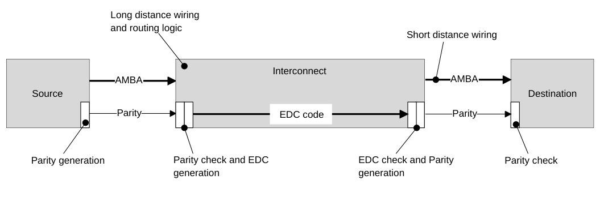

图 B9.1：AMBA 中奇偶校验的使用

AMBA 奇偶校验可选地扩展 DAT 通道上由 DataCheck 字段提供的错误检测，使其覆盖所有通道上的完整 flit 和控制信号。接口上采用的保护方案由属性 Check_Type 定义。参见 B16.1 接口属性与参数。

#### B9.3.1 字节奇偶校验信号

以下属性是为字节奇偶校验接口保护而添加的所有校验信号所共有的：

- 使用奇校验。奇校验意味着向接口上的信号组添加校验信号，并

以如下方式驱动：使该组中置为 1 的比特数始终为奇数。

- 覆盖数据和载荷的奇偶校验信号定义为每组不超过 8 比特。这一

限制假定生成每个奇偶校验比特的时序预算中最多有 3 级逻辑可用。

- 覆盖关键控制信号的奇偶校验信号，其可用时序预算可能较小，因此

定义为使用单个奇校验比特。

- 校验信号的最低有效校验比特覆盖载荷的最低有效字节。
- 如果载荷中的比特未填满最高有效字节，则校验信号的最高有效比特覆盖

少于 8 比特。

- 在 Check Enable 项为 True 的每个周期中，校验信号都必须被正确驱动，参见表 B9.18。
- 奇偶校验信号必须根据相关联载荷中的所有比特进行相应驱动，无论

这些比特是否适用。

#### B9.3.2 错误检测行为

本规范不对检测到奇偶校验错误时的组件或系统行为作规定。取决于系统和受影响的信号，翻转的比特可能产生多种影响。翻转的比特可能：

- 无危害
- 导致性能问题
- 导致数据损坏
- 导致安全违规
- 导致死锁

此外，一个信号上的错误也可能导致其他信号上的奇偶校验失败。

当检测到错误时，接收方可选择：

- 终止或传播该事务。当事务被终止时，允许但不要求符合协议。
- 纠正奇偶校验信号，或传播该错误。
- 更新其内存或保持不变。允许但不要求将该位置标记为毒化。
- 通过其他方式发出错误响应信号，例如使用中断。

#### B9.3.3 接口奇偶校验信号

表 B9.18 示出了各通道上的奇偶校验信号及其属性。

表 B9.18：接口奇偶校验信号

| 通道 | 校验信号 | 覆盖的信号 | 校验信号宽度 | 校验粒度 | 校验使能 |
| --- | --- | --- | --- | --- | --- |
| Common | SYSCOREQCHK | SYSCOREQ | 1 | 1 | RESETn == 1 |
|  | SYSCOACKCHK | SYSCOACK | 1 | 1 | RESETn == 1 |
|  | TXSACTIVECHK | TXSACTIVE | 1 | 1 | RESETn == 1 |
|  | RXSACTIVECHK | RXSACTIVE | 1 | 1 | RESETn == 1 |
|  | TXLINKACTIVEREQCHK | TXLINKACTIVEREQ | 1 | 1 | RESETn == 1 |
|  | TXLINKACTIVEACKCHK | TXLINKACTIVEACK | 1 | 1 | RESETn == 1 |
|  | RXLINKACTIVEREQCHK | RXLINKACTIVEREQ | 1 | 1 | RESETn == 1 |
|  | RXLINKACTIVEACKCHK | RXLINKACTIVEACK | 1 | 1 | RESETn == 1 |
| REQ | REQFLITPENDCHK | REQFLITPEND | 1 | 1 | RESETn == 1 |
|  | REQFLITVCHK | REQFLITV | 1 | 1 | RESETn == 1 |
|  | REQFLITCHK | REQFLIT | ceil(R/8)a | 1 至 8 | REQFLITV == 1 |
|  | REQRPCHKb | REQFLITRP REQSHAREDCRD | 1 | 1 至 4 | REQFLITV == 1 |
|  | REQLCRDVCHK | REQLCRDV | Num_RP_REQ | 1 | RESETn == 1 |
|  | REQLCRDSHVCHKc | REQLCRDSHV | 1 | 1 | RESETn == 1 |
| RSP | RSPFLITPENDCHK | RSPFLITPEND | 1 | 1 | RESETn == 1 |
|  | RSPFLITVCHK | RSPFLITV | 1 | 1 | RESETn == 1 |
|  | RSPFLITCHK | RSPFLIT | ceil(T/8)d | 1 至 8 | RSPFLITV == 1 |
|  | RSPLCRDVCHK | RSPLCRDV | 1 | 1 | RESETn == 1 |

下页续

表 B9.18 – 续上页

| 通道 | 校验信号 | 覆盖的信号 | 校验信号宽度 | 校验粒度 | 校验使能 |
| --- | --- | --- | --- | --- | --- |
| SNP | SNPFLITPENDCHK | SNPFLITPEND | 1 | 1 | RESETn == 1 |
|  | SNPFLITVCHK | SNPFLITV | 1 | 1 | RESETn == 1 |
|  | SNPFLITCHK | SNPFLIT | ceil(S/8)e | 1 至 8 | SNPFLITV == 1 |
|  | SNPRPCHKf | SNPFLITRP SNPSHAREDCRD | 1 | 1 至 4 | SNPFLITV == 1 |
|  | SNPLCRDVCHK | SNPLCRDV | Num_RP_SNP | 1 | RESETn == 1 |
|  | SNPLCRDSHVCHKg | SNPLCRDSHV | 1 | 1 | RESETn == 1 |
| DAT | DATFLITPENDCHK | DATFLITPEND | 1 | 1 | RESETn == 1 |
|  | DATFLITVCHK | DATFLITV | 1 | 1 | RESETn == 1 |
|  | DATFLITCHK | DATFLIT | ceil(D/8)h | 1 至 8 | DATFLITV == 1 |
|  | DATLCRDVCHK | DATLCRDV | 1 | 1 | RESETn == 1 |

a R = 请求 flit 宽度。参见 B13.9.1 请求 flit。b 如果 REQFLITRP 和 REQSHAREDCRD 都不存在，则从接口中省略 REQRPCHK。c 如果 REQLCRDSHV 不存在，则从接口中省略 REQLCRDSHVCHK。d T = 响应 flit 宽度。参见 B13.9.2 响应 flit。e S = 侦听 flit 宽度。参见 B13.9.3 侦听 flit。f 如果 SNPFLITRP 和 SNPSHAREDCRD 都不存在，则从接口中省略 SNPRPCHK。g 如果 SNPLCRDSHV 不存在，则从接口中省略 SNPLCRDSHVCHK。h D = 数据 flit 宽度。参见 B13.9.4 数据 flit。

### B9.4 硬件与软件错误类别

本规范定义了两类错误：

- 基于软件的
- 基于硬件的

#### B9.4.1 基于软件的错误

当对同一位置进行多次访问，且使用了不正确或不匹配的 Snoopable 或 Memory 属性时，就会发生基于软件的错误。参见 B2.8.7 Mismatched Memory attributes。

基于软件的错误可能导致一致性丢失以及数据值损坏。对于基于软件的错误，要求系统不得死锁，并且事务始终能及时地在系统中推进。

对于在一个 4KB 内存区域内的访问，基于软件的错误不得导致其他 4KB 内存区域内的数据损坏。

对于保存在 Normal 内存中的位置，可以使用适当的存储操作和软件缓存维护，将内存位置恢复到已定义状态。

在访问外设设备时，无法保证外设的正确运行。唯一的要求是外设继续以符合协议的方式响应事务。将被错误访问的外设设备恢复到已知可用状态所需的事件序列，属于 IMPLEMENTATION DEFINED。

#### B9.4.2 基于硬件的错误

基于硬件的错误定义为任何不属于基于软件错误的协议错误。

> **警告**
>
> 如果发生基于硬件的错误，不能保证能够从该错误中恢复。系统可能崩溃、锁死，或者遭受其他不可恢复的故障。

Chapter B10

## B10 领域管理扩展

本章介绍 CHI 协议中使用的领域管理扩展（RME）。本章包含以下小节：

- B10.1 引言
- B10.2 物理地址空间，PAS
- B10.3 缓存维护
- B10.4 DVM
- B10.5 MPAM
- B10.6 内存加密上下文，MEC
- B10.7 设备分配（DA）与一致性设备分配（CDA）
- B10.8 精细数据隔离

### B10.1 引言

RME 是 Arm 机密计算架构（Arm CCA）的一个组成部分。RME 与 Arm CCA 的其他组件一起，支持在 Arm PE 上运行动态的、可认证的、可信的执行环境，也称为 Realm。

RME 提供了基于硬件的隔离，允许执行上下文运行在不同的安全状态中并共享系统资源。

### B10.2 物理地址空间，PAS

支持 RME 的系统定义了六个物理地址空间。这六个物理地址空间是：

- Secure
- Non-secure
- Root
- Realm
- System Agent
- Non-secure Protected

> **注意**
>
> 在 Issue H 之前，仅定义了 Secure、Non-secure、Root 和 Realm 物理地址空间。

更多信息，参见 B13.10.68 PAS。

### B10.3 缓存维护

本节介绍在支持 RME 的系统中所需的附加缓存维护操作。

#### B10.3.1 缓存维护操作

所定义的附加缓存维护操作有：

- CleanInvalidPoPA
- WriteBackFullCleanInvPoPA
- WriteNoSnpFullCleanInvPoPA
- WriteNoSnpPtlCleanInvPoPA

这些附加缓存维护操作为内存颗粒（granule）在物理地址空间之间的动态转换提供支持。

为支持新的缓存维护操作，系统中定义了一个点，即物理别名点（PoPA）。PoPA 是一个点，在该点上，对某个 PAS 中某一位置的更新对所有其他物理地址空间可见。可能需要对多个 PAS 执行缓存维护操作，以确保先前写入的任何数据对目标物理地址空间完全可见。

在接口上支持附加缓存维护操作时，RME_Support 属性必须为 True。参见 B16.1.16 RME_Support。

更多信息，参见 PoPA 和 B4.2.2.1 Cache Maintenance transactions。

#### B10.3.2 远程失效

RME 需要具备对映射为 Non-shareable Cacheable ARM Memory Type 的内存进行远程失效的能力。具备远程失效内存的能力后，就无需再依赖对每个映射了 Non-shareable Cacheable 内存的 PE 进行缓存维护。为支持这一点，Nonshareable_Cache_Maint 属性必须设置为 True。

更多信息，参见 B2.8.7 内存属性不匹配和 B16.1.17 Nonshareable_Cache_Maint。

### B10.4 DVM

为支持以下内容，定义了额外的 DVM 操作和字段：

- 使能 RME 的系统中物理地址空间数量的增加。
- Realm Protection Unit 表项的失效。

DVM_Support 属性必须为 DVM_v9.2，以确保 RME 支持所需的 DVM 操作都存在。参见 B16.1.22 DVM_Support。

更多信息，参见第 B8 章 DVM 操作。

### B10.5 MPAM

MPAM 为每个 PAS 定义了独立的 PartID 空间，通过 2 位的 MPAM Space（MPAMSP）属性进行编码。

更多信息，参见 B11.4 MPAM。

### B10.6 内存加密上下文（MEC）

内存加密上下文（Memory Encryption Contexts，MEC）是 Arm 领域管理扩展（RME）的一项扩展，它允许每个 Realm 拥有自己唯一的加密上下文。MEC 架构为 Realm PAS 内的所有内存访问分配内存加密上下文。

MECID 由安全状态、转换机制、转换表以及所有内存事务的 MEC 系统寄存器共同决定。

内存加密引擎将 MECID 用作加密上下文表的索引，这些加密上下文（密钥或 tweak）参与外部内存加密。

MEC 架构使每一组 Realm 数据都能以不同的方式加密。这意味着，即使某个恶意代理能够访问物理内存设备并破解了某一组 Realm 数据，也无法使用相同的解密方法去访问其他组的 Realm 数据。在加密点（Point of Encryption，PoE）之上，组件之间传输的数据为明文形式。

R-EL2 处的 Realm 管理软件控制 MECID 策略及其向 Realm 的分配。

非安全 Protected 和 System Agent 物理地址空间也允许使用 MEC，并针对 MECID 不匹配解决方案定义了特定规则。

注：Arm® Architecture Reference Manual for A-profile architecture 中的 MEC 架构详细说明了当发生 MECID 值不匹配时的若干实现选项。

当非安全 Protected 或 System Agent 物理地址空间出现 MECID 不匹配情况时，系统可能需要采取措施。更多信息，参见 B10.8.1 MECID 不匹配解决方案。

系统可以（但并非必须）对 Realm PAS 应用 MECID 不匹配解决方案技术，具体由 MECID_Mismatch_Resolution_Realm 属性决定。例如，如果某个与某一 MECID 关联的读访问的目标 Realm 位置在缓存中存在副本，且该副本关联的是不同的 MECID，则该读访问可以如同 MECID 值未发生不匹配一样成功完成。允许但不要求提供额外的保护，因为 R-EL2 处的 Realm 管理软件应确保能够阻止一个上下文访问属于另一上下文的位置。Realm 管理软件应确保不发生明文泄漏。

有关 MEC 的更多信息，参见 Arm® Architecture Reference Manual for A-profile architecture。

#### B10.6.1 MECID 字段适用性

本节包含以下内容：

- B10.6.1.1 MECID 值限制
- B10.6.1.2 REQ 通道
- B10.6.1.3 DAT 通道
- B10.6.1.4 SNP 通道

当 MEC_Support 为 True 时，MECID 字段存在于 REQ、SNP 和 DAT 通道上。

##### B10.6.1.1 MECID 取值限制

关于在适用情况下 MECID 值如何取决于所访问的 PAS，参见表 B13.47。

##### B10.6.1.2 REQ 通道

MECID 字段在以下事务中不适用，且必须为零：

- PCrdReturn
- DVMOp

MECID 字段在以下事务中不适用，且可以取任意值：

- Evict
- CleanShared
- CleanSharedPersist
- CleanSharedPersistSep
- CleanInvalid
- CleanInvalidPoPA
- CleanInvalidStorage
- MakeInvalid
- CleanUnique
- MakeUnique

MECID 字段在所有其他请求中都适用，且其取值可以是表 B13.47 中 PAS 关系所约束的任意值。

##### B10.6.1.3 DAT 通道

在 DAT 通道上必须提供 MECID 字段，从而不再要求侦听过滤器感知 MECID。这样，就可以在不知道请求方中 MECID 值的情况下发出反向无效侦听。

MECID 字段在 DAT 通道上与 DBID 字段共用同一个字段。

该共用字段被视为：

- 当 DataPull 为 0 且消息为 SnpRespData、SnpRespDataPtl 或 SnpRespDataFwded 时，视为 MECID。

MECID 的取值可以是表 B13.47 中 PAS 关系所约束的任意值。

- 当 DataPull 为 1 时，或者在任何不是 SnpRespData、SnpRespDataPtl 或

SnpRespDataFwded 的数据消息中，视为 DBID。

MECID 字段在所有其他 DAT 消息中不适用，且必须为零。

如果某个 DAT 消息的所有字节都被标记为 Poison 或 DERR，则该 MECID 字段被视为已中毒。

##### B10.6.1.4 SNP 通道

Snoopee 必须能够检测到对被侦听的 Non-secure Protected 或 System Agent 位置的 MECID 不匹配，并据此采取相应处理。参见 B10.8.1 MECID mismatch resolution。

允许但不要求 Snoopee 检测对被侦听的 Realm 位置的 MECID 不匹配并据此采取相应处理，具体由 MECID_Mismatch_Resolution_Realm 属性决定。

当 Snoopee 作为 Stash 侦听响应的一部分请求 DataPull 时，它会避免任何本地的转换分配或上下文分配，否则这些分配会被赋予某个 MECID 值。在分配任何返回的 CompData 时，DataPull 请求所使用的 MECID 值取自该侦听请求。

MECID 字段需要满足以下适用性要求：

- 在 SnpDVMOp 和 SnpQuery 中不适用，且必须为零。
- 在 SnpLCrdReturn 中不适用，且可以取任意值。
- 在所有其他 Snoop 消息中都适用，且其取值可以是表

B13.47 中 PAS 关系所约束的任意值。

#### B10.6.2 内存访问

如果互连将某个请求转发给从属节点，则预期应随该请求一并转发 MECID 值。

预期如果互连缓存了某个缓存行，则 MECID 值也会被一并缓存。

由缓存驱逐、专用缓存维护操作或侦听过滤器反向无效所产生的内存访问，必须使用该条目被缓存时所带的 MECID 值，而不是任何相关联请求中的 MECID 值。

#### B10.6.3 Stash 事务

当归属节点收到 Stash 请求并向请求方生成 Stash 侦听时，必须将该请求中的 MECID 值随该侦听一并发送。

#### B10.6.4 缓存维护操作

对可缓存内存位置的访问在到达 PoE 之前都与某个 MECID 相关联。A-profile 架构的 Arm® 架构参考手册中的 MEC 架构指出，针对物理别名点（PoPA）的缓存维护操作可以影响 PoE 之前的所有缓存。

数据在写入外部内存或写入位于 PoPA 之后的任何共享缓存之前会被加密。针对 PoPA 的缓存维护操作足以影响 PoE 之前的所有缓存，因此不需要专用的 PoE 缓存维护操作。

由缓存 Clean 操作产生的内存访问使用该条目被缓存时所带的 MECID。

在带有 MEC 的 RME 系统中，无论是否存在任何 MECID 值不匹配，下列缓存维护操作都会生效：

- CleanShared
- CleanSharedPersist (+ Deep)
- CleanSharedPersistSep (+ Deep)
- CleanInvalid
- CleanInvalidStorage
- MakeInvalid
- CleanInvalidPoPA

Combined Write 请求按照对独立写事务的要求随 MECID 一并发出。

#### B10.6.5 MECID 正确性与 Poison 信号

必须保持 MECID 正确性以防止数据损坏。必须按要求传播或纠正 MECID 字段元数据，以确保所有事务类型的完整性，包括推测、转发和一致操作。

如果缓存实现判定已存储的 MECID 已损坏，则从该缓存行传输的任何关联数据都必须将所有 Poison 字段位置位，或者将 RespErr 字段置为 DERR。

> **注意**
>
> 如果数据在不带 Poison 或 DERR 的情况下被传输，当该缓存行之后使用错误的加密上下文被写回至 PoE 之外时，这可能导致静默损坏。

任何通过地址转换推导其 MECID 值的 Read 事务，都将在分配点纠正任何损坏的 MECID 值。但是，如果该数据在完成方缓存中被标记为损坏，则返回的数据可能通过 Poison 字段或 DERR 响应被标记为损坏。从缓存行清除 Poison 字段的操作，必须确保与该缓存行关联的 MECID 被更新为一个已知且合适的值。

> **注意**
>
> 如果缓存行被更新，但已存储的 MECID 字段未被更新，则任何后续写回至 PoE 之外都可能因使用错误的上下文进行加密而导致静默数据损坏。

当 MECID 字段作为 Stash 操作的一部分提供时，无论是通过带 Stash 提示的 Write 还是通过独立的 Stash 请求，该 MECID 字段都必须始终被视为正确的。对于并非缓存驱逐结果的 Immediate Write 也同样适用。这些事务被假定源自有效的架构上下文，其 MECID 字段正确性不依赖于缓存的元数据。

> **注意**
>
> 带 Stash 提示的 Write、独立的 Stash 事务，以及并非源自缓存状态的 Immediate Write，具有较短的生命周期，或由具有有效架构上下文的请求方直接发出。因此，带 Stash 提示的 Write、独立的 Stash 事务以及 Immediate Write 被认为比长期驻留在缓存结构中的数据更不易受到投毒。因此，对于此类事务，假定其 MECID 是正确的。

Atomic* 和 PrefetchTgt 事务在所有情况下都必须将 MECID 字段视为正确的。

Dataless 写操作无法传达 MECID 字段正确性信息，必须将 MECID 字段视为正确的。如果在发出 Dataless 请求之前检测到损坏的 MECID 字段，则实现必须使用携带数据的 Write 版本。

### B10.7 设备分配（DA）与一致性设备分配（CDA）

术语 RME-DA 指具有 IO 一致性的设备。

术语 RME-CDA 指具备完全一致性能力的设备。

> **注意**
>
> RME-DA 和 RME-CDA 与 CHI 结合使用的预期场景是使用 chip(let)-to-chip(let) 链路。有关 CHI 中芯片到芯片连接的更多信息，请参见 AMBA® CHI Chip-to-Chip (C2C) Architecture Specification。

#### B10.7.1 简介

RME-DA 和 RME-CDA 支持对可分配设备接口的安全分配。

设备权限表（DPT）包含与物理地址关联的权限属性，并规定了适用于来自设备的入站访问的一组相应 DPT 检查。

图 B10.1 展示了在包含多个加速器设备的拓扑中对 RME-DA 和 RME-CDA 的支持，其中加速器连接到主机。

设备 加速器

设备 主机 加速器

DCM HCM

图 B10.1：连接到两个加速器设备的主机

主机由单个或多个 SoC die 构成，形成一个可信计算基（TCB）。

主机的特性：

- 必须执行系统所要求的安全策略。
- 可以连接到多个设备。
- 可以有直接连接到它的、称为主机一致性内存（HCM）的内存。HCM 可以被主机、或任何完全一致或 IO 一致的设备以一致方式访问。
- 不得向设备发送 Stash Snoop，除非该缓存行已被合法允许由该设备缓存。
- 被允许向设备发送 DVMOp 请求或 SnpDVMOp 侦听。

设备是单个物理 chip(let)，从信任角度被视为单个单元，并被单独认证。

设备的特性：

- 仅对一组 Realm 而言其整体被信任，并被信任在需要时维持 Realm 隔离。
- 可以拥有私有的内存映射资源。
- 可以拥有一个或多个接口。
- 可以有直接连接到它的、称为设备一致性内存（DCM）的内存。DCM 可以被主机、该设备以及其他一致设备以一致方式访问。
- 仅当该访问经由主机计算节点转发时，才可以访问另一一致设备的 DCM。
- 仅在 Realm 和 Non-secure PAS 中运行。
- 预期（但非必须）在对主机的所有请求中包含以下字段：
- SecSID1
- StreamID
- 仅接收以下范围的侦听请求：
- 由信任该设备的 Realm 拥有的内存区域
- 非安全内存区域
- 不能直接连接到另一个设备。
- 不被允许向主机发送 DVMOp 请求或 SnpDVMOp 侦听。

主机和设备可以拥有多个请求节点和归属节点。

预期主机会对来自设备或发往设备的某些消息执行额外检查。这些检查确保：

- 来自设备、发往 HCM 的请求被允许访问该内存。这意味着设备不能发出带有随机 PA 的请求并期望获得对该位置的访问权限。
- 来自设备的侦听仅针对 DCM。这意味着设备不能发出带有任意 PA 的请求来获取对某个位置的访问权限。
- 发往设备、针对已缓存 HCM 位置的侦听仅暴露该设备被允许观察的访问。这意味着设备无法拼凑出所有受信任系统活动的全貌以进行更有针对性的攻击。有关 RME-DA 和 RME-CDA 的更多信息，请参见 Arm® Architecture Reference Manual for A-profile architecture。

#### B10.7.2 字段适用性

接口上对 RME-DA 或 RME-CDA 的支持由 DevAssign_Support 属性决定。该属性定义该接口上是否存在 SecSID1 和 StreamID 字段。

本节详细说明 StreamID 和 SecSID1 字段相对于各种消息的适用性：

- B10.7.2.1 设备请求发往 HCM 位置或对端设备的 DCM 位置
- B10.7.2.2 主机请求发往 DCM 位置
- B10.7.2.3 设备对已缓存 DCM 位置的侦听
- B10.7.2.4 主机对已缓存 HCM 位置或对端设备已缓存 DCM 位置的侦听

省略字段名表示相关字段在关联消息中不适用。

##### B10.7.2.1 设备请求发往 HCM 位置或对端设备的 DCM 位置

图 B10.3 示出了适用于发往 HCM 内存位置、或发往对端设备 DCM 位置的设备请求的字段。

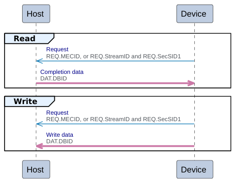

图 B10.2：设备请求发往 DCM 位置时的 RME-CDA 字段

当 DevAssign_Support 为 Device_StreamID_SecSID1 时，无论 MEC_Support 取何值，REQ 通道上与 StreamID 和 MECID 共用的字段都被视为 StreamID。

当 DevAssign_Support 属性不是 Device_StreamID_SecSID1 时：

当 MEC_Support 属性为 True 时 REQ 通道上与 StreamID 和 MECID 共用的字段被视为 MECID。

当 MEC_Support 属性为 False 时 StreamID 和 MECID 均不适用。

在 DAT 通道上，DBID 和 MECID 共用的字段被视为 DBID。

##### B10.7.2.2 主机请求发往 DCM 位置

图 B10.3 示出了适用于发往 DCM 内存位置的主机请求的字段。

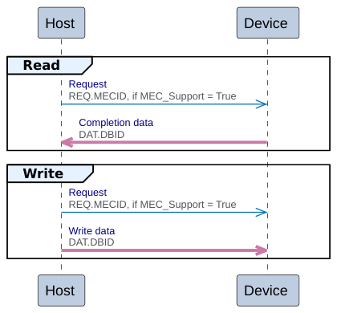

图 B10.3：主机请求发往 DCM 位置时的 RME-CDA 字段

在 DAT 通道上，DBID 和 MECID 共用的字段被视为 DBID。

##### B10.7.2.3 设备对已缓存 DCM 位置的侦听

图 B10.3 示出了适用于设备对已在主机中缓存的 DCM 内存位置的侦听的字段。

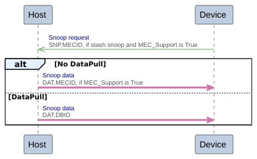

图 B10.4：设备对已缓存 DCM 位置进行侦听时的 RME-CDA 字段

对于包含 DataPull 请求的带数据侦听响应，DBID 和 MECID 共用的字段被视为 DBID。

对于不包含 DataPull 请求的带数据侦听响应，如果 MEC_Support 为 True，则 DAT 通道上 DBID 和 MECID 共用的字段被视为 MECID。

主机对已缓存 HCM 位置或对端 B10.7.2.4 设备的已缓存 DCM 位置进行侦听

图 B10.5 示出了适用于主机对设备中已缓存的 HCM 内存位置或对端设备 DCM 位置进行侦听的字段。

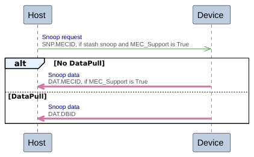

图 B10.5：主机对已缓存 HCM 位置进行侦听时的 RME-CDA 字段

对于包含 DataPull 请求的带数据侦听响应，DBID 和 MECID 共用的字段被视为 DBID。

如果 MEC_Support 为 True，则对于不包含 DataPull 请求的带数据侦听响应，DAT 通道上 DBID 和 MECID 共用的字段被视为 MECID。

#### B10.7.3 组件要求

本节描述主机和设备的要求。

##### B10.7.3.1 主机要求

表 B10.1 示出了取决于 MEC_Support 和 DevAssign_Support 属性值的主机要求。

表 B10.1：主机要求

场景 MEC_Support 描述

设备请求发往 HCM 位置或对端设备的 DCM 位置 False 主机执行以下检查：
- 可能需要执行 DPT 检查，以检查由 SecSID1 指示的安全状态是否已授予该 StreamID 访问物理地址的权限。
- 需要执行 GPC，以验证请求的 PA 与 PAS 组合是否被允许。
如果这些检查通过，请求正常继续。如果这些检查失败，主机必须以符合协议的方式响应。这些响应标记为 NDERR。

True 所有 False 的要求均适用，并且：
当 PAS 为 Realm 时 MECID 值可以非零。
当 PAS 为 Non-secure 时 MECID 值必须为零。
当 DevAssign_Support = Device_StreamID_SecSID1 时 如果 DPT 和 GPC 检查通过，则来自 Stream Table Entry（STE）的 MECID 值在请求进入系统时作为请求的一部分被使用。
当 DevAssign_Support = Device_NoStreamIS_NoSecSID1 时 所提供的 MECID 值随请求一起继续在系统中传递。

主机请求发往 DCM 位置 False Realm 和 Non-secure 是唯一允许的 PAS 值。

True 所有 False 的要求均适用，并且：
当 PAS 为 Realm 时 主机必须在请求中用有效值填充 MECID 字段。
当 PAS 为 Non-secure 时 MECID 值必须为零。

设备对已缓存 DCM 位置的侦听 False 主机必须检查侦听地址是否落在发送该侦听的设备所连接的 DCM 的地址范围内。
如果发现该地址：
- 位于允许的 DCM 范围内，则侦听必须按正常方式处理。
- 对于请求了 DataPull 的 stashing 侦听的响应，主机必须提供 DBID 值。
- 不位于允许的 DCM 范围内，主机必须终止该侦听，并向设备返回 SnpResp_I 响应。

True 所有 False 的要求均适用，并且如果该侦听按正常方式处理，则任何关联的 SnpRespData 响应必须包含：
- 如果 DataPull 为 0，则包含 MECID 值。在侦听响应中包含 MECID 值使设备能够在写回 DCM 之前加密数据。
- 如果 DataPull 为 1，则包含 DBID 值。

下页续

表 B10.1 – 续上页

场景 MEC_Support 描述

主机对已缓存 HCM 位置或对端设备的已缓存 DCM 位置进行侦听 False 以下要求适用：
当 PAS 为 Realm 时 如果主机指定的位置已知存在于设备缓存中，则主机被允许转发该侦听。归属节点可以使用跟踪器（例如侦听过滤器（Snoop Filter））来精确跟踪设备缓存情况，从而过滤侦听。

当 PAS 为 Non-secure 时 不需要检查。如果主机无法通过链路向设备发送侦听请求，并且主机侦听过滤器跟踪到设备中的该位置处于 Dirty 状态，则主机端口必须以完全毒化的 IMPLEMENTATION SPECIFIC 数据值进行响应。

True 所有 False 的要求均适用。如果主机向设备发出 stash 侦听：
当 PAS 为 Realm 时 主机必须在请求中用有效值填充 MECID 字段。

当 PAS 为 Non-secure 时 MECID 值必须为零。在无法发送侦听且主机端口必须发送完全毒化数据的情况下，如果主机端口无法将响应与正确的 MECID 关联，则必须使用默认的 MECID 值零。

##### B10.7.3.2 设备要求

表 B10.2 展示了取决于 MEC_Support 与 DevAssign_Support 属性值的设备要求。

表 B10.2：设备要求

| 场景 | MEC_Support | 描述 |
| --- | --- | --- |
| 主机对 DCM 位置的请求 | False | 无额外要求。 |
|  | True | 设备必须使用接收到的 MECID 值来访问 DCM 存储器。 |

设备对同级设备的 HCM 位置或 DCM 位置的请求 False 适用以下要求：当 DevAssign_Support = Device_StreamID_SecSID1 时，设备必须在适用时填充 StreamID 和 SecSID1 值。允许的取值以及 SecSID1 与 PAS 之间的关系见表 B10.3。注：StreamID 对应于 PCIe Requester ID（RID）。SecSID1 对应于 TLP 中的 PCIe T 位。当 T = 0 时 访问为 Non-secure PAS。

当 T = 1 时 访问为 Non-secure 或 Realm PAS。

当 DevAssign_Support != Device_StreamID_SecSID1 时 StreamID、MECID 和 SecSID1 字段不适用，且必须驱动为零。

下页续

表 B10.2 – 续上页

场景 MEC_Support 描述

True 适用以下要求：当 DevAssign_Support = Device_StreamID_SecSID1 时，设备必须在适用时填充 StreamID 和 SecSID1 字段值。

当 DevAssign_Support != Device_StreamID_SecSID1 时，设备必须用有效值填充 MECID 字段。当 PAS 为 Realm 时，MECID 值可以非零。当 PAS 为 Non-secure 时，MECID 值必须为零。

设备对已缓存的 DCM 位置的侦听 False 设备预期只发送地址位于 DCM 地址范围内的侦听。对主机的侦听中的地址范围检查也在主机侧执行。

True 适用所有 False 要求，并且如果设备向主机发出 stash 侦听：当 PAS 为 Realm 时 设备必须在请求中用有效值填充 MECID 字段。

当 PAS 为 Non-secure 时 MECID 值必须为零。

对设备中已缓存的 HCM 位置或同级设备的已缓存 DCM 位置的主机侦听 False 对设备中已缓存的 HCM 位置的主机侦听必须被正常处理。对于请求了 DataPull 的 stash 侦听的响应，设备必须提供 DBID 值。

True 如果侦听响应包含数据，则它必须包含：

- 如果 DataPull 为 0，则包含 MECID 值。在

侦听响应中包含 MECID 值使主机能够在将数据写回 HCM 之前对数据加密。

- 如果 DataPull 为 1，则包含 DBID 值。

各字段的允许取值及其之间的关系见表 B10.3。

使用以下图例：

Y 是，允许。

- 不允许。

表 B10.3：设备对主机的请求中的字段值关系

| SecSID1 | 安全状态 | PAS[2:0] | PAS 描述 | 允许的组合 |
| --- | --- | --- | --- | --- |
| 0b0 | Non-Secure | 0b000 | Secure | - |
|  |  | 0b001 | Non-secure | Y |
|  |  | 0b010 | Root | - |
|  |  | 0b011 | Realm | - |
|  |  | 0b100 | System Agent | - |
|  |  | 0b101 | Non-secure Protected | - |
| 0b1 | Realm | 0b000 | Secure | - |
|  |  | 0b001 | Non-secure | Y |
|  |  | 0b010 | Root | - |
|  |  | 0b011 | Realm | Y |
|  |  | 0b100 | System Agent | - |
|  |  | 0b101 | Non-secure Protected | - |

### B10.8 细粒度数据隔离

细粒度数据隔离（GDI）是 Arm 领域管理扩展（RME）的一项扩展，旨在使 RME 系统中的非处理单元数据流与处理单元之间实现内存隔离。

除执行至 PoPA 的缓存维护操作外，处理单元（PE）不允许直接访问 Non-secure Protected 或 System Agent 物理地址空间。

#### B10.8.1 MECID 不匹配解决

在 GDI 系统中，对于 Non-secure Protected 或 System Agent 物理地址空间中的位置，发生不匹配的 MECID 值不得导致 Memory Encryption Context 之间数据机密性的丧失。允许 MECID 值不匹配的解决导致系统一致性的丧失。

##### B10.8.1.1 对缓存的要求

缓存可以存在于系统中的任何位置，即位于 Request Node、Home Node 或 Subordinate Node 中。

本节列出的要求适用于以以下对象为目标的缓存访问：

- 当 GDI_Support 为 True 时，System Agent 或 Non-secure Protected PAS。
- 当 MECID_Mismatch_Resolution_Realm 属性为 True 时，Realm PAS。

当传入请求的 MECID 与先前缓存的 MECID 之间存在差异时，缓存必须强制执行以下规则：

- 读事务：
- 任何返回的 CompData 或 DataSepResp 必须被屏蔽为 IMPLEMENTATION SPECIFIC 值。建议（但

不要求）将 Data 值设为全 1。

- 写事务：
- 部分：
* 缓存数据必须被屏蔽为 IMPLEMENTATION SPECIFIC 值。建议（但非要求）将 Data 值设为全 1。该缓存行的所有 Byte Enable 必须设置为 1。
* 随后将部分写数据合并到已屏蔽的数据值中。 * 该位置的已缓存 MECID 必须更新为传入写操作的 MECID。
- 整行：
* 写数据覆盖先前缓存的值。 * 该位置的已缓存 MECID 必须更新为传入写操作的 MECID。
- 侦听事务：
- 见 B10.8.1.2 对 Snoopee 的要求。

##### B10.8.1.2 对 Snoopee 的要求

Snoopee 必须检测对被侦听位置的 MECID 不匹配并对其采取行动。

本节列出的要求适用于以以下对象为目标的侦听请求：

- 当 GDI_Support 为 True 时，System Agent 或 Non-secure Protected PAS。
- 当 MECID_Mismatch_Resolution_Realm 属性为 True 时，Realm PAS。

当传入侦听的 MECID 值与本地缓存的 MECID 值不同时，Snoopee 需要：

- 将任何 Non-forwarding 非暂存侦听或 Forwarding 侦听转换为 Non-forwarding SnpUnique，

但 SnpCleanShared、SnpQuery 和 SnpMakeInvalid 除外：

- 取决于起始状态和 RetToSrc，允许使用 SnpRespData、SnpRespDataPtl 或 SnpResp_I。如果

提供了 SnpRespData 或 SnpRespDataPtl：

* Data 必须是缓存数据。 * MECID 必须是缓存的 MECID 值。 * MismatchedMECID 必须设置为 1。
- 对于 SnpCleanShared，允许的状态转换或响应没有变化：
* 如果提供 SnpRespData 或 SnpRespDataPtl：· Data 必须是缓存数据。

· MECID 必须是缓存的 MECID。

· MismatchedMECID 必须为 1。

- SnpQuery 或 SnpMakeInvalid 无需改变行为。
- 对于暂存侦听：
- 不允许 DataPull。
- SnpMakeInvalidStash、SnpStashUnique 和 SnpStashShared 无需改变行为。
- SnpUniqueStash 允许 SnpRespData、SnpRespDataPtl 或 SnpResp_I，取决于起始状态和

RetToSrc。如果提供了 SnpRespData 或 SnpRespDataPtl：

* Data 必须是缓存数据。 * MECID 必须是缓存的 MECID 值。 * MismatchedMECID 必须设置为 1。

##### B10.8.1.3 对 Home 的要求

本节列出的要求适用于以以下对象为目标的事务：

- 当 GDI_Support 为 True 时，System Agent 或 Non-secure Protected PAS。
- 当 MECID_Mismatch_Resolution_Realm 属性为 True 时，Realm PAS。

当 Home 在 SnpRespData 或 SnpRespDataPtl 中接收到设置为 1 的 MismatchedMECID 时，它必须确定是否需要进行任何 Data 屏蔽。任何操作都取决于发起该侦听的最初动机，包括：

- 传入的读请求。
- Home 提供的任何 CompData 或 DataSepResp 必须被屏蔽为 IMPLEMENTATION

SPECIFIC 值。建议（但非要求）该值为全 1。

- 任何 SLC 分配或下游写必须使用从返回的

SnpRespData 或 SnpRespDataPtl 中获取的 Data 和 MECID 值。

- 传入的部分写请求。

如果该部分写分配进入 SLC

- SnpRespData 和 SnpRespDataPtl 必须被

屏蔽为 IMPLEMENTATION SPECIFIC 值。建议（但非要求）该值为全 1。

- SnpRespDataPtl 必须被视为所有 Byte

Enable 均设置为 1。

- 部分 NonCopyBackWriteData 必须被

合并到该已屏蔽的值中。

- 已缓存位置的 MECID 值必须为

传入写请求的 MECID。

如果该部分写不分配进入 SLC 且在本地处理

- SnpRespData 和 SnpRespDataPtl 必须被

屏蔽为 IMPLEMENTATION SPECIFIC 值。建议（但非要求）该值为全 1。

- SnpRespDataPtl 必须被视为所有 Byte

Enable 均设置为 1。

- 部分 NonCopyBackWriteData 必须被

合并到该已屏蔽的值中。

- 下游的 WriteNoSnpFull 必须使用

生成的 Data 值以及传入写请求的 MECID。

如果该部分写不分配进入 SLC 且不在本地处理

- 必须使用

SnpRespData 或 SnpRespDataPtl 中提供的 Data 和 MECID 值将数据写回内存。

- 下游的 WriteNoSnpPtl 必须排

在上述写之后，并且必须使用来自传入部分写的 Data 和 MECID 值。

- 传入的整行写请求。
- 无需任何操作。任何 SLC 分配或下游写必须使用传入写请求的 Data 值以及

MECID。

- 传入的 StashOnce。
- 对返回 Data 的任何 SLC 分配必须使用

SnpRespData 或 SnpRespDataPtl 中提供的 Data 和 MECID 值。

- Home 提供给暂存目标的任何 CompData 或 DataSepResp，如果该暂存目标不同于返回

SnpRespData 或 SnpRespDataPtl 的 Snoopee，则必须被屏蔽为 IMPLEMENTATION SPECIFIC 值。建议（但非要求）该值为全 1。

- 传入的 CMO 请求。
- 无需任何操作。CMO 事务不提供 MECID，因此 Home 将无法

在侦听时提供准确的 MECID。任何对内存的写必须使用 SnpRespData 或 SnpRespDataPtl 中提供的 Data 和 MECID 值。

- 侦听过滤器反向无效化。
- 无需任何操作。侦听过滤器不需要存储所跟踪位置的 MECID，因此

将无法在侦听时提供准确的 MECID。任何对内存的写必须使用 SnpRespData 或 SnpRespDataPtl 中提供的 Data 和 MECID 值。

第 B11 章

## B11 系统控制、调试、跟踪与监控

本章描述为系统的控制、调试与跟踪提供额外支持的机制，以及为提升性能而对系统进行监控的机制。本章包含以下小节：

- B11.1 服务质量（QoS）机制
- B11.2 数据源
- B11.3 数据目标
- B11.4 MPAM
- B11.5 基于页的硬件属性
- B11.6 完成方忙
- B11.7 跟踪标签

### B11.1 服务质量（QoS）机制

#### B11.1.1 概述

系统可以利用 QoS 方案来实现：

- 为特定流中的事务保证最大延迟。
- 为请求流保证最小带宽。
- 为特定流的请求提供尽力而为的带宽与延迟值。

满足系统 QoS 需求所需的低延迟或吞吐量保障要求，主要由事务端点负责，并依靠中间互连提供支持。协议通过为数据包定义 QoS 优先级值，并使用已定义的信用机制控制请求流，来支持这一点。

#### B11.1.2 QoS 优先级值

使用一个 4 位值在协议节点处以及互连内部对数据包的处理进行优先级排序。数据包的 QoS 优先级值（Priority Value，PV）由事务的源端分配。在典型使用模型中，该值取决于源端类型和流量类别，QoS 取值递增表示优先级更高。源端还可以根据累积延迟和所需吞吐量指标动态改变该值。

#### B11.1.3 以更高的 QoS 值重复发送事务

事务已以某个特定 QoS 值发送后，同一事务可以以不同的 QoS 值再次发送，通常为更高的值。完成方需要将此情形作为多个不同的请求来处理。

在这种情况下，如果其中一个事务收到 RetryAck 响应，则可以取消该事务并归还信用。参见 B2.10.1 Credit Return。

### B11.2 数据源

读请求的完成方可以（但并非必须）指定数据的来源。来源在以下响应的 DataSource 字段中指定：

- CompData
- DataSepResp
- SnpRespData
- SnpRespDataPtl

#### B11.2.1 简介

DataSource 字段提供 8 位的编码空间，以涵盖多裸片、多插座系统以及异构内存模型。

DataSource 字段被划分为若干更小的子字段：

- B11.2.2 CompleterDistance
- B11.2.3 CompleterType
- B11.2.4 HitD
- B11.2.5 Functional

#### B11.2.2 CompleterDistance

DataSource[1:0] 位用于传输 CompleterDistance 子字段。

CompleterDistance 子字段指示返回的数据所经过的相对距离。

CompleterDistance 子字段在系统层面定义，从而为可能具有不同层级深度的各类系统提供使用上的灵活性。

CompleterDistance 子字段的编码如表 B11.1 所示。

表 B11.1：DataSource CompleterDistance 编码及使用示例

| DataSource[1:0] CompleterDistance | 描述 | 使用示例 |
| --- | --- | --- |
| 0b00 | Completer Distance 1 | 共享一个缓存的核集群。该集群及其缓存与系统互连相连。 |
| 0b01 | Completer Distance 2 | 与 Completer Distance 1 位于同一裸片内的核芯粒（chiplet）或核集群，包含带有归属节点（Home Node）、内存控制器或 IO 控制器以及共享缓存的系统互连。 |
| 0b10 | Completer Distance 3 | 同一插座内的远程芯粒。 |
| 0b11 | Completer Distance 4 | 同一系统内的远程插座。 |

有关示例系统，参见 B11.2.6 Example system。

#### B11.2.3 CompleterType

DataSource[4:2] 位用于传输 CompleterType 子字段。

对于内存和缓存，都有若干不同的分组可以在 CompleterType 子字段中传递。

CompleterType 子字段的编码还决定了 Functional 子字段所使用的编码空间。

CompleterType 子字段必须正确定义相关联的源，或者使用 Default 编码。缓存不得使用内存分组中的一种，内存也不得使用缓存分组中的一种。

对于因 CHI 侦听命中而提供数据的 Snoopee 缓存，必须使用 Cache Snoop Hit。

任何不属于上述情况的缓存都必须归入 Cache Group 1 或 Cache Group 2。

将缓存或内存类型归入其余分组的方式由实现定义（IMPLEMENTATION DEFINED）。

内存的 CompleterType 子字段编码如表 B11.2 所示。

表 B11.2：DataSource CompleterType 编码

| DataSource[4:2] CompleterType | 架构定义 | 建议 |
| --- | --- | --- |
| 0b000 | 默认 | 默认 |
| 0b001 | Memory Group 1 | DRAM |
| 0b010 | Memory Group 2 | CXL |
| 0b011 | Memory Group 3 | 高带宽内存 |
| 0b100 | Cache Snoop Hit | Snoop hit（架构定义） |
| 0b101 | Cache Group 1 | 系统特定的互连缓存 |
| 0b110 | Cache Group 2 | 系统特定的互连缓存 |
| 0b111 | 保留 | 保留 |

#### B11.2.4 HitD

DataSource[5] 位用于传输 Hit Dirty（HitD）子字段。

如果 CompleterType 指示的是某一种缓存编码，则 HitD 子字段指示在缓存查找命中时该缓存行是否处于 Dirty 状态。

> **注意**
>
> 此前，发起诸如 ReadNotSharedDirty 之类事务的请求方可能会看到返回的是共享干净（Shared Clean）数据，尽管该缓存行在 Snoopee 处可能处于独占脏（Unique Dirty）状态。

HitD 子字段中携带该信息有助于向请求方提供更多信息，这可能对性能分析有用。

HitD 编码如表 B11.3 所示。

表 B11.3：DataSource HitD 编码

| DataSource[5] HitD | 描述 |
| --- | --- |
| 0b0 | 该缓存行在完成方处未处于 Dirty 状态 |
|  | 下页续 |

表 B11.3 – 续上页

| DataSource[5] HitD | 描述 |
| --- | --- |
| 0b1 | 该缓存行在完成方处处于 Dirty 状态 |

当 CompleterType 为某一种缓存编码时，HitD 子字段是适用的，并且可以置为 0 或 1。

当 CompleterType 为某一种缓存编码且 Data 响应指示传递 Dirty [_PD] 时，HitD 子字段必须为 1。

当 CompleterType 不是某一种缓存编码时，HitD 子字段不适用，且必须为零。

#### B11.2.5 Functional

DataSource[7:6] 位用于传输 Functional 子字段。

Functional 子字段提供与 CompleterType 选择相关的附加信息。

完成方无需为其 CompleterType 支持所有的 Functional 编码。

Functional 编码有三种类型：

- B11.2.5.1 Default
- B11.2.5.2 Memory
- B11.2.5.3 Cache

##### B11.2.5.1 Default

当 CompleterType 为 Default 时，Functional 子字段的编码如表 B11.4 所示。

表 B11.4：CompleterType 为 Default 时的 DataSource Functional 编码

| DataSource[7:6] Default | 描述 |
| --- | --- |
| 0b00 | 默认 - 无有用信息 |
| 0b01 | 保留 |
| 0b10 | 保留 |
| 0b11 | 保留 |

##### B11.2.5.2 Memory

当 CompleterType 为 Memory Group 1、Memory Group 2 或 Memory Group 3 时，Functional 子字段的编码如表 B11.5 所示。

表 B11.5：CompleterType 为内存编码时的 DataSource Functional 编码

| DataSource[7:6] Memory | 描述 |  |
| --- | --- | --- |
| 0b00 | 默认。PrefetchTgt 无作用。 | 下页续 |

表 B11.5 – 续上页

| DataSource[7:6] Memory | 描述 |
| --- | --- |
|  | Read 请求经历了一次完整的内存访问，并未因先前发送了 PrefetchTgt 请求而获得任何延迟降低。指示某个预取无作用的确切原因由具体实现决定（IMPLEMENTATION SPECIFIC）。 |
| 0b01 | PrefetchTgt 有作用。由于 PrefetchTgt 请求已经读取或已发起从内存读取数据，从属节点以更低的延迟提供了 Read 数据。 |
| 0b10 | 保留 |
| 0b11 | 保留 |

> **注意**
>
> PrefetchTgt 请求可能无作用的原因有多种，包括：

- 在实际请求之前没有 PrefetchTgt 事务。
- PrefetchTgt 被从属节点丢弃。
- PrefetchTgt 获取的数据在缓冲区中被替换掉了。
- Read 请求先于 PrefetchTgt 到达从属节点。

##### B11.2.5.3 缓存

当 CompleterType 为 Cache Snoop Hit、Cache Group 1 或 Cache Group 2 时，Functional 子字段的编码如表 B11.6 所示。

表 B11.6：CompleterType 为缓存编码时的 DataSource Functional 编码

DataSource[7:6] Description

缓存

0b00 默认。无有用信息。

0b01 未使用的预取。

该缓存行可能此前已由另一个请求方预取，但该缓存行尚未被使用，或者已被写入下级缓存并置位了 DataTarget[0] UnusedPrefetch。

0b10 迟到预取。

该事务与来自同一 SrcID 的较早 StashOnce* 发生了冒险。必须先完成较早的 StashOnce*，才能解除冒险并返回数据。

0b11 保留

未使用的预取只能出现在源自 HN-F、HN-I 或 RN-F 的适用数据消息中。

未使用的预取不会出现在源自 SN-I 或 SN-F 的适用数据消息中。

迟到预取只能出现在源自 HN-F 的适用数据消息中。

迟到预取不会出现在源自 RN-F、HN-I、SN-F 或 SN-I 的适用数据消息中。

#### B11.2.6 示例系统

图 B11.1 给出了一个由 DataSource 支持的系统的示例。

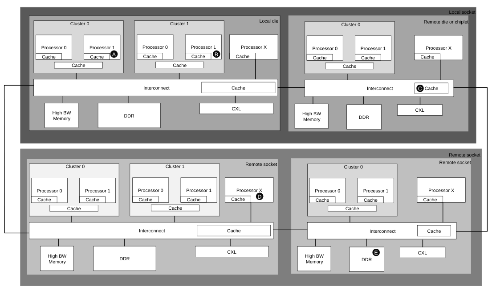

图 B11.1：使用 DataSource 的示例系统

在图 B11.1 中，从 Local socket 中 Local die 的 Cluster 0 中 Processor 0 的视角来看，所详述的五个点如表 B11.7 所示。

表 B11.7：示例系统说明

| Point | CompleterDistance | CompleterType | HitD | Functional |
| --- | --- | --- | --- | --- |
| A | 0b00, Completer Distance 1 | 0b100, Cache Snoop Hit | 0b0 or 0b1 | Any |
| B | 0b01, Completer Distance 2 | 0b100, Cache Snoop Hit | 0b0 or 0b1 | Any |
| C | 0b10, Completer Distance 3 | 0b101, Cache Group 1 or 0b110, Cache Group 2 | 0b0 or 0b1 | Any |
| D | 0b11, Completer Distance 4 | 0b100, Cache Snoop Hit | 0b0 or 0b1 | Any |
| E | 0b11, Completer Distance 4 | 0b001, Memory Group 1 | Must be 0b0 | 0b00 or 0b01 |

#### B11.2.7 驱动与修改 DataSource[7:0]

本节描述如何驱动和修改 DataSource[7:0] flit。

##### B11.2.7.1 初始值

预期 Completer 在适用的响应中驱动 DataSource，并将 CompleterDistance 值设置为尽可能近的 Completer Distance，以传递该信息。

例如，在图 B11.1 中，这意味着：

- 任意簇内的 Processor 0 在任意适用响应中都应将 CompleterDistance 驱动为 0b00，

Local cluster。

- Processor X 在任意适用响应中都应将 CompleterDistance 驱动为 0b01, Local die，因为它

存在于任何 Local cluster 配置之外。

所有 Completer 都必须将 DataSource[7:2] 驱动为合法编码。

建议（但并非必须）在检测到错误时仍准确地驱动 DataSource 值。

当存在标记为 Default 的编码时，允许 Completer 选择其中一个编码，而不是选择某个定义更明确的编码。

##### B11.2.7.2 值的修改

当任意适用响应中的 DataSource[7:0] 值在系统中传输时，预期在跨越相应边界时对 CompleterDistance 进行递增。

> **注意**
>
> 随着数据包在系统中移动，CompleterDistance 值如何被修改是由实现定义的。该修改可以包括透传、按固定值递增以及设置为特定值等做法的混合。

例如，在图 B11.1 中，这意味着：

- 任意跨越簇边界的适用响应都会被递增为 0b01, Local die。该

递增由该簇执行。

- 任意跨越 local socket 中 die 或 chiplet 边界的适用响应都会被递增为

0b10, Remote die or chiplet。该递增由 die-to-die 或 chiplet-to-chiplet 发送端执行。

- 任意跨越 socket 边界的适用响应都会被递增为 0b11, Remote socket。该

递增由 socket-to-socket 发送端执行。

在任意适用响应于系统中传输时，允许（但不预期）对 DataSource[7:2] 值作出任何更改。

预期（但并非必须）Home 将来自 Snoopee 的 SnpRespData 或 SnpRespDataPtl 响应，或来自 Subordinate 的 CompData 或 DataSepResp 响应中未经更改的 DataSource 值转发给请求方。

##### B11.2.7.3 组合来自两个不同来源的数据

以下场景中，Home 必须在将 CompData 或 DataSepResp 响应发送回请求方之前，组合来自多个来源的数据：

- 某个 Snoopee 持有一行处于 UDP 状态的缓存行，而另一个请求方对该位置发起 Read。此时 Home 必须

进行存储器访问以获取该行的其余部分。

- Home 在向请求方返回 CompData

或 DataSepResp 响应时，预期使用 Cache Snoop Hit 的 CompleterType 编码。

- 当启用 MTE 且请求方发起 Read 以获取数据和标签，但数据仅存在于某个 Snoopee 中、而不在标签中时。Home 必须

进行存储器访问以获取 MTE 标签。

- Home 在向请求方返回 CompData

或 DataSepResp 响应时，预期使用 Cache Snoop Hit 的 CompleterType 编码。

- 当 Home 在 SLC 中拥有该行的副本，但需要访问存储器以获取 MTE 标签时。
- Home 在向请求方返回

CompData 或 DataSepResp 响应时，预期使用 Cache Group 1 或 Cache Group 2 的 CompleterType 编码。

B11.2.7.4

##### B11.2.7.4 同时存在 Late 与 Unused 预取事件时缓存编码的功能值

存在这样一种场景：Unused 预取信息可以通过来自 Snoopee 的 SnpRespData 响应提供给 Home，同时 Home 也面临发生 Late 预取事件冒险的风险。在此场景下，Home 在向请求方提供 CompData 响应时，预期使用 Late Prefetch Functional Cache 编码。

### B11.3 数据目标

请求方可以向互连中的缓存提供放置与使用提示，这是允许的但并非必需。通常，请求方最了解缓存行的效用。获知这些信息的系统级缓存（SLC）可以利用它来偏向自身的缓存层级放置和替换算法。

#### B11.3.1 简介

该特性由 7 位字段 DataTarget 支持。

DataTarget 包含以下子字段：

- UnusedPrefetch
- Replacement
- CacheLevel
- Unique

图 B11.2 展示了 DataTarget 各子字段的位置。

6 5 4 3 1 0

Unique CacheLevel Replacement UnusedPrefetch

图 B11.2：DataTarget 子字段的位置

#### B11.3.2 字段适用性

DataTarget 字段与 ReturnNID 和 StashNID 共用同一个 REQ 数据包位置。当节点 ID 宽度大于 7 位且该字段用作 DataTarget 时，共享字段中未使用的位必须为零。

DataTarget 字段仅适用于从请求节点发往 HN-F 的请求。

该字段不适用于从请求节点发往 HN-I 的请求，以及从归属节点发往从属节点的请求。该字段可以取任意值。

该字段不适用于从请求节点发往从属节点的请求，并且必须设置为 0。

##### B11.3.2.1 UnusedPrefetch

在所有从请求节点发往 HN-F 的请求中，UnusedPrefetch 子字段可以取任意值，但以下情况除外：在这些情况下该子字段不适用，必须为零：

- Atomic*
- Stash 事务，当 StashNIDValid 为 1 时
- PrefetchTgt
- PCrdReturn
- DVMOp

如果请求方预取了一个缓存行，它可以在 CopyBack 事务中使用 UnusedPrefetch 子字段，向互连指示该行是否已被使用。如果互连支持存储该信息，并能在后续读事务中通过 DataSource 字段提供该信息，则请求方可以利用它来调整预取算法。

表 B11.8 展示了 UnusedPrefetch 子字段的编码。

表 B11.8：UnusedPrefetch 子字段编码

DataSource[0] 描述 UnusedPrefetch

0 该缓存行自被取回以来可能已被使用。

1 该缓存行自被取回以来未被使用。

> **注意**
>
> 不跟踪缓存行使用情况的请求节点可以将 UnusedPrefetch 位值设置为 0。

##### B11.3.2.2 Replacement

Replacement 子字段在 Request Node 发往 HN-F 的所有请求中可以取任意值，但以下情况除外：在这些情况下该子字段不适用，必须为 0：

- Atomic*
- Stash 事务，当 StashNIDValid 为 1 时
- PrefetchTgt
- PCrdReturn
- DVMOp

Replacement 子字段可用于指示由 Requester 传输的数据再次被使用的可能性有多大。接收到该信息的缓存可以用它来偏置自身的替换算法，从而更高效地管理替换。

表 B11.9 给出了推荐的 Replacement 子字段编码。

表 B11.9：推荐的 Replacement 子字段编码

| DataSource[3:1] Replacement | Description |
| --- | --- |
| 0b000 | 无建议。这是默认值。 |
| 0b100 | 最有可能再次被使用。 |
| 0b101 | 较有可能再次被使用。 |
| 0b110 | 有一定可能再次被使用。 |
| 0b111 | 最不可能再次被使用。 |
| 0b011-0b001 | 未使用。 |

##### B11.3.2.3 CacheLevel

CacheLevel 子字段可用于指示由 Requester 传输的数据进入系统缓存层级结构的最佳距离。这有助于 Producer 有意识地进行数据放置，从而降低 Consumer 所见的访问延迟。

CacheLevel 子字段适用于：

- WriteBackPtl
- WriteBackFull
- WriteCleanFull
- WriteEvictFull
- WriteEvictOrEvict
- 当 StashNIDValid 为 0 时：
- StashOnceUnique
- StashOnceShared
- StashOnceSepUnique
- StashOnceSepShared
- WriteNoSnpFull
- WriteNoSnpZero
- WriteUniqueFull
- WriteUniqueZero
- ReadOnce

> **注意**
>
> 在 Issue H 之前，CacheLevel 子字段不适用于：

- WriteNoSnpFull
- WriteNoSnpZero
- WriteUniqueFull
- WriteUniqueZero
- ReadOnce

在 DataTarget 字段适用的所有其他请求中，CacheLevel 子字段必须为 0。

表 B11.10 给出了 CacheLevel 子字段编码。

表 B11.10：CacheLevel 子字段编码

| DataSource[5:4] CacheLevel | Description | MemAttr |
| --- | --- | --- |
| 0b00 | 未提供层级信息提示。 | MemAttr 的 Allocation 提示可以取任意值。MemAttr.CDE 必须为 0b101。 |
| 0b01 | 提示建议将缓存行放置在该缓存层级，而不再继续传播。 | MemAttr.ACDE 必须为 0b1101。 |

0b10a MemAttr.ACDE 必须为 0b1101。提示建议将缓存行向下传播 1 个额外的缓存层级。

下页续

表 B11.10 – 续上页

| DataSource[5:4] CacheLevel | Description | MemAttr |
| --- | --- | --- |
| 0b11a | 提示建议将缓存行向下传播 2 个额外的缓存层级。 | MemAttr.ACDE 必须为 0b1101。 |

a 如果请求被传播到下一层级，则 CacheLevel 子字段的值必须减 1。

允许实现忽略由 CacheLevel 子字段值所指示的层级信息。

##### B11.3.2.4 Unique

Unique 子字段用作可选提示，指示除在特定缓存层级分配数据之外，还应将数据置为 Unique。转换到 Unique 状态可能需要额外的操作，例如下游事务或额外的侦听。由 Producer 主动发起的状态转换可以降低打算写入同一位置的 Consumer 的延迟，因为它消除了原本可能需要的基于无效化的侦听事务。

Unique 子字段适用于：

- 当 StashNIDValid 为 0 时：
- StashOnceUnique
- StashOnceShared
- StashOnceSepUnique
- StashOnceSepShared
- WriteEvictOrEvict
- WriteBackFull
- WriteCleanFull

当 CacheLevel 子字段为 0 时，Unique 子字段必须为 0。

当 CacheLevel 子字段非零时，Unique 子字段可以为 0 或 1。

在 DataTarget 适用的所有其他请求中，Unique 子字段必须为 0。

表 B11.11 给出了推荐的 Unique 子字段编码。

表 B11.11：Unique 子字段编码

| DataSource[6] Unique | Description |
| --- | --- |
| 0b0 | 未提供 Unique 状态提示。 |
| 0b1 | 提示建议在所指明的 CacheLevel 将缓存行置为 Unique。 |

### B11.4 MPAM

内存系统资源分区与监控（Memory System Resource Partioning and Monitoring，MPAM）是一种在用户之间高效利用内存资源并监控这些资源使用情况的机制。资源通过 Partition Identifier（PartID）和 Performance Monitoring Group（PerfMonGroup）在用户之间进行分区。支持 MPAM 的请求方会在其发送的每个请求中携带一个标签，标识该请求所属的分区以及该分区内的性能监控组。归属节点或从属节点使用该信息为该请求分配其资源。接口上对 MPAM 的支持由 MPAM_Support 属性定义。参见 B16.1.9 MPAM_Support。

MPAM 字段仅适用于 REQ 和 SNP 通道：

- 在 REQ 通道上，当发送方不希望为某个请求使用 MPAM 时，MPAM 取值必须

设置为默认设置。参见表 B11.13。

- 在 SNP 通道上，MPAM 取值仅适用于 Stash 侦听请求。在非 Stash 类型的侦听请求中，MPAM

取值不适用，必须设置为默认值。

字段宽度为 0 位、12 位或 15 位：

- 在不支持 MPAM 的接口上，宽度为 0 位。
- 当 MPAM_Support 属性为 MPAM_9_1 时，MPAM 宽度为 12 位。该字段进一步划分为

以下子字段：

- PartID = 9 位
- PerfMonGroup = 1 位
- MPAMSP = 2 位

图 B11.3 展示了 MPAM_9_1 的 MPAM 字段位分配。

11 10 2 1 0 PartID

MPAMSP PerfMonGroup MPAM field

图 B11.3：MPAM_9_1 子字段位分配

- 当 MPAM_Support 属性为 MPAM_12_1 时，MPAM 宽度为 15 位。该字段进一步划分为

以下子字段：

- PartID = 12 位
- PerfMonGroup = 1 位
- MPAMSP = 2 位

图 B11.4 展示了 MPAM_12_1 的 MPAM 字段位分配。

14 13 2 1 0 PartID PerfMonGroup MPAMSP MPAM field

图 B11.4：MPAM_12_1 子字段位分配

Receiver 如何使用 MPAM 字段取值是实现定义的。

#### B11.4.1 MPAMSP

MPAMSP 提供分区标识符命名空间选择器。

表 B11.12 展示了 MPAMSP 编码。

表 B11.12：MPAMSP 编码

| MPAMSP | 分区描述 |
| --- | --- |
| 00 | Secure |
| 01 | Non-secure |
| 10 | Root |
| 11 | Realm |

MPAMSP 与 PAS 的取值允许任意组合。

#### B11.4.2 MPAM 取值传播

允许但不要求 Receiver 支持请求中收到的全部范围的分区和性能监控组。在系统发现与配置过程中，预期会完成对系统能力的发现，并使所使用的分区范围和性能监控组与系统能力相匹配。

MPAM 字段取值必须传播到支持 MPAM 的接口上。

允许但不要求将 MPAM 字段取值传播到不支持 MPAM 的接口上。

表 B11.13 展示了当不支持或未传播时 MPAM 字段的默认值。

表 B11.13：MPAM 子字段的默认值

| MPAM 字段 | 取值 |
| --- | --- |
| PerfMonGroup | 0 |
| PartID | 0 |
| MPAMSP | 与请求或侦听消息中的 PAS 取值相同，除非该 PAS 取值为 System Agent 或 Non-secure Protected：当 PAS 为 System Agent 时，MPAMSP 设置为 Root。当 PAS 为 Non-secure Protected 时，MPAMSP 设置为 Non-secure。 |

#### B11.4.3 Stash 事务规则

Stash 侦听请求中的 MPAM 取值必须与产生这些侦听请求的请求中的取值相同。

对于对 Stash 侦听请求的响应，当响应包含 DataPull 请求时，归属节点必须假定该 DataPull 请求中的 MPAM 取值与原始 Stash 请求中的取值相同。

#### B11.4.4 发往从属节点的请求规则

在发往从属节点的请求中，如果该请求是由一个发往归属节点的请求产生的，则其 MPAM 值必须与该发往归属节点的请求中的 MPAM 值相同。

### B11.5 基于页面的硬件属性

基于页面的硬件属性（PBHA）是一项可选的、由实现定义的功能。接口对 PBHA 的支持由 PBHA_Support 属性定义。参见 B16.1.19 PBHA_Support。PBHA 允许软件在转换表中设置最多 4 位，这些位随后随事务在存储系统中传播。参见 B13.10.29 Page-based Hardware Attribute, PBHA。

PBHA 值在地址转换过程中从页表中获得。对于给定 PA 的所有转换，预期（但非必需）提供相同的 PBHA 值。

#### B11.5.1 PBHA 字段的适用性

在 REQ 通道上，PBHA 适用于所有请求，但 DVMOp 和 PCrdReturn 除外，在这两种请求中 PBHA 不适用且必须为零。

在 DAT 通道上，PBHA 仅适用于 SnpRespData、SnpRespDataPtl 和 SnpRespDataFwded。在其他所有 DAT 消息中，PBHA 字段不适用且必须为零。

在 SNP 通道上，PBHA 仅适用于 Stash 侦听。在所有非 Stash 侦听中，PBHA 字段不适用且必须为零。

#### B11.5.2 互连对 PBHA 的使用

如果互连把请求转发到从属节点，则预期它将 PBHA 值随该请求一起转发。

如果互连缓存了一个缓存行，则预期它将 PBHA 值随该缓存行一起缓存。如果该缓存行被逐出，则预期将该 PBHA 值转发到从属节点。

#### B11.5.3 Stash 事务规则

当归属节点收到 Stash 请求并向请求方生成 Stash 侦听时，预期（但非必需）将该请求中的 PBHA 值随该侦听一起发送。

DataPull 请求的请求方从收到的侦听中获取该请求的地址，而不是通过地址转换过程获取。因此，预期（但非必需）请求方从 Stash 侦听中获取 PBHA 值。

#### B11.5.4 PBHA 值的一致性

如果在地址转换期间把 PBHA 值添加到请求中，且下游组件支持 PBHA，则该 PBHA 值可以在系统中传播。系统中流动的、与某一特定地址相对应的 PBHA 值可以是精确的，也可以是不精确的。

要使 PBHA 值精确，请求及相应响应中使用的 PBHA 值必须与从地址转换中获得的 PBHA 值相同。其他需要考虑的事项包括：

- 当缓存行被写回存储器时，如果缓存将 PBHA 值与数据一起存储，则请求可以使用精确的 PBHA 值。由缓存逐出、专用缓存维护操作（Cache Maintenance Operations）或侦听过滤器反向无效所引起的存储器访问，必须使用该表项被缓存时所带的 PBHA，而不是任何相关请求中的 PBHA 值。
- 对某个缓存行执行的 CMO，也预期对随该缓存行一起存储的任何 PBHA 值执行操作。
- 由侦听过滤器发起、并导致带数据的侦听响应的反向无效，必须从 Snoopee 处连同数据一起获取 PBHA 值。或者，侦听过滤器可以保存 PBHA 值，并将其添加到侦听响应中收到的数据上。

> **注意**
>
> PBHA 值可能变得不精确的原因，非穷举列表包括：

- 请求未使用地址转换。
- 缓存中未保存 PBHA 值。
- 未随 stashing 事务一起提供 PBHA 值。
- 多个虚拟地址映射到同一个 PA，而这些地址转换提供的 PBHA 值不同。
- 在修改 PBHA 值之后，未执行适当的缓存维护操作。

### B11.6 完成方忙（Completer Busy）

完成方忙（Completer Busy）指示是一种机制，供事务的完成方指示其当前的活动程度。完成方忙向请求方提供额外信息，用于判断可以多激进地产生推测性活动以提升性能。

CBusy 即完成方忙（Completer Busy），是一个 3 位字段，适用于相应的 DAT 和 RSP 数据包。当单个 Read 请求使用独立的 Data 和 Comp 响应时，每个响应中的忙指示可以独立设置。

CBusy 字段不适用于：

- NonCopyBackWriteData
- NonCopyBackWriteDataCompAck
- CopyBackWriteData
- WriteDataCancel
- CompAck

> **注意**
>
> DataSource 可以用作完成方忙指示的限定符，使得某些数据源（例如 Forwarding snoop）不影响该忙指示。

#### B11.6.1 用例

完成方如何设置 CBusy 指示以及请求方应如何解读 CBusy 是由实现定义的。不过，建议实现考虑采用相关机制，避免众多完成方中少数处于忙状态的完成方使结果出现偏差。

##### B11.6.1.1 示例用例

以下是 CBusy 字段的一种示例编码。

CBusy[2]：当该位为 1 时，表示多个核心正在主动发起请求。

CBusy[1:0] 表示完成方处跟踪器的填充度，具体如下：

- 00 = 填充度低于 50%
- 01 = 填充度高于 50%
- 10 = 填充度高于 75%
- 11 = 填充度高于 90%

请求方处的预取器可以使用 CBusy 字段值来微调预取器。

表 B11.14 列出了由 CBusy 值确定的预取器模式。

表 B11.14：由 CBusy 确定的预取器模式

| CBusy[2] | CBusy[1:0] | 预取器模式 |
| --- | --- | --- |
| 1 | 11 | 禁用不精确的预取器 |
| 可取任意值 | 10 | 对不精确的预取器采用非常保守模式 |
| 1 | 01 | 对不精确的预取器采用中等激进模式 |
| 可取任意值 | 00 | 对不精确的预取器采用完全激进模式 |

### B11.7 Trace Tag

每个通道的 TraceTag 位为系统的调试、追踪和性能测量提供增强支持。

#### B11.7.1 TraceTag 的使用与规则

关于何时设置 TraceTag 位值以及如何传播这些值的规则如下：

- TraceTag 位可以由事务发起方或互连组件设置。
- 如果某个组件收到的每个数据包中 TraceTag 位均已置位，则该组件必须保留该值，并在针对该接收数据包生成的任何响应数据包或派生数据包中回送该值。否则，响应数据包和派生数据包中的 TraceTag 位可以取任意值。仅当响应数据包中的 TraceTag 位适用时，此要求才成立。这类响应数据包与接收数据包对的示例包括：响应多个 CompData 数据包的 CompAck，以及响应两个 DVMOp 数据包对的 Snoop 响应。
- 如果某个接收数据包派生出多个响应，例如一个 Write 请求产生独立的 Comp 和

DBIDResp 响应，或一个 Read 请求生成独立的 DataSepResp 和 RespSepData 响应，那么只要派生响应的数据包中 TraceTag 位已置位，所有这些派生响应都要求将 TraceTag 位置位。如果派生响应的数据包中 TraceTag 位未置位，则某个派生数据包中 TraceTag 位的取值与其他相关派生数据包中该位的取值相互独立。

- 如果某个组件可以接收与单个事务相关联的多个数据包，则只有当相关联的接收数据包中已置位 TraceTag 值时，才要求在任何生成的数据包中置位该值。例如：
- 在请求节点处的一个 Write 事务流程中，写数据和 CompAck 可以分别作为接收数据包 DBIDResp 和 Comp 的两个响应。由于 CompAck 仅响应接收到的 Comp，因此只要求其 TraceTag 位值取决于 Comp 数据包中的 TraceTag 位值，写数据与 DBIDResp 这一“响应-接收数据包”对同理。对于收到独立的 DataSepResp 和 RespSepData 响应并生成 CompAck 的请求，只有当 RespSepData 已置位 TraceTag 位时，才要求在 CompAck 中置位 TraceTag 位。
- 如果引发 WriteData 响应的 Comp 或 DBIDResp 中任一者已置位 TraceTag 位，则来自请求节点的 NonCopyBackWriteDataCompAck 响应中的 TraceTag 位必须置位。
- 当互连收到已置位 TraceTag 位的数据包时，必须保留该值，不得将其复位。
- 如果在原始多请求事务请求中置位了 TraceTag，则其置位状态必须适用于该事务中包含的所有缓存行的消息。
- 如果原始多请求事务请求中未置位 TraceTag，但在后续某条消息中针对一个或多个相关缓存行置位了该位，则不要求将该 TraceTag 置位状态传播到该多请求中其他缓存行的消息。

> **注意**
>
> 在由此产生的缓存逐出中传播 TraceTag 位的值是由实现定义的。

触发和使用 TraceTag 位的具体机制是由实现定义的。

预期 TraceTag 位在任何时候都限于单个全系统范围的使用。

Trace tag 机制可以有如下若干用途：

- 调试：通过追踪事务在系统中的流转。
- 性能计数
- 延迟测量

以下为 Request-Response 对的示例（并非详尽列表）：

- 响应 Snoop 请求的 Snoop 响应，带数据或不带数据。
- 响应 SnpDVMOp 请求的 Snoop 响应。
- 从属节点响应 Read 请求而返回的 Data 响应。
- HN-F 派生的请求：
- 响应来自请求节点的请求而生成的 Snoop。
- 响应来自请求节点的请求而生成的发往 SN-F 的请求。
- HN-I 派生的请求：
- 响应来自请求节点的请求而生成的发往 SN-I 的 Read 或 Write 请求。
- 请求节点响应 CompData、Comp 或 RespSepData 而发出的 CompAck。
- 归属节点或从属节点对任何请求返回的 RetryAck 响应。
- 归属节点或从属节点对 Read 请求返回的 ReadReceipt 响应，或从属节点对 ReadNoSnpSep 请求返回的

ReadReceipt 响应。

- 对 Write 请求返回的 DBIDResp 响应。

第 B12 章

## B12 内存标记

本章介绍内存标记机制，包含以下各节：

- B12.1 简介
- B12.2 消息扩展
- B12.3 标签一致性
- B12.4 读事务规则
- B12.5 写事务
- B12.6 无数据事务
- B12.7 Atomic 事务
- B12.8 Stash 事务
- B12.9 侦听请求
- B12.10 归属节点到从属节点事务
- B12.11 错误响应
- B12.12 请求与允许的标签操作
- B12.13 TagOp 字段使用汇总

### B12.1 简介

内存标记扩展（MTE）是一种用于检查内存中所保存数据的使用是否正确的机制。当某个内存位置被分配用于特定用途时，还可以为其分配一个内存标签。该内存标签与数据一起保存在内存中，称为分配标签（Allocation Tag）。当之后访问该内存位置时，请求方（Requester）会同时使用该位置的地址以及请求方认为与该位置关联的标签值。该标签称为物理地址标签（Physical Address Tag）或物理标签（Physical Tag）。

对于任何启用了标签检查的访问，都会将物理标签与分配标签进行核对。该访问始终照常进行，而标签检查的结果决定是否发出错误状态信号。

MTE 确保内存访问是出于其预期用途，而非错误或恶意的访问。MTE 可以在运行时用于识别许多常见的编程内存错误，例如缓冲区溢出和释放后使用（use-after-free）。

内存标签由 4 位标签组成，与内存中每对齐的 16 字节数据相关联。

支持以下行为：

- 仅允许对 Normal WriteBack 内存的请求使用内存标记。
- 读事务在事务请求中带有一个指示，用于确定是否必须随数据一起返回分配标签

值。

将返回的物理标签与分配标签进行核对由请求方执行。

在缓存保存了数据值、但未保存分配标签值的情况下，必须执行一个同时返回数据和标签的读事务。返回的数据不要求有效。

- 需要获取标签的读请求不得使用转发侦听（Forwarding snoop）。
- 请求分配标签的 StashOnce 事务。分配标签预期与数据的暂存一起

被暂存。

- 在写数据旁提供物理标签的写事务，该物理标签必须与

分配标签进行核对。

将物理标签与分配标签进行核对由完成方（Completer）执行。在不匹配的情况下，需要发出失败通知。

- 将分配标签更新为新值的写事务。

这些写事务通常会同时更新数据。但是，允许 BE = 0，以便仅更新标签。

- 将 Dirty 或 Clean 缓存行传递给下游缓存或内存控制器

而既不更新也不检查标签的写事务。这些写事务始终包含数据，并提供一个指示，说明分配标签值是否也随数据一起传递。如果标签为 Clean，则可以选择是否在写事务中提供它们。

- 返回数据的侦听事务也可以返回关联的分配标签。如果标签为 Dirty，则

必须返回它们。如果标签为 Clean，则返回它们是可选的。

- 缓存维护操作必须同时对数据以及对应的内存标签进行操作。

### B12.2 消息扩展

以下对 CHI 消息定义的扩展用于支持 Memory Tagging：

Tag 提供 4 位 tag 的集合，每个 tag 与对齐的 16 字节数据相关联。

- 仅适用于 DAT 通道。
- Size 为 Data_Width/32 位。

更多信息请参见 Tag。

TU Tag Update。指示必须更新哪些 Allocation Tag。

- 仅适用于 DAT 通道。
- Size 为 Data_Width/128 位。

更多信息请参见 TU。

TagOp Tag Operation。指示要对相应 DAT 通道中存在的 tag 执行的操作。

- 适用于 REQ、DAT 和 RSP 通道。
- Size 为 2 位。
- 表 B13.31 给出了取值编码。

表 B12.1：TagOp 编码与 Tag 操作

TagOp[1:0] Tag 操作

0b00 Invalid

0b01 Transfer

0b10 Update

0b11 Match or Fetch

更多信息请参见 TagOp。

> **注意**
>
> 为清晰起见，在后续各节中 TagOp 取值以斜体表示，以便与数据和缓存行取值区分。

### B12.3 Tag coherency

本节汇总 tag 一致性特性。

被缓存的 Allocation Tag 保持硬件一致性。一致性机制与数据一致性相同。

适用的 tag 缓存状态为：Invalid、Clean 和 Dirty。处于 Clean 或 Dirty 的缓存行均为 Valid。

数据缓存状态与 tag 缓存状态组合的约束为：

- 只有当数据为 Valid 时，tag 才能为 Valid。
- 当数据为 Valid 时，tag 可以为 Invalid。
- 当缓存行处于 Unique 状态时，数据和 tag 均为 Unique。
- 当缓存行处于 Shared 状态时，数据和 tag 均为 Shared。
- 当带有 Dirty tag 的缓存行被驱逐时：
- 数据和 tag 都必须视为 Dirty。
- tag 必须写回内存，或由 Home 以 Dirty [_PD] 传递给另一个缓存。
- 当 Clean tag 从缓存中被驱逐时，它们可以发送给其他缓存或被静默丢弃。
- 当 Clean tag 随 Dirty 数据一起被驱逐时，Clean tag 可以与 Dirty 数据一起向 PoC 下游传输。

### B12.4 读事务规则

读操作可以选择性地在获取数据的同时获取 tag。是否需要在返回读数据的同时返回 tag，由请求中 TagOp 的取值决定。

#### B12.4.1 TagOp 取值

当请求中的 TagOp 取值为 Transfer 时：

- 必须在返回数据的同时返回 tag。
- 返回的 tag 的状态必须是所使用请求相应的允许缓存状态。
- 要返回的 tag 数量由所返回的 Data 的大小决定。
- 当访问需要时，由请求方完成 Physical Tag 与随读数据一起收到的 Allocation Tag 的匹配。

当请求中的 TagOp 取值为 Fetch 时：

- 必须在返回数据的同时返回 tag。
- 返回的数据不要求有效。无论 tag 匹配结果如何，请求方都必须忽略收到的数据。
- 请求中的 Size 字段必须为 64B。
- 必须返回与一个缓存行对应的所有 tag。
- 返回的 tag 的状态必须为 Clean 或 Dirty。
- 如果返回的是 Dirty tag，则除非被更新，否则必须保留并写回内存。

当请求中的 TagOp 取值为 Invalid 时：

- 允许但不要求在返回数据的同时返回 tag。
- 如果 tag 随数据一起返回，则它们必须为 Clean。

##### B12.4.1.1 将 tag 从 Shared 转换为 Unique

当数据和 tag 均以 Shared 状态存在于请求方，且请求方需要将该缓存行转为 Unique 状态时，为了更新数据或 tag 或二者，预期使用 TagOp 取值为 Transfer 的 MakeReadUnique 事务。允许请求方使用 TagOp 取值为 Transfer 的 ReadUnique。

##### B12.4.1.2 数据存在时获取标签

如果请求方（Requester）持有某个缓存行的缓存副本，其数据有效（Valid）但分配标签（Allocation tags）不为有效，且请求方需要执行标签匹配（Tag Match），则请求方必须使用 Read 请求来获取所需的标签。

在上述场景中：

- 如果无论标签匹配结果如何，请求方都能保证写入完整的缓存行，则允许

使用以下任一方式：

- 如果目标内存位置为不可侦听（Non-snoopable），则使用带 Fetch 的 ReadNoSnp。返回的数据

不要求有效，且必须丢弃。必须返回干净（Clean）标签。缓存行内的所有标签必须有效。

- 如果目标内存位置为可侦听（Snoopable），则使用带 Fetch 的 ReadUnique。返回的数据不要求

有效，且必须丢弃。必须返回干净或脏（Clean or Dirty）标签。缓存行内的所有标签必须有效。

- 如果无论标签匹配结果如何，请求方都无法保证写入完整的缓存行：
- 建议使用：
* 带 Transfer 的 ReadPreferUnique

> **注意**
>
> 在 Issue G 之前，在发送 ReadPreferUnique 时不允许 UC、UD 和 UDP 这些初始缓存状态。

Issue G 放宽了这一约束，允许带 Transfer 的 ReadPreferUnique 采用任何起始状态，从而在请求方已持有该数据的 Unique 副本时，相比以下方式，可以提供一种性能更好的 MTE 标签获取方法：

· 带 Transfer 的 ReadClean：在存在其他非独占读取方时过于悲观，此时请求方可能始终得到返回的共享干净（Shared Clean）数据。

· 带 Transfer 的 ReadUnique：在存在独占实体时不安全。

- 允许使用以下任一方式：
* 带 Transfer 的 ReadClean * 带 Transfer 的 ReadUnique 请求方缓存状态转换见 Table B4.38。

在响应 ReadPreferUnique 或 ReadClean 时，使用侦听过滤器（Snoop Filter）跟踪请求方缓存状态的 Home 不得依据响应给请求方的状态，来降低侦听过滤器中该缓存行的状态。也就是说，侦听过滤器不得将先前跟踪为以下状态的行：

- 有效（Valid），改为跟踪为无效（Invalid）。
- 独占（Unique），改为跟踪为共享（Shared）。
- 脏（Dirty），改为跟踪为干净（Clean）。

> **注意**
>
> 在 Issue G 之前，UC、UD 或 UDP 不是 ReadPreferUnique 事务允许的初始缓存行状态。使用侦听过滤器跟踪缓存状态的 Home 允许依据响应中的状态来设置该缓存行的状态。

##### B12.4.1.3 允许的响应与标签状态

必须对随分配标签接收到的缓存行数据和状态进行适当处理，以免破坏一致性。

当请求的 TagOp 值为 Transfer 时，允许的响应字段值为：

- Transfer。表示返回的标签为干净。
- Update。表示返回的标签为脏。数据响应必须传递 Dirty [_PD]。

当请求的 TagOp 值为 Fetch 时，允许的响应字段值为：

- Transfer。表示返回的标签为干净。
- Update。表示返回的标签为脏。数据响应必须传递 Dirty [_PD]。

当请求的 TagOp 值为 Invalid 时，允许的响应字段值为：

- Invalid。表示返回的标签为无效。
- Transfer。表示返回的标签为干净。

当 Read 数据中的 TagOp 值为 Invalid 时，TU 必须全为零。Tag 不适用，可以取任意值。

当 Read 事务中的数据和响应分别发送时，TagOp 字段仅适用于 Data-only 消息。TagOp 不适用于非数据响应消息，且必须设置为 0。

标签必须保持的缓存状态与 Read 请求的类型一致：

- 对于所有 TagOp 值为 Invalid 的 Read 请求，必须返回无效或干净标签。
- 对于 TagOp 值为 Transfer 或 Fetch 的 ReadNoSnp，必须返回干净标签。
- 对于 TagOp 值为

Transfer 的 ReadClean、ReadOnce、ReadOnceCleanInvalid 和 ReadOnceMakeInvalid，必须返回干净标签。

- 对于 TagOp 值为 Transfer 的 ReadNotSharedDirty，必须返回干净或脏标签。仅当缓存行状态为 Unique 时，

才允许返回脏标签。

- 对于 TagOp 值为 Transfer 的 ReadShared，必须返回干净或脏标签。
- 对于 TagOp 值为 Transfer 或 Fetch 的 ReadUnique，必须返回干净或脏标签。返回的

缓存行状态必须为 Unique。

- 对于 TagOp 值为 Invalid 的 MakeReadUnique，必须返回无效或干净标签。仅

在带数据的响应中才允许干净标签。

- 对于 TagOp 值为 Transfer 的 MakeReadUnique，如果响应中包含数据，则必须返回干净或脏标签。
- 仅在带数据的响应中允许干净标签。
- 仅当响应正在转移更新脏数据的责任时，即响应中包含 [UD_PD] 时，才允许脏标签。
- 使用 Comp_UC 或 Comp_SC 的无数据响应允许发出正在

转移干净标签的信号，尽管并未发生标签转移。

- 在返回脏标签的情况下，返回的缓存行必须包含传递 Dirty [_PD]。

当目标地址不支持 MTE 时，响应必须使用 Invalid 的 TagOp。

对于独占访问序列，标签的获取必须避免任何形式的请求在 Exclusive Store 事务执行之前使该缓存行的其他副本失效。通常，这是通过在执行 Exclusive Load 事务的同时获取标签来实现的。

#### B12.4.2 允许的初始 MTE 标签状态

表 B12.2 给出了不同读事务所允许的初始数据状态及标签状态，以及相应请求中允许的 TagOp 取值。标签状态与数据状态的组合必须遵循 B12.3 Tag coherency 中描述的一致性规则。

表 B12.2：读事务中允许的初始标签状态与请求 TagOp 取值

| Request | TagOp | Data state | Tag state |
| --- | --- | --- | --- |
| ReadNoSnp | Invalid, Transfer, Fetch | I | Invalid |
| ReadOnce ReadOnceMakeInvalid ReadOnceCleanInvalid | Invalid, Transfer | I | Invalid |
| ReadNotSharedDirty ReadShared | Invalid, Transfer | I, UCE | Invalid |
| ReadClean | Invalid | I, UCE | Invalid |
|  | Transfer | I,UCE,UDP | Invalid |
|  |  |  | 下页续 |

表 B12.2 – 续上页

| Request | TagOp | Data state | Tag state |
| --- | --- | --- | --- |
|  |  | SC, UC | Invalid, Clean |
|  |  | SD, UD | Invalid, Clean, Dirty |
| ReadPreferUnique | Invalid | I,UCE | Invalid |
|  |  | SC | Invalid, Clean |
|  |  | SD | Invalid, Clean, Dirty |
|  | Transfer | I,UCE,UDP | Invalid |
|  |  | SC, UC | Invalid, Clean |
|  |  | SD, UD | Invalid, Clean, Dirty |
| ReadUnique | Invalid, Transfer, Fetch | I, UCE | Invalid |
|  |  | SC, UC | Invalid, Clean |
|  |  | SD, UD | Invalid, Clean, Dirty |
| MakeReadUnique | Invalid | SC | Invalid, Clean |
|  |  | SD | Invalid, Clean, Dirty |
|  | Transfera | SC | Clean |
|  |  | SD | Clean, Dirty |

a 要发出 TagOp 取值为 Transfer 的 MakeReadUnique，要求请求方同时拥有数据与标签的副本。

### B12.5 写事务

支持 MTE 的各字段分布在写事务的 Request 与 Data 消息中。TagOp 字段指示要对 WriteData 消息中的标签执行的操作，它同时包含在 Request 与 WriteData 消息中。Request 还包含 TagGroupID 字段，用于为需要 Tag Match 操作的请求的通过/失败响应提供标识符。当 Request 中的 TagOp 字段为 Match 时，Excl 字段必须为零。

> **注意**
>
> TagGroupID 字段的使用是实现特定的。通常，TagGroupID 可用于标识某个响应所关联的异常级别和 TTBR。

WriteData 消息中的 TagOp 取值通常与 Request 消息中的取值相同，但当写数据被侦听出去或写被取消时除外。当 WriteData 与 Write 请求中的 TagOp 取值不同时，是否执行 Tag Match 必须根据 WriteData 中的 TagOp 取值来决定。

WriteData 消息还包含每个标签的 Tag Update（TU）位，当 TagOp 为 Update 时该位适用。

#### B12.5.1 允许的 TagOp 取值

本节描述对于写请求消息中每种允许的 TagOp 取值，WriteData 所允许的 TagOp 取值。

当 Request 中的 TagOp 字段为 Invalid 时，WriteData 中的内存标记字段必须置为 0 并被完成方忽略。

在 Request 的 TagOp 为 Transfer 的 WriteCleanFull 事务中，写数据中的 TagOp 不允许改为 Update。

WriteCleanFull 事务完成后，无论 TagOp 取值为多少，都允许请求方在本地保留任何 Clean 标签的副本。

当请求中的 TagOp 字段为 Update 时，WriteData 中的 TagOp 字段可以为：

- Update：Dirty 标签必须被缓存或写入内存。
- Transfer：标签为 Clean。若 Dirty 标签已被侦听出去，则可能出现这种情况。
- Invalid：仅当缓存副本被无效化或写事务被取消时才可能出现这种情况。

当请求中的 TagOp 字段为 Match 时，WriteData 中的 TagOp 字段可以为：

- Match：必须在完成方执行相应的 Tag Match。
- Invalid：仅当写事务被取消时才可能出现这种情况。

#### B12.5.2 TagOp、TU 与 tags 之间的关系

本节描述不同写事务中 TagOp、TU 与 tags 之间的关系：

- 对于所有带 TagOp Invalid 的写请求，Memory Tagging 字段必须为零，并且由

完成方忽略。

- 对于带 TagOp 的 WriteBackFull 和 WriteCleanFull：
- Transfer：必须返回 Clean tags。TU 比特不适用，且必须为零。
- Update：所有 TU 比特必须为 1。
- Match：不允许。
- 对于带 TagOp 的 WriteBackPtl：
- Transfer：不允许。
- Update：不允许。
- Match：不允许。
- 对于带 TagOp 的 WriteNoSnpFull：
- Transfer：TU 比特不适用，且必须为零。允许 Clean tag 从请求

节点传输到归属节点，以及从归属节点传输到从属节点。

- Update：所有 TU 比特必须为 1。
- Match：TU 比特不适用，且必须为零。
- 对于带 TagOp 的 WriteNoSnpDef：
- Transfer：不允许。
- Update：不允许。
- Match：不允许。
- 对于带 TagOp 的 WriteUniqueFull 和 WriteUniqueFullStash：
- Transfer：不允许。
- Update：所有 TU 比特必须为 1。
- Match：TU 比特不适用，且必须为零。
- 对于带 TagOp 的 WriteNoSnpPtl、WriteUniquePtl 和 WriteUniquePtlStash：
- Transfer：不允许。
- Update：TU 与 BE 比特的任意组合均可为 1，包括全 1 或全 0。
- Match：TU 比特不适用，且必须为零。仅对至少有一个对应 BE = 1 的那些 tags

执行 Tag Match。当所有 BE 比特均置为 0 时，不得执行 Tag Match。

- 对于带 TagOp 的 WriteEvictFull 和 WriteEvictOrEvict：
- Transfer：必须返回 Clean tags。TU 比特不适用，且必须为零。
- Update：不允许。
- Match：不允许。
- 对于 WriteNoSnpZero 和 WriteUniqueZero，仅允许 TagOp Invalid。

对于 TagOp 为 Match 的写请求，size 回绕边界内的 tags 可以取任意值，而 size 之外的 tags 不适用，也可以取任意值。

在 WriteDataCancel 写数据响应中，无论写请求中的 TagOp 取何值，MTE 字段均不适用，且必须为零。

在写数据中，当 TagOp 为 Invalid 时，所有 TU 比特和所有 Tag 比特必须为零。

### B12.6 无数据事务

MakeUnique 是唯一支持使用 TagOp 字段的无数据事务。在所有其他无数据事务中，TagOp 字段不适用，且必须全为零。

MakeUnique 请求中的 TagOp 值只能为 Invalid 或 Update。请求方的 TagOp 值为 Update 表示请求方随数据一起更新 tags。作为对 MakeUnique 的响应，仅当请求的 TagOp 值为 Update，或者归属节点已知 Snoopee 不具有 Dirty tags 时，归属节点才可以允许使用 SnpMakeInvalid。

作为对 MakeUnique 的响应，唯一允许的 TagOp 值为 Invalid。

缓存维护操作必须同时作用于数据及对应的内存 tags。若 MakeInvalid 允许在不写入内存的情况下丢弃 Dirty 数据，则必须将 Dirty tags 写入内存。

### B12.7 Atomic 事务

TagOp 适用于 Atomic 事务。该字段允许的取值为 Invalid 和 Match。

要匹配的 Physical Tags 在写数据中提供，并且与 AtomicLoad、AtomicStore 和 AtomicSwap 中的有效数据字节相对应。由于最大数据大小为 8 字节，因此这些 Atomic 事务中只有一组 tag 比特适用。该组中其余的 tag 比特不适用，且必须为零。

在数据大小最高为 16 字节的 AtomicCompare 中，有效数据仍然只对应一组 tag 比特。

在数据大小为 32 字节的 AtomicCompare 中，单个 compare 和 swap 数据仅为 16 字节。当 TagOp 置为 Match 时，只需要匹配一组 Physical Tag 比特。必须复制 Physical Tags 以覆盖 Compare 和 Swap 两种数据。完成方可以使用任意一组 Physical Tags 来执行 Tag Match。

在针对 Non-store Atomic 事务的 CompData 响应中，允许的 TagOp 值为 Invalid 和 Transfer。

对于 TagOp 为 Invalid 的 Atomic 事务，其写数据中的所有 TU 比特和所有 Tag 比特必须置为 0。

### B12.8 Stash 事务

在 StashOnce 和 StashOnceSep 事务中，允许 TagOp 取值为 Invalid 和 Transfer。

有关 Stash 侦听与内存标记（Memory Tagging）的交互，参见 B12.9.3 Stash snoops。

### B12.9 侦听请求

本节描述归属节点对以下各侦听类型的允许用法：

- B12.9.1 Non-forwarding snoop
- B12.9.2 Forwarding snoop
- B12.9.3 Stash 侦听

#### B12.9.1 Non-forwarding snoops

当请求需要 tag 时，归属节点可以使用任何适用的 Non-forwarding snoop。如果侦听响应向归属节点返回了数据但未返回 tag，则归属节点必须在向请求方返回 Data 响应之前获取 tag。

除非满足下列任一条件，否则归属节点在响应 WriteUniqueFull、WriteUniqueFullStash、MakeUnique 和 MakeInvalid 时不得使用 SnpMakeInvalid 侦听请求：

- 该事务为 TagOp 取值为 Update 的 WriteUniqueFull、WriteUniqueFullStash 或 MakeUnique。
- 归属节点能够确定 Snoopee 未持有 Dirty tag。

> **注意**
>
> 通过发送 TagOp 为 Fetch 的 ReadUnique，请求方表明它将更新整个缓存行但不更新 tag。为避免丢失 Snoopee 处已修改的 tag，归属节点不得使用 SnpMakeInvalid 响应该请求。

归属节点可以确定 Snoopee 未持有 Dirty tag 的一种示例情形是：该 Snoopee 最初是以带有 Clean tag 的 SC 状态获得该缓存行的。当归属节点跟踪到 Snoopee 处于 Unique 状态时，不得使用 SnpMakeInvalid，因为该 Snoopee 可能在本地静默地创建了 Dirty tag。

#### B12.9.2 Forwarding snoops

仅当请求不需要获取 tag 时，才允许归属节点使用 Forwarding snoop。即使 Snoopee 持有 Valid tag，也允许发送 Forwarding snoop。如果 Snoopee 在响应 Forwarding snoop 时持有 Dirty tag，则不得将 Dirty tag 转发给请求方，也不得将 tag 与数据的脏性或唯一性拆分。

始终允许 Snoopee 向请求方转发 Clean tag。

当 tag 为 Clean 时，Snoopee 必须遵循与非 MTE 情形相同的数据传输规则。

当 tag 为 Dirty 时，Snoopee 必须遵循以下规则：

- 对于作为无效化侦听处理的无效化 Forwarding snoop SnpUniqueFwd 和 SnpPreferUniqueFwd：
- 不得向请求方转发数据。
- 必须向归属节点返回数据和 tag。
- 对于作为非无效化侦听处理的非无效化 Forwarding snoop SnpCleanFwd、SnpSharedFwd、SnpNotSharedDirtyFwd、SnpPreferUniqueFwd：
- 必须将该侦听视为 SnpCleanFwd。

> **注意**
>
> 与 SnpNotSharedDirtyFwd 相同。

- 对于 SnpOnceFwd：
- 允许向归属节点返回 Dirty tag。
- 如果未执行向归属节点的数据传输，则 Dirty tag 必须保留在 Snoopee 处。
- 如果缓存行正被无效化，或者 Dirty 数据正被写回归属节点，则 Dirty tag 必须写回归属节点。

允许（但非必须）Snoopee 将任何 Forwarding snoop 转换为对应的 Non-forwarding snoop。

> **注意**
>
> 该特性与非 MTE 情形中的特性类似。

更多详情参见 B12.9.4 Permitted TagOp values in Snoop responses。

#### B12.9.3 Stash snoops

由于 SNP 通道不包含 TagOp 字段，归属节点无法将请求方的 TagOp 意图转发给暂存目标。

侦听响应中允许的 TagOp 取值为：

- 响应 SnpStash* 时为 Invalid。
- 响应 SnpUniqueStash 时为 Invalid、Transfer 和 Update。
- 响应 SnpMakeInvalidStash 时为 Invalid。

更多详情参见 B12.9.4 Permitted TagOp values in Snoop responses。

用于确定侦听响应中 Data Pull 请求所隐含的 Read 请求内 TagOp 取值的要求如下：

响应 SnpStash* 时：

- 如果原始请求中 TagOp 取值为 Transfer，则建议在响应 DataPull 请求时返回 Clean tag。
- 如果原始请求中 TagOp 取值为 Invalid，则在 tag 可用时，建议在响应 DataPull 请求时返回 Clean tag。

响应 SnpUniqueStash 时：

- 如果在返回数据时 tag 可用，则无论侦听响应中是否存在数据、也无论缓存状态如何，都建议在响应 DataPull 请求时返回 Clean tag。

响应 SnpMakeInvalidStash 时：

- 如果 Clean tag 可用，则建议在响应 DataPull 请求时将其返回。

#### B12.9.4 侦听响应中允许的 TagOp 取值

侦听响应中允许的 tag 字段取值为：

- 对于 SnpResp，TagOp 字段不适用，并且必须为零。
- 对于 SnpRespDataPtl，允许的 TagOp 取值为 Invalid。TU 字段和 Tag 字段都必须设置为 0，

并由接收方忽略。

- 对于 SnpRespData：
- Invalid。所有 Tag 字段都必须为零。
- Transfer：必须返回 Clean tags。TU 比特不适用，并且必须为零。
- Update：所有 TU 比特都必须为 1。数据状态必须包含 Pass Dirty。
- Match：不允许。

### B12.10 归属节点到从属节点的事务

对于发往从属节点的读请求：

- 允许的 TagOp 取值为 Invalid、Transfer 和 Fetch。

对于发往从属节点的写请求：

- 允许的 TagOp 取值为 Invalid、Transfer、Update 和 Match。

对于发往从属节点的 Atomic 请求：

- 允许的 TagOp 取值为 Invalid 和 Match。

归属节点与从属节点之间的 MTE 支持由 MTE_Support 属性定义。

可以使用 TagOp 为 Transfer 或 Fetch 的 ReadNoSnp 或 ReadNoSnpSep 从从属节点获取 tag。tag 可以从从属节点直接返回给归属节点，也可以使用 DMT 发送给请求方。当使用 TagOp Fetch 时，不要求从属节点返回有效数据。

当需要用 tag 更新内存时，必须使用 TagOp 为 Update 的 WriteNoSnp。当只需要更新 tag 时，数据 BE 比特可以全部置为 0。

当 TagOp 为 Match 时，发往从属节点的 WriteNoSnp 和 Atomic 事务中的 TagGroupID 适用，并且这些取值必须在 TagMatch 响应中返回。

当 Atomic 操作在从属节点执行时，允许归属节点在发往从属节点的 Atomic 请求中包含 TagOp Match。当 Tag Match 在从属节点执行时，无论是非 Store Atomic 事务还是 Store Atomic 事务，TagMatch 响应的 TgtID 都必须取自请求中的 ReturnNID 值。为支持该特性，要求从归属节点发往从属节点的 Atomic Store 中的 ReturnNID 适用，并且必须设置为与请求中 SrcID 相同的值。

> **注意**
>
> 非 Store Atomic 事务中 ReturnNID 的适用性在本规范之前的版本中已是要求。

### B12.11 错误响应

以下各小节描述以下情形的错误响应处理：

- B12.11.1 Tag Match
- B12.11.2 非 Tag Match 错误
- B12.11.3 不支持 MTE

#### B12.11.1 Tag Match

请求中 TagOp 取值为 Match 的写事务和 Atomic 事务必须返回 Tag Match 操作的结果。这些结果使用 TagMatch 消息返回。无论 Tag Match 结果如何，事务都必须正常继续。即使 WriteData 被取消或未执行 Tag Match，也必须发送 TagMatch 响应。

> **注意**
>
> 使用单独的 TagMatch 消息会增加写事务和 Atomic 事务的复杂性并引入额外的消息，但其优点是提供了足够准确的响应机制。使用单独的响应不会推迟 Comp 响应的发送。

TagMatch 消息的特性如下：

- 由执行 Tag Match 操作的归属节点或从属节点发送 TagMatch 响应。
- 消息中的 TgtID 值取自：
- 如果完成方是归属节点，则取自请求中的 SrcID。
- 如果完成方是从属节点，则取自请求中的 ReturnNID。ReturnNID 可以指向

请求方或归属节点。当从属节点将 TagMatch 响应返回给归属节点时，由归属节点负责将该响应转发给请求方。

- 响应必须返回请求中的 TagGroupID 值。
- TraceTag 字段不适用，可以取任意值。
- 响应中的 Resp 字段值表示 Tag Match 状态是通过还是失败。参见 B13.10.46

Response status, Resp。

- 一旦完成方能够确定结果，就可以发送 TagMatch 响应。允许 TagMatch

在不等待数据的情况下发送。当完成方不支持 MTE 时可能出现这种情况。

- TagMatch 响应中的 Resp 值必须为：
- 当不支持 MTE 时为 Fail。
- 当支持 MTE 但未执行 Tag Match 时为 Pass。例如，当写指向

一个支持 MTE 的位置但未通过访问权限检查时。

- 如果执行了匹配，则 Accurate。

#### B12.11.2 非 Tag Match 错误

对请求允许的 Data 与非 Data 错误响应，与是否存在内存标记无关。

TagMatch 响应中允许的 RespErr 字段取值为 OK、DERR 和 NDERR。参见 B9.1.4 按事务类型使用错误响应。

当响应中的 RespErr 字段为 NDERR 时：

- 对请求方的响应中的 TagOp 不适用，可以取任意值。
- Snoop 响应必须为 Invalid。

不支持对标记施加 Poison。参见 B9.2.1 Poison。

#### B12.11.3 不支持 MTE

当完成方对请求中的地址不支持 MTE 时，对于 TagOp 取值为 Transfer 或 Fetch 的读事务，完成方在响应中必须发送取值为 Invalid 的 TagOp。返回的标记必须为零。请求方可以将返回的标记按 Clean 缓存。

对于发往 Non-cacheable 或 Device 内存位置的读请求，完成方在响应中必须将 TagOp 取值设置为 Invalid。除非对等价的非 MTE 操作可以给出不同的响应，否则完成方对 MTE 操作预期应给出 OK 响应。

当收到 TagOp 为 Match 的写请求，而完成方对请求中的地址不支持 MTE 时，完成方仍需要发送 TagMatch 响应。Resp 字段取值必须表示 Tag Match 失败。允许但不要求完成方在发送 TagMatch 响应之前等待写数据。

### B12.12 请求与允许的标记操作

表 B16.24 汇总了不同请求中允许的 TagOp 字段取值。使用以下图例：

Y 是，允许

- 不允许

表 B12.3：各请求类型允许的 TagOp 取值

标记操作 请求 Invalid Transfer Update Match Fetch

ReadOnce Y Y - - -

ReadClean

ReadShared

ReadNotSharedDirty

ReadPreferUnique

ReadOnceMakeInvalid

ReadOnceCleanInvalid

ReadUnique Y Y - - Y

ReadNoSnp Y Y - - Y

ReadNoSnpSep

MakeReadUnique Y Y - - -

CleanShared Y - - - -

CleanSharedPersist

CleanSharedPersistSep

CleanUnique Y - - - -

CleanInvalid

CleanInvalidPoPA

CleanInvalidStorage

MakeInvalid

MakeUnique Y - Y - -

Evict Y - - - -

StashOnceUnique Y Y - - -

StashOnceSepUnique

StashOnceShared

StashOnceSepShared

WriteNoSnpFull Y Y Y Y -

下页续

表 B12.3 – 续上页

| 请求 | 标记操作 Invalid | Transfer | Update | Match | Fetch |
| --- | --- | --- | --- | --- | --- |
| WriteNoSnpDef | Y | - | - | - | - |
| WriteUniqueFull WriteUniqueFullStash | Y | - | Y | Y | - |
| WriteNoSnpPtl WriteUniquePtl WriteUniquePtlStash | Y | - | Y | Y | - |
| WriteBackFull WriteCleanFull | Y | Y | Y | - | - |
| WriteBackPtl | Y | - | - | - | - |
| WriteEvictFull WriteEvictOrEvict | Y | Y | - | - | - |
| WriteNoSnpFull + (P)CMO | Y | Y | Y | - | - |
| WriteNoSnpPtl + (P)CMO | Y | - | Y | - | - |
| WriteUniqueFull + (P)CMO | Y | - | - | - | - |
| WriteUniquePtl + (P)CMO | Y | - | - | - | - |
| WriteBackFull + (P)CMO | Y | Y | Y | - | - |
| WriteCleanFull + (P)CMO | Y | Y | Y | - | - |
| WriteNoSnpZero | Y | - | - | - | - |
| WriteUniqueZero | Y | - | - | - | - |
| Atomic* | Y | - | - | Y | - |
| PrefetchTgt | Y | Y | - | - | - |
| PCrdReturn DVMOp | Y | - | - | - | - |

ReqLCrdReturn、DatLCrdReturn 和 RspLCrdReturn 中的 TagOp 字段不适用，可以取任意值。

DatLCrdReturn 中的 Tag 和 TU 字段不适用，可以取任意值。

### B12.13 TagOp 字段用法汇总

以下各节汇总了 TagOp 字段在不同通道的消息中的用法：

REQ 通道消息：

- Read* 和 MakeReadUnique 事务：
- TagOp 字段可以为 Invalid、Transfer 或 Fetch。
- 仅允许在 ReadUnique、ReadNoSnp 和 ReadNoSnpSep 事务中使用 TagOp Fetch。
- TagOp 字段 Transfer 表示是否必须随读数据一起返回 Allocation Tags。
- TagOp 字段 Fetch 表示只要求返回有效标记。返回的数据不要求

有效。

- 对于所有其他 REQ 通道消息，TagOp 字段不适用，必须为零。
- 写事务：
- TagOp 字段可以为 Invalid、Transfer、Match 或 Update。
- TagOp 字段 Transfer 表示正在传递 Clean 标记，标记可以随

数据一起缓存。

- TagOp 字段 Match 表示需要在消息中的 Physical Tags 与

内存位置处的 Allocation Tags 之间进行 Match 检查。

- TagOp 字段 Update 表示正在传递 Dirty 标记，这必须更新 Allocation Tag 取值。
- TagOp 字段 Match 不能用于 Exclusive 事务。
- MakeUnique 事务：
- TagOp 字段可以为 Invalid 或 Update。
- TagOp 字段 Update 表示所有标记都被写入。
- Atomic 事务：
- TagOp 字段可以为 Invalid 或 Match。
- TagOp 字段 Match 表示是否需要执行 Tag Match。
- StashOnce 事务：
- TagOp 字段可以为：Invalid 或 Transfer。
- TagOp 字段 Transfer 表示是否应将 Allocation Tags 随 Stash 数据一起暂存。
- PrefetchTgt 事务：
- TagOp 取值可以为 Invalid 或 Transfer。
- 对于所有其他 REQ 通道消息，TagOp 字段不适用，必须为零。

DAT 通道消息：

- 对于读数据，TagOp 字段指示随数据一起发送的 Allocation Tags 为 Invalid、

Clean 还是 Dirty。

- 对于 Snoop 数据，TagOp 字段指示 Snoop 响应中发送的 Allocation Tags 为 Invalid、

Clean 还是 Dirty。

- 对于写数据，TagOp 字段指示写数据中发送的 Allocation Tags 为 Invalid、Clean、

Dirty，还是需要执行 Match 检查。TagOp 取值必须与请求消息中相同，除非侦听已降低标记的状态或该写已被取消。

RSP 通道消息：

- 对于 Comp 响应，TagOp 字段仅用于对 MakeReadUnique 事务的响应，并用于

指示是否正在将 Dirty 标记的责任传递给请求方。

- 对于所有其他 RSP 通道消息，TagOp 字段不适用，必须为零。

SNP 消息：

- SNP 通道中不存在 TagOp 字段。

第 B13 章

## B13 链路层

本章介绍链路层，它提供了一种简化的机制，用于节点与互连之间跨链路的基于数据包的通信。本章包含以下小节：

- B13.1 引言
- B13.2 链路
- B13.3 Flit
- B13.4 通道
- B13.5 端口
- B13.6 节点接口定义
- B13.7 提高端口间带宽
- B13.8 通道接口信号
- B13.9 Flit 数据包定义
- B13.10 协议 flit 字段
- B13.11 链路层信用返回，LCrdReturn

### B13.1 引言

链路层提供了一种简化的机制，用于节点与互连之间基于数据包的通信。

链路层定义了数据包和 flit 格式，以及跨链路的流控。

图 B13.1 展示了一个使用基于链路通信的典型系统。

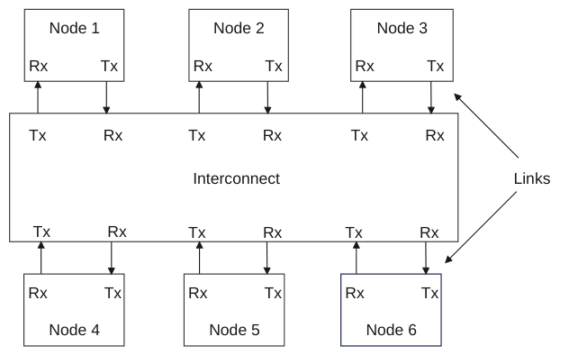

图 B13.1：使用基于链路通信的系统

接口奇偶校验信号（在 B9.3 Use of interface parity 中讨论）不在本章范围内。

### B13.2 链路

Flit 通信发生在一对发送方（Transmitter）与接收方（Receiver）之间。

发送方与接收方之间的连接称为链路。

节点与互连之间的双向通信需要一对链路。

图 B13.2 展示了链路的要求。

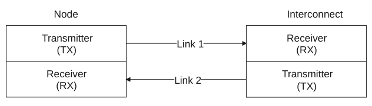

图 B13.2：双向链路通信

#### B13.2.1 出站链路与入站链路

发送方用于发送数据包的链路定义为出站链路。

接收方用于接收数据包的链路定义为入站链路。

图 B13.3 展示了节点处的出站链路和入站链路。互连处的接口具有一对互补的链路。

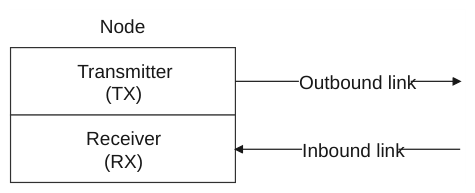

图 B13.3：出站链路与入站链路

### B13.3 Flit

flit 是链路层中的基本传输单元。

数据包被格式化为 flit 并跨链路传输。flit 有两种类型：

协议 flit 协议 flit 在其载荷中携带协议数据包。每个协议数据包恰好映射到一个协议 flit。

链路 flit 链路 flit 携带与链路维护相关的消息。例如，在链路去激活序列期间，发送方使用 LCRdReturn 向接收方返回链路层信用（L-Credit）。链路 flit 起源于链路发送方，终止于连接在链路另一侧的链路接收方。

### B13.4 通道

链路层提供了一组用于 flit 通信的通道。

每个通道都有一个已定义的 flit 格式，该格式包含多个字段，且其中某些字段宽度具有多种可能取值。在某些情况下，已定义的 flit 格式既可以用于入站通道，也可以用于出站通道。

表 B13.1 展示了各通道，以及它们到请求节点和从属节点组件通道的映射。

表 B13.1：通道到请求节点和从属节点组件通道的映射

通道 描述 用途 请求节点通道 从属节点通道

REQ Request 请求通道 所有请求 TXREQ RXREQ 传输与请求消息（例如读请求和写请求）相关联的 flit。参见 B13.8.1 Request, REQ, channel。

RSP 响应通道 来自以下者的响应 RXRSP TXRSP Response 传输与完成方响应消息相关联的 flit，这些消息没有数据载荷，例如写完成消息。参见 B13.8.2 Response, RSP, channel。

Snoop Response 与 Completion Acknowledge

SNP Snoop 侦听通道 所有侦听请求 RXSNP - 传输与 Snoop 和 SnpDVMOp Request 消息相关联的 flit。参见 B13.8.3 Snoop, SNP, channel。

DAT Data 数据通道传输 WriteData，以及 TXDAT RXDAT 与协议相关联的 flit，这些消息具有数据载荷，例如读完成和 WriteData 消息。来自请求节点的 Snoop 响应数据。参见 B13.8.4 Data, DAT, channel。

读数据 RXDAT TXDAT

#### B13.4.1 通道依赖关系

协议中允许通道之间存在以下依赖关系。

对于请求节点（Request Node）：

- 必须在入站 SNP 通道上取得向前推进，而不要求出站 REQ 通道取得向前推进。
- 允许（但并非必须）等待出站 RSP 通道取得向前推进之后，再在入站 SNP 通道上取得向前推进。
- 允许（但并非必须）等待出站 DAT 通道取得向前推进之后，再在入站 SNP 通道上取得向前推进。
- 必须在入站 RSP 通道上取得向前推进，而不要求任何其他通道取得向前推进。
- 必须在入站 DAT 通道上取得向前推进，而不要求任何其他通道取得向前推进。

> **注意**
>
> 请求节点必须在入站 RSP 和 DAT 通道上取得向前推进、而不要求任何其他通道取得向前推进，这一要求意味着请求节点必须能够接收未完成事务的所有 Comp 和 CompData 响应，而无需发送任何 CompAck 响应。

对于从属节点（Subordinate Node）：

- 允许（但并非必须）等待出站 RSP 通道取得向前推进之后，再在入站 REQ 通道上取得向前推进。
- 当 Retry_Support 为：
- True：必须在入站 REQ 通道上取得向前推进，而不要求出站 DAT 通道取得向前推进。
- RP0_Only：必须在 RP0 的入站 REQ 通道上取得向前推进，而不要求出站 DAT 通道取得向前推进。允许（但并非必须）从属节点等待出站 DAT 通道取得向前推进之后，再在 RP1 至 RP7 的入站 REQ 通道上取得向前推进。
- False：允许（但并非必须）等待出站 DAT 通道取得向前推进之后，再在入站 REQ 通道上取得向前推进。
- 必须在入站 DAT 通道上取得向前推进，而不要求任何其他通道取得向前推进。

### B13.5 端口

端口（Port）定义为节点接口处所有链路的集合。

图 B13.4 展示了链路、通道与端口之间的关系。具体节点要求参见 B13.6 节点接口定义。信号细节参见 B13.8 通道接口信号，以及第 B14 章 链路握手。

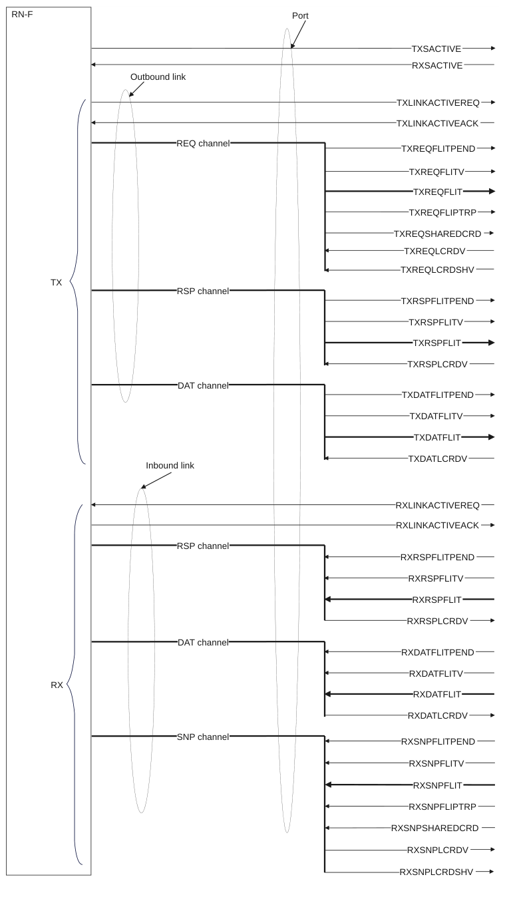

图 B13.4：链路、通道与端口之间的关系

### B13.6 节点接口定义

节点通过跨节点接口发送 flit 来交换消息。本节描述 CHI 协议支持的两种节点接口类型：

- B13.6.1 请求节点
- B13.6.2 从属节点

> **注意**
>
> 各节点用于链路管理的 LINKACTIVE 接口引脚和信号在第 B14 章 链路握手 中描述。

#### B13.6.1 请求节点

本节描述请求节点接口：

- B13.6.1.1 RN-F
- B13.6.1.2 RN-D
- B13.6.1.3 RN-I

##### B13.6.1.1 RN-F

RN-F 接口使用所有通道，供完全一致性请求方（如核心或集群）使用。

图 B13.5 展示了 RN-F 接口。

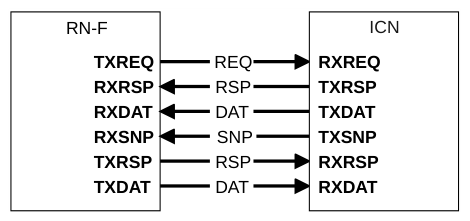

图 B13.5：RN-F 接口

##### B13.6.1.2 RN-D

RN-D 接口使用所有通道，供处理 DVM 消息的 IO 一致性节点使用。SNP 通道的使用仅限于 DVM 事务。详细信息参见 B8.2 DVM 事务流。

图 B13.6 展示了 RN-D 接口。

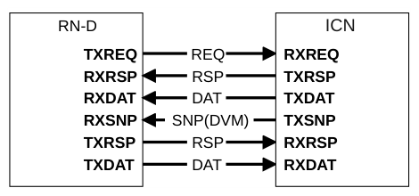

图 B13.6：RN-D 接口

##### B13.6.1.3 RN-I

RN-I 接口使用除 SNP 通道之外的所有通道，供 GPU 或 IO 桥等 IO 一致性 Request Node 使用。由于 RN-I 节点不包含硬件一致性缓存或 TLB，因此不需要 SNP 通道。

图 B13.7 展示了 RN-I 接口。

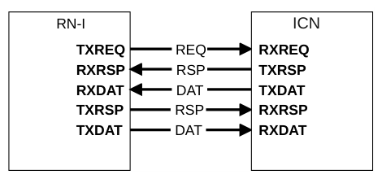

图 B13.7：RN-I 接口

#### B13.6.2 从属节点

本节介绍从属节点接口：

- B13.6.2.1 SN-F 与 SN-I

##### B13.6.2.1 SN-F 与 SN-I

SN-F 和 SN-I 接口完全相同，使用一个 RX 请求通道、一个 TX 响应通道、一个 TX 数据通道和一个 RX 数据通道。SN-F 和 SN-I 从互连接收请求消息，并向互连返回响应消息。不过，SN-F 和 SN-I 接收到的事务类型不同。

图 B13.8 展示了 SN-F 和 SN-I 接口。

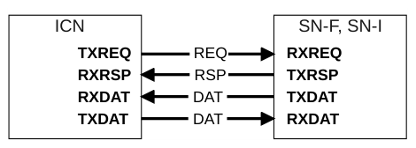

图 B13.8：SN-F 和 SN-I 接口

### B13.7 提高端口间带宽

节点接口的可用带宽可以通过多种方式提高。以下各节详细介绍了两种允许使用的架构方法：

- B13.7.1 多个接口
- B13.7.2 单个接口上的复制通道

#### B13.7.1 多个接口

组件提高可用带宽最简单的方法是采用多个接口。一个完整的接口可以被复制。节点上某个接口被复制的次数由实现决定。

图 B13.9 给出了复制接口的示例。

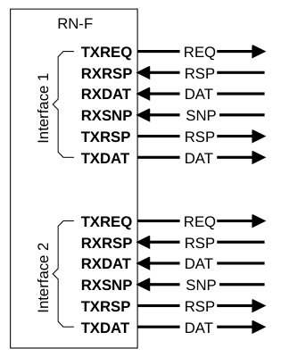

图 B13.9：多接口示例

这种通过两个接口提高带宽的方法的主要特点是：

- 每个接口都有自己的：
- NodeID
- TxnID 池
- 一组 SACTIVE 信号
- 一组 LINKACTIVE 信号
- 一组 SYSCOREQ/SYSCOACK 信号
- 一组可选的广播控制引脚
- 每个复制接口都必须被视为一个独立的接口：
- 如果一个接口分配了缓存行，则另一个复制接口不能释放该缓存行。
- 在响应请求时，完成方必须在与该请求所使用的相同接口上发送响应。
- 必须将侦听发送到用于导致某个缓存行分配的那个事务所使用的相同接口。
- 来自一个接口的事务必须能够向前推进，而不要求复制接口上的事务向前推进。
- 即使只有部分通道需要提高带宽，也必须复制所有通道。

##### B13.7.1.1 地址条带化

允许一种可选优化：Request Node 可以指定用于在多个接口之间进行选择的地址条带化方式。可以为任意数量的接口指定该方式。

允许 Request Node 使用地址条带化将其请求引导到合适的接口，而无需声明所使用的条带化算法。

归属节点通常可以基于侦听过滤器来过滤侦听。如果侦听过滤器是精确的，则会跟踪缓存了该缓存行的请求方的节点 ID，并针对随后对同一缓存行的请求，在单个接口上发送侦听。如果侦听过滤器跟踪不精确，或者其规模是按系统中的组件数量而非 Request Node 接口数量来设定的，则无法隔离出发送侦听所需的那个单一接口，除非该侦听过滤器知道并使用与请求方相同的地址条带化算法。

当 Request Node 未声明其条带化算法时，要么需要增大侦听过滤器，要么归属节点必须发送冗余侦听。建议使用地址条带化的 Request Node 公布其条带化算法，以便归属节点使用。

Request Node 所使用的地址条带化可以通过哈希函数来指定。

##### B13.7.1.2 哈希函数示例

本节描述一种建议采用的哈希函数，用于将请求分发到多个 REQ 接口。同一哈希函数也可用于将侦听分发到多个可用的 SNP 接口。生成接口编号的步骤如下：

1. 缓存行对齐的输入地址首先经过预定义的 Hash Mask 过滤。在过滤地址之前，未使用的高位地址位必须全为零。在本示例中，过滤的结果为 Mask_Result。
2. 对 Mask_Result 的各个比特进行异或（XOR）运算，以得到目标接口。

当接口数量为 2 的幂时：

- 对于 2 个接口：

Interfaces[0] = Mask_Result[n-1] ˆ Mask_Result[n-2] ... Mask_Result[7] ˆ Mask_Result[6]

- 对于 4 个接口：

Interfaces[1:0] = Mask_Result[n-1:n-2] ˆ Mask_Result[n-3:n-4] ... Mask_Result[9:8] ˆ Mask_Result[7:6]

- 对于 8 个接口：

Interfaces[2:0] = Mask_Result[n-1:n-3] ˆ Mask_Result[n-4:n-6] ... Mask_Result[11:9] ˆ Mask_Result[8:6]

本示例未涵盖接口数量不是 2 的幂的情况。

#### B13.7.2 单接口上的复制通道

与通过更复杂的方法复制一个完整接口相比，一种更高效的提升可用接口带宽的方法是有选择地复制那些需要更大带宽的通道。

图 B13.10 给出了复制通道的一个示例。

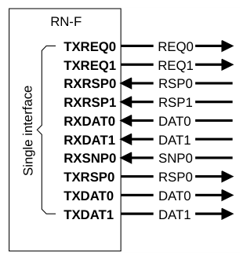

图 B13.10：复制通道示例

##### B13.7.2.1 特性

本节描述这种提升可用带宽方法的主要特性。

每个通道都可以被有选择地复制。对哪些通道被复制没有限制。通常，通道的复制基于该通道所需的预期带宽。例如，在图 B13.10 中，TXREQ 被复制为 TXREQ0、TXREQ1，而 RXSNP 未被复制，只有 RXSNP0。复制通道接口的特性如下：

- 对应于单个 DAT 通道的所有复制的 DAT 子通道必须具有相同的宽度。
- 整个接口必须使用：
- 相同的 NodeID
- 单个 TxnID 池
- 事务内的消息可以使用任意子通道：
- 响应消息无需使用与请求相同的子通道。例如，TXREQ0 上的请求可以在 RXRSP0 或 RXRSP1 上给出响应。
- 单个请求的多个响应消息可以来自任意子通道。例如，写事务的 DBIDResp 在 RXRSP0 上接收，而相应的 Comp 可以在 RXRSP1 上接收。
- 与非复制通道一样，复制通道不提供任何通道内顺序保证。
- 所有链路信用（credit）均以子通道为单位进行分配。
- 不能使用 TXREQ0 的信用在 TXREQ1 上发送 flit。
- 接收方需要在所有子通道上提供信用。
- 协议信用针对合并后的 TXREQ 通道。
- 不支持单独对某个子通道断电。
- DVM 侦听的两个部分可以来自任一子通道。每个部分可以位于不同的子通道上。
- 两个相连接口上的子通道数量必须匹配。
- 必须只有一组 SACTIVE、LINKACTIVE 和 SYSCOREQ/SYSCOACK 信号，以及

可选的广播控制引脚。

- 当接口包含复制的 DAT 通道时，接口属性 CCF_Wrap_Order 不允许设置为 True。

> **注意**
>
> 当某个通道在接口上被复制后，一个传输使用哪个子通道是由实现定义的（IMPLEMENTATION SPECIFIC）。

### B13.8 通道接口信号

本节介绍通道接口信号，包含以下章节：

- B13.8.1 Request（REQ）通道
- B13.8.2 Response（RSP）通道
- B13.8.3 Snoop（SNP）通道
- B13.8.4 Data（DAT）通道

#### B13.8.1 Request（REQ）通道

图 B13.11 展示了 REQ 通道接口引脚，其中 R 是 REQFLIT 的宽度。

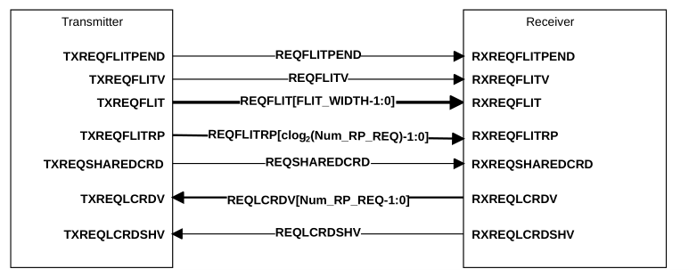

图 B13.11：REQ 通道接口引脚

表 B13.2 展示了 REQ 通道接口信号。

表 B13.2：REQ 通道接口信号

| Signal | Presence | Description |
| --- | --- | --- |
| REQFLITPEND | Always. | Request Flit Pending。提前指示下一个周期可能发送一个 REQ flit。参见 B14.4 Flit level clock gating。 |
| REQFLITV | Always. | Request Flit Valid。发送方将该信号置为 HIGH，以指示 REQFLIT[(R-1):0] 何时有效。 |
| REQFLIT[(R-1):0] | Always. | Request Flit。REQ flit 格式的说明参见 B13.9.1 Request flit。 |
| REQFLITRP[clog2(Num_RP_REQ)-1:0] | Num_RP_REQ > 1 | Request Flit Resource Plane Identifier。指示 REQFLIT[(R-1):0] 正在哪个 RP 上传输。 |
|  |  | 下页续 |

表 B13.2 – 续上页

| Signal | Presence | Description |
| --- | --- | --- |
| REQSHAREDCRD | Shared_Credits_REQ == True | Request Shared Credits。指示发送方正在使用一个 REQ 共享信用。 |

REQLCRDV[(Num_RP_REQ)-1:0] Always. Request L-Credit Valid。接收方将 REQLCRDV 信号的某一位置为 HIGH，以向发送方授予对应 RP 的 REQ 通道 L-Credit。参见 B14.2.1 L-Credit flow control。

REQLCRDSHV Shared_Credit_REQ == True Request Shared L-Credit Valid。接收方将该信号置为 HIGH，以向发送方授予一个 REQ 通道共享 L-Credit。

#### B13.8.2 Response（RSP）通道

图 B13.12 展示了 RSP 通道接口引脚，其中 T 是 RSPFLIT 的宽度。入站和出站 RSP 通道使用相同的接口。

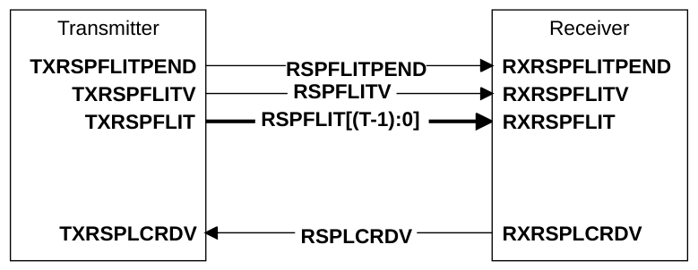

图 B13.12：RSP 通道接口引脚

表 B13.3 展示了 RSP 通道接口信号。

表 B13.3：RSP 通道接口信号

| Signal | Presence | Description |
| --- | --- | --- |
| RSPFLITPEND | Always. | Response Flit Pending。提前指示下一个周期可能发送一个 RSP flit。参见 B14.4 Flit level clock gating。 |
| RSPFLITV | Always. | Response Flit Valid。发送方将该信号置为 HIGH，以指示 RSPFLIT[(T-1):0] 何时有效。 |
|  |  | 下页续 |

表 B13.3 – 续上页

| Signal | Presence | Description |
| --- | --- | --- |
| RSPFLIT[(T-1):0] | Always. | Response Flit。RSP flit 格式的说明参见 B13.9.2 Response flit。 |
| RSPLCRDV | Always. | Response L-Credit Valid。接收方将该信号置为 HIGH，以向发送方授予一个 RSP 通道 L-Credit。参见 B14.2.1 L-Credit flow control。 |

#### B13.8.3 Snoop（SNP）通道

图 B13.13 展示了 SNP 通道接口引脚，其中 S 是 SNPFLIT 的宽度。

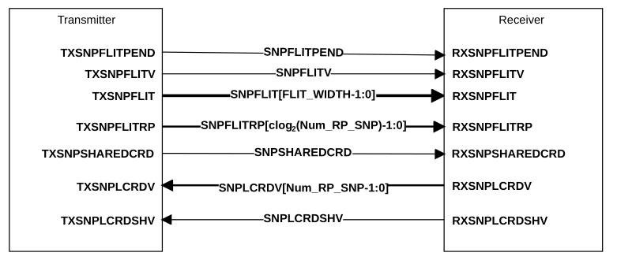

图 B13.13：SNP 通道接口引脚

表 B13.4 展示了 SNP 通道接口信号。

表 B13.4：SNP 通道接口信号

| Signal | Presence | Description |
| --- | --- | --- |
| SNPFLITPEND | Always. | Snoop Flit Pending。提前指示下一个周期可能发送一个 SNP flit。参见 B14.4 Flit level clock gating。 |
| SNPFLITV | Always. | Snoop Flit Valid。发送方将该信号置为 HIGH，以指示 SNPFLIT[(S-1):0] 何时有效。 |
| SNPFLIT[(S-1):0] | Always. | Snoop Flit。SNP flit 格式的说明参见 B13.9.3 Snoop flit。 |

下页续

表 B13.4 – 续上页

| Signal | Presence | Description |
| --- | --- | --- |
| SNPLCRDV | Always. | Snoop L-Credit Valid。接收方将该信号置为 HIGH，以向发送方授予一个 SNP 通道 L-Credit。参见 B14.2.1 L-Credit flow control。 |
| SNPFLITRP[clog2(Num_RP_SNP)-1:0] | Num_RP_SNP > 1 | Snoop Flit Resource Plane Identifier。指示 SNPFLIT[(R-1):0] 正在哪个 RP 上传输。 |
| SNPSHAREDCRD | Shared_Credits_SNP == True | Snoop Shared Credits。指示发送方正在使用一个 SNP 共享信用。 |
| SNPLCRDV[(Num_RP_SNP)-1:0] | Always. | Snoop L-Credit Valid。接收方将 SNPLCRDV 信号的某一位置为 HIGH，以向发送方授予对应 RP 的 SNP 通道 L-Credit。 |
| SNPLCRDSHV | Shared_Credits_SNP == True | Snoop Shared L-Credit Valid。接收方将该信号置为 HIGH，以向发送方授予一个 SNP 通道共享 L-Credit |

#### B13.8.4 Data、DAT 通道

图 B13.14 示出 DAT 通道接口引脚，其中 D 为 DATFLIT 的宽度。入站和出站 DAT 通道使用同一接口。

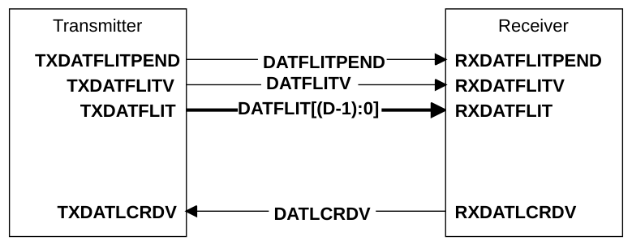

图 B13.14：DAT 通道接口引脚

表 B13.5 示出 DAT 通道接口信号。

表 B13.5：DAT 通道接口信号

| 信号 | 存在性 | 描述 |
| --- | --- | --- |
| DATFLITPEND | 始终存在。 | 数据 flit 待发。提前指示下一个周期可能发送 DAT flit。参见 B14.4 Flit 级时钟门控。 |
| DATFLITV | 始终存在。 | 数据 flit 有效。发送方将该信号置为 HIGH，以指示 DATFLIT[(D-1):0] 何时有效。 |
| DATFLIT[(D-1):0] | 始终存在。 | 数据 flit。关于 DAT flit 格式的说明，参见 B13.9.4 数据 flit。 |
| DATLCRDV | 始终存在。 | 数据 L-Credit 有效。接收方将该信号置为 HIGH，以向发送方授予 DAT 通道 L-Credit。参见 B14.2.1 L-Credit 流控。 |

### B13.9 flit 数据包定义

本节定义 flit 格式。参见：

- B13.9.1 请求 flit
- B13.9.2 响应 flit
- B13.9.3 侦听 flit
- B13.9.4 数据 flit

#### B13.9.1 请求 flit

表 B13.6 示出 REQ 通道数据包中从位 0 开始的请求 flit 格式。

使用以下键：

MBZ 必须为零（Must Be Zero）

表 B13.6：请求 flit 格式

| REQFLIT[(R-1):0] 格式字段 | 字段宽度 | 备注 |
| --- | --- | --- |
| QoS | 4 | - |
| TgtID | 7 至 16 | 宽度由 NodeID_Width 确定 |
| SrcID | 7 至 16 | 宽度由 NodeID_Width 确定 |
| TxnID | 12 | - |

ReturnNID 7 至 16 用于 DMT

StashNID 用于 Stash 事务

{(NodeID_Width - 7)’b0, MBZ

DataTarget[6:0]} 用于辅助在系统缓存层级中放置数据

StashNIDValid 1 用于 Stash 事务

Endian 用于 Atomic 事务

Deep 用于 CleanSharedPersist* 事务

PrefetchTgtHint 面向 Chip-to-Chip 接收方的提示

ReturnTxnID[11:0] 12 用于 DMT

{6’b0, MBZ

StashLPIDValid, 用于 Stash 事务

| StashLPID[4:0]} |  | 用于 Stash 事务 |
| --- | --- | --- |
| Opcode | 7 | - |
| MultiReq | 1 | 用于多请求事务。 |
| NumReq {3’b0, Size} | 6 | 字段由 MultiReq 值确定 |
| Addr | RAW = 44 至 52 | 宽度由 Req_Addr_Width (RAW) 确定 |

下页续

表 B13.6 – 续上页

| REQFLIT[(R-1):0] 格式字段 | 字段宽度 | 备注 |
| --- | --- | --- |
| PAS | 3 | - |
| LikelyShared | 1 | - |
| AllowRetry | 1 | - |
| Order | 2 | - |
| PCrdType | 4 | - |
| MemAttr | 4 | - |
| SnpAttr DoDWT | 1 | - 用于 DWT |

PGroupID[7:0] 8 用于 PCMO 事务

StashGroupID[7:0] 用于 StashOnceSep 事务

TagGroupID[7:0] 用于内存标记

{3’b0, MBZ

| LPID[4:0]} |  | - |
| --- | --- | --- |
| Excl SnoopMe CAH | 1 | 用于 Exclusive 事务 用于 Atomic 事务 用于 CopyBack 写事务 |
| ExpCompAck | 1 | - |
| TagOp | 2 | - |
| TraceTag | 1 | - |
| MPAM | M = 0 M = 12, 15 | 无 MPAM 总线 - |
| PBHA | PB = 0 PB = 4 | 无 PBHA 总线 - |

MECID E = 0 无 MECID 总线

E = 16 用于 RME-MEC

StreamID R = 0 无 StreamID 总线

R = 16 用于 RME-CDA

公共字段为 Max(E,R)

SecSID1 S = 0 无 SecSID1 位

S = 1 用于 RME-CDA

RSVDC Y = 0 无 RSVDC 总线

Y = 4, 8, 12, 16, 24, 32 宽度由 Req_RSVDC_Width 确定。

下页续

表 B13.6 – 续上页

| REQFLIT[(R-1):0] 格式字段 | 字段宽度 | 备注 |
| --- | --- | --- |
| Total | (93 + RAW + Y + M + PB + S + Max(E,R)) 至 (120 + RAW + Y + M + PB + S + Max(E,R)) |  |

#### B13.9.2 Response flit

表 B13.7 显示了 RSP 通道数据包中从 bit 0 开始的 Response flit 格式。

使用如下键值说明：

MBZ 必须为零

表 B13.7：Response flit 格式

| RSPFLIT[(T-1):0] 格式字段 | 字段宽度 | 备注 |
| --- | --- | --- |
| QoS | 4 | - |
| TgtID | 7 to 16 | 宽度由 NodeID_Width 决定 |
| SrcID | 7 to 16 | 宽度由 NodeID_Width 决定 |
| TxnID | 12 | - |
| Opcode | 5 | - |
| RespErr | 2 | - |
| Resp | 3 | - |
| FwdState[2:0] {2’b0, DataPull} | 3 | 用于 DCT MBZ 用于 Stash 事务 |
| CBusy | 3 | - |

DBID[11:0] 12 -

{4’b0, MBZ

PGroupID[7:0]} 用于 Persistent CMO 事务

{4’b0, MBZ

StashGroupID[7:0]} 用于 Stash 事务

{4’b0, MBZ

| TagGroupID[7:0]} |  | 用于内存标记 |
| --- | --- | --- |
| PCrdType | 4 | - |
|  |  | 下页续 |

表 B13.7 – 续上页

| RSPFLIT[(T-1):0] 格式字段 | 字段宽度 | 备注 |
| --- | --- | --- |
| TagOp | 2 | - |
| TraceTag | 1 | - |
| CacheLineID 总计 | 6 T = 71 to 89 | 用于多请求事务 |

#### B13.9.3 Snoop flit

表 B13.8 显示了 SNP 通道数据包中从 bit 0 开始的 Snoop flit 格式。

使用如下键值说明：

MBZ 必须为零

表 B13.8：Snoop flit 格式

| SNPFLIT[(S-1):0] 格式字段 | 字段宽度 | 备注 |
| --- | --- | --- |
| QoS | 4 | - |
| SrcID | 7 to 16 | 宽度由 NodeID_Width 决定 |
| TxnID | 12 | - |
| FwdNID {(NodeID_Width - 4)’0, PBHA[3:0]} | 7 to 16 | 宽度由 NodeID_Width 决定 |

FwdTxnID[11:0] 12 用于 DCT

{6’b0, MBZ

StashLPIDValid, 用于 Stash 事务

StashLPID[4:0]} 用于 Stash 事务

{4’b0, MBZ

| VMIDExt[7:0]} |  | 用于 DVM 事务 |
| --- | --- | --- |
| Opcode | 5 | - |
| Addr | SAW = 41 to 49 | Req_Addr_Width - 3 |
| PAS | 3 | - |
| DoNotGoToSD | 1 | - |
| RetToSrc | 1 | - |
| TraceTag | 1 | - |
| MPAM | M = 0 | 无 MPAM 总线 下页续 |

表 B13.8 – 续上页

| SNPFLIT[(S-1):0] 格式字段 | 字段宽度 | 备注 |
| --- | --- | --- |
|  | M = 12, 15 | - |

MECID E = 0 无 MECID 总线

E = 16 用于 RME-MEC

总计 S = (53 + SAW + M + E) to (71 + SAW + M + E)

#### B13.9.4 Data flit

表 B13.9 显示了 DAT 通道数据包中从 bit 0 开始的 Data flit 格式。

所需的 data flit 数量取决于数据字节数和数据总线宽度。见 B2.9.4 Data packetization。

数据通道接口支持 128-bit、256-bit 和 512-bit 的数据总线宽度。共定义了三种 data flit 格式，分别对应数据通道接口所支持的三种数据总线宽度。

DataCheck 字段宽度为 0，或等于 Data 字段宽度除以 8。

Poison 字段宽度为 0，或等于 Data 字段宽度除以 64。

使用如下键值说明：

MBZ 必须为零

表 B13.9：Data flit 格式

| DATFLIT[(D-1):0] 格式字段 | 字段宽度 | 备注 |
| --- | --- | --- |
| QoS | 4 | - |
| TgtID | 7 to 16 | 宽度由 NodeID_Width 决定 |
| SrcID | 7 to 16 | 宽度由 NodeID_Width 决定 |
| TxnID | 12 | - |

HomeNID 7 to 16 宽度由 NodeID_Width 决定

{(NodeID_Width - 5)’b0,

MismatchedMECID,

PBHA[3:0]}

Opcode 4 -

RespErr 2 -

Resp 3 -

DataSource[7:0] 8 指示响应中的数据源

{5’b0, MBZ

下页续

表 B13.9 – 续上页

| DATFLIT[(D-1):0] 格式字段 | 字段宽度 | 备注 |
| --- | --- | --- |
| FwdState[2:0]} |  | 用于 DCT |
| DataPull | 1 | 用于 Stash 事务 |
| CBusy | 3 | - |
| MECID {4’b0, DBID[11:0]} | E = 0 E = 16 16 | 无 MECID 总线 用于 RME-MEC - |
| CCID | 2 | - |
| DataID | 2 | - |
| CacheLineID | 6 | - |
| TagOp | 2 | - |
| Tag | DW/32 = 4, 8, 16 | - |
| TU | DW/128 = 1, 2, 4 | - |
| TraceTag | 1 | - |
| CAH | 1 | - |
| NumDat | 2 | - |
| Replicate | 1 | - |
| RSVDC | Y = 0 Y = 4, 8, 12, 16, 24, 32 | 无 RSVDC 总线 宽度由 Dat_RSVDC_Width 决定。 |
| BE | DW/8 = 16, 32, 64 | - |
| Data | DW = 128, 256, 512 | DW = B16.1.13 Data_Width |
| DataCheck | 0 or DW/8 = 16, 32, 64 | DC = DataCheck |

Poison 0 or DW/64 = 2, 4, 8 P = Poison

总计 D = (240 to 267) + Y + DC + P DW = 128-bit 数据

D = (389 to 416) + Y + DC + P DW = 256-bit 数据

D = (687 to 714) + Y + DC + P DW = 512-bit 数据

### B13.10 协议 flit 字段

协议 flit 通过 opcode 字段中的非 0 值来标识。本节定义的所有 flit 字段均适用于协议 flit。以下各节描述协议 flit 字段的编码：

- B13.10.1 服务质量，QoS
- B13.10.2 目标标识符，TgtID
- B13.10.3 源标识符，SrcID
- B13.10.4 归属节点标识符，HomeNID
- B13.10.5 返回节点标识符，ReturnNID
- B13.10.6 转发节点标识符，FwdNID
- B13.10.7 逻辑处理器标识符，LPID
- B13.10.8 Persistence Group 标识符，PGroupID
- B13.10.9 Stash 节点标识符，StashNID
- B13.10.10 Stash 节点标识符有效，StashNIDValid
- B13.10.11 Stash 逻辑处理器标识符，StashLPID
- B13.10.12 Stash 逻辑处理器标识符有效，StashLPIDValid
- B13.10.13 Stash Group 标识符，StashGroupID
- B13.10.14 事务标识符，TxnID
- B13.10.15 返回事务标识符，ReturnTxnID
- B13.10.16 转发事务标识符，FwdTxnID
- B13.10.17 数据缓冲区标识符，DBID
- B13.10.18 通道 opcode，Opcode
- B13.10.19 Deep 持久化，Deep
- B13.10.20 地址，Addr
- B13.10.21 事务数据大小，Size
- B13.10.22 内存属性，MemAttr
- B13.10.23 Snoop 属性，SnpAttr
- B13.10.24 执行直接写传输，DoDWT
- B13.10.25 LikelyShared
- B13.10.26 排序要求，Order
- B13.10.27 Exclusive，Excl
- B13.10.28 CopyAtHome，CAH
- B13.10.29 基于页的硬件属性，PBHA
- B13.10.30 Endian
- B13.10.31 AllowRetry
- B13.10.32 ExpCompAck
- B13.10.33 SnoopMe
- B13.10.34 返回源，RetToSrc
- B13.10.35 DataPull
- B13.10.36 不转换到 SD 状态，DoNotGoToSD
- B13.10.37 协议信用类型，PCrdType
- B13.10.38 Tag 操作，TagOp
- B13.10.39 Tag
- B13.10.40 Tag 更新，TU
- B13.10.41 Tag Group 标识符，TagGroupID
- B13.10.42 跟踪 Tag，TraceTag
- B13.10.43 内存系统资源分区与监控，MPAM
- B13.10.44 虚拟机标识符扩展，VMIDExt
- B13.10.45 响应错误，RespErr
- B13.10.46 响应状态，Resp
- B13.10.47 转发状态，FwdState
- B13.10.48 完成方忙，CBusy
- B13.10.49 数据载荷，Data
- B13.10.50 关键块标识符，CCID
- B13.10.51 DataID
- B13.10.52 字节使能，BE
- B13.10.53 DataCheck
- B13.10.54 Poison
- B13.10.55 数据源，DataSource
- B13.10.56 DataTarget
- B13.10.57 PrefetchTgtHint
- B13.10.58 省略的 DAT 包数量，NumDat
- B13.10.59 Replicate
- B13.10.60 客户专用保留，RSVDC
- B13.10.61 内存加密上下文标识符，MECID
- B13.10.62 流标识符，StreamID
- B13.10.63 流标识符安全状态，SecSID1
- B13.10.64 MultiReq
- B13.10.65 NumReq

#### B13.10.1 服务质量，QoS

QoS 字段用于为事务分配服务质量（QoS）值。QoS 取值递增表示优先级更高。

参见 B11.1 服务质量（QoS）机制。

#### B13.10.2 目标标识符，TgtID

TgtID 字段是消息所发往的目标组件的节点 ID。互连用它来确定消息发送到哪个端口。

参见 B2.4.1 目标标识符 TgtID 和源标识符 SrcID。

#### B13.10.3 源标识符，SrcID

SrcID 字段是发送消息的组件的节点 ID。互连用它来确定消息从哪个端口发出。

参见 B2.4.1 目标标识符 TgtID 和源标识符 SrcID。

#### B13.10.4 Home Node Identifier, HomeNID

HomeNID 字段与原始请求相关联。请求方使用该字段中的值来确定为响应 CompData 而发送的 CompAck 的 TgtID。

HomeNID 字段适用于 CompData 和 DataSepResp。

HomeNID 字段在其它所有 Data 消息中不适用，且必须为零。

参见 B2.4.11 Home Node Identifier, HomeNID。

#### B13.10.5 Return Node Identifier, ReturnNID

ReturnNID 字段标识从属节点向其发送 CompData、DataSepResp 或 Persist 响应的节点。当 DoDWT = 1 时，该字段还指示从属节点向其发送 DBIDResp 的节点。该值可以是归属节点的节点 ID，也可以是发起该事务的请求方的节点 ID。

在 ReadNoSnp、ReadNoSnpSep、CleanSharedPersistSep、WriteNoSnp、WriteNoSnpDef、Combined Write 和 Atomic 请求中，ReturnNID 字段适用于从归属节点到从属节点的方向。

对于其它所有请求，ReturnNID 字段不适用，且必须为零。对于 Stash 请求，数据包中的相同位用于 StashNID。

参见 B2.4.10 Return Node Identifier, ReturnNID。

#### B13.10.6 Forward Node Identifier, FwdNID

FwdNID 字段标识可向其转发 CompData 响应的请求方。该值必须是发起该事务的请求方的节点 ID。

FwdNID 字段适用于 Forward 类型的侦听。

除基于范围的 TLBI DVM 操作外，FwdNID 字段在其它所有侦听请求中不适用，且必须为零。

在基于范围的 TLBI DVM 操作中，该字段中的位用于 DVM 载荷。

参见 B2.4.12 Forward Node Identifier, FwdNID。

#### B13.10.7 Logical Processor Identifier, LPID

当单个请求方包含多个逻辑上独立的处理代理时，使用 LPID 字段。SrcID 与 LPID 结合使用，以唯一标识生成该请求的 LP。

对于以下事务，LPID 字段必须设置为正确的值：

- 对于任何不可侦听、不可缓存或 Device 访问：
- ReadNoSnp
- WriteNoSnp
- WriteNoSnpDef
- 对于 Exclusive 访问，可以是以下事务类型之一：
- ReadClean
- ReadShared
- ReadNotSharedDirty
- ReadPreferUnique
- MakeReadUnique
- CleanUnique
- ReadNoSnp
- WriteNoSnp

更多详细信息参见 B6 章 Exclusive 访问。

在请求中，当适用时，数据包中的相同位用于 TagGroupID、PGroupID 和 StashGroupID。

对于其它事务，允许但不要求使用 LPID 字段值来指示导致事务发起的原始 LP。

参见 B2.4.7 Logical Processor Identifier, LPID。

#### B13.10.8 Persistence Group Identifier, PGroupID

请求方使用 PGroupID 字段，通过将不同的 CleanSharedPersistSep 事务集合分组在一起来识别和处理它们。

PGroupID 字段适用于 CleanSharedPersistSep 和 Write*CleanShPerSep 请求，以及 Persist 和 CompPersist 响应。

PGroupID 字段在其它所有请求和响应中不适用，且必须为零。

在请求中，当适用时，数据包中的相同位用于 LPID、TagGroupID 和 StashGroupID。

在响应中，当适用时，数据包中的相同位用于 DBID、TagGroupID 和 StashGroupID。

参见 B2.4.13 Persistence Group Identifier, PGroupID。

#### B13.10.9 Stash Node Identifier, StashNID

StashNID 字段标识 Stash 请求的目标。当相应的 StashNIDValid 位为 1 时，StashNID 字段提供有效的暂存目标值。

StashNID 字段适用于 Stash 请求。

对于其它所有请求，StashNID 字段不适用，且必须为零。

对于 ReadNoSnp 和 ReadNoSnpSep 请求，数据包中的相同位用于 ReturnNID。

参见 B7.4 Stash target identifiers。

#### B13.10.10 暂存节点标识符有效位，StashNIDValid

StashNIDValid 字段指示 StashNID 字段是否具有有效取值。

StashNIDValid 字段适用于 Stash 请求。

StashNIDValid 字段在其他所有请求中不适用，且必须为零。

表 B13.10 给出了 StashNIDValid 的取值编码。

表 B13.10：StashNIDValid 取值编码

| StashNIDValid | Description |
| --- | --- |
| 0b0 | StashNID 字段取值不适用，且必须为零 |
| 0b1 | 请求中的 StashNID 字段具有有效的暂存目标 |

StashNIDValid 与 StashLPIDValid 允许的组合，参见表 B7.3。

参见 B7.4 暂存目标标识符。

#### B13.10.11 暂存逻辑处理器标识符，StashLPID

StashLPID 字段提供 StashNID 所指定的请求节点内的有效 LP 目标值。

StashLPID 字段适用于 Stash 请求和 Stash 侦听请求。

对于 ReadNoSnp 请求，数据包中的相同位用于 ReturnTxnID。

StashLPID 字段在其他所有请求和侦听请求中不适用，且必须为零。

对于转发侦听，数据包中的相同位用于 FwdTxnID；对于 SnpDVMOp 侦听，数据包中的相同位用于 VMIDExt。

参见 B7.4 暂存目标标识符。

#### B13.10.12 暂存逻辑处理器标识符有效位，StashLPIDValid

StashLPIDValid 字段指示 StashLPID 字段是否具有有效取值。

StashLPIDValid 字段适用于 Stash 请求和 Stash 侦听请求。

StashLPIDValid 字段在其他所有请求和侦听请求中不适用，且必须为零。

表 B13.11 给出了 StashLPIDValid 的取值编码。

表 B13.11：StashLPIDValid 取值编码

| StashLPIDValid | Description |
| --- | --- |
| 0b0 | StashLPID 字段取值不适用，且必须为零 |
| 0b1 | 请求中的 StashLPID 字段具有有效的暂存目标 |

StashLPIDValid 与 StashNIDValid 允许的组合，参见表 B7.3。

参见 B7.4 暂存目标标识符。

#### B13.10.13 Stash Group 标识符，StashGroupID

StashGroupID 字段由请求方使用，通过将不同的 StashOnceSep 事务分组在一起，来识别和处理这些事务集合。

StashGroupID 字段仅适用于 StashOnceSep 请求和 StashDone 响应。

StashGroupID 字段在其他所有请求和响应中不适用，且必须为零。

在请求中，当该字段适用时，数据包中的相同位用于 LPID、TagGroupID 和 PGroupID。

在响应中，当该字段适用时，数据包中的相同位用于 DBID、TagGroupID 和 PGroupID。

参见 B2.4.14 Stash Group 标识符，StashGroupID。

#### B13.10.14 事务标识符，TxnID

TxnID 字段提供消息的事务 ID。当某个给定源节点存在多个未完成事务时，它们各自使用唯一的事务 ID。

LCRdReturn 中的 TxnID 必须为零。

参见 B2.4.2 事务标识符，TxnID。

#### B13.10.15 返回事务标识符，ReturnTxnID

ReturnTxnID 字段标识从属节点必须在 CompData 和 DataSepResp 响应的 TxnID 字段中使用的值。

ReturnTxnID 字段可以是由归属节点为该事务生成的 TxnID，也可以是来自发起该事务的请求方的请求数据包中的 TxnID。

ReturnTxnID 字段仅适用于从归属节点发往从属节点的 ReadNoSnp、ReadNoSnpSep、WriteNoSnp、WriteNoSnpDef、Combined Write 和 Atomic 请求。

ReturnTxnID 字段在其他所有请求中不适用，且必须为零。

对于 Stash 请求，数据包中的相同位用于 StashLPID。

参见 B2.4.4 返回事务标识符，ReturnTxnID。

#### B13.10.16 转发事务标识符，FwdTxnID

FwdTxnID 字段标识与 Snoop 事务相关联的原始请求的 TxnID 字段。

FwdTxnID 字段适用于 Forward 类型的 snoop。

FwdTxnID 字段在其他所有 Snoop 请求中不适用，必须为零。

对于 Stash snoop，数据包中的相同位用于 StashLPID。

对于 SnpDVMOp snoop，数据包中的相同位用于 VMIDExt。

参见 B2.4.5 Forward Transaction Identifier, FwdTxnID。

#### B13.10.17 数据缓冲区标识符，DBID

DBID 字段用作 Requester 在响应来自 Completer 的响应数据包时所发送的 CompAck 或 WriteData 的 TxnID 字段。

在带 Data Pull 的 Snoop 响应中，DBID 值指示要在 Data Pull 响应消息的 TxnID 字段中使用的值。

在响应中（适用时），数据包中的相同位用于 PGroupID、StashGroupID 和 TagGroupID。

参见 B2.4.3 Data Buffer Identifier, DBID。

#### B13.10.18 通道操作码，Opcode

Opcode 字段指定要执行的操作。Opcode 字段的编码特定于每个通道。各通道的编码如下：

- B13.10.18.1 REQ 通道操作码
- B13.10.18.2 RSP 通道操作码
- B13.10.18.3 SNP 通道操作码
- B13.10.18.4 DAT 通道操作码

##### B13.10.18.1 REQ 通道操作码

表 B13.12 展示了请求通道的操作码。

表 B13.12：REQ 通道操作码

| Opcode[5:0] | 请求命令 Opcode[6] = 0 | Opcode[6] = 1 |
| --- | --- | --- |
| 0x00 | ReqLCrdReturn | Reserved |
| 0x01 | ReadShared | MakeReadUnique |
| 0x02 | ReadClean | WriteEvictOrEvict |
| 0x03 | ReadOnce | WriteUniqueZero |
| 0x04 | ReadNoSnp | WriteNoSnpZero |
| 0x05 | PCrdReturn | Reserved |
| 0x06 | Reserved | Reserved |
| 0x07 | ReadUnique | StashOnceSepShared |
| 0x08 | CleanShared | StashOnceSepUnique |
| 0x09 | CleanInvalid | Reserved |
| 0x0A | MakeInvalid | Reserved |
| 0x0B | CleanUnique | Reserved |
| 0x0C | MakeUnique | ReadPreferUnique |
| 0x0D | Evict | CleanInvalidPoPA |
| 0x0E | CleanInvalidStorage | WriteNoSnpDef |
|  |  | 下页续 |

表 B13.12 – 续上页

| Opcode[5:0] | 请求命令 Opcode[6] = 0 | Opcode[6] = 1 |
| --- | --- | --- |
| 0x0F | Reserved | Reserved |
| 0x10 | Reserved | WriteNoSnpFullCleanSh |
| 0x11 | ReadNoSnpSep | WriteNoSnpFullCleanInv |
| 0x12 | Reserved | WriteNoSnpFullCleanShPerSep |
| 0x13 | CleanSharedPersistSep | Reserved |
| 0x14 | DVMOp | WriteUniqueFullCleanSh |
| 0x15 | WriteEvictFull | Reserved |
| 0x16 | Reserved | WriteUniqueFullCleanShPerSep |
| 0x17 | WriteCleanFull | WriteUniqueFullCleanInvStrg |
| 0x18 | WriteUniquePtl | WriteBackFullCleanSh |
| 0x19 | WriteUniqueFull | WriteBackFullCleanInv |
| 0x1A | WriteBackPtl | WriteBackFullCleanShPerSep |
| 0x1B | WriteBackFull | WriteBackFullCleanInvStrg |
| 0x1C | WriteNoSnpPtl | WriteCleanFullCleanSh |
| 0x1D | WriteNoSnpFull | Reserved |
| 0x1E | Reserved | WriteCleanFullCleanShPerSep |
| 0x1F | Reserved | Reserved |
| 0x20 | WriteUniqueFullStash | WriteNoSnpPtlCleanSh |
| 0x21 | WriteUniquePtlStash | WriteNoSnpPtlCleanInv |
| 0x22 | StashOnceShared | WriteNoSnpPtlCleanShPerSep |
| 0x23 | StashOnceUnique | Reserved |
| 0x24 | ReadOnceCleanInvalid | WriteUniquePtlCleanSh |
| 0x25 | ReadOnceMakeInvalid | Reserved |
| 0x26 | ReadNotSharedDirty | WriteUniquePtlCleanShPerSep |
| 0x27 | CleanSharedPersist | Reserved |
| 0x28 - 0x2F | AtomicStore | Reserved |

0x30 AtomicLoad WriteNoSnpPtlCleanInvPoPA

0x31 WriteNoSnpFullCleanInvPoPA

| 0x32 |  | WriteNoSnpFullCleanInvStrg |
| --- | --- | --- |
| 0x33 - 0x37 |  | Reserved |
| 0x38 | AtomicSwap | Reserved |
| 0x39 | AtomicCompare | WriteBackFullCleanInvPoPA |
|  |  | 下页续 |

表 B13.12 – 续上页

请求命令 Opcode[5:0] Opcode[6] = 0 Opcode[6] = 1

0x3A PrefetchTgt Reserved

0x3B - 0x3F Reserved Reserved

表 B13.13 展示了 AtomicStore 和 AtomicLoad 的子操作码。

表 B13.13：AtomicStore 和 AtomicLoad 的子操作码

| Opcode[5:3] AtomicStore | AtomicLoad | Opcode[2:0] | Operation |
| --- | --- | --- | --- |
| 101 | 110 | 000 | ADD |
|  |  | 001 | CLR |
|  |  | 010 | EOR |
|  |  | 011 | SET |
|  |  | 100 | SMAX |
|  |  | 101 | SMIN |
|  |  | 110 | UMAX |
|  |  | 111 | UMIN |

##### B13.10.18.2 RSP 通道操作码

表 B13.14 列出了响应（Response）通道的操作码。

表 B13.14：RSP 通道操作码

| Opcode[4:0] | Response |
| --- | --- |
| 0x00 | RespLCrdReturn |
| 0x01 | SnpResp |
| 0x02 | CompAck |
| 0x03 | RetryAck |
| 0x04 | Comp |
| 0x05 | CompDBIDResp |
| 0x06 | DBIDResp |
| 0x07 | PCrdGrant |
| 0x08 | ReadReceipt |
| 0x09 | SnpRespFwded |
|  | 下页续 |

表 B13.14 – 续上页

| Opcode[4:0] | Response |
| --- | --- |
| 0x0A | TagMatch |
| 0x0B | RespSepData |
| 0x0C | Persist |
| 0x0D | CompPersist |
| 0x0E | DBIDRespOrd |
| 0x0F | Reserved |
| 0x10 | StashDone |
| 0x11 | CompStashDone |
| 0x12 - 0x13 | Reserved |
| 0x14 | CompCMO |
| 0x15 - 0x1B | Reserved |
| 0x1C - 0x1F | 保留供 C2C 使用。参见 AMBA® CHI 芯片到芯片（C2C）架构规范 |

##### B13.10.18.3 SNP 通道操作码

表 B13.15 列出了侦听（Snoop）通道的操作码。

表 B13.15：SNP 通道操作码

| Opcode[4:0] | Snoop command |
| --- | --- |
| 0x00 | SnpLCrdReturn |
| 0x01 | SnpShared |
| 0x02 | SnpClean |
| 0x03 | SnpOnce |
| 0x04 | SnpNotSharedDirty |
| 0x05 | SnpUniqueStash |
| 0x06 | SnpMakeInvalidStash |
| 0x07 | SnpUnique |
| 0x08 | SnpCleanShared |
| 0x09 | SnpCleanInvalid |
| 0x0A | SnpMakeInvalid |
| 0x0B | SnpStashUnique |
| 0x0C | SnpStashShared |
|  | 下页续 |

表 B13.15 – 续上页

| Opcode[4:0] | Snoop command |
| --- | --- |
| 0x0D | SnpDVMOp |
| 0x0E - 0x0F | Reserved |
| 0x10 | SnpQuery |
| 0x11 | SnpSharedFwd |
| 0x12 | SnpCleanFwd |
| 0x13 | SnpOnceFwd |
| 0x14 | SnpNotSharedDirtyFwd |
| 0x15 | SnpPreferUnique |
| 0x16 | SnpPreferUniqueFwd |
| 0x17 | SnpUniqueFwd |
| 0x18 - 0x1F | Reserved |

##### B13.10.18.4 DAT 通道操作码

表 B13.16 列出了数据（Data）通道的操作码。

表 B13.16：DAT 通道操作码

| Opcode[3:0] | Data command |
| --- | --- |
| 0x0 | DataLCrdReturn |
| 0x1 | SnpRespData |
| 0x2 | CopyBackWriteData |
| 0x3 | NonCopyBackWriteData |
| 0x4 | CompData |
| 0x5 | SnpRespDataPtl |
| 0x6 | SnpRespDataFwded |
| 0x7 | WriteDataCancel |

0x8 - 0xA Reserved

下页续

表 B13.16 – 续上页

| Opcode[3:0] | Data command |
| --- | --- |
| 0xB | DataSepResp |
| 0xC | NonCopyBackWriteDataCompAck |
| 0xD | 保留供 C2C 使用。参见 AMBA® CHI 芯片到芯片（C2C）架构规范 |
| 0xE - 0xF | Reserved |

#### B13.10.19 深度持久化，Deep

Deep 字段由请求方（Requester）使用，用于指示在完成方（Completer）可以提供某些响应之前，写入必须已经写到最终目的地。

Deep 字段适用于 CleanSharedPersist* 请求以及带 CleanSharedPersistSep 的 Combined Write 请求。

Deep 字段在其他所有请求中均不适用，且必须为零。

当 Deep 字段为 0 时：

- 在完成方可发送以下响应之前，所有更早的写入必须已经到达 PoP：
- 针对 CleanSharedPersist 事务的 Comp
- 针对 CleanSharedPersistSep 事务的 Persist 或 CompPersist
- PoP 是指在该点可以保证在断电后仍有足够时间使数据持久化的位置。

当 Deep 字段为 1 时：

- 在完成方可发送以下响应之前，所有更早的写入必须已经写到最终目的地以及 PoP：
- 针对 CleanSharedPersist 事务的 Comp
- 针对 CleanSharedPersistSep 事务的 Persist 或 CompPersist
- 最终目的地是指在该点断电后无需任何时间即可使数据持久化的位置。如果发生电池故障，这可以确保数据得到保全。

有关响应排序保证的更多信息，参见表 B2.7。

#### B13.10.20 地址，Addr

Addr 字段指定与该消息关联的地址。

支持 44 至 52 位的 PA。该地址承载在 REQ 和 SNP 通道的 Addr 字段中。

Addr 字段的宽度由 Req_Addr_Width 参数定义。在 REQ 通道中，Addr 字段宽度与该参数值相同，为 Addr[(43-51):0]；在 SNP 通道中，其宽度比该参数值小 3，为 Addr[(43-51):3]。

Addr 字段在 REQ 和 SNP 通道中的使用方式如下：

- 对于 Read、PrefetchTgt、Dataless、Write 和 Atomic* 事务，Addr 字段包含所访问的

内存位置的地址。其起始为 Addr[0] 映射到 Addr 的位 0。

- 对于侦听请求（SnpDVMOp 除外），Addr 字段包含被侦听位置的地址。

其起始为 Addr[3] 映射到 Addr 的位 0。

- Addr[(43-51):6] 是缓存行地址。它足以唯一标识该侦听所要

访问的缓存行。

- Addr[5:4] 标识该事务所访问的关键数据块。参见 B2.9.7 Critical Chunk

Identifier。建议被侦听的缓存在返回数据时采用 wrap 顺序，并优先返回关键数据块。

> **注意**
>
> REQ 通道中的 Addr[3]，即 SNP 通道中的 Addr[0]，虽然会被提供，但侦听请求不使用它。

- 对于 DVMOp 和 SnpDVMOp 请求，Addr 字段用于承载与 DVM

操作相关的信息。参见第 B8 章 DVM Operations。

- PCrdReturn 事务不使用 Addr 字段的值，且该值必须为零。

参见 B2.8.1 Address。

#### B13.10.21 事务数据的大小，Size

Size 字段指定与该事务关联的数据的大小。

表 B13.17 给出了 Size 字段的取值编码。

表 B13.17：Size 字段取值编码

| Size[2:0] | Bytes |
| --- | --- |
| 0b000 | 1 |
| 0b001 | 2 |
| 0b010 | 4 |
| 0b011 | 8 |
| 0b100 | 16 |
| 0b101 | 32 |
| 0b110 | 64 |
| 0b111 | Reserved |

多请求事务中的每条数据消息的有效 Size 均为 64 字节。

参见 B2.9.1 Data size。

#### B13.10.22 内存属性，MemAttr

MemAttr 字段与该事务关联。

表 B13.18 给出了 MemAttr 的取值编码。

表 B13.18：MemAttr 取值编码

| MemAttr[3:0] | Name | Description | 0b0 | 0b1 |
| --- | --- | --- | --- | --- |
| [3] | Allocate | 该位指示是否建议接收该事务的缓存分配该事务。 | 建议不分配该缓存行。 | 建议分配该缓存行。 |
| [2] | Cacheable | 该位指示一个可缓存事务，若存在缓存，则必须在处理该事务时查询该缓存。 | 不可缓存。不需要查询缓存。 | 可缓存。需要查询缓存。 |
| [1] | Device | 该位指示与该事务关联的内存类型是 Device 还是 Normal。 | Normal 内存类型。 | Device 内存类型。 |
| [0] | EWA | 该位指定该事务的 Early Write Acknowledge (EWA) 状态。 | 不允许 EWA。 | 允许 EWA。 |

参见 B2.8.3 Memory Attributes。

#### B13.10.23 侦听属性，SnpAttr

SnpAttr 字段指定与该事务关联的侦听属性。

表 B13.19 给出了 SnpAttr 的取值编码。

表 B13.19：SnpAttr 取值编码

| SnpAttr | Description |
| --- | --- |
| 0b0 | 不可侦听。接收该请求的 HN-F 不预期对任何 RN-F 节点发起侦听，但允许这样做。 |

0b1 可侦听。接收该请求的 HN-F 可能需要向可能持有该缓存行的任何 RN-F 节点发送相应的侦听。如果 HN-F 没有侦听过滤器，这可能涉及全部、部分或没有 RN-F 节点。CopyBack 事务不要求产生侦听。接收该请求的 HN-I 所给出的响应详见 B16.1.17 Nonshareable_Cache_Maint。

参见 B2.8.6 Snoop attribute。

#### B13.10.24 Do Direct Write Transfer，DoDWT

DoDWT 字段适用于从归属节点（Home）发往从属节点（Subordinate）的 WriteNoSnpPtl、WriteNoSnpFull、WriteNoSnpDef 与 Combined Write 请求。

DoDWT 字段在所有其他请求中均不适用，且必须为零。

DoDWT 字段在数据包中与 SnpAttr 使用相同的位。

表 B13.20 展示了 DoDWT 的取值编码。

表 B13.20：DoDWT 取值编码

| DoDWT | DBIDResp.TgtID 取值 | DBIDResp.TxnID 取值 |
| --- | --- | --- |
| 0b0 | 设置为请求的 SrcID 取值 | 设置为请求中的 TxnID 取值 |
| 0b1 | 设置为请求中的 ReturnNID 取值 | 设置为请求中的 ReturnTxnID 取值 |

参见 B2.3.2.1 Immediate Write 与 B2.3.2.4 Combined Immediate Write and CMO。

#### B13.10.25 Likely Shared，LikelyShared

LikelyShared 字段指示所请求的数据是否有可能与另一个请求节点共享。

表 B13.21 展示了 LikelyShared 字段的取值编码。

表 B13.21：LikelyShared 取值编码

| LikelyShared | 描述 |
| --- | --- |
| 0b0 | 不太可能被另一个请求节点共享 |
| 0b1 | 可能被另一个请求节点共享 |

参见 B2.8.5 Likely Shared。

建议（但并非要求）使用 LikelyShared 字段来指示 WriteEvictOrEvict 事务中的初始缓存行状态。更多信息参见表 B4.14。

#### B13.10.26 排序要求，Order

Order 字段规定事务的排序要求。

表 B2.9 展示了 Order 字段的取值编码。

使用以下键值：

- 不适用。

表 B13.22：Order 取值编码

| Order[1:0] | 描述 | 允许于 | 允许用于多请求 |
| --- | --- | --- | --- |
| 0b00 | 无排序要求 | 所有 | 是 |
| 0b01 | 请求被接受 | HN-F 到 SN-F，以及 HN-I 到 SN-I | 是 |
|  | Reserved | RN 到 HN | - |
| 0b10 | Request Order 或 OWO | RN 到 HNa | 是 |
|  | Request Order | HN-I 到 SN-I | 是 |
|  |  |  | 下页续 |

表 B13.22 – 续上页

| Order[1:0] | 描述 | 允许于 | 允许用于多请求 |
| --- | --- | --- | --- |
|  | Reserved | HN-F 到 SN-F | - |
| 0b11 | Endpoint Order | RN 到 HN，以及 HN-I 到 SN-I | - |
|  | Reserved | HN-F 到 SN-F | - |

a 当 ExpCompAck = 0 时为 Request Order。当 ExpCompAck = 1 时为 OWO。

关于排序要求的更多信息，参见 B2.7 Ordering。

#### B13.10.27 独占，Excl

Excl 字段指示相应的事务是 Exclusive 类型的事务。

Exclusive 位必须仅与以下事务一起使用：

- ReadNotSharedDirty
- ReadShared
- ReadClean
- ReadPreferUnique
- CleanUnique
- MakeReadUnique
- ReadNoSnp
- WriteNoSnp

表 B13.23 展示了 Excl 的取值编码。

表 B13.23：Excl 取值编码

| Excl | 描述 |
| --- | --- |
| 0b0 | 普通事务 |
| 0b1 | Exclusive 事务 |

参见 B6.3 Exclusive transactions。

#### B13.10.28 CopyAtHome，CAH

CAH 字段在以下情形中指示：

- 来自归属节点或 Snoopee 的响应中，归属节点是否拥有所提供给请求方的缓存行的副本。
- 发往归属节点的 CopyBack 请求中，请求方自归属节点指示保留该行的副本以来尚未修改该行或 MTE 标签。

CAH 属性不会影响请求方针对 Clean 行或 Dirty 行的正常操作。CAH 字段仅用于影响执行 CopyBack 事务时是否需要进行数据传输。

CAH 字段在以下消息中适用且可取任意值：

- 除 WriteBackPtl 外的所有 CopyBack 与 Combined CopyBack Write 请求
- 发往请求方的 CompData 与 DataSepResp 响应
- SnpRespData 与 SnpRespDataFwded

CAH 字段在以下消息中适用且必须为零：

- WriteBackPtl
- SnpRespDataPtl

CAH 字段在所有其他消息中均不适用，且必须为零。

更多信息参见 B2.3.2.3 CopyBack Write 与 B2.8.8 CopyAtHome 属性。

#### B13.10.29 基于页的硬件属性，PBHA

PBHA 字段携带来自转换表的 4 位，可用于 IMPLEMENTATION DEFINED 的硬件控制。

接口上的 PBHA 支持由 PBHA_Support 属性定义。参见 B16.1.19 PBHA_Support。

当支持 PBHA 时，存在 PBHA 字段：

- 在 REQ 通道上。PBHA 字段适用于所有请求，但 DVMOp 和 PCrdReturn 除外

在这些请求中它不适用，且必须为零。

- 在 DAT 通道上。PBHA 字段仅适用于 SnpRespData、SnpRespDataPtl 和

SnpRespDataFwded。在所有其他 DAT 消息中，PBHA 字段不适用，且必须为零。

- 在 SNP 通道上。PBHA 字段仅适用于 Stash 侦听。PBHA 字段不适用，

在所有非 Stash 侦听中必须设置为 0。

PBHA 字段不存在于 RSP 通道中。

参见 B11.5 Page-based Hardware Attributes。

#### B13.10.30 Endian

Endian 字段指示 Atomic 事务中 Data 的字节序。

Endian 字段适用于 Atomic 请求。

Endian 字段在所有其他请求中均不适用，且必须为零。

表 B13.24 展示了 Endian 的取值编码。

表 B13.24：Endian 取值编码

| Endian | 描述 |
| --- | --- |
| 0b0 | 小端 |
| 0b1 | 大端 |

参见 B2.9.6.3 Endianness。

#### B13.10.31 允许重试，AllowRetry

AllowRetry 字段规定：该请求是在没有 P-Credit 的情况下发送的，且完成方可以确定是否给出重试响应。

完成方给出重试响应的能力取决于 Retry_Support 属性的取值。

表 B13.25 展示了 AllowRetry 的取值编码。

表 B13.25：AllowRetry 取值编码

| AllowRetry | 描述 |
| --- | --- |
| 0b0 | 不允许 RetryAck 响应 |
| 0b1 | 允许 RetryAck 响应 |

参见 B2.10 Request Retry。

#### B13.10.32 期望完成确认，ExpCompAck

ExpCompAck 字段指示该事务包含 CompAck 响应。

表 B13.26 展示了 ExpCompAck 的取值编码。

表 B13.26：ExpCompAck 取值编码

| ExpCompAck | 描述 |
| --- | --- |
| 0b0 | 事务不包含 CompAck 响应 |
| 0b1 | 事务包含 CompAck 响应 |

对于 CopyBack 写事务，当无法单独使用 ExpCompAck 字段来确定事务中是否包含 CompAck 时，由归属节点所选择的事务流决定是否需要 CompAck。更多信息参见 B2.3.2.3 CopyBack Write。

#### B13.10.33 SnoopMe

SnoopMe 字段指示归属节点必须确定是否向请求方发送侦听。

当 SnpAttr 为 1 时，SnoopMe 字段适用于来自 RN-F 的 Atomic 请求。

在以下情形中，SnoopMe 字段不适用且必须为 0：

- 当 SnpAttr 为 0 时来自 RN-F 的 Atomic 请求。
- 来自 RN-D、RN-I、HN-F 和 HN-I 的请求。

表 B13.27 展示了 SnoopMe 的取值编码。

表 B13.27：SnoopMe 取值编码

| SnoopMe | 描述 |
| --- | --- |
| 0b0 | 允许（但不要求）归属节点向请求方发送侦听。 |
| 0b1 | 如果该缓存行可能存在于请求方，则归属节点必须向请求方发送侦听。 |

参见 B2.3.3 Atomic transactions。

#### B13.10.34 返回源，RetToSrc

RetToSrc 字段请求 Snoopee 向归属节点返回缓存行的副本。

在以下情形中，RetToSrc 字段不适用且必须为零：

- SnpCleanShared、SnpCleanInvalid 和 SnpMakeInvalid
- SnpOnceFwd 和 SnpUniqueFwd
- SnpMakeInvalidStash、SnpStashUnique 和 SnpStashShared
- SnpQuery

RetToSrc 字段在所有其他侦听中均适用且可取任意值，但 SnpDVMOp 除外，在 SnpDVMOp 中它不适用且必须为零。

参见 B4.9 Returning Data with Snoop response。

#### B13.10.35 Data Pull，DataPull

DataPull 字段表示侦听响应中包含一个 Read 请求（也称为 Data Pull）。

在对 Stash 请求的 SnpResp、SnpRespData 和 SnpRespDataPtl 响应中，DataPull 字段适用。

在所有其他侦听响应中，DataPull 字段不适用，且必须为零。

当在 SnpRespData 消息中置位 DataPull 字段时，必须在该数据响应消息的所有数据包中置位。

表 B13.28 给出了 DataPull 字段的取值编码。

表 B13.28：DataPull 取值编码

| DataPull | Description | Comment |
| --- | --- | --- |
| 0b0 | No read | 表示由于该侦听响应，不需要 Data Pull |
| 0b1 | Read | 表示由于该侦听响应，需要 Data Pull |

参见 B7.1.1 侦听请求与 Data Pull。

#### B13.10.36 不转换到 SD 状态，DoNotGoToSD

DoNoGoToSD 字段是侦听请求中的一个属性，指示是否要求 Snoopee 不转换到 SD 状态。

DoNoGoToSD 字段在以下情况下适用，且可以取任意值：

- SnpOnce, SnpOnceFwd
- SnpClean, SnpCleanFwd
- SnpNotSharedDirty, SnpNotSharedDirtyFwd
- SnpShared, SnpSharedFwd
- SnpPreferUnique, SnpPreferUniqueFwd

DoNoGoToSD 字段在以下情况下适用，且必须为 1：

- SnpStashShared, SnpStashUnique
- SnpUnique, SnpUniqueFwd. SnpUniqueStash
- SnpCleanShared
- SnpCleanInvalid
- SnpMakeInvalid, SnpMakeInvalidStash

DoNoGoToSD 字段在以下情况下不适用，且必须为零：

- SnpQuery
- SnpDVMOp

表 B13.29 给出了 DoNotGoToSD 取值编码。

表 B13.29：DoNotGoToSD 取值编码

| DoNotGoToSD | Description |
| --- | --- |
| 0b0 | 允许转换到 SD 状态。 |

0b1 不允许转换到 SD 状态。

如果已处于 SD 状态，则必须响应该侦听退出 SD 状态，SnpStash* 除外。

如果侦听请求为 SnpOnce 或 SnpOnceFwd，Snoopee 可以忽略该位值。

参见 B4.10 不转换到 SD。

#### B13.10.37 协议信用类型，PCrdType

PCrdType 字段指示所授予或返还的信用的类型。

表 B13.30 给出了 PCrdType 取值编码。

表 B13.30：PCrdType 取值编码

| PCrdType | Description |
| --- | --- |
| 0b0000 - 0b1111 | 分别对应 P-Credit 类型 0 至 15 |

参见表 B13.30。

#### B13.10.38 标记操作，TagOp

TagOp 字段指示要对相应 DAT 通道中存在的标记执行的操作。

表 B13.31 给出了 TagOp 取值编码。

表 B13.31：TagOp 取值编码

| TagOp[1:0] | Tag Operation | Description |
| --- | --- | --- |
| 0b00 | Invalid | 这些标记无效 |

0b01 Transfer

- 这些标记为 Clean。
- 不需要执行 Tag Match。
- 数据包中与数据对应的所有标记

都必须传输。对于可侦听事务，不支持部分标记传输。

- TU 字段不适用，且必须为零。

0b10 Update

- Allocation Tag 值已

更新，且为 Dirty。

- 内存中的 Tag 应被更新。

只有 TU = 1 的 Tag 必须被更新。

0b11 Match

- 必须将写操作中的 Physical Tag

与从内存获取的 Allocation Tag 值进行校验。

- 只能对 BE = 1 的那些 tag 使能

Match Tag 操作。

- TU 字段不适用，且必须为零。

Fetch

- 必须获取标记。
- 必须获取所有标记。
- 允许（但非必需）获取有效

数据。

Retry 请求中的 TagOp 字段值必须与原始请求中的相同。

更多信息请参见第 B12 章 内存标记。

#### B13.10.39 Tag

Tag 字段提供 n 组 4 位标签，即 Tag[4*n-1:0]。每个标签与一个 16 字节对齐的地址位置相关联。

Tag[((4*n)-1) : 4*(n-1)] 对应 Data[(128*n)-1 : 128*(n-1)]。

更多信息，请参见第 B12 章“内存标记”。

#### B13.10.40 Tag Update, TU

TU 字段指示哪些 Allocation Tag 必须被更新。每个标签对应一个 TU 位。

TU 字段适用于更新 Allocation Tag 的侦听响应和写事务。

在所有其他事务中，TU 字段必须为零。

TU[n-1] 对应 Tag[(4*n)-1 : 4*(n-1)]。

更多信息，请参见第 B12 章“内存标记”。

#### B13.10.41 Tag Group Identifier, TagGroupID

TagGroupID 字段由请求方使用，通过将相应的请求分组在一起来识别和处理不同的 TagMatch 响应集合。

TagGroupID 字段的确切内容由实现定义。通常，TagGroupID 字段预期包含异常级别、TTBR 值和 CPU 标识符。

TagGroupID 字段适用于 TagOp 设置为 Match 的请求以及 TagMatch 响应。

在请求中，当适用时，数据包中的相同位用于 LPID、PGroupID 或 StashGroupID。

在响应中，当适用时，数据包中的相同位用于 DBID、PGroupID 或 StashGroupID。

参见 B2.4.15 Tag Group Identifier, TagGroupID。

#### B13.10.42 Trace Tag, TraceTag

TraceTag 字段用于为与某个事务相关联的数据包打上标签，以实现追踪目的。

TraceTag 字段在以下消息中不适用，可以取任意值：

- ReqLCrdReturn
- RspLCrdReturn
- SnpLCrdReturn
- DatLCrdReturn
- Persist
- StashDone
- TagMatch
- PCrdGrant

TraceTag 字段适用于所有其他消息。

表 B13.32 显示了 TraceTag 字段的取值编码。

表 B13.32：TraceTag 取值编码

| TraceTag | 描述 |
| --- | --- |
| 0b0 | 数据包未打标签 |
| 0b1 | 数据包已打标签 |

参见 B11.7 Trace Tag。

#### B13.10.43 Memory System Resource Partitioning and Monitoring, MPAM

MPAM 字段用于在用户之间高效利用内存资源，并监控其使用情况。

参见 B11.4 MPAM。

#### B13.10.44 Virtual Machine Identifier Extension, VMIDExt

VMIDExt 字段用于将 VMID 值从 8 位扩展到 16 位。

参见 B8.4.1 DVM 消息载荷。

#### B13.10.45 Response Error, RespErr

RespErr 字段指示响应的错误状态。

表 B13.33 显示了 RespErr 的取值编码。

表 B13.33：RespErr 取值编码

RespErr[1:0] 描述

0b00 Normal Okay。表示以下任一情况：

- Normal 访问成功。对于 WriteNoSnpDef，

RespErr 必须与 Resp 组合使用，以确定确切的响应。参见表 B13.35。

- 独占访问失败。

| 0b01 | Exclusive Okay。表示独占访问的读部分或写部分之一成功。 |
| --- | --- |
| 0b10 | 数据错误，DERR |
| 0b11 | 非数据错误，NDERR |

参见第 B9 章“错误处理”。

#### B13.10.46 Response status, Resp

在多 flit 数据传输的所有数据 flit 中，Resp 字段必须具有相同的值。

表 B13.34 显示了 Resp 的取值编码。

表 B13.34：Resp 取值编码

Resp[2:0] 描述

Resp[2] PassDirty。表示响应消息中包含的数据相对于内存是脏的，并且回写缓存行的责任正被传递给响应消息的接收方。0b0 返回的数据不是脏的。

0b1 返回的数据是脏的，并且回写缓存行的责任正被传递下去。

下页续

表 B13.34 – 续上页

Resp[2:0] 描述

Resp[1:0] 对于侦听响应，此字段指示被侦听的 RN-F 的最终状态。对于完成响应，此字段指示请求节点中的最终状态。对于 WriteData 响应，此字段指示发送数据时请求节点中数据的状态。对于 TagMatch 响应，仅 Resp[0] 指示 Tag Match 通过或失败。

表 B13.35 显示了有效的 Resp 取值编码。

表 B13.35：不同消息类型的有效 Resp 取值编码

响应类型 Resp[2:0] 状态 说明

侦听响应 被侦听的 RN-F 的最终状态

| 0b000 | I |
| --- | --- |
| 0b001 | SC |
| 0b010 | UC, UD |

0b011 SD

0b100 I_PD 被侦听的 RN-F 的最终状态。更新内存的责任被传递给归属节点。

0b101 SC_PD

0b110 UC_PD

0b111 - 保留

0b000 Comp 响应 I 请求方 RN-F 的最终状态 不包括 WriteNoSnpDef 或 StashOnce* 事务

| 0b001 | SC |
| --- | --- |
| 0b010 | UC |

0b011 -

0b100 - 保留

0b101 -

0b110 UD_PD 请求方 RN-F 的最终状态。更新内存的责任被传递给请求方。

0b111 SD_PD

下页续

表 B13.35 – 续上页

| 响应类型 | Resp[2:0] | 状态 | 说明 |
| --- | --- | --- | --- |
| StashOnce* 事务的 Comp 响应 | 0b000 | I | 响应中的缓存状态是不精确的，必须忽略。 |

0b001 SC 下一级缓存中的缓存状态。

0b010 UC, UD

0b011 SD

保留

| 0b100 | - |
| --- | --- |
| 0b101 | - |
| 0b110 | - |

0b111 -

0b000 仅当 RespErr[1:0] = 0b00 仅适用于 WriteNoSnpDef 的 Comp 或 Successful CompDBIDResp 响应

0b001 保留，且当 Unsupported RespErr[1:0] != 0b00 时必须为 0b000

0b010 Defer 更多信息参见表 B9.1

0b011 - 0b111 - 保留

0b000 WriteData 响应 I 响应中的缓存状态是不精确的，必须忽略

0b001 SC 发送数据时 RN-F 上缓存行的状态

0b010 UC

0b011 - 保留

0b100 -

0b101 -

0b110 UD_PD 发送数据时 RN-F 上缓存行的状态。更新内存的责任被传递给归属节点。

0b111 SD_PD

下页续

表 B13.35 – 续上页

| 响应类型 | Resp[2:0] | 状态 | 说明 |
| --- | --- | --- | --- |
| CopyBack 事务的 CompAck 响应 | 0b000 | I | 响应中的缓存状态是不精确的，必须忽略 |

0b001 SC 发送响应时 RN-F 上缓存行的状态

0b010 UC

0b011 - 保留

0b100 -

0b101 -

0b110 UD_PD 发送数据时 RN-F 上缓存行的状态。更新内存的责任被传递给归属节点。

0b111 SD_PD

0b000 TagMatch 响应 Fail 属于 TagMatch 操作的一部分

0b001 Pass

0b010 - 0b111 - 保留

#### B13.10.47 转发状态，FwdState

FwdState 字段指示从 Snoopee 发送给请求方的 CompData 中的状态。

FwdState 字段适用于 SnpRespFwded 和 SnpRespDataFwded。

FwdState 字段不适用于所有其他侦听响应，且必须为零。

表 B13.36 展示了 FwdState 的取值编码。

表 B13.36：FwdState 取值编码

FwdState 描述

FwdState[2] Pass Dirty。0 被转发的数据不是 Dirty。

1 被转发的数据是 Dirty，且回写缓存行的责任被传递给请求方。

FwdState[1:0] 指示请求方的最终状态。见表 B13.37

表 B13.37 列举了 FwdState 的取值编码。

表 B13.37：有效的 FwdState 取值编码

FwdState[2:0] 状态 注释

0b000 I 请求方的最终状态

0b001 SC

0b010 UC

0b011 - 保留

0b100 -

0b101 -

0b110 UD_PD 请求方的最终状态。

0b111 SD_PD 更新内存的责任被传递给请求方

#### B13.10.48 完成方忙，CBusy

CBusy 字段是一种机制，供事务的完成方指示其当前的活动程度。

CBusy 字段的取值编码由实现定义（IMPLEMENTATION DEFINED）。

见 B11.6 Completer Busy。

#### B13.10.49 数据载荷，Data

Data 字段是在 Data 数据包中传输的数据载荷。

支持以下数据总线宽度：

- 128-bit
- 256-bit
- 512-bit

见 B2.9.4 Data packetization。

#### B13.10.50 关键块标识符，CCID

CCID 字段指示所请求数据的关键 128 位数据块。

表 B13.38 展示了 CCID 的取值编码。

表 B13.38：CCID 取值编码

CCID[1:0] 关键数据块

0b00 Data[127:0]

0b01 Data [255:128]

0b10 Data [383:256]

0b11 Data [511:384]

见 B2.9.7 Critical Chunk Identifier。

#### B13.10.51 数据标识符，DataID

DataID 字段指示所传输的数据块在 512 位缓存行中的相对位置。

表 B13.39 展示了 DataID 字段的取值编码。

表 B13.39：DataID 取值编码

DataID 数据宽度

128-bit 256-bit 512-bit

0b00 Data[127:0] Data[255:0] Data[511:0]

0b01 Data [255:128] Reserved Reserved

0b10 Data [383:256] Data[511:256] Reserved

0b11 Data [511:384] Reserved Reserved

见 B2.9.4 Data packetization。

#### B13.10.52 字节使能，BE

BE 字段指示数据的对应字节是否有效。

BE 字段适用于写数据、DVM 载荷以及侦听响应数据传输。

BE 字段不适用于读响应数据传输，并且可以取任意值。

BE 字段由 DAT flit 中每个数据字节对应的一位组成。

表 B13.40 展示了 BE 的取值编码。

表 B13.40：BE 取值编码

| BE | 字节使能 |
| --- | --- |
| 0b0 | 数据的对应字节无效 |
| 0b1 | 数据的对应字节有效 |

见 B2.9.3 Byte Enables。

#### B13.10.53 数据检查，DataCheck

DataCheck 字段用于检测 DAT 数据包中的数据错误。

见 B9.2.2 Data Check。

#### B13.10.54 Poison

Poison 字段指示对应的 64 位数据块是否被毒化，即存在错误，且不得被使用。

表 B13.41 展示了 Poison 的取值编码。

表 B13.41：Poison 取值编码

| Poison | 描述 |
| --- | --- |
| 0b0 | 对应的 64 位数据块未被毒化 |
| 0b1 | 对应的 64 位数据块被毒化 |

见 B9.2.1 Poison。

#### B13.10.55 数据源，DataSource

DataSource 字段标识数据响应的发送方，并可提供关于系统中数据状态的附加信息。

DataSource 字段适用于：

- 读事务和 Atomic 事务中的 CompData 和 DataSepResp 响应
- SnpRespData 和 SnpRespDataPtl 响应

DataSource 字段不适用于所有其他响应，且必须为零。

> **注意**
>
> 在 Issue G 之前，DataSource 字段仅适用于非 Stash 类型侦听事务中的 SnpRespData 或 SnpRespDataPtl 响应。之所以有这样的要求，是因为 DataPull 在 SNP 通道上共用了相同的字段位置。随着 Issue G 将 DataPull 拆分出来，该限制被移除，从而允许 DataSource 适用于所有 SnpRespData 或 SnpRespDataPtl 响应。

见 B11.2 Data Source。

#### B13.10.56 数据目标，DataTarget

DataTarget 字段把来自请求方的替换与使用提示转发给互连中的各缓存。

参见 B11.3 Data Target。

#### B13.10.57 PrefetchTgt 提示，PrefetchTgtHint

请求方可以使用（但并非必须使用）PrefetchTgtHint 字段来指示原始请求具有关联的 PrefetchTgt 请求。如果已知原始 PrefetchTgt 在 Chip-to-Chip 链路发送端被丢弃，则 Chip-to-Chip 链路接收端可以使用 PrefetchTgtHint 字段重新创建该 PrefetchTgt 请求。

表 B13.42：PrefetchTgtHint 编码

| PrefetchTgtHint | 描述 |
| --- | --- |
| 0b0 | 该 Read 未包含关联的 PrefetchTgt 请求，或者在发送该读请求时该信息不可用。在 Chip-to-Chip 链路接收端生成 PrefetchTgt 请求没有预期价值。 |
| 0b1 | 该 Read 包含关联的 PrefetchTgt 请求。下页续 |

表 B13.42 – 续上页

| PrefetchTgtHint | 描述 |
| --- | --- |
|  | 如果已知 PrefetchTgt 在 Chip-to-Chip 链路源端被丢弃，则在 Chip-to-Chip 链路接收端重新生成它是有价值的。 |

PrefetchTgtHint 字段在下列从请求节点发往归属节点的请求中适用，且可以设置为 0 或 1：

- ReadNoSnp
- ReadUnique
- ReadShared
- ReadPreferUnique
- ReadOnce*
- ReadNotSharedDirty
- ReadClean

PrefetchTgtHint 字段在所有其他从请求节点发往归属节点的请求中，以及所有从归属节点发往从属节点的请求中，均不适用且必须为零。

PrefetchTgtHint 字段在 PrefetchTgt 请求中不适用且必须为零。

#### B13.10.58 被省略的 DAT 数据包数量，NumDat

NumDat 字段指示在使用 Limited Data Elision 时，被传输的数据包所表示的额外 DAT 数据包数量，且适用于所有数据消息。

表 B13.43 展示了 NumDat 的编码。

表 B13.43：NumDat 字段编码

| NumDat[1:0] | 所表示的额外 DAT 数据包数量 |
| --- | --- |
| 0b00 或不受支持时的默认值 | 0 个数据包 |
| 0b01 | 1 个数据包 |
| 0b10 | 2 个数据包 |
| 0b11 | 3 个数据包 |

NumDat 可能取值的范围取决于数据总线宽度 Data_Width 与请求事务大小。

NumDat 字段与 Replicate 结合使用。NumDat 与 Replicate 的可能取值见表 B2.17。

在数据响应消息的每个被传输的数据包中，NumDat 字段的取值可以不同。

仅当 DAT 数据包中所有 BE 位均为 0 或均为 1 时，NumDat 字段才可设置为非零值。任何被省略的数据包具有与代表它们的已发送数据包相同的 BE 取值。

如果 DAT 数据包中使用了稀疏 BE，则 NumDat 字段必须为 0b00。

参见 B2.9.5 Limited Data Elision。

#### B13.10.59 Replicate

Replicate 字段与 NumDat 结合使用，以确定任何被省略的数据包的字段取值。

Replicate 字段仅在 NumDat 不为 0b00 时适用。

当 NumDat 为 0b00 时，Replicate 字段不适用且必须为零。

表 B13.44 展示了 Replicate 的编码，以及它如何定义任何被省略的数据包的字段取值。

表 B13.44：Replicate 字段编码

Replicate 描述

0b0 或不受支持 由 NumDat 省略的数据包具有以下内容：

- Data = 0x0
- NumDat = 0b00
- Replicate = 0b0
- DataCheck = 全 1
- DataID 经过调整以表示被省略的数据包
- 所有其他字段与本数据包取值相同。

0b1 由 NumDat 省略的数据包具有以下内容：

- Data = 本数据包中的 Data 取值
- NumDat = 0b00
- Replicate = 0b0
- DataID 经过调整以表示被省略的数据包。
- 所有其他字段与本数据包取值相同。

NumDat 与 Replicate 的可能取值见表 B2.17。

参见 B2.9.5 Limited Data Elision。

#### B13.10.60 保留供客户使用，RSVDC

Protocol flit 中的 RSVDC 字段可以取任意值。

该字段在互连中的传播由实现定义。一个事务的不同数据包中，RSVDC 字段值之间没有定义任何关系。

RSVDC 字段适用于 REQ 和 DAT 通道：

- 该字段的存在是可选的。
- 允许的字段宽度为：
- 4-bits
- 8-bits
- 12-bits
- 16-bits
- 24-bits
- 32-bits
- RSVDC 字段宽度：
- 在 REQ 和 DAT 通道之间可以不同。
* Req_RSVDC_Width 属性定义 REQ 通道上 RSVDC 字段的宽度。* Dat_RSVDC_Width 属性定义 DAT 通道上 RSVDC 字段的宽度。
- 不需要在整个系统的所有 REQ 通道中保持一致。
- 不需要在整个系统的所有 DAT 通道中保持一致。

当连接 RSVDC 宽度不匹配的 Tx 和 Rx flit 接口时：

- RSVDC 字段的对应低位比特必须在接口的每一侧连接。
- RX 接口上不存在 TX 接口对应比特的 RSVDC 高位比特必须置为 LOW。

#### B13.10.61 内存加密上下文标识符，MECID

MECID 字段被内存加密引擎用作加密上下文（密钥或 tweak）表的索引，这些上下文参与外部内存加密。

当 MEC_Support 为 True 时，MECID 字段存在于 REQ、SNP 和 DAT 通道上。

##### B13.10.61.1 REQ 通道

MECID 字段在以下事务中不适用，且必须为零：

- PCrdReturn
- DVMOp

MECID 字段在以下事务中不适用，且可以取任意值：

- Evict
- CleanShared
- CleanSharedPersist
- CleanSharedPersistSep
- CleanInvalid
- CleanInvalidPoPA
- CleanInvalidStorage
- MakeInvalid
- CleanUnique
- MakeUnique

MECID 字段适用于所有其他请求，但当 DevAssign_Support 为 Device_StreamID_SecSID1 时发往主机的设备请求除外。

当 DevAssign_Support 为 Device_StreamID_SecSID1 时，包含 MECID 和 StreamID 的公共字段被视为 StreamID。

当适用时，MECID 字段可以取受表 B13.47 中 PAS 关系约束的任意值。

##### B13.10.61.2 DAT 通道

MECID 字段与 DBID 共享一个公共字段。

该公共字段在以下情况下被视为：

- 当 DataPull 为 0 且消息为 SnpRespData、SnpRespDataPtl 或 SnpRespDataFwded 时，被视为 MECID。MECID 字段可以取受表 B13.47 中 PAS 关系约束的任意值。
- 当 DataPull 为 1，或者在任意不是 SnpRespData、SnpRespDataPtl 或 SnpRespDataFwded 的数据消息中，被视为 DBID。

MECID 字段在所有其他数据消息中不适用，且必须为零。

##### B13.10.61.3 SNP 通道

MECID 字段需要满足以下适用性：

- 在 SnpDVMOp 和 SnpQuery 中不适用，且必须为零。
- 在 SnpLCrdReturn 中不适用，且可以取任意值。
- 适用于所有其他 Snoop 消息，并且可以取受表 B13.47 中 PAS 关系约束的任意值。

见 B10.6 内存加密上下文，MEC。

#### B13.10.62 流标识符，StreamID

StreamID 字段用作请求流的唯一标识符，这些请求源自与同一 System MMU 上下文关联的一个或一组 Requester。

当 DevAssign_Support 属性设置为 Device_StreamID_SecSID1 时，StreamID 字段存在。

当与 PCIe 对接时，StreamID 字段是与单个 PCIe 端点关联的请求方节点 ID。

StreamID 字段适用于发往主机的所有设备请求，且可以取任意值，但以下请求除外，在这些请求中 StreamID 不适用且必须为零：

- PCrdReturn
- DVMOp

StreamID 字段在发往设备的主机请求中不存在。

见 B10.7 设备分配（DA）与一致性设备分配（CDA）。

#### B13.10.63 Stream Identifier Security State, SecSID1

SecSID1 字段用于限定 StreamID 的安全状态。

当 DevAssign_Support 属性设置为 Device_StreamID_SecSID1 时，存在 SecSID1 字段。

SecSID1 字段在发往主机的所有设备请求中均适用，且可以取任意值，但以下请求除外：此时 SecSID1 不适用且必须为零：

- PCrdReturn
- DVMOp

在发往设备的 host 请求中不存在 SecSID1 字段。

关于 SecSID1 针对 PAS 允许的编码，参见表 B10.3。

参见 B10.7 Device Assignment (DA) and Coherent Device Assignment (CDA)。

#### B13.10.64 MultiReq

MultiReq 字段与 NumReq 字段配合使用，用于指示与该事务相关联的数据总量。

MultiReq 字段适用于：

- ReadNoSnp
- ReadNoSnpSep
- ReadOnce
- ReadOnceCleanInvalid
- ReadOnceMakeInvalid
- WriteNoSnpFull
- WriteNoSnpPtl
- WriteNoSnpZero
- WriteUniqueFull
- WriteUniquePtl
- WriteUniqueZero

在 ReqLCrdReturn 中，MultiReq 字段不适用且可以取任意值。

在所有其他请求中，MultiReq 字段不适用且必须为 0。

更多信息参见 B2.6 Multi-request。

#### B13.10.65 NumReq

NumReq 字段与 MultiReq 字段配合使用，用于指示与该事务相关联的数据总量。

NumReq 的最低有效 3 位与 Size 字段共用同一字段。

当 MultiReq 字段为 0 时，该共用字段被视为 Size。

当 MultiReq 字段为 1 时，该共用字段被视为 NumReq。

表 B13.45 示出了基于 MultiReq、Size 和 NumReq 字段的请求大小。

表 B13.45：MultiReq、Size 和 NumReq 字段的有效编码

| MultiReq | {3’b0, Size[2:0]} / NumReq[5:0] | Number of bytes being requested |
| --- | --- | --- |
| 0b0 | 0b000000 | 1 |
|  | 0b000001 | 2 |
|  | 0b000010 | 4 |
|  | 0b000011 | 8 |
|  | 0b000100 | 16 |
|  | 0b000101 | 32 |
|  | 0b000110 | 64 |
|  | Others | Reserved |
| 0b1 | 0b000000 | Reserved |
|  | 0b000001 | 128 |
|  | 0b000010 | 192 |
|  | 0b000011 | 256 |
|  | 0b000100 | 320 |
|  | 0b000101 | 384 |
|  | 0b000110 | 448 |
|  | 0b000111 | 512 |
|  |  | 下页续 |

表 B13.45 – 续上页

| MultiReq | {3’b0, Size[2:0]} / NumReq[5:0] | Number of bytes being requested |
| --- | --- | --- |
|  | 0b001000 | 576 |
|  | 0b001001 | 640 |
|  | 0b001010 | 704 |
|  | 0b001011 | 768 |
|  | 0b001100 | 832 |
|  | 0b001101 | 896 |
|  | 0b001110 | 960 |
|  | 0b001111 | 1024 |
|  | 0b010000 | 1088 |
|  | 0b010001 | 1152 |
|  | 0b010010 | 1216 |
|  | 0b010011 | 1280 |
|  | 0b010100 | 1344 |
|  | 0b010101 | 1408 |
|  | 0b010110 | 1472 |
|  | 0b010111 | 1536 |
|  | 0b011000 | 1600 |
|  | 0b011001 | 1664 |
|  | 0b011010 | 1728 |
|  | 0b011011 | 1792 |
|  | 0b011100 | 1856 |
|  | 0b011101 | 1920 |
|  | 0b011110 | 1984 |
|  | 0b011111 | 2048 |
|  | 0b100000 | 2112 |
|  | 0b100001 | 2176 |
|  | 0b100010 | 2240 |
|  | 0b100011 | 2304 |
|  | 0b100100 | 2368 |
|  | 0b100101 | 2432 |
|  | 0b100110 | 2496 |
|  | 0b100111 | 2560 |
|  | 0b101000 | 2624 |
|  |  | 下页续 |

表 B13.45 – 续上页

| MultiReq | {3’b0, Size[2:0]} / NumReq[5:0] | Number of bytes being requested |
| --- | --- | --- |
|  | 0b101001 | 2688 |
|  | 0b101010 | 2752 |
|  | 0b101011 | 2816 |
|  | 0b101100 | 2880 |
|  | 0b101101 | 2944 |
|  | 0b101110 | 3008 |
|  | 0b101111 | 3072 |
|  | 0b110000 | 3136 |
|  | 0b110001 | 3200 |
|  | 0b110010 | 3264 |
|  | 0b110011 | 3328 |
|  | 0b110100 | 3392 |
|  | 0b110101 | 3456 |
|  | 0b110110 | 3520 |
|  | 0b110111 | 3584 |
|  | 0b111000 | 3648 |
|  | 0b111001 | 3712 |
|  | 0b111010 | 3776 |
|  | 0b111011 | 3840 |
|  | 0b111100 | 3904 |
|  | 0b111101 | 3968 |
|  | 0b111110 | 4032 |
|  | 0b111111 | 4096 |

当以下事务中 MultiReq 为 1 时，NumReq 字段适用：

- ReadNoSnp
- ReadNoSnpSep
- ReadOnce
- ReadOnceCleanInvalid
- ReadOnceMakeInvalid
- WriteNoSnpFull
- WriteNoSnpPtl
- WriteNoSnpZero
- WriteUniqueFull
- WriteUniquePtl
- WriteUniqueZero

在 ReqLCrdReturn 中，NumReq 字段不适用且可以取任意值。

在所有其他请求中，或当 MultiReq 为 0 时，NumReq 字段不适用且必须为 0。

更多信息参见 B2.6 Multi-request。

#### B13.10.66 CacheLineID

CacheLineID 字段指示 Response 或 Data 消息与哪一条缓存行相关。

在适用时，对于多请求事务和非多请求事务，CacheLineID 字段都必须与所访问的相应缓存行的 REQ.Addr[11:6] 或 SNP.Addr[8:3] 值一致。

例如，一个以地址位置 0x0C0 为起点、面向四条缓存行的多请求 ReadNoSnp 事务，会看到 CompData、RespSepData 或 DataSepResp 消息带有以下 CacheLineID 值：

- 0b000011 表示地址 0x0C0 处的缓存行
- 0b000100 表示地址 0x100 处的缓存行
- 0b000101 表示地址 0x140 处的缓存行
- 0b000110 表示地址 0x180 处的缓存行

CacheLineID 字段适用于以下 Response 消息，但当它们是一个 DVM 事务的一部分时除外：

- Comp
- RespSepData
- CompDBIDResp
- DBIDResp
- DBIDRespOrd
- ReadReceipt
- CompAck

当以下 Response 消息是一个 DVM 事务的一部分时，CacheLineID 字段不适用，且必须为 0：

- DBIDResp
- Comp
- CompDBIDResp

CacheLineID 字段适用于以下数据消息：

- CompData
- DataSepResp
- SnpRespData
- SnpRespDataPtl
- SnpRespDataFwded

CacheLineID 字段在以下消息中不适用，且可以取任意值：

- RspLCrdReturn
- DatLCrdReturn

CacheLineID 字段在所有其他 Response 和 Data 消息中不适用，且必须为 0。

更多信息参见 B2.6 Multi-request。

#### B13.10.67 MismatchedMECID

MismatchedMECID 字段用于告知归属节点：Snoopee 已检测到传入的 Snoop MECID 字段值与该位置本地缓存中的 MECID 值不匹配。

表 B13.46 给出了 MismatchedMECID 的取值编码。

表 B13.46：MismatchedMECID 取值编码

| MismatchedMECID | Description |
| --- | --- |
| 0b0 | 在 Snoopee 处未检测到 MECID 不匹配。 |
| 0b1 | 在 Snoopee 处检测到 MECID 不匹配。归属节点可能需要采取纠正措施，详见 B10.8.1 MECID mismatch resolution。 |

MismatchedMECID 字段适用于：

- SnpRespData
- SnpRespDataPtl

MismatchedMECID 字段在所有其他数据消息中不适用，且必须为零。

关于 MECID 不匹配行为的更多信息，参见 B10.8.1 MECID mismatch resolution。

#### B13.10.68 PAS

PAS 字段确定请求或侦听所针对的 PAS。

表 B13.47 给出了 REQ 和 SNP 通道中与 MECID 相关的 PAS 编码。

表 B13.47：PAS 编码

| PAS[2:0] | Description | MECID | Restrictions |
| --- | --- | --- | --- |
| 0b000 | Secure | 必须为零。 | 无。 |
| 0b001 | Non-secure | 必须为零。 | 无。 |
| 0b010 | Root | 必须为零。 | RME_Support 必须为 True。 |
| 0b011 | Realm | 可以取任意值a | RME_Support 必须为 True。 |
| 0b100 | System Agent | 可以取任意值a | RME_Support 和 GDI_Support 必须为 True。 |
| 0b101 | Non-secure Protected | 可以取任意值a | RME_Support 和 GDI_Support 必须为 True。 |
| 0b110 | Reserved. | - | - |
| 0b111 | Reserved. | - | - |

a 这取决于 MEC_Support 和 MECID_Width 属性。

##### B13.10.68.1 REQ 通道

PAS 字段在以下消息中不适用，且必须为零：

- PCrdReturn
- DVMOp

PAS 字段在 ReqLCrdReturn 中不适用，且可以取任意值。

PAS 字段适用于所有其他请求。

##### B13.10.68.2 SNP 通道

PAS 字段在 SnpDVMOp 中不适用，且必须为零。

PAS 字段在 SnpLCrdReturn 中不适用，且可以取任意值。

PAS 字段适用于所有其他侦听请求。

更多信息参见 B2.8.2 Physical Address Space, PAS。

### B13.11 链路层信用返回，LCrdReturn

链路层信用返回（Link layer Credit Return，LCrdReturn）用于在链路去激活序列期间向 Receiver 返回 L-Credit。链路 flit 起源于链路 Transmitter，终止于链路另一侧的链路 Receiver。

LCrdReturn 通过 Opcode 字段中的零值来标识。LCrdReturn 的 TxnID 字段必须为 0。其余字段未使用，可以取任意值。

每个通道都有自己的 LCrdReturn 消息：

- REQ 通道，ReqLCrdReturn。
- RSP 通道，RspLCrdReturn。
- SNP 通道，SnpLCrdReturn。
- DAT 通道，DatLCrdReturn。

LCrdReturn 的编码参见 B13.10.18 Channel opcodes, Opcode。

第 B14 章

## B14 链路握手

本章描述链路握手的要求。它包含以下各节：

- B14.1 时钟与初始化
- B14.2 链路层信用
- B14.3 低功耗信令
- B14.4 flit 级时钟门控
- B14.5 接口激活与去激活
- B14.6 发送与接收链路交互
- B14.7 协议层活动指示

### B14.1 时钟与初始化

本节规定 CHI 对全局时钟与复位信号的要求。

#### B14.1.1 时钟

本规范不定义具体的时钟微架构。预期所有设备、互连等都会包含一个或多个时钟，供其他需要同步通信的链路层功能依赖。在以下各节中，适用的通用时钟信号称为 CLK。

#### B14.1.2 复位

本规范不定义具体的复位微架构。预期所有设备、互连等都会包含一个特定的复位解除有效事件，供其他链路层功能依赖。在以下各节中，适用的通用复位信号称为 RESETn。

#### B14.1.3 初始化

在复位期间，组件必须将以下接口信号置为无效：

- TX***LCRDV
- TX***FLITV
- TXLINKACTIVEREQ 和 RXLINKACTIVEACK

复位之后，组件最早可以在 RESETn 为 HIGH 之后的 CLK 上升沿开始驱动这些信号为 HIGH。

所有其他信号可以取任意值。

### B14.2 链路层信用

本节描述链路层信用（L-Credit）机制。信息通过使用 L-Credit 跨越接口通道进行传输。为了将单个 flit 从 Transmitter 传输到 Receiver，Transmitter 必须已获得一个 L-Credit。

#### B14.2.1 L-Credit 流控

以下各节描述在不使用 Resource Planes 和使用 Resource Planes 两种情况下通道使用的 L-Credit 流控条件。

##### B14.2.1.1 无 Resource Planes 时的流控

L-Credit 由 Receiver 通过将相应的 LCRDV 信号有效保持一个时钟周期来发送给 Transmitter。每个通道有一个 LCRDV 信号。各通道的 LCRDV 信号命名参见 B13.8 Channel interface signals。

以下规则规定 Transmitter 与 Receiver 链路必须如何表现：

- 每一次从 Transmitter 到 Receiver 的 flit 传输都会消耗一个 L-Credit。
- Receiver 可以提供的最小 L-Credit 数量为 1。
- Receiver 可以提供的最大 L-Credit 数量为 15。
- Receiver 必须保证它能接收其已发出 L-Credit 的所有 flit。
- 当链路处于活动状态时，本地 Receiver 必须及时提供 L-Credit，而无需远端 Transmitter 采取任何

动作

> **注意**
>
> L-Credit 不能在其被接收的同一周期内使用。

图 B14.1 展示了一个无 Resource Planes 的通道的使用示例。

0 1 2 3 4 5 6 7 8 9

CLK

LCRDV

FLITPEND

FLITV

Credit count 0 0 1 0 1 2 2 1 2 1

图 B14.1：无 Resource Planes 的通道示例

图 B14.1 描述了以下时序：

第 0 周期 Transmitter 没有信用。未发生任何事件。

第 1 周期 Receiver 授予一个信用。

第 2 周期 Transmitter 使用一个信用发送一次传输。

第 3 周期 Receiver 授予一个信用。

第 4 周期 Receiver 授予一个信用。

第 5 周期 Transmitter 使用一个信用发送一次传输。Receiver 授予一个信用。

第 6 周期 Transmitter 使用一个信用发送一次传输。

第 7 周期 Receiver 授予一个信用。

第 8 周期 Transmitter 使用一个信用发送一次传输。

第 9 周期 未发生任何事件。

##### B14.2.1.2 使用 Resource Planes 的流控

Resource Planes（RP）可选地用于 REQ 和 SNP 通道，以实现共享同一链路的流量之间的独立性。这可以用于避免死锁场景或改善服务质量。每个 RP 都有专用信用，因此可以为一个 RP 授予信用，使其在另一个 RP 因等待信用而被阻塞时仍能取得进展。

使用不同 Resource Planes 的 flit 在发送方与接收方之间不得相互阻塞。

如果 flit 在跨越多条链路时仍保持处于不同的 Resource Planes，则非阻塞保证可以扩展。

任何包含多个 Resource Planes 的链路都可以可选地包含共享信用，以在不同 Resource Planes 上吞吐量发生变化时提高缓冲区利用率。支持共享信用的接收方可以在专用于某一个 RP 的缓冲区与可用于任意 RP 的缓冲区之间分配其缓冲区。

建议发送方在同时拥有专用信用和共享信用时，为某个 flit 使用专用信用而非共享信用。这是因为共享信用更灵活，可以保留给没有专用信用的 flit。

以下规则规定了带 RP 扩展的链路上发送方和接收方必须如何行为：

- 信用按 RP 分配。LCRDV 信号每个 RP 对应一位，因此接收方每个周期最多可为每个 RP 授予

一个信用。

- LCRDV 信号的索引标识正在为其授予链路信用的 RP。
- 允许在同一周期内传输针对不同 Resource Planes 的链路信用。
- 如果某个特定 RP 的未完成专用信用数达到最大值，即 15，则该 RP 对应的 LCRDV 位必须置为

无效。

- 接收方必须能够为其支持的每个 RP 至少给出一个专用信用。
- LCRDSHV 信号由接收方置为有效，以向发送方给出一个共享信用。LCRDSHV

可以在不将 LCRDV 置为有效的情况下置为有效。

- 如果未完成的共享信用数达到最大值，即 15，则 LCRDSHV 必须置为无效。
- 每个周期只允许一个 RP 在链路上传输 flit。所传输 flit 的 RP 由

FLITRP 的值给出

- FLITRP 仅在 FLITV 置为有效时才有效。当 FLITV 置为

无效时，FLITRP 的值没有意义，接收方必须忽略它。

- 无论发送方使用的是共享信用还是专用信用，接收方都必须给出 Resource Planes 之间的独立性

保证。

- 只有当发送方拥有针对 FLITRP 值所指示的 RP 的专用信用或拥有共享信用时，才可以将 FLITV

置为有效。

- 当发送方为 FLITRP 值所指示的 RP 将 FLITV 置为有效时，若 SHAREDCRD 为：
- 0，则发送方为该 RP 使用专用信用。
- 1，则发送方使用共享信用。发送方可以使用共享信用在任意

RP 上发送传输。

- 当 FLITV 为零时，SHAREDCRD 信号没有意义，可以取任意值。
- 发送方必须确保：当其有一个 flit 要在某个 RP 上发送、并且该 RP 有可用信用时，该

传输不依赖于其他任何 RP 是否收到信用。

- 接收方必须保证能够接受其已发放专用信用或共享信用的所有 flit。
- 当链路处于活动状态时，本地接收方必须及时提供专用信用或共享信用，

而无需远端发送方采取任何行动。

图 B14.2 展示了使用带有三个 Resource Planes 以及专用信用与共享信用混合的通道的一个示例。

0 1 2 3 4 5 6 7 8 9 10 CLK

LCRDV[0]

LCRDV[1]

LCRDV[2]

LCRDSHV

FLITPEND

FLITV

SHAREDCRD

FLITRP[1:0]

FLIT[FLIT_WIDTH-1:0]

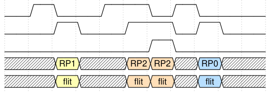

专用 RP0 信用计数

专用 RP1 信用计数

专用 RP2 信用计数

共享信用计数

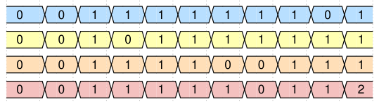

图 B14.2：带有 3 个 Resource Planes 的通道示例

图 B14.2 描述了以下序列：

周期 0 发送方没有信用。

周期 1 接收方为每个 RP 给出一个信用，并给出一个共享信用。

周期 2 发送方使用专用信用在 RP1 上发送一个传输。

周期 3 接收方为 RP1 向发送方返回一个专用信用。

周期 5 发送方使用专用信用在 RP2 上发送一个传输。

周期 6 由于没有可用的专用信用，发送方使用共享信用在 RP2 上发送一个传输。

周期 7 接收方向发送方返回一个共享信用以及一个针对 RP2 的专用信用。

周期 8 发送方使用专用信用在 RP0 上发送一个传输。

周期 9 接收方向发送方返回一个针对 RP0 的专用信用，并额外返回一个共享信用。

### B14.3 低功耗信令

本节描述用于增强接口低功耗运行的 signaling。存在若干不同级别的运行方式：

Flit 级时钟门控 该技术用于逐周期指示接口各通道的活动情况。对于每个通道，都会提供一个附加信号，用于指示下一个周期是否可能发生一次传输。该信令允许对接口相关的某些寄存器进行本地时钟门控。

链路激活 支持链路激活与去激活，以便将接口置于安全状态，使得接口两侧都能进入低功耗状态，从而允许它们被时钟门控或电源门控。

协议活动指示 协议层活动指示由各组件用来指示当前是否有正在进行的事务。协议层活动指示可用于影响是否采用其他低功耗技术的决策。

### B14.4 Flit 级时钟门控

与通道关联的 FLITPEND 信号用于指示下一个时钟周期是否会发送一个有效 flit。每个通道都有一个 FLITPEND 信号。各通道 FLITPEND 信号的命名参见 B13.8 Channel interface signals。

使用 FLITPEND 的要求如下：

- 要求该信号必须在发送方发出 flit 之前恰好一个周期被置位。
- 当该信号置位时，发送方可以在下一个周期发送一个 flit，但并非必须。
- 当该信号取消置位时，要求发送方不得在下一个周期发送 flit。
- 允许发送方将该信号永久保持置位，但并非必须。例如，如果

发送方无法提前确定何时发送 flit。

- 允许发送方在不持有 L-Credit 的情况下置位该信号，但并非必须。
- 允许发送方置位并随后取消置位该信号而不发送

flit。

图 B14.3 给出了 FLITPEND 信号使用的一个示例。

0 1 2 3 4 5 6 7

CLK

FLITPEND

FLITV

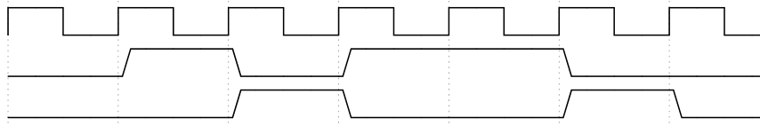

FLIT flit flit

图 B14.3：FLITPEND 指示下一个周期存在有效 flit

### B14.5 接口激活与去激活

提供了一种机制，使整个接口能够在完全运行的工作状态与低功耗状态之间切换。在工作状态之间切换时，包括退出复位时，交换 L-Credit 非常重要。链路 flit 的交换受到精心控制，以避免 flit 或 credit 的丢失。

在退出复位时，或切换到完全运行的工作状态时，接口从空闲状态开始，只有在 L-Credits 完成交换后，flit 的传输才能开始。只有当 credit 的发送方知道接收方已准备好接收 credit 时，才能交换 L-Credits。

使用一种双信号、四相握手机制。该双信号接口用于同一方向上的所有通道，而不是要求每个通道单独使用。整个接口总共使用四个信号，其中两个信号用于所有发送通道，两个信号用于所有接收通道。

#### B14.5.1 请求与应答握手

为便于说明，两信号 Request 与 Acknowledge 的信令采用信号名 LINKACTIVEREQ 和 LINKACTIVEACK 来描述。

本节描述在同一方向上传输的所有通道的 LINKACTIVEREQ 与 LINKACTIVEACK 握手对的操作。B14.6 发送与接收链路交互 描述了发送通道的握手对与接收通道的握手对之间的交互。

对于单个通道或在同一方向上传输的一组通道，图 B14.4 展示了 Payload、Credit、LINKACTIVEREQ 和 LINKACTIVEACK 信号之间的关系。

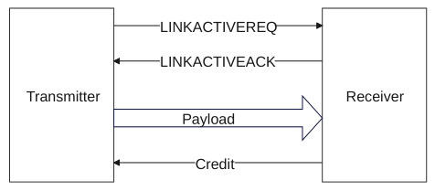

图 B14.4：Payload、Credit 与 LINKACTIVE 信号之间的关系

如图 B14.4 所示，发送 payload flit 的发送端在发送 flit 之前需要一个 credit。当接收端有可用资源接受 flit 时，会传递一个 credit：

- 退出复位时，credit 由接收端持有，必须在 flit 传输开始之前传递给发送端。
- 在正常工作期间，接口两侧之间持续进行 flit 与 credit 的交换。
- 在进入低功耗状态之前，必须停止发送 payload flit，并且所有 credit 必须归还给接收端。这实际上使接口恢复到与紧接复位之后相同的状态。

接口操作定义了四种状态：

RUN 两个组件之间持续进行 flit 与 credit 的交换。

STOP 接口处于低功耗状态，不工作。所有 credit 均由接收端持有，发送端不得发送任何 flit。

ACTIVATE 该状态用于从 STOP 状态迁移到 RUN 状态。

DEACTIVATE 该状态用于从 RUN 状态迁移到 STOP 状态。

RUN 和 STOP 是稳定状态。进入其中一个状态后，通道可以在该状态下保持任意长的时间。

DEACTIVATE 和 ACTIVATE 是瞬态状态。预期当进入其中一个状态时，通道会在相对较短的时间内迁移到下一个稳定状态。

> **注意**
>
> 本规范未定义瞬态状态的最长持续时间，但预期对于任何给定的实现方式，该时长都是确定的。

状态由 LINKACTIVEREQ 和 LINKACTIVEACK 信号确定。图 B14.5 展示了这四种状态之间的关系。

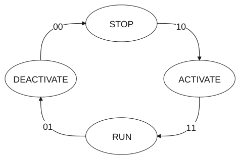

图 B14.5：请求与应答握手状态

表 B14.1 展示了状态到 LINKACTIVEREQ 和 LINKACTIVEACK 信号的映射。

表 B14.1：状态到 LINKACTIVE 信号的映射

| 状态 | LINKACTIVEREQ | LINKACTIVEACK |
| --- | --- | --- |
| STOP | 0 | 0 |
| ACTIVATE | 1 | 0 |
| RUN | 1 | 1 |
| DEACTIVATE | 0 | 1 |

表 B14.2 描述了单条链路的发送端和接收端在这四种状态中每一种状态下的行为。

表 B14.2：每种请求与应答状态下的行为

状态 发送端行为 接收端行为

STOP 发送端没有任何 credit，且不得发送任何 flit。 接收端保证不会收到任何 flit。

下页续

表 B14.2 – 续上页

状态 发送端行为 接收端行为

发送端保证不会收到任何 credit。 接收端不得发送任何 credit。

如果必须发送 flit，发送端必须置位 LINKACTIVEREQ 以迁移到 ACTIVATE 状态。

ACTIVATE (ACT) 发送端不得发送任何 flit。 接收端保证不会收到任何 flit。

发送端必须准备好在此状态下接收 credit。但是，在进入 RUN 状态之前，发送端不得使用这些 credit。 接收端不得发送任何 credit。

ACTIVATE 是瞬态状态，接收端通过置位 LINKACTIVEACK 来控制向 RUN 状态的迁移。 发送端在等待接收端确认向 RUN 状态的迁移期间保持在 ACTIVATE 状态。

注 接收端必须在发送 credit 之前置位 LINKACTIVEACK 并迁移到 RUN 状态。允许但不要求置位 LINKACTIVEACK 以迁移到 RUN 状态。 仅当接收端发送 credit 与置位 LINKACTIVEACK 之间存在竞争时，发送端才会在 ACTIVATE 状态下收到 credit，并在同一周期内发送 credit。

注 如果在接收端发送 credit 与置位 LINKACTIVEACK 以迁移到 RUN 状态之间存在竞争，则接收端可能在 ACTIVATE 状态下看起来已经发送了 credit。

RUN 发送端可以接收 credit。 接收端可以接收与先前发送的 credit 相对应的 flit。

当有 credit 可用于接受更多 flit 时，发送端可以发送 flit。对于 RP 扩展通道，仅当某个特定 RP 有专用 credit 可用，或有共享 credit 可用时，发送端才能在该 RP 上发送 flit。 接收端在有资源可用时发送 credit。

如果需要进入低功耗状态，发送端撤销置位 LINKACTIVEREQ 以退出该状态。 接收端必须保持在 RUN 状态，直到观察到 LINKACTIVEREQ 被撤销置位。

DEACTIVATE (DEACT) 发送端在迁移到 STOP 状态之前必须归还所有未使用的 credit。对于 RP 扩展通道，这包括所有专用 credit 和共享 credit。共享 credit 可以在发送 LCRdReturn 时使用 SHAREDCRD 信号归还。当在 LCRdReturn 中置位 SHAREDCRD 信号时，FLITRP 可以取任意值。 在此状态下，接收端停止发送 credit，并收集所有归还的 credit。

建议 Transmitter Receiver 期望接收 仅当 LCRdReturn，直到所有 credit 都被返回。无法再发送 Protocol flit 时，才进入 DEACTIVATE 状态。Receiver 必须准备好接收 因此，预期 flit（LCRdReturn 除外），直到所有 Transmitter 仅使用 credit 都被返回。这种情况并不预期发生，LCRdReturn 来返回 credit。但可能发生。

Transmitter 必须准备好 Receiver 允许（但并非必须）继续接收 credit。对于每一个在首次进入该状态时发送 credit。额外收到的 credit，Transmitter 但是，Receiver 必须已停止必须发送 LCRdReturn，以返回该发送 credit，且所有 credit 都已返回 credit。之后才能退出该状态。

Transmitter 在等待 Receiver 必须等待所有 credit 都 Receiver 确认转入返回后才能撤销 LINKACTIVEACK。STOP 状态期间，保持在 DEACTIVATE 状态。此时，可以保证 Receiver 不会再接收到任何 credit。注 Receiver 仅在 Transmitter 发送最后剩余 flit 与撤销 LINKACTIVEREQ 以转入 DEACTIVATE 状态之间存在竞争时，才会在 DEACTIVATE 状态下接收到 flit。

表 B14.3 汇总了表 B14.2 中详细描述的要求行为。

表 B14.3：各 Request 与 Acknowledge 状态的行为汇总

| 状态 | Transmitter | Receiver |
| --- | --- | --- |
| STOP | 不得发送 flit 不接收 credit | 不得发送 credit 不接收 flit |
| ACT | 不得发送 flit 必须接受 credit | 不得发送 credit 不接收 flit |
| RUN | 可以发送 flit | 必须接受 flit 下页续 |

表 B14.3 – 续上页

| 状态 | Transmitter | Receiver |
| --- | --- | --- |
|  | 必须接受 credit | 可以发送 credit |

DEACT 预期发送 L-Credit 返回 flit 必须接受 flit

可以发送任意 flit 必须停止发送 credit

必须接受 credit

必须返回 credit

##### B14.5.1.1 对新状态的响应

当转入一个新状态，且该状态变化是由接口另一侧发起时，可能要求组件改变其行为。

如果状态变化要求组件开始发送 flit 或 credit，则本规范未定义该组件开始执行新行为所需时间的上限。该新行为只会在新状态下发生。

如果状态变化要求组件停止发送 flit 或 credit，则允许该组件花费一些时间做出响应。在这种情况下，该行为会在首次进入某个新状态时被观察到，而这在该状态内是不预期的。

从 RUN 到 DEACTIVATE 的状态变化就是 flit 与 credit 停止发送的时点。

flit 由 Transmitter 发送，而 Transmitter 同时也是决定该状态变化的组件，因此 Transmitter 可以确保在状态变化之后不再发送 flit。

credit 由 Receiver 发送，但该组件并不决定状态变化。Receiver 可能需要一些时间才能对状态变化做出反应。因此，在首次进入 DEACTIVATE 状态时，仍可能发送 credit。

CHI 协议要求，Receiver 在发出从 DEACTIVATE 到 STOP 的变化信号之前，必须已停止发送 credit，并且所有 credit 都已返回。

##### B14.5.1.2 确定何时转入 ACTIVATE 或 DEACTIVATE

对于给定通道，或同一方向上的一组通道，Transmitter 负责发起从 RUN 到 STOP，或从 STOP 到 RUN 的状态变化。

> **注意**
>
> Transmitter 可以基于若干因素判定需要进行通道状态变化。以下是可以发起状态转换的示例场景的非详尽列表：

- 有 flit 待发送：如果 Transmitter 有 flit 需要传输，则必须将通道从 STOP 转换为

RUN。

- 预期无活动：如果 Transmitter 判定在较长一段时间内不太可能有任何有用活动，则可以将通道从 RUN 转换为

STOP 以节省功耗。

- 外部指示：Transmitter 可以检测到指示从 RUN 转换为

STOP 或从 STOP 转换为 RUN 的边带信号。

- 观察反向方向：Transmitter 可以观察通道或通道组上的状态变化

这些通道在相反方向上工作，并以此作为自身状态转换的依据。参见 B14.6 发送与接收链路交互。

- 未完成事务：如果某个进行中的事务

尚未完成，Transmitter 可能希望保持链路处于 RUN。但是，如果反向通道发生状态变化，Transmitter

不得为等待该事务完成而延迟自身的状态变化。在某些情况下，链路可能需要在完成未完成事务之前先经过 STOP 再回到 RUN。

##### B14.5.1.3 同一方向上的多通道

图 B14.6 给出了一个多通道接口（也称链路）的示例，该接口在同一方向上传输载荷 flit。所有通道共用一对 LINKACTIVEREQ 和 LINKACTIVEACK 信号。

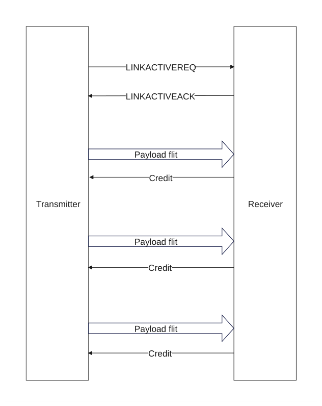

图 B14.6：多通道单向接口示例

关于 LINKACTIVEREQ 与 LINKACTIVEACK 信号之间关系的规则必须适当地应用于所有通道：

- 当某次状态变化要求发送器能够接受 credit 时，发送器必须能够

在所有通道上接受 credit。

- 当某次状态变化要求接收器能够接受 flit 时，接收器必须能够接受

所有通道上的 credit。

- 当某次状态变化之前必须停止发送 flit 时，必须在所有通道上停止发送 flit。
- 当某次状态变化之前必须停止发送 credit 时，必须在所有通道上停止发送 credit。
- 一个 credit 只能与同一通道上的 flit 相关联。

### B14.6 发送与接收链路交互

本节描述链路发送器与接收器之间的交互。它包含以下小节：

- B14.6.1 简介
- B14.6.2 Tx 与 Rx 状态机
- B14.6.3 预期的状态转换

#### B14.6.1 简介

单个组件具有多种不同的通道，其中一些是输入，另一些是输出。

对于单个组件：

- 所有载荷为输出的通道被定义为发送链路（TXLINK）。
- 所有载荷为输入的通道被定义为接收链路（RXLINK）。

要求 TXLINK 与 RXLINK 的激活和去激活相互协调。

当 TXLINK 与 RXLINK 均处于稳定的 STOP 状态时：

- 如果 RXLINK 转入 ACTIVATE 状态（该状态由接口另一侧的组件控制），则要求 TXLINK 也及时转入

ACTIVATE 状态。

- 如果组件使 TXLINK 转入 ACTIVATE 状态（该状态由该组件控制），则预期 RXLINK 也及时转入

ACTIVATE 状态。

当 TXLINK 与 RXLINK 均处于稳定的 RUN 状态时：

- 如果 RXLINK 转入 DEACTIVATE 状态（该状态由接口另一侧的组件控制），则要求 TXLINK 也及时转入

DEACTIVATE 状态。

- 如果组件使 TXLINK 转入 DEACTIVATE 状态（该状态由该组件控制），则预期 RXLINK 也及时转入

DEACTIVATE 状态。

当 TXLINK 与 RXLINK 正在改变状态时，关于 credit 和 flit 的发送与接收的规则可以针对每条链路独立考虑。

#### B14.6.2 Tx 与 Rx 状态机

图 B14.7 给出 Tx 与 Rx 状态机之间允许的关系。图 B14.7 的编排方式使得 Tx 与 Rx 状态机各自的独立性一目了然。

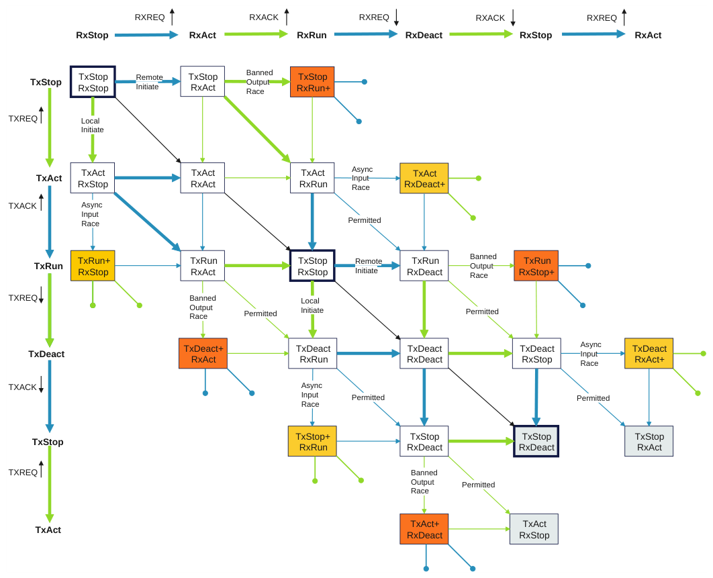

图 B14.7：组合的 Tx 与 Rx 状态机

图 B14.7 给出单个组件的组合 Tx 与 Rx 状态机：

- 为清晰起见，使用了缩短的状态名和信号名。
- 绿色箭头表示本地代理可以控制的转换。
- 蓝色箭头表示由接口另一侧的远端代理控制的转换。
- 黑色箭头表示当本地代理与远端代理同时发生转换时所形成的转换。
- 在 图 B14.7 的边缘标注了各个 Tx 状态和 Rx 状态。绿色和蓝色箭头表示由哪个代理控制该转换。同时还标注了引发该状态转换的信号变化。
- 垂直或水平箭头表示仅由一次信号变化引起的状态变化，也就是说，只有 Rx 状态机或 Tx 状态机改变状态，而非二者同时改变。
- 对角线箭头表示由两个信号同时变化引起的状态变化。如果对角线箭头为绿色或蓝色，则表示同一代理在改变这两个信号。
- 在少数情况下，由于巧合，某次状态变化是由链路两侧各发生一个事件且二者同时发生而引起的。这始终是一条对角路径，并用黑色箭头表示。
- stub 线表示不允许离开某一状态的死端路径。stub 线的颜色表示要求哪个代理确保不会走上该路径。
- 预期 TxStop/RxStop 和 TxRun/RxRun 是稳定状态，通常也是状态机长时间停留的状态。这些状态用粗轮廓突出显示。所有其他状态都被视为会及时退出的瞬态。
- 图 B14.7 右下角的灰色状态是左上角状态的复制。它们用于帮助清晰表达并保持图解的对称性。
- 黄色状态只有在观测到两个输入信号之间的竞争时才能到达。进入这些状态的转换被标记为 Async Input Race。参见 B14.6.3.4 异步竞争条件。
- 红色状态只有在观测到两个输出信号之间的竞争时才能到达。组件边缘处不允许出现两个输出之间的竞争，因此进入这些状态的转换被标记为 Banned Output Race。这些状态只能在两个组件之间的中点处被观测到。参见 B14.6.3.4 异步竞争条件。
- 粗箭头用于指示状态机中预期的状态转换。这些转换在 B14.6.3 预期的状态转换中有更详细的描述。
- 标记为 Permitted 的箭头是通常不会预期、但协议允许的状态转换。

##### B14.6.2.1 状态命名

图 B14.7 展示了完整的状态集合，包括只能通过竞态条件到达的那些状态。关于竞态条件的更详细讨论可参见 B14.6.3.4 异步竞态条件。

TxStop/RxRun 状态有两种不同的形式，TxRun/RxStop 状态也有两种不同的形式。这些状态的区别在于到达它们的方式以及允许退出它们的方式。为了区分这些状态，使用 [+] 后缀来指示 Tx 或 Rx 中哪个状态机处于领先运行状态。例如：

- TxStop/RxRun+ 表示 Tx 状态机仍停留在前一个 STOP 状态，而 Rx

状态机已推进到下一个 RUN 状态。

- TxStop+/RxRun 表示 Tx 状态机已推进到下一个 STOP 状态，而 Rx 状态

机仍停留在前一个 RUN 状态。

#### B14.6.3 预期转换

图 B14.8 展示了预期的状态转换。

图 B14.8 中箭头上的标注如下：

Local Initiate 表示本地代理已发起从一个稳定状态离开并转向另一个稳定状态的过程。

Remote Initiate 表示接口另一侧的远端代理已发起从一个稳定状态离开并转向另一个稳定状态的过程。

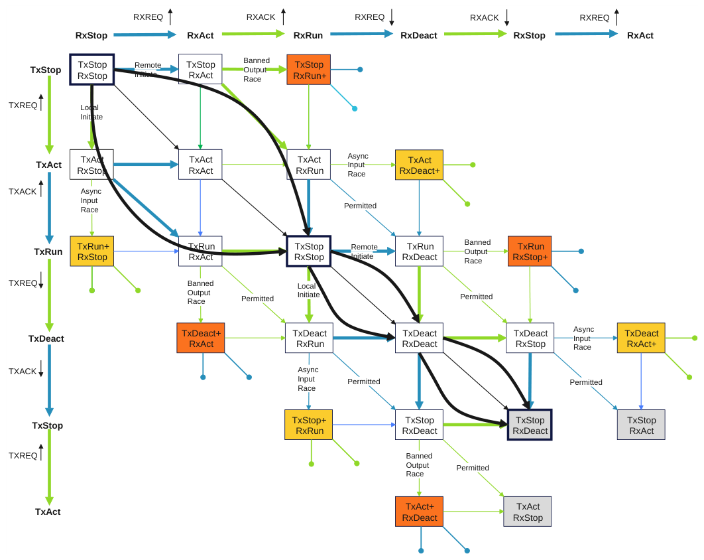

图 B14.8：预期的 Tx 与 Rx 状态机转换

图 B14.8 使用粗箭头示出了稳定的 TxStop/RxStop 与 TxRun/RxRun 状态之间，以及稳定的 TxRun/RxRun 与 TxStop/RxStop 状态之间的路径。

从 TxStop/RxStop 迁移到 TxRun/RxRun 状态的两种路径之所以不同于从 TxRun/RxRun 迁移到 TxStop/RxStop 状态的迁移，是因为后者需要归还 L-Credit。这些差异将在后续各节中详细说明。

##### B14.6.3.1 从 TxStop/RxStop 到 TxRun/RxRun 的预期转换

从稳定的 Stop/Stop 到 Run/Run 状态有两条预期路径。

表 B14.4 以状态转换的形式示出了这两条预期路径。

表 B14.4：Stop/Stop 到 Run/Run 的状态路径

| 路径 | 状态 1 | 状态 2 | 状态 3 | 状态 4 |
| --- | --- | --- | --- | --- |
| 路径 1 | TxStop/RxStop | TxStop/RxAct | TxAct/RxRun | TxRun/RxRun |
| 路径 2 | TxStop/RxStop | TxAct/RxStop | TxRun/RxAct | TxRun/RxRun |

##### B14.6.3.2 从 TxRun/RxRun 到 TxStop/RxStop 的预期转换

从 Run/Run 状态到 Stop/Stop 状态的转换要求归还 L-Credit。链路必须保持在 DEACTIVATE 状态，直到所有 L-Credit 都已归还。

从稳定的 Run/Run 到 Stop/Stop 状态有四条预期路径。

表 B14.5 以状态转换的形式示出了这四条预期路径。

表 B14.5：状态 5

| 路径 | 状态 1 | 状态 2 | 状态 3 | 状态 4 | 状态 5 |
| --- | --- | --- | --- | --- | --- |
| 路径 1 | TxRun/RxRun | TxDeact/RxRun | TxDeact/RxDeact | TxStop/RxDeact | TxStop/RxStop |
| 路径 2 | TxRun/RxRun | TxDeact/RxRun | TxDeact/RxDeact | TxDeact/RxStop | TxStop/RxStop |
| 路径 3 | TxRun/RxRun | TxRun/RxDeact | TxDeact/RxDeact | TxStop/RxDeact | TxStop/RxStop |
| 路径 4 | TxRun/RxRun | TxRun/RxDeact | TxDeact/RxDeact | TxDeact/RxStop | TxStop/RxStop |

##### B14.6.3.3 围绕稳定状态的转换

允许（但不属于预期）围绕稳定的 TxRun/RxRun 或 TxStop/RxStop 状态进行转换。

在大多数情况下，预期会转向稳定的 Run/Run 或 Stop/Stop 状态。

希望快速离开某个稳定状态的最典型场景是：接口已开始进入低功耗状态，但仍需要有一些活动。例如，低功耗状态可能被过早进入，或者恰好在进入低功耗状态期间偶然出现了新的活动。在此场景下，希望能够尽快回到 Run/Run 状态。

##### B14.6.3.4 异步竞争条件

存在这样的情况：两个输出信号 X 与 Y 具有如下定义的关系：

- 输出 X 必须在输出 Y 之后或与之同时变化，但不允许先于输出 Y 变化。

该关系具体适用于以下情形：

- RXACK 的置有效不得早于 TXREQ 的置有效。
- RXACK 的置无效不得早于 TXREQ 的置无效。
- TXREQ 的置有效不得早于 RXACK 的置无效。
- TXREQ 的置无效不得早于 RXACK 的置有效。

在图 B14.7 中，这些跳变被标记为 Banned Output Race，其结果状态以红色显示。

如果在系统的某一点监测输出信号，而该点处的异步竞争条件可能导致在同一周期内有效的两个信号被观测到处于不同时钟周期，则有可能观测到这些状态。

位于接口另一侧、以这两个信号作为输入的组件，在发生异步输入竞争时可以看到该状态跳变。这些跳变在图中被标记为 Async Input Race，其结果状态以黄色显示。

对于所有输入竞争条件，观测到输入竞争的组件必须在改变任何输出信号之前等待这两个信号都到达。图 B14.7 中体现了这一点：从竞争状态出发唯一被允许的输出跳变，是由与该竞争条件相关联的另一个信号的到达引起的。

##### B14.6.3.5 无竞争条件的 Tx 与 Rx 组合状态机

在图 B14.9 中，Tx 与 Rx 组合状态机中因竞争条件而产生的所有跳变和状态均已被去除。

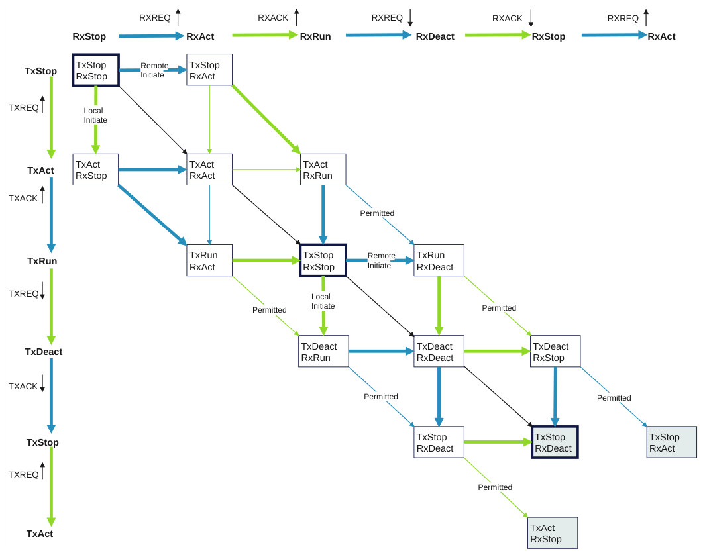

图 B14.9：无竞争条件的 Tx 与 Rx 组合状态机

### B14.7 协议层活动指示

本节描述用于指示协议层活动的信号。它包含以下子节：

- B14.7.1 简介
- B14.7.2 TXSACTIVE 信号
- B14.7.3 RXSACTIVE 信号
- B14.7.4 SACTIVE 与 LINKACTIVE 之间的关系

#### B14.7.1 简介

SACTIVE 信令指示当前存在正在进行的事务。

TXSACTIVE 是一个输出信号，当接口上存在正在进行或即将开始的事务时，由该接口置有效：

- 在发送与某事务相关的首个 flit 之前，或在该 flit 发送的同一周期内，必须置有效 TXSACTIVE。
- TXSACTIVE 必须保持有效，直至与所有事务相关的最后一个 flit 发送或接收完成之后。

这意味着，接口上 TXSACTIVE 的置无效意味着该组件已完成所有正在进行的事务，且无需再发送或接收任何 flit。

收到 RetryAck 响应的事务被视为仍在进行中，TXSACTIVE 必须保持有效，直至相关 credit 被提供并已使用或已归还。

RXSACTIVE 是一个输入信号，用于指示接口另一侧存在持续的协议层活动。当 RXSACTIVE 置有效时，组件必须及时响应协议层活动。

SACTIVE 信号必须与 CLK 同步，因此不需要再进行同步。若它们跨越时钟域，则由跨时钟域桥接负责对这些信号进行同步。

#### B14.7.2 TXSACTIVE 信号

以下规则适用于 TXSACTIVE 信号：

- 当发送端有 flit 需要发送时，必须置有效 TXSACTIVE。
- 置有效 TXSACTIVE 的组件在需要时还必须发起链路激活序列。不允许组件置有效 TXSACTIVE 信号后再等待接口另一侧发起链路激活序列。
- TXSACTIVE 必须保持有效，直至与所有事务相关的最后一个 flit 发送或接收完成之后。
- 在作为链路去激活序列的一部分发送链路 flit 期间，允许（但并非必须）将 TXSACTIVE 置无效。

> **注意**
>
> 为确保高效的掉电序列，建议在链路去激活序列期间不要将已置无效的 TXSACTIVE 信号重新置有效。

允许互连组件上的接口使用 RXSACTIVE 输入信号直接生成 TXSACTIVE 输出信号。此行为仅允许在互连接口上使用，不允许在任何挂接组件上使用。

除 Link 的互连接口外，Link 的其他任何接口都不允许将输入的 RXSACTIVE 环回到输出的 TXSACTIVE 上。

图 B14.10 显示了在事务生存期内对 TXSACTIVE 置有效的要求。

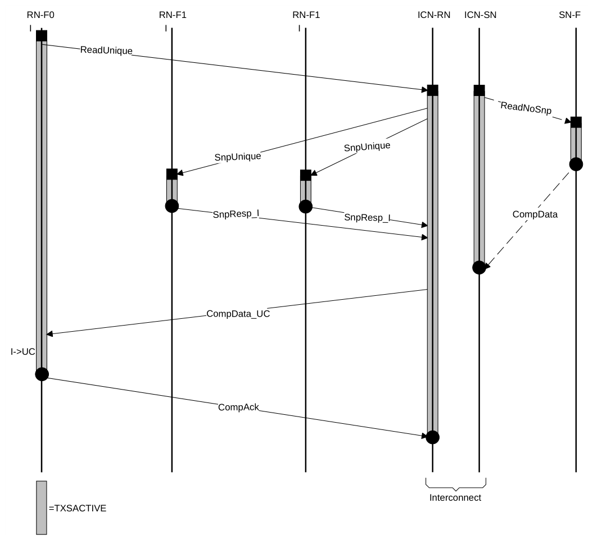

图 B14.10：在事务生存期内 TXSACTIVE 的置有效

##### B14.7.2.1 来自请求节点的 TXSACTIVE 信号

当发起新事务时，请求节点必须在置起 TXREQFLITV 的同一周期或之前置起 TXSACTIVE，并且必须保持 TXSACTIVE 置起，直到该事务的最后一个完成 flit 被发送或接收之后。

完成由请求节点发起的事务的 flit 类型，取决于事务类型以及事务推进的方式。例如，ReadNoSnp 事务通常可以在收到最后一个 CompData flit 时完成，但如果最后一个 CompData flit 之后还有 ReadReceipt，那么它同样可以在收到 ReadReceipt 时完成。

当 Snoop 事务正在进行时，RN-F 或 RN-D 组件也必须置起 TXSACTIVE。TXSACTIVE 必须在收到发起侦听的 flit 或 SnpDVMOp flit 之后置起，且不得晚于其第一个 Response flit 被发送的时刻。RN-F 或 RN-D 组件必须保持 TXSACTIVE 置起，直到所有 Snoop 事务的最后一个

完成 flit 被发送之后。PrefetchTgt 的生命周期为单个 flit。从 TXSACTIVE 的角度看，PrefetchTgt 事务的发起 flit 同时也是其完成 flit，该 flit 被发送后的下一个周期即可认为该事务已完成。

对于 RN-F 或 RN-D，TXSACTIVE 输出是 Request 接口与 Snoop 接口两项要求的逻辑 OR。

##### B14.7.2.2 来自从属节点的 TXSACTIVE 信号

从属节点不能发起新事务，只要求其在正在处理中的事务推进期间置起 TXSACTIVE。

在收到事务发起 flit 时，从属节点发往互连接口的 TXSACTIVE 信号必须在其第一个 Response flit 被发送的同一周期或之前置起。从属节点必须保持发往互连接口的 TXSACTIVE 信号置起，直到最后一个完成 flit 被发送或接收之后。

##### B14.7.2.3 从互连接口到请求节点的 TXSACTIVE 信号

互连面向请求节点的接口必须在下述两种情况下都置起 TXSACTIVE：

- 在收到事务发起 flit 时，互连接口发往

请求节点的 TXSACTIVE 信号必须在其第一个 Response flit 被发送的同一周期或之前置起。互连接口必须保持发往请求节点的 TXSACTIVE 信号置起，直到最后一个完成 flit 被发送或接收之后。

- 在其发起侦听的 flit 或 SnpDVMOp flit 被发送的同一周期或之前。互连

接口必须保持发往请求节点的 TXSACTIVE 信号置起，直到最后一个完成 flit 被接收之后，该 flit 为 SnpResp、SnpRespData 或 SnpRespDataFwded 三者之一。

B14.7.2.4

##### B14.7.2.4 从互连接口到从属节点的 TXSACTIVE 信号

互连面向从属节点的接口必须在其发起 Request flit 被发送的同一周期或之前置起 TXSACTIVE。互连面向从属节点的接口必须保持 TXSACTIVE 置起，直到最后一个完成 flit 被发送或接收之后。

#### B14.7.3 RXSACTIVE 信号

当 RXSACTIVE 置起时，接收方必须及时响应链路激活请求。当 RXSACTIVE 去置起时，允许 Receiver 延迟响应 Link 激活请求。

> **注意**
>
> RXSACTIVE 的去置起并不表示所有协议层活动都已完成。在 RXSACTIVE 去置起之后，Receiver 仍可能收到某个 Protocol flit，它对应的事务在 RXSACTIVE 置起期间处于进行中状态。

RXSACTIVE 可以与对进行中事务的了解（由组件的 TXSACTIVE 输出指示）结合使用，以指示不再需要进一步的事务。这可用于控制进入低功耗状态。

#### B14.7.4 SACTIVE 与 LINKACTIVE 的关系

SACTIVE 信令是协议层活动的指示。当 TXSACTIVE 和 RXSACTIVE 均被取消置位时，可认为节点处于非活动状态。

LINKACTIVE 状态是链路层活动的指示。当节点或互连的发送器处于 TxStop 状态且其接收器处于 RxStop 状态时，可认为该节点或互连的链路层处于非活动状态。

SACTIVE 信令与 LINKACTIVE 状态是正交的，但存在一个约束，如 B14.7.3 RXSACTIVE signal 中所述。

节点或互连仅当其协议层和链路层均处于非活动状态时，才应启用更高层级的时钟门控和低功耗优化。

第 B15 章

## B15 系统一致性接口

本章描述用于支持 RN-F 与 Coherency 域及 DVM 域的连接与断开，以及 RN-D 与 DVM 域的连接与断开的接口信号。本章包含以下小节：

- B15.1 概述
- B15.2 握手

> **注意**
>
> 本章中：

- 除非另有明确说明，所述 Coherency 均包含 DVM 域。
- 除非另有明确说明，所述 Snoop 均包含 SnpDVMOp。

### B15.1 概述

系统一致性接口信号包括：

SYSCOREQ 请求方一致性请求。

SYSCOACK 互连一致性确认。

SYSCOREQ 和 SYSCOACK 信号都必须与 CLK 同步，因此不要求对它们进行同步。若它们跨越时钟域，则需要由跨时钟域桥接器对这些信号进行同步。

图 B15.1 展示了系统一致性接口信号的连接。

RN-F 或 RN-D

SYSCOREQ SYSCOACK

互连

图 B15.1：系统一致性接口信号

### B15.2 握手

请求节点（RN-F 或 RN-D）通过将 SYSCOREQ 置为高电平来请求连接到系统一致性。互连通过将 SYSCOACK 置为高电平来指示一致性已启用。

请求节点通过将 SYSCOREQ 置为低电平来请求断开与系统一致性的连接。互连通过将 SYSCOACK 置为低电平来指示一致性已禁用。

进入和退出一致性的请求始终由请求节点发起。

图 B15.2 展示了系统一致性接口的握手时序。

0 1 2 3 4 5 6 SYSCOREQ a c

SYSCOACK b d

一致性已禁用 一致性连接 一致性已启用 一致性断开 一致性已禁用

图 B15.2：系统一致性接口握手时序

如图 B15.2 所示，接口信令遵循四相握手规则：

- 仅当 SYSCOACK 处于相同逻辑状态时，SYSCOREQ 才能改变。
- 仅当 SYSCOREQ 处于相反逻辑状态时，SYSCOACK 才能改变。

#### B15.2.1 请求节点规则

参考图 B15.2，请求节点必须：

- 在 T1 将 SYSCOREQ 置为高电平时，能够处理侦听请求。
- 在 T3 采样到 SYSCOACK 为高电平之前，不得发出允许将一致性位置缓存的事务。
- 确保在 T4 将 SYSCOREQ 置为低电平之前，所有允许将一致性位置缓存的事务均已完成。
- 仅可在以下所有条件均满足后的那个周期取消置位 SYSCOREQ：
* 以下事务的所有数据包均已收到： · ReadUnique

· ReadPreferUnique

· ReadClean

· ReadNotSharedDirty

· ReadShared

· MakeReadUnique，且该事务以数据传输完成

* 以下事务已收到 Comp： · CleanUnique

· MakeUnique

· MakeReadUnique，且该事务不进行数据传输即完成

* 对于以数据传输完成的 CopyBack 事务，所有数据包均已发送。 * 对于不进行数据传输即完成的 CopyBack 事务，已发送 CompAck。
* 对于侦听和转发侦听，所有数据包均已发送。

> **注意**
>
> 请求方发送数据包与取消置位 SYSCOREQ 之间可能存在竞争。因此，可能在以下情况之前就观察到 SYSCOREQ 变为低电平：

- 对于以数据传输完成的 CopyBack 事务，所有数据包均已发送。
- 对于不进行数据传输即完成的 CopyBack 事务，CompAck 已发送。
- 对于侦听和转发侦听，所有数据包均已发送。
- 继续处理侦听请求，直到在 T6 采样到 SYSCOACK 为低电平。

在一致性状态转换期间必须置位 SACTIVE，以保证 SYSCOACK 的转换发生。参见 B14.7 Protocol layer activity indication。

#### B15.2.2 互连规则

参见图 B15.2：

当采样到 SYSCOREQ 为高电平时，互连必须执行以下操作：

- 将 SYSCOACK 置为高电平，而无需等待 SYSCOREQ 变为高电平之后发出的任何先前 Snoop 请求的响应。
- 当 SYSCOACK 在 T2 被置为高电平时，能够服务来自该接口的一致性数据访问。

当采样到 SYSCOREQ 为低电平时，互连必须执行以下操作：

- 及时停止发出新的 Snoop 请求。
- 在 T5 将 SYSCOACK 置为低电平之前，完成对该接口的所有侦听访问。

#### B15.2.3 协议状态

表 B15.1 给出了接口状态以及请求方必须遵循的、与接口状态相关的规则。

表 B15.1：系统一致性接口状态

状态名称 SYSCOREQ SYSCOACK Request Node Interconnect

Coherency Disabled 0 0 缓存中不得包含一致性数据。不得发出允许 Request Node 缓存一致性位置的事务。不得发送 DVM 事务。不要求响应 Snoop 请求。 不得发送 Snoop 请求。

下页续

表 B15.1 – 续上页

状态名称 SYSCOREQ SYSCOACK Request Node Interconnect

Coherency Connect 1 0 缓存中不得包含一致性数据。不得发出允许 Request Node 缓存一致性位置的事务。不得发送 DVM 事务。必须响应 Snoop 请求。 可以发送 Snoop 请求。

Coherency Enabled 1 1 缓存中可以包含一致性数据。可以发出允许 Request Node 缓存一致性位置的事务。可以发送 DVM 事务。必须响应 Snoop 请求。 可以发送 Snoop 请求。

Coherency Disconnect 0 1 缓存中不得包含一致性数据。不得发出允许 Request Node 缓存一致性位置的事务。不得发送 DVM 事务。必须响应 Snoop 请求。 必须及时停止发出新的 Snoop 请求。随后互连必须在 SYSCOACK 可以被置为无效之前完成所有未完成的 Snoop 请求。

SYSCOREQ 与 SYSCOACK 信令和 LINKACTIVEREQ 与 LINKACTIVEACK 信令之间是正交关系。也就是说，在任一系统一致性接口状态下，互连都可以发出 Snoop L-Credit 返回 flit。

Chapter B16

## B16 属性、参数与广播信号

本章描述用于规定接口所支持行为的属性、参数以及可选的广播信号。本章包含以下各节：

- B16.1 接口属性与参数
- B16.2 可选的接口广播信号
- B16.3 原子事务支持

### B16.1 接口属性与参数

属性用于声明一项能力。

规定接口行为的属性与参数在以下各节中描述：

- B16.1.1 Atomic_Transactions
- B16.1.2 Cache_Stash_Transactions
- B16.1.3 Direct_Memory_Transfer
- B16.1.4 Data_Poison
- B16.1.5 Direct_Cache_Transfer
- B16.1.6 Data_Check
- B16.1.7 Check_Type
- B16.1.8 CleanSharedPersistSep_Request
- B16.1.9 MPAM_Support
- B16.1.10 CCF_Wrap_Order
- B16.1.11 Req_Addr_Width
- B16.1.12 NodeID_Width
- B16.1.13 Data_Width
- B16.1.14 Enhanced_Features
- B16.1.15 Deferrable_Write
- B16.1.16 RME_Support
- B16.1.17 Nonshareable_Cache_Maint
- B16.1.18 Outer_Cacheable_Support
- B16.1.19 PBHA_Support
- B16.1.20 Cache_State_UDP
- B16.1.21 Cache_State_SD
- B16.1.22 DVM_Support
- B16.1.23 MTE_Support
- B16.1.24 Limited_Data_Elision
- B16.1.25 MEC_Support
- B16.1.26 MECID_Width
- B16.1.27 DevAssign_Support
- B16.1.28 Req_RSVDC_Width
- B16.1.29 Dat_RSVDC_Width
- B16.1.30 GDI_Support
- B16.1.31 GDI_Non_PE_RNF
- B16.1.32 MECID_Mismatch_Resolution_Realm
- B16.1.33 CleanInvalidStorage_Request
- B16.1.34 Num_RP_REQ
- B16.1.35 Shared_Credits_REQ
- B16.1.36 Num_RP_SNP
- B16.1.37 Shared_Credits_SNP
- B16.1.38 Retry_Support

#### B16.1.1 Atomic_Transactions

Atomic_Transactions 属性用于指示某组件是否支持 Atomic 事务。

表 B16.1 列出了 Atomic_Transactions 属性的选项。

表 B16.1：Atomic_Transactions 属性选项

| Atomic_Transactions 取值 | 描述 |
| --- | --- |
| True | 支持 Atomic 事务。 |
| False or Not specified | 不支持 Atomic 事务。 |

支持 Atomic 事务的组件必须支持所有 Atomic 事务。但是，并不要求支持 Atomic 事务的组件支持对所有内存类型的定位。参见 B16.3 Atomic transaction support。

#### B16.1.2 Cache_Stash_Transactions

Cache_Stash_Transactions 属性用于指示某组件是否支持 Cache Stashing 事务。

表 B16.2 列出了 Cache_Stash_Transactions 属性的选项。

表 B16.2：Cache_Stash_Transaction 属性选项

| Cache_Stash_Transactions 取值 | 描述 |
| --- | --- |
| True | 支持 Cache Stashing 事务。 |
| False or Not specified | 不支持 Cache Stashing 事务。 |

#### B16.1.3 Direct_Memory_Transfer

Direct_Memory_Transfer 属性用于指示某组件是否支持 Direct Memory Transfer 事务。

表 B16.3 列出了 Direct_Memory_Transfer 属性的选项。

表 B16.3：Direct_Memory_Transfer 属性选项

| Direct_Memory_Transfer 取值 | 描述 |
| --- | --- |
| True | 支持 Direct Memory Transfer 事务。 |
| False or Not specified | 不支持 Direct Memory Transfer 事务。 |

Direct_Memory_Transfer 属性在每个 Home Node 上针对每个 Subordinate Node 定义。

#### B16.1.4 Data_Poison

Data_Poison 属性用于指示某组件是否支持 Poison。

表 B16.4 列出了 Data_Poison 属性的选项。

表 B16.4：Data_Poison 属性选项

| Data_Poison 取值 | 描述 |
| --- | --- |
| True | 支持 Poison，且 DAT 数据包中存在 Poison 字段 |
| False or Not specified | 不支持 Poison，且 DAT 数据包中不存在 Poison 字段 |

参见 B9.2.1 Poison。

#### B16.1.5 Direct_Cache_Transfer

Direct_Cache_Transfer 属性用于指示某组件是否支持 Direct Cache Transfer 事务。

表 B16.5 列出了 Direct_Cache_Transfer 属性的选项。

表 B16.5：Direct_Cache_Transfer 属性选项

| Direct_Cache_Transfer 取值 | 描述 |
| --- | --- |
| True | 支持 Direct Cache Transfer 事务 |
| False or Not specified | 不支持 Direct Cache Transfer 事务 |

HN-F 需要确定要使用的正确侦听类型。

#### B16.1.6 Data_Check

Data_Check 属性用于指示 DAT 数据包中是否存在 DataCheck 字段。

表 B16.6 列出了 Data_Check 属性的选项。

表 B16.6：Data_Check 属性选项

Data_Check 取值 描述

Odd_Parity 支持 Data Check，且 DAT 数据包中存在 DataCheck 字段。

如果定义了 Check_Type 并将其设置为 Odd_Parity_Byte_All，则 DAT 数据包中不存在 DataCheck 字段。

False or Not specified 除非 Check_Type 属性另有指定，否则 DAT 数据包中不存在 DataCheck 字段

参见 B9.2.2 Data Check。

#### B16.1.7 Check_Type

Check_Type 属性用于指示接口上采用的保护方案。

表 B16.7 列出了 Check_Type 属性的选项。

表 B16.7：Check_Type 属性选项

| Check_Type 取值 | 描述 |
| --- | --- |
| Odd_Parity_Byte_All | 为每个通道添加奇偶校验信号。所添加信号的详细说明见 B9.3 Use of interface parity。 |
| Odd_Parity_Byte_Data | DAT 数据包中存在 DataCheck 字段 |
| False or Not specified | 除非 Data_Check 属性另有指定，否则接口上不存在校验信号 |

#### B16.1.8 CleanSharedPersistSep_Request

CleanSharedPersistSep_Request 属性用于指示某组件是否支持 CleanSharedPersistSep。

表 B16.7 列出了 CleanSharedPersistSep_Request 属性的选项。

表 B16.8：CleanSharedPersistSep_Request 属性选项

| CleanSharedPersistSep_Request 取值 | 描述 |
| --- | --- |
| True | 该组件支持 CleanSharedPersistSep |
| False or Not specified | 该组件不支持 CleanSharedPersistSep，且不得向该组件发送 CleanSharedPersistSep 请求。 |

CleanSharedPersistSep_Request 属性具有以下条件：

- 收到 CleanSharedPersistSep 请求的归属节点必须支持此类请求。
- 归属节点可以跟踪所连接的从属节点是否支持 CleanSharedPersistSep。
- 如果从属节点不支持 CleanSharedPersistSep：
- 归属节点必须向该从属节点发送 CleanSharedPersist，而非 CleanSharedPersistSep 请求。
- 归属节点必须负责向请求方发送 Persist 响应。该 Persist 响应只能在收到来自从属节点的 Comp 响应之后发送。
- 不支持 CleanSharedPersistSep 的请求方改为生成 CleanSharedPersist。

#### B16.1.9 MPAM_Support

MPAM_Support 属性用于指示某接口是否支持 MPAM。

表 B16.9 列出了 MPAM_Support 属性的选项。

表 B16.9：MPAM_Support 属性选项

MPAM_Support 取值 描述

MPAM_12_1 该接口已启用分区与监控：

- 必须在 REQ 和 SNP 通道上包含 MPAM 字段。
- PartID 的位宽为 12 位，PerfMonGroup 的位宽为 1 位，MPAMSP 的位宽为 2 位。

MPAM_9_1 该接口已启用分区与监控：

- 必须在 REQ 和 SNP 通道上包含 MPAM 字段。
- PartID 的位宽为 9 位，PerfMonGroup 的位宽为 1 位，MPAMSP 的位宽为 2 位。

False or Not specified 不支持 MPAM：

- 该接口未启用 MPAM。
- 该接口上不存在 MPAM 字段。

接收方如何使用 MPAM 字段取值由实现定义。

#### B16.1.10 CCF_Wrap_Order

参见 B2.9.8 关键数据块优先回绕顺序。

#### B16.1.11 Req_Addr_Width

Req_Addr_Width 参数用于指示某组件支持的最大 PA。

表 B16.10 列出了 Req_Addr_Width 参数的选项。

表 B16.10：Req_Addr_Width 参数选项

| Req_Addr_Width 取值 | 描述 |
| --- | --- |
| 44 to 52 | 合法取值 |
| Not specified | 默认值为 44 |

#### B16.1.12 NodeID_Width

NodeID_Width 参数用于指示某组件支持的 NodeID 字段的位宽，它决定了系统中 NodeID 的最大取值。

表 B16.11 列出了 NodeID_Width 参数的选项。表 B16.11 中规定的位宽统一应用于所有与 NodeID 相关的字段。

表 B16.11：NodeID_Width 参数选项

| NodeID_Width 取值 | 描述 |
| --- | --- |
| 7 to 16 | 合法取值 |
| Not specified | 默认值为 7 |

#### B16.1.13 Data_Width

Data_Width 参数用于指示某组件支持的 DAT 通道数据包中的数据位宽。

表 B16.12 列出了 Data_Width 参数的选项。

表 B16.12：Data_Width 参数选项

| Data_Width 取值 | 描述 |
| --- | --- |
| 128, 256, and 512 | 合法取值 |
| Not specified | 默认值为 128 |

#### B16.1.14 Enhanced_Features

Enhanced_Features 属性描述对以下特性的综合支持：

- 从 SC 状态返回数据
- IO 解除分配事务
- ReadNotSharedDirty 事务
- CleanSharedPersist 事务
- 接收转发侦听。

表 B16.13 列出了 Enhanced_Features 属性的选项。

表 B16.13：Enhanced_Features 属性选项

| Enhanced_Features 取值 | 描述 |
| --- | --- |
| True | 该组件支持 Enhanced_Features 属性所涵盖的特性。 |
| False or Not specified | 该组件不支持 Enhanced_Features 属性所涵盖的特性。 |

#### B16.1.15 Deferrable_Write

Deferrable_Write 属性用于指示组件是否支持 WriteNoSnpDef 事务。

表 B16.14 展示了 Deferrable_Write 属性的选项。

表 B16.14：Deferrable_Write 属性选项

| Deferrable_Write 取值 | 描述 |
| --- | --- |
| True | 支持 WriteNoSnpDef |
| False 或未指定 | 不支持 WriteNoSnpDef |

#### B16.1.16 RME_Support

RME_Support 属性决定接口是否支持 RME 事务。

表 B16.15 展示了 RME_Support 属性的选项。

表 B16.15：RME_Support 属性选项

RME_Support 取值 描述

True 接口支持以下 RME 专有事务：

- CleanInvalidPoPA
- WriteBackFullCleanInvPoPA
- WriteNoSnpFullCleanInvPoPA
- WriteNoSnpPtlCleanInvPoPA

False 或未指定 接口不支持以下 RME 专有事务：

- CleanInvalidPoPA
- WriteBackFullCleanInvPoPA
- WriteNoSnpFullCleanInvPoPA
- WriteNoSnpPtlCleanInvPoPA

仅当 Nonshareable_Cache_Maint 为 True 且 DVM_Support 为 DVM_v9.2 时，RME_Support 才能为 True。

#### B16.1.17 Nonshareable_Cache_Maint

Nonshareable_Cache_Maint 属性用于指示 RN-F 或互连是否支持由不同于最初访问该位置的请求方的某个请求方，对不可侦听的可缓存位置进行缓存维护。

表 B16.16 展示了 Nonshareable_Cache_Maint 属性的选项。

表 B16.16：Nonshareable_Cache_Maint 属性选项

| Nonshareable_Cache_Maint 取值 | 描述 |
| --- | --- |
| False 或未指定 | 对 RN-F 没有额外要求。HN-I 在收到 SnpAttr 和 Cacheable 均为 1 的请求时以 NDERR 响应的行为，为实现定义（IMPLEMENTATION DEFINED）。 |

下页续

表 B16.16 —— 续上页

Nonshareable_Cache_Maint 取值 描述

True MemAttr.Cacheable 为 1 的 RN-F 还必须将 SnpAttr 设置为 1。这可能需要修改事务类型，例如，MemAttr.Cacheable 为 1 的 ReadNoSnp 被升级为 Allocating Read。当 BROADCASTINNER 和 BROADCASTOUTER 信号均取消置位时，此规则不适用。在这种情况下，所有事务都被强制为不可侦听，且诸如 MemAttr.Cacheable = 1 且 SnpAttr = 0 的 ReadNoSnp 之类的事务是被明确允许的。更多信息，参见 B2.8.7 Mismatched Memory attributes 和 B16.2.1 BROADCASTINNER and BROADCASTOUTER。

HN-I 在收到 SnpAttr 和 Cacheable 均为 1 的请求时，必须在完成该事务时以 NDERR 响应，但事务为 ReadOnce*、WriteUnique、WriteUnique*CMO、WriteUniqueZero 或 Atomic 的情况除外。

HN-I 在收到 SnpAttr 和 Cacheable 均为 1 的 ReadOnce*、WriteUnique、WriteUnique*CMO、WriteUniqueZero 或 Atomic 请求时以 NDERR 响应的行为，为实现定义（IMPLEMENTATION DEFINED）。

当 RME_Support 属性为 True 时，Nonshareable_Cache_Maint 属性必须为 True。

当所有 RN-F 节点和互连均将 Nonshareable_Cache_Maint 属性定义为 True 时，系统即完全支持不可侦听可缓存内存的缓存维护。

Nonshareable_Cache_Maint 属性不适用于 RN-I、RN-D 和 HN-F 节点。

Nonshareable_Cache_Maint 属性与 Outer_Cacheable_Support 属性存在重叠，从而可以对设备一致性和 SLC 分配进行正交控制。当 Outer_Cacheable_Support 为 True 时，Nonshareable_Cache_Maint 属性不适用，可以取任意值。更多信息，参见表 B16.17。

表 B16.17：Outer_Cacheable_Support 与 Nonshareable_Cache_Maint 之间的关系

#### B16.1.18 Outer_Cacheable_Support

Nonshareable_Cache_Maint 取值

False True

False 对于 RN-F：MemAttr.Cacheable 设置为 1 的 ReadNoSnp 或 WriteNoSnp 事务是允许的。以下限制适用：

- ReadNoSnp 或 WriteNoSnp 事务

以下限制适用于 MemAttr.Cacheable 设置为 1 的 ReadNoSnp 或 WriteNoSnp 事务：MemAttr.Cacheable 设置为 1 的 ReadNoSnp 或 WriteNoSnp 事务必须升级为 Snoopable 替代事务：

- 在请求方缓存中的分配是
- 在请求方缓存中的分配

允许的。是允许的。

- 硬件一致性得到保证。
- 硬件一致性不
- 允许在 Snoop filter 中记录日志，

得到保证。如果存在。

- 不要求在 Snoop filter 中记录日志
- 远端失效是可能的。

必需。

- Cache Maintenance Operations 和 Atomic*
- 任何内部

MemAttr.Cacheable 设置为 1 且 SnpAttr 设置为 1 的事务是允许的。缓存维护由请求方负责。

- Cache Maintenance Operations，其中
- 远端失效可能不

可能。MemAttr.Cacheable 设置为 1 且 SnpAttr 设置为 0 的事务是不允许的。对于 RN-I：MemAttr.Cacheable 设置为 1 且 SnpAttr 设置为 0 或 1 的 Cache Maintenance Operations 和 Atomic* 事务是允许的。MemAttr.Cacheable 设置为 1 的 ReadNoSnp、WriteNoSnp 或 Atomic* 事务是允许的。MemAttr.Cacheable 设置为 1 且 SnpAttr 设置为 0 或 1 的 Cache Maintenance Operations 是允许的。

True MemAttr.Cacheable 设置为 1 的 ReadNoSnp 或 WriteNoSnp 事务是允许的。以下限制适用：

- 不允许分配到 RN-F 缓存中。
- 不要求在 Snoop filter 中记录日志。
- 一致性将适用于可访问 SLC 的代理。

MemAttr.Cacheable 设置为 1 且 SnpAttr 设置为 0 或 1 的 Cache Maintenance Operations 和 Atomic* 事务是允许的。

B16.1.18 Outer_Cacheable_Support

Outer_Cacheable_Support 属性决定请求节点在 MemAttr.Cacheable 设置为 1 且 SnpAttr 设置为 0 的事务方面的行为。

Outer_Cacheable_Support 属性与 Nonshareable_Cache_Maint 属性存在重叠，从而可以对设备一致性和 SLC 分配进行正交控制。更多信息请参见表 B16.17。

表 B16.18 列出了 Outer_Cacheable_Support 属性的各个选项。

表 B16.18：Outer_Cacheable_Support 属性选项

| Outer_Cacheable_Support 取值 | 描述 |
| --- | --- |
| False or Not specified | 取决于 Nonshareable_Cache_Maint 属性的取值，MemAttr.Cacheable 设置为 1 且 SnpAttr 设置为 0 的事务可以被允许。 |

True MemAttr.Cacheable 设置为 1 的 ReadNoSnp 和 WriteNoSnp 事务是允许的。如果 ReadNoSnp 由 RN-F 发出，则该 RN-F 不得因该事务而在本地分配该位置。MemAttr.Cacheable 设置为 1 且 SnpAttr 设置为 0 的 Cache Maintenance Operations 和 Atomic* 事务是允许的。

#### B16.1.19 PBHA_Support

PBHA_Support 属性决定接口是否支持 PBHA 功能。

表 B16.19 列出了 PBHA_Support 属性的各个选项。

表 B16.19：PBHA_Support 属性选项

| PBHA_Support 取值 | 描述 |
| --- | --- |
| True | 支持 PBHA 特性。REQ、DAT 和 SNP 通道上存在 4 位的 PBHA 字段。 |
| False or Not specified | 不支持 PBHA 特性。接口上不存在任何 PBHA 信号。 |

#### B16.1.20 Cache_State_UDP

Cache_State_UDP 属性指示 RN-F 或归属节点是否支持独占脏部分（Unique Dirty Partial，UDP）状态。

表 B16.20 列出了 Cache_State_UDP 属性的各个选项。

表 B16.20：Cache_State_UDP 属性选项

Cache_State_UDP 取值 描述

True 该组件支持 UDP 缓存状态。

False or Not specified 该组件不支持 UDP 缓存状态。

> **注意**
>
> 在多个组件的 Cache_State_UDP 均为 False 的系统中，可以确立实现优化。

#### B16.1.21 Cache_State_SD

Cache_State_SD 属性表示 RN-F 或 Home Node 是否支持 Shared Dirty（SD）状态。

表 B16.21 列出了 Cache_State_SD 属性的选项。

表 B16.21：Cache_State_SD 属性选项

| Cache_State_SD value | Description |
| --- | --- |
| True | 该组件支持 SD 缓存状态。 |
| False or Not specified | 该组件不支持 SD 缓存状态。 |

#### B16.1.22 DVM_Support

DVM_Support 属性用于指示给定组件所支持的 Arm ARM 规范。

表 B16.22 列出了 DVM_Support 属性的选项。

表 B16.22：DVM_Support 属性选项

| DVM_Support value | Description |
| --- | --- |
| DVM_v8 | 该组件支持 Armv8 所需的 DVM 事务 |
| DVM_v8.1 | 该组件支持 Armv8.1 所需的 DVM 事务 |
| DVM_v8.4 | 该组件支持 Armv8.4 所需的 DVM 事务 |
| DVM_v9.2 | 该组件支持 Armv9.2 所需的 DVM 事务 |
| False or Not specified | 该组件不支持 DVM 事务 |

在包含异构组件的系统中，需要通过系统配置来确定系统中支持的最低公共 DVM 规范。互连必须通过配置、straps、参数化或其他 IMPLEMENTATION SPECIFIC 方式获知该最低公共标准值。

为避免死锁和拒绝服务，互连必须检测不支持的 DVM 操作。互连必须抑制不支持的 DVM 操作的传播，并以符合协议的方式作出响应。此类响应中的错误指示是可选的。

更多信息，参见 Chapter B8 DVM Operations。

#### B16.1.23 MTE_Support

MTE_Support 属性决定在 Home 到 Subordinate 接口上，每个组件支持多少 MTE 功能空间。

MTE_Support 针对 Home 和 Subordinate 两者定义，但仅影响 Home 到 Subordinate 的连接。

表 B16.23：MTE_Support 属性选项

| MTE_Support value | Description | TagOp |
| --- | --- | --- |
| Full or Not Specified | 该接口支持完整的 MTE 特性。 | 在遵守其他已规定的任何事务限制的前提下，可以设置为 Invalid、Transfer、Update、Match 和 Fetch。 |

在遵守其他已规定的任何事务限制的前提下，Reduced 该接口支持完整 MTE 特性的一个子集。可以设置为 Invalid、Transfer 和 Fetch。

WriteNoSnpPtl* 上不允许 Update。

Note 如果 Home 收到一个并非所有 BE 和 TU 位均为 1 的 WriteNoSnpPtl*，并希望将该事务发送给 Subordinate，则 Home 需要执行一次 Read Modify Write 序列，并向 Subordinate 发送一个带 Update 的 WriteNoSnpFull*。

必须不是 Match。

Note 如果 Home 收到一个 TagOp 为 Match 的请求，它不能将该事务发送到 Subordinate 上。Home 必须代 Subordinate 执行 TagMatch 操作。

下页续

表 B16.23 – 续上页

| MTE_Support value | Description | TagOp |
| --- | --- | --- |
| False | 该接口不支持任何 MTE 操作。 | 必须是 Invalid。 |

##### B16.1.23.1 请求与允许的 tag 操作

表 B16.24 汇总了在不同请求中允许的 TagOp 字段取值，具体取决于 MTE_Support 属性值。此处仅示出 Home 能够向 Subordinate 发出的操作。所使用的键如下：

Y 允许

- 不允许

表 B16.24：基于 MTE_Support 属性值，每种请求类型允许的 TagOp 取值

MTE_Support = Full MTE_Support = Reduced MTE_Support = False

Tag 操作 Tag 操作 Tag 操作 Transfer Transfer Transfer Update Update Update Invalid Invalid Invalid Match Match Match Fetch Fetch Fetch

Atomic* Y - - Y - Y - - - - Y - - - -

CleanInvalid Y - - - - Y - - - - Y - - - -

CleanInvalidPoPA Y - - - - Y - - - - Y - - - -

CleanInvalidStorage Y - - - - Y - - - - Y - - - -

CleanShared Y - - - - Y - - - - Y - - - -

CleanSharedPersist Y - - - - Y - - - - Y - - - -

CleanSharedPersistSep Y - - - - Y - - - - Y - - - -

MakeInvalid Y - - - - Y - - - - Y - - - -

PCrdReturn Y - - - - Y - - - - Y - - - -

ReadNoSnp Y Y - - Y Y Y - - Y Y - - - -

ReadNoSnpSep Y Y - - Y Y Y - - Y Y - - - -

WriteNoSnpDef Y - - - - Y - - - - Y - - - -

WriteNoSnpFull Y Y Y Y - Y Y Y - - Y - - - -

WriteNoSnpFull + (P)CMO Y Y Y - - Y Y Y - - Y - - - -

WriteNoSnpPtl Y - Y Y - Y - - - - Y - - - -

WriteNoSnpPtl + (P)CMO Y - Y - - Y - - - - Y - - - -

WriteNoSnpZero Y - - - - Y - - - - Y - - - -

ReqLCrdReturn、DatLCrdReturn 和 RspLCrdReturn 中的 TagOp 字段不适用，可以取任何值。

DatLCrdReturn 中的 Tag 和 TU 字段不适用，可以取任何值。

##### B16.1.23.2 互操作性

表 B16.25 显示了 MTE_Support 的互操作规则。

表 B16.25：MTE_Support 互操作性

从属节点：Full 从属节点：Reduced 从属节点：False

归属节点：Full 兼容。不兼容。不兼容。

如果归属节点发出带 TagOp Match 的请求或带 TagOp Update 的 WriteNoSnpPtl*，系统可能发生死锁。 如果归属节点发出带 TagOp Match 的请求或带 TagOp Update 的 WriteNoSnpPtl*，系统可能发生死锁。

|  |  | 可能发生死锁。 | 可能发生死锁。 |
| --- | --- | --- | --- |
| 归属节点：Reduced | 兼容。 | 兼容。 | 兼容。返回的 TagOp 将始终为 Invalid，但系统不应发生死锁。 |
| 归属节点：False | 兼容。 | 兼容。 | 兼容。 |

#### B16.1.24 Limited_Data_Elision

Limited_Data_Elision 属性决定是否支持 Limited Data Elision 特性。

表 B16.26：Limited_Data_Elision 属性选项

| Limited_Data_Elision 取值 | 描述 |
| --- | --- |
| False 或未指定 | 不支持 Limited Data Elision。NumDat 和 Replicate 存在，但两者必须为零。 |

True 支持 Limited Data Elision。

NumDat 和 Replicate 在适当时可以取非零值。

必须存在 BROADCASTLIMELISION 信号，或者要求存在一种替代机制，以控制包含省略数据包的数据消息的发送。

#### B16.1.25 MEC_Support

MEC_Support 属性决定接口是否支持内存加密上下文（Memory Encryption Contexts）。

表 B16.27：MEC_Support 属性选项

| MEC_Support 取值 | 描述 |
| --- | --- |
| False 或未指定 | 该接口不支持 MEC 架构。 |
| True | 该接口支持 MEC 架构，并且必须在 REQ、SNP 和 DAT 通道上包含 MECID 字段。该字段的宽度由 MECID_Width 参数决定。MECID_Width 参数不得为零。 |

更多信息，参见 B10.6 Memory Encryption Contexts, MEC。

MEC_Support 属性具有以下约束条件：

- 如果 RME_Support 属性为 True，则 MEC_Support 属性可以为 True 或 False。
- 如果 RME_Support 属性为 False，则 MEC_Support 属性必须为 False。

#### B16.1.26 MECID_Width

MECID_Width 参数定义 MECID 字段的宽度。

表 B16.28：MECID_Width 属性选项

| MECID_Width 取值 | 描述 |
| --- | --- |
| 0 | 接口上不存在 MECID 字段。 |
| 16 | 每个 MECID 字段的宽度为 16 位。 |

MECID_Width 参数具有以下约束条件：

- 如果 MEC_Support 为 True，MECID_Width 不得为零。
- 如果 MEC_Support 为 False，MECID_Width 可以取任何允许的值。

#### B16.1.27 DevAssign_Support

DevAssign_Support 属性决定接口是否支持 RME-DA 或 RME-CDA。如果未指定该属性，则视为 False。更多信息，参见 B10.7 Device Assignment (DA) and Coherent Device Assignment (CDA)。

表 B16.29：DevAssign_Support 属性选项

DevAssign_Support 取值 描述

False、未指定或 Host 该接口不支持 RME-DA 或 RME-CDA。接口上不存在 StreamID 或 SecSID1 字段。允许请求和 Snoop 指向任何 PAS 中的位置。当 MEC_Support 为 True 时，对于 Device-to-Host 请求，REQ 通道上带 StreamID 和 MECID 的公共字段被视为 MECID。跨该接口的事务不需要额外检查。

下页续

表 B16.29 – 续上页

DevAssign_Support 取值 描述

Device_StreamID_SecSID1 该接口支持 RME-DA 或 RME-CDA。对于设备发往主机的请求，该接口在 REQ 通道上包含 StreamID 或 SecSID1 字段。不允许请求和 Snoop 指向 Root 或 Secure PAS 中的位置。当 MEC_Support 为 True 时，对于 Device-to-Host 请求，REQ 通道上带 StreamID 和 MECID 的公共字段被视为 StreamID。跨该接口的事务可能需要额外检查。建议主机丢弃来自设备的 PrefetchTgt 请求，不将其传播到从属节点。

Device_NoStreamID_NoSecSID1 该接口支持 RME-DA 或 RME-CDA。接口上不存在 StreamID 或 SecSID1 字段。不允许请求和 Snoop 指向 Root 或 Secure PAS 中的位置。当 MEC_Support 为 True 时，对于 Device-to-Host 请求，REQ 通道上带 StreamID 和 MECID 的公共字段被视为 MECID。跨该接口的事务可能需要额外检查。建议主机丢弃来自设备的 PrefetchTgt 请求，不将其传播到从属节点。

DevAssign_Support 属性具有以下约束条件：

- 当 RME_Support 属性为 True 时，DevAssign_Support 可以取任何值。
- 当 RME_Support 属性为 False 时，DevAssign_Support 必须为 False。
- 当 DevAssign_Support 属性不为 Device_StreamID_SecSID1 时：
- 当 MEC_Support 属性为 True 时，REQ 通道上带 StreamID 和

MECID 的公共字段被视为 MECID。

- 当 MEC_Support 属性为 False 时，StreamID 和 MECID 不适用。

#### B16.1.28 Req_RSVDC_Width

Req_RSVDC_Width 参数用于指示 REQ 通道上 RSVDC 字段的宽度。

表 B16.30 展示了 Req_RSVDC_Width 属性的可选项。

表 B16.30：Req_RSVDC_Width 属性可选项

Req_RSVDC_Width 取值 描述

0 合法取值。

4

8

12

16

24

下页续

表 B16.30 – 续上页

| Req_RSVDC_Width 取值 | 描述 |
| --- | --- |
| 32 |  |
| Not specified | 默认值为 0。 |

更多信息参见 B13.10.60 Reserved for Customer Use, RSVDC。

#### B16.1.29 Dat_RSVDC_Width

Dat_RSVDC_Width 参数用于指示 DAT 通道上 RSVDC 字段的宽度。

表 B16.31 展示了 Dat_RSVDC_Width 属性的可选项。

表 B16.31：Dat_RSVDC_Width 属性可选项

Dat_RSVDC_Width 取值 描述

0 合法取值。

4

8

12

16

24

32

默认值为 0。 Not specified

更多信息参见 B13.10.60 Reserved for Customer Use, RSVDC。

#### B16.1.30 GDI_Support

GDI_Support 属性决定接口是否支持 GDI。

表 B16.32 展示了 GDI_Support 属性的可选项。

表 B16.32：GDI_Support 属性可选项

| GDI_Support 取值 | 描述 |
| --- | --- |
| False 或 Not specified | 该接口不支持 GDI。 |
| True | 该接口支持 GDI。 |

GDI_Support 属性具有以下条件：

- 当 RME_Support 属性为 True 时，GDI_Support 属性可以为 True 或 False。
- 当 RME_Support 属性为 False 时，GDI_Support 属性必须为 False。

更多信息参见 B10.8 Granular Data Isolation。

#### B16.1.31 GDI_Non_PE_RNF

GDI_Non_PE_RNF 属性根据 RN-F 内部是否存在 Arm PE 来决定 RN-F 的行为。

表 B16.33 展示了 GDI_Non_PE_RNF 属性的可选项。

表 B16.33：GDI_Non_PE_RNF 属性可选项

GDI_Non_PE_RNF 取值 描述

False 或 Not specified 除 CleanInvalidPoPA 外，所有请求均不允许将 PAS 字段设置为 System Agent 或 Non-secure Protected。

对于 PAS 字段设置为 System Agent 或 Non-secure Protected 的任何传入侦听，RN-F 必须响应 SnpResp_I。

当 stashing snoop 的 PAS 字段设置为 System Agent 或 Non-secure Protected 时，RN-F 不得使用 DataPull 进行响应。

当 BROADCASTCMOPOPA 为 0 时 目标为 System Agent 或 Non-secure Protected PAS 的 CleanInvalidPoPA 必须在 RN-F 内部终止。目标为 Secure、Non-secure、Root 或 Realm PAS 的 CleanInvalidPoPA 必须在 RN-F 内部转换为 CleanInvalid。目标为 Secure、Non-secure、Root 或 Realm PAS 的 PoPA Combined Write 必须在 RN-F 内部转换为等效的 CleanInvalid Combined Write。

当 BROADCASTCMOPOPA 为 1 时 CleanInvalidPoPA 可以指向任何合法的 PAS 编码。PoPA Combined Write 可以指向 Secure、Non-secure、Root 或 Realm PAS。PoPA Combined Write 不允许指向 Non-secure Protected 或 System Agent PAS。

True RN-F 可以发出 PAS 字段设置为任何合法编码的请求。

RN-F 可以分配与任何合法 PAS 编码相关的缓存行。

GDI_Non_PE_RNF 属性具有以下条件：

- 当 GDI_Support 属性为 True 时，GDI_Non_PE_RNF 属性可以为 True 或 False。
- 当 GDI_Support 属性为 False 时，GDI_Non_PE_RNF 属性必须为 False。

更多信息参见 B10.8 Granular Data Isolation。

#### B16.1.32 MECID_Mismatch_Resolution_Realm

MECID_Mismatch_Resolution_Realm 属性决定 Snoopee、缓存或归属节点在响应 MECID 不匹配时的行为。

表 B16.34 展示了 MECID_Mismatch_Resolution_Realm 属性的可选项。

表 B16.34：MECID_Mismatch_Resolution_Realm 属性可选项

| MECID_Mismatch_Resolution_Realm 取值 | 描述 |
| --- | --- |
| False 或 Not specified | 解决 Realm PAS 中的 MECID 不匹配无需执行特定操作。 |
| True | 有关解决 Realm PAS 中 MECID 不匹配所需执行的操作，参见 B10.8.1 MECID mismatch resolution。 |

更多信息参见 B10.8 Granular Data Isolation。

#### B16.1.33 CleanInvalidStorage_Request

CleanInvalidStorage_Request 属性决定组件是否支持 CleanInvalidStorage 或相关的 Combined Write 事务。

表 B16.35 给出了 CleanInvalidStorage_Request 属性的选项。

表 B16.35：CleanInvalidStorage_Request 选项

| CleanInvalidStorage_Request 取值 | 描述 |
| --- | --- |
| False 或未指定 | 该接口不支持针对 PoPS 的 Cache Maintenance Operations 或 Combined Writes。 |
| True | 该接口支持针对 PoPS 的 Cache Maintenance Operations 或 Combined Writes。BROADCASTSTORAGE 信号必须存在于 Requester 或 Home 上，或者要求存在一种替代机制来控制针对 PoPS 的 Cache Maintenance Operations 或 Combined Writes 的发出。 |

更多信息参见 B4.2.2.1 Cache Maintenance transactions。

#### B16.1.34 Num_RP_REQ

Num_RP_REQ 属性决定接口 REQ 通道上支持多少个 Resource Planes。

表 B16.36 给出了 Num_RP_REQ 属性的选项。

对于同一链路上的 Transmitter 和 Receiver，Num_RP_REQ 属性必须具有相同的值。

表 B16.36：Num_RP_REQ 属性选项

| Num_RP_REQ | 描述 |  |
| --- | --- | --- |
| 未指定 | 默认值为 1。 |  |
| 1 | 以下编码适用：REQFLITRP = 不存在 |  |
| 2 | 以下编码适用：REQFLITRP = 0b0 REQFLITRP = 0b1 | REQ RP ID 为 0。 REQ RP ID 为 1。 |
|  |  | 下页续 |

表 B16.36 – 续上页

Num_RP_REQ 描述

3 以下编码适用：REQFLITRP = 0b00 REQ RP ID 为 0。

REQFLITRP = 0b01 REQ RP ID 为 1。

REQFLITRP = 0b10 REQ RP ID 为 2。

4 以下编码适用：REQFLITRP = 0b00 REQ RP ID 为 0。

REQFLITRP = 0b01 REQ RP ID 为 1。

REQFLITRP = 0b10 REQ RP ID 为 2。

REQFLITRP = 0b11 REQ RP ID 为 3。

5 以下编码适用：REQFLITRP = 0b000 REQ RP ID 为 0。

REQFLITRP = 0b001 REQ RP ID 为 1。

REQFLITRP = 0b010 REQ RP ID 为 2。

REQFLITRP = 0b011 REQ RP ID 为 3。

REQFLITRP = 0b100 REQ RP ID 为 4。

6 以下编码适用：REQFLITRP = 0b000 REQ RP ID 为 0。

REQFLITRP = 0b001 REQ RP ID 为 1。

REQFLITRP = 0b010 REQ RP ID 为 2。

REQFLITRP = 0b011 REQ RP ID 为 3。

REQFLITRP = 0b100 REQ RP ID 为 4。

REQFLITRP = 0b101 REQ RP ID 为 5。

7 以下编码适用：REQFLITRP = 0b000 REQ RP ID 为 0。

REQFLITRP = 0b001 REQ RP ID 为 1。

REQFLITRP = 0b010 REQ RP ID 为 2。

REQFLITRP = 0b011 REQ RP ID 为 3。

REQFLITRP = 0b100 REQ RP ID 为 4。

REQFLITRP = 0b101 REQ RP ID 为 5。

REQFLITRP = 0b110 REQ RP ID 为 6。

下页续

表 B16.36 – 续上页

Num_RP_REQ 描述

8 以下编码适用：REQFLITRP = 0b000 REQ RP ID 为 0。

REQFLITRP = 0b001 REQ RP ID 为 1。

REQFLITRP = 0b010 REQ RP ID 为 2。

REQFLITRP = 0b011 REQ RP ID 为 3。

REQFLITRP = 0b100 REQ RP ID 为 4。

REQFLITRP = 0b101 REQ RP ID 为 5。

REQFLITRP = 0b110 REQ RP ID 为 6。

REQFLITRP = 0b111 REQ RP ID 为 7。

更多信息参见 B14.2.1.2 Flow control with Resource Planes。

#### B16.1.35 Shared_Credits_REQ

Shared_Credits_REQ 属性决定接口是否在 REQ 通道上支持共享信用。

表 B16.37 给出了 Shared_Credits_REQ 属性的选项。

表 B16.37：Shared_Credits_REQ 属性选项

| Shared_Credits_REQ 取值 | 描述 |
| --- | --- |
| False 或未指定 | REQ 通道上不支持共享信用。REQLCRDSHV 和 REQSHAREDCRD 信号不存在。 |
| True | REQ 通道上支持共享信用。REQLCRDSHV 和 REQSHAREDCRD 信号存在。 |

当 Num_RP_REQ 属性未定义或取值为 1 时，Shared_Credits_REQ 属性必须为 False。

当 Num_RP_REQ 属性的取值在 2 到 8 之间时，Shared_Credits_REQ 属性可以为 True 或 False。

对于同一链路上的 Transmitter 和 Receiver，Shared_Credits_REQ 属性必须具有相同的值。

更多信息参见 B14.2.1.2 Flow control with Resource Planes。

#### B16.1.36 Num_RP_SNP

Num_RP_SNP 属性决定接口的 SNP 通道上支持多少个 Resource Planes。

表 B16.38 显示了 Num_RP_SNP 属性的选项。

同一条链路上的发送方和接收方，Num_RP_SNP 属性的取值必须相同。

表 B16.38：Num_RP_SNP 属性选项

| Num_RP_SNP | 描述 |  |
| --- | --- | --- |
| Not specified | 默认值为 1。 |  |
| 1 | 以下编码适用：SNPFLITRP = Not present |  |
| 2 | 以下编码适用：SNPFLITRP = 0b0 SNPFLITRP = 0b1 | SNP RP ID 为 0。 SNP RP ID 为 1。 |
| 3 | 以下编码适用：SNPFLITRP = 0b00 SNPFLITRP = 0b01 SNPFLITRP = 0b10 | SNP RP ID 为 0。 SNP RP ID 为 1。 SNP RP ID 为 2。 |

4 以下编码适用：SNPFLITRP = 0b00 SNP RP ID 为 0。

SNPFLITRP = 0b01 SNP RP ID 为 1。

SNPFLITRP = 0b10 SNP RP ID 为 2。

SNPFLITRP = 0b11 SNP RP ID 为 3。

5 以下编码适用：SNPFLITRP = 0b000 SNP RP ID 为 0。

SNPFLITRP = 0b001 SNP RP ID 为 1。

SNPFLITRP = 0b010 SNP RP ID 为 2。

SNPFLITRP = 0b011 SNP RP ID 为 3。

SNPFLITRP = 0b100 SNP RP ID 为 4。

6 以下编码适用：SNPFLITRP = 0b000 SNP RP ID 为 0。

SNPFLITRP = 0b001 SNP RP ID 为 1。

SNPFLITRP = 0b010 SNP RP ID 为 2。

SNPFLITRP = 0b011 SNP RP ID 为 3。

SNPFLITRP = 0b100 SNP RP ID 为 4。

SNPFLITRP = 0b101 SNP RP ID 为 5。

下页续

表 B16.38 – 续上页

Num_RP_SNP 描述

7 以下编码适用：SNPFLITRP = 0b000 SNP RP ID 为 0。

SNPFLITRP = 0b001 SNP RP ID 为 1。

SNPFLITRP = 0b010 SNP RP ID 为 2。

SNPFLITRP = 0b011 SNP RP ID 为 3。

SNPFLITRP = 0b100 SNP RP ID 为 4。

SNPFLITRP = 0b101 SNP RP ID 为 5。

SNPFLITRP = 0b110 SNP RP ID 为 6。

8 以下编码适用：SNPFLITRP = 0b000 SNP RP ID 为 0。

SNPFLITRP = 0b001 SNP RP ID 为 1。

SNPFLITRP = 0b010 SNP RP ID 为 2。

SNPFLITRP = 0b011 SNP RP ID 为 3。

SNPFLITRP = 0b100 SNP RP ID 为 4。

SNPFLITRP = 0b101 SNP RP ID 为 5。

SNPFLITRP = 0b110 SNP RP ID 为 6。

SNPFLITRP = 0b111 SNP RP ID 为 7。

更多信息，请参见 B14.2.1.2 Flow control with Resource Planes。

#### B16.1.37 Shared_Credits_SNP

Shared_Credits_SNP 属性决定接口是否在 REQ 通道上支持共享信用。

表 B16.39 显示了 Shared_Credits_SNP 属性的选项。

表 B16.39：Shared_Credits_SNP 属性选项

| Shared_Credits_SNP 取值 | 描述 |
| --- | --- |
| False 或 Not specified | REQ 通道上不支持共享信用。SNPLCRDSHV 和 SNPSHAREDCRD 信号不存在。 |
| True | REQ 通道上支持共享信用。SNPLCRDSHV 和 SNPSHAREDCRD 信号存在。 |

当 Num_RP_SNP 属性未定义或取值为 1 时，Shared_Credits_SNP 属性必须为 False。

当 Num_RP_SNP 属性的取值介于 2 到 8 之间时，Shared_Credits_SNP 属性可以为 True 或 False。

同一条链路上的发送方和接收方，Shared_Credits_SNP 属性的取值必须相同。

更多信息，请参见 B14.2.1.2 Flow control with Resource Planes。

#### B16.1.38 Retry_Support

Retry_Support 属性决定 Requester 或 Completer 是否支持 Retry 事务流。

表 B16.40 显示了 Retry_Support 属性的选项。

表 B16.40：Retry_Support 属性选项

| Retry_Support 取值 | 描述 |
| --- | --- |
| False | 接口不支持事务 Retry。Completer 不得对传入请求回以 RetryAck。 |

RP0_Only 接口仅在 RP0 上支持事务 Retry。

在允许时，Completer 可以对 RP0 上收到的请求回以 RetryAck。

Completer 不得对 RP1 到 RP7 上收到的请求回以 RetryAck。

True 或 Not Specified 接口支持事务 Retry。

在允许时，Completer 可以对传入请求回以 RetryAck。

当 Num_RP_REQ 为 1 时，Retry_Support 属性不得为 RP0_Only。

表 B16.41 显示了 Retry_Support 的互操作规则。

表 B16.41：Retry_Support 互操作性

请求方：True 请求方：RP0_Only 请求方：False

完成方：True 兼容。不兼容。不兼容。

如果 Completer 对请求发出 RetryAck，系统可能发生死锁。 如果 Completer 对 RP1 到 RP7 上的请求发出 RetryAck，系统可能发生死锁。

完成方：RP0_Only 兼容。兼容。不兼容。

如果 Completer 对 RP0 上的请求发出 RetryAck，系统可能发生死锁。

完成方：False 兼容。兼容。兼容。

更多信息，请参见 B2.10 Request Retry。

#### B16.1.39 MultiReq_Support

`MultiReq_Support` 属性决定接口上是否支持多请求。

表 B16.42 展示了 `MultiReq_Support` 属性选项。

表 B16.42：MultiReq_Support 选项

MultiReq_Support 取值 请求方 归属节点 从属节点

False，或未定义 注：建议该 `MultiReq_Support` 属性取值仅用于描述采用 Issue G 或更早版本的实现。

不支持多请求。

`MultiReq` 和 `NumReq` 存在，但必须为 0。

`CacheLineID` 存在，且在适用时必须为 0 或准确驱动。

CacheLineID_Accurate 注：对于 Issue H 或更高版本，建议请求节点或从属节点实现将该 `MultiReq_Support` 属性取值作为最小值使用。驱动准确的 `CacheLineID` 字段可使该组件用作 DCT、DMT 或 DWT 事务流程的一部分，即使该组件本身并不完全支持多请求特性。

不支持多请求。不适用。不支持多请求。

`MultiReq` 和 `NumReq` 字段存在，但归属节点只能具有 `MultiReq` 和 `NumReq` 字段存在，但必须为 0。`MultiReq_Support` 必须为 0。属性取值 True 或 False。

`CacheLineID` 字段存在，且在适用时可以取 `CacheLineID` 字段存在，且在适用时可以取非零值。非零值。

当作为 Snoopee 时，需要发送 必须发送正确的 `CacheLineID` 值，针对 正确的 `CacheLineID` 值，针对数据包 其生成的数据包，当消息为以下之一时 其中生成的数据包，当消息为以下之一时 以下之一： 以下之一：

- CompData
- CompData
- DataSepResp
- SnpRespData
- DBIDResp
- SnpRespDataPtl
- SnpRespDataFwded

注：来自从属节点的 `DBIDResp` 当作为请求方时，需要驱动 节点需要准确的 `CacheLineID` `CompAck` 消息中的 `CacheLineID` 字段。以供请求节点识别 请求节点不得进行任何功能性 当归属节点对多请求 使用来自传入消息的 `CacheLineID` 值 事务使用 DWT 流程时。传入消息。在 `CompAck` 中设置 在所有其他 `CacheLineID` `CacheLineID` 字段值的方法是 字段适用的消息中，它必须为 0 或被准确 由实现决定（IMPLEMENTATION SPECIFIC），且必须为以下之一：准确地驱动。

- Addr[11:6] of the original request
- Reflected from a related incoming

message.

注：在某些系统中，下游组件可能将 `MultiReq_Support` 属性设为 False，并在其生成的消息中将 `CacheLineID` 字段驱动为 0。若请求节点将该值反射到 `CompAck` 中，则允许产生的 `CacheLineID` 字段可能不准确，因为对于非多请求事务，归属节点能够使用 `TxnID` 字段识别事务。

在所有其他 `CacheLineID` 字段适用的消息中，它必须为 0 或被准确驱动。

True 支持多请求。

`MultiReq`、`NumReq` 和 `CacheLineID` 字段存在，且在适用时可以取非零值。

下页续

表 B16.42 – 续上页

| MultiReq_Support 取值 | 请求方 归属节点 从属节点 |
| --- | --- |
|  | 对于组件生成的任何数据包，`CacheLineID` 字段必须被正确驱动。 |

如果从属节点或 Snoopee 将 `MultiReq_Support` 设为 True 或 CacheLineID_Accurate，则允许（但不要求）归属节点在多请求事务中使用 DCT、DMT 或 DWT 流程。

如果 Snoopee 将 `MultiReq_Support` 设为 False，则不允许归属节点在多请求事务中使用 DCT 流程。

如果从属节点将 `MultiReq_Support` 设为 False，则归属节点不得在多请求事务中使用 DMT 或 DWT 流程。

更多信息请参见 B2.6 Multi-request。

#### B16.1.40 MultiReq_Requester_Retry_Support

MultiReq_Requester_Retry_Support 属性决定是否使能请求方以支持针对多请求事务的 Retry 机制。

表 B16.44 给出了 MultiReq_Requester_Retry_Support 属性选项。

表 B16.43：MultiReq_Requester_Retry_Support 属性选项

| MultiReq_Requester_Retry_Support 取值 | 描述 |
| --- | --- |
| False 或未指定 | 不支持多请求。 |
| None | 支持多请求。如 Retry_Support 属性所确定，请求方不支持 RetryAck。 |
| Single_RP0 | 支持多请求。如 Retry_Support 属性所确定，请求方仅支持对 RP0 上多请求事务的单个 RetryAck 响应。 |
| Single | 支持多请求。请求方仅支持对多请求事务的单个 RetryAck 响应。 |

当 MultiReq_Support 为 False 或 CacheLineID_Accurate 时，MultiReq_Requester_Retry_Support 必须为 False。

当 MultiReq_Support 为 True 时，MultiReq_Requester_Retry_Support 必须为 Single 或 Single_RP0。

更多信息参见 B2.6 Multi-request。

#### B16.1.41 MultiReq_Completer_Retry_Support

MultiReq_Completer_Retry_Support 属性决定是否使能完成方以支持针对多请求事务的 Retry 机制。

表 B16.44 给出了 MultiReq_Completer_Retry_Support 属性选项。

表 B16.44：MultiReq_Completer_Retry_Support 属性选项

| MultiReq_Completer_Retry_Support 取值 | 描述 |
| --- | --- |
| False 或未指定 | 不支持多请求。 |
| None | 支持多请求。如 Retry_Support 属性所确定，完成方不支持 RetryAck。 |
| Single_RP0 | 支持多请求。如 Retry_Support 属性所确定，完成方仅支持对 RP0 上多请求事务的单个 RetryAck 响应。 |
| Single | 支持多请求。完成方仅支持对多请求事务的单个 RetryAck 响应。 |

当 MultiReq_Support 为 False 或 CacheLineID_Accurate 时，MultiReq_Completer_Retry_Support 必须为 False。

当 MultiReq_Support 为 True 时，MultiReq_Completer_Retry_Support 必须为 Single 或 Single_RP0。

同一条链路上 MultiReq_Requester_Retry_Support 与 MultiReq_Completer_Retry_Support 的属性值必须一致。

更多信息参见 B2.6 Multi-request。

### B16.2 Optional 接口广播信号

本规范包含若干可选引脚，用于决定互连中特定几组事务的广播。这些引脚在请求节点到互连的接口、以及互连到从属节点的接口上都是可选的。可选广播引脚为：

- B16.2.1 BROADCASTINNER 和 BROADCASTOUTER
- B16.2.2 BROADCASTCACHEMAINT
- B16.2.3 BROADCASTPERSIST
- B16.2.4 BROADCASTCMOPOPA
- B16.2.5 BROADCASTSTORAGE
- B16.2.6 BROADCASTATOMIC
- B16.2.7 BROADCASTICINVAL
- B16.2.8 BROADCASTMTE
- B16.2.9 BROADCASTTLBIINNER 和 BROADCASTTLBIOUTER
- B16.2.10 BROADCASTLIMELISION
- B16.2.11 BROADCASTMULTIREQ

在接口上包含这些信号的实现必须确保当 Reset 撤销时信号值保持稳定。

#### B16.2.1 BROADCASTINNER 和 BROADCASTOUTER

BROADCASTINNER 和 BROADCASTOUTER 信号用于控制从接口发出可侦听事务。要求这两个引脚必须设置为相同的值。

当这些信号存在且被撤销时，所有事务在发送之前都被转换为不可侦听的对等形式。使用 BROADCASTINNER 和 BROADCASTOUTER 信号将事务从可侦听转换为不可侦听时，适用以下转换：

- 所有 Read 事务必须转换为 ReadNoSnp。
- 所有可侦听 CMO 事务必须转换为不可侦听 CMO。
- 以下无数据事务必须被丢弃：
- CleanUnique
- MakeUnique
- Evict
- StashOnce
- StashOnce*Unique
- StashOnce*Shared
- 所有 Combined Write 必须转换为 Combined WriteNoSnp。
- 除 WriteEvictFull 和 WriteEvictOrEvict 之外，所有 Write 事务必须转换为 WriteNoSnp。
- WriteEvictFull 和 WriteEvictOrEvict 事务必须被丢弃。
- 所有可侦听 Atomic 事务必须转换为不可侦听。
- 不要求对 PrefetchTgt 事务进行转换。

BROADCASTINNER 和 BROADCASTOUTER 引脚会覆盖当 Nonshareable_Cache_Maint 为 True 时所定义的 SnpAttr 要求。也就是说，当 BROADCASTINNER 和 BROADCASTOUTER 被撤销时，允许诸如 MemAttr.Cacheable = 1 且 SnpAttr = 0 的 ReadNoSnp 事务。

#### B16.2.2 BROADCASTCACHEMAINT

BROADCASTCACHEMAINT 信号用于在该接口下游存在软件管理的缓存时，控制 Cache Maintenance Operation 的发起。

当 BROADCASTCACHEMAINT、BROADCASTINNER 和 BROADCASTOUTER 信号均存在且均被置为无效时：

- 不发起 CleanShared、CleanInvalid 和 MakeInvalid 事务。
- 将下列 Cache Maintenance Operation 与 Write 事务组合在一起的 Combined Write 事务必须转换为独立的 Write 事务：
- CleanShared
- CleanInvalid
- MakeInvalid

表 B16.45 给出了在请求节点处，根据相关广播引脚取值所允许的 CMO 事务与属性。

使用如下键：

- 无独立 CMO，也无 Combined Write。

表 B16.45：请求节点处允许的 CMO 事务与属性

| BROADCAST 引脚 BROADCASTINNER BROADCASTOUTER | BROADCASTCACHEMAINT | CMO 事务 CleanInvalid MakeInvalid CleanShared |
| --- | --- | --- |
| 0 | 0 | - |
|  | 1 | 独立 CMO 以及 SnpAttr = 0 的 Combined Write。 |
| 1 | 0 | SnpAttr = 1 的独立 CMO。SnpAttr = 0 或 1 的 Combined Write。 |
|  | 1 | 独立 CMO 以及 SnpAttr = 0 或 1 的 Combined Write。 |

表 B16.46 给出了在归属节点处，根据相关广播引脚取值所允许的 CMO 事务与属性。

使用如下键：

- 无独立 CMO，也无 Combined Write。

表 B16.46：归属节点处允许的 CMO 事务与属性

| BROADCAST 引脚 BROADCASTCACHEMAINT | CMO 事务 CleanInvalid MakeInvalid CleanShared |
| --- | --- |
| 0 | - |
| 1 | 独立 CMO 与 Combined Write。 |

#### B16.2.3 BROADCASTPERSIST

BROADCASTPERSIST 信号用于控制 CleanSharedPersist 和 CleanSharedPersistSep Cache Maintenance Operation 的发起。

当 BROADCASTPERSIST 信号存在且被置为无效时，CleanSharedPersist 和 CleanSharedPersistSep 事务被转换为 CleanShared。该转换同时适用于独立 CMO 和 Combined Write 事务。

> **注意**
>
> CleanShared 的发起由 BROADCASTINNER、BROADCASTOUTER 和 BROADCASTCACHEMAINT 信号控制。

表 B16.47 给出了在请求节点处，根据相关广播引脚取值所允许的 Persist CMO 事务与属性。

使用如下键：

- 无独立 CMO，也无 Combined Write。

表 B16.47：请求节点处允许的 Persist CMO 事务与属性

| BROADCAST 引脚 BROADCASTINNER BROADCASTOUTER | BROADCASTCACHEMAINT | BROADCASTPERSIST | 与 Persist 相关的 CMO 事务 CleanSharedPersist CleanSharedPersistSep |
| --- | --- | --- | --- |
| 0 | 0 | 0 | - |
|  |  | 1 | 独立 CMO 以及 SnpAttr = 0 的 Combined Write。 |
|  | 1 | 0 | 转换为 CleanShared。参见表 B16.45。 |
|  |  | 1 | 独立 CMO 以及 SnpAttr = 0 的 Combined Write。 |
| 1 | 0 | 0 | 转换为 CleanShared。参见表 B16.45。 |
|  |  | 1 | 独立 CMO 以及 SnpAttr = 0 或 1 的 Combined Write。 |
|  | 1 | 0 | 转换为 CleanShared。参见表 B16.45。 |
|  |  | 1 | 独立 CMO 以及 SnpAttr = 0 或 1 的 Combined Write。 |

表 B16.48 给出了在归属节点处，根据相关广播引脚取值所允许的 Persist CMO 事务与属性。

使用如下键：

- 无独立 CMO，也无 Combined Write。

表 B16.48：归属节点处允许的 Persist CMO 事务与属性

| BROADCAST 引脚 BROADCASTCACHEMAINT | BROADCASTPERSIST | 与 Persist 相关的 CMO 事务 CleanSharedPersist CleanSharedPersistSep |
| --- | --- | --- |
| 0 | 0 | - |
|  | 1 | 独立 CMO 与 Combined Write。 |
| 1 | 0 | 转换为 CleanShared。参见表 B16.46。 |
|  | 1 | 独立 CMO 与 Combined Write。 |

#### B16.2.4 BROADCASTCMOPOPA

BROADCASTCMOPOPA 信号用于控制 CleanInvalidPoPA 缓存维护操作的发出。BROADCASTCMOPOPA 信号是可选的。

当 BROADCASTCMOPOPA 信号存在且被置为无效（deasserted）时，CleanInvalidPoPA 事务会被转换为 CleanInvalid。该转换同时适用于独立的 PoPA 缓存维护操作和 Combined Write 事务。

> **注意**
>
> CleanInvalid 事务的发出还受 BROADCASTINNER、BROADCASTOUTER 和 BROADCASTCACHEMAINT 信号的控制。

表 B16.49 给出了在请求节点上，根据相关 broadcast 引脚取值所允许的 PoPA Persist CMO 事务及属性。

使用以下图例：

- 无独立 CMO 或 Combined Write。

表 B16.49：在请求节点上允许的 PoPA CMO 事务及属性

| BROADCAST 引脚 BROADCASTINNER BROADCASTOUTER | BROADCASTCACHEMAINT | BROADCASTCMOPOPA | PoPA 相关的 CMO 事务 CleanInvalidPoPA |
| --- | --- | --- | --- |
| 0 | 0 | 0 | - |
|  |  | 1 | 独立 CMO 以及 SnpAttr = 0 的 Combined Write。 |
|  | 1 | 0 | 终止a 或转换为 CleanInvalid，见表 B16.45。 |
|  |  | 1 | 独立 CMO 以及 SnpAttr = 0 的 Combined Write。 |
| 1 | 0 | 0 | 终止a 或转换为 CleanInvalid，见表 B16.45。 |
|  |  | 1 | 独立 CMO 以及 SnpAttr = 0 或 1 的 Combined Write。 |
|  | 1 | 0 | 终止a 或转换为 CleanInvalid，见表 B16.45。 |
|  |  |  | 下页续 |

表 B16.49 – 续上页

| BROADCAST 引脚 BROADCASTINNER BROADCASTOUTER | BROADCASTCACHEMAINT | BROADCASTCMOPOPA | PoPA 相关的 CMO 事务 CleanInvalidPoPA |
| --- | --- | --- | --- |
|  |  | 1 | 独立 CMO 以及 SnpAttr = 0 或 1 的 Combined Write。 |

a 在 RN-F 上，根据 PAS 转换为 CleanInvalid 或被终止。更多信息见表 B16.33。在 RN-I 或 RN-D 上，无论 PAS 如何均转换为 CleanInvalid。

表 B16.50 给出了在归属节点上，根据相关 broadcast 引脚取值所允许的 PoPA CMO 事务及属性。

使用以下图例：

- 无独立 CMO 或 Combined Write。

表 B16.50：在归属节点上允许的 PoPA CMO 事务及属性

| BROADCAST 引脚 BROADCASTCACHEMAINT | BROADCASTCMOPOPA | PoPA 相关的 CMO 事务 CleanInvalidPoPA |
| --- | --- | --- |
| 0 | 0 | - |
|  | 1 | 独立 CMO 和 Combined Write。 |
| 1 | 0 | 转换为 CleanInvalid。见表 B16.46。 |
|  | 1 | 独立 CMO 和 Combined Write。 |

#### B16.2.5 BROADCASTSTORAGE

BROADCASTSTORAGE 信号用于控制 CleanInvalidStorage 缓存维护操作及相关 Combined Write 的发出。BROADCASTSTORAGE 信号是可选的。

当 BROADCASTSTORAGE 信号存在且被置为无效（deasserted）时，CleanInvalidStorage 事务会被转换为 CleanInvalid。该转换同时适用于独立的 PoPS 缓存维护操作和 Combined Write 事务。

> **注意**
>
> CleanInvalid 事务的发出还受 BROADCASTINNER、BROADCASTOUTER 和 BROADCASTCACHEMAINT 信号的控制。

表 B16.51 给出了在请求节点上，根据相关 broadcast 引脚取值所允许的 storage CMO 事务及属性。

使用以下图例：

- 无独立 CMO 或 Combined Write。

表 B16.51：在请求节点上允许的 storage CMO 事务及属性

| BROADCAST 引脚 BROADCASTINNER BROADCASTOUTER | BROADCASTCACHEMAINT | BROADCASTSTORAGE | Storage 相关的 CMO 事务 CleanInvalidStorage |
| --- | --- | --- | --- |
| 0 | 0 | 0 | - |
|  |  | 1 | 独立 CMO 以及 SnpAttr = 0 的 Combined Write。 |
|  | 1 | 0 | 转换为 CleanInvalid。见表 B16.45。 |
|  |  | 1 | 独立 CMO 以及 SnpAttr = 0 的 Combined Write。 |
| 1 | 0 | 0 | 转换为 CleanInvalid。见表 B16.45。 |
|  |  | 1 | 独立 CMO 以及 SnpAttr = 0 或 1 的 Combined Write。 |
|  | 1 | 0 | 转换为 CleanInvalid。见表 B16.45。 |
|  |  | 1 | 独立 CMO 以及 SnpAttr = 0 或 1 的 Combined Write。 |

表 B16.52 给出了在归属节点上，根据相关 broadcast 引脚取值所允许的 storage CMO 事务及属性。

使用以下图例：

- 无独立 CMO 或 Combined Write。

表 B16.52：在归属节点上允许的 storage CMO 事务及属性

| BROADCAST 引脚 BROADCASTCACHEMAINT | BROADCASTSTORAGE | Storage 相关的 CMO 事务 CleanInvalidStorage |
| --- | --- | --- |
| 0 | 0 | - |
|  | 1 | 独立 CMO 和 Combined Write。 |
| 1 | 0 | 转换为 CleanInvalid。见表 B16.46。 |
|  | 1 | 独立 CMO 和 Combined Write。 |

#### B16.2.6 BROADCASTATOMIC

BROADCASTATOMIC 信号用于控制 Atomic 事务的生成：

- 当置位时，该接口被允许（但不要求）生成 Atomic 事务。
- 当取消置位时，该接口必须不生成 Atomic 事务。

请求节点不要求使用 Atomic 事务。一个自身不使用 Atomic 事务的请求节点，无需增加任何功能即可与支持 Atomic 事务的互连兼容。

一个支持原子操作但不包含原子操作执行支持的请求节点，必须能够发送 Atomic 事务。

参见 B16.3 Atomic transaction support。

#### B16.2.7 BROADCASTICINVAL

每个请求节点处的 BROADCASTICINVAL 信号用于告知该请求节点：需要使用 DVM 机制广播指令缓存（ICache）无效化：

- 当置位时，用于 ICache 无效化的 DVMOp 必须发送到互连。
- 当取消置位时，用于 ICache 无效化的 DVMOp 不要求发送到互连。

在所有指令缓存均完全一致的系统中，硬件一致性机制会在缓存行更新时自动使所有 ICache 副本无效。在此类系统中，无需广播 ICache 无效化操作。

如果系统包含一个或多个不由硬件一致性机制更新的指令缓存，则必须使用 DVM 事务来广播 ICache 无效化操作。

#### B16.2.8 BROADCASTMTE

BROADCASTMTE 信号用于控制经过接口的消息中 MTE 相关字段的取值，但与缓存数据的驱逐或侦听响应相关的字段除外：

- 当置位时，所有带 MTE 的消息都可以发送到接口之外。
- 当取消置位时：
- 在来自请求节点的以下出站 REQ 和 DAT 消息中，TagOp 允许为

Invalid 或 Transfer：

* 与缓存驱逐以及任何关联数据传输相关的请求。* 响应侦听的 SnpRespData、SnpRespDataFwded 和 CompData。
- 在以下出站 DAT 消息中：
* 当 TagOp 为 Transfer 时，Tag 字段允许为非零。* 当 TagOp 为 Invalid 时，Tag 字段必须为 0。* TU 字段必须为 0。
- 在以下情况下 TagOp 必须为 Invalid：
* 来自请求节点的所有其他出站消息。* 来自归属节点的所有出站消息。

> **注意**
>
> 当 BROADCASTMTE 取消置位时，缓存驱逐和侦听响应仍可能以非 0 的 MTE 相关接口字段发出。当以 TagOp 为 Invalid 发出的读操作，看到相应数据以 TagOp 为 Transfer 返回（表明包含 Clean 标签）时，就可能出现这种情况。如果这些 Clean 标签被缓存，则实现方式在随后发出该缓存行的 CopyBack 或 WriteNoSnp 时，或在响应针对该已缓存行及其标签的侦听时，不要求将这些标签置为全零。

为了使请求方能够接收 MTE 标签，互连需要支持 MTE。

缓存驱逐可以是：

- 对在分配式读操作之后被缓存的位置的可侦听缓存驱逐：
- CopyBack 写。
- CopyBack 写与 CMO 的组合。
- 对在 ReadNoSnp 事务之后被缓存的位置的不可侦听缓存驱逐：
- WriteNoSnp。
- WriteNoSnp*CMO。

当所连接的接口不支持 MTE 功能时，BROADCASTMTE 信号通常取消置位。

#### B16.2.9 BROADCASTTLBIINNER and BROADCASTTLBIOUTER

BROADCASTTLBIINNER 和 BROADCASTTLBIOUTER 信号用于控制请求方发出的 TLBI 操作。

表 B16.53 列出了允许的 BROADCASTTLBIINNER 和 BROADCASTTLBIOUTER 信号编码。

表 B16.53：BROADCASTTLBIINNER 和 BROADCASTTLBIOUTER 信号编码

BROADCASTTLBIINNER BROADCASTTLBIOUTER Permitted

0 0 Yes

0 1 Yes

1 0 Reserved

1 1 Yes

> **注意**
>
> 是否广播 DVM(Sync) 的决定不仅取决于 BROADCASTTLBIINNER 和 BROADCASTTLBIOUTER 的取值，还必须考虑除 TLBI 以外的其他 DVM 操作是否必须由该 DVM(Sync) 推动至完成。

#### B16.2.10 BROADCASTLIMELISION

BROADCASTLIMELISION 信号用于在 Limited_Data_Elision 属性为 True 时，控制省略数据消息的发出。

表 B16.54：BROADCASTLIMELISION 引脚存在性含义

BROADCASTLIMELISION 描述

不存在 该接口满足以下之一：

- 不会发出使用 Limited Data Elision

功能的数据消息。

- 支持 Limited Data Elision 功能，但具有替代

机制来控制包含省略数据包的数据消息的发出。

下页续

表 B16.54 – 续上页

BROADCASTLIMELISION 描述

存在 该接口支持 Limited 省略消息的发送和接收。当 BROADCASTLIMELISION 为 0 时，不得发送 Limited 省略消息。这意味着 NumDat 和 Replicate 始终置为零。

当 BROADCASTLIMELISION 为 1 时，允许发送 Limited 省略消息。这意味着在适当情况下，NumDat 和 Replicate 可以取非零值。

图 B16.1 展示了一个具有不同 Limited Data Elision 能力的示例系统。

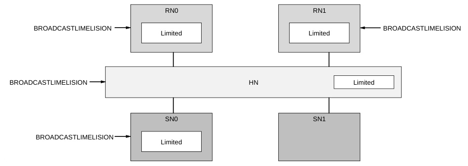

图 B16.1：带有 BROADCASTLIMELISION 的示例系统

取决于互连的能力，如果并非所有组件都支持该功能，则可能需要在全系统范围内禁用 Limited Data Elision。

此情形下的确切做法由实现决定。

#### B16.2.11 BROADCASTMULTIREQ

3 位的 BROADCASTMULTIREQ 信号用于控制多请求事务的发出，并有助于互操作性。

BROADCASTMULTIREQ 在复位时被采样，并可以被固定连接（tie off），以限制一个多请求事务中允许的请求数量。BROADCASTMULTIREQ 信号还可以改变不得跨越的地址边界。例如，如果某个请求方连接到的互连的归属节点按 256 字节粒度进行条带化，则该请求方可以被约束为发出最多四个请求的多请求，且不跨越 256 字节边界。

预期每个组件都具备 BROADCASTMULTIREQ 信号引脚，或者具备控制多请求事务发出的替代机制。

表 B16.55 给出了 BROADCASTMULTIREQ 的信号编码。

表 B16.55：BROADCASTMULTIREQ 信号编码

| BROADCASTMULTIREQ | NumReq 的最大值 | 多请求边界 | 限制 |
| --- | --- | --- | --- |
| 0b000 | 0b000000a | - | MultiReq 必须为 0b0。任何接收到的数据包中的 CacheLineID 不得用于任何功能性目的。 |
| 0b001 | 保留 | - | - |
| 0b010 | 0b000001 | 128 字节 | 最多 2 个请求 |
| 0b011 | 0b000011 | 256 字节 | 最多 4 个请求 |
| 0b100 | 0b000111 | 512 字节 | 最多 8 个请求 |
| 0b101 | 0b001111 | 1024 字节 | 最多 16 个请求 |
| 0b110 | 0b011111 | 2048 字节 | 最多 32 个请求 |
| 0b111 | 0b111111 | 4096 字节 | 最多 64 个请求 |

a 不适用，且必须为 0。

### B16.3 Atomic 事务支持

CHI 组件对 Atomic 事务的支持要求将在以下各节中描述：

- B16.3.1 请求节点支持
- B16.3.2 互连支持
- B16.3.3 从属节点支持

#### B16.3.1 请求节点支持

请求方组件必须支持一种抑制 Atomic 事务生成的机制，以确保在不支持 Atomic 事务的系统中的兼容性。请求方可以使用可选的接口引脚 BROADCASTATOMIC 来确定是否发送 Atomic 事务。

请求节点不必使用 Atomic 事务。本身不使用 Atomic 事务的请求节点无需增加任何功能，即可与支持 Atomic 事务的互连兼容。

支持原子操作但不包含对原子操作执行支持的请求节点，必须能够发送 Atomic 事务。

对于既支持执行原子操作又支持发送 Atomic 事务的请求节点，适用以下规定：

对于可缓存的位置（包括可侦听和不可侦听两类），请求节点能够在本地执行原子操作，而不在其接口上生成 Atomic 事务。为此，请求方以与存储操作相同的方式在其本地缓存中获取该位置的副本，随后在其本地缓存内执行该原子操作。对于可侦听的可缓存位置，如果缓存行的内容被更新且该缓存行此前不是 Dirty，则必须将该缓存行标记为 Dirty。

#### B16.3.2 互连支持

互连对 Atomic 事务的支持是可选的。

`Atomic_Transactions` 属性用于指示某个互连是否支持 Atomic 事务。

如果互连不支持 Atomic 事务，则所有连接的请求节点都必须配置为不产生 Atomic 事务。`BROADCASTATOMIC` 引脚在实现时可用于此目的。参见 B16.3.1 请求节点支持。

对于支持 Atomic 事务的互连，原子操作的执行可以在互连内的任意位置完成，包括把 Atomic 事务向下游传递到从属节点。

Atomic 事务不要求对每个地址位置都提供支持。

如果某个可侦听地址位置支持 Atomic 事务，则整个可侦听地址范围都必须支持。

如果某个地址位置不支持 Atomic 事务，则可以针对该 Atomic 事务返回相应的 Error 响应。参见 B9.1.4.4 Atomic 事务。

对于发往 Device 的事务，Atomic 事务必须传递到相应的端点从属设备。如果该从属设备被配置为不支持 Atomic 事务，则互连必须为该事务返回 Error 响应。

对于不可侦听事务，Atomic 事务必须在以下位置之一执行：

- 在事务对所有其他代理可见的位置处，或越过该位置之后。
- 在端点处。

对于可侦听事务，互连可以：

- 在互连内部执行 Atomic 事务所要求的原子操作。这要求

  互连执行相应的读事务、写事务和侦听事务以完成该 Atomic 事务。

- 如果相应的端点从属设备被配置为指示支持 Atomic 事务，则

  互连可以把该 Atomic 事务传递给该从属设备。在向从属设备发出该 Atomic 事务之前，互连仍须执行相应的侦听事务和写事务。

#### B16.3.3 从属节点支持

从属节点对 Atomic 事务的支持是可选的。

`Atomic_Transactions` 属性用于指示某个从属节点是否支持 Atomic 事务。

如果某个从属节点仅对特定内存类型或特定地址区域支持 Atomic 事务，则在收到不支持的 Atomic 事务时，该从属节点必须给出相应的 Error 响应。

# C 附录

Chapter C1

## C1 消息字段映射

本附录给出请求、响应、数据和侦听请求消息的字段映射。它包含以下各节：

- C1.1 请求消息字段映射
- C1.2 响应消息字段映射
- C1.3 侦听请求消息字段映射
- C1.4 数据消息字段映射

表 C1.1 给出字段映射表中使用的约定。

表 C1.1：字段映射表约定说明

| 符号 | 描述 |
| --- | --- |
| CF | 公共字段（Common Field）。两个或多个协议消息字段共用该数据包字段中的同一组位。 |
| X | 不适用。字段值可取任意值。 |
| 1 | 适用。使用该字段值，必须为 1。 |
| 0 | 适用。使用该字段值，必须为 0。 |
| 0a | 不适用。字段值必须为 0。 |
| Y | 适用。使用该字段值。允许的取值和用法参见规范。 |
| D | 不适用。字段值必须为 MPAM 字段的默认设置。 |
| 8B | Size 字段必须设置为 8 字节编码。 |
| 64B | Size 字段必须设置为 64 字节编码。 |
| M | 该字段位置复用于 DVM 操作。参见（DVM 操作） |
| - | 分配给共用该数据包字段中同一组位的另一个协议消息字段。如果该另一字段不存在，则视为不适用，且字段值必须为 0。 |
| 0x__ | 适用。使用该字段，所需的值以十六进制编码。 |

### C1.1 请求消息字段映射

- C1.1.1 Read、Dataless 和 Miscellaneous
- C1.1.2 Write 和 Combined Write
- C1.1.3 Stash 和 Atomic

#### C1.1.1 Read、Dataless 和 Miscellaneous

表 C1.2、表 C1.3 和表 C1.4 给出 Read、Dataless 和 Miscellaneous 请求消息的字段映射。字段映射中使用的约定参见表 C1.1。有关字段用法的更多信息，参见 B13.10 协议 flit 字段。

表 C1.2：Read、Dataless 和 Miscellaneous 请求消息字段映射 第 1 部分

ExpCompAck LikelyShared AllowRetry PCrdType MultiReq TraceTag SecSID1 RSVDC Opcode MPAM TagOp TxnID PBHA TgtID SrcID Order Addr QoS PAS 请求消息

X X X 0 0x00 X X X X X X X X X X X X X X ReqLCrdReturn 0a 0a 0a 0a 0a 0a 0a 0a 0a 0a 0a Y Y Y 0x05 Y Y Y 0 PCrdReturn 0a 0a 0a 0a 0a 0a 0a 0a Y Y Y Y 0x14 Y Y Y Y M 0 DVMOp 0a 0a 0a 0a 0a 0a Y Y Y 0x3A 1 Y Y Y Y Y Y Y Y PrefetchTgt

Y Y Y Y 0x04 Y Y Y Y Y Y Y Y Y Y Y 0 Y Y ReadNoSnp

Y Y Y Y 0x11 Y Y Y Y Y Y Y Y Y Y Y 0 0 Y ReadNoSnpSep

Y Y Y Y 0x03 Y Y Y Y Y Y Y Y Y Y Y 0 Y Y ReadOnce

Y Y Y Y 0x24 Y Y Y Y Y Y Y Y Y Y Y 0 Y Y ReadOnceCleanInvalid

Y Y Y Y 0x25 Y Y Y Y Y Y Y Y Y Y Y 0 Y Y ReadOnceMakeInvalid 0a Y Y Y Y 0x02 Y Y Y Y Y Y Y Y Y 0 Y 1 Y ReadClean 0a Y Y Y Y 0x26 Y Y Y Y Y Y Y Y Y 0 Y 1 Y ReadNotSharedDirty 0a Y Y Y Y 0x01 Y Y Y Y Y Y Y Y Y 0 Y 1 Y ReadShared 0a Y Y Y Y 0x07 Y Y Y Y Y Y Y Y Y 0 0 1 Y ReadUnique 0a Y Y Y Y 0x4C Y Y Y Y Y Y Y Y Y 0 0 1 Y ReadPreferUnique 0a Y Y Y Y 0x41 Y Y Y Y Y Y Y Y Y 0 0 1 Y MakeReadUnique 0a 0a Y Y Y Y 0x08 Y Y Y 0 Y Y Y Y Y 0 0 Y CleanShared 0a 0a Y Y Y Y 0x27 Y Y Y 0 Y Y Y Y Y 0 0 Y CleanSharedPersist 0a 0a Y Y Y Y 0x13 Y Y Y 0 Y Y Y Y Y 0 0 Y CleanSharedPersistSep 0a 0a Y Y Y Y 0x09 Y Y Y 0 Y Y Y Y Y 0 0 Y CleanInvalid 0a 0a Y Y Y Y 0x4D Y Y Y 0 Y Y Y Y Y 0 0 Y CleanInvalidPoPA 0a 0a Y Y Y Y 0x0E Y Y Y 0 Y Y Y Y Y 0 0 Y CleanInvalidStorage 0a 0a Y Y Y Y 0x0A Y Y Y 0 Y Y Y Y Y 0 0 Y MakeInvalid 0a Y Y Y Y 0x0B Y Y Y 0 Y Y Y Y Y 0 0 1 Y CleanUnique 0a Y Y Y Y 0x0C Y Y Y Y Y Y Y Y Y 0 0 1 Y MakeUnique 0a Y Y Y Y 0x0D Y Y Y 0 Y Y Y Y Y 0 0 0 Y Evict

表 C1.3：Read、Dataless 和 Miscellaneous 请求消息字段映射 第 2 部分

| 请求消息 | MemAttr Allocate Cacheable Device | EWA | CF SnpAttr DoDWT | Excl | CF SnoopMe | CAH | LPID | CF TagGroupID StashGroupID | PGroupID |
| --- | --- | --- | --- | --- | --- | --- | --- | --- | --- |
| ReqLCrdReturn | X X X | X | X X | X | X | X | X | X X | X |
| PCrdReturn | 0a 0a 0a | 0a | 0a - | 0a | 0a | 0a | 0a | 0a 0a | 0a |
| DVMOp | 0a 0a 0a | 0a | M - | 0a | 0a | 0a | Y | - - | - |
| PrefetchTgt | 0a 0a 0a | 0a | 0a 0a | 0a | - | - | Y | - - | - |
| ReadNoSnp | Y Y Y | Y | 0 - | Y | - | - | Y | - - | - |
| ReadNoSnpSep | Y Y Y | Y | 0 - | 0 | - | - | Y | - - | - |
| ReadOnce | Y 1 0 | 1 | 1 - | 0 | - | - | Y | - - | - |
| ReadOnceCleanInvalid | Y 1 0 | 1 | 1 - | 0 | - | - | Y | - - | - |
| ReadOnceMakeInvalid | 0 1 0 | 1 | 1 - | 0 | - | - | Y | - - | - |
| ReadClean | Y 1 0 | 1 | 1 - | Y | - | - | Y | - - | - |
| ReadNotSharedDirty | Y 1 0 | 1 | 1 - | Y | - | - | Y | - - | - |
| ReadShared | Y 1 0 | 1 | 1 - | Y | - | - | Y | - - | - |
| ReadUnique | Y 1 0 | 1 | 1 - | 0 | - | - | Y | - - | - |
| ReadPreferUnique | Y 1 0 | 1 | 1 - | Y | - | - | Y | - - | - |
| MakeReadUnique | Y 1 0 | 1 | 1 - | Y | - | - | Y | - - | - |
| CleanShared | Y Y Y | Y | Y - | 0 | - | - | Y | - - | - |
| CleanSharedPersist | Y Y Y | Y | Y - | 0 | - | - | Y | - - | - |
| CleanSharedPersistSep | Y Y Y | Y | Y - | 0 | - | - | - | - - | Y |
| CleanInvalid | Y Y Y | Y | Y - | 0 | - | - | Y | - - | - |
| CleanInvalidPoPA | Y Y Y | Y | Y - | 0 | - | - | Y | - - | - |
| CleanInvalidStorage | Y Y Y | Y | Y - | 0 | - | - | Y | - - | - |
| MakeInvalid | Y Y Y | Y | Y - | 0 | - | - | Y | - - | - |
| CleanUnique | Y 1 0 | 1 | 1 - | Y | - | - | Y | - - | - |
| MakeUnique | Y 1 0 | 1 | 1 - | 0 | - | - | Y | - - | - |
| Evict | 0 1 0 | 1 | 1 - | 0 | - | - | Y | - - | - |

表 C1.4：Read、Dataless 和 Miscellaneous 请求消息字段映射 第 3 部分

CF CF CF CF CF PrefetchTgtHint StashLPIDValid StashNIDValid ReturnTxnID ReturnNID DataTarget StashLPID StashNID StreamID NumReq MECID Endian Deep Size 请求消息

X X X X X X X X X X X X X X ReqLCrdReturn 0a 0a 0a 0a 0a 0a 0a 0a 0a 0a 0a 0a 0a - PCrdReturn 0a 0a 0a 0a 0a 0a 0a 0a 0a 0a 0a 0a - 8B DVMOp 0a 0a 0a 0a 0a 0a 0a 0a 0a 0a Y Y - 64B PrefetchTgt 0a 0a 0a Y - Y Y Y - - Y Y Y Y ReadNoSnp 0a 0a 0a 0a Y - - Y - - Y Y Y Y ReadNoSnpSep 0a 0a 0a 0a 0a 0a - - Y Y Y Y Y Y ReadOnce 0a 0a 0a 0a 0a 0a - - Y Y Y Y Y Y ReadOnceCleanInvalid 0a 0a 0a 0a 0a 0a - - Y Y Y Y Y Y ReadOnceMakeInvalid 0a 0a 0a 0a 0a 0a - - Y Y Y Y - 64B ReadClean 0a 0a 0a 0a 0a 0a - - Y Y Y Y - 64B ReadNotSharedDirty 0a 0a 0a 0a 0a 0a - - Y Y Y Y - 64B ReadShared 0a 0a 0a 0a 0a 0a - - Y Y Y Y - 64B ReadUnique 0a 0a 0a 0a 0a 0a - - Y Y Y Y - 64B ReadPreferUnique 0a 0a 0a 0a 0a 0a 0a - - Y Y Y - 64B MakeReadUnique 0a 0a 0a 0a 0a 0a 0a - - Y X Y - 64B CleanShared 0a 0a 0a - - Y - - Y - X Y - 64B CleanSharedPersist 0a 0a 0a Y - Y - - Y - X Y - 64B CleanSharedPersistSep 0a 0a 0a 0a 0a 0a 0a - - Y X Y - 64B CleanInvalid 0a 0a 0a 0a 0a 0a 0a - - Y X Y - 64B CleanInvalidPoPA 0a 0a 0a 0a 0a 0a 0a - - Y X Y - 64B CleanInvalidStorage 0a 0a 0a 0a 0a 0a 0a - - Y X Y - 64B MakeInvalid 0a 0a 0a 0a 0a 0a 0a - - Y X Y - 64B CleanUnique 0a 0a 0a 0a 0a 0a 0a - - Y X Y - 64B MakeUnique 0a 0a 0a 0a 0a 0a 0a - - Y X Y - 64B Evict

#### C1.1.2 Write 和 Combined Write

表 C1.5、表 C1.6 和表 C1.7 给出 Write 和 Combined Write 请求消息的字段映射。字段映射中使用的约定参见表 C1.1。有关字段用法的更多信息，参见 B13.10 协议 flit 字段。

表 C1.5：Write 和 Combined Write 请求消息字段映射 第 1 部分

ExpCompAck LikelyShared AllowRetry PCrdType MultiReq TraceTag SecSID1 RSVDC Opcode MPAM TagOp TxnID PBHA TgtID SrcID Order Addr QoS PAS 请求消息

Y Y Y Y 0x1C Y Y Y Y Y Y Y Y Y Y Y 0 Y Y WriteNoSnpPtl 0a Y Y Y Y 0x61 Y Y Y Y Y Y Y Y Y Y 0 Y Y WriteNoSnpPtlCleanInv 0a Y Y Y Y 0x70 Y Y Y Y Y Y Y Y Y Y 0 Y Y WriteNoSnpPtlCleanInvPoPA 0a Y Y Y Y 0x60 Y Y Y Y Y Y Y Y Y Y 0 Y Y WriteNoSnpPtlCleanSh 0a Y Y Y Y 0x62 Y Y Y Y Y Y Y Y Y Y 0 Y Y WriteNoSnpPtlCleanShPerSep

Y Y Y Y 0x1D Y Y Y Y Y Y Y Y Y Y Y 0 Y Y WriteNoSnpFull 0a Y Y Y Y 0x51 Y Y Y Y Y Y Y Y Y Y 0 Y Y WriteNoSnpFullCleanInv 0a Y Y Y Y 0x71 Y Y Y Y Y Y Y Y Y Y 0 Y Y WriteNoSnpFullCleanInvPoPA 0a Y Y Y Y 0x72 Y Y Y Y Y Y Y Y Y Y 0 Y Y WriteNoSnpFullCleanInvStrg 0a Y Y Y Y 0x50 Y Y Y Y Y Y Y Y Y Y 0 Y Y WriteNoSnpFullCleanSh 0a Y Y Y Y 0x52 Y Y Y Y Y Y Y Y Y Y 0 Y Y WriteNoSnpFullCleanShPerSep 0a Y Y Y Y 0x4E Y Y Y 0 Y Y Y Y Y Y 0 0 Y WriteNoSnpDef

Y Y Y Y 0x44 Y Y Y 0 Y Y Y Y Y Y Y 0 0 Y WriteNoSnpZero 0a Y Y Y Y 0x21 Y Y Y Y Y Y Y Y Y Y Y Y Y WriteUniquePtlStash 0a Y Y Y Y 0x20 Y Y Y Y Y Y Y Y Y Y Y Y Y WriteUniqueFullStash

Y Y Y Y 0x18 Y Y Y Y Y Y Y Y Y Y Y Y Y Y WriteUniquePtl 0a Y Y Y Y 0x64 Y Y Y 0 Y Y Y Y Y Y 0 Y Y WriteUniquePtlCleanSh 0a Y Y Y Y 0x66 Y Y Y 0 Y Y Y Y Y Y 0 Y Y WriteUniquePtlCleanShPerSep

Y Y Y Y 0x19 Y Y Y Y Y Y Y Y Y Y Y Y Y Y WriteUniqueFull 0a Y Y Y Y 0x54 Y Y Y 0 Y Y Y Y Y Y 0 Y Y WriteUniqueFullCleanSh 0a Y Y Y Y 0x56 Y Y Y 0 Y Y Y Y Y Y 0 Y Y WriteUniqueFullCleanShPerSep 0a Y Y Y Y 0x57 Y Y Y 0 Y Y Y Y Y Y 0 Y Y WriteUniqueFullCleanInvStrg

Y Y Y Y 0x43 Y Y Y 0 Y Y Y Y Y Y Y Y 0 Y WriteUniqueZero 0a Y Y Y Y 0x1A Y Y Y 0 Y Y Y Y Y 0 0 0 Y WriteBackPtl 0a Y Y Y Y 0x1B Y Y Y Y Y Y Y Y Y 0 Y 0 Y WriteBackFull 0a Y Y Y Y 0x59 Y Y Y Y Y Y Y Y Y 0 0 0 Y WriteBackFullCleanInv 0a Y Y Y Y 0x79 Y Y Y Y Y Y Y Y Y 0 0 0 Y WriteBackFullCleanInvPoPA 0a Y Y Y Y 0x5B Y Y Y Y Y Y Y Y Y 0 0 0 Y WriteBackFullCleanInvStrg 0a Y Y Y Y 0x58 Y Y Y Y Y Y Y Y Y 0 0 0 Y WriteBackFullCleanSh 0a Y Y Y Y 0x5A Y Y Y Y Y Y Y Y Y 0 0 0 Y WriteBackFullCleanShPerSep 0a Y Y Y Y 0x17 Y Y Y Y Y Y Y Y Y 0 Y 0 Y WriteCleanFull 0a Y Y Y Y 0x5C Y Y Y Y Y Y Y Y Y 0 0 0 Y WriteCleanFullCleanSh 0a Y Y Y Y 0x5E Y Y Y Y Y Y Y Y Y 0 0 0 Y WriteCleanFullCleanShPerSep 0a Y Y Y Y 0x15 Y Y Y Y Y Y Y Y Y 0 Y 0 Y WriteEvictFull

下页续

表 C1.5 —— 续上页 ExpCompAck LikelyShared AllowRetry PCrdType MultiReq TraceTag SecSID1 RSVDC Opcode MPAM TagOp TxnID PBHA TgtID SrcID Order Addr QoS PAS 请求消息 0a Y Y Y Y 0x42 Y Y Y Y Y Y Y Y Y 0 Y 1 Y WriteEvictOrEvict

表 C1.6：Write 和 Combined Write 请求消息字段映射 第 2 部分

| 请求消息 | MemAttr Allocate Cacheable Device | EWA | CF SnpAttr DoDWT | Excl | CF SnoopMe | CAH | LPID | CF TagGroupID StashGroupID | PGroupID |
| --- | --- | --- | --- | --- | --- | --- | --- | --- | --- |
| WriteNoSnpPtl | Y Y Y | Y | 0 Y | Y | - | - | Y | Y - | - |
| WriteNoSnpPtlCleanInv | Y Y Y | Y | 0 Y | 0 | - | - | Y | - - | - |
| WriteNoSnpPtlCleanInvPoPA | Y Y Y | Y | 0 Y | 0 | - | - | Y | - - | - |
| WriteNoSnpPtlCleanSh | Y Y Y | Y | 0 Y | 0 | - | - | Y | - - | - |
| WriteNoSnpPtlCleanShPerSep | Y Y Y | Y | 0 Y | 0 | - | - | - | - - | Y |
| WriteNoSnpFull | Y Y Y | Y | 0 Y | Y | - | - | Y | Y - | - |
| WriteNoSnpFullCleanInv | Y Y Y | Y | 0 Y | 0 | - | - | Y | - - | - |
| WriteNoSnpFullCleanInvPoPA | Y Y Y | Y | 0 Y | 0 | - | - | Y | - - | - |
| WriteNoSnpFullCleanInvStrg | Y Y Y | Y | 0 Y | 0 | - | - | Y | - - | - |
| WriteNoSnpFullCleanSh | Y Y Y | Y | 0 Y | 0 | - | - | Y | - - | - |
| WriteNoSnpFullCleanShPerSep | Y Y Y | Y | 0 Y | 0 | - | - | - | - - | Y |
| WriteNoSnpDef | 0 0 Y | Y | 0 Y | 0 | - | - | Y | - - | - |
| WriteNoSnpZero | Y Y Y | Y | 0 0a | 0 | - | - | Y | - - | - |
| WriteUniquePtlStash | Y 1 0 | 1 | 1 - | 0 | - | - | Y | Y - | - |
| WriteUniqueFullStash | Y 1 0 | 1 | 1 - | 0 | - | - | Y | Y - | - |
| WriteUniquePtl | Y 1 0 | 1 | 1 - | 0 | - | - | Y | Y - | - |
| WriteUniquePtlCleanSh | Y 1 0 | 1 | 1 - | 0 | - | - | Y | - - | - |
| WriteUniquePtlCleanShPerSep | Y 1 0 | 1 | 1 - | 0 | - | - | - | - - | Y |
| WriteUniqueFull | Y 1 0 | 1 | 1 - | 0 | - | - | Y | Y - | - |
| WriteUniqueFullCleanSh | Y 1 0 | 1 | 1 - | 0 | - | - | Y | - - | - |
| WriteUniqueFullCleanShPerSep | Y 1 0 | 1 | 1 - | 0 | - | - | - | - - | Y |
| WriteUniqueFullCleanInvStrg | Y 1 0 | 1 | 1 - | 0 | - | - | Y | - - | - |
| WriteUniqueZero | Y 1 0 | 1 | 1 - | 0 | - | - | Y | - - | - |
| WriteBackPtl | Y 1 0 | 1 | 1 - | - | - | 0 | Y | - - | - |
| WriteBackFull | Y 1 0 | 1 | 1 - | - | - | Y | Y | - - | - |
| WriteBackFullCleanInv | Y 1 0 | 1 | 1 - | - | - | Y | Y | - - | - |
| WriteBackFullCleanInvPoPA | Y 1 0 | 1 | 1 - | - | - | Y | Y | - - | - |
| WriteBackFullCleanInvStrg | Y 1 0 | 1 | 1 - | - | - | Y | Y | - - | - |
| WriteBackFullCleanSh | Y 1 0 | 1 | 1 - | - | - | Y | Y | - - | - |
| WriteBackFullCleanShPerSep | Y 1 0 | 1 | 1 - | - | - | Y | - | - - | Y |
| WriteCleanFull | Y 1 0 | 1 | 1 - | - | - | Y | Y | - - | - |
| WriteCleanFullCleanSh | Y 1 0 | 1 | 1 - | - | - | Y | Y | - - | - |
| WriteCleanFullCleanShPerSep | Y 1 0 | 1 | 1 - | - | - | Y | - | - - | Y |
| WriteEvictFull | 1 1 0 | 1 | 1 - | - | - | Y | Y | - - | - |
| WriteEvictOrEvict | 1 1 0 | 1 | 1 - | - | - | Y | Y | - - | - |

表 C1.7：Write 和 Combined Write 请求消息字段映射 第 3 部分

CF CF CF CF CF PrefetchTgtHint StashLPIDValid StashNIDValid ReturnTxnID ReturnNID DataTarget StashLPID StashNID StreamID NumReq MECID Endian Deep Size 请求消息 0a 0a 0a 0a Y - Y Y - - Y Y Y Y WriteNoSnpPtl 0a 0a 0a 0a Y - Y Y - - Y Y - Y WriteNoSnpPtlCleanInv 0a 0a 0a 0a Y - Y Y - - Y Y - Y WriteNoSnpPtlCleanInvPoPA 0a 0a 0a 0a Y - Y Y - - Y Y - Y WriteNoSnpPtlCleanSh

Y - Y - - Y - Y - - Y Y - Y WriteNoSnpPtlCleanShPerSep 0a 0a 0a 0a Y - Y Y - - Y Y Y 64B WriteNoSnpFull 0a 0a 0a 0a Y - Y Y - - Y Y - 64B WriteNoSnpFullCleanInv 0a 0a 0a 0a Y - Y Y - - Y Y - 64B WriteNoSnpFullCleanInvPoPA 0a 0a 0a 0a Y - Y Y - - Y Y - 64B WriteNoSnpFullCleanInvStrg 0a 0a 0a 0a Y - Y Y - - Y Y - 64B WriteNoSnpFullCleanSh

Y - Y - - Y - Y - - Y Y - 64B WriteNoSnpFullCleanShPerSep 0a 0a 0a 0a Y - Y Y - - Y Y - 64B WriteNoSnpDef 0a 0a 0a 0a 0a 0a 0a - - Y Y Y Y 64B WriteNoSnpZero

- Y Y Y - - - - Y Y Y Y - Y WriteUniquePtlStash
- Y Y Y - - - - Y Y Y Y - 64B WriteUniqueFullStash 0a 0a 0a 0a 0a 0a 0a - - Y Y Y Y Y WriteUniquePtl 0a 0a 0a 0a 0a 0a 0a - - Y Y Y - Y WriteUniquePtlCleanSh 0a 0a 0a - - Y - - Y - Y Y - Y WriteUniquePtlCleanShPerSep 0a 0a 0a 0a 0a 0a 0a - - Y Y Y Y 64B WriteUniqueFull 0a 0a 0a 0a 0a 0a 0a - - Y Y Y - 64B WriteUniqueFullCleanSh 0a 0a 0a - - Y - - Y - Y Y - 64B WriteUniqueFullCleanShPerSep 0a 0a 0a 0a 0a 0a 0a - - Y Y Y - 64B WriteUniqueFullCleanInvStrg 0a 0a 0a 0a 0a 0a 0a - - Y Y Y Y 64B WriteUniqueZero 0a 0a 0a 0a 0a 0a 0a - - Y Y Y - 64B WriteBackPtl 0a 0a 0a 0a 0a 0a 0a - - Y Y Y - 64B WriteBackFull 0a 0a 0a 0a 0a 0a 0a - - Y Y Y - 64B WriteBackFullCleanInv 0a 0a 0a 0a 0a 0a 0a - - Y Y Y - 64B WriteBackFullCleanInvPoPA 0a 0a 0a 0a 0a 0a 0a - - Y Y Y - 64B WriteBackFullCleanInvStrg 0a 0a 0a 0a 0a 0a 0a - - Y Y Y - 64B WriteBackFullCleanSh 0a 0a 0a - - Y - - Y - Y Y - 64B WriteBackFullCleanShPerSep 0a 0a 0a 0a 0a 0a 0a - - Y Y Y - 64B WriteCleanFull 0a 0a 0a 0a 0a 0a 0a - - Y Y Y - 64B WriteCleanFullCleanSh 0a 0a 0a - - Y - - Y - Y Y - 64B WriteCleanFullCleanShPerSep 0a 0a 0a 0a 0a 0a 0a - - Y Y Y - 64B WriteEvictFull 0a 0a 0a 0a 0a 0a 0a - - Y Y Y - 64B WriteEvictOrEvict

#### C1.1.3 Stash 与 Atomic

表 C1.8、表 C1.9 和表 C1.10 给出了 Stash 与 Atomic 请求消息的字段映射。字段映射中使用的约定参见表 C1.1。有关字段用法的更多信息，参见 B13.10 Protocol flit fields。

表 C1.8：Stash 与 Atomic 请求消息字段映射 第 1 部分

ExpCompAck LikelyShared AllowRetry PCrdType MultiReq TraceTag SecSID1 RSVDC Opcode MPAM TagOp TxnID PBHA TgtID SrcID Order Addr QoS PAS 请求消息 0a Y Y Y Y 0x23 Y Y Y Y Y Y Y Y Y 0 Y 0 Y StashOnceUnique 0a Y Y Y Y 0x48 Y Y Y Y Y Y Y Y Y 0 Y 0 Y StashOnceSepUnique 0a Y Y Y Y 0x22 Y Y Y Y Y Y Y Y Y 0 Y 0 Y StashOnceShared 0a Y Y Y Y 0x47 Y Y Y Y Y Y Y Y Y 0 Y 0 Y StashOnceSepShared 0a Y Y Y Y Y Y Y Y Y Y Y Y Y Y Y 0 0 Y AtomicLoad 0a Y Y Y Y Y Y Y Y Y Y Y Y Y Y Y 0 0 Y AtomicStore 0a Y Y Y Y 0x39 Y Y Y Y Y Y Y Y Y Y 0 0 Y AtomicCompare 0a Y Y Y Y 0x38 Y Y Y Y Y Y Y Y Y Y 0 0 Y AtomicSwap

表 C1.9：Stash 与 Atomic 请求消息字段映射 第 2 部分

| 请求消息 | Allocate | MemAttr Cacheable Device | EWA | CF SnpAttr DoDWT | Excl | CF SnoopMe | CAH | LPID | CF TagGroupID StashGroupID | PGroupID |
| --- | --- | --- | --- | --- | --- | --- | --- | --- | --- | --- |
| StashOnceUnique | Y | 1 0 | 1 | 1 - | 0 | - | - | Y | - - | - |
| StashOnceSepUnique | Y | 1 0 | 1 | 1 - | 0 | - | - | - | - Y | - |
| StashOnceShared | Y | 1 0 | 1 | 1 - | 0 | - | - | Y | - - | - |
| StashOnceSepShared | Y | 1 0 | 1 | 1 - | 0 | - | - | - | - Y | - |
| AtomicLoad | Y | Y Y | Y | Y - | - | Y | - | Y | Y - | - |
| AtomicStore | Y | Y Y | Y | Y - | - | Y | - | Y | Y - | - |
| AtomicCompare | Y | Y Y | Y | Y - | - | Y | - | Y | Y - | - |
| AtomicSwap | Y | Y Y | Y | Y - | - | Y | - | Y | Y - | - |

表 C1.10：Stash 与 Atomic 请求消息字段映射 第 3 部分

CF CF CF CF CF PrefetchTgtHint StashLPIDValid StashNIDValid ReturnTxnID ReturnNID DataTarget StashLPID StashNID StreamID NumReq MECID Endian Deep Size 请求消息

- Y Y Y - - - - Y Y Y Y - 64B StashOnceUnique
- Y Y Y - - - - Y Y Y Y - 64B StashOnceSepUnique
- Y Y Y - - - - Y Y Y Y - 64B StashOnceShared
- Y Y Y - - - - Y Y Y Y - 64B StashOnceSepShared 0a Y - - Y - - Y - - Y Y - Y AtomicLoad 0a Y - - Y - - X - - Y Y - Y AtomicStore 0a Y - - Y - - Y - - Y Y - Y AtomicCompare 0a Y - - Y - - Y - - Y Y - Y AtomicSwap

### C1.2 响应消息字段映射

表 C1.11 展示了响应消息字段映射。字段映射中使用的约定见表 C1.1。有关字段使用的更多信息，见 B13.10 协议 flit 字段。

表 C1.11：响应消息字段映射

CF CF StashGroupID CacheLineID TagGroupID PGroupID PCrdType FwdState TraceTag DataPull RespErr Opcode CBusy TagOp TxnID TgtID DBID SrcID Resp QoS 响应消息

X X X 0 0x00 X X X X X X X X X X X X X RspLCrdReturn 0a 0a 0a Y Y Y Y 0x01 Y Y Y Y Y - - - - Y SnpResp 0a 0a 0a Y Y Y Y 0x09 Y Y Y Y X - - - Y - SnpRespFwded 0a 0a 0a 0a 0a Y Y Y Y 0x02 0 Y Y Y X - - - CompAck 0a 0a 0a 0a 0a Y Y Y Y 0x03 0 Y Y Y X - - - RetryAck 0a 0a 0a Y Y Y Y 0x04 Y Y Y Y Y Y Y - - - Comp 0a 0a 0a 0a 0a Y Y Y Y 0x14 Y Y Y Y X - - - CompCMO 0a 0a 0a 0a 0a 0a 0a Y Y Y 0x0C Y Y X - - - Y Persist 0a 0a 0a 0a 0a Y Y Y Y 0x0D Y Y Y Y - - - Y CompPersist 0a 0a 0a 0a 0a 0a 0a Y Y Y 0x10 Y Y X - - Y - StashDone 0a 0a 0a 0a 0a Y Y Y Y 0x11 Y Y Y Y - - Y - CompStashDone 0a 0a 0a 0a Y Y Y Y 0x0B Y Y Y Y Y Y - - - RespSepData 0a 0a 0a 0a Y Y Y Y 0x05 Y Y Y Y Y Y - - - CompDBIDResp 0a 0a 0a 0a 0a Y Y Y Y 0x06 0 Y Y Y Y - - - DBIDResp 0a 0a 0a 0a 0a Y Y Y Y 0x0E 0 Y Y Y Y - - - DBIDRespOrd 0a 0a 0a 0a 0a 0a Y Y Y 0x0A Y Y Y X - Y - - TagMatch 0a 0a 0a 0a 0a 0a 0a 0a 0a 0a Y Y Y 0x07 0 Y X Y PCrdGrant 0a 0a 0a 0a 0a Y Y Y Y 0x08 0 Y Y Y X - - - ReadReceipt

### C1.3 侦听请求消息字段映射

表 C1.12 展示了侦听请求消息字段映射。字段映射中使用的约定见表 C1.1。有关字段使用的更多信息，见 B13.10 协议 flit 字段。

表 C1.12：侦听请求消息字段映射

CF CF StashLPIDValid DoNotGoToSD FwdTxnID StashLPID VMIDExt RetToSrc TraceTag FwdNID MECID Opcode MPAM TxnID PBHA SrcID Addr QoS PAS 侦听请求消息

X X 0 0x00 X X X X X X X X X X X X X SnpLCrdReturn 0a 0a 0a 0a 0a 0a Y Y Y 0x01 Y Y Y Y Y D Y SnpShared 0a 0a 0a 0a 0a 0a Y Y Y 0x02 Y Y Y Y Y D Y SnpClean 0a 0a 0a 0a 0a 0a Y Y Y 0x03 Y Y Y Y Y D Y SnpOnce 0a 0a 0a 0a 0a 0a Y Y Y 0x04 Y Y Y Y Y D Y SnpNotSharedDirty 0a 0a 0a 0a 0a 0a Y Y Y 0x07 Y Y 1 Y Y D Y SnpUnique 0a 0a 0a 0a 0a 0a Y Y Y 0x15 Y Y Y Y Y D Y SnpPreferUnique 0a 0a 0a 0a 0a 0a 0a Y Y Y 0x08 Y Y 1 Y D Y SnpCleanShared 0a 0a 0a 0a 0a 0a 0a Y Y Y 0x09 Y Y 1 Y D Y SnpCleanInvalid 0a 0a 0a 0a 0a 0a 0a Y Y Y 0x0A Y Y 1 Y D Y SnpMakeInvalid

Y Y Y 0x11 Y Y Y Y Y D Y Y - Y - - - SnpSharedFwd

Y Y Y 0x12 Y Y Y Y Y D Y Y - Y - - - SnpCleanFwd 0a Y Y Y 0x13 Y Y Y Y D Y Y - Y - - - SnpOnceFwd

Y Y Y 0x14 Y Y Y Y Y D Y Y - Y - - - SnpNotSharedDirtyFwd 0a Y Y Y 0x17 Y Y 1 Y D Y Y - Y - - - SnpUniqueFwd

Y Y Y 0x16 Y Y Y Y Y D Y Y - Y - - - SnpPreferUniqueFwd

Y Y Y 0x05 Y Y 1 Y Y Y Y - Y - Y Y - SnpUniqueStash 0a Y Y Y 0x06 Y Y 1 Y Y Y - Y - Y Y - SnpMakeInvalidStash 0a Y Y Y 0x0B Y Y 1 Y Y Y - Y - Y Y - SnpStashUnique 0a Y Y Y 0x0C Y Y 1 Y Y Y - Y - Y Y - SnpStashShared 0a 0a 0a 0a 0a 0a 0a 0a 0a Y Y Y 0x10 Y Y Y D SnpQuery 0a 0a 0a 0a 0a Y Y Y 0x0D M Y M M - - - Y SnpDVMOp

### C1.4 数据消息字段映射

表 C1.13、表 C1.14、表 C1.15 展示了数据消息字段映射。字段映射中使用的约定见表 C1.1。有关字段使用的更多信息，见 B13.10 协议 flit 字段。

表 C1.13：数据消息字段映射 第 1 部分

RSVDC RespErr Opcode DataID CBusy TxnID TgtID SrcID CCID Resp Data QoS BE 数据消息

X X X 0 0x0 X X X X X X X X DatLCrdReturn

Y Y Y Y 0x1 Y Y Y Y Y Y Y Y SnpRespData

Y Y Y Y 0x6 Y Y Y Y Y Y Y Y SnpRespDataFwded 0a Y Y Y Y 0x2 Y Y Y Y Y Y Y CopyBackWriteData 0a Y Y Y Y 0x3 Y 0 Y Y Y Y Y NonCopyBackWriteData 0a Y Y Y Y 0xC Y 0 Y Y Y Y Y NonCopyBackWriteDataCompAck

Y Y Y Y 0x4 Y Y Y Y Y Y X Y CompData

Y Y Y Y 0xB Y Y Y Y Y Y X Y DataSepResp

Y Y Y Y 0x5 Y Y Y Y Y Y Y Y SnpRespDataPtl 0a Y Y Y Y 0x7 Y 0 Y Y Y 0 0 WriteDataCancel

表 C1.14：数据消息字段映射 第 2 部分

| 数据消息 | TraceTag | CAH | DataCheck | Poison | TagOp | Tag | TU | DataPull | NumDat | Replicate | CacheLineID |
| --- | --- | --- | --- | --- | --- | --- | --- | --- | --- | --- | --- |
| DatLCrdReturn | X | X | X | X | X | X | X | X | X | X | X |
| SnpRespData | Y | Y | Y | Y | Y | Y | Y | Y | Y | Y | Y |
| SnpRespDataFwded | Y | Y | Y | Y | Y | Y | Y | 0a | Y | Y | Y |
| CopyBackWriteData | Y | 0a | Y | Y | Y | Y | Y | 0a | Y | Y | 0a |
| NonCopyBackWriteData | Y | 0a | Y | Y | Y | Y | Y | 0a | Y | Y | 0a |
| NonCopyBackWriteDataCompAck | Y | 0a | Y | Y | Y | Y | Y | 0a | Y | Y | 0a |
| CompData | Y | Y | Y | Y | Y | Y | Y | 0a | Y | Y | Y |
| DataSepResp | Y | Y | Y | Y | Y | Y | Y | 0a | Y | Y | Y |
| SnpRespDataPtl | Y | 0 | Y | Y | 0 | 0a | 0a | Y | Y | Y | Y |
| WriteDataCancel | Y | 0a | Y | Y | 0a | 0a | 0a | 0a | Y | 0 | 0a |

表 C1.15：数据消息字段映射 第 3 部分

CF CF CF MismatchedMECID DataSource HomeNID FwdState MECID PBHA DBID 数据消息

X X X X X X X DatLCrdReturn

- Y Y - Y Y Y SnpRespData 0a 0a - Y Y - Y SnpRespDataFwded 0a 0a 0a 0a 0a X - CopyBackWriteData 0a 0a 0a 0a 0a X - NonCopyBackWriteData 0a 0a 0a 0a 0a X - NonCopyBackWriteDataCompAck

Y - - - Y Y - CompData

Y - - - Y Y - DataSepResp

- Y Y - Y Y Y SnpRespDataPtl 0a 0a 0a 0a 0a X - WriteDataCancel

第 C2 章

## C2 通信节点

本附录针对每种数据包类型，规定使用该数据包类型进行通信的节点。它包含以下小节：

- C2.1 请求通信节点
- C2.2 监听通信节点
- C2.3 响应通信节点
- C2.4 数据通信节点

### C2.1 请求通信节点

表 C2.1 列出了请求通信节点。在表 C2.1 中，除非另有明确说明，对写事务的引用既包括单个 Write 事务，也包括相应的 Combined Write 事务。

对于某些 Request，既给出了预期目标，也给出了允许目标。允许目标的使用可能出现在基于软件的错误情况下。允许目标必须以符合协议的方式完成事务，这可能要求使用错误响应。

表 C2.1：请求通信节点

| Request | 发送方 | 预期接收方 | 允许接收方 |
| --- | --- | --- | --- |
| ReadNoSnp | RN-F, RN-D, RN-I | ICN(HN-F, HN-I) | - |
| WriteNoSnpPtl | ICN(HN-F) | SN-F | - |

WriteNoSnpFull ICN(HN-I) SN-I -

WriteNoSnpZero

CleanShared

CleanSharedPersist

CleanSharedPersistSep

CleanInvalid

CleanInvalidPoPA

CleanInvalidStorage

MakeInvalid

WriteNoSnpFullCleanInv

WriteNoSnpFullCleanInvPoPA

WriteNoSnpFullCleanInvStrg

WriteNoSnpFullCleanSh

WriteNoSnpFullCleanShPerSep

WriteNoSnpPtlCleanInv

WriteNoSnpPtlCleanInvPoPA

WriteNoSnpPtlCleanSh

WriteNoSnpPtlCleanShPerSep

AtomicStore

AtomicLoad

AtomicSwap

AtomicCompare

WriteNoSnpDef RN-F HN-I HN-F

RN-D, RN-Ia

下页续

表 C2.1 – 续上页

| Request | 发送方 | 预期接收方 | 允许接收方 |
| --- | --- | --- | --- |
|  | ICN(HN-I) | SN-I | - |
| ReadNoSnpSep | ICN(HN-F) | SN-F | - |
|  | ICN(HN-I) | SN-I | - |

ReadClean RN-F ICN(HN-F) ICN(HN-I)

ReadShared

ReadNotSharedDirty

ReadUnique

ReadPreferUnique

MakeReadUnique

CleanUnique

MakeUnique

Evict

WriteBackPtl

WriteBackFull

WriteCleanFull

WriteEvictFull

WriteEvictOrEvict

WriteBackFullCleanInv

WriteBackFullCleanInvPoPA

WriteBackFullCleanInvStrg

WriteBackFullCleanSh

WriteBackFullCleanShPerSep

WriteCleanFullCleanSh

WriteCleanFullCleanShPerSep

ReadOnce RN-F, RN-D, RN-I ICN(HN-F) ICN(HN-I)

ReadOnceCleanInvalid

ReadOnceMakeInvalid

StashOnceUnique

StashOnceShared

StashOnceSepUnique

StashOnceSepShared

WriteUniqueFull

WriteUniqueFullStash

下页续

表 C2.1 – 续上页

Request 发送方 接收方

预期接收方 允许接收方

WriteUniquePtl

WriteUniquePtlStash

WriteUniqueZero

WriteUniquePtlCleanSh

WriteUniquePtlCleanShPerSep

WriteUniqueFullCleanSh

WriteUniqueFullCleanShPerSep

WriteUniqueFullCleanInvStrg

DVMOp RN-F ICN(MN) -

PCrdReturn RN-F ICN(HN-F, HN-I, MN) -

RN-D, RN-I ICN(HN-F, HN-I) -

ICN(HN-F) SN-F -

ICN(HN-I) SN-I -

RN-F, RN-D, RN-Ib PrefetchTgt SN-F

a 该请求来自 RN-D 或 RN-I 时是允许的，但不是预期的。

b 在基于 RME 的系统中，来自器件的 PrefetchTgt 事务不是预期的，但是允许的。建议主机丢弃来自器件的 PrefetchTgt，不将其传播到从属节点。

### C2.2 监听通信节点

表 C2.2 列出了监听通信节点。

表 C2.2：监听通信节点

Snoop 发送方 接收方

SnpShared ICN(HN-F) RN-F

SnpClean

SnpOnce

SnpNotSharedDirty

SnpUnique

SnpPreferUnique

SnpCleanShared

SnpCleanInvalid

SnpMakeInvalid

SnpSharedFwd

SnpCleanFwd

SnpOnceFwd

SnpNotSharedDirtyFwd

SnpUniqueFwd

SnpPreferUniqueFwd

SnpUniqueStash

SnpMakeInvalidStash

SnpStashUnique

SnpStashShared

SnpQuery

SnpDVMOp ICN(MN) RN-F, RN-D

### C2.3 响应通信节点

表 C2.3 列出了响应通信节点。

表 C2.3：响应通信节点

| Response |  | 发送方 | 接收方 |
| --- | --- | --- | --- |
| 上游 | RetryAck | ICN(HN-F, HN-I) | RN-F, RN-D, RN-I |
|  | PCrdGrant | ICN(MN) | RN-F |
|  | Comp | SN-F | ICN(HN-F) |
|  | CompDBIDResp | SN-I | ICN(HN-I) |
|  | CompCMO | ICN(HN-F, HN-I) | RN-F, RN-D, RN-I |
|  | ReadReceipt | SN-F | ICN(HN-F) |
|  |  | SN-I | ICN(HN-I) |
|  | RespSepData | ICN(HN-F, HN-I) | RN-F, RN-D, RN-I |
|  | DBIDResp | ICN(HN-F, HN-I, MN) | RN-F, RN-D, RN-I |
|  |  | SN-F | ICN(HN-F), RN-F, RN-D, RN-I |
|  |  | SN-I | ICN(HN-I), RN-F, RN-D, RN-I |
|  | DBIDRespOrd | ICN(HN-F, HN-I) | RN-F, RN-D, RN-I |
|  | StashDone CompStashDone | ICN(HN-F) | RN-F, RN-D, RN-I |
|  | TagMatch | ICN(HN-F, HN-I) | RN-F, RN-D, RN-I |
|  |  | SN-F | ICN(HN-F), RN-F, RN-D, RN-I |
|  |  | SN-I | ICN(HN-I), RN-F, RN-D, RN-I |
|  | Persist | ICN(HN-F, HN-I) | RN-F, RN-D, RN-I |
|  |  | SN-F | ICN(HN-F), RN-F, RN-D, RN-I |
|  |  | SN-I | ICN(HN-I), RN-F, RN-D, RN-I |
|  | CompPersist | ICN(HN-F, HN-I) | RN-F, RN-D, RN-I |
|  |  | SN-F | ICN(HN-F) |
|  |  | SN-I | ICN(HN-I) |
| 下游 | CompAck | RN-F, RN-D, RN-I | ICN(HN-F, HN-I) |
|  | SnpResp | RN-F | ICN(HN-F) |
|  |  | RN-F, RN-D | ICN(MN) |
|  | SnpRespFwded | RN-F | ICN(HN-F) |

### C2.4 数据通信节点

表 C2.4 列出了数据通信节点。

对于某些 Data，既给出了预期目标，也给出了允许目标。允许目标的使用可能出现在地址译码错误的情况下。允许目标必须以符合协议的方式完成事务。在表 C2.4 中，除非另有明确说明，对写事务的引用既包括单个 Write 事务，也包括相应的 Combined Write 事务。

表 C2.4：数据通信节点

| Data |  | 发送方 | 预期接收方 | 允许接收方 |
| --- | --- | --- | --- | --- |
| 上游 | CompData | ICN(HN-F, HN-I) | RN-F, RN-D, RN-I | - |
|  |  | SN-F | RN-F, RN-D, RN-I, ICN(HN-F) | - |
|  |  | SN-I | RN-F, RN-D, RN-I, ICN(HN-I) | - |
|  | DataSepResp | ICN(HN-F, HN-I) | RN-F, RN-D, RN-I | - |
|  |  | SN-F | RN-F, RN-D, RN-I | ICN(HN-F) |
|  |  | SN-I | RN-F, RN-D, RN-I | ICN(HN-I) |
| 下游 | CopyBackWriteData | RN-F | ICN(HN-F) | ICN(HN-I) |
|  | WriteDataCancel | RN-F, RN-D, RN-I | ICN(HN-F, HN-I), SN-F, SN-I | - |
|  |  | ICN(HN-F) | SN-F | - |
|  |  | ICN(HN-I) | SN-I | - |
|  | NonCopyBackWriteData | RN-F, RN-D, RN-I | ICN(HN-F, HN-I), SN-F, SN-I | - |
|  |  | RN-F, RN-D | ICN(MN) | - |
|  |  | ICN(HN-F) | SN-F | - |
|  |  | ICN(HN-I) | SN-I | - |
|  | NonCopyBackWriteDataCompAck | RN-F, RN-D, RN-I | ICN(HN-F, HN-I) | - |
|  | SnpRespData SnpRespDataFwded SnpRespDataPtl | RN-F | ICN(HN-F) |  |
| 点对点 | CompData | RN-F | RN-F, RN-D, RN-I | - |

第 C3 章

## C3 节点事务子集

本附录展示请求方和从属节点的事务子集。它包含以下小节：

- C3.1 请求节点子集
- C3.2 从属节点子集

表 C3.1 给出了事务映射表中使用的约定。

表 C3.1：事务映射表约定说明

| 符号 | 描述 |
| --- | --- |
| Y | 允许 |
| - | 不允许 |

### C3.1 请求节点子集

表 C3.2 列出了每种请求节点类型可以发出的事务。事务映射表中使用的约定参见表 C3.1。

表 C3.2：事务到请求节点的映射

| 事务 | 事务分类 | 由 RN-F RN-D, RN-I 发出 |
| --- | --- | --- |
| ReadNoSnp | Non-allocating Read | Y Y |
| ReadOnce | Non-allocating Read | Y Y |
| ReadOnceCleanInvalid | Non-allocating Read | Y Y |
| ReadOnceMakeInvalid | Non-allocating Read | Y Y |
| WriteNoSnpFull | Immediate Write | Y Y |
| WriteNoSnpPtl | Immediate Write | Y Y |
| WriteNoSnpZero | Immediate Write | Y Y |
| WriteUniqueFull | Immediate Write | Y Y |
| WriteUniquePtl | Immediate Write | Y Y |
| WriteUniqueZero | Immediate Write | Y Y |
| WriteUniqueFullStash | Immediate Write | Y Y |
| WriteUniquePtlStash | Immediate Write | Y Y |
| WriteNoSnpDef | Immediate Write | Y Y |
| CleanInvalid | Dataless | Y Y |
| CleanInvalidPoPA | Dataless | Y Y |
| CleanInvalidStorage | Dataless | Y Y |
| CleanShared | Dataless | Y Y |
| CleanSharedPersist | Dataless | Y Y |
| CleanSharedPersistSep | Dataless | Y Y |
| MakeInvalid | Dataless | Y Y |
| StashOnceSepShared | Dataless | Y Y |
| StashOnceSepUnique | Dataless | Y Y |
| StashOnceShared | Dataless | Y Y |
| StashOnceUnique | Dataless | Y Y |
| WriteNoSnpFullCleanInv | Combined Write | Y Y |
| WriteNoSnpFullCleanInvPoPA | Combined Write | Y Y |
| WriteNoSnpFullCleanInvStrg | Combined Write | Y Y |
| WriteNoSnpFullCleanSh | Combined Write | Y Y |
|  |  | 下页续 |

表 C3.2 — 续上页

| 事务 | 事务分类 | 由 RN-F RN-D, RN-I 发出 |
| --- | --- | --- |
| WriteNoSnpFullCleanShPerSep | Combined Write | Y Y |
| WriteNoSnpPtlCleanInv | Combined Write | Y Y |
| WriteNoSnpPtlCleanInvPoPA | Combined Write | Y Y |
| WriteNoSnpPtlCleanSh | Combined Write | Y Y |
| WriteNoSnpPtlCleanShPerSep | Combined Write | Y Y |
| WriteUniqueFullCleanSh | Combined Write | Y Y |
| WriteUniqueFullCleanShPerSep | Combined Write | Y Y |
| WriteUniqueFullCleanInvStrg | Combined Write | Y Y |
| WriteUniquePtlCleanSh | Combined Write | Y Y |
| WriteUniquePtlCleanShPerSep | Combined Write | Y Y |
| AtomicStore | Atomic | Y Y |
| AtomicLoad | Atomic | Y Y |
| AtomicSwap | Atomic | Y Y |
| AtomicCompare | Atomic | Y Y |
| PCrdReturn | 其他 | Y Y |
| PrefetchTgt | 其他 | Y Y |
| ReqLCrdReturn | 链路级 | Y Y |
| MakeReadUnique | Allocating Read | Y - |
| ReadClean | Allocating Read | Y - |
| ReadNotSharedDirty | Allocating Read | Y - |
| ReadPreferUnique | Allocating Read | Y - |
| ReadShared | Allocating Read | Y - |
| ReadUnique | Allocating Read | Y - |
| WriteBackFull | CopyBack 写 | Y - |
| WriteBackPtl | CopyBack 写 | Y - |
| WriteCleanFull | CopyBack 写 | Y - |
| WriteEvictFull | CopyBack 写 | Y - |
| WriteEvictOrEvict | CopyBack 写 | Y - |
| CleanUnique | Dataless | Y - |
| Evict | Dataless | Y - |
| MakeUnique | Dataless | Y - |
| WriteBackFullCleanInv | Combined Write | Y - |
|  |  | 下页续 |

表 C3.2 — 续上页

| 事务 | 事务分类 | 由 RN-F 发出 | RN-D, RN-I |
| --- | --- | --- | --- |
| WriteBackFullCleanInvPoPA | Combined Write | Y | - |
| WriteBackFullCleanInvStrg | Combined Write | Y | - |
| WriteBackFullCleanSh | Combined Write | Y | - |
| WriteBackFullCleanShPerSep | Combined Write | Y | - |
| WriteCleanFullCleanSh | Combined Write | Y | - |
| WriteCleanFullCleanShPerSep | Combined Write | Y | - |
| DVMOp | 其他 | Y | - |
| ReadNoSnpSep | 读 | - | - |

### C3.2 从属节点子集

表 C3.3 列出了每种从属节点类型可以接收的事务。事务映射表中使用的约定参见表 C3.1。

表 C3.3：事务到从属节点的映射

| Transaction | 事务分类 | SN-F SN-I 可见 |
| --- | --- | --- |
| ReadNoSnp | Non-allocating Read | Y Y |
| ReadNoSnpSep | Non-allocating Read | Y Y |
| WriteNoSnpPtl | Immediate Write | Y Y |
| WriteNoSnpFull | Immediate Write | Y Y |
| WriteNoSnpZero | Immediate Write | Y Y |
| CleanShared | Dataless | Y Y |
| CleanInvalid | Dataless | Y Y |
| MakeInvalid | Dataless | Y Y |
| CleanSharedPersistSep | Dataless | Y Y |
| CleanSharedPersist | Dataless | Y Y |
| CleanInvalidPoPA | Dataless | Y Y |
| CleanInvalidStorage | Dataless | Y Y |
| WriteNoSnpFullCleanSh | Combined Write | Y Y |
| WriteNoSnpFullCleanInv | Combined Write | Y Y |
| WriteNoSnpFullCleanShPerSep | Combined Write | Y Y |
| WriteNoSnpPtlCleanSh | Combined Write | Y Y |
| WriteNoSnpPtlCleanInv | Combined Write | Y Y |
| WriteNoSnpPtlCleanShPerSep | Combined Write | Y Y |
| WriteNoSnpPtlCleanInvPoPA | Combined Write | Y Y |
| WriteNoSnpFullCleanInvPoPA | Combined Write | Y Y |
| WriteNoSnpFullCleanInvStrg | Combined Write | Y Y |
| AtomicStore | Atomic | Y Y |
| AtomicLoad | Atomic | Y Y |
| AtomicSwap | Atomic | Y Y |
| AtomicCompare | Atomic | Y Y |
| PCrdReturn | Other | Y Y |
| PrefetchTgt | Other | Y - |
| ReqLCrdReturn | Link level | Y Y |
|  |  | 下页续 |

表 C3.3 – 续上页

| Transaction | 事务分类 | SN-F SN-I 可见 |
| --- | --- | --- |
| WriteNoSnpDef | Immediate Write | - Y |
| ReadOnce | Non-allocating Read | - - |
| ReadOnceCleanInvalid | Non-allocating Read | - - |
| ReadOnceMakeInvalid | Non-allocating Read | - - |
| ReadShared | Allocating Read | - - |
| ReadClean | Allocating Read | - - |
| ReadUnique | Allocating Read | - - |
| ReadNotSharedDirty | Allocating Read | - - |
| MakeReadUnique | Allocating Read | - - |
| ReadPreferUnique | Allocating Read | - - |
| WriteEvictFull | CopyBack 写 | - - |
| WriteCleanFull | CopyBack 写 | - - |
| WriteUniquePtl | CopyBack 写 | - - |
| WriteUniqueFull | CopyBack 写 | - - |
| WriteBackPtl | CopyBack 写 | - - |
| WriteBackFull | CopyBack 写 | - - |
| WriteUniqueFullStash | Immediate Write | - - |
| WriteUniquePtlStash | Immediate Write | - - |
| WriteEvictOrEvict | Immediate Write | - - |
| WriteUniqueZero | Immediate Write | - - |
| CleanUnique | Dataless | - - |
| MakeUnique | Dataless | - - |
| Evict | Dataless | - - |
| StashOnceShared | Dataless | - - |
| StashOnceUnique | Dataless | - - |
| StashOnceSepShared | Dataless | - - |
| StashOnceSepUnique | Dataless | - - |
| WriteUniqueFullCleanSh | Combined Write | - - |
| WriteUniqueFullCleanShPerSep | Combined Write | - - |
| WriteUniqueFullCleanInvStrg | Combined Write | - - |
| WriteBackFullCleanSh | Combined Write | - - |
| WriteBackFullCleanInv | Combined Write | - - |
|  |  | 下页续 |

表 C3.3 – 续上页

| Transaction | 事务分类 | SN-F 可见 | SN-I 可见 |
| --- | --- | --- | --- |
| WriteBackFullCleanShPerSep | Combined Write | - | - |
| WriteCleanFullCleanSh | Combined Write | - | - |
| WriteCleanFullCleanShPerSep | Combined Write | - | - |
| WriteUniquePtlCleanSh | Combined Write | - | - |
| WriteUniquePtlCleanShPerSep | Combined Write | - | - |
| WriteBackFullCleanInvPoPA | Combined Write | - | - |
| WriteBackFullCleanInvStrg | Combined Write | - | - |
| DVMOp | Other | - | - |

Chapter C4

## C4 事务汇总

本附录汇总了每种事务，并给出关键相关内容的链接。

### C4.1 AtomicCompare

概述

Atomic 事务允许请求方向互连发起一个携带内存地址以及待对该内存地址执行的操作的事务。此事务类型将操作移至数据所在位置附近，有助于以高效的方式原子地执行操作并更新内存位置。

AtomicCompare 的特性如下：

- 发送两个数据值，即比较值和交换值，并携带待操作位置的地址。
- 目标方（归属节点或从属节点）将寻址位置处的值与比较值进行比较：
- 如果值匹配，目标方将交换值写入寻址位置。
- 如果值不匹配，目标方不将交换值写入寻址位置。
- 目标方返回带数据的完成响应。该数据值为寻址位置处的原始值。
- 支持的操作数量为 1。

表 C4.1：AtomicCompare 有用链接

主题 链接

事务流程 对于 RN 发起：图 B2.9

对于 HN 发起：图 B2.20

| 允许的事务属性 | B4.2.5.2 Atomic 请求属性值 |
| --- | --- |
| 请求方的初始缓存状态 | B4.2.5.3 请求方的初始缓存状态 |
| 请求方的最终缓存状态 | B4.2.5.4 请求方的最终缓存状态 |
| 对等方缓存状态 | B4.2.5.5 对等方缓存状态 |

| 请求方的缓存状态转换 | 表 B4.45 |
| --- | --- |
| 相关属性 | Atomic_Transactions |
| 相关 BROADCAST 信号 | BROADCASTATOMIC |

REQ 字段值汇总 表 C1.8

表 C1.9

表 C1.10

### C4.2 AtomicLoad

概述

Atomic 事务允许请求方向互连发起一个携带内存地址以及待对该内存地址执行的操作的事务。此事务类型将操作移至数据所在位置附近，有助于以高效的方式原子地执行操作并更新内存位置。

AtomicLoad 的特性如下：

- 发送单个数据值，并携带地址以及待执行的原子操作。
- 目标方（归属节点或从属节点）使用该 Atomic 事务中提供的数据值，对指定的地址位置执行所需操作。
- 目标方返回带数据的完成响应。该数据值为寻址位置处的原始值。
- 支持的操作数量为 8。

表 C4.2：AtomicLoad 有用链接

主题 链接

事务流程 对于 RN 发起：图 B2.9

对于 HN 发起：图 B2.20

| 允许的事务属性 | B4.2.5.2 Atomic 请求属性值 |
| --- | --- |
| 请求方的初始缓存状态 | B4.2.5.3 请求方的初始缓存状态 |
| 请求方的最终缓存状态 | B4.2.5.4 请求方的最终缓存状态 |
| 对等方缓存状态 | B4.2.5.5 对等方缓存状态 |

| 请求方的缓存状态转换 | 表 B4.45 |
| --- | --- |
| 相关属性 | Atomic_Transactions |
| 相关 BROADCAST 信号 | BROADCASTATOMIC |

REQ 字段值汇总 表 C1.8

表 C1.9

表 C1.10

### C4.3 AtomicStore

概述

Atomic 事务允许请求方向互连发起一个携带内存地址以及待对该内存地址执行的操作的事务。此事务类型将操作移至数据所在位置附近，有助于以高效的方式原子地执行操作并更新内存位置。

AtomicStore 的特性如下：

- 发送单个数据值，并携带地址以及待执行的原子操作。
- 目标方（归属节点或从属节点）使用该 Atomic 事务中提供的数据，对指定的地址位置执行所需操作。
- 目标方返回不带数据的完成响应。
- 与 AtomicLoad 事务不同，AtomicStore 事务不会将寻址位置处的原始值返回给请求方。
- 支持的操作数量为 8。

表 C4.3：AtomicStore 有用链接

主题 链接

事务流程 对于 RN 发起：图 B2.9

对于 HN 发起：图 B2.20

| 允许的事务属性 | B4.2.5.2 Atomic 请求属性值 |
| --- | --- |
| 请求方的初始缓存状态 | B4.2.5.3 请求方的初始缓存状态 |
| 请求方的最终缓存状态 | B4.2.5.4 请求方的最终缓存状态 |
| 对等方缓存状态 | B4.2.5.5 对等方缓存状态 |

| 请求方的缓存状态转换 | 表 B4.45 |
| --- | --- |
| 相关属性 | Atomic_Transactions |
| 相关 BROADCAST 信号 | BROADCASTATOMIC |

REQ 字段值汇总 表 C1.8

表 C1.9

表 C1.10

### C4.4 AtomicSwap

概述

Atomic 事务允许请求方向互连发起一个携带内存地址以及对该内存地址所执行操作的请求。此类事务将操作移至数据所在位置附近，有利于以高性能、高效率的方式原子地执行操作并更新内存位置。

AtomicSwap 的特征如下：

- 发送单个数据值，即 swap value，以及待操作位置的地址。
- 目标（归属节点或从属节点）将该地址位置处的值与事务中提供的数据值进行交换。

- 目标返回携带数据的完成响应。该数据值是该寻址位置处的原始值。

- 支持的操作数量为 1。

表 C4.4：AtomicSwap 有用链接

主题 链接

事务流程 图 B2.9（RN 发起）

图 B2.20（HN 发起）

| 允许的事务属性 | B4.2.5.2 Atomic 请求属性值 |
| --- | --- |
| 请求方的初始缓存状态 | B4.2.5.3 请求方的初始缓存状态 |
| 请求方的最终缓存状态 | B4.2.5.4 请求方的最终缓存状态 |
| 对等方缓存状态 | B4.2.5.5 对等方缓存状态 |

| 请求方的缓存状态转换 | 表 B4.45 |
| --- | --- |
| 相关属性 | Atomic_Transactions |
| 相关 BROADCAST 信号 | BROADCASTATOMIC |

REQ 字段取值汇总 表 C1.8

表 C1.9

表 C1.10

### C4.5 CleanInvalid

概述

对 CleanInvalid 请求的完成响应确保所有缓存副本均被无效化。该请求要求任何已缓存的 Dirty 副本必须写入内存。

表 C4.5：CleanInvalid 有用链接

主题 链接

事务流程 图 B2.11（RN 发起）

图 B2.19（HN 发起）

B4.2.2.3 Dataless 请求属性值 允许的事务属性

请求方的初始缓存状态 表 B4.11

请求方的最终缓存状态 表 B4.12

对等方缓存状态 表 B4.13

| 请求方的缓存状态转换 | 表 B4.43 |
| --- | --- |
| 相关属性 | 无 |
| 相关 BROADCAST 信号 | BROADCASTINNER BROADCASTOUTER BROADCASTCACHEMAINT |

REQ 字段取值汇总 表 C1.2

表 C1.3

表 C1.4

### C4.6 CleanInvalidPoPA

概述

对 CleanInvalidPoPA 请求的完成响应确保 PoPA 之前的所有缓存副本均被无效化。该请求要求任何已缓存的 Dirty 副本必须越过 PoPA 写入。这使得对一个 PAS 中某个位置的写入可对其他物理地址空间可见。为确保任何更新可见，其他物理地址空间中可能需要额外的缓存维护操作。

表 C4.6：CleanInvalidPoPA 有用链接

主题 链接

事务流程 图 B2.11（RN 发起）

图 B2.19（HN 发起）

B4.2.2.3 Dataless 请求属性值 允许的事务属性

请求方的初始缓存状态 表 B4.11

请求方的最终缓存状态 表 B4.12

对等方缓存状态 表 B4.13

| 请求方的缓存状态转换 | 表 B4.43 |
| --- | --- |
| 相关属性 | RME_Support |
| 相关 BROADCAST 信号 | BROADCASTINNER BROADCASTOUTER BROADCASTCMOPOPA |

REQ 字段取值汇总 表 C1.2

表 C1.3

表 C1.4

### C4.7 CleanInvalidStorage

概述

对 CleanInvalidStorage 请求的完成响应确保所有缓存副本均被无效化，且任何 Dirty 缓存副本均被写回 PoPS。

表 C4.7：CleanInvalidStorage 有用链接

主题 链接

事务流程 图 B2.11（RN 发起）

图 B2.19（HN 发起）

B4.2.2.3 Dataless 请求属性值 允许的事务属性

请求方的初始缓存状态 表 B4.11

请求方的最终缓存状态 表 B4.12

对等方缓存状态 表 B4.13

| 请求方的缓存状态转换 | 表 B4.43 |
| --- | --- |
| 相关属性 | CleanInvalidStorage_Request |
| 相关 BROADCAST 信号 | BROADCASTINNER BROADCASTOUTER BROADCASTSTORAGE |

REQ 字段取值汇总 表 C1.2

表 C1.3

表 C1.4

### C4.8 CleanShared

概述

对 CleanShared 请求的完成响应确保所有缓存副本都变为非脏状态，且任何脏副本都被写回内存。

表 C4.8：CleanShared 相关链接

主题 链接

事务流 由 RN 发起的参见图 B2.11

由 HN 发起的参见图 B2.19

B4.2.2.3 Dataless 请求属性值 允许的事务属性

请求方的初始缓存状态 表 B4.11

请求方的最终缓存状态 表 B4.12

对端缓存状态 表 B4.13

| Cache state transitions at a Requester | Table B4.43 |
| --- | --- |
| Related properties | None |
| Related BROADCAST signals | BROADCASTINNER BROADCASTOUTER BROADCASTCACHEMAINT |

REQ 字段值摘要 表 C1.2

表 C1.3

表 C1.4

### C4.9 CleanSharedPersist

概述

对 CleanSharedPersist 请求的完成响应确保所有缓存副本都变为非脏状态，且任何脏缓存副本都被写回持久化点（PoP）

表 C4.9：CleanSharedPersist 相关链接

主题 链接

事务流 由 RN 发起的参见图 B2.11

由 HN 发起的参见图 B2.19

B4.2.2.3 Dataless 请求属性值 允许的事务属性

请求方的初始缓存状态 表 B4.11

请求方的最终缓存状态 表 B4.12

对端缓存状态 表 B4.13

| Cache state transitions at a Requester | Table B4.43 |
| --- | --- |
| Related properties | None |
| Related BROADCAST signals | BROADCASTINNER BROADCASTOUTER BROADCASTPERSIST |

REQ 字段值摘要 表 C1.2

表 C1.3

表 C1.4

### C4.10 CleanSharedPersistSep

概述

对 CleanSharedPersistSep 请求的 Persist 响应或组合的 CompPersist 完成响应确保所有缓存副本都变为非脏状态，且任何脏缓存副本都被写回 PoP。CleanSharedPersistSep 的功能与 CleanSharedPersist 类似，但允许向请求方返回两个独立的响应。

发送 PCMO 时，期望（但不要求）请求方使用 CleanSharedPersistSep 事务，而不是 CleanSharedPersist。

此类请求方必须支持接收独立的 Comp 和 Persist 响应，以及组合的 CompPersist 响应。

表 C4.10：CleanSharedPersistSep 相关链接

主题 链接

事务流 由 RN 发起的参见图 B2.11

由 HN 发起的参见图 B2.19

B4.2.2.3 Dataless 请求属性值 允许的事务属性

请求方的初始缓存状态 表 B4.11

请求方的最终缓存状态 表 B4.12

对端缓存状态 表 B4.13

| Cache state transitions at a Requester | Table B4.43 |
| --- | --- |
| Related properties | CleanSharedPersistSep_Request |
| Related BROADCAST signals | BROADCASTINNER BROADCASTOUTER BROADCASTPERSIST |

REQ 字段值摘要 表 C1.2

表 C1.3

表 C1.4

### C4.11 CleanUnique

概述

向可侦听地址区域发出请求，以将请求方的缓存状态改为 Unique，从而对缓存行执行存储。典型用法是请求方持有该缓存行的共享副本，并希望获得对该缓存行执行存储的权限。被侦听缓存中该缓存行的任何脏副本都必须写回内存。

表 C4.11：CleanUnique 相关链接

主题 链接

事务流 由 RN 发起的参见图 B2.11

由 HN 发起的参见图 B2.19

B4.2.2.3 Dataless 请求属性值 允许的事务属性

请求方的初始缓存状态 表 B4.11

请求方的最终缓存状态 表 B4.12

对端缓存状态 表 B4.13

| Cache state transitions at a Requester | Table B4.43 |
| --- | --- |
| Related properties | None |
| Related BROADCAST signals | BROADCASTINNER BROADCASTOUTER |

REQ 字段值摘要 表 C1.2

表 C1.3

表 C1.4

### C4.12 DVMOp

概述

DVM 操作。其动作包括在分布式虚拟内存系统的各组件之间传递消息。

表 C4.12：DVMOp 相关链接

主题 链接

| 事务流 | 图 B2.13 |
| --- | --- |
| 允许的事务属性 | 不适用 |
| 请求方的初始缓存状态 | 不适用 |
| 请求方的最终缓存状态 | 不适用 |
| 对等缓存状态 | 不适用 |
| 请求方的缓存状态转换 | 不适用 |
| 相关属性 | DVM_Support |
| 相关 BROADCAST 信号 | BROADCASTICINVAL BROADCASTTLBIINNER BROADCASTTLBIOUTER |

REQ 字段取值汇总 表 C1.2

表 C1.3

表 C1.4

### C4.13 Evict

概述

用于指示某个 Clean 缓存行已不再由请求节点缓存。

表 C4.13：Evict 相关链接

主题 链接

事务流 图 B2.11

B4.2.2.3 无数据请求属性值 允许的事务属性

请求方的初始缓存状态 表 B4.11

请求方的最终缓存状态 表 B4.12

对等缓存状态 表 B4.13

| 请求方的缓存状态转换 | 表 B4.43 |
| --- | --- |
| 相关属性 | 无 |
| 相关 BROADCAST 信号 | BROADCASTINNER BROADCASTOUTER |

REQ 字段取值汇总 表 C1.2

表 C1.3

表 C1.4

### C4.14 MakeInvalid

概述

对 MakeInvalid 请求的完成响应确保所有缓存副本均被无效化。该请求允许丢弃任何已缓存的 Dirty 副本。

表 C4.14：MakeInvalid 相关链接

主题 链接

事务流 图 B2.11（RN 发起）

图 B2.19（HN 发起）

B4.2.2.3 无数据请求属性值 允许的事务属性

请求方的初始缓存状态 表 B4.11

请求方的最终缓存状态 表 B4.12

对等缓存状态 表 B4.13

| 请求方的缓存状态转换 | 表 B4.43 |
| --- | --- |
| 相关属性 | 无 |
| 相关 BROADCAST 信号 | BROADCASTINNER BROADCASTOUTER BROADCASTCACHEMAINT |

REQ 字段取值汇总 表 C1.2

表 C1.3

表 C1.4

### C4.15 MakeReadUnique

概述

向可侦听地址区域发出的读请求，用于请求某个缓存行的唯一副本。典型用法是：请求方拥有该缓存行的共享副本，并希望获得对该缓存行进行存储的许可。

> **注意**
>
> 由于在请求方收到无效化侦听时数据保证会被返回，否则也要求保留数据，因此永远不需要重新发送请求来获取该缓存行的 Unique 副本。

表 C4.15：MakeReadUnique 相关链接

主题 链接

事务流 图 B2.1

B4.2.1.1 读请求属性值 允许的事务属性

请求方的初始缓存状态 表 B4.4

请求方的最终缓存状态 表 B4.5

对等缓存状态 表 B4.6

| 请求方的缓存状态转换 | 表 B4.38 |
| --- | --- |
| 相关属性 | 无 |
| 相关 BROADCAST 信号 | BROADCASTINNER BROADCASTOUTER |

REQ 字段取值汇总 表 C1.2

表 C1.3

表 C1.4

### C4.16 MakeUnique

概述

向可侦听地址区域发出的请求，用于在没有数据响应的情况下获得该缓存行的所有权。仅当请求方保证对该缓存行的所有字节执行存储时，才使用 MakeUnique。被侦听缓存中该缓存行的任何 dirty 副本必须被无效化，且不进行数据传输。

表 C4.16：MakeUnique 相关链接

主题 链接

事务流 图 B2.11（RN 发起）

图 B2.19（HN 发起）

B4.2.2.3 无数据请求属性值 允许的事务属性

请求方的初始缓存状态 表 B4.11

请求方的最终缓存状态 表 B4.12

对等缓存状态 表 B4.13

| 请求方的缓存状态转换 | 表 B4.43 |
| --- | --- |
| 相关属性 | 无 |
| 相关 BROADCAST 信号 | BROADCASTINNER BROADCASTOUTER |

REQ 字段取值汇总 表 C1.2

表 C1.3

表 C1.4

### C4.17 PCrdReturn

概述

请求方通过使用 PCrdReturn 事务归还信用额度。这实际上是一个 No Operation 事务，它使用不再需要的信用额度。该事务用于通知完成方：对于给定的 PCrdType，所分配的资源已不再需要。

表 C4.17：PCrdReturn 相关链接

主题 链接

| 事务流 | 图 B2.14 |
| --- | --- |
| 允许的事务属性 | 不适用 |
| 请求方的初始缓存状态 | 不适用 |
| 请求方的最终缓存状态 | 不适用 |
| 对等缓存状态 | 不适用 |
| 请求方的缓存状态转换 | 不适用 |
| 相关属性 | Retry_Support |
| 相关 BROADCAST 信号 | 无 |

REQ 字段取值汇总 表 C1.2

表 C1.3

表 C1.4

### C4.18 PrefetchTgt

概述

Prefetch Target。一种发往内存地址的 Request，由请求节点直接发送到从属节点：

- PrefetchTgt 事务不包含响应。
- 从属节点可以使用该请求从片外内存中取数据。该数据随后可以被缓存，以备后续对同一位置的 Read 请求使用。

> **注意**
>
> 在按照表 B2.7 为同一位置的另一事务给出 Completion 响应的过程中，必须一并完成从属节点内的任何本地缓存。

- 该请求既不包括响应，也不包括 RetryAck。请求方一旦发出该请求，即可将其释放。
- 接收方必须接受该请求，而不依赖于是否收到对同一地址的后续 Read 请求。
- 允许接收方发起内部操作，或在没有任何进一步动作的情况下丢弃该请求。
- 使用 PrefetchTgt 从片外内存读取的数据不得为无限期等待对同一地址的未来 Read 请求而占用从属节点资源。

表 C4.18：PrefetchTgt 相关链接

主题 链接

| 事务流 | 图 B2.12 |
| --- | --- |
| 允许的事务属性 | 不适用 |
| 请求方的初始缓存状态 | 不适用 |
| 请求方的最终缓存状态 | 不适用 |
| 对等缓存状态 | 不适用 |
| 请求方的缓存状态转换 | 不适用 |
| 相关属性 | 无 |
| 相关 BROADCAST 信号 | 无 |

REQ 字段取值汇总 表 C1.2

表 C1.3

表 C1.4

### C4.19 ReadClean

概述

ReadClean 向可侦听地址区域发出的读请求，以获取缓存行的干净副本。如果请求方将该行分配到不支持脏缓存行的缓存（例如指令缓存）中，则可以使用该请求。必须仅以 UC 或 SC 状态向请求方提供数据。

表 C4.19：ReadClean 相关链接

主题 链接

事务流 图 B2.1

B4.2.1.1 读请求属性值 允许的事务属性

请求方的初始缓存状态 表 B4.4

请求方的最终缓存状态 表 B4.5

对等缓存状态 表 B4.6

| 请求方的缓存状态转换 | 表 B4.38 |
| --- | --- |
| 相关属性 | 无 |
| 相关 BROADCAST 信号 | BROADCASTINNER BROADCASTOUTER |

REQ 字段取值汇总 表 C1.2

表 C1.3

表 C1.4

### C4.20 ReadNoSnp

概述

ReadNoSnp 由请求节点向不可侦听地址区域发出的读请求。或者，由归属节点向任何地址区域发出，以获取所寻址数据的副本。

表 C4.20：ReadNoSnp 相关链接

主题 链接

事务流 图 B2.2（RN 发起）

图 B2.15（HN 发起）

B4.2.1.1 读请求属性值 允许的事务属性

请求方的初始缓存状态 表 B4.4

请求方的最终缓存状态 表 B4.5

对等缓存状态 表 B4.6

| 请求方的缓存状态转换 | 表 B4.38 |
| --- | --- |
| 相关属性 | 无 |
| 相关 BROADCAST 信号 | 无 |

REQ 字段取值汇总 表 C1.2

表 C1.3

表 C1.4

### C4.21 ReadNoSnpSep

概述

从归属节点发往从属节点的读请求，要求完成方只发送数据响应。当使用分离的完成响应与数据响应来完成读事务时使用。

表 C4.21：ReadNoSnpSep 相关链接

主题 链接

事务流 图 B2.2（RN 发起）

图 B2.1（RN 发起）

图 B2.15（HN 发起）

B4.2.1.1 读请求属性值 允许的事务属性

请求方的初始缓存状态 表 B4.4

请求方的最终缓存状态 表 B4.5

对等方缓存状态 表 B4.6

| 请求方的缓存状态转换 | 表 B4.38 |
| --- | --- |
| 相关属性 | 无 |
| 相关 BROADCAST 信号 | 无 |

REQ 字段取值汇总 表 C1.2

表 C1.3

表 C1.4

### C4.22 ReadNotSharedDirty

概述

向可侦听地址区域发出的读请求，用于从缓存行执行加载。数据必须以 UC、UD 或 SC 状态提供给请求方。不允许使用 SD 状态。

> **注意**
>
> 当请求方无法接受 SD 状态的数据时，使用 ReadNotSharedDirty 而非 ReadShared。

表 C4.22：ReadNotSharedDirty 相关链接

主题 链接

事务流 图 B2.1

B4.2.1.1 读请求属性值 允许的事务属性

请求方的初始缓存状态 表 B4.4

请求方的最终缓存状态 表 B4.5

对等方缓存状态 表 B4.6

| 请求方的缓存状态转换 | 表 B4.38 |
| --- | --- |
| 相关属性 | 无 |
| 相关 BROADCAST 信号 | BROADCASTINNER BROADCASTOUTER |

REQ 字段取值汇总 表 C1.2

表 C1.3

表 C1.4

### C4.23 ReadOnce

概述

向可侦听地址区域发出的读请求，用于获得一致性数据的快照。

表 C4.23：ReadOnce 相关链接

主题 链接

事务流 图 B2.2

B4.2.1.1 读请求属性值 允许的事务属性

请求方的初始缓存状态 表 B4.4

请求方的最终缓存状态 表 B4.5

对等方缓存状态 表 B4.6

| 请求方的缓存状态转换 | 表 B4.38 |
| --- | --- |
| 相关属性 | 无 |
| 相关 BROADCAST 信号 | BROADCASTINNER BROADCASTOUTER |

REQ 字段取值汇总 表 C1.2

表 C1.3

表 C1.4

### C4.24 ReadOnceCleanInvalid

概述

向可侦听地址区域发出的读请求，用于获得一致性数据的快照。建议（但不要求）将该缓存行的其他缓存副本清除并无效化。如果无效化的是 Dirty 副本，则必须将其写回内存。

表 C4.24：ReadOnceCleanInvalid 相关链接

主题 链接

事务流 图 B2.2

B4.2.1.1 读请求属性值 允许的事务属性

请求方的初始缓存状态 表 B4.4

请求方的最终缓存状态 表 B4.5

对等方缓存状态 表 B4.6

| 请求方的缓存状态转换 | 表 B4.38 |
| --- | --- |
| 相关属性 | 无 |
| 相关 BROADCAST 信号 | BROADCASTINNER BROADCASTOUTER |

REQ 字段取值汇总 表 C1.2

表 C1.3

表 C1.4

### C4.25 ReadOnceMakeInvalid

概述

向可侦听地址区域发出的读请求，用于获得一致性数据的快照。建议（但不要求）将该缓存行的其他缓存副本无效化。如果无效化的是 Dirty 副本，则该缓存行无需写回内存。如果无效化提示被接受，并且未将 Dirty 副本写回内存，则必须使所有缓存副本都无效化。

表 C4.25：ReadOnceMakeInvalid 相关链接

主题 链接

事务流 图 B2.2

B4.2.1.1 读请求属性值 允许的事务属性

请求方的初始缓存状态 表 B4.4

请求方的最终缓存状态 表 B4.5

对等方缓存状态 表 B4.6

| 请求方的缓存状态转换 | 表 B4.38 |
| --- | --- |
| 相关属性 | 无 |
| 相关 BROADCAST 信号 | BROADCASTINNER BROADCASTOUTER |

REQ 字段取值汇总 表 C1.2

表 C1.3

表 C1.4

### C4.26 ReadPreferUnique

概述

对可侦听地址区域的读请求，请求获取某一缓存行的唯一副本。ReadPreferUnique 用于请求方倾向于（但并不要求）以 Unique 状态返回数据的情况：

- 除非另一个请求节点当前正在对同一地址执行独占序列（exclusive sequence），否则数据以 Unique 状态提供。在这种情况下，数据以 Shared 状态提供。
- 允许始终以 Shared 状态向请求方提供数据。

> **注意**
>
> 本规范收录该请求，是为了提高独占序列的执行效率。

表 C4.26：ReadPreferUnique 相关链接

主题 链接

事务流程 图 B2.1

B4.2.1.1 读请求属性值 允许的事务属性

请求方的初始缓存状态 表 B4.4

请求方的最终缓存状态 表 B4.5

对端缓存状态 表 B4.6

| 请求方的缓存状态转换 | 表 B4.38 |
| --- | --- |
| 相关属性 | 无 |
| 相关 BROADCAST 信号 | BROADCASTINNER BROADCASTOUTER |

REQ 字段取值汇总 表 C1.2

表 C1.3

表 C1.4

### C4.27 ReadShared

概述

对可侦听地址区域的读请求，用于从缓存行执行加载。必须以 UC、UD、SC 或 SD 状态向请求方提供数据。

> **注意**
>
> 当请求方能够接受 SD 状态的数据时，使用 ReadShared 而不使用 ReadNotSharedDirty。

表 C4.27：ReadShared 相关链接

主题 链接

事务流程 图 B2.1

B4.2.1.1 读请求属性值 允许的事务属性

请求方的初始缓存状态 表 B4.4

请求方的最终缓存状态 表 B4.5

对端缓存状态 表 B4.6

| 请求方的缓存状态转换 | 表 B4.38 |
| --- | --- |
| 相关属性 | 无 |
| 相关 BROADCAST 信号 | BROADCASTINNER BROADCASTOUTER |

REQ 字段取值汇总 表 C1.2

表 C1.3

表 C1.4

### C4.28 ReadUnique

概述

对可侦听地址区域的读请求，用于向缓存行执行存储。只能以 UC 或 UD 状态向请求方提供数据。

表 C4.28：ReadUnique 相关链接

主题 链接

事务流程 图 B2.1

B4.2.1.1 读请求属性值 允许的事务属性

请求方的初始缓存状态 表 B4.4

请求方的最终缓存状态 表 B4.5

对端缓存状态 表 B4.6

| 请求方的缓存状态转换 | 表 B4.38 |
| --- | --- |
| 相关属性 | 无 |
| 相关 BROADCAST 信号 | BROADCASTINNER BROADCASTOUTER |

REQ 字段取值汇总 表 C1.2

表 C1.3

表 C1.4

### C4.29 ReqLCrdReturn

概述

表示由发送方向接收方归还单个链路层信用（credit）。

表 C4.29：ReqLCrdReturn 相关链接

| 主题 | 链接 |
| --- | --- |
| 事务流程 | 不适用 |
| 允许的事务属性 | 不适用 |
| 请求方的初始缓存状态 | 不适用 |
| 请求方的最终缓存状态 | 不适用 |
| 对端缓存状态 | 不适用 |
| 请求方的缓存状态转换 | 不适用 |
| 相关属性 | 无 |
| 相关 BROADCAST 信号 | 无 |

REQ 字段取值汇总 表 C1.2

表 C1.3

表 C1.4

### C4.30 StashOnceSepShared

概述

对可侦听地址区域的请求，尝试将寻址的缓存行移动到目标缓存。该请求包括：

- 另一个请求节点的节点 ID。可选地，该请求可以包含该节点内的 LPID。当未指定有效目标时，可以将寻址的缓存行取回并缓存在该请求的完成方。
- 建议（但非必须）对该其他代理进行侦听，以指示该其他代理获得寻址的缓存行。
- 来自目标请求节点的 DataPull 请求被视为 ReadNotSharedDirty 请求。

表 C4.30：StashOnceSepShared 相关链接

主题 链接

事务流程 图 B2.10

B4.2.2.3 无数据请求属性值 允许的事务属性

请求方的初始缓存状态 表 B4.11

请求方的最终缓存状态 表 B4.12

对端缓存状态 表 B4.13

| 请求方的缓存状态转换 | 表 B4.43 |
| --- | --- |
| 相关属性 | Cache_Stash_Transactions |
| 相关 BROADCAST 信号 | BROADCASTINNER BROADCASTOUTER |

REQ 字段取值汇总 表 C1.8

表 C1.9

表 C1.10

### C4.31 StashOnceSepUnique

概述

对可侦听地址区域的请求，试图将所寻址的缓存行移动到目标缓存，以使目标能够存储该行。该请求包含：

- 另一个 Request Node 的有效节点 ID 作为暂存目标，以及该节点内可选的 LPID。

当未指定有效目标时，所寻址的缓存行可以被取到请求 Completer 处进行缓存。

- 建议（但非必需）对另一个代理进行侦听，以指示获取所寻址的缓存行，并确保其处于适合写入该缓存行的缓存状态。

- 来自目标 Request Node 的 DataPull 请求被视为 ReadUnique 请求。

\end{itemize}

表 C4.31：StashOnceSepUnique 有用链接

主题 链接

事务流程 图 B2.10

B4.2.2.3 无数据请求属性值 允许的事务属性

请求方的初始缓存状态 表 B4.11

请求方的最终缓存状态 表 B4.12

对等缓存状态 表 B4.13

| 请求方的缓存状态转换 | 表 B4.43 |
| --- | --- |
| 相关属性 | Cache_Stash_Transactions |
| 相关 BROADCAST 信号 | BROADCASTINNER BROADCASTOUTER |

REQ 字段取值汇总 表 C1.8

表 C1.9

表 C1.10

### C4.32 StashOnceShared

概述

对可侦听地址区域的请求，试图将所寻址的缓存行移动到目标缓存。该请求包含：

- 另一个 Request Node 的节点 ID。可选地，该请求可以包含该节点内的 LPID。当未指定有效目标时，所寻址的缓存行可以被取到请求 Completer 处进行缓存。

- 建议（但非必需）对另一个代理进行侦听，以指示该其他代理获取所寻址的缓存行。

- 来自目标 Request Node 的 DataPull 请求被视为 ReadNotSharedDirty 请求。

表 C4.32：StashOnceShared 有用链接

主题 链接

事务流程 图 B2.10

B4.2.2.3 无数据请求属性值 允许的事务属性

请求方的初始缓存状态 表 B4.11

请求方的最终缓存状态 表 B4.12

对等缓存状态 表 B4.13

| 请求方的缓存状态转换 | 表 B4.43 |
| --- | --- |
| 相关属性 | Cache_Stash_Transactions |
| 相关 BROADCAST 信号 | BROADCASTINNER BROADCASTOUTER |

REQ 字段取值汇总 表 C1.8

表 C1.9

表 C1.10

### C4.33 StashOnceUnique

概述

对可侦听地址区域的请求，试图将所寻址的缓存行移动到目标缓存，以使目标能够存储该行。该请求包含：

- 另一个 Request Node 的有效节点 ID 作为暂存目标，以及该节点内可选的 LPID。

当未指定有效目标时，所寻址的缓存行可以被取到请求 Completer 处进行缓存。

- 建议（但非必需）对另一个代理进行侦听，以指示获取所寻址的缓存行，并确保其处于适合写入该缓存行的缓存状态。

- 来自目标 Request Node 的 DataPull 请求被视为 ReadUnique 请求。

表 C4.33：StashOnceUnique 有用链接

主题 链接

事务流程 图 B2.10

B4.2.2.3 无数据请求属性值 允许的事务属性

请求方的初始缓存状态 表 B4.11

请求方的最终缓存状态 表 B4.12

对等缓存状态 表 B4.13

| 请求方的缓存状态转换 | 表 B4.43 |
| --- | --- |
| 相关属性 | Cache_Stash_Transactions |
| 相关 BROADCAST 信号 | BROADCASTINNER BROADCASTOUTER |

REQ 字段取值汇总 表 C1.8

表 C1.9

表 C1.10

### C4.34 WriteBackFull

概述

将一整条缓存行的 Dirty 数据写回下一级缓存或内存。除写数据为 CopyBackWriteData_I 的情况外，所有 BE 位必须为 1。

表 C4.34：WriteBackFull 相关链接

主题 链接

事务流 图 B2.5

B4.2.3.3 写请求属性值 允许的事务属性

请求方的初始缓存状态 表 B4.18

请求方的最终缓存状态 表 B4.18

B4.2.3.6 对端缓存状态 对端缓存状态

| Cache state transitions at a Requester | 表 B4.44 |
| --- | --- |
| Related properties | None |
| Related BROADCAST signals | BROADCASTINNER BROADCASTOUTER |

REQ 字段值汇总 表 C1.5

表 C1.6

表 C1.7

### C4.35 WriteBackFullCleanInv

概述

WriteBackFull 与 CleanInvalid CMO 的组合。

表 C4.35：WriteBackFullCleanInv 相关链接

主题 链接

事务流 图 B2.8

B4.2.3.3 写请求属性值 允许的事务属性

请求方的初始缓存状态 表 B4.18 表 B4.11

B4.2.3.5 请求方的最终缓存状态 请求方的最终缓存状态 表 B4.12

B4.2.3.6 对端缓存状态 对端缓存状态 表 B4.13

请求方的缓存状态转换 表 B4.44 表 B4.43

| Related properties | None |
| --- | --- |
| Related BROADCAST signals | BROADCASTINNER BROADCASTOUTER BROADCASTCACHEMAINT |

REQ 字段值汇总 表 C1.5

表 C1.6

表 C1.7

### C4.36 WriteBackFullCleanInvPoPA

概述

WriteBackFull 与 CleanInvalidPoPA CMO 的组合。

表 C4.36：WriteBackFullCleanInvPoPA 相关链接

主题 链接

事务流 图 B2.8

B4.2.3.3 写请求属性值 允许的事务属性

请求方的初始缓存状态 表 B4.18 表 B4.11

B4.2.3.5 请求方的最终缓存状态 请求方的最终缓存状态 表 B4.12

B4.2.3.6 对端缓存状态 对端缓存状态 表 B4.13

请求方的缓存状态转换 表 B4.44 表 B4.43

| Related properties | RME_Support |
| --- | --- |
| Related BROADCAST signals | BROADCASTINNER BROADCASTOUTER BROADCASTCMOPOPA |

REQ 字段值汇总 表 C1.5

表 C1.6

表 C1.7

### C4.37 WriteBackFullCleanInvStrg

概述

WriteBackFull 与 CleanInvalidStorage CMO 的组合。

表 C4.37：WriteBackFullCleanInvStrg 相关链接

主题 链接

事务流 图 B2.8

B4.2.3.3 写请求属性值 允许的事务属性

请求方的初始缓存状态 表 B4.18 表 B4.11

B4.2.3.5 请求方的最终缓存状态 请求方的最终缓存状态 表 B4.12

B4.2.3.6 对端缓存状态 对端缓存状态 表 B4.13

请求方的缓存状态转换 表 B4.44 表 B4.43

| Related properties | CleanInvalidStorage_Request |
| --- | --- |
| Related BROADCAST signals | BROADCASTINNER BROADCASTOUTER BROADCASTSTORAGE |

REQ 字段值汇总 表 C1.5

表 C1.6

表 C1.7

### C4.38 WriteBackFullCleanSh

概述

WriteBackFull 与 CleanShared CMO 的组合。

表 C4.38：WriteBackFullCleanSh 相关链接

主题 链接

事务流 图 B2.8

B4.2.3.3 写请求属性值 允许的事务属性

请求方的初始缓存状态 表 B4.18 表 B4.11

B4.2.3.5 请求方的最终缓存状态 请求方的最终缓存状态 表 B4.12

B4.2.3.6 对端缓存状态 对端缓存状态 表 B4.13

请求方的缓存状态转换 表 B4.44 表 B4.43

| Related properties | None |
| --- | --- |
| Related BROADCAST signals | BROADCASTINNER BROADCASTOUTER BROADCASTCACHEMAINT |

REQ 字段值汇总 表 C1.5

表 C1.6

表 C1.7

### C4.39 WriteBackFullCleanShPerSep

概述

WriteBackFull 与 CleanSharedPersistSep CMO 的组合。

表 C4.39：WriteBackFullCleanShPerSep 有用链接

主题 链接

事务流 Figure B2.8

B4.2.3.3 写请求属性取值 允许的事务属性

请求方的初始缓存状态 Table B4.18 Table B4.11

B4.2.3.5 请求方的最终缓存状态 请求方的最终缓存状态 Table B4.12

B4.2.3.6 对等缓存状态 对等缓存状态 Table B4.12

请求方的缓存状态转换 Table B4.44 Table B4.13

| 相关属性 | CleanSharedPersistSep_Request |
| --- | --- |
| 相关 BROADCAST 信号 | BROADCASTINNER BROADCASTOUTER BROADCASTPERSIST |

REQ 字段取值汇总 Table C1.5

Table C1.6

Table C1.7

### C4.40 WriteBackPtl

概述

将最多一个缓存行的 Dirty 数据 WriteBack 到下一级缓存或内存。所有适当的 BE 位（要么全部，要么全无）必须为 1。

表 C4.40：WriteBackPtl 有用链接

主题 链接

事务流 Figure B2.5

B4.2.3.3 写请求属性取值 允许的事务属性

请求方的初始缓存状态 Table B4.18

请求方的最终缓存状态 Table B4.18

B4.2.3.6 对等缓存状态 对等缓存状态

| 请求方的缓存状态转换 | Table B4.44 |
| --- | --- |
| 相关属性 | Cache_State_UDP |
| 相关 BROADCAST 信号 | BROADCASTINNER BROADCASTOUTER |

REQ 字段取值汇总 Table C1.5

Table C1.6

Table C1.7

### C4.41 WriteCleanFull

概述

将一整条缓存行的 Dirty 数据 WriteBack 到下一级缓存或内存，并在缓存中保留一份 Clean 副本。所有 BE 位必须为 1，但当写数据为 CopyBackWriteData_I 时除外。

表 C4.41：WriteCleanFull 有用链接

主题 链接

事务流 Figure B2.5

B4.2.3.3 写请求属性取值 允许的事务属性

请求方的初始缓存状态 Table B4.18

请求方的最终缓存状态 Table B4.18

B4.2.3.6 对等缓存状态 对等缓存状态

| 请求方的缓存状态转换 | Table B4.44 |
| --- | --- |
| 相关属性 | None |
| 相关 BROADCAST 信号 | BROADCASTINNER BROADCASTOUTER |

REQ 字段取值汇总 Table C1.5

Table C1.6

Table C1.7

### C4.42 WriteCleanFullCleanSh

概述

WriteCleanFull 与 CleanShared CMO 的组合。

表 C4.42：WriteBackFullCleanInv 有用链接

主题 链接

事务流 Figure B2.8

B4.2.3.3 写请求属性取值 允许的事务属性

请求方的初始缓存状态 Table B4.18 Table B4.11

B4.2.3.5 请求方的最终缓存状态 请求方的最终缓存状态 Table B4.12

B4.2.3.6 对等缓存状态 对等缓存状态 Table B4.13

请求方的缓存状态转换 Table B4.44 Table B4.43

| 相关属性 | None |
| --- | --- |
| 相关 BROADCAST 信号 | BROADCASTINNER BROADCASTOUTER BROADCASTCACHEMAINT |

REQ 字段取值汇总 Table C1.5

Table C1.6

Table C1.7

### C4.43 WriteCleanFullCleanShPerSep

概述

WriteCleanFull 与 CleanSharedPersistSep CMO 的组合。

表 C4.43：WriteCleanFullCleanShPerSep 有用链接

主题 链接

事务流 Figure B2.8

B4.2.3.3 写请求属性取值 允许的事务属性

请求方的初始缓存状态 Table B4.18 Table B4.11

B4.2.3.5 请求方的最终缓存状态 请求方的最终缓存状态 Table B4.12

B4.2.3.6 对等缓存状态 对等缓存状态 Table B4.12

请求方的缓存状态转换 Table B4.44 Table B4.13

| 相关属性 | CleanSharedPersistSep_Request |
| --- | --- |
| 相关 BROADCAST 信号 | BROADCASTINNER BROADCASTOUTER BROADCASTPERSIST |

REQ 字段取值汇总 Table C1.5

Table C1.6

Table C1.7

### C4.44 WriteEvictFull

概述

将 UniqueClean 数据 WriteBack 到下一级缓存。

- 所有 BE 位必须为 1，除非写数据为 CopyBackWriteData_I。
- 该缓存行不得传播超出其 Snoop 域。

表 C4.44：WriteEvictFull 相关链接

主题 链接

事务流程 图 B2.5

B4.2.3.3 写请求属性值 允许的事务属性

请求方的初始缓存状态 表 B4.18

请求方的最终缓存状态 表 B4.18

B4.2.3.6 对等缓存状态 对等缓存状态

| 请求方的缓存状态转换 | 表 B4.44 |
| --- | --- |
| 相关属性 | 无 |
| 相关 BROADCAST 信号 | BROADCASTINNER BROADCASTOUTER |

REQ 字段取值汇总 表 C1.5

表 C1.6

表 C1.7

### C4.45 WriteEvictOrEvict

概述

将 Clean 数据 WriteBack 到下一级缓存。此请求类型是将 WriteEvictFull 与 Evict 合并为一个请求。允许归属节点决定是否发送数据。

- 如果完成方不接受数据，则可以不发送数据。
- 如果发送了数据，则 Data 大小为缓存行长度。
- 表 B4.14 指示了请求发送时该缓存行的初始状态：

表 C4.45：WriteEvictOrEvict 相关链接

主题 链接

事务流程 图 B2.5

B4.2.3.3 写请求属性值 允许的事务属性

请求方的初始缓存状态 表 B4.18

请求方的最终缓存状态 表 B4.18

B4.2.3.6 对等缓存状态 对等缓存状态

| 请求方的缓存状态转换 | 表 B4.44 |
| --- | --- |
| 相关属性 | 无 |
| 相关 BROADCAST 信号 | BROADCASTINNER BROADCASTOUTER |

REQ 字段取值汇总 表 C1.5

表 C1.6

表 C1.7

### C4.46 WriteNoSnpDef

概述

从请求节点向不可侦听地址区域可延迟写入完整缓存行的数据，或从归属节点向从属节点向任意地址区域写入完整缓存行的数据。所有 BE 位必须为 1。

> **注意**
>
> 允许来自同一请求方的多个可延迟写事务同时处于未完成状态。

表 C4.46：WriteNoSnpDef 相关链接

主题 链接

事务流程 RN 发起时为图 B2.3

HN 发起时为图 B2.16

B4.2.3.3 写请求属性值 允许的事务属性

| 请求方的初始缓存状态 | 表 B4.18 |
| --- | --- |
| 请求方的最终缓存状态 | B4.2.3.5 请求方的最终缓存状态 |
| 对等缓存状态 | B4.2.3.6 对等缓存状态 |

| 请求方的缓存状态转换 | 表 B4.44 |
| --- | --- |
| 相关属性 | Deferrable_Write |
| 相关 BROADCAST 信号 | 无 |

REQ 字段取值汇总 表 C1.5

表 C1.6

表 C1.7

### C4.47 WriteNoSnpFull

概述

写入可侦听地址区域。当请求方的缓存行处于 Invalid 状态时，向下一级缓存或内存写入完整缓存行的数据。所有 BE 位必须为 1。

表 C4.47：WriteNoSnpFull 相关链接

主题 链接

事务流程 RN 发起时为图 B2.3

HN 发起时为图 B2.16

B4.2.3.3 写请求属性值 允许的事务属性

| 请求方的初始缓存状态 | 表 B4.18 |
| --- | --- |
| 请求方的最终缓存状态 | B4.2.3.5 请求方的最终缓存状态 |
| 对等缓存状态 | B4.2.3.6 对等缓存状态 |

| 请求方的缓存状态转换 | 表 B4.44 |
| --- | --- |
| 相关属性 | 无 |
| 相关 BROADCAST 信号 | 无 |

REQ 字段取值汇总 表 C1.5

表 C1.6

表 C1.7

### C4.48 WriteNoSnpFullCleanInv

概述

WriteNoSnpFull 与 CleanInvalid CMO 的组合。

表 C4.48：WriteNoSnpFullCleanInv 相关链接

主题 链接

事务流 由 RN 发起时为图 B2.6

由 HN 发起时为图 B2.18

B4.2.3.3 写请求属性值 允许的事务属性

请求方的初始缓存状态 表 B4.18 表 B4.11

B4.2.3.5 请求方的最终缓存状态 请求方的最终缓存状态 表 B4.12

B4.2.3.6 对等方缓存状态 对等方缓存状态 表 B4.13

请求方处的缓存状态转换 表 B4.44 表 B4.43

| 相关属性 | None |
| --- | --- |
| 相关 BROADCAST 信号 | BROADCASTCACHEMAINT |

REQ 字段取值摘要 表 C1.5

表 C1.6

表 C1.7

### C4.49 WriteNoSnpFullCleanInvPoPA

概述

WriteNoSnpFull 与 CleanInvalidPoPA CMO 的组合。

表 C4.49：WriteNoSnpFullCleanInvPoPA 相关链接

主题 链接

事务流 由 RN 发起时为图 B2.6

由 HN 发起时为图 B2.18

B4.2.3.3 写请求属性值 允许的事务属性

请求方的初始缓存状态 表 B4.18 表 B4.11

B4.2.3.5 请求方的最终缓存状态 请求方的最终缓存状态 表 B4.12

B4.2.3.6 对等方缓存状态 对等方缓存状态 表 B4.13

请求方处的缓存状态转换 表 B4.44 表 B4.43

| 相关属性 | RME_Support |
| --- | --- |
| 相关 BROADCAST 信号 | BROADCASTCMOPOPA |

REQ 字段取值摘要 表 C1.5

表 C1.6

表 C1.7

### C4.50 WriteNoSnpFullCleanInvStrg

概述

WriteNoSnpFull 与 CleanInvalidStorage CMO 的组合。

表 C4.50：WriteNoSnpFullCleanInvStrg 相关链接

主题 链接

事务流 由 RN 发起时为图 B2.6

由 HN 发起时为图 B2.18

B4.2.3.3 写请求属性值 允许的事务属性

请求方的初始缓存状态 表 B4.18 表 B4.11

B4.2.3.5 请求方的最终缓存状态 请求方的最终缓存状态 表 B4.12

B4.2.3.6 对等方缓存状态 对等方缓存状态 表 B4.13

请求方处的缓存状态转换 表 B4.44 表 B4.43

| 相关属性 | CleanInvalidStorage_Request |
| --- | --- |
| 相关 BROADCAST 信号 | BROADCASTSTORAGE |

REQ 字段取值摘要 表 C1.5

表 C1.6

表 C1.7

### C4.51 WriteNoSnpFullCleanSh

概述

WriteNoSnpFull 与 CleanShared CMO 的组合。

表 C4.51：WriteNoSnpFullCleanSh 相关链接

主题 链接

事务流 由 RN 发起时为图 B2.6

由 HN 发起时为图 B2.18

B4.2.3.3 写请求属性值 允许的事务属性

请求方的初始缓存状态 表 B4.18 表 B4.11

B4.2.3.5 请求方的最终缓存状态 请求方的最终缓存状态 表 B4.12

B4.2.3.6 对等方缓存状态 对等方缓存状态 表 B4.13

请求方处的缓存状态转换 表 B4.44 表 B4.43

| 相关属性 | None |
| --- | --- |
| 相关 BROADCAST 信号 | BROADCASTCACHEMAINT |

REQ 字段取值摘要 表 C1.5

表 C1.6

表 C1.7

### C4.52 WriteNoSnpFullCleanShPerSep

概述

WriteNoSnpFull 与 CleanSharedPersistSep CMO 的组合。

表 C4.52：WriteNoSnpFullCleanShPerSep 相关链接

主题 链接

事务流 由 RN 发起时为图 B2.7

由 HN 发起时为图 B2.18

B4.2.3.3 写请求属性值 允许的事务属性

请求方的初始缓存状态 表 B4.18 表 B4.11

B4.2.3.5 请求方的最终缓存状态 请求方的最终缓存状态 表 B4.12

B4.2.3.6 对等方缓存状态 对等方缓存状态 表 B4.12

请求方处的缓存状态转换 表 B4.44 表 B4.13

| 相关属性 | CleanSharedPersistSep_Request |
| --- | --- |
| 相关 BROADCAST 信号 | BROADCASTPERSIST |

REQ 字段取值摘要 表 C1.5

表 C1.6

表 C1.7

### C4.53 WriteNoSnpPtl

概述

写入可侦听地址区域。当缓存行在请求方处于 Invalid 状态时，将最多一个缓存行的数据写入下一级缓存或内存。在指定的数据大小范围内，相应字节通道的 BE 位必须为 1，而在数据传输的其余部分必须为 0。

表 C4.53：WriteNoSnpPtl 相关链接

主题 链接

事务流程 RN 发起的见图 B2.3

HN 发起的见图 B2.16

B4.2.3.3 写请求属性值 允许的事务属性

| 请求方的初始缓存状态 | 表 B4.18 |
| --- | --- |
| 请求方的最终缓存状态 | B4.2.3.5 请求方的最终缓存状态 |
| 对端缓存状态 | B4.2.3.6 对端缓存状态 |

| 请求方的缓存状态转换 | 表 B4.44 |
| --- | --- |
| 相关属性 | 无 |
| 相关 BROADCAST 信号 | 无 |

REQ 字段值汇总 表 C1.5

表 C1.6

表 C1.7

### C4.54 WriteNoSnpPtlCleanInv

概述

WriteNoSnpPtl 与 CleanInvalid CMO 的组合。

表 C4.54：WriteNoSnpPtlCleanInv 相关链接

主题 链接

事务流程 RN 发起的见图 B2.6

HN 发起的见图 B2.18

B4.2.3.3 写请求属性值 允许的事务属性

请求方的初始缓存状态 表 B4.18 表 B4.11

B4.2.3.5 请求方的最终缓存状态 请求方的最终缓存状态 表 B4.12

B4.2.3.6 对端缓存状态 对端缓存状态 表 B4.13

请求方的缓存状态转换 表 B4.44 表 B4.43

| 相关属性 | 无 |
| --- | --- |
| 相关 BROADCAST 信号 | BROADCASTCACHEMAINT |

REQ 字段值汇总 表 C1.5

表 C1.6

表 C1.7

### C4.55 WriteNoSnpPtlCleanInvPoPA

概述

WriteNoSnpPtl 与 CleanInvalidPoPA CMO 的组合。

表 C4.55：WriteNoSnpPtlCleanInvPoPA 相关链接

主题 链接

事务流程 RN 发起的见图 B2.6

HN 发起的见图 B2.18

B4.2.3.3 写请求属性值 允许的事务属性

请求方的初始缓存状态 表 B4.18 表 B4.11

B4.2.3.5 请求方的最终缓存状态 请求方的最终缓存状态 表 B4.12

B4.2.3.6 对端缓存状态 对端缓存状态 表 B4.13

请求方的缓存状态转换 表 B4.44 表 B4.43

| 相关属性 | RME_Support |
| --- | --- |
| 相关 BROADCAST 信号 | BROADCASTCMOPOPA |

REQ 字段值汇总 表 C1.5

表 C1.6

表 C1.7

### C4.56 WriteNoSnpPtlCleanSh

概述

WriteNoSnpPtl 与 CleanShared CMO 的组合。

表 C4.56：WriteNoSnpPtlCleanSh 相关链接

主题 链接

事务流程 RN 发起的见图 B2.6

HN 发起的见图 B2.18

B4.2.3.3 写请求属性值 允许的事务属性

请求方的初始缓存状态 表 B4.18 表 B4.11

B4.2.3.5 请求方的最终缓存状态 请求方的最终缓存状态 表 B4.12

B4.2.3.6 对端缓存状态 对端缓存状态 表 B4.13

请求方的缓存状态转换 表 B4.44 表 B4.43

| 相关属性 | 无 |
| --- | --- |
| 相关 BROADCAST 信号 | BROADCASTCACHEMAINT |

REQ 字段值汇总 表 C1.5

表 C1.6

表 C1.7

### C4.57 WriteNoSnpPtlCleanShPerSep

概述

WriteNoSnpPtl 与 CleanSharedPersistSep CMO 的组合。

表 C4.57：WriteNoSnpPtlCleanShPerSep 相关链接

主题 链接

事务流程 RN 发起的见图 B2.7

HN 发起的见图 B2.18

B4.2.3.3 写请求属性值 允许的事务属性

请求方的初始缓存状态 表 B4.18 表 B4.11

B4.2.3.5 请求方的最终缓存状态 请求方的最终缓存状态 表 B4.12

B4.2.3.6 对端缓存状态 对端缓存状态 表 B4.13

请求方的缓存状态转换 表 B4.44 表 B4.43

| 相关属性 | CleanSharedPersistSep_Request |
| --- | --- |
| 相关 BROADCAST 信号 | BROADCASTPERSIST |

REQ 字段值汇总 表 C1.5

表 C1.6

表 C1.7

### C4.58 WriteNoSnpZero

概述

在不从请求节点向不可侦听地址区域传输数据字节的情况下写入数据值 0；或在不从 Home 向 Subordinate 传输数据字节的情况下，向任意地址区域写入数据值 0。

表 C4.58：WriteNoSnpZero 有用链接

主题 链接

事务流 图 B2.4（RN 发起）

图 B2.17（HN 发起）

B4.2.3.3 写请求属性值 允许的事务属性

| 请求方初始缓存状态 | 表 B4.18 |
| --- | --- |
| 请求方最终缓存状态 | B4.2.3.5 请求方最终缓存状态 |
| 对端缓存状态 | B4.2.3.6 对端缓存状态 |

| 请求方处的缓存状态转换 | 表 B4.44 |
| --- | --- |
| 相关属性 | 无 |
| 相关 BROADCAST 信号 | 无 |

REQ 字段取值汇总 表 C1.5

表 C1.6

表 C1.7

### C4.59 WriteUniqueFull

概述

写入可侦听地址区域。当缓存行在请求方处为 Invalid 时，向下一级缓存或内存写入完整缓存行的数据。所有 BE 位必须为 1。

表 C4.59：WriteUniqueFull 有用链接

主题 链接

事务流 图 B2.3

B4.2.3.3 写请求属性值 允许的事务属性

| 请求方初始缓存状态 | 表 B4.18 |
| --- | --- |
| 请求方最终缓存状态 | B4.2.3.5 请求方最终缓存状态 |
| 对端缓存状态 | B4.2.3.6 对端缓存状态 |

| 请求方处的缓存状态转换 | 表 B4.44 |
| --- | --- |
| 相关属性 | 无 |
| 相关 BROADCAST 信号 | BROADCASTINNER BROADCASTOUTER |

REQ 字段取值汇总 表 C1.5

表 C1.6

表 C1.7

### C4.60 WriteUniqueFullCleanInvStrg

概述

WriteUniqueFull 与 CleanInvalidStorage CMO 的组合。

表 C4.60：WriteUniqueFullCleanInvStrg 有用链接

主题 链接

事务流 图 B2.6

B4.2.3.3 写请求属性值 允许的事务属性

请求方初始缓存状态 表 B4.18 表 B4.11

B4.2.3.5 请求方最终缓存状态 请求方最终缓存状态 表 B4.12

B4.2.3.6 对端缓存状态 对端缓存状态 表 B4.13

请求方处的缓存状态转换 表 B4.44 表 B4.43

| 相关属性 | CleanInvalidStorage_Request |
| --- | --- |
| 相关 BROADCAST 信号 | BROADCASTINNER BROADCASTOUTER BROADCASTSTORAGE |

REQ 字段取值汇总 表 C1.5

表 C1.6

表 C1.7

### C4.61 WriteUniqueFullCleanSh

概述

WriteUniqueFull 与 CleanShared CMO 的组合。

表 C4.61：WriteUniqueFullCleanSh 有用链接

主题 链接

事务流 图 B2.6

B4.2.3.3 写请求属性值 允许的事务属性

请求方初始缓存状态 表 B4.18 表 B4.11

B4.2.3.5 请求方最终缓存状态 请求方最终缓存状态 表 B4.12

B4.2.3.6 对端缓存状态 对端缓存状态 表 B4.13

请求方处的缓存状态转换 表 B4.44 表 B4.43

| 相关属性 | 无 |
| --- | --- |
| 相关 BROADCAST 信号 | BROADCASTINNER BROADCASTOUTER BROADCASTCACHEMAINT |

REQ 字段取值汇总 表 C1.5

表 C1.6

表 C1.7

### C4.62 WriteUniqueFullCleanShPerSep

概述

WriteUniqueFull 与 CleanSharedPersistSep CMO 的组合。

表 C4.62：LWriteUniqueFullCleanShPerSepINK 有用链接

主题 链接

事务流 图 B2.7

B4.2.3.3 写请求属性值 允许的事务属性

请求方初始缓存状态 表 B4.18 表 B4.11

B4.2.3.5 请求方最终缓存状态 请求方最终缓存状态 表 B4.12

B4.2.3.6 对端缓存状态 对端缓存状态 表 B4.13

请求方处的缓存状态转换 表 B4.44 表 B4.43

| 相关属性 | CleanSharedPersistSep_Request |
| --- | --- |
| 相关 BROADCAST 信号 | BROADCASTINNER BROADCASTOUTER BROADCASTPERSIST |

REQ 字段取值汇总 表 C1.5

表 C1.6

表 C1.7

### C4.63 WriteUniqueFullStash

概述

写入可侦听地址区域。当缓存行在请求方处为 Invalid 时，将完整缓存行的数据写入下一级缓存或内存。还包括向暂存目标节点发出的、用于获取寻址缓存行的请求。所有 BE 位必须为 1。

表 C4.63：WriteUniqueFullStash 相关链接

主题 链接

事务流 图 B2.10

B4.2.3.3 写请求属性值 允许的事务属性

| 请求方处的初始缓存状态 | 表 B4.18 |
| --- | --- |
| 请求方处的最终缓存状态 | B4.2.3.5 请求方处的最终缓存状态 |
| 对等缓存状态 | B4.2.3.6 对等缓存状态 |

| 请求方处的缓存状态转换 | 表 B4.44 |
| --- | --- |
| 相关属性 | Cache_Stash_Transactions |
| 相关 BROADCAST 信号 | BROADCASTINNER BROADCASTOUTER |

REQ 字段取值汇总 表 C1.5

表 C1.6

表 C1.7

### C4.64 WriteUniquePtl

概述

写入可侦听地址区域。当缓存行在请求方处为 Invalid 时，将最多一个缓存行的数据写入下一级缓存或内存。对于指定数据大小内相应的字节通道，BE 位必须为 1，而在数据传输的其余部分必须为 0。

表 C4.64：WriteUniquePtl 相关链接

主题 链接

事务流 图 B2.3

B4.2.3.3 写请求属性值 允许的事务属性

| 请求方处的初始缓存状态 | 表 B4.18 |
| --- | --- |
| 请求方处的最终缓存状态 | B4.2.3.5 请求方处的最终缓存状态 |
| 对等缓存状态 | B4.2.3.6 对等缓存状态 |

| 请求方处的缓存状态转换 | 表 B4.44 |
| --- | --- |
| 相关属性 | None |
| 相关 BROADCAST 信号 | BROADCASTINNER BROADCASTOUTER |

REQ 字段取值汇总 表 C1.5

表 C1.6

表 C1.7

### C4.65 WriteUniquePtlCleanSh

概述

WriteUniquePtl 与 CleanShared CMO 的组合。

表 C4.65：WriteUniquePtlCleanSh 相关链接

主题 链接

事务流 图 B2.6

B4.2.3.3 写请求属性值 允许的事务属性

请求方处的初始缓存状态 表 B4.18 表 B4.11

B4.2.3.5 请求方处的最终缓存状态 请求方处的最终缓存状态 表 B4.12

B4.2.3.6 对等缓存状态 对等缓存状态 表 B4.13

请求方处的缓存状态转换 表 B4.44 表 B4.43

| 相关属性 | None |
| --- | --- |
| 相关 BROADCAST 信号 | BROADCASTINNER BROADCASTOUTER BROADCASTCACHEMAINT |

REQ 字段取值汇总 表 C1.5

表 C1.6

表 C1.7

### C4.66 WriteUniquePtlCleanShPerSep

概述

WriteUniquePtl 与 CleanSharedPersistSep CMO 的组合。

表 C4.66：WriteUniquePtlCleanShPerSep 相关链接

主题 链接

事务流 图 B2.7

B4.2.3.3 写请求属性值 允许的事务属性

请求方处的初始缓存状态 表 B4.18 表 B4.11

B4.2.3.5 请求方处的最终缓存状态 请求方处的最终缓存状态 表 B4.12

B4.2.3.6 对等缓存状态 对等缓存状态 表 B4.13

请求方处的缓存状态转换 表 B4.44 表 B4.43

| 相关属性 | CleanSharedPersistSep_Request |
| --- | --- |
| 相关 BROADCAST 信号 | BROADCASTINNER BROADCASTOUTER BROADCASTPERSIST |

REQ 字段取值汇总 表 C1.5

表 C1.6

表 C1.7

### C4.67 WriteUniquePtlStash

概述

写入可侦听地址区域。当缓存行在请求方处为 Invalid 时，将最多一个缓存行的数据写入下一级缓存或内存。还包括向暂存目标节点发出的、用于获取寻址缓存行的请求。对于指定数据大小内相应的字节通道，BE 位必须为 1，而在数据传输的其余部分必须为 0。

表 C4.67：WriteUniquePtlStash 相关链接

主题 链接

事务流 图 B2.10

B4.2.3.3 写请求属性值 允许的事务属性

| 请求方处的初始缓存状态 | 表 B4.18 |
| --- | --- |
| 请求方处的最终缓存状态 | B4.2.3.5 请求方处的最终缓存状态 |
| 对等缓存状态 | B4.2.3.6 对等缓存状态 |

| 请求方处的缓存状态转换 | 表 B4.44 |
| --- | --- |
| 相关属性 | Cache_Stash_Transactions |
| 相关 BROADCAST 信号 | BROADCASTINNER BROADCASTOUTER |

REQ 字段取值汇总 表 C1.5

表 C1.6

表 C1.7

### C4.68 WriteUniqueZero

概述

写入可侦听地址区域。当数据值为 0 时，进行不带数据字节的写。

表 C4.68：WriteUniqueZero 相关链接

主题 链接

事务流 图 B2.4

B4.2.3.3 写请求属性值 允许的事务属性

| 请求方的初始缓存状态 | 表 B4.18 |
| --- | --- |
| 请求方的最终缓存状态 | B4.2.3.5 请求方的最终缓存状态 |
| 对端缓存状态 | B4.2.3.6 对端缓存状态 |

| 请求方处的缓存状态转换 | 表 B4.44 |
| --- | --- |
| 相关属性 | 无 |
| 相关 BROADCAST 信号 | BROADCASTINNER BROADCASTOUTER |

REQ 字段取值汇总 表 C1.5

表 C1.6

表 C1.7

第 C5 章

## C5 修订

本附录描述本规范各已发布版本之间的技术变更。

- C5.1 Issue A 与 Issue B 之间的变更
- C5.2 Issue B 与 Issue C 之间的变更
- C5.3 Issue C 与 Issue D 之间的变更
- C5.4 Issue D 与 Issue E.a 之间的变更
- C5.5 Issue E.a 与 Issue E.b 之间的变更
- C5.6 Issue E.b 与 Issue E.c 之间的变更
- C5.7 Issue E.c 与 Issue F 之间的变更
- C5.8 Issue F 与 Issue F.b 之间的变更
- C5.9 Issue F.b 与 Issue G 之间的变更
- C5.10 Issue G 与 Issue G.b 之间的变更
- C5.11 Issue G.b 与 Issue H 之间的变更

### C5.1 Issue A 与 Issue B 之间的变更

表 C5.1：Issue A 与 Issue B 之间的变更

| 变更 | 位置 |
| --- | --- |
| 无变更，首次公开发布 | - |

### C5.2 Issue B 与 Issue C 之间的变更

表 C5.2：Issue B 与 Issue C 之间的变更

| 变更 | 位置 |
| --- | --- |
| 新特性：收到第一个 Data 数据包后即响应 | B2.3.1.1 Allocating Read B2.3.1.2 Non-allocating Read |
| 新特性：分离的无数据响应与仅数据响应 | B2.3.1 读事务及多个相关位置 |
| 新特性：将 CompAck 与 WriteData 合并 | B2.5.3.3 WriteUnique 事务及多个相关位置 |
| 澄清：关于写事务的 BE 位 | B2.9.3 字节使能 |
| 更新：关于重试请求中可以相对原始请求改变取值的字段列表 | B2.10 Request Retry |
| 澄清：关于在侦听事务响应处于挂起状态时，允许发往同一地址的事务响应 | B4.11.1 在 RN-F 节点处 |

补充信息：关于 WriteDataCancel 的合法 RespErr 字段 表 B9.8 取值

B11.7.1 TraceTag 用法与规则 澄清：关于 TraceTag 字段取值的传播

更正与补充：关于消息字段映射 表 C1.3、表 C1.11 和表 C1.12

### C5.3 Issue C 与 Issue D 之间的变更

表 C5.3：Issue C 与 Issue D 之间的变更

变更 位置

B2.3.5 无数据事务 新特性：具有两部分响应的 Persistent CMO

B2.5.2 无数据事务

B4.2.2.1 缓存维护事务

B5.2.3 带侦听且 Comp 与 Persist 分离的 Persistent CMO

B16.1 接口属性与参数

B9.1.4.2 无数据事务

B4.2.2.1 缓存维护 新特性：Deep Persistent 缓存维护事务

B13.10.19 Deep persistence、Deep

B9.3 接口奇偶校验的使用 新特性：接口奇偶校验

B16.1 接口属性与参数

新特性：内存系统资源分区与 B11.4 MPAM 监控 (MPAM)

B16.1 接口属性与参数

B11.6 Completer Busy 新特性：Completer Busy

B16.2 可选的接口广播信号 新特性：ICache 失效广播信号

B14.7 协议层活动 附加要求：关于 SACTIVE 指示与 CLK 的同步

第 B15 章 系统一致性 附加要求：关于 SYSCOREQ 和 SYSCOACK 与 CLK 的同步

B14.7.2 TXSACTIVE 信号 更正：关于使用 RXSACTIVE 直接生成 TXSACTIVE 信号

B2.7.5.3 Streaming Ordered Write 更新：关于 Ordered Write Observation 流事务的增强

B4.2.2.1 缓存维护 更新：关于放宽缓存维护事务与发往同一地址的任何其他事务之间的顺序要求

B4.5.1.1 读与 Atomic 更新：关于在事务完成 DataSepResp 响应上允许 UD_PD 状态

下页续

表 C5.3 – 续上页

| 变更 | 位置 |
| --- | --- |
| 更新：关于 DVM 提前 Comp | B8.2.1.1 Non-sync DVMOps 的 DVM 提前 Comp |
| 更新：关于 TxnID 位宽的增加 | B13.9 Flit 数据包定义 |
| 澄清：关于 RespSepData 响应何时包含 NDERR | B9.1.4.1 读事务 |
| 澄清：关于 SnpRespData 消息中的 DataPull 位何时置位 | B13.10.35 Data Pull、DataPull |

### C5.4 Issue D 与 Issue E.a 之间的变更

表 C5.4：Issue D 与 Issue E.a 之间的变更

变更 位置

B2.3.2.3 CopyBack 写 新功能：可选数据写：

B4.2.3.2 CopyBack 事务 WriteEvictOrEvict

第 B9 章 错误处理

第 B12 章 内存标记

B2.3.2.1 Immediate Write 新功能：无数据的 Write Zero：

B2.7.5 事务排序 WriteNoSnpZero

B4.2.3 写事务 WriteUniqueZero

第 B9 章 错误处理

第 B12 章 内存标记

B4.3 侦听请求类型 新功能：SnpQuery 侦听请求

第 B9 章 错误处理

B2.3.2.1 Immediate Write 新功能：DBIDRespOrd 响应

B4.5.4 杂项响应

B2.3.1 读事务 新功能：支持独占读的新事务

B2.3.4 Stash 事务 ReadPreferUnique

B4.2.1 读事务 SnpPreferUnique

B4.3 侦听请求类型 SnpPreferUniqueFwd

B4.7.1.1 MakeReadUnique MakeReadUnique 事务

B6.3 独占事务 MakeReadUnique(Excl)

B6.3.1.1 MakeReadUnique(Excl)

第 B9 章 错误处理

第 B12 章 内存标记

B2.3.2 写事务 新功能：Direct Write-data Transfer

B13.10.24 Do Direct Write Transfer, DoDWT

B1.4 事务分类 新功能：Combined Write 事务

B2.3.2.4 Combined Immediate CompCMO Write and CMO

B4.2.4 Combined Write 请求

B2.3.4 Stash 事务 新功能：两段式 StashOnce 事务，包括：

下页续

表 C5.4 – 续上页

变更 位置

B2.5.3.4 StashOnce 或 StashOnceSep 请求 StashOnceSep 事务

B4.2.2 无数据事务 StashDone 响应

B7.3 独立 Stash 请求 CompStashDone 响应

第 B9 章 错误处理

第 B12 章 内存标记

B4.4 请求事务与对应的侦听请求 新功能：对 Snoop forward 上的转发指示按提示处理

B13.7 提升端口间带宽 新功能：提升端口间带宽

多个接口

复制的通道

第 B12 章 内存标记 新功能：内存标记

第 B8 章 DVM 操作 新功能：扩展 DVM 操作：

基于范围的 TLBI

TLBI 操作中的层级提示

DVM Domain

B11.3 数据目标 新功能：SLC 替换提示

B2.7.5 事务排序 附加要求：关于事务排序保证

B2.3.2 写事务 附加要求：关于 WriteNoSnpFull 行为的变更

B2.7.2 完成响应与排序 更正：关于 Comp 和 CompData 响应提供的排序保证

更新：关于移除 DoNotDataPull 属性 - 针对侦听

更新：关于扩展 GroupID 字段宽度 有关更多信息，请参见表 C5.5

B13.9 Flit 包定义 更新：关于扩展 TxnID 字段宽度

B8.4.5.2 虚拟指令缓存无效化 更新：关于 ICache 无效化操作

B8.4.3 TLB 无效化 更新：关于 Secure EL2 TLBI 操作

B2.7.5 事务排序 更新：关于具有不同 Order 字段值的事务之间的 Order 要求a

B2.3.2 写事务 澄清：关于 Comp 与已取消的写

B2.10 Request Retry 澄清：关于 CopyBack 写事务与 RetryAck 响应

下页续

表 C5.4 – 续上页

| 变更 | 位置 |
| --- | --- |
| 澄清：关于独立 CMO 事务中的 SnpAttr 与 Cacheable 字段值 | B4.2.2.1 缓存维护事务 |
| 澄清：关于独占访问的属性 | B6.2 独占监视器 |
| 澄清：关于 WriteData 的接收与 Persist 响应的发送 | B4.2.2.1 缓存维护事务 |

a 本更新追溯适用于 Issue D。

### C5.5 Issue E.a 与 Issue E.b 之间的变更

表 C5.5：Issue E.a 与 Issue E.b 之间的变更

| 变更 | 位置 |
| --- | --- |
| 更新：遵照 Arm 对渐进式术语的承诺，已替换所有冒犯性术语 | 贯穿规范全文 |
| 更新：重构并重新排版了 Transaction structure 节 | B2.3 Transaction structure |

澄清：DVMOp 中 SnpAttr 位的复用，以及表 B2.12 在 PrefetchTgt 中不适用

B2.10 Request Retry 更新：在重发的请求中允许 SLCRepHint 的值不同

B4.2.2.1 Cache Maintenance 澄清：CMO 与分配到同一地址的请求事务可以同时处于 pending 状态

B4.2.3.1 Immediate transactions 更正：在从 HN-I 到 SN-I 的 WriteNoSnpZero 中允许 Request Order

B4.2 Request types 更新：重写事务部分，按共同特征分组

B4.2 Request types 澄清：概述了请求所允许的属性值、请求方的初始缓存状态以及请求方的最终缓存状态

更正：在 ReadNoSnpa 中允许 Order 字段值为 0b00 和 0b01 B2.3.1 Read transactions

更正：PCI DVM operation 中的 Security 字段 0b10 已扩展为同时包含 Secure 和 Non-secure 表 B8.5

B9.1.4 Error response use by 澄清：损坏的数据必须用 Poison、事务类型 DERR 或 NDERR 标记

B9.2.1 Poison 澄清：不支持对 MTE 使用 Poison

B12.11.2 Non-Tag Match errors

更正：更正了合法的 RespErr 字段表 表 B9.7

更正：无法在 DBIDResp 响应中指示事务错误 表 B9.7

B11.4.1 MPAMSP 更新：Request NS 与 MPAMNS 字段值的全部四种组合都是合法的b

B12.5.2 TagOp、TU 和 tags 澄清：在 WriteDataCancel 写数据响应中，MTE 字段不适用且必须为零

B13.10 Protocol flit fields 更新：从规范中删除了冗余的 GroupIDExt 字段定义

B13.10 Protocol flit fields 澄清：重写协议 flit 字段

下页续

表 C5.5 – 续上页

| 变更 | 位置 |
| --- | --- |
| 更正：更新了 SnpQuery 中 DoNotGoToSD 的要求 | B13.10.36 Do not transition to SD state, DoNotGoToSD |

更正：更新了链路去激活与协议 flit 的发送 表 B14.3。删除了竞态条件节

B16.2 Optional interface broadcast 澄清：重构并重新排版了广播信号

更正：TagGroupID 字段在 WriteNoSnpPtl、WriteNoSnpFull、WriteUniquePtlStash、WriteUniqueFullStash、WriteUniquePtl 和 WriteUniqueFull 中适用 表 C5.5

更正：PGroupID 字段在 WriteNoSnpPtl、WriteNoSnpFull、WriteUniquePtl、WriteUniqueFull、WriteCleanFull 和 WriteBackFull 中适用 表 C5.5

更正：Deep 字段在所有 CleanSharedPersist 和 WriteCleanShPerSep 请求中适用 表 C5.5

更正：SLCRepHint 不适用于 Atomic 事务 表 C1.9

B1.5.2 Cache state model 和 B4.1 澄清：UniqueDirtyPartial 缓存行可以具有无、部分或全部字节有效等缓存行状态

a 该更正追溯应用于 Issue C、Issue D 和 Issue E.a。 b 该更新追溯应用于 Issue D 和 Issue E.a。

### C5.6 Issue E.b 与 Issue E.c 之间的变更

表 C5.6：Issue E.b 与 Issue E.c 之间的变更

| 变更 | 位置 |
| --- | --- |
| 编辑性修改 | 贯穿规范全文 |

B4.11.1 At the RN-F node 澄清：在重叠的侦听之后取消 CopyBack 请求

表 B4.29

表 B4.42

缺陷：在某些事务流程中 ReadReceipt 并非可选 图 B2.1

表 B2.6

澄清：用于指令缓存失效的 DVM payload 编码 表 B8.10

澄清：WriteUniqueFullStash 与 Data Pull 事务流程示例中的排版错误 图 B5.23

B4.2.1 Read transactions 澄清：在使 Dirty 副本无效时对 ReadOnceMakeInvalid 的要求

B12.11.3 MTE not supported 澄清：不支持 MTE 时对 Completer 读响应的要求

B9.2.2 Data Check 澄清：Data_Check 和 Check_Type 属性描述

B16.1.6 Data_Check

B16.1.7 Check_Type

B4.2.3.3 Write request attribute 澄清：Request Node 到 Home Node 的请求属性值表中的排版错误

B2.4.3 Data Buffer Identifier, DBID 澄清：在 DWT 流程中，来自不同来源的 Comp 和 DBIDResp 消息中的 DBID 值之间没有关系

B2.9.4 Data packetization 澄清：拆分为多个数据包的数据消息的字段一致性要求

### C5.7 Issue E.c 到 Issue F 之间的变更

表 C5.7：Issue E.c 到 Issue F 之间的变更

| 变更 | 位置 |
| --- | --- |
| 更新：ReadOnceMakeInvalid 返回状态得到增强，允许 UD_PD 数据响应，从而支持 SnpUniqueFwd DCT 流程 | 第 B4 章 一致性协议 |
| 更新：更新了 ReadOnceMakeInvalid、ReadOnceCleanInvalid 和 MakeReadUnique 允许的 TagOp 取值 | 第 B12 章 内存标记 |
| 更新：DataSource 字段扩展为 5 位 | 第 B11 章 系统控制、调试、跟踪与监控 B13.10.55 数据源，DataSource |
| 更新：更新 Readonce 以支持部分缓存行读取 | B4.2.1 读事务 |
| 新特性：Deferrable write | B2.3.2.1 即时写 B4.5.1.3.1 WriteNoSnpDef B2.3.2 写事务 |
| 新特性：CopyAtHome、CAH 位，用于帮助降低 CopyBack 写事务的写数据带宽 | B13.10.28 CopyAtHome, CAH B2.3.2.3 CopyBack 写 |

B11.5 基于页面的硬件属性 新特性：基于页面的硬件属性（PBHA）

B13.10.29 基于页面的硬件属性，PBHA

B16.1.19 PBHA_Support

B2.8.2 物理地址空间，PAS 新特性：领域管理扩展（RME）

B16.1.16 RME_Support

B16.2.4 BROADCASTCMOPOPA

第 B8 章 DVM 操作

新特性：不可共享与 CMO B16.1.17 Nonshareable_Cache_Maint

### C5.8 Issue F 到 Issue F.b 之间的变更

表 C5.8：Issue F 到 Issue F.b 之间的变更

变更 位置

B11.4 MPAM 缺陷：MPAM 字段宽度已更正为 12 位

表 B13.8

B2.9.4 数据分包 放宽：允许 CBusy 在单个 DAT 数据包内变化

B2.3.2.1 即时写 缺陷：OWO 即时写中 CompAck 与 NonCopyBackWriteDataCompAck 的行为

B2.3.2.4 合并即时写与 CMO

B2.3.2.5 合并即时写与 Persist CMO

澄清：SnpMakeInvalidStash 是 WriteUniquePtlStash 允许的 snoop 表 B4.26

表 B7.1

澄清：ReadClean 允许的缓存状态 表 B4.4

表 B4.5

澄清：针对处于 SC 状态的请求方的 MakeReadUnique(Excl) 响应 表 B4.42

澄清：对于 SnpUniqueStash，不能从 SC 状态发送 SnpRespData_I 表 B4.51

B13.10.34 返回到源，RetToSrc

B2.8.8 CopyAtHome 属性 放宽：CAH=1 的 CopyBack 请求的行更新规则

B8.2.1 非同步类型 DVM 澄清：SnpDVMOp 不需要发送给事务流的原始请求方

B11.5.4 PBHA 取值一致性 澄清：CMO 发起的内存更新应使用来自 SnpRespData 的 PBHA 值

缺陷：SnpDVMOp 中允许的 SnpResp.RespErr 取值 表 B8.2

B8.4.3.3 GPT 中的无效化大小 澄清：GPT TLBI DVMOp 的 Range 字段值 按 PA 操作的 TLBI 事务

澄清：SLCRepHint 不适用于 ReadNoSnpSep 表 C1.3

B2.8.3.2.1 设备内存类型 澄清：WriteNoSnpZero 可以指向设备内存

下页续

表 C5.8 – 续上页

变更 位置

澄清：Common 字段不适用位 表 B13.9 针对 DataPull 的要求已更新，以降低与 DataSource[4] 修改相关的网关复杂度。

表 B13.29 澄清：DoNotGoToSD 取值编码描述对于 SnpQuery 和 SnpStash* 而言是错误的

澄清：Comp 可用于 WriteBack、WriteCleanFull 和 WriteEvictFull 表 B9.7

B15.2 握手 澄清：关于系统一致性接口在一致性断开状态期间的互连要求

澄清：来自 SD 的 ReadPreferUnique 必须丢弃返回数据 表 B4.38

B4.8.3 转发 snoop 澄清：转发 snoop 不能请求事务的 Snoopee 将数据发送给自己

B2.7.5.2 CopyBack 请求顺序 澄清：当 SnoopMe 有效时，围绕 CopyBack 和 Atomic 事务允许的请求节点行为

第 B8 章 DVM 操作 增强：更新 DVM 章以更贴近 AXI 协议，包括字段名变更：

- VA Valid 改为 AddrV
- VI Valid 改为 VIV
- VMID Valid 改为 VMIDV
- ASID Valid 改为 ASIDV
- DVMOp type 改为 DVMType
- Exception Level 改为 Exception
- Leaf Entry Invalidation 改为 Leaf
- Staged Invalidation 改为 Stage

| 澄清：BROADCASTCACHEMAINT 对合并写的影响 | B16.2.2 BROADCASTCACHEMAINT |
| --- | --- |
| 澄清：当事务流中使用 DataSepResp 和 RespSepData 时，何时可以向同一地址发出后续事务。 | B2.7.4 RespSepData 与 DataSepResp 的顺序语义 |
| 澄清：Range 计算中使用的转换粒度大小值 | B8.4.3.1.1 按 VA 和 IPA 操作的 TLBI 的基于 Range 的载荷打包 |
| 澄清：同一位置的两个 PBHA 值不同时的预期行为 | B11.5 基于页面的硬件属性 |
| 澄清：Atomic Endian 字段适用于 NonCopyBackWriteData 或任何 CompData 数据包 | B2.9.6.2 地址与数据对齐 |

澄清：Combined Write 事务中 Comp 的结果 表 B2.7

下页续

表 C5.8 – 续上页

| 变更 | 位置 |
| --- | --- |
| 澄清：静默缓存状态转换的可见性 | B4.6 静默缓存状态转换 |

### C5.9 Issue F.b 与 Issue G 之间的变更

表 C5.9：Issue F.b 与 Issue G 之间的变更

| 变更 | 位置 |
| --- | --- |
| 新特性：Cache_State_UDP 属性 | B16.1.20 Cache_State_UDP |
| 新特性：Cache_State_SD 属性 | B16.1.21 Cache_State_SD |
| 放宽：RetToSrc 适用于 SnpUniqueStash | B4.8.2.1 SnpUniqueStash and SnpMakeInvalidStash |

B16.1.9 MPAM_Support 新特性：MPAM_Support 属性的 MPAM_12_1 编码

图 B11.4

| 字段重命名：SLCRepHint 改为 DataTarget | 贯穿规范全文 |
| --- | --- |
| 新特性：新增 DataTarget 子字段 CacheLevel | B11.3.2.3 CacheLevel |
| 新特性：PrefetchTgtHint 字段 | B13.10.57 PrefetchTgt Hint, PrefetchTgtHint |
| 新特性：MTE_Support 属性 | B16.1.23 MTE_Support |

B2.9.5 Limited Data Elision 新特性：Limited Data Elision

B16.2.10 BROADCASTLIMELISION

B13.10.58 被省略的 DAT 包数量，NumDat

B13.10.59 Replicate

B11.2 Data Source 更新：DataSource 宽度增加到 8 位，并定义了子字段编码

B13.10.55 Data source, DataSource

放宽：带 Transfer 的 ReadPreferUnique B4.2.1.2 请求方的初始缓存状态

B4.7.1 读请求事务

B12.4.2 允许的初始 MTE 标签状态

B10.6 Memory Encryption Contexts，新特性：支持 RME 内存加密 MEC 上下文（MEC）

B13.10.61 内存加密上下文标识符，MECID

B16.1.25 MEC_Support

B16.1.26 MECID_Width

B10.7 Device Assignment (DA) 与新特性：支持 RME 设备分配 Coherent Device Assignment (CDA) (RME-DA) 与 Coherent Device Assignment (RME-CDA)

下页续

表 C5.9 – 续上页

变更 位置

B16.1.27 DevAssign_Support

B13.10.62 流标识符，StreamID

B13.10.63 流标识符安全状态，SecSID1

B13.9.4 Data flit 更新：DAT flit 中的 DataPull 字段从公共字段中拆分出来，成为专用字段。

### C5.10 Issue G 与 Issue G.b 之间的变更

表 C5.10：Issue G 与 Issue G.b 之间的变更

| 变更 | 位置 |
| --- | --- |
| 澄清：对于 CleanSharedPersist，LPID 可以为非零 | C1.1.1 读、无数据和杂项 |
| 澄清：RSP 通道上支持数据错误，DERR | B9.1.1 错误类型 |
| 澄清：仅当数据大小为 64 字节时才允许 TagOp Fetch | B12.4.1 TagOp 取值 |
| 澄清：ReadNoSnp Exclusive 事务不得使用分离的 Comp 和 Data 响应 | B6.3.1 对 Exclusive 请求的响应 |
| 更正：PCrdReturn、PCrdGrant 和 RetryAck 的杂项节点通信对条目 | 第 C2 章 通信节点 |

B2.4.3 Data Buffer Identifier, DBID 澄清：Comp 和 CompAck 在 CopyBack 中的用法 B4.5.1.3 写和原子事务流 事务完成 表 B9.7

| 澄清：设置了 SnoopMe 的 Atomic* 在 NDERR 条件下不能依赖会发生窥探 | B9.1.4.4 Atomic 事务 |
| --- | --- |
| 澄清：WriteCleanFull（TagOp = Invalid）允许请求节点保留 Clean MTE 标签 | B12.1 引言 B12.5.1 允许的 TagOp 取值 |

表 B10.3 更正：针对指示 PAS 的 NSE 和 NS 编码

更正：DVMOp 的 DVM PA 字段映射 Data 表 B8.10 消息

B12.9.3 Stash 窥探 澄清：来自 SnpMakeInvalidStash 的 DataPull 请求中推荐的 TagOp 取值

表 B4.51 更正：来自 SD 的 SnpUniqueStash 的窥探响应

B16.1.26 MECID_Width 放宽：MECID_Width 取值与 MEC_Support 属性

澄清：主机在看到来自设备的 PrefetchTgt 时的行为 表 B16.29 表 C2.1

更正：从 DVMOp REQ 到 SnpDVMOp 消息的 DVM PA 和 VI 字段映射 表 B8.10

澄清：WriteEvictFull 事务在归属节点处对 CAH 的用法 表 B2.13

B4.5.1.2 无数据事务 澄清：响应 StashOnce* 完成时，Resp 可以是非 Invalid 表 B13.35

| 更新：IMPLEMENTATION DEFINED 和 IMPLEMENTATION SPECIFIC 术语的使用 | 贯穿规范全文 |
| --- | --- |
|  | 下页续 |

表 C5.10 – 续上页

| 变更 | 位置 |
| --- | --- |
| 新增附录章节，用于描述请求方和 Suborindate 节点类型的事务子集 | 第 C3 章 节点事务子集 |
| 新增附录章节，用于提供 REQ 事务的快速导航链接 | 第 C4 章 事务汇总 贯穿规范全文的链接 |
| 放宽：BROADCASTMTE 信号对 MTE 字段的影响 | B16.2.8 BROADCASTMTE |
| 澄清：无论事务是否被拆分，组合写中的 CMO 都必须始终被视为最广泛的 | B4.2.4.1 特性 |

表 B8.5 澄清：在 TLBI by IPA 操作中，VA 字段用于传输 IPA

B13.10.42 Trace Tag, TraceTag 澄清：TraceTag 在 PCrdGrant 中不适用

B8.2.3.2 SnpDVMOp 澄清：SnpDVMOp(Sync) 必须及时完成

B12.9.1 非转发窥探 澄清：可以进行静默 MTE 标签创建

B11.3.2.3 CacheLevel 放宽：允许 StashOnce* 驱动非零的 DataTarget.CacheLevel 取值

B2.3.1.1 Allocating Read 更新：带非 Invalid Resp 的 RespSepData 被视为全局可见。此更新追溯适用于 CHI Issue C。

澄清：LatePrefetch 可以在更广泛的一组事务上发出 表 B11.6

B8.2.3.2 SnpDVMOp 澄清：在响应 SnpDVMOp(Non-sync) 时，请求节点不能依赖任何事务的向前推进

B13.10.62 Stream Identifier, 澄清：StreamID 和 SecSID1 字段适用于 StreamID 且可以取任意值 从设备到主机的 PrefetchTgt 请求 B13.10.63 Stream Identifier Security State, SecSID1 表 C1.2 表 C1.4

澄清：允许 MTE 操作以 HN-I 和 SN-I 为目标 表 C2.3

B16.1.28 Req_RSVDC_Width 澄清：此前遗漏的关于 REQ 和 DAT 通道上 RSVDC 字段的属性定义 B16.1.29 Dat_RSVDC_Width 表 B13.6 表 B13.9

B2.8.3.3 Cacheable 澄清：对于以设备内存位置为目标的 WriteNoSnpZero、WriteNoSnpFull 和 WriteNoSnpDef 事务，Addr 要求 64 字节对齐 表 B4.15 表 B4.17

下页续

表 C5.10 – 续上页

| 变更 | 位置 |
| --- | --- |
| 缺陷：当 Replicate 为 1 时，Data Elision 情形支持 DataCheck | B13.10.59 Replicate |
| 澄清：RME_Support 属性取值描述 | B16.1.16 RME_Support |

澄清：WriteEvictOrEvict 的 LikelyShared 状态映射是建议 B13.10.25 Likely Shared, LikelyShared 表 B4.14

B2.8.7.1.1 Upgrading of 澄清：RN-F 不可共享可缓存访问的 Nonshareable_Cache_Maint 规则 B10.3.2 远程失效 B16.1.17 Nonshareable_Cache_Maint

放宽：在非转发窥探中，RetToSrc = 1 被视为 SC 返回数据的提示 B4.9 随窥探响应返回数据 表 B4.46 表 B4.47

B4.7.2 无数据请求 澄清：在执行 MakeInvalid 事务操作之前允许的缓存状态

B13.10.35 Data Pull, DataPull 澄清：对于非 stash 窥探，SnpResp、SnpRespData 和 SnpRespDataPtl 中的 DataPull 必须为零

B4.11.2 在 ICN(HN-F) 节点处 澄清：不允许对同一位置向 Snoopee 发起多个未完成的窥探

澄清：带 TagOp = Fetch 的 ReadUnique 总是 表 B4.38

| 最终状态为 UD | B12.9.1 非转发侦听 |
| --- | --- |
| 澄清：如果 Dirty 副本已提供给上游，则允许 Home 移除该缓存行的隐藏 Dirty 副本 | B2.8.8.1 Home 处的 CAH 用法 |
| 澄清：在可能仍有未完成事务的情况下停用链路 | B14.2.1 L-Credit 流控 B14.5.1.2 确定何时切换到 ACTIVATE 或 DEACTIVATE |
| 澄清：BROADCASTINNER 和 BROADCASTOUTER 优先于 Nonshareable_Cache_Maint 属性 | B16.1.17 Nonshareable_Cache_Maint B16.2.1 BROADCASTINNER 和 BROADCASTOUTER |
| 澄清：MECID 正确性与 Poison 信号 | B10.6.5 MECID 正确性与 Poison 信号 |
| 澄清：当目标为 Nonshareable_Cache_Maint 置为 True 的 HN-I 时，允许对 WriteUnique*CMO 事务不给出 NDERR | B16.1.17 Nonshareable_Cache_Maint |

### C5.11 Issue G.b 与 Issue H 之间的变更

表 C5.11：Issue G.b 与 Issue H 之间的变更

| 变更 | 位置 |
| --- | --- |
| 新特性：支持粒度数据隔离（GDI） | B10.8 粒度数据隔离 |
| 新属性：GDI_Support | B16.1.30 GDI_Support |
| 新属性：GDI_Non_PE_RNF | B16.1.31 GDI_Non_PE_RNF |
| 新属性：MECID_Mismatch_Resolution_Realm | B16.1.32 MECID_Mismatch_Resolution_Realm |

B13.10.68 PAS 新字段：PAS。它取代了之前版本中的 NS 和 NSE 字段。表 B11.13 表 B10.3

B3.2 节点 ID 更新：为 B16.1.12 NodeID_Width NodeID 增加了 NodeID_Width 属性支持

限制：缓存维护操作可以访问 表 B2.11 B2.7.2 完成响应，并且仅限可缓存的内存排序 B2.8.3 内存属性 B4.2.2.1 缓存维护事务 B4.2.2.3 无数据请求属性值 B13.10.22 内存属性, MemAttr

B11.3 数据目标 新字段：DataTarget 中新增子字段 Unique

B11.3.2.3 CacheLevel 更新：DataTarget 中 CacheLevel 子字段的更多请求

新属性：Outer_Cacheable_Support B16.1.18 Outer_Cacheable_Support

B4.2.6.2 Prefetch 事务 更新：PrefetchTgt 请求 B2.10.2.1 AllowRetry B2.8.5 LikelyShared

B16.1.34 Num_RP_REQ 新属性：Num_RP_REQ

B16.1.35 Shared_Credits_REQ 新属性：Shared_Credit_REQ

B16.1.36 Num_RP_SNP 新属性：Num_RP_SNP

B16.1.37 Shared_Credits_SNP 新属性：Shared_Credit_SNP

B16.1.38 Retry_Support 新属性：Retry_Support

B16.2.11 BROADCASTMULTIREQ 新信号：BROADCASTMULTIREQ

下页续

表 C5.11 – 续上页

变更 位置

B2.7.5 事务排序 新特性：多请求 表 B13.22 B2.10 Request Retry B11.7.1 TraceTag 用法与规则

B16.1.39 MultiReq_Support 新属性：MultiReq_Support

新属性：MultiReq_Requester_Retry_Support B16.1.40 MultiReq_Requester_Retry_Support

新属性：MultiReq_Completer_Retry_Support B16.1.41 MultiReq_Completer_Retry_Support

B9.1.4.4 Atomic 事务 澄清：非存储类 Atomic 事务的错误响应

# D 术语表

章 D1

## D1 术语表

Advanced Microcontroller Bus Architecture，AMBA（先进微控制器总线架构）

AMBA 系列协议规范是 Arm 面向片上总线的开放标准。AMBA 为构成片上系统（SoC）的各功能模块的互连与管理提供了解决方案。其应用包括开发含有一个或多个处理器或信号处理器以及多个外设的嵌入式系统。

Aligned（对齐）

数据项存储在这样一个地址上：该地址可被能整除其字节大小的最大 2 的幂整除。因此，对齐的半字、字和双字的地址分别可被 2、4 和 8 整除。

对齐访问是指访问的地址与该访问每个元素的大小相对齐。

AMBA

参见 Advanced Microcontroller Bus Architecture。

At approximately the same time（大约在同一时间）

如果远处的观察者可能无法确定两个事件发生的先后顺序，则称这两个事件大约在同一时间发生。

Barrier（屏障）

一种强制其他操作按既定顺序执行的操作。

Blocking（阻塞）

描述一种操作，在其完成之前会阻止后续操作继续执行。

非阻塞操作可以在自身完成之前允许后续操作继续执行。

Byte（字节）

一个 8 位数据项。

Cache（缓存）

缓存型 Manager 中任何能够保存特定地址位置数据值副本的缓存、缓冲区或其他存储结构。

Cache hierarchy（缓存层次结构）

将不同大小的缓存按层次进行组织，通常是访问更快、容量更小的缓存靠近核心，而容量更大、访问更慢的缓存远离核心。该层次结构的最后一级可能连接到存储器。在本规范中，相对于所引用的缓存，above（上方）指更靠近核心的缓存，below（下方）指更远离核心的缓存。

Cache line（缓存行）

缓存中的基本存储单元。其以字为单位的大小始终是 2 的幂。缓存行必须按缓存行的大小对齐。

缓存行的大小等同于一致性粒度。

Cache state（缓存状态）

缓存中一个数据块的状态，在本规范中该块的大小为 64 字节。该状态决定该块是否被系统中的任何其他缓存缓存，以及它是否与存储器中该块的副本不同。本规范所支持的缓存状态的描述参见 B1.5.2 Cache state model。

ceil()

返回大于或等于该函数输入值的最小整数值的函数。

Channel（通道）

在请求方与完成方之间为传输特定的一组消息而组合在一起的一组信号。例如，请求通道用于传输请求消息。

一个通道由一组信息信号，以及用于提供通道握手机制的独立的 Valid 和 Credit 信号组成。

Coherency granule（一致性粒度）

任何一致性考量所影响的存储器块的最小大小。例如，使某一地址的两个副本保持一致的操作会使一个存储器块的两个副本保持一致，该存储器块：

- 至少为一致性粒度的大小
- 与一致性粒度的大小对齐。

另见 Cache line（缓存行）。

Coherent（一致）

若来自一组观察者对某一存储器位置的数据访问与该组观察者的所有成员对该存储器位置的所有写操作存在单一全序这一情形相一致，则这些访问即为该组观察者对那一存储器位置的一致访问。

Completer（完成方）

参见 Completer（完成方）。

Component（组件）

具有至少一个 AMBA 接口的独立功能单元。Component 可用作 Manager、Subordinate、外设和互连组件的统称。

另见 Interconnect component（互连组件）、Requester component（请求方组件）、Memory Subordinate component（存储器从属组件）、Peripheral Subordinate component（外设从属组件）、Subordinate component（从属组件）。

Deprecated（已弃用）

为向后兼容而保留在规范中的内容。只要有可能，就必须避免使用已弃用的特性。这些特性在规范的未来版本中可能不再存在。

Device（设备）

参见 Peripheral Subordinate component（外设从属组件）。

Direct Write Transfer（直接写传输）

绕过归属节点，将读数据直接从 Snoopee 或从属节点发送给请求方。

Downstream（下游）

一个事务在请求方组件与一个或多个从属组件之间进行操作，并可以经过一个或多个中间组件。在任何中间组件处，对于给定事务，downstream（下游）是指该组件与目标从属组件之间的部分，并且包括目标从属组件。

下游和上游是相对于整个事务定义的，而不是相对于事务内的各个数据流定义的。

另见 Requester component（请求方组件）、Peer to Peer、Subordinate component（从属组件）、Upstream（上游）。

Downstream cache（下游缓存）

参见 Downstream cache（下游缓存）。

Endpoint（端点）

参见 Endpoint（端点）。

Final destination（最终目的地）

内存事务的最终目的地是外设或物理存储器，也称为 Endpoint（端点）。

Flit

参见 Flit。

GPT

Granule Protection Table（粒度保护表）。定义每个 PAS 可以访问的物理存储器范围。

HN

参见 HN。

ICN

参见 ICN。

IMPLEMENTATION DEFINED（实现定义）

表示该行为不由本规范定义，但必须由各个实现加以定义并形成文档。

在正文中出现时，IMPLEMENTATION DEFINED 始终采用小型大写字母。

IMPLEMENTATION SPECIFIC（实现特定）

不由架构定义、且可能不会由各个实现形成文档的行为。当存在多种实现选项、且所选的选项不影响软件兼容性时使用。

在正文中出现时，IMPLEMENTATION SPECIFIC 始终采用小型大写字母。

In a timely manner（及时）

参见 In a timely manner（及时）。

Interconnect component（互连组件）

具有一个以上 AMBA 接口、将一个或多个 Manager 组件连接到一个或多个从属组件的组件

互连组件可用于将以下任一项组合在一起：

- 一组 Manager，使其表现为单个 Manager 接口
- 一组从属组件，使其表现为单个从属接口。

另见 Component（组件）、Requester component（请求方组件）、Subordinate component（从属组件）。

IO Coherent node（IO 一致性节点）

参见 IO Coherent node（IO 一致性节点）。

Line（行）

参见 Cache line（缓存行）。

Link（链路）

链路是用于在请求方与完成方之间进行通信的连接。

Link layer Credit（链路层信用）

参见 DLink layer credit。

Load（加载）

请求方组件读取保存在特定地址位置上的值的动作。对于处理器而言，加载是执行特定指令的结果。加载是否会导致请求方发起读事务，取决于所访问的缓存行是否保存在本地缓存中。

另见 Speculative read（推测读）、Store（存储）。

Main memory（主存储器）

当某一地址位置不存在缓存副本时，用于保存该位置数据值的存储器。对于任何位置，主存储器相对于该位置的缓存副本而言可能已过时，但当不存在缓存副本时，主存储器会被更新为最新的数据值。

当上下文能清楚表明预期含义时，主存储器可简称为存储器。

Memory Management Unit (MMU)（内存管理单元）

对存储器系统中负责地址转换的部分提供细粒度控制。大部分控制通过保存在存储器中的转换表来提供，这些转换表定义了物理存储器映射中不同区域的属性。

另见 System Memory Management Unit (SMMU)（系统内存管理单元）。

Memory Subordinate component（存储器从属组件）

Memory Subordinate component，或称 Memory Subordinate，是具有以下特性的从属组件：

- 从 Memory Subordinate 读取一个字节，返回的是最后一次写入该字节位置的值。
- 向 Memory Subordinate 中的某个字节位置写入，会把该位置的值更新为一个可由后续读取获得的新值。
- 多次读取某一位置不会对任何其他字节位置产生副作用。
- 读取或写入某一字节位置不会对任何其他字节位置产生副作用。

另见 Component（组件）、Requester component（请求方组件）、Peripheral Subordinate component（外设从属组件）。

Message（消息）

参见 Message（消息）。

Observer（观察者）

能够产生对存储器的读或写的处理器或其他请求方组件，例如外设。

Outstanding request（未完成请求）

事务从请求首次发出的那个周期起即处于未完成状态，直到满足以下任一条件：

- 事务完全完成，这由为该事务预期的所有响应均已返回确定。
- 它收到 RetryAck 和 PCrdGrant，且满足以下任一条件：
- 使用相应 PCrdType 的 credit 重试，随后按上述方式完全完成。
- 被取消，并使用 PCrdReturn 消息归还所收到的 credit。

Packet（数据包）

参见 Packet（数据包）。

Page-based Hardware Attributes (PBHA)（基于页的硬件属性）

Page Based Hardware Attributes (PBHA) 是一项可选的、IMPLEMENTATION DEFINED 特性。它允许软件在转换表中设置最多两位，这些位随后会随事务在存储器系统中传播，并可在系统中用于控制系统组件。这些位的含义特定于系统设计。

Peer node（对等节点）

相对于自身而言类型相同的协议节点。例如，请求节点的对等节点是另一个请求节点。

Peer to Peer

同类型节点之间的通信。例如，一个请求节点与另一个请求节点之间的通信。

另见 Downstream（下游）、Upstream（上游）。

Peripheral Subordinate component（外设从属组件）

Peripheral Subordinate component 也称为 Peripheral Subordinate。建议外设从属组件具有一种 IMPLEMENTATION DEFINED 的访问方法，该方法通常在该组件的数据手册中描述。任何未被定义为允许的访问都可能导致外设从属组件失效，但该访问必须以符合协议的方式完成，以防止系统死锁。协议并不要求外设持续保持正确运行。

另见 Memory Subordinate component（存储器从属组件）、Subordinate component（从属组件）。

Permission to store（存储许可）

如果组件能够在不通知任何其他缓存型 Manager 或互连的情况下对相关缓存行执行存储，则该组件具有存储许可。

Phit

参见 Phit。

PoC

参见 PoC（一致性点）。

PoDP

参见 PoDP。

PoE

参见 PoE。

PoP

参见 PoP。

PoPA

参见 PoPA。

PoS

参见 PoS（串行化点）。

Prefetching（预取）

预取是指从存储器系统中推测性地获取指令或数据。特别地，指令预取是指在程序的简单顺序执行中，在位于其之前的指令尚未执行完成时就从存储器中获取指令的过程。预取一条指令并不意味着该指令必须被执行。

在本规范中，除非上下文明确另有说明，否则对指令或数据获取的引用也适用于预取。

Processing Element (PE)（处理单元）

Arm 架构中定义的抽象机器，如《Arm Architecture Reference Manual》中所述。符合 Arm 架构的 PE 实现必须遵循相应《Arm Architecture Reference Manual》中描述的行为。

Protocol credit（协议信用）

参见 Protocol credit。

Realm Management Extensions (RME)（领域管理扩展）

Realm Management Extension (RME) 是 Armv9 A-profile 架构的一项扩展。RME 是 Arm 机密计算架构（Arm Confidential Computer Architecture，CCA）的一个组成部分。RME 与 Arm CCA 的其他组件一起，使动态的、可证明的和可信的执行环境（即 Realm）能够在 Arm PE 上运行。RME 增加了两个额外的安全状态（Root 和 Realm）以及两个物理地址空间（Root 和 Realm），并提供基于硬件的隔离，使执行上下文能够在不同安全状态中运行并共享系统中的资源。

Requester（请求方）

参见 Requester（请求方）。

Requester component（请求方组件）

发起事务的组件。

单个组件有可能同时充当请求方组件和从属组件。例如，一个直接内存访问（Direct Memory Access，DMA）组件在发起事务以搬移数据时可以是 Manager 组件，而在被编程时则可以是从属组件。

另见 Component（组件）、Interconnect component（互连组件）、Subordinate component（从属组件）。

RN

参见 RN。

Signed（有符号）

除非另有说明，否则为采用二进制补码表示法的值。

SN

参见 SN。

Snoop filter（侦听过滤器）

一种精确的侦听过滤器，能够精确跟踪可能在某个请求方内部分配的缓存行。

Snooped cache（被侦听缓存）

一种接收侦听事务的硬件一致性缓存。

Speculative read（推测读）

Manager 在可能并不需要执行该事务时发起的一种事务，因为其本地缓存中已经有所访问缓存行的副本。通常，Manager 会在进行本地缓存查找的同时并行发起推测读。与先查找本地缓存、仅在本地缓存中未找到所需缓存行时才发起读事务相比，这种方式具有更低的延迟。

另见 Load（加载）。

Stash

将数据放入更靠近预期为数据下一个使用者的代理的缓存中的操作。

Store（存储）

请求方组件更改某个特定地址位置上所保存的值的行为。对于处理器而言，存储是执行特定指令的结果。该存储是否会导致请求方发起读事务或写事务，取决于所访问的缓存行是否保存在本地缓存中，以及如果它保存在本地缓存中，它处于何种状态。

Subordinate（从属节点）

一种接收请求并对其作出响应的代理。

Subordinate component（从属组件）

一种接收事务并对其作出响应的组件。

单个组件有可能同时充当从属组件和 Manager 组件。例如，一个直接内存访问（Direct Memory Access，DMA）组件在被编程时可以是从属组件，而在发起事务以搬移数据时可以是 Manager 组件。

另见 Requester component（请求方组件）、Memory Subordinate component（存储器从属组件）、Peripheral Subordinate component（外设从属组件）。

Synchronization barrier（同步屏障）

参见 Barrier（屏障）。

System Memory Management Unit (SMMU)（系统内存管理单元）

一种系统级 MMU。也就是说，一种提供从一个地址空间到另一个地址空间的地址转换的系统组件。SMMU 提供以下一项或多项：

- Virtual Address（VA）到 Physical Address（PA）的转换
- VA 到 Intermediate Physical Address (IPA) 的转换
- IPA 到 PA 的转换。

另见 Memory Management Unit (MMU)（内存管理单元）。

TLB

参见 Translation Lookaside Buffer (TLB)（转换旁路缓冲）。

Transaction（事务）

参见 Transaction（事务）。

Translation Lookaside Buffer (TLB)（转换旁路缓冲）

一种存储结构，其中包含转换表遍历的结果。TLB 有助于降低内存访问的平均开销。

另见 System Memory Management Unit (SMMU)（系统内存管理单元）、Translation table（转换表）、Translation table walk（转换表遍历）。

Translation table（转换表）

一种保存在内存中的表，用于定义从 1KB 起各种大小的内存区域的属性。

另见 Translation Lookaside Buffer (TLB)（转换旁路缓冲）、Translation table walk（转换表遍历）。

Translation table walk（转换表遍历）

执行完整转换表查找的过程。

另见 Translation Lookaside Buffer (TLB)（转换旁路缓冲）、Translation table（转换表）。

Unaligned（非对齐）

非对齐访问是指其地址与所访问元素的大小不对齐的访问。

Unaligned memory accesses（非对齐内存访问）

非对齐内存访问是指未按合适的半字对齐、字对齐或双字对齐的，或者可能未按这些方式对齐的内存访问。

UNPREDICTABLE（不可预测）

在 AMBA 架构中，它意味着该行为不可依赖。

不得将 UNPREDICTABLE 行为记录或宣传为具有已定义的效果。

当 UNPREDICTABLE 出现在正文中时，它始终采用小型大写字母。

Upstream（上游）

一个事务在请求方组件与一个或多个从属组件之间进行操作，并可以经过一个或多个中间组件。在任何中间组件处，对于给定事务，upstream（上游）是指该组件与发起方请求方组件之间的部分，并且包括发起方请求方组件。

下游和上游是相对于整个事务定义的，而不是相对于事务内的各个数据流定义的。

另见 Downstream（下游）、Requester component（请求方组件）、Peer to Peer、Subordinate component（从属组件）。

Write-Back cache（回写缓存）

一种缓存：当存储访问发生缓存命中时，数据仅写入该缓存。因此，缓存中的数据可能比主存储器中的数据更新。当缓存行被清理或重新分配时，任何此类数据都会被写回主存储器。Write-Back cache 的另一个常用术语是 CopyBack cache。

Write-Invalidate protocol（写无效协议）

参见 Write-Invalidate protocol（写无效协议）。

