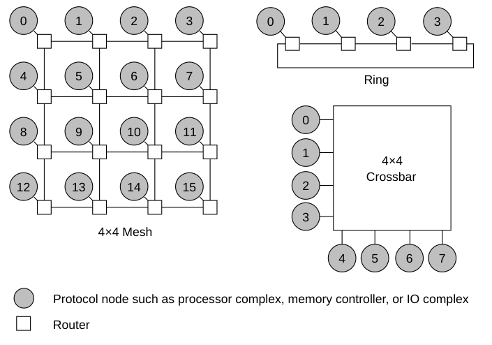
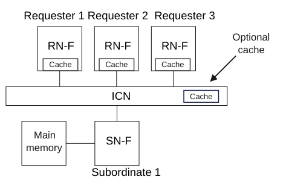
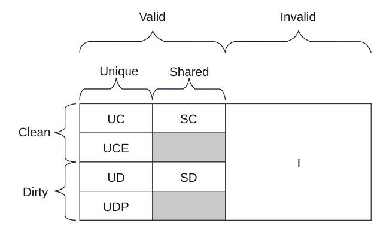
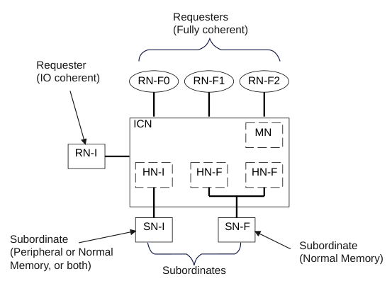
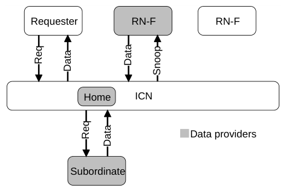

# B1 引言
本章介绍 CHI 架构以及本规范通篇使用的术语。本章包含以下各节：

- B1.1 架构概述
- B1.2 拓扑
- B1.3 术语
- B1.4 事务分类
- B1.5 一致性概述
- B1.6 组件命名
- B1.7 读数据源

### B1.1 架构概述

CHI 架构是一种可扩展的一致性集线器接口（hub interface）和片上互连，供多个组件使用。CHI 架构支持灵活的组件连接拓扑，由系统在性能、功耗和面积方面的需求驱动。

#### B1.1.1 组件

基于 CHI 的系统的组件可以包括：

- 独立处理器
- 处理器簇
- 图形处理器
- 内存控制器
- IO 桥
- PCIe 子系统
- 互连

#### B1.1.2 主要特性

该架构的主要特性包括：

- 可扩展架构，支持从小型系统到大型系统的模块化设计。
- 独立的层次化方法，由协议层、网络层和链路层组成，各层具有不同的功能。
- 基于数据包的通信。
- 所有事务由基于互连的归属节点（Home Node）处理，该节点协调所需的侦听、缓存和

内存访问。

- CHI 一致性协议支持：
- 64 字节缓存行的一致性粒度。
- 用于侦听扩展的侦听过滤器和基于目录的系统。
- 同时支持 MESI 和 MOESI 缓存模型，并可从任意缓存状态转发数据。
- 额外的部分和空缓存行状态。
- CHI 事务集包括：
- 经过增强的事务类型，可实现性能、面积和功耗高效的系统缓存

实现。

- 支持互连内的原子操作和同步。
- 支持高效执行独占访问（Exclusive access）。
- 用于高效移动和放置数据的事务，以便及时将数据移动到更接近

预期使用点的位置。

- 通过分布式虚拟内存（DVM）操作实现虚拟内存管理。
- 通过 Request Retry 和 Resource Planes 进行协议资源管理。
- 支持端到端服务质量（QoS）。
- 支持 Arm 内存标记扩展（MTE）。
- 支持 Arm 领域管理扩展（RME）。
- 可配置的数据宽度，以满足系统需求。
- 逐个事务提供 ARM TrustZone™ 支持。
- 采用生产者-消费者排序模型，为一致性写提供优化的事务流。
- 跨组件和互连的错误报告与传播，以实现系统的可靠性和完整性。
- 使用数据毒化（Data Poisoning）和按字节错误指示来处理子缓存行数据错误。
- 组件接口上的功耗感知信号：
- 支持 flit 级时钟门控。
- 用于时钟门控和电源门控控制的组件激活与去激活序列。
- 用于功耗和时钟控制的协议活动指示。

#### B1.1.3 架构层次

功能按以下各层进行分组：

- 协议
- 网络
- 链路

表 B1.1 描述了每一层的主要功能。

表 B1.1：CHI 架构的层次

层次 通信粒度 主要功能

协议 事务 协议层是 CHI 架构中最顶层的层。协议层的功能是：

- 在协议节点处生成和处理请求与响应。
- 定义包含缓存的协议节点处所允许的缓存状态转换。
- 定义每种请求类型的事务流。
- 管理协议级流控。

网络 数据包 网络层的功能是：

- 将协议消息打包（packetize）。
- 确定为将数据包经由互连路由到所需目的地所需的源和目标节点 ID，并将其添加到数据包中。

链路 flit 链路层的功能是：

- 在网络设备之间提供流控。
- 管理链路通道，以在网络中提供无死锁交换。

### B1.2 拓扑

CHI 架构基本上与拓扑无关。但是，本规范中包含了某些依赖拓扑的优化，以使实现更加高效。图 B1.1 给出了三个拓扑示例，用于展示可用的互连带宽与可扩展性选项的范围。

图 B1.1：互连拓扑示例

Crossbar Crossbar 拓扑易于构建，并天然提供一个有序且低时延的网络。Crossbar 拓扑适用于连线数量仍相对较少的情况。Crossbar 拓扑适用于节点数量较少的互连。

Ring Ring 拓扑在互连的布线效率与时延之间提供了折中。时延随环上节点数量的增加而线性增长。Ring 拓扑适用于中等规模的互连。

Mesh Mesh 拓扑以更多连线为代价提供更大的带宽。Mesh 拓扑模块化程度很高，通过增加更多的交换器行和列可以轻松扩展到更大的系统。Mesh 拓扑适用于较大规模的互连。

### B1.3 术语

以下术语在本规范中具有特定含义：

事务（Transaction）

一个事务执行单个操作。通常，一个事务要么从内存读取，要么向内存写入。

消息（Message）

消息是协议层术语，定义两个组件之间的交换粒度。例如：

- 请求
- 数据响应
- 侦听请求

单个数据响应消息可以由多个数据包组成。

数据包（Packet）

数据包是端点之间在互连上传输的粒度。一个消息可以由一个或多个数据包组成。例如，单个数据响应消息可以由 1 到 4 个数据包组成。每个数据包都包含路由信息，例如目的 ID 和源 ID，从而允许在互连上独立路由。

Flit

FLow control unIT（Flit）是最小的流控单元。一个数据包可以由一个或多个 flit 组成。给定数据包的所有 flit 在互连中都沿同一路径传输。

> **注意**
>
> 对于 CHI，所有数据包都由单个 flit 组成。

Phit

PHysical layer transfer unIT（Phit）是两个相邻网络设备之间的一次传输。一个 flit 可以由一个或多个 phit 组成。

> **注意**
>
> 对于 CHI，所有 flit 都由单个 phit 组成。

PoS

串行化点（Point of Serialization，PoS）是互连内的一个点，在该点确定来自不同代理的请求之间的顺序。

PoC

一致性点（Point of Coherence，PoC）是这样一个点：在该点上，所有能够访问内存的代理都保证能看到存储器位置的同一副本。在典型的基于 CHI 的系统中，PoC 是互连中的 HN-F。

PoE

加密点（Point of Encryption，PoE）是内存系统中的一个点，任何到达该点的写操作都已被加密。

PoP

持久化点（Point of Persistence，PoP）是内存系统中位于一致性点上或之后的一个潜在点，在该点上，对内存的写在系统断电时仍得以保持，并在受影响的内存位置恢复供电时被可靠地恢复。

PoDP

深度持久化点（Point of Deep Persistence，PoDP）是内存系统中的一个点，在该点即使电源与备用电池同时失效，数据仍得以保全。

PoPA

物理别名点（Point of Physical Aliasing，PoPA）是这样一个点：在该点上，对一个物理地址空间（PAS）中某个位置的更新对所有其他物理地址空间都可见。

PoPS

物理存储点（Point of Physical Storage，PoPS）是内存层次结构中距离 PE 或其他观察者最远的、写事务能够传播到的一个点，即内存。

下游缓存（Downstream cache）

下游缓存是从请求节点的视角定义的。某个请求的下游缓存是该请求使用 CHI 请求事务访问的缓存。请求节点可以发送带数据的请求，以将数据分配到下游缓存中。

请求方（Requester）

通过发出请求消息来启动事务的组件。术语请求方可用于独立发起事务的组件。术语请求方也可用于以下互连组件：该组件独立发出下游请求消息，或作为系统中正在发生的其他事务的副作用而发出下游请求消息。

完成方（Completer）

对从另一组件接收的事务作出响应的任何组件。完成方既可以是互连组件，例如归属节点或杂项节点，也可以是互连之外的组件，例如从属节点。

从属节点（Subordinate）

接收事务并适当地完成这些事务的代理。通常，从属节点是系统中最下游的代理。从属节点也可称为完成方或端点。

端点（Endpoint）

从属节点组件的另一个名称。端点是事务的最终目的地。

协议信用（Protocol Credit）

来自完成方的一种信用（credit）或保证，即其将接受某个事务。

链路层信用，L-Credit

一种信用（credit）或保证，即某个 flit 将在链路另一端被接受。L-Credit 是链路层上单跳的信用。

ICN

互连（Interconnect，ICN）是用于协议节点之间通信的 CHI 传输机制。互连可以包含一个特定于实现的（IMPLEMENTATION SPECIFIC）交换结构，其中的交换器以环、网、交叉开关或其他拓扑相连。互连还可以包含协议节点，例如归属节点和杂项节点。

IPA

中间物理地址（Intermediate Physical Address，IPA）。在两阶段地址转换中：

- 阶段 1 提供中间物理地址（IPA）。
- 阶段 2 提供物理地址（PA）。

RN

请求节点（Request Node，RN）向互连生成协议事务，包括读和写。

HN

归属节点（Home Node，HN）是互连内的一个节点，它接收来自请求节点的协议事务，完成所需的一致性操作，并返回响应。

SN

从属节点（Subordinate Node，SN）是接收来自归属节点的请求、完成所需操作并返回响应的节点。

MN

杂项节点（Miscellaneous 或 Misc Node，MN）是位于互连内的一个节点，它接收来自请求节点的 DVM 消息，完成所需操作，并返回响应。

IO 一致性节点（IO Coherent node）

除 Non-snoopable 请求之外还生成一部分 Snoopable 请求的请求节点。IO 一致性节点所生成的 Snoopable 请求不会使接收到的数据以一致性状态被缓存。因此，IO 一致性节点不接收任何侦听请求。

Snoopee

正在接收侦听的请求节点。

写无效协议（Write-Invalidate protocol）

一种协议，其中请求节点在写入系统中的共享缓存行时必须先使所有副本无效，然后才能继续执行该写操作。CHI 协议是一种写无效协议。

及时（In a timely manner）

协议无法定义某事件必须发生的绝对时间。一个足够空闲的系统无需显式动作即可推进并完成。

不适用（Inapplicable）

一种字段取值，表示该字段在消息处理中未被使用。

### B1.4 事务分类

本规范支持的协议事务及其主要分类见表 B1.2。

表 B1.2：事务分类

| 分类 | 支持的事务 |
| --- | --- |
| 读 | ReadNoSnp |
|  | ReadNoSnpSep |
|  | ReadOnce |
|  | ReadOnceCleanInvalid |
|  | ReadOnceMakeInvalid |
|  | ReadClean |
|  | ReadNotSharedDirty |
|  | ReadShared |
|  | ReadUnique |
|  | ReadPreferUnique |
|  | MakeReadUnique |
| Dataless | CleanUnique |
|  | MakeUnique |
|  | Evict |
|  | StashOnceUnique |
|  | StashOnceSepUnique |
|  | StashOnceShared |
|  | StashOnceSepShared |
|  | CleanShared |
|  | CleanSharedPersist |
|  | CleanSharedPersistSep |
|  | CleanInvalid |
|  | CleanInvalidPoPA |
|  | CleanInvalidStorage |
|  | MakeInvalid |
| 写 | WriteNoSnpPtl |
|  | WriteNoSnpFull |
|  | WriteNoSnpZero |
|  | WriteNoSnpDef |
|  | WriteUniquePtl |
|  | 下页续 |

表 B1.2 – 续上页

| 分类 | 支持的事务 |
| --- | --- |
|  | WriteUniqueFull |
|  | WriteUniqueZero |
|  | WriteUniquePtlStash |
|  | WriteUniqueFullStash |
|  | WriteBackPtl |
|  | WriteBackFull |
|  | WriteCleanFull |
|  | WriteEvictFull |
|  | WriteEvictOrEvict |
| 组合写 | WriteNoSnpPtlCleanInv |
|  | WriteNoSnpPtlCleanSh |
|  | WriteNoSnpPtlCleanShPerSep |
|  | WriteNoSnpPtlCleanInvPoPA |
|  | WriteNoSnpFullCleanInv |
|  | WriteNoSnpFullCleanSh |
|  | WriteNoSnpFullCleanShPerSep |
|  | WriteNoSnpFullCleanInvPoPA |
|  | WriteNoSnpFullCleanInvStrg |
|  | WriteUniquePtlCleanSh |
|  | WriteUniquePtlCleanShPerSep |
|  | WriteUniqueFullCleanSh |
|  | WriteUniqueFullCleanShPerSep |
|  | WriteUniqueFullCleanInvStrg |
|  | WriteBackFullCleanInv |
|  | WriteBackFullCleanSh |
|  | WriteBackFullCleanShPerSep |
|  | WriteBackFullCleanInvPoPA |
|  | WriteBackFullCleanInvStrg |
|  | WriteCleanFullCleanSh |
|  | WriteCleanFullCleanShPerSep |
| 原子操作 | AtomicStore |
|  | AtomicLoad |
|  | AtomicSwap |
|  | 下页续 |

表 B1.2 – 续上页

| 分类 | 支持的事务 |
| --- | --- |
|  | AtomicCompare |
| 其他 | DVMOp |
|  | PrefetchTgt |
|  | PCrdReturn |
| 侦听 | SnpOnceFwd |
|  | SnpOnce |
|  | SnpStashUnique |
|  | SnpStashShared |
|  | SnpCleanFwd |
|  | SnpClean |
|  | SnpNotSharedDirtyFwd |
|  | SnpNotSharedDirty |
|  | SnpSharedFwd |
|  | SnpShared |
|  | SnpUniqueFwd |
|  | SnpUnique |
|  | SnpPreferUniqueFwd |
|  | SnpPreferUnique |
|  | SnpUniqueStash |
|  | SnpCleanShared |
|  | SnpCleanInvalid |
|  | SnpMakeInvalid |
|  | SnpMakeInvalidStash |
|  | SnpQuery |
|  | SnpDVMOp |

表 B1.3 给出了事务的表示形式。

表 B1.3：事务的表示形式

| 规范中的用法 | 统指 |
| --- | --- |
| ReadOnce* | ReadOnce、ReadOnceCleanInvalid 和 ReadOnceMakeInvalid |
| WriteNoSnp | WriteNoSnpPtl 和 WriteNoSnpFull |
| WriteUnique | WriteUniquePtl、WriteUniqueFull、WriteUniquePtlStash 和 WriteUniqueFullStash |
| WriteNoSnpPtl* | WriteNoSnpPtl、WriteNoSnpPtlCleanInv、WriteNoSnpPtlCleanInvPoPA、WriteNoSnpPtlCleanSh 和 WriteNoSnpPtlCleanShPerSep |
| WriteNoSnp*CMO | WriteNoSnpPtlCleanInv、WriteNoSnpPtlCleanInvPoPA、WriteNoSnpPtlCleanSh、WriteNoSnpPtlCleanShPerSep、WriteNoSnpFullCleanInv、WriteNoSnpFullCleanInvPoPA、WriteNoSnpFullCleanInvStrg、WriteNoSnpFullCleanSh 和 WriteNoSnpFullCleanShPerSep |
| WriteUnique*CMO | WriteUniquePtlCleanSh、WriteUniquePtlCleanShPerSep、WriteUniqueFullCleanSh、WriteUniqueFullCleanShPerSep 和 WriteUniqueFullCleanInvStrg |
| WriteBack*CMO | WriteBackFullCleanInv、WriteBackFullCleanSh、WriteBackFullCleanShPerSep、WriteBackFullCleanInvPoPA 和 WriteBackFullCleanInvStrg |
| WriteBack | WriteBackPtl 和 WriteBackFull |
| StashOnce | StashOnceUnique 和 StashOnceShared |
| StashOnceSep | StashOnceSepUnique 和 StashOnceSepShared |
| StashOnce* | StashOnce 和 StashOnceSep |
| StashOnce*Shared | StashOnceShared 和 StashOnceSepShared |
| StashOnce*Unique | StashOnceUnique 和 StashOnceSepUnique |
| CleanSharedPersist* | CleanSharedPersist 和 CleanSharedPersistSep |
| Atomic* | AtomicStore、AtomicLoad、AtomicSwap、AtomicCompare |
| SnpStash* | SnpStashUnique 和 SnpStashShared |
| DBIDResp* | DBIDResp 和 DBIDRespOrd |

### B1.5 一致性概述

硬件一致性使系统组件能够共享内存，而无需软件执行缓存维护来维持一致性。

如果两个组件对同一内存位置的写入能被所有组件以相同顺序观察到，则这些内存区域是一致的。

#### B1.5.1 一致性模型

图 B1.2 展示了一个示例一致性系统，其中包含三个请求方（Requester）组件，每个组件都带有本地缓存和一致性协议节点。该协议允许同一内存位置的缓存副本驻留在一个或多个请求方组件的本地缓存中。

图 B1.2：一致性模型示例

一致性协议强制要求：当某个地址位置发生存储时，同一数据值的副本不得超过一份。一致性协议确保所有请求方在任何给定地址位置都能观察到正确的数据值。每次对某个位置进行存储后，其他请求方可以为自己的本地缓存获取该数据的新副本，从而允许多个缓存副本存在。

缓存行（cache line）定义为 64 字节对齐的内存区域。所有一致性均在缓存行粒度上维护。

仅当一个内存位置的副本不再被任何缓存持有时，才要求更新主存。一致性协议并不要求主存始终是最新的。

> **注意**
>
> 尽管并非强制要求，但也允许在缓存副本仍然存在时更新主存。

一致性协议使请求方组件能够确定某个缓存行是特定内存位置的唯一副本，还是存在同一位置的其他副本。一致性协议确保：

- 如果某个缓存行是唯一副本，则请求方组件可以修改该缓存行的值，而无需通知系统中的任何其他请求方组件。
- 如果某个缓存行也可能存在于另一个缓存中，则请求方组件必须使用适当的事务通知其他缓存。

#### B1.5.2 缓存状态模型

当组件访问某个缓存行时，协议通过定义缓存状态来确定是否需要执行某项操作。每个缓存状态基于以下缓存行特征：

有效（Valid）、无效（Invalid） 当为 Valid 时，缓存行存在于缓存中。当为 Invalid 时，缓存行不存在于缓存中。

唯一（Unique）、共享（Shared） 当为 Unique 时，缓存行仅存在于该 Unique 缓存中。当为 Shared 时，缓存行可以存在于多个缓存中。并不保证该缓存行存在于多个缓存中。

干净（Clean）、脏（Dirty） 当为 Clean 时，缓存没有更新主存的责任。当为 Dirty 时，缓存行相对于主存已被修改。Dirty 缓存必须确保主存最终得到更新。

满（Full）、部分（Partial）、空（Empty） 满缓存行（Full cache line）的所有字节均有效。部分缓存行（Partial cache line）可以有一部分字节有效，其中"一部分"包括零个或全部字节。空缓存行（Empty cache line）没有任何字节有效。

图 B1.3 展示了七状态缓存模型。B4.1 缓存行状态给出了每个缓存状态的更多信息。

除 Partial 或 Empty 之外的有效缓存状态名均视为 Full。在图 B1.3 中，UC、UD、SC 和 SD 均为 Full 缓存行状态。

图 B1.3：缓存状态模型

### B1.6 组件命名

CHI 协议中的组件按节点类型进行分类：

RN 请求节点（Request Node）。生成发往互连的协议事务，包括读和写。请求节点进一步分类为：

RN-F 完全一致性请求节点（Fully Coherent Request Node）：

- 包含硬件一致性缓存。
- 允许生成协议定义的所有事务，但 ReadNoSnpSep 除外。
- 支持所有 Snoop 事务。

RN-D 支持 DVM 的 IO 一致性请求节点（IO Coherent Request Node with DVM support）：

- 不包含硬件一致性缓存。
- 接收 DVM 事务。
- 生成协议定义的事务的一个子集。更多详细信息见 C3.1 请求节点子集。

RN-I IO 一致性请求节点（IO Coherent Request Node）：

- 不包含硬件一致性缓存。
- 不接收 DVM 事务。
- 生成协议定义的事务的一个子集。更多详细信息见 C3.1 请求节点子集。
- 不需要侦听功能。

HN 归属节点（Home Node）。位于互连内部的节点，从请求节点接收协议事务。归属节点进一步分类为：

HN-F 完全一致性归属节点（Fully Coherent Home Node）：

- 预期接收除 DVMOp 外的所有请求类型。
- 包含一致性点（Point of Coherence，PoC），它通过对所需的 RN-F 节点进行侦听来管理一致性，针对一个事务汇总 Snoop 响应，并向发起请求的请求节点发送单个响应。
- 预期作为串行化点（Point of Serialization，PoS），管理内存请求之间的顺序。
- 可以包含目录或侦听过滤器，以减少冗余侦听。

> **注意**
>
> 与实现相关（IMPLEMENTATION SPECIFIC），可以包含集成的互连缓存。

HN-I 非一致性归属节点（Non-coherent Home Node）：

- 处理协议定义的请求类型的一个有限子集。
- 不包含 PoC，且无法处理可侦听（Snoopable）请求。在收到可侦听请求时，HN-I 必须回复符合协议的消息。
- 预期作为 PoS，管理针对 IO 子系统的 IO 请求之间的顺序。

MN 杂项节点（Miscellaneous Node）。从请求节点接收 DVM 事务，完成所需操作，并返回响应。

SN 从属节点（Subordinate Node）。从归属节点接收请求，完成所需操作，并返回响应。从属节点进一步分类为：

SN-F 从属节点。

- 用于 Normal 内存。
- 可以处理不可侦听（Non-snoopable）的 Read、Write 和 Atomic 请求（包括它们的独占变体）以及缓存维护操作（Cache Maintenance Operation，CMO）请求。更多详细信息见 C3.2 从属节点子集。

SN-I 从属节点。

- 用于外设或 Normal 内存。
- 可以处理不可侦听的 Read、Write 和 Atomic 请求（包括它们的独占变体）以及 CMO 请求。更多详细信息见 C3.2 从属节点子集。

图 B1.4 展示了通过互连连接的各种协议节点类型。

图 B1.4：协议节点示例

### B1.7 读数据源

在基于 CHI 的系统中，读请求可以从不同的数据源获取数据。图 B1.5 显示了这些数据源：

- 互连内部的高速缓存
- 从属节点
- 对等 RN-F

图 B1.5：读请求可能的数据提供者

归属节点的一个选项是要求 RN-F 或从属节点仅将数据返回给归属节点。归属节点接着将接收到的数据副本转发给请求方。如果数据提供者能够将数据响应直接转发给请求方，而不是经由归属节点转发，则可以去除读事务流程中获取数据的一个跳数。

可以使用若干技术来减少完成一个事务所需要的跳数。跳数的减少可带来读写延迟的降低以及互连带宽利用率的提升。这些技术分类如下：

Direct Memory Transfer (DMT) 定义允许从属节点将数据直接发送给请求方的特性。

Direct Cache Transfer (DCT) 定义允许对等 RN-F 将数据直接发送给请求方的特性。在 DCT 读事务流程中，数据提供者必须通知归属节点数据已发送给请求方。在某些情况下，数据提供者还必须向归属节点发送一份数据副本。

Direct Write-data Transfer (DWT) 定义允许发起请求的请求节点将写数据直接发送给从属节点的特性。

第 B2 章
