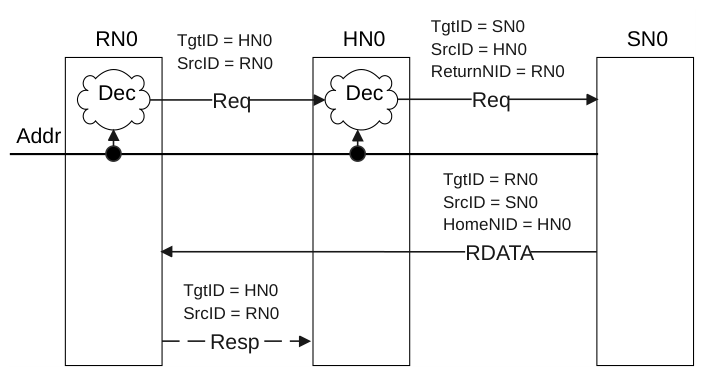
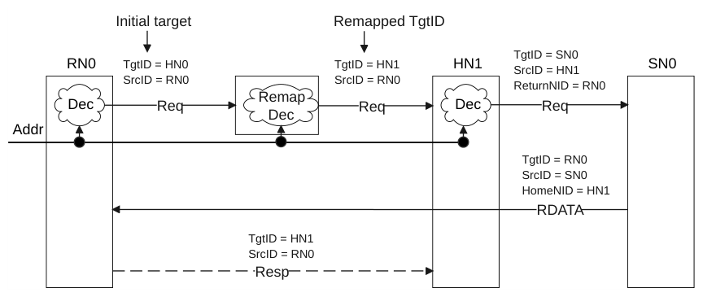
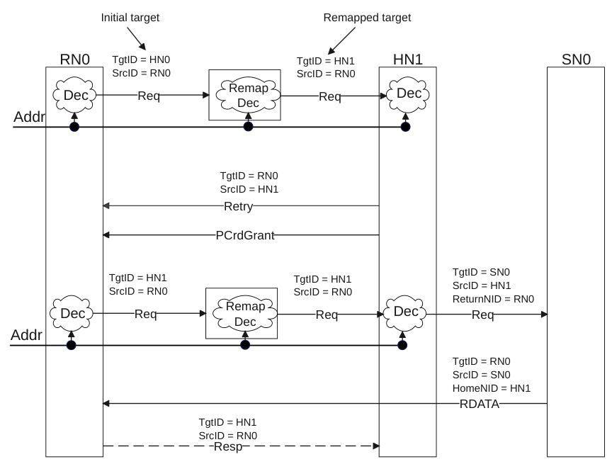

# B3 Network Layer
本章描述用于确定目的节点的节点 ID 所需的网络层。它包含以下各节：

- B3.1 System Address Map, SAM
- B3.2 Node ID
- B3.3 TgtID determination
- B3.4 Network layer flow examples

### B3.1 System Address Map, SAM

Requester 必须具有一个 System Address Map（SAM），以确定请求的 TgtID。Requester 可以是 Request Node 或 Home Node。SAM 的作用范围可以简单到为所有发出的请求提供一个固定的节点 ID 值。

SAM 的确切格式与结构是 IMPLEMENTATION DEFINED 的，不属于本规范的范围。

SAM 必须提供对整个地址空间的完整译码。建议将任何不对应于物理组件的地址发送给能够提供适当错误响应的代理。

### B3.2 Node ID

连接到互连上的某个 Port 的每个组件都被分配一个节点 ID，用于标识通过互连通信的数据包的源和目的地。一个 Port 可以被分配多个节点 ID。一个节点 ID 值只能分配给单个 Port。

NodeID 字段的宽度可在 7 到 16 位之间配置，其值由 NodeID_Width 属性确定。

对于给定的实现，该宽度可以配置为该范围内的任意固定值，并且该值必须在所有 NodeID 字段中保持一致。

为系统中的每个节点定义并分配节点 ID 是 IMPLEMENTATION DEFINED 的，不属于本规范的范围。

### B3.3 TgtID 的确定

本节描述不同消息类型的 TgtID 是如何确定的。本节包含以下小节：

- B3.3.1 请求消息的 TgtID 确定
- B3.3.2 响应消息的 TgtID 确定
- B3.3.3 侦听请求消息的 TgtID 确定

#### B3.3.1 请求消息的 TgtID 确定

对于来自 Request Node 的请求中的 TgtID 映射，要求 SAM 逻辑存在于 Request Node 或互连中。在互连中实现的情况下，TgtID 可以在由 Request Node 提供的请求包中被重新映射。

Request 消息的 TgtID 使用 SAM 逻辑按以下方式确定。

除 PCrdReturn 之外：

- 如果请求未使用预分配信用（pre-allocated credit），则 TgtID 由以下方式确定：
- 对于 DVMOp，由 Opcode 确定。
- 对于所有其他请求，由地址到节点 ID 的映射确定。

PrefetchTgt 使用的地址到节点 ID 映射器与其他请求不同。来自同一 Request Node、指向同一地址的两个请求，若其中一个是 PrefetchTgt，则它们的目标节点不同。PrefetchTgt 始终以 Subordinate Node 为目标。来自 Request Node 的使用地址到节点 ID 映射器的所有其他请求均以 Home Node 为目标。

- 如果请求使用预分配信用，则 Request 的 TgtID 必须取自以下任一者：作为对原始 Request 消息的响应而提供的

RetryAck 的 SrcID，或原始请求的 TgtID。

对于 PCrdReturn：

- 由 Request Node 提供的 TgtID 必须与先前的 PCrdGrant 中所包含的 SrcID 匹配，该 PCrdGrant

提供了正在被归还的信用。

Request Node 必须预期互连会重新映射请求的 TgtID。

对于来自 Request Node 的事务，除目标为 SN-F 的 PrefetchTgt 之外，可侦听事务预期以 HN-F 为目标，不可侦听事务以 HN-I 或 HN-F 为目标。可侦听事务以 HN-I 为目标也是合法的，例如由于软件编程错误所致。在这种情况下，HN-I 需要以符合协议的方式响应该事务，但不保证一致性。

Home Node 也可以使用地址映射逻辑来确定每个请求的目标 Subordinate Node ID。

#### B3.3.2 响应消息的 TgtID 确定

响应包是作为所接收消息的结果而发出的。响应包中的 TgtID 必须与导致该响应被发送的所接收消息中的 SrcID、HomeNID、ReturnNID 或 FwdNID 之一匹配。

表 B3.1 列出了每种 Response 消息类型其响应包 TgtID 的来源，以及所接收消息中决定该 TgtID 的字段。

表 B3.1：响应包 TgtID 的来源

| Response message | 从 Home Node 获取的 TgtID | Subordinate Node | Request Node |
| --- | --- | --- | --- |
| RetryAck | Request.SrcID | Request.SrcID | - |
| PCrdGrant | Request.SrcID | Request.SrcID | - |
| ReadReceipt | Request.SrcID | Request.SrcID | - |
| RespSepData | Request.SrcID 或 SnpResp*.SrcIDa | - | - |
| Comp | Request.SrcID | Request.SrcID | - |
| CompCMO | Request.SrcID | Request.SrcID | - |
| DataSepResp | Request.SrcID 或 SnpResp*.SrcIDa | Request.ReturnNID | - |
| CompData | Request.SrcID 或 SnpResp*.SrcIDa | Request.ReturnNID | Snoop.FwdNID |
| CompAck（读） | - | - | Comp.SrcID 或 RespSepData.SrcID 或 CompData.HomeNID |
| CompAck（写） | - | - | Comp.SrcID 或 DBIDResp*.SrcID 或 CompDBIDResp.SrcID |
| CompDBIDResp | Request.SrcID | Request.SrcIDb |  |
| DBIDResp | Request.SrcID | 若 Request.DoDWT == 0 则：Request.SrcID，或若 Request.DoDWT == 1 则：Request.ReturnNID | - |
| DBIDRespOrd | Request.SrcID | - | - |
| WriteData | - | - | DBIDResp*.SrcID 或 CompDBIDResp.SrcID |
| NonCopyBackWriteDataCompAck | - | - | Comp.SrcID 或 DBIDResp*.SrcID 或 CompDBIDResp.SrcID |
| Persist | Request.SrcID | Request.ReturnNID | - |
| CompPersist | Request.SrcID | Request.SrcIDb | - |
| StashDone | Request.SrcID | - | - |
| CompStashDone | Request.SrcID | - | - |
| TagMatch | Request.SrcID | Request.ReturnNID | - |
| SnpResp*c | - | - | Snoop.SrcID |

a 对于 Data Pull 请求，Snoop 响应可以是 SnpResp 或 SnpRespData 或 SnpRespDataPtl。 b 仅当 Request.SrcID = Request.ReturnNID 时才允许此响应，包括 Request.DoDWT = 1 的情况。 c SnpResp、SnpRespData、SnpRespDataPtl、SnpRespFwded 和 SnpRespDataFwded。

#### B3.3.3 侦听请求消息的 TgtID 确定

侦听请求不包含 TgtID。协议未定义用于寻址并向目标发送 Snoop request 的架构机制。该机制预期为实现特定（IMPLEMENTATION SPECIFIC）的，因此不在本规范的范围之内。

### B3.4 网络层流示例

本节展示网络层的各种事务流。它包含以下小节：

- B3.4.1 简单流
- B3.4.2 基于互连的 SAM 的流
- B3.4.3 基于互连的 SAM 且带 Retry 请求的流

以下各图中包含术语“Dec”，它表示 Decode。

#### B3.4.1 简单流

图 B3.1 是一个简单事务流的示例，展示了如何为请求和响应确定 TgtID。

图 B3.1：不进行重映射时的 TgtID 分配

图 B3.1 中不进行重映射时的 TgtID 分配步骤如下：

1. RN0 使用 RN0 内部的 SAM 发送一个 TgtID 为 HN0 的请求。
- 互连不对节点 ID 进行重映射。
2. HN0 查询内部 SAM 以确定目标 Subordinate Node。
3. SN0 接收该请求并发送数据响应。
- 数据响应数据包的 TgtID 由请求中的 ReturnNID 推导得出。
4. RN0 接收来自 SN0 的数据响应。
5. 如有必要，RN0 发送 TgtID 为 HN0 的 CompAck 响应，该 TgtID 由数据响应数据包中的 HomeNID 推导得出，以完成事务。

#### B3.4.2 基于互连的 SAM 的流

图 B3.2 展示了在互连中对 TgtID 进行重映射的情况。

> **注意**
>
> 仅对来自 Request Node 的请求的 TgtID 进行重映射。事务流中所有其他数据包中的 TgtID 均以与 B3.4.1 简单流类似的方式确定。

图 B3.2：带重映射逻辑的 TgtID 分配

图 B3.2 中带重映射逻辑的 TgtID 分配步骤如下：

1. RN0 使用 RN0 内部的 SAM 发送一个 TgtID 为 HN0 的请求。
2. 互连将请求的 TgtID 从 HN0 重映射为 HN1。SrcID 保持设置为原始请求方 RN0。
3. HN1 查询内部 SAM 以确定目标 Subordinate Node。ReturnNID 被设置为与原始 Requester（RN0）匹配。
4. SN0 接收该请求并发送数据响应。
- 数据响应数据包的 TgtID 由请求中的 ReturnNID 推导得出，其中 HomeNID 被设置为与

重映射后的归属节点匹配。

5. RN0 接收来自 SN0 的数据响应。
6. 如有必要，RN0 发送 TgtID 为 HN1 的 CompAck 响应，该 TgtID 由数据响应数据包中的 HomeNID 推导得出，以完成事务。

#### B3.4.3 基于互连的 SAM 且带 Retry 请求的流

图 B3.3 展示了请求被重试的情况。

图 B3.3：TgtID 的重映射与被重试的请求

图 B3.3 中对 TgtID 进行重映射并重试请求的步骤如下：

1. 互连将 RN0 提供的 TgtID 重映射为 HN1。
2. 该请求收到 RetryAck 响应。
- RetryAck 与 PCrdGrant 响应的 TgtID 信息取自所接收请求中的 SrcID。
3. 一旦收到 RetryAck 和 PCrdGrant 两个响应，RN0 就重新发送该请求。
- 重试请求中的 TgtID 与所收到 RetryAck 中的 SrcID 或原始请求中的 TgtID

相同。该 TgtID 必须再次经过重映射逻辑。

4. 事务流中其余数据包获取 TgtID 的方式与 B3.4.2 基于互连的 SAM 的流类似。

第 B4 章
