# B5 互连协议流程
本章介绍不同事务类型的互连协议流程以及互连冒险情况。协议流程使用时间-空间图（Time-Space diagram）进行说明。本章包含以下小节：

- B5.1 读事务流程
- B5.2 无数据事务流程
- B5.3 写事务流程
- B5.4 Atomic 事务流程
- B5.5 暂存事务流程
- B5.6 冒险处理示例

关于说明协议流程所用约定的详细信息，请参见图 2。

在以下事务流程图中：

- 存在多个一致性请求节点、一个 HN-F 和一个 SN-F。
- 如果 HN-F 收到多个数据响应，即一个来自被侦听的 RN-F，另一个来自 SN-F，则转发给请求方的数据以粗体突出显示。
- HN-F 处没有互连缓存。这导致发往 HN-F 的所有请求都会向 SN-F 发起请求。

### B5.1 读事务流程

本节给出读事务的互连协议流程示例。

#### B5.1.1 使用 DMT 且无侦听的读事务

对于无侦听的读事务，建议使用 DMT。

图 B5.1 展示了使用 ReadShared 事务的 DMT 事务流示例。

在图 B5.1 中，不需要 SN-F 向 HN-F 返回响应，因为请求方发出的 CompAck 用于在归属节点释放该请求。

图 B5.1：无侦听的 DMT 读事务示例

图 B5.1 中 ReadShared 事务流的步骤如下：

1. RN-F 向 HN-F 发送 ReadShared 请求。
2. HN-F 向 SN-F 发送 ReadNoSnp 请求。
3. SN-F 使用 CompData_UC 直接向 RN-F 发送数据响应。
4. RN-F 向 HN-F 发送 CompAck，因为该请求是 ReadShared，需要 CompAck 才能完成事务。

#### B5.1.2 使用 DMT 且带侦听的读事务

对于带侦听且数据来自内存的读事务，建议使用 DMT。

图 B5.2 展示了使用 ReadShared 事务的 DMT 事务流示例。

不需要 SN-F 向 HN-F 返回响应，因为请求方发出的 CompAck 用于在归属节点释放该请求。

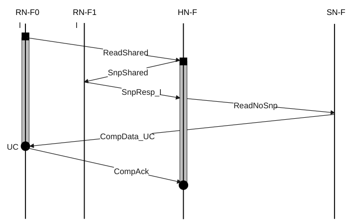

图 B5.2：带侦听且数据来自内存的 DMT 读事务示例

图 B5.2 中 ReadShared 事务流的步骤如下：

1. RN-F0 向 HN-F 发送 ReadShared 请求。
2. HN-F 向 RN-F1 发送 SnpShared 请求。RN-F1 向 HN-F 返回 SnpResp_I 响应。
3. HN-F 在收到来自 RN-F1 的侦听响应后，向 SN-F 发送 ReadNoSnp 请求。这保证 RN-F1 未以数据作出响应。
4. SN-F 使用 CompData_UC 直接向 RN-F0 发送数据响应。
5. RN-F0 向 HN-F 发送 CompAck，因为该请求是 ReadShared，需要 CompAck 才能完成事务。

#### B5.1.3 使用 DCT 的读事务

对于带侦听且数据来自其他请求节点缓存的读事务，建议使用 Direct Cache Transfer (DCT)。

##### B5.1.3.1 从 UC 状态缓存行进行的 DCT

图 B5.3 展示了一个 DCT 事务的示例流程。请求方为 RN-F0，转发缓存位于 RN-F1。

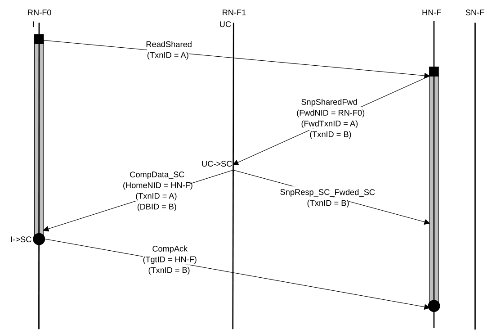

图 B5.3：从 UC 状态缓存行进行的 DCT

图 B5.3 中 DCT 事务流的步骤如下：

1. RN-F0 向 HN-F 发送 ReadShared 请求。
2. HN-F 向 RN-F1 发送 SnpSharedFwd，即 Forwarding snoop 请求。
3. RN-F1 向 RN-F0 转发 CompData_SC 响应。其 TxnID 与原始 ReadShared 请求相同。
4. RN-F1 还向 HN-F 发送 SnpResp_SC_Fwded_SC 侦听响应。RN-F1 的缓存行状态从 UC 转变为 SC。
5. 在收到 CompData_SC 响应后，RN-F0 的缓存行状态从 I 转变为 SC，并且 RN-F0 向 HN-F 发送 CompAck 响应。

> **注意**
>
> 由于 CompData 和 SnpResp 在不同通道上发送，DCT 事务流中的步骤 3 和步骤 4 可以以任意顺序发生。

##### B5.1.3.2 DCT 事务中的双数据返回

图 B5.4 展示了一个 DCT 事务流示例，该事务流将数据发送到 HN-F，并将数据转发给 RN-F0。

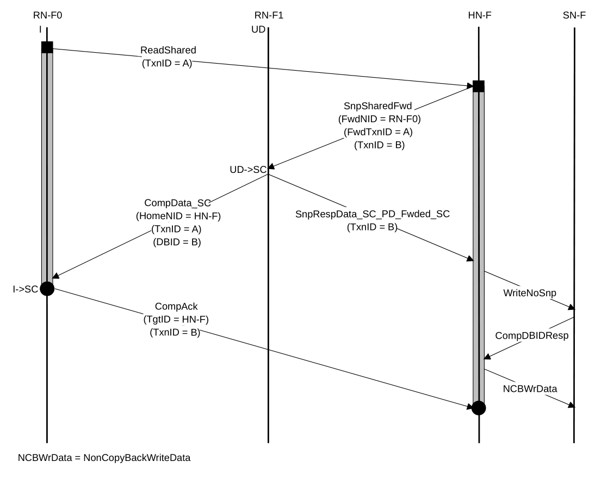

图 B5.4：DCT 事务中的双数据返回

图 B5.4 中 DCT 事务流的步骤如下：

1. RN-F0 向 HN-F 发送 ReadShared 请求。
2. HN-F 向 RN-F1 发送 SnpSharedFwd 侦听请求。
3. RN-F1 向 RN-F0 发送 CompData_SC 响应。其 TxnID 与原始 ReadShared 请求相同。RN-F0 的缓存行从 I 转变为 SC。
4. RN-F1 还向 HN-F 发送 SnpRespData_SC_PD_Fwded_SC 侦听响应，该响应包含缓存行的一份副本，并将 Dirty 缓存行的责任移交给 HN-F。RN-F1 的缓存行从 UD 转变为 SC。
5. HN-F 向 SN-F 发送 WriteNoSnp 请求。
6. SN-F 以 CompDBIDResp 响应 HN-F，以请求数据。
7. HN-F 向 SN-F 发送 NCBWrData。
8. RN-F0 在收到数据响应后发送 CompAck。

#### B5.1.4 不带 DMT 或 DCT 的 Read 事务

图 B5.5 给出了一个使用 ReadNoSnp 事务且不带 DMT 的流程示例。在图 B5.5 中，ReadNoSnp 在原始请求中置位了 ExpCompAck。

该请求不产生任何侦听，数据来自 HN-F 的一次内存读的响应。

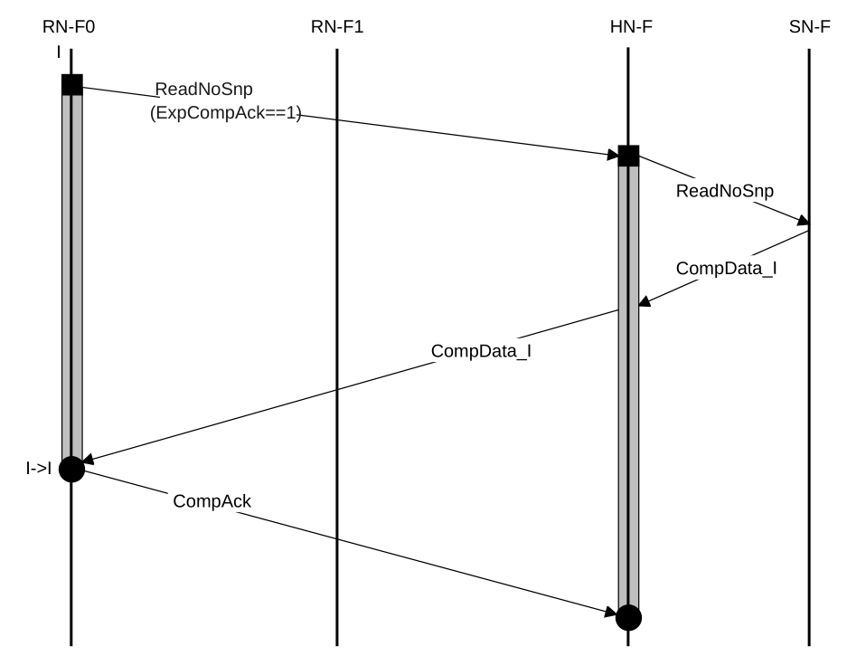

图 B5.5：ReadNoSnp 事务流程

图 B5.5 中 ReadNoSnp 事务流程的步骤如下：

1. RN-F0 发起一个 ReadNoSnp 事务，其中 ExpCompAck 置为 1。
2. HN-F 接收并分配该请求。

> **注意**
>
> 由于该请求被识别为不可侦听（Non-snoopable）请求类型，HN-F 不发送侦听。

3. HN-F 向 SN-F 发送一个 ReadNoSnp。
4. SN-F 向 HN-F 返回 CompData_I。
5. HN-F 随后把数据返回给 RN-F0。

> **注意**
>
> 如果原始 ReadNoSnp 请求中的 ExpCompAck 为 0，则 HN-F 此时本可以释放该请求。

6. RN-F0 释放该请求，并向 HN-F 发送 CompAck。
7. HN-F 接收 CompAck 响应并释放该请求。

#### B5.1.5 带部分数据的侦听响应且无内存更新的 Read 事务

这类流程的一个示例是 ReadUnique 事务。

图 B5.6 给出了该事务流程。

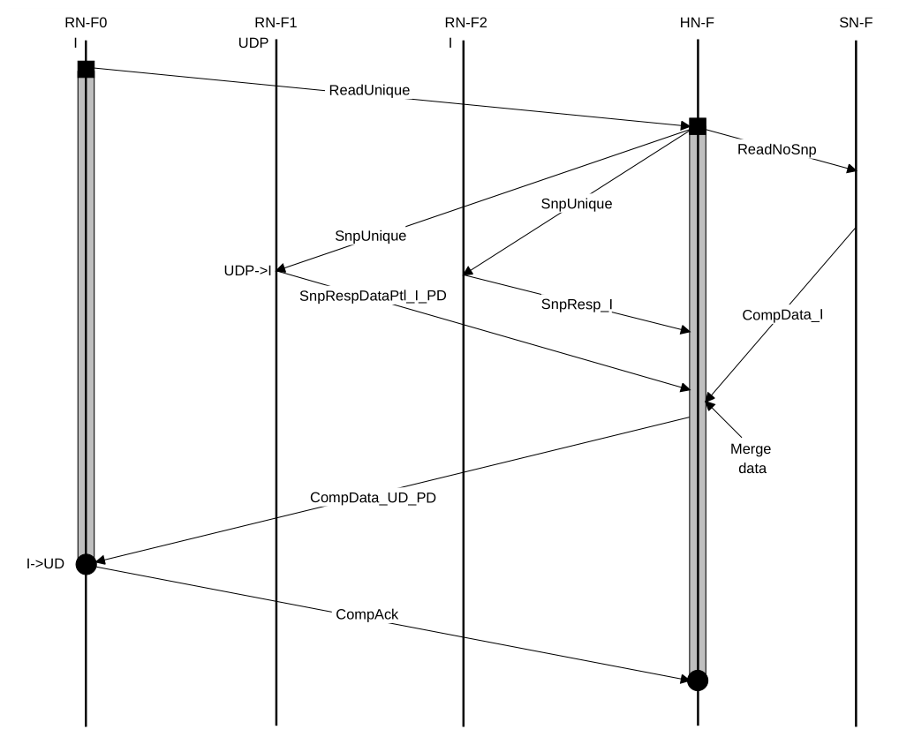

图 B5.6：带部分数据侦听响应的 ReadUnique

图 B5.6 中带部分数据侦听响应的 ReadUnique 事务流程的步骤如下：

1. RN-F0 向 HN-F 发送 ReadUnique 请求。
2. HN-F 向 SN-F 发送 ReadNoSnp 请求，并向 RN-F1 和 RN-F2 发送 SnpUnique 请求。
3. RN-F1 将该缓存行从 UDP 转换为 I，并向 HN-F 返回 SnpRespDataPtl_I_PD。RN-F2 向 HN-F 返回 SnpResp_I。与此同时，SN-F 向 HN-F 返回 CompData 响应。HN-F 把从 SN-F 返回的数据与从 RN-F1 收到的部分数据合并。
4. HN-F 向 RN-F0 发送 CompData_UD_PD。RN-F0 的缓存行状态从 I 转换为 UD。
5. RN-F0 向 HN-F 发出 CompAck 响应，以表明事务完成。

#### B5.1.6 带部分数据的侦听响应且带内存更新的 Read 事务

这类流程的一个示例是 ReadClean 事务。

图 B5.7 给出了该事务流程。

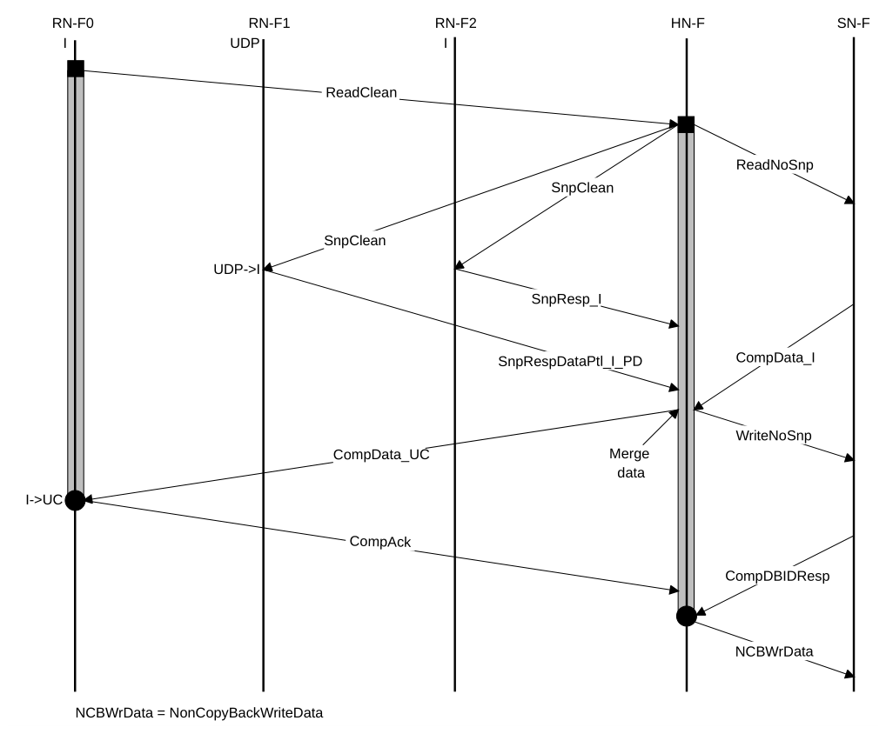

图 B5.7：带部分数据侦听响应的 ReadClean

图 B5.7 中带部分数据侦听响应的 ReadClean 事务流程的步骤如下：

1. RN-F0 向 HN-F 发送 ReadClean 请求。
2. HN-F 向 SN-F 发送 ReadNoSnp 请求，并向 RN-F1 和 RN-F2 发送 SnpClean 请求。RN-F1 的缓存行状态从 UDP 转换为 I。
3. RN-F1 返回 SnpRespDataPtl_I_PD，RN-F2 向 HN-F 返回 SnpResp_I。与此同时，SN-F 向 HN-F 返回 CompData_I 响应。这会合并数据。
4. HN-F 向 RN-F0 发送 CompData_UC，并向 SN-F 发送 WriteNoSnp。RN-F0 的缓存行状态从 I 转换为 UC。
5. RN-F0 向 HN-F 发出 CompAck 响应，以表明事务完成。
6. SN-F 向 HN-F 发出 CompDBIDResp。
7. HN-F 向 SN-F 发送 NCBWrData。

#### B5.1.7 带归属节点提前释放的 ReadOnce* 和 ReadNoSnp

图 B5.8 给出了一个无序 ReadOnce 请求的优化流程。

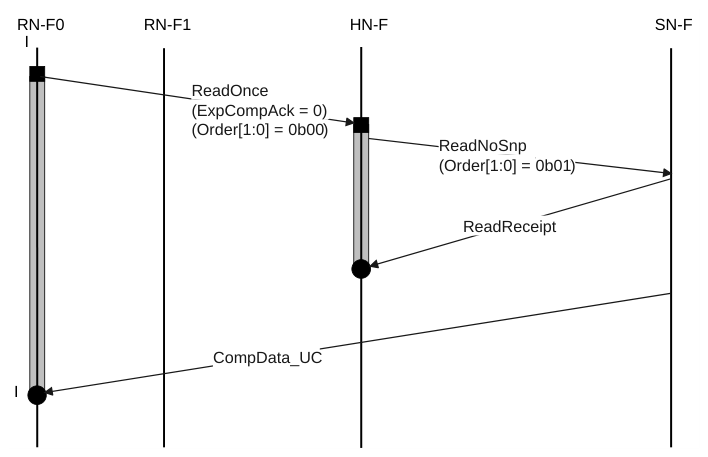

图 B5.8：针对无序 ReadOnce 的 DMT 优化

图 B5.8 中经优化的 ReadOnce 事务流程的步骤如下：

1. RN-F0 向 HN-F 发送一个无序 ReadOnce 请求，其中 Order[1:0] 置为 0b00。
2. HN-F 向 SN-F 发送一个 DMT ReadNoSnp 请求，其中 Order[1:0] 置为 0b01。
3. SN-F 向归属节点发送 ReadReceipt。
4. HN-F 在收到 ReadReceipt 响应后释放该请求。
5. SN-F 直接向 RN-F0 发送 CompData_UC。

> **注意**
>
> 在不需要 CompAck 的情况下，从归属节点向从属节点使用 ReadNoSnp 事务，可避免需要从归属节点向请求方发送 RespSepData 响应。

#### B5.1.8 带 DMT 且 Non-data 与 Data-only 响应分离的 ReadNoSnp 事务

图 B5.9 给出了一个带 Non-data 与 Data-only 响应分离的 DMT 事务流示例。

在本示例中，不存在顺序要求，HN-F 一旦收到 ReadReceipt 即可释放该请求，无需等待来自 RN-F 的 CompAck。

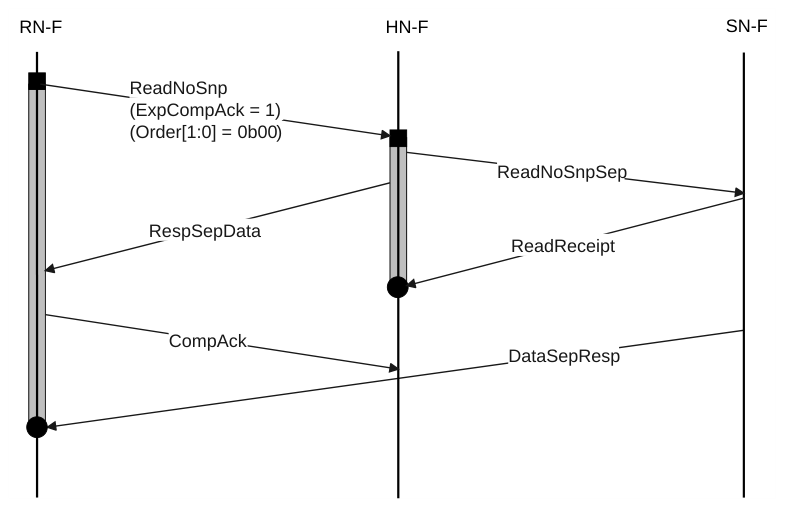

图 B5.9：带 Non-data 与 Data-only 分离的 DMT 读事务示例

图 B5.9 中 ReadNoSnp 事务的步骤如下：

1. RN-F 向 HN-F 发送一个无序的 ReadNoSnp 请求。
2. HN-F 向 SN-F 发送一个 ReadNoSnpSep 请求。
3. HN-F 向 RN-F 发送一个 RespSepData 响应。
4. SN-F 向 HN-F 发送一个 ReadReceipt。
5. RN-F 在收到 RespSepData 后发送 CompAck。
6. SN-F 向 RN-F 发送 DataSepResp，返回读数据。

#### B5.1.9 带顺序且 Non-data 与 Data-only 分离的 DMT ReadNoSnp 事务

图 B5.10 给出了一个带顺序且 Non-data 与 Data-only 分离的 DMT 事务流示例。

图 B5.10 中 Order 字段非零的 ReadNoSnp 要求：

- 只有在收到 RespSepData 之后，才能发送下一个有序请求。
- RN-F 在发送 CompAck 之前，必须等待 RespSepData 以及至少一个 DataSepResp 数据包。
- HN-F 在收到 CompAck 之前，不得向 SN-F 发送下一个有序请求。

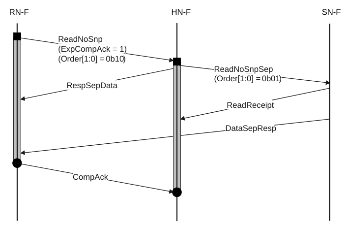

图 B5.10：带顺序且 Non-data 与 Data-only 分离的 DMT 读事务示例

图 B5.10 中带顺序且 Non-data 与 Data-only 分离的读事务步骤如下：

1. RN-F 向 HN-F 发送 ReadNoSnp，其中 ExpCompAck 置为 1。Order[1:0] 置为 0b10。
2. HN-F 向 SN-F 发送 ReadNoSnpSep，其中 Order[1:0] 置为 0b01。
3. HN-F 向 RN-F 返回 RespSepData。
4. SN-F 向 HN-F 返回 ReadReceipt。
5. SN-F 直接向 RN-F 发送 DataSepResp。
6. RN-F 向 HN-F 发出 CompAck。

### B5.2 无数据事务流

本节给出无数据事务的互连协议流示例。

#### B5.2.1 无内存更新的无数据事务

此类流的一个示例是 MakeUnique 事务。

图 B5.11 给出了该事务流。

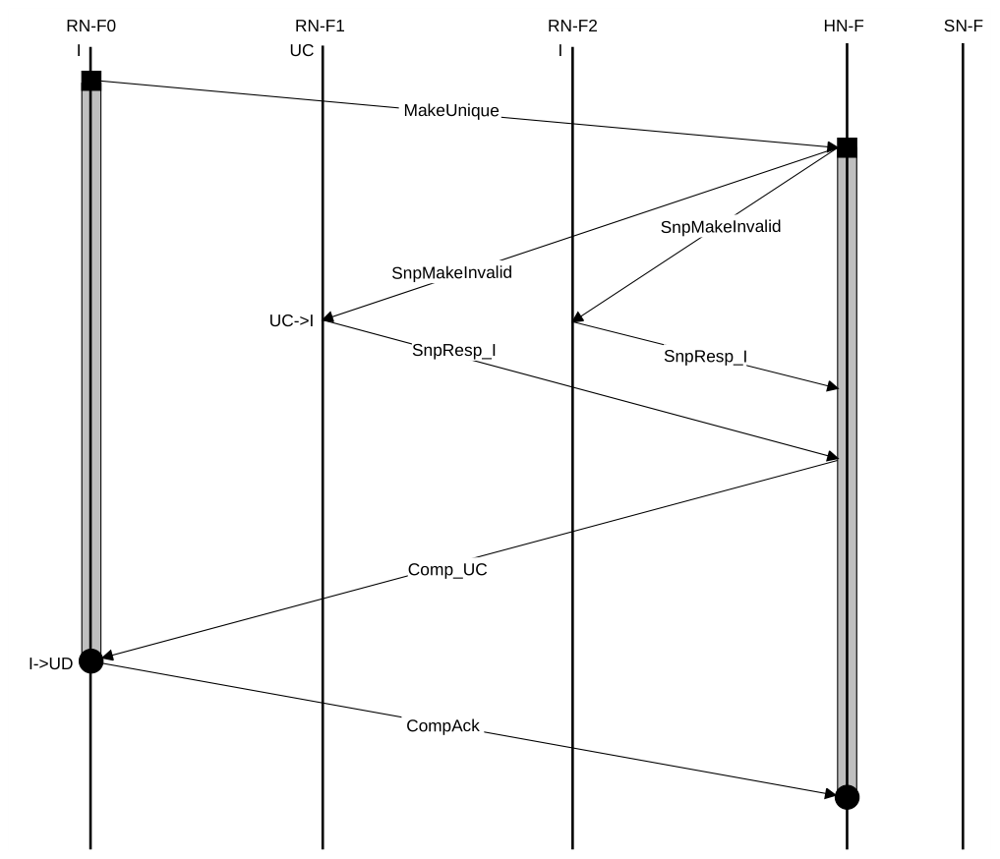

图 B5.11：无内存更新的 MakeUnique

图 B5.11 中无内存更新的 MakeUnique 事务流步骤如下：

1. RN-F0 向 HN-F 发送 MakeUnique 请求。
2. HN-F 向 RN-F1 和 RN-F2 发送 SnpMakeInvalid 请求。RN-F1 的缓存行状态由 UC 转换为 I。
3. RN-F1 和 RN-F2 向 HN-F 返回 SnpResp_I。
4. HN-F 向 RN-F0 发送 Comp_UC。RN-F0 的缓存行状态由 I 转换为 UD。
5. RN-F0 向 HN-F 发出 CompAck 响应，以指示事务完成。

#### B5.2.2 有内存更新的无数据事务

此类流的一个示例是 CleanUnique 事务。

图 B5.12 给出了该事务流。

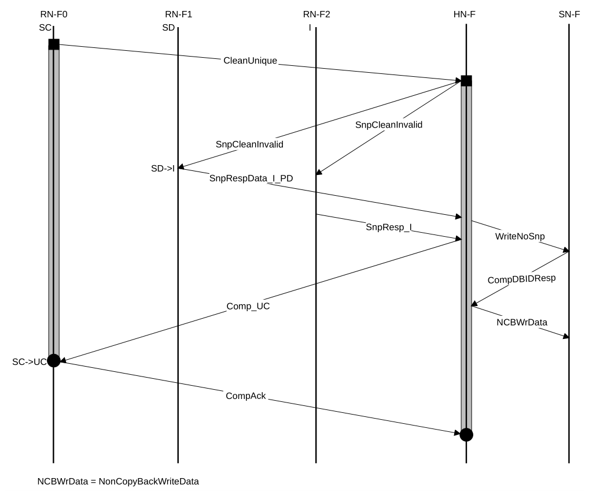

图 B5.12：有内存更新的 CleanUnique

图 B5.12 中有内存更新的 CleanUnique 事务流步骤如下：

1. RN-F0 向 HN-F 发送 CleanUnique 请求。
2. HN-F 向 RN-F1 和 RN-F2 发送 SnpCleanInvalid 请求。RN-F1 的缓存行状态由 SD 转换为 I。
3. RN-F1 向 HN-F 返回 SnpRespData_I_PD。HN-F 向 SN-F 发送 WriteNoSnp。
4. RN-F2 向 HN-F 返回 SnpResp_I。HN-F 现在可以向 RN-F0 发送 Comp_UC。RN-F0 的缓存行状态由 SC 转换为 UC。与此同时，SN-F 向 HN-F 返回 CompDBIDResp。HN-F 随后向 SN-F 发送 NCBWrData。
5. RN-F0 向 HN-F 发出 CompAck 响应，以指示事务完成。

#### B5.2.3 带侦听且 Comp 与 Persist 分离的持久化 CMO

在本 CleanSharedPersistSep 事务流示例中，持久化点（PoP）位于 SN-F。

图 B5.13 展示了该事务流。

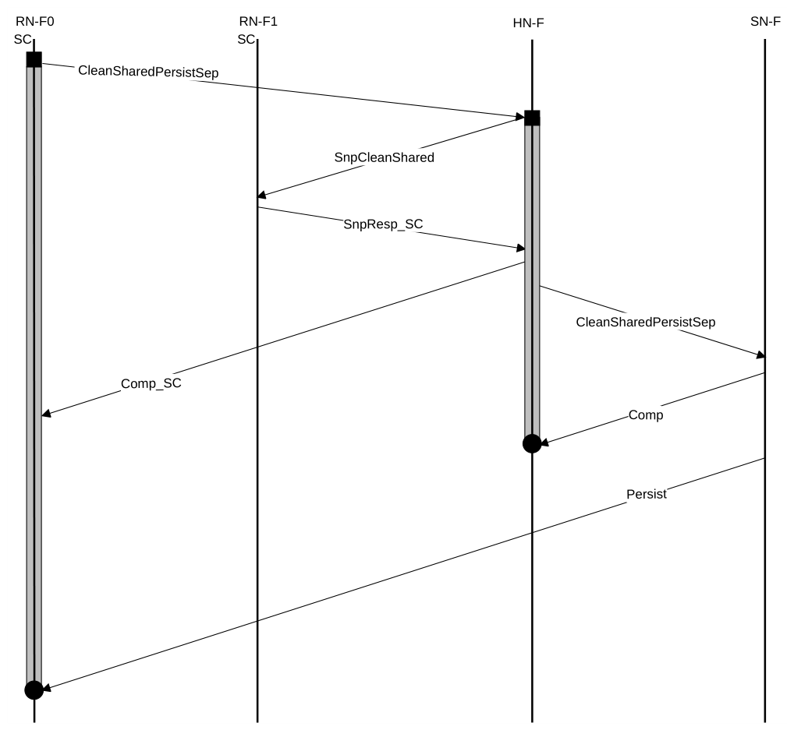

图 B5.13：CleanSharedPersistSep 事务流

图 B5.13 中 CleanSharedPersistSep 事务流的步骤如下：

1. RN-F0 向 HN-F 发送 CleanSharedPersistSep 请求。
2. HN-F 向 RN-F1 发送 SnpCleanShared 请求。
3. RN-F1 向 HN-F 发送 SnpResp_SC。
4. HN-F 向 RN-F0 发送 Comp_SC。
5. 在完成所有被侦听到的 Dirty 数据的写回（若有）之后，HN-F 向 SN-F 发送 CleanSharedPersistSep。
6. SN-F 向 HN-F 返回 Comp 响应。SN-F 直接向 RN-F0 发送 Persist 响应，以表明该请求已到达 PoP，并且对同一位置的任何先前写入的数据均已被推送至 PoP。

#### B5.2.4 Evict 事务

图 B5.14 展示了 Evict 事务流。

> **注意**
>
> Evict 请求是一种提示。HN-F 可以在不更新 Snoop Filter 或 Snoop Directory 的情况下给出 Comp 响应。

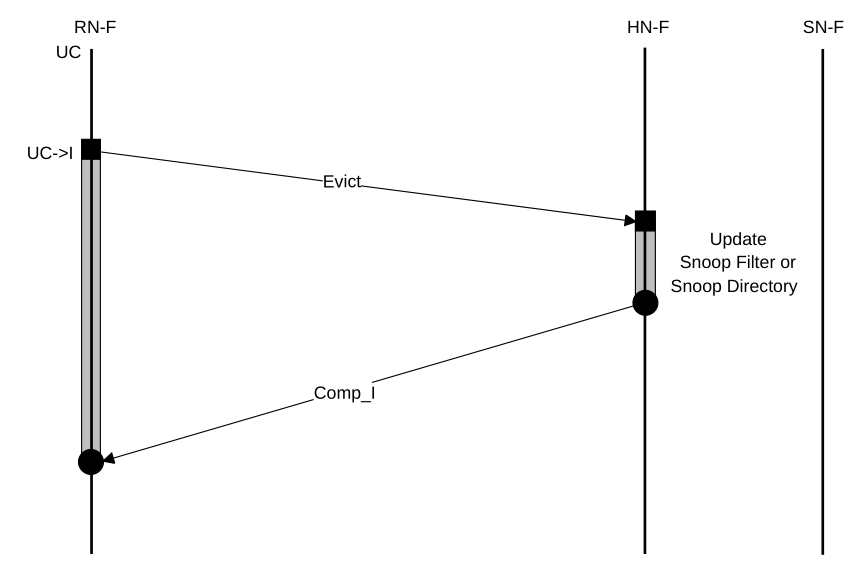

图 B5.14：Evict 事务流

图 B5.14 中 Evict 事务流的步骤如下：

1. RN-F0 的缓存行状态从 UC 转换为 I，并向 HN-F 发送 Evict 请求。HN-F 接收并分配该请求。
2. HN-F 返回 Comp_I 响应并释放该请求。RN-F0 释放该请求。

> **注意**
>
> 在发送 Evict 消息之前，请求方处的缓存状态必须变为 Invalid。

### B5.3 写事务流

本节给出写事务的互连协议流示例。

#### B5.3.1 无侦听且响应分离的写事务

图 B5.15 展示了一个 WriteNoSnp 事务流。

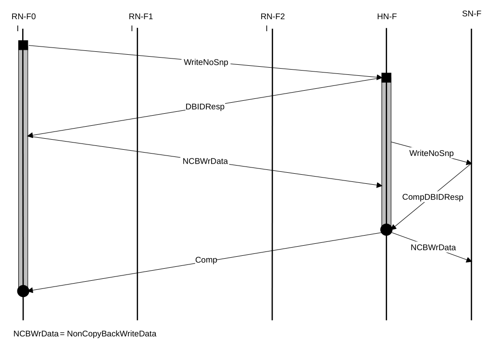

图 B5.15：从归属节点到请求节点的响应分离的 WriteNoSnp

图 B5.15 中 WriteNoSnp 事务流的步骤如下：

1. RN-F0 向 HN-F 发起一个 WriteNoSnp 事务。HN-F 接收并分配该请求。
2. HN-F 发送不带 Comp 的 DBIDResp。同时，HN-F 向 SN-F 发送 WriteNoSnp。
3. RN-F0 以数据（NCWrData）作为响应。SN-F 向 HN-F 返回 CompDBIDResp。
4. HN-F 在收到来自 SN-F 的 CompDBIDResp 后发送 Comp。HN-F 向 SN-F 发送 NCBWrData。

> **注意**
>
> 本流程示例展示的是在收到来自 SN-F 的 CompDBIDResp 之后发送 Comp。但是，HN-F 可以在收到来自 RN-F0 的 WriteNoSnp 请求之后的任意时刻发送 Comp。

5. RN-F0 等待来自 HN-F 的 Comp，并释放其请求。

图 B5.15 展示了该流程，其中被传输的数据副本以粗体标出。

#### B5.3.2 带侦听且响应分离的写事务

此类流程的一个示例是 WriteUniquePtl 事务。

图 B5.16 展示了该事务流。

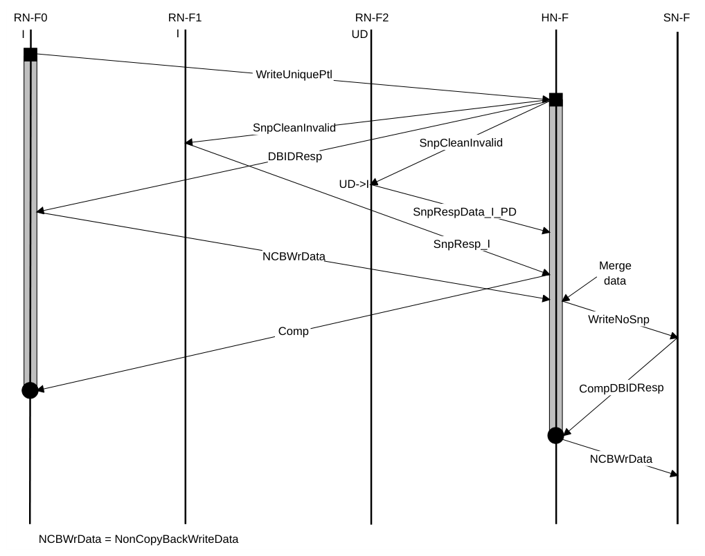

图 B5.16：带侦听的 WriteUniquePtl

图 B5.16 中带侦听的 WriteUniquePtl 事务流的步骤如下：

1. RN-F0 向 HN-F 发送 WriteUniquePtl 请求。
2. HN-F 向 RN-F1 和 RN-F2 发送 SnpCleanInvalid 请求。HN-F 还向 RN-F0 返回 DBIDResp。RN-F2 的缓存行状态从 UD 转换为 I。
3. RN-F1 发送 SnpResp_I，RN-F2 向 HN-F 发送 SnpRespData_I_PD。
4. RN-F0 向 HN-F 发出 NCBWrData。HN-F 将写数据与脏行合并，并向 SN-F 发送 WriteNoSnp。
5. HN-F 向 RN-F0 发送 Comp 响应。
6. SN-F 向 HN-F 返回 CompDBIDResp。
7. HN-F 向 SN-F 发送 NCBWrData。

#### B5.3.3 到内存的 CopyBack 写事务

此类流程的一个示例是 WriteBackFull 事务。

图 B5.17 展示了该事务流。

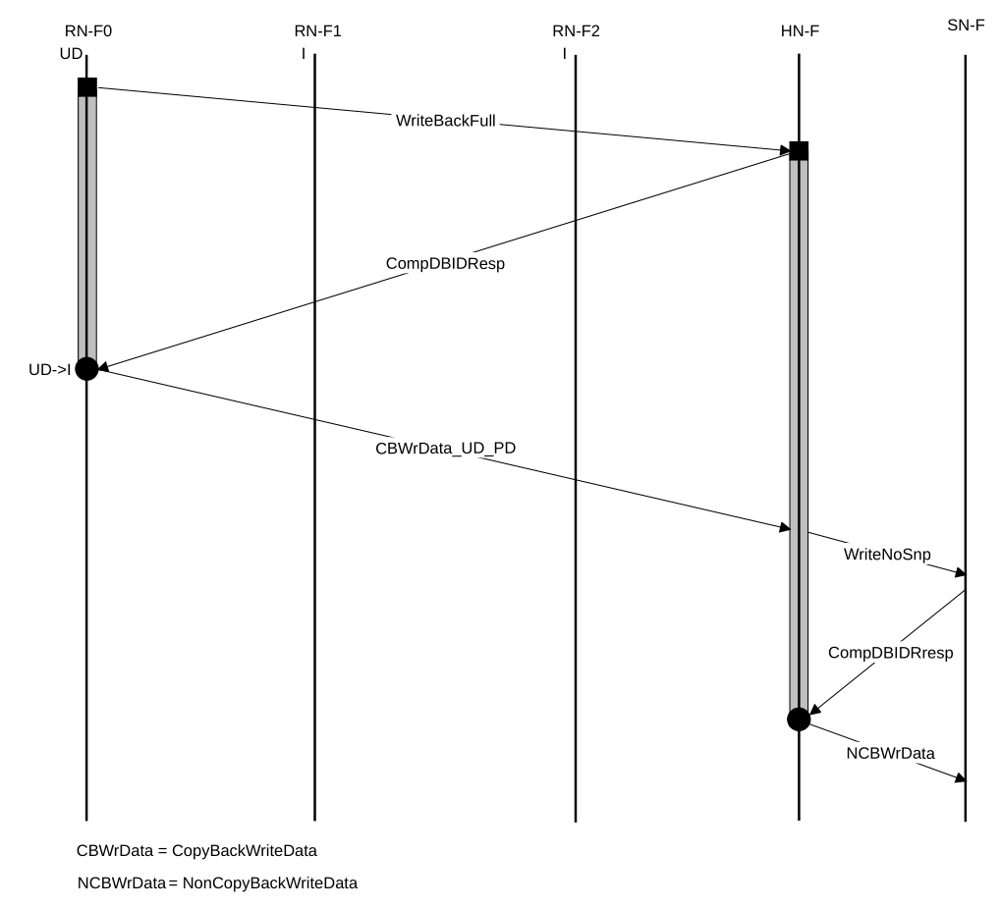

图 B5.17：WriteBackFull 事务流

图 B5.17 中 WriteBackFull 事务流的步骤如下：

1. RN-F0 向 HN-F 发送 WriteBackFull 请求。
2. HN-F 向 RN-F0 返回 CompDBIDResp。RN-F0 的缓存行状态从 UD 转换为 I。
3. RN-F0 向 HN-F 发送 CBWrData_UD_PD。HN-F 向 SN-F 发送 WriteNoSnp。
4. SN-F 向 HN-F 返回 CompDBIDResp。
5. HN-F 向 SN-F 发送 NCBWrData。

### B5.4 Atomic 事务流

本节展示不同类型的 Atomic 事务流。它包含以下小节：

- B5.4.1 带数据返回的 Atomic 事务
- B5.4.2 不带数据返回的 Atomic 事务
- B5.4.3 在从属节点执行的 Atomic 操作

#### B5.4.1 带数据返回的 Atomic 事务

该流程适用于：

- AtomicLoad
- AtomicCompare
- AtomicSwap

##### B5.4.1.1 带侦听且带数据返回的 Atomic 事务

图 B5.18 展示了在 HN-F 执行的 Atomic 操作。

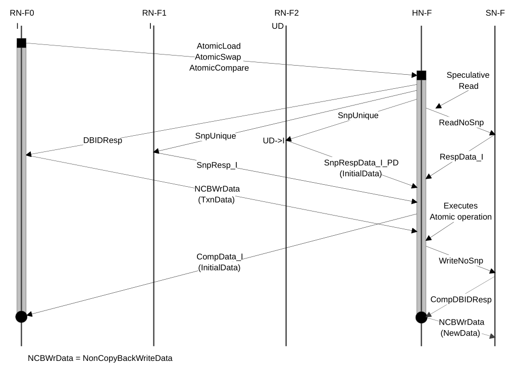

图 B5.18：在 HN-F 执行的 AtomicLoad、AtomicSwap 或 AtomicCompare

图 B5.18 中的步骤如下：

1. RN-F0 向 HN-F 发送 Atomic 事务。
2. 收到 Atomic 请求后，HN-F：
- 向 RN-F0 发送 DBIDResp，以获取 Atomic 事务数据。
- 在确定需要侦听之后，向其他 RN-F 节点发送 SnpUnique 侦听请求。
- HN-F 可以（但并非必须）向 SN-F 发送推测性 ReadNoSnp。
3. RN-F2 以 UD 状态持有该缓存行，并通过发送数据并使自身的缓存副本无效来作出响应。
- 响应为 SnpRespData_I_PD。
- 该数据在图 B5.18 中标记为 (InitialData)，以便与请求方发送的数据以及 Atomic 操作执行后写入 SN-F 的数据区分开。
- HN-F 还收到来自 RN-F1 的第二个侦听响应 SnpResp_I。
4. 在收到所有侦听响应之后，HN-F 向请求方发送 CompData_I。
- 随 Comp 发送的数据是该数据的初始副本。
- 该数据不得在 RN-F0 以一致性状态缓存。
5. 作为对先前发送的 DBIDResp 的响应，HN-F 收到来自请求方的 NonCopyBackWriteData_I 响应。
- 该数据在图 B5.18 中标记为 (TxnData)，以便与 RN-F2 响应 HN-F 的侦听请求而发送的数据区分开。
6. 一旦 HN-F 收到来自请求方的 NonCopyBackWriteData_I 响应，以及来自 RN-F2 的带数据侦听响应，就执行 Atomic 操作。
- Atomic 操作执行后得到的值在图 B5.18 中标记为 (NewData)，并被写入 SN-F。
7. 在本示例中，由于推测性读取而收到的读数据被 HN-F 丢弃。

> **注意**
>
> 在图 B5.18 中，来自 HN-F 的 CompData_I 响应可以在收到所有侦听响应时发送。

或者，为了便于错误报告，CompData_I 可以延迟到从请求方收到 NonCopyBackWriteData 且 Atomic 操作执行完毕后再发送。

##### B5.4.1.2 不带侦听且带数据返回的 Atomic 事务

图 B5.19 展示了在归属节点执行的 Atomic 操作。

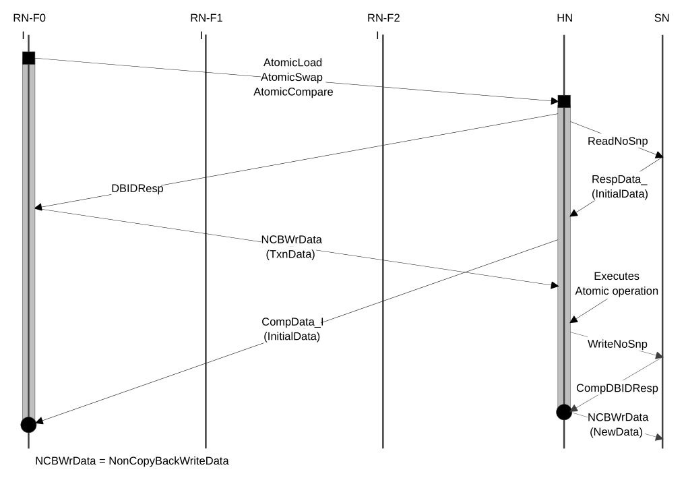

图 B5.19：在归属节点执行的 AtomicLoad、AtomicSwap 或 AtomicCompare

图 B5.19 中在归属节点执行的 Atomic 事务流中的步骤如下：

1. RN-F0 向 HN 发送 Atomic 事务请求。2. HN 向 RN-F0 返回 DBIDResp。3. HN 向 SN 发送 ReadNoSnp 请求。与此同时，RN 向 HN 发送 NCBWrData (TxnData)。4. SN 向 HN 返回 RespData_I (InitialData)。5. HN 返回 CompData_I (InitialData)。6. HN 执行 Atomic 操作并向 SN 发送 WriteNoSnp 请求。7. SN 向 HN 返回 CompDBIDResp。8. HN 向 SN 发送 Atomic 操作的结果，标记为 (NewData)。

#### B5.4.2 不带数据返回的 Atomic 事务

该流程适用于 AtomicStore 事务。

##### B5.4.2.1 带侦听且不带数据返回的 Atomic 事务

图 B5.20 展示了在 HN-F 执行的 Atomic 操作。该流程与带侦听且带数据返回的 Atomic 事务类似，不同之处在于对 RN-F0 的 Comp 响应不包含数据。

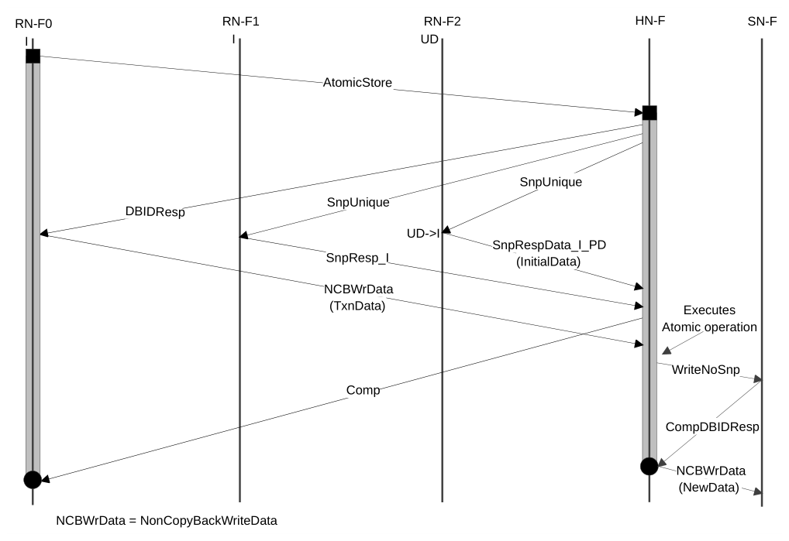

图 B5.20：在 HN-F 执行的 AtomicStore

图 B5.20 中在 HN 执行的 AtomicStore 事务的步骤如下：

1. RN-F0 向 HN-F 发送 AtomicStore 请求。
2. HN-F 向请求方 RN-F0 发出 DBIDResp，并向 RN-F1 和 RN-F2 发出 SnpUnique 请求。
3. RN-F1 向 HN-F 返回 SnpResp_I 响应。RN-F2 以 UD 状态持有该缓存行，并返回 SnpRespData_I_PD (InitialData) 响应。这使 RN-F2 中的缓存副本无效。
4. RN-F0 向 HN-F 发送写数据 (TxnData)。HN-F 在本地执行 AtomicStore 操作。
5. HN-F 向 SN-F 发出 WriteNoSnp 请求。
6. SN-F 向 Home 返回 CompDBIDResp。
7. HN-F 向 SN-F 发送 Atomic 操作的结果，标记为 (NewData)。

##### B5.4.2.2 无侦听且无数据返回的 Atomic 事务

图 B5.21 展示了在 Home Node 执行的原子操作。该流程与无侦听但有数据返回的 Atomic 事务类似，区别仅在于返回给 Request Node 的 Comp 响应不包含数据。

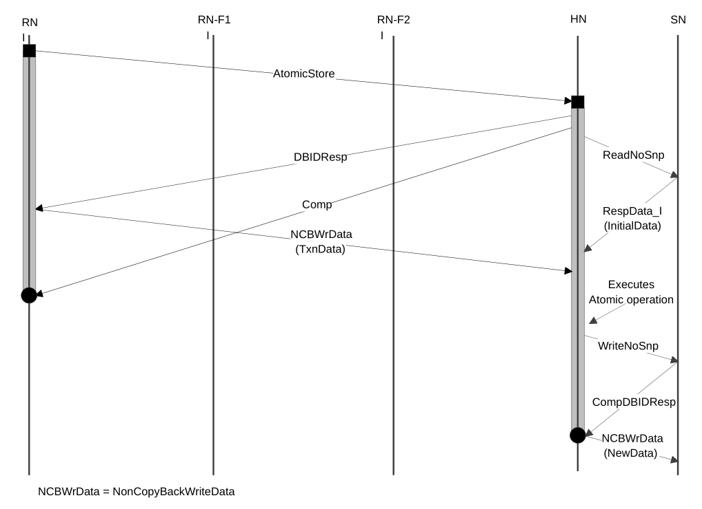

图 B5.21：在 Home Node 执行的 AtomicStore

> **注意**
>
> 在图 B5.21 中，对 Subordinate Node 的读是获取 InitialData 所必需的，不是推测性的。

来自 Home Node 的 Comp 响应可以与 DBIDResp 响应合并。

图 B5.21 中在 Home Node 执行的 AtomicStore 事务的步骤如下：

1. RN 向 HN 发送 AtomicStore 请求。2. HN 向 RN 返回 DBIDResp 响应，表明 RN 可以向 HN 发送写数据。3. HN 向 RN 发送 Comp 响应，并向 SN 发送 ReadNoSnp 请求。4. SN 向 HN 返回 RespData_I。5. 一旦 HN 收到来自 RN 的写数据，就执行原子操作，并向 SN 发送 WriteNoSnp。6. SN 向 HN 返回 CompDBIDResp。7. HN 将原子操作的结果发送给 SN，标记为 NewData。

#### B5.4.3 在 Subordinate Node 执行的原子操作

图 B5.22 展示了一个由 SN-F 执行原子操作的 Atomic 事务流程示例。

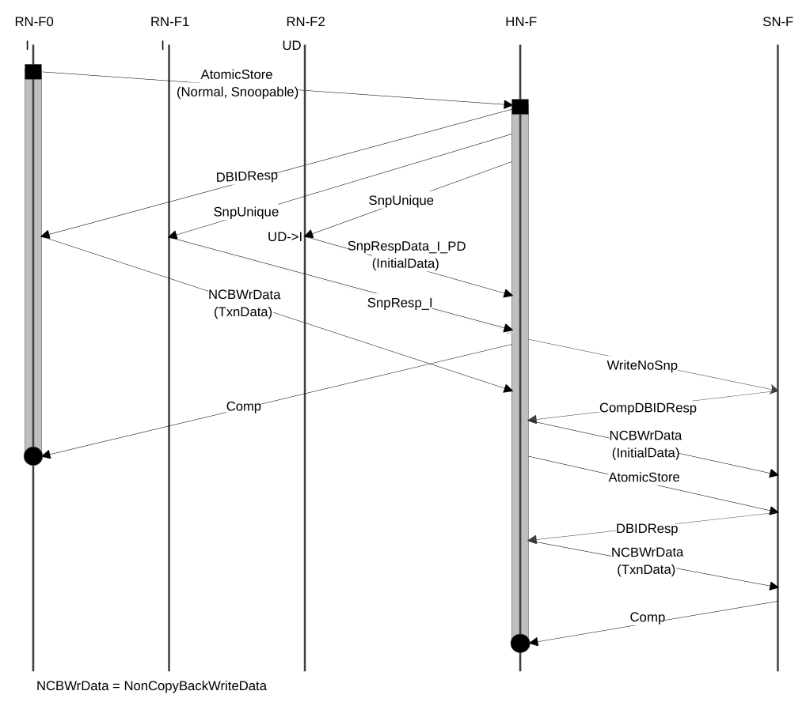

图 B5.22：在 SN-F 执行的 AtomicStore

图 B5.22 中在 SN-F 执行的 AtomicStore 事务的步骤如下：

1. RN-F0 向 HN-F 发送 AtomicStore 事务。
- 该 Atomic 请求指向一个可侦听（Snoopable）的地址位置。
2. 收到 Atomic 请求后，HN-F：
- 向 RN-F0 发送 DBIDResp，以获取 Atomic 事务数据。
- 在判定需要侦听之后，向其他 RN-F 节点发送 SnpUnique。
3. RN-F2 以 UD 状态持有该缓存行，通过发送数据并使自身缓存的副本无效来响应。
- 该响应为 SnpRespData_I_PD。
- 在图 B5.22 中该数据被标记为 (InitialData)，以便与请求方发送的数据

以及为执行原子操作而写入 SN-F 的数据相区分。

- HN-F 还会从另一个被侦听的 RN-F 收到第二个侦听响应 SnpResp_I。
4. HN-F 使用 WriteNoSnp 事务将收到的数据写入 SN-F。
5. 针对先前发送的 DBIDResp，HN-F 收到来自请求方的 NonCopyBackWriteData 响应。
6. HN-F 在将侦听响应数据发送给 SN-F 之后，向 SN-F 发送 AtomicStore 事务请求，并执行完成该 Atomic 事务所需的消息序列。
7. 一旦向请求方发送了 Comp 响应，并且从 SN-F 收到了该 Atomic 事务的 Comp 响应，HN-F 就释放该请求。
- 来自 HN-F 的 Comp 响应可以在收到所有侦听响应时发送。

### B5.5 Stash 事务流程

本节展示两类 Stash 事务的互连协议流程示例：

- B5.5.1 带 Stash 提示的写
- B5.5.2 独立的 Stash 请求

#### B5.5.1 带 Stash 提示的写

图 B5.23 展示了一个带 Data Pull 的 WriteUniqueFullStash 事务流程示例。

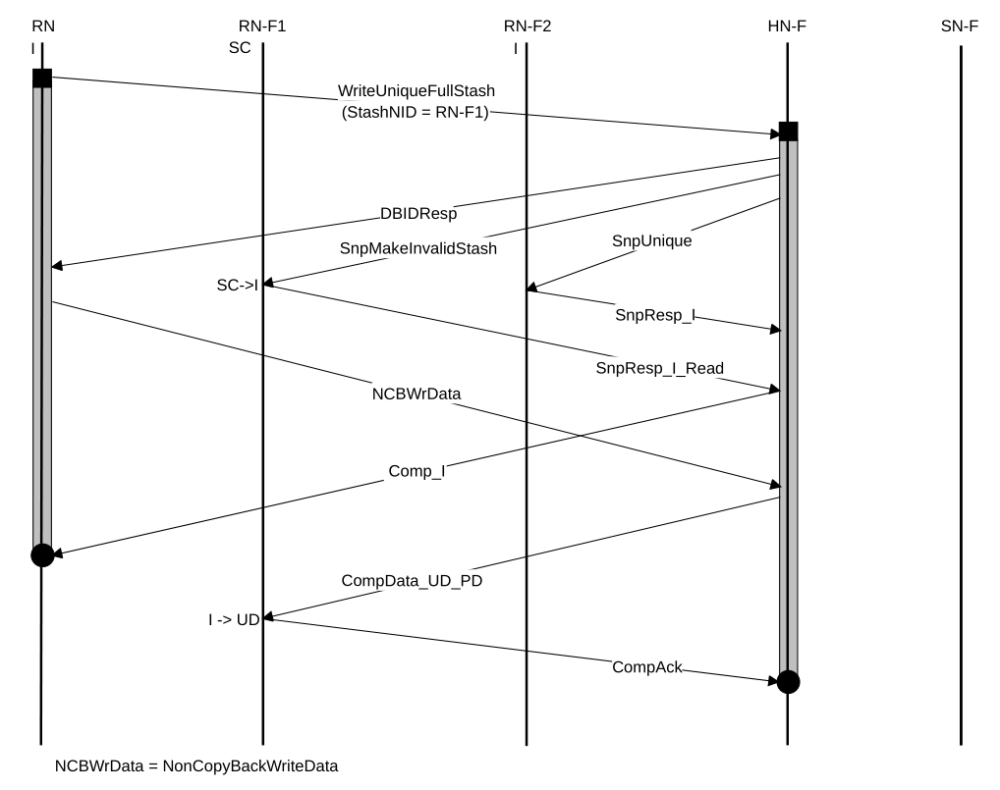

图 B5.23：带 Data Pull 的 WriteUniqueFullStash

图 B5.23 中的步骤如下：

1. Request Node 向 HN-F 发送 WriteUniqueFullStash 请求，其中 Stash target 标识为 RN-F1。通常，发起请求的 Request Node 是一个 RN-I。
2. HN-F 向 RN-F1 发送 SnpMakeInvalidStash，向 RN-F2 发送 SnpUnique。
3. RN-F1 和 RN-F2 向 HN-F 发送 SnpResp 响应。来自 RN-F1 的侦听响应还包含一个读请求，即 Data Pull。
4. HN-F 将来自 RN-F1 的读请求视为 ReadUnique，并向 RN-F1 发送合并的 CompData。CompData 响应包含请求方写入的数据。
5. RN-F1 向 HN-F 发送 CompAck，以完成该读事务。

#### B5.5.2 独立 Stash 请求

图 B5.24 展示了一个带 Data Pull 的 StashOnce 事务流程示例。

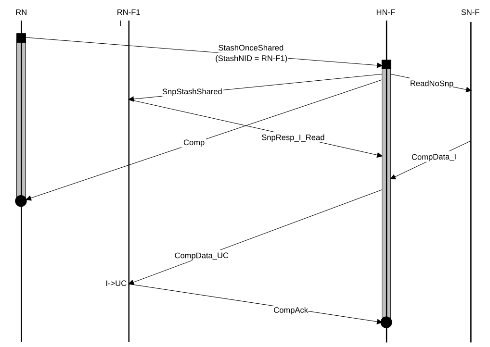

图 B5.24：带 Data Pull 的 StashOnceShared

图 B5.24 中的步骤如下：

1. 请求节点向 HN-F 发送一个 StashOnceShared 请求，其中暂存目标标识为 RN-F1。
2. HN-F 在为收到的请求建立处理顺序后发送 Comp 响应，该顺序保证该请求先于稍后从任意请求方收到的、发往同一地址的请求被处理。
3. HN-F 向 RN-F1 发送 SnpStashShared 侦听，并向 SN-F 发送 ReadNoSnp 请求以获取数据。
4. RN-F1 向 HN-F 发送 SnpResp_I_Read 响应。
5. HN-F 将来自 RN-F1 的读请求视为 ReadNotSharedDirty，并向 RN-F1 发送合并的 CompData。
6. RN-F1 向 HN-F 发送 CompAck 以完成该读事务。

### B5.6 冒险处理示例

本节展示 CopyBack-Snoop 请求冒险条件在请求方是如何处理的，以及各类 request to request 和 request to snoop request 冒险条件在 HN-F 是如何处理的。本节包含以下子节：

- B5.6.1 侦听请求
- B5.6.2 请求
- B5.6.3 读请求或无数据请求
- B5.6.4 竞态冒险

#### B5.6.1 侦听请求

图 B5.25 展示了在时刻 C 一个发往 RN-F 的侦听请求与一个待处理的 CopyBack 请求发生冒险。

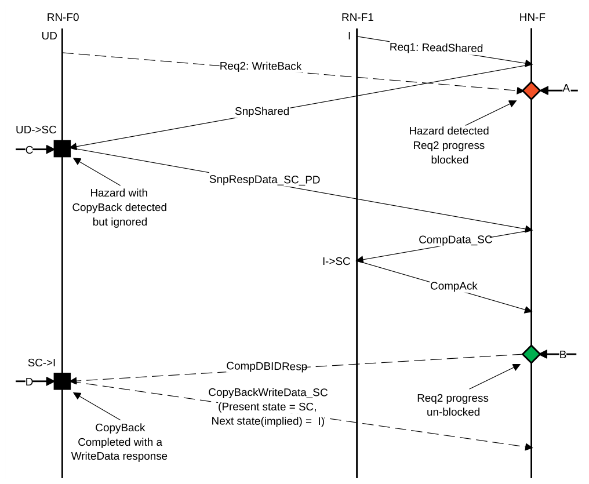

图 B5.25：RN-F 处 CopyBack-Snoop 冒险示例

解决此冒险所需的步骤如下：

1. 在时刻 C：
- SnpShared 事务忽略该冒险并读取缓存行数据。
- 缓存行状态从 UD 变为 SC。
2. 在时刻 D：
- 针对该 CopyBack 的 CompDBIDResp 发送给 RN-F0。
- RN-F0 回送一个 CopyBackWriteData_SC 响应。
- 缓存行状态从 SC 变为 I。

从一致性角度看，该数据是干净的，为实现正确功能并不要求将其发送到互连。然而，协议要求无论是否存在侦听冒险，CopyBack 流程都必须保持一致。WriteData 响应中的缓存行状态为 SC，因为那是发送 WriteData 响应时缓存行的状态。

> **注意**
>
> 与未完成的 Evict 发生冒险的侦听请求，其响应必须是 SnpResp_I。

当针对同一地址的侦听请求的侦听响应尚处于挂起状态时，CopyBack 请求唯一可能收到的响应是 RetryAck。如适用，这也包括数据。

图 B5.26 展示了侦听请求与未完成的 CopyBack 请求发生冒险的另一个示例。在此示例中，该侦听请求是由来自 RN-F1 的 ReadOnce 请求所生成的 SnpOnce 请求。SnpOnce 请求随侦听响应一起收到数据副本，但不改变缓存行状态。在这种情况下，来自 RN-F0 的最终数据响应表明该数据为 Dirty，且 HN-F 必须将该数据写回内存。

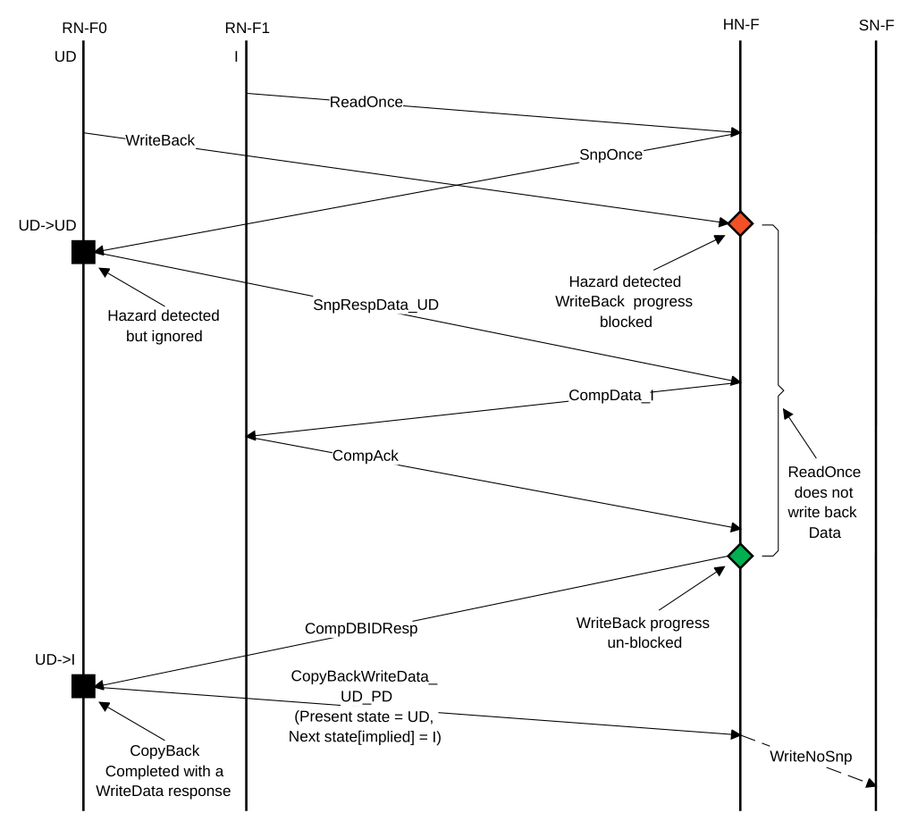

图 B5.26：无缓存状态变化的 CopyBack-Snoop 冒险示例

#### B5.6.2 请求

如果在 HN-F 处有多个发往同一缓存行的请求已准备好被处理，HN-F 可以按任意顺序选择下一个请求。例外情况是：当这两个请求具有顺序要求且来自同一源时，处理顺序必须与到达顺序一致。

图 B5.27 展示了一个示例，其中针对同一缓存行的 ReadShared 和 ReadUnique 大约在同一时刻到达 HN-F。

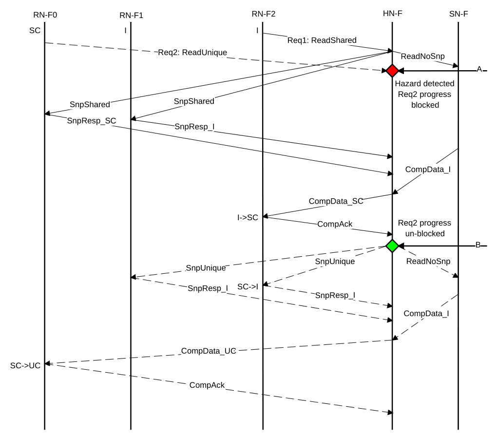

图 B5.27：读-读请求冒险示例

图 B5.27 中解决此冒险所需的步骤如下：

1. 在时刻 A：
- 来自 RN-F0 的 ReadUnique 到达，并与来自 RN-F2 的一个 ReadShared 请求发生冒险，HN-F 针对该请求已经

发送了侦听请求。

- ReadUnique 的推进在 HN-F 处被阻塞。
2. 在时刻 B：
- HN-F 已完成来自 RN-F2 的 ReadShared 事务请求。
- ReadShared 事务被视为已完成，HN-F 解除对来自 RN-F0 的 ReadUnique

事务请求的阻塞。

除 ReadNoSnp 外，如果将图 B5.27 所示的两个事务替换为任意读请求类型或无数据请求类型，流程是类似的：

- 不带 DMT 或 DCT、也没有独立 Comp 与数据响应的读事务请求，在以下两个条件均为真时于

HN-F 完成：

- 所有 CompData 均已发送，且如适用，已收到 CompAck。仅当原始请求消息中 ExpCompAck = 1 时，事务才

需要 CompAck。

- 如需要，完成内存更新。

#### B5.6.3 读请求或无数据请求

在 HN-F 上，读请求或无数据请求与 CopyBack 请求之间的冒险，其处理方式与 B5.6.2 请求中描述的读-读冒险类似。另请参见 B5.6.1 侦听请求。

图 B5.28 展示了针对同一缓存行的 ReadShared 和 WriteBack 几乎同时到达 HN-F 的情况。

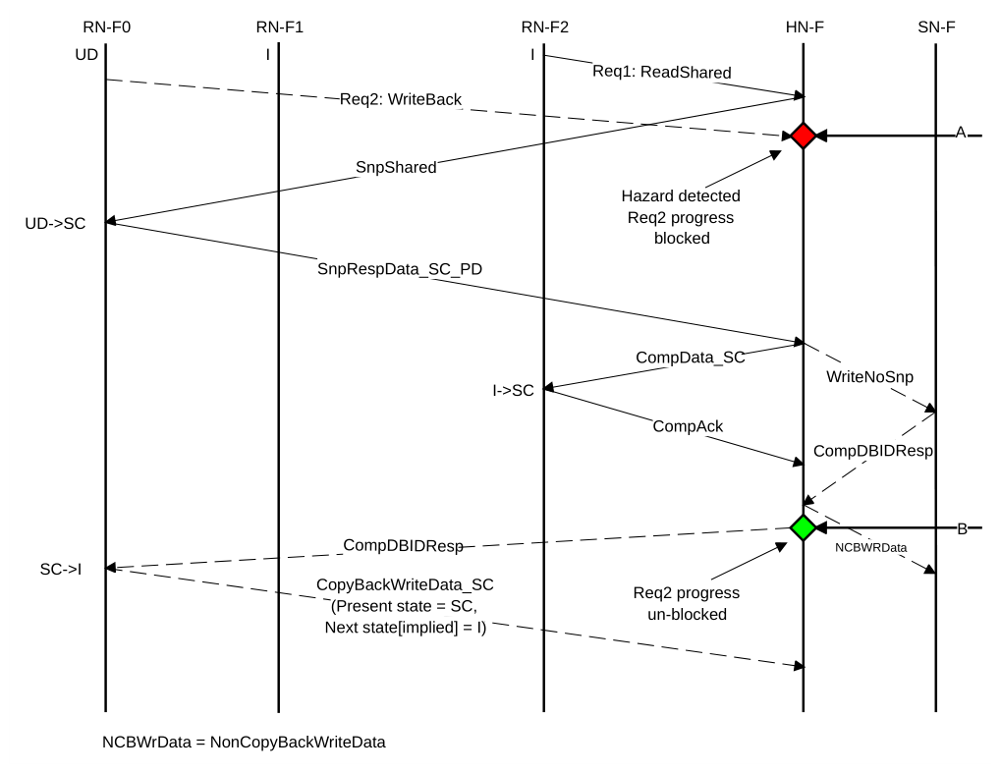

图 B5.28：读 - CopyBack 或无数据 - CopyBack 冒险示例

解决图 B5.28 中该冒险所需的步骤如下：

1. 时刻 A：
- WriteBack 在 HN-F 上遇到冒险条件。产生该冒险的原因是一个已在处理中的 ReadShared

事务。

- 冒险检测的结果是 WriteBack 被阻塞。
- ReadShared 事务随侦听响应接收数据，并且除将数据发送给请求方之外，还必须更新内存。
2. 时刻 B：
- 因为 HN-F 已针对 ReadShared 事务向请求方发送了数据响应，并向内存发送了 WriteData

响应，所以 WriteBack 被解除阻塞。

如果 ReadShared 请求是在 HN-F 已开始处理 WriteBack 请求之后到达 HN-F，则该 ReadShared 请求会被阻塞，直到该 WriteBack 请求完成。

当以下两个条件同时成立时，CopyBack 请求在 HN-F 上完成：

- 收到对应该 CopyBack 请求的数据消息。
- 如有必要，完成内存更新。

#### B5.6.4 竞争冒险

请求完成后，缓存可能会静默地将该缓存行从缓存中逐出，并针对同一地址生成另一个请求。例如：

1. 重新生成的请求在与较早请求相关联的 CompAck 响应之前到达 HN-F。
2. HN-F 检测到地址冒险，并阻塞对新请求的处理，直到收到 CompAck 响应。

在此类情形下，CompAck 响应到达 HN-F 时，会从 HN-F 中释放先前的请求，并解除对新请求处理的阻塞。

第 B6 章
