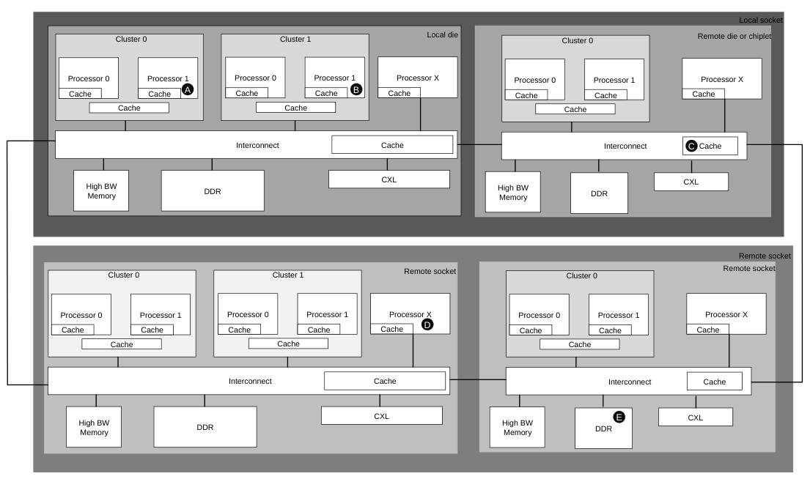

# B11 系统控制、调试、跟踪与监控
本章描述为系统的控制、调试与跟踪提供额外支持的机制，以及为提升性能而对系统进行监控的机制。本章包含以下小节：

- B11.1 服务质量（QoS）机制
- B11.2 数据源
- B11.3 数据目标
- B11.4 MPAM
- B11.5 基于页的硬件属性
- B11.6 完成方忙
- B11.7 跟踪标签

### B11.1 服务质量（QoS）机制

#### B11.1.1 概述

系统可以利用 QoS 方案来实现：

- 为特定流中的事务保证最大延迟。
- 为请求流保证最小带宽。
- 为特定流的请求提供尽力而为的带宽与延迟值。

满足系统 QoS 需求所需的低延迟或吞吐量保障要求，主要由事务端点负责，并依靠中间互连提供支持。协议通过为数据包定义 QoS 优先级值，并使用已定义的信用机制控制请求流，来支持这一点。

#### B11.1.2 QoS 优先级值

使用一个 4 位值在协议节点处以及互连内部对数据包的处理进行优先级排序。数据包的 QoS 优先级值（Priority Value，PV）由事务的源端分配。在典型使用模型中，该值取决于源端类型和流量类别，QoS 取值递增表示优先级更高。源端还可以根据累积延迟和所需吞吐量指标动态改变该值。

#### B11.1.3 以更高的 QoS 值重复发送事务

事务已以某个特定 QoS 值发送后，同一事务可以以不同的 QoS 值再次发送，通常为更高的值。完成方需要将此情形作为多个不同的请求来处理。

在这种情况下，如果其中一个事务收到 RetryAck 响应，则可以取消该事务并归还信用。参见 B2.10.1 Credit Return。

### B11.2 数据源

读请求的完成方可以（但并非必须）指定数据的来源。来源在以下响应的 DataSource 字段中指定：

- CompData
- DataSepResp
- SnpRespData
- SnpRespDataPtl

#### B11.2.1 简介

DataSource 字段提供 8 位的编码空间，以涵盖多裸片、多插座系统以及异构内存模型。

DataSource 字段被划分为若干更小的子字段：

- B11.2.2 CompleterDistance
- B11.2.3 CompleterType
- B11.2.4 HitD
- B11.2.5 Functional

#### B11.2.2 CompleterDistance

DataSource[1:0] 位用于传输 CompleterDistance 子字段。

CompleterDistance 子字段指示返回的数据所经过的相对距离。

CompleterDistance 子字段在系统层面定义，从而为可能具有不同层级深度的各类系统提供使用上的灵活性。

CompleterDistance 子字段的编码如表 B11.1 所示。

表 B11.1：DataSource CompleterDistance 编码及使用示例

| DataSource[1:0] CompleterDistance | 描述 | 使用示例 |
| --- | --- | --- |
| 0b00 | Completer Distance 1 | 共享一个缓存的核集群。该集群及其缓存与系统互连相连。 |
| 0b01 | Completer Distance 2 | 与 Completer Distance 1 位于同一裸片内的核芯粒（chiplet）或核集群，包含带有归属节点（Home Node）、内存控制器或 IO 控制器以及共享缓存的系统互连。 |
| 0b10 | Completer Distance 3 | 同一插座内的远程芯粒。 |
| 0b11 | Completer Distance 4 | 同一系统内的远程插座。 |

有关示例系统，参见 B11.2.6 Example system。

#### B11.2.3 CompleterType

DataSource[4:2] 位用于传输 CompleterType 子字段。

对于内存和缓存，都有若干不同的分组可以在 CompleterType 子字段中传递。

CompleterType 子字段的编码还决定了 Functional 子字段所使用的编码空间。

CompleterType 子字段必须正确定义相关联的源，或者使用 Default 编码。缓存不得使用内存分组中的一种，内存也不得使用缓存分组中的一种。

对于因 CHI 侦听命中而提供数据的 Snoopee 缓存，必须使用 Cache Snoop Hit。

任何不属于上述情况的缓存都必须归入 Cache Group 1 或 Cache Group 2。

将缓存或内存类型归入其余分组的方式由实现定义（IMPLEMENTATION DEFINED）。

内存的 CompleterType 子字段编码如表 B11.2 所示。

表 B11.2：DataSource CompleterType 编码

| DataSource[4:2] CompleterType | 架构定义 | 建议 |
| --- | --- | --- |
| 0b000 | 默认 | 默认 |
| 0b001 | Memory Group 1 | DRAM |
| 0b010 | Memory Group 2 | CXL |
| 0b011 | Memory Group 3 | 高带宽内存 |
| 0b100 | Cache Snoop Hit | Snoop hit（架构定义） |
| 0b101 | Cache Group 1 | 系统特定的互连缓存 |
| 0b110 | Cache Group 2 | 系统特定的互连缓存 |
| 0b111 | 保留 | 保留 |

#### B11.2.4 HitD

DataSource[5] 位用于传输 Hit Dirty（HitD）子字段。

如果 CompleterType 指示的是某一种缓存编码，则 HitD 子字段指示在缓存查找命中时该缓存行是否处于 Dirty 状态。

> **注意**
>
> 此前，发起诸如 ReadNotSharedDirty 之类事务的请求方可能会看到返回的是共享干净（Shared Clean）数据，尽管该缓存行在 Snoopee 处可能处于独占脏（Unique Dirty）状态。

HitD 子字段中携带该信息有助于向请求方提供更多信息，这可能对性能分析有用。

HitD 编码如表 B11.3 所示。

表 B11.3：DataSource HitD 编码

| DataSource[5] HitD | 描述 |
| --- | --- |
| 0b0 | 该缓存行在完成方处未处于 Dirty 状态 |
|  | 下页续 |

表 B11.3 – 续上页

| DataSource[5] HitD | 描述 |
| --- | --- |
| 0b1 | 该缓存行在完成方处处于 Dirty 状态 |

当 CompleterType 为某一种缓存编码时，HitD 子字段是适用的，并且可以置为 0 或 1。

当 CompleterType 为某一种缓存编码且 Data 响应指示传递 Dirty [_PD] 时，HitD 子字段必须为 1。

当 CompleterType 不是某一种缓存编码时，HitD 子字段不适用，且必须为零。

#### B11.2.5 Functional

DataSource[7:6] 位用于传输 Functional 子字段。

Functional 子字段提供与 CompleterType 选择相关的附加信息。

完成方无需为其 CompleterType 支持所有的 Functional 编码。

Functional 编码有三种类型：

- B11.2.5.1 Default
- B11.2.5.2 Memory
- B11.2.5.3 Cache

##### B11.2.5.1 Default

当 CompleterType 为 Default 时，Functional 子字段的编码如表 B11.4 所示。

表 B11.4：CompleterType 为 Default 时的 DataSource Functional 编码

| DataSource[7:6] Default | 描述 |
| --- | --- |
| 0b00 | 默认 - 无有用信息 |
| 0b01 | 保留 |
| 0b10 | 保留 |
| 0b11 | 保留 |

##### B11.2.5.2 Memory

当 CompleterType 为 Memory Group 1、Memory Group 2 或 Memory Group 3 时，Functional 子字段的编码如表 B11.5 所示。

表 B11.5：CompleterType 为内存编码时的 DataSource Functional 编码

| DataSource[7:6] Memory | 描述 |  |
| --- | --- | --- |
| 0b00 | 默认。PrefetchTgt 无作用。 | 下页续 |

表 B11.5 – 续上页

| DataSource[7:6] Memory | 描述 |
| --- | --- |
|  | Read 请求经历了一次完整的内存访问，并未因先前发送了 PrefetchTgt 请求而获得任何延迟降低。指示某个预取无作用的确切原因由具体实现决定（IMPLEMENTATION SPECIFIC）。 |
| 0b01 | PrefetchTgt 有作用。由于 PrefetchTgt 请求已经读取或已发起从内存读取数据，从属节点以更低的延迟提供了 Read 数据。 |
| 0b10 | 保留 |
| 0b11 | 保留 |

> **注意**
>
> PrefetchTgt 请求可能无作用的原因有多种，包括：

- 在实际请求之前没有 PrefetchTgt 事务。
- PrefetchTgt 被从属节点丢弃。
- PrefetchTgt 获取的数据在缓冲区中被替换掉了。
- Read 请求先于 PrefetchTgt 到达从属节点。

##### B11.2.5.3 缓存

当 CompleterType 为 Cache Snoop Hit、Cache Group 1 或 Cache Group 2 时，Functional 子字段的编码如表 B11.6 所示。

表 B11.6：CompleterType 为缓存编码时的 DataSource Functional 编码

DataSource[7:6] Description

缓存

0b00 默认。无有用信息。

0b01 未使用的预取。

该缓存行可能此前已由另一个请求方预取，但该缓存行尚未被使用，或者已被写入下级缓存并置位了 DataTarget[0] UnusedPrefetch。

0b10 迟到预取。

该事务与来自同一 SrcID 的较早 StashOnce* 发生了冒险。必须先完成较早的 StashOnce*，才能解除冒险并返回数据。

0b11 保留

未使用的预取只能出现在源自 HN-F、HN-I 或 RN-F 的适用数据消息中。

未使用的预取不会出现在源自 SN-I 或 SN-F 的适用数据消息中。

迟到预取只能出现在源自 HN-F 的适用数据消息中。

迟到预取不会出现在源自 RN-F、HN-I、SN-F 或 SN-I 的适用数据消息中。

#### B11.2.6 示例系统

图 B11.1 给出了一个由 DataSource 支持的系统的示例。

图 B11.1：使用 DataSource 的示例系统

在图 B11.1 中，从 Local socket 中 Local die 的 Cluster 0 中 Processor 0 的视角来看，所详述的五个点如表 B11.7 所示。

表 B11.7：示例系统说明

| Point | CompleterDistance | CompleterType | HitD | Functional |
| --- | --- | --- | --- | --- |
| A | 0b00, Completer Distance 1 | 0b100, Cache Snoop Hit | 0b0 or 0b1 | Any |
| B | 0b01, Completer Distance 2 | 0b100, Cache Snoop Hit | 0b0 or 0b1 | Any |
| C | 0b10, Completer Distance 3 | 0b101, Cache Group 1 or 0b110, Cache Group 2 | 0b0 or 0b1 | Any |
| D | 0b11, Completer Distance 4 | 0b100, Cache Snoop Hit | 0b0 or 0b1 | Any |
| E | 0b11, Completer Distance 4 | 0b001, Memory Group 1 | Must be 0b0 | 0b00 or 0b01 |

#### B11.2.7 驱动与修改 DataSource[7:0]

本节描述如何驱动和修改 DataSource[7:0] flit。

##### B11.2.7.1 初始值

预期 Completer 在适用的响应中驱动 DataSource，并将 CompleterDistance 值设置为尽可能近的 Completer Distance，以传递该信息。

例如，在图 B11.1 中，这意味着：

- 任意簇内的 Processor 0 在任意适用响应中都应将 CompleterDistance 驱动为 0b00，

Local cluster。

- Processor X 在任意适用响应中都应将 CompleterDistance 驱动为 0b01, Local die，因为它

存在于任何 Local cluster 配置之外。

所有 Completer 都必须将 DataSource[7:2] 驱动为合法编码。

建议（但并非必须）在检测到错误时仍准确地驱动 DataSource 值。

当存在标记为 Default 的编码时，允许 Completer 选择其中一个编码，而不是选择某个定义更明确的编码。

##### B11.2.7.2 值的修改

当任意适用响应中的 DataSource[7:0] 值在系统中传输时，预期在跨越相应边界时对 CompleterDistance 进行递增。

> **注意**
>
> 随着数据包在系统中移动，CompleterDistance 值如何被修改是由实现定义的。该修改可以包括透传、按固定值递增以及设置为特定值等做法的混合。

例如，在图 B11.1 中，这意味着：

- 任意跨越簇边界的适用响应都会被递增为 0b01, Local die。该

递增由该簇执行。

- 任意跨越 local socket 中 die 或 chiplet 边界的适用响应都会被递增为

0b10, Remote die or chiplet。该递增由 die-to-die 或 chiplet-to-chiplet 发送端执行。

- 任意跨越 socket 边界的适用响应都会被递增为 0b11, Remote socket。该

递增由 socket-to-socket 发送端执行。

在任意适用响应于系统中传输时，允许（但不预期）对 DataSource[7:2] 值作出任何更改。

预期（但并非必须）Home 将来自 Snoopee 的 SnpRespData 或 SnpRespDataPtl 响应，或来自 Subordinate 的 CompData 或 DataSepResp 响应中未经更改的 DataSource 值转发给请求方。

##### B11.2.7.3 组合来自两个不同来源的数据

以下场景中，Home 必须在将 CompData 或 DataSepResp 响应发送回请求方之前，组合来自多个来源的数据：

- 某个 Snoopee 持有一行处于 UDP 状态的缓存行，而另一个请求方对该位置发起 Read。此时 Home 必须

进行存储器访问以获取该行的其余部分。

- Home 在向请求方返回 CompData

或 DataSepResp 响应时，预期使用 Cache Snoop Hit 的 CompleterType 编码。

- 当启用 MTE 且请求方发起 Read 以获取数据和标签，但数据仅存在于某个 Snoopee 中、而不在标签中时。Home 必须

进行存储器访问以获取 MTE 标签。

- Home 在向请求方返回 CompData

或 DataSepResp 响应时，预期使用 Cache Snoop Hit 的 CompleterType 编码。

- 当 Home 在 SLC 中拥有该行的副本，但需要访问存储器以获取 MTE 标签时。
- Home 在向请求方返回

CompData 或 DataSepResp 响应时，预期使用 Cache Group 1 或 Cache Group 2 的 CompleterType 编码。

B11.2.7.4

##### B11.2.7.4 同时存在 Late 与 Unused 预取事件时缓存编码的功能值

存在这样一种场景：Unused 预取信息可以通过来自 Snoopee 的 SnpRespData 响应提供给 Home，同时 Home 也面临发生 Late 预取事件冒险的风险。在此场景下，Home 在向请求方提供 CompData 响应时，预期使用 Late Prefetch Functional Cache 编码。

### B11.3 数据目标

请求方可以向互连中的缓存提供放置与使用提示，这是允许的但并非必需。通常，请求方最了解缓存行的效用。获知这些信息的系统级缓存（SLC）可以利用它来偏向自身的缓存层级放置和替换算法。

#### B11.3.1 简介

该特性由 7 位字段 DataTarget 支持。

DataTarget 包含以下子字段：

- UnusedPrefetch
- Replacement
- CacheLevel
- Unique

图 B11.2 展示了 DataTarget 各子字段的位置。

6 5 4 3 1 0

Unique CacheLevel Replacement UnusedPrefetch

图 B11.2：DataTarget 子字段的位置

#### B11.3.2 字段适用性

DataTarget 字段与 ReturnNID 和 StashNID 共用同一个 REQ 数据包位置。当节点 ID 宽度大于 7 位且该字段用作 DataTarget 时，共享字段中未使用的位必须为零。

DataTarget 字段仅适用于从请求节点发往 HN-F 的请求。

该字段不适用于从请求节点发往 HN-I 的请求，以及从归属节点发往从属节点的请求。该字段可以取任意值。

该字段不适用于从请求节点发往从属节点的请求，并且必须设置为 0。

##### B11.3.2.1 UnusedPrefetch

在所有从请求节点发往 HN-F 的请求中，UnusedPrefetch 子字段可以取任意值，但以下情况除外：在这些情况下该子字段不适用，必须为零：

- Atomic*
- Stash 事务，当 StashNIDValid 为 1 时
- PrefetchTgt
- PCrdReturn
- DVMOp

如果请求方预取了一个缓存行，它可以在 CopyBack 事务中使用 UnusedPrefetch 子字段，向互连指示该行是否已被使用。如果互连支持存储该信息，并能在后续读事务中通过 DataSource 字段提供该信息，则请求方可以利用它来调整预取算法。

表 B11.8 展示了 UnusedPrefetch 子字段的编码。

表 B11.8：UnusedPrefetch 子字段编码

DataSource[0] 描述 UnusedPrefetch

0 该缓存行自被取回以来可能已被使用。

1 该缓存行自被取回以来未被使用。

> **注意**
>
> 不跟踪缓存行使用情况的请求节点可以将 UnusedPrefetch 位值设置为 0。

##### B11.3.2.2 Replacement

Replacement 子字段在 Request Node 发往 HN-F 的所有请求中可以取任意值，但以下情况除外：在这些情况下该子字段不适用，必须为 0：

- Atomic*
- Stash 事务，当 StashNIDValid 为 1 时
- PrefetchTgt
- PCrdReturn
- DVMOp

Replacement 子字段可用于指示由 Requester 传输的数据再次被使用的可能性有多大。接收到该信息的缓存可以用它来偏置自身的替换算法，从而更高效地管理替换。

表 B11.9 给出了推荐的 Replacement 子字段编码。

表 B11.9：推荐的 Replacement 子字段编码

| DataSource[3:1] Replacement | Description |
| --- | --- |
| 0b000 | 无建议。这是默认值。 |
| 0b100 | 最有可能再次被使用。 |
| 0b101 | 较有可能再次被使用。 |
| 0b110 | 有一定可能再次被使用。 |
| 0b111 | 最不可能再次被使用。 |
| 0b011-0b001 | 未使用。 |

##### B11.3.2.3 CacheLevel

CacheLevel 子字段可用于指示由 Requester 传输的数据进入系统缓存层级结构的最佳距离。这有助于 Producer 有意识地进行数据放置，从而降低 Consumer 所见的访问延迟。

CacheLevel 子字段适用于：

- WriteBackPtl
- WriteBackFull
- WriteCleanFull
- WriteEvictFull
- WriteEvictOrEvict
- 当 StashNIDValid 为 0 时：
- StashOnceUnique
- StashOnceShared
- StashOnceSepUnique
- StashOnceSepShared
- WriteNoSnpFull
- WriteNoSnpZero
- WriteUniqueFull
- WriteUniqueZero
- ReadOnce

> **注意**
>
> 在 Issue H 之前，CacheLevel 子字段不适用于：

- WriteNoSnpFull
- WriteNoSnpZero
- WriteUniqueFull
- WriteUniqueZero
- ReadOnce

在 DataTarget 字段适用的所有其他请求中，CacheLevel 子字段必须为 0。

表 B11.10 给出了 CacheLevel 子字段编码。

表 B11.10：CacheLevel 子字段编码

| DataSource[5:4] CacheLevel | Description | MemAttr |
| --- | --- | --- |
| 0b00 | 未提供层级信息提示。 | MemAttr 的 Allocation 提示可以取任意值。MemAttr.CDE 必须为 0b101。 |
| 0b01 | 提示建议将缓存行放置在该缓存层级，而不再继续传播。 | MemAttr.ACDE 必须为 0b1101。 |

0b10a MemAttr.ACDE 必须为 0b1101。提示建议将缓存行向下传播 1 个额外的缓存层级。

下页续

表 B11.10 – 续上页

| DataSource[5:4] CacheLevel | Description | MemAttr |
| --- | --- | --- |
| 0b11a | 提示建议将缓存行向下传播 2 个额外的缓存层级。 | MemAttr.ACDE 必须为 0b1101。 |

a 如果请求被传播到下一层级，则 CacheLevel 子字段的值必须减 1。

允许实现忽略由 CacheLevel 子字段值所指示的层级信息。

##### B11.3.2.4 Unique

Unique 子字段用作可选提示，指示除在特定缓存层级分配数据之外，还应将数据置为 Unique。转换到 Unique 状态可能需要额外的操作，例如下游事务或额外的侦听。由 Producer 主动发起的状态转换可以降低打算写入同一位置的 Consumer 的延迟，因为它消除了原本可能需要的基于无效化的侦听事务。

Unique 子字段适用于：

- 当 StashNIDValid 为 0 时：
- StashOnceUnique
- StashOnceShared
- StashOnceSepUnique
- StashOnceSepShared
- WriteEvictOrEvict
- WriteBackFull
- WriteCleanFull

当 CacheLevel 子字段为 0 时，Unique 子字段必须为 0。

当 CacheLevel 子字段非零时，Unique 子字段可以为 0 或 1。

在 DataTarget 适用的所有其他请求中，Unique 子字段必须为 0。

表 B11.11 给出了推荐的 Unique 子字段编码。

表 B11.11：Unique 子字段编码

| DataSource[6] Unique | Description |
| --- | --- |
| 0b0 | 未提供 Unique 状态提示。 |
| 0b1 | 提示建议在所指明的 CacheLevel 将缓存行置为 Unique。 |

### B11.4 MPAM

内存系统资源分区与监控（Memory System Resource Partioning and Monitoring，MPAM）是一种在用户之间高效利用内存资源并监控这些资源使用情况的机制。资源通过 Partition Identifier（PartID）和 Performance Monitoring Group（PerfMonGroup）在用户之间进行分区。支持 MPAM 的请求方会在其发送的每个请求中携带一个标签，标识该请求所属的分区以及该分区内的性能监控组。归属节点或从属节点使用该信息为该请求分配其资源。接口上对 MPAM 的支持由 MPAM_Support 属性定义。参见 B16.1.9 MPAM_Support。

MPAM 字段仅适用于 REQ 和 SNP 通道：

- 在 REQ 通道上，当发送方不希望为某个请求使用 MPAM 时，MPAM 取值必须

设置为默认设置。参见表 B11.13。

- 在 SNP 通道上，MPAM 取值仅适用于 Stash 侦听请求。在非 Stash 类型的侦听请求中，MPAM

取值不适用，必须设置为默认值。

字段宽度为 0 位、12 位或 15 位：

- 在不支持 MPAM 的接口上，宽度为 0 位。
- 当 MPAM_Support 属性为 MPAM_9_1 时，MPAM 宽度为 12 位。该字段进一步划分为

以下子字段：

- PartID = 9 位
- PerfMonGroup = 1 位
- MPAMSP = 2 位

图 B11.3 展示了 MPAM_9_1 的 MPAM 字段位分配。

11 10 2 1 0 PartID

MPAMSP PerfMonGroup MPAM field

图 B11.3：MPAM_9_1 子字段位分配

- 当 MPAM_Support 属性为 MPAM_12_1 时，MPAM 宽度为 15 位。该字段进一步划分为

以下子字段：

- PartID = 12 位
- PerfMonGroup = 1 位
- MPAMSP = 2 位

图 B11.4 展示了 MPAM_12_1 的 MPAM 字段位分配。

14 13 2 1 0 PartID PerfMonGroup MPAMSP MPAM field

图 B11.4：MPAM_12_1 子字段位分配

Receiver 如何使用 MPAM 字段取值是实现定义的。

#### B11.4.1 MPAMSP

MPAMSP 提供分区标识符命名空间选择器。

表 B11.12 展示了 MPAMSP 编码。

表 B11.12：MPAMSP 编码

| MPAMSP | 分区描述 |
| --- | --- |
| 00 | Secure |
| 01 | Non-secure |
| 10 | Root |
| 11 | Realm |

MPAMSP 与 PAS 的取值允许任意组合。

#### B11.4.2 MPAM 取值传播

允许但不要求 Receiver 支持请求中收到的全部范围的分区和性能监控组。在系统发现与配置过程中，预期会完成对系统能力的发现，并使所使用的分区范围和性能监控组与系统能力相匹配。

MPAM 字段取值必须传播到支持 MPAM 的接口上。

允许但不要求将 MPAM 字段取值传播到不支持 MPAM 的接口上。

表 B11.13 展示了当不支持或未传播时 MPAM 字段的默认值。

表 B11.13：MPAM 子字段的默认值

| MPAM 字段 | 取值 |
| --- | --- |
| PerfMonGroup | 0 |
| PartID | 0 |
| MPAMSP | 与请求或侦听消息中的 PAS 取值相同，除非该 PAS 取值为 System Agent 或 Non-secure Protected：当 PAS 为 System Agent 时，MPAMSP 设置为 Root。当 PAS 为 Non-secure Protected 时，MPAMSP 设置为 Non-secure。 |

#### B11.4.3 Stash 事务规则

Stash 侦听请求中的 MPAM 取值必须与产生这些侦听请求的请求中的取值相同。

对于对 Stash 侦听请求的响应，当响应包含 DataPull 请求时，归属节点必须假定该 DataPull 请求中的 MPAM 取值与原始 Stash 请求中的取值相同。

#### B11.4.4 发往从属节点的请求规则

在发往从属节点的请求中，如果该请求是由一个发往归属节点的请求产生的，则其 MPAM 值必须与该发往归属节点的请求中的 MPAM 值相同。

### B11.5 基于页面的硬件属性

基于页面的硬件属性（PBHA）是一项可选的、由实现定义的功能。接口对 PBHA 的支持由 PBHA_Support 属性定义。参见 B16.1.19 PBHA_Support。PBHA 允许软件在转换表中设置最多 4 位，这些位随后随事务在存储系统中传播。参见 B13.10.29 Page-based Hardware Attribute, PBHA。

PBHA 值在地址转换过程中从页表中获得。对于给定 PA 的所有转换，预期（但非必需）提供相同的 PBHA 值。

#### B11.5.1 PBHA 字段的适用性

在 REQ 通道上，PBHA 适用于所有请求，但 DVMOp 和 PCrdReturn 除外，在这两种请求中 PBHA 不适用且必须为零。

在 DAT 通道上，PBHA 仅适用于 SnpRespData、SnpRespDataPtl 和 SnpRespDataFwded。在其他所有 DAT 消息中，PBHA 字段不适用且必须为零。

在 SNP 通道上，PBHA 仅适用于 Stash 侦听。在所有非 Stash 侦听中，PBHA 字段不适用且必须为零。

#### B11.5.2 互连对 PBHA 的使用

如果互连把请求转发到从属节点，则预期它将 PBHA 值随该请求一起转发。

如果互连缓存了一个缓存行，则预期它将 PBHA 值随该缓存行一起缓存。如果该缓存行被逐出，则预期将该 PBHA 值转发到从属节点。

#### B11.5.3 Stash 事务规则

当归属节点收到 Stash 请求并向请求方生成 Stash 侦听时，预期（但非必需）将该请求中的 PBHA 值随该侦听一起发送。

DataPull 请求的请求方从收到的侦听中获取该请求的地址，而不是通过地址转换过程获取。因此，预期（但非必需）请求方从 Stash 侦听中获取 PBHA 值。

#### B11.5.4 PBHA 值的一致性

如果在地址转换期间把 PBHA 值添加到请求中，且下游组件支持 PBHA，则该 PBHA 值可以在系统中传播。系统中流动的、与某一特定地址相对应的 PBHA 值可以是精确的，也可以是不精确的。

要使 PBHA 值精确，请求及相应响应中使用的 PBHA 值必须与从地址转换中获得的 PBHA 值相同。其他需要考虑的事项包括：

- 当缓存行被写回存储器时，如果缓存将 PBHA 值与数据一起存储，则请求可以使用精确的 PBHA 值。由缓存逐出、专用缓存维护操作（Cache Maintenance Operations）或侦听过滤器反向无效所引起的存储器访问，必须使用该表项被缓存时所带的 PBHA，而不是任何相关请求中的 PBHA 值。
- 对某个缓存行执行的 CMO，也预期对随该缓存行一起存储的任何 PBHA 值执行操作。
- 由侦听过滤器发起、并导致带数据的侦听响应的反向无效，必须从 Snoopee 处连同数据一起获取 PBHA 值。或者，侦听过滤器可以保存 PBHA 值，并将其添加到侦听响应中收到的数据上。

> **注意**
>
> PBHA 值可能变得不精确的原因，非穷举列表包括：

- 请求未使用地址转换。
- 缓存中未保存 PBHA 值。
- 未随 stashing 事务一起提供 PBHA 值。
- 多个虚拟地址映射到同一个 PA，而这些地址转换提供的 PBHA 值不同。
- 在修改 PBHA 值之后，未执行适当的缓存维护操作。

### B11.6 完成方忙（Completer Busy）

完成方忙（Completer Busy）指示是一种机制，供事务的完成方指示其当前的活动程度。完成方忙向请求方提供额外信息，用于判断可以多激进地产生推测性活动以提升性能。

CBusy 即完成方忙（Completer Busy），是一个 3 位字段，适用于相应的 DAT 和 RSP 数据包。当单个 Read 请求使用独立的 Data 和 Comp 响应时，每个响应中的忙指示可以独立设置。

CBusy 字段不适用于：

- NonCopyBackWriteData
- NonCopyBackWriteDataCompAck
- CopyBackWriteData
- WriteDataCancel
- CompAck

> **注意**
>
> DataSource 可以用作完成方忙指示的限定符，使得某些数据源（例如 Forwarding snoop）不影响该忙指示。

#### B11.6.1 用例

完成方如何设置 CBusy 指示以及请求方应如何解读 CBusy 是由实现定义的。不过，建议实现考虑采用相关机制，避免众多完成方中少数处于忙状态的完成方使结果出现偏差。

##### B11.6.1.1 示例用例

以下是 CBusy 字段的一种示例编码。

CBusy[2]：当该位为 1 时，表示多个核心正在主动发起请求。

CBusy[1:0] 表示完成方处跟踪器的填充度，具体如下：

- 00 = 填充度低于 50%
- 01 = 填充度高于 50%
- 10 = 填充度高于 75%
- 11 = 填充度高于 90%

请求方处的预取器可以使用 CBusy 字段值来微调预取器。

表 B11.14 列出了由 CBusy 值确定的预取器模式。

表 B11.14：由 CBusy 确定的预取器模式

| CBusy[2] | CBusy[1:0] | 预取器模式 |
| --- | --- | --- |
| 1 | 11 | 禁用不精确的预取器 |
| 可取任意值 | 10 | 对不精确的预取器采用非常保守模式 |
| 1 | 01 | 对不精确的预取器采用中等激进模式 |
| 可取任意值 | 00 | 对不精确的预取器采用完全激进模式 |

### B11.7 Trace Tag

每个通道的 TraceTag 位为系统的调试、追踪和性能测量提供增强支持。

#### B11.7.1 TraceTag 的使用与规则

关于何时设置 TraceTag 位值以及如何传播这些值的规则如下：

- TraceTag 位可以由事务发起方或互连组件设置。
- 如果某个组件收到的每个数据包中 TraceTag 位均已置位，则该组件必须保留该值，并在针对该接收数据包生成的任何响应数据包或派生数据包中回送该值。否则，响应数据包和派生数据包中的 TraceTag 位可以取任意值。仅当响应数据包中的 TraceTag 位适用时，此要求才成立。这类响应数据包与接收数据包对的示例包括：响应多个 CompData 数据包的 CompAck，以及响应两个 DVMOp 数据包对的 Snoop 响应。
- 如果某个接收数据包派生出多个响应，例如一个 Write 请求产生独立的 Comp 和

DBIDResp 响应，或一个 Read 请求生成独立的 DataSepResp 和 RespSepData 响应，那么只要派生响应的数据包中 TraceTag 位已置位，所有这些派生响应都要求将 TraceTag 位置位。如果派生响应的数据包中 TraceTag 位未置位，则某个派生数据包中 TraceTag 位的取值与其他相关派生数据包中该位的取值相互独立。

- 如果某个组件可以接收与单个事务相关联的多个数据包，则只有当相关联的接收数据包中已置位 TraceTag 值时，才要求在任何生成的数据包中置位该值。例如：
- 在请求节点处的一个 Write 事务流程中，写数据和 CompAck 可以分别作为接收数据包 DBIDResp 和 Comp 的两个响应。由于 CompAck 仅响应接收到的 Comp，因此只要求其 TraceTag 位值取决于 Comp 数据包中的 TraceTag 位值，写数据与 DBIDResp 这一“响应-接收数据包”对同理。对于收到独立的 DataSepResp 和 RespSepData 响应并生成 CompAck 的请求，只有当 RespSepData 已置位 TraceTag 位时，才要求在 CompAck 中置位 TraceTag 位。
- 如果引发 WriteData 响应的 Comp 或 DBIDResp 中任一者已置位 TraceTag 位，则来自请求节点的 NonCopyBackWriteDataCompAck 响应中的 TraceTag 位必须置位。
- 当互连收到已置位 TraceTag 位的数据包时，必须保留该值，不得将其复位。
- 如果在原始多请求事务请求中置位了 TraceTag，则其置位状态必须适用于该事务中包含的所有缓存行的消息。
- 如果原始多请求事务请求中未置位 TraceTag，但在后续某条消息中针对一个或多个相关缓存行置位了该位，则不要求将该 TraceTag 置位状态传播到该多请求中其他缓存行的消息。

> **注意**
>
> 在由此产生的缓存逐出中传播 TraceTag 位的值是由实现定义的。

触发和使用 TraceTag 位的具体机制是由实现定义的。

预期 TraceTag 位在任何时候都限于单个全系统范围的使用。

Trace tag 机制可以有如下若干用途：

- 调试：通过追踪事务在系统中的流转。
- 性能计数
- 延迟测量

以下为 Request-Response 对的示例（并非详尽列表）：

- 响应 Snoop 请求的 Snoop 响应，带数据或不带数据。
- 响应 SnpDVMOp 请求的 Snoop 响应。
- 从属节点响应 Read 请求而返回的 Data 响应。
- HN-F 派生的请求：
- 响应来自请求节点的请求而生成的 Snoop。
- 响应来自请求节点的请求而生成的发往 SN-F 的请求。
- HN-I 派生的请求：
- 响应来自请求节点的请求而生成的发往 SN-I 的 Read 或 Write 请求。
- 请求节点响应 CompData、Comp 或 RespSepData 而发出的 CompAck。
- 归属节点或从属节点对任何请求返回的 RetryAck 响应。
- 归属节点或从属节点对 Read 请求返回的 ReadReceipt 响应，或从属节点对 ReadNoSnpSep 请求返回的

ReadReceipt 响应。

- 对 Write 请求返回的 DBIDResp 响应。

第 B12 章
