# B13 链路层
本章介绍链路层，它提供了一种简化的机制，用于节点与互连之间跨链路的基于数据包的通信。本章包含以下小节：

- B13.1 引言
- B13.2 链路
- B13.3 Flit
- B13.4 通道
- B13.5 端口
- B13.6 节点接口定义
- B13.7 提高端口间带宽
- B13.8 通道接口信号
- B13.9 Flit 数据包定义
- B13.10 协议 flit 字段
- B13.11 链路层信用返回，LCrdReturn

### B13.1 引言

链路层提供了一种简化的机制，用于节点与互连之间基于数据包的通信。

链路层定义了数据包和 flit 格式，以及跨链路的流控。

图 B13.1 展示了一个使用基于链路通信的典型系统。

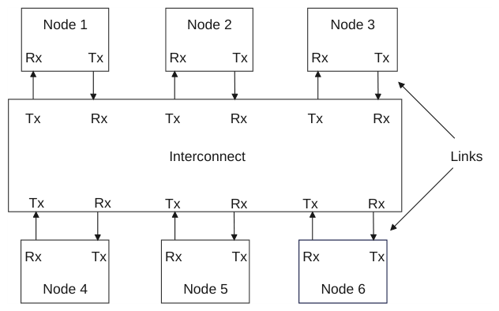

图 B13.1：使用基于链路通信的系统

接口奇偶校验信号（在 B9.3 Use of interface parity 中讨论）不在本章范围内。

### B13.2 链路

Flit 通信发生在一对发送方（Transmitter）与接收方（Receiver）之间。

发送方与接收方之间的连接称为链路。

节点与互连之间的双向通信需要一对链路。

图 B13.2 展示了链路的要求。

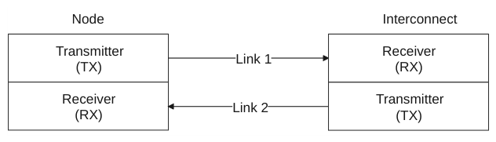

图 B13.2：双向链路通信

#### B13.2.1 出站链路与入站链路

发送方用于发送数据包的链路定义为出站链路。

接收方用于接收数据包的链路定义为入站链路。

图 B13.3 展示了节点处的出站链路和入站链路。互连处的接口具有一对互补的链路。

图 B13.3：出站链路与入站链路

### B13.3 Flit

flit 是链路层中的基本传输单元。

数据包被格式化为 flit 并跨链路传输。flit 有两种类型：

协议 flit 协议 flit 在其载荷中携带协议数据包。每个协议数据包恰好映射到一个协议 flit。

链路 flit 链路 flit 携带与链路维护相关的消息。例如，在链路去激活序列期间，发送方使用 LCRdReturn 向接收方返回链路层信用（L-Credit）。链路 flit 起源于链路发送方，终止于连接在链路另一侧的链路接收方。

### B13.4 通道

链路层提供了一组用于 flit 通信的通道。

每个通道都有一个已定义的 flit 格式，该格式包含多个字段，且其中某些字段宽度具有多种可能取值。在某些情况下，已定义的 flit 格式既可以用于入站通道，也可以用于出站通道。

表 B13.1 展示了各通道，以及它们到请求节点和从属节点组件通道的映射。

表 B13.1：通道到请求节点和从属节点组件通道的映射

通道 描述 用途 请求节点通道 从属节点通道

REQ Request 请求通道 所有请求 TXREQ RXREQ 传输与请求消息（例如读请求和写请求）相关联的 flit。参见 B13.8.1 Request, REQ, channel。

RSP 响应通道 来自以下者的响应 RXRSP TXRSP Response 传输与完成方响应消息相关联的 flit，这些消息没有数据载荷，例如写完成消息。参见 B13.8.2 Response, RSP, channel。

Snoop Response 与 Completion Acknowledge

SNP Snoop 侦听通道 所有侦听请求 RXSNP - 传输与 Snoop 和 SnpDVMOp Request 消息相关联的 flit。参见 B13.8.3 Snoop, SNP, channel。

DAT Data 数据通道传输 WriteData，以及 TXDAT RXDAT 与协议相关联的 flit，这些消息具有数据载荷，例如读完成和 WriteData 消息。来自请求节点的 Snoop 响应数据。参见 B13.8.4 Data, DAT, channel。

读数据 RXDAT TXDAT

#### B13.4.1 通道依赖关系

协议中允许通道之间存在以下依赖关系。

对于请求节点（Request Node）：

- 必须在入站 SNP 通道上取得向前推进，而不要求出站 REQ 通道取得向前推进。
- 允许（但并非必须）等待出站 RSP 通道取得向前推进之后，再在入站 SNP 通道上取得向前推进。
- 允许（但并非必须）等待出站 DAT 通道取得向前推进之后，再在入站 SNP 通道上取得向前推进。
- 必须在入站 RSP 通道上取得向前推进，而不要求任何其他通道取得向前推进。
- 必须在入站 DAT 通道上取得向前推进，而不要求任何其他通道取得向前推进。

> **注意**
>
> 请求节点必须在入站 RSP 和 DAT 通道上取得向前推进、而不要求任何其他通道取得向前推进，这一要求意味着请求节点必须能够接收未完成事务的所有 Comp 和 CompData 响应，而无需发送任何 CompAck 响应。

对于从属节点（Subordinate Node）：

- 允许（但并非必须）等待出站 RSP 通道取得向前推进之后，再在入站 REQ 通道上取得向前推进。
- 当 Retry_Support 为：
- True：必须在入站 REQ 通道上取得向前推进，而不要求出站 DAT 通道取得向前推进。
- RP0_Only：必须在 RP0 的入站 REQ 通道上取得向前推进，而不要求出站 DAT 通道取得向前推进。允许（但并非必须）从属节点等待出站 DAT 通道取得向前推进之后，再在 RP1 至 RP7 的入站 REQ 通道上取得向前推进。
- False：允许（但并非必须）等待出站 DAT 通道取得向前推进之后，再在入站 REQ 通道上取得向前推进。
- 必须在入站 DAT 通道上取得向前推进，而不要求任何其他通道取得向前推进。

### B13.5 端口

端口（Port）定义为节点接口处所有链路的集合。

图 B13.4 展示了链路、通道与端口之间的关系。具体节点要求参见 B13.6 节点接口定义。信号细节参见 B13.8 通道接口信号，以及第 B14 章 链路握手。

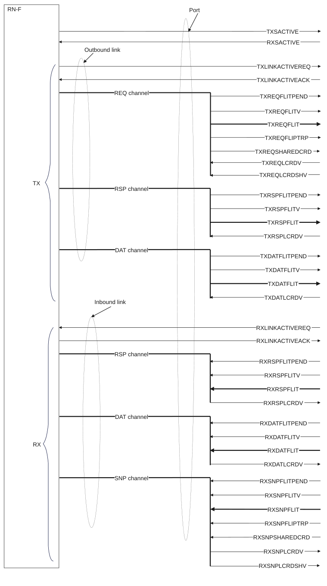

图 B13.4：链路、通道与端口之间的关系

### B13.6 节点接口定义

节点通过跨节点接口发送 flit 来交换消息。本节描述 CHI 协议支持的两种节点接口类型：

- B13.6.1 请求节点
- B13.6.2 从属节点

> **注意**
>
> 各节点用于链路管理的 LINKACTIVE 接口引脚和信号在第 B14 章 链路握手 中描述。

#### B13.6.1 请求节点

本节描述请求节点接口：

- B13.6.1.1 RN-F
- B13.6.1.2 RN-D
- B13.6.1.3 RN-I

##### B13.6.1.1 RN-F

RN-F 接口使用所有通道，供完全一致性请求方（如核心或集群）使用。

图 B13.5 展示了 RN-F 接口。

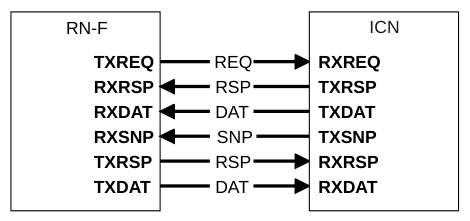

图 B13.5：RN-F 接口

##### B13.6.1.2 RN-D

RN-D 接口使用所有通道，供处理 DVM 消息的 IO 一致性节点使用。SNP 通道的使用仅限于 DVM 事务。详细信息参见 B8.2 DVM 事务流。

图 B13.6 展示了 RN-D 接口。

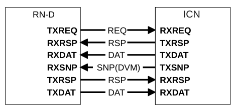

图 B13.6：RN-D 接口

##### B13.6.1.3 RN-I

RN-I 接口使用除 SNP 通道之外的所有通道，供 GPU 或 IO 桥等 IO 一致性 Request Node 使用。由于 RN-I 节点不包含硬件一致性缓存或 TLB，因此不需要 SNP 通道。

图 B13.7 展示了 RN-I 接口。

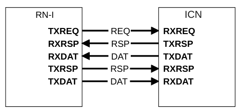

图 B13.7：RN-I 接口

#### B13.6.2 从属节点

本节介绍从属节点接口：

- B13.6.2.1 SN-F 与 SN-I

##### B13.6.2.1 SN-F 与 SN-I

SN-F 和 SN-I 接口完全相同，使用一个 RX 请求通道、一个 TX 响应通道、一个 TX 数据通道和一个 RX 数据通道。SN-F 和 SN-I 从互连接收请求消息，并向互连返回响应消息。不过，SN-F 和 SN-I 接收到的事务类型不同。

图 B13.8 展示了 SN-F 和 SN-I 接口。

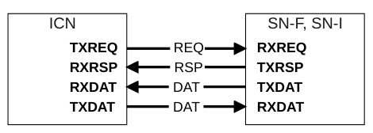

图 B13.8：SN-F 和 SN-I 接口

### B13.7 提高端口间带宽

节点接口的可用带宽可以通过多种方式提高。以下各节详细介绍了两种允许使用的架构方法：

- B13.7.1 多个接口
- B13.7.2 单个接口上的复制通道

#### B13.7.1 多个接口

组件提高可用带宽最简单的方法是采用多个接口。一个完整的接口可以被复制。节点上某个接口被复制的次数由实现决定。

图 B13.9 给出了复制接口的示例。

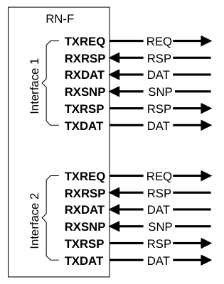

图 B13.9：多接口示例

这种通过两个接口提高带宽的方法的主要特点是：

- 每个接口都有自己的：
- NodeID
- TxnID 池
- 一组 SACTIVE 信号
- 一组 LINKACTIVE 信号
- 一组 SYSCOREQ/SYSCOACK 信号
- 一组可选的广播控制引脚
- 每个复制接口都必须被视为一个独立的接口：
- 如果一个接口分配了缓存行，则另一个复制接口不能释放该缓存行。
- 在响应请求时，完成方必须在与该请求所使用的相同接口上发送响应。
- 必须将侦听发送到用于导致某个缓存行分配的那个事务所使用的相同接口。
- 来自一个接口的事务必须能够向前推进，而不要求复制接口上的事务向前推进。
- 即使只有部分通道需要提高带宽，也必须复制所有通道。

##### B13.7.1.1 地址条带化

允许一种可选优化：Request Node 可以指定用于在多个接口之间进行选择的地址条带化方式。可以为任意数量的接口指定该方式。

允许 Request Node 使用地址条带化将其请求引导到合适的接口，而无需声明所使用的条带化算法。

归属节点通常可以基于侦听过滤器来过滤侦听。如果侦听过滤器是精确的，则会跟踪缓存了该缓存行的请求方的节点 ID，并针对随后对同一缓存行的请求，在单个接口上发送侦听。如果侦听过滤器跟踪不精确，或者其规模是按系统中的组件数量而非 Request Node 接口数量来设定的，则无法隔离出发送侦听所需的那个单一接口，除非该侦听过滤器知道并使用与请求方相同的地址条带化算法。

当 Request Node 未声明其条带化算法时，要么需要增大侦听过滤器，要么归属节点必须发送冗余侦听。建议使用地址条带化的 Request Node 公布其条带化算法，以便归属节点使用。

Request Node 所使用的地址条带化可以通过哈希函数来指定。

##### B13.7.1.2 哈希函数示例

本节描述一种建议采用的哈希函数，用于将请求分发到多个 REQ 接口。同一哈希函数也可用于将侦听分发到多个可用的 SNP 接口。生成接口编号的步骤如下：

1. 缓存行对齐的输入地址首先经过预定义的 Hash Mask 过滤。在过滤地址之前，未使用的高位地址位必须全为零。在本示例中，过滤的结果为 Mask_Result。
2. 对 Mask_Result 的各个比特进行异或（XOR）运算，以得到目标接口。

当接口数量为 2 的幂时：

- 对于 2 个接口：

Interfaces[0] = Mask_Result[n-1] ˆ Mask_Result[n-2] ... Mask_Result[7] ˆ Mask_Result[6]

- 对于 4 个接口：

Interfaces[1:0] = Mask_Result[n-1:n-2] ˆ Mask_Result[n-3:n-4] ... Mask_Result[9:8] ˆ Mask_Result[7:6]

- 对于 8 个接口：

Interfaces[2:0] = Mask_Result[n-1:n-3] ˆ Mask_Result[n-4:n-6] ... Mask_Result[11:9] ˆ Mask_Result[8:6]

本示例未涵盖接口数量不是 2 的幂的情况。

#### B13.7.2 单接口上的复制通道

与通过更复杂的方法复制一个完整接口相比，一种更高效的提升可用接口带宽的方法是有选择地复制那些需要更大带宽的通道。

图 B13.10 给出了复制通道的一个示例。

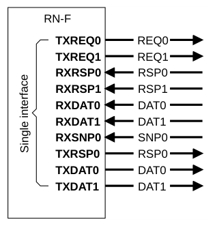

图 B13.10：复制通道示例

##### B13.7.2.1 特性

本节描述这种提升可用带宽方法的主要特性。

每个通道都可以被有选择地复制。对哪些通道被复制没有限制。通常，通道的复制基于该通道所需的预期带宽。例如，在图 B13.10 中，TXREQ 被复制为 TXREQ0、TXREQ1，而 RXSNP 未被复制，只有 RXSNP0。复制通道接口的特性如下：

- 对应于单个 DAT 通道的所有复制的 DAT 子通道必须具有相同的宽度。
- 整个接口必须使用：
- 相同的 NodeID
- 单个 TxnID 池
- 事务内的消息可以使用任意子通道：
- 响应消息无需使用与请求相同的子通道。例如，TXREQ0 上的请求可以在 RXRSP0 或 RXRSP1 上给出响应。
- 单个请求的多个响应消息可以来自任意子通道。例如，写事务的 DBIDResp 在 RXRSP0 上接收，而相应的 Comp 可以在 RXRSP1 上接收。
- 与非复制通道一样，复制通道不提供任何通道内顺序保证。
- 所有链路信用（credit）均以子通道为单位进行分配。
- 不能使用 TXREQ0 的信用在 TXREQ1 上发送 flit。
- 接收方需要在所有子通道上提供信用。
- 协议信用针对合并后的 TXREQ 通道。
- 不支持单独对某个子通道断电。
- DVM 侦听的两个部分可以来自任一子通道。每个部分可以位于不同的子通道上。
- 两个相连接口上的子通道数量必须匹配。
- 必须只有一组 SACTIVE、LINKACTIVE 和 SYSCOREQ/SYSCOACK 信号，以及

可选的广播控制引脚。

- 当接口包含复制的 DAT 通道时，接口属性 CCF_Wrap_Order 不允许设置为 True。

> **注意**
>
> 当某个通道在接口上被复制后，一个传输使用哪个子通道是由实现定义的（IMPLEMENTATION SPECIFIC）。

### B13.8 通道接口信号

本节介绍通道接口信号，包含以下章节：

- B13.8.1 Request（REQ）通道
- B13.8.2 Response（RSP）通道
- B13.8.3 Snoop（SNP）通道
- B13.8.4 Data（DAT）通道

#### B13.8.1 Request（REQ）通道

图 B13.11 展示了 REQ 通道接口引脚，其中 R 是 REQFLIT 的宽度。

图 B13.11：REQ 通道接口引脚

表 B13.2 展示了 REQ 通道接口信号。

表 B13.2：REQ 通道接口信号

| Signal | Presence | Description |
| --- | --- | --- |
| REQFLITPEND | Always. | Request Flit Pending。提前指示下一个周期可能发送一个 REQ flit。参见 B14.4 Flit level clock gating。 |
| REQFLITV | Always. | Request Flit Valid。发送方将该信号置为 HIGH，以指示 REQFLIT[(R-1):0] 何时有效。 |
| REQFLIT[(R-1):0] | Always. | Request Flit。REQ flit 格式的说明参见 B13.9.1 Request flit。 |
| REQFLITRP[clog2(Num_RP_REQ)-1:0] | Num_RP_REQ > 1 | Request Flit Resource Plane Identifier。指示 REQFLIT[(R-1):0] 正在哪个 RP 上传输。 |
|  |  | 下页续 |

表 B13.2 – 续上页

| Signal | Presence | Description |
| --- | --- | --- |
| REQSHAREDCRD | Shared_Credits_REQ == True | Request Shared Credits。指示发送方正在使用一个 REQ 共享信用。 |

REQLCRDV[(Num_RP_REQ)-1:0] Always. Request L-Credit Valid。接收方将 REQLCRDV 信号的某一位置为 HIGH，以向发送方授予对应 RP 的 REQ 通道 L-Credit。参见 B14.2.1 L-Credit flow control。

REQLCRDSHV Shared_Credit_REQ == True Request Shared L-Credit Valid。接收方将该信号置为 HIGH，以向发送方授予一个 REQ 通道共享 L-Credit。

#### B13.8.2 Response（RSP）通道

图 B13.12 展示了 RSP 通道接口引脚，其中 T 是 RSPFLIT 的宽度。入站和出站 RSP 通道使用相同的接口。

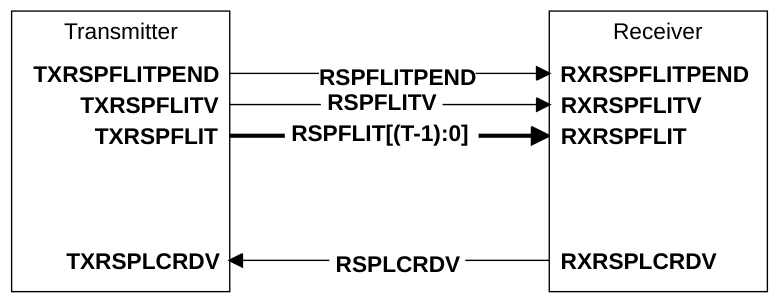

图 B13.12：RSP 通道接口引脚

表 B13.3 展示了 RSP 通道接口信号。

表 B13.3：RSP 通道接口信号

| Signal | Presence | Description |
| --- | --- | --- |
| RSPFLITPEND | Always. | Response Flit Pending。提前指示下一个周期可能发送一个 RSP flit。参见 B14.4 Flit level clock gating。 |
| RSPFLITV | Always. | Response Flit Valid。发送方将该信号置为 HIGH，以指示 RSPFLIT[(T-1):0] 何时有效。 |
|  |  | 下页续 |

表 B13.3 – 续上页

| Signal | Presence | Description |
| --- | --- | --- |
| RSPFLIT[(T-1):0] | Always. | Response Flit。RSP flit 格式的说明参见 B13.9.2 Response flit。 |
| RSPLCRDV | Always. | Response L-Credit Valid。接收方将该信号置为 HIGH，以向发送方授予一个 RSP 通道 L-Credit。参见 B14.2.1 L-Credit flow control。 |

#### B13.8.3 Snoop（SNP）通道

图 B13.13 展示了 SNP 通道接口引脚，其中 S 是 SNPFLIT 的宽度。

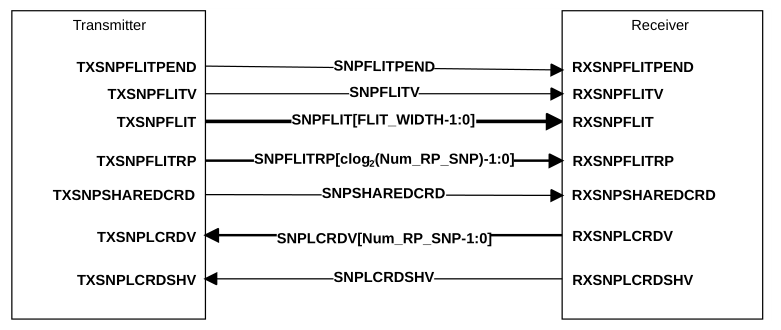

图 B13.13：SNP 通道接口引脚

表 B13.4 展示了 SNP 通道接口信号。

表 B13.4：SNP 通道接口信号

| Signal | Presence | Description |
| --- | --- | --- |
| SNPFLITPEND | Always. | Snoop Flit Pending。提前指示下一个周期可能发送一个 SNP flit。参见 B14.4 Flit level clock gating。 |
| SNPFLITV | Always. | Snoop Flit Valid。发送方将该信号置为 HIGH，以指示 SNPFLIT[(S-1):0] 何时有效。 |
| SNPFLIT[(S-1):0] | Always. | Snoop Flit。SNP flit 格式的说明参见 B13.9.3 Snoop flit。 |

下页续

表 B13.4 – 续上页

| Signal | Presence | Description |
| --- | --- | --- |
| SNPLCRDV | Always. | Snoop L-Credit Valid。接收方将该信号置为 HIGH，以向发送方授予一个 SNP 通道 L-Credit。参见 B14.2.1 L-Credit flow control。 |
| SNPFLITRP[clog2(Num_RP_SNP)-1:0] | Num_RP_SNP > 1 | Snoop Flit Resource Plane Identifier。指示 SNPFLIT[(R-1):0] 正在哪个 RP 上传输。 |
| SNPSHAREDCRD | Shared_Credits_SNP == True | Snoop Shared Credits。指示发送方正在使用一个 SNP 共享信用。 |
| SNPLCRDV[(Num_RP_SNP)-1:0] | Always. | Snoop L-Credit Valid。接收方将 SNPLCRDV 信号的某一位置为 HIGH，以向发送方授予对应 RP 的 SNP 通道 L-Credit。 |
| SNPLCRDSHV | Shared_Credits_SNP == True | Snoop Shared L-Credit Valid。接收方将该信号置为 HIGH，以向发送方授予一个 SNP 通道共享 L-Credit |

#### B13.8.4 Data、DAT 通道

图 B13.14 示出 DAT 通道接口引脚，其中 D 为 DATFLIT 的宽度。入站和出站 DAT 通道使用同一接口。

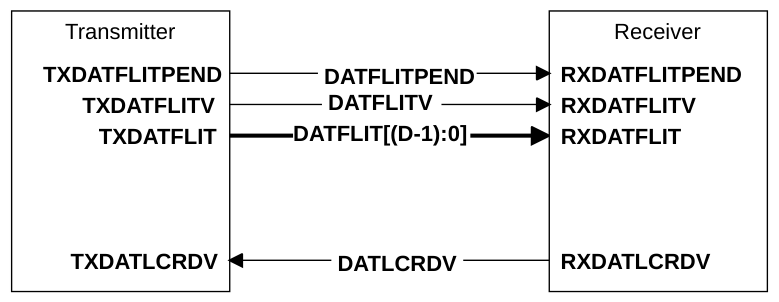

图 B13.14：DAT 通道接口引脚

表 B13.5 示出 DAT 通道接口信号。

表 B13.5：DAT 通道接口信号

| 信号 | 存在性 | 描述 |
| --- | --- | --- |
| DATFLITPEND | 始终存在。 | 数据 flit 待发。提前指示下一个周期可能发送 DAT flit。参见 B14.4 Flit 级时钟门控。 |
| DATFLITV | 始终存在。 | 数据 flit 有效。发送方将该信号置为 HIGH，以指示 DATFLIT[(D-1):0] 何时有效。 |
| DATFLIT[(D-1):0] | 始终存在。 | 数据 flit。关于 DAT flit 格式的说明，参见 B13.9.4 数据 flit。 |
| DATLCRDV | 始终存在。 | 数据 L-Credit 有效。接收方将该信号置为 HIGH，以向发送方授予 DAT 通道 L-Credit。参见 B14.2.1 L-Credit 流控。 |

### B13.9 flit 数据包定义

本节定义 flit 格式。参见：

- B13.9.1 请求 flit
- B13.9.2 响应 flit
- B13.9.3 侦听 flit
- B13.9.4 数据 flit

#### B13.9.1 请求 flit

表 B13.6 示出 REQ 通道数据包中从位 0 开始的请求 flit 格式。

使用以下键：

MBZ 必须为零（Must Be Zero）

表 B13.6：请求 flit 格式

| REQFLIT[(R-1):0] 格式字段 | 字段宽度 | 备注 |
| --- | --- | --- |
| QoS | 4 | - |
| TgtID | 7 至 16 | 宽度由 NodeID_Width 确定 |
| SrcID | 7 至 16 | 宽度由 NodeID_Width 确定 |
| TxnID | 12 | - |

ReturnNID 7 至 16 用于 DMT

StashNID 用于 Stash 事务

{(NodeID_Width - 7)’b0, MBZ

DataTarget[6:0]} 用于辅助在系统缓存层级中放置数据

StashNIDValid 1 用于 Stash 事务

Endian 用于 Atomic 事务

Deep 用于 CleanSharedPersist* 事务

PrefetchTgtHint 面向 Chip-to-Chip 接收方的提示

ReturnTxnID[11:0] 12 用于 DMT

{6’b0, MBZ

StashLPIDValid, 用于 Stash 事务

| StashLPID[4:0]} |  | 用于 Stash 事务 |
| --- | --- | --- |
| Opcode | 7 | - |
| MultiReq | 1 | 用于多请求事务。 |
| NumReq {3’b0, Size} | 6 | 字段由 MultiReq 值确定 |
| Addr | RAW = 44 至 52 | 宽度由 Req_Addr_Width (RAW) 确定 |

下页续

表 B13.6 – 续上页

| REQFLIT[(R-1):0] 格式字段 | 字段宽度 | 备注 |
| --- | --- | --- |
| PAS | 3 | - |
| LikelyShared | 1 | - |
| AllowRetry | 1 | - |
| Order | 2 | - |
| PCrdType | 4 | - |
| MemAttr | 4 | - |
| SnpAttr DoDWT | 1 | - 用于 DWT |

PGroupID[7:0] 8 用于 PCMO 事务

StashGroupID[7:0] 用于 StashOnceSep 事务

TagGroupID[7:0] 用于内存标记

{3’b0, MBZ

| LPID[4:0]} |  | - |
| --- | --- | --- |
| Excl SnoopMe CAH | 1 | 用于 Exclusive 事务 用于 Atomic 事务 用于 CopyBack 写事务 |
| ExpCompAck | 1 | - |
| TagOp | 2 | - |
| TraceTag | 1 | - |
| MPAM | M = 0 M = 12, 15 | 无 MPAM 总线 - |
| PBHA | PB = 0 PB = 4 | 无 PBHA 总线 - |

MECID E = 0 无 MECID 总线

E = 16 用于 RME-MEC

StreamID R = 0 无 StreamID 总线

R = 16 用于 RME-CDA

公共字段为 Max(E,R)

SecSID1 S = 0 无 SecSID1 位

S = 1 用于 RME-CDA

RSVDC Y = 0 无 RSVDC 总线

Y = 4, 8, 12, 16, 24, 32 宽度由 Req_RSVDC_Width 确定。

下页续

表 B13.6 – 续上页

| REQFLIT[(R-1):0] 格式字段 | 字段宽度 | 备注 |
| --- | --- | --- |
| Total | (93 + RAW + Y + M + PB + S + Max(E,R)) 至 (120 + RAW + Y + M + PB + S + Max(E,R)) |  |

#### B13.9.2 Response flit

表 B13.7 显示了 RSP 通道数据包中从 bit 0 开始的 Response flit 格式。

使用如下键值说明：

MBZ 必须为零

表 B13.7：Response flit 格式

| RSPFLIT[(T-1):0] 格式字段 | 字段宽度 | 备注 |
| --- | --- | --- |
| QoS | 4 | - |
| TgtID | 7 to 16 | 宽度由 NodeID_Width 决定 |
| SrcID | 7 to 16 | 宽度由 NodeID_Width 决定 |
| TxnID | 12 | - |
| Opcode | 5 | - |
| RespErr | 2 | - |
| Resp | 3 | - |
| FwdState[2:0] {2’b0, DataPull} | 3 | 用于 DCT MBZ 用于 Stash 事务 |
| CBusy | 3 | - |

DBID[11:0] 12 -

{4’b0, MBZ

PGroupID[7:0]} 用于 Persistent CMO 事务

{4’b0, MBZ

StashGroupID[7:0]} 用于 Stash 事务

{4’b0, MBZ

| TagGroupID[7:0]} |  | 用于内存标记 |
| --- | --- | --- |
| PCrdType | 4 | - |
|  |  | 下页续 |

表 B13.7 – 续上页

| RSPFLIT[(T-1):0] 格式字段 | 字段宽度 | 备注 |
| --- | --- | --- |
| TagOp | 2 | - |
| TraceTag | 1 | - |
| CacheLineID 总计 | 6 T = 71 to 89 | 用于多请求事务 |

#### B13.9.3 Snoop flit

表 B13.8 显示了 SNP 通道数据包中从 bit 0 开始的 Snoop flit 格式。

使用如下键值说明：

MBZ 必须为零

表 B13.8：Snoop flit 格式

| SNPFLIT[(S-1):0] 格式字段 | 字段宽度 | 备注 |
| --- | --- | --- |
| QoS | 4 | - |
| SrcID | 7 to 16 | 宽度由 NodeID_Width 决定 |
| TxnID | 12 | - |
| FwdNID {(NodeID_Width - 4)’0, PBHA[3:0]} | 7 to 16 | 宽度由 NodeID_Width 决定 |

FwdTxnID[11:0] 12 用于 DCT

{6’b0, MBZ

StashLPIDValid, 用于 Stash 事务

StashLPID[4:0]} 用于 Stash 事务

{4’b0, MBZ

| VMIDExt[7:0]} |  | 用于 DVM 事务 |
| --- | --- | --- |
| Opcode | 5 | - |
| Addr | SAW = 41 to 49 | Req_Addr_Width - 3 |
| PAS | 3 | - |
| DoNotGoToSD | 1 | - |
| RetToSrc | 1 | - |
| TraceTag | 1 | - |
| MPAM | M = 0 | 无 MPAM 总线 下页续 |

表 B13.8 – 续上页

| SNPFLIT[(S-1):0] 格式字段 | 字段宽度 | 备注 |
| --- | --- | --- |
|  | M = 12, 15 | - |

MECID E = 0 无 MECID 总线

E = 16 用于 RME-MEC

总计 S = (53 + SAW + M + E) to (71 + SAW + M + E)

#### B13.9.4 Data flit

表 B13.9 显示了 DAT 通道数据包中从 bit 0 开始的 Data flit 格式。

所需的 data flit 数量取决于数据字节数和数据总线宽度。见 B2.9.4 Data packetization。

数据通道接口支持 128-bit、256-bit 和 512-bit 的数据总线宽度。共定义了三种 data flit 格式，分别对应数据通道接口所支持的三种数据总线宽度。

DataCheck 字段宽度为 0，或等于 Data 字段宽度除以 8。

Poison 字段宽度为 0，或等于 Data 字段宽度除以 64。

使用如下键值说明：

MBZ 必须为零

表 B13.9：Data flit 格式

| DATFLIT[(D-1):0] 格式字段 | 字段宽度 | 备注 |
| --- | --- | --- |
| QoS | 4 | - |
| TgtID | 7 to 16 | 宽度由 NodeID_Width 决定 |
| SrcID | 7 to 16 | 宽度由 NodeID_Width 决定 |
| TxnID | 12 | - |

HomeNID 7 to 16 宽度由 NodeID_Width 决定

{(NodeID_Width - 5)’b0,

MismatchedMECID,

PBHA[3:0]}

Opcode 4 -

RespErr 2 -

Resp 3 -

DataSource[7:0] 8 指示响应中的数据源

{5’b0, MBZ

下页续

表 B13.9 – 续上页

| DATFLIT[(D-1):0] 格式字段 | 字段宽度 | 备注 |
| --- | --- | --- |
| FwdState[2:0]} |  | 用于 DCT |
| DataPull | 1 | 用于 Stash 事务 |
| CBusy | 3 | - |
| MECID {4’b0, DBID[11:0]} | E = 0 E = 16 16 | 无 MECID 总线 用于 RME-MEC - |
| CCID | 2 | - |
| DataID | 2 | - |
| CacheLineID | 6 | - |
| TagOp | 2 | - |
| Tag | DW/32 = 4, 8, 16 | - |
| TU | DW/128 = 1, 2, 4 | - |
| TraceTag | 1 | - |
| CAH | 1 | - |
| NumDat | 2 | - |
| Replicate | 1 | - |
| RSVDC | Y = 0 Y = 4, 8, 12, 16, 24, 32 | 无 RSVDC 总线 宽度由 Dat_RSVDC_Width 决定。 |
| BE | DW/8 = 16, 32, 64 | - |
| Data | DW = 128, 256, 512 | DW = B16.1.13 Data_Width |
| DataCheck | 0 or DW/8 = 16, 32, 64 | DC = DataCheck |

Poison 0 or DW/64 = 2, 4, 8 P = Poison

总计 D = (240 to 267) + Y + DC + P DW = 128-bit 数据

D = (389 to 416) + Y + DC + P DW = 256-bit 数据

D = (687 to 714) + Y + DC + P DW = 512-bit 数据

### B13.10 协议 flit 字段

协议 flit 通过 opcode 字段中的非 0 值来标识。本节定义的所有 flit 字段均适用于协议 flit。以下各节描述协议 flit 字段的编码：

- B13.10.1 服务质量，QoS
- B13.10.2 目标标识符，TgtID
- B13.10.3 源标识符，SrcID
- B13.10.4 归属节点标识符，HomeNID
- B13.10.5 返回节点标识符，ReturnNID
- B13.10.6 转发节点标识符，FwdNID
- B13.10.7 逻辑处理器标识符，LPID
- B13.10.8 Persistence Group 标识符，PGroupID
- B13.10.9 Stash 节点标识符，StashNID
- B13.10.10 Stash 节点标识符有效，StashNIDValid
- B13.10.11 Stash 逻辑处理器标识符，StashLPID
- B13.10.12 Stash 逻辑处理器标识符有效，StashLPIDValid
- B13.10.13 Stash Group 标识符，StashGroupID
- B13.10.14 事务标识符，TxnID
- B13.10.15 返回事务标识符，ReturnTxnID
- B13.10.16 转发事务标识符，FwdTxnID
- B13.10.17 数据缓冲区标识符，DBID
- B13.10.18 通道 opcode，Opcode
- B13.10.19 Deep 持久化，Deep
- B13.10.20 地址，Addr
- B13.10.21 事务数据大小，Size
- B13.10.22 内存属性，MemAttr
- B13.10.23 Snoop 属性，SnpAttr
- B13.10.24 执行直接写传输，DoDWT
- B13.10.25 LikelyShared
- B13.10.26 排序要求，Order
- B13.10.27 Exclusive，Excl
- B13.10.28 CopyAtHome，CAH
- B13.10.29 基于页的硬件属性，PBHA
- B13.10.30 Endian
- B13.10.31 AllowRetry
- B13.10.32 ExpCompAck
- B13.10.33 SnoopMe
- B13.10.34 返回源，RetToSrc
- B13.10.35 DataPull
- B13.10.36 不转换到 SD 状态，DoNotGoToSD
- B13.10.37 协议信用类型，PCrdType
- B13.10.38 Tag 操作，TagOp
- B13.10.39 Tag
- B13.10.40 Tag 更新，TU
- B13.10.41 Tag Group 标识符，TagGroupID
- B13.10.42 跟踪 Tag，TraceTag
- B13.10.43 内存系统资源分区与监控，MPAM
- B13.10.44 虚拟机标识符扩展，VMIDExt
- B13.10.45 响应错误，RespErr
- B13.10.46 响应状态，Resp
- B13.10.47 转发状态，FwdState
- B13.10.48 完成方忙，CBusy
- B13.10.49 数据载荷，Data
- B13.10.50 关键块标识符，CCID
- B13.10.51 DataID
- B13.10.52 字节使能，BE
- B13.10.53 DataCheck
- B13.10.54 Poison
- B13.10.55 数据源，DataSource
- B13.10.56 DataTarget
- B13.10.57 PrefetchTgtHint
- B13.10.58 省略的 DAT 包数量，NumDat
- B13.10.59 Replicate
- B13.10.60 客户专用保留，RSVDC
- B13.10.61 内存加密上下文标识符，MECID
- B13.10.62 流标识符，StreamID
- B13.10.63 流标识符安全状态，SecSID1
- B13.10.64 MultiReq
- B13.10.65 NumReq

#### B13.10.1 服务质量，QoS

QoS 字段用于为事务分配服务质量（QoS）值。QoS 取值递增表示优先级更高。

参见 B11.1 服务质量（QoS）机制。

#### B13.10.2 目标标识符，TgtID

TgtID 字段是消息所发往的目标组件的节点 ID。互连用它来确定消息发送到哪个端口。

参见 B2.4.1 目标标识符 TgtID 和源标识符 SrcID。

#### B13.10.3 源标识符，SrcID

SrcID 字段是发送消息的组件的节点 ID。互连用它来确定消息从哪个端口发出。

参见 B2.4.1 目标标识符 TgtID 和源标识符 SrcID。

#### B13.10.4 Home Node Identifier, HomeNID

HomeNID 字段与原始请求相关联。请求方使用该字段中的值来确定为响应 CompData 而发送的 CompAck 的 TgtID。

HomeNID 字段适用于 CompData 和 DataSepResp。

HomeNID 字段在其它所有 Data 消息中不适用，且必须为零。

参见 B2.4.11 Home Node Identifier, HomeNID。

#### B13.10.5 Return Node Identifier, ReturnNID

ReturnNID 字段标识从属节点向其发送 CompData、DataSepResp 或 Persist 响应的节点。当 DoDWT = 1 时，该字段还指示从属节点向其发送 DBIDResp 的节点。该值可以是归属节点的节点 ID，也可以是发起该事务的请求方的节点 ID。

在 ReadNoSnp、ReadNoSnpSep、CleanSharedPersistSep、WriteNoSnp、WriteNoSnpDef、Combined Write 和 Atomic 请求中，ReturnNID 字段适用于从归属节点到从属节点的方向。

对于其它所有请求，ReturnNID 字段不适用，且必须为零。对于 Stash 请求，数据包中的相同位用于 StashNID。

参见 B2.4.10 Return Node Identifier, ReturnNID。

#### B13.10.6 Forward Node Identifier, FwdNID

FwdNID 字段标识可向其转发 CompData 响应的请求方。该值必须是发起该事务的请求方的节点 ID。

FwdNID 字段适用于 Forward 类型的侦听。

除基于范围的 TLBI DVM 操作外，FwdNID 字段在其它所有侦听请求中不适用，且必须为零。

在基于范围的 TLBI DVM 操作中，该字段中的位用于 DVM 载荷。

参见 B2.4.12 Forward Node Identifier, FwdNID。

#### B13.10.7 Logical Processor Identifier, LPID

当单个请求方包含多个逻辑上独立的处理代理时，使用 LPID 字段。SrcID 与 LPID 结合使用，以唯一标识生成该请求的 LP。

对于以下事务，LPID 字段必须设置为正确的值：

- 对于任何不可侦听、不可缓存或 Device 访问：
- ReadNoSnp
- WriteNoSnp
- WriteNoSnpDef
- 对于 Exclusive 访问，可以是以下事务类型之一：
- ReadClean
- ReadShared
- ReadNotSharedDirty
- ReadPreferUnique
- MakeReadUnique
- CleanUnique
- ReadNoSnp
- WriteNoSnp

更多详细信息参见 B6 章 Exclusive 访问。

在请求中，当适用时，数据包中的相同位用于 TagGroupID、PGroupID 和 StashGroupID。

对于其它事务，允许但不要求使用 LPID 字段值来指示导致事务发起的原始 LP。

参见 B2.4.7 Logical Processor Identifier, LPID。

#### B13.10.8 Persistence Group Identifier, PGroupID

请求方使用 PGroupID 字段，通过将不同的 CleanSharedPersistSep 事务集合分组在一起来识别和处理它们。

PGroupID 字段适用于 CleanSharedPersistSep 和 Write*CleanShPerSep 请求，以及 Persist 和 CompPersist 响应。

PGroupID 字段在其它所有请求和响应中不适用，且必须为零。

在请求中，当适用时，数据包中的相同位用于 LPID、TagGroupID 和 StashGroupID。

在响应中，当适用时，数据包中的相同位用于 DBID、TagGroupID 和 StashGroupID。

参见 B2.4.13 Persistence Group Identifier, PGroupID。

#### B13.10.9 Stash Node Identifier, StashNID

StashNID 字段标识 Stash 请求的目标。当相应的 StashNIDValid 位为 1 时，StashNID 字段提供有效的暂存目标值。

StashNID 字段适用于 Stash 请求。

对于其它所有请求，StashNID 字段不适用，且必须为零。

对于 ReadNoSnp 和 ReadNoSnpSep 请求，数据包中的相同位用于 ReturnNID。

参见 B7.4 Stash target identifiers。

#### B13.10.10 暂存节点标识符有效位，StashNIDValid

StashNIDValid 字段指示 StashNID 字段是否具有有效取值。

StashNIDValid 字段适用于 Stash 请求。

StashNIDValid 字段在其他所有请求中不适用，且必须为零。

表 B13.10 给出了 StashNIDValid 的取值编码。

表 B13.10：StashNIDValid 取值编码

| StashNIDValid | Description |
| --- | --- |
| 0b0 | StashNID 字段取值不适用，且必须为零 |
| 0b1 | 请求中的 StashNID 字段具有有效的暂存目标 |

StashNIDValid 与 StashLPIDValid 允许的组合，参见表 B7.3。

参见 B7.4 暂存目标标识符。

#### B13.10.11 暂存逻辑处理器标识符，StashLPID

StashLPID 字段提供 StashNID 所指定的请求节点内的有效 LP 目标值。

StashLPID 字段适用于 Stash 请求和 Stash 侦听请求。

对于 ReadNoSnp 请求，数据包中的相同位用于 ReturnTxnID。

StashLPID 字段在其他所有请求和侦听请求中不适用，且必须为零。

对于转发侦听，数据包中的相同位用于 FwdTxnID；对于 SnpDVMOp 侦听，数据包中的相同位用于 VMIDExt。

参见 B7.4 暂存目标标识符。

#### B13.10.12 暂存逻辑处理器标识符有效位，StashLPIDValid

StashLPIDValid 字段指示 StashLPID 字段是否具有有效取值。

StashLPIDValid 字段适用于 Stash 请求和 Stash 侦听请求。

StashLPIDValid 字段在其他所有请求和侦听请求中不适用，且必须为零。

表 B13.11 给出了 StashLPIDValid 的取值编码。

表 B13.11：StashLPIDValid 取值编码

| StashLPIDValid | Description |
| --- | --- |
| 0b0 | StashLPID 字段取值不适用，且必须为零 |
| 0b1 | 请求中的 StashLPID 字段具有有效的暂存目标 |

StashLPIDValid 与 StashNIDValid 允许的组合，参见表 B7.3。

参见 B7.4 暂存目标标识符。

#### B13.10.13 Stash Group 标识符，StashGroupID

StashGroupID 字段由请求方使用，通过将不同的 StashOnceSep 事务分组在一起，来识别和处理这些事务集合。

StashGroupID 字段仅适用于 StashOnceSep 请求和 StashDone 响应。

StashGroupID 字段在其他所有请求和响应中不适用，且必须为零。

在请求中，当该字段适用时，数据包中的相同位用于 LPID、TagGroupID 和 PGroupID。

在响应中，当该字段适用时，数据包中的相同位用于 DBID、TagGroupID 和 PGroupID。

参见 B2.4.14 Stash Group 标识符，StashGroupID。

#### B13.10.14 事务标识符，TxnID

TxnID 字段提供消息的事务 ID。当某个给定源节点存在多个未完成事务时，它们各自使用唯一的事务 ID。

LCRdReturn 中的 TxnID 必须为零。

参见 B2.4.2 事务标识符，TxnID。

#### B13.10.15 返回事务标识符，ReturnTxnID

ReturnTxnID 字段标识从属节点必须在 CompData 和 DataSepResp 响应的 TxnID 字段中使用的值。

ReturnTxnID 字段可以是由归属节点为该事务生成的 TxnID，也可以是来自发起该事务的请求方的请求数据包中的 TxnID。

ReturnTxnID 字段仅适用于从归属节点发往从属节点的 ReadNoSnp、ReadNoSnpSep、WriteNoSnp、WriteNoSnpDef、Combined Write 和 Atomic 请求。

ReturnTxnID 字段在其他所有请求中不适用，且必须为零。

对于 Stash 请求，数据包中的相同位用于 StashLPID。

参见 B2.4.4 返回事务标识符，ReturnTxnID。

#### B13.10.16 转发事务标识符，FwdTxnID

FwdTxnID 字段标识与 Snoop 事务相关联的原始请求的 TxnID 字段。

FwdTxnID 字段适用于 Forward 类型的 snoop。

FwdTxnID 字段在其他所有 Snoop 请求中不适用，必须为零。

对于 Stash snoop，数据包中的相同位用于 StashLPID。

对于 SnpDVMOp snoop，数据包中的相同位用于 VMIDExt。

参见 B2.4.5 Forward Transaction Identifier, FwdTxnID。

#### B13.10.17 数据缓冲区标识符，DBID

DBID 字段用作 Requester 在响应来自 Completer 的响应数据包时所发送的 CompAck 或 WriteData 的 TxnID 字段。

在带 Data Pull 的 Snoop 响应中，DBID 值指示要在 Data Pull 响应消息的 TxnID 字段中使用的值。

在响应中（适用时），数据包中的相同位用于 PGroupID、StashGroupID 和 TagGroupID。

参见 B2.4.3 Data Buffer Identifier, DBID。

#### B13.10.18 通道操作码，Opcode

Opcode 字段指定要执行的操作。Opcode 字段的编码特定于每个通道。各通道的编码如下：

- B13.10.18.1 REQ 通道操作码
- B13.10.18.2 RSP 通道操作码
- B13.10.18.3 SNP 通道操作码
- B13.10.18.4 DAT 通道操作码

##### B13.10.18.1 REQ 通道操作码

表 B13.12 展示了请求通道的操作码。

表 B13.12：REQ 通道操作码

| Opcode[5:0] | 请求命令 Opcode[6] = 0 | Opcode[6] = 1 |
| --- | --- | --- |
| 0x00 | ReqLCrdReturn | Reserved |
| 0x01 | ReadShared | MakeReadUnique |
| 0x02 | ReadClean | WriteEvictOrEvict |
| 0x03 | ReadOnce | WriteUniqueZero |
| 0x04 | ReadNoSnp | WriteNoSnpZero |
| 0x05 | PCrdReturn | Reserved |
| 0x06 | Reserved | Reserved |
| 0x07 | ReadUnique | StashOnceSepShared |
| 0x08 | CleanShared | StashOnceSepUnique |
| 0x09 | CleanInvalid | Reserved |
| 0x0A | MakeInvalid | Reserved |
| 0x0B | CleanUnique | Reserved |
| 0x0C | MakeUnique | ReadPreferUnique |
| 0x0D | Evict | CleanInvalidPoPA |
| 0x0E | CleanInvalidStorage | WriteNoSnpDef |
|  |  | 下页续 |

表 B13.12 – 续上页

| Opcode[5:0] | 请求命令 Opcode[6] = 0 | Opcode[6] = 1 |
| --- | --- | --- |
| 0x0F | Reserved | Reserved |
| 0x10 | Reserved | WriteNoSnpFullCleanSh |
| 0x11 | ReadNoSnpSep | WriteNoSnpFullCleanInv |
| 0x12 | Reserved | WriteNoSnpFullCleanShPerSep |
| 0x13 | CleanSharedPersistSep | Reserved |
| 0x14 | DVMOp | WriteUniqueFullCleanSh |
| 0x15 | WriteEvictFull | Reserved |
| 0x16 | Reserved | WriteUniqueFullCleanShPerSep |
| 0x17 | WriteCleanFull | WriteUniqueFullCleanInvStrg |
| 0x18 | WriteUniquePtl | WriteBackFullCleanSh |
| 0x19 | WriteUniqueFull | WriteBackFullCleanInv |
| 0x1A | WriteBackPtl | WriteBackFullCleanShPerSep |
| 0x1B | WriteBackFull | WriteBackFullCleanInvStrg |
| 0x1C | WriteNoSnpPtl | WriteCleanFullCleanSh |
| 0x1D | WriteNoSnpFull | Reserved |
| 0x1E | Reserved | WriteCleanFullCleanShPerSep |
| 0x1F | Reserved | Reserved |
| 0x20 | WriteUniqueFullStash | WriteNoSnpPtlCleanSh |
| 0x21 | WriteUniquePtlStash | WriteNoSnpPtlCleanInv |
| 0x22 | StashOnceShared | WriteNoSnpPtlCleanShPerSep |
| 0x23 | StashOnceUnique | Reserved |
| 0x24 | ReadOnceCleanInvalid | WriteUniquePtlCleanSh |
| 0x25 | ReadOnceMakeInvalid | Reserved |
| 0x26 | ReadNotSharedDirty | WriteUniquePtlCleanShPerSep |
| 0x27 | CleanSharedPersist | Reserved |
| 0x28 - 0x2F | AtomicStore | Reserved |

0x30 AtomicLoad WriteNoSnpPtlCleanInvPoPA

0x31 WriteNoSnpFullCleanInvPoPA

| 0x32 |  | WriteNoSnpFullCleanInvStrg |
| --- | --- | --- |
| 0x33 - 0x37 |  | Reserved |
| 0x38 | AtomicSwap | Reserved |
| 0x39 | AtomicCompare | WriteBackFullCleanInvPoPA |
|  |  | 下页续 |

表 B13.12 – 续上页

请求命令 Opcode[5:0] Opcode[6] = 0 Opcode[6] = 1

0x3A PrefetchTgt Reserved

0x3B - 0x3F Reserved Reserved

表 B13.13 展示了 AtomicStore 和 AtomicLoad 的子操作码。

表 B13.13：AtomicStore 和 AtomicLoad 的子操作码

| Opcode[5:3] AtomicStore | AtomicLoad | Opcode[2:0] | Operation |
| --- | --- | --- | --- |
| 101 | 110 | 000 | ADD |
|  |  | 001 | CLR |
|  |  | 010 | EOR |
|  |  | 011 | SET |
|  |  | 100 | SMAX |
|  |  | 101 | SMIN |
|  |  | 110 | UMAX |
|  |  | 111 | UMIN |

##### B13.10.18.2 RSP 通道操作码

表 B13.14 列出了响应（Response）通道的操作码。

表 B13.14：RSP 通道操作码

| Opcode[4:0] | Response |
| --- | --- |
| 0x00 | RespLCrdReturn |
| 0x01 | SnpResp |
| 0x02 | CompAck |
| 0x03 | RetryAck |
| 0x04 | Comp |
| 0x05 | CompDBIDResp |
| 0x06 | DBIDResp |
| 0x07 | PCrdGrant |
| 0x08 | ReadReceipt |
| 0x09 | SnpRespFwded |
|  | 下页续 |

表 B13.14 – 续上页

| Opcode[4:0] | Response |
| --- | --- |
| 0x0A | TagMatch |
| 0x0B | RespSepData |
| 0x0C | Persist |
| 0x0D | CompPersist |
| 0x0E | DBIDRespOrd |
| 0x0F | Reserved |
| 0x10 | StashDone |
| 0x11 | CompStashDone |
| 0x12 - 0x13 | Reserved |
| 0x14 | CompCMO |
| 0x15 - 0x1B | Reserved |
| 0x1C - 0x1F | 保留供 C2C 使用。参见 AMBA® CHI 芯片到芯片（C2C）架构规范 |

##### B13.10.18.3 SNP 通道操作码

表 B13.15 列出了侦听（Snoop）通道的操作码。

表 B13.15：SNP 通道操作码

| Opcode[4:0] | Snoop command |
| --- | --- |
| 0x00 | SnpLCrdReturn |
| 0x01 | SnpShared |
| 0x02 | SnpClean |
| 0x03 | SnpOnce |
| 0x04 | SnpNotSharedDirty |
| 0x05 | SnpUniqueStash |
| 0x06 | SnpMakeInvalidStash |
| 0x07 | SnpUnique |
| 0x08 | SnpCleanShared |
| 0x09 | SnpCleanInvalid |
| 0x0A | SnpMakeInvalid |
| 0x0B | SnpStashUnique |
| 0x0C | SnpStashShared |
|  | 下页续 |

表 B13.15 – 续上页

| Opcode[4:0] | Snoop command |
| --- | --- |
| 0x0D | SnpDVMOp |
| 0x0E - 0x0F | Reserved |
| 0x10 | SnpQuery |
| 0x11 | SnpSharedFwd |
| 0x12 | SnpCleanFwd |
| 0x13 | SnpOnceFwd |
| 0x14 | SnpNotSharedDirtyFwd |
| 0x15 | SnpPreferUnique |
| 0x16 | SnpPreferUniqueFwd |
| 0x17 | SnpUniqueFwd |
| 0x18 - 0x1F | Reserved |

##### B13.10.18.4 DAT 通道操作码

表 B13.16 列出了数据（Data）通道的操作码。

表 B13.16：DAT 通道操作码

| Opcode[3:0] | Data command |
| --- | --- |
| 0x0 | DataLCrdReturn |
| 0x1 | SnpRespData |
| 0x2 | CopyBackWriteData |
| 0x3 | NonCopyBackWriteData |
| 0x4 | CompData |
| 0x5 | SnpRespDataPtl |
| 0x6 | SnpRespDataFwded |
| 0x7 | WriteDataCancel |

0x8 - 0xA Reserved

下页续

表 B13.16 – 续上页

| Opcode[3:0] | Data command |
| --- | --- |
| 0xB | DataSepResp |
| 0xC | NonCopyBackWriteDataCompAck |
| 0xD | 保留供 C2C 使用。参见 AMBA® CHI 芯片到芯片（C2C）架构规范 |
| 0xE - 0xF | Reserved |

#### B13.10.19 深度持久化，Deep

Deep 字段由请求方（Requester）使用，用于指示在完成方（Completer）可以提供某些响应之前，写入必须已经写到最终目的地。

Deep 字段适用于 CleanSharedPersist* 请求以及带 CleanSharedPersistSep 的 Combined Write 请求。

Deep 字段在其他所有请求中均不适用，且必须为零。

当 Deep 字段为 0 时：

- 在完成方可发送以下响应之前，所有更早的写入必须已经到达 PoP：
- 针对 CleanSharedPersist 事务的 Comp
- 针对 CleanSharedPersistSep 事务的 Persist 或 CompPersist
- PoP 是指在该点可以保证在断电后仍有足够时间使数据持久化的位置。

当 Deep 字段为 1 时：

- 在完成方可发送以下响应之前，所有更早的写入必须已经写到最终目的地以及 PoP：
- 针对 CleanSharedPersist 事务的 Comp
- 针对 CleanSharedPersistSep 事务的 Persist 或 CompPersist
- 最终目的地是指在该点断电后无需任何时间即可使数据持久化的位置。如果发生电池故障，这可以确保数据得到保全。

有关响应排序保证的更多信息，参见表 B2.7。

#### B13.10.20 地址，Addr

Addr 字段指定与该消息关联的地址。

支持 44 至 52 位的 PA。该地址承载在 REQ 和 SNP 通道的 Addr 字段中。

Addr 字段的宽度由 Req_Addr_Width 参数定义。在 REQ 通道中，Addr 字段宽度与该参数值相同，为 Addr[(43-51):0]；在 SNP 通道中，其宽度比该参数值小 3，为 Addr[(43-51):3]。

Addr 字段在 REQ 和 SNP 通道中的使用方式如下：

- 对于 Read、PrefetchTgt、Dataless、Write 和 Atomic* 事务，Addr 字段包含所访问的

内存位置的地址。其起始为 Addr[0] 映射到 Addr 的位 0。

- 对于侦听请求（SnpDVMOp 除外），Addr 字段包含被侦听位置的地址。

其起始为 Addr[3] 映射到 Addr 的位 0。

- Addr[(43-51):6] 是缓存行地址。它足以唯一标识该侦听所要

访问的缓存行。

- Addr[5:4] 标识该事务所访问的关键数据块。参见 B2.9.7 Critical Chunk

Identifier。建议被侦听的缓存在返回数据时采用 wrap 顺序，并优先返回关键数据块。

> **注意**
>
> REQ 通道中的 Addr[3]，即 SNP 通道中的 Addr[0]，虽然会被提供，但侦听请求不使用它。

- 对于 DVMOp 和 SnpDVMOp 请求，Addr 字段用于承载与 DVM

操作相关的信息。参见第 B8 章 DVM Operations。

- PCrdReturn 事务不使用 Addr 字段的值，且该值必须为零。

参见 B2.8.1 Address。

#### B13.10.21 事务数据的大小，Size

Size 字段指定与该事务关联的数据的大小。

表 B13.17 给出了 Size 字段的取值编码。

表 B13.17：Size 字段取值编码

| Size[2:0] | Bytes |
| --- | --- |
| 0b000 | 1 |
| 0b001 | 2 |
| 0b010 | 4 |
| 0b011 | 8 |
| 0b100 | 16 |
| 0b101 | 32 |
| 0b110 | 64 |
| 0b111 | Reserved |

多请求事务中的每条数据消息的有效 Size 均为 64 字节。

参见 B2.9.1 Data size。

#### B13.10.22 内存属性，MemAttr

MemAttr 字段与该事务关联。

表 B13.18 给出了 MemAttr 的取值编码。

表 B13.18：MemAttr 取值编码

| MemAttr[3:0] | Name | Description | 0b0 | 0b1 |
| --- | --- | --- | --- | --- |
| [3] | Allocate | 该位指示是否建议接收该事务的缓存分配该事务。 | 建议不分配该缓存行。 | 建议分配该缓存行。 |
| [2] | Cacheable | 该位指示一个可缓存事务，若存在缓存，则必须在处理该事务时查询该缓存。 | 不可缓存。不需要查询缓存。 | 可缓存。需要查询缓存。 |
| [1] | Device | 该位指示与该事务关联的内存类型是 Device 还是 Normal。 | Normal 内存类型。 | Device 内存类型。 |
| [0] | EWA | 该位指定该事务的 Early Write Acknowledge (EWA) 状态。 | 不允许 EWA。 | 允许 EWA。 |

参见 B2.8.3 Memory Attributes。

#### B13.10.23 侦听属性，SnpAttr

SnpAttr 字段指定与该事务关联的侦听属性。

表 B13.19 给出了 SnpAttr 的取值编码。

表 B13.19：SnpAttr 取值编码

| SnpAttr | Description |
| --- | --- |
| 0b0 | 不可侦听。接收该请求的 HN-F 不预期对任何 RN-F 节点发起侦听，但允许这样做。 |

0b1 可侦听。接收该请求的 HN-F 可能需要向可能持有该缓存行的任何 RN-F 节点发送相应的侦听。如果 HN-F 没有侦听过滤器，这可能涉及全部、部分或没有 RN-F 节点。CopyBack 事务不要求产生侦听。接收该请求的 HN-I 所给出的响应详见 B16.1.17 Nonshareable_Cache_Maint。

参见 B2.8.6 Snoop attribute。

#### B13.10.24 Do Direct Write Transfer，DoDWT

DoDWT 字段适用于从归属节点（Home）发往从属节点（Subordinate）的 WriteNoSnpPtl、WriteNoSnpFull、WriteNoSnpDef 与 Combined Write 请求。

DoDWT 字段在所有其他请求中均不适用，且必须为零。

DoDWT 字段在数据包中与 SnpAttr 使用相同的位。

表 B13.20 展示了 DoDWT 的取值编码。

表 B13.20：DoDWT 取值编码

| DoDWT | DBIDResp.TgtID 取值 | DBIDResp.TxnID 取值 |
| --- | --- | --- |
| 0b0 | 设置为请求的 SrcID 取值 | 设置为请求中的 TxnID 取值 |
| 0b1 | 设置为请求中的 ReturnNID 取值 | 设置为请求中的 ReturnTxnID 取值 |

参见 B2.3.2.1 Immediate Write 与 B2.3.2.4 Combined Immediate Write and CMO。

#### B13.10.25 Likely Shared，LikelyShared

LikelyShared 字段指示所请求的数据是否有可能与另一个请求节点共享。

表 B13.21 展示了 LikelyShared 字段的取值编码。

表 B13.21：LikelyShared 取值编码

| LikelyShared | 描述 |
| --- | --- |
| 0b0 | 不太可能被另一个请求节点共享 |
| 0b1 | 可能被另一个请求节点共享 |

参见 B2.8.5 Likely Shared。

建议（但并非要求）使用 LikelyShared 字段来指示 WriteEvictOrEvict 事务中的初始缓存行状态。更多信息参见表 B4.14。

#### B13.10.26 排序要求，Order

Order 字段规定事务的排序要求。

表 B2.9 展示了 Order 字段的取值编码。

使用以下键值：

- 不适用。

表 B13.22：Order 取值编码

| Order[1:0] | 描述 | 允许于 | 允许用于多请求 |
| --- | --- | --- | --- |
| 0b00 | 无排序要求 | 所有 | 是 |
| 0b01 | 请求被接受 | HN-F 到 SN-F，以及 HN-I 到 SN-I | 是 |
|  | Reserved | RN 到 HN | - |
| 0b10 | Request Order 或 OWO | RN 到 HNa | 是 |
|  | Request Order | HN-I 到 SN-I | 是 |
|  |  |  | 下页续 |

表 B13.22 – 续上页

| Order[1:0] | 描述 | 允许于 | 允许用于多请求 |
| --- | --- | --- | --- |
|  | Reserved | HN-F 到 SN-F | - |
| 0b11 | Endpoint Order | RN 到 HN，以及 HN-I 到 SN-I | - |
|  | Reserved | HN-F 到 SN-F | - |

a 当 ExpCompAck = 0 时为 Request Order。当 ExpCompAck = 1 时为 OWO。

关于排序要求的更多信息，参见 B2.7 Ordering。

#### B13.10.27 独占，Excl

Excl 字段指示相应的事务是 Exclusive 类型的事务。

Exclusive 位必须仅与以下事务一起使用：

- ReadNotSharedDirty
- ReadShared
- ReadClean
- ReadPreferUnique
- CleanUnique
- MakeReadUnique
- ReadNoSnp
- WriteNoSnp

表 B13.23 展示了 Excl 的取值编码。

表 B13.23：Excl 取值编码

| Excl | 描述 |
| --- | --- |
| 0b0 | 普通事务 |
| 0b1 | Exclusive 事务 |

参见 B6.3 Exclusive transactions。

#### B13.10.28 CopyAtHome，CAH

CAH 字段在以下情形中指示：

- 来自归属节点或 Snoopee 的响应中，归属节点是否拥有所提供给请求方的缓存行的副本。
- 发往归属节点的 CopyBack 请求中，请求方自归属节点指示保留该行的副本以来尚未修改该行或 MTE 标签。

CAH 属性不会影响请求方针对 Clean 行或 Dirty 行的正常操作。CAH 字段仅用于影响执行 CopyBack 事务时是否需要进行数据传输。

CAH 字段在以下消息中适用且可取任意值：

- 除 WriteBackPtl 外的所有 CopyBack 与 Combined CopyBack Write 请求
- 发往请求方的 CompData 与 DataSepResp 响应
- SnpRespData 与 SnpRespDataFwded

CAH 字段在以下消息中适用且必须为零：

- WriteBackPtl
- SnpRespDataPtl

CAH 字段在所有其他消息中均不适用，且必须为零。

更多信息参见 B2.3.2.3 CopyBack Write 与 B2.8.8 CopyAtHome 属性。

#### B13.10.29 基于页的硬件属性，PBHA

PBHA 字段携带来自转换表的 4 位，可用于 IMPLEMENTATION DEFINED 的硬件控制。

接口上的 PBHA 支持由 PBHA_Support 属性定义。参见 B16.1.19 PBHA_Support。

当支持 PBHA 时，存在 PBHA 字段：

- 在 REQ 通道上。PBHA 字段适用于所有请求，但 DVMOp 和 PCrdReturn 除外

在这些请求中它不适用，且必须为零。

- 在 DAT 通道上。PBHA 字段仅适用于 SnpRespData、SnpRespDataPtl 和

SnpRespDataFwded。在所有其他 DAT 消息中，PBHA 字段不适用，且必须为零。

- 在 SNP 通道上。PBHA 字段仅适用于 Stash 侦听。PBHA 字段不适用，

在所有非 Stash 侦听中必须设置为 0。

PBHA 字段不存在于 RSP 通道中。

参见 B11.5 Page-based Hardware Attributes。

#### B13.10.30 Endian

Endian 字段指示 Atomic 事务中 Data 的字节序。

Endian 字段适用于 Atomic 请求。

Endian 字段在所有其他请求中均不适用，且必须为零。

表 B13.24 展示了 Endian 的取值编码。

表 B13.24：Endian 取值编码

| Endian | 描述 |
| --- | --- |
| 0b0 | 小端 |
| 0b1 | 大端 |

参见 B2.9.6.3 Endianness。

#### B13.10.31 允许重试，AllowRetry

AllowRetry 字段规定：该请求是在没有 P-Credit 的情况下发送的，且完成方可以确定是否给出重试响应。

完成方给出重试响应的能力取决于 Retry_Support 属性的取值。

表 B13.25 展示了 AllowRetry 的取值编码。

表 B13.25：AllowRetry 取值编码

| AllowRetry | 描述 |
| --- | --- |
| 0b0 | 不允许 RetryAck 响应 |
| 0b1 | 允许 RetryAck 响应 |

参见 B2.10 Request Retry。

#### B13.10.32 期望完成确认，ExpCompAck

ExpCompAck 字段指示该事务包含 CompAck 响应。

表 B13.26 展示了 ExpCompAck 的取值编码。

表 B13.26：ExpCompAck 取值编码

| ExpCompAck | 描述 |
| --- | --- |
| 0b0 | 事务不包含 CompAck 响应 |
| 0b1 | 事务包含 CompAck 响应 |

对于 CopyBack 写事务，当无法单独使用 ExpCompAck 字段来确定事务中是否包含 CompAck 时，由归属节点所选择的事务流决定是否需要 CompAck。更多信息参见 B2.3.2.3 CopyBack Write。

#### B13.10.33 SnoopMe

SnoopMe 字段指示归属节点必须确定是否向请求方发送侦听。

当 SnpAttr 为 1 时，SnoopMe 字段适用于来自 RN-F 的 Atomic 请求。

在以下情形中，SnoopMe 字段不适用且必须为 0：

- 当 SnpAttr 为 0 时来自 RN-F 的 Atomic 请求。
- 来自 RN-D、RN-I、HN-F 和 HN-I 的请求。

表 B13.27 展示了 SnoopMe 的取值编码。

表 B13.27：SnoopMe 取值编码

| SnoopMe | 描述 |
| --- | --- |
| 0b0 | 允许（但不要求）归属节点向请求方发送侦听。 |
| 0b1 | 如果该缓存行可能存在于请求方，则归属节点必须向请求方发送侦听。 |

参见 B2.3.3 Atomic transactions。

#### B13.10.34 返回源，RetToSrc

RetToSrc 字段请求 Snoopee 向归属节点返回缓存行的副本。

在以下情形中，RetToSrc 字段不适用且必须为零：

- SnpCleanShared、SnpCleanInvalid 和 SnpMakeInvalid
- SnpOnceFwd 和 SnpUniqueFwd
- SnpMakeInvalidStash、SnpStashUnique 和 SnpStashShared
- SnpQuery

RetToSrc 字段在所有其他侦听中均适用且可取任意值，但 SnpDVMOp 除外，在 SnpDVMOp 中它不适用且必须为零。

参见 B4.9 Returning Data with Snoop response。

#### B13.10.35 Data Pull，DataPull

DataPull 字段表示侦听响应中包含一个 Read 请求（也称为 Data Pull）。

在对 Stash 请求的 SnpResp、SnpRespData 和 SnpRespDataPtl 响应中，DataPull 字段适用。

在所有其他侦听响应中，DataPull 字段不适用，且必须为零。

当在 SnpRespData 消息中置位 DataPull 字段时，必须在该数据响应消息的所有数据包中置位。

表 B13.28 给出了 DataPull 字段的取值编码。

表 B13.28：DataPull 取值编码

| DataPull | Description | Comment |
| --- | --- | --- |
| 0b0 | No read | 表示由于该侦听响应，不需要 Data Pull |
| 0b1 | Read | 表示由于该侦听响应，需要 Data Pull |

参见 B7.1.1 侦听请求与 Data Pull。

#### B13.10.36 不转换到 SD 状态，DoNotGoToSD

DoNoGoToSD 字段是侦听请求中的一个属性，指示是否要求 Snoopee 不转换到 SD 状态。

DoNoGoToSD 字段在以下情况下适用，且可以取任意值：

- SnpOnce, SnpOnceFwd
- SnpClean, SnpCleanFwd
- SnpNotSharedDirty, SnpNotSharedDirtyFwd
- SnpShared, SnpSharedFwd
- SnpPreferUnique, SnpPreferUniqueFwd

DoNoGoToSD 字段在以下情况下适用，且必须为 1：

- SnpStashShared, SnpStashUnique
- SnpUnique, SnpUniqueFwd. SnpUniqueStash
- SnpCleanShared
- SnpCleanInvalid
- SnpMakeInvalid, SnpMakeInvalidStash

DoNoGoToSD 字段在以下情况下不适用，且必须为零：

- SnpQuery
- SnpDVMOp

表 B13.29 给出了 DoNotGoToSD 取值编码。

表 B13.29：DoNotGoToSD 取值编码

| DoNotGoToSD | Description |
| --- | --- |
| 0b0 | 允许转换到 SD 状态。 |

0b1 不允许转换到 SD 状态。

如果已处于 SD 状态，则必须响应该侦听退出 SD 状态，SnpStash* 除外。

如果侦听请求为 SnpOnce 或 SnpOnceFwd，Snoopee 可以忽略该位值。

参见 B4.10 不转换到 SD。

#### B13.10.37 协议信用类型，PCrdType

PCrdType 字段指示所授予或返还的信用的类型。

表 B13.30 给出了 PCrdType 取值编码。

表 B13.30：PCrdType 取值编码

| PCrdType | Description |
| --- | --- |
| 0b0000 - 0b1111 | 分别对应 P-Credit 类型 0 至 15 |

参见表 B13.30。

#### B13.10.38 标记操作，TagOp

TagOp 字段指示要对相应 DAT 通道中存在的标记执行的操作。

表 B13.31 给出了 TagOp 取值编码。

表 B13.31：TagOp 取值编码

| TagOp[1:0] | Tag Operation | Description |
| --- | --- | --- |
| 0b00 | Invalid | 这些标记无效 |

0b01 Transfer

- 这些标记为 Clean。
- 不需要执行 Tag Match。
- 数据包中与数据对应的所有标记

都必须传输。对于可侦听事务，不支持部分标记传输。

- TU 字段不适用，且必须为零。

0b10 Update

- Allocation Tag 值已

更新，且为 Dirty。

- 内存中的 Tag 应被更新。

只有 TU = 1 的 Tag 必须被更新。

0b11 Match

- 必须将写操作中的 Physical Tag

与从内存获取的 Allocation Tag 值进行校验。

- 只能对 BE = 1 的那些 tag 使能

Match Tag 操作。

- TU 字段不适用，且必须为零。

Fetch

- 必须获取标记。
- 必须获取所有标记。
- 允许（但非必需）获取有效

数据。

Retry 请求中的 TagOp 字段值必须与原始请求中的相同。

更多信息请参见第 B12 章 内存标记。

#### B13.10.39 Tag

Tag 字段提供 n 组 4 位标签，即 Tag[4*n-1:0]。每个标签与一个 16 字节对齐的地址位置相关联。

Tag[((4*n)-1) : 4*(n-1)] 对应 Data[(128*n)-1 : 128*(n-1)]。

更多信息，请参见第 B12 章“内存标记”。

#### B13.10.40 Tag Update, TU

TU 字段指示哪些 Allocation Tag 必须被更新。每个标签对应一个 TU 位。

TU 字段适用于更新 Allocation Tag 的侦听响应和写事务。

在所有其他事务中，TU 字段必须为零。

TU[n-1] 对应 Tag[(4*n)-1 : 4*(n-1)]。

更多信息，请参见第 B12 章“内存标记”。

#### B13.10.41 Tag Group Identifier, TagGroupID

TagGroupID 字段由请求方使用，通过将相应的请求分组在一起来识别和处理不同的 TagMatch 响应集合。

TagGroupID 字段的确切内容由实现定义。通常，TagGroupID 字段预期包含异常级别、TTBR 值和 CPU 标识符。

TagGroupID 字段适用于 TagOp 设置为 Match 的请求以及 TagMatch 响应。

在请求中，当适用时，数据包中的相同位用于 LPID、PGroupID 或 StashGroupID。

在响应中，当适用时，数据包中的相同位用于 DBID、PGroupID 或 StashGroupID。

参见 B2.4.15 Tag Group Identifier, TagGroupID。

#### B13.10.42 Trace Tag, TraceTag

TraceTag 字段用于为与某个事务相关联的数据包打上标签，以实现追踪目的。

TraceTag 字段在以下消息中不适用，可以取任意值：

- ReqLCrdReturn
- RspLCrdReturn
- SnpLCrdReturn
- DatLCrdReturn
- Persist
- StashDone
- TagMatch
- PCrdGrant

TraceTag 字段适用于所有其他消息。

表 B13.32 显示了 TraceTag 字段的取值编码。

表 B13.32：TraceTag 取值编码

| TraceTag | 描述 |
| --- | --- |
| 0b0 | 数据包未打标签 |
| 0b1 | 数据包已打标签 |

参见 B11.7 Trace Tag。

#### B13.10.43 Memory System Resource Partitioning and Monitoring, MPAM

MPAM 字段用于在用户之间高效利用内存资源，并监控其使用情况。

参见 B11.4 MPAM。

#### B13.10.44 Virtual Machine Identifier Extension, VMIDExt

VMIDExt 字段用于将 VMID 值从 8 位扩展到 16 位。

参见 B8.4.1 DVM 消息载荷。

#### B13.10.45 Response Error, RespErr

RespErr 字段指示响应的错误状态。

表 B13.33 显示了 RespErr 的取值编码。

表 B13.33：RespErr 取值编码

RespErr[1:0] 描述

0b00 Normal Okay。表示以下任一情况：

- Normal 访问成功。对于 WriteNoSnpDef，

RespErr 必须与 Resp 组合使用，以确定确切的响应。参见表 B13.35。

- 独占访问失败。

| 0b01 | Exclusive Okay。表示独占访问的读部分或写部分之一成功。 |
| --- | --- |
| 0b10 | 数据错误，DERR |
| 0b11 | 非数据错误，NDERR |

参见第 B9 章“错误处理”。

#### B13.10.46 Response status, Resp

在多 flit 数据传输的所有数据 flit 中，Resp 字段必须具有相同的值。

表 B13.34 显示了 Resp 的取值编码。

表 B13.34：Resp 取值编码

Resp[2:0] 描述

Resp[2] PassDirty。表示响应消息中包含的数据相对于内存是脏的，并且回写缓存行的责任正被传递给响应消息的接收方。0b0 返回的数据不是脏的。

0b1 返回的数据是脏的，并且回写缓存行的责任正被传递下去。

下页续

表 B13.34 – 续上页

Resp[2:0] 描述

Resp[1:0] 对于侦听响应，此字段指示被侦听的 RN-F 的最终状态。对于完成响应，此字段指示请求节点中的最终状态。对于 WriteData 响应，此字段指示发送数据时请求节点中数据的状态。对于 TagMatch 响应，仅 Resp[0] 指示 Tag Match 通过或失败。

表 B13.35 显示了有效的 Resp 取值编码。

表 B13.35：不同消息类型的有效 Resp 取值编码

响应类型 Resp[2:0] 状态 说明

侦听响应 被侦听的 RN-F 的最终状态

| 0b000 | I |
| --- | --- |
| 0b001 | SC |
| 0b010 | UC, UD |

0b011 SD

0b100 I_PD 被侦听的 RN-F 的最终状态。更新内存的责任被传递给归属节点。

0b101 SC_PD

0b110 UC_PD

0b111 - 保留

0b000 Comp 响应 I 请求方 RN-F 的最终状态 不包括 WriteNoSnpDef 或 StashOnce* 事务

| 0b001 | SC |
| --- | --- |
| 0b010 | UC |

0b011 -

0b100 - 保留

0b101 -

0b110 UD_PD 请求方 RN-F 的最终状态。更新内存的责任被传递给请求方。

0b111 SD_PD

下页续

表 B13.35 – 续上页

| 响应类型 | Resp[2:0] | 状态 | 说明 |
| --- | --- | --- | --- |
| StashOnce* 事务的 Comp 响应 | 0b000 | I | 响应中的缓存状态是不精确的，必须忽略。 |

0b001 SC 下一级缓存中的缓存状态。

0b010 UC, UD

0b011 SD

保留

| 0b100 | - |
| --- | --- |
| 0b101 | - |
| 0b110 | - |

0b111 -

0b000 仅当 RespErr[1:0] = 0b00 仅适用于 WriteNoSnpDef 的 Comp 或 Successful CompDBIDResp 响应

0b001 保留，且当 Unsupported RespErr[1:0] != 0b00 时必须为 0b000

0b010 Defer 更多信息参见表 B9.1

0b011 - 0b111 - 保留

0b000 WriteData 响应 I 响应中的缓存状态是不精确的，必须忽略

0b001 SC 发送数据时 RN-F 上缓存行的状态

0b010 UC

0b011 - 保留

0b100 -

0b101 -

0b110 UD_PD 发送数据时 RN-F 上缓存行的状态。更新内存的责任被传递给归属节点。

0b111 SD_PD

下页续

表 B13.35 – 续上页

| 响应类型 | Resp[2:0] | 状态 | 说明 |
| --- | --- | --- | --- |
| CopyBack 事务的 CompAck 响应 | 0b000 | I | 响应中的缓存状态是不精确的，必须忽略 |

0b001 SC 发送响应时 RN-F 上缓存行的状态

0b010 UC

0b011 - 保留

0b100 -

0b101 -

0b110 UD_PD 发送数据时 RN-F 上缓存行的状态。更新内存的责任被传递给归属节点。

0b111 SD_PD

0b000 TagMatch 响应 Fail 属于 TagMatch 操作的一部分

0b001 Pass

0b010 - 0b111 - 保留

#### B13.10.47 转发状态，FwdState

FwdState 字段指示从 Snoopee 发送给请求方的 CompData 中的状态。

FwdState 字段适用于 SnpRespFwded 和 SnpRespDataFwded。

FwdState 字段不适用于所有其他侦听响应，且必须为零。

表 B13.36 展示了 FwdState 的取值编码。

表 B13.36：FwdState 取值编码

FwdState 描述

FwdState[2] Pass Dirty。0 被转发的数据不是 Dirty。

1 被转发的数据是 Dirty，且回写缓存行的责任被传递给请求方。

FwdState[1:0] 指示请求方的最终状态。见表 B13.37

表 B13.37 列举了 FwdState 的取值编码。

表 B13.37：有效的 FwdState 取值编码

FwdState[2:0] 状态 注释

0b000 I 请求方的最终状态

0b001 SC

0b010 UC

0b011 - 保留

0b100 -

0b101 -

0b110 UD_PD 请求方的最终状态。

0b111 SD_PD 更新内存的责任被传递给请求方

#### B13.10.48 完成方忙，CBusy

CBusy 字段是一种机制，供事务的完成方指示其当前的活动程度。

CBusy 字段的取值编码由实现定义（IMPLEMENTATION DEFINED）。

见 B11.6 Completer Busy。

#### B13.10.49 数据载荷，Data

Data 字段是在 Data 数据包中传输的数据载荷。

支持以下数据总线宽度：

- 128-bit
- 256-bit
- 512-bit

见 B2.9.4 Data packetization。

#### B13.10.50 关键块标识符，CCID

CCID 字段指示所请求数据的关键 128 位数据块。

表 B13.38 展示了 CCID 的取值编码。

表 B13.38：CCID 取值编码

CCID[1:0] 关键数据块

0b00 Data[127:0]

0b01 Data [255:128]

0b10 Data [383:256]

0b11 Data [511:384]

见 B2.9.7 Critical Chunk Identifier。

#### B13.10.51 数据标识符，DataID

DataID 字段指示所传输的数据块在 512 位缓存行中的相对位置。

表 B13.39 展示了 DataID 字段的取值编码。

表 B13.39：DataID 取值编码

DataID 数据宽度

128-bit 256-bit 512-bit

0b00 Data[127:0] Data[255:0] Data[511:0]

0b01 Data [255:128] Reserved Reserved

0b10 Data [383:256] Data[511:256] Reserved

0b11 Data [511:384] Reserved Reserved

见 B2.9.4 Data packetization。

#### B13.10.52 字节使能，BE

BE 字段指示数据的对应字节是否有效。

BE 字段适用于写数据、DVM 载荷以及侦听响应数据传输。

BE 字段不适用于读响应数据传输，并且可以取任意值。

BE 字段由 DAT flit 中每个数据字节对应的一位组成。

表 B13.40 展示了 BE 的取值编码。

表 B13.40：BE 取值编码

| BE | 字节使能 |
| --- | --- |
| 0b0 | 数据的对应字节无效 |
| 0b1 | 数据的对应字节有效 |

见 B2.9.3 Byte Enables。

#### B13.10.53 数据检查，DataCheck

DataCheck 字段用于检测 DAT 数据包中的数据错误。

见 B9.2.2 Data Check。

#### B13.10.54 Poison

Poison 字段指示对应的 64 位数据块是否被毒化，即存在错误，且不得被使用。

表 B13.41 展示了 Poison 的取值编码。

表 B13.41：Poison 取值编码

| Poison | 描述 |
| --- | --- |
| 0b0 | 对应的 64 位数据块未被毒化 |
| 0b1 | 对应的 64 位数据块被毒化 |

见 B9.2.1 Poison。

#### B13.10.55 数据源，DataSource

DataSource 字段标识数据响应的发送方，并可提供关于系统中数据状态的附加信息。

DataSource 字段适用于：

- 读事务和 Atomic 事务中的 CompData 和 DataSepResp 响应
- SnpRespData 和 SnpRespDataPtl 响应

DataSource 字段不适用于所有其他响应，且必须为零。

> **注意**
>
> 在 Issue G 之前，DataSource 字段仅适用于非 Stash 类型侦听事务中的 SnpRespData 或 SnpRespDataPtl 响应。之所以有这样的要求，是因为 DataPull 在 SNP 通道上共用了相同的字段位置。随着 Issue G 将 DataPull 拆分出来，该限制被移除，从而允许 DataSource 适用于所有 SnpRespData 或 SnpRespDataPtl 响应。

见 B11.2 Data Source。

#### B13.10.56 数据目标，DataTarget

DataTarget 字段把来自请求方的替换与使用提示转发给互连中的各缓存。

参见 B11.3 Data Target。

#### B13.10.57 PrefetchTgt 提示，PrefetchTgtHint

请求方可以使用（但并非必须使用）PrefetchTgtHint 字段来指示原始请求具有关联的 PrefetchTgt 请求。如果已知原始 PrefetchTgt 在 Chip-to-Chip 链路发送端被丢弃，则 Chip-to-Chip 链路接收端可以使用 PrefetchTgtHint 字段重新创建该 PrefetchTgt 请求。

表 B13.42：PrefetchTgtHint 编码

| PrefetchTgtHint | 描述 |
| --- | --- |
| 0b0 | 该 Read 未包含关联的 PrefetchTgt 请求，或者在发送该读请求时该信息不可用。在 Chip-to-Chip 链路接收端生成 PrefetchTgt 请求没有预期价值。 |
| 0b1 | 该 Read 包含关联的 PrefetchTgt 请求。下页续 |

表 B13.42 – 续上页

| PrefetchTgtHint | 描述 |
| --- | --- |
|  | 如果已知 PrefetchTgt 在 Chip-to-Chip 链路源端被丢弃，则在 Chip-to-Chip 链路接收端重新生成它是有价值的。 |

PrefetchTgtHint 字段在下列从请求节点发往归属节点的请求中适用，且可以设置为 0 或 1：

- ReadNoSnp
- ReadUnique
- ReadShared
- ReadPreferUnique
- ReadOnce*
- ReadNotSharedDirty
- ReadClean

PrefetchTgtHint 字段在所有其他从请求节点发往归属节点的请求中，以及所有从归属节点发往从属节点的请求中，均不适用且必须为零。

PrefetchTgtHint 字段在 PrefetchTgt 请求中不适用且必须为零。

#### B13.10.58 被省略的 DAT 数据包数量，NumDat

NumDat 字段指示在使用 Limited Data Elision 时，被传输的数据包所表示的额外 DAT 数据包数量，且适用于所有数据消息。

表 B13.43 展示了 NumDat 的编码。

表 B13.43：NumDat 字段编码

| NumDat[1:0] | 所表示的额外 DAT 数据包数量 |
| --- | --- |
| 0b00 或不受支持时的默认值 | 0 个数据包 |
| 0b01 | 1 个数据包 |
| 0b10 | 2 个数据包 |
| 0b11 | 3 个数据包 |

NumDat 可能取值的范围取决于数据总线宽度 Data_Width 与请求事务大小。

NumDat 字段与 Replicate 结合使用。NumDat 与 Replicate 的可能取值见表 B2.17。

在数据响应消息的每个被传输的数据包中，NumDat 字段的取值可以不同。

仅当 DAT 数据包中所有 BE 位均为 0 或均为 1 时，NumDat 字段才可设置为非零值。任何被省略的数据包具有与代表它们的已发送数据包相同的 BE 取值。

如果 DAT 数据包中使用了稀疏 BE，则 NumDat 字段必须为 0b00。

参见 B2.9.5 Limited Data Elision。

#### B13.10.59 Replicate

Replicate 字段与 NumDat 结合使用，以确定任何被省略的数据包的字段取值。

Replicate 字段仅在 NumDat 不为 0b00 时适用。

当 NumDat 为 0b00 时，Replicate 字段不适用且必须为零。

表 B13.44 展示了 Replicate 的编码，以及它如何定义任何被省略的数据包的字段取值。

表 B13.44：Replicate 字段编码

Replicate 描述

0b0 或不受支持 由 NumDat 省略的数据包具有以下内容：

- Data = 0x0
- NumDat = 0b00
- Replicate = 0b0
- DataCheck = 全 1
- DataID 经过调整以表示被省略的数据包
- 所有其他字段与本数据包取值相同。

0b1 由 NumDat 省略的数据包具有以下内容：

- Data = 本数据包中的 Data 取值
- NumDat = 0b00
- Replicate = 0b0
- DataID 经过调整以表示被省略的数据包。
- 所有其他字段与本数据包取值相同。

NumDat 与 Replicate 的可能取值见表 B2.17。

参见 B2.9.5 Limited Data Elision。

#### B13.10.60 保留供客户使用，RSVDC

Protocol flit 中的 RSVDC 字段可以取任意值。

该字段在互连中的传播由实现定义。一个事务的不同数据包中，RSVDC 字段值之间没有定义任何关系。

RSVDC 字段适用于 REQ 和 DAT 通道：

- 该字段的存在是可选的。
- 允许的字段宽度为：
- 4-bits
- 8-bits
- 12-bits
- 16-bits
- 24-bits
- 32-bits
- RSVDC 字段宽度：
- 在 REQ 和 DAT 通道之间可以不同。
* Req_RSVDC_Width 属性定义 REQ 通道上 RSVDC 字段的宽度。* Dat_RSVDC_Width 属性定义 DAT 通道上 RSVDC 字段的宽度。
- 不需要在整个系统的所有 REQ 通道中保持一致。
- 不需要在整个系统的所有 DAT 通道中保持一致。

当连接 RSVDC 宽度不匹配的 Tx 和 Rx flit 接口时：

- RSVDC 字段的对应低位比特必须在接口的每一侧连接。
- RX 接口上不存在 TX 接口对应比特的 RSVDC 高位比特必须置为 LOW。

#### B13.10.61 内存加密上下文标识符，MECID

MECID 字段被内存加密引擎用作加密上下文（密钥或 tweak）表的索引，这些上下文参与外部内存加密。

当 MEC_Support 为 True 时，MECID 字段存在于 REQ、SNP 和 DAT 通道上。

##### B13.10.61.1 REQ 通道

MECID 字段在以下事务中不适用，且必须为零：

- PCrdReturn
- DVMOp

MECID 字段在以下事务中不适用，且可以取任意值：

- Evict
- CleanShared
- CleanSharedPersist
- CleanSharedPersistSep
- CleanInvalid
- CleanInvalidPoPA
- CleanInvalidStorage
- MakeInvalid
- CleanUnique
- MakeUnique

MECID 字段适用于所有其他请求，但当 DevAssign_Support 为 Device_StreamID_SecSID1 时发往主机的设备请求除外。

当 DevAssign_Support 为 Device_StreamID_SecSID1 时，包含 MECID 和 StreamID 的公共字段被视为 StreamID。

当适用时，MECID 字段可以取受表 B13.47 中 PAS 关系约束的任意值。

##### B13.10.61.2 DAT 通道

MECID 字段与 DBID 共享一个公共字段。

该公共字段在以下情况下被视为：

- 当 DataPull 为 0 且消息为 SnpRespData、SnpRespDataPtl 或 SnpRespDataFwded 时，被视为 MECID。MECID 字段可以取受表 B13.47 中 PAS 关系约束的任意值。
- 当 DataPull 为 1，或者在任意不是 SnpRespData、SnpRespDataPtl 或 SnpRespDataFwded 的数据消息中，被视为 DBID。

MECID 字段在所有其他数据消息中不适用，且必须为零。

##### B13.10.61.3 SNP 通道

MECID 字段需要满足以下适用性：

- 在 SnpDVMOp 和 SnpQuery 中不适用，且必须为零。
- 在 SnpLCrdReturn 中不适用，且可以取任意值。
- 适用于所有其他 Snoop 消息，并且可以取受表 B13.47 中 PAS 关系约束的任意值。

见 B10.6 内存加密上下文，MEC。

#### B13.10.62 流标识符，StreamID

StreamID 字段用作请求流的唯一标识符，这些请求源自与同一 System MMU 上下文关联的一个或一组 Requester。

当 DevAssign_Support 属性设置为 Device_StreamID_SecSID1 时，StreamID 字段存在。

当与 PCIe 对接时，StreamID 字段是与单个 PCIe 端点关联的请求方节点 ID。

StreamID 字段适用于发往主机的所有设备请求，且可以取任意值，但以下请求除外，在这些请求中 StreamID 不适用且必须为零：

- PCrdReturn
- DVMOp

StreamID 字段在发往设备的主机请求中不存在。

见 B10.7 设备分配（DA）与一致性设备分配（CDA）。

#### B13.10.63 Stream Identifier Security State, SecSID1

SecSID1 字段用于限定 StreamID 的安全状态。

当 DevAssign_Support 属性设置为 Device_StreamID_SecSID1 时，存在 SecSID1 字段。

SecSID1 字段在发往主机的所有设备请求中均适用，且可以取任意值，但以下请求除外：此时 SecSID1 不适用且必须为零：

- PCrdReturn
- DVMOp

在发往设备的 host 请求中不存在 SecSID1 字段。

关于 SecSID1 针对 PAS 允许的编码，参见表 B10.3。

参见 B10.7 Device Assignment (DA) and Coherent Device Assignment (CDA)。

#### B13.10.64 MultiReq

MultiReq 字段与 NumReq 字段配合使用，用于指示与该事务相关联的数据总量。

MultiReq 字段适用于：

- ReadNoSnp
- ReadNoSnpSep
- ReadOnce
- ReadOnceCleanInvalid
- ReadOnceMakeInvalid
- WriteNoSnpFull
- WriteNoSnpPtl
- WriteNoSnpZero
- WriteUniqueFull
- WriteUniquePtl
- WriteUniqueZero

在 ReqLCrdReturn 中，MultiReq 字段不适用且可以取任意值。

在所有其他请求中，MultiReq 字段不适用且必须为 0。

更多信息参见 B2.6 Multi-request。

#### B13.10.65 NumReq

NumReq 字段与 MultiReq 字段配合使用，用于指示与该事务相关联的数据总量。

NumReq 的最低有效 3 位与 Size 字段共用同一字段。

当 MultiReq 字段为 0 时，该共用字段被视为 Size。

当 MultiReq 字段为 1 时，该共用字段被视为 NumReq。

表 B13.45 示出了基于 MultiReq、Size 和 NumReq 字段的请求大小。

表 B13.45：MultiReq、Size 和 NumReq 字段的有效编码

| MultiReq | {3’b0, Size[2:0]} / NumReq[5:0] | Number of bytes being requested |
| --- | --- | --- |
| 0b0 | 0b000000 | 1 |
|  | 0b000001 | 2 |
|  | 0b000010 | 4 |
|  | 0b000011 | 8 |
|  | 0b000100 | 16 |
|  | 0b000101 | 32 |
|  | 0b000110 | 64 |
|  | Others | Reserved |
| 0b1 | 0b000000 | Reserved |
|  | 0b000001 | 128 |
|  | 0b000010 | 192 |
|  | 0b000011 | 256 |
|  | 0b000100 | 320 |
|  | 0b000101 | 384 |
|  | 0b000110 | 448 |
|  | 0b000111 | 512 |
|  |  | 下页续 |

表 B13.45 – 续上页

| MultiReq | {3’b0, Size[2:0]} / NumReq[5:0] | Number of bytes being requested |
| --- | --- | --- |
|  | 0b001000 | 576 |
|  | 0b001001 | 640 |
|  | 0b001010 | 704 |
|  | 0b001011 | 768 |
|  | 0b001100 | 832 |
|  | 0b001101 | 896 |
|  | 0b001110 | 960 |
|  | 0b001111 | 1024 |
|  | 0b010000 | 1088 |
|  | 0b010001 | 1152 |
|  | 0b010010 | 1216 |
|  | 0b010011 | 1280 |
|  | 0b010100 | 1344 |
|  | 0b010101 | 1408 |
|  | 0b010110 | 1472 |
|  | 0b010111 | 1536 |
|  | 0b011000 | 1600 |
|  | 0b011001 | 1664 |
|  | 0b011010 | 1728 |
|  | 0b011011 | 1792 |
|  | 0b011100 | 1856 |
|  | 0b011101 | 1920 |
|  | 0b011110 | 1984 |
|  | 0b011111 | 2048 |
|  | 0b100000 | 2112 |
|  | 0b100001 | 2176 |
|  | 0b100010 | 2240 |
|  | 0b100011 | 2304 |
|  | 0b100100 | 2368 |
|  | 0b100101 | 2432 |
|  | 0b100110 | 2496 |
|  | 0b100111 | 2560 |
|  | 0b101000 | 2624 |
|  |  | 下页续 |

表 B13.45 – 续上页

| MultiReq | {3’b0, Size[2:0]} / NumReq[5:0] | Number of bytes being requested |
| --- | --- | --- |
|  | 0b101001 | 2688 |
|  | 0b101010 | 2752 |
|  | 0b101011 | 2816 |
|  | 0b101100 | 2880 |
|  | 0b101101 | 2944 |
|  | 0b101110 | 3008 |
|  | 0b101111 | 3072 |
|  | 0b110000 | 3136 |
|  | 0b110001 | 3200 |
|  | 0b110010 | 3264 |
|  | 0b110011 | 3328 |
|  | 0b110100 | 3392 |
|  | 0b110101 | 3456 |
|  | 0b110110 | 3520 |
|  | 0b110111 | 3584 |
|  | 0b111000 | 3648 |
|  | 0b111001 | 3712 |
|  | 0b111010 | 3776 |
|  | 0b111011 | 3840 |
|  | 0b111100 | 3904 |
|  | 0b111101 | 3968 |
|  | 0b111110 | 4032 |
|  | 0b111111 | 4096 |

当以下事务中 MultiReq 为 1 时，NumReq 字段适用：

- ReadNoSnp
- ReadNoSnpSep
- ReadOnce
- ReadOnceCleanInvalid
- ReadOnceMakeInvalid
- WriteNoSnpFull
- WriteNoSnpPtl
- WriteNoSnpZero
- WriteUniqueFull
- WriteUniquePtl
- WriteUniqueZero

在 ReqLCrdReturn 中，NumReq 字段不适用且可以取任意值。

在所有其他请求中，或当 MultiReq 为 0 时，NumReq 字段不适用且必须为 0。

更多信息参见 B2.6 Multi-request。

#### B13.10.66 CacheLineID

CacheLineID 字段指示 Response 或 Data 消息与哪一条缓存行相关。

在适用时，对于多请求事务和非多请求事务，CacheLineID 字段都必须与所访问的相应缓存行的 REQ.Addr[11:6] 或 SNP.Addr[8:3] 值一致。

例如，一个以地址位置 0x0C0 为起点、面向四条缓存行的多请求 ReadNoSnp 事务，会看到 CompData、RespSepData 或 DataSepResp 消息带有以下 CacheLineID 值：

- 0b000011 表示地址 0x0C0 处的缓存行
- 0b000100 表示地址 0x100 处的缓存行
- 0b000101 表示地址 0x140 处的缓存行
- 0b000110 表示地址 0x180 处的缓存行

CacheLineID 字段适用于以下 Response 消息，但当它们是一个 DVM 事务的一部分时除外：

- Comp
- RespSepData
- CompDBIDResp
- DBIDResp
- DBIDRespOrd
- ReadReceipt
- CompAck

当以下 Response 消息是一个 DVM 事务的一部分时，CacheLineID 字段不适用，且必须为 0：

- DBIDResp
- Comp
- CompDBIDResp

CacheLineID 字段适用于以下数据消息：

- CompData
- DataSepResp
- SnpRespData
- SnpRespDataPtl
- SnpRespDataFwded

CacheLineID 字段在以下消息中不适用，且可以取任意值：

- RspLCrdReturn
- DatLCrdReturn

CacheLineID 字段在所有其他 Response 和 Data 消息中不适用，且必须为 0。

更多信息参见 B2.6 Multi-request。

#### B13.10.67 MismatchedMECID

MismatchedMECID 字段用于告知归属节点：Snoopee 已检测到传入的 Snoop MECID 字段值与该位置本地缓存中的 MECID 值不匹配。

表 B13.46 给出了 MismatchedMECID 的取值编码。

表 B13.46：MismatchedMECID 取值编码

| MismatchedMECID | Description |
| --- | --- |
| 0b0 | 在 Snoopee 处未检测到 MECID 不匹配。 |
| 0b1 | 在 Snoopee 处检测到 MECID 不匹配。归属节点可能需要采取纠正措施，详见 B10.8.1 MECID mismatch resolution。 |

MismatchedMECID 字段适用于：

- SnpRespData
- SnpRespDataPtl

MismatchedMECID 字段在所有其他数据消息中不适用，且必须为零。

关于 MECID 不匹配行为的更多信息，参见 B10.8.1 MECID mismatch resolution。

#### B13.10.68 PAS

PAS 字段确定请求或侦听所针对的 PAS。

表 B13.47 给出了 REQ 和 SNP 通道中与 MECID 相关的 PAS 编码。

表 B13.47：PAS 编码

| PAS[2:0] | Description | MECID | Restrictions |
| --- | --- | --- | --- |
| 0b000 | Secure | 必须为零。 | 无。 |
| 0b001 | Non-secure | 必须为零。 | 无。 |
| 0b010 | Root | 必须为零。 | RME_Support 必须为 True。 |
| 0b011 | Realm | 可以取任意值a | RME_Support 必须为 True。 |
| 0b100 | System Agent | 可以取任意值a | RME_Support 和 GDI_Support 必须为 True。 |
| 0b101 | Non-secure Protected | 可以取任意值a | RME_Support 和 GDI_Support 必须为 True。 |
| 0b110 | Reserved. | - | - |
| 0b111 | Reserved. | - | - |

a 这取决于 MEC_Support 和 MECID_Width 属性。

##### B13.10.68.1 REQ 通道

PAS 字段在以下消息中不适用，且必须为零：

- PCrdReturn
- DVMOp

PAS 字段在 ReqLCrdReturn 中不适用，且可以取任意值。

PAS 字段适用于所有其他请求。

##### B13.10.68.2 SNP 通道

PAS 字段在 SnpDVMOp 中不适用，且必须为零。

PAS 字段在 SnpLCrdReturn 中不适用，且可以取任意值。

PAS 字段适用于所有其他侦听请求。

更多信息参见 B2.8.2 Physical Address Space, PAS。

### B13.11 链路层信用返回，LCrdReturn

链路层信用返回（Link layer Credit Return，LCrdReturn）用于在链路去激活序列期间向 Receiver 返回 L-Credit。链路 flit 起源于链路 Transmitter，终止于链路另一侧的链路 Receiver。

LCrdReturn 通过 Opcode 字段中的零值来标识。LCrdReturn 的 TxnID 字段必须为 0。其余字段未使用，可以取任意值。

每个通道都有自己的 LCrdReturn 消息：

- REQ 通道，ReqLCrdReturn。
- RSP 通道，RspLCrdReturn。
- SNP 通道，SnpLCrdReturn。
- DAT 通道，DatLCrdReturn。

LCrdReturn 的编码参见 B13.10.18 Channel opcodes, Opcode。

第 B14 章
