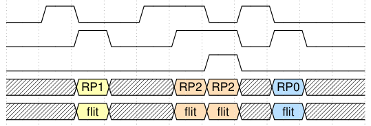
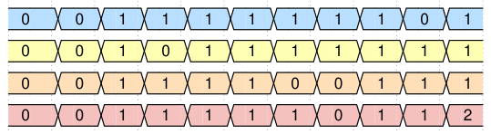
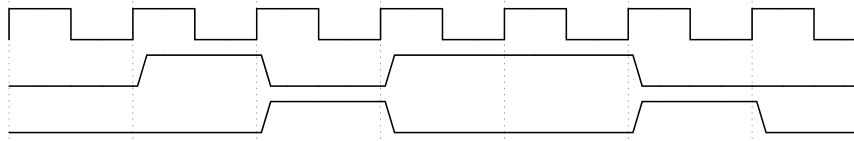
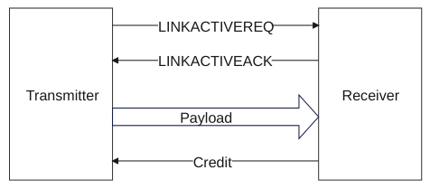
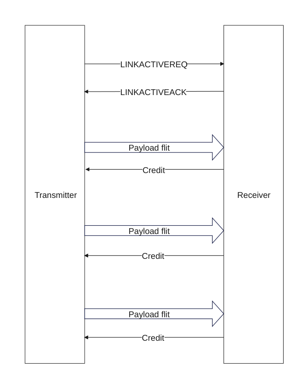
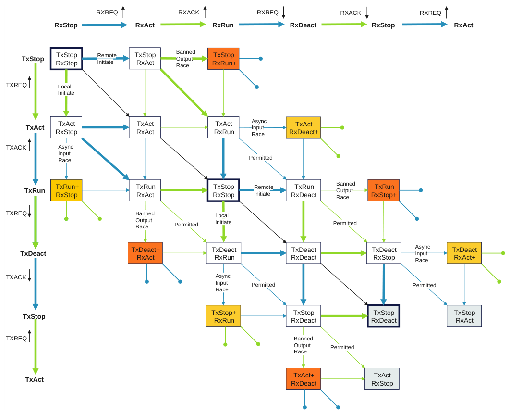
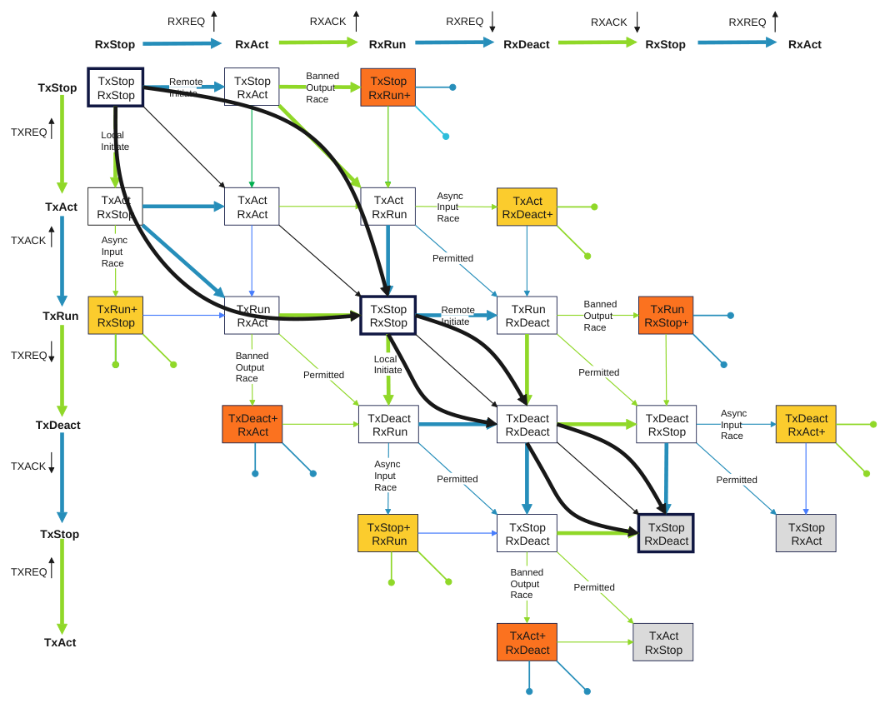
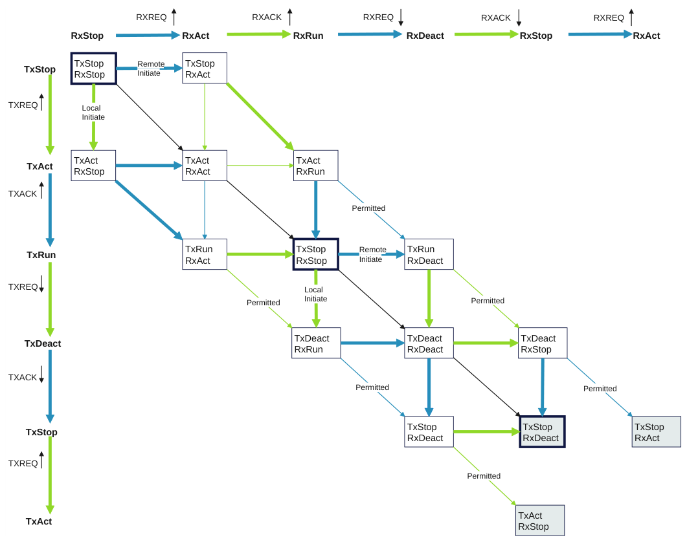
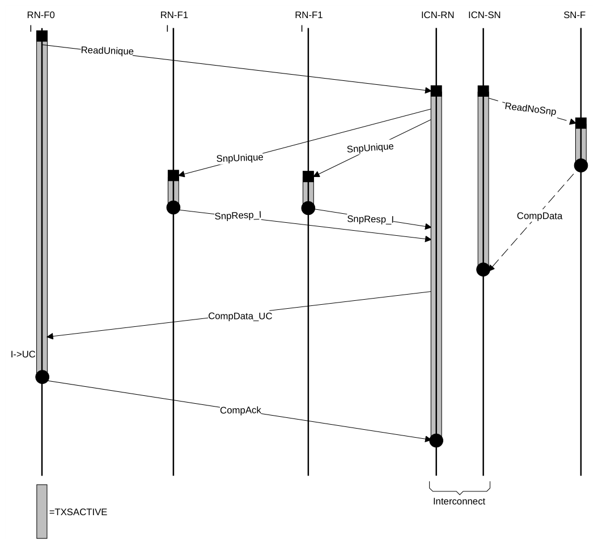

# B14 链路握手
本章描述链路握手的要求。它包含以下各节：

- B14.1 时钟与初始化
- B14.2 链路层信用
- B14.3 低功耗信令
- B14.4 flit 级时钟门控
- B14.5 接口激活与去激活
- B14.6 发送与接收链路交互
- B14.7 协议层活动指示

### B14.1 时钟与初始化

本节规定 CHI 对全局时钟与复位信号的要求。

#### B14.1.1 时钟

本规范不定义具体的时钟微架构。预期所有设备、互连等都会包含一个或多个时钟，供其他需要同步通信的链路层功能依赖。在以下各节中，适用的通用时钟信号称为 CLK。

#### B14.1.2 复位

本规范不定义具体的复位微架构。预期所有设备、互连等都会包含一个特定的复位解除有效事件，供其他链路层功能依赖。在以下各节中，适用的通用复位信号称为 RESETn。

#### B14.1.3 初始化

在复位期间，组件必须将以下接口信号置为无效：

- TX***LCRDV
- TX***FLITV
- TXLINKACTIVEREQ 和 RXLINKACTIVEACK

复位之后，组件最早可以在 RESETn 为 HIGH 之后的 CLK 上升沿开始驱动这些信号为 HIGH。

所有其他信号可以取任意值。

### B14.2 链路层信用

本节描述链路层信用（L-Credit）机制。信息通过使用 L-Credit 跨越接口通道进行传输。为了将单个 flit 从 Transmitter 传输到 Receiver，Transmitter 必须已获得一个 L-Credit。

#### B14.2.1 L-Credit 流控

以下各节描述在不使用 Resource Planes 和使用 Resource Planes 两种情况下通道使用的 L-Credit 流控条件。

##### B14.2.1.1 无 Resource Planes 时的流控

L-Credit 由 Receiver 通过将相应的 LCRDV 信号有效保持一个时钟周期来发送给 Transmitter。每个通道有一个 LCRDV 信号。各通道的 LCRDV 信号命名参见 B13.8 Channel interface signals。

以下规则规定 Transmitter 与 Receiver 链路必须如何表现：

- 每一次从 Transmitter 到 Receiver 的 flit 传输都会消耗一个 L-Credit。
- Receiver 可以提供的最小 L-Credit 数量为 1。
- Receiver 可以提供的最大 L-Credit 数量为 15。
- Receiver 必须保证它能接收其已发出 L-Credit 的所有 flit。
- 当链路处于活动状态时，本地 Receiver 必须及时提供 L-Credit，而无需远端 Transmitter 采取任何

动作

> **注意**
>
> L-Credit 不能在其被接收的同一周期内使用。

图 B14.1 展示了一个无 Resource Planes 的通道的使用示例。

0 1 2 3 4 5 6 7 8 9

CLK

LCRDV

FLITPEND

FLITV

Credit count 0 0 1 0 1 2 2 1 2 1

图 B14.1：无 Resource Planes 的通道示例

图 B14.1 描述了以下时序：

第 0 周期 Transmitter 没有信用。未发生任何事件。

第 1 周期 Receiver 授予一个信用。

第 2 周期 Transmitter 使用一个信用发送一次传输。

第 3 周期 Receiver 授予一个信用。

第 4 周期 Receiver 授予一个信用。

第 5 周期 Transmitter 使用一个信用发送一次传输。Receiver 授予一个信用。

第 6 周期 Transmitter 使用一个信用发送一次传输。

第 7 周期 Receiver 授予一个信用。

第 8 周期 Transmitter 使用一个信用发送一次传输。

第 9 周期 未发生任何事件。

##### B14.2.1.2 使用 Resource Planes 的流控

Resource Planes（RP）可选地用于 REQ 和 SNP 通道，以实现共享同一链路的流量之间的独立性。这可以用于避免死锁场景或改善服务质量。每个 RP 都有专用信用，因此可以为一个 RP 授予信用，使其在另一个 RP 因等待信用而被阻塞时仍能取得进展。

使用不同 Resource Planes 的 flit 在发送方与接收方之间不得相互阻塞。

如果 flit 在跨越多条链路时仍保持处于不同的 Resource Planes，则非阻塞保证可以扩展。

任何包含多个 Resource Planes 的链路都可以可选地包含共享信用，以在不同 Resource Planes 上吞吐量发生变化时提高缓冲区利用率。支持共享信用的接收方可以在专用于某一个 RP 的缓冲区与可用于任意 RP 的缓冲区之间分配其缓冲区。

建议发送方在同时拥有专用信用和共享信用时，为某个 flit 使用专用信用而非共享信用。这是因为共享信用更灵活，可以保留给没有专用信用的 flit。

以下规则规定了带 RP 扩展的链路上发送方和接收方必须如何行为：

- 信用按 RP 分配。LCRDV 信号每个 RP 对应一位，因此接收方每个周期最多可为每个 RP 授予

一个信用。

- LCRDV 信号的索引标识正在为其授予链路信用的 RP。
- 允许在同一周期内传输针对不同 Resource Planes 的链路信用。
- 如果某个特定 RP 的未完成专用信用数达到最大值，即 15，则该 RP 对应的 LCRDV 位必须置为

无效。

- 接收方必须能够为其支持的每个 RP 至少给出一个专用信用。
- LCRDSHV 信号由接收方置为有效，以向发送方给出一个共享信用。LCRDSHV

可以在不将 LCRDV 置为有效的情况下置为有效。

- 如果未完成的共享信用数达到最大值，即 15，则 LCRDSHV 必须置为无效。
- 每个周期只允许一个 RP 在链路上传输 flit。所传输 flit 的 RP 由

FLITRP 的值给出

- FLITRP 仅在 FLITV 置为有效时才有效。当 FLITV 置为

无效时，FLITRP 的值没有意义，接收方必须忽略它。

- 无论发送方使用的是共享信用还是专用信用，接收方都必须给出 Resource Planes 之间的独立性

保证。

- 只有当发送方拥有针对 FLITRP 值所指示的 RP 的专用信用或拥有共享信用时，才可以将 FLITV

置为有效。

- 当发送方为 FLITRP 值所指示的 RP 将 FLITV 置为有效时，若 SHAREDCRD 为：
- 0，则发送方为该 RP 使用专用信用。
- 1，则发送方使用共享信用。发送方可以使用共享信用在任意

RP 上发送传输。

- 当 FLITV 为零时，SHAREDCRD 信号没有意义，可以取任意值。
- 发送方必须确保：当其有一个 flit 要在某个 RP 上发送、并且该 RP 有可用信用时，该

传输不依赖于其他任何 RP 是否收到信用。

- 接收方必须保证能够接受其已发放专用信用或共享信用的所有 flit。
- 当链路处于活动状态时，本地接收方必须及时提供专用信用或共享信用，

而无需远端发送方采取任何行动。

图 B14.2 展示了使用带有三个 Resource Planes 以及专用信用与共享信用混合的通道的一个示例。

0 1 2 3 4 5 6 7 8 9 10 CLK

LCRDV[0]

LCRDV[1]

LCRDV[2]

LCRDSHV

FLITPEND

FLITV

SHAREDCRD

FLITRP[1:0]

FLIT[FLIT_WIDTH-1:0]

专用 RP0 信用计数

专用 RP1 信用计数

专用 RP2 信用计数

共享信用计数

图 B14.2：带有 3 个 Resource Planes 的通道示例

图 B14.2 描述了以下序列：

周期 0 发送方没有信用。

周期 1 接收方为每个 RP 给出一个信用，并给出一个共享信用。

周期 2 发送方使用专用信用在 RP1 上发送一个传输。

周期 3 接收方为 RP1 向发送方返回一个专用信用。

周期 5 发送方使用专用信用在 RP2 上发送一个传输。

周期 6 由于没有可用的专用信用，发送方使用共享信用在 RP2 上发送一个传输。

周期 7 接收方向发送方返回一个共享信用以及一个针对 RP2 的专用信用。

周期 8 发送方使用专用信用在 RP0 上发送一个传输。

周期 9 接收方向发送方返回一个针对 RP0 的专用信用，并额外返回一个共享信用。

### B14.3 低功耗信令

本节描述用于增强接口低功耗运行的 signaling。存在若干不同级别的运行方式：

Flit 级时钟门控 该技术用于逐周期指示接口各通道的活动情况。对于每个通道，都会提供一个附加信号，用于指示下一个周期是否可能发生一次传输。该信令允许对接口相关的某些寄存器进行本地时钟门控。

链路激活 支持链路激活与去激活，以便将接口置于安全状态，使得接口两侧都能进入低功耗状态，从而允许它们被时钟门控或电源门控。

协议活动指示 协议层活动指示由各组件用来指示当前是否有正在进行的事务。协议层活动指示可用于影响是否采用其他低功耗技术的决策。

### B14.4 Flit 级时钟门控

与通道关联的 FLITPEND 信号用于指示下一个时钟周期是否会发送一个有效 flit。每个通道都有一个 FLITPEND 信号。各通道 FLITPEND 信号的命名参见 B13.8 Channel interface signals。

使用 FLITPEND 的要求如下：

- 要求该信号必须在发送方发出 flit 之前恰好一个周期被置位。
- 当该信号置位时，发送方可以在下一个周期发送一个 flit，但并非必须。
- 当该信号取消置位时，要求发送方不得在下一个周期发送 flit。
- 允许发送方将该信号永久保持置位，但并非必须。例如，如果

发送方无法提前确定何时发送 flit。

- 允许发送方在不持有 L-Credit 的情况下置位该信号，但并非必须。
- 允许发送方置位并随后取消置位该信号而不发送

flit。

图 B14.3 给出了 FLITPEND 信号使用的一个示例。

0 1 2 3 4 5 6 7

CLK

FLITPEND

FLITV

FLIT flit flit

图 B14.3：FLITPEND 指示下一个周期存在有效 flit

### B14.5 接口激活与去激活

提供了一种机制，使整个接口能够在完全运行的工作状态与低功耗状态之间切换。在工作状态之间切换时，包括退出复位时，交换 L-Credit 非常重要。链路 flit 的交换受到精心控制，以避免 flit 或 credit 的丢失。

在退出复位时，或切换到完全运行的工作状态时，接口从空闲状态开始，只有在 L-Credits 完成交换后，flit 的传输才能开始。只有当 credit 的发送方知道接收方已准备好接收 credit 时，才能交换 L-Credits。

使用一种双信号、四相握手机制。该双信号接口用于同一方向上的所有通道，而不是要求每个通道单独使用。整个接口总共使用四个信号，其中两个信号用于所有发送通道，两个信号用于所有接收通道。

#### B14.5.1 请求与应答握手

为便于说明，两信号 Request 与 Acknowledge 的信令采用信号名 LINKACTIVEREQ 和 LINKACTIVEACK 来描述。

本节描述在同一方向上传输的所有通道的 LINKACTIVEREQ 与 LINKACTIVEACK 握手对的操作。B14.6 发送与接收链路交互 描述了发送通道的握手对与接收通道的握手对之间的交互。

对于单个通道或在同一方向上传输的一组通道，图 B14.4 展示了 Payload、Credit、LINKACTIVEREQ 和 LINKACTIVEACK 信号之间的关系。

图 B14.4：Payload、Credit 与 LINKACTIVE 信号之间的关系

如图 B14.4 所示，发送 payload flit 的发送端在发送 flit 之前需要一个 credit。当接收端有可用资源接受 flit 时，会传递一个 credit：

- 退出复位时，credit 由接收端持有，必须在 flit 传输开始之前传递给发送端。
- 在正常工作期间，接口两侧之间持续进行 flit 与 credit 的交换。
- 在进入低功耗状态之前，必须停止发送 payload flit，并且所有 credit 必须归还给接收端。这实际上使接口恢复到与紧接复位之后相同的状态。

接口操作定义了四种状态：

RUN 两个组件之间持续进行 flit 与 credit 的交换。

STOP 接口处于低功耗状态，不工作。所有 credit 均由接收端持有，发送端不得发送任何 flit。

ACTIVATE 该状态用于从 STOP 状态迁移到 RUN 状态。

DEACTIVATE 该状态用于从 RUN 状态迁移到 STOP 状态。

RUN 和 STOP 是稳定状态。进入其中一个状态后，通道可以在该状态下保持任意长的时间。

DEACTIVATE 和 ACTIVATE 是瞬态状态。预期当进入其中一个状态时，通道会在相对较短的时间内迁移到下一个稳定状态。

> **注意**
>
> 本规范未定义瞬态状态的最长持续时间，但预期对于任何给定的实现方式，该时长都是确定的。

状态由 LINKACTIVEREQ 和 LINKACTIVEACK 信号确定。图 B14.5 展示了这四种状态之间的关系。

图 B14.5：请求与应答握手状态

表 B14.1 展示了状态到 LINKACTIVEREQ 和 LINKACTIVEACK 信号的映射。

表 B14.1：状态到 LINKACTIVE 信号的映射

| 状态 | LINKACTIVEREQ | LINKACTIVEACK |
| --- | --- | --- |
| STOP | 0 | 0 |
| ACTIVATE | 1 | 0 |
| RUN | 1 | 1 |
| DEACTIVATE | 0 | 1 |

表 B14.2 描述了单条链路的发送端和接收端在这四种状态中每一种状态下的行为。

表 B14.2：每种请求与应答状态下的行为

状态 发送端行为 接收端行为

STOP 发送端没有任何 credit，且不得发送任何 flit。 接收端保证不会收到任何 flit。

下页续

表 B14.2 – 续上页

状态 发送端行为 接收端行为

发送端保证不会收到任何 credit。 接收端不得发送任何 credit。

如果必须发送 flit，发送端必须置位 LINKACTIVEREQ 以迁移到 ACTIVATE 状态。

ACTIVATE (ACT) 发送端不得发送任何 flit。 接收端保证不会收到任何 flit。

发送端必须准备好在此状态下接收 credit。但是，在进入 RUN 状态之前，发送端不得使用这些 credit。 接收端不得发送任何 credit。

ACTIVATE 是瞬态状态，接收端通过置位 LINKACTIVEACK 来控制向 RUN 状态的迁移。 发送端在等待接收端确认向 RUN 状态的迁移期间保持在 ACTIVATE 状态。

注 接收端必须在发送 credit 之前置位 LINKACTIVEACK 并迁移到 RUN 状态。允许但不要求置位 LINKACTIVEACK 以迁移到 RUN 状态。 仅当接收端发送 credit 与置位 LINKACTIVEACK 之间存在竞争时，发送端才会在 ACTIVATE 状态下收到 credit，并在同一周期内发送 credit。

注 如果在接收端发送 credit 与置位 LINKACTIVEACK 以迁移到 RUN 状态之间存在竞争，则接收端可能在 ACTIVATE 状态下看起来已经发送了 credit。

RUN 发送端可以接收 credit。 接收端可以接收与先前发送的 credit 相对应的 flit。

当有 credit 可用于接受更多 flit 时，发送端可以发送 flit。对于 RP 扩展通道，仅当某个特定 RP 有专用 credit 可用，或有共享 credit 可用时，发送端才能在该 RP 上发送 flit。 接收端在有资源可用时发送 credit。

如果需要进入低功耗状态，发送端撤销置位 LINKACTIVEREQ 以退出该状态。 接收端必须保持在 RUN 状态，直到观察到 LINKACTIVEREQ 被撤销置位。

DEACTIVATE (DEACT) 发送端在迁移到 STOP 状态之前必须归还所有未使用的 credit。对于 RP 扩展通道，这包括所有专用 credit 和共享 credit。共享 credit 可以在发送 LCRdReturn 时使用 SHAREDCRD 信号归还。当在 LCRdReturn 中置位 SHAREDCRD 信号时，FLITRP 可以取任意值。 在此状态下，接收端停止发送 credit，并收集所有归还的 credit。

建议 Transmitter Receiver 期望接收 仅当 LCRdReturn，直到所有 credit 都被返回。无法再发送 Protocol flit 时，才进入 DEACTIVATE 状态。Receiver 必须准备好接收 因此，预期 flit（LCRdReturn 除外），直到所有 Transmitter 仅使用 credit 都被返回。这种情况并不预期发生，LCRdReturn 来返回 credit。但可能发生。

Transmitter 必须准备好 Receiver 允许（但并非必须）继续接收 credit。对于每一个在首次进入该状态时发送 credit。额外收到的 credit，Transmitter 但是，Receiver 必须已停止必须发送 LCRdReturn，以返回该发送 credit，且所有 credit 都已返回 credit。之后才能退出该状态。

Transmitter 在等待 Receiver 必须等待所有 credit 都 Receiver 确认转入返回后才能撤销 LINKACTIVEACK。STOP 状态期间，保持在 DEACTIVATE 状态。此时，可以保证 Receiver 不会再接收到任何 credit。注 Receiver 仅在 Transmitter 发送最后剩余 flit 与撤销 LINKACTIVEREQ 以转入 DEACTIVATE 状态之间存在竞争时，才会在 DEACTIVATE 状态下接收到 flit。

表 B14.3 汇总了表 B14.2 中详细描述的要求行为。

表 B14.3：各 Request 与 Acknowledge 状态的行为汇总

| 状态 | Transmitter | Receiver |
| --- | --- | --- |
| STOP | 不得发送 flit 不接收 credit | 不得发送 credit 不接收 flit |
| ACT | 不得发送 flit 必须接受 credit | 不得发送 credit 不接收 flit |
| RUN | 可以发送 flit | 必须接受 flit 下页续 |

表 B14.3 – 续上页

| 状态 | Transmitter | Receiver |
| --- | --- | --- |
|  | 必须接受 credit | 可以发送 credit |

DEACT 预期发送 L-Credit 返回 flit 必须接受 flit

可以发送任意 flit 必须停止发送 credit

必须接受 credit

必须返回 credit

##### B14.5.1.1 对新状态的响应

当转入一个新状态，且该状态变化是由接口另一侧发起时，可能要求组件改变其行为。

如果状态变化要求组件开始发送 flit 或 credit，则本规范未定义该组件开始执行新行为所需时间的上限。该新行为只会在新状态下发生。

如果状态变化要求组件停止发送 flit 或 credit，则允许该组件花费一些时间做出响应。在这种情况下，该行为会在首次进入某个新状态时被观察到，而这在该状态内是不预期的。

从 RUN 到 DEACTIVATE 的状态变化就是 flit 与 credit 停止发送的时点。

flit 由 Transmitter 发送，而 Transmitter 同时也是决定该状态变化的组件，因此 Transmitter 可以确保在状态变化之后不再发送 flit。

credit 由 Receiver 发送，但该组件并不决定状态变化。Receiver 可能需要一些时间才能对状态变化做出反应。因此，在首次进入 DEACTIVATE 状态时，仍可能发送 credit。

CHI 协议要求，Receiver 在发出从 DEACTIVATE 到 STOP 的变化信号之前，必须已停止发送 credit，并且所有 credit 都已返回。

##### B14.5.1.2 确定何时转入 ACTIVATE 或 DEACTIVATE

对于给定通道，或同一方向上的一组通道，Transmitter 负责发起从 RUN 到 STOP，或从 STOP 到 RUN 的状态变化。

> **注意**
>
> Transmitter 可以基于若干因素判定需要进行通道状态变化。以下是可以发起状态转换的示例场景的非详尽列表：

- 有 flit 待发送：如果 Transmitter 有 flit 需要传输，则必须将通道从 STOP 转换为

RUN。

- 预期无活动：如果 Transmitter 判定在较长一段时间内不太可能有任何有用活动，则可以将通道从 RUN 转换为

STOP 以节省功耗。

- 外部指示：Transmitter 可以检测到指示从 RUN 转换为

STOP 或从 STOP 转换为 RUN 的边带信号。

- 观察反向方向：Transmitter 可以观察通道或通道组上的状态变化

这些通道在相反方向上工作，并以此作为自身状态转换的依据。参见 B14.6 发送与接收链路交互。

- 未完成事务：如果某个进行中的事务

尚未完成，Transmitter 可能希望保持链路处于 RUN。但是，如果反向通道发生状态变化，Transmitter

不得为等待该事务完成而延迟自身的状态变化。在某些情况下，链路可能需要在完成未完成事务之前先经过 STOP 再回到 RUN。

##### B14.5.1.3 同一方向上的多通道

图 B14.6 给出了一个多通道接口（也称链路）的示例，该接口在同一方向上传输载荷 flit。所有通道共用一对 LINKACTIVEREQ 和 LINKACTIVEACK 信号。

图 B14.6：多通道单向接口示例

关于 LINKACTIVEREQ 与 LINKACTIVEACK 信号之间关系的规则必须适当地应用于所有通道：

- 当某次状态变化要求发送器能够接受 credit 时，发送器必须能够

在所有通道上接受 credit。

- 当某次状态变化要求接收器能够接受 flit 时，接收器必须能够接受

所有通道上的 credit。

- 当某次状态变化之前必须停止发送 flit 时，必须在所有通道上停止发送 flit。
- 当某次状态变化之前必须停止发送 credit 时，必须在所有通道上停止发送 credit。
- 一个 credit 只能与同一通道上的 flit 相关联。

### B14.6 发送与接收链路交互

本节描述链路发送器与接收器之间的交互。它包含以下小节：

- B14.6.1 简介
- B14.6.2 Tx 与 Rx 状态机
- B14.6.3 预期的状态转换

#### B14.6.1 简介

单个组件具有多种不同的通道，其中一些是输入，另一些是输出。

对于单个组件：

- 所有载荷为输出的通道被定义为发送链路（TXLINK）。
- 所有载荷为输入的通道被定义为接收链路（RXLINK）。

要求 TXLINK 与 RXLINK 的激活和去激活相互协调。

当 TXLINK 与 RXLINK 均处于稳定的 STOP 状态时：

- 如果 RXLINK 转入 ACTIVATE 状态（该状态由接口另一侧的组件控制），则要求 TXLINK 也及时转入

ACTIVATE 状态。

- 如果组件使 TXLINK 转入 ACTIVATE 状态（该状态由该组件控制），则预期 RXLINK 也及时转入

ACTIVATE 状态。

当 TXLINK 与 RXLINK 均处于稳定的 RUN 状态时：

- 如果 RXLINK 转入 DEACTIVATE 状态（该状态由接口另一侧的组件控制），则要求 TXLINK 也及时转入

DEACTIVATE 状态。

- 如果组件使 TXLINK 转入 DEACTIVATE 状态（该状态由该组件控制），则预期 RXLINK 也及时转入

DEACTIVATE 状态。

当 TXLINK 与 RXLINK 正在改变状态时，关于 credit 和 flit 的发送与接收的规则可以针对每条链路独立考虑。

#### B14.6.2 Tx 与 Rx 状态机

图 B14.7 给出 Tx 与 Rx 状态机之间允许的关系。图 B14.7 的编排方式使得 Tx 与 Rx 状态机各自的独立性一目了然。

图 B14.7：组合的 Tx 与 Rx 状态机

图 B14.7 给出单个组件的组合 Tx 与 Rx 状态机：

- 为清晰起见，使用了缩短的状态名和信号名。
- 绿色箭头表示本地代理可以控制的转换。
- 蓝色箭头表示由接口另一侧的远端代理控制的转换。
- 黑色箭头表示当本地代理与远端代理同时发生转换时所形成的转换。
- 在 图 B14.7 的边缘标注了各个 Tx 状态和 Rx 状态。绿色和蓝色箭头表示由哪个代理控制该转换。同时还标注了引发该状态转换的信号变化。
- 垂直或水平箭头表示仅由一次信号变化引起的状态变化，也就是说，只有 Rx 状态机或 Tx 状态机改变状态，而非二者同时改变。
- 对角线箭头表示由两个信号同时变化引起的状态变化。如果对角线箭头为绿色或蓝色，则表示同一代理在改变这两个信号。
- 在少数情况下，由于巧合，某次状态变化是由链路两侧各发生一个事件且二者同时发生而引起的。这始终是一条对角路径，并用黑色箭头表示。
- stub 线表示不允许离开某一状态的死端路径。stub 线的颜色表示要求哪个代理确保不会走上该路径。
- 预期 TxStop/RxStop 和 TxRun/RxRun 是稳定状态，通常也是状态机长时间停留的状态。这些状态用粗轮廓突出显示。所有其他状态都被视为会及时退出的瞬态。
- 图 B14.7 右下角的灰色状态是左上角状态的复制。它们用于帮助清晰表达并保持图解的对称性。
- 黄色状态只有在观测到两个输入信号之间的竞争时才能到达。进入这些状态的转换被标记为 Async Input Race。参见 B14.6.3.4 异步竞争条件。
- 红色状态只有在观测到两个输出信号之间的竞争时才能到达。组件边缘处不允许出现两个输出之间的竞争，因此进入这些状态的转换被标记为 Banned Output Race。这些状态只能在两个组件之间的中点处被观测到。参见 B14.6.3.4 异步竞争条件。
- 粗箭头用于指示状态机中预期的状态转换。这些转换在 B14.6.3 预期的状态转换中有更详细的描述。
- 标记为 Permitted 的箭头是通常不会预期、但协议允许的状态转换。

##### B14.6.2.1 状态命名

图 B14.7 展示了完整的状态集合，包括只能通过竞态条件到达的那些状态。关于竞态条件的更详细讨论可参见 B14.6.3.4 异步竞态条件。

TxStop/RxRun 状态有两种不同的形式，TxRun/RxStop 状态也有两种不同的形式。这些状态的区别在于到达它们的方式以及允许退出它们的方式。为了区分这些状态，使用 [+] 后缀来指示 Tx 或 Rx 中哪个状态机处于领先运行状态。例如：

- TxStop/RxRun+ 表示 Tx 状态机仍停留在前一个 STOP 状态，而 Rx

状态机已推进到下一个 RUN 状态。

- TxStop+/RxRun 表示 Tx 状态机已推进到下一个 STOP 状态，而 Rx 状态

机仍停留在前一个 RUN 状态。

#### B14.6.3 预期转换

图 B14.8 展示了预期的状态转换。

图 B14.8 中箭头上的标注如下：

Local Initiate 表示本地代理已发起从一个稳定状态离开并转向另一个稳定状态的过程。

Remote Initiate 表示接口另一侧的远端代理已发起从一个稳定状态离开并转向另一个稳定状态的过程。

图 B14.8：预期的 Tx 与 Rx 状态机转换

图 B14.8 使用粗箭头示出了稳定的 TxStop/RxStop 与 TxRun/RxRun 状态之间，以及稳定的 TxRun/RxRun 与 TxStop/RxStop 状态之间的路径。

从 TxStop/RxStop 迁移到 TxRun/RxRun 状态的两种路径之所以不同于从 TxRun/RxRun 迁移到 TxStop/RxStop 状态的迁移，是因为后者需要归还 L-Credit。这些差异将在后续各节中详细说明。

##### B14.6.3.1 从 TxStop/RxStop 到 TxRun/RxRun 的预期转换

从稳定的 Stop/Stop 到 Run/Run 状态有两条预期路径。

表 B14.4 以状态转换的形式示出了这两条预期路径。

表 B14.4：Stop/Stop 到 Run/Run 的状态路径

| 路径 | 状态 1 | 状态 2 | 状态 3 | 状态 4 |
| --- | --- | --- | --- | --- |
| 路径 1 | TxStop/RxStop | TxStop/RxAct | TxAct/RxRun | TxRun/RxRun |
| 路径 2 | TxStop/RxStop | TxAct/RxStop | TxRun/RxAct | TxRun/RxRun |

##### B14.6.3.2 从 TxRun/RxRun 到 TxStop/RxStop 的预期转换

从 Run/Run 状态到 Stop/Stop 状态的转换要求归还 L-Credit。链路必须保持在 DEACTIVATE 状态，直到所有 L-Credit 都已归还。

从稳定的 Run/Run 到 Stop/Stop 状态有四条预期路径。

表 B14.5 以状态转换的形式示出了这四条预期路径。

表 B14.5：状态 5

| 路径 | 状态 1 | 状态 2 | 状态 3 | 状态 4 | 状态 5 |
| --- | --- | --- | --- | --- | --- |
| 路径 1 | TxRun/RxRun | TxDeact/RxRun | TxDeact/RxDeact | TxStop/RxDeact | TxStop/RxStop |
| 路径 2 | TxRun/RxRun | TxDeact/RxRun | TxDeact/RxDeact | TxDeact/RxStop | TxStop/RxStop |
| 路径 3 | TxRun/RxRun | TxRun/RxDeact | TxDeact/RxDeact | TxStop/RxDeact | TxStop/RxStop |
| 路径 4 | TxRun/RxRun | TxRun/RxDeact | TxDeact/RxDeact | TxDeact/RxStop | TxStop/RxStop |

##### B14.6.3.3 围绕稳定状态的转换

允许（但不属于预期）围绕稳定的 TxRun/RxRun 或 TxStop/RxStop 状态进行转换。

在大多数情况下，预期会转向稳定的 Run/Run 或 Stop/Stop 状态。

希望快速离开某个稳定状态的最典型场景是：接口已开始进入低功耗状态，但仍需要有一些活动。例如，低功耗状态可能被过早进入，或者恰好在进入低功耗状态期间偶然出现了新的活动。在此场景下，希望能够尽快回到 Run/Run 状态。

##### B14.6.3.4 异步竞争条件

存在这样的情况：两个输出信号 X 与 Y 具有如下定义的关系：

- 输出 X 必须在输出 Y 之后或与之同时变化，但不允许先于输出 Y 变化。

该关系具体适用于以下情形：

- RXACK 的置有效不得早于 TXREQ 的置有效。
- RXACK 的置无效不得早于 TXREQ 的置无效。
- TXREQ 的置有效不得早于 RXACK 的置无效。
- TXREQ 的置无效不得早于 RXACK 的置有效。

在图 B14.7 中，这些跳变被标记为 Banned Output Race，其结果状态以红色显示。

如果在系统的某一点监测输出信号，而该点处的异步竞争条件可能导致在同一周期内有效的两个信号被观测到处于不同时钟周期，则有可能观测到这些状态。

位于接口另一侧、以这两个信号作为输入的组件，在发生异步输入竞争时可以看到该状态跳变。这些跳变在图中被标记为 Async Input Race，其结果状态以黄色显示。

对于所有输入竞争条件，观测到输入竞争的组件必须在改变任何输出信号之前等待这两个信号都到达。图 B14.7 中体现了这一点：从竞争状态出发唯一被允许的输出跳变，是由与该竞争条件相关联的另一个信号的到达引起的。

##### B14.6.3.5 无竞争条件的 Tx 与 Rx 组合状态机

在图 B14.9 中，Tx 与 Rx 组合状态机中因竞争条件而产生的所有跳变和状态均已被去除。

图 B14.9：无竞争条件的 Tx 与 Rx 组合状态机

### B14.7 协议层活动指示

本节描述用于指示协议层活动的信号。它包含以下子节：

- B14.7.1 简介
- B14.7.2 TXSACTIVE 信号
- B14.7.3 RXSACTIVE 信号
- B14.7.4 SACTIVE 与 LINKACTIVE 之间的关系

#### B14.7.1 简介

SACTIVE 信令指示当前存在正在进行的事务。

TXSACTIVE 是一个输出信号，当接口上存在正在进行或即将开始的事务时，由该接口置有效：

- 在发送与某事务相关的首个 flit 之前，或在该 flit 发送的同一周期内，必须置有效 TXSACTIVE。
- TXSACTIVE 必须保持有效，直至与所有事务相关的最后一个 flit 发送或接收完成之后。

这意味着，接口上 TXSACTIVE 的置无效意味着该组件已完成所有正在进行的事务，且无需再发送或接收任何 flit。

收到 RetryAck 响应的事务被视为仍在进行中，TXSACTIVE 必须保持有效，直至相关 credit 被提供并已使用或已归还。

RXSACTIVE 是一个输入信号，用于指示接口另一侧存在持续的协议层活动。当 RXSACTIVE 置有效时，组件必须及时响应协议层活动。

SACTIVE 信号必须与 CLK 同步，因此不需要再进行同步。若它们跨越时钟域，则由跨时钟域桥接负责对这些信号进行同步。

#### B14.7.2 TXSACTIVE 信号

以下规则适用于 TXSACTIVE 信号：

- 当发送端有 flit 需要发送时，必须置有效 TXSACTIVE。
- 置有效 TXSACTIVE 的组件在需要时还必须发起链路激活序列。不允许组件置有效 TXSACTIVE 信号后再等待接口另一侧发起链路激活序列。
- TXSACTIVE 必须保持有效，直至与所有事务相关的最后一个 flit 发送或接收完成之后。
- 在作为链路去激活序列的一部分发送链路 flit 期间，允许（但并非必须）将 TXSACTIVE 置无效。

> **注意**
>
> 为确保高效的掉电序列，建议在链路去激活序列期间不要将已置无效的 TXSACTIVE 信号重新置有效。

允许互连组件上的接口使用 RXSACTIVE 输入信号直接生成 TXSACTIVE 输出信号。此行为仅允许在互连接口上使用，不允许在任何挂接组件上使用。

除 Link 的互连接口外，Link 的其他任何接口都不允许将输入的 RXSACTIVE 环回到输出的 TXSACTIVE 上。

图 B14.10 显示了在事务生存期内对 TXSACTIVE 置有效的要求。

图 B14.10：在事务生存期内 TXSACTIVE 的置有效

##### B14.7.2.1 来自请求节点的 TXSACTIVE 信号

当发起新事务时，请求节点必须在置起 TXREQFLITV 的同一周期或之前置起 TXSACTIVE，并且必须保持 TXSACTIVE 置起，直到该事务的最后一个完成 flit 被发送或接收之后。

完成由请求节点发起的事务的 flit 类型，取决于事务类型以及事务推进的方式。例如，ReadNoSnp 事务通常可以在收到最后一个 CompData flit 时完成，但如果最后一个 CompData flit 之后还有 ReadReceipt，那么它同样可以在收到 ReadReceipt 时完成。

当 Snoop 事务正在进行时，RN-F 或 RN-D 组件也必须置起 TXSACTIVE。TXSACTIVE 必须在收到发起侦听的 flit 或 SnpDVMOp flit 之后置起，且不得晚于其第一个 Response flit 被发送的时刻。RN-F 或 RN-D 组件必须保持 TXSACTIVE 置起，直到所有 Snoop 事务的最后一个

完成 flit 被发送之后。PrefetchTgt 的生命周期为单个 flit。从 TXSACTIVE 的角度看，PrefetchTgt 事务的发起 flit 同时也是其完成 flit，该 flit 被发送后的下一个周期即可认为该事务已完成。

对于 RN-F 或 RN-D，TXSACTIVE 输出是 Request 接口与 Snoop 接口两项要求的逻辑 OR。

##### B14.7.2.2 来自从属节点的 TXSACTIVE 信号

从属节点不能发起新事务，只要求其在正在处理中的事务推进期间置起 TXSACTIVE。

在收到事务发起 flit 时，从属节点发往互连接口的 TXSACTIVE 信号必须在其第一个 Response flit 被发送的同一周期或之前置起。从属节点必须保持发往互连接口的 TXSACTIVE 信号置起，直到最后一个完成 flit 被发送或接收之后。

##### B14.7.2.3 从互连接口到请求节点的 TXSACTIVE 信号

互连面向请求节点的接口必须在下述两种情况下都置起 TXSACTIVE：

- 在收到事务发起 flit 时，互连接口发往

请求节点的 TXSACTIVE 信号必须在其第一个 Response flit 被发送的同一周期或之前置起。互连接口必须保持发往请求节点的 TXSACTIVE 信号置起，直到最后一个完成 flit 被发送或接收之后。

- 在其发起侦听的 flit 或 SnpDVMOp flit 被发送的同一周期或之前。互连

接口必须保持发往请求节点的 TXSACTIVE 信号置起，直到最后一个完成 flit 被接收之后，该 flit 为 SnpResp、SnpRespData 或 SnpRespDataFwded 三者之一。

B14.7.2.4

##### B14.7.2.4 从互连接口到从属节点的 TXSACTIVE 信号

互连面向从属节点的接口必须在其发起 Request flit 被发送的同一周期或之前置起 TXSACTIVE。互连面向从属节点的接口必须保持 TXSACTIVE 置起，直到最后一个完成 flit 被发送或接收之后。

#### B14.7.3 RXSACTIVE 信号

当 RXSACTIVE 置起时，接收方必须及时响应链路激活请求。当 RXSACTIVE 去置起时，允许 Receiver 延迟响应 Link 激活请求。

> **注意**
>
> RXSACTIVE 的去置起并不表示所有协议层活动都已完成。在 RXSACTIVE 去置起之后，Receiver 仍可能收到某个 Protocol flit，它对应的事务在 RXSACTIVE 置起期间处于进行中状态。

RXSACTIVE 可以与对进行中事务的了解（由组件的 TXSACTIVE 输出指示）结合使用，以指示不再需要进一步的事务。这可用于控制进入低功耗状态。

#### B14.7.4 SACTIVE 与 LINKACTIVE 的关系

SACTIVE 信令是协议层活动的指示。当 TXSACTIVE 和 RXSACTIVE 均被取消置位时，可认为节点处于非活动状态。

LINKACTIVE 状态是链路层活动的指示。当节点或互连的发送器处于 TxStop 状态且其接收器处于 RxStop 状态时，可认为该节点或互连的链路层处于非活动状态。

SACTIVE 信令与 LINKACTIVE 状态是正交的，但存在一个约束，如 B14.7.3 RXSACTIVE signal 中所述。

节点或互连仅当其协议层和链路层均处于非活动状态时，才应启用更高层级的时钟门控和低功耗优化。

第 B15 章
