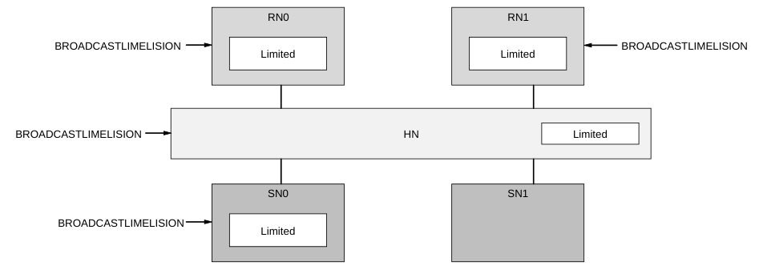

# B16 属性、参数与广播信号
本章描述用于规定接口所支持行为的属性、参数以及可选的广播信号。本章包含以下各节：

- B16.1 接口属性与参数
- B16.2 可选的接口广播信号
- B16.3 原子事务支持

### B16.1 接口属性与参数

属性用于声明一项能力。

规定接口行为的属性与参数在以下各节中描述：

- B16.1.1 Atomic_Transactions
- B16.1.2 Cache_Stash_Transactions
- B16.1.3 Direct_Memory_Transfer
- B16.1.4 Data_Poison
- B16.1.5 Direct_Cache_Transfer
- B16.1.6 Data_Check
- B16.1.7 Check_Type
- B16.1.8 CleanSharedPersistSep_Request
- B16.1.9 MPAM_Support
- B16.1.10 CCF_Wrap_Order
- B16.1.11 Req_Addr_Width
- B16.1.12 NodeID_Width
- B16.1.13 Data_Width
- B16.1.14 Enhanced_Features
- B16.1.15 Deferrable_Write
- B16.1.16 RME_Support
- B16.1.17 Nonshareable_Cache_Maint
- B16.1.18 Outer_Cacheable_Support
- B16.1.19 PBHA_Support
- B16.1.20 Cache_State_UDP
- B16.1.21 Cache_State_SD
- B16.1.22 DVM_Support
- B16.1.23 MTE_Support
- B16.1.24 Limited_Data_Elision
- B16.1.25 MEC_Support
- B16.1.26 MECID_Width
- B16.1.27 DevAssign_Support
- B16.1.28 Req_RSVDC_Width
- B16.1.29 Dat_RSVDC_Width
- B16.1.30 GDI_Support
- B16.1.31 GDI_Non_PE_RNF
- B16.1.32 MECID_Mismatch_Resolution_Realm
- B16.1.33 CleanInvalidStorage_Request
- B16.1.34 Num_RP_REQ
- B16.1.35 Shared_Credits_REQ
- B16.1.36 Num_RP_SNP
- B16.1.37 Shared_Credits_SNP
- B16.1.38 Retry_Support

#### B16.1.1 Atomic_Transactions

Atomic_Transactions 属性用于指示某组件是否支持 Atomic 事务。

表 B16.1 列出了 Atomic_Transactions 属性的选项。

表 B16.1：Atomic_Transactions 属性选项

| Atomic_Transactions 取值 | 描述 |
| --- | --- |
| True | 支持 Atomic 事务。 |
| False or Not specified | 不支持 Atomic 事务。 |

支持 Atomic 事务的组件必须支持所有 Atomic 事务。但是，并不要求支持 Atomic 事务的组件支持对所有内存类型的定位。参见 B16.3 Atomic transaction support。

#### B16.1.2 Cache_Stash_Transactions

Cache_Stash_Transactions 属性用于指示某组件是否支持 Cache Stashing 事务。

表 B16.2 列出了 Cache_Stash_Transactions 属性的选项。

表 B16.2：Cache_Stash_Transaction 属性选项

| Cache_Stash_Transactions 取值 | 描述 |
| --- | --- |
| True | 支持 Cache Stashing 事务。 |
| False or Not specified | 不支持 Cache Stashing 事务。 |

#### B16.1.3 Direct_Memory_Transfer

Direct_Memory_Transfer 属性用于指示某组件是否支持 Direct Memory Transfer 事务。

表 B16.3 列出了 Direct_Memory_Transfer 属性的选项。

表 B16.3：Direct_Memory_Transfer 属性选项

| Direct_Memory_Transfer 取值 | 描述 |
| --- | --- |
| True | 支持 Direct Memory Transfer 事务。 |
| False or Not specified | 不支持 Direct Memory Transfer 事务。 |

Direct_Memory_Transfer 属性在每个 Home Node 上针对每个 Subordinate Node 定义。

#### B16.1.4 Data_Poison

Data_Poison 属性用于指示某组件是否支持 Poison。

表 B16.4 列出了 Data_Poison 属性的选项。

表 B16.4：Data_Poison 属性选项

| Data_Poison 取值 | 描述 |
| --- | --- |
| True | 支持 Poison，且 DAT 数据包中存在 Poison 字段 |
| False or Not specified | 不支持 Poison，且 DAT 数据包中不存在 Poison 字段 |

参见 B9.2.1 Poison。

#### B16.1.5 Direct_Cache_Transfer

Direct_Cache_Transfer 属性用于指示某组件是否支持 Direct Cache Transfer 事务。

表 B16.5 列出了 Direct_Cache_Transfer 属性的选项。

表 B16.5：Direct_Cache_Transfer 属性选项

| Direct_Cache_Transfer 取值 | 描述 |
| --- | --- |
| True | 支持 Direct Cache Transfer 事务 |
| False or Not specified | 不支持 Direct Cache Transfer 事务 |

HN-F 需要确定要使用的正确侦听类型。

#### B16.1.6 Data_Check

Data_Check 属性用于指示 DAT 数据包中是否存在 DataCheck 字段。

表 B16.6 列出了 Data_Check 属性的选项。

表 B16.6：Data_Check 属性选项

Data_Check 取值 描述

Odd_Parity 支持 Data Check，且 DAT 数据包中存在 DataCheck 字段。

如果定义了 Check_Type 并将其设置为 Odd_Parity_Byte_All，则 DAT 数据包中不存在 DataCheck 字段。

False or Not specified 除非 Check_Type 属性另有指定，否则 DAT 数据包中不存在 DataCheck 字段

参见 B9.2.2 Data Check。

#### B16.1.7 Check_Type

Check_Type 属性用于指示接口上采用的保护方案。

表 B16.7 列出了 Check_Type 属性的选项。

表 B16.7：Check_Type 属性选项

| Check_Type 取值 | 描述 |
| --- | --- |
| Odd_Parity_Byte_All | 为每个通道添加奇偶校验信号。所添加信号的详细说明见 B9.3 Use of interface parity。 |
| Odd_Parity_Byte_Data | DAT 数据包中存在 DataCheck 字段 |
| False or Not specified | 除非 Data_Check 属性另有指定，否则接口上不存在校验信号 |

#### B16.1.8 CleanSharedPersistSep_Request

CleanSharedPersistSep_Request 属性用于指示某组件是否支持 CleanSharedPersistSep。

表 B16.7 列出了 CleanSharedPersistSep_Request 属性的选项。

表 B16.8：CleanSharedPersistSep_Request 属性选项

| CleanSharedPersistSep_Request 取值 | 描述 |
| --- | --- |
| True | 该组件支持 CleanSharedPersistSep |
| False or Not specified | 该组件不支持 CleanSharedPersistSep，且不得向该组件发送 CleanSharedPersistSep 请求。 |

CleanSharedPersistSep_Request 属性具有以下条件：

- 收到 CleanSharedPersistSep 请求的归属节点必须支持此类请求。
- 归属节点可以跟踪所连接的从属节点是否支持 CleanSharedPersistSep。
- 如果从属节点不支持 CleanSharedPersistSep：
- 归属节点必须向该从属节点发送 CleanSharedPersist，而非 CleanSharedPersistSep 请求。
- 归属节点必须负责向请求方发送 Persist 响应。该 Persist 响应只能在收到来自从属节点的 Comp 响应之后发送。
- 不支持 CleanSharedPersistSep 的请求方改为生成 CleanSharedPersist。

#### B16.1.9 MPAM_Support

MPAM_Support 属性用于指示某接口是否支持 MPAM。

表 B16.9 列出了 MPAM_Support 属性的选项。

表 B16.9：MPAM_Support 属性选项

MPAM_Support 取值 描述

MPAM_12_1 该接口已启用分区与监控：

- 必须在 REQ 和 SNP 通道上包含 MPAM 字段。
- PartID 的位宽为 12 位，PerfMonGroup 的位宽为 1 位，MPAMSP 的位宽为 2 位。

MPAM_9_1 该接口已启用分区与监控：

- 必须在 REQ 和 SNP 通道上包含 MPAM 字段。
- PartID 的位宽为 9 位，PerfMonGroup 的位宽为 1 位，MPAMSP 的位宽为 2 位。

False or Not specified 不支持 MPAM：

- 该接口未启用 MPAM。
- 该接口上不存在 MPAM 字段。

接收方如何使用 MPAM 字段取值由实现定义。

#### B16.1.10 CCF_Wrap_Order

参见 B2.9.8 关键数据块优先回绕顺序。

#### B16.1.11 Req_Addr_Width

Req_Addr_Width 参数用于指示某组件支持的最大 PA。

表 B16.10 列出了 Req_Addr_Width 参数的选项。

表 B16.10：Req_Addr_Width 参数选项

| Req_Addr_Width 取值 | 描述 |
| --- | --- |
| 44 to 52 | 合法取值 |
| Not specified | 默认值为 44 |

#### B16.1.12 NodeID_Width

NodeID_Width 参数用于指示某组件支持的 NodeID 字段的位宽，它决定了系统中 NodeID 的最大取值。

表 B16.11 列出了 NodeID_Width 参数的选项。表 B16.11 中规定的位宽统一应用于所有与 NodeID 相关的字段。

表 B16.11：NodeID_Width 参数选项

| NodeID_Width 取值 | 描述 |
| --- | --- |
| 7 to 16 | 合法取值 |
| Not specified | 默认值为 7 |

#### B16.1.13 Data_Width

Data_Width 参数用于指示某组件支持的 DAT 通道数据包中的数据位宽。

表 B16.12 列出了 Data_Width 参数的选项。

表 B16.12：Data_Width 参数选项

| Data_Width 取值 | 描述 |
| --- | --- |
| 128, 256, and 512 | 合法取值 |
| Not specified | 默认值为 128 |

#### B16.1.14 Enhanced_Features

Enhanced_Features 属性描述对以下特性的综合支持：

- 从 SC 状态返回数据
- IO 解除分配事务
- ReadNotSharedDirty 事务
- CleanSharedPersist 事务
- 接收转发侦听。

表 B16.13 列出了 Enhanced_Features 属性的选项。

表 B16.13：Enhanced_Features 属性选项

| Enhanced_Features 取值 | 描述 |
| --- | --- |
| True | 该组件支持 Enhanced_Features 属性所涵盖的特性。 |
| False or Not specified | 该组件不支持 Enhanced_Features 属性所涵盖的特性。 |

#### B16.1.15 Deferrable_Write

Deferrable_Write 属性用于指示组件是否支持 WriteNoSnpDef 事务。

表 B16.14 展示了 Deferrable_Write 属性的选项。

表 B16.14：Deferrable_Write 属性选项

| Deferrable_Write 取值 | 描述 |
| --- | --- |
| True | 支持 WriteNoSnpDef |
| False 或未指定 | 不支持 WriteNoSnpDef |

#### B16.1.16 RME_Support

RME_Support 属性决定接口是否支持 RME 事务。

表 B16.15 展示了 RME_Support 属性的选项。

表 B16.15：RME_Support 属性选项

RME_Support 取值 描述

True 接口支持以下 RME 专有事务：

- CleanInvalidPoPA
- WriteBackFullCleanInvPoPA
- WriteNoSnpFullCleanInvPoPA
- WriteNoSnpPtlCleanInvPoPA

False 或未指定 接口不支持以下 RME 专有事务：

- CleanInvalidPoPA
- WriteBackFullCleanInvPoPA
- WriteNoSnpFullCleanInvPoPA
- WriteNoSnpPtlCleanInvPoPA

仅当 Nonshareable_Cache_Maint 为 True 且 DVM_Support 为 DVM_v9.2 时，RME_Support 才能为 True。

#### B16.1.17 Nonshareable_Cache_Maint

Nonshareable_Cache_Maint 属性用于指示 RN-F 或互连是否支持由不同于最初访问该位置的请求方的某个请求方，对不可侦听的可缓存位置进行缓存维护。

表 B16.16 展示了 Nonshareable_Cache_Maint 属性的选项。

表 B16.16：Nonshareable_Cache_Maint 属性选项

| Nonshareable_Cache_Maint 取值 | 描述 |
| --- | --- |
| False 或未指定 | 对 RN-F 没有额外要求。HN-I 在收到 SnpAttr 和 Cacheable 均为 1 的请求时以 NDERR 响应的行为，为实现定义（IMPLEMENTATION DEFINED）。 |

下页续

表 B16.16 —— 续上页

Nonshareable_Cache_Maint 取值 描述

True MemAttr.Cacheable 为 1 的 RN-F 还必须将 SnpAttr 设置为 1。这可能需要修改事务类型，例如，MemAttr.Cacheable 为 1 的 ReadNoSnp 被升级为 Allocating Read。当 BROADCASTINNER 和 BROADCASTOUTER 信号均取消置位时，此规则不适用。在这种情况下，所有事务都被强制为不可侦听，且诸如 MemAttr.Cacheable = 1 且 SnpAttr = 0 的 ReadNoSnp 之类的事务是被明确允许的。更多信息，参见 B2.8.7 Mismatched Memory attributes 和 B16.2.1 BROADCASTINNER and BROADCASTOUTER。

HN-I 在收到 SnpAttr 和 Cacheable 均为 1 的请求时，必须在完成该事务时以 NDERR 响应，但事务为 ReadOnce*、WriteUnique、WriteUnique*CMO、WriteUniqueZero 或 Atomic 的情况除外。

HN-I 在收到 SnpAttr 和 Cacheable 均为 1 的 ReadOnce*、WriteUnique、WriteUnique*CMO、WriteUniqueZero 或 Atomic 请求时以 NDERR 响应的行为，为实现定义（IMPLEMENTATION DEFINED）。

当 RME_Support 属性为 True 时，Nonshareable_Cache_Maint 属性必须为 True。

当所有 RN-F 节点和互连均将 Nonshareable_Cache_Maint 属性定义为 True 时，系统即完全支持不可侦听可缓存内存的缓存维护。

Nonshareable_Cache_Maint 属性不适用于 RN-I、RN-D 和 HN-F 节点。

Nonshareable_Cache_Maint 属性与 Outer_Cacheable_Support 属性存在重叠，从而可以对设备一致性和 SLC 分配进行正交控制。当 Outer_Cacheable_Support 为 True 时，Nonshareable_Cache_Maint 属性不适用，可以取任意值。更多信息，参见表 B16.17。

表 B16.17：Outer_Cacheable_Support 与 Nonshareable_Cache_Maint 之间的关系

#### B16.1.18 Outer_Cacheable_Support

Nonshareable_Cache_Maint 取值

False True

False 对于 RN-F：MemAttr.Cacheable 设置为 1 的 ReadNoSnp 或 WriteNoSnp 事务是允许的。以下限制适用：

- ReadNoSnp 或 WriteNoSnp 事务

以下限制适用于 MemAttr.Cacheable 设置为 1 的 ReadNoSnp 或 WriteNoSnp 事务：MemAttr.Cacheable 设置为 1 的 ReadNoSnp 或 WriteNoSnp 事务必须升级为 Snoopable 替代事务：

- 在请求方缓存中的分配是
- 在请求方缓存中的分配

允许的。是允许的。

- 硬件一致性得到保证。
- 硬件一致性不
- 允许在 Snoop filter 中记录日志，

得到保证。如果存在。

- 不要求在 Snoop filter 中记录日志
- 远端失效是可能的。

必需。

- Cache Maintenance Operations 和 Atomic*
- 任何内部

MemAttr.Cacheable 设置为 1 且 SnpAttr 设置为 1 的事务是允许的。缓存维护由请求方负责。

- Cache Maintenance Operations，其中
- 远端失效可能不

可能。MemAttr.Cacheable 设置为 1 且 SnpAttr 设置为 0 的事务是不允许的。对于 RN-I：MemAttr.Cacheable 设置为 1 且 SnpAttr 设置为 0 或 1 的 Cache Maintenance Operations 和 Atomic* 事务是允许的。MemAttr.Cacheable 设置为 1 的 ReadNoSnp、WriteNoSnp 或 Atomic* 事务是允许的。MemAttr.Cacheable 设置为 1 且 SnpAttr 设置为 0 或 1 的 Cache Maintenance Operations 是允许的。

True MemAttr.Cacheable 设置为 1 的 ReadNoSnp 或 WriteNoSnp 事务是允许的。以下限制适用：

- 不允许分配到 RN-F 缓存中。
- 不要求在 Snoop filter 中记录日志。
- 一致性将适用于可访问 SLC 的代理。

MemAttr.Cacheable 设置为 1 且 SnpAttr 设置为 0 或 1 的 Cache Maintenance Operations 和 Atomic* 事务是允许的。

B16.1.18 Outer_Cacheable_Support

Outer_Cacheable_Support 属性决定请求节点在 MemAttr.Cacheable 设置为 1 且 SnpAttr 设置为 0 的事务方面的行为。

Outer_Cacheable_Support 属性与 Nonshareable_Cache_Maint 属性存在重叠，从而可以对设备一致性和 SLC 分配进行正交控制。更多信息请参见表 B16.17。

表 B16.18 列出了 Outer_Cacheable_Support 属性的各个选项。

表 B16.18：Outer_Cacheable_Support 属性选项

| Outer_Cacheable_Support 取值 | 描述 |
| --- | --- |
| False or Not specified | 取决于 Nonshareable_Cache_Maint 属性的取值，MemAttr.Cacheable 设置为 1 且 SnpAttr 设置为 0 的事务可以被允许。 |

True MemAttr.Cacheable 设置为 1 的 ReadNoSnp 和 WriteNoSnp 事务是允许的。如果 ReadNoSnp 由 RN-F 发出，则该 RN-F 不得因该事务而在本地分配该位置。MemAttr.Cacheable 设置为 1 且 SnpAttr 设置为 0 的 Cache Maintenance Operations 和 Atomic* 事务是允许的。

#### B16.1.19 PBHA_Support

PBHA_Support 属性决定接口是否支持 PBHA 功能。

表 B16.19 列出了 PBHA_Support 属性的各个选项。

表 B16.19：PBHA_Support 属性选项

| PBHA_Support 取值 | 描述 |
| --- | --- |
| True | 支持 PBHA 特性。REQ、DAT 和 SNP 通道上存在 4 位的 PBHA 字段。 |
| False or Not specified | 不支持 PBHA 特性。接口上不存在任何 PBHA 信号。 |

#### B16.1.20 Cache_State_UDP

Cache_State_UDP 属性指示 RN-F 或归属节点是否支持独占脏部分（Unique Dirty Partial，UDP）状态。

表 B16.20 列出了 Cache_State_UDP 属性的各个选项。

表 B16.20：Cache_State_UDP 属性选项

Cache_State_UDP 取值 描述

True 该组件支持 UDP 缓存状态。

False or Not specified 该组件不支持 UDP 缓存状态。

> **注意**
>
> 在多个组件的 Cache_State_UDP 均为 False 的系统中，可以确立实现优化。

#### B16.1.21 Cache_State_SD

Cache_State_SD 属性表示 RN-F 或 Home Node 是否支持 Shared Dirty（SD）状态。

表 B16.21 列出了 Cache_State_SD 属性的选项。

表 B16.21：Cache_State_SD 属性选项

| Cache_State_SD value | Description |
| --- | --- |
| True | 该组件支持 SD 缓存状态。 |
| False or Not specified | 该组件不支持 SD 缓存状态。 |

#### B16.1.22 DVM_Support

DVM_Support 属性用于指示给定组件所支持的 Arm ARM 规范。

表 B16.22 列出了 DVM_Support 属性的选项。

表 B16.22：DVM_Support 属性选项

| DVM_Support value | Description |
| --- | --- |
| DVM_v8 | 该组件支持 Armv8 所需的 DVM 事务 |
| DVM_v8.1 | 该组件支持 Armv8.1 所需的 DVM 事务 |
| DVM_v8.4 | 该组件支持 Armv8.4 所需的 DVM 事务 |
| DVM_v9.2 | 该组件支持 Armv9.2 所需的 DVM 事务 |
| False or Not specified | 该组件不支持 DVM 事务 |

在包含异构组件的系统中，需要通过系统配置来确定系统中支持的最低公共 DVM 规范。互连必须通过配置、straps、参数化或其他 IMPLEMENTATION SPECIFIC 方式获知该最低公共标准值。

为避免死锁和拒绝服务，互连必须检测不支持的 DVM 操作。互连必须抑制不支持的 DVM 操作的传播，并以符合协议的方式作出响应。此类响应中的错误指示是可选的。

更多信息，参见 Chapter B8 DVM Operations。

#### B16.1.23 MTE_Support

MTE_Support 属性决定在 Home 到 Subordinate 接口上，每个组件支持多少 MTE 功能空间。

MTE_Support 针对 Home 和 Subordinate 两者定义，但仅影响 Home 到 Subordinate 的连接。

表 B16.23：MTE_Support 属性选项

| MTE_Support value | Description | TagOp |
| --- | --- | --- |
| Full or Not Specified | 该接口支持完整的 MTE 特性。 | 在遵守其他已规定的任何事务限制的前提下，可以设置为 Invalid、Transfer、Update、Match 和 Fetch。 |

在遵守其他已规定的任何事务限制的前提下，Reduced 该接口支持完整 MTE 特性的一个子集。可以设置为 Invalid、Transfer 和 Fetch。

WriteNoSnpPtl* 上不允许 Update。

Note 如果 Home 收到一个并非所有 BE 和 TU 位均为 1 的 WriteNoSnpPtl*，并希望将该事务发送给 Subordinate，则 Home 需要执行一次 Read Modify Write 序列，并向 Subordinate 发送一个带 Update 的 WriteNoSnpFull*。

必须不是 Match。

Note 如果 Home 收到一个 TagOp 为 Match 的请求，它不能将该事务发送到 Subordinate 上。Home 必须代 Subordinate 执行 TagMatch 操作。

下页续

表 B16.23 – 续上页

| MTE_Support value | Description | TagOp |
| --- | --- | --- |
| False | 该接口不支持任何 MTE 操作。 | 必须是 Invalid。 |

##### B16.1.23.1 请求与允许的 tag 操作

表 B16.24 汇总了在不同请求中允许的 TagOp 字段取值，具体取决于 MTE_Support 属性值。此处仅示出 Home 能够向 Subordinate 发出的操作。所使用的键如下：

Y 允许

- 不允许

表 B16.24：基于 MTE_Support 属性值，每种请求类型允许的 TagOp 取值

MTE_Support = Full MTE_Support = Reduced MTE_Support = False

Tag 操作 Tag 操作 Tag 操作 Transfer Transfer Transfer Update Update Update Invalid Invalid Invalid Match Match Match Fetch Fetch Fetch

Atomic* Y - - Y - Y - - - - Y - - - -

CleanInvalid Y - - - - Y - - - - Y - - - -

CleanInvalidPoPA Y - - - - Y - - - - Y - - - -

CleanInvalidStorage Y - - - - Y - - - - Y - - - -

CleanShared Y - - - - Y - - - - Y - - - -

CleanSharedPersist Y - - - - Y - - - - Y - - - -

CleanSharedPersistSep Y - - - - Y - - - - Y - - - -

MakeInvalid Y - - - - Y - - - - Y - - - -

PCrdReturn Y - - - - Y - - - - Y - - - -

ReadNoSnp Y Y - - Y Y Y - - Y Y - - - -

ReadNoSnpSep Y Y - - Y Y Y - - Y Y - - - -

WriteNoSnpDef Y - - - - Y - - - - Y - - - -

WriteNoSnpFull Y Y Y Y - Y Y Y - - Y - - - -

WriteNoSnpFull + (P)CMO Y Y Y - - Y Y Y - - Y - - - -

WriteNoSnpPtl Y - Y Y - Y - - - - Y - - - -

WriteNoSnpPtl + (P)CMO Y - Y - - Y - - - - Y - - - -

WriteNoSnpZero Y - - - - Y - - - - Y - - - -

ReqLCrdReturn、DatLCrdReturn 和 RspLCrdReturn 中的 TagOp 字段不适用，可以取任何值。

DatLCrdReturn 中的 Tag 和 TU 字段不适用，可以取任何值。

##### B16.1.23.2 互操作性

表 B16.25 显示了 MTE_Support 的互操作规则。

表 B16.25：MTE_Support 互操作性

从属节点：Full 从属节点：Reduced 从属节点：False

归属节点：Full 兼容。不兼容。不兼容。

如果归属节点发出带 TagOp Match 的请求或带 TagOp Update 的 WriteNoSnpPtl*，系统可能发生死锁。 如果归属节点发出带 TagOp Match 的请求或带 TagOp Update 的 WriteNoSnpPtl*，系统可能发生死锁。

|  |  | 可能发生死锁。 | 可能发生死锁。 |
| --- | --- | --- | --- |
| 归属节点：Reduced | 兼容。 | 兼容。 | 兼容。返回的 TagOp 将始终为 Invalid，但系统不应发生死锁。 |
| 归属节点：False | 兼容。 | 兼容。 | 兼容。 |

#### B16.1.24 Limited_Data_Elision

Limited_Data_Elision 属性决定是否支持 Limited Data Elision 特性。

表 B16.26：Limited_Data_Elision 属性选项

| Limited_Data_Elision 取值 | 描述 |
| --- | --- |
| False 或未指定 | 不支持 Limited Data Elision。NumDat 和 Replicate 存在，但两者必须为零。 |

True 支持 Limited Data Elision。

NumDat 和 Replicate 在适当时可以取非零值。

必须存在 BROADCASTLIMELISION 信号，或者要求存在一种替代机制，以控制包含省略数据包的数据消息的发送。

#### B16.1.25 MEC_Support

MEC_Support 属性决定接口是否支持内存加密上下文（Memory Encryption Contexts）。

表 B16.27：MEC_Support 属性选项

| MEC_Support 取值 | 描述 |
| --- | --- |
| False 或未指定 | 该接口不支持 MEC 架构。 |
| True | 该接口支持 MEC 架构，并且必须在 REQ、SNP 和 DAT 通道上包含 MECID 字段。该字段的宽度由 MECID_Width 参数决定。MECID_Width 参数不得为零。 |

更多信息，参见 B10.6 Memory Encryption Contexts, MEC。

MEC_Support 属性具有以下约束条件：

- 如果 RME_Support 属性为 True，则 MEC_Support 属性可以为 True 或 False。
- 如果 RME_Support 属性为 False，则 MEC_Support 属性必须为 False。

#### B16.1.26 MECID_Width

MECID_Width 参数定义 MECID 字段的宽度。

表 B16.28：MECID_Width 属性选项

| MECID_Width 取值 | 描述 |
| --- | --- |
| 0 | 接口上不存在 MECID 字段。 |
| 16 | 每个 MECID 字段的宽度为 16 位。 |

MECID_Width 参数具有以下约束条件：

- 如果 MEC_Support 为 True，MECID_Width 不得为零。
- 如果 MEC_Support 为 False，MECID_Width 可以取任何允许的值。

#### B16.1.27 DevAssign_Support

DevAssign_Support 属性决定接口是否支持 RME-DA 或 RME-CDA。如果未指定该属性，则视为 False。更多信息，参见 B10.7 Device Assignment (DA) and Coherent Device Assignment (CDA)。

表 B16.29：DevAssign_Support 属性选项

DevAssign_Support 取值 描述

False、未指定或 Host 该接口不支持 RME-DA 或 RME-CDA。接口上不存在 StreamID 或 SecSID1 字段。允许请求和 Snoop 指向任何 PAS 中的位置。当 MEC_Support 为 True 时，对于 Device-to-Host 请求，REQ 通道上带 StreamID 和 MECID 的公共字段被视为 MECID。跨该接口的事务不需要额外检查。

下页续

表 B16.29 – 续上页

DevAssign_Support 取值 描述

Device_StreamID_SecSID1 该接口支持 RME-DA 或 RME-CDA。对于设备发往主机的请求，该接口在 REQ 通道上包含 StreamID 或 SecSID1 字段。不允许请求和 Snoop 指向 Root 或 Secure PAS 中的位置。当 MEC_Support 为 True 时，对于 Device-to-Host 请求，REQ 通道上带 StreamID 和 MECID 的公共字段被视为 StreamID。跨该接口的事务可能需要额外检查。建议主机丢弃来自设备的 PrefetchTgt 请求，不将其传播到从属节点。

Device_NoStreamID_NoSecSID1 该接口支持 RME-DA 或 RME-CDA。接口上不存在 StreamID 或 SecSID1 字段。不允许请求和 Snoop 指向 Root 或 Secure PAS 中的位置。当 MEC_Support 为 True 时，对于 Device-to-Host 请求，REQ 通道上带 StreamID 和 MECID 的公共字段被视为 MECID。跨该接口的事务可能需要额外检查。建议主机丢弃来自设备的 PrefetchTgt 请求，不将其传播到从属节点。

DevAssign_Support 属性具有以下约束条件：

- 当 RME_Support 属性为 True 时，DevAssign_Support 可以取任何值。
- 当 RME_Support 属性为 False 时，DevAssign_Support 必须为 False。
- 当 DevAssign_Support 属性不为 Device_StreamID_SecSID1 时：
- 当 MEC_Support 属性为 True 时，REQ 通道上带 StreamID 和

MECID 的公共字段被视为 MECID。

- 当 MEC_Support 属性为 False 时，StreamID 和 MECID 不适用。

#### B16.1.28 Req_RSVDC_Width

Req_RSVDC_Width 参数用于指示 REQ 通道上 RSVDC 字段的宽度。

表 B16.30 展示了 Req_RSVDC_Width 属性的可选项。

表 B16.30：Req_RSVDC_Width 属性可选项

Req_RSVDC_Width 取值 描述

0 合法取值。

4

8

12

16

24

下页续

表 B16.30 – 续上页

| Req_RSVDC_Width 取值 | 描述 |
| --- | --- |
| 32 |  |
| Not specified | 默认值为 0。 |

更多信息参见 B13.10.60 Reserved for Customer Use, RSVDC。

#### B16.1.29 Dat_RSVDC_Width

Dat_RSVDC_Width 参数用于指示 DAT 通道上 RSVDC 字段的宽度。

表 B16.31 展示了 Dat_RSVDC_Width 属性的可选项。

表 B16.31：Dat_RSVDC_Width 属性可选项

Dat_RSVDC_Width 取值 描述

0 合法取值。

4

8

12

16

24

32

默认值为 0。 Not specified

更多信息参见 B13.10.60 Reserved for Customer Use, RSVDC。

#### B16.1.30 GDI_Support

GDI_Support 属性决定接口是否支持 GDI。

表 B16.32 展示了 GDI_Support 属性的可选项。

表 B16.32：GDI_Support 属性可选项

| GDI_Support 取值 | 描述 |
| --- | --- |
| False 或 Not specified | 该接口不支持 GDI。 |
| True | 该接口支持 GDI。 |

GDI_Support 属性具有以下条件：

- 当 RME_Support 属性为 True 时，GDI_Support 属性可以为 True 或 False。
- 当 RME_Support 属性为 False 时，GDI_Support 属性必须为 False。

更多信息参见 B10.8 Granular Data Isolation。

#### B16.1.31 GDI_Non_PE_RNF

GDI_Non_PE_RNF 属性根据 RN-F 内部是否存在 Arm PE 来决定 RN-F 的行为。

表 B16.33 展示了 GDI_Non_PE_RNF 属性的可选项。

表 B16.33：GDI_Non_PE_RNF 属性可选项

GDI_Non_PE_RNF 取值 描述

False 或 Not specified 除 CleanInvalidPoPA 外，所有请求均不允许将 PAS 字段设置为 System Agent 或 Non-secure Protected。

对于 PAS 字段设置为 System Agent 或 Non-secure Protected 的任何传入侦听，RN-F 必须响应 SnpResp_I。

当 stashing snoop 的 PAS 字段设置为 System Agent 或 Non-secure Protected 时，RN-F 不得使用 DataPull 进行响应。

当 BROADCASTCMOPOPA 为 0 时 目标为 System Agent 或 Non-secure Protected PAS 的 CleanInvalidPoPA 必须在 RN-F 内部终止。目标为 Secure、Non-secure、Root 或 Realm PAS 的 CleanInvalidPoPA 必须在 RN-F 内部转换为 CleanInvalid。目标为 Secure、Non-secure、Root 或 Realm PAS 的 PoPA Combined Write 必须在 RN-F 内部转换为等效的 CleanInvalid Combined Write。

当 BROADCASTCMOPOPA 为 1 时 CleanInvalidPoPA 可以指向任何合法的 PAS 编码。PoPA Combined Write 可以指向 Secure、Non-secure、Root 或 Realm PAS。PoPA Combined Write 不允许指向 Non-secure Protected 或 System Agent PAS。

True RN-F 可以发出 PAS 字段设置为任何合法编码的请求。

RN-F 可以分配与任何合法 PAS 编码相关的缓存行。

GDI_Non_PE_RNF 属性具有以下条件：

- 当 GDI_Support 属性为 True 时，GDI_Non_PE_RNF 属性可以为 True 或 False。
- 当 GDI_Support 属性为 False 时，GDI_Non_PE_RNF 属性必须为 False。

更多信息参见 B10.8 Granular Data Isolation。

#### B16.1.32 MECID_Mismatch_Resolution_Realm

MECID_Mismatch_Resolution_Realm 属性决定 Snoopee、缓存或归属节点在响应 MECID 不匹配时的行为。

表 B16.34 展示了 MECID_Mismatch_Resolution_Realm 属性的可选项。

表 B16.34：MECID_Mismatch_Resolution_Realm 属性可选项

| MECID_Mismatch_Resolution_Realm 取值 | 描述 |
| --- | --- |
| False 或 Not specified | 解决 Realm PAS 中的 MECID 不匹配无需执行特定操作。 |
| True | 有关解决 Realm PAS 中 MECID 不匹配所需执行的操作，参见 B10.8.1 MECID mismatch resolution。 |

更多信息参见 B10.8 Granular Data Isolation。

#### B16.1.33 CleanInvalidStorage_Request

CleanInvalidStorage_Request 属性决定组件是否支持 CleanInvalidStorage 或相关的 Combined Write 事务。

表 B16.35 给出了 CleanInvalidStorage_Request 属性的选项。

表 B16.35：CleanInvalidStorage_Request 选项

| CleanInvalidStorage_Request 取值 | 描述 |
| --- | --- |
| False 或未指定 | 该接口不支持针对 PoPS 的 Cache Maintenance Operations 或 Combined Writes。 |
| True | 该接口支持针对 PoPS 的 Cache Maintenance Operations 或 Combined Writes。BROADCASTSTORAGE 信号必须存在于 Requester 或 Home 上，或者要求存在一种替代机制来控制针对 PoPS 的 Cache Maintenance Operations 或 Combined Writes 的发出。 |

更多信息参见 B4.2.2.1 Cache Maintenance transactions。

#### B16.1.34 Num_RP_REQ

Num_RP_REQ 属性决定接口 REQ 通道上支持多少个 Resource Planes。

表 B16.36 给出了 Num_RP_REQ 属性的选项。

对于同一链路上的 Transmitter 和 Receiver，Num_RP_REQ 属性必须具有相同的值。

表 B16.36：Num_RP_REQ 属性选项

| Num_RP_REQ | 描述 |  |
| --- | --- | --- |
| 未指定 | 默认值为 1。 |  |
| 1 | 以下编码适用：REQFLITRP = 不存在 |  |
| 2 | 以下编码适用：REQFLITRP = 0b0 REQFLITRP = 0b1 | REQ RP ID 为 0。 REQ RP ID 为 1。 |
|  |  | 下页续 |

表 B16.36 – 续上页

Num_RP_REQ 描述

3 以下编码适用：REQFLITRP = 0b00 REQ RP ID 为 0。

REQFLITRP = 0b01 REQ RP ID 为 1。

REQFLITRP = 0b10 REQ RP ID 为 2。

4 以下编码适用：REQFLITRP = 0b00 REQ RP ID 为 0。

REQFLITRP = 0b01 REQ RP ID 为 1。

REQFLITRP = 0b10 REQ RP ID 为 2。

REQFLITRP = 0b11 REQ RP ID 为 3。

5 以下编码适用：REQFLITRP = 0b000 REQ RP ID 为 0。

REQFLITRP = 0b001 REQ RP ID 为 1。

REQFLITRP = 0b010 REQ RP ID 为 2。

REQFLITRP = 0b011 REQ RP ID 为 3。

REQFLITRP = 0b100 REQ RP ID 为 4。

6 以下编码适用：REQFLITRP = 0b000 REQ RP ID 为 0。

REQFLITRP = 0b001 REQ RP ID 为 1。

REQFLITRP = 0b010 REQ RP ID 为 2。

REQFLITRP = 0b011 REQ RP ID 为 3。

REQFLITRP = 0b100 REQ RP ID 为 4。

REQFLITRP = 0b101 REQ RP ID 为 5。

7 以下编码适用：REQFLITRP = 0b000 REQ RP ID 为 0。

REQFLITRP = 0b001 REQ RP ID 为 1。

REQFLITRP = 0b010 REQ RP ID 为 2。

REQFLITRP = 0b011 REQ RP ID 为 3。

REQFLITRP = 0b100 REQ RP ID 为 4。

REQFLITRP = 0b101 REQ RP ID 为 5。

REQFLITRP = 0b110 REQ RP ID 为 6。

下页续

表 B16.36 – 续上页

Num_RP_REQ 描述

8 以下编码适用：REQFLITRP = 0b000 REQ RP ID 为 0。

REQFLITRP = 0b001 REQ RP ID 为 1。

REQFLITRP = 0b010 REQ RP ID 为 2。

REQFLITRP = 0b011 REQ RP ID 为 3。

REQFLITRP = 0b100 REQ RP ID 为 4。

REQFLITRP = 0b101 REQ RP ID 为 5。

REQFLITRP = 0b110 REQ RP ID 为 6。

REQFLITRP = 0b111 REQ RP ID 为 7。

更多信息参见 B14.2.1.2 Flow control with Resource Planes。

#### B16.1.35 Shared_Credits_REQ

Shared_Credits_REQ 属性决定接口是否在 REQ 通道上支持共享信用。

表 B16.37 给出了 Shared_Credits_REQ 属性的选项。

表 B16.37：Shared_Credits_REQ 属性选项

| Shared_Credits_REQ 取值 | 描述 |
| --- | --- |
| False 或未指定 | REQ 通道上不支持共享信用。REQLCRDSHV 和 REQSHAREDCRD 信号不存在。 |
| True | REQ 通道上支持共享信用。REQLCRDSHV 和 REQSHAREDCRD 信号存在。 |

当 Num_RP_REQ 属性未定义或取值为 1 时，Shared_Credits_REQ 属性必须为 False。

当 Num_RP_REQ 属性的取值在 2 到 8 之间时，Shared_Credits_REQ 属性可以为 True 或 False。

对于同一链路上的 Transmitter 和 Receiver，Shared_Credits_REQ 属性必须具有相同的值。

更多信息参见 B14.2.1.2 Flow control with Resource Planes。

#### B16.1.36 Num_RP_SNP

Num_RP_SNP 属性决定接口的 SNP 通道上支持多少个 Resource Planes。

表 B16.38 显示了 Num_RP_SNP 属性的选项。

同一条链路上的发送方和接收方，Num_RP_SNP 属性的取值必须相同。

表 B16.38：Num_RP_SNP 属性选项

| Num_RP_SNP | 描述 |  |
| --- | --- | --- |
| Not specified | 默认值为 1。 |  |
| 1 | 以下编码适用：SNPFLITRP = Not present |  |
| 2 | 以下编码适用：SNPFLITRP = 0b0 SNPFLITRP = 0b1 | SNP RP ID 为 0。 SNP RP ID 为 1。 |
| 3 | 以下编码适用：SNPFLITRP = 0b00 SNPFLITRP = 0b01 SNPFLITRP = 0b10 | SNP RP ID 为 0。 SNP RP ID 为 1。 SNP RP ID 为 2。 |

4 以下编码适用：SNPFLITRP = 0b00 SNP RP ID 为 0。

SNPFLITRP = 0b01 SNP RP ID 为 1。

SNPFLITRP = 0b10 SNP RP ID 为 2。

SNPFLITRP = 0b11 SNP RP ID 为 3。

5 以下编码适用：SNPFLITRP = 0b000 SNP RP ID 为 0。

SNPFLITRP = 0b001 SNP RP ID 为 1。

SNPFLITRP = 0b010 SNP RP ID 为 2。

SNPFLITRP = 0b011 SNP RP ID 为 3。

SNPFLITRP = 0b100 SNP RP ID 为 4。

6 以下编码适用：SNPFLITRP = 0b000 SNP RP ID 为 0。

SNPFLITRP = 0b001 SNP RP ID 为 1。

SNPFLITRP = 0b010 SNP RP ID 为 2。

SNPFLITRP = 0b011 SNP RP ID 为 3。

SNPFLITRP = 0b100 SNP RP ID 为 4。

SNPFLITRP = 0b101 SNP RP ID 为 5。

下页续

表 B16.38 – 续上页

Num_RP_SNP 描述

7 以下编码适用：SNPFLITRP = 0b000 SNP RP ID 为 0。

SNPFLITRP = 0b001 SNP RP ID 为 1。

SNPFLITRP = 0b010 SNP RP ID 为 2。

SNPFLITRP = 0b011 SNP RP ID 为 3。

SNPFLITRP = 0b100 SNP RP ID 为 4。

SNPFLITRP = 0b101 SNP RP ID 为 5。

SNPFLITRP = 0b110 SNP RP ID 为 6。

8 以下编码适用：SNPFLITRP = 0b000 SNP RP ID 为 0。

SNPFLITRP = 0b001 SNP RP ID 为 1。

SNPFLITRP = 0b010 SNP RP ID 为 2。

SNPFLITRP = 0b011 SNP RP ID 为 3。

SNPFLITRP = 0b100 SNP RP ID 为 4。

SNPFLITRP = 0b101 SNP RP ID 为 5。

SNPFLITRP = 0b110 SNP RP ID 为 6。

SNPFLITRP = 0b111 SNP RP ID 为 7。

更多信息，请参见 B14.2.1.2 Flow control with Resource Planes。

#### B16.1.37 Shared_Credits_SNP

Shared_Credits_SNP 属性决定接口是否在 REQ 通道上支持共享信用。

表 B16.39 显示了 Shared_Credits_SNP 属性的选项。

表 B16.39：Shared_Credits_SNP 属性选项

| Shared_Credits_SNP 取值 | 描述 |
| --- | --- |
| False 或 Not specified | REQ 通道上不支持共享信用。SNPLCRDSHV 和 SNPSHAREDCRD 信号不存在。 |
| True | REQ 通道上支持共享信用。SNPLCRDSHV 和 SNPSHAREDCRD 信号存在。 |

当 Num_RP_SNP 属性未定义或取值为 1 时，Shared_Credits_SNP 属性必须为 False。

当 Num_RP_SNP 属性的取值介于 2 到 8 之间时，Shared_Credits_SNP 属性可以为 True 或 False。

同一条链路上的发送方和接收方，Shared_Credits_SNP 属性的取值必须相同。

更多信息，请参见 B14.2.1.2 Flow control with Resource Planes。

#### B16.1.38 Retry_Support

Retry_Support 属性决定 Requester 或 Completer 是否支持 Retry 事务流。

表 B16.40 显示了 Retry_Support 属性的选项。

表 B16.40：Retry_Support 属性选项

| Retry_Support 取值 | 描述 |
| --- | --- |
| False | 接口不支持事务 Retry。Completer 不得对传入请求回以 RetryAck。 |

RP0_Only 接口仅在 RP0 上支持事务 Retry。

在允许时，Completer 可以对 RP0 上收到的请求回以 RetryAck。

Completer 不得对 RP1 到 RP7 上收到的请求回以 RetryAck。

True 或 Not Specified 接口支持事务 Retry。

在允许时，Completer 可以对传入请求回以 RetryAck。

当 Num_RP_REQ 为 1 时，Retry_Support 属性不得为 RP0_Only。

表 B16.41 显示了 Retry_Support 的互操作规则。

表 B16.41：Retry_Support 互操作性

请求方：True 请求方：RP0_Only 请求方：False

完成方：True 兼容。不兼容。不兼容。

如果 Completer 对请求发出 RetryAck，系统可能发生死锁。 如果 Completer 对 RP1 到 RP7 上的请求发出 RetryAck，系统可能发生死锁。

完成方：RP0_Only 兼容。兼容。不兼容。

如果 Completer 对 RP0 上的请求发出 RetryAck，系统可能发生死锁。

完成方：False 兼容。兼容。兼容。

更多信息，请参见 B2.10 Request Retry。

#### B16.1.39 MultiReq_Support

`MultiReq_Support` 属性决定接口上是否支持多请求。

表 B16.42 展示了 `MultiReq_Support` 属性选项。

表 B16.42：MultiReq_Support 选项

MultiReq_Support 取值 请求方 归属节点 从属节点

False，或未定义 注：建议该 `MultiReq_Support` 属性取值仅用于描述采用 Issue G 或更早版本的实现。

不支持多请求。

`MultiReq` 和 `NumReq` 存在，但必须为 0。

`CacheLineID` 存在，且在适用时必须为 0 或准确驱动。

CacheLineID_Accurate 注：对于 Issue H 或更高版本，建议请求节点或从属节点实现将该 `MultiReq_Support` 属性取值作为最小值使用。驱动准确的 `CacheLineID` 字段可使该组件用作 DCT、DMT 或 DWT 事务流程的一部分，即使该组件本身并不完全支持多请求特性。

不支持多请求。不适用。不支持多请求。

`MultiReq` 和 `NumReq` 字段存在，但归属节点只能具有 `MultiReq` 和 `NumReq` 字段存在，但必须为 0。`MultiReq_Support` 必须为 0。属性取值 True 或 False。

`CacheLineID` 字段存在，且在适用时可以取 `CacheLineID` 字段存在，且在适用时可以取非零值。非零值。

当作为 Snoopee 时，需要发送 必须发送正确的 `CacheLineID` 值，针对 正确的 `CacheLineID` 值，针对数据包 其生成的数据包，当消息为以下之一时 其中生成的数据包，当消息为以下之一时 以下之一： 以下之一：

- CompData
- CompData
- DataSepResp
- SnpRespData
- DBIDResp
- SnpRespDataPtl
- SnpRespDataFwded

注：来自从属节点的 `DBIDResp` 当作为请求方时，需要驱动 节点需要准确的 `CacheLineID` `CompAck` 消息中的 `CacheLineID` 字段。以供请求节点识别 请求节点不得进行任何功能性 当归属节点对多请求 使用来自传入消息的 `CacheLineID` 值 事务使用 DWT 流程时。传入消息。在 `CompAck` 中设置 在所有其他 `CacheLineID` `CacheLineID` 字段值的方法是 字段适用的消息中，它必须为 0 或被准确 由实现决定（IMPLEMENTATION SPECIFIC），且必须为以下之一：准确地驱动。

- Addr[11:6] of the original request
- Reflected from a related incoming

message.

注：在某些系统中，下游组件可能将 `MultiReq_Support` 属性设为 False，并在其生成的消息中将 `CacheLineID` 字段驱动为 0。若请求节点将该值反射到 `CompAck` 中，则允许产生的 `CacheLineID` 字段可能不准确，因为对于非多请求事务，归属节点能够使用 `TxnID` 字段识别事务。

在所有其他 `CacheLineID` 字段适用的消息中，它必须为 0 或被准确驱动。

True 支持多请求。

`MultiReq`、`NumReq` 和 `CacheLineID` 字段存在，且在适用时可以取非零值。

下页续

表 B16.42 – 续上页

| MultiReq_Support 取值 | 请求方 归属节点 从属节点 |
| --- | --- |
|  | 对于组件生成的任何数据包，`CacheLineID` 字段必须被正确驱动。 |

如果从属节点或 Snoopee 将 `MultiReq_Support` 设为 True 或 CacheLineID_Accurate，则允许（但不要求）归属节点在多请求事务中使用 DCT、DMT 或 DWT 流程。

如果 Snoopee 将 `MultiReq_Support` 设为 False，则不允许归属节点在多请求事务中使用 DCT 流程。

如果从属节点将 `MultiReq_Support` 设为 False，则归属节点不得在多请求事务中使用 DMT 或 DWT 流程。

更多信息请参见 B2.6 Multi-request。

#### B16.1.40 MultiReq_Requester_Retry_Support

MultiReq_Requester_Retry_Support 属性决定是否使能请求方以支持针对多请求事务的 Retry 机制。

表 B16.44 给出了 MultiReq_Requester_Retry_Support 属性选项。

表 B16.43：MultiReq_Requester_Retry_Support 属性选项

| MultiReq_Requester_Retry_Support 取值 | 描述 |
| --- | --- |
| False 或未指定 | 不支持多请求。 |
| None | 支持多请求。如 Retry_Support 属性所确定，请求方不支持 RetryAck。 |
| Single_RP0 | 支持多请求。如 Retry_Support 属性所确定，请求方仅支持对 RP0 上多请求事务的单个 RetryAck 响应。 |
| Single | 支持多请求。请求方仅支持对多请求事务的单个 RetryAck 响应。 |

当 MultiReq_Support 为 False 或 CacheLineID_Accurate 时，MultiReq_Requester_Retry_Support 必须为 False。

当 MultiReq_Support 为 True 时，MultiReq_Requester_Retry_Support 必须为 Single 或 Single_RP0。

更多信息参见 B2.6 Multi-request。

#### B16.1.41 MultiReq_Completer_Retry_Support

MultiReq_Completer_Retry_Support 属性决定是否使能完成方以支持针对多请求事务的 Retry 机制。

表 B16.44 给出了 MultiReq_Completer_Retry_Support 属性选项。

表 B16.44：MultiReq_Completer_Retry_Support 属性选项

| MultiReq_Completer_Retry_Support 取值 | 描述 |
| --- | --- |
| False 或未指定 | 不支持多请求。 |
| None | 支持多请求。如 Retry_Support 属性所确定，完成方不支持 RetryAck。 |
| Single_RP0 | 支持多请求。如 Retry_Support 属性所确定，完成方仅支持对 RP0 上多请求事务的单个 RetryAck 响应。 |
| Single | 支持多请求。完成方仅支持对多请求事务的单个 RetryAck 响应。 |

当 MultiReq_Support 为 False 或 CacheLineID_Accurate 时，MultiReq_Completer_Retry_Support 必须为 False。

当 MultiReq_Support 为 True 时，MultiReq_Completer_Retry_Support 必须为 Single 或 Single_RP0。

同一条链路上 MultiReq_Requester_Retry_Support 与 MultiReq_Completer_Retry_Support 的属性值必须一致。

更多信息参见 B2.6 Multi-request。

### B16.2 Optional 接口广播信号

本规范包含若干可选引脚，用于决定互连中特定几组事务的广播。这些引脚在请求节点到互连的接口、以及互连到从属节点的接口上都是可选的。可选广播引脚为：

- B16.2.1 BROADCASTINNER 和 BROADCASTOUTER
- B16.2.2 BROADCASTCACHEMAINT
- B16.2.3 BROADCASTPERSIST
- B16.2.4 BROADCASTCMOPOPA
- B16.2.5 BROADCASTSTORAGE
- B16.2.6 BROADCASTATOMIC
- B16.2.7 BROADCASTICINVAL
- B16.2.8 BROADCASTMTE
- B16.2.9 BROADCASTTLBIINNER 和 BROADCASTTLBIOUTER
- B16.2.10 BROADCASTLIMELISION
- B16.2.11 BROADCASTMULTIREQ

在接口上包含这些信号的实现必须确保当 Reset 撤销时信号值保持稳定。

#### B16.2.1 BROADCASTINNER 和 BROADCASTOUTER

BROADCASTINNER 和 BROADCASTOUTER 信号用于控制从接口发出可侦听事务。要求这两个引脚必须设置为相同的值。

当这些信号存在且被撤销时，所有事务在发送之前都被转换为不可侦听的对等形式。使用 BROADCASTINNER 和 BROADCASTOUTER 信号将事务从可侦听转换为不可侦听时，适用以下转换：

- 所有 Read 事务必须转换为 ReadNoSnp。
- 所有可侦听 CMO 事务必须转换为不可侦听 CMO。
- 以下无数据事务必须被丢弃：
- CleanUnique
- MakeUnique
- Evict
- StashOnce
- StashOnce*Unique
- StashOnce*Shared
- 所有 Combined Write 必须转换为 Combined WriteNoSnp。
- 除 WriteEvictFull 和 WriteEvictOrEvict 之外，所有 Write 事务必须转换为 WriteNoSnp。
- WriteEvictFull 和 WriteEvictOrEvict 事务必须被丢弃。
- 所有可侦听 Atomic 事务必须转换为不可侦听。
- 不要求对 PrefetchTgt 事务进行转换。

BROADCASTINNER 和 BROADCASTOUTER 引脚会覆盖当 Nonshareable_Cache_Maint 为 True 时所定义的 SnpAttr 要求。也就是说，当 BROADCASTINNER 和 BROADCASTOUTER 被撤销时，允许诸如 MemAttr.Cacheable = 1 且 SnpAttr = 0 的 ReadNoSnp 事务。

#### B16.2.2 BROADCASTCACHEMAINT

BROADCASTCACHEMAINT 信号用于在该接口下游存在软件管理的缓存时，控制 Cache Maintenance Operation 的发起。

当 BROADCASTCACHEMAINT、BROADCASTINNER 和 BROADCASTOUTER 信号均存在且均被置为无效时：

- 不发起 CleanShared、CleanInvalid 和 MakeInvalid 事务。
- 将下列 Cache Maintenance Operation 与 Write 事务组合在一起的 Combined Write 事务必须转换为独立的 Write 事务：
- CleanShared
- CleanInvalid
- MakeInvalid

表 B16.45 给出了在请求节点处，根据相关广播引脚取值所允许的 CMO 事务与属性。

使用如下键：

- 无独立 CMO，也无 Combined Write。

表 B16.45：请求节点处允许的 CMO 事务与属性

| BROADCAST 引脚 BROADCASTINNER BROADCASTOUTER | BROADCASTCACHEMAINT | CMO 事务 CleanInvalid MakeInvalid CleanShared |
| --- | --- | --- |
| 0 | 0 | - |
|  | 1 | 独立 CMO 以及 SnpAttr = 0 的 Combined Write。 |
| 1 | 0 | SnpAttr = 1 的独立 CMO。SnpAttr = 0 或 1 的 Combined Write。 |
|  | 1 | 独立 CMO 以及 SnpAttr = 0 或 1 的 Combined Write。 |

表 B16.46 给出了在归属节点处，根据相关广播引脚取值所允许的 CMO 事务与属性。

使用如下键：

- 无独立 CMO，也无 Combined Write。

表 B16.46：归属节点处允许的 CMO 事务与属性

| BROADCAST 引脚 BROADCASTCACHEMAINT | CMO 事务 CleanInvalid MakeInvalid CleanShared |
| --- | --- |
| 0 | - |
| 1 | 独立 CMO 与 Combined Write。 |

#### B16.2.3 BROADCASTPERSIST

BROADCASTPERSIST 信号用于控制 CleanSharedPersist 和 CleanSharedPersistSep Cache Maintenance Operation 的发起。

当 BROADCASTPERSIST 信号存在且被置为无效时，CleanSharedPersist 和 CleanSharedPersistSep 事务被转换为 CleanShared。该转换同时适用于独立 CMO 和 Combined Write 事务。

> **注意**
>
> CleanShared 的发起由 BROADCASTINNER、BROADCASTOUTER 和 BROADCASTCACHEMAINT 信号控制。

表 B16.47 给出了在请求节点处，根据相关广播引脚取值所允许的 Persist CMO 事务与属性。

使用如下键：

- 无独立 CMO，也无 Combined Write。

表 B16.47：请求节点处允许的 Persist CMO 事务与属性

| BROADCAST 引脚 BROADCASTINNER BROADCASTOUTER | BROADCASTCACHEMAINT | BROADCASTPERSIST | 与 Persist 相关的 CMO 事务 CleanSharedPersist CleanSharedPersistSep |
| --- | --- | --- | --- |
| 0 | 0 | 0 | - |
|  |  | 1 | 独立 CMO 以及 SnpAttr = 0 的 Combined Write。 |
|  | 1 | 0 | 转换为 CleanShared。参见表 B16.45。 |
|  |  | 1 | 独立 CMO 以及 SnpAttr = 0 的 Combined Write。 |
| 1 | 0 | 0 | 转换为 CleanShared。参见表 B16.45。 |
|  |  | 1 | 独立 CMO 以及 SnpAttr = 0 或 1 的 Combined Write。 |
|  | 1 | 0 | 转换为 CleanShared。参见表 B16.45。 |
|  |  | 1 | 独立 CMO 以及 SnpAttr = 0 或 1 的 Combined Write。 |

表 B16.48 给出了在归属节点处，根据相关广播引脚取值所允许的 Persist CMO 事务与属性。

使用如下键：

- 无独立 CMO，也无 Combined Write。

表 B16.48：归属节点处允许的 Persist CMO 事务与属性

| BROADCAST 引脚 BROADCASTCACHEMAINT | BROADCASTPERSIST | 与 Persist 相关的 CMO 事务 CleanSharedPersist CleanSharedPersistSep |
| --- | --- | --- |
| 0 | 0 | - |
|  | 1 | 独立 CMO 与 Combined Write。 |
| 1 | 0 | 转换为 CleanShared。参见表 B16.46。 |
|  | 1 | 独立 CMO 与 Combined Write。 |

#### B16.2.4 BROADCASTCMOPOPA

BROADCASTCMOPOPA 信号用于控制 CleanInvalidPoPA 缓存维护操作的发出。BROADCASTCMOPOPA 信号是可选的。

当 BROADCASTCMOPOPA 信号存在且被置为无效（deasserted）时，CleanInvalidPoPA 事务会被转换为 CleanInvalid。该转换同时适用于独立的 PoPA 缓存维护操作和 Combined Write 事务。

> **注意**
>
> CleanInvalid 事务的发出还受 BROADCASTINNER、BROADCASTOUTER 和 BROADCASTCACHEMAINT 信号的控制。

表 B16.49 给出了在请求节点上，根据相关 broadcast 引脚取值所允许的 PoPA Persist CMO 事务及属性。

使用以下图例：

- 无独立 CMO 或 Combined Write。

表 B16.49：在请求节点上允许的 PoPA CMO 事务及属性

| BROADCAST 引脚 BROADCASTINNER BROADCASTOUTER | BROADCASTCACHEMAINT | BROADCASTCMOPOPA | PoPA 相关的 CMO 事务 CleanInvalidPoPA |
| --- | --- | --- | --- |
| 0 | 0 | 0 | - |
|  |  | 1 | 独立 CMO 以及 SnpAttr = 0 的 Combined Write。 |
|  | 1 | 0 | 终止a 或转换为 CleanInvalid，见表 B16.45。 |
|  |  | 1 | 独立 CMO 以及 SnpAttr = 0 的 Combined Write。 |
| 1 | 0 | 0 | 终止a 或转换为 CleanInvalid，见表 B16.45。 |
|  |  | 1 | 独立 CMO 以及 SnpAttr = 0 或 1 的 Combined Write。 |
|  | 1 | 0 | 终止a 或转换为 CleanInvalid，见表 B16.45。 |
|  |  |  | 下页续 |

表 B16.49 – 续上页

| BROADCAST 引脚 BROADCASTINNER BROADCASTOUTER | BROADCASTCACHEMAINT | BROADCASTCMOPOPA | PoPA 相关的 CMO 事务 CleanInvalidPoPA |
| --- | --- | --- | --- |
|  |  | 1 | 独立 CMO 以及 SnpAttr = 0 或 1 的 Combined Write。 |

a 在 RN-F 上，根据 PAS 转换为 CleanInvalid 或被终止。更多信息见表 B16.33。在 RN-I 或 RN-D 上，无论 PAS 如何均转换为 CleanInvalid。

表 B16.50 给出了在归属节点上，根据相关 broadcast 引脚取值所允许的 PoPA CMO 事务及属性。

使用以下图例：

- 无独立 CMO 或 Combined Write。

表 B16.50：在归属节点上允许的 PoPA CMO 事务及属性

| BROADCAST 引脚 BROADCASTCACHEMAINT | BROADCASTCMOPOPA | PoPA 相关的 CMO 事务 CleanInvalidPoPA |
| --- | --- | --- |
| 0 | 0 | - |
|  | 1 | 独立 CMO 和 Combined Write。 |
| 1 | 0 | 转换为 CleanInvalid。见表 B16.46。 |
|  | 1 | 独立 CMO 和 Combined Write。 |

#### B16.2.5 BROADCASTSTORAGE

BROADCASTSTORAGE 信号用于控制 CleanInvalidStorage 缓存维护操作及相关 Combined Write 的发出。BROADCASTSTORAGE 信号是可选的。

当 BROADCASTSTORAGE 信号存在且被置为无效（deasserted）时，CleanInvalidStorage 事务会被转换为 CleanInvalid。该转换同时适用于独立的 PoPS 缓存维护操作和 Combined Write 事务。

> **注意**
>
> CleanInvalid 事务的发出还受 BROADCASTINNER、BROADCASTOUTER 和 BROADCASTCACHEMAINT 信号的控制。

表 B16.51 给出了在请求节点上，根据相关 broadcast 引脚取值所允许的 storage CMO 事务及属性。

使用以下图例：

- 无独立 CMO 或 Combined Write。

表 B16.51：在请求节点上允许的 storage CMO 事务及属性

| BROADCAST 引脚 BROADCASTINNER BROADCASTOUTER | BROADCASTCACHEMAINT | BROADCASTSTORAGE | Storage 相关的 CMO 事务 CleanInvalidStorage |
| --- | --- | --- | --- |
| 0 | 0 | 0 | - |
|  |  | 1 | 独立 CMO 以及 SnpAttr = 0 的 Combined Write。 |
|  | 1 | 0 | 转换为 CleanInvalid。见表 B16.45。 |
|  |  | 1 | 独立 CMO 以及 SnpAttr = 0 的 Combined Write。 |
| 1 | 0 | 0 | 转换为 CleanInvalid。见表 B16.45。 |
|  |  | 1 | 独立 CMO 以及 SnpAttr = 0 或 1 的 Combined Write。 |
|  | 1 | 0 | 转换为 CleanInvalid。见表 B16.45。 |
|  |  | 1 | 独立 CMO 以及 SnpAttr = 0 或 1 的 Combined Write。 |

表 B16.52 给出了在归属节点上，根据相关 broadcast 引脚取值所允许的 storage CMO 事务及属性。

使用以下图例：

- 无独立 CMO 或 Combined Write。

表 B16.52：在归属节点上允许的 storage CMO 事务及属性

| BROADCAST 引脚 BROADCASTCACHEMAINT | BROADCASTSTORAGE | Storage 相关的 CMO 事务 CleanInvalidStorage |
| --- | --- | --- |
| 0 | 0 | - |
|  | 1 | 独立 CMO 和 Combined Write。 |
| 1 | 0 | 转换为 CleanInvalid。见表 B16.46。 |
|  | 1 | 独立 CMO 和 Combined Write。 |

#### B16.2.6 BROADCASTATOMIC

BROADCASTATOMIC 信号用于控制 Atomic 事务的生成：

- 当置位时，该接口被允许（但不要求）生成 Atomic 事务。
- 当取消置位时，该接口必须不生成 Atomic 事务。

请求节点不要求使用 Atomic 事务。一个自身不使用 Atomic 事务的请求节点，无需增加任何功能即可与支持 Atomic 事务的互连兼容。

一个支持原子操作但不包含原子操作执行支持的请求节点，必须能够发送 Atomic 事务。

参见 B16.3 Atomic transaction support。

#### B16.2.7 BROADCASTICINVAL

每个请求节点处的 BROADCASTICINVAL 信号用于告知该请求节点：需要使用 DVM 机制广播指令缓存（ICache）无效化：

- 当置位时，用于 ICache 无效化的 DVMOp 必须发送到互连。
- 当取消置位时，用于 ICache 无效化的 DVMOp 不要求发送到互连。

在所有指令缓存均完全一致的系统中，硬件一致性机制会在缓存行更新时自动使所有 ICache 副本无效。在此类系统中，无需广播 ICache 无效化操作。

如果系统包含一个或多个不由硬件一致性机制更新的指令缓存，则必须使用 DVM 事务来广播 ICache 无效化操作。

#### B16.2.8 BROADCASTMTE

BROADCASTMTE 信号用于控制经过接口的消息中 MTE 相关字段的取值，但与缓存数据的驱逐或侦听响应相关的字段除外：

- 当置位时，所有带 MTE 的消息都可以发送到接口之外。
- 当取消置位时：
- 在来自请求节点的以下出站 REQ 和 DAT 消息中，TagOp 允许为

Invalid 或 Transfer：

* 与缓存驱逐以及任何关联数据传输相关的请求。* 响应侦听的 SnpRespData、SnpRespDataFwded 和 CompData。
- 在以下出站 DAT 消息中：
* 当 TagOp 为 Transfer 时，Tag 字段允许为非零。* 当 TagOp 为 Invalid 时，Tag 字段必须为 0。* TU 字段必须为 0。
- 在以下情况下 TagOp 必须为 Invalid：
* 来自请求节点的所有其他出站消息。* 来自归属节点的所有出站消息。

> **注意**
>
> 当 BROADCASTMTE 取消置位时，缓存驱逐和侦听响应仍可能以非 0 的 MTE 相关接口字段发出。当以 TagOp 为 Invalid 发出的读操作，看到相应数据以 TagOp 为 Transfer 返回（表明包含 Clean 标签）时，就可能出现这种情况。如果这些 Clean 标签被缓存，则实现方式在随后发出该缓存行的 CopyBack 或 WriteNoSnp 时，或在响应针对该已缓存行及其标签的侦听时，不要求将这些标签置为全零。

为了使请求方能够接收 MTE 标签，互连需要支持 MTE。

缓存驱逐可以是：

- 对在分配式读操作之后被缓存的位置的可侦听缓存驱逐：
- CopyBack 写。
- CopyBack 写与 CMO 的组合。
- 对在 ReadNoSnp 事务之后被缓存的位置的不可侦听缓存驱逐：
- WriteNoSnp。
- WriteNoSnp*CMO。

当所连接的接口不支持 MTE 功能时，BROADCASTMTE 信号通常取消置位。

#### B16.2.9 BROADCASTTLBIINNER and BROADCASTTLBIOUTER

BROADCASTTLBIINNER 和 BROADCASTTLBIOUTER 信号用于控制请求方发出的 TLBI 操作。

表 B16.53 列出了允许的 BROADCASTTLBIINNER 和 BROADCASTTLBIOUTER 信号编码。

表 B16.53：BROADCASTTLBIINNER 和 BROADCASTTLBIOUTER 信号编码

BROADCASTTLBIINNER BROADCASTTLBIOUTER Permitted

0 0 Yes

0 1 Yes

1 0 Reserved

1 1 Yes

> **注意**
>
> 是否广播 DVM(Sync) 的决定不仅取决于 BROADCASTTLBIINNER 和 BROADCASTTLBIOUTER 的取值，还必须考虑除 TLBI 以外的其他 DVM 操作是否必须由该 DVM(Sync) 推动至完成。

#### B16.2.10 BROADCASTLIMELISION

BROADCASTLIMELISION 信号用于在 Limited_Data_Elision 属性为 True 时，控制省略数据消息的发出。

表 B16.54：BROADCASTLIMELISION 引脚存在性含义

BROADCASTLIMELISION 描述

不存在 该接口满足以下之一：

- 不会发出使用 Limited Data Elision

功能的数据消息。

- 支持 Limited Data Elision 功能，但具有替代

机制来控制包含省略数据包的数据消息的发出。

下页续

表 B16.54 – 续上页

BROADCASTLIMELISION 描述

存在 该接口支持 Limited 省略消息的发送和接收。当 BROADCASTLIMELISION 为 0 时，不得发送 Limited 省略消息。这意味着 NumDat 和 Replicate 始终置为零。

当 BROADCASTLIMELISION 为 1 时，允许发送 Limited 省略消息。这意味着在适当情况下，NumDat 和 Replicate 可以取非零值。

图 B16.1 展示了一个具有不同 Limited Data Elision 能力的示例系统。

图 B16.1：带有 BROADCASTLIMELISION 的示例系统

取决于互连的能力，如果并非所有组件都支持该功能，则可能需要在全系统范围内禁用 Limited Data Elision。

此情形下的确切做法由实现决定。

#### B16.2.11 BROADCASTMULTIREQ

3 位的 BROADCASTMULTIREQ 信号用于控制多请求事务的发出，并有助于互操作性。

BROADCASTMULTIREQ 在复位时被采样，并可以被固定连接（tie off），以限制一个多请求事务中允许的请求数量。BROADCASTMULTIREQ 信号还可以改变不得跨越的地址边界。例如，如果某个请求方连接到的互连的归属节点按 256 字节粒度进行条带化，则该请求方可以被约束为发出最多四个请求的多请求，且不跨越 256 字节边界。

预期每个组件都具备 BROADCASTMULTIREQ 信号引脚，或者具备控制多请求事务发出的替代机制。

表 B16.55 给出了 BROADCASTMULTIREQ 的信号编码。

表 B16.55：BROADCASTMULTIREQ 信号编码

| BROADCASTMULTIREQ | NumReq 的最大值 | 多请求边界 | 限制 |
| --- | --- | --- | --- |
| 0b000 | 0b000000a | - | MultiReq 必须为 0b0。任何接收到的数据包中的 CacheLineID 不得用于任何功能性目的。 |
| 0b001 | 保留 | - | - |
| 0b010 | 0b000001 | 128 字节 | 最多 2 个请求 |
| 0b011 | 0b000011 | 256 字节 | 最多 4 个请求 |
| 0b100 | 0b000111 | 512 字节 | 最多 8 个请求 |
| 0b101 | 0b001111 | 1024 字节 | 最多 16 个请求 |
| 0b110 | 0b011111 | 2048 字节 | 最多 32 个请求 |
| 0b111 | 0b111111 | 4096 字节 | 最多 64 个请求 |

a 不适用，且必须为 0。

### B16.3 Atomic 事务支持

CHI 组件对 Atomic 事务的支持要求将在以下各节中描述：

- B16.3.1 请求节点支持
- B16.3.2 互连支持
- B16.3.3 从属节点支持

#### B16.3.1 请求节点支持

请求方组件必须支持一种抑制 Atomic 事务生成的机制，以确保在不支持 Atomic 事务的系统中的兼容性。请求方可以使用可选的接口引脚 BROADCASTATOMIC 来确定是否发送 Atomic 事务。

请求节点不必使用 Atomic 事务。本身不使用 Atomic 事务的请求节点无需增加任何功能，即可与支持 Atomic 事务的互连兼容。

支持原子操作但不包含对原子操作执行支持的请求节点，必须能够发送 Atomic 事务。

对于既支持执行原子操作又支持发送 Atomic 事务的请求节点，适用以下规定：

对于可缓存的位置（包括可侦听和不可侦听两类），请求节点能够在本地执行原子操作，而不在其接口上生成 Atomic 事务。为此，请求方以与存储操作相同的方式在其本地缓存中获取该位置的副本，随后在其本地缓存内执行该原子操作。对于可侦听的可缓存位置，如果缓存行的内容被更新且该缓存行此前不是 Dirty，则必须将该缓存行标记为 Dirty。

#### B16.3.2 互连支持

互连对 Atomic 事务的支持是可选的。

`Atomic_Transactions` 属性用于指示某个互连是否支持 Atomic 事务。

如果互连不支持 Atomic 事务，则所有连接的请求节点都必须配置为不产生 Atomic 事务。`BROADCASTATOMIC` 引脚在实现时可用于此目的。参见 B16.3.1 请求节点支持。

对于支持 Atomic 事务的互连，原子操作的执行可以在互连内的任意位置完成，包括把 Atomic 事务向下游传递到从属节点。

Atomic 事务不要求对每个地址位置都提供支持。

如果某个可侦听地址位置支持 Atomic 事务，则整个可侦听地址范围都必须支持。

如果某个地址位置不支持 Atomic 事务，则可以针对该 Atomic 事务返回相应的 Error 响应。参见 B9.1.4.4 Atomic 事务。

对于发往 Device 的事务，Atomic 事务必须传递到相应的端点从属设备。如果该从属设备被配置为不支持 Atomic 事务，则互连必须为该事务返回 Error 响应。

对于不可侦听事务，Atomic 事务必须在以下位置之一执行：

- 在事务对所有其他代理可见的位置处，或越过该位置之后。
- 在端点处。

对于可侦听事务，互连可以：

- 在互连内部执行 Atomic 事务所要求的原子操作。这要求

  互连执行相应的读事务、写事务和侦听事务以完成该 Atomic 事务。

- 如果相应的端点从属设备被配置为指示支持 Atomic 事务，则

  互连可以把该 Atomic 事务传递给该从属设备。在向从属设备发出该 Atomic 事务之前，互连仍须执行相应的侦听事务和写事务。

#### B16.3.3 从属节点支持

从属节点对 Atomic 事务的支持是可选的。

`Atomic_Transactions` 属性用于指示某个从属节点是否支持 Atomic 事务。

如果某个从属节点仅对特定内存类型或特定地址区域支持 Atomic 事务，则在收到不支持的 Atomic 事务时，该从属节点必须给出相应的 Error 响应。

Chapter C1
