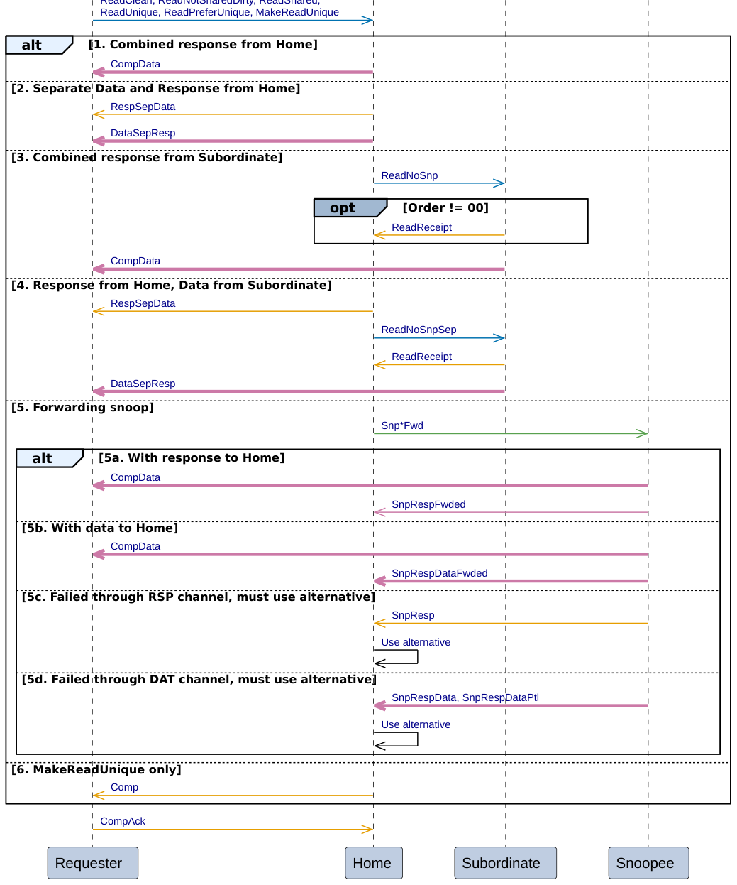
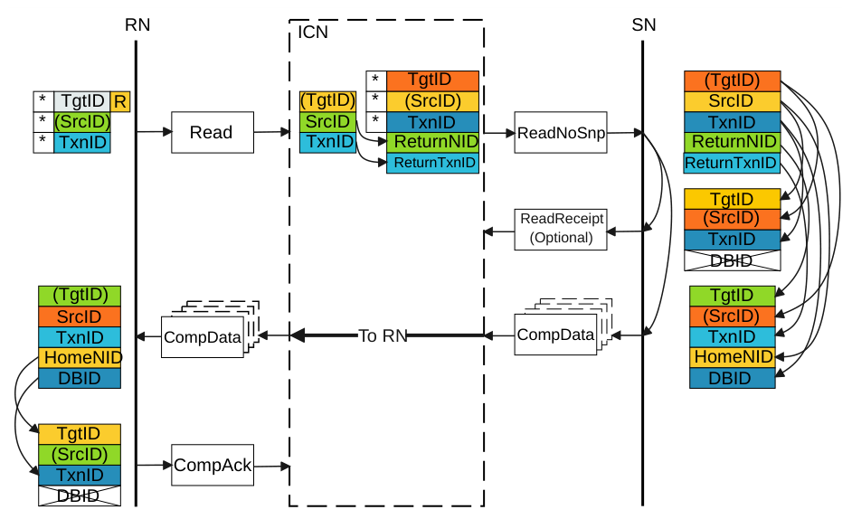
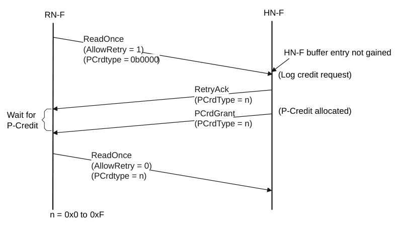
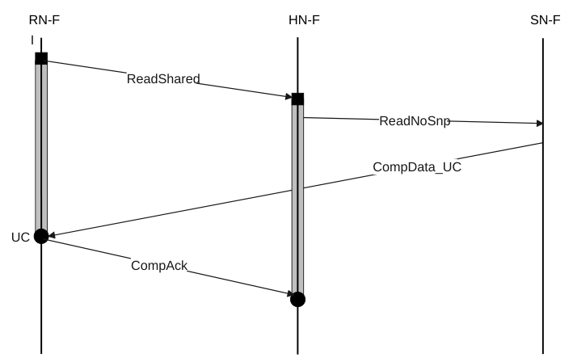
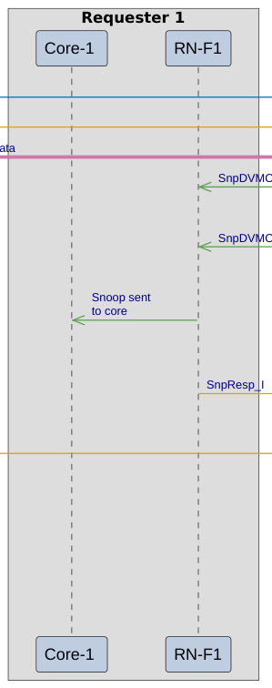
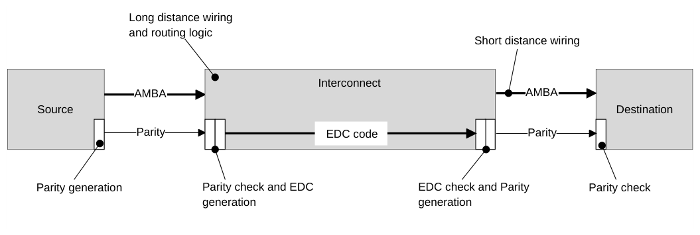
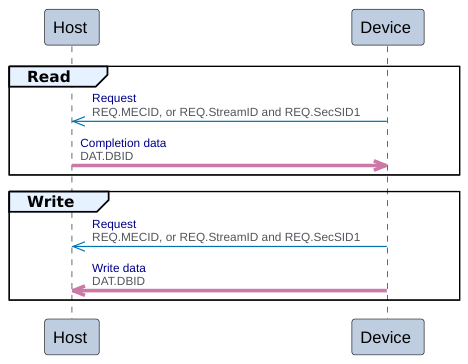
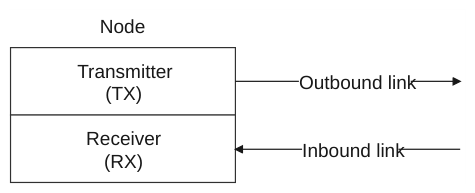
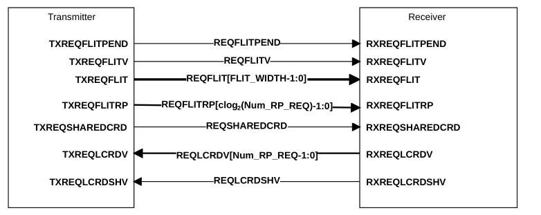
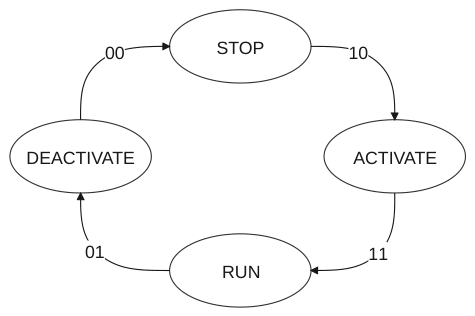

# 第一部分 总览导读

正式读 B1–B16 之前，先记住这六个坐标；文里章号指回底本译文（§B4.2.1.1 就是对应小节），事务名和缩写保留英文。

## 1. CHI 的定位与版本演进

CHI（一致性枢纽接口）说白了就是 AMBA 面向多组件硬件一致性的片上互连与接口规范（§B1.1、§B1.1.1）。

【规范】底本延伸阅读只列 AXI 和 CHI C2C，没定义 ACE（§A 延伸阅读）。【解读】"ACE→CHI"只是行业脉络的说法。

【规范】能力边界（§B1.1.2）：64 字节缓存行、MESI/MOESI、HN 统一协调、原子/独占、DVM、Retry/Resource Planes 等。【解读】这些都属于一致性域内的语义（§A）。

版本演进看 §C5（§C5.1–§C5.11）：B 首发（§C5.1）、C 加分离响应（§C5.2）、D 加 Persistent CMO（§C5.3）、E.a 加 MTE（§C5.4）、F 加 RME（§C5.7）、G 加 UDP/SD（§C5.9）、H 加 GDI（§C5.11）。【解读】某项能力是哪一版进来的，查这里（§C5.5）。

## 2. 协议分层与端到端数据流

【规范】CHI 分三层：协议层/网络层/链路层（§B1.1.3 表 B1.1）。一句话分工——协议层管语义，网络层管寻址，链路层管链路。寻址时由 SAM 定 TgtID（§B3.1），节点 ID 占 7–16 位（§B3.2）。【解读】三层分别对应语义、寻址、逐跳与背压。

下面拿一次 ReadShared 走完整路径（带侦听，见 §B5.1.2，字段依 §B2.5.1.1）：

1. RN-F0 REQ ReadShared→HN-F：TgtID 由 SAM 定、SrcID 固定、TxnID 唯一，可重映射（§B2.5.1.1、§B3.3.1、§B3.4.2）。
2. HN-F SNP SnpShared→RN-F1：侦听不定义 TgtID，SrcID/TxnID 由 HN 定（§B3.3.3）。
3. RN-F1 RSP SnpResp_I→HN-F：TgtID 取侦听的 SrcID（§B3.3.2 表 B3.1）。
4. HN-F REQ ReadNoSnp→SN-F：TxnID 重生成，ReturnNID/ReturnTxnID=原值（§B2.4.4）。
5. SN-F DAT CompData_UC→RN-F0（DMT）：TgtID=ReturnNID、TxnID=ReturnTxnID、HomeNID=HN、DBID=该 TxnID。
6. RN-F0 RSP CompAck→HN-F：TgtID=HomeNID、TxnID=DBID，HN 释放事务（§B2.4.3）。

【解读】关键就一点：标识符要换域。TgtID 每跳重定，TxnID 到 HN→SN 段换新，DBID 由完成方分配，回程的 CompAck 再用它（§B2.4.3）。

（看图提示：上例六步；注意数据来源与 CompAck 收尾）

> **注意**
> TxnID 为 12 位、单请求方上限 1024（§B2.4.2）；Retry 后无需沿用原 TxnID（§B2.10）。

## 3. 节点角色与拓扑

【规范】先说节点分类（§B1.6）：RN 负责生成请求、HN 负责完成一致性、SN 负责接 HN 的请求、MN 负责处理 DVM（§B1.3）。

| 节点 | 关键职责与判据 |
| --- | --- |
| RN-F / RN-D / RN-I | RN-F 含硬件缓存、收侦听与 DVM；RN-D 收 DVM；RN-I 皆无 |
| HN / SN / MN | HN-F 含 PoC/PoS、HN-I 无 PoC；SN 处理不可侦听读写/CMO；MN 处理 DVM |

（分类见 §B1.6，PoC/PoS 定义见 §B1.3。）

【解读】这三者的差别就是三个开关：含不含缓存、收不收 DVM、能不能被侦听；RN-F 三个全开。

【规范】HN-F 含 PoC，靠侦听 RN-F 管一致性，把 Snoop 响应汇总后返回单一响应，同时兼作 PoS；HN-I 没有 PoC，收到可侦听请求也得回一条符合协议的消息（§B1.6）。【解读】打到 HN-I 的可侦听事务本身也合法，只是要优雅地答复（§B3.3.1）。

【规范】CHI 跟拓扑基本无关，但带了一些拓扑相关的优化（§B1.2）：crossbar 低时延、ring 布线折中、mesh 拿连线换带宽。一致性域和 DVM 域的接入/断开由一致性接口来管（§B15.1）。【解读】但 PoS 落在哪，还是拓扑说了算。

（看图提示：对比 crossbar/ring/mesh；注意 HN-F 决定 PoS 落点。）

## 4. 事务体系与命名规则

【规范】事务分七类（§B1.4 表 B1.2）：读、Dataless、写、组合写、原子、其他与侦听；§B4.2 又重排成六组。Dataless 就是不带数据的事务。

命名规则【解读】很简单，按前缀加后缀拆开看：

| 成分 | 语义 |
| --- | --- |
| Read*/Write* | 取数据 / 送数据 |
| Make*/Clean*/Evict/Stash* | 取所有权 / 清理写回 / 放弃缓存 / 搬向 Stash |
| Atomic*/NoSnpSep | 原子读写 / 不可侦听且 Comp、Data 分离 |
| Unique/Shared/Once/Clean | 目标状态 / 只取快照 |
| Full/Ptl/Zero/Def/CMO | 整行/部分/只写 0/可延迟写 / 组合写 CMO |

【规范】统指约定（§B1.4 表 B1.3）：ReadOnce* 代表 ReadOnce/CleanInvalid/MakeInvalid；WriteNoSnp*CMO 等同理。

【规范】C4 汇总附录给每个事务都标了流程图号、缓存状态和 REQ 字段表（§C4.1、§C4.27）。【解读】查法：先从 §B1.4/§B4.2 定分类，再顺着 C4.x 跳到 B4 状态表、B2/B5 流程图和 C1 映射。

> **注意**
> 统指（ReadOnce*）≠某个具体 Opcode（§B1.4 表 B1.3）。

## 5. 通道与消息

【规范】节点之间靠通道通信；通道到 RN/SN 物理通道的映射见表 B2.1，链路层通道见表 B13.1（§B2.1、§B13.4）。

| 通道 | 职责（方向） | 依赖要点 |
| --- | --- | --- |
| REQ | 请求（读/写/无数据/Atomic）；RN→HN、HN→SN | 唯一支持 Retry（§B2.10） |
| SNP | 侦听请求（含 SnpDVMOp）；HN→RN | 入站 SNP 须能推进（§B13.4.1） |
| RSP | 无数据完成/Snoop 响应/CompAck；双向 | 入站 RSP 须能推进（§B13.4.1） |
| DAT | 带数据响应（CompData 等）；双向 | 入站 DAT 须能推进（§B13.4.1） |

【规范】请求/响应/Snoop 的配对见 §B4.4、§B4.5：读完成可以是单个 CompData（RDAT），也可以是 RSP+RDAT；无数据事务用 Comp/CompCMO 收尾（§B4.5.1）。RSP、DAT 都不支持重试（§B2.10）。

【规范】层级从大到小：事务 > 消息 > 数据包 > flit > phit。消息是协议层的交换粒度，数据包是互连传输粒度（§B1.3）。链路 flit 又分协议 flit 和链路 flit（§B13.3）。

【规范】LCrdReturn 是链路 flit，去激活时归还 L-Credit，Opcode 为 0、TxnID 也为 0（§B13.11、§B13.3）。PCrdReturn 属 §B1.4"其他"类，归还 P-Credit（§B2.10.1）。【解读】L-Credit 是链路层、单跳的；P-Credit 是接收保证（§B1.3）。

## 6. 术语与阅读约定

先说评注的三类标注：【规范】来自底本并附章节号；【解读】是归纳和解释；【工程建议】是实现经验，不强制。术语见 §D1。

【规范】字段命名法：

- 路由：TgtID/SrcID 按跳重定，侦听不定义 TgtID（§B2.4.1、§B3.3.3）；关联：TxnID 由请求方分配、12 位、唯一、上限 1024（§B2.4.2）；回程：DBID 由完成方分配并作后续 TxnID，ReturnNID/ReturnTxnID 由 HN 预告（§B2.4.3、§B2.4.4–§B2.4.12）；状态：Resp、RespErr、_PD、FwdState、CBusy（§B4.5.1.1、§B2.2）。

【规范】缓存状态缩写＝"Unique/Shared + Dirty/Clean + Full/Partial/Empty"，除 Partial、Empty 外均为 Full（§B1.5.2）：

| 缩写 | 含义与判读要点 |
| --- | --- |
| I | 无效（行不在缓存） |
| UC | 独占干净：可静默改，驱逐不写回 |
| UCE | 独占干净空：无有效字节 |
| UD | 独占脏：驱逐须写回 |
| UDP | 独占脏部分：驱逐须与下级合并 |
| SC | 共享干净：改前须失效其他副本 |
| SD | 共享脏：驱逐须写回 |

（看图提示：缓存状态模型；注意三维度如何组合出上表）

（语义见 §B4.1；UCE/UDP 属于空缓存行的所有权，见 §B4.1.1、§B4.1.2。）【解读】记个口诀：Unique/Shared 定要不要通知别的缓存，Dirty/Clean 定要不要写回，Full/Partial/Empty 定有效字节（§B4.5.1.1）。

# 第二部分 逐章评注

本部分按规范原文章节顺序（B1–B16）逐章评注，每章用同一套结构：**关键特性 → 架构与构件解读 → 核心机制与约束 → 应用场景与高级特性 → 数字实现与物理注意点 → 工程建议 → 常见误区与检查清单**；关键章（B2、B4、B13、B16）在最前面另加一节"先建立直觉"，把本章最核心的对象先用类比讲明白。

各章末尾均标注可回溯的章节号（形如 §B4.2.3），需要核对原文时按号翻译文即可。

| 章 | 题目 | 一句话看点 |
|---|---|---|
| B1 | 引言 | 三层结构、节点角色、事务分类法的总入口 |
| B2 | 事务 | 四通道与标识符流转，全规范的地基 |
| B3 | 网络层 | SAM 与 Node ID：请求到底发给谁 |
| B4 | 一致性协议 | 七个状态、三条转换主线、冒险条件 |
| B5 | 互连协议流程 | 读/写/Atomic/Stash 的端到端时序 |
| B6 | 独占访问 | 独占监视器怎么保证原子性 |
| B7 | 缓存暂存 | Stash：把数据搬到要用它的地方 |
| B8 | DVM 操作 | 广播式维护操作与完成判定 |
| B9 | 错误处理 | 毒化、奇偶校验与错误分类 |
| B10 | 领域管理扩展 | PAS、MPAM、MEC、细粒度隔离 |
| B11 | 系统控制、调试、跟踪与监控 | QoS、DCT、Completer Busy、Trace Tag |
| B12 | 内存标记 | MTE：Tag 与数据如何保持一致 |
| B13 | 链路层 | flit、通道、端口与信用流控 |
| B14 | 链路握手 | 初始化、低功耗、时钟门控 |
| B15 | 系统一致性接口 | 对外接口的角色与握手 |
| B16 | 属性、参数与广播信号 | 参数一致性与能力协商 |

# B1 引言 评注

## 先建立直觉

SoC 上多个 CPU 簇、一个 GPU、一个内存控制器，每个核前挂着私有缓存，簇里还有共享缓存，都要读写同一块内存。某个核改了数据，别的核手里那份就旧了，谁盯着？只能让硬件维持一致。

CHI 就是干这个的：一套可扩展的一致性集线器接口和片上互连（§B1.1）。它像一个"交通枢纽加调度中心"：发起读写的组件是请求节点（RN），事务先到枢纽报到；枢纽里的归属节点（HN）管一致性、决定去哪取数、必要时发侦听让别人作废旧副本；存数据的末端是从属节点（SN），常是内存控制器（§B1.3）。

片上走数据包，组件怎么连都行，所以 CHI 基本与拓扑无关（§B1.2）。功能分三层：协议层管"发什么事务、状态怎么变"，网络层管"发到哪个节点 ID"，链路层管"这一跳怎么送"（§B1.1.3）。【解读】

## 关键特性

1. 可扩展、模块化，基本与拓扑无关（§B1.1.2、§B1.2）。【规范】
2. 三层结构，粒度分别为事务、数据包、flit（§B1.1.3）。【规范】
3. 所有事务由互连内的 HN 处理，协调侦听、缓存与内存访问（§B1.1.2）。【规范】
4. 一致性以 64 字节缓存行为粒度，支持 Snoop Filter/目录与 MESI/MOESI（§B1.1.2）。【规范】
5. 事务分读、Dataless、写、组合写、原子、其他、侦听七类（§B1.4）。【规范】

## 架构与构件解读

**（1）三层分工（§B1.1.3）**【规范】协议层（事务）生成处理请求响应、定义状态转换与事务流；网络层（数据包）打包消息、确定源和目标节点 ID；链路层（flit）设备间流控、避免死锁。

**（2）节点角色（§B1.3、§B1.6）**【规范】

| 节点 | 缓存 | 职责 |
|---|---|---|
| RN-F | 有 | 发除 ReadNoSnpSep 外全部事务，响应所有 Snoop |
| RN-D | 无 | 收 DVM，发事务子集 |
| RN-I | 无 | 不收 DVM，发事务子集，不需侦听 |
| HN-F | — | 含 PoC，汇总侦听响应，兼作 PoS |
| HN-I | — | 不处理可侦听请求，作 IO 的 PoS |
| MN | — | 完成 DVM 事务 |
| SN-F／SN-I | — | 处理不可侦听的读、写、原子与 CMO |

**（3）事务分类（§B1.4）**【规范】

| 分类 | 代表事务 |
|---|---|
| 读 | ReadNoSnp、ReadOnce*、ReadClean/Shared/Unique |
| Dataless | CleanUnique、MakeUnique、Evict、StashOnce*、CMO |
| 写 | WriteNoSnp*、WriteUnique*、WriteBack* |
| 组合写 | 写与 CleanSh/CleanInv 等 CMO 组合 |
| 原子 | Atomic*、DVMOp、PrefetchTgt、PCrdReturn |
| 侦听 | SnpOnce*/Shared*/Unique*、SnpQuery、SnpDVMOp |

## 核心机制与约束

- **组件命名与一致性域（§B1.3、§B1.6）**：RN-F 带硬件一致性缓存、能发全量事务并响应所有侦听，RN-I/RN-D 不带；IO 一致性节点不收侦听；PoC 是 HN-F。
- **一致性在缓存行粒度（§B1.5.1）**：缓存行 64 字节对齐；存储后同址副本不超过一份；只有副本不再被缓存持有时才更新主存；CHI 是写无效协议（§B1.3）。
- **缓存状态四维度（§B1.5.2）**：Valid/Invalid、Unique/Shared、Clean/Dirty、Full/Partial/Empty 组成七状态。
- **读数据源（§B1.7）**：来自互连内部缓存、从属节点或对等 RN-F；HN 可要求只回数据给它再转发，也可允许直送请求方省一跳。

## 应用场景与高级特性

**用法与部署。** 拓扑按规模选（§B1.2）：节点少用 Crossbar，中等规模用 Ring，规模大用 Mesh。角色按是否需缓存与侦听：处理器簇用 RN-F，纯 IO 用 RN-I，需 DVM 的 IO 用 RN-D。

（看图提示：三种拓扑对应不同规模。）

**可选优化。** 读路径有三类直传：DMT 从属节点直送请求方、DCT 对等 RN-F 直送请求方、DWT 请求方写数据直送从属节点（§B1.7）。

（看图提示：互连内部缓存、从属节点、对等 RN-F 三个数据源。）

## 数字实现与物理注意点

- **拓扑对时延与面积（§B1.2）**：Crossbar 低时延但连线多；Ring 时延线性增长；Mesh 连线更多、带宽更大。【解读】
- **一致性域边界（§B1.3、§B1.6）**：域内节点会被侦听、需缓存状态；IO 一致性节点在域外，这条边界要落到 HN 侦听范围与过滤器。【解读】
- **一致性粒度固定为 64 字节缓存行，数据宽度可配（§B1.1.2、§B1.5.1）。**【规范】

## 工程建议

- **拓扑选型**：小系统 Crossbar、中等规模 Ring、大系统 Mesh。【工程建议】
- **角色划分早定**：能挂缓存的用 RN-F、纯 IO 用 RN-I、需 DVM 用 RN-D。【工程建议】
- **读路径优先直传**：DCT 下提供者须通知 HN、有时要给 HN 发副本。【工程建议】
- **术语先统一**：事务、消息、数据包、flit、phit 别混用。【工程建议】

## 常见误区与检查清单

1. 以为 CHI 规定固定拓扑。【规范】架构基本与拓扑无关，只含少量依赖拓扑的优化（§B1.2）。
2. 把消息和数据包当一回事。【规范】前者是协议层粒度、后者是传输粒度，一消息可由多数据包组成（§B1.3）。
3. 以为 IO 一致性节点会收侦听。【规范】它的 Snoopable 请求不以一致性状态缓存数据，故不收侦听（§B1.3）。
4. 以为主存必须始终最新。【规范】只有副本不再被任何缓存持有时才更新主存（§B1.5.1）。
5. 把 Clean 当成"内存一定最新"。【规范】Clean 只表示该缓存无写回责任（§B1.5.2）。

# B2 事务 评注

## 先建立直觉

RN-F 要读一段不在自己缓存里的数据，先发 ReadShared（REQ 通道），说清三件事：要什么、发到哪、我是谁。HN-F 可能去内存取数，也可能发现别人手里副本更新，于是发 SnpCleanFwd（SNP 通道）；被侦听的 RN-F 把数据直接回请求方（DAT），同时给 HN-F 回响应（RSP）；请求方拿到数据再回 CompAck（RSP）。（§B2.1）

四个通道分工：REQ 送请求，SNP 送侦听，DAT 搬数据，RSP 送响应与确认。绕人的是标识符：请求方用 TxnID，HN-F 发往内存时换成自己的 TxnID；内存回数据的 TxnID 取自 HN-F 塞的 ReturnTxnID；最后 CompAck 的 TxnID 等于数据包里由 HN-F 分配的 DBID。（§B2.4、§B2.5）

【解读】每跳都用"自己的"标识符发包——TxnID 由发起方分配，DBID 由完成方分配，谁分配谁回收。把每一跳当独立命名域读，那串 ID 就顺了：标识符逐跳换，不是一路带过去。

## 关键特性

1. 四通道 REQ、SNP、RSP、DAT，命名与职责不重叠。（§B2.1）【规范】
2. 请求字段只有少数影响结构：Opcode、Size、MultiReq/NumReq、Order、ExpCompAck 等。（§B2.2.1）【规范】
3. 标识符分路由、关联、回程、分组与定位类。（§B2.4）【规范】
4. 标识符逐跳流转，按事务类型给出换名与复用规则。（§B2.5）【规范】
5. Order 给出 Request/Endpoint Order、OWO、Request Accepted 四类排序。（§B2.7）【规范】
6. P-Credit 给 REQ 流控；多请求最多合成 64 个 64B。（§B2.6、§B2.10）【规范】

## 架构与构件解读

**（1）四通道（§B2.1）**【规范】

| 通道 | 请求节点侧 | 从属节点侧 |
|---|---|---|
| REQ | TXREQ | RXREQ |
| SNP | RXSNP | 无 |
| RSP | RXRSP 收、TXRSP 发 | TXRSP |
| DAT | TXDAT 发、RXDAT 收 | RXDAT 收、TXDAT 发 |

【解读】RSP/DAT 物理分收发两套、逻辑上一个通道，请求侧拆成 CRSP·SRSP、WDAT·RDAT；SNP 无 TgtID，路由靠实现自己算。

**（2）四段式结构（§B2.3）**【规范】：事务由请求、侦听、响应、数据四类消息拼成。除原始请求方外，组件须先收到该事务首消息才能发后续消息；同组件发的消息默认任意顺序到达。Retry 序列适用于除 PCrdReturn、PrefetchTgt 外的所有事务（§B2.3.8），HN 发起的同级事务见 §B2.3.9；HN→SN 请求可用 ReturnNID/ReturnTxnID 把响应送回原始请求方，或让其等于 SrcID/TxnID、使响应全回 HN（§B2.3）。

**（3）字段家族（§B2.4）**【规范】

| 家族 | 字段 | 谁生成、干什么 |
|---|---|---|
| 路由 | TgtID、SrcID | 每跳填目的与源，可重映射（§B2.4.1） |
| 关联 | TxnID | 请求方分配；12 位（§B2.4.2） |
| 回程 | DBID | 完成方分配，回程顶替 TxnID（§B2.4.3） |
| 回程 | ReturnNID、ReturnTxnID | HN→SN 请求里指定数据、DBIDResp、Persist、TagMatch 的收方与 TxnID（§B2.4.4、§B2.4.10） |
| 回程 | HomeNID；FwdNID、FwdTxnID | 分别指明 CompAck 与转发 snoop 数据发给谁（§B2.4.11、§B2.4.5、§B2.4.12） |
| 分组 | PGroupID、StashGroupID、TagGroupID | 标识 Persist、Stash、Tag 事务集合（§B2.4.13–§B2.4.15） |
| 定位 | DataID、CCID、CacheLineID | 包偏移、关键块、多请求缓存行（§B2.4.6、§B2.4.16） |

【解读】按"回程路径"记字段：数据回请求方靠 ReturnNID/ReturnTxnID 或 FwdNID/FwdTxnID，确认回 HN 靠 HomeNID/DBID，集合响应靠三个 GroupID。硬约束：某接口某 RP 用过的标识符值不得被另一 RP 复用（§B2.4）。

字段的完整清单、取值与约束按通道逐张表列在 §B2.2（通道字段）；本节只拎主线，要查"某字段能不能取某值"回 §B2.2 对应通道的表。【解读】

## 核心机制与约束

**本章重点是标识符逐跳换名、谁分配谁回收（§B2.5）。** DMT 读（§B2.5.1.1）【规范】：HN→SN 请求 ReturnNID=SrcID、ReturnTxnID=TxnID；回数据 TgtID=ReturnNID、TxnID=ReturnTxnID、HomeNID=SrcID、DBID=TxnID；CompAck 的 TgtID=HomeNID、TxnID=DBID。分离响应（§B2.5.1.2）下 RespSepData 的 DBID 即该 SN 请求 TxnID，DataSepResp 须一致（§B2.4.3）。

DCT（§B2.5.1.3）【规范】：转发 snoop 的 FwdNID=原 SrcID、FwdTxnID=原 TxnID；Snoopee 回数据 TgtID=FwdNID、TxnID=FwdTxnID，给 HN 的 snoop 响应用自己 TxnID。

写事务（§B2.5.3.1、§B2.5.3.2）【规范】：DBID 由完成方在 DBIDResp/CompDBIDResp 给出，WriteData 的 TxnID 填它、DBID 字段不用；分离的 DBIDResp 与 Comp 须一致、都收到才可复用 TxnID，收齐写数据才复用 DBID，CopyBack 收到 CompDBIDResp 即可复用。WriteUnique 的 CompAck 须与写数据同字段；Stash 给 HN 的 snoop 响应 DBID 由 Snoopee 生成，HN 回读时 TxnID 填它（§B2.5.3.4）。

DBID 唯一性与例外（§B2.4.3）【规范】：同一请求方下，Write/Atomic/DVMOp 的 DBIDResp*、带 CompAck 读的 CompData/RespSepData、相关 Comp 的 DBID 必须唯一；Stash 的 DataPull 侦听 DBID 还须对它自己未完成事务唯一。免用：Write*Zero、不带 CompAck 的读与无数据事务、非 DataPull/Stash 的 SnpResp；DataPull=0 的 SnpRespData(Ptl)/SnpRespDataFwded 中 DBID 须为 0。

无数据事务与 DVMOp（§B2.5.2、§B2.5.4）【规范】：除 CleanSharedPersistSep 与 StashOnceSep 外，无数据事务标识符用法同"无数据传送的读"，完成响应走 CRSP 单包；前者 Persist 响应带 PGroupID、TxnID=0，后者 StashDone 同；DVMOp 用法同 WriteNoSnp。

复用时机（§B2.4.2）【规范】：TxnID 收到全部响应或 RetryAck 后复用；TagMatch、StashDone、Persist 的 TxnID 恒为 0，靠三个 GroupID 映射回原事务；被重试的事务不要求沿用原 TxnID。

**多请求（§B2.6）**【规范】：最多 64 个属性相同、地址连续的 64B 请求合成一个，限 ReadNoSnp*、WriteNoSnp*、ReadOnce*、WriteUnique*；MultiReq/NumReq/Size 表示总量、CacheLineID 区分缓存行；起始地址须缓存行对齐且不得跨 4KB，响应仍按缓存行返回、一致性粒度仍 64B；SNP 不支持，DCT 场景要求 Snoopee 的 MultiReq_Support 或 CacheLineID_Accurate；独占事务不允许。

**顺序与确认（§B2.7）**【规范】：写必须多副本原子（§B2.7.1）。可缓存位置的 CompData/DataSepResp/RespSepData 使事务对后续同址事务可见；RespSepData_I 下后续侦听须等 CompAck（§B2.7.2、表 B2.7）。除 ReadNoSnp/ReadOnce* 外，HN-F 发同址 snoop 前须等 CompAck（CopyBack 的 WriteData 为隐式 CompAck，§B2.7.3）；RN-F 须在同样范围带 CompAck，但 StashOnce*、CMO、Atomic、Evict 不带（表 B2.8）。Order（表 B2.9）：0b00 不要求；0b01 Request Accepted（HN-F→SN-F、HN-I→SN-I）；0b10 在 RN→HN 是 Request Order、ExpCompAck=1 时 OWO；0b11 Endpoint Order（§B2.7.5）。依赖 Order 的事务须走同一 REQ RP；CopyBack 须等 CompDBIDResp/Comp 后才能再发请求（§B2.7.5.2）。

**地址、控制与数据分离（§B2.8）**【规范】：Addr 支持 44–52 位 PA、49–53 位 VA；REQ 用 Address[(MPA-1):0]，SNP 只用 Address[(MPA-1):3]（§B2.8.1）。MemAttr=EWA、Device、Cacheable、Allocate：EWA=1 时写完成可来自中间点；Device 禁预取与合并、读必须走端点；Cacheable=1 必须查缓存（§B2.8.3）。SnpAttr 表示是否可能需要侦听，二者加 Order 的合法组合见表 B2.11（§B2.8.4、§B2.8.6）。属性不匹配的访问允许存在但不得死锁，RN-F 对自认不可侦听的位置收到侦听应回 SnpResp_I（§B2.8.7）。

**数据传输与分片（§B2.9）**【规范】：Size 编码 1/2/4/8/16/32/64 字节，snoop 数据固定 64 字节（§B2.9.1）。Normal 内存从对齐地址起访问 Size 字节，Device 内存从事务地址起访问到下一个 Size 边界（§B2.9.2）。BE 为 0 时对应字节须为 0；全字节写事务除 CopyBackWriteData_I/WriteDataCancel 外 BE 须全 1（§B2.9.3）。总线 128/256/512 位，DataID 标包偏移、CCID 复制 Addr[5:4]（§B2.9.4）。Limited Data Elision 省略全零或重复包（§B2.9.5、§B2.9.5.3）。Atomic 的 Compare/Swap 拼接，Swap 地址=Compare 地址反转 bit[n]（n=log2(Compare 字节数)），字节序由 Endian 决定（§B2.9.6.2、§B2.9.6.3）。

**Request Retry（§B2.10）**【规范】：完成方缓冲不足时回 RetryAck 并记录原请求 SrcID 与所需 PCrdType；就绪后发 PCrdGrant；请求方带 AllowRetry=0、按对应 PCrdType 重发，此次保证被接受；首次发送 AllowRetry 必须为 1。重发除 QoS、TgtID、TxnID、ReturnTxnID、AllowRetry、PCrdType、CAH 等少数可变的之外，其余字段须与原请求一致。信用类型最多 16 种；每请求方未完成事务上限 1024；多请求在 Retry 里算一个实体；不用的信用用 PCrdReturn 归还（§B2.10.1）。

## 应用场景与高级特性

**路径与优化机制。**【规范】

- 路径：ReadNoSnp 无 snoop（§B2.3.1.2）；进缓存读走 DMT/DCT（§B2.5.1）；立即写 EWA=1 时完成可来自中间点（§B2.8.3.1）；CopyBack 可用 CAH 省掉 CopyBackWriteData（§B2.8.8）；Stash 用 PGroupID 收尾（§B2.5.3.4、§B2.5.2.1）。
- 优化：多请求（§B2.6）与 Retry（§B2.10）可组合；SOW 不必等前置写完成（§B2.7.5.3、§B2.7.5.3.1）；CCF_Wrap_Order 允许包重排以对接 AXI（§B2.9.8、§B2.9.9）；LDE 省包，CopyBackWriteData_I/WriteDataCancel/NDERR 须省最大包数且 Replicate=0（§B2.9.5、§B2.9.5.3.3）。

## 数字实现与物理注意点

- **通道缓冲**【规范】：只有 REQ 有 Retry 背压，DAT/RSP/SNP 靠缓冲硬扛（§B2.10）；SNP 无 TgtID，查找表按 SrcID 加 TxnID 索引（§B2.2.3）。
- **位宽**【规范】：Req_Addr_Width 有效 44–52、默认 44（§B2.8.1）；总线宽度决定 DAT 包数与 DataID 宽度（§B2.9.4）。
- **关键块**【规范】：CCID=请求 Addr[5:4]，比对 CCID 与 DataID 找关键块，128 位全比、256 位只比最高有效位（§B2.9.7）。

## 工程建议

- **标识符分配策略**：TxnID 用自由链表加位图，分配时登记归属与字段快照，释放写成显式状态机。【工程建议】
- **把逐跳映射写成一张表**：按事务类型列出每个发出的包各字段的来源，对着 ID 值传递图逐格填。【工程建议】
- **重试路径单独验证**：RetryAck 与 PCrdGrant 乱序、重发 TxnID 变化、信用归还、多请求整体重试的定向用例，再叠加 CopyBack 失效分支。【工程建议】
- **抓包按标识符串事务**：一条事务横跨多个 TxnID 和 DBID，工具应以 (SrcID, TxnID) 起链、遇 ReturnTxnID 或 DBID 延续到下个包。【工程建议】
- **断言放在边界条件上**：多请求起始地址是否对齐、是否跨 4KB；非转发 snoop 的 FwdNID/FwdTxnID 是否为 0；Order 非零是否走同一 REQ RP。【工程建议】
- **用过度冒险换时序余量**：多请求按事务大小两倍、或按完整 4KB 范围做冒险，用一致性逻辑简化换时序余量。【工程建议】

## 常见误区与检查清单

1. **以为 TxnID 一路不变。**【规范】HN→SN 请求用自己 TxnID，原 TxnID 进 ReturnTxnID（§B2.5.1.1）。
2. **在 WriteData 里填 DBID。**【规范】TxnID 应填 DBIDResp 给出的 DBID，DBID 字段不用（§B2.5.3.1）。
3. **CompAck 沿用原请求 TxnID。**【规范】应用数据包里 DBID，TgtID 用 HomeNID（§B2.5.1.1）。
4. **分离的 DBIDResp 与 Comp 字段不同。**【规范】同源须完全相同，都收到才可复用 TxnID（§B2.4.3、§B2.5.3.2）。
5. **以为 TagMatch/StashDone/Persist 靠 TxnID 关联。**【规范】其 TxnID 恒 0，靠三个 GroupID 关联（§B2.4.2）。
6. **忘了首包 AllowRetry 必须为 1。**【规范】首次为 1，重发时置 0（§B2.10、§B2.10.2.1）。
7. **以为 RetryAck 一定先于 PCrdGrant。**【规范】两者可乱序，请求方先存信用再重发（§B2.10）。
8. **给 snoop 塞 TgtID。**【规范】SNP 无 TgtID 字段（§B2.2.3）。
9. **以为多请求能跨 4KB 或用于独占事务。**【规范】起始地址须缓存行对齐且不跨 4KB，独占不支持（§B2.6）。
10. **把 RespSepData_I 当作已全局观察。**【规范】Resp 为 I 时不保证 HN 已侦听其他代理（§B2.7.4）。

# B3 网络层 评注

## 关键特性

1. 网络层把消息打包，确定为路由所需的源和目标节点 ID（§B1.1.3）。【规范】
2. Requester 必须有 SAM 定 TgtID，须完整译码整个地址空间（§B3.1）。【规范】
3. 一个 Port 可多个 Node ID，但一个 ID 只属单个 Port；宽度 7～16 位（§B3.2）。【规范】

## 架构与构件解读

**SAM（§B3.1）**【规范】：格式实现定义；须完整译码整个地址空间，未知地址发给能报错的代理。

**Node ID（§B3.2）**【规范】：标识数据包的源与目的地；一 Port 可多个、一 ID 只属一个 Port。

**TgtID（§B3.3）**【规范】：请求：无预分配信用时 DVMOp 由 Opcode、其他由地址映射定，用则取 RetryAck 的 SrcID 或原请求 TgtID；PrefetchTgt 用另一套映射、指向 SN。响应须匹配所收消息的 SrcID/HomeNID/ReturnNID/FwdNID 之一；侦听请求不含 TgtID（§B3.3.3）。

**流示例（§B3.4）**【规范】：简单流中 RN 发出指向 HN0 的请求，HN0 查 SAM 定 SN；数据响应 TgtID 由 ReturnNID、CompAck 由 HomeNID 推导。

（看图提示：数据响应看 ReturnNID，CompAck 看 HomeNID。）

## 核心机制与约束

- **地址解码边界（§B3.1）**：SAM 须完整译码整个地址空间，未知地址导向能报错的代理；Requester 须预期 TgtID 被重映射（§B3.3.1）。
- **TgtID 三条路径（§B3.3.1）**：无预分配信用时 DVMOp 由 Opcode、其他由地址映射；用则取 RetryAck 的 SrcID 或原请求 TgtID；PCrdReturn 须匹配先前 PCrdGrant 的 SrcID。
- **互连重映射（§B3.3.1、§B3.4.2）**：仅重映射来自 RN 的请求 TgtID，SrcID 保持原请求方、ReturnNID 指向原 Requester、HomeNID 指向重映射后的 HN；重试请求须再过一次。

## 应用场景与高级特性

**用法与部署。** SAM 可放 RN 或互连，放互连时由互连统一控路由、可重映射 TgtID（§B3.3.1）。

**可选优化。** TgtID 重映射让互连不改 RN 就能调整目标节点（§B3.4.2）。

## 数字实现与物理注意点

- **Node ID 位宽（§B3.2）**：7～16 位一次定死、全局一致，决定可寻址节点数。【解读】
- **SAM 译码覆盖（§B3.1）**：须完整译码整个地址空间，不能漏项。【规范】

## 工程建议

- **地址解码用查表还是组合逻辑**，都须完整译码。【工程建议】
- **Node ID 按 2 的幂规划位宽、留余量**，定死后难改。【工程建议】
- **SAM 放互连**可统一控路由，但 RN 须容忍 TgtID 被重映射。【工程建议】

## 常见误区与检查清单

1. 以为 SAM 格式由规范规定。【规范】格式实现定义（§B3.1）。
2. 以为一个 Node ID 能分给多个 Port。【规范】一个 ID 只属单个 Port（§B3.2）。
3. 以为所有请求都指向 HN。【规范】PrefetchTgt 始终指向 SN（§B3.3.1）。
4. 以为侦听请求也带 TgtID。【规范】侦听请求不含 TgtID（§B3.3.3）。

# B4 一致性协议 评注

## 先建立直觉

缓存状态只回答两件事：数据是不是只有我一份，内存里那份旧不旧、写回谁负责。

七个状态其实是三维组合：Unique/Shared（是否独占）、Dirty/Clean（比内存新不新、要不要写回）、Full/Partial/Empty（全有效/部分/全无）（§B1.5.2、§B4.1）。念缩写就懂：UCE 是"独占 + Clean + 空"，有所有权却无有效字节；UDP 是"独占 + Dirty + 部分"。

读请求的数据只有三个来源：自己有副本（不用发请求）；副本在别的 RN-F 手上且最新（HN 发侦听让它直接给请求方，即 DCT）；或都没有，只能去内存取（§B1.7、§B4.9）。

最后划线：B4 只规定"允许什么"，流程与时序在 B5。【解读】

## 关键特性

1. 三维定义 7 种状态（I/UC/UCE/UD/UDP/SC/SD），允许只实现子集。（§B4.1）【规范】
2. 请求分七类，逐类规定数据流向与完成形态。（§B4.2）【规范】
3. 侦听家族与四类响应，Resp 编码状态与 Pass Dirty。（§B4.3、§B4.5）【规范】
4. 请求到期望侦听的配对：失效覆盖全部副本，Forwarding/Stash 只发一个 RN-F。（§B4.4）【规范】
5. 三条转换主线，加数据随侦听返回、DoNotGoToSD 与冒险收口。（§B4.6–§B4.11）【规范】

## 架构与构件解读

**（1）缓存行状态（§B4.1）**【规范】

| 状态 | 可有多副本 | 写回责任 | 数据有效 |
|---|---|---|---|
| I | — | — | — |
| UC | 否 | 无 | 全部 |
| UCE | 否 | 无 | 无字节有效 |
| UD | 否 | 驱逐须写回 | 全部 |
| UDP | 否 | 驱逐须与下级合并 | 部分 |
| SC | 可有 | 本缓存不负责 | 全部 |
| SD | 可有 | 驱逐须写回 | 全部 |

【解读】UCE/UDP 是空缓存行所有权的两种形态（§B4.1.1、§B4.1.2）：前者无有效字节、后者已有部分脏字节。UD 与 SD 都脏，只差能否有他人副本；SC 不负责写回，不等价于 UC。

**（2）请求类型家族（§B4.2）**【规范】

| 家族 | 代表事务与要点 |
|---|---|
| 读 | ReadNoSnp、ReadOnce*、ReadClean/Shared/NotSharedDirty/Unique、MakeReadUnique；数据流入、完成带终态 |
| 无数据 | CleanUnique、MakeUnique、Evict、StashOnce*、CMO；不进出数据，完成不带数据 |
| 写 | 立即 WriteNoSnp*、WriteUnique*（可能侦听）；CopyBack WriteBack*、WriteCleanFull（不侦听） |
| Combined Write | Write*CleanSh、Write*CleanInv 等；写与同址 CMO 合并、CMO 取最具传播性 |
| Atomic、其他 | AtomicStore/Load/Swap/Compare、DVMOp、PrefetchTgt；除 AtomicStore 外返回 InitialData |

**（3）侦听请求（§B4.3）**【规范】

| 侦听 | Snoopee 侧结果 |
|---|---|
| SnpOnce(Fwd) | 取最新副本，尽量不改状态 |
| SnpClean/NotSharedDirty/Shared（含 Fwd） | 保持 Shared，不得变 Unique |
| SnpUnique(Fwd) / SnpPreferUnique(Fwd) | 其他副本失效并转 I；Fwd 版 Pass Dirty 给请求方，Prefer 版看是否在独占序列、须查响应 |
| SnpCleanShared / SnpCleanInvalid / SnpMakeInvalid(Stash) | 去 Dirty / 失效并取走 Dirty / 失效并丢 Dirty |
| SnpUniqueStash / SnpStashUnique·Shared / SnpQuery | 建议以 Unique 取回 / 不改状态 / 返回精确状态、不带数据 |

**（4）响应类型（§B4.5）**【规范】

| 类别 | 代表 | Resp 语义 |
|---|---|---|
| 完成 | Comp/CompData、CompDBIDResp、CompPersist/CMO | 完成后允许的终态 + Pass Dirty；写事务 Resp=0 |
| WriteData | CBWrData、NCBWrData(+CompAck)、WriteDataCancel | 发送数据当刻的状态 |
| 侦听响应 | SnpRespFwded/Data/DataPtl/DataFwded | 响应之后 Snoopee 的终态；FwdState 用于 DCT |
| 其他 | CompAck/RetryAck/PCrdGrant、DBIDResp、ReadReceipt、Persist | 收尾、流控与排序 |

## 核心机制与约束

- **请求–侦听配对（§B4.4、§B4.4.2）**：选型看请求方期望终态、Snoopee 需达状态、不丢 Dirty，有等价 Forwarding 版优先；失效侦听须覆盖所有持副本节点、UD 必须被侦听；Forwarding/Stash 只发一个 RN-F、不得用于 <64B；带 stash hint 的写还要向非 stash 目标发失效侦听；用 SnpMakeInvalid 前须确认无 Dirty 标签。配对：ReadNoSnp·ReadOnce*→无/SnpOnceFwd（失效变体可加 SnpUnique(Fwd)）；ReadClean·ReadNotSharedDirty·ReadShared→SnpCleanFwd·SnpNotSharedDirtyFwd·SnpSharedFwd；ReadUnique·ReadPreferUnique·MakeReadUnique→SnpUniqueFwd·SnpPreferUniqueFwd·SnpCleanInvalid；CleanUnique·CleanInvalid*→SnpCleanInvalid，CleanShared(Persist)→SnpCleanShared，MakeUnique·MakeInvalid→SnpMakeInvalid，StashOnce*→SnpStashUnique·Shared；WriteUniqueFull·Zero→SnpMakeInvalid，WriteUniquePtl→SnpCleanInvalid 或 SnpUnique，WriteUnique*Stash→SnpMakeInvalidStash·SnpUniqueStash；Atomic*→SnpUnique，DVMOp→SnpDVMOp；Evict·WriteNoSnp·CopyBack 写不发侦听。
- **静默转换（§B4.6）**：不通知别人就改状态，仅驱逐（UC/UCE/SC→I）、本地共享（UC→SC、UD→SD）、无效化（UD/UDP→I）、存储（UC→UD、UCE→UDP/UD、UDP→UD）合法；UC→UCE 非法。可用事务把转换"显影"。
- **请求方转换（§B4.7）**：ReadNoSnp、ReadOnce* 须忽略完成响应状态、视为 I；ReadUnique 终态只能 UC/UD，ReadNotSharedDirty 不得出现 SD；MakeReadUnique 除收到失效类侦听（SnpUnique/Fwd、SnpCleanInvalid/MakeInvalid、SnpStash 类）外必须保留副本；HN 无精确过滤器时须假定副本已丢并回数据。
- **Snoopee 转换与数据返回（§B4.8、§B4.9）**：由侦听类型 × 初始状态 × DoNotGoToSD × RetToSrc 决定；SnpStash* 不改状态，SnpMakeInvalidStash 的 RetToSrc 必须为 0。非转发下（除 SnpMakeInvalid）Dirty 必返回、UC 可返回、SC 仅 RetToSrc=1 建议返回；转发下 Dirty 转不出或留不住时必返回，RetToSrc=1 且 Clean 必返回、=0 且 Clean 不得返回。RetToSrc 只能对单节点置位，对 SnpCleanShared/Invalid/MakeInvalid、SnpOnceFwd/UniqueFwd、SnpStash 类、SnpQuery 必须为 0。
- **DoNotGoToSD 与冒险（§B4.10、§B4.11）**：DoNotGoToSD 只修饰非失效侦听，UD→SD 的静默或非强制转换不受约束；RN-F 须等齐所有 Data 包才响应侦听，CopyBack 未完成时 CopyBackWriteData/CompAck 须带处理完侦听后状态；HN-F 须等上一侦听响应后才能对同一行再侦听（§B4.11.2）。

## 应用场景与高级特性

**用法与部署。**

- **读的梯度**：能接受 SD 用 ReadShared，不能则 ReadNotSharedDirty；不能存 Dirty 的缓存用 ReadClean；将写入用 ReadUnique；可退化用 ReadPreferUnique（§B4.2.1）。【规范】
- **已有副本到可写**：CleanUnique 或 MakeReadUnique；无 Snoop Filter 时 CleanUnique 可省一次内存读，代价是副本失效须重发（§B4.7.1.1.3）。【规范】
- **迁移与逐出**：Forwarding 侦听让 Snoopee 直送数据；干净行驱逐用 Evict 显影静默驱逐；CMO 是 CleanShared 清污染、CleanInvalid 失效并回写、MakeInvalid 失效并丢 Dirty（§B4.2.2.1）。【规范】

- **DCT 与 FwdState**：转发侦听让 Snoopee 直送数据，FwdState 给出转发状态与 Pass Dirty；仅当该行只缓存在一个 RN-F 时才能用 SnpUniqueFwd/SnpPreferUniqueFwd（§B4.8.3.4、§B4.8.3.5）。【规范】
- **Stash 与状态**：SnpStashUnique/Shared 不改 Snoopee 状态，SnpUniqueStash 建议以 Unique 取回；Snoopee 可用 DataPull 把读与侦听响应合并，StashOnceUnique 的 DataPull 视为 ReadUnique（§B4.2.2、§B4.8.2）。【规范】
- **数据搬运更少**：RetToSrc 按需把 Clean 副本带回 HN；Snoop Filter 显示无副本或副本已达标时 HN 可不发侦听；能用 SnpCleanInvalid 就别用 SnpUnique，免得从 UC 多传数据（§B4.4.2）。【解读】

## 数字实现与物理注意点

- **状态机落地（§B4.6–§B4.8）**【规范】：Snoopee 侧按"侦听类型 × 初始状态 × DoNotGoToSD × RetToSrc"展开，请求方侧按"请求类型 × 初始状态"展开；UDP 须按字节记录有效性，UCE/UDP 须区分能否供数（§B4.1、§B4.7.1）。
- **数据路径与冒险（§B4.11.1、§B4.11.2）**【规范】：转发侦听可能同时回请求方与 HN，FwdState 与 Pass Dirty 须一致；RN-F 数据包未齐时须挂起侦听响应，HN-F 对同一行侦听互斥。

## 工程建议

- **目录还是侦听过滤器**：directory 精确到每个副本，粗粒度 Snoop Filter 更省面积与功耗，代价是更多无用侦听与更保守的响应，按面积/功耗/带宽权衡。【工程建议】
- **验证重点压转换表**：覆盖各转换表，并对非法组合设断言——如 UC→UCE、<64B 的 Forwarding 侦听。【工程建议】
- **上板前自检**：初始与最终状态是否落在表 B4.4/B4.5、B4.11/B4.12、B4.44/B4.45 允许集合内；失效侦听是否覆盖全部副本、Forwarding/Stash 是否只对一个目标；RetToSrc 与 DoNotGoToSD 取值是否合法。【工程建议】

## 常见误区与检查清单

1. **把完成响应的 Resp 当成当前状态。**【规范】它给的是完成后的允许终态（§B4.5.1.1）。
2. **以为侦听响应、WriteData 与完成响应的状态语义一致。**【规范】三者分别是"响应之后""发送当刻""完成后允许"（§B4.5.3）。
3. **把 UCE 当"没有数据的 UC"，侦听时返回或转发数据，或让 ReadOnce* 用返回状态。**【规范】UCE 既不得返回也不得转发（§B4.1）；ReadOnce* 须忽略状态并视为 I（§B4.7.1）。
4. **以为 DoNotGoToSD 禁止一切 SD，或 RetToSrc=0 时 SC/Clean 仍随侦听响应返回。**【规范】前者只约束非失效侦听引起的强制独占→共享转换（§B4.10）；后者非转发下 SC 不得返回、转发下 Clean 不得返回（§B4.9）。

# B5 互连协议流程 评注

## 关键特性

- 全章用时间-空间图讲端到端流程；HN-F 无互连缓存、请求一律下探 SN-F（§B5 引言）。【规范】
- 读按数据来源分三线：DMT 直送、DCT 转发、经 HN-F 中转（§B5.1）。【规范】
- 写为 DBIDResp → 写数据 → Comp 三段式，Comp 可在收到写请求后任意时刻发（§B5.3）。【规范】
- Atomic 分 HN-F、归属节点、SN-F 三处执行，并区分是否返回数据（§B5.4）。【规范】
- Stash 把读请求并入侦听响应（Data Pull），由 HN-F 合成 CompData（§B5.5）。【规范】

## 架构与构件解读

- **读（§B5.1）**：DMT——RN-F 发 ReadShared → HN-F 发 ReadNoSnp → SN-F 用 CompData 直送 RN-F → RN-F 回 CompAck 释放；带侦听时先收齐 SnpResp_I 才下探。DCT 由 Snoopee 直转数据。【解读】
- **无数据（§B5.2）**：请求方发 MakeUnique/CleanUnique/CMO/Evict，HN-F 收齐 SnpResp 后回 Comp。【解读】
- **写（§B5.3）**：DBIDResp 索取数据 → 请求方回写 → HN-F 回 Comp；WriteUniquePtl 先把写数据与脏行合并再下发 SN-F。【解读】
- **Atomic（§B5.4）**：HN-F 执行时取 TxnData 与 InitialData 后运算；SN-F 执行时先写回 InitialData 再转交。【解读】
- **Stash（§B5.5）**：Snoopee 在 SnpResp 里附带读请求，HN-F 当作读事务并合成带数据的 CompData。【解读】

（看图提示：粗体即最终转发给请求方的数据。）

## 核心机制与约束

- **写三段式（§B5.3.1）**：DBIDResp 要数据 → 请求方回写 → Comp；Comp 不必等 SN-F，请求方须等 Comp 才释放。【规范】
- **读数据来源三分支（§B5.1）**：内存（ReadNoSnp 下探）、Snoopee（DCT 转发）、DCT 双返（Snoopee 给请求方与 HN-F 各一份）。【规范】
- **重试与背压（§B5.6.1）**：同一行侦听响应挂起时，CopyBack 唯一能收到的响应是 RetryAck（完整 Retry 见 §B2.10.3）。【解读】
- **Stash 路径（§B5.5）**：暂存目标收 SnpStashShared，其侦听响应里的读请求被 HN-F 当作读事务。【规范】
- **与 §B4.11 对应（§B5.6）**：B5.6.1 对应 RN-F 侧 CopyBack-Snoop 冒险（源 §B4.11.1），B5.6.2/3 对应 ICN 侧排序阻塞（源 §B4.11.2）。【规范】

## 应用场景与高级特性

- 数据必来自内存：DMT，省掉 SN-F→HN-F→请求方的一跳（§B5.1.1）。【规范】
- 数据在别的 RN-F：DCT，Snoopee 直送；脏行（UD）可给请求方与 HN-F 各一份（§B5.1.3）。【规范】
- 要严格顺序：走 HN-F 中转；ExpCompAck=0 时 HN-F 发数据即可释放（§B5.1.4）。【规范】
- 优化收益：DCT 少占 HN-F 带宽；Stash + Data Pull 把 Stash 与读合并、共用一次 CompData。【解读】

## 数字实现与物理注意点

- **通道依赖（§B5.1.3）**：同一事务的响应可能走不同通道，DCT 的 CompData 与 SnpResp 先后任意。【规范】
- **乱序完成（§B5.1.4）**：HN-F 在数据全发、如适用 CompAck 已收、内存更新完成才算读完成。【规范】
- **缓冲与容量（§B5.3.2）**：写数据可能在请求方、HN-F、SN-F 三处暂存并需合并，缓冲不足会背压。【规范】
- **顺序假设风险（§B5.1.9）**：Order 非零时"未收 RespSepData/CompAck 不发下一有序请求"是硬约束。【规范】

## 工程建议

- **按时序图搭验证**：把 B5.1–B5.5 时序图做成 directed test，重点测 DCT 两通道乱序。【工程建议】
- **盯死卡死点**：请求方等 Comp、HN-F 等 CompDBIDResp、HN-F 等最后一个 CompAck。【工程建议】
- **冒险固化回归**：B5.6.1、B5.6.4 作为必跑用例，检查 CopyBackWriteData 带的是处理后的状态。【工程建议】
- **抓包定位**：以 TxnID 串起同一事务的消息，确认没漏发 CompAck、HN-F 没提前释放。【工程建议】

## 常见误区与检查清单

1. **以为 DCT 的 CompData 先于 SnpResp。**【规范】两者不同通道，先后任意（§B5.1.3.1）。
2. **把写事务的 Comp 当成必须等 SN-F。**【规范】HN-F 收到写请求后可随时发 Comp（§B5.3.1）。
3. **把 Evict 当真事务。**【规范】Evict 只是提示，HN-F 直接回 Comp 即可（§B5.2.4）。
4. **把 Atomic 想成只搬运数据。**【规范】要等 TxnData 与 InitialData 都齐才执行（§B5.4.1）。
5. **忽略竞态冒险。**【规范】新请求可早于旧 CompAck 到达，须阻塞到收到它（§B5.6.4）。

（看图提示：时刻 C 的侦听撞上待处理的 CopyBack，状态按 UD→SC→I 走。）

# B6 独占访问 评注

## 关键特性

1. 独占序列=Exclusive Load → 算新值 → Store；位置被别的 LP 更新则 Store 必须失败且不写。（§B6.1）【规范】
2. 监视器分层：可侦听位置用 LP monitor + PoC monitor，不可侦听用 System monitor。（§B6.2）【规范】
3. 独占事务靠 Excl 位标识；结果看 RespErr 或响应状态加本地监视器。（§B6.3.1）【规范】
4. 独占存储首选 MakeReadUnique(Excl)，非 CleanUnique(Excl)。（§B6.3.1.1）【规范】
5. 不可侦听独占：地址须对齐、字节数须合法，同一 LP 的多个此类事务不得并发。（§B6.3.4）【规范】

## 架构与构件解读

**三类监视器（§B6.2）**【规范】LP monitor 每 LP 一个，Exclusive Load 置位，位置被别的 LP 更新或本 LP 存储时复位。PoC monitor 每 HN-F 一个，收到关联该 LP 独占序列的 Exclusive Load/Store 时登记，收到别的 LP 成功的 Exclusive Store 时复位其他 LP 的登记。System monitor 管不可侦听区域。

【解读】可侦听位置的独占访问靠 LP monitor 加 PoC monitor 一起成立；用哪套监视器看地址的可侦听属性。PoC monitor 必须能并行监视所有具备独占能力的 LP，否则活锁。

**附加地址比较（§B6.2.2、§B6.2.3）**【规范】PoC monitor 的地址比较位数由实现定；每 LP 须有一个最小单比特监视器保前向进展，Home 也可用精确 Snoop Filter 替代。

## 核心机制与约束

- **Store 走法（§B6.3.3.3）**【规范】monitor 复位 → 失败、不发事务；行 Unique 且 monitor 置位 → 本地直接更新；行 Shared 且 monitor 置位 → 须发 CleanUnique/MakeReadUnique（Excl=1），收到 Exclusive Okay 后再查 monitor，置位通过、未置位失败重来；行被逐出或收 Normal Okay → 失败重来。
- **并发与 PoC 判定（§B6.2.1、§B6.3.3.3）**【规范】Store 事务不得与登记本 LP 独占序列的事务并行，须等消息交换完成或 RetryAck；PoC monitor 已登记该 LP 即放行该 Store。
- **响应与 MakeReadUnique(Excl)（§B6.3.1、§B6.3.1.1）**【规范】独占读不得用分离 Comp+数据响应；Exclusive Okay 只给设了 Excl 的事务。MakeReadUnique(Excl) 不用 RespErr：响应 Shared 即失败、Unique 由本地 monitor 定夺，通过则使其他副本全无效后回 Unique 的 Comp。
- **不可侦听与回退（§B6.3.4、§B6.2.2）**【规范】地址须对齐、字节数为 1/2/4/8/16/32/64，否则 UNPREDICTABLE。回退：地址比较 → 每 LP 单比特监视器 → 精确 Snoop Filter 或 SnpQuery。

## 应用场景与高级特性

**何时需要、何时不必（§B6.1、§B6.3.3.1）**【规范】信号量、锁及一切"先读后改再写"的原子序列需要它；普通写直接非独占存储即可。做独占访问也未必发事务：已以 Unique 持有该行，允许但不建议发 Exclusive Load 事务；没有副本，建议发来拿。

**与缓存状态、CMO 的配合（§B6.3.3.3）**【规范】Unique + monitor 置位就本地直接更新；Shared 就得发 CleanUnique/MakeReadUnique（Excl）把副本收回再写。【解读】CMO（§B4.2.2）改副本与 Dirty 归属，靠近独占序列时可能使掉副本、复位 LP monitor。

## 数字实现与物理注意点

- LP monitor 每 LP 一个，面积随 LP 数线性涨；PoC monitor 要能并行监视所有具备独占能力的 LP，规模同阶。（§B6.2.1）【规范】
- 地址比较位数由实现定、地址监视器可少配，但每 LP 最小单比特监视器不能省。（§B6.2.2）【规范】

## 工程建议

- 先定监视器容量与地址比较位数，权衡面积、误失败率与性能。【工程建议】
- 验证重点：monitor 复位/置位时序、Exclusive Okay 与 Normal Okay 两条判定路径、MakeReadUnique(Excl) 的 Shared/Unique 分支。【工程建议】
- 断言覆盖：不支持独占访问的位置不得回 Exclusive Okay、Store 事务不得与登记中的独占事务并行。【工程建议】

## 常见误区与检查清单

1. Unique 副本上的 Exclusive Load 一定要发事务——允许但不建议。（§B6.3.3.1）【规范】
2. Exclusive Store 一定发事务——Unique 且 monitor 置位可本地更新。（§B6.3.3.3）【规范】
3. 用 RespErr 判 MakeReadUnique 或 ReadPreferUnique——它们不用。（§B6.3.1）【规范】
4. 对不支持独占访问的位置返回 Exclusive Okay——禁止。（§B6.3.1）【规范】
5. 成功的 Store 会复位该 LP 的序列登记——不必复位。（§B6.2.1）【规范】

# B7 缓存暂存 评注

## 关键特性

1. 缓存暂存把写数据装到特定缓存，让数据靠近使用点；只允许用于可侦听内存。（§B7.1）【规范】
2. 两种形式：带 stash 提示的写（WriteUnique*Stash）与独立 stash 请求（StashOnce*）。（§B7.1）【规范】
3. 暂存只是性能提示，接收方可选择不执行暂存。（§B7.1）【规范】
4. 暂存目标可在对等缓存、对等节点内的 LP 缓存，或不指定时落到对等缓存之下的互连/系统缓存。（§B7.1、§B7.4）【规范】
5. 相关字段：REQ 侧 StashNID/StashLPID/StashNIDValid/StashLPIDValid，SNP 侧 StashLPID/StashLPIDValid，RSP/DAT 侧为 DataPull。（§B7.5）【规范】

## 架构与构件解读

**两种触发方式（§B7.1–§B7.3）**【规范】写数据时目标已知，用带 stash 提示的写（整行 WriteUniqueFullStash、部分行 WriteUniquePtlStash）并带暂存目标；暂存与写分离时用独立 stash 请求，StashOnceUnique/SepUnique 保持 Unique、StashOnceShared/SepShared 保持 Shared。

**目标标识符与消息（§B7.4、§B7.5）**【规范】StashNIDValid/StashLPIDValid：0/0 未指定、0/1 保留、1/0 只指定 Request Node、1/1 指定节点与其内某 LP。消息分写、无数据、侦听与响应四类。

**侦听与 Data Pull（§B7.1.1）**【规范】Stash 侦听的可选响应可同时充当读请求（DataPull），隐含 SnpStashUnique → ReadUnique、SnpStashShared → ReadNotSharedDirty；可选，可忽略。

## 核心机制与约束

- **带提示的写（§B7.2）**【规范】Home 可回 RetryAck；向暂存目标发 SnpUniqueStash、向其他共享方发 SnpUnique；完成后发 Comp。
- **独立 Stash（§B7.3）**【规范】Home 向目标 RN-F 发 SnpStashUnique/SnpStashShared，也可不发侦听；必须发 Comp，哪怕请求被放弃。Comp 须来自 PoC；仅能处理 StashDone 时才发 StashOnceSep。
- **Comp 与目标侧（§B7.3、§B7.2）**【规范】行已在下一级缓存 → 非无效 Comp，未缓存/不确定/查找未命中/响应前未查 → Comp_I。独立 Stash 的侦听不得改目标状态；响应不精确须为 SnpResp_I，其余须精确。
- **禁止 DataPull（§B7.2、§B7.3）**【规范】有地址冒险或同址有已收 DBIDRespOrd 未完成的请求时不得请求 DataPull；独立 Stash 还禁本地查找前就响应、SnpStashShared 且已有副本；DBID 填 Home 将用的 TxnID。

## 应用场景与高级特性

**预取与搬移（§B7.1–§B7.3）**【规范】生产者写数据时用带提示的写可把数据直接推进消费者缓存；数据已在系统、须预取时用独立 Stash。

**局部性与带宽（§B7.1、§B7.1.1、§B7.2）**【规范】暂存让数据靠近使用点以降低延迟；DataPull 把读请求并进侦听响应，省一次独立读事务与带宽。【解读】忽略提示是合法降级路径，可先按普通 WriteUnique/SnpUnique 走通正确性。

## 数字实现与物理注意点

- 指定目标要按 StashNID 与 StashLPID 路由到目标 LP 缓存；不指定目标要 Home 有系统缓存分配逻辑。（§B7.4）【规范】
- DataPull 请求前须保证读数据被接受且无循环依赖，带 data 时各包 DBID 同值。（§B7.2、§B7.3）【规范】
- 忽略或丢弃暂存仍须发 Comp；StashDone 计数可用 StashGroupID。（§B7.3）【规范】

## 工程建议

- 把 Stash 当纯 hint：执行暂存的路径都配一条忽略提示的等价路径。【工程建议】
- DataPull 按禁止条件做静态检查；盯响应状态精确性与 Comp_I 分支。【工程建议】

## 常见误区与检查清单

1. 以为 Stash 一定会执行——它只是性能提示，可忽略。（§B7.1）【规范】
2. 对不可侦听内存用 Stash——不允许。（§B7.1）【规范】
3. 混淆 StashOnceUnique 与 StashOnceShared——前者保持 Unique，后者保持 Shared。（§B7.3）【规范】
4. 用 StashNIDValid=0 搭配 StashLPIDValid=1——保留编码，非法。（§B7.5.1）【规范】

# B8 DVM 操作 评注

## 关键特性

- DVM 是可选特性，传递虚拟内存维护消息，只对只读结构（指令缓存、分支预测器、TLB）失效，无清理（§B8.1）。【规范】
- Non-sync 含 TLBI、BPI、PICI、VICI；Sync 只有 Synchronization（§B8.1）。【规范】
- RN-F 发 DVMOp，MN 广播 SnpDVMOp、收齐 SnpResp 后回 Comp（§B8.2.1、§B8.2.2）。【规范】

## 架构与构件解读

改页表或代码后，各 RN 的旧表项、旧指令、旧分支历史失效，副本分散，必须由一处发起并广播到相关 RN（§B8.1）。【解读】

RN-F 发起 DVMOp；杂项节点（MN）收 DVMOp、回 DBIDResp、向其余 RN-F 与 RN-D 广播 SnpDVMOp、收 SnpResp、回 Comp（§B8.2.1）。【规范】

DVMType 定家族：TLBI、BPI、PICI、VICI、Synchronization，其余保留（§B8.4.1）。DVMOp 载荷由 Req.Addr 与 8 字节写数据的低 8 字节拼成，字段含 DVMType、VMID/ASID、Security、Stage 等；SnpDVMOp 拆成 _P1/_P2，两半须同 TxnID、Opcode、SrcID（§B8.3.3、§B8.4.1）。【规范】

（看图提示：MN 回 DBIDResp 后请求方补 8 字节数据，MN 广播 SnpDVMOp_P1/P2，收齐 SnpResp 回 Comp。）

## 核心机制与约束

**流程与完成条件**（§B8.2.1、§B8.2.2）【规范】：Non-sync 依次发 DVMOp(Non-sync)、MN 回 DBIDResp、发 8 字节数据、MN 广播 SnpDVMOp(_P1/_P2)、各接收方回一个 SnpResp、MN 收齐后回 Comp。Non-sync 的 SnpResp 只表示已转发并释放资源，Sync 的才表示操作已在接收方结构中完成；发 Sync 前，需它保证完成的先前 DVMOp 必须已收到 Comp。

**流控**（§B8.2.3）【规范】：MN 至少留一个 tracker 给 DVMOp(Non-sync)；SnpDVMOp 每事务两个包，须同 TxnID、同 SNP 通道 RP，接收方须预分配资源才可发，两半都收到才响应。

**字段与一致性**（§B8.1、§B8.3）【规范】：DVMOp 的 Opcode 须为 DVMOp、Size 8 字节，Data 的 BE[7:0]=1，一批保留字段须为零。DVM 只失效、失效多于要求功能正确；Range/Num/Scale 只对 TLBI 有意义，非 TLBI 须为零。

## 应用场景与高级特性

改页表后用 TLBI 失效旧表项（§B8.4.3）；改代码后指令缓存失效，物理标记用 PICI、虚拟标记用 VICI（§B8.4.5）；分支预测器历史失效用 BPI（§B8.4.4）；要知道前序失效何时做完就发 Synchronization（§B8.4.6）。数据缓存的清理与失效不在 B8 范围（跨章见 §B2.3.2 的 CMO 事务）。【规范】【解读】

可选优化：Non-sync 提前 Comp 省往返、便于流水化（§B8.2.1.1）；范围 TLBI 一次失效一段（§B8.4.3.1）；叶条目层级提示用 TG+TTL（§B8.4.3.2）。【规范】

## 数字实现与物理注意点

一次 DVMOp 要扇出到所有 RN-F/RN-D，MN 还要占 tracker，节点越多广播的带宽、面积、功耗越不可忽视（§B8.2.1）。Non-sync 可提前回 Comp，Sync 须收齐 SnpResp 才回 Comp（§B8.2.2）。接收方须为 SnpDVMOp 预分配资源且能接住下一个（§B8.2.3.2）；指令缓存无论物理还是虚拟标记都要同时支持 PICI 与 VICI（§B8.4.5）；两半可任意顺序到达，须同 TxnID 配对。【规范】

## 工程建议

- **完成判定别搞错**：Non-sync 的 SnpResp 只说明已转发、已释放资源，不等于完成，真正完成要靠同源 Sync 的 Comp。【工程建议】
- **批量扫零值字段**：DVMOp 的零值保留字段、SnpDVMOp 两半的 TxnID/Opcode/SrcID 一致性、Data 的 BE[7:0]=1，都做成断言逐条查。【工程建议】
- **留足 tracker 与并发**：MN 至少留一个 tracker 给 DVMOp(Non-sync)；RN 侧至少并发两个 SnpDVMOp，把"能接下一个才响应"落成硬握手。【工程建议】
- **提前 Comp 配排序检查**：构造 Non-sync 提前 Comp 紧接 Sync 的用例，确认 Sync 没等错完成点。【工程建议】

## 常见误区与检查清单

1. **把 SnpResp 当成已完成。**【规范】Non-sync 的只表示已转发并释放资源，Sync 的才表示操作完成（§B8.2.1、§B8.2.2）。
2. **以为 DVM 要清理只读结构。**【规范】只失效、无清理，失效多于要求功能正确（§B8.1）。
3. **把 SnpDVMOp 当成一个包。**【规范】每事务两个包，同 TxnID，两半都收到才响应（§B8.2.3.2）。
4. **发 Sync 前忘了前置条件。**【规范】需它保证完成的先前 DVMOp 必须已收到 Comp（§B8.2.3.1）。
5. **漏了 Non-sync 前向进展要求。**【规范】MN 至少一个 tracker 保留给 DVMOp(Non-sync)（§B8.2.3.1）。
6. **AllowRetry=1 时 PCrdType 没置零。**【规范】此时须为零（§B8.3.1）。

# B9 错误处理 评注

## 关键特性

- 包级两类错误：DERR（地址对、数据坏）与 NDERR（与数据损坏无关），由 RespErr 承载（§B9.1.1）。【规范】
- RespErr 两位：0b00 OK、0b01 EXOK、0b10 DERR、0b11 NDERR（表 B9.1）。【规范】
- 子包级两条独立途径：Poison 位（每 64 位一位）与 DataCheck（每 64 位 8 位奇偶）（§B9.2）。【规范】
- 接口奇偶校验可选，把检测扩到各通道整条 flit 与控制信号；错误分软件类与硬件类（§B9.3、§B9.4）。【规范】

## 架构与构件解读

检查分三层：包级看 RespErr，子包级看 DAT 包里的 Poison 与 DataCheck，最细一层是接口奇偶校验，覆盖各通道的 flit 与控制信号（§B9.2、§B9.3）。【解读】

DERR 指位置对但数据不可信；NDERR 与数据损坏无关，典型是访问不存在的位置、非法访问（如写只读位置）、用不支持的事务类型（§B9.1.1）。Poison 是贴着数据走的损坏标记，让未来的使用者得知；DataCheck 只做就地检测。RespErr 里 OK 表示普通访问成功或独占访问失败，EXOK 表示独占访问成功（§B9.1.2、§B9.2.1）。【规范】

（看图提示：DAT 内部靠 DataCheck，接口上再扩到各通道与控制信号。）

## 核心机制与约束

- 毒化置位后必须随数据传播；poisoned 数据不得被请求方使用，允许存入缓存和内存，也允许过度标记（over poison）；粒度是 64 位块，块内有任一有效字节就必须准确，全 8 字节无效时才可任意，且不支持 MTE 标签（§B9.2.1）。【规范】
- 接口不支持某特性时互连必须转换：Poison 与 DataCheck 互转或映射为 DERR；两者都不支持时，错误枚举成 DAT 包里的 DERR（§B9.2.3）。【规范】
- Home 产生 DERR 时必须继续向从属节点传播该请求；产生 NDERR 时可不传播，但必须把 NDERR 传回请求方（§B9.1.1）。Snoopable 请求收到 NDERR 时 Allocating 不得分配或改动、deallocating 照常、Other 不得上调（§B9.1.3）。【规范】
- 带 NDERR 的 SnpResp 状态必须为 I 且不得转发数据；互连处可检出错误时该请求必须不用 DMT/DCT（§B9.1.3、§B9.1.4.7）。【规范】

## 应用场景与高级特性

何时用毒化而非就地纠错？损坏已发生又修不好、系统还要继续跑时用它更划算；Poison 通常由接收方延迟处理，DERR 通常不延迟（§B9.2.3）。【解读】

错误分类决定软件怎么介入：软件类能修（Normal 内存可恢复，外设只能保证按协议响应，恢复序列属 IMPLEMENTATION DEFINED），硬件类不保证可恢复（§B9.4）。安全关键场景才上接口奇偶校验；毒化可与重传、校验组合（§B9.3、§B9.1.4.3）。【规范】

## 数字实现与物理注意点

接口奇偶校验用奇校验；覆盖数据与载荷者每组不超过 8 比特，覆盖关键控制信号者为单个校验比特。flit 校验宽度为 ceil(flit 宽度/8)，LCRDV 类按 Num_RP 计（§B9.3.1、表 B9.18）。【规范】

毒化是数据通路的开销：每 64 位背一位 Poison，512 位数据即 8 位元数据；规范不规定检出奇偶校验错误后的行为，翻转可能无害也可能引发损坏甚至死锁（§B9.3.2）。【解读】

## 工程建议

- 错误注入验证：构造 DERR、NDERR、Poison、DataCheck、奇偶校验五类故障，逐条核对响应路径。【工程建议】
- 毒化场景构造：块内有有效字节时 Poison 必须准确，全无效时才可随意，两类分开用例。【工程建议】
- 转换与上报：Poison、DataCheck、DERR 三条上报路互不替代，互转易漏"8 个 DataCheck 位一起生成奇偶校验错"，建议逐接口做映射覆盖表。【工程建议】
- 事务与配置检查：NDERR 下 Allocating 不得分配或改动、Other 不得上调；可能检出错误时请求不能用 DMT/DCT；按表 B9.18 核对 CHK 信号；Poison 是否连带标记 MTE 标签须早期定夺。【工程建议】

## 常见误区与检查清单

1. 毒化就是错误响应？→ 不是，两者独立设置（§B9.2.3）。【解读】
2. 64 位块有字节就随便标 Poison？→ 有任一有效字节时必须准确（§B9.2.1）。【规范】
3. DERR、NDERR 能随便混？→ EXOK 与 NDERR 不许混；OK 与 NDERR 仅见于同时有数据和非数据响应的事务（§B9.1.2）。【规范】
4. 互连处检出错误还能用 DMT/DCT？→ 不能（§B9.1.3）。【规范】
5. Clean 行的 DERR 必须上报？→ 建议丢弃，Dirty 行才必须传播（§B9.1.4.7）。【规范】

**自检清单**

- [ ] DERR/NDERR 的产生与消费路径是否覆盖三类请求？（§B9.1.3）
- [ ] NDERR 时 SnpResp 状态为 I、本地副本已失效、未转发数据？（§B9.1.4.7）
- [ ] Poison/DataCheck 转换与各通道 CHK 信号是否逐项实现？（§B9.2.3、§B9.3.3）

# B10 领域管理扩展 评注

## 关键特性

- RME 是 Arm CCA 的组成部分，用硬件隔离让不同安全状态的执行上下文共享系统资源（§B10.1）。【规范】
- 支持 RME 的系统定义六个 PAS（§B10.2）。【规范】
- 为支持内存颗粒在 PAS 间动态转换，新增四个 CMO 并引入物理别名点 PoPA（§B10.3.1）。【规范】
- MPAM 按 PAS 分 PartID 空间，MEC 按 Realm 分加密上下文，RME-DA/CDA、GDI 管设备分配与旁路数据流隔离（§B10.5–§B10.8）。【规范】

## 架构与构件解读

PAS 管"在谁的地址空间里"：RME 定义六个——Secure、Non-secure、Root、Realm、System Agent、Non-secure Protected，Issue H 之前只有四个（§B10.2）。MPAM 按 PAS 分 PartID 空间（§B10.5）。MEC 管"数据怎么加密隔离"：MECID 由安全状态、转换机制、转换表与系统寄存器决定，作加密上下文表的索引（§B10.6）。【规范】

DA/CDA 管"设备怎么安全分配"：RME-DA 是 IO 一致性设备、RME-CDA 是完全一致性设备，DPT 规定对设备入站访问的检查（§B10.7）。GDI 管"旁路数据流"：除对 PoPA 的缓存维护外，PE 不允许直接访问 Non-secure Protected 或 System Agent PAS（§B10.8）。这套机制的分工是：PAS 定域、MPAM 定资源、MEC 定密钥、DA/CDA 与 GDI 定设备边界。【解读】

## 核心机制与约束

- 新增四个 CMO 与 PoPA，服务 granule 在 PAS 间动态转换，此时 RME_Support 必须为 True；RME 还要求对 Non-shareable Cacheable 内存的远程失效（Nonshareable_Cache_Maint 为 True），DVM_Support 必须为 DVM_v9.2（§B10.3、§B10.4）。【规范】
- PAS 取值即上述六个；设备请求里 SecSID1=0 只允许 Non-secure PAS、=1 允许 Non-secure 或 Realm PAS（表 B10.3）。【规范】
- MECID 字段：REQ 上 PCrdReturn、DVMOp 必须为零；DAT 上 MECID 与 DBID 共用字段，DataPull=0 且消息为 SnpRespData 系时视为 MECID。已存 MECID 损坏时传输的数据必须整行置 Poison 或把 RespErr 置 DERR（§B10.6.1、§B10.6.5）。【规范】
- DA/CDA 与 GDI：设备只在 Realm 和 Non-secure PAS 中运行，主机须按 DPT、GPC 校验；GDI 下 MECID 不匹配不得导致加密上下文之间机密性丧失（§B10.7.1、§B10.8.1）。【规范】

## 应用场景与高级特性

多安全域、多租户是主战场：一台机器同时跑 Realm、Non-secure 等不同安全状态（§B10.1），硬件隔离让它们共享资源。加密隔离靠 MEC：每组 Realm 数据用不同方式加密，攻击者破了一组也用同样方法解不开别组；在 PoE 之上传输为明文（§B10.6）。【规范】

设备分配面向 chip(let) 互联：设备只对一组 Realm 被信任，访问对端 DCM 须经主机转发（§B10.7.1）。MECID 随数据走：主机给设备的 SnpRespData 带 MECID，设备据此在写回 DCM 前加密；GDI 则隔离 PE 与旁路数据流（§B10.6.1.3、§B10.7.3.1、§B10.8）。【规范】

（看图提示：设备请求发往 HCM 或对端 DCM 时，StreamID/MECID 与 DBID 这些共用字段分别算谁。）

## 数字实现与物理注意点

主机对来自设备的请求要做 DPT 检查与 GPC，失败时以符合协议的方式响应且标记为 NDERR（§B10.7.3.1）。DAT 上 MECID/DBID、REQ 上 StreamID/MECID 共用，含义随配置切换（§B10.7.2.1）。【规范】

## 工程建议

- 字段共享解复用：REQ 上 StreamID/MECID、DAT 上 DBID/MECID 按消息类型与配置切换，建议按"消息类型 × 配置"建覆盖表逐格验证。【工程建议】
- MECID 正确性传播：缓存里 MECID 损坏时要能走"整行 Poison"和"DERR"两条路，并验证清 Poison 时同步把 MECID 刷成已知正确值。【工程建议】
- 驱逐、CMO 与安全检查点：驱逐、专用 CMO、反向无效必须用条目被缓存时的 MECID；再把 DPT、GPC、侦听地址范围检查列成清单逐项核对。【工程建议】
- GDI 不匹配解决：读屏蔽成 IMPLEMENTATION SPECIFIC 值、写屏蔽并把 BE 全置 1、侦听转 SnpUnique 并置 MismatchedMECID=1。【工程建议】

## 常见误区与检查清单

1. RME 只有四个 PAS？→ Issue H 起是六个，多了 System Agent 与 Non-secure Protected（§B10.2）。【规范】
2. PE 能碰所有 PAS？→ 除对 PoPA 的缓存维护，PE 不能直接访问 Non-secure Protected 或 System Agent PAS（§B10.8）。【规范】
3. MECID 就是 DBID？→ 只是共用字段，含义按消息类型与 DataPull 切换（§B10.6.1.3）。【规范】
4. 驱逐时用当前请求的 MECID？→ 必须用条目被缓存时所带的 MECID（§B10.6.2）。【规范】
5. 设备能直连另一设备、发 DVMOp？→ 都不能（§B10.7.1）。【规范】

**自检清单**

- [ ] 新增 CMO 与 PoPA 语义、RME_Support 是否按要求实现？（§B10.3.1）
- [ ] MECID 适用性、缓存携带值与 GDI 不匹配解决是否逐项正确？（§B10.6、§B10.8.1）

# B11 系统控制、调试、跟踪与监控 评注

## 关键特性

1. QoS 用 4 位值给数据包排优先级，越大越优先，由源端分配（§B11.1.2）。【规范】
2. 读完成方可在 DataSource（8 位）指明数据来源，覆盖多裸片与异构内存（§B11.2）。【规范】
3. 请求方可用 7 位 DataTarget 给互连缓存提供放置与使用提示，非必需（§B11.3）。【规范】
4. MPAM 用 PartID 与 PerfMonGroup 分区并监控内存资源，仅见于 REQ 与 SNP（§B11.4）。【规范】
5. PBHA 可选、由实现定义，软件在转换表放最多 4 位随事务传播（§B11.5）。【规范】
6. CBusy 是 3 位字段，完成方告知活动程度；TraceTag 支持每通道调试追踪（§B11.6、§B11.7）。【规范】

## 架构与构件解读

**QoS（§B11.1）**【规范】

QoS 是 4 位优先级值（PV），谁发谁分配：取决于源端类型与流量类别，越大越优先，源端可按延迟与吞吐动态改（§B11.1.2）。【解读】它是端到端协商、逐跳照带的优先级标签。

**DataSource（§B11.2）**【规范】

读完成方可在 CompData、DataSepResp、SnpRespData、SnpRespDataPtl 的 DataSource 里指明来源（§B11.2）。8 位拆四段：CompleterDistance[1:0] 答相对距离 4 级（§B11.2.2）；CompleterType[4:2] 答什么在给数据，缓存与内存编码不得互串（§B11.2.3）；HitD[5] 只在缓存编码下有效，示命中时是否 Dirty（§B11.2.4）；Functional[7:6] 随 CompleterType 换编码空间（§B11.2.5）。【规范】

（看图提示：从本地插座内处理器视角，五个点分别标出四个子字段怎么填。）

**DataTarget 及其余字段（§B11.3–§B11.7）**【规范】

DataTarget 也是 7 位，与 ReturnNID、StashNID 共用 REQ 同一处；只适用 RN 发往 HN-F 的请求，子字段为 UnusedPrefetch、Replacement、CacheLevel、Unique（§B11.3.2）。MPAM 取 0/12/15 位宽（§B11.4），PBHA 从页表来、最多 4 位（§B11.5），CBusy 让请求方判断能多激进做推测（§B11.6），TraceTag 是每通道的位（§B11.7）。【规范】

## 核心机制与约束

- QoS 重发：同一事务可用不同（通常更高）值再发，完成方当多个请求；收到 RetryAck 可取消并归还信用（§B11.1.3）。【规范】
- DataSource 初始取最近的 CompleterDistance，跨簇/裸片/插座边界递增；[7:2] 必须为合法编码（§B11.2.7）。【规范】
- DataTarget 四个子字段在 Atomic*、Stash（StashNIDValid=1）、PrefetchTgt、PCrdReturn、DVMOp 上不适用、必须为零；CacheLevel=0 时 Unique 必须为零（§B11.3.2）。【规范】
- MPAM 必须传播到支持 MPAM 的接口，不支持或不传播时填默认值（PartID=0、MPAMSP 随 PAS）（§B11.4.2）。【规范】
- PBHA 随地址转换获得，互连转发请求与缓存行、逐出时都要带着它；值可精确也可不精确（§B11.5.2、§B11.5.4）。【规范】
- CBusy 取法与解读都由实现定义；TraceTag 置位后互连必须保留、不得复位（§B11.6.1、§B11.7.1）。【规范】

## 应用场景与高级特性

前半是 QoS 与调试追踪。QoS 给特定流保证最大延迟、最小带宽或尽力而为的带宽与延迟，靠端点与互连支撑，用 QoS 值加信用机制控流（§B11.1.1）；TraceTag 用于追踪流转、性能计数、延迟测量（§B11.7）。【解读】

后半，可选能力。CompleterDistance 表达数据从多远来（§B11.2.2）；DataTarget 把数据效用的判断交给 SLC 去偏置替换（§B11.3）；PBHA 可选、由实现定义（§B11.5）。【解读】

## 数字实现与物理注意点

- QoS 4 位是 16 档，够粗也省线，重发要当新请求起一套跟踪（§B11.1.2、§B11.1.3）；MPAM 三档 0/12/15 位（§B11.4）；CBusy 示例用填充度做四档（50%/75%/90%）（§B11.6.1.1）；TraceTag 逐通道占用（§B11.7）。【规范】

## 工程建议

- QoS：按延迟与吞吐动态调；重发路径要有取消并归还信用，否则信用会漏。【工程建议】
- CBusy：别让单个完成方的忙度直接决定预取器模式，做聚合或加权。【工程建议】
- DataSource：把跨边界递增做成集中逻辑；组合来源时按场景选 Cache Snoop Hit 或 Cache Group。【工程建议】
- PBHA：缓存放行就带上它，逐出/CMO/反向无效都跟着走。【工程建议】

## 常见误区与检查清单

1. QoS 由完成方分配？→ 由源端分配（§B11.1.2）。【规范】
2. 换了 QoS 还当同一笔？→ 完成方当多个请求（§B11.1.3）。【规范】
3. DataTarget 发给谁都适用？→ 只适用 RN→HN-F，发给从属节点须为 0（§B11.3.2）。【规范】
4. CBusy 有统一编码？→ 没有，取法与解读都由实现定（§B11.6.1）。【规范】
5. TraceTag 收到后能清掉？→ 不行，必须保留、不得复位（§B11.7.1）。【规范】
6. PBHA 是必需项？→ 可选、由实现定义（§B11.5）。【规范】

# B12 内存标记 评注

## 关键特性

1. MTE 用内存标签检查内存使用是否正当：4 位标签绑每 16 字节数据（§B12.1）。【规范】
2. 分配标签随数据存内存，物理标签由请求方给出，核对结果决定是否报错（§B12.1）。【规范】
3. 消息扩展三件套：Tag、TU（Tag Update）、TagOp（Tag Operation）（§B12.2）。【规范】
4. 读事务用 TagOp 决定是否随数据返回 tag；写事务用 TagOp 决定传递、更新或匹配（§B12.4、§B12.5）。【规范】
5. 被缓存 tag 保持硬件一致性，机制与数据一致性相同；只允许对 Normal WriteBack 内存用内存标记（§B12.3、§B12.1）。【规范】

## 架构与构件解读

**粒度与三种字段（§B12.1、§B12.2）**【规范】

4 位标签绑每 16 字节对齐数据（§B12.2）。随数据存内存的是分配标签；请求方认为该有、随访问走的是物理标签；访问照常，核对结果只决定要不要报错（§B12.1）。【解读】tag 只判对不对，不拦访问。

消息扩展三件套（§B12.2）：Tag 仅 DAT、Size=Data_Width/32；TU 仅 DAT、Size=Data_Width/128，指示哪些 Allocation Tag 要更新；TagOp 适用 REQ/DAT/RSP、2 位，取值 Invalid/Transfer/Update/Match-or-Fetch（表 B12.1）。【规范】

**Tag 的一致性粒度（§B12.3）**【规范】

tag 有自己的一致性状态：Invalid、Clean、Dirty。约束：数据 Valid 时 tag 才可能 Valid；数据 Valid 而 tag 可以 Invalid；行 Unique 则数据、tag 都 Unique；行 Shared 则两者都 Shared（§B12.3）。【解读】tag 跟着数据走状态。

## 核心机制与约束

- 读（§B12.4）：Transfer 须随数据返回 tag；Fetch 也返回 tag 但数据不要求有效、必须丢弃，且 Size 须为 64B、须返回整行 tag；Invalid 允许但不要求返回，若返回须为 Clean。返回脏 tag 须带 Dirty [_PD]（§B12.4.1）。【规范】
- 写（§B12.5）：TagOp 同时在 Request 与 WriteData 里，通常相同；被侦听或写被取消时以 WriteData 为准。Request 的 TagOp=Invalid 时写数据标记须置 0 并忽略。Match 不能用于 Exclusive（§B12.5、§B12.13）。【规范】
- 无数据与 Stash：只有 MakeUnique 支持 TagOp，取值仅 Invalid/Update，响应里只允许 Invalid（§B12.6）；StashOnce、StashOnceSep 允许 Invalid/Transfer（§B12.8）。【规范】
- Atomic（§B12.7）：仅 Invalid/Match；最大数据 8 字节，只有一组 tag 比特适用、其余为零；32 字节 AtomicCompare 也只匹配一组。【规范】
- 侦听（§B12.9）：SNP 没有 TagOp，HN 无法把请求方意图转给暂存目标。需要 tag 的请求不能用 Forwarding snoop；侦听给数据没给 tag 时 HN 须自己先取。Snoopee 有 Dirty tag 不得转发给请求方（§B12.9）。【规范】
- HN→SN（§B12.10）：读许 Invalid/Transfer/Fetch，写许 Invalid/Transfer/Update/Match，Atomic 许 Invalid/Match。【规范】
- 错误（§B12.11）：Match 的写与 Atomic 必须用 TagMatch 回结果，无论成败都继续；即使写被取消也必须发；不支持 MTE 时 Resp 为 Fail（§B12.11.1）。【规范】

## 应用场景与高级特性

前半，内存安全。MTE 能在运行时抓出缓冲区溢出、释放后使用这类错误（§B12.1）；做法是把分配标签与物理标签一对，不匹配即报错。【解读】

后半，与缓存状态、迁移配合。数据有效但缺 tag、又需 Tag Match 时必须用读事务取 tag；确定写满整行时可用带 Fetch 的 ReadUnique 或 ReadNoSnp，数据丢弃只要 tag（§B12.4.1.2）。要保留数据则建议用带 Transfer 的 ReadPreferUnique 或 MakeReadUnique（§B12.4.1.1）。【解读】

## 数字实现与物理注意点

- 面积：tag 是 4 位/16 字节，即数据的 1/32；Tag 宽=Data_Width/32，TU=Data_Width/128（§B12.2）。【规范】
- 一致性维护：被缓存 tag 要保持硬件一致性，机制同数据；带 Dirty tag 的行被驱逐时数据与 tag 都当 Dirty，tag 须写回或按 Dirty [_PD] 传走（§B12.3）。【规范】

## 工程建议

- Tag 与数据存储：一致性按同一套机制做，别给 tag 单开弱路径。【工程建议】
- 侦听过滤器：HN 响应 ReadPreferUnique/ReadClean 后，不得据返回给请求方的状态下调过滤器状态。【工程建议】
- TagMatch：多一条消息但不推迟 Comp，注意 TgtID（HN 取 SrcID、SN 取 ReturnNID）与 TagGroupID 回传。【工程建议】
- 验证：把各事务的 TagOp 组合与 TU/Tag 为零条件列成覆盖表。【工程建议】

## 常见误区与检查清单

1. tag 每字节一个？→ 不是，4 位 tag 绑每 16 字节（§B12.1）。【规范】
2. Fetch 返回的数据能用？→ 不能，不要求有效且须忽略（§B12.4.1）。【规范】
3. Stash/MakeUnique/Atomic 的 TagOp 能乱用？→ 分别只许 Invalid/Transfer、Invalid/Update、Invalid/Match（§B12.6–§B12.8）。【规范】
4. 取 tag 能用 Forwarding snoop？→ 不行（§B12.9）。【规范】
5. 写被取消就不用回 TagMatch？→ 要回，必须发（§B12.11.1）。【规范】

# B13 链路层 评注

## 先建立直觉

协议层（B2、B4）只管"发什么"：一笔读、一笔写，终态落到哪；消息怎么落到线上、这一跳何时能发，它不管。链路层（B13）补的就是这段——把消息装箱成 flit，再按信用节奏逐跳送出。

层级关系：事务 > 消息 > 数据包 > flit > phit（§B1.3、§B13.3）。数据包在链路上就是一个 flit，所以"一个协议数据包恰好对应一个协议 flit"是硬规矩（§B13.3）。

信用（credit）就是接收方先给的一张"通行额度"：每发一个 flit 花一格，用完就得停，直到对方还回来（§B13.11，归还见 §B14.2.1）。这跟"发出去就不管"的无连接通信完全不同——链路层是逐跳、有额度的。

【解读】一句话：协议层说发什么，链路层管怎么切、按信用逐跳送（§B13.1、§B13.3）。

## 关键特性

- 链路层是节点与互连间基于数据包的通信层，定义 flit 格式与跨链路流控；接口奇偶校验不在此列（§B13.1）。【规范】
- flit 分协议 flit 与链路 flit，每个协议数据包恰好映射到一个协议 flit（§B13.3）。【规范】
- REQ/RSP/SNP/DAT 四通道各有固定 flit 格式（§B13.4）。【规范】
- 端口是节点接口处所有链路的集合；节点接口按角色裁剪通道（§B13.5、§B13.6）。【规范】
- 带宽可两级扩展：复制整个接口，或只复制瓶颈通道为子通道（§B13.7）。【规范】
- L-Credit 由 LCrdReturn 在去激活期间逐通道归还，TxnID 必须为 0（§B13.11）。【规范】

## 架构与构件解读

链路是一对 Transmitter/Receiver 间的单向连接，双向通信需一对（§B13.2）；发送侧称出站、接收侧称入站，节点处成对、互连侧互补（§B13.2.1）。【解读】

（看图提示：节点侧与互连侧的出/入站链路互补成对。）

flit 分协议 flit（含协议数据包，一一对应）与链路 flit（承载链路维护消息，典型即 LCrdReturn，起于 Transmitter、止于对侧 Receiver）；request/response/snoop/data flit 全是协议 flit，"数据 flit"只是 DAT 通道的协议 flit，别当成另一类（§B13.3）。【规范】

通道（§B13.4）：REQ 承载请求；RSP 承载无数据载荷的响应（Comp、SnpResp 等）；SNP 承载 Snoop 与 SnpDVMOp；DAT 承载带数据消息。同通道内流量靠复制子通道、Resource Plane、P-Credit 类型分开，规范里没有 virtual channel（§B13.7.2、§B13.8.1、§B13.10.37）。【规范】【解读】

节点接口按能力裁剪：

| 接口 | 通道使用 |
|---|---|
| RN-F | 全部通道（§B13.6.1.1） |
| RN-D | 全部通道，SNP 仅限 DVM（§B13.6.1.2） |
| RN-I | 除 SNP 外全部；无一致性缓存或 TLB（§B13.6.1.3） |
| SN-F / SN-I | 一 RX REQ、一 TX RSP、双 DAT；两者同构，仅事务类型不同（§B13.6.2.1） |

协议 flit 字段读法（§B13.10）：看宽度、适用消息、非适用时是"必须为 0"还是"可取任意值"。

| 字段 | 用途与读法 |
|---|---|
| TgtID/SrcID/TxnID | 节点 ID 定进出端口；TxnID 唯一，LCrdReturn 中为 0（§B13.10.2、§B13.10.14） |
| Opcode | 非 0 标识协议 flit，0 留给 LCrdReturn（§B13.10.18） |
| Addr/Size/NumReq | SNP 地址比 REQ 小 3；Size 与 NumReq 共用位段（§B13.10.20、§B13.10.65） |
| SnpAttr/DoDWT | 属性位；SnpAttr 与 DoDWT 共用同一组位（§B13.10.24） |
| RespErr/Resp/FwdState/CBusy | 状态与完成方忙；多 flit 时 Resp 须一致（§B13.10.45） |
| DBID/HomeNID/ReturnNID/FwdNID | 仅特定消息适用，其余须为 0（§B13.10.4、§B13.10.17） |
| PAS/MECID/StreamID/SecSID1 | 安全域与设备分配（§B13.10.61、§B13.10.68） |
| TagOp/Tag/TU/RSVDC/QoS | 内存标记、客户保留位与优先级（§B13.10.1、§B13.10.38、§B13.10.60） |

（看图提示：REQ 协议 flit 字段位图，注意位段复用与须置 0 字段。）

数据 flit（§B13.9.4）：DAT 支持 128/256/512-bit，独有字段如下。

| 字段 | 作用与易错点 |
|---|---|
| DataID/CCID/CacheLineID | 定位数据块、关键块与缓存行；CacheLineID 须与 REQ.Addr[11:6] 一致（§B13.10.50、§B13.10.66） |
| BE/Data/DataCheck/Poison | 字节使能、载荷、数据检查与毒化（§B13.10.49–54） |
| Tag/TU/NumDat/Replicate/DataSource | 标记与更新位、Limited Data Elision 的省略包表示、数据来源（§B13.10.39、§B13.10.55、§B13.10.58） |

## 核心机制与约束

- 消息↔flit：协议数据包与协议 flit 一一对应；LCrdReturn 是唯一的链路 flit，去激活时把 L-Credit 归还 Receiver、使链路可靠回停止态，每通道各一条且 TxnID 为 0（§B13.3、§B13.11）。【规范】
- 字段取值两类：不适用且"必须为零"者会被检查（如 HomeNID 只对 CompData/DataSepResp 适用，其余 Data 消息须为 0，§B13.10.4）；"可取任意值"者不受约束（§B13.11）。【规范】
- 同位段复用：SnpAttr/DoDWT、MECID/DBID、LPID 与 PGroupID/StashGroupID/TagGroupID、ReturnNID/StashNID 等语义随消息而变，先看消息类型再解释（§B13.10.7、§B13.10.61.2）。【解读】
- 数据 flit 分片/合并：包数由 Size 与 Data_Width 决定；多 flit 中 TgtID/SrcID/TxnID/Opcode/Resp/FwdState/CCID/CacheLineID 须一致，QoS/CBusy/TraceTag 可变（§B2.9.4）。Limited Data Elision 用 NumDat/Replicate 表示省略包，仅 BE 全 0 或全 1 时可用（§B13.10.58）。【规范】
- 通道依赖：RN 须在入站 SNP 上推进而不要求出站 REQ 推进，且须在入站 RSP/DAT 上推进而不要求其他通道（§B13.4.1）。【规范】
- 复制约束：复制通道时子通道须同宽、共用 NodeID 与单一 TxnID 池、信用按子通道分配不可互借（§B13.7.2.1）；复制接口各有独立 NodeID/TxnID 池与握手信号，缓存行分配与侦听不得跨接口迁移，只瓶颈一条通道也得复制全部通道（§B13.7.1）。【规范】

（看图提示：单接口上的同宽子通道，信用不可互借。）

## 应用场景与高级特性

- 总线宽度：128/256/512-bit 决定 data flit 数；越宽 flit 越少，但布线/面积压力上升，DAT 常是物理瓶颈（§B13.9.4）。【解读】
- 接口选型：全一致性代理用 RN-F；需 DVM 不做缓存的 IO 用 RN-D；GPU/IO 桥用 RN-I，省掉 SNP；从属侧 SN-F/SN-I 同构（§B13.6.1、§B13.6.2.1）。【规范】
- 多接口 vs 复制通道：流量可按地址分区时用复制接口配地址条带化；仅单方向或单通道是瓶颈时复制该通道更省（§B13.7）。【解读】
- 通道组合定吞吐：REQ 单向发起、RSP 回控制、DAT 双向搬数据，瓶颈多在 DAT（§B13.4）。【解读】
- 地址条带化与哈希（§B13.7.1.1、§B13.7.1.2）：可用哈希在接口间分发请求与侦听；RN 不公布算法时，HN 只能增大侦听过滤器或发冗余侦听；哈希示例是先按 Hash Mask 过滤、再对各位 XOR。【规范】
- Resource Plane 与共享信用（§B13.8.1）：REQ/SNP 可含多个 RP，FLITRP 指示所在 RP，LCRDV 按 RP 逐位授予并可叠加共享信用，用于细分流、避免死锁。【规范】
- Multi-request 与 FLITPEND（§B13.10.66、§B14.4）：一次请求可覆盖多条缓存行，由 CacheLineID 指明归属；FLITPEND 提前一周期预告 flit 发送，便于时钟门控。【规范】

## 数字实现与物理注意点

- 位宽与频率：REQ flit 上百位、DAT flit 数百位（§B13.9.1–§B13.9.4）。【解读】
- 信号数量随配置膨胀：LCRDV 位宽随 RP 数增长；DAT 无 RP，故无 DATFLITRP（§B13.8.1）。【规范】
- 时钟门控与去激活前提：FLITPEND 须恰好提前一周期；链路从 Run 回 Stop 前须归还全部 L-Credit（§B14.4、§B14.6.3.2、§B13.11）。【规范】

## 工程建议

- 重组逻辑：多 flit 拼包按 DataID/CacheLineID 定位数据块与缓存行，并检查须一致的字段；复制通道无通道内顺序保证，响应可来自任意子通道，接收侧须按 TxnID/DBID 归并。【工程建议】
- 信用与 RP：信用按子通道单独计数，不能跨子通道借用；共享信用与多 RP 组合时，把逐位授权与共享授权分开做断言。【工程建议】
- 验证重点：同位段复用字段（LPID 族、MECID/DBID、ReturnNID/StashNID）按消息类型切换解释，最容易漏，建议逐消息类型建覆盖表。【工程建议】
- 时钟门控：FLITPEND 恰好提前一周期，实现时加时序断言，避免 off-by-one。【工程建议】
- 配置检查：接口含复制 DAT 通道时，CCF_Wrap_Order 不允许为 True；两侧子通道数要匹配。【工程建议】

## 常见误区与检查清单

1. 协议 flit 与数据 flit 并列？→ 数据 flit 是 DAT 通道的协议 flit；真正并列的是协议 flit 与链路 flit（§B13.3）。【解读】
2. "必须为零"与"可取任意值"混同？→ 仅前者参与检查（§B13.10.4）。【规范】
3. LCrdReturn 当普通事务？→ 它是链路 flit，仅去激活时归还信用、TxnID 为 0（§B13.11）。【规范】
4. 复制接口当一个接口？→ 各有独立 NodeID/TxnID 池，缓存行与侦听不得跨接口迁移（§B13.7.1）。【规范】
5. 子通道可互借信用？→ 信用按子通道分配，不能跨子通道发 flit（§B13.7.2.1）。【规范】
6. 只复制瓶颈那条通道就行？→ 复制接口时，只瓶颈一条通道也得复制全部通道（§B13.7.1）。【规范】

**自检清单**

- [ ] 是否区分协议 flit 与链路 flit，LCrdReturn 的 TxnID 是否为 0？（§B13.3、§B13.11）
- [ ] 复制接口的 NodeID/TxnID 池是否独立、缓存行与侦听是否未跨接口迁移？（§B13.7.1）
- [ ] 同一 DAT 的各子通道是否同宽、两侧子通道数是否匹配？（§B13.7.2.1）
- [ ] 各通道的 LCrdReturn 是否实现，且链路回 Stop 前信用是否已全部归还？（§B13.11）

# B14 链路握手 评注

## 关键特性

1. 只用通用 CLK 与 RESETn，不定微架构；复位期间须把 TX***LCRDV、TX***FLITV、TXLINKACTIVEREQ、RXLINKACTIVEACK 置无效（§B14.1）。【规范】
2. 每发一 flit 消耗一个 L-Credit，Receiver 授信 1～15，须能收下已授出的全部 flit，credit 不得在被接收的同一周期使用（§B14.2.1.1）。【规范】
3. REQ/SNP 可选 Resource Planes，每 RP 独立专用信用并可叠加共享信用，不同 RP 的 flit 不得互相阻塞（§B14.2.1.2）。【规范】
4. LINKACTIVEREQ/LINKACTIVEACK 四相握手覆盖同方向全部通道（STOP/ACT/RUN/DEACT）；FLITPEND 支撑 flit 级门控；SACTIVE 指示协议层活动且与 LINKACTIVE 正交（§B14.4、§B14.5、§B14.7）。【规范】

## 架构与构件解读

B13 定 flit 格式，B14 管"链路何时能发、何时沉默"（§B14.5）。【解读】握手骨架四态：STOP(0,0)、ACTIVATE(1,0)、RUN(1,1)、DEACTIVATE(0,1)，RUN/STOP 稳定、ACT/DEACT 瞬态；REQ 由发起变化的 Transmitter 控制，ACK 由 Receiver 控制（§B14.5.1）。【规范】

（看图提示：四态迁移，RUN/STOP 稳定、ACT/DEACT 瞬态。）

L-Credit 是通行额度：Receiver 把该通道 LCRDV 拉高一周期即授一格，Transmitter 每发一 flit 扣一格；退出复位时信用在 Receiver 手里，交换完成前 flit 不能传（§B14.2.1.1）。低功耗信令三级（§B14.3）：flit 级门控靠 FLITPEND，链路激活/去激活让两侧进时钟或电源门控，协议活动指示靠 SACTIVE。【规范】

组件内部两个状态机：出口通道合成 TXLINK，入口的合成 RXLINK，须协调（§B14.6.1）。图 B14.7 中绿箭头本地可控、蓝箭头远端可控、黑箭头两侧同时变，粗箭头才是预期路径（§B14.6.2）。

（看图提示：对角线箭头=两信号同时变，stub 线=不允许走的死端。）

## 核心机制与约束

- 信用与低功耗：进低功耗前 Transmitter 须停发 flit 并归还全部 credit，链路才回到"刚复位"的样子；RUN 态下持续交换 flit 与 credit（§B14.5.1）。【规范】
- 门控条件：FLITPEND 须恰好提前一周期；置位只表示下周期可以发、不保证真发，无 credit 也可置位（§B14.4）。【规范】
- 激活/去激活时序：变化由 Transmitter 发起；DEACTIVATE 期间 Receiver 停发并回收 credit，全部归还后才撤 LINKACTIVEACK 进 STOP（§B14.5.1.1）。【规范】
- 预期转换：Stop/Stop→Run/Run 两条、Run/Run→Stop/Stop 四条，差异全在"要归还 L-Credit"（§B14.6.3.1）。【规范】

## 应用场景与高级特性

初始化与省电（§B14.5.1.2）：复位解除后先把 credit 换到 Transmitter 手上再发 flit；有 flit 待发必转 RUN，长时间无活动、边带信号可转 STOP 省电。【解读】门控收益与前提：flit 级门控省接口寄存器时钟，链路激活让两侧进时钟/电源门控（§B14.3）；但只有协议层与链路层都不活动，才该启用更高层级门控（§B14.7.4）。RP 加共享信用能不因某 RP 等信用而卡住别的 RP，既避死锁又改善 QoS（§B14.2.1.2）。【解读】

## 数字实现与物理注意点

- 状态机：Tx/Rx 两套，TxStop/RxRun 类状态用 [+] 后缀区分谁领先；对角线箭头表示两信号同时变化，别当两次独立跳变（§B14.6.2）。【规范】
- 跨时钟域与复位：CLK/RESETn 是通用信号；SACTIVE 须与 CLK 同步，跨域由桥同步（§B14.1、§B14.7.1）。【规范】
- 信用计数与多通道：单通道信用 0～15，未完成专用信用达 15 时对应 LCRDV 位须置无效；同方向所有通道共用一对握手，一个 credit 只配同通道 flit（§B14.2.1.1、§B14.5.1.3）。【规范】

## 工程建议

- 初始化失败排查顺序：先查复位解除后三个无效化信号是否按规矩释放，再查 credit 是否完成交换，最后看 flit 有没有发出。【工程建议】
- 门控验证：对 FLITPEND 提前一周期打断言，覆盖"置位不发""无 credit 也置位""永久置位"。【工程建议】
- 信用回补验证：断言 credit 不在被接收的同一周期使用；专用与共享信用分开计数与断言。【工程建议】
- 竞争验证：观测点放两侧与中点各一份，输出竞争只在中点可见；断言遇竞争须等两信号到齐再动输出。【工程建议】

## 常见误区与检查清单

1. credit 能在被接收的同一周期用？→ 不能（§B14.2.1.1）。【规范】
2. FLITPEND 置位就一定发 flit？→ 不保证（§B14.4）。【规范】
3. 只有 RUN 态涉及 credit？→ ACTIVATE 态就要准备好接收 credit，只是不得用（§B14.5.1）。【规范】
4. 每通道各一对握手信号？→ 同方向所有通道共用一对（§B14.5.1.3）。【规范】
5. DEACTIVATE 期间一定收不到 credit？→ 首次进入仍可能发，退出前须已停发且全部归还（§B14.5.1.1）。【规范】
6. 挂接组件也能环回 RXSACTIVE？→ 只有互连接口可以（§B14.7.2）。【规范】

**自检清单**

- [ ] 复位解除后三个无效化信号是否先置无效再释放？（§B14.1.3）
- [ ] 回 STOP 前信用是否全部归还、Receiver 是否已停发？（§B14.5.1.1）
- [ ] FLITPEND 是否恰好提前一周期？（§B14.4）

# B15 系统一致性接口 评注

## 关键特性

1. 是开放的对外接口，管 RN-F 与 Coherency 域/DVM 域、RN-D 与 DVM 域的连接与断开；信号只有 SYSCOREQ（请求方一致性请求）与 SYSCOACK（互连一致性确认）（§B15、§B15.1）。【规范】
2. 请求始终由请求节点发起；四相握手，SYSCOREQ 只在 SYSCOACK 同逻辑态时变，SYSCOACK 只在 SYSCOREQ 反逻辑态时变（§B15.2）。【规范】
3. 四状态 Disabled/Connect/Enabled/Disconnect；与 LINKACTIVEREQ/ACK 正交，状态转换期间须置 SACTIVE（§B15.2.3、§B15.2.1）。【规范】

## 架构与构件解读

这接口管"RN 什么时候被纳入一致性与 DVM 域"，与链路层握手是两码事（§B15.1）。【解读】本章 Coherency 含 DVM 域、Snoop 含 SnpDVMOp；两信号与 CLK 同步，跨域由桥同步（§B15.1）。【规范】

## 核心机制与约束

- 握手序列（§B15.2）：T1 SYSCOREQ 拉高，T2 SYSCOACK 拉高，T3 RN 采样高，T4 SYSCOREQ 拉低，T5 SYSCOACK 拉低，T6 RN 采样低。
- 一致的条件（§B15.2.1）：T3 采样到高前 RN 不得发允许缓存一致性位置的事务，T4 拉低前须完成；拉低 SYSCOREQ 还须读族收齐数据、Clean 族收到 Comp、CopyBack 与侦听发完。
- 规则（§B15.2.2、§B15.2.3）：互连见 SYSCOREQ 高须立即拉高 SYSCOACK、见低须停发新 Snoop 并完成所有侦听；Disabled/Connect 下不得含一致性数据或发 DVM，Enabled 起才可缓存数据、发 DVM。

## 应用场景与高级特性

多芯片/多域里，RN 热插拔、域上下电、跨芯片一致性的加入与退出都靠这套握手；Enabled 与否决定能否缓存一致性位置、能否发 DVM、是否须响应 Snoop（§B15.1、§B15.2.3）。【解读】

## 数字实现与物理注意点

- 信号与时钟域：SYSCOREQ/SYSCOACK 与 CLK 同步，跨域由桥同步（§B15.1）。【规范】
- 握手失败的处理：拉低 SYSCOREQ 后 RN 仍须处理侦听，直到采样到 SYSCOACK 为低；互连须完成所有未完成 Snoop 才能拉低（§B15.2.1、§B15.2.2）。【规范】

## 工程建议

- 退出一致性前按完成条件逐类核对（读族收齐数据、Clean 族收到 Comp、CopyBack 发完等）。【工程建议】
- 把 SYSCOREQ/SYSCOACK 四相顺序与 SACTIVE 放一起做联合断言。【工程建议】

## 常见误区与检查清单

1. 跟 LINKACTIVEREQ/ACK 是一回事？→ 都四相但彼此正交（§B15.2.3）。【规范】
2. 互连也能发起连接？→ 不能，始终由 RN 发起（§B15.2）。【规范】
3. Connect 状态就能缓存一致性数据？→ 不能，须到 Enabled（§B15.2.3）。【规范】

# B16 属性、参数与广播信号 评注

## 先建立直觉

先说结论：B16 讲的是"接口的配置面"，它把接口行为拆成三层。

第一层是参数，数值型，设计时定死：Data_Width（128/256/512）、NodeID_Width（7–16）、Req_Addr_Width（44–52）这些，一旦定了，线上 flit 的物理宽度就定了（§B16.1.11–13）。

第二层是属性，用来声明一项能力：支不支持 Atomic、支不支持 Stash、支不支持 MTE/RME，取值是 True/False 或枚举（§B16.1）。它同样是设计阶段定死的，但描述的是"我支持什么功能"，不是"我有多宽"。

第三层是可选广播信号，是接口上的输入引脚，告诉本端"现在这条路准不准发某类事务"（§B16.2）。比如互连不支持 Atomic，就得有一根 BROADCASTATOMIC 把 RN 摁住；ICache 无效化要不要走 DVM，也靠 BROADCASTICINVAL 告知。它们在复位撤销时必须保持稳定，本质是集成期的静态配置（§B16.2）。

【解读】一句话：参数管"接口多宽"，属性管"我支持什么"，广播信号管"这条路上准不准发"。前两者设计定死，广播信号集成期定死、复位后不动。为什么非得有广播机制？因为对端不知道你的能力就会出错——你发了它不认的事务，轻则功能不对，重则死锁（§B16.1.23.2、§B16.1.38、§B16.3.2）。

## 关键特性

- 属性用于声明一项能力，属性与参数共同规定接口行为（§B16.1）。【规范】
- B16.1 列出 41 项属性/参数，覆盖事务族能力、协议特性、安全域、链路流控四类（§B16.1.1–41）。【规范】
- B16.2 定义 12 类可选广播引脚，覆盖可侦听性、CMO、Persist、PoPA、Storage、Atomic、ICache 无效化、MTE、TLBI、Limited Data Elision、多请求（§B16.2）。【规范】
- 这些广播引脚在 Reset 撤销时必须保持稳定（§B16.2）。【规范】
- 部分属性间存在硬性蕴含：RME_Support=True 要求 Nonshareable_Cache_Maint=True 且 DVM_Support=DVM_v9.2（§B16.1.16、§B16.1.17）。【规范】
- 同一链路上收发双方的若干参数必须一致：Num_RP_REQ、Num_RP_SNP、Shared_Credits_REQ/SNP、MultiReq_*_Retry_Support；Atomic 支持分请求节点、互连、从属节点三层，各自可选（§B16.1.34–37、§B16.1.41、§B16.3.1–3）。【规范】

## 架构与构件解读

参数与属性按性质分四类：

| 类别 | 代表 | 性质 |
|---|---|---|
| 接口尺寸参数 | Req_Addr_Width、NodeID_Width、Data_Width、MECID_Width、Req/Dat_RSVDC_Width | 数值型，决定物理宽度（§B16.1.11–13、§B16.1.26、§B16.1.28–29） |
| 事务族能力 | Atomic_Transactions、Cache_Stash_Transactions、Direct_Memory_Transfer、Direct_Cache_Transfer、Deferrable_Write、CleanSharedPersistSep_Request、CleanInvalidStorage_Request、Retry_Support | 布尔/枚举，声明"支不支持这类事务"（§B16.1.1–3、§B16.1.5、§B16.1.8、§B16.1.15、§B16.1.33、§B16.1.38） |
| 协议特性 | Data_Poison、Data_Check、Check_Type、PBHA_Support、MTE_Support、Limited_Data_Elision、Enhanced_Features、MultiReq_Support | 受保护数据、标记、多请求等特性（§B16.1.4、§B16.1.6–7、§B16.1.19、§B16.1.23–24、§B16.1.14、§B16.1.39） |
| 安全与缓存状态 | RME_Support、MEC_Support、DevAssign_Support、GDI_Support、GDI_Non_PE_RNF、MECID_Mismatch_Resolution_Realm、Cache_State_UDP、Cache_State_SD、DVM_Support | 安全域、粒度隔离、缓存状态与 DVM 版本（§B16.1.16、§B16.1.20–22、§B16.1.25、§B16.1.27、§B16.1.30–32） |

Optional 广播信号家族一览：

| 信号 | 干什么 | 取消置位（deassert）时的效果 |
|---|---|---|
| BROADCASTINNER / BROADCASTOUTER | 控制可侦听事务的发出，两者必须同值 | 全部转不可侦听：Read→ReadNoSnp、可侦听 CMO→不可侦听 CMO；CleanUnique/MakeUnique/Evict/StashOnce* 丢弃；Combined Write→Combined WriteNoSnp、Write→WriteNoSnp、WriteEvictFull/OrEvict 丢弃；可侦听 Atomic→不可侦听（§B16.2.1） |
| BROADCASTCACHEMAINT | 下游有软件管理缓存时控制 CMO 发起 | 不发 CleanShared/CleanInvalid/MakeInvalid；带 CMO 的 Combined Write 拆成独立 Write（§B16.2.2） |
| BROADCASTPERSIST | 控制 CleanSharedPersist/Sep | 转 CleanShared，独立 CMO 与 Combined Write 都适用（§B16.2.3） |
| BROADCASTCMOPOPA | 控制 CleanInvalidPoPA | 转 CleanInvalid：RN-F 按 PAS 转或终止，RN-I/RN-D 一律转（§B16.2.4） |
| BROADCASTSTORAGE | 控制 CleanInvalidStorage | 转 CleanInvalid（§B16.2.5） |
| BROADCASTATOMIC | 控制 Atomic 生成 | 置位时允许、不要求；取消时必须不生成（§B16.2.6） |
| BROADCASTICINVAL | 告知需用 DVM 广播 ICache 无效化 | 取消时不要求把 ICache 无效化 DVMOp 发到互连（§B16.2.7） |
| BROADCASTMTE | 控制消息中 MTE 字段取值 | 取消后 TagOp 限为 Invalid/Transfer，TU 必须为 0（§B16.2.8） |
| BROADCASTTLBIINNER / BROADCASTTLBIOUTER | 控制 TLBI 操作，10 保留 | 00/01/11 允许（§B16.2.9） |
| BROADCASTLIMELISION | 控制省略数据消息 | 为 0 时不得发，NumDat/Replicate 始终为零（§B16.2.10） |
| BROADCASTMULTIREQ | 3 位，限制多请求数量与地址边界，复位采样可 tie off | 0b000 时 MultiReq 必须为 0（§B16.2.11） |

图 B16.1 展示的是同一个系统里不同组件对 Limited Data Elision 支持不一致的典型场景。

（看图提示：支持与不支持该特性的组件混用时，需要用 BROADCASTLIMELISION 在全系统层面统一开关。）

B16.3 里 Atomic 支持的声明方式是分层声明加集中抑制：请求节点、互连、从属节点各自用 Atomic_Transactions 声明是否支持（§B16.1.1、§B16.3.2、§B16.3.3）；请求节点必须自带抑制 Atomic 生成的机制，通常就用 BROADCASTATOMIC（§B16.3.1）。互连不支持时，所有相连 RN 必须配置为不产生 Atomic（§B16.3.2）。从属只对部分内存类型/区域支持时，收到不支持的 Atomic 必须回 Error（§B16.3.3）。

## 核心机制与约束

- 广播信号是静态配置：复位撤销时就必须稳定，BROADCASTMULTIREQ 明确在复位时采样、可固定连接（§B16.2、§B16.2.11）。【规范】
- 两侧必须一致：Num_RP_REQ、Num_RP_SNP、Shared_Credits_REQ、Shared_Credits_SNP 在同链路收发双方必须同值；MultiReq_Requester_Retry_Support 与 MultiReq_Completer_Retry_Support 也必须一致（§B16.1.34–37、§B16.1.41）；BROADCASTINNER 与 BROADCASTOUTER 必须同值（§B16.2.1）。【规范】
- 能力不匹配要能兜住：MTE_Support 有专门互操作表，HN=Full 配 SN=Reduced/False 不兼容，可能死锁（§B16.1.23.2）；Retry_Support 互操作表里 Completer=True 配 Requester=RP0_Only 也不兼容（§B16.1.38）。【规范】
- DVM 取最低公共标准：系统里异构组件混用时，互连必须按最低公共 DVM 规范配置，并检测、抑制不支持的 DVM 操作，否则会死锁或拒绝服务（§B16.1.22）。【规范】
- 与链路层流控挂钩：Num_RP_*、Shared_Credits_* 直接决定 Resource Plane 与共享信用的结构，是链路建立信用的前提（§B14.2.1.2）。【规范】
- Atomic 支持范围是"整段"的：某可侦听地址位置支持 Atomic，则整个可侦听地址范围都必须支持（§B16.3.2）。【规范】

## 应用场景与高级特性

配置不同的两个组件互连，第一原则是"把下游能力告诉上游，在边界上把不支持的事务处理掉"。BROADCAST 系列引脚就是这个机制：取消置位时，接口负责把不支持的事务转换、丢弃或降级，比如可侦听读变 ReadNoSnp、CleanInvalidPoPA 变 CleanInvalid（§B16.2.1、§B16.2.4）。混搭新旧版本时，MultiReq_Support=CacheLineID_Accurate 是个折中：它声明不支持完整多请求，但准确驱动 CacheLineID，使该组件仍能被用作 DCT/DMT/DWT 流程的一环（§B16.1.39）。Limited Data Elision 则是另一种情况：并非所有组件都支持时，可能要在全系统范围内禁用，确切做法由实现决定（§B16.2.10）。

能力协商与可选特性启用方面：Atomic 走三层可选加 BROADCASTATOMIC 抑制的路子，不使用 Atomic 的 RN 无需额外功能就能与支持的互连兼容（§B16.2.6、§B16.3.1）。Retry 用 RP0_Only 做折中，只在 RP0 上支持重试（§B16.1.38）。RME 相关属性是链式的：RME_Support=True 要求 Nonshareable_Cache_Maint=True 且 DVM_Support=DVM_v9.2；MEC_Support、GDI_Support、DevAssign_Support 全部受 RME_Support 门控——RME 为 False 时它们必须为 False（§B16.1.16、§B16.1.25、§B16.1.27、§B16.1.30）。反过来，当所有组件都把 Cache_State_UDP 声明为 False 时，规范允许确立实现优化（§B16.1.20）。

## 数字实现与物理注意点

参数在 RTL 里怎么落地？Data_Width 决定 DAT flit 怎么拆包，NodeID_Width 统一决定所有 NodeID 相关字段的位宽，Req_Addr_Width 决定 PA 位宽，MECID_Width=0 表示接口上根本不存在 MECID 字段，RSVDC 宽度同理（§B16.1.12、§B16.1.26、§B16.1.28–29）。这些应当由顶层 parameter 统一驱动，别让各模块硬编码。

广播信号是可选引脚，属于静态配置，需要按 strap 或配置寄存器驱动并在复位域里拉稳；跨时钟域接入时要先把它们同步稳定再使用。它们不参与运行期翻转，别当成普通握手信号处理。

参数不一致导致的故障往往很隐蔽：两侧 Data_Width 不同会让 flit 解析错位；NodeID_Width 不一致会让 ID 字段被静默截断或高位漂移；Num_RP_* 不一致则信用计数错配，表现为链路卡死而不是立刻报错。

## 工程建议

- 参数检查清单：两侧 Data_Width、NodeID_Width、Req_Addr_Width、MECID_Width、Req/Dat_RSVDC_Width 必须逐项对齐；Num_RP_REQ、Num_RP_SNP、Shared_Credits_REQ/SNP、MultiReq_*_Retry_Support 必须两侧同值。【工程建议】
- 广播引脚当静态 strap：所有 BROADCAST* 在复位撤销前拉稳，不做运行期可变；BROADCASTMULTIREQ 复位采样后可 tie off。【工程建议】
- 蕴含关系写成 elaboration 断言：RME_Support / Nonshareable_Cache_Maint / DVM_Support / MEC_Support / GDI_Support / DevAssign_Support 之间的蕴含链条最好在编译期或仿真启动时断言，早暴露非法配置。【工程建议】
- 互操作表转覆盖点：把 MTE_Support、Retry_Support、MultiReq_Support 三张互操作表逐格建覆盖，重点测"不兼容"分支的死锁与 Error 行为。【工程建议】
- 转换/丢弃逻辑逐条验证：BROADCAST 取消置位时的事务转换与丢弃（尤其 Evict、StashOnce*、WriteEvictFull/OrEvict 直接丢弃）最易漏，逐条建 case。【工程建议】
- 跨版本互连：老实现 MultiReq_Support=False 时下游可能把 CacheLineID 驱动为 0，上游反射到 CompAck 后允许不准确，接收侧要容忍。【工程建议】
- 集成踩坑：Limited Data Elision 只部分支持时考虑全系统禁用；DVM 版本混用时互连必须抑制不支持的 DVM 操作，别让它漏到下游。【工程建议】

## 常见误区与检查清单

1. 参数和属性混为一谈？→ 数值宽度类叫参数，能力声明类叫属性（§B16.1）。【解读】
2. 广播信号运行期可动态改？→ 复位撤销时必须保持稳定（§B16.2）。【规范】
3. BROADCASTINNER 与 BROADCASTOUTER 可以取不同值？→ 必须同值（§B16.2.1）。【规范】
4. 互连不支持 Atomic 会自动屏蔽？→ 必须配置 RN 不产生 Atomic，通常靠 BROADCASTATOMIC（§B16.3.2）。【规范】
5. Atomic 对可侦听地址可以只支持一部分？→ 某位置支持则整个可侦听地址范围必须支持（§B16.3.2）。【规范】
6. MTE_Support HN=Full、SN=Reduced 也算兼容？→ 不兼容，可能死锁（§B16.1.23.2）。【规范】
7. 声明 RME_Support=True 却把 Nonshareable_Cache_Maint 设为 False？→ 非法（§B16.1.16）。【规范】
8. Num_RP_REQ 两侧可以不同？→ 必须同值（§B16.1.34）。【规范】
9. BROADCASTPERSIST 取消只是"不发"？→ 会转换：CleanSharedPersist/Sep 转 CleanShared（§B16.2.3）。【规范】
10. Limited_Data_Elision=True 就一定有 BROADCASTLIMELISION？→ 需要该信号或存在替代机制（§B16.1.24）。【规范】

**自检清单**

- [ ] 两侧尺寸参数与 RP/信用/Retry 参数是否逐项比对过？（§B16.1.11–13、§B16.1.34–37、§B16.1.41）
- [ ] 所有 BROADCAST* 是否按静态 strap 处理、复位后稳定？（§B16.2）
- [ ] RME/MEC/GDI/DevAssign 的蕴含关系是否合法？（§B16.1.16、§B16.1.25、§B16.1.27、§B16.1.30）
- [ ] 不支持事务的转换/丢弃分支是否覆盖？（§B16.2.1–2.5）
- [ ] Atomic/DVM 能力不匹配时是否有 Error 或抑制路径？（§B16.3.2、§B16.1.22）

# 第三部分 跨章专题

单章评注解决"这一章说了什么"，专题解决"跨章串起来到底是什么机制"。本部分把散在 B1–B16 里的机制重新组织成六条主线，每条都标注回规范章节，方便按问题查。

- **专题一 缓存状态机与事务–状态映射**：把状态转换从表格变成时间线，讲清"哪个事务会把状态带到哪里"。
- **专题二 一致性与顺序**：顺序规则、独占访问、DVM 三者如何在系统里共同保证"看到的结果是对的"。
- **专题三 链路层流控与低功耗**：信用怎么流动、链路怎么停、时钟怎么关。
- **专题四 安全与标签的组合关系**：PAS、RME、MPAM、MEC、MTE 这些机制各自管什么、能不能叠加。
- **专题五 QoS、性能与死锁避免**：优先级、带宽、回压与资源环。
- **专题六 多 die 与系统级一致性**：跨 die 场景下角色划分、接口握手与新增约束。

# 专题一：缓存状态机与事务–状态映射

## 先看全局

B4 通篇是表，读起来像本字典。这一篇把它读成一条线：一个事务进来，缓存行从什么状态出发、变成什么状态、谁负责付写回的账。三个转变入口——不吭声自己改（B4.6 静默转换）、请求方改（B4.7）、被侦听的 Snoopee 改（B4.8）。终点也不是随便挑的：请求类型一确定，允许的终态就被锁死在一小撮里。把这三条线跟 B5 的流程对上，状态机才算真的活起来。

## 机制拆解

**状态先记三维。**【规范】§B4.1、§B1.5.2：Unique/Shared、Dirty/Clean、Full/Partial/Empty。七个状态就是这三轴的组合。UCE 和 UDP 是"空缓存行所有权"的两种形态：UCE 没有任何有效字节，UDP 已有部分脏字节（§B4.1.1、§B4.1.2）。UCE 不能供数，UDP 能。

图 B1.3（`images/fig_p0040_1.png`）把七状态画成一张图，值得先看。

**读类事务怎么定终态。**【规范】§B4.7.1：ReadNoSnp、ReadOnce、ReadOnceCleanInvalid、ReadOnceMakeInvalid 的终态一律是 I，而且请求方必须忽略响应里的状态、当成 I 用。ReadClean 只能落 SC 或 UC。ReadNotSharedDirty 落 SC、UC 或 UD，不允许 SD。ReadShared 四个都行，SD 只配 CompData_SD_PD。ReadUnique 只能 UC 或 UD，不能停在 SC/SD。ReadPreferUnique 允许一直给 Shared。MakeReadUnique 只要没收到无效化侦听，就必须保留副本；非 Excl 的响应里状态必须是 Unique，Excl 的可以 Unique 或 Shared（§B4.7.1.1）。

**写类事务怎么影响状态。**【规范】§B4.7.3：立即写 WriteNoSnp*、WriteUnique* 的请求方初态 I、终态还是 I，数据单向搬出去。CopyBack 写 WriteBack* 从 UD/UDP 出发，终态 I。WriteCleanFull 把脏清掉但留副本，终态是 UC。WriteEvictFull 是 UC→I。Combined Write 把写和同址 CMO 合成一个事务，CMO 取传播性最强的那个（§B4.2.4）。

**Snoopee 侧。**【规范】§B4.8：终态由四件事一起决定——侦听类型、初始状态、DoNotGoToSD、RetToSrc。失效类 SnpUnique、SnpCleanInvalid 一律到 I，SnpMakeInvalid 直接丢 Dirty；非失效类 SnpClean/Shared/NotSharedDirty 保持 Shared，绝不能升成 Unique；SnpOnce 尽量不动状态；SnpStash* 不改状态。

**三条主线连成时间线。**【解读】第一条是静默：驱逐 UC/UCE/SC→I，本地共享 UC→SC、UD→SD，无效化 UD/UDP→I，存储 UC→UD、UCE→UDP/UD、UDP→UD（§B4.6）。这些动作本来"看不见"，可以用 Evict、WriteEvictFull、WriteEvictOrEvict 把它显影成事务。第二条是请求方：请求发出去，等完成或数据响应回来，按表落终态。第三条是 Snoopee：收到侦听，按表落终态，同时决定要不要把数据回给 HN 或转给请求方。

**跟 B5 对上。**【规范】§B5.1：同一个事务，数据来源不同，终态会差。ReadShared 走 DMT、数据来自 SN-F（图 B5.1、B5.2）时，请求方 I→SC。ReadShared 走 DCT（图 B5.3，`images/fig_p0288_1.png`）时，不只请求方 I→SC，转发方也从 UC→SC。ReadUnique 带部分脏数据侦听、HN 把内存数据和侦听数据合并（图 B5.6）时，给 CompData_UD_PD，请求方 I→UD。

## 关键约束与易错点

- UC 不能静默变 UCE（§B4.6）。这是硬禁止。
- ReadOnce* 的响应状态必须忽略，一律当 I（§B4.7.1）。拿它当真状态去用就是错。
- DoNotGoToSD 只约束非失效侦听引起的强制转换；UD→SD 的静默转换或非强制转换不受它管（§B4.10）。
- 三种响应里的状态语义不一样：完成响应给"完成后允许的终态"，WriteData 给"发送当刻的状态"，侦听响应给"响应之后的状态"（§B4.5）。
- UCE 既不能返回数据也不能转发数据（§B4.1）。别把它当"还没填数据的 UC"。
- RetToSrc 只能对单个请求节点置位，对 SnpCleanShared/CleanInvalid/MakeInvalid、SnpOnceFwd/UniqueFwd、SnpStash*、SnpQuery 必须为 0（§B4.9）。
- Forwarding 侦听里，SnpUniqueFwd、SnpPreferUniqueFwd 只有这条缓存行只缓存在一个 RN-F 时才能用（§B4.8.3.4、§B4.8.3.5）。
- MakeReadUnique 收到的只要不是无效化侦听，就必须保留副本（§B4.7.1.1.3）。

## 工程建议

- 状态机按两张正交表落地：Snoopee 侧用"侦听类型 × 初始状态 × DoNotGoToSD × RetToSrc"展开，请求方侧用"请求类型 × 初始状态"展开，别把两边混成一张表。【工程建议】
- UCE 和 UDP 要按字节记有效性，UCE 还得能区分"能不能供数"，否则侦听响应会算错。【工程建议】
- 验证重点压在转换表上：覆盖每张表的合法格子，给非法组合建断言，比如 UC→UCE、小于 64B 的 Forwarding 侦听。【工程建议】
- 上板自检：初末状态是否都落在各转换表允许的集合里；失效侦听是否覆盖了所有副本；Forwarding/Stash 是否只发了一个目标。【工程建议】

## 小结与检查清单

一句话：状态不是缓存自己的私事，是事务类型和侦听类型共同指派的结果。

自查：① 终态有没有落在请求类型允许的集合内？② ReadOnce* 有没有误用响应状态？③ DoNotGoToSD、RetToSrc 的取值合不合法？④ UCE 有没有被错当数据源？⑤ 同一事务在 DMT 和 DCT 下的终态差异，有没有跟 B5 对上？

# 专题二：一致性与顺序

## 先看全局

CHI 是写无效协议（§B1.3）：想写共享行，先把别人的副本全废掉。一致性保证同一地址的所有写被所有组件以相同顺序看到（§B1.5.1）。但 CHI 没有全局总线定序，顺序是"完成响应 + CompAck + Order 字段"拼出来的。这一篇把 B2.7 的顺序规则、B6 的独占语义、B8 的 DVM 广播串起来。

## 机制拆解

**顺序建立在三样东西上。**【规范】§B2.7.1–§B2.7.3：完成响应 Comp/CompData 给出后，事务对同位置的后续事务就可见（§B2.7.2）。CompAck 由请求方在收到 Comp 后发出，HN-F 收到 CompAck 前不会向同一地址发后续侦听，CopyBack 里 WriteData 充当隐式 CompAck；两条合起来让请求方"收到完成"和"收到侦听"的先后跟 HN-F 发出的一致（§B2.7.3）。ReadNoSnp、ReadOnce* 例外，可不发 CompAck。同址判据是缓存行地址和 PAS 属性都相同（§B2.7.1）。

**Order 字段。**【规范】§B2.7.5：00 不排序；01 Request Accepted；10 在 RN→HN 上是 Request Order 或 OWO（看 ExpCompAck）；11 Endpoint Order。同址用 Request Order，同端点范围用 Endpoint Order。

**Retry 掺进顺序。**【规范】§B2.7.5.1.1、§B2.10：有序流里，请求方要等前一个请求的 ReadReceipt 才发下一个；某请求被 RetryAck 挡住时，必须等 PCrdGrant 重发它，后面的不能插队。Retry 只作用于 REQ 通道。

**独占访问的特殊顺序语义。**【规范】§B6.2、§B6.3：可侦听位置用两个监视器——每个 LP 一个 LP monitor，每个 HN-F 一个 PoC monitor；不可侦听位置用一个 System monitor（§B6.2.4）。RespErr 里 0b01（Exclusive Okay）表示通过，0b00（Normal Okay）表示失败（§B6.3.1）；但 ReadPreferUnique 和 MakeReadUnique 不走 RespErr——Exclusive MakeReadUnique 收到 Shared 就是失败，收到 Unique 看本地监视器（§B6.3.1）。缓存行 Unique 且 LP monitor 置位，Exclusive Store 不发事务就能通过；缓存行 Shared，就必须发 CleanUnique 或 MakeReadUnique 并带 Excl=1（§B6.3.3.3）。

**DVM 的广播-应答与完成条件。**【规范】§B8.2：Non-sync 里，RN 发 DVMOp 和 8 字节数据，MN 回 DBIDResp 后向所有 RN-F/RN-D 广播 SnpDVMOp，收齐 SnpResp 后回 Comp；MN 允许提前发 Comp，但 Non-sync 要排在后续 Sync 之前（§B8.2.1.1）。Sync 里，MN 只对一个 RN 发 SnpDVMOp，收到 SnpResp 才回 Comp，且发 DVMOp(Sync) 前所有相关 DVMOp 必须都已 Comp（§B8.2.2）。关键点：SnpResp 只说明目标结构收到了侦听、释放了资源，不代表操作已完成（§B8.2.1）；真要完成，得靠 Sync 的 Comp 当屏障。

**生产者-消费者模型落到哪。**【规范】§B1.1.2、§B2.7.5.3：CHI 采用生产者-消费者排序模型，落到机制上就是 OWO——Order=10（RN→HN）且 ExpCompAck=1 时写序列被按序观察（§B2.7.5）。流式有序写省掉"写完干等"：请求方等到 DBIDResp* 就能发下一个写，但要等所有在先相关写都 Comp 才发 CompAck；HN-F 必须等到 CompAck 才让写对其可见。结果是观察到后一个写的代理，也一定观察到了所有在先的相关写。

## 关键约束与易错点

- ReadNoSnp 和 ReadOnce* 不需要 CompAck，所以它们的 RespSepData_I 不保证全局观察（§B2.7.3、§B2.7.4）。
- 有排序要求的 ReadOnce、ReadNoSnp（ExpCompAck=1），必须同时收到 RespSepData 和 DataSepResp 才能发 CompAck（§B2.7.4）。
- CleanUnique(Excl) 拿到 Exclusive Okay 后还要再查一次 LP monitor，被复位就得失败重来（§B6.3.3.3）。
- MakeReadUnique(Excl) 不允许用 RespErr=Exclusive Okay 回应，成败靠缓存状态加本地监视器（§B6.3.1）。
- DVM 的 SnpResp 不等于操作完成，别拿 Non-sync 的 Comp 当完成屏障。

## 工程建议

- 顺序拆成三层分别验证：完成响应建立的可见性、CompAck 建立的侦听冒险窗口、Order 建立的同源保序，混在一起最容易漏。【工程建议】
- RN 侧盯 CompAck 的发送时机：先 Comp 后 CompAck，中间不能冒出同地址侦听；CopyBack 用 WriteData 顶 CompAck 的路径单独测。【工程建议】
- 独占序列覆盖监视器复位、跨 LP 竞争、无法识别 LP 一律当不同 LP、监视器溢出这几类边界。【工程建议】
- DVM 覆盖 SnpDVMOp 两包乱序到达、并发配额（默认至少两个、至少含一个 Non-sync）、Sync 等前序 Comp 的场景。【工程建议】
- 流式有序写要么由单个 RN 专用，要么靠 WriteDataCancel 兜底，别让多个请求方同时跑优化版。【工程建议】

## 小结与检查清单

一句话：顺序不是总线给的，是完成响应定可见性、CompAck 定冒险窗口、Order 定同源保序，三者叠出来的。

自查：① 可见性靠哪个响应建立？② CompAck 有没有按时发，问的是不是请求方？③ 有序流被 Retry 打断后有没有卡住后续请求？④ 独占成败看 RespErr 还是缓存状态？⑤ DVM 的完成信号是 Comp 还是 SnpResp？

# 专题三：链路层流控与低功耗

## 先看全局

链路层只管两个节点之间的物理传输，不管事务语义：一条链路是一对发送方和接收方，通道分 REQ、RSP、SNP、DAT 四类（§B13.2、§B13.4）。它要解决两件事——怎么不丢 flit，以及没活干时怎么关时钟省电。这两件事其实是一体的：flit 能不能发由信用定，信用耗尽链路就停，停下就触发时钟门控，要再发就得握手把信用换回来。这篇把 B13、B14 串起来，顺带把 P-Credit 和 L-Credit 分清楚。

## 机制拆解

**信用分两层。**【规范】§B14.2.1.1：L-Credit 在链路层，每传一个 flit 消耗一个，接收方把 LCRDV 保持一周期即授予一个，上下限 1 到 15；接收方必须能接住已发信用的所有 flit。§B2.10：P-Credit 在协议层，事务首次发送不带它，完成方接受不了就回 RetryAck 并用 PCrdType 指明类型，资源腾出后回 PCrdGrant，请求方拿到它才能带信用重发。归还也分两套：L-Credit 只在去激活时用 LCrdReturn 链路 flit 归还，TxnID 必须为 0（§B13.11、§B14.6.3.2）；P-Credit 用 PCrdReturn 事务归还，TgtID 等于拿到信用的 SrcID、TxnID 为 0、PCrdType 与原始 PCrdGrant 一致，它本身也吃 L-Credit（§B2.5.6、§B2.10.1）。

**通道依赖。**【规范】§B13.4.1：请求节点必须在入站 SNP、RSP、DAT 上推进，都不要求其他通道先动；含义是它必须能收下所有未完成事务的 Comp 和 CompData，而不必先发 CompAck。从属节点侧无论 Retry_Support 取值，都必须在入站 DAT 上推进。

**复制与 Resource Plane。**【规范】§B13.7.2：单接口可复制通道，链路信用以子通道为单位分配，TXREQ0 的信用不能拿去 TXREQ1 发，而协议信用针对合并后的 TXREQ 通道。§B13.7.1 的复制接口则是整接口复制、各当独立接口，响应与侦听必须回原接口。§B13.8.1、§B14.2.1.2：RP 可选用于 REQ 和 SNP，让共享链路的流量互相独立；每个 RP 有专用信用，该 RP 专用信用到 15 时其 LCRDV 位必须置无效；另有共享信用（LCRDSHV）最多 15 个；每周期只允许一个 RP 传 flit，由 FLITRP 指出且只在 FLITV 有效时有效；不同 RP 的 flit 之间不得互相阻塞。

**低功耗路径。**【规范】§B14.4：每通道一个 FLITPEND，提前一周期预示下周期可能发 flit；必须恰好提前一周期置位，撤销则下周期不得发。§B14.5：链路靠双信号四相握手 LINKACTIVEREQ/LINKACTIVEACK 在工作态与低功耗态间切，一对信号覆盖同方向所有通道，四状态是 STOP、ACTIVATE、RUN、DEACTIVATE，收发行为见表 B14.2；从 Run/Run 到 Stop/Stop 必须停在 DEACTIVATE 直到所有 L-Credit 归还（§B14.6.3.2）。

【解读】背压这么串：没信用就不能发，发送方只能等接收方还信用，而接收方还信用要等它下游腾出缓冲——下游慢，接收方不给 LCRDV，上游发不动，最后链路停下省时钟。两者层次不同：L-Credit 逐周期逐通道地管物理缓冲，P-Credit 管完成方资源，重发要再占一次 L-Credit，一次 Retry 穿两层。§B14.7 的 TXSACTIVE 要覆盖整个事务生存期，协议层与链路层都非活动才开更高层时钟门控。

## 关键约束与易错点

- L-Credit 不能在收到的同周期用掉，上下限 1 到 15；共享信用与专用信用是两本账、各自最多 15，某 RP 专用信用到 15 时该位 LCRDV 必须置无效（§B14.2.1.1、§B14.2.1.2）。
- FLITRP 只在 FLITV 有效时有效，每周期只允许一个 RP 传 flit（§B14.2.1.2）。
- 复制通道里链路信用按子通道分、协议信用按合并通道算（§B13.7.2.1）；复制接口不能共用身份，响应必须回原接口（§B13.7.1）。
- 发送方转 STOP 前必须归还所有未用信用；链路必须停在 DEACTIVATE 直到信用归零（§B14.6.3.2）。
- LCrdReturn 与 PCrdReturn 的 TxnID 都必须为 0，PCrdType 必须与原始 PCrdGrant 匹配（§B13.11、§B2.5.6）；只有互连接口能把 RXSACTIVE 环回到 TXSACTIVE（§B14.7.2）。
- 重发请求 AllowRetry 必须为 0，PCrdType 设为原始 RetryAck 的值；用预分配 P-Credit 时 AllowRetry 也为 0，未完成事务数上限 1024（§B2.10、§B2.10.2.1）。

## 工程建议

- L-Credit 与 P-Credit 当两套独立计数器验证：前者按通道乘 RP 各一份，后者按 PCrdType 最多 16 类。【工程建议】
- 复位后先确认信用由接收方发出再放第一拍 flit；去激活序列要测未用信用（含共享）是否全归还、链路是否卡在 DEACTIVATE 等到归零、LCrdReturn 的 TxnID 是否为 0。【工程建议】
- FLITPEND 与 LCRDV 时序单独测，盯"提前恰好一周期"；Retry 覆盖 PCrdGrant 先于 RetryAck、多个 RetryAck 共享一个信用时选哪个事务、被取消事务用 PCrdReturn 归还。【工程建议】
- RP 至少验两条：不同 RP 之间不互相阻塞；每个 RP 有一条不依赖其他 RP 的信用类型。关时钟前还要分清协议层看 SACTIVE、链路层看 LINKACTIVE。【工程建议】

## 小结与检查清单

一句话：链路层用 L-Credit 保证"传出去的一定收得下"，用 LINKACTIVE 握手把信用收回来换省电；协议层的 P-Credit 管的是事务能不能被接受，两本账别记混。

自查：① 这一拍这一通道这一 RP 的信用够不够？② L-Credit 有没有在同周期就用？③ 重发时 AllowRetry 是不是 0、PCrdType 是不是原始值？④ 去激活时信用（含共享）还干净了吗？⑤ 复制通道里协议信用是不是按合并通道算的？

# 专题四：安全与标签的组合关系

## 先看全局

RME 把系统切成多个安全状态，MTE 给每 16 字节数据挂 4 位标签，MPAM 管资源分区，PBHA 传页属性，MEC 管加密上下文，GDI 再把它们串到设备侧。这些机制分别写在 B10、B11、B12 里，但难的不是单个机制，而是它们在同一笔事务上怎么叠加、字段走哪条通道、哪些组合有额外约束。这篇按一笔事务从发起到落地的顺序，把它们摆到同一张字段传递图上。

## 机制拆解

**PAS 是根。**【规范】§B10.2：支持 RME 的系统有六个物理地址空间——Secure、Non-secure、Root、Realm、System Agent、Non-secure Protected（Issue H 之前只有前四个）。§B13.10.68 表 B13.47：Root 和 Realm 要求 RME_Support=True，System Agent 和 Non-secure Protected 还要求 GDI_Support=True；Secure、Non-secure、Root 的 MECID 必须为零，后三个可非零。PAS 在 REQ 上除 PCrdReturn、DVMOp 外都适用，在 SNP 上除 SnpDVMOp 外都适用（§B13.10.68.1、§B13.10.68.2）。它还牵动缓存维护：§B10.3.1 为内存颗粒在 PAS 间转换新增四个 CMO（CleanInvalidPoPA 等），靠物理别名点 PoPA，且要求 RME_Support=True。

**MPAM 与 PBHA。**【规范】§B11.4：MPAM 给内存资源分区并监控，请求方每个请求带 PartID 和 PerfMonGroup；字段只在 REQ 和 SNP 上，SNP 上只适用于 Stash 侦听；宽度 12 位（MPAM_9_1）或 15 位（MPAM_12_1），都含 2 位 MPAMSP。§B10.5、§B11.4.1：MPAM 为每个 PAS 定义独立 PartID 空间，MPAMSP 编码 00=Secure、01=Non-secure、10=Root、11=Realm，且 MPAMSP 与 PAS 允许任意组合。表 B11.13：MPAM 要传播到支持 MPAM 的接口，默认值里 MPAMSP 与消息 PAS 相同，但 System Agent 推成 Root、Non-secure Protected 推成 Non-secure（§B11.4.2）。另外 Stash 侦听的 MPAM 必须与原 Stash 请求相同，发往从属节点的请求必须与产生它的发往归属节点的请求相同（§B11.4.3、§B11.4.4）。§B11.5、§B13.10.29：PBHA 是软件在转换表里设的最多 4 位，REQ 上除 DVMOp、PCrdReturn 外都适用，DAT 上只适用于 SnpRespData 类，SNP 上只适用于 Stash 侦听，RSP 上没有；§B11.5.2、§B11.5.4：互连要转发 PBHA、缓存了行就随行缓存，驱逐/CMO/反向无效产生的访问必须用条目被缓存时的 PBHA，而不是请求里的。

**MEC 与 DA/CDA。**【规范】§B10.6：MEC 让每个 Realm 有唯一加密上下文，MECID 由安全状态、转换机制、转换表和 MEC 系统寄存器共同决定，内存加密引擎拿它当加密上下文表的索引。§B13.10.61：MEC_Support=True 时 MECID 在 REQ、SNP、DAT 都存在，DAT 上它与 DBID 共用字段、按 DataPull 分工。§B10.6.2、§B10.6.3：互连要转发 MECID、缓存了行就一起缓存，驱逐/CMO/反向无效产生的访问必须用条目被缓存时的 MECID，归属节点为 Stash 生成 Stash 侦听时要把请求里的 MECID 随侦听发出。§B10.6.5：MECID 正确性必须保持，判定已存储的 MECID 坏了就得把传出数据全部 Poison 或回 DERR；Stash、独立 Stash、非驱逐产生的 Immediate Write、Atomic、PrefetchTgt 的 MECID 一律视为正确，Dataless 写不能传达正确性、也视为正确。§B10.7：RME-DA 指 IO 一致设备、RME-CDA 指全一致设备，用在 chip-to-chip 链路上；看 DevAssign_Support，是 Device_StreamID_SecSID1 时 REQ 上与 StreamID/MECID 共用的字段当 StreamID、SecSID1 也在，否则 MEC_Support 为 True 时当 MECID（§B10.7.2、§B13.10.62、§B13.10.63）。表 B10.3：SecSID1=0（Non-Secure）只配 Non-secure，SecSID1=1（Realm）可配 Non-secure 或 Realm。

**MTE：标签与数据同粒度一致。**【规范】§B12.1：内存标签是 4 位，与每对齐 16 字节数据关联；分配标签存内存，物理标签由请求方给；启用标签检查的访问照常进行，检查结果只决定是否报错。§B12.3：被缓存的分配标签保持硬件一致性，机制与数据一致性相同，tag 状态是 Invalid、Clean、Dirty；数据 Valid 时 tag 才能 Valid，但数据 Valid 时 tag 可以 Invalid；Unique 时数据和 tag 都 Unique，Shared 时都 Shared；带 Dirty tag 的行被驱逐时数据和 tag 都算 Dirty。§B12.4.1.2：数据在、标签无效又要做 TagMatch 时，请求方必须发读来取标签，能保证写满整行的可用带 Fetch 的 ReadUnique 或 ReadNoSnp（返回数据必须丢弃），不能保证的用带 Transfer 的 ReadPreferUnique；而需要取标签的读不得用转发侦听（§B12.1）。

**TagOp 规则。**【规范】§B13.10.38：Invalid 表示标记无效；Transfer 表示标记为 Clean、不做 Match、必须传全部标记；Update 表示分配标签更新为 Dirty、只更新 TU=1 的；Match 表示拿写的物理标签与内存分配标签校验、只对 BE=1 的做；Fetch 表示必须取全部标记、允许但不要求取有效数据。§B12.12 表 B12.3 逐请求定范围：读里只有 ReadUnique、ReadNoSnp、ReadNoSnpSep 允许 Fetch，其余读只允许 Invalid 和 Transfer；写里 WriteNoSnpFull 允许全部四种，WriteUniqueFull 及 Stash 变体允许 Invalid/Update/Match，WriteBackFull 和 WriteCleanFull 允许 Invalid/Transfer/Update，WriteBackPtl、WriteNoSnpDef、Zero 类只允许 Invalid；MakeUnique 允许 Invalid/Update，Atomic 允许 Invalid/Match，StashOnce 和 PrefetchTgt 允许 Invalid/Transfer。§B12.13：TagOp 取 Match 不能用于 Exclusive 事务。

**GDI 与字段传递。**【规范】§B10.8：GDI 让 RME 系统里非处理单元数据流与处理单元隔离，处理单元除执行到 PoPA 的 CMO 外不能直接访问 Non-secure Protected 或 System Agent PAS。§B10.8.1：这两个 PAS 上的 MECID 不匹配不得导致加密上下文机密性丧失，允许丧失一致性——读要把返回数据屏蔽成实现特定值，写要先屏蔽再合并并更新缓存 MECID，Snoopee 要把非转发/转发侦听转成非转发 SnpUnique（SnpCleanShared、SnpQuery、SnpMakeInvalid 除外）、返回缓存数据加缓存 MECID 并把 MismatchedMECID 置 1。

【解读】把上面拼到一起，一笔事务在 REQ 上同时带 PAS、MPAM、MECID 或 StreamID+SecSID1、PBHA、TagOp；在 DAT 上带 Tag 与 TU、MECID 或 DBID、PBHA（只 SnpRespData 类）；SNP 上带 PAS、MECID、MPAM 和 PBHA（后两者仅 Stash 侦听），而且 SNP 通道没有 TagOp 字段（§B12.9.3、§B12.13）。坑在好几个字段共用同一段位、按条件解释：REQ 上 StreamID 与 MECID 共用（§B13.10.61、§B13.10.62），DAT 上 DBID 与 MECID 按 DataPull 共用（§B13.10.61.2），REQ 上 LPID/PGroupID/StashGroupID/TagGroupID 共用（§B13.10.7、§B13.10.41），Snoop 上 FwdNID 与 PBHA 共用（§B13.9.3 表 B13.8）。

**哪些能自由叠加、哪些有约束。**【规范】MPAMSP 与 PAS 任意组合（§B11.4.1）；PAS 与 MECID 受表 B13.47 限；SecSID1 与 PAS 受表 B10.3 限；TagOp 取 Match 时 Excl 必须为零（§B12.5）；需要取标签的读与转发侦听互斥（§B12.1）；MECID 不匹配叠加 GDI 触发 §B10.8.1 那套屏蔽与侦听转换。目标不支持 MTE 时，读必须回 Invalid 的 TagOp 且标记为零，写取 Match 仍须回 TagMatch（Resp 表示失败）（§B12.11.3）。

## 关键约束与易错点

- Secure、Non-secure、Root 的 MECID 必须为零；System Agent 和 Non-secure Protected 要求 GDI_Support=True（表 B13.47）。
- MPAMSP 与 PAS 允许任意组合，但 MPAM 的默认值跟着 PAS 推（System Agent→Root、Non-secure Protected→Non-secure），别把两者混为一谈（§B11.4.1、表 B11.13）。
- SNP 通道没有 TagOp 字段，Stash 侦听也传不了请求方的 TagOp 意图（§B12.9.3、§B12.13）。
- 数据 Valid 而 tag Invalid 合法，此刻取标签必须发读，且需要取标签的读不能用转发侦听（§B12.3、§B12.4.1.2、§B12.1）。
- 缓存驱逐、CMO、侦听过滤器反向无效产生的访问，MECID 和 PBHA 都要用条目被缓存时的值（§B10.6.2、§B11.5.4）。
- MECID 坏了必须靠 Poison 或 DERR 显性标出，否则之后用错上下文写回可能静默损坏（§B10.6.5）。
- TagOp 取 Match 不能用于 Exclusive 事务，Match 时 Excl 必须为零（§B12.5、§B12.13）。
- MECID 不匹配不得让机密性丧失，但允许丧失一致性（§B10.8.1）。

## 工程建议

- 建一张"字段乘通道"矩阵当验收清单：PAS、MPAM、MECID 与 StreamID 与 SecSID1、PBHA、TagOp、Tag 与 TU 各在哪条通道、什么条件下适用、什么时候必须为零。【工程建议】
- 共用位单独验证：REQ 上 StreamID 与 MECID、DAT 上 DBID 与 MECID（按 DataPull）、SNP 上 FwdNID 与 PBHA，判错条件会静默出错。【工程建议】
- MEC 路径重点测：Stash 侦听有没有带原请求 MECID、缓存驱逐与 CMO 是不是用被缓存时的 MECID、MECID 损坏有没有被 Poison 或 DERR 顶出来。【工程建议】
- GDI 的 MECID 不匹配覆盖读、部分写、整行写、侦听四类响应，重点看屏蔽值和 MismatchedMECID 置位。【工程建议】
- MTE 按 TagOp 取值分桶测：Match 只对 BE=1 的 tag、Update 只更新 TU=1 的 tag、Transfer 不能部分传、Fetch 必须返回全行标签；"数据在标签不在"的取标签路径单独测。【工程建议】
- 组合边界建断言：TagOp 取 Match 带 Excl=1、需要标签的读走了转发侦听、System Agent PAS 但 GDI_Support 为 False、Realm 位置 MECID 非零但 MEC_Support 为 False。【工程建议】

## 小结与检查清单

一句话：PAS 定安全状态，MEC 定加密上下文，MPAM 和 PBHA 管分区与页属性，MTE 管标签——它们不是几套独立开关，而是分别在 REQ、DAT、SNP 上共位传递、彼此约束的一整组字段。

自查：① 这笔事务 PAS 是什么，MECID 该不该为零？② SNP 上哪些字段适用（MPAM 和 PBHA 只在 Stash 侦听，且没有 TagOp）？③ 共用位判对了吗——StreamID 与 MECID、DBID 与 MECID、FwdNID 与 PBHA？④ 驱逐和 CMO 用的是缓存时的 MECID 和 PBHA 还是请求里的？⑤ TagOp 取 Match 有没有带上 Excl，需要标签的读有没有走转发侦听？⑥ GDI 下 MECID 不匹配的四类响应处理齐了吗？

# 专题五：QoS、性能与死锁避免

## 先看全局

性能不是单个旋钮调出来的。CHI 有三层工具：QoS 用 4 位优先值决定谁先走；带宽靠拓扑和复制多开几条路；死锁避免靠 Resource Plane、Retry 和"每个节点至少能自己往前走"这条底线。优先级越细越要防饥饿，复制越多信用记账越复杂。

## 机制拆解

**QoS。**【规范】§B11.1.2：QoS 是 4 位值，给数据包排优先级，取值递增表示优先级更高，共 16 档，由事务源端分配，可按累积延迟和吞吐需求动态调。§B2.2.1 到 §B2.2.4、§B13.9.1 到 §B13.9.4：QoS 不影响事务结构，REQ、RSP、SNP、DAT 都带，宽 4 位。§B2.10：完成方可用 QoS 影响资源可用时的信用发放。§B11.1.3：同一事务允许以更高 QoS 重发，完成方要当成多个不同请求。

【解读】本底本没有 QoSSize 字段，QoS 就是一个 4 位优先值。§B2.10 规定重发事务除少数例外（如 QoS、TxnID、PCrdType 等）外必须与原请求一致，QoS 正是少数能"变大"的字段。

**带宽。**【规范】§B13.7 给两条路。§B13.7.1：复制整个接口，每个接口有自己的 NodeID、TxnID 池和 SACTIVE、LINKACTIVE 等信号，都当独立接口用——一个接口分配的缓存行另一个不能释放，响应和侦听必须回原接口，一个接口要能推进而不依赖另一个。§B13.7.1.1：请求方可声明地址条带化把请求分到不同接口；归属节点靠侦听过滤器过滤侦听，过滤器精确才能定位到哪个接口、只发一条侦听。§B13.7.2.1：也可只复制单接口上的某些通道；复制 DAT 时子通道等宽，一个事务的消息可走任意子通道；链路信用按子通道分（不同子通道的信用不能混用），协议信用按合并的 TXREQ 算。

**资源、信用与死锁。**【规范】§B14.2.1.2：Resource Plane（RP）可选用于 REQ 和 SNP，让共享链路的流量互相独立，用于避免死锁或改善 QoS；每个 RP 有专用信用，一个 RP 能在另一个 RP 等信用被堵时继续前进；共享信用用来平滑不同 RP 的吞吐，优先用专用信用。§B13.8.1：REQFLITRP 标明 flit 走哪个 RP。§B2.10：Request Retry 专防 REQ 通道被堵死；DAT、RSP、SNP 不重试；首次发送 AllowRetry 必须为 1，完成方收不下就回 RetryAck 并记下 PCrdType，资源腾出后回 PCrdGrant；信用类型最多 16 种，未完成事务不超过 1024，重发要用同一个 REQ RP。§B2.10.2.2：完成方必须防饥饿，每个 RP 至少给一种不依赖其他 RP 的信用类型。§B11.6：CBusy 是 3 位字段，挂在 DAT 和 RSP 上，让请求方用它调预取器。

【解读】死锁底线是 §B13.4.1：请求节点必须能在入站 RSP 和 DAT 上推进，而不要求其他通道先动，也就是必须能收下所有未完成的 Comp 和 CompData，不必先发 CompAck；也要能在入站 SNP 上推进而不依赖出站 REQ。从属节点无论 Retry_Support 怎么配，都必须能在入站 DAT 上推进。合起来就是"任何一条单通道都要能独立前走"。

**缓存侧与多请求。**【规范】§B1.7：数据可来自互连缓存、从属节点或对等 RN-F；DMT 让从属节点直发请求方，DCT 让对等 RN-F 直发。§B11.2：完成方可用 8 位 DataSource 回传来源，CompleterDistance 编码距离、CompleterType 编码内存还是缓存、HitD 指出是否脏。§B11.3：请求方可用 7 位 DataTarget 带放置与使用提示，让系统级缓存偏向自己的放置和替换；只是提示，实现可忽略。§B4.4.2：互连可放 snoop filter 或 directory 过滤 snoop。§B2.6.1.2：SNP 通道不支持多请求。§B2.6：多请求让一个请求最多指向 64 个缓存行，省 REQ 带宽；响应仍按单个缓存行，一致性粒度仍是 64 字节；起始地址要对齐、不跨 4KB；独占事务不允许。

## 关键约束与易错点

- QoS 可随重发变大，完成方必须当作不同请求，同时必须防饥饿（§B11.1.3、§B2.10.2.2）。
- 复制通道里链路信用按子通道记、协议信用按合并通道记，两个子通道的信用不能挪着用（§B13.7.2.1）。
- 多接口必须共用同一套地址条带化，否则只能放大过滤器或发冗余侦听（§B13.7.1.1）。
- Retry 只管 REQ，PrefetchTgt 不能被重试，重发要用同一个 REQ RP（§B2.10）。
- 单通道推进是死锁底线：请求节点收响应不依赖自己还能不能发 CompAck（§B13.4.1）。
- 多请求不跨 4KB、起始地址要对齐、独占事务禁用，SNP 通道不支持多请求（§B2.6、§B2.6.1.2）。

## 工程建议

- QoS 端到端对齐：四个通道都带 4 位 QoS，验证跨互连和跨 C2C 时值没被改乱。【工程建议】
- RP 隔离至少验两条：不同 RP 不互相阻塞；每个 RP 有不依赖其他 RP 的信用类型。共享信用先关掉压测，确认专用信用到 15 时 LCRDV 置无效。【工程建议】
- Retry 重点测 1024 上限、多种 PCrdType 的按类记账、PCrdGrant 早于 RetryAck 的重排，以及重发是否落在同一 REQ RP。【工程建议】
- 提带宽先量再调：用 QoS 和 CBusy 把瓶颈定位到具体通道，再决定复制整接口还是只复制某通道；复制 DAT 时子通道等宽、CCF_Wrap_Order 不能为 True。【工程建议】
- DataSource、DataTarget 这类提示当"尽力而为"：先验忽略提示时功能正确，再单独量采纳后的性能差异。【工程建议】
- 多请求做边界用例：跨 4KB、起始地址不对齐、与独占事务混用。【工程建议】

## 小结与检查清单

一句话：QoS 决定谁先走，带宽靠拓扑和复制多开几条路，死锁靠单通道推进、RP 和 Retry 保证谁都走得动。

自查：① QoS 跨边界有没有被改乱、完成方有没有防饥饿？② 提带宽时是接口复制还是通道复制，信用记在哪一层？③ 每个 RP 有没有一条不依赖别人的信用类型？④ 请求节点能不能不依赖出站通道就收下所有 Comp/CompData？

# 专题六：多 die 与系统级一致性

## 先看全局

一句话：CHI 与拓扑无关（§B1.2），只管一颗芯片里的一致性。把多颗 die 拼成一个一致性系统，靠四样东西——划域边界（SIC 握手）、定谁当 PoC（HN-F）、够不够编址（SAM 与 Node ID）、每一跳各自独立的链路层。芯片间那段物理链路由 CHI C2C（IHI 0098）单独规定，不在这本规范里（延伸阅读、§B10.7）。【规范】要分清：哪些机制规范给了，哪些得自己设计。【解读】

## 机制拆解

**SIC：谁能进一致性域，由这个握手说了算。**【规范】§B15.1：接口只有两根信号，RN 侧发 SYSCOREQ，互连侧回 SYSCOACK；§B15 管的是 RN-F 与 Coherency 域/DVM 域、RN-D 与 DVM 域的连接与断开——一端是 RN-F/RN-D，一端是代表一致性域的互连，决定这个 RN 算不算域内成员。§B15.2.3 的四状态把成员资格讲透：Disabled 时缓存不能有数据、不能发 DVM、也不要求响应 Snoop；到 Enabled 才能缓存一致性位置、发 DVM、必须响应 Snoop。§B15.2：连接和断开永远由 RN 发起，四相握手，SYSCOREQ 只在 SYSCOACK 同逻辑态时变，SYSCOACK 只在 SYSCOREQ 反逻辑态时变。§B15.2.1、§B15.2.3：断开前 RN 要把相关事务收尾，过程中仍须响应 Snoop 直到采样到 SYSCOACK 为低，转换期间必须置 SACTIVE，且与 LINKACTIVEREQ/ACK 正交。

**角色与编址：PoC 落哪、Node ID 够不够。**【规范】§B1.6：HN-F 含一致性点（Point of Coherence，PoC），统管侦听与响应汇总，同时预期当串行化点（Point of Serialization，PoS）管内存请求顺序；HN-I 不含 PoC、处理不了可侦听请求，但仍是 IO 子系统的 PoS。§B3.1、§B3.3.1：Requester 必须有 SAM 定 TgtID，且须完整译码整个地址空间，请求 TgtID 由地址到节点 ID 的映射定。§B3.2：每个端口的组件分一个 Node ID，一个 Node ID 值只能给一个端口；NodeID 宽 7 到 16 位（§B16.1.12 默认 7），Req_Addr_Width 合法 44 到 52（§B16.1.11）。【解读】多 die 的第一个动作就是定某段地址的 PoC 落在哪颗 die 的 HN-F 上——每个地址只能有一份 PoC，地址能切，但不能两颗 die 同时持有。节点一多，7 位（128 个）常不够，得往 16 位配；地址空间靠更大的 PA 或 SAM 分段，把不同 die 的地址段映到各自 HN-F。

**跨 die 链路：每一跳都是独立链路。**【规范】§B13.2：flit 通信发生在一对发送方与接收方之间，这个连接叫链路。§B14.2.1.1：L-Credit 由接收方按通道逐周期授予（LCRDV），只管这一跳的缓冲；§B14.5 的 LINKACTIVEREQ/ACK 四相握手覆盖同方向所有通道，同样逐跳。【解读】把两段 die 内链路串起来，不是变成一条长链路，而是两条独立链路相加：信用各记各的、握手各做各的，中间那颗 die 的互连就是逐跳的"接收方加发送方"，没有端到端一说。

**参数与广播信号，两端对不对得上。**【规范】§B16.1：属性声明能力、参数规定行为。§B16.1.34：同一链路的发送方与接收方，Num_RP_REQ 必须同值。§B16.1.38：Retry_Support 两端不匹配系统可能死锁。§B16.2：广播信号在两侧接口都可选，Reset 撤销后须保持稳定；§B16.2.1：BROADCASTINNER 与 BROADCASTOUTER 必须同值，撤销时所有可侦听事务转成不可侦听对等形式。【解读】跨 die 时这些引脚特别关键：那头不支持侦听，就得靠广播信号把朝它发的事务降级成不可侦听形式；§B11.2.7.2：响应跨 die 边界时 CompleterDistance 递增。

## 关键约束与易错点

- SIC 只有 Enabled 才允许缓存一致性数据、发 DVM，Disabled 和 Connect 都不行（§B15.2.3）。
- 一个 Node ID 值只能给一个 Port，NodeID 宽度全局固定且所有字段一致（§B3.2）。
- 每一跳是独立链路：信用与握手都逐跳，没有"端到端链路"（§B13.2、§B14.2.1.1）。
- Num_RP_REQ 两端必须同值，Retry_Support 两端不匹配可能死锁（§B16.1.34、§B16.1.38）。
- 广播信号 Reset 撤销后要稳定，BROADCASTINNER 与 BROADCASTOUTER 必须同值（§B16.2、§B16.2.1）。
- 【解读】芯片间链路不在这本规范里，属 CHI C2C（IHI 0098）。

## 工程建议

- 一致性域边界画在 die 边界上，SIC 握手当每个 die 内 RN 进/出域的总闸，退域前按完成条件逐类核对。【工程建议】
- 跨 die 地址规划先定 PoC 归属：每段地址唯一对应一个 HN-F、die 之间不重叠，并核对互连只重映射 RN 请求的 TgtID。【工程建议】
- NodeID_Width 按全系统节点总数选、选定后全局冻结，PA 位宽按最大 die 的需求取。【工程建议】
- 每个 die-to-die 跳当独立链路做预算：L-Credit 与 Shared_Credit 逐跳算、RP 逐跳配，别用一条长链路的时延估跨 die 往返。【工程建议】
- 跨 die 往返时延会放大顺序与冒险窗口，按最坏 die-to-die 时延跑顺序用例；Retry 与背压逐跳传导，重发要重占每一跳信用。【工程建议】

## 小结与检查清单

一句话：CHI 与拓扑无关，多 die 系统是"画域边界 + 分 PoC + 扩编址 + 逐跳链路"拼出来的：SIC 定域、HN-F 定 PoC/PoS、SAM 与 Node ID 定寻址、B13/B14 定每一跳，芯片间那段另找 C2C。

自查：① 每个 RN 进/出一致性域走的是 SIC 吗？② 每段地址的 PoC 只有一颗 die 的 HN-F 吗？③ NodeID 宽度够放全系统节点吗？④ 跨 die 每一跳的信用与握手都单独算过吗？⑤ 参数与广播引脚两端对得上吗？

# 第四部分 实现与落地

规范写的是"必须满足什么"，实现要回答"怎么做、代价多大、怎么验证"。本部分从工程视角收口，所有实现经验均标注【工程建议】，与规范要求（附章节号）区分开。

- **实现篇一 数字实现要点**：通道缓冲、标识符管理、乱序重排、信用回补、状态机落地。
- **实现篇二 物理与 PPA 注意点**：位宽与频率、连线与拥塞、缓冲面积、时钟门控与低功耗、关键路径。
- **实现篇三 验证要点**：状态机覆盖、字段合法性检查、事务级场景、冒险与边界、错误注入。
- **实现篇四 常见误区与调试清单**：把最容易搞错的点集中成"误区 → 正确理解 → 怎么查"，并附按现象分类的排查顺序。

# 实现篇一：数字实现要点

## 先看全局

前三部分讲协议，这一篇换视角：把规则写成 RTL 时哪里最容易出错。一句话，CHI 的数字实现难不在算得对不对，而在资源怎么管——缓冲条目、TxnID、DBID、信用这四类资源各自独立计数又互相牵制，漏一类不是死锁就是性能塌方。

## 要点拆解

### 通道与缓冲

四通道 REQ/RSP/SNP/DAT 本就分开（§B13.4）。【规范】RN 必须在入站 SNP 上推进而不要求出站 REQ 推进，必须在入站 RSP、入站 DAT 上推进，且都不要求其他通道推进（§B13.4.1）。【解读】入站三通道各要独立入口，别等"REQ 发出去再收 SNP"；RN 还须能收下全部 Comp 和 CompData 而不必先发 CompAck（§B13.4.1），CompAck 卡住不能反过来堵死入站缓冲。【规范】从属侧看 Retry_Support：为 True 时 SN 必须在入站 REQ 上推进、不要求出站 DAT 推进；为 False 时才可等出站 DAT（§B13.4.1）。【解读】缓冲深度规范只给上限——未完成事务上限 1024（§B2.4.2），真实深度按带宽延迟积算，装不下就背压。

### 标识符管理

【规范】TxnID 是 12 位、未完成事务上限 1024；请求方（由 SrcID 标识）要等该事务全部响应收齐、且请求不受重试影响才能复用，收到 RetryAck 也能复用（§B2.4.2）。【解读】释放有两条路——正常完成或被重试，只接一条就会漏号。【规范】TagMatch、StashDone、Persist 响应的 TxnID 必须为 0，PrefetchTgt 的 TxnID 也必须为 0（§B2.4.2）；它们靠 TagGroupID 等字段回连原事务，不能进 TxnID 释放逻辑。【规范】DBID 相反，由完成方分配，用作 WriteData、CompData、CompAck 等响应中 TxnID 字段的取值，可直接索引请求结构（§B2.4.3）。【解读】完成方也可以不用 DBID；复用同一 DBID 时要用 SrcID 加 DBID 定位（§B2.4.3）。

### 乱序与重排

【规范】多 flit 的 DAT 消息里，TgtID、SrcID、TxnID、Opcode、Resp、FwdState、DBID、CCID、CacheLineID 等字段必须一致，QoS、CBusy 等可变，DataID、BE 等会变（§B2.9.4）。【解读】接收侧检查分三档：必一致的不符即协议错误，可变的别比，DataID 与 BE 参与拼包。【规范】DataID 指示数据块在 512 位缓存行中的相对位置；CacheLineID 必须与 REQ.Addr[11:6] 或 SNP.Addr[8:3] 一致（§B13.10.51、§B13.10.66）。【解读】重排靠这两个字段摆回 flit；MultiReq 多行时 CacheLineID 是唯一区分手段。

### 信用回补

【规范】L-Credit 逐跳：每次 flit 传输消耗一个，接收方提供的数量最少 1、最多 15，且不能在被接收的同一周期使用（§B14.2.1.1）。【解读】信用计数器因此至少要有一级寄存。【规范】归还走 LCrdReturn，每通道各有 Req、Rsp、Snp、DatLCrdReturn，用 Opcode 零值标识、TxnID 必须为 0（§B13.11）。【规范】P-Credit 管"能不能发请求"：被分到多于所需额度时，不需要的必须靠 PCrdReturn 事务及时归还（§B2.10.1）。【解读】不归还既让组件白占资源，又让性能分析失真（§B2.10.1）。

### 跨时钟域与复位

【规范】复位期间必须把 TX***LCRDV、TX***FLITV、TXLINKACTIVEREQ 和 RXLINKACTIVEACK 置为无效；复位后最早可在 RESETn 变 HIGH 后的 CLK 上升沿驱动它们（§B14.1.3）。【解读】它们从"无效"起步，跨时钟域同步不能假设一上来就有确定值。【规范】接口有 RUN、STOP、ACTIVATE、DEACTIVATE 四态，由 LINKACTIVEREQ 与 LINKACTIVEACK 编码（§B14.5.1）。【解读】只有 RUN 态才真发 flit，去激活要先归还全部未用信用（含共享信用）才能回 STOP（§B14.5.1）。

### 状态机落地

【规范】B4 的转换表就是缓存状态机的直接规格：§B4.6 静默缓存状态转换，在 RN-F 内部发生、不通知系统；§B4.7 请求方的状态转换；§B4.8 Snoopee 收到侦听时的转换。【解读】三块触发源不同——静默转换由本地事件、请求方转换由主动发事务、Snoopee 转换由外来 snoop，宜拆成三组并列逻辑、共享一套状态寄存器。【规范】静默转换里，缓存驱逐和 Local sharing 可任意时刻发生、由实现决定，不允许从 UC 变为 UCE（§B4.6）。

## 容易踩的坑

1. TxnID 只接了正常完成释放、没接 RetryAck 那条路（§B2.4.2），重试下池子越用越少。
2. 拿 TagMatch、StashDone、Persist 响应去做 TxnID 释放，它们恒为 0 会释放错号（§B2.4.2）。
3. 重排不验 CacheLineID 与 REQ.Addr[11:6]，MultiReq 下会把数据摆错缓存行（§B13.10.66）。
4. L-Credit 收到当拍就用（§B14.2.1.1），规范禁止。
5. 去激活忘归还共享信用，链路卡在 DEACTIVATE 回不到 STOP（§B14.5.1）。

## 工程建议

- 【工程建议】TxnID、DBID、各类信用各做独立计数，用断言保证分配与归还之差非负且不超容量。
- 【工程建议】TxnID 池按正常释放和重试释放分别打点，混合流量下确认池水位不单调上升。
- 【工程建议】重排缓冲以 CacheLineID 为键、DataID 为偏移，落位后做一次字段一致性比对，比面对照表生成。
- 【工程建议】L-Credit 计数器做成"授予减消耗"，消耗侧打一拍，天然满足不能当拍复用。
- 【工程建议】链路状态机与发 flit 使能之间加显式门控，DEACTIVATE 期间只放行 LCrdReturn。

## 自检清单

- [ ] 入站 SNP/RSP/DAT 是否各有独立通路、不依赖出站？（§B13.4.1）
- [ ] TxnID 复用是否同时覆盖"全部响应收到"与"收到 RetryAck"？（§B2.4.2）
- [ ] TagMatch/StashDone/Persist/PrefetchTgt 的 TxnID 是否按 0 处理？（§B2.4.2）
- [ ] 多 flit 必一致字段是否比对、可变字段是否误比？（§B2.9.4）
- [ ] L-Credit 是否至少寄存一拍，未用 P-Credit 是否归还？（§B14.2.1.1、§B2.10.1）

# 实现篇二：物理与 PPA 注意点

## 先看全局

上一篇讲数字实现的资源管理，这篇换后端视角：协议规则落到布线和省电上要花什么代价。CHI 的物理账单就两件事——接口多宽、什么时候能关。

## 要点拆解

### 位宽与频率的取舍

【规范】四种 flit 位宽都由规范公式给出，REQ 与 SNP 还要叠加可选段（§B13.9.1–.4）。【解读】可选段每开一个，flit 和线一起变粗，布线时序压力当场埋下。

【规范】DAT 只支持 128、256、512-bit，未指定默认 128（§B16.1.13）。【解读】加宽总线降频换来更松的时序，代价是每跳线数翻倍。

### 连线与拥塞

【规范】每通道信号是 FLITPEND、FLITV、FLIT 加 LCRDV，多 RP 时加 FLITRP、共享信用时加 SHAREDCRD/LCRDSHV（§B13.8.1）。【解读】宽 flit 是线数大头，这些小线随特性挂上去，容易漏进预算。

【规范】提带宽可复制整个接口，或只复制单通道（§B13.7）。复制接口每份有独立 NodeID、TxnID 池和一组握手信号（§B13.7.1）；复制通道共用身份，但 DAT 子通道必须等宽、两侧子通道数匹配，含复制 DAT 时 CCF_Wrap_Order 不许为 True（§B13.7.2.1）。【解读】前者布线翻倍但边界干净，后者省线却让仲裁与信用拆账变复杂。

【规范】RP 最多 8 个（§B16.1.34），同周期只允许一个 RP 传 flit、由 FLITRP 指认（§B14.2.1.2）。【解读】RP 用几条控制线买"互不阻塞"，代价是信用按 RP 各记一本；flit 里还有位段复用（SnpAttr/DoDWT、MECID/DBID）按 Opcode 分派（§B13.10.24）。

### 缓冲与面积

【规范】可用 snoop filter 或 directory 跟踪 RN-F 缓存里的行，粒度可粗可细：细到知道每个持有者，粗到只知道存在于某个 RN-F 缓存（§B4.4.2）。【解读】粒度直接换面积和侦听冗余，记不住"谁"就得多撒 snoop。

【规范】TxnID 12 位、未完成事务上限 1024（§B2.4.2），DBID 也 12 位、由完成方分配（§B2.4.3）；L-Credit 每通道/RP 额度 1–15（§B14.2.1.1）。【解读】这些表按上限留存储，实际按带宽延迟积定。

### 时钟与低功耗

【规范】复位期间必须拉无效 TX\*\*\*LCRDV、TX\*\*\*FLITV、TXLINKACTIVEREQ、RXLINKACTIVEACK（§B14.1.3）；flit 级门控靠每通道的 FLITPEND，必须恰好提前一周期置位，取消则下周期不得发（§B14.4）。【解读】FLITPEND 给本地寄存器门控提供依据。

【规范】链路靠 LINKACTIVEREQ/LINKACTIVEACK 四相握手在 RUN 与 STOP 间切，四态见 §B14.5.1；转 DEACTIVATE 要归还全部未用信用（含共享），停在 DEACTIVATE 直到信用全回才能撤 ACK 进 STOP。【规范】只有协议层（SACTIVE）与链路层都不活动，才应开更高层门控（§B14.7.4）。

### 时序关键路径

【规范】L-Credit 不能在被接收的同周期使用（§B14.2.1.1），带 RP 时每周期每 RP 最多授予一个（§B14.2.1.2）。【解读】信用计数器至少一级寄存，回补没法组合穿透。

【规范】TXREQ 与 RXACK 有输出竞争约束，两侧置位、撤销都不得早于对方（§B14.6.3.4）。【解读】两侧几乎同拍变化，得按异步接口处理。

### 参数化设计

【规范】Data_Width、NodeID_Width、Req_Addr_Width、MECID_Width 都是设计期定死的数值量（§B16.1.11–13）。【解读】应由顶层参数统一驱动，硬编码一处不齐就是静默错位。

【规范】同链路两侧 Num_RP_REQ、Num_RP_SNP、Shared_Credits_REQ/SNP 必须同值（§B16.1.34–37），广播信号在 Reset 撤销时必须稳定（§B16.2）。【解读】这类约束编译期定、运行期必须一致，错了往往表现为链路起不来。

## 容易踩的坑

1. 只按名字估宽度，忘了 REQ flit 还要叠可选段（§B13.9.1）。
2. 复制 DAT 却当两个独立接口，NodeID、TxnID 池被拆成两套（§B13.7.2.1）。
3. FLITPEND 提前量不是恰好一周期（§B14.4）。
4. 去激活忘了归还共享信用，卡在 DEACTIVATE（§B14.5.1）。

## 工程建议

- 【工程建议】flit 宽度当配置推导量，用参数算出四种位宽。
- 【工程建议】选 Data_Width 前先算账：加宽省时序余量，花每跳线数与缓冲位宽；选复制接口还是复制通道，看模块边界能否容忍整接口复制。
- 【工程建议】面积分三块估：DATA flit 缓冲、乱序重排缓冲、snoop filter/directory。
- 【工程建议】门控分两级：本地寄存器看 FLITPEND，模块级看 SACTIVE 与 LINKACTIVE 都非活动。
- 【工程建议】参数分三层管：宽度类、RP/共享信用类、广播信号，集成时逐项比对两侧。

## 自检清单

- [ ] 四种 flit 宽度是否由参数推导？（§B13.9.1–.4）
- [ ] 复制接口与复制通道的身份、握手信号归属是否分对？（§B13.7.1、§B13.7.2.1）
- [ ] FLITPEND 是否恰好提前一周期？去激活是否归还全部信用（含共享）才撤 ACK？（§B14.4、§B14.5.1）
- [ ] SACTIVE 是否与 CLK 同步，门控前提是否两个非活动都满足？（§B14.7.1、§B14.7.4）
- [ ] 两侧宽度与 RP/共享信用参数是否逐项同值？（§B16.1.11–13、§B16.1.34–37）

# 实现篇三：验证要点

## 先看全局

验证 CHI 就盯三件事：状态转得对不对、字段合不合法、时序会不会撞。主线是覆盖——状态机每条边、事务每种分支、字段每个"必须为 0"的格子，都得有检查或断言。下面分六块拆。

## 要点拆解

### 状态机覆盖

B4 有三张转换表：静默（§B4.6，表 B4.36、表 B4.37）、请求方（§B4.7）、Snoopee（§B4.8）。当网格读：行是初始状态，列是事务或侦听类型，格子是期望终态；§B4.8 那侧还要按 DoNotGoToSD、RetToSrc 展开（§B4.9）。【规范】

画叉的组合全设断言：UC→UCE 不允许（§B4.6）；ReadNoSnp、ReadOnce\* 完成后视为 I（§B4.7.1）；ReadNotSharedDirty 不得出 SD（§B4.7.1）；不支持独占的位置不得回 Exclusive Okay（§B6.3.1）。随机难命中，必须定向造。【规范】表里的转覆盖点防漏测，表里没有的转断言防越界。【解读】

### 字段合法性

字段两类（§B13.10、§B13.11）：不适用时必须为 0 的要查，可取任意值的不约束。漏查前者会放过非法激励，给后者加约束会测挂合法实现。【规范】

高频"必须为 0"：HomeNID 仅对 CompData、DataSepResp 适用（§B13.10.4）；ReturnNID 仅对 ReadNoSnp、WriteNoSnp、Combined Write、Atomic 等适用（§B13.10.5）；FwdNID 仅对 Forwarding 侦听和范围 TLBI DVM 有意义（§B13.10.6）；RetToSrc 在 §B4.9 列出的那些侦听上须为 0；LCrdReturn 除 TxnID=0 外任意（§B13.11）。【规范】

检查器按（消息类型 × 字段）建表，只给"必须为 0"的格子加断言，其余留空，兼作覆盖率来源。【解读】

### 事务级场景

照 §B5 时序图搭 directed test。读三条来源：DMT 由 HN-F 下探后直送、DCT 由 Snoopee 直给请求方、经 HN-F 中转（§B5.1）；DCT 里脏行可给请求方和 HN-F 各一份（§B5.1.3）。写是 DBIDResp→回写→Comp，Comp 不必等 SN-F 落地（§B5.3.1）。Atomic 看 TxnData 与 InitialData 是否齐（§B5.4）；Stash 走 DataPull（§B5.5）；DVM 看 MN 收齐 SnpResp 后回 Comp（§B8.2.2）。【规范】

落点是完成条件：读要等数据全发、CompAck 收齐、内存更新完成（§B5.1.4）；写要看请求方是否等 Comp 才释放（§B5.3.1）。每条配一个"就差最后一步"的用例。【规范】

### 冒险与边界

§B4.11 给规则，§B5.6 给例子。RN-F 对同一行有未完成请求又收侦听，若已收到数据包或 RespSepData，必须等齐所有 Data 包才响应侦听；CopyBack 未完成又被侦听，CompAck 或 CopyBackWriteData 带的状态须是处理完侦听后的状态；HN-F 对同一 Snoopee 的同一行，须收到上次侦听响应才发下一次（§B4.11.1、§B4.11.2）。硬边界：小于 64B 不得用 Forwarding 侦听（§B4.4.2）；RetToSrc 只能对单个请求节点置位（§B4.9）。【规范】

### 错误与异常

包级靠 RespErr：DERR 是位置对、数据不可信，NDERR 与数据损坏无关（§B9.1.1）。Home 产生 DERR 时须继续把请求传给从属，产生 NDERR 时可不传、但必须回给请求方；带 NDERR 的 SnpResp 状态须为 I 且不转发数据；互连处能检出错误时该请求不得用 DMT 或 DCT（§B9.1.1、§B9.1.3）。【规范】

子包级：64 位块内有任一有效字节时 Poison 必须准确，全 8 字节无效才可随意（§B9.2.1）。重试：首包 AllowRetry=1；RetryAck 与 PCrdGrant 无固定先后，两样齐了才重发（§B2.10）。【规范】

### 标识符与顺序

TxnID 收到全部响应或 RetryAck 后才可复用（§B2.4.2）；DBID 要收齐释放这个事务所需的全部数据包才能复用（§B2.4.3）。TagMatch、StashDone、Persist 的 TxnID 恒为 0，靠 TagGroupID、StashGroupID、PGroupID 关联（§B2.4.2）。DCT 里同一份数据走两路，给请求方的 TxnID 取 FwdTxnID，给 HN 的侦听响应用侦听自己的 TxnID（§B2.5.1.3）。顺序：Order 非零的一组事务须走同一 REQ Resource Plane（§B2.7）；HN-F 发下一个同址侦听前须等 CompAck，CopyBack 的 WriteData 是隐式 CompAck（§B2.7.3）。【规范】

## 容易踩的坑

1. 只测表里有的转换。→ 表里的靠覆盖点，表里没有的靠断言（§B4.6）。【解读】
2. 给"可取任意值"的字段也加约束。→ 只约束"必须为 0"的格子（§B13.11）。【规范】
3. 用随机激励碰冒险窗口。→ 窗口小，必须定向造（§B4.11.1）。【解读】
4. 拿 TxnID 关联 TagMatch、StashDone、Persist。→ 它们恒为 0（§B2.4.2）。【规范】
5. Poison 用例不分块内有无有效字节。→ 有有效字节必须准确（§B9.2.1）。【规范】

## 工程建议

- 三张转换表转覆盖点，画叉组合转断言。【工程建议】
- 字段检查器按（消息类型 × 字段）建表，只约束"必须为 0"格，兼作覆盖来源。【工程建议】
- 每类事务配一组 directed test 加一个"就差最后一步"的边界用例。【工程建议】
- 错误注入覆盖 DERR、NDERR、Poison、DataCheck、接口奇偶五类，逐条核对传播方向。【工程建议】
- 在途事务挂超时计时器，把"等 Comp""等 CompAck""同址侦听互锁"列为必查死锁点。【工程建议】

## 自检清单

- [ ] 三张转换表合法边全覆盖、非法边有断言？（§B4.6–§B4.8）
- [ ] "必须为 0"字段逐消息类型检查？（§B13.10、§B13.11）
- [ ] 读、写、Atomic、Stash、DVM、CMO 都有端到端场景？（§B5、§B8）
- [ ] B4.11 冒险、<64B 禁 Forwarding、RetToSrc 限制有定向用例？（§B4.11、§B4.4.2、§B4.9）
- [ ] DERR/NDERR/Poison 注入与传播覆盖？（§B9.1、§B9.2）
- [ ] TxnID/DBID 复用时机、Order 与 CompAck 顺序有断言？（§B2.4、§B2.7）

# 实现篇四：常见误区与调试清单

## 先看全局

上一篇讲怎么验，这一篇把最容易搞错的地方收口，按"误区 → 正解 → 怎么查"写，覆盖六类误区，末尾附调试清单。

## 要点拆解

### 标识符

**1. TgtID 一路不变。** → 互连可重映射 RN 请求的 TgtID；SrcID 保持原请求方、ReturnNID 指回请求方，HomeNID 指重映射后的 HN（§B3.3.1、§B3.4.2）。查：比互连两侧 TgtID，确认 SrcID 未变。【规范】

**2. ReturnNID/ReturnTxnID 与 HomeNID 混用。** → 前者在 HN→SN 请求里指定数据送回谁、用哪个 TxnID（§B2.5.1.1），后者在 CompData/DataSepResp 里告诉请求方 CompAck 发给谁（§B2.4.11）。查：DMT 读里核对数据 TgtID=ReturnNID、TxnID=ReturnTxnID，CompAck 的 TgtID=数据的 HomeNID。【规范】

**3. DBID 想复用就复用。** → 完成方收齐释放这个事务所需的全部数据包才能复用；同源分离的 DBIDResp 与 Comp 字段必须一致（§B2.4.3、§B2.5.3.2）。查：按 (SrcID, DBID) 建键，断言复用前数据包已到齐。【规范】

### 状态语义

**4. 三种响应的 Resp 当同一个意思，或把 UCE 当"没有数据的 UC"。** → 完成响应给"完成后允许的终态"，WriteData 给"发送当刻的状态"，侦听响应给"响应之后 Snoopee 的终态"（§B4.5.1.1、§B4.5.3）；UCE 既不得返回也不得转发数据（§B4.1）。查：参考模型按来源分别解码 Resp；造 UCE 下的 Forwarding 侦听，断言 Snoopee 不回数据。【规范】

### 数据返回

**5. RetToSrc 与 DoNotGoToSD 搞混。** → RetToSrc 管 Clean 副本要不要随侦听响应回 HN：非转发下 SC 仅 RetToSrc=1 时建议返回、=0 时不得返回，转发下 Clean 在 =0 时不得返回（§B4.9）；DoNotGoToSD 只修饰非失效侦听（§B4.10）。查：按侦听类型列 RetToSrc 允许取值，§B4.9 明确的那几种须为 0。【规范】

**6. 以为数据总来自内存，或对 <64B 用 Forwarding。** → 读数据三源：内存、DCT 由 Snoopee 直送、脏行 DCT 双返给请求方与 HN 各一份（§B5.1.3）；小于 64B 不得用 Forwarding 侦听（§B4.4.2）。查：看 CompData 来源、HN-F 出口断言 Size<64B 不发 Fwd 版。【规范】

### 流控与低功耗

**7. 信用耗尽不自恢复，或 LCrdReturn 填了 TxnID。** → REQ 是唯一可重试通道，缓冲不足时回 RetryAck（§B2.10）；LCrdReturn 是链路 flit，TxnID 必须为 0、其余任意（§B13.11）。查：压满信用看是否只回 RetryAck、是否及时归还。【规范】

**8. 门控想开就开。** → FLITPEND 须恰好提前一周期，置位只表示可发、不保证真发，无信用也可置位（§B14.4）；回 Stop 前须停发并归还全部 L-Credit（§B14.5.1）；只有协议层与链路层都不活动才开更高层级门控（§B14.7.4）。查：对 FLITPEND 提前一拍打断言。【规范】

### 链路层

**9. 三类链路层混淆。** → 协议数据包与协议 flit 一一对应，LCrdReturn 是唯一的链路 flit（§B13.3）；复制通道子通道同宽、共用 NodeID 与单一 TxnID 池，信用按子通道分配不能互借（§B13.7.2.1）；SnpAttr/DoDWT、MECID/DBID 等是位段复用，含义随消息类型变（§B13.10.5、§B13.10.7）。查：按 Opcode 分辨 flit 类型（§B13.10.18）、断言子通道信用独立、逐消息类型建位段对照表。【规范】

### 安全与标签

**10. 安全与标签字段当普通元数据。** → PAS 决定请求属于哪个安全地址空间（§B10.2）；MECID 随数据走，驱逐与 CMO 要用条目被缓存时的 MECID（§B10.6）；MTE 的 Tag/TU/TagOp 适用面窄，Fetch 返回的数据须丢弃、Match 不能用于 Exclusive（§B12.4.1、§B12.13）。查：把适用条件列成检查点逐事务核对。【规范】

## 容易踩的坑

**事务卡死。** 1）等 Comp 而 HN-F 没回？看 DBIDResp 与写数据（§B5.3.1）。2）HN-F 等最后一个 CompAck？数 CompAck（§B5.1.4）。3）信用漏还？（§B2.10、§B13.11）4）同址侦听互锁？（§B4.11.2）【规范】

**数据错。** 1）来源不对？DCT 应来自 Snoopee（§B5.1.3）。2）关键块比对 CCID 与 DataID（§B2.9.4）。3）BE 为 0 的字节是否置 0（§B2.9.3）。4）UCE 供数？（§B4.1）【规范】

**状态错。** 1）三种 Resp 语义是否分开（§B4.5）。2）终态是否落在允许集合：请求方 §B4.7、Snoopee §B4.8、静默 §B4.6。3）DoNotGoToSD、RetToSrc 取值是否合法（§B4.9、§B4.10）。【规范】

**链路起不来。** 1）复位期间三个无效化信号是否先置无效（§B14.1.3）。2）信用是否完成交换（§B14.2.1.1）。3）两侧参数是否对齐：Data_Width、NodeID_Width、Num_RP_*、Shared_Credits（§B16.1）。4）广播信号复位后是否稳定（§B16.2）。【规范】

## 工程建议

- 抓包以 (SrcID, TxnID) 起链，遇 ReturnTxnID 或 DBID 时延续，否则会把一条事务看成几条。【工程建议】
- 逐消息类型建位段对照表，解码器按消息类型分派。【工程建议】
- 死锁排查先做资源账：P-Credit、L-Credit、DBID、TxnID 池的借出与归还。【工程建议】

## 自检清单

- [ ] TgtID/SrcID/ReturnNID/HomeNID/DBID 的逐跳流转逐包核对？（§B2.4、§B3.3.1）
- [ ] 三种 Resp 语义分开解释？UCE 从不供数？（§B4.5、§B4.1）
- [ ] RetToSrc、DoNotGoToSD 取值检查？<64B 不发 Forwarding？（§B4.9、§B4.10、§B4.4.2）
- [ ] LCrdReturn 的 TxnID 为 0？门控前提满足？（§B13.11、§B14.4、§B14.5.1）
- [ ] 复制通道信用独立计数？位段复用按消息类型解释？（§B13.7.2.1、§B13.10）

# 第五部分 附录

- **附录 A 术语中英对照**：精选核心术语，按主题分组，每条附一句新人向注解。
- **附录 B 事务速查表**：把规范 C4 的 68 个事务按家族重排，给出用途、状态影响、典型场景与章节号。
- **附录 C 章节—主题索引**：按问题（状态、顺序、流控、安全、功耗…）反查规范章节与本书对应章节。

# 附录 A：术语中英对照

本附录挑出跨章重复出现、理解偏了就会读错的一批术语，按主题分组。英文照抄规范原文；中文译名取自底本术语表（D1）与译稿，未新造译法。译名栏写作"—"的，表示中文版保留英文原名，不必强行意译。

## A.1 节点与角色

认错节点类型，后面的侦听流程就全看不懂。

| 术语（英文） | 中文译名 | 一句话注解 |
| --- | --- | --- |
| Request Node | 请求节点 | 发起事务的一侧，是 RN-F/I/D 的总称。 |
| Home Node | 归属节点 | 一致性"主场"，负责定序与发侦听。 |
| Subordinate Node | 从属节点 | 被动收请求、返响应；勿与"从属组件"混。 |
| RN-F | 完全一致性请求节点 | 带一致性缓存、能收侦听，最完整。 |
| RN-I | IO 一致性请求节点 | 不带一致性缓存，一致性靠互连兜底。 |
| RN-D | 支持 DVM 的 IO 一致性请求节点 | RN-I 再加上 DVM 支持。 |
| HN-F | 完全一致性归属节点 | 全系统监听点（PoC），处理大多数请求。 |
| HN-I | 非一致性归属节点 | 只处理少数请求，不管一致性。 |
| SN-F | 从属节点 | 挂在 HN 下，面向 Normal 内存。 |
| SN-I | 从属节点 | 面向外设或 Normal 内存，行为更简单。 |
| MN | 杂项节点 | 专收 DVM 消息并返回响应。 |
| Requester | 请求方 | 事务发起方的角色视角，即 RN 侧。 |
| Completer | 完成方 | 返回 Comp/CompData 的一方，通常是 HN 或 SN。 |
| Snoopee | — | 被侦听的对象；别硬译成"被侦听者"。 |
| Snoop filter | 侦听过滤器 | 记录"哪行被谁缓存"，避免盲目广播。 |
| Point of Coherence | 一致性点 | 即 PoC，典型是 HN-F，所有代理看到同一副本。 |
| Point of Serialization | 串行化点 | 即 PoS，互连内定请求先后次序的点。 |
| Point of Persistence | 持久化点 | 即 PoP，写越过它断电也能恢复。 |
| Point of Physical Aliasing | 物理别名点 | 即 PoPA，某 PAS 的更新对所有 PAS 可见处。 |

## A.2 缓存行状态

状态决定能不能改、要不要侦听、驱逐带不带数据。

| 术语（英文） | 中文译名 | 一句话注解 |
| --- | --- | --- |
| Invalid | — | 即状态 I，本地无可用副本；译稿保留 Invalid。 |
| Unique Clean | 独占干净 | 独占未改，与内存一致，可静默丢弃。 |
| Unique Dirty | 独占脏 | 独占且已改，内存副本已过期。 |
| Unique Clean Empty | 独占干净空 | 独占，但行内没有有效数据。 |
| Unique Dirty Partial | 独占脏部分 | 只改了一部分，脏范围比粒度更细。 |
| Shared Clean | 共享干净 | 多副本，且都没被改。 |
| Shared Dirty | 共享脏 | 多副本且脏，退出时可能"传递脏"。 |
| Cache state | 缓存状态 | 描述是否被他处缓存、是否与内存不同。 |
| Cache line | 缓存行 | 缓存基本单位，大小等于一致性粒度。 |
| Coherency granule | 一致性粒度 | 一致性考量能影响的最小内存块。 |
| Pass Dirty | — | 把"脏"的责任移交给下一副本；保留英文。 |
| Write-back | 回写 | 命中只改缓存，驱逐时才写回内存。 |
| Silent cache state transition | 静默缓存状态转换 | 不产生协议消息的状态变化，易看漏。 |

## A.3 事务与响应

请求名看首词知用途；响应名要分清带不带数据。

| 术语（英文） | 中文译名 | 一句话注解 |
| --- | --- | --- |
| Read transaction | 读事务 | 获取读权限的请求总类。 |
| Write transaction | 写事务 | 改变数据的请求总类。 |
| ReadShared | — | 允许拿共享副本的读。 |
| ReadUnique | — | 读独占，要拿唯一副本，多为写做准备。 |
| ReadNotSharedDirty | — | 不要共享脏；"看似 SC 实为 UD"的坑与它相关。 |
| ReadNoSnp | — | 不可侦听的读，直接找从属节点。 |
| WriteUnique | — | 写独占副本，按数据量分 Ptl/Full。 |
| WriteNoSnp | — | 不可侦听的写，绕过侦听过滤器。 |
| WriteBack | — | 把本地脏行整体写回并离开缓存。 |
| CopyBack Write | CopyBack 写 | 带数据写回归属节点的一类写。 |
| Non-CopyBack Write transaction | 非 CopyBack 写事务 | 只改归属节点侧数据的写，如 WriteNoSnp。 |
| MakeReadUnique | — | 归属节点把"读+升级"合成一步返回。 |
| MakeUnique | — | 把共享或干净行升级为独占。 |
| MakeInvalid | — | 直接废弃本地副本，不要求返数据。 |
| CleanUnique | — | 清掉他人副本并取得独占，原子序列常用。 |
| CleanInvalid | — | 清理并无效化，脏数据会写出去。 |
| Evict | — | 提示归属节点可放弃该副本，不要求返数据。 |
| Dataless transaction | 无数据事务 | 不带数据的请求，别理解成"没有响应"。 |
| Atomic transactions | Atomic 事务 | 原子家族：Store/Load/Swap/Compare 及 LDADD 等。 |
| Comp | — | 完成响应，不带数据。 |
| CompData | — | 带数据的完成响应，读类最常见。 |
| CompAck | — | 请求方确认收到；ExpCompAck=1 时必须发。 |
| DBIDResp | — | 给出写数据缓冲 ID，等于放行写数据。 |
| CompDBIDResp | — | 把 DBIDResp 与 Comp 合并，省一次往返。 |
| RetryAck | — | 重试机制先"拒绝"，须等 PCrdGrant。 |
| SnpResp | — | 侦听响应，不带数据。 |
| SnpRespData | — | 带数据的侦听响应，用于转发数据。 |

## A.4 通道与消息

先分清四条通道，再区分消息、数据包、flit 三种粒度。

| 术语（英文） | 中文译名 | 一句话注解 |
| --- | --- | --- |
| REQ channel | REQ 通道 | 请求通道，各类 Read/Write 走这里。 |
| RSP channel | RSP 通道 | 响应通道，Comp/CompAck/SnpResp 走这里。 |
| SNP channel | SNP 通道 | 侦听通道，只承载 Snoop 请求。 |
| DAT channel | DAT 通道 | 数据通道，读、写、转发数据都在此。 |
| Request message | 请求消息 | REQ 通道上的消息，代表事务发起。 |
| Snoop request | 侦听请求 | 让缓存方检查或转移副本，也称侦听事务。 |
| message | 消息 | 协议层通信单元，打包成 packet 再上网。 |
| packet | 数据包 | 网络层承载消息的单位。 |
| flit | — | 链路层传输单位；另有协议 flit、链路 flit。 |
| Protocol layer | 协议层 | 最上层，定义事务语义与一致性。 |
| Network layer | 网络层 | 负责路由并把消息打包成 flit。 |
| Link layer | 链路层 | 负责 flit 传输、信用与握手。 |
| Physical layer | 物理层 | 负责电气特性与链路训练。 |
| critical chunk | 关键数据块 | 最先回绕返回的数据块，对延迟最关键。 |

## A.5 标识符与字段

抓调试 log 的必备；多数问题都能归到 ID 对不上或错误码上报。

| 术语（英文） | 中文译名 | 一句话注解 |
| --- | --- | --- |
| TgtID | — | 目标节点 ID，消息发给谁看它。 |
| TxnID | — | 事务 ID，同一来源内区分未完成事务。 |
| DBID | — | 数据缓冲 ID，发写数据前必须先拿到。 |
| ReturnNID | — | 回程响应或数据该发给哪个节点。 |
| ReturnTxnID | — | 回程消息使用的 TxnID。 |
| HomeNID | — | 归属节点 ID；CompAck 就发给它。 |
| FwdNID | — | 转发侦听的目标节点 ID。 |
| CCID | — | 完成方上下文 ID，区分同一完成方的来源。 |
| Opcode | — | 消息类型码，决定这是什么消息。 |
| Resp | — | 响应字段，编码缓存状态或结果。 |
| RespErr | — | 错误码：OK、EXOK、DERR、NDERR。 |
| Order | — | 排序字段，决定要不要 CompAck、能否 DMT。 |
| QoS Priority Value | QoS 优先级值 | 服务质量优先级，供互连仲裁。 |
| PAS | 物理地址空间（PAS） | 物理地址空间；RME 下不止一个。 |

## A.6 链路层与流控

信用只借不还就会死锁，所以每类信用都配了归还消息。

| 术语（英文） | 中文译名 | 一句话注解 |
| --- | --- | --- |
| L-Credit | — | 链路层信用，按 flit 粒度授信，防缓冲溢出。 |
| LCrdReturn | — | 归还链路层信用的消息。 |
| Protocol credit | 协议信用 | 按消息粒度授信，给请求方节流。 |
| P-Credit | 协议信用 | 即协议信用，粒度比 L-Credit 粗。 |
| PCrdGrant | — | 重试被允许时授予的协议信用。 |
| PCrdReturn | — | 归还协议信用，取消重试时用。 |
| PCrdType | — | 信用类型字段，决定归还到哪个池。 |
| FLITPEND | — | 预告"下一拍有新 flit"的信号。 |
| TXSACTIVE | — | 发送通道活跃，握手时判断能否进低功耗。 |
| SYSCOREQ/SYSCOACK | — | 系统一致性接口的请求与确认握手。 |
| Resource Planes | — | 资源平面：把信用切开，避免流量互相饿死。 |
| Request Retry | — | 请求重试机制，靠 RetryAck 加 PCrdGrant。 |

## A.7 安全与标签

缩写多、彼此牵连，建议按"地址空间—加密—标签"分开记。

| 术语（英文） | 中文译名 | 一句话注解 |
| --- | --- | --- |
| RME | 领域管理扩展 | Realm Management Extension，Arm CCA 的一部分。 |
| Realm | — | RME 新增的安全状态与执行环境。 |
| Granule Protection Table | 粒度保护表 | 定义每个 PAS 可访问的内存范围，缩写 GPT。 |
| granule | 内存颗粒 | 粒度保护与内存标记管理的内存单位。 |
| GPC | — | 粒度保护检查，按颗粒校验访问权限。 |
| MPAM | — | 内存系统资源分区与监控。 |
| MTE | 内存标记扩展 | Memory Tagging Extension，用标签查越界误用。 |
| Allocation Tag | — | 分配标签，存内存中、随数据一起被检查。 |
| TU | 标签更新 | Tag Update，指明要更新哪些分配标签。 |
| MEC | 内存加密上下文 | Memory Encryption Context，配合 MECID 分域。 |
| MECID | — | 加密上下文 ID，随事务传播用于选密钥。 |
| PBHA | 基于页的硬件属性 | 转换表里最多两位，随事务一路传播。 |
| DPT | 设备权限表（DPT） | Device Permission Table，描述设备访问权限。 |

## A.8 其他机制

几套独立机制常单独成章，提问时又总被和主线混着问。

| 术语（英文） | 中文译名 | 一句话注解 |
| --- | --- | --- |
| DVM | — | 分布式虚拟内存，广播 TLB/分支预测器维护。 |
| System Address Map | 系统地址映射 | 缩写 SAM，决定地址落到哪个 HN 或内存。 |
| exclusive monitor | 独占监视器 | 记录独占序列是否成立，不成立即 Exclusive Fail。 |
| System monitor | 系统监视器 | 互连侧的系统级独占监控，跨节点保证原子性。 |
| DCT | — | 读数据直接从对端缓存返回。 |
| DMT | — | 读数据直接从内存（SN）返回。 |
| Cache Stashing | 缓存暂存 | 把数据放进更靠近下一个使用者的缓存。 |
| Cache Maintenance Operation | 缓存维护操作（CMO） | 形如 CleanInvalid 的维护操作，缩写作 CMO。 |
| Persist | — | 请求数据持久化；CompPersist 为其完成响应。 |
| Multi-request | 多请求 | 一条请求携带多个地址，DVM、CMO 会用到。 |
| Speculative read | 推测读 | 明知本地可能有副本仍并行发起，省串行查找。 |
| Outstanding request | 未完成请求 | 已发出但响应未收齐，会约束后续同址请求。 |
| Direct Write Transfer | 直接写传输 | 绕过归属节点，把写数据直接传给从属节点。 |

# 附录 B：事务速查表（评注版）

把 §C4 的 68 个事务（§C4.1–§C4.68）按家族重排，便于"先按家族定位、再查状态影响"。分组依据 §B1.4 表 B1.2 的分类与 §B4.2 的请求类型划分。行末 `§C4.x` 为该事务汇总节，`§B4.2.x` 为请求与状态规则；状态缩写见 §B4.1，精确取值见各 §B4.2.x 表格，时序见 §B2 各图。状态影响一列只写请求方与对端的关键变化，省略 TagOp、Excl 等分支。

## B.1 读事务

Allocating Read 会改请求方状态；ReadNoSnp、ReadOnce* 是 Non-allocating，读完回 I，别当普通读用。

| 事务 | 干什么 | 状态影响 | 典型场景 | 章节 |
| --- | --- | --- | --- | --- |
| ReadNoSnp | 不侦听取数 | 请求方按 I；对端不变 | Device 读 | §C4.20、§B4.2.1 |
| ReadNoSnpSep | 同上，只回数据响应 | 同 ReadNoSnp | HN→SN 直读 | §C4.21、§B4.2.1 |
| ReadOnce | 取一致快照，不做一致缓存 | 请求方最终 I；对端可不变 | 只读一眼 | §C4.23、§B4.2.1 |
| ReadOnceCleanInvalid | 快照 + 提示清理失效 | 请求方 I；对端脏必写回 | 顺手回收缓存 | §C4.24、§B4.2.1 |
| ReadOnceMakeInvalid | 快照 + 提示失效，脏可丢 | 请求方 I；对端可失效 | 不再用，省写回 | §C4.25、§B4.2.1 |
| ReadClean | 取干净副本，不给脏 | 请求方 UC/SC；对端 SC/UC/I | 指令缓存类 | §C4.19、§B4.2.1 |
| ReadNotSharedDirty | 加载，不收 SD | 请求方 UC/UD/SC；对端 SC/UC/I | 不认 SD 的加载 | §C4.22、§B4.2.1 |
| ReadShared | 加载，共享或脏 | 请求方 UC/UD/SC/SD；对端 SC/UC/I | 普通可缓存读 | §C4.27、§B4.2.1 |
| ReadUnique | 读来写，拿唯一 | 请求方 UC/UD；对端必须 I | 要改行没唯一副本 | §C4.28、§B4.2.1 |
| ReadPreferUnique | 想唯一，可退共享 | 请求方 UC/UD 或 SD/SC；对端 SC/UC/I | 独占序列提效 | §C4.26、§B4.2.1 |
| MakeReadUnique | 共享升唯一 | 请求方 UC/UD（Excl 可留 SC）；对端 I | 共享转可写 | §C4.15、§B4.2.1 |

## B.2 立即写（Immediate Write）

直接送数据，不先拿所有权；NoSnp 面向不可侦听区域，Unique 面向可侦听区域。

| 事务 | 干什么 | 状态影响 | 典型场景 | 章节 |
| --- | --- | --- | --- | --- |
| WriteNoSnpFull | 整行写，BE 全 1 | 请求方 I；不管对端 | 刷 Device/内存 | §C4.47、§B4.2.3.1 |
| WriteNoSnpPtl | 部分字节写 | 请求方 I；不管对端 | 写设备寄存器 | §C4.53、§B4.2.3.1 |
| WriteNoSnpZero | 不传数据写 0 | 请求方 I；不管对端 | 大片清零 | §C4.58、§B4.2.3.1 |
| WriteNoSnpDef | 可延迟整行写 | 请求方 I；不管对端 | 攒批发，提带宽 | §C4.46、§B4.2.3.1 |
| WriteUniqueFull | 整行写，废其他副本 | 请求方 I；对端必须 I | 独占写整行 | §C4.59、§B4.2.3.1 |
| WriteUniquePtl | 部分字节写 | 请求方 I；对端必须 I | 先拿 Excl 再覆盖 | §C4.64、§B4.2.3.1 |
| WriteUniqueZero | 写 0 不带数据 | 请求方 I；对端必须 I | 独占清零 | §C4.68、§B4.2.3.1 |
| WriteUniqueFullStash | 整行写 + 推给暂存目标 | 请求方 I；对端 I | 写完推给消费者 | §C4.63、§B4.2.3.1 |
| WriteUniquePtlStash | 部分写 + Stash 提示 | 请求方 I；对端 I | 同上的部分写版 | §C4.67、§B4.2.3.1 |

## B.3 CopyBack 写

往下一级搬数据，不侦听对端、对端状态不变。WriteCleanFull 搬完还留干净副本，别和 WriteBackFull 混。

| 事务 | 干什么 | 状态影响 | 典型场景 | 章节 |
| --- | --- | --- | --- | --- |
| WriteBackFull | 整行脏写回，不留副本 | 请求方 UD/SD→I；对端不变 | 脏行被驱逐 | §C4.34、§B4.2.3.2 |
| WriteBackPtl | 部分脏写回 | 请求方 UDP→I；对端不变 | 部分脏字节 | §C4.40、§B4.2.3.2 |
| WriteCleanFull | 整行脏写回，留干净副本 | 请求方 UD/SD→UC/SC；对端不变 | 想脱脏、行还要读 | §C4.41、§B4.2.3.2 |
| WriteEvictFull | UniqueClean 安静逐出 | 请求方 UC→I；对端不变 | 干净唯一行被替换 | §C4.44、§B4.2.3.2 |
| WriteEvictOrEvict | WriteEvictFull 与 Evict 合体 | 请求方 UC/SC→I；对端不变 | HN 可决定要不要数据 | §C4.45、§B4.2.3.2 |

## B.4 组合写（写 + CMO 合并）

写与同址 CMO 本要串行，合并省一次往返（§B4.2.4）。写那一半决定请求方最终状态，CMO 那一半决定对端状态，CMO 带回的缓存状态双方都忽略（§B4.2.2.1）。CleanSh 系列对端可留 UC/SC，CleanInv / CleanInvPoPA / CleanInvStrg 系列对端一律 I。WriteNoSnp(Excl) 不允许与 CMO 组合。

| 事务 | 干什么 | 状态影响 | 典型场景 | 章节 |
| --- | --- | --- | --- | --- |
| WriteNoSnpFullCleanInv | 整行写 + 失效所有副本 | 请求方 I；对端 I | 与 CleanInvalid 合并 | §C4.48、§B4.2.4 |
| WriteNoSnpFullCleanSh | 整行写 + 清理共享副本 | 请求方 I；对端留 UC/SC | 与 CleanShared 合并 | §C4.51、§B4.2.4 |
| WriteNoSnpFullCleanShPerSep | 整行写 + 清理并持久化 | 请求方 I；对端留 UC/SC | 与 PCMO 合并 | §C4.52、§B4.2.4 |
| WriteNoSnpFullCleanInvPoPA | 整行写 + 失效到 PoPA | 请求方 I；对端 I | 要跨 PAS 可见 | §C4.49、§B4.2.4 |
| WriteNoSnpFullCleanInvStrg | 整行写 + 失效写回 PoPS | 请求方 I；对端 I | 与 CleanInvalidStorage | §C4.50、§B4.2.4 |
| WriteNoSnpPtlCleanInv | 部分写 + 失效所有副本 | 请求方 I；对端 I | 与 CleanInvalid 合并 | §C4.54、§B4.2.4 |
| WriteNoSnpPtlCleanSh | 部分写 + 清理共享副本 | 请求方 I；对端留 UC/SC | 与 CleanShared 合并 | §C4.56、§B4.2.4 |
| WriteNoSnpPtlCleanShPerSep | 部分写 + 清理并持久化 | 请求方 I；对端留 UC/SC | 与 PCMO 合并 | §C4.57、§B4.2.4 |
| WriteNoSnpPtlCleanInvPoPA | 部分写 + 失效到 PoPA | 请求方 I；对端 I | 要跨 PAS 可见 | §C4.55、§B4.2.4 |
| WriteUniqueFullCleanSh | 整行唯一写 + 清理共享副本 | 请求方 I；对端 I | 独占写与 CleanShared | §C4.61、§B4.2.4 |
| WriteUniqueFullCleanShPerSep | 整行唯一写 + 清理并持久化 | 请求方 I；对端 I | 独占写与 PCMO | §C4.62、§B4.2.4 |
| WriteUniqueFullCleanInvStrg | 整行唯一写 + 失效写回 PoPS | 请求方 I；对端 I | 与 CleanInvalidStorage | §C4.60、§B4.2.4 |
| WriteUniquePtlCleanSh | 部分唯一写 + 清理共享副本 | 请求方 I；对端 I | 部分独占写与 CleanShared | §C4.65、§B4.2.4 |
| WriteUniquePtlCleanShPerSep | 部分唯一写 + 清理并持久化 | 请求方 I；对端 I | 部分独占写与 PCMO | §C4.66、§B4.2.4 |
| WriteBackFullCleanInv | 整行写回 + 失效所有副本 | 请求方 I；对端 I | CopyBack 与 CleanInvalid | §C4.35、§B4.2.4 |
| WriteBackFullCleanSh | 整行写回 + 清理共享副本 | 请求方 I；对端留 UC/SC | CopyBack 与 CleanShared | §C4.38、§B4.2.4 |
| WriteBackFullCleanShPerSep | 整行写回 + 清理并持久化 | 请求方 I；对端留 UC/SC | CopyBack 与 PCMO | §C4.39、§B4.2.4 |
| WriteBackFullCleanInvPoPA | 整行写回 + 失效到 PoPA | 请求方 I；对端 I | CopyBack 与 CleanInvalidPoPA | §C4.36、§B4.2.4 |
| WriteBackFullCleanInvStrg | 整行写回 + 失效写回 PoPS | 请求方 I；对端 I | CopyBack 与 CleanInvalidStorage | §C4.37、§B4.2.4 |
| WriteCleanFullCleanSh | 整行写回留副本 + 清理共享副本 | 请求方 UC/SC；对端留 UC/SC | WriteCleanFull 与 CleanShared | §C4.42、§B4.2.4 |
| WriteCleanFullCleanShPerSep | 整行写回留副本 + 清理并持久化 | 请求方 UC/SC；对端留 UC/SC | WriteCleanFull 与 PCMO | §C4.43、§B4.2.4 |

## B.5 无数据事务与 CMO

不带数据进出发起方，但可让别的代理搬数据（如 Stash）。CleanShared 系列清而不删，CleanInvalid 系列清完还删，MakeInvalid 连脏数据都丢。

| 事务 | 干什么 | 状态影响 | 典型场景 | 章节 |
| --- | --- | --- | --- | --- |
| CleanUnique | 共享升唯一，好写这行 | 请求方 UD/UC；对端 I | 有共享副本要写 | §C4.11、§B4.2.2 |
| MakeUnique | 不要数据，直接拿所有权 | 请求方 UD；对端 I（脏副本丢） | 整行覆盖写前 | §C4.16、§B4.2.2 |
| Evict | 通知 HN 干净副本不要了 | 请求方 I；对端不适用 | 干净行静默逐出 | §C4.13、§B4.2.2 |
| CleanShared | 副本变非脏，副本可留 | 请求方 UC/SC/I；对端留 UC/SC | CMO 只清不删 | §C4.8、§B4.2.2.1 |
| CleanSharedPersist | CleanShared + 脏写到 PoP | 请求方 UC/SC/I；对端留 UC/SC | 持久内存维护 | §C4.9、§B4.2.2.1 |
| CleanSharedPersistSep | 同上，Comp 与 Persist 分开回 | 同 CleanSharedPersist | 完成与持久化分开 | §C4.10、§B4.2.2.1 |
| CleanInvalid | 副本失效，脏必写回内存 | 请求方 I；对端 I | 传统 CMO 清理 + 失效 | §C4.5、§B4.2.2.1 |
| CleanInvalidPoPA | 失效 PoPA 前副本，写越过 PoPA | 请求方 I；对端 I | 要跨 PAS 可见 | §C4.6、§B4.2.2.1 |
| CleanInvalidStorage | 副本失效，脏写回 PoPS | 请求方 I；对端 I | 面向存储介质维护 | §C4.7、§B4.2.2.1 |
| MakeInvalid | 副本失效，脏副本直接丢 | 请求方 I；对端 I | 数据不要了 | §C4.14、§B4.2.2.1 |

## B.6 Stash 事务

主动把行推给别人。发起方保持 I，终点是暂存目标缓存；没指定有效目标则落在完成方。Sep 版本只多允许分离响应。

| 事务 | 干什么 | 状态影响 | 典型场景 | 章节 |
| --- | --- | --- | --- | --- |
| StashOnceShared | 把行推给目标，共享即可 | 发起方保持 I；目标获共享副本 | 给消费者预取 | §C4.32、§B4.2.2 |
| StashOnceUnique | 把行推给目标，让目标能写 | 发起方保持 I；目标获唯一副本 | 推给即将写的节点 | §C4.33、§B4.2.2 |
| StashOnceSepShared | 同 StashOnceShared，分离响应 | 发起方保持 I；目标获共享副本 | 需分离响应 | §C4.30、§B4.2.2 |
| StashOnceSepUnique | 同 StashOnceUnique，分离响应 | 发起方保持 I；目标获唯一副本 | 同上，目标是写者 | §C4.31、§B4.2.2 |

## B.7 Atomic 事务

把操作搬到数据旁做，省掉读—改—写往返，在 PoS/PoC 处仲裁（§B4.2.5）。四种事务结束时请求方与对端都是 I。

| 事务 | 干什么 | 状态影响 | 典型场景 | 章节 |
| --- | --- | --- | --- | --- |
| AtomicStore | 送操作数做原子操作，不回原值 | 请求方 I；对端 I | 计数器累加 | §C4.3、§B4.2.5 |
| AtomicLoad | 原子操作并返回原值 | 请求方 I；对端 I | fetch-add 要旧值 | §C4.2、§B4.2.5 |
| AtomicSwap | 新值换旧值，返回旧值 | 请求方 I；对端 I | 换值、自旋锁 | §C4.4、§B4.2.5 |
| AtomicCompare | 相等才写，返回原值 | 请求方 I；对端 I | CAS 无锁算法 | §C4.1、§B4.2.5 |

## B.8 DVM 与其他

不碰数据缓存，但都占通道或信用。别把 PCrdReturn（§B2.10 的 P-Credit）和 ReqLCrdReturn（§B13.11 的 L-Credit）混了。

| 事务 | 干什么 | 状态影响 | 典型场景 | 章节 |
| --- | --- | --- | --- | --- |
| DVMOp | 在虚拟内存组件间传 DVM 消息 | 不适用 | TLBI、IALLU 维护 | §C4.12、§B4.2.6.1 |
| PrefetchTgt | 无响应预取，向 SN 拉数据 | 不适用 | 提前拉片外数据 | §C4.18、§B4.2.6.2 |
| PCrdReturn | 归还协议层信用（No-Op） | 不适用 | Retry 后还 P-Credit | §C4.17 |
| ReqLCrdReturn | 归还单个链路层信用 | 不适用 | 链路层流控回补 | §C4.29、§B13.11 |

---

八组共 68 行，与 §C4.1–§C4.68 一一对应。查某事务的属性取值、状态转换表或流程图，按行末节号回到 §C4.x 与 §B4.2.x。

# 附录 C：章节—主题索引

本索引按**主题**组织，供"从问题查章节"用。左边是主题（遇到什么问题），中间是规范里的章节号，右边是评注版的对应位置。"底本章节"里的 § 号一律指 `source/output.md` 的规范章节；同一主题常横跨多章，这里给的是主入口，不是全部出处。

| 主题 | 底本章节 | 本评注版对应章节 |
| --- | --- | --- |
| 协议分层与拓扑 | §B1.1–§B1.3 | 第一部分「协议分层与端到端数据流」「节点角色与拓扑」；B1 引言 |
| 事务分类与命名规则 | §B1.4、§B2.3 | 第一部分「事务体系与命名规则」；B2 事务 |
| 通道与消息 | §B2.1–§B2.2 | 第一部分「通道与消息」；B2 事务 |
| 标识符与字段流转 | §B2.4–§B2.5 | B2 事务；实现篇一 数字实现要点；实现篇四 常见误区与调试清单 |
| 多请求与顺序 | §B2.6–§B2.7 | B2 事务；专题二 一致性与顺序 |
| 地址、控制与数据分离 | §B2.8–§B2.9 | B2 事务 |
| Request Retry 与资源 | §B2.10 | B2 事务；B13 链路层；实现篇四 常见误区与调试清单 |
| 网络层与地址解码 | §B3.1–§B3.4 | B3 网络层 |
| 缓存行状态与一致性 | §B1.5、§B4.1 | B1 引言；B4 一致性协议；专题一 缓存状态机与事务–状态映射 |
| 请求类型与属性取值 | §B4.2 | B4 一致性协议；B16 属性参数与广播信号 |
| 侦听请求与请求–侦听配对 | §B4.3–§B4.5 | B4 一致性协议 |
| 缓存状态转换与冒险 | §B4.6–§B4.11 | B4 一致性协议；专题一、专题二；实现篇三 验证要点 |
| 互连协议流程 | §B5.1–§B5.6 | B5 互连协议流程 |
| 独占访问 | §B6.1–§B6.3 | B6 独占访问；专题二 一致性与顺序 |
| 缓存暂存 Stash | §B7.1–§B7.5 | B7 缓存暂存 |
| DVM 操作 | §B8.1–§B8.4 | B8 DVM 操作 |
| 错误与毒化 | §B9.1–§B9.4 | B9 错误处理；实现篇四 常见误区与调试清单 |
| 安全与隔离（PAS/RME/MPAM/MEC/GPC） | §B10.1–§B10.8 | B10 领域管理扩展；专题四 安全与标签的组合关系 |
| QoS 与性能 | §B11.1–§B11.7 | B11 系统控制调试与监控；专题五 QoS、性能与死锁避免 |
| MTE 内存标记 | §B12.1–§B12.13 | B12 内存标记；专题四 安全与标签的组合关系 |
| 链路层与 flit | §B13.1–§B13.10 | B13 链路层 |
| 信用与流控 | §B13.11、§B14.2 | B13 链路层；B14 链路握手；专题三 链路层流控与低功耗 |
| 低功耗与链路握手 | §B14.1–§B14.7 | B14 链路握手；专题三 链路层流控与低功耗；实现篇二 物理与 PPA 注意点 |
| 系统一致性接口与多 die | §B15.1–§B15.2 | B15 系统一致性接口；专题六 多 die 与系统级一致性 |
| 参数与广播信号 | §B16.1–§B16.3 | B16 属性参数与广播信号 |
| CMO 与 Persist | §B4.2.2 | B4 一致性协议；附录 B 事务速查表 |
| Atomic 事务 | §B4.2.5、§B16.3 | B4 一致性协议；B16 属性参数与广播信号；附录 B 事务速查表 |
| 验证与实现落地 | §B1–§B16 各章 | 第四部分 实现篇一 数字实现要点、实现篇二 物理与 PPA 注意点、实现篇三 验证要点、实现篇四 常见误区与调试清单 |

**怎么配合附录 B 用。** 想查"某个事务干什么、影响谁的状态"，看附录 B；想查"某个机制或问题在哪一章"，看本表。例如"PAS 是什么、CMO 在 RME 下有什么变化"——主题走"安全与隔离"行，落到 §B10，再翻 B10 领域管理扩展；"分不清 PCrdReturn 和 ReqLCrdReturn"——主题走"信用与流控"行，落到 §B13.11，再去附录 B 的 DVM 与其他组看这两行。

